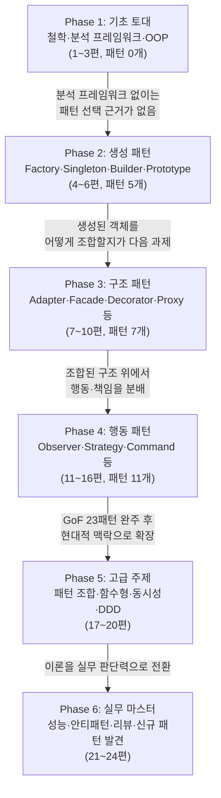

GoF 23개 패턴을 완전히 마스터하는 체계적인 학습 가이드입니다. 기초 철학부터 고급 응용까지 디자인 패턴의 모든 측면을 포괄하는 전문가 수준의 커리큘럼을 제공합니다.

## 프로젝트 개요

이 프로젝트는 디자인 패턴에 대한 깊이 있는 이해를 통해 독자를 **교수님 수준**의 전문가로 성장시키기 위한 체계적인 블로그 시리즈입니다.

총 **24편**의 글을 통해 **GoF 23개 패턴을 완전히 다루며**, 기초 철학부터 고급 응용까지 디자인 패턴의 모든 측면을 포괄합니다.

## 학습 목표

이 시리즈를 완주한 독자는 다음을 **할 수 있어야** 한다. 추상적인 이해가 아니라 구체적으로 검증 가능한 역량을 목표로 삼는다.

- 특정 설계 문제 앞에서 왜 패턴 A가 아니라 패턴 B가 적절한지 트레이드오프를 근거로 **설명할 수 있다**(예: State 대신 Strategy를 선택하는 기준).
- GoF 23개 패턴 각각의 의도(Intent)·구조·참여자를 원저 카탈로그와 대조해 **재현할 수 있다**.
- 실제 코드 리뷰에서 오·남용된 패턴(안티패턴)을 식별하고 리팩토링 방향을 **제시할 수 있다**.
- 기존 GoF 패턴으로 포착되지 않는 반복 문제를 발견했을 때, 이를 명세화해 **새로운 패턴으로 정의할 수 있다**.

## 1차 출처와 흔한 오개념

이 시리즈가 다루는 패턴 분류·정의는 Erich Gamma, Richard Helm, Ralph Johnson, John Vlissides(이른바 "Gang of Four")가 1994년 Addison-Wesley에서 출간한 *Design Patterns: Elements of Reusable Object-Oriented Software*(ISBN 0-201-63361-2)를 1차 출처로 삼는다. 이 책이 정의한 생성 5·구조 7·행동 11 = 23개 패턴 카탈로그가 4~16편의 뼈대이며, 17편 이후는 이 카탈로그를 현대적 맥락(함수형·동시성·DDD)으로 확장한다.

패턴을 처음 접하는 학습자가 특히 자주 빠지는 오해 네 가지를 먼저 짚는다.

- **"패턴을 안다 = 적용할 줄 안다"**: 패턴의 이름과 구조를 암기하는 것과, 실제 설계 문제 앞에서 어떤 패턴이 적절한지 판단하는 것은 서로 다른 역량이다. 이 시리즈가 이론 챕터와 별도로 실습 파일을 제공하는 이유가 여기에 있다.
- **"패턴은 많이 쓸수록 좋은 설계다"**: GoF 저자들도 서문에서 패턴을 "신중하게 선택할 도구"로 규정했지 목표로 삼지 않았다. 불필요한 패턴 적용은 오버엔지니어링으로 이어지며, 이 문제는 22편(안티패턴과 리팩토링)에서 정면으로 다룬다.
- **"GoF 패턴은 모든 언어에 원문 그대로 적용된다"**: 원저의 예제는 C++·Smalltalk 기반이다. 일급 함수·클로저·덕 타이핑을 지원하는 언어에서는 Strategy·Command 같은 일부 패턴이 별도 클래스 계층 없이 함수로 대체되기도 한다. 이 언어별 차이는 18편(함수형 프로그래밍과 디자인 패턴)에서 다룬다.
- **"안티패턴은 패턴의 반대말이다"**: 안티패턴은 애초에 나쁜 코드가 아니라, 처음엔 합리적 해법처럼 보였지만 반복 적용 시 문제를 일으키는 것으로 검증된 해법을 가리킨다. 정확한 정의는 22편에서 다시 다룬다.

## 커리큘럼 구성

여섯 개 Phase는 독립된 주제 모음이 아니라 순차적 의존 관계를 갖는다. 뒤 Phase는 앞 Phase가 확립한 개념·용어를 전제로 설명을 생략하므로, Phase를 건너뛰면 "왜 이 패턴을 선택하는가"에 대한 근거가 끊긴다. 다음 다이어그램은 이 의존 관계와 각 Phase가 다루는 패턴 수·전환의 이유를 함께 보여준다.

이 순서에는 두 가지 예외가 있다. 하나는 실습 파일로, 이론 편(4~13편, 20~24편)과 병렬로 제공되어 "안다"와 "구현할 수 있다" 사이의 간극을 즉시 검증하도록 설계했다. 다른 하나는 Phase 5(17~20편)로, GoF 23개 패턴 완주(1~16편)를 전제로 하는 응용 주제이므로 Phase 4를 끝내기 전에 진입하면 패턴 조합·함수형 대안 논의의 전제 자체가 성립하지 않는다.

### Phase 1: 기초 토대 구축 (1-3편)

패턴 자체보다 패턴을 낳은 사고방식을 먼저 다룬다. 역사적 맥락과 분석 프레임워크 없이 패턴 목록부터 외우면 "언제 왜 쓰는지" 판단력은 남지 않는다는 것이 이 순서의 근거다.

1. [디자인 패턴의 철학과 역사](/post/design-patterns/design-patterns-philosophy-and-history/)
2. [패턴 분석의 프레임워크](/post/design-patterns/pattern-analysis-framework/)
3. [객체지향 설계의 심층 이해](/post/design-patterns/oop-design-deep-understanding/)

### Phase 2: 생성 패턴 마스터하기 (4-6편)

GoF 23패턴 중 가장 논쟁적인 생성 패턴 5개(Factory Method, Abstract Factory, Singleton, Builder, Prototype)로 시작한다. 객체를 "어떻게 만들지"에 대한 결정이 이후 구조·행동 패턴의 전제가 되기 때문에 가장 먼저 배치했다.

4. [Factory 패턴군의 진화와 철학](/post/design-patterns/factory-patterns-evolution/)
5. [Singleton - 가장 논란이 많은 패턴](/post/design-patterns/singleton-controversial-pattern/)
6. [Builder와 Prototype의 깊은 이해](/post/design-patterns/builder-prototype-deep-understanding/)

### Phase 3: 구조 패턴의 예술 (7-10편)

클래스·객체를 조합해 더 큰 구조를 만드는 7개 패턴(Adapter, Facade, Decorator, Composite, Proxy, Bridge, Flyweight)을 다룬다. 생성 패턴으로 만든 객체를 실제로 어떻게 엮어 쓰는지가 이 Phase의 초점이다.

7. [Adapter와 Facade - 인터페이스 설계의 철학](/post/design-patterns/adapter-facade-interface-philosophy/)
8. [Decorator와 Composite - 재귀적 구조의 미학](/post/design-patterns/decorator-composite-recursive-beauty/)
9. [Proxy 패턴의 다면성](/post/design-patterns/proxy-pattern-multifaceted/)
10. [Bridge와 Flyweight - 분리와 효율성의 패턴](/post/design-patterns/bridge-flyweight-separation-efficiency/)

### Phase 4: 행동 패턴의 복잡성 (11-16편)

GoF 23패턴 중 가장 많은 11개(Observer, Strategy, State, Command, Chain of Responsibility, Template Method, Iterator, Interpreter, Mediator, Memento, Visitor)를 다루는 만큼 6편에 걸쳐 배치했다. 객체 간 책임과 통신 방식을 다루므로 구조 패턴에 대한 이해를 전제로 한다.

11. [Observer - 이벤트 기반 아키텍처의 시작](/post/design-patterns/observer-event-driven-architecture/)
12. [Strategy와 State - 알고리즘과 상태의 캡슐화](/post/design-patterns/strategy-state-algorithm-encapsulation/)
13. [Command와 Chain of Responsibility](/post/design-patterns/command-chain-responsibility/)
14. [Template Method와 Iterator의 깊이](/post/design-patterns/template-method-iterator-depth/)
15. [Interpreter와 Mediator - 해석과 중재의 패턴](/post/design-patterns/interpreter-mediator-parsing-coordination/)
16. [Memento와 Visitor - 상태 보존과 연산 분리](/post/design-patterns/memento-visitor-state-operation-separation/)

### Phase 5: 고급 주제와 현대적 관점 (17-20편)

GoF 23패턴을 모두 배운 뒤에야 의미가 있는 응용 주제들이다. 패턴 조합, 함수형 대안, 동시성·분산 환경, DDD 맥락에서 패턴이 어떻게 변형되는지를 다루므로 1-16편 완주를 전제로 한다.

17. [패턴의 조합과 상호작용](/post/design-patterns/pattern-combinations-interactions/)
18. [함수형 프로그래밍과 디자인 패턴](/post/design-patterns/functional-programming-design-patterns/)
19. [동시성과 분산 시스템에서의 패턴](/post/design-patterns/concurrency-distributed-patterns/)
20. [도메인 주도 설계(DDD)와 패턴](/post/design-patterns/ddd-design-patterns/)

### Phase 6: 실무 마스터 레벨 (21-24편)

지식을 실무 판단력으로 전환하는 마지막 단계다. 성능 분석, 안티패턴 리팩토링, 코드 리뷰, 새 패턴 발견까지 다루며, 시리즈 전체를 관통하는 목표인 "패턴을 아는 것"에서 "패턴으로 사고하는 것"으로의 전환을 이 4편이 완성한다.

21. [패턴의 성능 분석과 최적화](/post/design-patterns/pattern-performance-optimization/)
22. [안티패턴 식별과 리팩토링](/post/design-patterns/antipatterns-refactoring/)
23. [패턴을 활용한 코드 리뷰와 설계 리뷰](/post/design-patterns/pattern-code-review-design-review/)
24. [새로운 패턴 발견과 정의](/post/design-patterns/discovering-defining-new-patterns/)

## 각 글의 구성

패턴마다 이 일곱 요소를 반복하는 이유는 단순 형식 통일이 아니다. "글의 목표"와 "실습 과제"가 짝을 이뤄야 학습 목표가 검증 가능한 행동으로 이어지고, "깊이 있는 분석 포인트"와 "토론 주제"가 짝을 이뤄야 정의 암기에서 비판적 판단으로 넘어갈 수 있다. 예를 들어 5편(Singleton)에서는 "글의 목표"가 "멀티스레드 환경에서 안전한 Singleton을 구현할 수 있다"이고, 이와 짝을 이루는 "실습 과제"(`practice_05_singleton_pattern.md`)가 바로 6가지 구현 방식의 스레드 안전성을 직접 검증하는 과제이며, "토론 주제"는 "Singleton이 안티패턴으로 불리는 이유는 무엇인가"를 묻는다. 각 파일은 다음과 같은 구조로 구성된다.

- **글의 목표**: 해당 글에서 달성하고자 하는 학습 목표
- **주요 다룰 내용**: 핵심 토픽과 세부 내용
- **작성 가이드라인**: 톤앤매너, 구성 방식, 필수 포함 요소
- **깊이 있는 분석 포인트**: 전문가 수준의 통찰을 위한 심화 분석
- **실습 과제**: 실제 적용을 위한 실습 문제
- **토론 주제**: 비판적 사고를 위한 질문들
- **참고 자료**: 추가 학습을 위한 자료 목록

## 기대 효과

앞서 "학습 목표"가 검증 가능한 개별 역량을 나열했다면, 여기서는 그 역량들이 실무에서 어떤 형태로 드러나는지를 세 층위로 정리한다. 세 층위는 학습 순서와도 대응한다 — 사고의 변화는 Phase 1~2에서, 실무 역량은 Phase 3~4의 반복 적용을 통해, 고급 능력은 Phase 5~6을 마친 뒤에야 갖춰진다.

### 사고의 변화

Phase 1~2를 마친 시점에 기대하는 변화는 코드를 보는 관점 자체의 전환이다. 특정 구현 세부사항이 아니라 "이 문제가 어떤 설계 패턴의 형태를 띠는가"를 먼저 묻게 되며, 다음과 같은 장면으로 드러난다.

- 새 요구사항을 받았을 때 클래스 구조를 짜기 전에 먼저 "이건 생성·구조·행동 중 어느 쪽 문제인가"를 자문한다
- 왜 이 설계를 선택했는지 트레이드오프 근거를 함께 제시하지 않으면 스스로도 설득력이 없다고 느낀다
- 패턴을 정답으로 암기하지 않고, GoF 저자들처럼 "지금 이 문제에 이 패턴이 정말 필요한가"를 먼저 되묻는다

### 실무 역량

Phase 3~4에서 구조·행동 패턴을 반복적으로 다루고 실습 파일로 직접 구현해본 뒤에는, 앞서 "학습 목표"에서 나열한 역량들이 다음과 같은 구체적 장면으로 드러난다.

- 코드 리뷰에서 "이 분기문 대신 Strategy가 낫겠다"처럼 대안 패턴과 그 근거를 함께 제시한다
- 레거시 코드에서 반복되는 God Object·Spaghetti Code 같은 안티패턴을 먼저 식별한 뒤 리팩토링 순서를 정한다
- Singleton 사용 여부처럼 팀 내에서 반복되는 패턴 논쟁을 트레이드오프 근거로 정리해 합의를 이끈다

### 고급 능력

Phase 5~6에서 다루는 함수형·동시성·DDD 맥락과 21~24편의 성능·안티패턴·코드 리뷰까지 완주하면, 기존 패턴을 적용하는 수준을 넘어 아래와 같이 조직 차원의 설계 의사결정에 관여하게 된다.

- 팀에서 반복되는 설계 문제를 문서화된 패턴 후보로 제안하고 코드 리뷰 체크리스트에 반영한다
- 여러 패턴을 조합한 아키텍처(예: Event Sourcing + CQRS)의 트레이드오프를 설계 문서로 정리한다
- 주니어 개발자의 패턴 오·남용을 멘토링 과정에서 구체적 사례로 교정한다

## 사용법

이 시리즈는 처음부터 끝까지 순서대로 읽는 것을 기본으로 설계했지만, 이미 실무 경험이 있는 독자라면 아래 방식 중 자신의 상황에 맞는 진입점을 선택해도 무방하다. 다만 앞서 다이어그램으로 본 Phase 간 의존 관계는 그대로 적용되므로, 선택적 학습이나 참고 자료 활용 시에도 해당 패턴이 속한 Phase의 선행 챕터를 건너뛰지 않았는지 확인하는 것이 좋다.

1. **순차적 학습**: 1편부터 24편까지 순서대로 학습 — 처음 패턴을 접하는 경우 권장
2. **필요에 따른 선택적 학습**: 특정 패턴이나 주제만 선택하여 학습 — 단, 해당 패턴이 속한 Phase의 선행 챕터는 함께 읽어야 트레이드오프 근거가 유지된다
3. **참고 자료로 활용**: 실무에서 필요할 때 해당 패턴 글 참조 — 이미 GoF 원저나 유사 자료를 읽은 독자에게 적합
4. **GoF 패턴 완주**: 1-16편을 통해 GoF 23개 패턴 완전 학습 — 17편 이후 응용 주제 없이 원저 카탈로그만 원하는 경우
5. **실습 과제 수행**: 제공된 실습 파일을 통한 실무 역량 강화 — 이론만으로는 검증되지 않는 구현 역량을 확인하려는 경우

## 실습 파일 제공

앞서 "흔한 오해" 절에서 짚었듯 패턴을 안다는 것과 적용할 줄 안다는 것은 다른 역량이다. 그래서 15개 챕터(4~13편, 20~24편)는 이론 글과 별도로 실습 파일을 제공한다. 실습 파일은 이론 챕터가 설명한 구조를 그대로 재현하는 게 아니라, TODO로 비워진 핵심 로직을 직접 채워 넣도록 설계되어 있어 "구조를 안다"와 "구현할 수 있다" 사이의 간극을 드러낸다. 아래 목록은 생성·구조·행동·고급 주제·실무 마스터 5개 Phase 순서를 따른다.

### 생성 패턴 실습

세 실습 모두 "객체를 어떻게 만들지 캡슐화한다"는 공통 목표를 각기 다른 제약 조건에서 검증한다. Factory는 생성 대상의 종류가 늘어나는 상황, Singleton은 인스턴스 수를 강제로 하나로 제한하는 상황, Builder/Prototype은 생성 절차 자체가 복잡하거나 비용이 큰 상황을 다뤄, 이론 편에서 배운 "왜 이 패턴을 쓰는가"의 근거를 서로 다른 시나리오에서 반복 확인하도록 구성했다.

**[practice_04_factory_patterns.md](/post/design-patterns/factory-patterns-evolution-practice/)**는 Simple Factory부터 Factory Method, Abstract Factory까지 세 단계로 구현 난이도를 높이며, 결제 시스템과 게임 캐릭터 생성 시스템이라는 두 도메인에 적용해본 뒤 어노테이션 기반·함수형 스타일 같은 현대적 Factory 변형까지 다룬다.

**[practice_05_singleton_pattern.md](/post/design-patterns/singleton-controversial-pattern-practice/)**는 6가지 Singleton 구현 방식을 나란히 비교해 각 방식이 멀티스레드 환경에서 실제로 안전한지 직접 검증하도록 하고, 마지막에는 DI Container로 Singleton 자체를 대체하는 현대적 대안까지 구현해본다.

**[practice_06_builder_prototype.md](/post/design-patterns/builder-prototype-deep-understanding-practice/)**는 HTTP 클라이언트 Builder와 게임 캐릭터의 깊은 복사(Prototype) 시스템을 각각 구현한 뒤, 불변 객체와 Builder를 조합하는 실무 패턴으로 마무리한다.

### 구조 패턴 실습

구조 패턴 실습은 Phase 2에서 만든 객체를 "어떻게 엮어 더 큰 구조로 만드는가"에 집중한다. Adapter/Facade는 기존 코드와의 경계를 다루고, Decorator/Composite는 객체 자신의 확장·계층 구조를 다루며, Proxy와 Bridge·Flyweight는 접근 제어와 자원 효율이라는 서로 다른 축에서 구조 패턴을 적용한다. 네 실습을 순서대로 거치면 "구조를 조합한다"는 한 문장이 실제로는 최소 네 가지 다른 설계 문제를 가리킨다는 점이 드러난다.

**[practice_07_adapter_facade.md](/post/design-patterns/adapter-facade-interface-philosophy-practice/)**는 레거시 결제 시스템을 Adapter로 통합하고, 여러 서브시스템의 복잡성을 Facade로 감추는 E-commerce 시나리오, 그리고 다양한 데이터 소스를 통합하는 과제까지 세 갈래로 구성된다.

**[practice_08_decorator_composite.md](/post/design-patterns/decorator-composite-recursive-beauty-practice/)**는 음료 주문 시스템으로 Decorator를, 파일 시스템 모델링으로 Composite를 각각 구현한 뒤 두 패턴을 GUI 컴포넌트 계층 구조에서 함께 적용해본다.

**[practice_09_proxy_pattern.md](/post/design-patterns/proxy-pattern-multifaceted-practice/)**는 이미지 지연 로딩(Virtual Proxy), 파일 접근 제어(Protection Proxy), 원격 서비스 접근(Remote Proxy) 세 가지 Proxy 변형을 구현한 뒤, 동적 프록시와 AOP까지 다뤄 Proxy 하나로 묶이는 서로 다른 목적을 구분하게 한다.

**[practice_10_bridge_flyweight.md](/post/design-patterns/bridge-flyweight-separation-efficiency-practice/)**는 다중 플랫폼 파일 시스템을 Bridge로 구현하고 메모리 효율적인 텍스트 렌더링을 Flyweight로 구현한 뒤, 두 구현의 성능을 직접 비교·측정해 최적화 효과를 수치로 확인한다.

### 행동 패턴 실습

행동 패턴 실습 세 개는 "객체 간 책임을 어떻게 분배하는가"를 통지(Observer)·전환(Strategy/State)·처리 위임(Command/Chain of Responsibility)이라는 세 가지 통신 방식으로 나눠 다룬다. 이론 편이 11~16편 6편에 걸쳐 11개 패턴을 다루는 것과 달리 실습은 4~13편 범위의 5개 패턴만 다루므로, 나머지(Template Method·Iterator·Interpreter·Mediator·Memento·Visitor)는 이론 편의 코드 예제로 구현 감각을 대신 확인해야 한다.

**[practice_11_observer_event_driven.md](/post/design-patterns/observer-event-driven-architecture-practice/)**는 주식 시세 모니터링 시스템과 온도 센서 알림 시스템 두 사례로 Observer를 구현하며, 구독자가 계속 늘어나는 상황에서 메모리 누수를 방지하고 통지 성능을 최적화하는 과제까지 포함한다.

**[practice_12_strategy_state.md](/post/design-patterns/strategy-state-algorithm-encapsulation-practice/)**는 할인 전략 시스템으로 Strategy를, 자판기 상태 관리로 State를 각각 구현한 뒤 함수형 프로그래밍 스타일로 Strategy를 다시 구현해 클래스 기반 구현과 비교한다.

**[practice_13_command_chain.md](/post/design-patterns/command-chain-responsibility-practice/)**는 텍스트 에디터의 Undo/Redo를 Command로, 지원 요청 처리와 HTTP 미들웨어 체인을 Chain of Responsibility로 구현해 "요청을 객체로 캡슐화한다"와 "요청을 여러 처리자에게 넘긴다"는 서로 다른 문제를 한 실습에서 대비시킨다.

### 고급 주제 실습

Phase 5(17~20편)의 응용 주제 중 실습이 제공되는 것은 DDD 하나뿐이다. 패턴 조합·함수형 대안·동시성은 개념 자체가 특정 프레임워크·언어 런타임에 강하게 의존해 표준화된 실습 시나리오를 만들기 어렵지만, DDD는 도메인 모델링이라는 구체적인 산출물로 검증할 수 있어 실습으로 다룬다.

**[practice_20_ddd_design_patterns.md](/post/design-patterns/ddd-design-patterns-practice/)**는 도서관 도메인을 모델링하는 것으로 시작해, 같은 도메인을 Event Sourcing으로 다시 구현하고 CQRS로 조회·명령 책임을 분리해, DDD 개념 하나가 세 가지 서로 다른 구현 기법으로 확장되는 과정을 보여준다.

### 실무 마스터 실습

Phase 6(21~24편)은 시리즈 전체의 목표인 "패턴으로 사고하는 것"을 검증하는 마지막 단계이므로, 4개 챕터 모두 실습을 제공한다. 성능 최적화는 패턴 적용의 대가를 수치로 확인하고, 안티패턴 리팩토링과 코드 리뷰는 이미 존재하는 나쁜 설계를 패턴으로 교정하는 역방향 작업이며, 새로운 패턴 발견은 기존 카탈로그에 없는 문제를 스스로 명세화하는 가장 높은 수준의 과제다.

**[practice_21_pattern_performance_optimization.md](/post/design-patterns/pattern-performance-optimization-practice/)**는 JMH로 마이크로 벤치마크를 직접 작성해 Object Pool과 Flyweight의 메모리 최적화 효과를 측정하고, 나아가 JIT 최적화가 패턴 선택과 어떤 상관관계를 갖는지까지 분석한다.

**[practice_22_antipatterns.md](/post/design-patterns/antipatterns-refactoring-practice/)**는 God Object를 단일 책임 원칙에 따라 리팩토링하고 Spaghetti Code를 Command Pattern으로 정리하는 두 실전 리팩토링을 거친 뒤, 이런 안티패턴을 자동으로 탐지하는 도구까지 구현해본다.

**[practice_23_code_review.md](/post/design-patterns/pattern-code-review-design-review-practice/)**는 Observer 패턴 리뷰 체크리스트를 작성하고 Strategy 패턴 자동 검증 도구를 구현한 뒤, 이를 팀 리뷰 프로세스 개선 계획으로 확장한다.

**[practice_24_discovering_new_patterns.md](/post/design-patterns/discovering-defining-new-patterns-practice/)**는 분산 데이터 일관성 문제에서 기존 GoF 카탈로그에 없는 반복 구조를 발견하는 것으로 시작해, 이를 완전한 패턴 명세서로 문서화하고 커뮤니티 피드백으로 그 효과성을 검증하는 시리즈 전체의 최종 과제다.

### 실습 활용 가이드

실습 파일은 순서를 지키지 않으면 효과가 떨어진다. TODO를 채우기 전에 이론 챕터를 읽지 않으면 "정답을 몰라서" 막히는 것과 "패턴 자체를 몰라서" 막히는 것을 구분할 수 없고, 벤치마크·코드 리뷰 단계를 건너뛰면 구현이 동작한다는 것과 그 구현이 좋은 설계라는 것의 차이를 확인할 기회를 놓친다.

1. **이론 학습 후 실습**: 각 챕터를 학습한 후 해당 실습 과제 수행
2. **단계별 구현**: TODO 주석을 따라 점진적으로 구현
3. **성능 측정**: 제공된 벤치마크 코드로 패턴 효과 검증
4. **코드 리뷰**: 완성된 코드를 동료와 함께 리뷰
5. **실무 적용**: 실제 프로젝트에 학습한 패턴 적용

## GoF 23개 패턴 완전 커버리지

앞서 Phase 다이어그램이 시리즈를 여섯 단계의 흐름으로 보여줬다면, 아래 표는 그 흐름을 GoF 원저의 23개 패턴 단위로 다시 펼쳐 "이 패턴이 몇 편에서 다뤄지는가"를 즉시 찾아볼 수 있게 한 참조표다. 분류 순서(생성→구조→행동)는 Phase 2→3→4 순서와 그대로 대응하므로, 특정 패턴만 찾아보러 온 독자도 이 표를 통해 자신이 건너뛴 선행 Phase가 있는지 확인할 수 있다.

### GoF 패턴 종합 분류표

| 분류 | 패턴명 | 핵심 목적 | 다루는 편 |
|------|--------|----------|----------|
| **생성 패턴** | Factory Method | 객체 생성을 서브클래스에 위임 | 4편 |
| | Abstract Factory | 관련 객체 군을 일관성 있게 생성 | 4편 |
| | Singleton | 인스턴스를 하나만 생성하고 전역 접근 제공 | 5편 |
| | Builder | 복잡한 객체를 단계별로 생성 | 6편 |
| | Prototype | 기존 객체를 복제하여 새 객체 생성 | 6편 |
| **구조 패턴** | Adapter | 호환되지 않는 인터페이스를 연결 | 7편 |
| | Facade | 복잡한 서브시스템에 단순한 인터페이스 제공 | 7편 |
| | Decorator | 객체에 동적으로 새로운 책임 추가 | 8편 |
| | Composite | 객체들을 트리 구조로 구성하여 부분-전체 계층 표현 | 8편 |
| | Proxy | 다른 객체에 대한 접근을 제어하는 대리자 | 9편 |
| | Bridge | 추상화와 구현을 분리하여 독립적 변경 | 10편 |
| | Flyweight | 많은 수의 유사 객체를 효율적으로 공유 | 10편 |
| **행동 패턴** | Observer | 객체 상태 변경 시 의존 객체들에 자동 통지 | 11편 |
| | Strategy | 알고리즘을 캡슐화하여 교환 가능하게 만듦 | 12편 |
| | State | 객체의 상태에 따라 행동 변경 | 12편 |
| | Command | 요청을 객체로 캡슐화하여 매개변수화 | 13편 |
| | Chain of Responsibility | 요청을 처리할 기회를 여러 객체에 부여 | 13편 |
| | Template Method | 알고리즘 골격을 정의하고 일부 단계를 서브클래스에 위임 | 14편 |
| | Iterator | 컬렉션 요소를 순차적으로 접근하는 방법 제공 | 14편 |
| | Interpreter | 언어의 문법을 정의하고 해석 | 15편 |
| | Mediator | 객체들 간의 상호작용을 캡슐화 | 15편 |
| | Memento | 객체의 내부 상태를 저장하고 복원 | 16편 |
| | Visitor | 객체 구조를 변경하지 않고 새로운 연산 추가 | 16편 |

### 패턴 선택 가이드

추천 패턴이 항상 정답은 아니다. 아래 표의 "트레이드오프" 열은 추천 패턴을 선택했을 때 감수해야 하는 대가와, 대안 패턴이 그 대가를 어떻게 다르게 치르는지를 함께 보여준다. 실무에서는 이 트레이드오프가 팀의 숙련도·코드베이스 규모·변경 빈도에 따라 뒤바뀔 수 있으므로, 표는 출발점일 뿐 최종 판단은 각 챕터의 "판단 기준" 절을 참고해 내려야 한다.

| 해결하려는 문제 | 추천 패턴 | 대안 패턴 | 트레이드오프 |
|----------------|----------|----------|--------------|
| 객체 생성 로직이 복잡함 | Factory Method | Abstract Factory, Builder | Factory Method는 서브클래스가 늘어나고, Abstract Factory는 제품군을 추가할 때 인터페이스 전체를 고쳐야 하며, Builder는 클래스 수가 늘지만 생성 단계별 검증이 가능하다 |
| 전역적으로 하나의 인스턴스만 필요 | Singleton | 의존성 주입 컨테이너 | Singleton은 전역 상태로 테스트 격리가 어렵고 멀티스레드 동기화 비용이 들지만, DI 컨테이너는 프레임워크 의존과 부트스트랩 복잡도가 늘어난다 |
| 기존 클래스와 인터페이스가 맞지 않음 | Adapter | Facade, Proxy | Adapter는 어댑터 클래스가 계속 늘어나고, Facade는 세부 제어를 포기해야 하며, Proxy는 접근 제어에는 강하지만 인터페이스 불일치 자체는 해결하지 못한다 |
| 객체에 기능을 동적으로 추가해야 함 | Decorator | Strategy, Proxy | Decorator는 래핑 계층이 늘수록 디버깅이 어려워지고, Strategy는 런타임 교체는 되지만 기능 조합은 안 되며, Proxy는 조합보다 접근 제어에 특화되어 있다 |
| 상태에 따라 객체 행동이 바뀌어야 함 | State | Strategy | State는 상태 전이 로직이 각 상태 클래스에 분산돼 전체 흐름 추적이 어려워지고, Strategy는 전이 개념이 없어 상태 기계 자체를 표현하지 못한다 |
| 알고리즘을 런타임에 교체해야 함 | Strategy | Template Method | Strategy는 클래스 수가 늘고 클라이언트가 구체 전략을 알아야 하지만, Template Method는 상속 기반이라 런타임 교체가 불가능하다 |
| 요청을 취소/재실행해야 함 | Command | Memento | Command는 실행 취소 로직을 커맨드마다 직접 구현해야 하고, Memento는 상태 전체를 저장해 메모리 비용이 크다 |
| 복잡한 객체 구조를 순회해야 함 | Iterator | Visitor | Iterator는 순회 방식을 캡슐화하지만 순회 중 연산 추가가 어렵고, Visitor는 연산 추가는 쉽지만 구조 자체가 자주 바뀌면 방문자 인터페이스를 계속 고쳐야 한다 |
| 객체 간 결합도를 낮추고 싶음 | Observer, Mediator | Event Bus | Observer는 통지 순서·실패 전파가 암묵적이 되고, Mediator는 중재자 자체가 God Object로 비대해질 위험이 있으며, Event Bus는 느슨한 결합의 대가로 실행 흐름 추적이 어려워진다 |

### 패턴 분류별 특성 비교

| 분류 | 주요 초점 | 핵심 원칙 | 대표 패턴 |
|------|----------|----------|----------|
| 생성 패턴 | 객체 생성 방식 | 생성 로직의 캡슐화 | Factory Method, Builder |
| 구조 패턴 | 클래스/객체 조합 | 인터페이스 단순화, 기능 확장 | Adapter, Decorator |
| 행동 패턴 | 객체 간 책임 분배 | 느슨한 결합, 책임 분리 | Observer, Strategy |

세 분류의 순서 자체가 설계 결정의 순서를 반영한다. 객체를 어떻게 만들지(생성)를 정하지 않고는 무엇을 조합할지(구조)를 논할 수 없고, 구조가 안정되지 않은 상태에서 책임을 분배(행동)하면 나중에 구조를 바꿀 때 행동 패턴까지 함께 무너진다. 이 순서는 앞서 Phase 다이어그램의 2→3→4 흐름과 동일하며, GoF 원저가 채택한 분류 기준이기도 하다.

---

**"디자인 패턴을 아는 것과 디자인 패턴으로 사고하는 것은 다르다."**

이 시리즈를 통해 진정한 패턴 마스터가 되어보세요!
