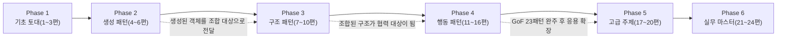

GoF 23개 패턴을 완전히 마스터하는 체계적인 학습 가이드입니다. 기초 철학부터 고급 응용까지 디자인 패턴의 모든 측면을 포괄하는 전문가 수준의 커리큘럼을 제공합니다.

## 프로젝트 개요

이 프로젝트는 디자인 패턴에 대한 깊이 있는 이해를 통해 독자를 **교수님 수준**의 전문가로 성장시키기 위한 체계적인 블로그 시리즈입니다.

총 **24편**의 글을 통해 **GoF 23개 패턴을 완전히 다루며**, 기초 철학부터 고급 응용까지 디자인 패턴의 모든 측면을 포괄합니다.

## 학습 목표

이 시리즈를 완주한 독자는 다음을 **할 수 있어야** 한다. 추상적인 이해가 아니라 구체적으로 검증 가능한 역량을 목표로 삼는다.

- 특정 설계 문제 앞에서 왜 패턴 A가 아니라 패턴 B가 적절한지 트레이드오프를 근거로 **설명할 수 있다**(예: State 대신 Strategy를 선택하는 기준).
- GoF 23개 패턴 각각의 의도(Intent)·구조·참여자를 원저 카탈로그와 대조해 **재현할 수 있다**.
- 실제 코드 리뷰에서 오·남용된 패턴(안티패턴)을 식별하고 리팩토링 방향을 **제시할 수 있다**.
- 기존 GoF 패턴으로 포착되지 않는 반복 문제를 발견했을 때, 이를 명세화해 **새로운 패턴으로 정의할 수 있다**.

## 1차 출처와 흔한 오개념

이 시리즈가 다루는 패턴 분류·정의는 Erich Gamma, Richard Helm, Ralph Johnson, John Vlissides(이른바 "Gang of Four")가 1994년 Addison-Wesley에서 출간한 *Design Patterns: Elements of Reusable Object-Oriented Software*(ISBN 0-201-63361-2)를 1차 출처로 삼는다. 이 책이 정의한 생성 5·구조 7·행동 11 = 23개 패턴 카탈로그가 4~16편의 뼈대이며, 17편 이후는 이 카탈로그를 현대적 맥락(함수형·동시성·DDD)으로 확장한다.

패턴을 처음 접하는 학습자가 특히 자주 빠지는 오해 네 가지를 먼저 짚는다.

- **"패턴을 안다 = 적용할 줄 안다"**: 패턴의 이름과 구조를 암기하는 것과, 실제 설계 문제 앞에서 어떤 패턴이 적절한지 판단하는 것은 서로 다른 역량이다. 이 시리즈가 이론 챕터와 별도로 실습 파일을 제공하는 이유가 여기에 있다.
- **"패턴은 많이 쓸수록 좋은 설계다"**: GoF 저자들도 서문에서 패턴을 "신중하게 선택할 도구"로 규정했지 목표로 삼지 않았다. 불필요한 패턴 적용은 오버엔지니어링으로 이어지며, 이 문제는 22편(안티패턴과 리팩토링)에서 정면으로 다룬다.
- **"GoF 패턴은 모든 언어에 원문 그대로 적용된다"**: 원저의 예제는 C++·Smalltalk 기반이다. 일급 함수·클로저·덕 타이핑을 지원하는 언어에서는 Strategy·Command 같은 일부 패턴이 별도 클래스 계층 없이 함수로 대체되기도 한다. 이 언어별 차이는 18편(함수형 프로그래밍과 디자인 패턴)에서 다룬다.
- **"안티패턴은 패턴의 반대말이다"**: 안티패턴은 애초에 나쁜 코드가 아니라, 처음엔 합리적 해법처럼 보였지만 반복 적용 시 문제를 일으키는 것으로 검증된 해법을 가리킨다. 정확한 정의는 22편에서 다시 다룬다.

## 커리큘럼 구성

### Phase 1: 기초 토대 구축 (1-3편)

패턴 자체보다 패턴을 낳은 사고방식을 먼저 다룬다. 역사적 맥락과 분석 프레임워크 없이 패턴 목록부터 외우면 "언제 왜 쓰는지" 판단력은 남지 않는다는 것이 이 순서의 근거다.

1. [디자인 패턴의 철학과 역사](/post/design-patterns/design-patterns-philosophy-and-history/)
2. [패턴 분석의 프레임워크](/post/design-patterns/pattern-analysis-framework/)
3. [객체지향 설계의 심층 이해](/post/design-patterns/oop-design-deep-understanding/)

### Phase 2: 생성 패턴 마스터하기 (4-6편)

GoF 23패턴 중 가장 논쟁적인 생성 패턴 5개(Factory Method, Abstract Factory, Singleton, Builder, Prototype)로 시작한다. 객체를 "어떻게 만들지"에 대한 결정이 이후 구조·행동 패턴의 전제가 되기 때문에 가장 먼저 배치했다.

4. [Factory 패턴군의 진화와 철학](/post/design-patterns/factory-patterns-evolution/)
5. [Singleton - 가장 논란이 많은 패턴](/post/design-patterns/singleton-controversial-pattern/)
6. [Builder와 Prototype의 깊은 이해](/post/design-patterns/builder-prototype-deep-understanding/)

### Phase 3: 구조 패턴의 예술 (7-10편)

클래스·객체를 조합해 더 큰 구조를 만드는 7개 패턴(Adapter, Facade, Decorator, Composite, Proxy, Bridge, Flyweight)을 다룬다. 생성 패턴으로 만든 객체를 실제로 어떻게 엮어 쓰는지가 이 Phase의 초점이다.

7. [Adapter와 Facade - 인터페이스 설계의 철학](/post/design-patterns/adapter-facade-interface-philosophy/)
8. [Decorator와 Composite - 재귀적 구조의 미학](/post/design-patterns/decorator-composite-recursive-beauty/)
9. [Proxy 패턴의 다면성](/post/design-patterns/proxy-pattern-multifaceted/)
10. [Bridge와 Flyweight - 분리와 효율성의 패턴](/post/design-patterns/bridge-flyweight-separation-efficiency/)

### Phase 4: 행동 패턴의 복잡성 (11-16편)

GoF 23패턴 중 가장 많은 11개(Observer, Strategy, State, Command, Chain of Responsibility, Template Method, Iterator, Interpreter, Mediator, Memento, Visitor)를 다루는 만큼 6편에 걸쳐 배치했다. 객체 간 책임과 통신 방식을 다루므로 구조 패턴에 대한 이해를 전제로 한다.

11. [Observer - 이벤트 기반 아키텍처의 시작](/post/design-patterns/observer-event-driven-architecture/)
12. [Strategy와 State - 알고리즘과 상태의 캡슐화](/post/design-patterns/strategy-state-algorithm-encapsulation/)
13. [Command와 Chain of Responsibility](/post/design-patterns/command-chain-responsibility/)
14. [Template Method와 Iterator의 깊이](/post/design-patterns/template-method-iterator-depth/)
15. [Interpreter와 Mediator - 해석과 중재의 패턴](/post/design-patterns/interpreter-mediator-parsing-coordination/)
16. [Memento와 Visitor - 상태 보존과 연산 분리](/post/design-patterns/memento-visitor-state-operation-separation/)

### Phase 5: 고급 주제와 현대적 관점 (17-20편)

GoF 23패턴을 모두 배운 뒤에야 의미가 있는 응용 주제들이다. 패턴 조합, 함수형 대안, 동시성·분산 환경, DDD 맥락에서 패턴이 어떻게 변형되는지를 다루므로 1-16편 완주를 전제로 한다.

17. [패턴의 조합과 상호작용](/post/design-patterns/pattern-combinations-interactions/)
18. [함수형 프로그래밍과 디자인 패턴](/post/design-patterns/functional-programming-design-patterns/)
19. [동시성과 분산 시스템에서의 패턴](/post/design-patterns/concurrency-distributed-patterns/)
20. [도메인 주도 설계(DDD)와 패턴](/post/design-patterns/ddd-design-patterns/)

### Phase 6: 실무 마스터 레벨 (21-24편)

지식을 실무 판단력으로 전환하는 마지막 단계다. 성능 분석, 안티패턴 리팩토링, 코드 리뷰, 새 패턴 발견까지 다루며, 시리즈 전체를 관통하는 목표인 "패턴을 아는 것"에서 "패턴으로 사고하는 것"으로의 전환을 이 4편이 완성한다.

21. [패턴의 성능 분석과 최적화](/post/design-patterns/pattern-performance-optimization/)
22. [안티패턴 식별과 리팩토링](/post/design-patterns/antipatterns-refactoring/)
23. [패턴을 활용한 코드 리뷰와 설계 리뷰](/post/design-patterns/pattern-code-review-design-review/)
24. [새로운 패턴 발견과 정의](/post/design-patterns/discovering-defining-new-patterns/)

### Phase 간 의존관계

여섯 개 Phase는 임의로 나눈 챕터 묶음이 아니라, 앞 Phase의 산출물이 다음 Phase의 전제 지식이 되는 단방향 의존 사슬이다. Phase 1(기초 토대)이 정의하는 분석 프레임워크와 OOP 원칙은 이후 모든 패턴 학습에서 반복 사용되는 공통 어휘이므로 가장 먼저 온다. Phase 2(생성 패턴)는 "객체를 어떻게 만들 것인가"를 다루는데, Phase 3(구조 패턴)이 다루는 "만들어진 객체를 어떻게 조합할 것인가"는 이미 생성된 객체의 존재를 전제하므로 Phase 2 없이는 성립하지 않는다. 같은 논리로 Phase 4(행동 패턴)는 조합된 구조 안에서 객체들이 어떻게 협력·통신하는지를 다루므로 Phase 3의 구조를 전제로 삼는다. Phase 5(고급 주제)와 Phase 6(실무 마스터)은 GoF 23패턴(Phase 2~4) 전체를 완주한 뒤에야 의미가 있는 응용·평가 단계다 — 패턴 조합이나 안티패턴 판단은 개별 패턴을 모르는 상태에서는 논할 대상 자체가 성립하지 않기 때문이다.

이 의존 관계를 건너뛰고 예컨대 Phase 4부터 시작하면, Observer·Strategy 같은 패턴의 구조는 이해하더라도 "왜 Decorator가 아니라 Strategy로 풀어야 하는가" 같은 Phase 3와의 경계 판단은 흔들린다. 아래 다이어그램은 이 선형 의존과, Phase 2~4 사이에 실제로 작동하는 인과 관계(점선)를 함께 보여준다.

## 각 글의 구성

각 파일은 다음과 같은 구조로 구성되어 있습니다:

- **글의 목표**: 해당 글에서 달성하고자 하는 학습 목표
- **주요 다룰 내용**: 핵심 토픽과 세부 내용
- **작성 가이드라인**: 톤앤매너, 구성 방식, 필수 포함 요소
- **깊이 있는 분석 포인트**: 교수님 수준의 통찰을 위한 심화 분석
- **실습 과제**: 실제 적용을 위한 실습 문제
- **토론 주제**: 비판적 사고를 위한 질문들
- **참고 자료**: 추가 학습을 위한 자료 목록

## 기대 효과

앞서 "학습 목표"가 검증 가능한 개별 역량을 나열했다면, 여기서는 그 역량들이 실무에서 어떤 형태로 드러나는지를 세 층위로 정리한다.

### 사고의 변화

Phase 1의 분석 프레임워크와 Phase 5의 패턴 조합·함수형 대안 학습을 거치면, 요구사항을 곧바로 코드로 옮기기 전에 "이 문제가 생성·구조·행동 중 어느 축에 속하는가"를 먼저 분류하는 습관이 생긴다. 이 습관은 특정 패턴 하나를 암기하는 것과 별개로, 처음 보는 문제에도 적용 가능한 일반화된 사고 절차라는 점에서 개별 패턴 지식보다 오래간다.

- 문제를 패턴 관점에서 바라보는 시각
- 설계 결정에 대한 깊은 이해와 판단력
- 비판적이고 창조적인 설계 사고

### 실무 역량

Phase 2~4에서 익힌 개별 패턴 지식은 Phase 6(21~23편)에서 실제 코드 리뷰·리팩토링 절차로 전환된다. 패턴 이름을 아는 것과, 동료의 PR에서 "이 부분은 Strategy로 바꾸면 테스트가 쉬워진다"고 근거를 들어 제안하는 것은 서로 다른 역량이며, 후자가 이 시리즈가 목표로 하는 실무 역량이다.

- 적절한 패턴 선택과 적용 능력
- 레거시 코드 개선과 리팩토링 전략
- 팀 협업과 코드 리뷰 역량

### 고급 능력

Phase 6의 마지막 편(24편)은 GoF 카탈로그에 없는 반복 문제를 스스로 패턴으로 명세화하는 역량을 다룬다. 이는 바로 앞 22편이 다루는 "기존 패턴을 식별하고 안티패턴을 걷어내는 능력"의 역방향 훈련에 해당하며, 패턴을 암기 대상이 아니라 사고 도구로 다루는 이 시리즈의 마지막 단계다.

- 새로운 패턴 발견과 정의
- 아키텍처 설계와 패턴 조합
- 기술 리더십과 멘토링 능력

## 사용법

이 시리즈는 처음부터 끝까지 순서대로 읽는 것을 기본으로 설계했지만, 이미 실무 경험이 있는 독자라면 아래 방식 중 자신의 상황에 맞는 진입점을 선택해도 무방하다.

1. **순차적 학습**: 1편부터 24편까지 순서대로 학습
2. **필요에 따른 선택적 학습**: 특정 패턴이나 주제만 선택하여 학습
3. **참고 자료로 활용**: 실무에서 필요할 때 해당 패턴 글 참조
4. **GoF 패턴 완주**: 1-16편을 통해 GoF 23개 패턴 완전 학습
5. **실습 과제 수행**: 제공된 실습 파일을 통한 실무 역량 강화

## 실습 파일 제공

앞서 "흔한 오해" 절에서 짚었듯 패턴을 안다는 것과 적용할 줄 안다는 것은 다른 역량이다. 그래서 15개 챕터(4~13편, 20~24편)는 이론 글과 별도로 실습 파일을 제공한다. 실습 파일은 이론 챕터가 설명한 구조를 그대로 재현하는 게 아니라, TODO로 비워진 핵심 로직을 직접 채워 넣도록 설계되어 있어 "구조를 안다"와 "구현할 수 있다" 사이의 간극을 드러낸다. 아래 목록은 생성·구조·행동·고급 주제·실무 마스터 5개 Phase 순서를 따른다.

### 생성 패턴 실습
- **[practice_04_factory_patterns.md](/post/design-patterns/factory-patterns-evolution-practice/)** - Factory 패턴군 실습
  - Simple Factory, Factory Method, Abstract Factory 구현
  - 결제 시스템과 게임 캐릭터 생성 시스템
  - 현대적 Factory (어노테이션 기반, 함수형 스타일)

- **[practice_05_singleton_pattern.md](/post/design-patterns/singleton-controversial-pattern-practice/)** - Singleton 패턴 실습
  - 6가지 Singleton 구현 방식 비교
  - 멀티스레드 환경 안전성 검증
  - DI Container를 통한 현대적 대안

- **[practice_06_builder_prototype.md](/post/design-patterns/builder-prototype-deep-understanding-practice/)** - Builder & Prototype 실습
  - HTTP 클라이언트 Builder 구현
  - 게임 캐릭터 깊은 복사 시스템
  - 불변 객체와 Builder 조합

### 구조 패턴 실습
- **[practice_07_adapter_facade.md](/post/design-patterns/adapter-facade-interface-philosophy-practice/)** - Adapter & Facade 실습
  - 레거시 결제 시스템 통합 Adapter
  - E-commerce 복잡성 숨기는 Facade
  - 다양한 데이터 소스 통합

- **[practice_08_decorator_composite.md](/post/design-patterns/decorator-composite-recursive-beauty-practice/)** - Decorator & Composite 실습
  - 음료 주문 시스템 (Decorator)
  - 파일 시스템 모델링 (Composite)
  - GUI 컴포넌트 계층 구조

- **[practice_09_proxy_pattern.md](/post/design-patterns/proxy-pattern-multifaceted-practice/)** - Proxy 패턴 실습
  - 이미지 지연 로딩 (Virtual Proxy)
  - 파일 접근 제어 (Protection Proxy)
  - 원격 서비스 접근 (Remote Proxy)
  - 동적 프록시와 AOP 구현

- **[practice_10_bridge_flyweight.md](/post/design-patterns/bridge-flyweight-separation-efficiency-practice/)** - Bridge와 Flyweight 패턴 실습
  - 다중 플랫폼 파일 시스템 구현 (Bridge)
  - 메모리 효율적인 텍스트 렌더링 (Flyweight)
  - 성능 비교 및 최적화 분석

### 행동 패턴 실습
- **[practice_11_observer_event_driven.md](/post/design-patterns/observer-event-driven-architecture-practice/)** - Observer 패턴 실습
  - 주식 시세 모니터링 시스템
  - 온도 센서 알림 시스템
  - 메모리 누수 방지 및 성능 최적화

- **[practice_12_strategy_state.md](/post/design-patterns/strategy-state-algorithm-encapsulation-practice/)** - Strategy & State 패턴 실습
  - 할인 전략 시스템 (Strategy)
  - 자판기 상태 관리 (State)
  - 함수형 프로그래밍 스타일 Strategy

- **[practice_13_command_chain.md](/post/design-patterns/command-chain-responsibility-practice/)** - Command & Chain of Responsibility 실습
  - 텍스트 에디터 Undo/Redo 시스템
  - 지원 요청 처리 체인
  - HTTP 미들웨어 체인 구현

### 고급 주제 실습
- **[practice_20_ddd_design_patterns.md](/post/design-patterns/ddd-design-patterns-practice/)** - DDD와 디자인 패턴 실습
  - 도서관 도메인 모델링
  - Event Sourcing을 통한 주문 처리 시스템
  - CQRS 패턴 구현

### 실무 마스터 실습
- **[practice_21_pattern_performance_optimization.md](/post/design-patterns/pattern-performance-optimization-practice/)** - 성능 최적화 실습
  - JMH를 활용한 마이크로 벤치마크
  - Object Pool과 Flyweight 메모리 최적화
  - JIT 최적화와 패턴의 상관관계 분석

- **[practice_22_antipatterns.md](/post/design-patterns/antipatterns-refactoring-practice/)** - 안티패턴 리팩토링 실습
  - God Object 리팩토링 (단일 책임 원칙 적용)
  - Command Pattern으로 Spaghetti Code 정리
  - 안티패턴 자동 탐지기 구현

- **[practice_23_code_review.md](/post/design-patterns/pattern-code-review-design-review-practice/)** - 패턴 기반 코드 리뷰 실습
  - Observer 패턴 리뷰 체크리스트 작성
  - Strategy 패턴 자동 검증 도구 구현
  - 팀 리뷰 프로세스 개선 계획

- **[practice_24_discovering_new_patterns.md](/post/design-patterns/discovering-defining-new-patterns-practice/)** - 새로운 패턴 발견 실습
  - 분산 데이터 일관성 문제에서 패턴 발견
  - 완전한 패턴 명세서 작성
  - 패턴 효과성 검증 및 커뮤니티 피드백 수집

### 실습 활용 가이드

1. **이론 학습 후 실습**: 각 챕터를 학습한 후 해당 실습 과제 수행
2. **단계별 구현**: TODO 주석을 따라 점진적으로 구현
3. **성능 측정**: 제공된 벤치마크 코드로 패턴 효과 검증
4. **코드 리뷰**: 완성된 코드를 동료와 함께 리뷰
5. **실무 적용**: 실제 프로젝트에 학습한 패턴 적용

## GoF 23개 패턴 완전 커버리지

### GoF 패턴 종합 분류표

| 분류 | 패턴명 | 핵심 목적 | 다루는 편 |
|------|--------|----------|----------|
| **생성 패턴** | Factory Method | 객체 생성을 서브클래스에 위임 | 4편 |
| | Abstract Factory | 관련 객체 군을 일관성 있게 생성 | 4편 |
| | Singleton | 인스턴스를 하나만 생성하고 전역 접근 제공 | 5편 |
| | Builder | 복잡한 객체를 단계별로 생성 | 6편 |
| | Prototype | 기존 객체를 복제하여 새 객체 생성 | 6편 |
| **구조 패턴** | Adapter | 호환되지 않는 인터페이스를 연결 | 7편 |
| | Facade | 복잡한 서브시스템에 단순한 인터페이스 제공 | 7편 |
| | Decorator | 객체에 동적으로 새로운 책임 추가 | 8편 |
| | Composite | 객체들을 트리 구조로 구성하여 부분-전체 계층 표현 | 8편 |
| | Proxy | 다른 객체에 대한 접근을 제어하는 대리자 | 9편 |
| | Bridge | 추상화와 구현을 분리하여 독립적 변경 | 10편 |
| | Flyweight | 많은 수의 유사 객체를 효율적으로 공유 | 10편 |
| **행동 패턴** | Observer | 객체 상태 변경 시 의존 객체들에 자동 통지 | 11편 |
| | Strategy | 알고리즘을 캡슐화하여 교환 가능하게 만듦 | 12편 |
| | State | 객체의 상태에 따라 행동 변경 | 12편 |
| | Command | 요청을 객체로 캡슐화하여 매개변수화 | 13편 |
| | Chain of Responsibility | 요청을 처리할 기회를 여러 객체에 부여 | 13편 |
| | Template Method | 알고리즘 골격을 정의하고 일부 단계를 서브클래스에 위임 | 14편 |
| | Iterator | 컬렉션 요소를 순차적으로 접근하는 방법 제공 | 14편 |
| | Interpreter | 언어의 문법을 정의하고 해석 | 15편 |
| | Mediator | 객체들 간의 상호작용을 캡슐화 | 15편 |
| | Memento | 객체의 내부 상태를 저장하고 복원 | 16편 |
| | Visitor | 객체 구조를 변경하지 않고 새로운 연산 추가 | 16편 |

### 패턴 선택 가이드

위 분류표가 각 패턴의 정의를 보여준다면, 아래 표는 실무에서 실제로 부딪히는 선택의 순간을 다룬다. 같은 문제를 두 가지 패턴으로 풀 수 있을 때 어느 쪽을 골라야 하는지는 "어느 쪽이 더 좋은가"가 아니라 "무엇을 얻는 대신 무엇을 포기하는가"의 문제다. 트레이드오프 열은 추천 패턴을 선택했을 때 얻는 이득과 치르는 비용을, 대안 패턴을 선택했을 때의 이득·비용과 대비해 명시한다.

| 해결하려는 문제 | 추천 패턴 | 대안 패턴 | 트레이드오프 |
|----------------|----------|----------|-------------|
| 객체 생성 로직이 복잡함 | Factory Method | Abstract Factory, Builder | Factory Method는 새 제품군마다 서브클래스가 늘어나는 대신 OCP를 지킨다. Abstract Factory는 제품군 간 일관성을 얻지만 제품을 하나 추가할 때마다 모든 구체 팩토리를 수정해야 한다. |
| 전역적으로 하나의 인스턴스만 필요 | Singleton | 의존성 주입 컨테이너 | Singleton은 전역 접근의 편의성을 얻는 대신 테스트 시 목(mock) 교체가 어려워지고 숨은 의존성을 만든다. DI 컨테이너는 초기 설정 비용이 더 들지만 결합도를 낮추고 테스트 대체가 쉽다. |
| 기존 클래스와 인터페이스가 맞지 않음 | Adapter | Facade, Proxy | Adapter는 기존 코드를 건드리지 않는 대신 어댑터 계층이 하나 더 늘어난다. Facade는 하위 시스템 전체를 단순화하지만 세부 기능 접근권을 일부 포기해야 한다. |
| 객체에 기능을 동적으로 추가해야 함 | Decorator | Strategy, Proxy | Decorator는 런타임 조합의 유연성을 얻지만 데코레이터를 여러 겹 감쌀수록 호출 스택이 길어져 디버깅이 어려워진다. Strategy는 알고리즘 단위 교체에는 적합하나 책임을 겹겹이 쌓는 용도로는 부적합하다. |
| 상태에 따라 객체 행동이 바뀌어야 함 | State | Strategy | State는 상태 전이를 명시적 클래스로 표현해 가독성을 얻지만 상태 개수만큼 클래스가 늘어난다. Strategy는 전이 개념이 없어 구조는 가볍지만 상태 기계 자체를 표현하기엔 부적합하다. |
| 알고리즘을 런타임에 교체해야 함 | Strategy | Template Method | Strategy는 런타임 교체 유연성을 얻는 대신 클라이언트가 어떤 전략을 주입할지 알아야 하는 책임이 생긴다. Template Method는 골격 재사용에는 유리하나 알고리즘이 상속 시점에 고정되어 런타임 교체가 불가능하다. |
| 요청을 취소/재실행해야 함 | Command | Memento | Command는 Undo/Redo 이력 관리가 쉬워지는 대신 명령마다 실행·취소 로직을 각각 구현해야 한다. Memento는 상태 스냅샷 저장이 간단하지만 메모리 사용량이 저장 대상 상태 크기에 비례해 커진다. |
| 복잡한 객체 구조를 순회해야 함 | Iterator | Visitor | Iterator는 순회 로직을 컬렉션에서 분리해 여러 순회 방식을 병행할 수 있지만 컬렉션 내부 구조 변경에 취약하다. Visitor는 순회 대상에 새 연산을 추가하긴 쉬우나 새 원소 타입을 추가할 때마다 모든 Visitor 구현체를 수정해야 한다. |
| 객체 간 결합도를 낮추고 싶음 | Observer, Mediator | Event Bus | Observer는 1:N 통지에 적합하지만 통지 순서 보장이나 순환 참조 관리가 어려워질 수 있다. Mediator는 N:N 상호작용을 한 곳에서 통제하기 쉬운 대신, 중재자 자체가 비대해지면 God Object로 변질될 위험이 있다. |

### 패턴 분류별 특성 비교

| 분류 | 주요 초점 | 핵심 원칙 | 대표 패턴 |
|------|----------|----------|----------|
| 생성 패턴 | 객체 생성 방식 | 생성 로직의 캡슐화 | Factory Method, Builder |
| 구조 패턴 | 클래스/객체 조합 | 인터페이스 단순화, 기능 확장 | Adapter, Decorator |
| 행동 패턴 | 객체 간 책임 분배 | 느슨한 결합, 책임 분리 | Observer, Strategy |

---

**"디자인 패턴을 아는 것과 디자인 패턴으로 사고하는 것은 다르다."**

이 시리즈를 통해 진정한 패턴 마스터가 되어보세요!
