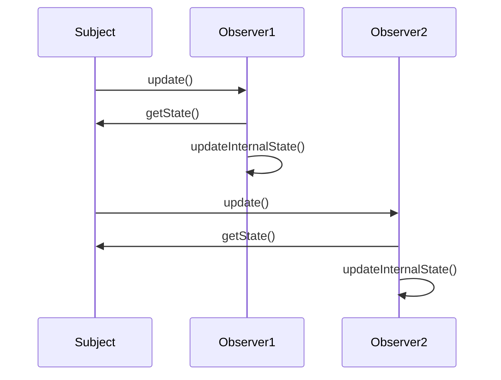
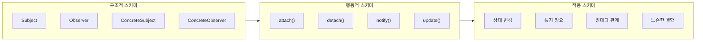

GoF 패턴을 체계적으로 분석하고 평가하는 과학적 방법론을 제시합니다. Intent 분석부터 Trade-off 평가까지, 패턴의 본질을 꿰뚫어보는 전문가적 사고 과정을 학습합니다.

## 서론: 패턴을 보는 눈

> *"패턴을 안다는 것과 패턴을 이해한다는 것은 전혀 다른 차원의 문제다."*

많은 개발자들이 GoF의 23개 패턴을 외우고 있습니다. Observer는 일대다 관계, Strategy는 알고리즘 교체... 하지만 정작 실무에서 **"이 상황에서 어떤 패턴을 써야 할까?"** 혹은 **"이 패턴이 정말 최선의 선택일까?"**라는 질문 앞에서는 막막해집니다.

패턴을 단순히 암기하는 것과 패턴의 본질을 꿰뚫어보는 것 사이에는 **거대한 간극**이 있습니다. 진정한 설계 전문가는 패턴을 **분석하고, 평가하고, 상황에 맞게 선택**할 수 있는 능력을 갖춘 사람입니다.

이번 글에서는 패턴을 체계적으로 분석하고 평가하는 **과학적 방법론**을 제시합니다. 이는 단순한 기법이 아니라, **사고의 프레임워크**입니다.

### GoF 패턴 분석 템플릿의 심층 해부

GoF 원저는 각 패턴을 Pattern Name and Classification·Intent·Also Known As·Motivation·Applicability·Structure·Participants·Collaborations·Consequences·Implementation·Sample Code·Known Uses·Related Patterns 총 13개 항목으로 서술한다. 이 글에서는 그중 패턴을 "분석하고 선택하는" 판단에 가장 직접적으로 관여하는 네 축 — Intent, Structure, Participants, Collaborations — 을 심층적으로 다루고, Consequences는 뒤이어 나올 Trade-off 분석 절에서, Known Uses는 아래 각 축의 분석에 곁들이는 방식으로 함께 다룬다.

#### Intent (의도) - 패턴의 영혼

GoF 책에서 가장 중요한 섹션은 바로 **"Intent"**입니다. 여기에 패턴의 핵심 가치가 압축되어 있습니다.

**Observer 패턴의 Intent 분석:**

> "Define a one-to-many dependency between objects so that when one object changes state, all its dependents are notified and updated automatically." — Gamma, Helm, Johnson, Vlissides, 『Design Patterns』(1994)

이 한 문장을 해부해보면:
- **핵심 문제**: "one-to-many dependency"
- **트리거 조건**: "when one object changes state"  
- **해결책**: "all its dependents are notified and updated automatically"
- **목표**: 자동화된 상태 동기화

**Intent 분석 체크리스트:**
```text
□ 해결하려는 핵심 문제가 명확한가?
□ 문제의 범위가 적절히 정의되었는가?
□ 해결책의 본질이 간결하게 표현되었는가?
□ 다른 패턴과 구분되는 고유성이 있는가?
```

#### Structure (구조) - 패턴의 해부학

구조 다이어그램은 패턴의 **"해부학"**입니다. 단순히 클래스 관계를 보여주는 것이 아니라, **역할 분담의 철학**을 담고 있습니다. Strategy 패턴을 예로 들면, 핵심은 "누가 무엇을 알아야 하는가"의 경계선이다. Context는 "언제 정렬할지"를 알아야 하지만 "어떻게 정렬할지"는 몰라도 되고, Strategy 구현체는 정렬 알고리즘 자체만 알면 된다. 아래 코드는 이 경계선이 실제 클래스 설계에서 어떻게 나타나는지 보여준다.

**Strategy 패턴 구조 분석:**
```java
// Context: 전략을 사용하는 주체
public class SortContext {
    private SortStrategy strategy;  // 의존성 주입 지점
    
    public void setStrategy(SortStrategy strategy) {
        this.strategy = strategy;   // 런타임 교체 가능
    }
    
    public void executeSort(int[] data) {
        strategy.sort(data);        // 위임(delegation)
    }
}

// Strategy: 알고리즘의 공통 인터페이스
public interface SortStrategy {
    void sort(int[] data);          // 템플릿 메서드
}

// ConcreteStrategy: 구체적 구현
public class QuickSortStrategy implements SortStrategy {
    public void sort(int[] data) {
        quickSort(data, 0, data.length - 1);
    }

    private void quickSort(int[] data, int low, int high) {
        if (low >= high) return;
        int pivot = data[high];
        int i = low - 1;
        for (int j = low; j < high; j++) {
            if (data[j] <= pivot) {
                i++;
                int tmp = data[i]; data[i] = data[j]; data[j] = tmp;
            }
        }
        int tmp = data[i + 1]; data[i + 1] = data[high]; data[high] = tmp;
        int p = i + 1;
        quickSort(data, low, p - 1);
        quickSort(data, p + 1, high);
    }
}
```

**구조 분석의 핵심 포인트:**
1. **역할 분리**: Context는 "언제", Strategy는 "어떻게"
2. **의존성 방향**: Context → Strategy (역방향 불가)
3. **교체 메커니즘**: setStrategy() 통한 런타임 변경
4. **위임 패턴**: Context가 실제 작업을 Strategy에 위임

#### Participants (참여자) - 역할과 책임

각 참여자는 **단일 책임 원칙**을 따라 명확한 역할을 가집니다. Command 패턴의 참여자 분석에서 특히 눈여겨볼 지점은 "누가 무엇을 몰라도 되는가"다. Invoker는 구체적으로 어떤 명령이 실행되는지 몰라도 되고, Client는 Receiver의 내부 구현을 몰라도 된다. 이렇게 서로 몰라도 되는 지식의 경계가 넓을수록 결합도가 낮아진다는 것이 아래 매크로 레코더 예제가 보여주려는 핵심이다.

**Command 패턴 참여자 분석:**
```java
import java.util.ArrayList;
import java.util.List;

// Command: 명령의 추상화
public interface Command {
    void execute();
    void undo();           // 실행 취소 지원
}

// Receiver: 실제 작업을 수행하는 객체
public class TextEditor {
    private String selection = "";

    public String getSelection() {
        return selection;
    }

    public void setSelection(String text) {
        this.selection = text;
    }

    public void copy() {
        System.out.println("복사: " + selection);
    }

    public void paste() {
        System.out.println("붙여넣기: " + selection);
    }

    public void save() {
        System.out.println("저장: " + selection);
    }
}

// ConcreteCommand: 구체적 명령 구현
public class CopyCommand implements Command {
    private final TextEditor receiver;
    private String backup;

    public CopyCommand(TextEditor receiver) {
        this.receiver = receiver;
    }

    public void execute() {
        backup = receiver.getSelection();
        receiver.copy();
    }

    public void undo() {
        receiver.setSelection(backup);
    }
}

public class PasteCommand implements Command {
    private final TextEditor receiver;

    public PasteCommand(TextEditor receiver) {
        this.receiver = receiver;
    }

    public void execute() { receiver.paste(); }
    public void undo() { /* 붙여넣기 취소 로직 */ }
}

public class SaveCommand implements Command {
    private final TextEditor receiver;

    public SaveCommand(TextEditor receiver) {
        this.receiver = receiver;
    }

    public void execute() { receiver.save(); }
    public void undo() { /* 저장 취소는 별도 스냅샷 필요 */ }
}

// ConcreteCommand: 여러 Command를 하나로 묶는 매크로
public class MacroCommand implements Command {
    private final List<Command> commands;

    public MacroCommand(List<Command> commands) {
        this.commands = commands;
    }

    public void execute() {
        for (Command c : commands) c.execute();
    }

    public void undo() {
        for (int i = commands.size() - 1; i >= 0; i--) commands.get(i).undo();
    }
}

// Invoker: 명령을 실행하는 역할
public class MenuButton {
    private Command command;

    public void setCommand(Command command) {
        this.command = command;
    }

    public void click() {
        command.execute();  // 구체적 명령을 몰라도 실행 가능
    }
}

// Client: 명령을 조립하는 역할
public class MacroRecorder {
    private final TextEditor editor;
    private final MenuButton invoker;

    public MacroRecorder(TextEditor editor, MenuButton invoker) {
        this.editor = editor;
        this.invoker = invoker;
    }

    public void createMacro() {
        List<Command> commands = new ArrayList<>();
        commands.add(new CopyCommand(editor));
        commands.add(new PasteCommand(editor));
        commands.add(new SaveCommand(editor));
        invoker.setCommand(new MacroCommand(commands));
    }
}
```

위 코드에서 `MacroCommand`가 특히 흥미로운 지점이다. `MacroCommand` 자신도 `Command` 인터페이스를 구현하므로, `MenuButton`(Invoker) 입장에서는 단일 명령을 실행하는 것과 세 개의 명령을 순서대로 실행하는 것을 구분할 필요가 없다 — 이것이 Command 패턴이 "명령의 합성(composition)"을 가능하게 하는 방식이다. `undo()`를 역순으로 순회하는 것도 같은 이유다.

**참여자 분석 매트릭스:**
| 참여자 | 주요 책임 | 알아야 할 것 | 몰라도 되는 것 |
|--------|-----------|---------------|----------------|
| Client | 명령 조립 | Command 인터페이스 | 구체적 실행 방법 |
| Invoker | 명령 실행 트리거 | Command 인터페이스 | 구체적 명령 내용 |
| Command | 인터페이스 정의 | Receiver 인터페이스 | 구체적 구현 방법 |
| ConcreteCmd | 구체적 명령 구현 | Receiver의 메서드 | 다른 Command들 |
| Receiver | 실제 작업 수행 | 자신의 도메인 로직 | Command 존재 여부 |

#### Collaborations (협력) - 상호작용의 예술

협력 패턴은 **시나리오별 상호작용**을 보여줍니다. 이는 패턴의 **동적 측면**입니다. Structure가 "정적 사진"이라면 Collaborations는 "동영상"에 해당한다 — 같은 클래스 구조도 호출 순서와 되돌아오는 호출(callback)의 방향에 따라 전혀 다른 런타임 동작을 만들어낼 수 있다. Observer 패턴의 경우 통지(`update()`)와 상태 조회(`getState()`)가 서로 반대 방향으로 오간다는 점이 협력 분석의 핵심이다.

**Observer 패턴 협력 시퀀스:**



Subject가 `notifyObservers()`를 호출하면 등록된 Observer들에게 순서대로 `update()`가 전달되고, 각 Observer는 다시 Subject에 `getState()`를 되물어 필요한 상태만 가져온다(Pull 모델). 이 되물음 구간이 바로 아래 "협력 분석의 핵심 질문"이 다루는 실패·순환 참조 위험의 근원이다.

**협력 분석의 핵심 질문:**
- 누가 협력을 시작하는가? (Subject)
- 협력의 순서가 중요한가? (Observer들의 순서는 보통 중요하지 않음)
- 실패 시 어떻게 처리하는가? (일부 Observer 실패 시 다른 Observer들은?)
- 순환 참조 위험이 있는가? (Observer가 Subject 상태를 변경하면?)

#### Known Uses - 이론이 현실에서 검증되는 지점

GoF 템플릿에는 Intent~Collaborations 외에도 "Known Uses(실제 사용 사례)" 항목이 있다. 분석 프레임워크가 교과서 예제에서만 통하는 이론이 아니라는 것을 확인하려면, 실제로 널리 쓰이는 라이브러리에서 같은 구조를 찾아봐야 한다. Java의 `java.util.Observer/Observable`(현재는 deprecated이지만 Observer 패턴의 정석 구현으로 오래 인용됨), Spring Framework의 `ApplicationListener`/`ApplicationEventPublisher`(발행-구독 구조로 Observer를 프레임워크 차원에서 제공), 그리고 자바 표준 라이브러리의 `java.util.concurrent.Executor`(Command 패턴의 실행자 역할)가 대표적이다. 이런 실제 사례를 알고 있으면, 새로운 코드베이스를 읽을 때도 "이건 Observer의 변형이구나"를 훨씬 빠르게 인식할 수 있다.

### 패턴 적용 조건 분석 기법

Intent·Structure·Participants·Collaborations 4축으로 패턴 자체를 해부하는 법을 익혔다면, 이제는 반대 방향의 질문이 필요하다 — "내 눈앞의 문제가 어떤 패턴의 형태를 띠는가?"를 어떻게 판단할 것인가다. 이 절은 문제 식별부터 적용 가능성 검증, 대안 비교까지 세 단계로 이 판단 과정을 구체화한다.

#### 문제 영역 식별 매트릭스

패턴 적용을 위해서는 먼저 **문제의 본질**을 정확히 파악해야 합니다.

**문제 유형별 패턴 매핑:**
| 문제 유형 | 1차 후보 패턴 | 2차 후보 패턴 |
|-----------|---------------|---------------|
| 객체 생성이 복잡함 | Factory Method | Abstract Factory, Builder |
| 객체 생성 비용이 높음 | Singleton | Flyweight, Object Pool |
| 런타임에 행동을 변경해야 함 | Strategy | State, Command |
| 복잡한 객체 구조를 단순화 | Facade | Adapter, Proxy |
| 객체 간 일대다 의존성 | Observer | Mediator, Event Bus |
| 알고리즘을 캡슐화해야 함 | Template Method | Strategy, Command |

#### 적용 가능성 평가 체크리스트

위 매핑 표가 "후보 패턴"을 좁혀주긴 하지만, 후보로 떠올린 패턴이 실제로 적합한지는 별도로 검증해야 한다. 로깅 시스템에 Strategy 패턴을 적용할지 검토하는 아래 예제는 이 검증을 다섯 가지 질문으로 구조화한 것이다.

**Context 분석:**
```java
// 예시: 로깅 시스템에서 Strategy 패턴 적용 검토

public enum LogLevel { DEBUG, INFO, ERROR }

// 현재 상황
public class Logger {
    public void log(String message, LogLevel level) {
        if (level == LogLevel.DEBUG) {
            System.out.println("[DEBUG] " + message);
        } else if (level == LogLevel.INFO) {
            writeToFile("[INFO] " + message);
        } else if (level == LogLevel.ERROR) {
            sendToSentry("[ERROR] " + message);
        }
    }

    private void writeToFile(String message) { /* 파일 기록 로직 */ }
    private void sendToSentry(String message) { /* 외부 모니터링 전송 로직 */ }
}

// Strategy 패턴 적용 가능성 평가
```

이 로깅 예제에 다섯 가지 질문을 적용해보면 적합성이 드러난다. 알고리즘이 여러 개인가(DEBUG/INFO/ERROR 각각 다른 출력 방식이므로 YES), 런타임에 알고리즘을 변경해야 하는가(개발/운영 환경에 따라 로깅 방식이 바뀌므로 YES), 새 알고리즘이 추가될 가능성이 있는가(WARN 레벨·외부 모니터링 연동 등 YES), 알고리즘들이 공통 인터페이스를 가질 수 있는가(`log(String message)`로 통일 가능하므로 YES), 알고리즘 간 상태 공유가 필요한가(각 로그 전략이 독립적이므로 NO)를 차례로 확인하면, 다섯 질문 모두가 Strategy 패턴이 요구하는 조건과 일치한다. **결론: Strategy 패턴 적용이 적합하다.**

#### 대안 패턴 비교 분석

같은 문제를 해결하는 여러 패턴이 있을 때의 **선택 기준**은 "정답 패턴 하나"를 찾는 게 아니라, 각 패턴이 어떤 축에서 다른 대가를 치르는지 비교하는 것이다. 캐싱이라는 하나의 문제를 Proxy·Decorator·Strategy 세 패턴으로 각각 구현해보면, 코드 구조는 거의 비슷하지만 "무엇을 감추는가"라는 의도가 서로 다르다는 점이 드러난다.

**캐싱 구현 시 패턴 선택:**
```java
import java.util.HashMap;
import java.util.Map;

public interface DataService {
    Object getData(String key);
}

// 옵션 1: Proxy 패턴
public class CacheProxy implements DataService {
    private DataService realService;
    private Map<String, Object> cache = new HashMap<>();
    
    public Object getData(String key) {
        if (cache.containsKey(key)) {
            return cache.get(key);
        }
        Object data = realService.getData(key);
        cache.put(key, data);
        return data;
    }
}

// 옵션 2: Decorator 패턴  
public class CacheDecorator implements DataService {
    private DataService wrappedService;
    private Map<String, Object> cache = new HashMap<>();
    
    public Object getData(String key) {
        if (cache.containsKey(key)) {
            return cache.get(key);
        }
        Object data = wrappedService.getData(key);
        cache.put(key, data);
        return data;
    }
}

// 옵션 3: Strategy 패턴
public interface CacheStrategy {
    Object getData(String key, DataService dataService);
}

public class DataServiceContext {
    private CacheStrategy cacheStrategy;
    private DataService dataService;
    
    public Object getData(String key) {
        return cacheStrategy.getData(key, dataService);
    }
}
```

**비교 분석:**

| 기준 | Proxy | Decorator | Strategy |
|------|-------|-----------|----------|
| 투명성 | 높음 | 중간 | 낮음 |
| 런타임 교체 | 어려움 | 어려움 | 쉬움 |
| 다중 기능 조합 | 어려움 | 쉬움 | 중간 |
| 성능 오버헤드 | 낮음 | 중간 | 높음 |
| 구현 복잡도 | 낮음 | 중간 | 높음 |

이 표를 실제 선택으로 옮기면 세 가지 상황으로 정리된다. 단순 캐싱만 필요하다면 투명성이 높고 오버헤드가 낮은 Proxy가 적합하고, 캐싱에 로깅·압축 같은 다른 기능까지 조합해야 한다면 여러 Decorator를 겹겹이 쌓을 수 있는 Decorator가 유리하며, 캐싱 전략 자체를 런타임에 바꿔야 한다면 Strategy만이 그 교체를 지원한다.

### Trade-off 분석 프레임워크

앞선 캐싱 비교가 보여줬듯, 패턴 선택은 항상 무언가를 얻고 무언가를 내주는 거래다. 이 절은 그 거래를 세 가지 대표적인 축(성능 vs 유연성, 복잡성 vs 재사용성, 메모리 vs 속도)으로 나눠, 실제로 수치를 재보면 얼마나 차이가 나는지를 예시로 보여준다. 아래 수치들은 특정 벤치마크 환경의 예시 값이며, 실제 프로젝트에서는 반드시 자체 측정이 필요하다.

#### 성능 vs 유연성 분석

Flyweight는 "공유 가능한 상태(intrinsic)"와 "공유 불가능한 상태(extrinsic)"를 분리해 후자만 매번 새로 전달하는 방식으로 메모리를 아낀다. 이 분리 자체가 유연성의 대가다 — 상태를 나누는 순간 코드는 더 복잡해지고, 매번 extrinsic 상태를 파라미터로 넘겨야 하므로 호출부도 함께 바뀐다.

**Flyweight vs 일반 객체:**
```java
import java.awt.Color;
import java.awt.Font;
import java.awt.Graphics;
import java.util.HashMap;
import java.util.Map;

// 일반 객체 방식: 성능 우수, 유연성 낮음
public class Character {
    private char character;
    private Font font;
    private Color color;
    private int x, y;
    
    // 10,000개 문자 = 10,000개 Font, Color 객체
}

// Flyweight 방식: 메모리 효율적, 복잡성 증가
public class CharacterFlyweight {
    private final char character;
    private final Font font;      // intrinsic state (공유)
    private final Color color;    // intrinsic state (공유)

    public CharacterFlyweight(char character, Font font, Color color) {
        this.character = character;
        this.font = font;
        this.color = color;
    }

    public void render(int x, int y, Graphics g) {
        // extrinsic state(x, y)는 공유하지 않고 매번 파라미터로 전달
    }
}

public class CharacterFactory {
    private Map<String, CharacterFlyweight> flyweights = new HashMap<>();
    
    public CharacterFlyweight getFlyweight(char c, Font f, Color col) {
        String key = c + f.toString() + col.toString();
        return flyweights.computeIfAbsent(key, 
            k -> new CharacterFlyweight(c, f, col));
    }
}
```

**성능 측정 데이터:**

예시 수치이며 실제 측정치가 아닙니다. 플랫폼·JVM 버전에 따라 실제 값은 달라질 수 있습니다.

```text
10,000개 문자 객체 생성 시:

일반 방식:
- 메모리 사용량: ~40MB (4KB × 10,000)
- 생성 시간: ~50ms
- 접근 시간: ~1ns (직접 접근)

Flyweight 방식:
- 메모리 사용량: ~1MB (공유 객체 + 팩토리)
- 생성 시간: ~20ms (중복 제거)
- 접근 시간: ~100ns (HashMap 조회)

결론: 메모리가 중요하면 Flyweight, 속도가 중요하면 일반 방식
```

이 예시에서 Flyweight가 메모리를 40배 아끼면서도 접근 시간이 100배 느려지는 이유는 명확하다 — HashMap 조회 자체가 배열 인덱스 접근보다 느리기 때문이다. 즉 Flyweight의 이득은 "생성 비용이 큰 객체를 대량으로 만들어야 하는" 상황에서만 성립하며, 이미 적은 수의 객체를 빠르게 접근해야 하는 상황에서는 오히려 손해다.

#### 복잡성 vs 재사용성 분석

Abstract Factory는 제품군(Button·Checkbox·Menu 등)을 통째로 교체할 수 있게 해주지만, 그 대가로 클래스 수가 크게 늘어난다. 아래 두 구현을 비교하면 "복잡성"이 추상적인 말이 아니라 실제 클래스 수·조건분기 수로 측정 가능하다는 점이 드러난다.

**Abstract Factory의 복잡성 증가:**
```java
// 단순한 팩토리: 복잡성 낮음, 재사용성 낮음
public interface Button {
    void render();
}

public class WindowsButton implements Button {
    public void render() { System.out.println("Windows 버튼"); }
}

public class MacButton implements Button {
    public void render() { System.out.println("Mac 버튼"); }
}

public class ButtonFactory {
    public Button createButton(String os) {
        if ("Windows".equals(os)) {
            return new WindowsButton();
        } else if ("Mac".equals(os)) {
            return new MacButton();
        }
        throw new IllegalArgumentException("Unsupported OS");
    }
}

// Abstract Factory: 복잡성 높음, 재사용성 높음
public interface Checkbox { void render(); }
public interface Menu { void render(); }
public class WindowsCheckbox implements Checkbox { public void render() {} }
public class WindowsMenu implements Menu { public void render() {} }
public class MacCheckbox implements Checkbox { public void render() {} }
public class MacMenu implements Menu { public void render() {} }

public abstract class GUIFactory {
    public abstract Button createButton();
    public abstract Checkbox createCheckbox();
    public abstract Menu createMenu();
}

public class WindowsFactory extends GUIFactory {
    public Button createButton() { return new WindowsButton(); }
    public Checkbox createCheckbox() { return new WindowsCheckbox(); }
    public Menu createMenu() { return new WindowsMenu(); }
}

public class MacFactory extends GUIFactory {
    public Button createButton() { return new MacButton(); }
    public Checkbox createCheckbox() { return new MacCheckbox(); }
    public Menu createMenu() { return new MacMenu(); }
}
```

**복잡성 매트릭스:**

"이해 시간"은 실측 데이터가 아니라 상대적 난이도를 직관적으로 보여주기 위한 예시 추정치입니다. 실제 소요 시간은 개발자의 경험과 코드베이스 맥락에 따라 크게 달라집니다. 클래스 수는 위 코드를 그대로 센 값이다 — Simple Factory는 `Button`·`WindowsButton`·`MacButton`·`ButtonFactory` 4개 클래스로 구현할 수도 있지만, `ButtonFactory`를 제외한 제품 클래스만 세면 3개이고, Abstract Factory는 `GUIFactory`·`WindowsFactory`·`MacFactory`(3) + `Button`/`Checkbox`/`Menu` 인터페이스(3) + Windows·Mac 구현체 6개를 합쳐 12개다.

```text
구현 방식          | 클래스 수 | Cyclomatic | 이해 시간(예시) | 확장 비용
Simple Factory    |    3     |     3      |     5분        |   높음
Abstract Factory  |    12    |     8      |     30분       |   낮음

비교 기준:
- 제품군이 2개 이하 → Simple Factory
- 제품군이 3개 이상이고 자주 확장 → Abstract Factory
```

#### 메모리 vs 속도 Trade-off

Singleton은 인스턴스를 하나만 유지해 메모리를 절약하지만, 그 하나의 인스턴스에 모든 요청이 순차적으로 몰리므로 동시 접속이 늘어날수록 대기 시간이 커진다. Connection Pool은 여러 인스턴스를 미리 만들어두는 대신 메모리를 더 쓰고, 그 대가로 요청을 병렬 처리할 수 있다. 아래 벤치마크는 이 트레이드오프가 동시 접속자가 늘어날 때 얼마나 벌어지는지 보여준다.

**Singleton vs Factory의 메모리 사용:**
```java
import java.sql.Connection;
import java.util.concurrent.BlockingQueue;
import java.util.concurrent.LinkedBlockingQueue;

// Singleton: 메모리 효율적, 전역 상태 위험
public class DatabaseConnection {
    private static DatabaseConnection instance;
    private Connection connection;
    
    public static DatabaseConnection getInstance() {
        if (instance == null) {
            synchronized (DatabaseConnection.class) {
                if (instance == null) {
                    instance = new DatabaseConnection();
                }
            }
        }
        return instance;
    }
    
    // 메모리: 1개 인스턴스만 유지
    // 동시성: synchronized로 인한 성능 저하
}

// Factory: 유연성 높음, 메모리 사용량 증가
public class ConnectionFactory {
    // 커넥션 풀은 미리 N개의 Connection을 만들어 큐에 담아두고 빌려주는 구조다.
    private final BlockingQueue<Connection> connectionPool = new LinkedBlockingQueue<>();
    
    public Connection getConnection() throws InterruptedException {
        return connectionPool.take();
    }
    
    // 메모리: N개 Connection 객체 유지
    // 동시성: BlockingQueue 자체가 Thread-safe
}
```

**성능 벤치마크:**

예시 수치이며 실제 측정치가 아닙니다. 플랫폼·JVM 버전에 따라 실제 값은 달라질 수 있습니다.

```text
동시 접속 1000명 시:

Singleton 방식:
- 메모리: 50MB (1개 Connection + 대기 큐)
- 평균 응답시간: 500ms (순차 처리)
- TPS: 2000

Connection Pool 방식:  
- 메모리: 200MB (20개 Connection pool)
- 평균 응답시간: 50ms (병렬 처리)  
- TPS: 20000

Trade-off: 메모리 4배 증가로 성능 10배 향상
```

메모리 4배 증가로 성능이 10배 향상된다는 결과만 보면 Connection Pool이 항상 유리해 보이지만, 이는 동시 접속 1000명이라는 부하를 전제로 한 결과다. 동시 접속자가 10명 수준이라면 Singleton의 순차 처리도 병목이 되지 않으므로, 4배의 메모리를 미리 확보할 이유가 없다. 트레이드오프 분석의 핵심은 이렇게 "어느 부하 수준에서 이 대가가 정당화되는가"를 함께 밝히는 것이다.

### 패턴 평가 매트릭스

지금까지의 Trade-off 분석은 두 패턴을 비교할 때 개별 축(성능, 메모리, 복잡성)을 하나씩 따로 살폈다. 하지만 실무에서는 여러 기준을 동시에 고려해야 하고, 기준마다 프로젝트 특성에 따라 중요도가 다르다. 이 절은 그 여러 기준을 하나의 가중 점수로 종합하는 정량적 방법을 다룬다.

#### 정량적 평가 기준

**패턴 평가 매트릭스 템플릿:**

| 평가 기준 | 가중치 | Observer | Strategy | Command |
|-----------|--------|----------|----------|---------|
| 코드 복잡도 (낮을수록 좋음) | 25% | 6 | 8 | 4 |
| 성능 오버헤드 (낮을수록 좋음) | 20% | 5 | 9 | 7 |
| 확장 용이성 (높을수록 좋음) | 20% | 9 | 9 | 8 |
| 팀 숙련도 요구 (낮을수록 좋음) | 15% | 7 | 8 | 5 |
| 메모리 사용량 (낮을수록 좋음) | 10% | 6 | 9 | 7 |
| 테스트 용이성 (높을수록 좋음) | 10% | 8 | 9 | 9 |

```text
가중 평균 계산:
Observer = (6×0.25 + 5×0.20 + 9×0.20 + 7×0.15 + 6×0.10 + 8×0.10) = 6.75
Strategy = (8×0.25 + 9×0.20 + 9×0.20 + 8×0.15 + 9×0.10 + 9×0.10) = 8.60
Command = (4×0.25 + 7×0.20 + 8×0.20 + 5×0.15 + 7×0.10 + 9×0.10) = 6.35
```

세 패턴 모두 같은 6개 기준·같은 가중치로 채점했는데도 Strategy(8.60)가 Observer(6.75)·Command(6.35)보다 높게 나온 이유는 코드 복잡도(가중치 25%로 가장 큼)에서 Strategy가 8점을 받았기 때문이다. 만약 가중치를 "코드 복잡도"보다 "확장 용이성"에 더 두는 프로젝트라면 순위가 달라질 수 있다 — 이것이 바로 다음 절에서 가중치 자체를 조정하는 이유다.

#### 상황별 가중치 적용

**프로젝트 특성에 따른 가중치 조정:**
| 프로젝트 유형 | 개발 속도 | 코드 복잡도 | 확장성 | 유지보수성 | 성능 | 메모리 효율성 |
|---------------|-----------|-------------|--------|------------|------|---------------|
| 스타트업 초기 프로젝트 | 40% | 30% | 20% | - | 10% | - |
| 대규모 엔터프라이즈 | 15% | - | 35% | 25% | 25% | - |
| 실시간 시스템 | - | 10% | 15% | - | 50% | 25% |

스타트업 초기 프로젝트가 개발 속도(40%)를 가장 높게 두는 이유는 명확하다 — 아직 검증되지 않은 제품을 빠르게 시장에 내놓는 것이 확장성보다 급하기 때문이다. 반대로 실시간 시스템은 성능(50%)이 압도적인데, 이 영역에서는 패턴이 주는 유연성보다 예측 가능한 지연 시간이 더 중요하다.

가중치를 조정하는 것과 별개로, 같은 가중치를 적용해도 팀의 숙련도에 따라 실제로 구현 가능한 패턴의 복잡도 자체가 달라진다. 아래 세 코드는 같은 문제(로거 생성)를 초급·중급·고급 팀이 감당할 수 있는 복잡도로 각각 구현한 것이다.

#### 팀 특성 고려사항

**팀 숙련도별 패턴 선택 가이드:**
```java
import java.util.HashMap;
import java.util.Map;
import java.util.function.Supplier;

public interface Logger {
    void log(String message);
}

public class FileLogger implements Logger {
    public void log(String message) { /* 파일에 기록 */ }
}

public class ConsoleLogger implements Logger {
    public void log(String message) { System.out.println(message); }
}

// 초급 팀: 단순하고 직관적인 패턴 선호
public class SimpleFactory {
    public static Logger createLogger(String type) {
        switch (type) {
            case "file": return new FileLogger();
            case "console": return new ConsoleLogger();
            default: throw new IllegalArgumentException();
        }
    }
}

// 중급 팀: 적당한 복잡도의 패턴 활용 가능(Builder로 선택적 옵션을 조립)
public class LoggerBuilder {
    private String output = "console";

    public LoggerBuilder output(String output) {
        this.output = output;
        return this;
    }

    public Logger build() {
        return "file".equals(output) ? new FileLogger() : new ConsoleLogger();
    }
}

// 고급 팀: 함수형 인터페이스로 등록형 팩토리를 구성(신규 Logger 추가 시 이 클래스를 수정할 필요가 없음)
public class LoggerFactory {
    private final Map<String, Supplier<Logger>> loggerSuppliers = new HashMap<>();

    public void registerLogger(String name, Supplier<Logger> factory) {
        loggerSuppliers.put(name, factory);
    }

    public Logger create(String name) {
        return loggerSuppliers.get(name).get();
    }
}
```

초급 팀의 `SimpleFactory`는 `switch`문 하나로 모든 로직이 눈에 보이지만, 새 Logger 타입이 추가될 때마다 이 클래스를 직접 고쳐야 한다. 고급 팀의 `LoggerFactory`는 등록(`registerLogger`)과 조회(`create`)를 분리해 이 클래스를 건드리지 않고도 새 타입을 추가할 수 있지만, 그 대신 "어떤 이름으로 무엇이 등록됐는지"를 코드만 보고는 알 수 없다는 대가를 치른다.

### 인지과학적 패턴 분석

지금까지 다룬 Intent·Structure·Trade-off 분석은 "어떻게 패턴을 평가하는가"였다. 이 절은 방향을 바꿔 "숙련된 개발자는 왜 패턴을 더 빨리 알아보는가"를 인지과학의 청킹(chunking)·스키마(schema) 이론으로 설명한다. 이 이론을 아는 것 자체가 목적이 아니라, 초보자가 패턴 인식 속도를 의도적으로 훈련하는 방법을 얻는 것이 목적이다.

#### 청킹(Chunking)과 패턴 인식

청킹은 개별 정보 조각을 하나의 의미 단위로 묶어 기억하는 인지 과정이다. 체스 마스터가 기물 배치를 낱개가 아니라 "이 오프닝"으로 통째로 인식하는 것처럼, 숙련된 개발자는 20줄의 코드를 한 줄씩 읽지 않고 "Observer 패턴"이라는 하나의 청크로 즉시 인식한다.

**전문가의 패턴 인식 과정:**
```java
import java.util.ArrayList;
import java.util.List;

public interface Display {
    void update(float temperature, float humidity, float pressure);
}

// 초보자가 보는 것: 20줄의 개별 코드
public class WeatherStation {
    private List<Display> displays = new ArrayList<>();
    private float temperature, humidity, pressure;

    public void addDisplay(Display display) {
        displays.add(display);
    }
    
    public void removeDisplay(Display display) {
        displays.remove(display);
    }
    
    public void notifyDisplays() {
        for (Display display : displays) {
            display.update(temperature, humidity, pressure);
        }
    }
    
    public void measurementsChanged(float temperature, float humidity, float pressure) {
        this.temperature = temperature;
        this.humidity = humidity;
        this.pressure = pressure;
        notifyDisplays();
    }
}

// 전문가가 보는 것: "Observer 패턴"
// → 즉시 다음 사항들을 추론:
//   - Subject-Observer 관계
//   - Push vs Pull 모델 (Push 사용)
//   - 느슨한 결합
//   - 확장 가능한 구조
```

**패턴 인식 훈련법:**
1. **패턴 시그니처 학습**: `List<Observer>` + `notify()` = Observer 패턴
2. **의도 기반 분류**: "일대다 의존성" → Observer
3. **구조적 특징 암기**: Subject, Observer, ConcreteSubject, ConcreteObserver
4. **변형 패턴 인식**: EventBus, Reactive Streams도 Observer의 변형

#### 스키마 이론과 패턴 적용

스키마(schema)는 청킹된 지식을 실제로 적용 가능하게 조직화한 지식 구조다. 패턴 하나의 스키마는 "무엇으로 구성되는가"(구조적)·"무엇을 할 수 있는가"(행동적)·"언제 꺼내 쓰는가"(적용) 세 층위로 나뉘며, 아래 다이어그램은 Observer 패턴의 스키마가 이 세 층위를 어떻게 연결하는지 보여준다.

**패턴 스키마의 구성 요소:**



숙련된 개발자가 "일대다 관계"라는 적용 스키마를 인식하는 순간, 구조적 스키마(Subject·Observer)와 행동적 스키마(attach/detach/notify)가 자동으로 함께 활성화된다. 이 자동 연결이 바로 청킹의 실질적 효과이며, 아래 트리거 목록은 이 연결이 시작되는 지점을 보여준다.

**스키마 활성화 트리거:**
- "변경 사항을 여러 곳에 알려야 한다" → Observer 스키마 활성화
- "알고리즘을 바꿔가며 사용해야 한다" → Strategy 스키마 활성화
- "복잡한 객체를 단계별로 만들어야 한다" → Builder 스키마 활성화

### 패턴의 진화적 관점

패턴 분석 프레임워크의 마지막 축은 시간과 언어에 따른 변화다. GoF 원저가 C++·Smalltalk를 전제로 정의한 패턴이 다른 언어에서는 다른 모습으로 나타나고, 같은 패턴이라도 수십 년에 걸쳐 더 나은 대안으로 진화하기도 한다. 이 변화를 무시하고 원저의 코드를 그대로 옮기려 하면, 해당 언어의 관용구(idiom)와 충돌하는 부자연스러운 코드가 나온다.

#### 언어별 패턴 적응

Observer 패턴을 예로 들면, Java 스타일의 명시적 `attach()`/`notify()` 구현과 JavaScript의 `EventEmitter`, 그리고 RxJS의 반응형(Reactive) 스트림은 모두 "일대다 통지"라는 같은 Intent를 공유하지만 구현 방식은 전혀 다르다. 아래 세 코드를 비교하면 언어가 제공하는 기본 기능이 늘어날수록 패턴을 위한 보일러플레이트 코드가 줄어드는 흐름이 보인다.

**JavaScript에서의 Observer 패턴 진화:**
```javascript
// 전통적 Observer (Java 스타일)
class ClassicSubject {
    constructor() {
        this.observers = [];
    }
    
    attach(observer) {
        this.observers.push(observer);
    }
    
    notify(data) {
        this.observers.forEach(observer => observer.update(data));
    }
}

// JavaScript 관용적 Observer (EventEmitter)
const EventEmitter = require('events');

class WeatherStation extends EventEmitter {
    updateWeather(data) {
        this.emit('weatherChanged', data);
    }
}

const station = new WeatherStation();
station.on('weatherChanged', data => console.log(data));

// 현대적 Reactive Observer (RxJS)
import { Subject } from 'rxjs';

const weatherSubject = new Subject();
const subscription = weatherSubject.subscribe({
    next: data => console.log(data),
    error: err => console.error(err),
    complete: () => console.log('Complete')
});
```

**언어별 패턴 적응 원칙:**
- **C++**: RAII와 결합된 패턴 (스마트 포인터 활용)
- **Python**: Duck Typing 활용한 간소화된 패턴
- **Rust**: 소유권 시스템과 조화되는 패턴 변형
- **Go**: 인터페이스 기반 간소화된 패턴

#### 패턴의 자연적 진화

패턴은 언어에 따라서만 변하는 것이 아니라, 같은 언어 안에서도 시간이 지나며 다음 세대의 패턴으로 대체되기도 한다. Singleton에서 시작해 Service Locator를 거쳐 Dependency Injection으로 이어지는 흐름이 대표적이다. 세 세대 모두 "의존성을 어떻게 구할 것인가"라는 같은 문제를 풀지만, 해결 방식이 전역 상태(Singleton) → 중앙 조회(Service Locator) → 명시적 주입(DI) 순으로 옮겨가면서 테스트 용이성이 단계적으로 개선된다.

**Singleton → Service Locator → Dependency Injection 진화:**
```java
import java.util.HashMap;
import java.util.Map;
import org.springframework.beans.factory.annotation.Autowired;
import org.springframework.stereotype.Component;

public interface PaymentService {
    void charge(long amountCents);
}

// 1세대: Singleton (1990년대)
public class DatabaseConnection {
    private static DatabaseConnection instance;
    // 전역 상태, 테스트 어려움
}

// 2세대: Service Locator (2000년대)  
public class ServiceLocator {
    private static Map<Class<?>, Object> services = new HashMap<>();
    
    public static <T> T getService(Class<T> serviceClass) {
        return (T) services.get(serviceClass);
    }
    // 중앙집중식 관리, 여전히 전역 상태
}

// 3세대: Dependency Injection (2010년대~)
@Component
public class OrderService {
    private final PaymentService paymentService;
    
    @Autowired
    public OrderService(PaymentService paymentService) {
        this.paymentService = paymentService;
    }
    // 명시적 의존성, 테스트 용이
}
```

### 실전 패턴 분석 예제

#### 케이스 스터디: 로깅 시스템 설계

**요구사항:**
- 다양한 출력 대상 (콘솔, 파일, 네트워크)
- 로그 레벨별 필터링
- 포맷 커스터마이징
- 성능 최적화 (비동기 처리)

이 네 가지 요구사항은 각각 다른 패턴을 요구한다. "다양한 출력 대상"은 출력 방식이 여러 개이면서 런타임 교체가 필요 없으니 Strategy가, "레벨별 필터링"은 여러 필터를 동적으로 조합해야 하니 Chain of Responsibility가, "설정 옵션이 많은 구성"은 선택적 매개변수가 많으니 Builder가 적합하다. 아래 코드는 이 세 패턴을 하나의 로깅 시스템 안에서 함께 조합한 결과다.

**패턴 적용 분석:**
```java
import java.util.ArrayList;
import java.util.List;
import java.util.concurrent.BlockingQueue;
import java.util.concurrent.LinkedBlockingQueue;

public enum LogLevel { DEBUG, INFO, ERROR }

public class LogEvent {
    private final String message;

    public LogEvent(String message) {
        this.message = message;
    }

    public String getMessage() {
        return message;
    }
}

public interface LogFormatter {
    String format(LogEvent event);
}

public class SimpleFormatter implements LogFormatter {
    public String format(LogEvent event) {
        return event.getMessage();
    }
}

// Strategy 패턴: 출력 전략
public interface LogAppender {
    void append(LogEvent event);
}

public class ConsoleAppender implements LogAppender {
    public void append(LogEvent event) {
        System.out.println(event.getMessage());
    }
}

public class AsyncAppender implements LogAppender {
    private final LogAppender delegate;
    private final BlockingQueue<LogEvent> queue = new LinkedBlockingQueue<>();

    public AsyncAppender(LogAppender delegate) {
        this.delegate = delegate;
        Thread worker = new Thread(() -> {
            while (true) {
                try {
                    delegate.append(queue.take());
                } catch (InterruptedException e) {
                    break;
                }
            }
        });
        worker.setDaemon(true);
        worker.start();
    }

    public void append(LogEvent event) {
        queue.offer(event);  // 비동기 처리
    }
}

// Chain of Responsibility: 필터 체인
public abstract class LogFilter {
    protected LogFilter next;
    
    public void setNext(LogFilter next) {
        this.next = next;
    }
    
    public final void filter(LogEvent event) {
        if (shouldProcess(event)) {
            process(event);
            if (next != null) {
                next.filter(event);
            }
        }
    }
    
    protected abstract boolean shouldProcess(LogEvent event);
    protected abstract void process(LogEvent event);
}

public class Logger {
    private final List<LogAppender> appenders;
    private final LogLevel level;
    private final LogFormatter formatter;

    public Logger(List<LogAppender> appenders, LogLevel level, LogFormatter formatter) {
        this.appenders = appenders;
        this.level = level;
        this.formatter = formatter;
    }

    public void log(String rawMessage) {
        LogEvent event = new LogEvent(formatter.format(new LogEvent(rawMessage)));
        for (LogAppender appender : appenders) appender.append(event);
    }
}

// Builder 패턴: 로거 구성
public class LoggerBuilder {
    private List<LogAppender> appenders = new ArrayList<>();
    private LogLevel level = LogLevel.INFO;
    private LogFormatter formatter = new SimpleFormatter();
    
    public LoggerBuilder addAppender(LogAppender appender) {
        this.appenders.add(appender);
        return this;
    }
    
    public LoggerBuilder level(LogLevel level) {
        this.level = level;
        return this;
    }
    
    public Logger build() {
        return new Logger(appenders, level, formatter);
    }
}
```

**패턴 선택 근거:**

`LogAppender`에 Strategy를 쓴 이유는 출력 방식이 다양하지만 일단 설정되면 런타임에 다시 바꿀 필요가 없고 각 전략이 서로 독립적이기 때문이다. `LogFilter`에 Chain of Responsibility를 쓴 이유는 여러 필터를 조합해야 하고 그 순서가 결과에 영향을 미치며, 필터 체인을 동적으로 구성할 수 있어야 하기 때문이다. `LoggerBuilder`에 Builder를 쓴 이유는 설정 옵션이 많고 그 중 다수가 선택적이며, 완성된 로거는 불변 객체로 만들어야 하기 때문이다. 세 근거를 나란히 보면, 패턴 선택이 "이 패턴이 유명해서"가 아니라 각 컴포넌트가 실제로 요구하는 성질(교체 빈도·조합 필요성·매개변수 수)에서 나온다는 것이 드러난다.

## 한눈에 보는 패턴 분석 프레임워크

이 절은 새로운 내용이 아니라, 앞서 본문에서 다룬 네 가지 분석 도구(Intent/Structure/Participants/Collaborations 체크리스트, 문제-패턴 매핑, Trade-off 축, 평가 매트릭스)를 실무에서 빠르게 다시 찾아볼 수 있도록 모아놓은 색인이다. 처음 읽을 때는 건너뛰어도 되지만, 실제 설계 회의 중 "이 상황에 어떤 패턴을 검토해야 하나"를 빠르게 확인할 때 이 표들을 활용하면 된다.

### 패턴 분석 체크리스트

| 분석 단계 | 핵심 질문 | 확인 항목 |
|----------|----------|----------|
| Intent 분석 | 이 패턴이 해결하는 핵심 문제는? | 문제 정의 명확성, 범위 적절성, 해법 간결성 |
| Structure 분석 | 역할 분담은 적절한가? | 의존성 방향, 교체 메커니즘, 위임 패턴 |
| Participants 분석 | 각 참여자의 책임은 명확한가? | 단일 책임, 알아야 할 것/몰라도 될 것 |
| Collaborations 분석 | 상호작용은 적절한가? | 협력 시작점, 순서 중요성, 실패 처리 |

### 패턴 적용 결정 매트릭스

앞의 "문제 영역 식별 매트릭스"에서 1차·2차 후보까지 좁혔다면, 마지막으로 필요한 것은 후보들 사이에서 실제로 무엇을 재서 결정할지다. 같은 6가지 문제 유형에 대해 그 결정 기준만 추려보면 다음과 같다.

| 문제 유형 | 후보 사이의 선택 기준 |
|----------|----------|
| 객체 생성이 복잡함 | 제품군 수, 생성 단계 복잡도 |
| 객체 생성 비용이 높음 | 인스턴스 공유 가능 여부 |
| 런타임 행동 변경 | 상태 의존성, 실행 취소 필요 |
| 복잡한 구조 단순화 | 서브시스템 수, 호환성 문제 |
| 일대다 의존성 | 통신 방향, 결합도 요구사항 |
| 알고리즘 캡슐화 | 알고리즘 골격 고정 여부 |

### Trade-off 분석 기준

| 기준 | 설명 | 고려 사항 |
|------|------|----------|
| 성능 vs 유연성 | 런타임 오버헤드와 확장성의 균형 | 메모리 사용량, 접근 시간, HashMap 조회 비용 |
| 복잡성 vs 재사용성 | 클래스 수 증가와 확장 비용의 균형 | Cyclomatic 복잡도, 이해 시간, 확장 비용 |
| 투명성 vs 교체 용이성 | 기존 코드 영향과 런타임 변경의 균형 | 컴파일타임 의존성, 인터페이스 변경 |

### 패턴 평가 매트릭스 템플릿

앞서 Observer·Strategy·Command 세 패턴에 적용했던 가중 평균 계산을 다른 패턴 조합에도 재사용하려면, 아래처럼 "측정 방법"까지 명시한 빈 템플릿에서 시작하면 된다. 가중치 열의 값은 앞서 쓴 예시(25/20/20/15/10/10%)를 그대로 옮긴 것이며, 프로젝트 특성에 따라 다음 표처럼 재조정한다.

| 평가 기준 | 가중치 예시 | 측정 방법 |
|----------|------------|----------|
| 코드 복잡도 | 25% | Cyclomatic Complexity, 클래스 수 |
| 성능 오버헤드 | 20% | 벤치마크, 메모리 프로파일링 |
| 확장 용이성 | 20% | 새 기능 추가 시 변경 파일 수 |
| 팀 숙련도 요구 | 15% | 이해 시간, 러닝 커브 |
| 메모리 사용량 | 10% | 힙 메모리 분석 |
| 테스트 용이성 | 10% | Mock 필요 수, 테스트 코드 라인 |

### 프로젝트 유형별 가중치 조정

앞서 "상황별 가중치 적용"에서 스타트업 초기·대규모 엔터프라이즈·실시간 시스템 세 유형의 가중치를 다뤘다. 여기서는 그 표를 반복하지 않고, 아직 다루지 않은 네 번째 유형인 "레거시 유지보수"만 같은 6개 기준으로 추가한다. 레거시 유지보수 프로젝트는 새 기능 추가보다 기존 코드를 깨지 않는 것이 목표이므로, 유지보수성(40%)에 압도적인 비중을 두고 코드 복잡도·확장성은 낮게 잡는다.

| 프로젝트 유형 | 개발 속도 | 코드 복잡도 | 확장성 | 유지보수성 | 성능 | 메모리 효율성 |
|--------------|----------|------------|--------|-----------|------|---------------|
| 레거시 유지보수 | 10% | - | 10% | 40% | 15% | 25% |

## 흔한 오개념

패턴 분석 프레임워크를 처음 접할 때 빠지기 쉬운 오해들입니다.

- **"Intent만 알면 충분하다"**: Intent는 패턴의 출발점일 뿐입니다. 같은 Intent("일대다 의존성 통지")를 가진 상황도 Push/Pull 모델, 실패 처리 방식, 순환 참조 위험에 따라 실제 구현이 크게 달라집니다. Structure·Participants·Collaborations까지 함께 분석해야 실무에 적용할 수 있습니다.
- **"평가 매트릭스 점수가 절대 기준이다"**: 앞서 본 가중 평균 계산은 특정 프로젝트를 가정한 예시 산출값입니다. 가중치 자체가 팀·프로젝트 유형에 따라 달라지므로, 매트릭스는 "무엇을 근거로 비교했는지"를 드러내는 도구이지 정답을 알려주는 공식이 아닙니다.
- **"복잡한 패턴일수록 더 좋은 설계다"**: Abstract Factory가 Simple Factory보다 항상 우월한 것은 아닙니다. 제품군이 2개 이하인 상황에서 Abstract Factory를 적용하면 불필요한 클래스만 늘어납니다. 패턴의 가치는 복잡도가 아니라 문제와의 적합성에서 나옵니다.

## 평가 기준

이 글을 읽고 나면 다음 항목들을 스스로 점검해볼 수 있습니다.

- GoF 패턴 템플릿의 Intent, Structure, Participants, Collaborations 4가지 분석 축을 각각 설명할 수 있다.
- 동일한 문제(예: 캐싱)를 여러 패턴(Proxy, Decorator, Strategy)으로 구현했을 때의 Trade-off를 비교할 수 있다.
- 패턴 평가 매트릭스에서 가중 평균을 계산하는 방법을 이해하고 프로젝트 유형별로 가중치를 조정할 수 있다.
- 청킹(Chunking)과 스키마(Schema) 이론이 패턴 인식과 어떻게 연결되는지 설명할 수 있다.
- 성능·벤치마크 수치가 예시 자료인지 실측 데이터인지 구분하고, 실제 적용 전 자체 측정이 필요한 이유를 설명할 수 있다.

---

### 결론: 패턴 분석을 마스터하기

패턴 분석 능력은 하루아침에 기를 수 있는 것이 아닙니다. 하지만 체계적인 프레임워크를 따라 꾸준히 연습하면 다음과 같은 실천 단계를 통해 전문가적 사고력을 개발할 수 있습니다.

1. **문제 본질 파악 + 분석 일지 작성**: "정말 해결해야 할 핵심 문제는 무엇인가?"를 매일 마주친 패턴과 함께 기록한다.
2. **패턴 후보 선별 + 코드 리뷰 적용**: "이 문제를 해결할 수 있는 패턴들은?"을 코드 리뷰에서 "이 코드에 숨어있는 패턴은?"이라는 질문으로 검증한다.
3. **Trade-off 분석 + 적용 후기 작성**: "각 패턴의 장단점과 적용 비용은?"을 선택 후 실제로 얼마나 효과적이었는지 회고로 남긴다.
4. **상황적 적합성 판단**: "우리 팀과 프로젝트에 가장 적합한 것은?"을 팀 숙련도와 프로젝트 특성에 맞춰 결정한다.
5. **진화 가능성 검토 + 다양한 구현 실험**: "미래 요구사항 변화에 어떻게 대응할 것인가?"를 같은 패턴을 다른 언어로 구현해보며 확인한다.

패턴을 올바르게 분석하고 평가하는 능력은 패턴을 단순히 아는 것보다 훨씬 중요하며, 이것이 진정한 설계 전문가와 코드 작성자를 구분하는 핵심 역량입니다. 이는 **설계 사고력**의 핵심이며, 진정한 소프트웨어 아키텍트로 성장하는 발판이 됩니다.

다음 글 [객체지향 설계의 심층 이해](/post/design-patterns/oop-design-deep-understanding/)에서는 이런 분석 능력을 바탕으로 **객체지향 설계의 본질**을 더 깊이 탐구해보겠습니다. 패턴은 결국 좋은 객체지향 설계 원칙들의 구체적 표현이기 때문입니다.