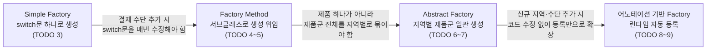

이 실습에서는 Simple Factory, Factory Method, Abstract Factory 패턴을 직접 구현하며 다양한 생성 전략을 익힙니다.

## 실습 목표
- Simple Factory, Factory Method, Abstract Factory 패턴의 차이점 이해
- 실무에서 Factory 패턴이 적용되는 다양한 상황 경험
- 현대적 Factory 패턴(DI Container, Functional Factory) 구현
- Factory 패턴의 성능 특성과 최적화 방법 학습

### 실습 1~3 비교

| 실습 | 다루는 패턴 | 핵심 학습 포인트 | 난이도 |
|------|-------------|-------------------|--------|
| 실습 1: 결제 시스템 | Simple Factory → Factory Method → Abstract Factory | 단계적 확장을 통해 OCP 위반과 그 해결 과정을 체감 | 중 |
| 실습 2: 게임 캐릭터 생성 | Factory + Builder + Flyweight | 조합 폭발 문제를 다른 패턴과의 조합으로 해결하는 감각 | 상 |
| 실습 3: 로깅 시스템 | 함수형 Factory (`Function<Config, T>`) | 클래스 계층 없이 맵 기반으로 OCP를 준수하는 방법 | 중 |

## 실습 1: 결제 시스템 Factory 패턴 적용

### 과제 설명
온라인 쇼핑몰의 결제 시스템을 구현합니다. 다양한 결제 방식(신용카드, PayPal, 암호화폐)을 지원하며, 각 결제 방식마다 다른 설정과 처리 로직이 필요합니다. Simple Factory부터 시작하는 이유는, 가장 단순한 형태의 생성 로직 중앙화를 먼저 체득한 뒤에야 Factory Method와 Abstract Factory가 해결하는 "확장성"과 "일관성" 문제를 체감할 수 있기 때문입니다. 아래 TODO들을 채워나가면서 각 단계에서 어떤 한계에 부딪히는지 직접 경험해보세요.

### 요구사항
1. **Simple Factory**: 기본적인 결제 프로세서 생성
2. **Factory Method**: 결제 서비스별 특화된 프로세서 생성
3. **Abstract Factory**: 지역별(미국, 유럽, 아시아) 결제 시스템 제공
4. **현대적 Factory**: 어노테이션 기반 자동 등록

### 코드 템플릿

아래는 `SimplePaymentFactory.createProcessor`와 `CreditCardProcessor`에 대한 완성된 참조 구현입니다. `PaymentType`, `PaymentConfig` 등 컴파일에 필요한 최소한의 보조 타입도 함께 정의했습니다. PayPal·암호화폐 프로세서, Factory Method, Abstract Factory, 어노테이션 기반 Factory, 테스트 코드는 이 참조 구현을 참고하여 직접 채워보세요.

아래 다이어그램은 TODO 1~9를 채워나가며 통과하게 될 세 단계를 보여줍니다. Simple Factory는 `switch`문 하나로 시작하지만, 결제 수단이 늘어날수록 이 분기문을 계속 고쳐야 하는 OCP 위반이 드러납니다. Factory Method는 이 생성 로직을 서브클래스로 옮겨 분기문 자체를 없애지만, "신용카드 서비스"라는 제품 하나만 책임지므로 지역별로 여러 제품(프로세서·검증기·통화 변환기)을 함께 묶어야 하는 요구가 생기면 다시 한계에 부딪힙니다. Abstract Factory는 이 "제품군 일관성" 문제를 해결하는 마지막 단계입니다.



```java
import java.util.List;

// 지원하는 결제 수단
public enum PaymentType {
    CREDIT_CARD, PAYPAL, CRYPTO
}

// Factory에 전달되는 최소 설정값
public class PaymentConfig {
    private final String apiKey;
    private final String endpoint;

    public PaymentConfig(String apiKey, String endpoint) {
        this.apiKey = apiKey;
        this.endpoint = endpoint;
    }

    public String getApiKey() { return apiKey; }
    public String getEndpoint() { return endpoint; }
}

// 결제 요청/검증/결과에 필요한 최소 데이터
public class PaymentRequest {
    private final double amount;
    private final String currency;

    public PaymentRequest(double amount, String currency) {
        this.amount = amount;
        this.currency = currency;
    }

    public double getAmount() { return amount; }
    public String getCurrency() { return currency; }
}

public class PaymentInfo {
    private final String cardNumber;

    public PaymentInfo(String cardNumber) {
        this.cardNumber = cardNumber;
    }

    public String getCardNumber() { return cardNumber; }
}

public class PaymentResult {
    private final boolean success;
    private final String message;

    public PaymentResult(boolean success, String message) {
        this.success = success;
        this.message = message;
    }

    public boolean isSuccess() { return success; }
    public String getMessage() { return message; }
}

// TODO 1: PaymentProcessor 인터페이스 정의 (완성됨)
public interface PaymentProcessor {
    PaymentResult processPayment(PaymentRequest request);
    boolean validatePayment(PaymentInfo info);
    String getProcessorName();
    List<String> getSupportedCurrencies();
}

// TODO 2: 구체적인 결제 프로세서들 구현
// CreditCardProcessor만 완성된 참조 구현이며, 나머지는 실습 과제로 남겨둡니다.
public class CreditCardProcessor implements PaymentProcessor {
    private final String apiKey;
    private final String endpoint;

    public CreditCardProcessor(String apiKey, String endpoint) {
        if (apiKey == null || apiKey.isBlank()) {
            throw new IllegalArgumentException("apiKey는 필수입니다");
        }
        this.apiKey = apiKey;
        this.endpoint = endpoint;
    }

    @Override
    public PaymentResult processPayment(PaymentRequest request) {
        if (!getSupportedCurrencies().contains(request.getCurrency())) {
            return new PaymentResult(false, "지원하지 않는 통화: " + request.getCurrency());
        }
        // 실제 구현에서는 endpoint로 HTTP 호출을 수행합니다.
        return new PaymentResult(true, "신용카드 결제 승인: " + request.getAmount() + " " + request.getCurrency());
    }

    @Override
    public boolean validatePayment(PaymentInfo info) {
        return info.getCardNumber() != null
            && info.getCardNumber().replaceAll("\\s", "").length() == 16;
    }

    @Override
    public String getProcessorName() {
        return "CreditCardProcessor";
    }

    @Override
    public List<String> getSupportedCurrencies() {
        return List.of("USD", "EUR", "KRW");
    }
}

public class PayPalProcessor implements PaymentProcessor {
    private final String clientId;
    private final String clientSecret;
    
    // TODO: 생성자 및 메서드 구현 (CreditCardProcessor 참고)
}

public class CryptoProcessor implements PaymentProcessor {
    private final String walletAddress;
    private final String network;
    
    // TODO: 생성자 및 메서드 구현 (CreditCardProcessor 참고)
}

// TODO 3: Simple Factory 구현 (완성됨)
// CREDIT_CARD 분기만 완전히 구현되어 있습니다. PAYPAL, CRYPTO는
// PayPalProcessor, CryptoProcessor를 완성한 뒤 동일한 방식으로 연결하세요.
public class SimplePaymentFactory {
    public static PaymentProcessor createProcessor(PaymentType type, PaymentConfig config) {
        switch (type) {
            case CREDIT_CARD:
                return new CreditCardProcessor(config.getApiKey(), config.getEndpoint());
            case PAYPAL:
                // TODO: PayPalProcessor 구현 후 연결
                throw new UnsupportedOperationException("PayPalProcessor는 아직 구현되지 않았습니다");
            case CRYPTO:
                // TODO: CryptoProcessor 구현 후 연결
                throw new UnsupportedOperationException("CryptoProcessor는 아직 구현되지 않았습니다");
            default:
                throw new IllegalArgumentException("Unsupported payment type: " + type);
        }
    }
}
```

`SimplePaymentFactory.createProcessor`가 `PAYPAL`·`CRYPTO` 분기에서 던지는 `UnsupportedOperationException`을 직접 눈으로 확인했다면, 이제 이 클래스를 고치지 않고 새 결제 수단을 추가하는 방법을 찾아야 합니다. 아래 `PaymentServiceFactory`(TODO 4)는 그 답을 "생성 과정은 고정하고 생성 대상만 서브클래스에 위임"하는 방식으로 제시합니다. `createPaymentService()`가 `final`인 이유도 여기 있습니다 — "processor, validator, logger를 만들어 조립한다"는 절차 자체는 모든 결제 방식에서 동일해야 하므로, 이 절차를 서브클래스가 바꿀 수 없게 봉인한 것입니다.

```java
// 아래 4개 타입은 TODO 4, 6에서 참조하는 최소 필드만 가진 스텁입니다.
// 실제 구현 로직은 각 TODO를 채우면서 직접 확장하세요.
public class PaymentService {
    private final PaymentProcessor processor;
    private final PaymentValidator validator;
    private final PaymentLogger logger;

    public PaymentService(PaymentProcessor processor, PaymentValidator validator, PaymentLogger logger) {
        this.processor = processor;
        this.validator = validator;
        this.logger = logger;
    }
}

public interface PaymentValidator {
    boolean validate(PaymentInfo info);
}

public interface PaymentLogger {
    void logPayment(PaymentRequest request, PaymentResult result);
}

public interface CurrencyConverter {
    double convert(double amount, String fromCurrency, String toCurrency);
}

public interface TaxCalculator {
    double calculateTax(double amount, String region);
}

// TODO 4: Factory Method 패턴 구현
public abstract class PaymentServiceFactory {
    // TODO: abstract 메서드 정의
    // - createPaymentProcessor()
    // - createPaymentValidator()
    // - createPaymentLogger()
    
    // TODO: Template Method로 서비스 생성 과정 정의
    public final PaymentService createPaymentService() {
        PaymentProcessor processor = createPaymentProcessor();
        PaymentValidator validator = createPaymentValidator();
        PaymentLogger logger = createPaymentLogger();
        
        return new PaymentService(processor, validator, logger);
    }
}

// TODO 5: 구체적인 Factory Method 구현
public class CreditCardServiceFactory extends PaymentServiceFactory {
    // TODO: 신용카드 전용 컴포넌트들 생성 구현
}

public class PayPalServiceFactory extends PaymentServiceFactory {
    // TODO: PayPal 전용 컴포넌트들 생성 구현
}
```

TODO 5를 채우면 `CreditCardServiceFactory`와 `PayPalServiceFactory`가 각각 "신용카드용 컴포넌트 3개"·"PayPal용 컴포넌트 3개"를 만들게 됩니다. 여기까지는 제품이 하나(결제 서비스 하나)뿐이라 문제가 없습니다. 그런데 이제 요구사항이 "지역별로 결제 시스템 전체(프로세서·검증기·통화 변환기·세금 계산기)를 다르게 구성하라"로 바뀌면 어떻게 될까요? `PaymentServiceFactory`를 지역별로 상속받는 것만으로는 부족합니다 — 통화 변환기·세금 계산기라는 새 제품군이 추가됐기 때문입니다. 아래 `RegionalPaymentFactory`(TODO 6)가 메서드 5개를 한 인터페이스에 모아둔 것은 바로 이 "지역이 바뀌면 5가지 제품이 함께 바뀌어야 한다"는 제약을 표현하기 위함입니다.

```java
// TODO 6: Abstract Factory 패턴 구현
public interface RegionalPaymentFactory {
    PaymentProcessor createCreditCardProcessor();
    PaymentProcessor createDigitalWalletProcessor();
    PaymentValidator createPaymentValidator();
    CurrencyConverter createCurrencyConverter();
    TaxCalculator createTaxCalculator();
}

// TODO 7: 지역별 구체적인 Factory 구현
public class USPaymentFactory implements RegionalPaymentFactory {
    // TODO: 미국 결제 시스템에 특화된 구현
}

public class EuropePaymentFactory implements RegionalPaymentFactory {
    // TODO: 유럽 결제 시스템에 특화된 구현
}

public class AsiaPaymentFactory implements RegionalPaymentFactory {
    // TODO: 아시아 결제 시스템에 특화된 구현
}
```

**실습 중 흔한 실수**: TODO 7을 채울 때 가장 자주 나오는 실수는 `USPaymentFactory`의 `createTaxCalculator()`에 실수로 유럽 세율 계산 로직을 복사해 넣는 것입니다. Abstract Factory는 "같은 팩토리 인스턴스에서 나온 제품들은 서로 호환된다"는 것을 컴파일러가 아니라 **구현자의 책임**으로 보장하는 패턴이므로, 이런 실수는 컴파일 에러 없이 조용히 잘못된 세율을 계산하는 런타임 버그가 됩니다. GoF는 Abstract Factory의 Intent를 "관련되거나 의존적인 객체들의 계열(families)을 그 구체적인 클래스를 명시하지 않고 생성하는 인터페이스를 제공한다"고 정의했는데(Gamma, Helm, Johnson, Vlissides, 『Design Patterns』, 1994), 이 정의의 "관련되거나 의존적인"이라는 표현이 바로 위 실수를 경계해야 하는 이유입니다.

TODO 6~7까지 마쳤다면 지역 3개(미국·유럽·아시아)를 지원하는 시스템이 완성됩니다. 하지만 새 지역이 추가될 때마다 여전히 클라이언트 코드 어딘가에서 `if (region == "US") return new USPaymentFactory();` 같은 분기가 필요합니다. 아래 TODO 8~9는 이 마지막 분기마저 제거하려는 시도입니다 — 어노테이션으로 "나는 이 지역의 이 결제 타입을 담당한다"고 선언해두면, 리플렉션으로 클래스패스를 스캔해 자동으로 등록할 수 있습니다.

```java
// TODO 8: 어노테이션 기반 현대적 Factory
@Retention(RetentionPolicy.RUNTIME)
@Target(ElementType.TYPE)
public @interface PaymentProcessorProduct {
    String value(); // payment type identifier
    String region() default "global";
    int priority() default 0;
}

// TODO 9: 자동 등록 Factory 구현
public class AutoPaymentProcessorFactory {
    private static final Map<String, Class<? extends PaymentProcessor>> processors = new HashMap<>();
    
    static {
        // TODO: classpath scanning을 통한 자동 등록 구현
        // 힌트: @PaymentProcessorProduct 어노테이션이 붙은 클래스들을 찾아서 등록
    }
    
    public PaymentProcessor createProcessor(String type, String region) {
        // TODO: 타입과 지역에 맞는 프로세서 생성
        return null;
    }
}

// TODO 10: 테스트 코드 작성
public class PaymentFactoryTest {
    @Test
    public void testSimpleFactory() {
        // TODO: Simple Factory 테스트
    }
    
    @Test
    public void testFactoryMethod() {
        // TODO: Factory Method 테스트
    }
    
    @Test
    public void testAbstractFactory() {
        // TODO: Abstract Factory 테스트
    }
    
    @Test
    public void testAutoFactory() {
        // TODO: 자동 등록 Factory 테스트
    }
}
```

이 코드에서 확인할 점은 세 가지입니다. 첫째, `SimplePaymentFactory`의 `switch`문은 `PAYPAL`·`CRYPTO` 분기에서 이미 `UnsupportedOperationException`을 던지고 있는데, 이 예외 자체가 OCP 위반의 증거입니다 — 새 결제 수단을 지원하려면 이 클래스를 직접 열어 분기를 추가해야 합니다. 둘째, `PaymentServiceFactory`(TODO 4)는 `createPaymentService()`를 `final`로 선언해 "생성 순서"는 고정하고 "각 컴포넌트를 무엇으로 만들지"만 서브클래스에 위임하는 템플릿 메서드 구조입니다. 셋째, `RegionalPaymentFactory`(TODO 6)는 메서드가 5개나 되는데, 이는 지역마다 결제 프로세서·검증기·통화 변환기·세금 계산기가 함께 바뀌어야 한다는 요구를 반영합니다 — 이 중 하나라도 다른 지역의 구현과 잘못 조합되면(예: 미국 프로세서 + 유럽 세금 계산기) 제품군 불일치 버그가 생기므로, TODO 7을 구현할 때 이 조합 일관성을 의도적으로 지켜보세요.

## 실습 2: 게임 캐릭터 생성 시스템

### 과제 설명
MMORPG 게임의 캐릭터 생성 시스템을 구현합니다. 다양한 직업(전사, 마법사, 궁수)과 종족(인간, 엘프, 드워프)의 조합을 지원해야 합니다. 이 실습은 Factory 패턴을 Builder, Flyweight와 조합하는 경험을 목표로 합니다. 직업×종족 조합이 늘어날수록 단순 Factory만으로는 생성 로직이 기하급수적으로 복잡해지므로, 언제 다른 패턴과 조합해야 하는지 판단하는 감각을 기르는 것이 이 실습의 핵심입니다.

아래 표는 이 "조합 폭발"을 구체적인 숫자로 보여줍니다. 직업 3개·종족 3개만으로도 9가지 조합이 나오는데, 각 조합마다 별도의 `Create전사Human`, `Create전사Elf` 같은 팩토리 메서드를 만든다면 직업이나 종족이 하나 늘 때마다 메서드 수가 곱셈으로 증가합니다.

| 직업 \ 종족 | 인간 | 엘프 | 드워프 |
|---|---|---|---|
| 전사 | 균형형 스탯 | 민첩+마법저항 | 방어+힘 보너스 |
| 마법사 | 균형형 스탯 | 마나+주문력 보너스 | (드워프 마법사는 페널티 적용) |
| 궁수 | 균형형 스탯 | 민첩+명중 보너스 | 사거리 페널티 |

이 표에서 "드워프 마법사 페널티", "엘프 궁수 보너스"처럼 종족과 직업이 서로 영향을 주는 셀이 있다는 점이 중요합니다. 만약 직업별 팩토리 메서드(`createWarrior`, `createMage`)만 있다면 이런 종족-직업 상호작용을 어디에 넣어야 할지 애매해집니다. Builder를 조합하면 종족별 스탯 보정을 단계별로 적용할 수 있고, Flyweight를 조합하면 같은 종족·직업 조합에서 공유 가능한 데이터(외형 리소스, 기본 스킬 목록)를 재사용해 메모리를 아낄 수 있습니다.

### 코드 템플릿

```java
// TODO 1: 캐릭터 관련 클래스들 정의
public abstract class GameCharacter {
    protected String name;
    protected Race race;
    protected Job job;
    protected Stats stats;
    protected List<Skill> skills;
    protected Equipment equipment;
    
    // TODO: 캐릭터 기본 메서드들 구현
}

// TODO 2: Builder 패턴과 Factory 패턴 조합
public class CharacterFactory {
    public static CharacterBuilder builder() {
        return new CharacterBuilder();
    }
    
    // TODO: 미리 정의된 캐릭터 템플릿들
    public static GameCharacter createWarrior(String name) {
        // TODO: 전사 캐릭터 생성
        return null;
    }
    
    public static GameCharacter createMage(String name) {
        // TODO: 마법사 캐릭터 생성
        return null;
    }
    
    public static GameCharacter createArcher(String name) {
        // TODO: 궁수 캐릭터 생성
        return null;
    }
}

// TODO 3: 성능 최적화된 Flyweight + Factory 조합
public class OptimizedCharacterFactory {
    // TODO: 공통 데이터를 Flyweight로 관리
    // TODO: Object Pool 패턴으로 성능 최적화
}
```

`CharacterFactory.builder()`가 `CharacterBuilder`를 반환하는 부분을 눈여겨보세요 — Factory 메서드가 완성된 객체 대신 Builder를 내주는 것도 흔한 조합 방식입니다. `createWarrior`처럼 자주 쓰는 조합은 완성된 객체를 즉시 반환하는 정적 팩토리 메서드로 제공하고, 그 외의 세밀한 조합은 `builder()`를 통해 단계별로 구성하게 하면 "자주 쓰는 경로는 짧게, 유연성이 필요한 경로는 상세하게" 라는 두 요구를 동시에 만족시킬 수 있습니다. `OptimizedCharacterFactory`(TODO 3)를 구현할 때는 위 표에서 "공유 가능한 데이터"로 분류한 항목(외형 리소스, 기본 스킬)만 Flyweight로 캐싱하고, 캐릭터마다 달라지는 이름·레벨·장비는 절대 공유하지 않도록 주의하세요 — 이 경계를 잘못 그으면 캐릭터 A의 장비 변경이 캐릭터 B에도 반영되는 심각한 버그가 생깁니다.

## 실습 3: 로깅 시스템 Factory

### 과제 설명
다양한 로깅 백엔드(콘솔, 파일, 데이터베이스, 원격 서버)를 지원하는 로깅 시스템을 구현합니다. 이 실습은 전통적인 클래스 기반 Factory 대신 함수(`Function<LoggerConfig, Logger>`)를 값으로 다루는 함수형 Factory를 연습하는 데 목적이 있습니다. 백엔드별 생성 로직을 맵에 등록해두면 새 백엔드 추가 시 기존 분기문을 수정하지 않아도 되는데, 이는 실습 1의 switch 기반 Simple Factory가 가진 OCP 위반 문제를 함수형 스타일로 어떻게 해결하는지 보여줍니다.

### 코드 템플릿

```java
// TODO 1: 로거 인터페이스와 구현체들
public interface Logger {
    void log(LogLevel level, String message, Object... args);
    void log(LogLevel level, String message, Throwable throwable);
    boolean isEnabled(LogLevel level);
}

// TODO 2: 함수형 Factory 구현
public class FunctionalLoggerFactory {
    private static final Map<LoggerType, Function<LoggerConfig, Logger>> factories = Map.of(
        // TODO: 각 로거 타입별 생성 함수 등록
    );
    
    public static Logger createLogger(LoggerType type, LoggerConfig config) {
        // TODO: 함수형 스타일로 로거 생성
        return null;
    }
    
    // TODO: 복합 로거 생성 (여러 백엔드에 동시 로깅)
    public static Logger createCompositeLogger(LoggerConfig... configs) {
        // TODO: Composite 패턴과 Factory 패턴 조합
        return null;
    }
}
```

`factories` 필드가 `Map<LoggerType, Function<LoggerConfig, Logger>>`라는 점이 이 실습의 핵심입니다. 실습 1의 `SimplePaymentFactory`가 "타입 → 분기문"이었다면, 여기서는 "타입 → 함수"입니다. 새 로거 백엔드를 추가할 때 `FunctionalLoggerFactory` 클래스 내부를 열어 분기를 추가하는 대신, 맵에 새 항목 하나(`LoggerType.REMOTE, config -> new RemoteLogger(config)`)를 등록하기만 하면 됩니다 — 클래스 자체는 한 줄도 바뀌지 않으므로 OCP를 함수형 스타일로 만족시킨 것입니다. `createCompositeLogger`(TODO 2)를 구현할 때는 여러 `Logger`를 하나의 `Logger`처럼 다루는 Composite 구조를 직접 만들어야 하는데, 이때 "복합 로거도 결국 `Logger` 인터페이스를 구현해야 클라이언트 코드가 단일 로거인지 복합 로거인지 몰라도 되게 만든다"는 원칙을 지켜보세요.

## 체크리스트

### 기본 구현
- [ ] Simple Factory로 기본적인 객체 생성 구현 — 생성 로직 중앙화의 기본 개념을 체득하기 위함
- [ ] Factory Method로 확장 가능한 생성 구조 구현 — Simple Factory의 OCP 위반을 해결하는 경험을 위함
- [ ] Abstract Factory로 관련 객체군 생성 구현 — 제품군 간 일관성 보장 방법을 익히기 위함
- [ ] 각 Factory 패턴의 차이점을 명확히 이해 — 상황에 맞는 패턴 선택 기준을 세우기 위함

### 현대적 구현
- [ ] 어노테이션 기반 자동 등록 Factory 구현 — 리플렉션 기반 확장 방식의 장단점을 체감하기 위함
- [ ] 함수형 스타일 Factory 구현 — 클래스 계층 없이 조합 가능한 생성 방식을 익히기 위함
- [ ] DI Container와 연계된 Factory 구현 — 실무에서 Factory가 프레임워크에 흡수되는 방식을 이해하기 위함
- [ ] Generic을 활용한 타입 안전한 Factory 구현 — 컴파일 타임에 타입 오류를 방지하기 위함

### 성능 최적화
- [ ] Object Pool과 Factory 패턴 조합 — 생성 비용이 높은 객체의 재사용 전략을 익히기 위함
- [ ] Flyweight 패턴과 Factory 조합 — 공유 가능한 상태를 분리해 메모리를 절약하기 위함
- [ ] Lazy initialization 구현 — 실제로 필요한 시점까지 생성 비용을 지연시키기 위함
- [ ] 캐싱 메커니즘 적용 — 반복 생성 비용(특히 리플렉션)을 줄이기 위함

### 테스트 및 검증
- [ ] 단위 테스트 작성 (최소 80% 커버리지) — Factory가 반환하는 객체의 정확성을 보장하기 위함
- [ ] 성능 벤치마크 테스트 — Factory 방식별 오버헤드를 실측으로 비교하기 위함
- [ ] 메모리 사용량 분석 — 풀링·Flyweight 적용 효과를 정량적으로 확인하기 위함
- [ ] 동시성 테스트 (멀티스레드 환경) — 캐시나 풀 공유 시 스레드 안전성을 검증하기 위함

## 추가 도전

앞선 세 실습을 마쳤다면, Factory를 다른 패턴과 조합하거나 실무 환경에 옮겨보는 다음 단계로 넘어갈 수 있습니다. 아래 항목들은 정답을 채워 넣는 실습이 아니라, "어떤 조합이 왜 필요한지"를 스스로 설계해보는 열린 과제입니다.

### 고급 패턴 조합
1. **Factory + Decorator**: 생성된 객체에 자동으로 기능 추가 — 예를 들어 결제 프로세서 생성 시점에 로깅·재시도 기능을 자동으로 덧씌우면, 프로세서 구현체마다 같은 부가 기능을 중복 작성하지 않아도 됩니다.
2. **Factory + Observer**: 객체 생성 이벤트 알림 시스템 — 새 캐릭터가 생성될 때마다 통계 시스템·업적 시스템에 알려야 한다면, Factory가 생성 직후 Observer들에게 통지하는 구조가 생성 로직과 알림 로직을 분리해줍니다.
3. **Factory + Strategy**: 생성 전략을 런타임에 변경 — 트래픽이 몰리는 시간대에는 가벼운 객체를, 평시에는 기능이 풍부한 객체를 만들도록 생성 전략 자체를 교체할 수 있게 하면 트래픽 대응력이 높아집니다.
4. **Factory + Proxy**: 생성된 객체에 자동으로 프록시 적용 — Factory가 실제 객체 대신 캐싱·접근 제어용 Proxy를 반환하게 하면, 클라이언트 코드는 프록시 존재 여부를 몰라도 됩니다.

### 실무 시나리오
1. **마이크로서비스 환경**에서 서비스 인스턴스 Factory — 서비스 디스커버리 결과에 따라 다른 구현체(로컬 스텁 vs 원격 호출)를 생성해야 하는 상황을 가정해보세요.
2. **Spring Framework**와 연계된 Factory Bean 구현 — `FactoryBean` 인터페이스를 구현하면 스프링 컨테이너가 객체 생성을 대신 위임하는데, 이것이 실습 1의 어노테이션 기반 Factory(TODO 8~9)가 발전한 실제 형태입니다.
3. **테스트 환경**에서 Mock 객체 Factory — 실제 결제 API를 호출하지 않고 항상 성공/실패를 반환하는 Mock `PaymentProcessor`를 만드는 Factory를 별도로 두면 테스트가 외부 의존성 없이 결정적으로 동작합니다.
4. **플러그인 아키텍처**에서 동적 Factory — 실행 중에 새 플러그인 jar를 읽어 그 안의 Factory를 등록하는 구조는, TODO 9의 리플렉션 기반 자동 등록을 클래스패스 스캐닝에서 플러그인 로딩으로 확장한 것입니다.

## 실무 적용

앞선 도전 과제들이 "무엇을 만들 수 있는가"였다면, 실무 적용은 "지금 내 프로젝트에 어떻게 옮길 것인가"를 다룹니다.

### 프로젝트 적용 가이드
1. **현재 프로젝트에서** 객체 생성이 복잡한 부분 식별 — `new` 키워드 뒤에 조건문이 반복되거나, 같은 생성 로직이 여러 파일에 중복돼 있는 지점을 찾아보세요. 이것이 실습 1의 `switch`문과 같은 패턴입니다.
2. **적절한 Factory 패턴** 선택 기준 수립 — 제품이 하나뿐이면 Simple Factory나 Factory Method로 충분하지만, 여러 제품이 함께 바뀌어야 한다면(TODO 6의 `RegionalPaymentFactory`처럼) Abstract Factory를 검토하세요.
3. **점진적 적용** 계획 수립 — 기존 `switch`문을 한 번에 걷어내지 말고, 새로 추가되는 분기부터 Factory 메서드로 옮기며 점진적으로 확장하는 것이 실무에서 더 안전합니다.
4. **팀원들과 패턴** 사용 가이드라인 공유 — Factory 패턴 종류가 늘어나면 "이 프로젝트에서는 신규 결제 수단 추가 시 Factory Method를 쓴다"처럼 팀 차원의 규칙을 문서화해야 나중에 합류하는 사람도 일관된 방식으로 확장할 수 있습니다.

성능 측정·메모리 분석·동시성 검증 항목은 위 체크리스트의 "성능 최적화"·"테스트 및 검증" 절을 참고하세요.

---

이 실습은 이론편 [팩토리 패턴군의 진화와 철학](/post/design-patterns/factory-patterns-evolution/)에서 다룬 "OCP 위반→Factory Method"·"제품군 일관성→Abstract Factory" 논증을 직접 코드로 체감하기 위한 것입니다. 이론편을 먼저 읽지 않았다면, 실습 1의 세 단계(Simple Factory→Factory Method→Abstract Factory)를 채워나가며 왜 각 단계로 넘어가야 했는지를 먼저 코드로 부딪혀본 뒤 이론편으로 돌아가 근거를 확인하는 순서도 좋습니다.

세 Factory 패턴 중 어떤 것을 실무에 적용할지는 다음 기준으로 판단하면 됩니다. 제품이 하나뿐이고 생성 로직이 자주 바뀌지 않는다면 Simple Factory로 충분하며, 굳이 서브클래스 계층을 만드는 것은 과잉 설계입니다. 제품 하나를 만드는 방식이 서브클래스마다 달라야 한다면 Factory Method가 적합하고, 여러 제품이 함께 바뀌어야 하는 제품군 일관성 문제가 있다면 Abstract Factory를 선택합니다. 반대로 팀 숙련도가 낮거나 제품군이 2개 이하로 단순하다면 Abstract Factory의 클래스 수 증가가 오히려 유지보수 부담이 된다는 점도 기억하세요.

**핵심 포인트**: Factory 패턴은 단순한 객체 생성을 넘어 시스템의 유연성과 확장성을 좌우하는 핵심 설계 요소입니다. 각 패턴의 특성을 이해하고 상황에 맞게 적용하는 것이 중요합니다. 