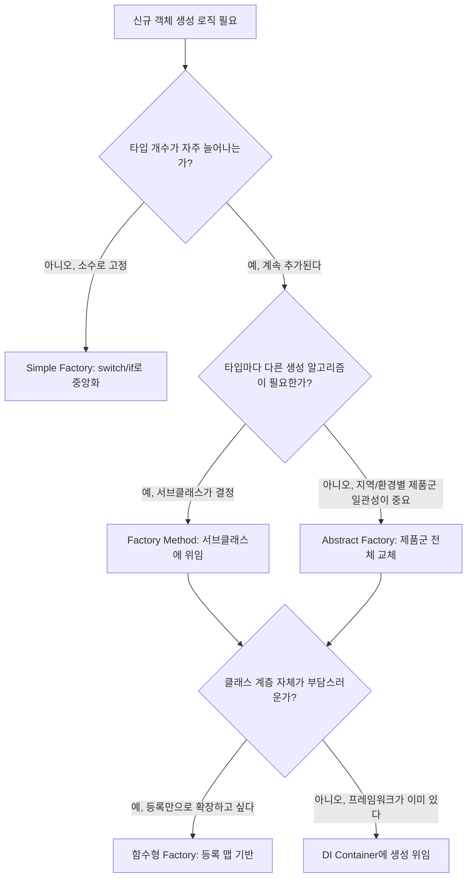

이 실습에서는 Simple Factory, Factory Method, Abstract Factory 패턴을 직접 구현하며 다양한 생성 전략을 익힙니다.

이 실습은 Simple Factory의 단순한 조건 분기부터 시작해 Factory Method, Abstract Factory, 그리고 어노테이션·DI 기반의 현대적 구현까지 단계적으로 확장하도록 구성했습니다. 결제 시스템 실습(실습 1)에서는 신규 결제 수단이 추가될 때마다 Simple Factory의 switch 문을 직접 고쳐야 하는 한계를 먼저 겪고, 이를 Factory Method의 다형적 위임과 Abstract Factory의 제품군 일관성으로 해결하는 과정을 순서대로 따라갑니다. 게임 캐릭터 실습(실습 2)에서는 Factory 패턴 하나만으로는 직업×종족 조합 폭발 문제를 해결할 수 없다는 것을 직접 확인하고 Builder·Flyweight와 조합해야 하는 이유를 학습하며, 로깅 실습(실습 3)에서는 클래스 계층을 늘리지 않고도 등록 맵 기반의 함수형 Factory로 OCP를 지킬 수 있음을 검증합니다.

## 실습 목표
- Simple Factory, Factory Method, Abstract Factory 패턴의 차이점 이해
- 실무에서 Factory 패턴이 적용되는 다양한 상황 경험
- 현대적 Factory 패턴(DI Container, Functional Factory) 구현
- Factory 패턴의 성능 특성과 최적화 방법 학습

실습 코드를 작성하기 전에 반드시 짚어야 할 개념 혼동이 하나 있습니다. TODO 4–5에서 만들 `PaymentServiceFactory`(Factory Method 패턴)와, 이미 자주 접해봤을 `Optional.of()` 같은 정적 팩토리 메서드(Static Factory Method)를 같은 것으로 오해하기 쉽습니다. 전자는 GoF가 『Design Patterns』(1994)에서 정의한 대로 추상 Creator가 서브클래스에 생성 책임을 위임하는 구조적 패턴이고, 후자는 Joshua Bloch가 『Effective Java』(2001)에서 제안한 명명 관용구일 뿐 상속 구조를 전제하지 않습니다. 또한 실습 1의 TODO 3에서 다루는 Simple Factory는 GoF 23개 패턴에 포함되지 않는 관용구입니다. 두 원전을 근거로 한 상세한 구분은 이론 챕터의 [흔한 오개념 바로잡기](/post/design-patterns/factory-patterns-evolution/#흔한-오개념-바로잡기) 절에 정리되어 있으니, TODO를 채우기 전에 먼저 읽어두면 어느 TODO가 왜 그런 구조로 요구되는지 이해하기 쉽습니다.

### 실습 1–3 비교

| 실습 | 다루는 패턴 | 핵심 학습 포인트 | 난이도 |
|------|-------------|-------------------|--------|
| 실습 1: 결제 시스템 | Simple Factory → Factory Method → Abstract Factory | 단계적 확장을 통해 OCP 위반과 그 해결 과정을 체감 | 중 |
| 실습 2: 게임 캐릭터 생성 | Factory + Builder + Flyweight | 조합 폭발 문제를 다른 패턴과의 조합으로 해결하는 감각 | 상 |
| 실습 3: 로깅 시스템 | 함수형 Factory (`Function<Config, T>`) | 클래스 계층 없이 맵 기반으로 OCP를 준수하는 방법 | 중 |

### 패턴 선택 흐름

위 표를 "언제 어떤 Factory를 선택하는가"라는 의사결정 흐름으로 정리하면 아래와 같습니다. 타입 개수의 변동성, 생성 알고리즘의 차이, 클래스 계층 자체의 부담이라는 세 가지 질문이 실습 1–3에서 각각 어떤 패턴으로 이어지는지 보여줍니다.



이 흐름에서 주목할 점은 화살표가 항상 "더 복잡한 패턴"으로만 향하지 않는다는 것입니다. 타입 개수가 적고 변동이 드물다면 Factory Method나 Abstract Factory로 미리 옮겨가는 것 자체가 불필요한 추상화 계층을 만드는 과잉 설계이며, 실습 1의 TODO 5–7(Abstract Factory)을 구현하기 전에 실제로 지역별 제품군 일관성이 필요한 상황인지 먼저 판단해야 합니다.

## 실습 1: 결제 시스템 Factory 패턴 적용

### 과제 설명
온라인 쇼핑몰의 결제 시스템을 구현합니다. 다양한 결제 방식(신용카드, PayPal, 암호화폐)을 지원하며, 각 결제 방식마다 다른 설정과 처리 로직이 필요합니다. Simple Factory부터 시작하는 이유는, 가장 단순한 형태의 생성 로직 중앙화를 먼저 체득한 뒤에야 Factory Method와 Abstract Factory가 해결하는 "확장성"과 "일관성" 문제를 체감할 수 있기 때문입니다. 아래 TODO들을 채워나가면서 각 단계에서 어떤 한계에 부딪히는지 직접 경험해보세요.

### 요구사항
1. **Simple Factory**: 기본적인 결제 프로세서 생성
2. **Factory Method**: 결제 서비스별 특화된 프로세서 생성
3. **Abstract Factory**: 지역별(미국, 유럽, 아시아) 결제 시스템 제공
4. **현대적 Factory**: 어노테이션 기반 자동 등록

### 코드 템플릿

아래는 `SimplePaymentFactory.createProcessor`와 `CreditCardProcessor`에 대한 완성된 참조 구현입니다. `PaymentType`, `PaymentConfig` 등 컴파일에 필요한 최소한의 보조 타입도 함께 정의했습니다. PayPal·암호화폐 프로세서, Factory Method, Abstract Factory, 어노테이션 기반 Factory, 테스트 코드는 이 참조 구현을 참고하여 직접 채워보세요.

```java
import java.util.List;

// 지원하는 결제 수단
public enum PaymentType {
    CREDIT_CARD, PAYPAL, CRYPTO
}

// Factory에 전달되는 최소 설정값
public class PaymentConfig {
    private final String apiKey;
    private final String endpoint;

    public PaymentConfig(String apiKey, String endpoint) {
        this.apiKey = apiKey;
        this.endpoint = endpoint;
    }

    public String getApiKey() { return apiKey; }
    public String getEndpoint() { return endpoint; }
}

// 결제 요청/검증/결과에 필요한 최소 데이터
public class PaymentRequest {
    private final double amount;
    private final String currency;

    public PaymentRequest(double amount, String currency) {
        this.amount = amount;
        this.currency = currency;
    }

    public double getAmount() { return amount; }
    public String getCurrency() { return currency; }
}

public class PaymentInfo {
    private final String cardNumber;

    public PaymentInfo(String cardNumber) {
        this.cardNumber = cardNumber;
    }

    public String getCardNumber() { return cardNumber; }
}

public class PaymentResult {
    private final boolean success;
    private final String message;

    public PaymentResult(boolean success, String message) {
        this.success = success;
        this.message = message;
    }

    public boolean isSuccess() { return success; }
    public String getMessage() { return message; }
}
```

위 다섯 타입은 Factory가 실제로 무엇을 만들고 어떤 데이터를 주고받는지 정의하는 최소 어휘입니다. `PaymentType`은 `SimplePaymentFactory`가 분기할 대상을, `PaymentConfig`는 프로세서 생성에 필요한 자격 증명을, `PaymentRequest`·`PaymentInfo`·`PaymentResult`는 결제 처리 과정에서 오가는 입력·검증·출력 데이터를 각각 나타냅니다. 다섯 타입 모두를 불변(immutable) 값 객체로 설계한 이유는, Factory가 반환한 이후에 이 데이터가 임의로 바뀌면 어떤 요청이 어떤 결과로 이어졌는지 추적할 수 없게 되기 때문입니다. setter 없이 생성자에서 필드를 확정하고 getter만 노출하는 패턴을 결제 도메인처럼 감사(audit) 추적이 중요한 곳에 우선 적용하는 것도 같은 이유입니다.

```java
// TODO 1: PaymentProcessor 인터페이스 정의 (완성됨)
public interface PaymentProcessor {
    PaymentResult processPayment(PaymentRequest request);
    boolean validatePayment(PaymentInfo info);
    String getProcessorName();
    List<String> getSupportedCurrencies();
}

// TODO 2: 구체적인 결제 프로세서들 구현
// CreditCardProcessor만 완성된 참조 구현이며, 나머지는 실습 과제로 남겨둡니다.
public class CreditCardProcessor implements PaymentProcessor {
    private final String apiKey;
    private final String endpoint;

    public CreditCardProcessor(String apiKey, String endpoint) {
        if (apiKey == null || apiKey.isBlank()) {
            throw new IllegalArgumentException("apiKey는 필수입니다");
        }
        this.apiKey = apiKey;
        this.endpoint = endpoint;
    }

    @Override
    public PaymentResult processPayment(PaymentRequest request) {
        if (!getSupportedCurrencies().contains(request.getCurrency())) {
            return new PaymentResult(false, "지원하지 않는 통화: " + request.getCurrency());
        }
        // 실제 구현에서는 endpoint로 HTTP 호출을 수행합니다.
        return new PaymentResult(true, "신용카드 결제 승인: " + request.getAmount() + " " + request.getCurrency());
    }

    @Override
    public boolean validatePayment(PaymentInfo info) {
        return info.getCardNumber() != null
            && info.getCardNumber().replaceAll("\\s", "").length() == 16;
    }

    @Override
    public String getProcessorName() {
        return "CreditCardProcessor";
    }

    @Override
    public List<String> getSupportedCurrencies() {
        return List.of("USD", "EUR", "KRW");
    }
}

public class PayPalProcessor implements PaymentProcessor {
    private final String clientId;
    private final String clientSecret;
    
    // TODO: 생성자 및 메서드 구현 (CreditCardProcessor 참고)
}

public class CryptoProcessor implements PaymentProcessor {
    private final String walletAddress;
    private final String network;
    
    // TODO: 생성자 및 메서드 구현 (CreditCardProcessor 참고)
}
```

`PaymentProcessor` 인터페이스는 결제 수단이 몇 개든 상관없이 `processPayment`·`validatePayment`·`getSupportedCurrencies` 세 메서드로 동일하게 다룰 수 있게 하는 다형성의 경계입니다. `CreditCardProcessor`는 이 계약을 완전히 구현한 참조 코드로, 카드번호 16자리 검증과 지원 통화 확인 로직이 실제로 동작합니다. 반면 `PayPalProcessor`와 `CryptoProcessor`는 필드만 선언된 스텁이므로, `CreditCardProcessor`의 생성자 검증 패턴과 `processPayment`의 통화 확인 로직을 그대로 옮겨 채워야 아래 `SimplePaymentFactory`가 컴파일됩니다.

```java
// TODO 3: Simple Factory 구현 (완성됨)
// CREDIT_CARD 분기만 완전히 구현되어 있습니다. PAYPAL, CRYPTO는
// PayPalProcessor, CryptoProcessor를 완성한 뒤 동일한 방식으로 연결하세요.
public class SimplePaymentFactory {
    public static PaymentProcessor createProcessor(PaymentType type, PaymentConfig config) {
        switch (type) {
            case CREDIT_CARD:
                return new CreditCardProcessor(config.getApiKey(), config.getEndpoint());
            case PAYPAL:
                // TODO: PayPalProcessor 구현 후 연결
                throw new UnsupportedOperationException("PayPalProcessor는 아직 구현되지 않았습니다");
            case CRYPTO:
                // TODO: CryptoProcessor 구현 후 연결
                throw new UnsupportedOperationException("CryptoProcessor는 아직 구현되지 않았습니다");
            default:
                throw new IllegalArgumentException("Unsupported payment type: " + type);
        }
    }
}
```

TODO 3까지는 `PaymentProcessor` 인터페이스 하나와 그것을 조건 분기로 생성하는 `SimplePaymentFactory` 하나로 끝나는, Factory 패턴 중 가장 단순한 형태였습니다. TODO 4부터는 결제 프로세서 하나만 만드는 것이 아니라 프로세서·검증기·로거를 한 세트로 묶어 생성해야 하므로, 먼저 이 세트를 구성하는 협력 객체(`PaymentValidator`, `PaymentLogger`, `CurrencyConverter`, `TaxCalculator`)를 최소 인터페이스로 정의해두어야 합니다. 아래 코드는 이 협력 객체들의 스텁과, 그것들을 조합해 서비스 하나를 완성하는 Template Method(`createPaymentService`)까지 이어서 정의합니다.

```java
// 아래 4개 타입은 TODO 4, 6에서 참조하는 최소 필드만 가진 스텁입니다.
// 실제 구현 로직은 각 TODO를 채우면서 직접 확장하세요.
public class PaymentService {
    private final PaymentProcessor processor;
    private final PaymentValidator validator;
    private final PaymentLogger logger;

    public PaymentService(PaymentProcessor processor, PaymentValidator validator, PaymentLogger logger) {
        this.processor = processor;
        this.validator = validator;
        this.logger = logger;
    }
}

public interface PaymentValidator {
    boolean validate(PaymentInfo info);
}

public interface PaymentLogger {
    void logPayment(PaymentRequest request, PaymentResult result);
}

public interface CurrencyConverter {
    double convert(double amount, String fromCurrency, String toCurrency);
}

public interface TaxCalculator {
    double calculateTax(double amount, String region);
}

// TODO 4: Factory Method 패턴 구현
public abstract class PaymentServiceFactory {
    // TODO: abstract 메서드 정의
    // - createPaymentProcessor()
    // - createPaymentValidator()
    // - createPaymentLogger()
    
    // TODO: Template Method로 서비스 생성 과정 정의
    public final PaymentService createPaymentService() {
        PaymentProcessor processor = createPaymentProcessor();
        PaymentValidator validator = createPaymentValidator();
        PaymentLogger logger = createPaymentLogger();
        
        return new PaymentService(processor, validator, logger);
    }
}

// TODO 5: 구체적인 Factory Method 구현
public class CreditCardServiceFactory extends PaymentServiceFactory {
    // TODO: 신용카드 전용 컴포넌트들 생성 구현
}

public class PayPalServiceFactory extends PaymentServiceFactory {
    // TODO: PayPal 전용 컴포넌트들 생성 구현
}

// TODO 6: Abstract Factory 패턴 구현
public interface RegionalPaymentFactory {
    PaymentProcessor createCreditCardProcessor();
    PaymentProcessor createDigitalWalletProcessor();
    PaymentValidator createPaymentValidator();
    CurrencyConverter createCurrencyConverter();
    TaxCalculator createTaxCalculator();
}

// TODO 7: 지역별 구체적인 Factory 구현
public class USPaymentFactory implements RegionalPaymentFactory {
    // TODO: 미국 결제 시스템에 특화된 구현
}

public class EuropePaymentFactory implements RegionalPaymentFactory {
    // TODO: 유럽 결제 시스템에 특화된 구현
}

public class AsiaPaymentFactory implements RegionalPaymentFactory {
    // TODO: 아시아 결제 시스템에 특화된 구현
}
```

TODO 6–7까지는 컴파일 타임에 확정된 `USPaymentFactory`, `EuropePaymentFactory`, `AsiaPaymentFactory` 세 구현체만으로 지역을 나눴습니다. 하지만 실무에서는 새 결제 수단이나 새 지역이 배포 이후에 플러그인 형태로 추가되는 경우가 많아, 코드를 다시 컴파일하지 않고도 구현체를 등록할 방법이 필요합니다. TODO 8–9는 어노테이션과 리플렉션으로 이 문제를 해결하는데, `@PaymentProcessorProduct`가 붙은 클래스를 클래스패스에서 스캔해 맵에 등록하는 방식이므로 아래 코드에는 `Map`·`HashMap`·`java.lang.annotation` 패키지에 대한 임포트가 추가로 필요합니다.

```java
import java.lang.annotation.ElementType;
import java.lang.annotation.Retention;
import java.lang.annotation.RetentionPolicy;
import java.lang.annotation.Target;
import java.util.HashMap;
import java.util.Map;
import org.junit.jupiter.api.Test;

// TODO 8: 어노테이션 기반 현대적 Factory
@Retention(RetentionPolicy.RUNTIME)
@Target(ElementType.TYPE)
public @interface PaymentProcessorProduct {
    String value(); // payment type identifier
    String region() default "global";
    int priority() default 0;
}

// TODO 9: 자동 등록 Factory 구현
public class AutoPaymentProcessorFactory {
    private static final Map<String, Class<? extends PaymentProcessor>> processors = new HashMap<>();
    
    static {
        // TODO: classpath scanning을 통한 자동 등록 구현
        // 힌트: @PaymentProcessorProduct 어노테이션이 붙은 클래스들을 찾아서 등록
    }
    
    public PaymentProcessor createProcessor(String type, String region) {
        // TODO: 타입과 지역에 맞는 프로세서 생성
        return null;
    }
}

// TODO 10: 테스트 코드 작성
public class PaymentFactoryTest {
    @Test
    public void testSimpleFactory() {
        // TODO: Simple Factory 테스트
    }
    
    @Test
    public void testFactoryMethod() {
        // TODO: Factory Method 테스트
    }
    
    @Test
    public void testAbstractFactory() {
        // TODO: Abstract Factory 테스트
    }
    
    @Test
    public void testAutoFactory() {
        // TODO: 자동 등록 Factory 테스트
    }
}
```

TODO 6–7까지 채우고 나면 `RegionalPaymentFactory`가 지역별로 결제 프로세서·검증기·통화 변환기·세금 계산기를 한 세트로 묶어 반환한다는 것을 알 수 있습니다. 이 일관성이 Abstract Factory의 핵심 가치이자 동시에 한계이기도 합니다. 새 결제 수단(예: `createBankTransferProcessor()`)을 제품군에 추가하려면 `RegionalPaymentFactory` 인터페이스와 US/Europe/Asia 세 구현체를 모두 고쳐야 하므로, 제품 종류가 자주 늘어나는 도메인에는 Abstract Factory가 오히려 OCP를 해칩니다. TODO 8–9의 어노테이션 기반 자동 등록은 이 문제를 리플렉션으로 우회하지만, 클래스패스 스캔 비용과 어노테이션 오탐(같은 `value()`를 가진 프로세서가 중복 등록되는 경우)을 별도로 검증해야 실무에 쓸 수 있습니다.

## 실습 2: 게임 캐릭터 생성 시스템

### 과제 설명
MMORPG 게임의 캐릭터 생성 시스템을 구현합니다. 다양한 직업(전사, 마법사, 궁수)과 종족(인간, 엘프, 드워프)의 조합을 지원해야 합니다. 이 실습은 Factory 패턴을 Builder, Flyweight와 조합하는 경험을 목표로 합니다. 직업×종족 조합이 늘어날수록 단순 Factory만으로는 생성 로직이 기하급수적으로 복잡해지므로, 언제 다른 패턴과 조합해야 하는지 판단하는 감각을 기르는 것이 이 실습의 핵심입니다.

### 코드 템플릿

`CharacterFactory`에 Builder를 결합하는 이유는 직업×종족 조합이 늘어날수록 한 캐릭터를 완성하는 데 필요한 인자 조합이 기하급수적으로 늘어나기 때문입니다. 캐릭터는 이름·종족·직업·스탯·스킬 목록·장비까지 여섯 개 필드를 조합해야 하는데, 이 조합을 모두 커버하는 오버로드 생성자나 `createWarrior`류의 정적 팩토리 메서드만으로는 새 조합(예: 엘프 전사와 드워프 전사의 스킬 구성 차이)이 나올 때마다 메서드를 추가해야 합니다. `builder()`가 반환하는 `CharacterBuilder`는 이 조립 과정을 단계별 메서드 체이닝으로 표현해 팀·직업·장비를 선택적으로 조합하게 하면서도, `createWarrior`처럼 자주 쓰는 조합은 Factory의 이름 있는 진입점으로 그대로 남겨둡니다. `OptimizedCharacterFactory`에서 한 걸음 더 나아가 Flyweight까지 결합하는 이유는, Builder가 매번 새로 만드는 `Stats`나 `Skill` 목록 상당수가 같은 종족·직업 조합이라면 사실상 동일한 값이어서 굳이 매번 새로 생성할 필요가 없기 때문입니다.

```java
// TODO 1: 캐릭터 관련 클래스들 정의
public abstract class GameCharacter {
    protected String name;
    protected Race race;
    protected Job job;
    protected Stats stats;
    protected List<Skill> skills;
    protected Equipment equipment;
    
    // TODO: 캐릭터 기본 메서드들 구현
}

// TODO 2: Builder 패턴과 Factory 패턴 조합
public class CharacterFactory {
    public static CharacterBuilder builder() {
        return new CharacterBuilder();
    }
    
    // TODO: 미리 정의된 캐릭터 템플릿들
    public static GameCharacter createWarrior(String name) {
        // TODO: 전사 캐릭터 생성
        return null;
    }
    
    public static GameCharacter createMage(String name) {
        // TODO: 마법사 캐릭터 생성
        return null;
    }
    
    public static GameCharacter createArcher(String name) {
        // TODO: 궁수 캐릭터 생성
        return null;
    }
}

// TODO 3: 성능 최적화된 Flyweight + Factory 조합
public class OptimizedCharacterFactory {
    // TODO: 공통 데이터를 Flyweight로 관리
    // TODO: Object Pool 패턴으로 성능 최적화
}
```

`OptimizedCharacterFactory`를 구현할 때 주의할 점은 Flyweight로 공유하는 데이터와 캐릭터별 고유 상태를 명확히 분리해야 한다는 것입니다. 종족·직업에 따른 기본 스탯이나 스킬 목록처럼 여러 캐릭터가 동일하게 참조하는 값은 Flyweight로 캐싱해 메모리를 절약할 수 있지만, 현재 체력이나 장착 장비처럼 캐릭터마다 달라지는 가변 상태를 실수로 Flyweight 안에 두면 한 캐릭터의 상태 변경이 같은 Flyweight를 공유하는 다른 캐릭터에도 번져버립니다. Object Pool을 함께 적용할 때도 재사용 전 상태 초기화(리셋)를 빠뜨리면 이전 캐릭터의 잔여 데이터가 새 캐릭터에 노출되는 버그로 이어지므로, 멀티스레드 환경에서 풀을 공유한다면 반납·재사용 시점의 동시성 제어도 함께 설계해야 합니다.

## 실습 3: 로깅 시스템 Factory

### 과제 설명
다양한 로깅 백엔드(콘솔, 파일, 데이터베이스, 원격 서버)를 지원하는 로깅 시스템을 구현합니다. 이 실습은 전통적인 클래스 기반 Factory 대신 함수(`Function<LoggerConfig, Logger>`)를 값으로 다루는 함수형 Factory를 연습하는 데 목적이 있습니다. 백엔드별 생성 로직을 맵에 등록해두면 새 백엔드 추가 시 기존 분기문을 수정하지 않아도 되는데, 이는 실습 1의 switch 기반 Simple Factory가 가진 OCP 위반 문제를 함수형 스타일로 어떻게 해결하는지 보여줍니다.

### 코드 템플릿

아래는 `ConsoleLogger`와 `FunctionalLoggerFactory.createLogger`의 `CONSOLE` 경로에 대한 완성된 참조 구현입니다. `LogLevel`, `LoggerType`, `LoggerConfig` 등 컴파일에 필요한 최소 보조 타입도 함께 정의했습니다. `FILE`, `DATABASE`, `REMOTE` 백엔드와 `createCompositeLogger`는 이 참조 구현을 참고하여 직접 채워보세요.

```java
import java.util.Arrays;
import java.util.Map;
import java.util.function.Function;

// TODO 1: 로거 인터페이스와 구현체들
public interface Logger {
    void log(LogLevel level, String message, Object... args);
    void log(LogLevel level, String message, Throwable throwable);
    boolean isEnabled(LogLevel level);
}

// 함수형 Factory가 다루는 최소 보조 타입입니다.
// LoggerType은 지원 백엔드 종류를, LoggerConfig는 백엔드별 최소 설정값을 나타냅니다.
public enum LogLevel {
    DEBUG, INFO, WARN, ERROR
}

public enum LoggerType {
    CONSOLE, FILE, DATABASE, REMOTE
}

public class LoggerConfig {
    private final LogLevel minLevel;
    private final String target; // FILE은 경로, REMOTE는 엔드포인트로 사용(CONSOLE은 무시)

    public LoggerConfig(LogLevel minLevel, String target) {
        this.minLevel = minLevel;
        this.target = target;
    }

    public LogLevel getMinLevel() { return minLevel; }
    public String getTarget() { return target; }
}

// ConsoleLogger는 실습 1의 CreditCardProcessor와 마찬가지로 완성된 참조 구현입니다.
public class ConsoleLogger implements Logger {
    private final LogLevel minLevel;

    public ConsoleLogger(LoggerConfig config) {
        this.minLevel = config.getMinLevel();
    }

    @Override
    public void log(LogLevel level, String message, Object... args) {
        if (!isEnabled(level)) {
            return;
        }
        String formatted = (args.length == 0) ? message : message + " " + Arrays.toString(args);
        System.out.println("[" + level + "] " + formatted);
    }

    @Override
    public void log(LogLevel level, String message, Throwable throwable) {
        if (!isEnabled(level)) {
            return;
        }
        System.out.println("[" + level + "] " + message);
        throwable.printStackTrace(System.out);
    }

    @Override
    public boolean isEnabled(LogLevel level) {
        return level.ordinal() >= minLevel.ordinal();
    }
}

// TODO 2: 함수형 Factory 구현
public class FunctionalLoggerFactory {
    private static final Map<LoggerType, Function<LoggerConfig, Logger>> factories = Map.of(
        LoggerType.CONSOLE, ConsoleLogger::new
        // TODO: FILE, DATABASE, REMOTE 타입별 생성 함수를 같은 방식으로 등록
    );

    public static Logger createLogger(LoggerType type, LoggerConfig config) {
        Function<LoggerConfig, Logger> factory = factories.get(type);
        if (factory == null) {
            throw new UnsupportedOperationException(type + " 로거는 아직 등록되지 않았습니다");
        }
        return factory.apply(config);
    }

    // TODO: 복합 로거 생성 (여러 백엔드에 동시 로깅)
    public static Logger createCompositeLogger(LoggerConfig... configs) {
        // TODO: Composite 패턴과 Factory 패턴 조합
        return null;
    }
}
```

함수형 Factory는 `Map<LoggerType, Function<LoggerConfig, Logger>>`에 생성 로직을 값으로 등록하므로 새 백엔드를 추가할 때 기존 코드를 수정할 필요가 없다는 점에서 실습 1의 switch 기반 Simple Factory보다 OCP를 더 직접적으로 지킵니다. 다만 `Map.of(...)`로 만든 등록 테이블은 불변이므로 런타임에 새 로거 타입을 동적으로 추가할 수 없고, 이런 유연성이 필요하면 `ConcurrentHashMap`처럼 가변 컬렉션과 스레드 안전성을 함께 고려해야 합니다. 또한 람다로 구현을 감추면 클래스 이름 기반 스택 트레이스가 사라져 디버깅 시 어떤 생성 로직이 실패했는지 추적하기 어려워지므로, 예외 발생 시 로거 타입을 메시지에 명시하는 등의 보완이 필요합니다.

## 체크리스트

### 기본 구현
- [ ] Simple Factory로 기본적인 객체 생성 구현 — 생성 로직 중앙화의 기본 개념을 체득하기 위함
- [ ] Factory Method로 확장 가능한 생성 구조 구현 — Simple Factory의 OCP 위반을 해결하는 경험을 위함
- [ ] Abstract Factory로 관련 객체군 생성 구현 — 제품군 간 일관성 보장 방법을 익히기 위함
- [ ] 각 Factory 패턴의 차이점을 명확히 이해 — 상황에 맞는 패턴 선택 기준을 세우기 위함

### 현대적 구현
- [ ] 어노테이션 기반 자동 등록 Factory 구현 — 리플렉션 기반 확장 방식의 장단점을 체감하기 위함
- [ ] 함수형 스타일 Factory 구현 — 클래스 계층 없이 조합 가능한 생성 방식을 익히기 위함
- [ ] DI Container와 연계된 Factory 구현 — 실무에서 Factory가 프레임워크에 흡수되는 방식을 이해하기 위함
- [ ] Generic을 활용한 타입 안전한 Factory 구현 — 컴파일 타임에 타입 오류를 방지하기 위함

### 성능 최적화
- [ ] Object Pool과 Factory 패턴 조합 — 생성 비용이 높은 객체의 재사용 전략을 익히기 위함
- [ ] Flyweight 패턴과 Factory 조합 — 공유 가능한 상태를 분리해 메모리를 절약하기 위함
- [ ] Lazy initialization 구현 — 실제로 필요한 시점까지 생성 비용을 지연시키기 위함
- [ ] 캐싱 메커니즘 적용 — 반복 생성 비용(특히 리플렉션)을 줄이기 위함

### 테스트 및 검증
- [ ] 단위 테스트 작성 (최소 80% 커버리지) — Factory가 반환하는 객체의 정확성을 보장하기 위함
- [ ] 성능 벤치마크 테스트 — Factory 방식별 오버헤드를 실측으로 비교하기 위함
- [ ] 메모리 사용량 분석 — 풀링·Flyweight 적용 효과를 정량적으로 확인하기 위함
- [ ] 동시성 테스트 (멀티스레드 환경) — 캐시나 풀 공유 시 스레드 안전성을 검증하기 위함

## 추가 도전

### 고급 패턴 조합
1. **Factory + Decorator**: 생성된 객체에 자동으로 기능 추가 — 예를 들어 `CreditCardProcessor` 생성 직후 로깅·재시도 데코레이터를 씌우면, Factory가 "무엇을 만들지"와 "만든 후 어떤 부가 기능을 씌울지"를 분리해 각 프로세서 구현체를 건드리지 않고도 공통 기능을 추가할 수 있습니다.
2. **Factory + Observer**: 객체 생성 이벤트 알림 시스템 — Factory 내부에서 인스턴스를 반환하기 직전 Observer들에게 통지하면, 생성 개수 모니터링이나 감사 로그 기록을 Factory 로직과 분리된 관심사로 유지할 수 있습니다.
3. **Factory + Strategy**: 생성 전략을 런타임에 변경 — 어떤 구체 클래스를 생성할지 결정하는 알고리즘 자체를 Strategy 객체로 뽑아내면, 실습 1의 `SimplePaymentFactory`처럼 switch 문을 고치지 않고도 전략 객체 교체만으로 생성 규칙을 바꿀 수 있습니다.
4. **Factory + Proxy**: 생성된 객체에 자동으로 프록시 적용 — 원격 결제 게이트웨이 호출처럼 지연이 큰 작업은 Factory가 실제 객체 대신 지연 로딩 프록시를 반환하게 하면, 호출 시점까지 실제 연결 비용을 미룰 수 있습니다.

### 실무 시나리오
1. **마이크로서비스 환경**에서 서비스 인스턴스 Factory — 서비스 디스커버리 결과에 따라 같은 인터페이스의 다른 리전 인스턴스를 생성해야 하므로, Abstract Factory의 "제품군 일관성"이 지역별 서비스 클라이언트 묶음에 그대로 적용됩니다.
2. **Spring Framework**와 연계된 Factory Bean 구현 — `FactoryBean<T>`을 구현하면 복잡한 초기화 로직을 컨테이너가 관리하는 Bean 생성 과정에 자연스럽게 편입시킬 수 있어, 실습 1의 수동 Factory 코드를 프레임워크 표준 확장 지점으로 옮기는 감각을 익히게 됩니다.
3. **테스트 환경**에서 Mock 객체 Factory — 테스트마다 반복되는 Mock 생성 로직(스텁 응답 설정 포함)을 Factory로 중앙화하면, 프로덕션 코드의 Factory 패턴이 테스트 코드에서도 동일한 이점(변경 지점 최소화)을 제공한다는 것을 확인할 수 있습니다.
4. **플러그인 아키텍처**에서 동적 Factory — TODO 8–9의 어노테이션 기반 자동 등록처럼, 플러그인 jar가 배포된 후에도 클래스패스 스캔만으로 새 구현체를 인식해야 하는 상황에서 리플렉션 기반 Factory가 정적 팩토리보다 유리합니다.

## 실무 적용

### 프로젝트 적용 가이드
1. **현재 프로젝트에서** 객체 생성이 복잡한 부분 식별 — `new` 호출이 여러 파일에 흩어져 있거나 같은 조건 분기가 반복된다면 Factory로 중앙화할 후보입니다.
2. **적절한 Factory 패턴** 선택 기준 수립 — 위 "패턴 선택 흐름" 다이어그램의 세 질문(타입 변동성, 생성 알고리즘 차이, 클래스 계층 부담)을 팀 내 체크리스트로 문서화합니다.
3. **점진적 적용** 계획 수립 — Simple Factory로 먼저 중앙화한 뒤 실제로 확장 요구가 생길 때만 Factory Method·Abstract Factory로 승격하면, 처음부터 과도한 추상화를 만드는 위험을 피할 수 있습니다.
4. **팀원들과 패턴** 사용 가이드라인 공유 — 코드 리뷰에서 "이 조건 분기는 Factory로 옮길 대상인가"를 판단 기준으로 삼으면, 개인마다 다른 생성 로직 스타일이 누적되는 것을 막을 수 있습니다.

## 평가 기준

이 실습을 마쳤다고 판단하기 전에, 아래 5가지 성과 목표를 각각 예/아니오로 스스로 점검해보세요. 모호한 소감이 아니라 코드에서 직접 확인할 수 있는 항목으로만 구성했습니다.

1. `SimplePaymentFactory`에 PAYPAL·CRYPTO 분기를 추가한 뒤에도 기존 CREDIT_CARD 분기 코드를 한 줄도 수정하지 않고 새 case만 추가했는가 — Simple Factory의 OCP 위반 지점을 실제로 체감했는지 확인합니다.
2. `CreditCardServiceFactory`와 `PayPalServiceFactory`(Factory Method)가 각각 다른 `PaymentValidator`·`PaymentLogger` 구현을 반환하도록 작성해, 두 Factory로 만든 `PaymentService`의 검증·로깅 동작이 실제로 달라지는가.
3. `USPaymentFactory`·`EuropePaymentFactory`·`AsiaPaymentFactory`(Abstract Factory)가 반환하는 프로세서 2종·검증기·통화 변환기·세금 계산기 다섯 개 제품이 지역별로 서로 일관되게 짝지어지는지 단위 테스트로 검증했는가.
4. 실습 2에서 같은 종족·직업 조합으로 만든 두 캐릭터가 `OptimizedCharacterFactory`를 통해 동일한 `Stats` 객체를 참조(`==` 비교로 확인)하면서도, 한쪽의 장비 교체나 체력 변화가 다른 쪽에 전혀 영향을 주지 않는가.
5. `FunctionalLoggerFactory`에 FILE·DATABASE·REMOTE 로거를 추가할 때 `factories` 맵에 항목만 추가하고 `createLogger` 메서드 본문은 한 글자도 고치지 않았는가 — 함수형 Factory가 OCP를 지키는 방식을 검증합니다.

성능 측정·메모리 분석·동시성 검증 항목은 위 체크리스트의 "성능 최적화"·"테스트 및 검증" 절을 참고하세요.

---

**핵심 포인트**: Factory 패턴은 단순한 객체 생성을 넘어 시스템의 유연성과 확장성을 좌우하는 핵심 설계 요소입니다. 각 패턴의 특성을 이해하고 상황에 맞게 적용하는 것이 중요합니다. 