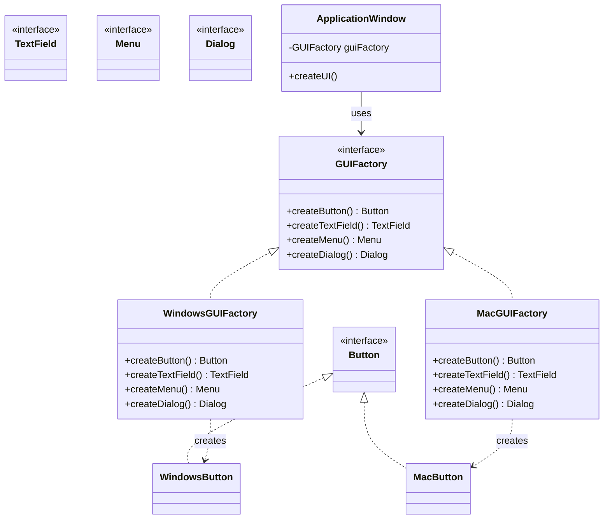

Simple Factory부터 Abstract Factory까지, Factory 패턴군의 진화 과정을 탐구합니다. 객체 생성의 복잡성을 어떻게 캡슐화하고, 유연한 시스템을 구축하는지 학습합니다.

## 서론: new 키워드의 한계와 객체 생성의 딜레마

> *"객체를 만드는 일은 쉽다. 올바른 객체를 올바른 시점에 올바른 방식으로 만드는 일은 어렵다."*

자바를 처음 배울 때 가장 먼저 접하는 키워드 중 하나가 `new`입니다. `new Button()`, `new ArrayList()`, `new Date()`... 이렇게 객체를 만드는 것이 당연해 보입니다. 하지만 시스템이 복잡해지면서 우리는 **"new의 한계"**에 부딪히게 됩니다.

이 글의 예제 전반에서는 결제 도메인을 소재로 삼는다. 아래는 이후 코드 블록들이 공통으로 참조하는 최소 타입 정의로, 실제 결제 API 연동 로직 대신 컴파일 가능성만 보장하는 뼈대만 담았다:

```java
// 이후 예제 전반에서 재사용하는 최소 타입 정의
public interface PaymentProcessor {
    void process(Payment payment);
}

public class Payment {
    private final double amount;
    public Payment(double amount) { this.amount = amount; }
    public double getAmount() { return amount; }
}

public class Customer {
    private final String email;
    public Customer(String email) { this.email = email; }
    public String getEmail() { return email; }
}

public enum PaymentType { CREDIT_CARD, PAYPAL, BANK_TRANSFER, CRYPTOCURRENCY }

public class Order {
    private final Payment payment;
    private final Customer customer;
    private final PaymentType paymentType;

    public Order(Payment payment, Customer customer, PaymentType paymentType) {
        this.payment = payment;
        this.customer = customer;
        this.paymentType = paymentType;
    }

    public Payment getPayment() { return payment; }
    public Customer getCustomer() { return customer; }
    public PaymentType getPaymentType() { return paymentType; }
}

public class CreditCardProcessor implements PaymentProcessor {
    @Override
    public void process(Payment payment) { /* 카드사 API 호출 */ }
}

public class PayPalProcessor implements PaymentProcessor {
    @Override
    public void process(Payment payment) { /* PayPal API 호출 */ }
}

public class BankTransferProcessor implements PaymentProcessor {
    @Override
    public void process(Payment payment) { /* 은행 이체 API 호출 */ }
}

public interface EmailNotifier {
    void sendConfirmation(Customer customer);
}

public class SmtpEmailNotifier implements EmailNotifier {
    @Override
    public void sendConfirmation(Customer customer) { /* SMTP 발송 */ }
}
```

```java
// 언뜻 보기에는 문제없어 보이는 코드
public class OrderService {
    public void processOrder(Order order) {
        PaymentProcessor processor = new CreditCardProcessor();  // 하드코딩!
        EmailNotifier notifier = new SmtpEmailNotifier();       // 하드코딩!
        
        processor.process(order.getPayment());
        notifier.sendConfirmation(order.getCustomer());
    }
}
```

이 코드의 문제점은 무엇일까요? **생성(`new`)과 사용(메서드 호출)이 강하게 결합**되어 있다는 것입니다:

1. **확장성 부족**: 새로운 결제 방식을 추가하려면 코드 수정 필요
2. **테스트 어려움**: Mock 객체로 교체하기 어려움  
3. **의존성 결합**: 구체 클래스에 직접 의존
4. **설정 복잡성**: 객체 생성 매개변수가 복잡할 때 관리 어려움

Factory 패턴은 이러한 **"생성의 복잡성"**을 해결하기 위해 진화해온 패턴군입니다. 단순한 Simple Factory부터 현대의 DI Container까지, 이들의 진화 과정을 따라가다 보면 **객체지향 설계의 핵심 원리**들을 발견할 수 있습니다.

### Simple Factory: 생성 로직의 중앙화

#### 가장 단순한 해결책

가장 먼저 떠오르는 해결책은 **생성 로직을 별도의 클래스로 분리**하는 것입니다:

```java
// Simple Factory 패턴
public class PaymentProcessorFactory {
    public static PaymentProcessor create(PaymentType type) {
        switch (type) {
            case CREDIT_CARD:
                return new CreditCardProcessor();
            case PAYPAL:
                return new PayPalProcessor();
            case BANK_TRANSFER:
                return new BankTransferProcessor();
            default:
                throw new IllegalArgumentException("Unsupported payment type: " + type);
        }
    }
}

// 사용하는 쪽
public class OrderService {
    public void processOrder(Order order) {
        PaymentProcessor processor = PaymentProcessorFactory.create(order.getPaymentType());
        processor.process(order.getPayment());
    }
}
```

**Simple Factory의 장점:**
- **생성 로직 중앙화**: 모든 생성 로직이 한 곳에 집중
- **클라이언트 단순화**: 구체 클래스를 알 필요 없음
- **일관성**: 동일한 방식으로 객체 생성

**하지만 한계도 명확합니다:**
```java
// 새로운 결제 방식 추가 시
public static PaymentProcessor create(PaymentType type) {
    switch (type) {
        case CREDIT_CARD:
            return new CreditCardProcessor();
        case PAYPAL:
            return new PayPalProcessor();
        case BANK_TRANSFER:
            return new BankTransferProcessor();
        case CRYPTOCURRENCY:  // 새로 추가
            return new CryptocurrencyProcessor();  // 기존 코드 수정!
        default:
            throw new IllegalArgumentException("Unsupported payment type: " + type);
    }
}
```

이는 **개방-폐쇄 원칙(OCP) 위반**입니다. 확장을 위해 기존 코드를 수정해야 합니다.

#### Static Factory Methods의 미학

Joshua Bloch의 『Effective Java』(2001, 1st ed.)에서 강조하는 **Static Factory Methods**는 Simple Factory의 세련된 형태입니다:

```java
// Java의 실제 사례들
List<String> emptyList = Collections.emptyList();
Optional<String> optional = Optional.of("value");
LocalDate today = LocalDate.now();
Integer number = Integer.valueOf(42);  // new Integer(42)보다 권장

// 장점을 보여주는 커스텀 예제
public class DatabaseConnection {
    private final String url;
    private final ConnectionType type;
    
    private DatabaseConnection(String url, ConnectionType type) {
        this.url = url;
        this.type = type;
    }
    
    // 의미 있는 이름으로 생성 의도를 명확히 전달
    public static DatabaseConnection forMySQL(String host, int port, String database) {
        String url = String.format("jdbc:mysql://%s:%d/%s", host, port, database);
        return new DatabaseConnection(url, ConnectionType.MYSQL);
    }
    
    public static DatabaseConnection forPostgreSQL(String host, int port, String database) {
        String url = String.format("jdbc:postgresql://%s:%d/%s", host, port, database);
        return new DatabaseConnection(url, ConnectionType.POSTGRESQL);
    }
    
    public static DatabaseConnection fromUrl(String url) {
        ConnectionType type = ConnectionType.fromUrl(url);
        return new DatabaseConnection(url, type);
    }
    
    // 캐싱을 통한 성능 최적화도 가능
    private static final Map<String, DatabaseConnection> cache = new ConcurrentHashMap<>();
    
    public static DatabaseConnection cached(String url) {
        return cache.computeIfAbsent(url, DatabaseConnection::fromUrl);
    }
}
```

**Static Factory Methods의 장점:**
- **명확한 의미**: `forMySQL()`이 `new DatabaseConnection()`보다 의도가 명확
- **유연한 반환**: 서브클래스나 인터페이스 구현체 반환 가능
- **인스턴스 제어**: 캐싱, 풀링, 싱글톤 패턴 적용 가능
- **매개변수 제약 회피**: 동일한 시그니처 문제 해결

### Factory Method Pattern: 생성 책임의 위임

#### Template Method와의 만남

Simple Factory의 OCP 위반 문제를 해결하는 방법은 **생성 책임을 서브클래스에 위임**하는 것입니다. 이것이 바로 Factory Method 패턴입니다:

```java
// 추상 Creator 클래스
public abstract class PaymentServiceCreator {
    // Template Method: 전체 프로세스를 정의
    public final PaymentResult processPayment(PaymentRequest request) {
        PaymentProcessor processor = createPaymentProcessor();  // Factory Method
        
        // 공통 로직
        logPaymentAttempt(request);
        PaymentResult result = processor.process(request);
        logPaymentResult(result);
        
        return result;
    }
    
    // Factory Method: 서브클래스에서 구현
    protected abstract PaymentProcessor createPaymentProcessor();
    
    // 공통 기능들
    private void logPaymentAttempt(PaymentRequest request) {
        System.out.println("Processing payment: " + request.getAmount());
    }
    
    private void logPaymentResult(PaymentResult result) {
        System.out.println("Payment result: " + result.getStatus());
    }
}

// 구체적인 Creator 구현들
public class CreditCardPaymentService extends PaymentServiceCreator {
    @Override
    protected PaymentProcessor createPaymentProcessor() {
        return new CreditCardProcessor();
    }
}

public class PayPalPaymentService extends PaymentServiceCreator {
    @Override
    protected PaymentProcessor createPaymentProcessor() {
        return new PayPalProcessor();
    }
}

// 새로운 결제 방식 추가 - 기존 코드 수정 없음!
public class CryptocurrencyPaymentService extends PaymentServiceCreator {
    @Override
    protected PaymentProcessor createPaymentProcessor() {
        return new CryptocurrencyProcessor();
    }
}
```

**Factory Method의 핵심 특징:**
- **OCP 준수**: 새로운 타입 추가 시 기존 코드 수정 불필요
- **Template Method 연계**: 생성과 사용이 하나의 알고리즘으로 통합
- **다형성 활용**: 서브클래스별로 다른 객체 생성

#### 실제 사례: Java Collections Framework

Java Collections Framework는 Factory Method 패턴의 훌륭한 예시입니다. 다만 실제 OpenJDK 구현에서 `iterator()`와 `listIterator()`는 서로 위임하는 관계가 **아니라는** 점에 주의해야 합니다 — 이는 흔히 오해하기 쉬운 지점이라 아래에서 정확한 구조를 짚습니다:

```java
// AbstractList의 iterator() / listIterator() (OpenJDK 실제 구조를 단순화)
public abstract class AbstractList<E> extends AbstractCollection<E> implements List<E> {

    // Factory Method 1: 순방향 전용 Iterator를 반환
    public Iterator<E> iterator() {
        return new Itr();  // listIterator()에 위임하지 않음
    }

    // Factory Method 2: 양방향 탐색이 가능한 ListIterator를 반환
    public ListIterator<E> listIterator() {
        return listIterator(0);
    }

    public ListIterator<E> listIterator(final int index) {
        rangeCheckForAdd(index);
        return new ListItr(index);  // 기본 구현
    }

    private class Itr implements Iterator<E> {
        // 기본 fail-fast Iterator 구현
    }

    private class ListItr extends Itr implements ListIterator<E> {
        // Itr을 확장해 양방향 이동·set·add를 추가 구현
    }

    // ArrayList, LinkedList 등에서 각각 최적화된 Iterator/ListIterator 구현
}

// ArrayList의 구현 (java.util.ArrayList 실제 구조를 단순화)
public class ArrayList<E> extends AbstractList<E> {

    @Override
    public Iterator<E> iterator() {
        return new Itr();  // ArrayList 전용 최적화 Iterator (listIterator()와 무관하게 독립 구현)
    }

    @Override
    public ListIterator<E> listIterator(int index) {
        if (index < 0 || index > size)
            throw new IndexOutOfBoundsException("Index: " + index);
        return new ListItr(index);  // ArrayList 전용 최적화 ListIterator
    }

    private class Itr implements Iterator<E> {
        // 배열 인덱스 기반의 효율적인 구현 (modCount로 fail-fast 검사)
    }

    private class ListItr extends Itr implements ListIterator<E> {
        // ArrayList에 특화된 양방향 이동 구현
    }
}

// LinkedList의 구현 (java.util.LinkedList 실제 구조를 단순화)
public class LinkedList<E> extends AbstractSequentialList<E> {
    @Override
    public ListIterator<E> listIterator(int index) {
        checkPositionIndex(index);
        return new ListItr(index);  // 노드 포인터 기반에 최적화된 ListIterator
    }

    private class ListItr implements ListIterator<E> {
        // LinkedList에 특화된 노드 기반 구현
    }

    // iterator()는 별도로 오버라이드하지 않는다 — 상위 클래스인
    // AbstractSequentialList.iterator()가 listIterator()에 위임하도록
    // 이미 재정의되어 있으므로 그 구현을 그대로 상속받는다.
}
```

이 사례는 Factory Method 패턴에서 반드시 한 메서드가 다른 메서드에 위임해야 하는 것은 아님을 보여줍니다. `AbstractList`는 `iterator()`와 `listIterator()`라는 **두 개의 독립적인 Factory Method**를 제공하며, 각각 자신만의 기본 구현체(`Itr`, `ListItr`)를 직접 생성합니다 — `iterator()`가 `listIterator()`를 호출하는 위임 관계는 존재하지 않습니다. `ArrayList`는 이 두 Factory Method를 각각 오버라이드해 배열 인덱스 기반의 최적화된 `Iterator`/`ListIterator`를 반환합니다. 반면 `LinkedList`가 상속하는 `AbstractSequentialList`는 `iterator()`를 `listIterator()`에 위임하도록 재정의되어 있어, 순차 접근 컬렉션에서는 `listIterator()` 하나만 구현해도 두 순회 방식을 모두 지원할 수 있습니다. 즉 "골격은 상위 클래스가 고정하고 구체적 생성은 하위 클래스가 담당한다"는 Factory Method의 원리는 두 계층 모두에서 유지되지만, 위임 여부와 방식은 `AbstractList`와 `AbstractSequentialList` 중 어느 쪽을 상속하느냐에 따라 달라집니다.

#### Spring Framework의 Bean Factory

Spring Framework는 Factory Method 패턴을 대규모로 활용하는 대표적인 예시입니다. 다만 아래 코드는 실제 Spring 소스를 그대로 옮긴 것이 아니라 **개념을 단순화한 가상 예제**입니다 — 특히 `ApplicationContext`에 적어 넣은 `getBean(Class)` default 메서드는 설명 편의를 위해 만든 것으로, 실제 `org.springframework.context.ApplicationContext` 인터페이스에는 존재하지 않습니다. 실제 Spring에서 `ApplicationContext`는 `BeanFactory`가 선언한 `getBean` 메서드들을 그대로 상속해 사용할 뿐, `getBeanFactory()`를 호출하는 default 구현을 재정의하지 않습니다:

```java
// BeanFactory 인터페이스 - Factory Method의 추상화 (실제 시그니처, 일부만 발췌)
public interface BeanFactory {
    Object getBean(String name) throws BeansException;
    <T> T getBean(String name, Class<T> requiredType) throws BeansException;
    <T> T getBean(Class<T> requiredType) throws BeansException;
    
    boolean containsBean(String name);
    boolean isSingleton(String name) throws NoSuchBeanDefinitionException;
    // ... 기타 Factory Methods
}

// ApplicationContext - 고수준 Factory
// 주의: 아래 getBean() default 메서드와 getBeanFactory() 호출은
// 실제 ApplicationContext 인터페이스에 없는 가상 코드다.
// 실제로는 BeanFactory의 getBean 시그니처를 그대로 상속받아 쓴다.
public interface ApplicationContext extends BeanFactory, MessageSource, 
        ApplicationEventPublisher, ResourcePatternResolver {
    
    // (가상) Factory Method들이 Template Method 패턴으로 조합되는 모습을 보여주기 위한 예시
    default <T> T getBean(Class<T> requiredType) throws BeansException {
        return getBeanFactory().getBean(requiredType);
    }
    
    // 복잡한 초기화 로직이 Template Method로 구현됨
    void refresh() throws BeansException, IllegalStateException;
}

// 구체적인 구현체들
public class ClassPathXmlApplicationContext extends AbstractXmlApplicationContext {
    
    // Factory Method 구현
    @Override
    protected Resource[] getConfigResources() {
        return getConfigLocations() != null 
            ? Arrays.stream(getConfigLocations())
                   .map(ClassPathResource::new)
                   .toArray(Resource[]::new)
            : null;
    }
}

public class AnnotationConfigApplicationContext extends GenericApplicationContext {
    
    // Factory Method 구현
    @Override
    protected void customizeBeanFactory(DefaultListableBeanFactory beanFactory) {
        super.customizeBeanFactory(beanFactory);
        if (this.allowBeanDefinitionOverriding != null) {
            beanFactory.setAllowBeanDefinitionOverriding(this.allowBeanDefinitionOverriding);
        }
        if (this.allowCircularReferences != null) {
            beanFactory.setAllowCircularReferences(this.allowCircularReferences);
        }
    }
}
```

이 사례는 Factory Method가 **대규모 프레임워크의 확장점(extension point)** 으로 쓰이는 방식을 보여줍니다. `BeanFactory`/`ApplicationContext`는 "Bean을 어떻게 조회하는가"라는 공통 인터페이스(Template)를 정의하고, `ClassPathXmlApplicationContext`나 `AnnotationConfigApplicationContext`처럼 설정 소스가 다른 구현체들이 각자의 방식으로 `getConfigResources()` 같은 Factory Method를 오버라이드합니다. 사용자는 구체 구현체를 몰라도 동일한 `BeanFactory` 계약만으로 애플리케이션을 조립할 수 있습니다.

### Abstract Factory Pattern: 제품군의 일관성

#### 관련 객체군의 생성 문제

Factory Method는 **단일 타입의 객체 생성**에 적합합니다. 하지만 **서로 관련된 여러 객체를 함께 생성**해야 할 때는 어떻게 해야 할까요?

예를 들어, GUI 라이브러리에서 플랫폼별로 일관된 모양과 느낌(Look & Feel)을 제공해야 한다고 생각해보세요:

```java
// 문제 상황: 플랫폼별로 다른 컴포넌트들이 섞일 수 있음
public class ApplicationWindow {
    public void createUI() {
        // 문제: 플랫폼별로 다른 컴포넌트들이 섞일 수 있음
        Button button = new WindowsButton();      // Windows 스타일
        TextField textField = new MacTextField(); // Mac 스타일 - 일관성 깨짐!
        Menu menu = new LinuxMenu();              // Linux 스타일 - 더 큰 문제!
        
        // 시각적 일관성이 파괴됨
    }
}
```

Abstract Factory 패턴은 이런 **"제품군(Product Family)"**의 일관성을 보장합니다:

```java
// Abstract Factory 패턴 구현
public interface GUIFactory {
    Button createButton();
    TextField createTextField();
    Menu createMenu();
    Dialog createDialog();
}

// Windows 전용 Factory
public class WindowsGUIFactory implements GUIFactory {
    @Override
    public Button createButton() {
        return new WindowsButton();
    }
    
    @Override
    public TextField createTextField() {
        return new WindowsTextField();
    }
    
    @Override
    public Menu createMenu() {
        return new WindowsMenu();
    }
    
    @Override
    public Dialog createDialog() {
        return new WindowsDialog();
    }
}

// Mac 전용 Factory
public class MacGUIFactory implements GUIFactory {
    @Override
    public Button createButton() {
        return new MacButton();
    }
    
    @Override
    public TextField createTextField() {
        return new MacTextField();
    }
    
    @Override
    public Menu createMenu() {
        return new MacMenu();
    }
    
    @Override
    public Dialog createDialog() {
        return new MacDialog();
    }
}

// 클라이언트 코드
public class ApplicationWindow {
    private final GUIFactory guiFactory;
    
    public ApplicationWindow(GUIFactory guiFactory) {
        this.guiFactory = guiFactory;
    }
    
    public void createUI() {
        // 모든 컴포넌트가 동일한 플랫폼 스타일로 생성됨
        Button button = guiFactory.createButton();
        TextField textField = guiFactory.createTextField();
        Menu menu = guiFactory.createMenu();
        Dialog dialog = guiFactory.createDialog();
        
        // 시각적 일관성 보장!
    }
}

// Factory 선택 로직
public class GUIFactoryProvider {
    public static GUIFactory getFactory() {
        String os = System.getProperty("os.name").toLowerCase();
        
        if (os.contains("windows")) {
            return new WindowsGUIFactory();
        } else if (os.contains("mac")) {
            return new MacGUIFactory();
        } else {
            return new LinuxGUIFactory();
        }
    }
}
```

앞의 코드에서 클래스가 여러 개로 늘어나 관계를 한눈에 파악하기 어려울 수 있다. 아래 다이어그램은 `GUIFactory`라는 하나의 추상 Factory 인터페이스가 `Button`·`TextField`·`Menu`·`Dialog`라는 **제품군**을 어떻게 묶어서 생성하는지, 그리고 `WindowsGUIFactory`·`MacGUIFactory` 같은 구체 Factory가 각 제품 인터페이스의 플랫폼별 구현체를 어떻게 짝지어 반환하는지를 보여준다. 핵심은 클라이언트(`ApplicationWindow`)가 구체 Factory 하나만 주입받으면, 이후 생성되는 모든 제품이 같은 계열로 통일된다는 점이다.



다이어그램에서 점선 화살표(`..>`)로 표시한 "creates" 관계가 Abstract Factory의 본질이다. `WindowsGUIFactory`는 오직 `WindowsButton`류만 생성하고 `MacGUIFactory`는 오직 `MacButton`류만 생성하므로, `ApplicationWindow`가 어떤 구체 Factory를 주입받았는지에 따라 UI 전체의 스타일이 일관되게 결정된다. 만약 `ApplicationWindow`가 `GUIFactory` 대신 각 제품 클래스를 직접 `new`로 생성했다면, 이 다이어그램의 "같은 열(column)에서만 생성된다"는 제약이 코드로 강제되지 않아 애초에 문제였던 플랫폼 혼용이 재발할 수 있다.

#### 실제 사례: 데이터베이스 드라이버

JDBC는 Abstract Factory 패턴의 실용적인 예시입니다:

```java
// JDBC의 Abstract Factory 구조
public interface Driver {
    Connection connect(String url, Properties info) throws SQLException;
    boolean acceptsURL(String url) throws SQLException;
}

// Connection이 Abstract Factory 역할
public interface Connection {
    Statement createStatement() throws SQLException;
    PreparedStatement prepareStatement(String sql) throws SQLException;
    CallableStatement prepareCall(String sql) throws SQLException;
    DatabaseMetaData getMetaData() throws SQLException;
}

// MySQL 드라이버의 구현
public class MySQLConnection implements Connection {
    @Override
    public Statement createStatement() throws SQLException {
        return new MySQLStatement(this);  // MySQL 전용 Statement
    }
    
    @Override
    public PreparedStatement prepareStatement(String sql) throws SQLException {
        return new MySQLPreparedStatement(this, sql);  // MySQL 전용 PreparedStatement
    }
    
    @Override
    public DatabaseMetaData getMetaData() throws SQLException {
        return new MySQLDatabaseMetaData(this);  // MySQL 전용 MetaData
    }
}

// PostgreSQL 드라이버의 구현
public class PostgreSQLConnection implements Connection {
    @Override
    public Statement createStatement() throws SQLException {
        return new PostgreSQLStatement(this);  // PostgreSQL 전용 Statement
    }
    
    @Override
    public PreparedStatement prepareStatement(String sql) throws SQLException {
        return new PostgreSQLPreparedStatement(this, sql);  // PostgreSQL 전용 PreparedStatement
    }
    
    @Override
    public DatabaseMetaData getMetaData() throws SQLException {
        return new PostgreSQLDatabaseMetaData(this);  // PostgreSQL 전용 MetaData
    }
}

// 사용법 - 드라이버 변경 시에도 일관된 객체군 보장
public class DatabaseService {
    private final Connection connection;
    
    public DatabaseService(String databaseUrl) throws SQLException {
        this.connection = DriverManager.getConnection(databaseUrl);
        // URL에 따라 적절한 Connection 구현체가 반환됨
        // 그리고 그 Connection에서 생성되는 모든 객체들이 일관성을 가짐
    }
    
    public void executeQuery(String sql) throws SQLException {
        Statement stmt = connection.createStatement();  // 드라이버별 최적화된 Statement
        PreparedStatement pstmt = connection.prepareStatement(sql);  // 일관된 구현체
        DatabaseMetaData metadata = connection.getMetaData();  // 일관된 메타데이터
        
        // 모든 객체가 동일한 드라이버 구현체 계열
    }
}
```

이 사례는 Abstract Factory의 **"제품군 일관성"** 이 실용적으로 어떻게 발현되는지 보여줍니다. `Connection` 자체가 Abstract Factory 역할을 하며, `MySQLConnection`에서 만든 `Statement`·`PreparedStatement`·`DatabaseMetaData`는 모두 MySQL 전용 구현체로 통일됩니다. 클라이언트는 `DriverManager.getConnection()`으로 얻은 `Connection` 하나만 알면 되고, 이후 파생되는 모든 객체가 같은 드라이버 계열에 속한다는 것을 보장받습니다.

#### 현대적 사례: 클라우드 서비스 SDK

클라우드 서비스들도 Abstract Factory 패턴을 활용합니다:

```java
// AWS SDK의 Abstract Factory 패턴 (개념 단순화)
// 실제 AWS SDK for Java 2.x는 이런 통합 Factory 인터페이스를 제공하지 않고
// 서비스별 Client.builder()를 개별 호출한다 — 아래는 그 관례를 Abstract Factory
// 형태로 재구성한 가상 예제이며, AmazonS3/AmazonEC2 등은 실제 AWS SDK v1 타입이다.
public interface AWSServiceFactory {
    AmazonS3 createS3Client();
    AmazonEC2 createEC2Client();
}

// 리전별 Factory 구현 - 인스턴스 하나가 하나의 리전에 고정된다
public class RegionalAWSFactory implements AWSServiceFactory {
    private final AWSCredentials credentials;
    private final Regions region;

    public RegionalAWSFactory(AWSCredentials credentials, Regions region) {
        this.credentials = credentials;
        this.region = region;
    }

    @Override
    public AmazonS3 createS3Client() {
        return AmazonS3ClientBuilder.standard()
                .withCredentials(new AWSStaticCredentialsProvider(credentials))
                .withRegion(region)
                .build();
    }

    @Override
    public AmazonEC2 createEC2Client() {
        return AmazonEC2ClientBuilder.standard()
                .withCredentials(new AWSStaticCredentialsProvider(credentials))
                .withRegion(region)
                .build();
    }
    // RDS, SQS 등 다른 서비스 클라이언트도 동일한 region 필드로 생성한다
}

// 사용 예제 - 모든 클라이언트가 생성 시점에 같은 리전으로 고정됨
public class CloudService {
    private final AWSServiceFactory serviceFactory;

    public CloudService(AWSServiceFactory serviceFactory) {
        this.serviceFactory = serviceFactory;
    }

    public void migrateData() {
        AmazonS3 s3 = serviceFactory.createS3Client();
        AmazonEC2 ec2 = serviceFactory.createEC2Client();
        // s3, ec2가 항상 같은 리전을 가리키므로 교차 리전 호출이 원천 차단된다
    }
}
```

이 사례는 Abstract Factory가 **인프라 설정의 일관성**을 강제하는 도구로도 쓰일 수 있음을 보여줍니다. 앞의 GUI 예제가 `WindowsGUIFactory`·`MacGUIFactory`처럼 플랫폼별로 별도 클래스를 두었다면, 여기서는 `RegionalAWSFactory` 하나가 생성자에 주입된 `region` 값에 따라 여러 인스턴스로 분화한다 — 제품군을 묶는 축이 반드시 서브클래스일 필요는 없고, 필드 값으로도 같은 일관성 보장이 가능함을 보여준다.

리전 불일치는 단순한 설정 실수로 끝나지 않는다. S3 버킷과 EC2 인스턴스가 서로 다른 리전에 있으면 리전 간 데이터 전송에 별도 요금이 부과되고, 같은 리전 내 통신보다 지연시간이 수십~수백 ms 늘어나 배치 작업이나 실시간 처리의 SLA를 위협한다. 개인정보보호법·GDPR처럼 데이터가 특정 지역을 벗어나면 안 되는 규제 환경에서는 리전 혼용이 곧 컴플라이언스 위반으로 이어질 수 있다. `RegionalAWSFactory`처럼 리전을 생성자 단계에서 한 번 고정해두면, 개발자가 실수로 EU 리전용 자격증명을 US 리전 클라이언트에 섞어 쓰는 실수 자체가 구조적으로 차단된다 — 코드 리뷰나 런타임 검증에 기대지 않고 타입·구조로 막는다는 점이 Abstract Factory가 인프라 계층에서 갖는 실질적 가치다.

### 흔한 오개념 바로잡기

Simple Factory부터 Abstract Factory까지 세 패턴을 순서대로 배우고 나면, 이름이 비슷하거나 관계가 있어 보인다는 이유로 서로 다른 개념을 뒤섞어 이해하기 쉽다. 다음 세 가지는 학습자가 특히 자주 틀리는 지점이므로, 각각을 원래 개념과 명시적으로 대비해 짚어둔다.

**오해 1: "정적 팩토리 메서드(Static Factory Method)는 팩토리 메서드 패턴(Factory Method Pattern)과 같은 것이다."** 이름이 겹쳐서 자주 혼동되지만 둘은 범주 자체가 다르다. 앞서 살펴본 Static Factory Methods는 Joshua Bloch가 『Effective Java』(2001)에서 제안한 **명명 관용구(naming idiom)**로, `new` 대신 의미 있는 이름의 정적 메서드로 객체를 만드는 기법일 뿐 상속 구조를 전제하지 않는다. 반면 GoF의 Factory Method Pattern은 **추상 Creator가 생성 책임을 구체 서브클래스에 위임하는 구조적 패턴**이며, `PaymentServiceCreator`와 그 서브클래스들처럼 다형성을 통한 확장이 성립해야 패턴으로 인정된다. `Optional.of()`는 정적 팩토리 메서드이지만, 서브클래스가 다른 구현을 반환하도록 위임하는 구조가 없으므로 Factory Method 패턴의 사례는 아니다.

**오해 2: "Simple Factory도 Factory Method처럼 GoF 23개 패턴 중 하나다."** Simple Factory는 실무에서 가장 자주 쓰이는 형태지만, GoF의 『Design Patterns』(1994)가 정식으로 분류한 23개 패턴에는 포함되지 않는다. 이 글의 비교표에서 Simple Factory를 "비GoF(관용구)"로 표시한 이유가 여기에 있다. GoF 원저의 Factory Method 챕터는 "매개변수화된 factory method(parameterized factory method)"라는 변형을 논의에서 다루지만, 이를 "Simple Factory"라는 이름으로 부르며 Factory Method의 퇴화된 형태로 명시했는지는 원문 페이지 기준 확인이 필요하다 — 이 명명과 구분은 여러 2차 문헌(튜토리얼·강의 자료)에서 통용되는 해석이며 GoF 원저의 직접 인용은 아니다. 다만 이름에 "Factory"가 들어간다고 모두 GoF 정식 패턴은 아니라는 점은 분명하다.

**오해 3: "Abstract Factory는 Factory Method의 상위 호환이므로 항상 Abstract Factory를 쓰는 편이 낫다."** 두 패턴은 우열 관계가 아니라 **해결하는 문제 자체가 다르다**. Factory Method는 단일 타입의 객체를 서브클래스별로 다르게 생성하는 문제를 해결하고, Abstract Factory는 서로 연관된 여러 객체(제품군)를 함께 생성해 그 조합의 일관성을 보장하는 문제를 해결한다. `GUIFactory` 사례처럼 제품군을 함께 생성해야 할 필요가 없는 상황에 Abstract Factory를 끌어오면 클래스 수만 늘어난다 — 이는 뒤에서 다룰 "Factory 오버엔지니어링" 안티패턴과 같은 함정이다.

### 현대적 Factory 패턴의 진화

#### Dependency Injection과 Factory의 융합

현대의 Factory 패턴은 **DI Container**와 결합되면서 새로운 차원의 유연성을 획득했습니다:

```java
// 전통적인 Factory 방식
public class OrderServiceFactory {
    public static OrderService create() {
        PaymentProcessor paymentProcessor = new CreditCardProcessor();
        NotificationService notificationService = new EmailNotificationService();
        return new OrderService(paymentProcessor, notificationService);
    }
}

// 현대적인 DI 기반 Factory
@Configuration
public class OrderServiceConfiguration {
    
    @Bean
    @ConditionalOnProperty(name = "payment.type", havingValue = "credit")
    public PaymentProcessor creditCardProcessor() {
        return new CreditCardProcessor();
    }
    
    @Bean
    @ConditionalOnProperty(name = "payment.type", havingValue = "paypal")
    public PaymentProcessor paypalProcessor() {
        return new PayPalProcessor();
    }
    
    @Bean
    public OrderService orderService(PaymentProcessor paymentProcessor,
                                   NotificationService notificationService) {
        return new OrderService(paymentProcessor, notificationService);
    }
}

// 사용하는 쪽 - Factory의 복잡성이 완전히 숨겨짐
@Service
public class OrderController {
    private final OrderService orderService;  // 자동으로 주입됨
    
    public OrderController(OrderService orderService) {
        this.orderService = orderService;
    }
}
```

`OrderServiceFactory.create()`와 `OrderServiceConfiguration`을 나란히 보면, 달라진 것은 문법이 아니라 **"누가 언제 생성 결정을 내리는가"**라는 지점이다. 전통적 Factory는 개발자가 작성한 코드가 컴파일 시점에 이미 어떤 구현체를 생성할지 확정하지만, `@ConditionalOnProperty`로 등록된 Bean들은 애플리케이션 구동 시점에 설정값(`payment.type`)을 읽어 컨테이너가 대신 결정한다. 그 대가로 "지금 주입되는 `PaymentProcessor`가 정확히 어떤 구현체인가"를 확인하려면 더 이상 소스 코드만 눈으로 좇을 수 없고, 활성화된 프로파일과 프로퍼티 값까지 함께 추적해야 한다 — Factory의 복잡성이 사라진 것이 아니라 코드에서 설정으로 자리를 옮긴 것이다.

#### Functional Factory: 고차 함수의 활용

함수형 프로그래밍의 영향으로 **함수 자체를 Factory로 사용**하는 패턴이 등장했습니다:

```java
// 전통적인 Factory
public interface ProcessorFactory {
    PaymentProcessor create(PaymentConfig config);
}

// 함수형 Factory
public class FunctionalFactoryExample {
    
    // 함수를 반환하는 Factory
    public static Function<PaymentConfig, PaymentProcessor> getProcessorFactory(PaymentType type) {
        switch (type) {
            case CREDIT_CARD:
                return config -> new CreditCardProcessor(config.getApiKey(), config.getEndpoint());
            case PAYPAL:
                return config -> new PayPalProcessor(config.getClientId(), config.getSecret());
            case CRYPTO:
                return config -> new CryptoProcessor(config.getWalletAddress());
            default:
                throw new IllegalArgumentException("Unsupported type: " + type);
        }
    }
    
    // Curry를 활용한 Factory
    public static Function<PaymentConfig, PaymentProcessor> createCurriedFactory(
            PaymentType type, 
            SecuritySettings security) {
        
        Function<PaymentType, Function<SecuritySettings, Function<PaymentConfig, PaymentProcessor>>> 
            curriedFactory = paymentType -> securitySettings -> config -> {
                PaymentProcessor processor = createProcessor(paymentType, config);
                return new SecurePaymentProcessorWrapper(processor, securitySettings);
            };
        
        return curriedFactory.apply(type).apply(security);
    }
    
    // 사용법
    public void processPayments() {
        Function<PaymentConfig, PaymentProcessor> factory = getProcessorFactory(PaymentType.CREDIT_CARD);
        
        List<PaymentConfig> configs = getPaymentConfigs();
        List<PaymentProcessor> processors = configs.stream()
            .map(factory)  // Factory를 map 함수로 직접 사용
            .collect(Collectors.toList());
    }
}
```

`getProcessorFactory()`가 반환하는 것은 객체가 아니라 `Function<PaymentConfig, PaymentProcessor>`라는 **1급 시민 함수 값**이다. `ProcessorFactory` 인터페이스를 구현하는 클래스를 새로 만들 필요 없이 람다 하나로 같은 역할을 대체할 수 있고, 그 결과 이 함수를 변수에 저장하거나 `Stream.map()`처럼 함수를 인자로 받는 곳에 그대로 전달할 수 있다. 다만 이 유연성은 클래스 기반 Factory Method가 제공하던 것, 즉 서브클래스 단위로 생성 로직을 캡슐화하고 이름 붙여 재사용하는 구조적 명확성과는 맞바꾸는 관계다 — 분기가 많아질수록 `switch` 안에 늘어선 람다들은 클래스 계층만큼 한눈에 파악되지 않는다.

#### Generic Factory와 타입 안전성

제네릭을 활용하면 **타입 안전한 Factory**를 만들 수 있습니다:

```java
// 타입 안전한 Generic Factory
public class TypeSafeFactory {
    
    private final Map<Class<?>, Supplier<?>> factories = new HashMap<>();
    
    // 타입 안전한 Factory 등록
    public <T> void register(Class<T> type, Supplier<T> factory) {
        factories.put(type, factory);
    }
    
    // 타입 안전한 객체 생성
    @SuppressWarnings("unchecked")
    public <T> T create(Class<T> type) {
        Supplier<T> factory = (Supplier<T>) factories.get(type);
        if (factory == null) {
            throw new IllegalArgumentException("No factory registered for type: " + type);
        }
        return factory.get();
    }
    
    // 빌더 패턴과 결합
    public static TypeSafeFactory builder() {
        return new TypeSafeFactory();
    }
    
    public <T> TypeSafeFactory with(Class<T> type, Supplier<T> factory) {
        register(type, factory);
        return this;
    }
}

// 사용 예제
public class FactoryUsage {
    public void demonstrateTypeSafety() {
        TypeSafeFactory factory = TypeSafeFactory.builder()
            .with(PaymentProcessor.class, () -> new CreditCardProcessor())
            .with(NotificationService.class, () -> new EmailNotificationService())
            .with(AuditLogger.class, () -> new DatabaseAuditLogger());
        
        // 컴파일 타임에 타입 안전성 보장
        PaymentProcessor processor = factory.create(PaymentProcessor.class);
        NotificationService notifier = factory.create(NotificationService.class);
        
        // 컴파일 에러 - 등록되지 않은 타입
        // ReportGenerator generator = factory.create(ReportGenerator.class);
    }
}
```

`TypeSafeFactory`가 앞의 함수형 Factory와 다른 지점은 **등록은 런타임에, 검증은 컴파일 타임에** 이루어진다는 것이다. `register()`/`with()` 호출 자체는 문자열 키가 아닌 `Class<T>` 토큰을 사용하므로, `factory.create(PaymentProcessor.class)`처럼 호출부에서 반환 타입이 곧바로 추론되어 캐스팅 없이 쓸 수 있다. 다만 이 안전성은 `factories` 맵에 미리 등록된 타입에 한정되며, 등록 자체를 빠뜨리면 `IllegalArgumentException`이 런타임에야 발생한다는 한계는 여전히 남는다 — 이어서 살펴볼 어노테이션 기반 자동화는 이 등록 과정 자체를 자동화해 그 한계를 다른 방식으로 다룬다.

#### 어노테이션 기반 Factory 자동화

어노테이션과 리플렉션을 활용하면 Factory 코드를 대폭 줄일 수 있습니다:

```java
// Factory 자동화를 위한 어노테이션
@Retention(RetentionPolicy.RUNTIME)
@Target(ElementType.TYPE)
public @interface FactoryProduct {
    String value();
}

// 제품 클래스에는 등록 키만 붙이면 된다 (PayPalProcessor, CryptoProcessor도 동일한 방식)
@FactoryProduct("credit-card")
public class CreditCardProcessor implements PaymentProcessor {
    // 구현
}

// 자동화된 Factory - 클래스패스 스캔으로 productMap을 채운다
public class AutoPaymentProcessorFactory {

    private static final Map<String, Class<? extends PaymentProcessor>> productMap = new HashMap<>();

    static {
        // org.reflections:reflections 라이브러리를 사용하는 클래스패스 스캔 (외부 의존성 가정)
        Reflections reflections = new Reflections("com.example.processors");
        for (Class<?> clazz : reflections.getTypesAnnotatedWith(FactoryProduct.class)) {
            if (PaymentProcessor.class.isAssignableFrom(clazz)) {
                String key = clazz.getAnnotation(FactoryProduct.class).value();
                productMap.put(key, (Class<? extends PaymentProcessor>) clazz);
            }
        }
    }

    public PaymentProcessor create(String type) {
        Class<? extends PaymentProcessor> clazz = productMap.get(type);
        if (clazz == null) {
            throw new IllegalArgumentException("Unknown payment type: " + type);
        }
        try {
            return clazz.getDeclaredConstructor().newInstance();
        } catch (Exception e) {
            throw new RuntimeException("Failed to create instance", e);
        }
    }
    // 새 타입 추가 시 @FactoryProduct만 붙이면 되고 이 클래스는 수정하지 않는다
}
```

이 접근은 "새 타입 추가 시 기존 코드 수정 없음"이라는 목표를 어노테이션 스캔으로 밀어붙인 결과이지만 공짜가 아니다. 클래스패스 스캔은 애플리케이션 시작 시점에 대상 패키지의 클래스를 전부 탐색하므로 초기화 비용이 늘어나고, 스캔 대상 패키지 지정을 잘못하면 등록이 조용히 누락되어 런타임에야 `IllegalArgumentException`으로 드러난다. 컴파일 시점에는 어떤 타입이 등록돼 있는지 IDE가 알려주지 못하므로, 앞서 살펴본 "타입 안전한 Generic Factory"가 제공하던 컴파일 타임 검증을 포기하는 셈이다. 또한 `getDeclaredConstructor().newInstance()`는 기본 생성자만 지원하므로 생성자 인자가 필요한 제품은 별도의 등록 방식이 필요하다. 결국 이 패턴은 제품 종류가 자주 늘어나고 플러그인처럼 동적으로 로드되어야 하는 상황에서만 리플렉션 비용과 타입 안전성 손실을 감수할 가치가 있으며, 타입이 고정적인 소규모 시스템에 적용하면 오버엔지니어링에 가깝다.

### 성능 분석과 최적화 전략

#### Factory 패턴의 성능 특성

아래 수치는 실제로 측정한 결과가 아니라 "직접 생성 대비 상대적으로 어느 정도 느려지는 경향이 있다"는 감을 잡기 위한 예시 수치(플랫폼에 따라 다름)이다. 절대값은 JVM 버전, 하드웨어, JIT의 인라이닝·이스케이프 분석 여부에 따라 크게 달라지므로, 실제 판단 근거로 쓰려면 JMH(Java Microbenchmark Harness) 같은 도구로 자신의 실행 환경에서 직접 재현해야 한다.

```java
// 성능 벤치마크를 위한 테스트 (개념 예시 — 실제로는 JMH 등의 벤치마크 하네스로 실행해야 한다)
public class FactoryPerformanceTest {

    private static final int ITERATIONS = 1_000_000;

    // 리플렉션 기반 Factory: 앞서 정의한 AutoPaymentProcessorFactory를 그대로 사용한다
    private final AutoPaymentProcessorFactory reflectionBasedFactory = new AutoPaymentProcessorFactory();

    // 캐시된 Factory: 타입별 인스턴스를 한 번만 생성해 재사용하는 최소 구현
    private final CachedPaymentProcessorFactory cachedFactory = new CachedPaymentProcessorFactory();

    private static class CachedPaymentProcessorFactory {
        private final Map<PaymentType, PaymentProcessor> cache = new ConcurrentHashMap<>();

        PaymentProcessor create(PaymentType type) {
            return cache.computeIfAbsent(type, t -> new CreditCardProcessor());
        }
    }

    @Benchmark
    public PaymentProcessor directCreation() {
        return new CreditCardProcessor();  // 직접 생성
    }
    
    @Benchmark
    public PaymentProcessor simpleFactory() {
        return PaymentProcessorFactory.create(PaymentType.CREDIT_CARD);  // Simple Factory
    }
    
    @Benchmark
    public PaymentProcessor reflectionFactory() {
        return reflectionBasedFactory.create("credit-card");  // 리플렉션 기반
    }
    
    @Benchmark
    public PaymentProcessor cachedFactory() {
        return cachedFactory.create(PaymentType.CREDIT_CARD);  // 캐시된 Factory
    }
}

/*
예시 수치(플랫폼에 따라 다름) — 실측치도, 위 코드를 그대로 실행해 재현한 값도 아니다.
아래는 "상대적인 크기 차이"를 감 잡기 위한 참고용 수치일 뿐이며,
직접 벤치마크 결과로 인용하거나 의사결정 근거로 삼아서는 안 된다.

직접 생성:           약 5 ns/op
Simple Factory:      약 9 ns/op   (직접 생성 대비 소폭 증가)
리플렉션 Factory:    약 800 ns/op (직접 생성 대비 수백 배 — 리플렉션 오버헤드가 지배적)
캐시된 Factory:      약 12 ns/op  (최초 1회 생성 이후에는 직접 생성에 근접)

결론(방향성만 유효, 절대값은 환경마다 다름):
- 단순한 Factory 호출 자체의 오버헤드는 대체로 무시할 수준
- 리플렉션은 성능 크리티컬한 경로에서는 피하거나 캐싱과 결합해야 함
- 캐싱은 리플렉션·재생성 비용을 크게 줄이지만 상태 공유에 따른 스레드 안전성을 별도로 고려해야 함
*/
```

#### 객체 풀링과 Factory 패턴

```java
// 고성능 Pool 기반 Factory
public class PooledFactory<T> {
    private final Queue<T> pool;
    private final Supplier<T> creator;
    private final Consumer<T> resetter;
    private final int maxPoolSize;
    
    public PooledFactory(Supplier<T> creator, Consumer<T> resetter, int maxPoolSize) {
        this.pool = new ConcurrentLinkedQueue<>();
        this.creator = creator;
        this.resetter = resetter;
        this.maxPoolSize = maxPoolSize;
    }
    
    public T acquire() {
        T instance = pool.poll();
        if (instance == null) {
            instance = creator.get();
        }
        return instance;
    }
    
    public void release(T instance) {
        if (pool.size() < maxPoolSize) {
            resetter.accept(instance);  // 객체 초기화
            pool.offer(instance);
        }
    }
}

// 사용 예제
public class DatabaseConnectionFactory {
    private static final PooledFactory<Connection> connectionPool = 
        new PooledFactory<>(
            () -> createNewConnection(),
            connection -> resetConnection(connection),
            20  // 최대 20개 연결 풀링
        );
    
    public static Connection getConnection() {
        return connectionPool.acquire();
    }
    
    public static void returnConnection(Connection connection) {
        connectionPool.release(connection);
    }
}
```

### 안티패턴과 함정들

#### God Factory 안티패턴

```java
// 안티패턴: 너무 많은 책임을 가진 Factory
public class GodFactory {
    // 모든 종류의 객체를 생성하는 거대한 Factory
    public Object create(String type, Map<String, Object> params) {
        switch (type) {
            case "payment-processor":
                return createPaymentProcessor(params);
            case "notification-service":
                return createNotificationService(params);
            case "audit-logger":
                return createAuditLogger(params);
            case "report-generator":
                return createReportGenerator(params);
            // ... 수십 개의 case문
            default:
                throw new IllegalArgumentException("Unknown type: " + type);
        }
    }
    
    // 문제점:
    // 1. 단일 책임 원칙 위반
    // 2. 개방-폐쇄 원칙 위반
    // 3. 하나의 클래스가 너무 많은 것을 알고 있음
    // 4. 테스트하기 어려움
}

// 해결책: 도메인별 Factory 분리
public class PaymentProcessorFactory {
    public PaymentProcessor create(PaymentType type, PaymentConfig config) {
        // 결제 관련 객체만 생성
    }
}

public class NotificationServiceFactory {
    public NotificationService create(NotificationType type, NotificationConfig config) {
        // 알림 관련 객체만 생성
    }
}
```

#### Factory 오버엔지니어링

```java
// 안티패턴: 단순한 객체에도 Factory 적용
public class StringFactory {
    public String createEmpty() {
        return "";
    }
    
    public String createFrom(String value) {
        return new String(value);
    }
    
    public String createUpperCase(String value) {
        return value.toUpperCase();
    }
}

// 문제: 이미 충분히 간단한 것을 복잡하게 만듦
// 해결책: 단순한 것은 그대로 두기
String empty = "";
String copy = new String(value);
String upper = value.toUpperCase();
```

### 실무 적용 가이드라인

#### Factory 패턴 선택 기준

패턴을 고를 때 핵심 질문은 목록화된 기준을 암기하는 것이 아니라 **"지금 추상화를 도입하는 비용이, 나중에 그 추상화 없이 코드를 고치는 비용보다 작은가"**를 따지는 것이다. Simple Factory는 별도의 클래스 계층을 만들지 않으므로 학습·유지보수 비용이 가장 낮지만, 그 대가로 새 타입이 추가될 때마다 switch 문 자체를 고쳐야 한다 — 타입 수가 3~5개 이하이고 거의 늘어나지 않는 도메인이라면 이 대가는 무시할 만하다. 반대로 프레임워크·라이브러리처럼 사용자가 새 타입을 계속 추가할 것으로 예상되는 설계라면, Factory Method가 요구하는 서브클래스 확장 비용(클래스 수 증가)이 매번 기존 코드를 고쳐야 하는 비용보다 작으므로 그 비용을 감수할 가치가 있다. Abstract Factory는 제품군 전체를 세트로 교체해야 하는 상황에서만 늘어난 클래스 수를 정당화할 수 있다 — 그런 필요가 없는데도 끌어오면 앞서 "오해 3"(692번째 줄)에서 지적한 오버엔지니어링에 빠진다. 이 비용-편익 판단을 상황별로 빠르게 조회하려면 뒤의 "한눈에 보는 Factory 패턴군" 절의 선택 가이드 표를 참고한다 — 그 표는 여기서 설명한 근거를 반복하지 않고 상황과 패턴만 요약한 참조표다.

#### 현대적 선택 가이드

```java
// 상황별 최적 선택
public class ModernFactoryGuidelines {
    
    // 1. Spring 환경에서는 @Configuration 활용
    @Configuration
    public class ServiceConfiguration {
        @Bean
        @Profile("production")
        public PaymentService productionPaymentService() {
            return new ProductionPaymentService();
        }
        
        @Bean
        @Profile("development")
        public PaymentService mockPaymentService() {
            return new MockPaymentService();
        }
    }
    
    // 2. 함수형 스타일이 적합한 경우
    public class FunctionalApproach {
        Map<PaymentType, Function<PaymentConfig, PaymentProcessor>> factories = Map.of(
            PaymentType.CREDIT_CARD, config -> new CreditCardProcessor(config),
            PaymentType.PAYPAL, config -> new PayPalProcessor(config),
            PaymentType.CRYPTO, config -> new CryptoProcessor(config)
        );
        
        public PaymentProcessor create(PaymentType type, PaymentConfig config) {
            return factories.get(type).apply(config);
        }
    }
    
    // 3. 레거시 시스템에서는 점진적 적용
    public class LegacyIntegration {
        // 기존 코드를 Factory로 감싸서 점진적 개선
        public PaymentProcessor createPaymentProcessor(String type) {
            // 기존 switch 문을 그대로 활용하되 Factory로 분리
            return LegacyPaymentProcessorCreator.create(type);
        }
    }
}
```

## 한눈에 보는 Factory 패턴군

앞서 본문 곳곳에서 다룬 세 패턴의 구조·장단점·선택 기준을 이 절에서 표로 다시 정리한다. 새로운 논지를 추가하는 절이 아니라 이미 설명한 내용을 빠르게 조회하기 위한 참조 자료이므로, 각 표가 어떤 다른 질문에 답하는지 먼저 밝혀둔다: 첫 번째 표는 "세 패턴은 구조적으로 무엇이 다른가", 두 번째 표는 "지금 내 상황엔 어떤 패턴이 맞는가", 세 번째 표는 "Static Factory Methods는 생성자와 어떻게 다른가"를 각각 다룬다.

### Factory 패턴 비교표

| 비교 항목 | Simple Factory | Factory Method | Abstract Factory |
|----------|---------------|----------------|------------------|
| **핵심 목적** | 생성 로직 중앙화 | 생성 책임 서브클래스 위임 | 제품군 일관성 보장 |
| **OCP 준수** | 위반 (switch문 수정 필요) | 준수 (새 서브클래스 추가) | 준수 (새 Factory 추가) |
| **복잡도** | 낮음 | 중간 | 높음 |
| **클래스 수** | 최소 | 중간 | 많음 |
| **확장 방식** | 기존 코드 수정 | 새 서브클래스 생성 | 새 Factory 계열 생성 |
| **적용 시점** | 단순한 생성 로직 | Template Method와 연계 | 여러 제품군 관리 |
| **GoF 분류** | 비GoF (관용구) | GoF 생성 패턴 | GoF 생성 패턴 |
| **장점** | 구현 간단, 생성 로직 집중 | OCP 준수, 유연한 확장 | 제품군 일관성, 교체 용이 |
| **단점** | OCP 위반, 확장 시 수정 필요 | 클래스 계층 복잡도 증가 | 많은 클래스 필요, 복잡도 높음 |

위 표가 세 패턴 사이의 구조적 차이(목적·복잡도·확장 방식·장단점)를 한 축으로 모아 보여준다면, 아래 선택 가이드는 그 차이를 실무에서 마주치는 구체적 상황에 대응시킨 것이다. 각 행의 근거는 앞의 "Factory 패턴 선택 기준"에서 설명한 비용-편익 판단을 그대로 따르며, 여기서는 근거를 반복하지 않고 상황과 결론만 요약한다.

### Factory 패턴 선택 가이드

| 상황 | 권장 패턴 | 이유 |
|------|----------|------|
| 생성 타입이 3-5개 이하, 변경 빈도 낮음 | Simple Factory | 단순하고 이해하기 쉬움 |
| 서브클래스별 다른 객체 생성 필요 | Factory Method | 확장성 확보, OCP 준수 |
| 관련 객체들을 일관된 스타일로 생성 | Abstract Factory | 제품군 일관성 보장 |
| Spring/DI 환경에서 동작 | @Bean + @Configuration | 프레임워크 통합 |
| 성능 크리티컬, 생성 비용 높음 | Factory + Object Pool | 재사용으로 성능 향상 |

마지막으로, Factory 패턴군과 이름이 비슷해 자주 혼동되는 Static Factory Methods를 생성자와 나란히 비교하며 이 절을 마무리한다. 앞서 "오해 1"(696번째 줄)에서 짚었듯 Static Factory Methods는 GoF의 구조적 패턴이 아니라 이름 짓기 관용구이므로, 위 두 표가 다룬 "세 패턴 중 무엇을 쓸까"와는 다른 차원의 질문 — "생성자 대신 정적 팩토리 메서드를 쓸 것인가" — 을 다룬다.

### Static Factory Methods vs Constructor

| 비교 항목 | Static Factory Methods | 생성자 (Constructor) |
|----------|----------------------|---------------------|
| 이름 | 의미 있는 이름 가능 (forMySQL, of) | 클래스명으로 고정 |
| 반환 타입 | 서브클래스/인터페이스 반환 가능 | 해당 타입만 반환 |
| 인스턴스 제어 | 캐싱, 싱글톤, 풀링 가능 | 항상 새 인스턴스 |
| 시그니처 제약 | 동일 매개변수도 다른 이름 가능 | 오버로딩만 가능 |
| 상속 | 상속 시 제약 있음 | 자유로운 상속 |

## 평가 기준

이 글을 읽고 나면 다음 항목들을 스스로 점검해볼 수 있습니다.

- Simple Factory가 OCP를 위반하는 지점과 Factory Method가 이를 해결하는 방식을 설명할 수 있다.
- Factory Method와 Abstract Factory의 차이를 "단일 타입 생성"과 "제품군 일관성"이라는 키워드로 구분할 수 있다.
- Static Factory Methods가 생성자보다 유리한 지점(이름, 반환 타입, 인스턴스 제어)을 최소 2가지 이상 제시할 수 있다.
- God Factory 안티패턴과 Factory 오버엔지니어링이 각각 어떤 설계 원칙을 위반하는지 설명할 수 있다.
- 리플렉션 기반 Factory의 성능 특성과 캐싱이 필요한 이유를 설명할 수 있다.

---

### 결론: Factory 패턴의 본질과 미래

Factory 패턴군의 진화 과정을 살펴보면, 이들이 단순한 **"객체 생성 도구"**를 넘어서 **"시스템 아키텍처의 핵심"**이 되어왔음을 알 수 있습니다.

#### Factory 패턴이 주는 가치와 실무 적용 원칙:

1. **관심사의 분리**: 생성 로직과 비즈니스 로직을 명확히 분리한다. → 실무에서는 과도한 추상화를 피하고 단순한 것은 단순하게 유지한다.
2. **확장성**: 새로운 타입 추가 시 기존 코드 수정을 최소화한다. → 팀의 성숙도를 고려해 복잡한 패턴보다 이해하기 쉬운 구조를 우선한다.
3. **일관성**: 관련 객체들의 생성 규칙과 정책을 통일한다. → 리플렉션 기반 Factory는 성능 임계점을 인지하고 신중히 도입한다.
4. **테스트 용이성**: Mock 객체 주입을 통한 단위 테스트를 지원한다. → 레거시 시스템에서는 단계적으로 Factory 패턴을 도입한다.

#### 현대적 트렌드와 미래 전망:

**DI Container의 보편화**로 전통적인 Factory 패턴의 필요성이 줄어들고 있지만, 여전히 다음 영역에서는 필수적입니다:

- **라이브러리/프레임워크 설계**: 사용자에게 확장점 제공
- **플러그인 아키텍처**: 동적 모듈 로딩과 생성
- **멀티 테넌트 시스템**: 테넌트별 구현체 분리
- **마이크로서비스**: 서비스 간 인터페이스 추상화

**함수형 프로그래밍의 영향**으로 Factory도 더욱 간결하고 조합 가능한 형태로 진화하고 있습니다. 고차 함수, 모나드, 커링 등의 개념이 Factory 설계에 적용되면서 **더욱 표현력 있고 안전한 객체 생성**이 가능해지고 있습니다.

Factory 패턴을 마스터한다는 것은 단순히 객체를 만드는 방법을 아는 것이 아닙니다. Factory 패턴은 단순한 객체 생성 도구가 아니라 **시스템의 유연성과 확장성을 좌우하는 핵심 설계 요소**이며, **변화하는 요구사항에 우아하게 대응할 수 있는 아키텍처**를 구축하는 기반입니다.

다음 글에서는 Factory 패턴과는 정반대의 철학을 가진 **Singleton 패턴**을 살펴보겠습니다. "하나만 존재해야 하는 것"의 복잡성과 논란, 그리고 현대적 대안들에 대해 깊이 있게 탐구해보겠습니다. 