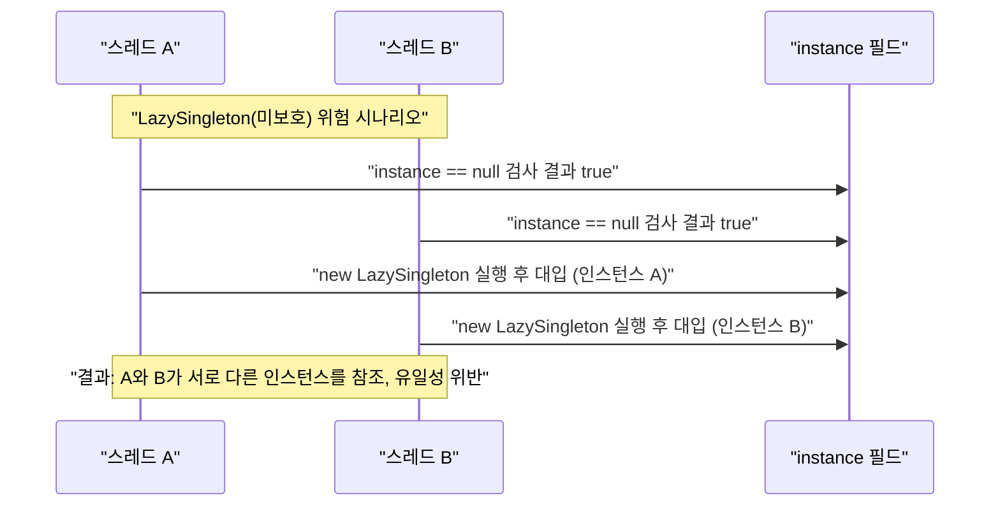
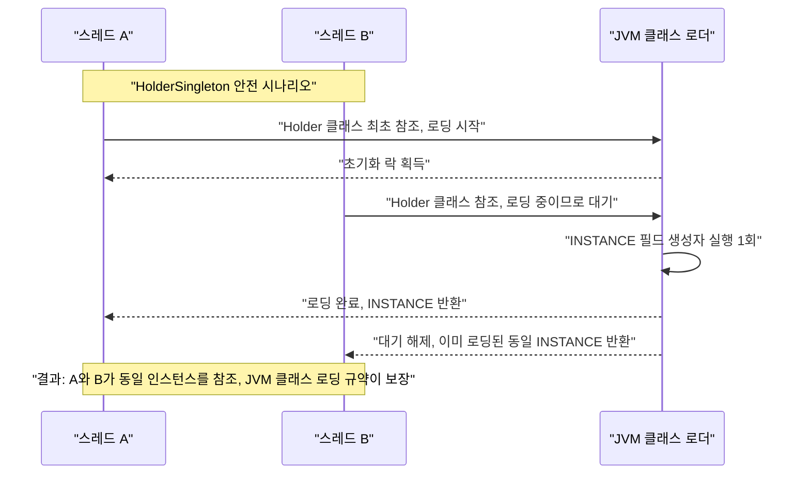

이 실습에서는 Singleton 패턴의 다양한 구현 방식과 멀티스레드 안전성, 그리고 현대적 대안을 직접 구현해봅니다.

## 실습 목표
- Singleton 패턴의 다양한 구현 방식 이해
- 멀티스레드 환경에서의 안전성 확보
- Singleton의 문제점과 현대적 대안 학습
- 의존성 주입을 통한 Singleton 대체

## 실습 1: 다양한 Singleton 구현

이 실습에서는 이론 편에서 다룬 5가지 구현 방식(Eager, Lazy, Thread-safe, DCL, Enum)에 더해 Bill Pugh 방식(Inner Class Holder)을 직접 작성합니다. TODO 1~5는 이론 편의 설명을 참고해 직접 채워야 하는 연습 문제이고, TODO 6(HolderSingleton)은 아래에 완전한 구현을 제공하니 이를 기준 답안 삼아 나머지를 완성하세요.

### 코드 템플릿

```java
// TODO 1: Eager Initialization
public class EagerSingleton {
    // TODO: 클래스 로딩 시점에 인스턴스 생성
}

// TODO 2: Lazy Initialization (Thread-unsafe)
public class LazySingleton {
    // TODO: 첫 번째 호출 시 인스턴스 생성
}

// TODO 3: Thread-safe Singleton
public class ThreadSafeSingleton {
    // TODO: synchronized 키워드 사용
}

// TODO 4: Double-checked Locking
public class DoubleCheckedSingleton {
    // TODO: volatile과 이중 체크로 최적화
}

// TODO 5: Enum Singleton
public enum EnumSingleton {
    // TODO: Enum을 활용한 최적 구현
}
```

### 기준 답안: Inner Class Holder (Bill Pugh Solution)

동기화 코드 없이도 지연 초기화와 Thread Safety를 동시에 만족하는 구현입니다. 정적 중첩 클래스 `Holder`는 `getInstance()`가 처음 호출되어 실제로 참조될 때까지 JVM에 로드되지 않으며, 클래스 로딩 자체가 JVM 명세상 Thread-safe하므로 별도의 락이 필요 없습니다.

```java
public class HolderSingleton {

    private final long createdAt;

    // private 생성자로 외부 인스턴스화를 차단
    private HolderSingleton() {
        this.createdAt = System.nanoTime();
    }

    // 정적 중첩 클래스는 Holder가 처음 참조되는 시점(getInstance() 최초 호출)에만 로드된다.
    private static class Holder {
        private static final HolderSingleton INSTANCE = new HolderSingleton();
    }

    public static HolderSingleton getInstance() {
        return Holder.INSTANCE;
    }

    public long getCreatedAt() {
        return createdAt;
    }

    public static void main(String[] args) throws InterruptedException {
        // 여러 스레드에서 동시에 호출해도 동일한 인스턴스가 반환되는지 검증
        Runnable task = () -> System.out.println(
            Thread.currentThread().getName() + " -> " + HolderSingleton.getInstance().hashCode()
        );

        Thread t1 = new Thread(task, "worker-1");
        Thread t2 = new Thread(task, "worker-2");
        t1.start();
        t2.start();
        t1.join();
        t2.join();

        assert HolderSingleton.getInstance() == HolderSingleton.getInstance();
        System.out.println("Singleton verified: single instance across threads.");
    }
}
```

### 6가지 구현 방식 비교

TODO 1~5와 기준 답안(Holder)까지 총 6가지를 완성하고 나면 아래 표로 각 방식의 특성을 정리해 비교해보세요.

| 구현 방식 | Thread-Safe | Lazy Loading | 동기화 오버헤드 | 리플렉션/직렬화 방어 |
|----------|------------|--------------|-----------------|---------------------|
| Eager Initialization | O | X | 없음 | X |
| Lazy Initialization (미보호) | X | O | 없음 (안전하지 않음) | X |
| Thread-safe (synchronized) | O | O | 매 호출마다 발생 | X |
| Double-Checked Locking | O | O | 최초 생성 시에만 | X |
| Enum Singleton | O | X | 없음 | O |
| Holder (Bill Pugh) | O | O | 없음 | X |

### 멀티스레드 시나리오: 경쟁 상태와 안전한 초기화

TODO 2(미보호 Lazy)와 기준 답안(Holder)의 근본적 차이는 "두 스레드가 정확히 같은 순간에 `getInstance()`를 호출하면 무슨 일이 벌어지는가"에 있다. 미보호 Lazy는 `if (instance == null)` 검사와 `instance = new LazySingleton()` 대입 사이에 원자성이 없어, 두 스레드가 모두 `instance`를 null로 관찰한 뒤 각자 새 인스턴스를 생성해버리는 경쟁 상태(race condition)가 발생할 수 있다. 반면 Holder 방식은 정적 중첩 클래스 `Holder`의 로딩 절차를 JVM 명세(JLS 12.4.2, 클래스 초기화 절차)가 규정하는 락으로 직렬화하므로, 여러 스레드가 동시에 `Holder`를 최초 참조하더라도 `INSTANCE` 필드 초기화는 정확히 한 번만 실행된다. 아래 두 시퀀스 다이어그램은 이 차이를 스레드 인터리빙(interleaving) 시점까지 구체적으로 보여준다.



이 시나리오는 `if` 검사와 대입이 두 스레드의 실행에서 겹쳐(interleave) 일어날 수 있다는 사실만으로 성립하며, 실제로 재현되는 빈도는 CPU 코어 수·JIT 컴파일 시점·스케줄러에 따라 달라진다. "실행해봤는데 문제가 없었다"는 이 경쟁 상태가 없다는 증명이 아니라 이번 실행에서 우연히 겹치지 않았다는 뜻일 뿐이므로, Lazy(미보호)를 운영 코드에 쓰지 않는 근거는 재현 빈도가 아니라 원자성이 보장되지 않는다는 구조적 사실에 있다.



두 다이어그램을 비교하면 Holder의 안전성은 개발자가 작성한 동기화 코드가 아니라 JVM이 클래스 초기화 시점에 이미 제공하는 락에서 나온다는 점이 드러난다. 기준 답안에 포함된 `main()` 메서드(`worker-1`, `worker-2` 스레드로 `getInstance()`를 동시 호출하고 `assert`로 동일 인스턴스인지 검증하는 코드)를 실제로 실행하면 위 두 번째 다이어그램의 결과를 직접 관찰할 수 있다.

## 실습 2: 데이터베이스 연결 관리자

DB 커넥션 풀은 "물리적으로 하나만 존재해야 하는 리소스"의 대표 사례입니다. 커넥션 풀을 여러 개 만들면 각 풀이 별도로 커넥션을 여닫아 DB 서버의 최대 연결 수 제한을 쉽게 초과하므로, 이 실습에서는 실습 1의 DCL 패턴을 실제 설정 로딩·풀 초기화 로직에 적용해봅니다.

### 요구사항
- 전역적으로 하나의 DB 연결 풀만 존재
- 설정 정보 중앙 관리
- 스레드 안전성 보장

### 코드 템플릿

`instance` 필드가 이미 `volatile`로 선언되어 있는 이유를 먼저 생각해보세요. DCL은 `if (instance == null)`을 동기화 블록 안팎에서 두 번 검사하는데, `volatile` 없이는 JVM의 명령어 재정렬로 인해 다른 스레드가 완전히 초기화되지 않은 인스턴스를 관찰할 수 있습니다. 아래 TODO를 채울 때는 설정 로드와 풀 초기화를 생성자(또는 정적 팩토리 메서드) 안에서 한 번만 수행하도록 구성하세요.

```java
public class DatabaseManager {
    private static volatile DatabaseManager instance;
    private final ConnectionPool connectionPool;
    
    // TODO: 1. Double-checked locking 구현
    // TODO: 2. 설정 파일에서 DB 설정 로드
    // TODO: 3. 연결 풀 초기화
    // TODO: 4. Connection 반환 메서드 구현
}

// TODO: 성능 테스트 코드 작성
public class SingletonPerformanceTest {
    @Test
    public void comparePerformance() {
        // TODO: 다양한 구현 방식의 성능 비교
    }
}
```

## 실습 3: 현대적 대안 구현

실습 1~2에서 만든 Singleton들은 `getInstance()`를 호출하는 모든 클래스에 구현이 하드코딩되어 Mock으로 교체할 수 없다는 한계가 있습니다. 이 실습에서는 동일한 `DatabaseManager`를 Spring Bean으로 등록해 컨테이너가 생명주기를 관리하게 하고, `UserService`가 이를 생성자 주입으로 받도록 바꿔 테스트 가능성을 확보합니다.

### 코드 템플릿

핵심은 `getInstance()`라는 정적 메서드가 사라진다는 점입니다. `DatabaseManager`를 Spring Bean으로 등록하면 인스턴스를 하나만 유지하는 책임이 컨테이너로 넘어가고, `UserService`는 생성자 인자로 `DatabaseManager`를 받기만 하면 됩니다. 이렇게 하면 테스트 코드에서 실제 컨테이너 없이도 Mock `DatabaseManager`를 직접 넘겨 `UserService`를 생성할 수 있습니다.

```java
// TODO 1: Spring Bean으로 Singleton 관리
@Configuration
public class SingletonConfig {
    @Bean
    @Scope("singleton")  // 기본값이지만 명시적 표현
    public DatabaseManager databaseManager() {
        // TODO: Spring이 관리하는 Singleton 구현
        return null;
    }
}

// TODO 2: 의존성 주입을 통한 테스트 가능한 설계
@Service
public class UserService {
    private final DatabaseManager databaseManager;
    
    // TODO: 생성자 주입으로 의존성 관리
}
```

## 체크리스트

### 기본 구현
- [ ] 6가지 Singleton 구현 방식 완성 — TODO 1~5와 Holder 기준 답안을 모두 컴파일하고, 각 클래스의 `getInstance()`를 반복 호출해 항상 동일한 해시코드를 반환하는지 확인한다.
- [ ] 각 방식의 장단점 분석 — "6가지 구현 방식 비교" 표의 네 열(Thread-Safe, Lazy Loading, 동기화 오버헤드, 리플렉션/직렬화 방어)을 근거로 각 구현을 한 문장씩 설명할 수 있어야 한다.
- [ ] 멀티스레드 테스트 통과 — 아래 "멀티스레드 시나리오" 다이어그램처럼 두 개 이상의 스레드로 `getInstance()`를 동시 호출해, 미보호 Lazy에서는 서로 다른 해시코드가, Holder/DCL/Enum에서는 동일한 해시코드가 관찰되는지 직접 실행해 확인한다.
- [ ] 메모리 누수 검증 — Eager/Enum은 클래스 로딩 시점에 인스턴스가 즉시 생성되어 애플리케이션 종료 전까지 GC 대상이 되지 않는다는 점을 확인하고, DB 커넥션 풀처럼 큰 리소스를 담을 때 이 특성이 어떤 트레이드오프를 만드는지 설명할 수 있어야 한다.

### 현대적 대안
- [ ] DI Container 활용 구현 — 실습 3의 `SingletonConfig`를 완성해 Spring 컨테이너가 애플리케이션 전체에서 `DatabaseManager` 인스턴스를 정확히 하나만 생성하는지(로그 또는 `@PostConstruct` 카운터로) 확인한다.
- [ ] 테스트 가능한 설계로 변경 — `UserService`가 정적 `getInstance()` 호출 없이 생성자 인자만으로 조립 가능한지 확인한다.
- [ ] Mock 객체 주입 테스트 — 실제 `DatabaseManager` 대신 Mockito 등으로 만든 Mock을 `UserService` 생성자에 직접 넘겨, DB 연결 없이 단위 테스트가 통과하는지 검증한다.
- [ ] Configuration 외부화 — DB 접속 정보를 코드에 하드코딩하지 않고 `application.properties` 또는 환경변수로 분리했는지 확인한다.

## 추가 도전

1. **성능 벤치마크**: JMH(Java Microbenchmark Harness) 등으로 스레드 수를 늘려가며 synchronized 방식과 DCL/Holder 방식의 `getInstance()` 처리량(throughput)을 비교한다. synchronized는 스레드 수가 늘어날수록 락 경합으로 처리량이 포화되는 반면, DCL과 Holder는 최초 생성 이후 락이 개입하지 않아 처리량이 스레드 수에 비례해 계속 증가하는 차이를 관찰할 수 있다.
2. **직렬화 문제**: Singleton 클래스가 `Serializable`을 구현하면 역직렬화(`ObjectInputStream.readObject`)가 생성자를 거치지 않고 새 인스턴스를 만들어 유일성이 깨진다. `readResolve()` 메서드를 오버라이드해 역직렬화된 임시 인스턴스 대신 기존 `getInstance()` 결과를 반환하도록 고치고, 실제로 직렬화 후 역직렬화한 두 객체의 `==` 비교로 검증한다.
3. **리플렉션 공격**: `Constructor.setAccessible(true)`로 private 생성자를 강제 호출하면 Holder·DCL 방식도 두 번째 인스턴스가 생성될 수 있다. 생성자 내부에 `if (Holder.INSTANCE != null) throw new IllegalStateException("이미 인스턴스가 존재합니다")` 가드를 추가해 방어하거나, 애초에 리플렉션에 안전한 Enum Singleton을 대안으로 선택하는 트레이드오프를 비교한다.
4. **클래스로더 문제**: 애플리케이션 서버의 WAR별 클래스로더나 OSGi 번들처럼 하나의 JVM 안에 여러 클래스로더가 공존하면, 클래스로더마다 별도의 `static` 필드 슬롯이 생겨 "JVM에 하나"라는 전제가 클래스로더 수만큼 깨질 수 있다. 이 문제는 Singleton 코드 자체를 고쳐서 해결할 수 없고, 컨테이너가 클래스로더 계층을 어떻게 구성하는지 파악해야 진단할 수 있다는 한계를 인식한다.

## 실무 적용

### 안티패턴 회피
- Global State 남용 방지 — 여러 컴포넌트가 동일한 전역 인스턴스의 가변 상태를 공유하면 한 곳의 변경이 예측 불가능한 부작용을 다른 곳에 전파한다
- 단위 테스트 어려움 해결 — `getInstance()`로 하드코딩된 의존성은 Mock으로 교체할 수 없어 실제 리소스(DB, 네트워크) 없이는 테스트가 불가능해진다
- 결합도 증가 문제 인식 — 사용하는 쪽이 구체 클래스를 직접 참조하면 구현을 교체할 때 호출부 전체를 수정해야 한다

### 현대적 접근
- 의존성 주입 프레임워크 활용 — 인스턴스 생명주기 관리를 컨테이너로 위임하면 애플리케이션 코드에서 유일성 보장 로직을 직접 작성할 필요가 없다
- 설정 외부화 — 설정값을 코드가 아닌 외부 파일/환경변수로 분리하면 환경별로 재빌드 없이 동작을 바꿀 수 있다
- 모니터링과 로깅 강화 — 전역 상태는 문제 발생 시점을 추적하기 어려우므로, 상태 변경 지점에 로깅을 남겨 디버깅 가능성을 확보해야 한다

### 이 패턴을 피해야 하는 경우
- 비즈니스 로직이나 가변 상태를 담는 서비스 클래스 — Mock 주입이 막혀 단위 테스트가 어려워진다
- 여러 인스턴스로 수평 확장해야 하는 컴포넌트 — 단일 JVM 내 유일성이 분산 환경에서는 보장되지 않는다
- 요청마다 다른 설정이 필요한 컴포넌트 — 전역 상태 하나로는 요청별 격리를 표현할 수 없다

## 평가 기준

이 실습을 마친 후 다음 항목들을 스스로 점검해볼 수 있습니다.

- [ ] Eager, Lazy(미보호), Thread-safe, DCL, Enum, Holder 6가지 구현 방식을 각각 설명하고 직접 구현할 수 있다.
- [ ] `volatile` 키워드가 DCL에서 왜 필수인지, 없으면 어떤 재정렬 문제가 발생하는지 설명할 수 있다.
- [ ] 멀티스레드 환경에서 동일한 인스턴스가 반환되는지 검증하는 테스트를 작성할 수 있다.
- [ ] Singleton 기반 설계를 Spring Bean + 생성자 주입 방식으로 리팩토링하고, 그 결과 Mock 주입이 가능해지는 이유를 설명할 수 있다.
- [ ] Singleton을 피해야 하는 상황(비즈니스 로직 서비스, 수평 확장 컴포넌트, 요청별 격리가 필요한 컴포넌트)을 근거와 함께 제시할 수 있다.

---

**핵심 포인트**: Singleton은 강력하지만 위험한 패턴입니다. 현대적 개발에서는 DI Container를 통한 생명주기 관리가 더 안전하고 유연한 대안입니다. 