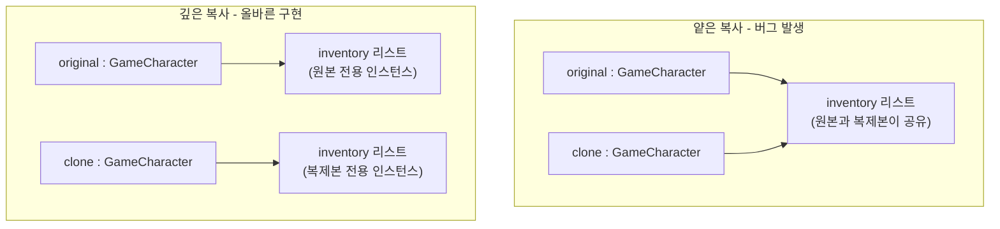
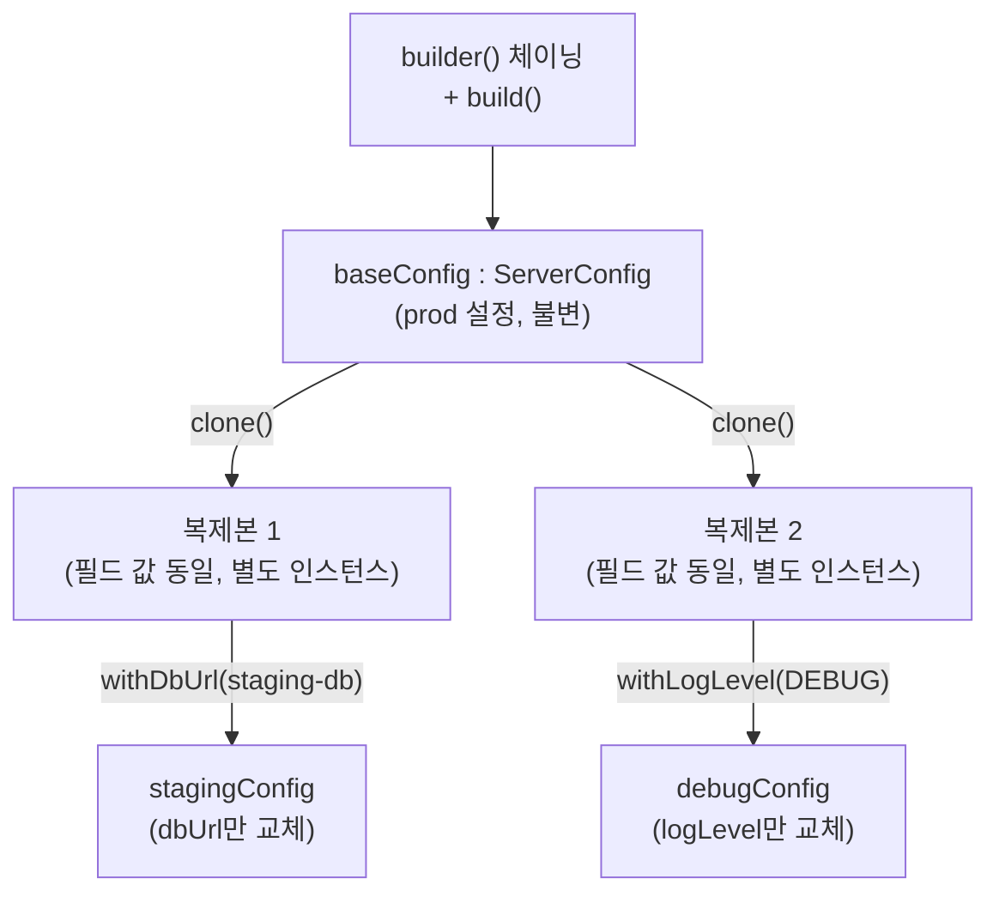

이 실습에서는 Builder와 Prototype 패턴을 활용하여 복잡한 객체 생성 문제를 해결하는 다양한 기법을 직접 구현합니다. 각 패턴의 철학과 GoF 원전 정의, Shallow/Deep Copy의 이론적 차이는 [이론 편 06장](/post/design-patterns/builder-prototype-deep-understanding/)에서 이미 다뤘으므로, 이 글은 그 이론을 코드로 재현하는 데 집중합니다.

## 실습 목표
- Builder 패턴의 다양한 구현 방식 학습
- Prototype 패턴의 깊은 복사와 얕은 복사 이해
- 불변 객체와 Builder 패턴 조합
- 성능 최적화된 객체 생성 전략

## 실습 1: HTTP 클라이언트 Builder

이론 편의 "Constructor Hell" 예시(url, method, headers, body, timeout 등 여러 매개변수를 가진 생성자)를 실제로 Builder로 리팩터링하는 실습입니다. url과 method는 요청마다 반드시 있어야 하는 필수 필드이고, headers·body·timeout은 없어도 요청이 성립하는 선택 필드라는 점에 주목해 필수/선택을 구분하는 Builder를 설계합니다. 필수 필드는 생성자가 아니라 `build()` 시점에 검증하는 이유는, 필드가 하나만 있을 때는 생성자 검증도 무방하지만 필수 필드가 2개 이상이 되는 순간 "어떤 순서로 넘겨야 컴파일이 되는가"라는 문제가 다시 생기기 때문입니다. 또한 `headers` 필드는 `Map`을 그대로 반환하면 외부에서 내부 상태를 변경할 수 있으므로, `build()` 시점에 `Collections.unmodifiableMap`으로 방어적 복사를 해야 한다는 점도 함께 확인합니다.

### 요구사항
복잡한 HTTP 요청 설정을 간편하게 생성할 수 있는 Builder 구현

### 기준 답안

```java
import java.util.Collections;
import java.util.LinkedHashMap;
import java.util.Map;
import org.junit.jupiter.api.Test;

import static org.junit.jupiter.api.Assertions.*;

public final class HttpRequest {
    private final String url;
    private final String method;
    private final Map<String, String> headers;
    private final String body;
    private final int timeout;

    private HttpRequest(Builder builder) {
        this.url = builder.url;
        this.method = builder.method;
        this.headers = Collections.unmodifiableMap(new LinkedHashMap<>(builder.headers));
        this.body = builder.body;
        this.timeout = builder.timeout;
    }

    public String getUrl() { return url; }
    public String getMethod() { return method; }
    public Map<String, String> getHeaders() { return headers; }
    public String getBody() { return body; }
    public int getTimeout() { return timeout; }

    public static Builder builder() {
        return new Builder();
    }

    public static class Builder {
        // 필수 필드 - build() 시점에 null 검증
        private String url;
        private String method;

        // 선택 필드 - 기본값 지정
        private final Map<String, String> headers = new LinkedHashMap<>();
        private String body = "";
        private int timeout = 3000;

        public Builder url(String url) {
            this.url = url;
            return this;
        }

        public Builder method(String method) {
            this.method = method;
            return this;
        }

        public Builder header(String key, String value) {
            this.headers.put(key, value);
            return this;
        }

        public Builder body(String body) {
            this.body = body;
            return this;
        }

        public Builder timeout(int timeoutMillis) {
            if (timeoutMillis <= 0) {
                throw new IllegalArgumentException("timeout must be positive: " + timeoutMillis);
            }
            this.timeout = timeoutMillis;
            return this;
        }

        public HttpRequest build() {
            if (url == null || url.isEmpty()) {
                throw new IllegalStateException("url is required");
            }
            if (method == null || method.isEmpty()) {
                throw new IllegalStateException("method is required");
            }
            return new HttpRequest(this);
        }
    }
}

// 테스트 코드
public class HttpRequestTest {
    @Test
    public void testBuilder() {
        HttpRequest request = HttpRequest.builder()
            .url("https://api.example.com")
            .method("POST")
            .header("Content-Type", "application/json")
            .body("{\"name\":\"test\"}")
            .timeout(5000)
            .build();

        assertEquals("https://api.example.com", request.getUrl());
        assertEquals("POST", request.getMethod());
        assertEquals("application/json", request.getHeaders().get("Content-Type"));
        assertEquals(5000, request.getTimeout());
    }

    @Test
    public void testMissingUrlThrows() {
        assertThrows(IllegalStateException.class, () ->
            HttpRequest.builder().method("GET").build()
        );
    }
}
```

`build()`가 필드를 대입하지 않고 `url`/`method`의 존재부터 검증하는 순서에는 이유가 있다. 만약 검증 없이 바로 `new HttpRequest(this)`를 호출하면, `url`이 `null`인 `HttpRequest` 인스턴스가 일단 만들어진 뒤에야 나중에(예: 실제 네트워크 호출 시점) `NullPointerException`으로 실패한다. 이러면 "객체가 왜 잘못 생성됐는지"와 "그 잘못된 객체를 어디서 썼는지"가 코드상 멀리 떨어져 디버깅이 어려워진다. `build()` 시점에 `IllegalStateException`을 던지면 실패 지점이 객체 생성 직후로 좁혀지고, 예외 타입도 "인자가 잘못됨"(`IllegalArgumentException`)이 아니라 "필수 상태가 갖춰지지 않음"(`IllegalStateException`)이라는 의미를 정확히 전달한다. `testMissingUrlThrows`가 검증하는 것이 바로 이 계약이다 — url을 지정하지 않고 `build()`를 호출하면 잘못된 객체가 조용히 만들어지는 대신 그 자리에서 예외가 발생해야 한다.

`headers` 필드가 `Builder`에서는 평범한 `LinkedHashMap`이었다가 `HttpRequest` 생성자에서 `Collections.unmodifiableMap(new LinkedHashMap<>(builder.headers))`로 감싸지는 것도 우연이 아니다. 단순히 `builder.headers`를 그대로 대입하면, `build()` 호출 이후에도 `Builder` 인스턴스가 살아있는 한 `builder.header("X-Extra", "value")`를 추가로 호출해 이미 만들어진 `HttpRequest`의 내부 상태를 바꿔버릴 수 있다 — 이는 `HttpRequest`가 불변 객체라는 전제를 깨뜨린다. `new LinkedHashMap<>(builder.headers)`로 새 맵을 복사한 뒤 `unmodifiableMap`으로 감싸면 두 가지가 동시에 보장된다. 복사이므로 `Builder`가 이후에 `headers`를 변경해도 이미 생성된 `HttpRequest`는 영향받지 않고, `unmodifiableMap`이므로 `request.getHeaders().put(...)`처럼 반환값을 통해 외부에서 상태를 바꾸려는 시도도 `UnsupportedOperationException`으로 막힌다.

## 실습 2: 게임 캐릭터 Prototype

게임 캐릭터는 `Stats`, `List<Item>`, `Equipment` 같은 참조 타입 필드를 여러 개 갖고 있어, `clone()`을 얕은 복사로 구현하면 원본과 복제본이 인벤토리를 공유하는 버그가 생깁니다. 이 실습에서는 각 참조 필드를 개별적으로 깊은 복사하는 `clone()`과, 동일한 목적을 생성자로 표현하는 복사 생성자 두 가지 방식을 비교합니다. 아래 코드 템플릿의 TODO 4개는 각각 다른 목적을 가집니다. TODO 1(`clone()`)은 `Cloneable` 계약을 따르는 표준 복제 경로이고, TODO 2(복사 생성자)는 `CloneNotSupportedException` 없이 같은 결과를 얻는 대안입니다. TODO 3(`toBuilder()`)은 복제 후 일부 필드만 바꾸고 싶을 때 Builder의 유연한 검증·조합 능력을 빌려오는 역할이며, TODO 4(`CharacterPrototypeFactory`)는 클래스별 기본 프로토타입을 미리 등록해두고 이름만 바꿔 대량 생성하는 실무 시나리오(이론 편의 "100명의 Warrior 생성" 예시)를 그대로 구현하는 것입니다. 구현 시 `stats`, `inventory`, `equipment` 세 필드 모두 얕은 복사로 남겨두지 않았는지 각각 확인하세요.

### 요구사항
게임 캐릭터의 효율적인 복제 시스템 구현

### 코드 템플릿

```java
public class GameCharacter implements Cloneable {
    private String name;
    private int level;
    private Stats stats;
    private List<Item> inventory;
    private Equipment equipment;
    
    // TODO 1: 깊은 복사 구현
    @Override
    public GameCharacter clone() throws CloneNotSupportedException {
        // TODO: 참조 타입 필드들의 깊은 복사 구현
        return null;
    }
    
    // TODO 2: 복사 생성자 구현
    public GameCharacter(GameCharacter other) {
        // TODO: 다른 방식의 복사 구현
    }
    
    // TODO 3: 빌더와 결합
    public Builder toBuilder() {
        // TODO: 기존 객체를 바탕으로 Builder 생성
        return null;
    }
}

// TODO 4: 캐릭터 프로토타입 팩토리
public class CharacterPrototypeFactory {
    private final Map<String, GameCharacter> prototypes = new HashMap<>();
    
    // TODO: 프로토타입 등록 및 생성 메서드 구현
}
```

TODO를 얕은 복사로 잘못 채우면 `original`과 `clone`이 같은 `inventory` 리스트 인스턴스를 공유하게 된다. 아래 다이어그램은 그 차이를 객체 참조 수준에서 보여준다. 왼쪽(얕은 복사)에서는 두 캐릭터 객체가 화살표 하나로 같은 리스트를 가리키고, 오른쪽(깊은 복사)에서는 각 캐릭터가 자신만의 리스트를 갖는다.



얕은 복사 상태에서는 `clone.getInventory().get(0).setQuantity(99)` 한 줄이 `original`의 인벤토리 수량까지 바꿔버린다. 두 객체가 논리적으로는 독립된 캐릭터인데 데이터를 공유하기 때문이다. 아래는 TODO 4개를 모두 채운 기준 답안이다. `Stats`, `Item`, `Equipment`는 각각 자신을 복제하는 `clone()`을 갖고, `GameCharacter.clone()`은 이 세 필드 각각에 대해 그 `clone()`을 호출해 참조를 끊는다.

### 기준 답안

```java
import java.util.ArrayList;
import java.util.HashMap;
import java.util.List;
import java.util.Map;
import org.junit.jupiter.api.Test;

import static org.junit.jupiter.api.Assertions.*;

public final class Stats implements Cloneable {
    private final int strength;
    private final int agility;
    private final int intelligence;

    public Stats(int strength, int agility, int intelligence) {
        this.strength = strength;
        this.agility = agility;
        this.intelligence = intelligence;
    }

    @Override
    public Stats clone() {
        // 필드가 모두 원시 타입(int)이므로 새 인스턴스 생성만으로 깊은 복사가 완성된다
        return new Stats(strength, agility, intelligence);
    }

    public int getStrength() { return strength; }
    public int getAgility() { return agility; }
    public int getIntelligence() { return intelligence; }
}

public final class Item implements Cloneable {
    private final String name;
    private int quantity;

    public Item(String name, int quantity) {
        this.name = name;
        this.quantity = quantity;
    }

    @Override
    public Item clone() {
        return new Item(name, quantity);
    }

    public String getName() { return name; }
    public int getQuantity() { return quantity; }
    public void setQuantity(int quantity) { this.quantity = quantity; }
}

public final class Equipment implements Cloneable {
    private final Item weapon;
    private final Item armor;

    public Equipment(Item weapon, Item armor) {
        this.weapon = weapon;
        this.armor = armor;
    }

    @Override
    public Equipment clone() {
        // weapon/armor도 참조 타입이므로 각각의 clone()을 호출해야 한다
        Item clonedWeapon = (weapon == null) ? null : weapon.clone();
        Item clonedArmor = (armor == null) ? null : armor.clone();
        return new Equipment(clonedWeapon, clonedArmor);
    }

    public Item getWeapon() { return weapon; }
    public Item getArmor() { return armor; }
}

public class GameCharacter implements Cloneable {
    private final String name;
    private final int level;
    private final Stats stats;
    private final List<Item> inventory;
    private final Equipment equipment;

    public GameCharacter(String name, int level, Stats stats, List<Item> inventory, Equipment equipment) {
        this.name = name;
        this.level = level;
        this.stats = stats;
        this.inventory = inventory;
        this.equipment = equipment;
    }

    // TODO 1 해결: 참조 타입 필드마다 clone()을 호출해 깊은 복사
    @Override
    public GameCharacter clone() {
        Stats clonedStats = stats.clone();
        List<Item> clonedInventory = new ArrayList<>();
        for (Item item : inventory) {
            clonedInventory.add(item.clone());
        }
        Equipment clonedEquipment = equipment.clone();
        return new GameCharacter(name, level, clonedStats, clonedInventory, clonedEquipment);
    }

    // TODO 2 해결: CloneNotSupportedException 없이 동일한 결과를 내는 복사 생성자
    public GameCharacter(GameCharacter other) {
        this.name = other.name;
        this.level = other.level;
        this.stats = other.stats.clone();
        this.inventory = new ArrayList<>();
        for (Item item : other.inventory) {
            this.inventory.add(item.clone());
        }
        this.equipment = other.equipment.clone();
    }

    // TODO 3 해결: 깊은 복사 후 일부 필드만 바꾸고 싶을 때 Builder의 검증을 재사용
    public Builder toBuilder() {
        List<Item> clonedInventory = new ArrayList<>();
        for (Item item : this.inventory) {
            clonedInventory.add(item.clone());
        }
        return new Builder()
            .name(this.name)
            .level(this.level)
            .stats(this.stats.clone())
            .inventory(clonedInventory)
            .equipment(this.equipment.clone());
    }

    public String getName() { return name; }
    public int getLevel() { return level; }
    public Stats getStats() { return stats; }
    public List<Item> getInventory() { return inventory; }
    public Equipment getEquipment() { return equipment; }

    public static class Builder {
        private String name;
        private int level = 1;
        private Stats stats;
        private List<Item> inventory = new ArrayList<>();
        private Equipment equipment;

        public Builder name(String name) { this.name = name; return this; }
        public Builder level(int level) { this.level = level; return this; }
        public Builder stats(Stats stats) { this.stats = stats; return this; }
        public Builder inventory(List<Item> inventory) { this.inventory = inventory; return this; }
        public Builder equipment(Equipment equipment) { this.equipment = equipment; return this; }

        public GameCharacter build() {
            if (name == null || name.isEmpty()) {
                throw new IllegalStateException("name is required");
            }
            return new GameCharacter(name, level, stats, inventory, equipment);
        }
    }
}

// TODO 4 해결: 클래스별 기본 프로토타입을 등록해두고 이름만 바꿔 대량 생성
public class CharacterPrototypeFactory {
    private final Map<String, GameCharacter> prototypes = new HashMap<>();

    public void registerPrototype(String key, GameCharacter prototype) {
        this.prototypes.put(key, prototype);
    }

    public GameCharacter create(String key, String newName) {
        GameCharacter prototype = prototypes.get(key);
        if (prototype == null) {
            throw new IllegalArgumentException("no prototype registered for: " + key);
        }
        // clone()으로 참조를 끊은 뒤 이름만 덮어써 100명의 Warrior를 독립 인스턴스로 생성
        GameCharacter clone = prototype.clone();
        return clone.toBuilder().name(newName).build();
    }
}

// 테스트 코드
public class GameCharacterTest {
    @Test
    public void testDeepCopyIndependence() {
        Stats stats = new Stats(10, 5, 3);
        List<Item> inventory = new ArrayList<>();
        inventory.add(new Item("Potion", 3));
        Equipment equipment = new Equipment(new Item("Sword", 1), new Item("Shield", 1));
        GameCharacter original = new GameCharacter("Warrior", 1, stats, inventory, equipment);

        GameCharacter clone = original.clone();
        clone.getInventory().get(0).setQuantity(99);

        assertEquals(3, original.getInventory().get(0).getQuantity());
    }

    @Test
    public void testPrototypeFactoryCreatesIndependentInstances() {
        CharacterPrototypeFactory factory = new CharacterPrototypeFactory();
        List<Item> baseInventory = new ArrayList<>();
        baseInventory.add(new Item("Sword", 1));
        GameCharacter warriorProto = new GameCharacter(
            "Warrior", 1, new Stats(10, 5, 3), baseInventory,
            new Equipment(new Item("Sword", 1), new Item("Shield", 1))
        );
        factory.registerPrototype("warrior", warriorProto);

        GameCharacter warrior1 = factory.create("warrior", "Warrior-001");
        GameCharacter warrior2 = factory.create("warrior", "Warrior-002");
        warrior1.getInventory().get(0).setQuantity(50);

        assertEquals("Warrior-001", warrior1.getName());
        assertEquals(1, warrior2.getInventory().get(0).getQuantity());
    }
}
```

`Stats`·`Item`·`Equipment`가 `super.clone()` 대신 새 인스턴스를 직접 생성하는 이유는, `Object.clone()`을 호출하면 `CloneNotSupportedException`을 던지거나 잡아야 하는 부담이 생기는 반면, 생성자로 직접 복제본을 만들면 그 부담 없이 동일한 결과를 얻을 수 있기 때문이다. `GameCharacter.clone()`이 `throws` 절 없이 오버라이드된 것도 같은 이유다 — 오버라이드 메서드는 상위 시그니처의 checked exception을 좁히거나 제거할 수 있다.

이 실습 코드가 `Cloneable`을 유지하면서도 `super.clone()`을 피하고 생성자 기반 복제를 택한 설계는 개인적 취향이 아니라 업계에서 정립된 권고를 따른 것이다. Joshua Bloch는 『Effective Java』 3rd ed. (2018) Item 13 "Override clone judiciously"에서 `Object.clone()` 기반 복제가 강제할 수 없는 관례(호출자가 문서화되지 않은 규약을 지켜야 함)에 의존하고 `final` 필드 선언과 충돌하며 체크 예외를 강제한다는 점을 근거로, 복사 생성자(copy constructor)나 정적 팩토리(copy factory)를 대안으로 권고한다. `GameCharacter`가 모든 필드를 `final`로 선언하면서도 `clone()`과 복사 생성자(TODO 2)를 나란히 제공한 것은 이 권고를 그대로 반영한 결과다 — `clone()`만으로는 `final` 필드 초기화 시점 문제를 피할 수 없으므로, 복사 생성자가 실무에서 더 안전한 대안이 된다는 것을 코드로 직접 확인하게 하려는 의도다.

## 실습 3: 설정 객체 Builder + Prototype

dev/staging/prod처럼 대부분의 필드는 같고 일부만 다른 설정 객체를 만들 때, 매번 Builder로 처음부터 값을 채우면 공통 필드가 중복됩니다. 이 실습에서는 하나의 기본 설정을 Prototype으로 복제한 뒤 Builder의 `with*` 메서드로 환경별 차이만 덮어써, 두 패턴을 조합하는 방법을 익힙니다. TODO 1(불변 필드 + Builder)은 실습 1에서 만든 패턴을 재사용하되 `equals`/`hashCode`까지 갖춘 완전한 값 객체로 만드는 것이 목표이고, TODO 2(환경별 설정 복제)는 `baseConfig.clone()` 후 `dbUrl`, `logLevel` 같은 환경 종속 필드만 바꾸는 흐름을 구현합니다. TODO 3(`with*` 메서드)은 복제 후 필드 변경을 매번 `clone()` 직접 호출 없이 하나의 메서드 호출로 끝내기 위한 것으로, 실습 2의 `toBuilder()`와 같은 목적을 더 가벼운 방식으로 달성합니다.

아래 다이어그램은 `builder()` 체이닝으로 만든 하나의 기본 인스턴스(`baseConfig`)가 `clone()`을 거쳐 두 개의 독립된 복제본으로 갈라지고, 각 복제본이 `withDbUrl`/`withLogLevel` 중 서로 다른 필드 하나만 교체해 새 인스턴스를 만드는 흐름을 보여준다. `baseConfig` 자신은 두 분기 어디에서도 변경되지 않는다는 점이 실습 2의 `toBuilder()`와 공유하는 설계 의도다.



### 코드 템플릿

```java
public class ServerConfig implements Cloneable {
    private final String environment;
    private final String dbUrl;
    private final String logLevel;
    private final int maxConnections;
    private final boolean sslEnabled;

    // TODO 1: 불변 필드 + Builder 패턴 조합 - builder의 각 필드를 this로 대입
    private ServerConfig(Builder builder) {
        this.environment = null;
        this.dbUrl = null;
        this.logLevel = null;
        this.maxConnections = 0;
        this.sslEnabled = false;
    }

    public static Builder builder() {
        return new Builder();
    }

    public String getEnvironment() { return environment; }
    public String getDbUrl() { return dbUrl; }
    public String getLogLevel() { return logLevel; }
    public int getMaxConnections() { return maxConnections; }
    public boolean isSslEnabled() { return sslEnabled; }

    // TODO 2: 환경별 설정 복제 - 필드 전체를 그대로 복사한 새 인스턴스를 반환
    // (참조 타입 필드가 없으므로 얕은 복사와 깊은 복사의 구분이 없다는 점에 주목)
    @Override
    public ServerConfig clone() {
        return null;
    }

    // TODO 3: 복제 후 dbUrl만 교체한 새 인스턴스를 반환 (원본 인스턴스는 변경하지 않는다)
    public ServerConfig withDbUrl(String dbUrl) {
        return null;
    }

    // TODO 3: 복제 후 logLevel만 교체한 새 인스턴스를 반환
    public ServerConfig withLogLevel(String logLevel) {
        return null;
    }

    // TODO 1: environment, dbUrl, logLevel, maxConnections, sslEnabled 전체를 비교
    @Override
    public boolean equals(Object o) {
        return false;
    }

    // TODO 1: equals와 동일한 필드 집합으로 해시코드 계산
    @Override
    public int hashCode() {
        return 0;
    }

    public static class Builder {
        private String environment;
        private String dbUrl;
        private String logLevel = "INFO";
        private int maxConnections = 10;
        private boolean sslEnabled = true;

        public Builder environment(String environment) { this.environment = environment; return this; }
        public Builder dbUrl(String dbUrl) { this.dbUrl = dbUrl; return this; }
        public Builder logLevel(String logLevel) { this.logLevel = logLevel; return this; }
        public Builder maxConnections(int maxConnections) { this.maxConnections = maxConnections; return this; }
        public Builder sslEnabled(boolean sslEnabled) { this.sslEnabled = sslEnabled; return this; }

        // TODO 1: environment/dbUrl 필수 필드를 검증한 뒤 new ServerConfig(this) 반환
        public ServerConfig build() {
            return null;
        }
    }
}
```

### 기준 답안

```java
import java.util.Objects;
import org.junit.jupiter.api.Test;

import static org.junit.jupiter.api.Assertions.*;

public final class ServerConfig implements Cloneable {
    private final String environment;
    private final String dbUrl;
    private final String logLevel;
    private final int maxConnections;
    private final boolean sslEnabled;

    // TODO 1 해결: 불변 필드 + Builder 패턴 조합 - builder의 각 필드를 그대로 옮겨 담는다
    private ServerConfig(Builder builder) {
        this.environment = builder.environment;
        this.dbUrl = builder.dbUrl;
        this.logLevel = builder.logLevel;
        this.maxConnections = builder.maxConnections;
        this.sslEnabled = builder.sslEnabled;
    }

    public static Builder builder() {
        return new Builder();
    }

    public String getEnvironment() { return environment; }
    public String getDbUrl() { return dbUrl; }
    public String getLogLevel() { return logLevel; }
    public int getMaxConnections() { return maxConnections; }
    public boolean isSslEnabled() { return sslEnabled; }

    // TODO 2 해결: 필드 전체를 그대로 복사한 새 인스턴스를 반환
    // (String은 불변, int/boolean은 원시 타입이므로 얕은 복사와 깊은 복사의 구분이 없다)
    @Override
    public ServerConfig clone() {
        return ServerConfig.builder()
            .environment(this.environment)
            .dbUrl(this.dbUrl)
            .logLevel(this.logLevel)
            .maxConnections(this.maxConnections)
            .sslEnabled(this.sslEnabled)
            .build();
    }

    // TODO 3 해결: 복제 후 dbUrl만 교체한 새 인스턴스를 반환 (원본은 변경하지 않는다)
    public ServerConfig withDbUrl(String dbUrl) {
        return ServerConfig.builder()
            .environment(this.environment)
            .dbUrl(dbUrl)
            .logLevel(this.logLevel)
            .maxConnections(this.maxConnections)
            .sslEnabled(this.sslEnabled)
            .build();
    }

    // TODO 3 해결: 복제 후 logLevel만 교체한 새 인스턴스를 반환
    public ServerConfig withLogLevel(String logLevel) {
        return ServerConfig.builder()
            .environment(this.environment)
            .dbUrl(this.dbUrl)
            .logLevel(logLevel)
            .maxConnections(this.maxConnections)
            .sslEnabled(this.sslEnabled)
            .build();
    }

    // TODO 1 해결: environment, dbUrl, logLevel, maxConnections, sslEnabled 전체를 비교
    @Override
    public boolean equals(Object o) {
        if (this == o) return true;
        if (!(o instanceof ServerConfig)) return false;
        ServerConfig other = (ServerConfig) o;
        return maxConnections == other.maxConnections
            && sslEnabled == other.sslEnabled
            && Objects.equals(environment, other.environment)
            && Objects.equals(dbUrl, other.dbUrl)
            && Objects.equals(logLevel, other.logLevel);
    }

    // TODO 1 해결: equals와 동일한 필드 집합으로 해시코드 계산
    @Override
    public int hashCode() {
        return Objects.hash(environment, dbUrl, logLevel, maxConnections, sslEnabled);
    }

    public static class Builder {
        private String environment;
        private String dbUrl;
        private String logLevel = "INFO";
        private int maxConnections = 10;
        private boolean sslEnabled = true;

        public Builder environment(String environment) { this.environment = environment; return this; }
        public Builder dbUrl(String dbUrl) { this.dbUrl = dbUrl; return this; }
        public Builder logLevel(String logLevel) { this.logLevel = logLevel; return this; }
        public Builder maxConnections(int maxConnections) { this.maxConnections = maxConnections; return this; }
        public Builder sslEnabled(boolean sslEnabled) { this.sslEnabled = sslEnabled; return this; }

        // TODO 1 해결: environment/dbUrl 필수 필드를 검증한 뒤 new ServerConfig(this) 반환
        public ServerConfig build() {
            if (environment == null || environment.isEmpty()) {
                throw new IllegalStateException("environment is required");
            }
            if (dbUrl == null || dbUrl.isEmpty()) {
                throw new IllegalStateException("dbUrl is required");
            }
            return new ServerConfig(this);
        }
    }
}

// 테스트 코드
public class ServerConfigTest {
    private ServerConfig baseConfig() {
        return ServerConfig.builder()
            .environment("prod")
            .dbUrl("jdbc:postgresql://prod-db/app")
            .logLevel("WARN")
            .maxConnections(50)
            .sslEnabled(true)
            .build();
    }

    @Test
    public void testEqualsAndHashCodeContract() {
        ServerConfig a = baseConfig();
        ServerConfig b = baseConfig();

        // 필드가 모두 같으면 equals는 true, hashCode는 반드시 같아야 한다
        assertEquals(a, b);
        assertEquals(a.hashCode(), b.hashCode());

        // 필드 하나만 달라도 equals는 false여야 한다
        ServerConfig differentLogLevel = a.withLogLevel("DEBUG");
        assertNotEquals(a, differentLogLevel);
    }

    @Test
    public void testCloneProducesFieldEqualButDistinctInstance() {
        ServerConfig original = baseConfig();
        ServerConfig cloned = original.clone();

        // clone()은 원본과 다른 인스턴스이면서 필드 값은 모두 일치해야 한다
        assertNotSame(original, cloned);
        assertEquals(original, cloned);
        assertEquals(original.getEnvironment(), cloned.getEnvironment());
        assertEquals(original.getDbUrl(), cloned.getDbUrl());
        assertEquals(original.getLogLevel(), cloned.getLogLevel());
        assertEquals(original.getMaxConnections(), cloned.getMaxConnections());
        assertEquals(original.isSslEnabled(), cloned.isSslEnabled());
    }

    @Test
    public void testWithDbUrlDoesNotMutateOriginal() {
        ServerConfig original = baseConfig();
        ServerConfig changed = original.withDbUrl("jdbc:postgresql://staging-db/app");

        // withDbUrl()은 새 인스턴스를 반환하고 원본은 그대로여야 한다
        assertEquals("jdbc:postgresql://prod-db/app", original.getDbUrl());
        assertEquals("jdbc:postgresql://staging-db/app", changed.getDbUrl());
        assertEquals(original.getEnvironment(), changed.getEnvironment());
        assertEquals(original.getLogLevel(), changed.getLogLevel());
    }

    @Test
    public void testWithLogLevelDoesNotMutateOriginal() {
        ServerConfig original = baseConfig();
        ServerConfig changed = original.withLogLevel("DEBUG");

        // withLogLevel()도 마찬가지로 원본을 바꾸지 않고 새 인스턴스만 바뀐 값을 가진다
        assertEquals("WARN", original.getLogLevel());
        assertEquals("DEBUG", changed.getLogLevel());
        assertEquals(original.getDbUrl(), changed.getDbUrl());
    }
}
```

`environment`와 `dbUrl`은 실습 1의 `url`/`method`와 같은 이유로 필수 필드다 — 어느 환경의 설정인지, 어느 DB에 연결할지가 없으면 `ServerConfig` 자체가 의미를 가질 수 없기 때문이다. 반면 `logLevel`·`maxConnections`·`sslEnabled`는 합리적인 기본값(`"INFO"`, `10`, `true`)이 있으므로 선택 필드로 남긴다. `clone()`이 참조 타입 필드를 하나도 갖지 않는다는 점도 실습 2와 대비된다 — `String`은 불변이고 `int`/`boolean`은 원시 타입이므로, `Stats.clone()`처럼 "새 인스턴스 생성만으로 깊은 복사가 끝나는" 사례에 해당한다.

### 생성 전략별 비용: new/Builder 대 clone

"성능 최적화된 객체 생성 전략"이라는 실습 목표는 "clone이 항상 new보다 빠르다"는 뜻이 아니다. `staging` 환경을 위한 `ServerConfig`를 만드는 두 경로 — ① `builder()`로 다섯 필드를 처음부터 다시 채우는 경로와 ② `baseConfig.clone().withDbUrl(...)`로 복제 후 한 필드만 바꾸는 경로 — 를 비교하면, 두 경로 모두 내부적으로 하는 일은 결국 `Builder` 필드 대입 5번과 `new ServerConfig(this)` 호출 1번으로 동일하다. `clone()`의 기준 답안 구현 자체가 `ServerConfig.builder()...build()`를 다시 호출하는 것을 보면 이 사실이 드러난다. 즉 필드가 원시 타입·불변 문자열뿐이고 초기화 로직도 단순 대입뿐인 값 객체에서는, 두 경로의 실행 비용 차이가 무의미할 정도로 작다. 아래는 그 무의미함을 실제로 확인하는 최소 벤치 코드다.

```java
public class CreationCostDemo {
    public static void main(String[] args) {
        ServerConfig base = ServerConfig.builder()
            .environment("prod")
            .dbUrl("jdbc:postgresql://prod-db/app")
            .logLevel("WARN")
            .maxConnections(50)
            .sslEnabled(true)
            .build();

        int iterations = 1_000_000;
        // JIT 워밍업: 측정 전에 두 경로 모두 충분히 실행해 인터프리터 단계의 잡음을 줄인다
        for (int i = 0; i < 50_000; i++) {
            base.clone().withDbUrl("jdbc:postgresql://warmup-db/app");
            ServerConfig.builder().environment("prod").dbUrl("x").logLevel("WARN")
                .maxConnections(50).sslEnabled(true).build();
        }

        long builderStart = System.nanoTime();
        for (int i = 0; i < iterations; i++) {
            ServerConfig config = ServerConfig.builder()
                .environment("staging")
                .dbUrl("jdbc:postgresql://staging-db/app")
                .logLevel("WARN")
                .maxConnections(50)
                .sslEnabled(true)
                .build();
        }
        long builderElapsedMs = (System.nanoTime() - builderStart) / 1_000_000;

        long cloneStart = System.nanoTime();
        for (int i = 0; i < iterations; i++) {
            ServerConfig config = base.clone().withDbUrl("jdbc:postgresql://staging-db/app");
        }
        long cloneElapsedMs = (System.nanoTime() - cloneStart) / 1_000_000;

        System.out.printf("Builder 전체 재작성 100만 회: %d ms%n", builderElapsedMs);
        System.out.printf("clone + withDbUrl 100만 회: %d ms%n", cloneElapsedMs);
    }
}
```

이 코드는 JMH 같은 엄밀한 마이크로벤치마크 도구가 아니라 `System.nanoTime()` 기반의 단순 반복 측정이므로, JIT의 데드코드 제거나 인라이닝 여부에 따라 결과가 흔들릴 수 있다는 한계가 있다(엄밀한 수치가 필요하면 이론 편에서 언급한 JMH 벤치마크를 참고). 그럼에도 이 측정이 보여주는 정성적 결론은 분명하다 — 두 경로 모두 결과 시간은 실행 환경(JVM 버전, JIT 컴파일 상태)에 따라 다르지만, 필드 5개짜리 값 객체 수준에서는 서로 수 밀리초 오차 범위 안에 들어와 실질적 차이가 없다. Prototype의 성능 이점이 실제로 드러나는 지점은 이 실습의 `ServerConfig`처럼 초기화가 가벼운 경우가 아니라, 실습 2의 `CharacterPrototypeFactory`처럼 원본 객체를 한 번 만드는 데 드는 비용(DB 조회, 파일 파싱, 암호화 키 유도처럼 생성자 안에 무거운 로직이 들어있는 경우)이 커서 그 비용을 반복 지불하지 않는 것 자체가 이득이 되는 상황이다. 즉 이 실습 목표가 요구하는 "성능 최적화된 객체 생성 전략"은 "clone을 쓴다"가 아니라 "초기화 비용이 실제로 큰 지점을 식별해 그곳에만 Prototype을 적용한다"는 판단 기준이다.

## 흔한 오개념

Builder와 Prototype 패턴을 처음 적용할 때 반복적으로 나타나는 오해가 세 가지 있다. 실습 코드를 작성하기 전에 이 오해들을 먼저 짚어야 같은 실수를 반복하지 않는다.

첫째, "Builder 패턴을 쓰면 자동으로 불변 객체가 된다"는 오해다. Builder는 생성 과정을 단계별로 나누는 패턴일 뿐이며, 불변성은 완전히 별개의 설계 선택이다. 실습 1의 `HttpRequest`가 불변인 이유는 모든 필드를 `final`로 선언하고 `HttpRequest` 자신이 setter를 전혀 노출하지 않기 때문이지, Builder를 썼기 때문이 아니다. Builder를 쓰면서도 생성 후 값을 바꿀 수 있는 가변 객체를 만드는 코드는 얼마든지 작성할 수 있다.

둘째, "`clone()`을 오버라이드하면 필드가 알아서 깊은 복사된다"는 오해다. `Object.clone()`의 기본 동작과 마찬가지로, 명시적으로 처리하지 않는 한 참조 타입 필드는 원본과 같은 객체를 그대로 가리킨다. 실습 2에서 `stats`, `inventory`, `equipment` 각각에 대해 개별적으로 `clone()`을 호출하지 않으면, 복제본의 인벤토리를 수정했을 때 원본의 인벤토리도 함께 바뀌는 버그가 발생한다. "clone()을 오버라이드했다"는 사실 자체는 "깊은 복사가 됐다"를 보장하지 않는다.

셋째, "복사 생성자와 Prototype 패턴은 결국 같은 것"이라는 오해다. 둘 다 기존 객체로부터 새 객체를 만든다는 점은 같지만, 복사 생성자는 호출부가 컴파일 타임에 구체 타입(`new GameCharacter(other)`)을 알아야 하는 반면, Prototype은 `clone()`이라는 공통 인터페이스를 통해 구체 타입을 몰라도 다형적으로 복제할 수 있다. `CharacterPrototypeFactory`가 `Map<String, GameCharacter>`에 여러 프로토타입을 문자열 키로 등록해두고 키만으로 복제본을 꺼내는 구조는 복사 생성자만으로는 표현하기 어려운 유연성이다.

| 오해 | 실제 |
|------|------|
| Builder = 불변 객체 | Builder는 생성 과정을 분리하는 패턴일 뿐이며, 불변성은 `final` 필드와 setter 미노출로 별도 보장해야 한다 |
| clone() 오버라이드 = 깊은 복사 | 참조 필드마다 명시적으로 clone()을 호출하지 않으면 원본과 참조를 공유하는 얕은 복사로 남는다 |
| 복사 생성자 = Prototype | 복사 생성자는 호출부가 구체 타입을 알아야 하고, Prototype은 clone() 인터페이스로 다형적 복제가 가능하다 |

## 체크리스트

### Builder 패턴 (실습 1)
- [ ] `HttpRequest.Builder`에서 url/method처럼 요청 성립에 반드시 필요한 필드와, headers/body/timeout처럼 없어도 되는 선택 필드를 구분했다
- [ ] 각 설정 메서드가 `return this`로 메서드 체이닝을 지원한다
- [ ] 필수 필드 누락 시 `build()`가 `IllegalStateException`을 던지는지 테스트로 확인했다
- [ ] `HttpRequest`의 모든 필드를 `final`로 선언하고, `headers`는 `Collections.unmodifiableMap`으로 방어적 복사해 외부에서 내부 상태를 변경할 수 없는 불변 객체로 만들었다

### Prototype 패턴 (실습 2)
- [ ] `GameCharacter.clone()`에서 `stats`, `inventory`, `equipment` 세 필드 모두 각각의 `clone()`을 호출해 깊은 복사를 구현하고, `clone.getInventory().get(0).setQuantity(99)` 이후에도 `original`의 수량이 바뀌지 않는지 검증했다
- [ ] `Stats`처럼 원시 타입 필드만 가진 클래스는 새 인스턴스 생성만으로 복사가 끝난다는 점을 확인해, 불필요한 필드까지 재귀적으로 복사하지 않았다(성능 최적화)
- [ ] `CloneNotSupportedException` 없이 동일한 결과를 내는 복사 생성자를 구현했다
- [ ] `CharacterPrototypeFactory`에 프로토타입을 등록해두고, 키만으로 서로 독립된 여러 인스턴스를 생성했다(한쪽 수정이 다른 쪽에 영향을 주지 않음을 테스트로 확인)

### 통합 구현 (실습 3)
- [ ] 환경별 `ServerConfig`를 만들 때 공통 필드를 중복 입력하지 않고, `clone()`으로 복제한 뒤 `with*` 메서드로 차이 나는 필드만 반영했다
- [ ] `toBuilder()`/`with*`처럼 원본을 바꾸지 않고 새 인스턴스를 반환하는 함수형 스타일 변형 메서드를 구현했다
- [ ] Builder/Prototype 각각을 언제 쓰고 언제 과용인지("과용하면 안 되는 경우" 참고) 스스로 설명할 수 있다

## 추가 도전

1. **Type-Safe Builder(컴파일 타임 검증)**: 단계별 인터페이스(예: `NeedsUrl` → `NeedsMethod` → `Buildable`)로 Builder를 나눠, `url()`을 호출하기 전에는 `method()`조차 호출할 수 없게 만드는 기법이다. 실습 1의 필수 필드 검증은 `build()` 호출 시점의 런타임 예외(`IllegalStateException`)로 이뤄지는데, 이를 컴파일 에러로 앞당기면 필수 필드 누락을 테스트 없이도 잡아낼 수 있다.
2. **Lens 패턴(함수형 객체 변형)**: 중첩된 불변 객체의 특정 필드만 골라 갱신하고 나머지 구조는 그대로 유지하는 함수형 기법이다. 실습 2의 `toBuilder()`는 `GameCharacter` 자신의 필드만 바꿀 수 있지만, `equipment.weapon.quantity`처럼 두 단계 이상 중첩된 필드를 바꾸려면 매번 `Equipment`와 `Item`을 순서대로 다시 조립해야 한다 — Lens는 이 조립 과정을 합성 가능한 함수로 대체한다.
3. **Copy-on-Write(지연 복사 최적화)**: `clone()` 호출 시점에 즉시 깊은 복사를 수행하는 대신, 실제로 어느 한쪽 인스턴스가 값을 변경하려는 시점까지 복사를 미루고 그전까지는 참조를 공유하는 최적화다. 실습 2의 `CharacterPrototypeFactory.create()`가 매번 `inventory` 리스트 전체를 즉시 복사하는데, 생성된 캐릭터 중 다수가 실제로는 인벤토리를 한 번도 수정하지 않는다면 이 복사 비용은 낭비다.
4. **Fluent Interface(자연어에 가까운 API)**: 메서드 체이닝의 각 호출이 문장처럼 읽히도록 메서드명과 반환 타입을 설계하는 기법이다. 실습 1의 `.header("Content-Type", "application/json").timeout(5000)`을 `.withHeader("Content-Type").setTo("application/json").within(5, TimeUnit.SECONDS)`처럼 도메인 언어에 가깝게 다듬으면 가독성은 높아지지만, 메서드 수와 중간 타입이 늘어나는 트레이드오프가 있다.

## 실무 적용

### Builder 패턴 활용

실습 1과 3에서 다룬 Builder는 실무에서 크게 두 상황에 반복적으로 등장한다. 하나는 선택 필드가 많아 생성자 오버로딩으로는 감당이 안 되는 상황이고, 다른 하나는 서로 다른 환경·테스트 케이스마다 공통 필드는 그대로 두고 일부만 바꿔야 하는 상황이다. 아래 세 사례는 이 두 축을 대표한다.

- DTO/VO 객체 생성 — 선택 필드가 많은 요청/응답 객체에서 생성자 오버로딩 대신 이름 있는 메서드로 값을 채워 가독성을 높인다 (실습 1의 `HttpRequest.Builder` 참고)
- 설정 객체 관리 — 대부분 필드에 합리적인 기본값을 두고 필요한 값만 덮어써 환경별 설정 코드 중복을 줄인다 (실습 3의 `ServerConfig` 참고)
- 테스트 데이터 빌더 — 테스트마다 관심 있는 필드만 지정하고 나머지는 기본값을 쓰는 픽스처를 만들어 테스트 코드의 의도를 드러낸다 (예: `aUser().withName("test").build()`)

세 사례의 공통점은 "필드 수가 많다"가 아니라 "필드 중 일부만 매번 달라진다"는 것이다. 이 조건이 성립하지 않고 모든 필드가 매번 다른 값으로 채워진다면, Builder의 이름 있는 메서드 체이닝은 생성자 인자 나열보다 코드량만 늘리는 결과를 낳는다.

### Prototype 패턴 활용

Prototype의 실무 가치는 "복제한다"는 행위 자체가 아니라 "초기화 비용을 몇 번 지불하느냐"에 있다. 아래 세 사례는 모두 원본 객체를 만드는 초기화 과정이 무겁거나 반복적으로 필요한 상황에서, `clone()`으로 그 초기화를 한 번으로 줄이는 패턴이다.

- 객체 풀 관리 — 매번 새로 생성하는 대신 미리 만든 프로토타입을 복제해 재사용, 초기화 비용을 반복 지불하지 않는다 (실습 2의 `CharacterPrototypeFactory` 참고)
- 설정 템플릿 시스템 — dev/staging/prod처럼 공통 필드가 많은 설정을 기본 템플릿 하나로 유지하고 필요한 부분만 복제 후 수정한다 (실습 3 참고)
- 성능 크리티컬한 객체 생성 — DB 조회나 복잡한 계산이 들어간 초기화를 한 번만 수행하고 이후에는 `clone()`으로 대체해 초기화 비용을 없앤다 (이론 편의 JMH 벤치마크 참고)

반대로 초기화가 가벼우면 — 위 "생성 전략별 비용" 절의 `ServerConfig`처럼 필드 대입 몇 번이 초기화의 전부라면 — Prototype이 절약하는 실행 비용은 사실상 없다. 이 경우에도 Prototype을 쓸 이유가 있다면 그것은 성능이 아니라 "공통 필드를 매번 다시 입력하지 않는다"는 가독성·중복 제거 목적으로 봐야 하며, 실무에서는 이 둘을 구분해서 도입 근거를 말할 수 있어야 한다.

### 과용하면 안 되는 경우

Builder와 Prototype 모두 공짜가 아니다. 클래스 하나(Builder)와 `clone()`/복사 생성자라는 별도 메서드를 추가하는 대가를 치르므로, 아래 세 조건 중 하나라도 해당하면 그 대가가 이득보다 크다는 신호로 보고 패턴 도입 자체를 재고해야 한다.

- 필드가 2~3개뿐인 단순 DTO — 일반 생성자나 정적 팩토리 메서드로 충분하며 Builder는 코드량만 늘린다
- 참조 필드가 없어 얕은 복사와 깊은 복사의 차이가 없는 불변 객체 — Prototype 없이 생성자 재사용으로 충분하다
- 생성 빈도가 낮고 초기화 비용도 낮은 객체 — Prototype의 복제 이득보다 별도 clone 로직 유지 비용이 더 크다

결국 판단 기준은 "복잡한 생성 로직이 반복되는가"와 "복제로 아낄 초기화 비용이 실재하는가" 두 가지로 좁혀진다. 실습 1~3에서 본 것처럼 필수/선택 필드 구분이 무의미하거나 참조 필드가 없는 값 객체라면, 패턴을 무리하게 유지하기보다 가장 단순한 생성자나 정적 팩토리로 되돌아가는 편이 낫다.

---

### 마무리

이 실습을 마쳤다면 앞의 "체크리스트" 각 항목을 실제로 코드와 테스트로 확인했는지 점검한다. 체크리스트가 모두 통과됐다면 실습 목표를 달성한 것이다.

**핵심 포인트**: Builder는 복잡한 객체 생성을, Prototype은 효율적인 객체 복제를 담당합니다. 두 패턴의 조합으로 강력한 객체 생성 전략을 구축할 수 있습니다. 다음 실습 편([07. 어댑터와 파사드 — 실습](/post/design-patterns/adapter-facade-interface-philosophy-practice/))에서는 생성 패턴에서 구조 패턴으로 넘어가, 레거시 시스템 통합과 서브시스템 단순화를 다룹니다.