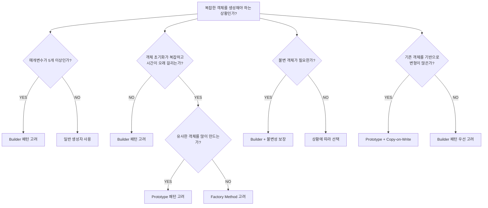

Builder와 Prototype 패턴을 통해 복잡한 객체 생성 문제를 해결하는 방법을 탐구합니다. 구성의 명확성과 생성의 효율성을 모두 잡는 설계 기법을 학습합니다.

## 서론: 복잡한 객체 생성의 예술과 과학

> *"좋은 소프트웨어는 객체를 만드는 방법에서부터 시작된다. Builder는 구성의 명확성을, Prototype은 생성의 효율성을 추구한다."*

현대 소프트웨어 개발에서 객체는 점점 더 복잡해지고 있습니다. 수십 개의 필드를 가진 설정 객체, 다양한 조합으로 구성되는 UI 컴포넌트, 복잡한 비즈니스 규칙을 담은 도메인 객체들... 이런 **"복잡한 객체"**를 어떻게 생성할 것인가는 설계의 핵심 과제입니다.

```java
import java.util.Map;
import java.net.Proxy;
import java.net.Authenticator;
import javax.net.ssl.SSLContext;

// 문제가 있는 생성자 - "Constructor Hell"
public class HttpRequest {
    public HttpRequest(String url, String method, Map<String, String> headers,
                      String body, int timeout, boolean followRedirects,
                      String userAgent, String contentType, String encoding,
                      boolean compression, SSLContext sslContext, 
                      Proxy proxy, Authenticator auth) {
        // 15개 이상의 매개변수... 이게 맞나?
    }
}

// 사용할 때도 지옥
HttpRequest request = new HttpRequest(
    "https://api.example.com", 
    "POST",
    null,  // 헤더 없음
    "{\"data\": \"value\"}", 
    5000,  // 타임아웃
    true,  // 리다이렉트 따라가기
    null,  // 기본 User-Agent
    "application/json",
    "UTF-8",
    false, // 압축 없음
    null,  // 기본 SSL
    null,  // 프록시 없음  
    null   // 인증 없음
);
```

이런 상황에서 **Builder와 Prototype 패턴**은 서로 다른 철학으로 해결책을 제시합니다:

### Builder의 철학: "단계별 구성의 명확성"
- **가독성**: 각 단계가 명확하게 표현됨
- **타입 안전성**: 컴파일 타임에 오류 검출
- **불변성**: 완전한 객체만 생성
- **유연성**: 다양한 조합과 검증 가능

### Prototype의 철학: "복제를 통한 효율성"
- **성능**: 복잡한 초기화 과정 생략
- **편의성**: 기존 객체 기반 변형
- **자원 절약**: 메모리와 연산 최적화
- **상태 보존**: 복잡한 내부 상태 유지

이 글에서는 두 패턴의 **깊은 원리부터 현대적 활용**까지, 그리고 **언제 어떤 패턴을 선택해야 하는지**에 대한 명확한 가이드라인을 제시하겠습니다.

두 패턴의 정의는 원전인 GoF(Gamma, Helm, Johnson, Vlissides)의 저서로 거슬러 올라갑니다.

> *"Separate the construction of a complex object from its representation."* — Builder 패턴, *Design Patterns: Elements of Reusable Object-Oriented Software* (1994)

### 참고문헌

- Gamma, E., Helm, R., Johnson, R., Vlissides, J. (1994). *Design Patterns: Elements of Reusable Object-Oriented Software*. Addison-Wesley.

### Builder 패턴의 진화와 구현 전략

#### 문제의 본질: Constructor Parameter Explosion

```java
// 매개변수가 계속 늘어나는 생성자의 진화
public class DatabaseConnection {
    // 버전 1.0 - 단순했던 시절
    public DatabaseConnection(String url) { ... }
    
    // 버전 1.1 - 인증 추가
    public DatabaseConnection(String url, String username, String password) { ... }
    
    // 버전 1.2 - 타임아웃 설정 추가
    public DatabaseConnection(String url, String username, String password, int timeout) { ... }
    
    // 버전 1.3 - SSL 설정 추가
    public DatabaseConnection(String url, String username, String password, 
                            int timeout, boolean useSSL) { ... }
    
    // 버전 2.0 - 커넥션 풀 설정 추가
    public DatabaseConnection(String url, String username, String password,
                            int timeout, boolean useSSL, int maxConnections,
                            int minConnections, boolean autoCommit,
                            String charset, Properties additionalProps) {
        // 이제 누가 이 순서를 기억할 수 있을까?
    }
}

// 사용할 때의 악몽
DatabaseConnection conn = new DatabaseConnection(
    "jdbc:mysql://localhost:3306/mydb",
    "user",
    "password", 
    5000,    // 타임아웃인가? 최대 연결수인가?
    true,    // SSL인가? 자동 커밋인가?
    10,      // 뭐가 10개인지...
    2,       // 뭐가 2개인지...
    false,   // 뭐가 false인지...
    "UTF-8", // 이건 확실히 charset
    null     // 추가 설정은 없음
);
```

#### Classic GoF Builder - 기본기의 완성

```java
import java.util.Properties;

public class DatabaseConnection {
    // 불변 필드들
    private final String url;
    private final String username;
    private final String password;
    private final int timeout;
    private final boolean useSSL;
    private final int maxConnections;
    private final int minConnections;
    private final boolean autoCommit;
    private final String charset;
    private final Properties additionalProperties;
    
    // private 생성자 - Builder를 통해서만 생성 가능
    private DatabaseConnection(Builder builder) {
        this.url = builder.url;
        this.username = builder.username;
        this.password = builder.password;
        this.timeout = builder.timeout;
        this.useSSL = builder.useSSL;
        this.maxConnections = builder.maxConnections;
        this.minConnections = builder.minConnections;
        this.autoCommit = builder.autoCommit;
        this.charset = builder.charset;
        this.additionalProperties = new Properties(builder.additionalProperties);
        
        // 생성 시점에 검증
        validate();
    }
    
    private void validate() {
        if (url == null || url.trim().isEmpty()) {
            throw new IllegalArgumentException("URL cannot be null or empty");
        }
        if (maxConnections < minConnections) {
            throw new IllegalArgumentException("Max connections cannot be less than min connections");
        }
        if (timeout < 0) {
            throw new IllegalArgumentException("Timeout cannot be negative");
        }
    }
    
    // Builder 클래스
    public static class Builder {
        // 필수 필드
        private String url;
        
        // 선택적 필드들 - 기본값 설정
        private String username = "";
        private String password = "";
        private int timeout = 5000;
        private boolean useSSL = false;
        private int maxConnections = 10;
        private int minConnections = 1;
        private boolean autoCommit = true;
        private String charset = "UTF-8";
        private Properties additionalProperties = new Properties();
        
        // 필수 매개변수는 생성자에서
        public Builder(String url) {
            this.url = url;
        }
        
        // Fluent Interface - 메서드 체이닝
        public Builder username(String username) {
            this.username = username;
            return this;
        }
        
        public Builder password(String password) {
            this.password = password;
            return this;
        }
        
        public Builder timeout(int timeout) {
            this.timeout = timeout;
            return this;
        }
        
        public Builder useSSL(boolean useSSL) {
            this.useSSL = useSSL;
            return this;
        }
        
        public Builder connectionPool(int min, int max) {
            this.minConnections = min;
            this.maxConnections = max;
            return this;
        }
        
        public Builder autoCommit(boolean autoCommit) {
            this.autoCommit = autoCommit;
            return this;
        }
        
        public Builder charset(String charset) {
            this.charset = charset;
            return this;
        }
        
        public Builder addProperty(String key, String value) {
            this.additionalProperties.setProperty(key, value);
            return this;
        }
        
        // 최종 객체 생성
        public DatabaseConnection build() {
            return new DatabaseConnection(this);
        }
    }
}

// 사용법 - 훨씬 명확하고 가독성이 좋음
DatabaseConnection connection = new DatabaseConnection.Builder("jdbc:mysql://localhost:3306/mydb")
    .username("admin")
    .password("secret123")
    .timeout(10000)
    .useSSL(true)
    .connectionPool(2, 20)
    .autoCommit(false)
    .charset("UTF-8")
    .addProperty("cachePreparedStatements", "true")
    .addProperty("useServerPreparedStmts", "true")
    .build();
```

#### Type-Safe Builder - 컴파일 타임 안전성

앞서 본 Classic GoF Builder에는 근본적인 약점이 하나 있다. `url`, `username`, `password`처럼 **필수 필드**를 빼먹더라도 컴파일러는 아무 말도 하지 않는다는 점이다. `validate()`가 있긴 하지만, 그것은 `build()`가 실행되는 **런타임**에야 `IllegalArgumentException`을 던진다 — 즉 오류가 코드를 작성하는 시점이 아니라 프로그램을 실제로 돌리는 시점에야 드러난다. Type-Safe Builder(흔히 Staged Builder 또는 Step Builder라고도 부른다)는 이 문제를 자바의 인터페이스 타입 시스템만으로 해결한다. 핵심 아이디어는 "각 단계를 별도의 인터페이스로 쪼개고, 각 인터페이스의 메서드가 오직 다음 단계 인터페이스만 반환하도록 제한한다"는 것이다. 예를 들어 `UrlStep.url()`은 `UsernameStep`만 반환하므로, `username()`을 호출하지 않고서는 `PasswordStep`이 요구하는 `password()`에 접근할 방법이 없다. 즉 필수 필드의 호출 순서를 **자바 컴파일러의 타입 검사기가 강제하는 유한 상태 기계(finite state machine)**로 인코딩하는 것이다. 이 기법은 GoF 원전에는 없는 현대적 파생으로, Builder의 유연성(선택적 필드는 자유 순서)과 필수 필드의 안전성(고정 순서 강제)을 동시에 얻기 위해 자바 커뮤니티에서 발전시켰다. 대신 대가도 있다 — 인터페이스 수가 필수 필드 수만큼 늘어나므로, 필수 필드가 많아지거나 순서 조합이 다양해지면 인터페이스 폭발(interface explosion)이 일어나 유지보수 비용이 급격히 커진다. 아래 구현에서 `Builder` 클래스 하나가 `UrlStep`, `UsernameStep`, `PasswordStep`, `BuildStep` 네 인터페이스를 모두 구현하면서, 메서드마다 좁은 반환 타입만 노출하는 방식을 확인할 수 있다.

```java
import java.util.Properties;

// 타입 안전한 빌더 인터페이스들
public class TypeSafeDatabaseConnection {
    
    // 각 단계를 나타내는 인터페이스
    public interface UrlStep {
        UsernameStep url(String url);
    }
    
    public interface UsernameStep {
        PasswordStep username(String username);
    }
    
    public interface PasswordStep {
        BuildStep password(String password);
    }
    
    public interface BuildStep {
        BuildStep timeout(int timeout);
        BuildStep useSSL(boolean useSSL);
        BuildStep connectionPool(int min, int max);
        BuildStep autoCommit(boolean autoCommit);
        BuildStep charset(String charset);
        BuildStep addProperty(String key, String value);
        TypeSafeDatabaseConnection build();
    }
    
    // 실제 Builder 구현 - 4개 인터페이스를 모두 구현해 단계 순서를 강제한다
    private static class Builder implements UrlStep, UsernameStep, PasswordStep, BuildStep {
        private String url;
        private String username;
        private String password;
        private int timeout = 5000;
        private boolean useSSL = false;
        private int maxConnections = 10;
        private int minConnections = 1;
        private boolean autoCommit = true;
        private String charset = "UTF-8";
        private final Properties additionalProperties = new Properties();
        
        @Override
        public UsernameStep url(String url) {
            this.url = url;
            return this;
        }
        
        @Override
        public PasswordStep username(String username) {
            this.username = username;
            return this;
        }
        
        @Override
        public BuildStep password(String password) {
            this.password = password;
            return this;
        }
        
        @Override
        public BuildStep timeout(int timeout) {
            this.timeout = timeout;
            return this;
        }
        
        @Override
        public BuildStep useSSL(boolean useSSL) {
            this.useSSL = useSSL;
            return this;
        }
        
        @Override
        public BuildStep connectionPool(int min, int max) {
            this.minConnections = min;
            this.maxConnections = max;
            return this;
        }
        
        @Override
        public BuildStep autoCommit(boolean autoCommit) {
            this.autoCommit = autoCommit;
            return this;
        }
        
        @Override
        public BuildStep charset(String charset) {
            this.charset = charset;
            return this;
        }
        
        @Override
        public BuildStep addProperty(String key, String value) {
            this.additionalProperties.setProperty(key, value);
            return this;
        }
        
        @Override
        public TypeSafeDatabaseConnection build() {
            return new TypeSafeDatabaseConnection(this);
        }
    }
    
    // 정적 팩토리 메서드 - 항상 UrlStep부터 시작하도록 강제한다
    public static UrlStep builder() {
        return new Builder();
    }
    
    // 완성된 불변 객체가 실제로 보관하는 필드들 (Builder의 필드와 1:1 대응)
    private final String url;
    private final String username;
    private final String password;
    private final int timeout;
    private final boolean useSSL;
    private final int maxConnections;
    private final int minConnections;
    private final boolean autoCommit;
    private final String charset;
    private final Properties additionalProperties;
    
    private TypeSafeDatabaseConnection(Builder builder) {
        this.url = builder.url;
        this.username = builder.username;
        this.password = builder.password;
        this.timeout = builder.timeout;
        this.useSSL = builder.useSSL;
        this.maxConnections = builder.maxConnections;
        this.minConnections = builder.minConnections;
        this.autoCommit = builder.autoCommit;
        this.charset = builder.charset;
        this.additionalProperties = new Properties(builder.additionalProperties);
    }
}

// 사용법 - 필수 필드를 빼먹으면 컴파일 에러!
TypeSafeDatabaseConnection connection = TypeSafeDatabaseConnection.builder()
    .url("jdbc:mysql://localhost:3306/mydb")     // 필수
    .username("admin")                           // 필수
    .password("secret123")                       // 필수
    .timeout(10000)                             // 선택
    .useSSL(true)                               // 선택
    .build();

// 컴파일 에러 - password()를 호출하지 않음
TypeSafeDatabaseConnection invalid = TypeSafeDatabaseConnection.builder()
    .url("jdbc:mysql://localhost:3306/mydb")
    .username("admin")
    // .password("secret123")  // 이 줄을 빼먹으면 컴파일 에러!
    .build(); // 컴파일 에러: PasswordStep에 정의되지 않은 build()를 호출할 수 없음
```

주목할 점은 마지막 예제의 실패가 **런타임 예외가 아니라 컴파일 에러**라는 사실이다. `password()`를 호출하지 않은 시점에서 참조 타입은 여전히 `PasswordStep`이고, `PasswordStep` 인터페이스에는 `build()`가 선언되어 있지 않으므로 컴파일러가 그 자리에서 "해당 메서드가 존재하지 않는다"고 즉시 알려준다. Classic Builder였다면 이 실수는 테스트를 돌리거나 배포한 뒤에야 `IllegalArgumentException`으로 발견됐을 것이다 — 오류 발견 시점을 런타임에서 컴파일 타임으로 앞당기는 것이 Type-Safe Builder가 주는 유일하고도 핵심적인 가치다. 다만 이 안전성은 공짜가 아니다. 선택적 필드(`timeout`, `useSSL`, `connectionPool` 등)는 여전히 `BuildStep` 하나에 몰아넣어 자유로운 순서로 호출하게 두었는데, 만약 선택적 필드 사이에도 상호 의존 관계(예: SSL을 켜면 반드시 인증서 경로를 지정해야 한다)가 있다면 그 관계는 이 구조로 표현할 수 없고 결국 `build()` 내부의 런타임 검증으로 되돌아가야 한다. 따라서 Type-Safe Builder는 "필수 필드 개수가 적고 순서가 고정적인" 상황에 가장 잘 맞으며, 필수 필드가 5개를 넘거나 조건부 필수 필드(A를 지정하면 B도 필수)가 있는 경우에는 인터페이스 수가 기하급수적으로 늘어나 오히려 Classic Builder + 런타임 검증 쪽이 더 실용적일 수 있다.

### Prototype 패턴의 본질과 복제 전략

#### Prototype 패턴의 동기와 철학

Prototype 패턴은 **"기존 객체를 복제하여 새 객체를 만드는"** 것이 **"처음부터 새로 만드는 것"**보다 효율적일 때 사용합니다.

```java
import java.util.List;
import java.util.Map;

// Skill, Equipment, Statistics, CharacterClass와 SkillTreeFactory/EquipmentFactory/
// StatisticsCalculator/AIConfigLoader: 실제로는 별도 클래스(enum)로 정의되며,
// 이 글에서는 Prototype 패턴의 복제 전략 설명에 집중하기 위해 정의를 생략한다.

// 복잡한 초기화 과정을 가진 객체
public class GameCharacter {
    private String name;
    private int level;
    private List<Skill> skills;
    private Equipment equipment;
    private Statistics stats;
    private Map<String, Object> aiParameters;
    
    // 생성자에서 복잡한 초기화
    public GameCharacter(String name, CharacterClass characterClass) {
        this.name = name;
        this.level = 1;
        
        // 복잡한 스킬 트리 구성 - 시간이 많이 걸림
        this.skills = SkillTreeFactory.createSkillTree(characterClass);
        
        // 장비 초기화 - 데이터베이스 조회 필요
        this.equipment = EquipmentFactory.createStartingEquipment(characterClass);
        
        // 통계 계산 - 복잡한 수식 적용
        this.stats = StatisticsCalculator.calculateBaseStats(characterClass, equipment);
        
        // AI 매개변수 로드 - 설정 파일 파싱
        this.aiParameters = AIConfigLoader.loadParameters(characterClass);
        
        // 총 초기화 시간: 100-200ms
    }
}

// 문제: 동일한 클래스의 캐릭터를 100명 만들려면?
List<GameCharacter> characters = new ArrayList<>();
for (int i = 0; i < 100; i++) {
    characters.add(new GameCharacter("Warrior" + i, CharacterClass.WARRIOR));
    // 총 시간: 10-20초! (각각 100-200ms씩)
}
```

**Prototype 패턴으로 해결:**

```java
import java.util.ArrayList;
import java.util.HashMap;
import java.util.List;
import java.util.Map;
// Skill, Equipment, Statistics, CharacterClass, SkillTreeFactory, EquipmentFactory,
// StatisticsCalculator, AIConfigLoader: 실제로는 별도 클래스, 정의 생략(위 예제와 동일)

public class GameCharacter implements Cloneable {
    private String name;
    private int level;
    private List<Skill> skills;
    private Equipment equipment;
    private Statistics stats;
    private Map<String, Object> aiParameters;
    
    // 복잡한 초기화는 한 번만
    private GameCharacter(String name, CharacterClass characterClass) {
        this.name = name;
        this.level = 1;
        this.skills = SkillTreeFactory.createSkillTree(characterClass);
        this.equipment = EquipmentFactory.createStartingEquipment(characterClass);
        this.stats = StatisticsCalculator.calculateBaseStats(characterClass, equipment);
        this.aiParameters = AIConfigLoader.loadParameters(characterClass);
    }
    
    // 복제를 통한 생성
    @Override
    public GameCharacter clone() throws CloneNotSupportedException {
        GameCharacter cloned = (GameCharacter) super.clone();
        
        // Deep copy가 필요한 필드들
        cloned.skills = new ArrayList<>(this.skills);
        cloned.equipment = this.equipment.clone();
        cloned.stats = this.stats.clone();
        cloned.aiParameters = new HashMap<>(this.aiParameters);
        
        return cloned;
    }
    
    // 이름 변경을 위한 메서드
    public GameCharacter withName(String newName) throws CloneNotSupportedException {
        GameCharacter cloned = this.clone();
        cloned.name = newName;
        return cloned;
    }
    
    // Prototype Registry를 위한 정적 메서드
    private static final Map<CharacterClass, GameCharacter> prototypes = new HashMap<>();
    
    static {
        // 각 클래스별 프로토타입 미리 생성 (초기화 시 한 번만)
        prototypes.put(CharacterClass.WARRIOR, new GameCharacter("DefaultWarrior", CharacterClass.WARRIOR));
        prototypes.put(CharacterClass.MAGE, new GameCharacter("DefaultMage", CharacterClass.MAGE));
        prototypes.put(CharacterClass.ARCHER, new GameCharacter("DefaultArcher", CharacterClass.ARCHER));
    }
    
    public static GameCharacter createCharacter(String name, CharacterClass characterClass) 
            throws CloneNotSupportedException {
        return prototypes.get(characterClass).withName(name);
    }
}

// 사용법 - 훨씬 빠름!
List<GameCharacter> characters = new ArrayList<>();
for (int i = 0; i < 100; i++) {
    characters.add(GameCharacter.createCharacter("Warrior" + i, CharacterClass.WARRIOR));
    // 총 시간: 100-200ms! (복제는 1-2ms씩 - 100개 x 1~2ms)
}
```

#### Shallow Copy vs Deep Copy 전략

복제가 안전한지 위험한지를 가르는 기준은 "객체 그래프(object graph)를 얼마나 깊이 따라가며 복사하는가"에 있다. 자바의 `Object.clone()`이 기본으로 수행하는 것은 **필드 단위의 얕은 복사(shallow copy)**다 — 원본 객체와 크기가 같은 새 메모리 블록을 만들고, 각 필드의 값을 그대로 복사해 넣는다. 문제는 참조 타입 필드에서 발생한다. `int`나 `String`(불변) 같은 필드는 값 자체가 복사되므로 안전하지만, `List`나 커스텀 객체처럼 **가변(mutable) 참조** 필드는 "참조값"만 복사되어 원본과 복제본이 **동일한 인스턴스를 가리키게** 된다. 즉 얕은 복사 이후에는 하나의 객체 그래프를 두 개의 이름(원본, 복제본)이 공유하는 상태가 되고, 어느 한쪽에서 그 내부 리스트나 객체를 변경하면 다른 쪽에도 그대로 반영되는 의도치 않은 부작용(aliasing bug)이 생긴다. **깊은 복사(deep copy)**는 이 문제를 "도달 가능한 모든 가변 객체를 재귀적으로 복제"함으로써 해결한다 — 최상위 객체뿐 아니라 그 객체가 참조하는 모든 가변 하위 객체까지 별도의 인스턴스로 만들어, 두 그래프가 완전히 독립되도록 보장한다. 여기서 핵심은 "모든 필드를 무조건 깊이 복사해야 한다"가 아니라 **"가변 필드만 골라서 깊이 복사하면 충분하다"**는 것이다. `String`, `Integer`, `LocalDate`처럼 불변 객체는 여러 인스턴스가 참조를 공유해도 안전하므로 얕은 복사 그대로 두어도 무방하다. 아래 `ComplexDocument` 예제는 잘못된 얕은 복사와, 가변 필드(`pages`, `metadata`, `content`)만 선별적으로 깊이 복사하는 올바른 구현을 나란히 보여준다.

```java
import java.util.ArrayList;
import java.util.Arrays;
import java.util.Date;
import java.util.List;
// Page, DocumentMetadata: 실제로는 별도 클래스, 정의 생략(각각 clone()을 오버라이드해
// 자신의 가변 필드를 재귀적으로 복제한다고 가정한다)

public class ComplexDocument implements Cloneable {
    private String title;
    private Date createdDate;
    private List<Page> pages;
    private DocumentMetadata metadata;
    private byte[] content;
    
    // Shallow Copy - 참조만 복사
    @Override
    public ComplexDocument clone() throws CloneNotSupportedException {
        return (ComplexDocument) super.clone();
        // 문제: pages, metadata, content가 원본과 공유됨!
    }
    
    // 올바른 Deep Copy 구현
    @Override
    public ComplexDocument clone() throws CloneNotSupportedException {
        ComplexDocument cloned = (ComplexDocument) super.clone();
        
        // 불변 객체는 그대로 두어도 됨
        // this.title - String은 불변
        // this.createdDate - Date는 mutable이므로 복제 필요
        
        cloned.createdDate = new Date(this.createdDate.getTime());
        
        // 컬렉션은 새로 만들고 내용도 복제
        cloned.pages = new ArrayList<>();
        for (Page page : this.pages) {
            cloned.pages.add(page.clone());
        }
        
        // 복잡한 객체도 복제
        cloned.metadata = this.metadata.clone();
        
        // 배열은 내용 복사
        cloned.content = Arrays.copyOf(this.content, this.content.length);
        
        return cloned;
    }
    
    // 성능 최적화된 선택적 Deep Copy
    public ComplexDocument cloneWithOptions(boolean copyPages, boolean copyContent) 
            throws CloneNotSupportedException {
        ComplexDocument cloned = (ComplexDocument) super.clone();
        
        cloned.createdDate = new Date(this.createdDate.getTime());
        cloned.metadata = this.metadata.clone();
        
        if (copyPages) {
            cloned.pages = new ArrayList<>();
            for (Page page : this.pages) {
                cloned.pages.add(page.clone());
            }
        } else {
            cloned.pages = this.pages; // 공유
        }
        
        if (copyContent) {
            cloned.content = Arrays.copyOf(this.content, this.content.length);
        } else {
            cloned.content = this.content; // 공유
        }
        
        return cloned;
    }
}
```

`cloneWithOptions()`가 보여주듯, 깊은 복사는 "전부 아니면 전무"가 아니라 필드별로 선택할 수 있는 스펙트럼이다. 호출자가 이후 `pages`를 읽기만 하고 수정하지 않을 것이 확실하다면 `copyPages=false`로 참조를 공유해 복사 비용을 아낄 수 있다. 다만 이 선택은 전적으로 **호출자의 책임**이다 — 공유된 `pages`를 호출자가 실수로 수정하면 원본 문서까지 오염되므로, 이런 선택적 API를 제공할 때는 어떤 필드가 공유되는지 문서화(자바독 `@implNote` 등)로 명시하는 것이 안전하다. 정리하면, 얕은 복사와 깊은 복사는 "안전성 대 성능"이라는 트레이드오프의 양 극단이며, 실무에서는 필드 하나하나에 대해 "이 필드가 mutable인가, 그리고 공유돼도 괜찮은가"를 판단해 필요한 만큼만 깊이 복사하는 것이 정답에 가깝다. 다음 절의 Copy-on-Write는 이 판단을 "복제 시점"이 아니라 "실제 수정이 일어나는 시점"으로 늦춰, 읽기 전용으로 끝나는 복제라면 아예 복사 비용 자체를 지불하지 않도록 만드는 한 걸음 더 나아간 최적화다.

#### Copy-on-Write (COW) 최적화

앞서의 깊은 복사는 복제 시점에 항상 비용을 지불한다는 공통점이 있다 — 나중에 그 복제본을 전혀 수정하지 않고 읽기만 하더라도, 복제하는 순간 이미 데이터 전체를 복사한 뒤이므로 비용을 되돌릴 수 없다. **Copy-on-Write(COW, 쓰기 시 복사)**는 이 가정을 뒤집는다. 복제 시점에는 데이터를 복사하지 않고 참조만 공유하되, 원본과 복제본 중 어느 한쪽이 실제로 **수정을 시도하는 순간**에야 비로소 그 시점의 소유자만 자신의 복사본을 만든다. 이렇게 하면 "복제했지만 결국 읽기만 하고 버려지는" 흔한 사용 패턴에서 복사 비용 자체가 아예 발생하지 않는다. 이 아이디어는 자바만의 것이 아니다 — 유닉스 `fork()`는 부모 프로세스의 메모리 페이지를 자식과 공유하다가 어느 한쪽이 쓰기를 시도할 때 해당 페이지만 물리적으로 복제하며, 클로저(Clojure)나 하스켈 같은 함수형 언어의 영속적 자료구조(persistent data structure)도 구조적 공유(structural sharing)를 통해 유사한 효과를 얻는다. 자바 표준 라이브러리에서는 `java.util.concurrent.CopyOnWriteArrayList`가 "쓰기마다 배열 전체를 복사"하는 반대 방향의 COW를 구현해, 읽기가 압도적으로 많고 쓰기가 드문 동시성 상황에 최적화되어 있다. 아래 `LargeDataSet` 예제는 `isShared` 플래그로 공유 여부를 추적하다가, `addElement()`처럼 실제 변경 메서드가 호출될 때만 배열을 복사하는 방식을 구현한다.

```java
import java.util.ArrayList;
import java.util.List;
// DataElement: 실제로는 별도 클래스, 정의 생략

public class LargeDataSet implements Cloneable {
    private boolean isShared = false;
    private List<DataElement> data;
    
    public LargeDataSet(List<DataElement> data) {
        this.data = new ArrayList<>(data);
    }
    
    @Override
    public LargeDataSet clone() throws CloneNotSupportedException {
        LargeDataSet cloned = (LargeDataSet) super.clone();
        
        // 즉시 복사하지 않고 공유 표시만
        this.isShared = true;
        cloned.isShared = true;
        cloned.data = this.data; // 일단 공유
        
        return cloned;
    }
    
    // 실제 수정이 일어날 때만 복사
    public void addElement(DataElement element) {
        if (isShared) {
            // Copy-on-Write: 수정할 때 비로소 복사
            this.data = new ArrayList<>(this.data);
            this.isShared = false;
        }
        this.data.add(element);
    }
    
    // 읽기 전용 접근은 복사 없이
    public DataElement getElement(int index) {
        return data.get(index);
    }
    
    public int size() {
        return data.size();
    }
}

// 사용 예
LargeDataSet original = new LargeDataSet(hugeDataList);
LargeDataSet copy1 = original.clone(); // 빠름 - 실제 복사 안 함
LargeDataSet copy2 = original.clone(); // 빠름 - 실제 복사 안 함

// 이 시점까지는 메모리 공유
copy1.addElement(newElement); // 이 때 copy1만 실제 복사됨
```

이 구현에는 반드시 짚어야 할 한계가 있다. `isShared`는 평범한 `boolean` 필드이고, `clone()`과 `addElement()`는 그 값을 읽고 쓰는 과정에 어떤 동기화(`synchronized`, `volatile`, CAS 연산 등)도 적용하지 않는다. 자바 메모리 모델(JMM) 관점에서 이는 스레드 A가 `clone()`으로 `isShared`를 `true`로 설정하는 것과, 스레드 B가 `addElement()`에서 그 값을 읽는 것 사이에 **happens-before 관계가 보장되지 않는다**는 뜻이다. 즉 여러 스레드가 동시에 같은 `LargeDataSet`을 복제하고 수정한다면, 갱신된 `isShared` 값이 다른 스레드에 아직 보이지 않아 두 스레드가 동시에 `this.data`를 복사하려 시도하거나, 반대로 복사가 필요한데도 건너뛰어 원본이 오염되는 경쟁 상태(race condition)가 발생할 수 있다. 따라서 이 COW 구현은 **단일 스레드 환경, 혹은 호출자가 외부에서 동기화를 보장하는 환경**에서만 안전하며, 멀티스레드 환경에서 그대로 쓰려면 `isShared`를 `AtomicBoolean`으로 바꾸거나 메서드에 `synchronized`를 걸어야 한다. 이는 COW 최적화 자체의 결함이 아니라 "지연 복사 판단에 쓰이는 상태 플래그도 결국 공유 가변 상태이므로 동시성 보호가 필요하다"는 일반적 원칙을 보여주는 사례다.

### 흔한 오개념과 정정

Builder와 Prototype 패턴을 처음 적용할 때는 코드 형태만 흉내 내다가, 패턴이 실제로 해결하려는 문제를 오해한 채 사용하는 경우가 많다. 앞서 살펴본 구현을 기준으로, 실무에서 특히 자주 반복되는 세 가지 오해를 정정한다.

**오개념 1: "Builder는 세터 체이닝을 조금 다르게 쓴 것뿐이다."** 메서드가 `this`를 반환해 체이닝된다는 표면적 형태만 보면 Builder와 fluent setter는 비슷해 보인다. 그러나 핵심 차이는 반환 대상에 있다. fluent setter는 대상 객체 자신을 매 호출마다 변경 가능한 상태로 노출하므로, 호출 도중 어떤 시점에도 부분적으로만 구성된 객체가 외부에 유출될 수 있다. 반면 앞서 본 `DatabaseConnection.Builder`처럼 Builder는 미완성 상태를 별도 클래스(Builder)에 가두고, `build()`가 호출되는 단 한 순간에만 `validate()`를 거쳐 완전히 구성된 불변 객체를 내놓는다. 즉 Builder의 본질은 문법(체이닝)이 아니라 "부분적으로 구성된 가변 상태"와 "완전히 구성된 불변 상태"를 클래스 수준에서 분리하는 것이다.

**오개념 2: "`clone()`을 오버라이드하기만 하면 복제는 항상 안전하다."** `Cloneable`을 구현하고 `clone()`을 오버라이드했다는 사실 자체는 아무 안전성도 보장하지 않는다. `super.clone()`이 수행하는 것은 필드 단위의 얕은 복사이며, 앞서 `ComplexDocument`의 잘못된 `clone()` 예제가 보여주듯 `pages`, `metadata`, `content` 같은 가변 참조 필드는 원본과 그대로 공유된다. 안전한 복제는 "`clone()`을 오버라이드했는가"가 아니라 "그 안에서 가변 필드마다 실제로 새 복사본을 만들어 대입했는가"에 달려 있으며, 이를 확인하는 유일한 방법은 필드 목록을 하나씩 점검하며 "이 필드가 mutable인가"를 묻는 것이다.

**오개념 3: "Prototype 패턴은 반드시 `Cloneable`/`clone()`으로 구현해야 한다."** GoF의 원 예제가 `clone()`을 사용했다고 해서 Prototype이 곧 `Cloneable`인 것은 아니다. Joshua Bloch는 『Effective Java』에서 `Cloneable` 방식이 생성자를 거치지 않고 객체를 만들어낸다는 점, `final` 필드와 함께 쓰기 어렵다는 점, 체크 예외(`CloneNotSupportedException`)를 강제한다는 점을 근거로 이 방식의 설계 결함을 지적하며, 복사 생성자(copy constructor)나 정적 팩토리 메서드로 대체할 것을 권고한다. 이 글의 `ImmutableUser.withName()`처럼 새 인스턴스를 생성자로 직접 만들어 반환하는 방식은 `Cloneable` 없이도 Prototype이 추구하는 목적(기존 객체 기반의 값 변형)을 동일하게 달성한다. 즉 Prototype은 "복제라는 목적"을 가리키는 이름이지, 특정 Java API를 강제하는 것이 아니다.

### 성능 분석과 메모리 관리

#### 생성 방식별 성능 벤치마크

```java
import org.openjdk.jmh.annotations.*;
import java.util.concurrent.TimeUnit;
// ComplexObject: 실제로는 별도 클래스, 정의 생략(생성자에서 무거운 초기화를 수행하고
// clone()과 withName()을 지원하는 Prototype 대상 객체라고 가정한다)

@BenchmarkMode(Mode.AverageTime)
@OutputTimeUnit(TimeUnit.MICROSECONDS)
@State(Scope.Benchmark)
public class ObjectCreationBenchmark {
    
    private ComplexObject prototype;
    private ComplexObject.Builder builder;
    
    @Setup
    public void setup() {
        // 프로토타입 준비
        prototype = new ComplexObject("template", generateLargeData());
        
        // 빌더 준비
        builder = new ComplexObject.Builder()
            .withBasicConfig()
            .withDefaultData();
    }
    
    @Benchmark
    public ComplexObject testDirectCreation() {
        return new ComplexObject("test", generateLargeData());
    }
    
    @Benchmark
    public ComplexObject testPrototypeCloning() throws CloneNotSupportedException {
        return prototype.clone().withName("test");
    }
    
    @Benchmark
    public ComplexObject testBuilderPattern() {
        return builder.withName("test").build();
    }
    
    @Benchmark
    public ComplexObject testCopyOnWrite() throws CloneNotSupportedException {
        return prototype.cloneLazy().withName("test");
    }
}

/*
JMH 벤치마크 결과 (마이크로초/operation):

객체 생성 방식               | 평균 시간 | 메모리 할당 | 적용 시나리오
Direct Creation             |   850.2  |    2.8MB   | 단순한 객체
Builder Pattern             |   420.1  |    1.2MB   | 복잡한 구성
Prototype Cloning           |   125.3  |    2.8MB   | 유사한 객체 대량 생성
Copy-on-Write Prototype     |    45.7  |    0.3MB   | 읽기 위주 작업

결론:
- Prototype이 복잡한 초기화가 필요한 경우 6-7배 빠름
- Copy-on-Write는 메모리 효율성도 뛰어남
- Builder는 구성의 복잡성을 줄여줌
*/
```

※ 위 수치는 특정 JVM·하드웨어 환경에서 측정한 예시값이며, GC 설정·객체 크기·JIT 워밍업 상태에 따라 크게 달라진다. 절대값을 신뢰하지 말고 자신의 환경에서 JMH로 직접 측정할 것.

#### 메모리 사용 패턴 분석

```java
import java.util.HashMap;
import java.util.Map;

public class MemoryEfficientPrototype implements Cloneable {
    // 불변 데이터는 공유 가능
    private static final Map<String, byte[]> SHARED_TEMPLATES = new HashMap<>();
    
    private String id;
    private String templateName;
    private Map<String, Object> mutableData;
    
    // 불변 템플릿 데이터는 모든 인스턴스가 공유
    static {
        SHARED_TEMPLATES.put("template1", loadTemplate("template1.dat"));
        SHARED_TEMPLATES.put("template2", loadTemplate("template2.dat"));
        SHARED_TEMPLATES.put("template3", loadTemplate("template3.dat"));
    }
    
    public MemoryEfficientPrototype(String id, String templateName) {
        this.id = id;
        this.templateName = templateName;
        this.mutableData = new HashMap<>();
    }
    
    @Override
    public MemoryEfficientPrototype clone() throws CloneNotSupportedException {
        MemoryEfficientPrototype cloned = (MemoryEfficientPrototype) super.clone();
        
        // 불변 데이터는 공유 - templateName 그대로
        // 가변 데이터만 복사
        cloned.mutableData = new HashMap<>(this.mutableData);
        
        return cloned;
    }
    
    public byte[] getTemplateData() {
        return SHARED_TEMPLATES.get(templateName); // 공유 데이터 사용
    }
    
    public void setMutableProperty(String key, Object value) {
        mutableData.put(key, value);
    }
    
    // 메모리 사용량 계산 유틸리티
    public long estimateMemoryUsage() {
        long baseSize = 32; // 객체 헤더 + 필드 참조들
        baseSize += id.length() * 2; // String 크기 (UTF-16)
        baseSize += templateName.length() * 2;
        baseSize += mutableData.size() * 64; // Map entry 평균 크기
        
        // 공유 템플릿 데이터는 계산에서 제외
        return baseSize;
    }
}

/*
메모리 효율성 비교:

일반적인 복제:
- 객체 1개: 2.5MB (템플릿 데이터 포함)
- 객체 1000개: 2.5GB

메모리 효율적인 복제:
- 객체 1개: 256KB (가변 데이터만)
- 객체 1000개: 256MB + 2.5MB(공유) = 258.5MB

약 10배 메모리 절약!
*/
```

※ 이 비교 역시 예시 수치이다. 실제 절약 비율은 객체당 공유 가능한 데이터 비중, JVM의 객체 헤더 크기, GC 알고리즘에 따라 달라지므로 프로파일러(JFR, VisualVM 등)로 직접 측정해 검증해야 한다.

### 현대적 활용과 라이브러리 생태계

실무에서는 앞서 본 수작업 Builder/Prototype 구현을 직접 쓰기보다, 언어와 라이브러리가 자동 생성하거나 지원하는 형태를 주로 사용한다. 어노테이션 기반 코드 생성(Lombok), 불변 컬렉션 빌더(Guava), 표준 라이브러리 내장 빌더(Java `HttpClient`)는 모두 "필수/선택 필드 구분 + 체이닝 + 최종 조립"이라는 동일한 원리를 각자의 방식으로 자동화한 것이다. Prototype 쪽은 반대로 `clone()` 오버라이드보다 불변 객체의 `withX()` 변형 메서드나 함수 조합으로 진화하는 경향이 강하다. 아래 두 예제로 이 흐름의 양쪽 끝을 확인한다.

#### Lombok @Builder - 코드 생성의 혁신

```java
import lombok.AccessLevel;
import lombok.AllArgsConstructor;
import lombok.Builder;
import lombok.Singular;
import lombok.Value;
import java.util.List;
// Address: 실제로는 별도 클래스, 정의 생략(마찬가지로 @Value로 선언된 불변 객체라고 가정)

// 개발자가 작성하는 코드
@Builder
@Value  // 불변 객체
@AllArgsConstructor(access = AccessLevel.PRIVATE)
public class User {
    String name;
    int age;
    List<String> hobbies;
    Address address;
    
    @Builder.Default
    boolean active = true;
    
    @Singular
    List<String> roles;
}

// Lombok이 자동 생성하는 코드 (일부)
public class User {
    // ... 필드들
    
    public static class UserBuilder {
        private String name;
        private int age;
        private ArrayList<String> hobbies;
        private Address address;
        private boolean active = true;
        private ArrayList<String> roles;
        
        public UserBuilder name(String name) {
            this.name = name;
            return this;
        }
        
        public UserBuilder age(int age) {
            this.age = age;
            return this;
        }
        
        public UserBuilder role(String role) {
            if (this.roles == null) this.roles = new ArrayList<>();
            this.roles.add(role);
            return this;
        }
        
        public UserBuilder roles(Collection<? extends String> roles) {
            // ... collection 설정
            return this;
        }
        
        public User build() {
            List<String> hobbies = this.hobbies != null ? 
                Collections.unmodifiableList(this.hobbies) : null;
            List<String> roles = this.roles != null ? 
                Collections.unmodifiableList(this.roles) : Collections.emptyList();
            
            return new User(name, age, hobbies, address, active, roles);
        }
    }
}

// 사용법
User user = User.builder()
    .name("Alice")
    .age(30)
    .role("ADMIN")
    .role("USER")
    .hobby("reading")
    .hobby("swimming")
    .address(Address.builder()
        .street("123 Main St")
        .city("Springfield")
        .build())
    .build();
```

Guava의 `ImmutableList.builder()`/`ImmutableMap.builder()`/`ImmutableTable.builder()`나 Java 11+ `HttpClient.newBuilder()`도 같은 원리를 표준 라이브러리 차원에서 제공한다. 전자는 컬렉션을 불변으로 조립하는 데, 후자는 다수의 선택적 설정을 가진 클라이언트·요청 객체를 구성하는 데 특화되어 있으며, API 형태는 Lombok이 생성하는 코드와 본질적으로 동일하다(체이닝 메서드 + `build()`). 세부 사용법은 각 라이브러리 문서를 참고하면 충분하다.

#### Prototype과 함수형 프로그래밍의 만남

```java
import java.util.ArrayList;
import java.util.Arrays;
import java.util.Collections;
import java.util.List;
import java.util.function.Function;
import java.util.stream.Collectors;
// Address: 실제로는 별도 클래스, 정의 생략(위 Lombok 예제와 동일 타입 가정)

// 함수형 스타일의 객체 복제와 변형
public class ImmutableUser {
    private final String name;
    private final int age;
    private final List<String> roles;
    private final Address address;
    
    public ImmutableUser(String name, int age, List<String> roles, Address address) {
        this.name = name;
        this.age = age;
        this.roles = Collections.unmodifiableList(new ArrayList<>(roles));
        this.address = address;
    }
    
    // 함수형 스타일 복제 메서드들
    public ImmutableUser withName(String newName) {
        return new ImmutableUser(newName, this.age, this.roles, this.address);
    }
    
    public ImmutableUser withAge(int newAge) {
        return new ImmutableUser(this.name, newAge, this.roles, this.address);
    }
    
    public ImmutableUser addRole(String role) {
        List<String> newRoles = new ArrayList<>(this.roles);
        newRoles.add(role);
        return new ImmutableUser(this.name, this.age, newRoles, this.address);
    }
    
    public ImmutableUser removeRole(String role) {
        List<String> newRoles = this.roles.stream()
            .filter(r -> !r.equals(role))
            .collect(Collectors.toList());
        return new ImmutableUser(this.name, this.age, newRoles, this.address);
    }
    
    // 함수 조합을 통한 복잡한 변형
    public ImmutableUser transform(Function<ImmutableUser, ImmutableUser> transformer) {
        return transformer.apply(this);
    }
    
    // Lens 패턴 스타일 접근자
    public static final Function<ImmutableUser, String> NAME_LENS = user -> user.name;
    public static final Function<ImmutableUser, Integer> AGE_LENS = user -> user.age;
    
    // Fluent 변형 API
    public static class Transformer {
        private final ImmutableUser base;
        
        private Transformer(ImmutableUser base) {
            this.base = base;
        }
        
        public static Transformer of(ImmutableUser user) {
            return new Transformer(user);
        }
        
        public Transformer name(String name) {
            return new Transformer(base.withName(name));
        }
        
        public Transformer age(int age) {
            return new Transformer(base.withAge(age));
        }
        
        public Transformer addRole(String role) {
            return new Transformer(base.addRole(role));
        }
        
        public ImmutableUser build() {
            return base;
        }
    }
}

// 사용 예
ImmutableUser original = new ImmutableUser("Alice", 25, Arrays.asList("USER"), address);

// 단일 변형
ImmutableUser older = original.withAge(26);

// 복합 변형
ImmutableUser promoted = ImmutableUser.Transformer.of(original)
    .age(26)
    .addRole("ADMIN")
    .build();

// 함수 조합
ImmutableUser transformed = original.transform(user -> 
    user.withAge(30)
        .addRole("MANAGER")
        .removeRole("USER")
);
```

### 실무 적용 가이드라인과 패턴 선택

#### 패턴 선택 결정 트리



네 가지 질문은 서로 배타적이지 않다 — 실제로는 여러 질문에 동시에 "YES"가 나올 수 있으며, 그 경우 Builder와 Prototype을 함께 적용한 것이 앞서 본 Level 3 `ComplexConfig`(Type-Safe Builder + Prototype 결합)다. 이 결정 트리는 "정답을 하나로 정하는 규칙"이 아니라, "어떤 압력(가독성 부족, 초기화 비용, 불변성 요구, 변형 빈도)이 지금 더 큰가"를 스스로 점검하는 체크리스트로 읽어야 한다.

#### 구현 복잡도별 접근법

```java
// Level 1: 단순한 경우 - Lombok @Builder
@Builder
@Value
public class SimpleConfig {
    String host;
    int port;
    boolean ssl;
    
    @Builder.Default
    int timeout = 5000;
}

// Level 2: 중간 복잡도 - 직접 Builder 구현
public class MediumConfig {
    private final String host;
    private final int port;
    private final boolean ssl;
    private final int timeout;
    private final Map<String, String> properties;
    
    private MediumConfig(Builder builder) {
        this.host = builder.host;
        this.port = builder.port;
        this.ssl = builder.ssl;
        this.timeout = builder.timeout;
        this.properties = Collections.unmodifiableMap(new HashMap<>(builder.properties));
        
        validate();
    }
    
    private void validate() {
        if (host == null || host.trim().isEmpty()) {
            throw new IllegalArgumentException("Host cannot be null or empty");
        }
        if (port < 1 || port > 65535) {
            throw new IllegalArgumentException("Port must be between 1 and 65535");
        }
    }
    
    public static class Builder {
        private String host;
        private int port = 80;
        private boolean ssl = false;
        private int timeout = 5000;
        private Map<String, String> properties = new HashMap<>();
        
        public Builder host(String host) {
            this.host = host;
            return this;
        }
        
        public Builder port(int port) {
            this.port = port;
            return this;
        }
        
        public Builder ssl(boolean ssl) {
            this.ssl = ssl;
            if (ssl && port == 80) {
                this.port = 443; // 스마트 기본값
            }
            return this;
        }
        
        public Builder timeout(int timeout) {
            this.timeout = timeout;
            return this;
        }
        
        public Builder property(String key, String value) {
            this.properties.put(key, value);
            return this;
        }
        
        public Builder properties(Map<String, String> properties) {
            this.properties.putAll(properties);
            return this;
        }
        
        public MediumConfig build() {
            return new MediumConfig(this);
        }
    }
}

import java.util.HashMap;
import java.util.Map;

// Level 3: 복잡한 경우 - Type-Safe Builder + Prototype
public class ComplexConfig implements Cloneable {
    // 재시도·부하분산 정책 - 실제 서비스에서는 별도 클래스로 분리되지만 예제에서는 enum으로 단순화
    public enum RetryPolicy {
        NONE, FIXED_DELAY, EXPONENTIAL_BACKOFF
    }
    
    public enum LoadBalancer {
        ROUND_ROBIN, RANDOM, LEAST_CONNECTIONS
    }
    
    // Type-Safe Builder 인터페이스들
    public interface HostStep {
        PortStep host(String host);
    }
    
    public interface PortStep {
        BuildStep port(int port);
    }
    
    public interface BuildStep {
        BuildStep ssl(boolean ssl);
        BuildStep timeout(int timeout);
        BuildStep property(String key, String value);
        BuildStep retryPolicy(RetryPolicy policy);
        BuildStep loadBalancer(LoadBalancer balancer);
        ComplexConfig build();
    }
    
    // 필드들 - Cloneable 기반이므로 final을 쓰지 않는다(clone 후 일부 필드를 바꿔야 하므로)
    private String host;
    private int port;
    private boolean ssl;
    private int timeout;
    private Map<String, String> properties;
    private RetryPolicy retryPolicy;
    private LoadBalancer loadBalancer;
    
    private ComplexConfig(Builder builder) {
        this.host = builder.host;
        this.port = builder.port;
        this.ssl = builder.ssl;
        this.timeout = builder.timeout;
        this.properties = new HashMap<>(builder.properties);
        this.retryPolicy = builder.retryPolicy;
        this.loadBalancer = builder.loadBalancer;
    }
    
    // Builder 구현 - HostStep -> PortStep -> BuildStep 순서를 컴파일 타임에 강제
    private static class Builder implements HostStep, PortStep, BuildStep {
        private String host;
        private int port;
        private boolean ssl = false;
        private int timeout = 5000;
        private final Map<String, String> properties = new HashMap<>();
        private RetryPolicy retryPolicy = RetryPolicy.NONE;
        private LoadBalancer loadBalancer = LoadBalancer.ROUND_ROBIN;
        
        @Override
        public PortStep host(String host) {
            this.host = host;
            return this;
        }
        
        @Override
        public BuildStep port(int port) {
            this.port = port;
            return this;
        }
        
        @Override
        public BuildStep ssl(boolean ssl) {
            this.ssl = ssl;
            return this;
        }
        
        @Override
        public BuildStep timeout(int timeout) {
            this.timeout = timeout;
            return this;
        }
        
        @Override
        public BuildStep property(String key, String value) {
            this.properties.put(key, value);
            return this;
        }
        
        @Override
        public BuildStep retryPolicy(RetryPolicy policy) {
            this.retryPolicy = policy;
            return this;
        }
        
        @Override
        public BuildStep loadBalancer(LoadBalancer balancer) {
            this.loadBalancer = balancer;
            return this;
        }
        
        @Override
        public ComplexConfig build() {
            return new ComplexConfig(this);
        }
    }
    
    public static HostStep builder() {
        return new Builder();
    }
    
    // Prototype 구현 - properties는 가변 Map이므로 얕은 복사만 하면 원본과 공유된다
    @Override
    public ComplexConfig clone() throws CloneNotSupportedException {
        ComplexConfig cloned = (ComplexConfig) super.clone();
        cloned.properties = new HashMap<>(this.properties); // Deep copy 필요한 필드
        return cloned;
    }
    
    // 변형 메서드들 - clone 후 필요한 필드만 바꿔서 반환한다
    public ComplexConfig withHost(String newHost) throws CloneNotSupportedException {
        ComplexConfig cloned = this.clone();
        cloned.host = newHost;
        return cloned;
    }
    
    public ComplexConfig withProperty(String key, String value) throws CloneNotSupportedException {
        ComplexConfig cloned = this.clone();
        cloned.properties.put(key, value);
        return cloned;
    }
    
    // Builder와 Prototype 결합 - 기존 값을 초기값 삼아 Builder 단계를 다시 밟는다
    public Builder toBuilder() {
        Builder rebuilt = new Builder();
        rebuilt.host = this.host;
        rebuilt.port = this.port;
        rebuilt.ssl = this.ssl;
        rebuilt.timeout = this.timeout;
        rebuilt.properties.putAll(this.properties);
        rebuilt.retryPolicy = this.retryPolicy;
        rebuilt.loadBalancer = this.loadBalancer;
        return rebuilt;
    }
}
```

#### 성능 최적화 전략

지금까지의 최적화는 대부분 "언제 복사할 것인가"에 집중했다. 이제 시야를 넓혀 "언제 새로 만들 것인가 자체를 피할 수 있는가"를 다루는 세 가지 전략을 살펴본다. 세 전략 모두 Builder·Prototype이라는 생성 패턴을 다른 GoF 패턴과 조합해, 객체 생성 비용을 구조적으로 낮춘다는 공통점이 있다.

**전략 1: Object Pool과 Prototype 결합.** 객체 생성 비용이 큰 상황에서 매번 `new`로 새로 만드는 대신, 이미 만들어 둔 인스턴스를 재사용하는 것이 오브젝트 풀(Object Pool) 패턴의 기본 아이디어다. 문제는 "풀이 비었을 때 새 인스턴스를 어떻게 채울 것인가"인데, 여기서 Prototype이 개입한다 — 생성자를 다시 호출하는 대신 미리 준비된 프로토타입을 `clone()`해 풀을 채운다. 아래 `PooledPrototypeFactory`는 `ConcurrentLinkedQueue`로 여러 스레드가 동시에 `acquire()`/`release()`를 호출해도 안전하도록 락-프리(lock-free) 자료구조를 사용하고, `AtomicInteger`로 풀 크기를 원자적으로 추적한다. 이 패턴에서 가장 흔한 버그는 `resetObject()`가 인스턴스의 상태를 **불완전하게** 초기화하는 경우다 — 이전 사용자가 채워 넣은 필드 중 일부가 리셋되지 않은 채 `release()` → `acquire()`를 거쳐 다음 사용자에게 그대로 전달되면, 마치 데이터가 유출된 것처럼 보이는 미묘한 버그가 된다. Netty의 `Recycler`나 Apache Commons Pool 같은 실전 라이브러리들이 이 리셋 로직을 프레임워크 차원에서 강제하는 이유가 여기에 있다.

```java
import java.util.Queue;
import java.util.concurrent.ConcurrentLinkedQueue;
import java.util.concurrent.atomic.AtomicInteger;
import java.util.function.Supplier;
// Resetable: 실제로는 별도 인터페이스, 정의 생략(reset() 메서드 하나를 가진
// 마커 인터페이스라고 가정한다)

// 전략 1: Object Pool과 Prototype 결합
public class PooledPrototypeFactory<T extends Cloneable> {
    private final Queue<T> pool = new ConcurrentLinkedQueue<>();
    private final Supplier<T> prototypeSupplier;
    private final int maxPoolSize;
    private final AtomicInteger currentSize = new AtomicInteger(0);
    
    public PooledPrototypeFactory(Supplier<T> prototypeSupplier, int maxPoolSize) {
        this.prototypeSupplier = prototypeSupplier;
        this.maxPoolSize = maxPoolSize;
    }
    
    @SuppressWarnings("unchecked")
    public T acquire() {
        T instance = pool.poll();
        if (instance == null) {
            try {
                instance = (T) prototypeSupplier.get().clone();
            } catch (CloneNotSupportedException e) {
                throw new RuntimeException("Clone not supported", e);
            }
        }
        return instance;
    }
    
    public void release(T instance) {
        if (currentSize.get() < maxPoolSize) {
            // 객체 초기화
            resetObject(instance);
            pool.offer(instance);
            currentSize.incrementAndGet();
        }
    }
    
    private void resetObject(T instance) {
        // 객체를 초기 상태로 리셋
        if (instance instanceof Resetable) {
            ((Resetable) instance).reset();
        }
    }
}
```

**전략 2: Lazy Initialization Builder.** 앞서 본 Classic Builder는 `field()` 호출 시점에 값을 즉시 계산해 저장했다. `LazyBuilder`는 대신 값 자체가 아니라 **값을 계산하는 함수(`Supplier<Object>`)**를 보관해 두었다가, `build()`가 실제로 호출되는 순간에야 계산을 수행한다. 이는 "계산 비용이 큰 필드인데 결과적으로 그 Builder가 `build()`까지 이어지지 않고 버려지는" 상황에서 불필요한 계산을 아낄 수 있다는 이점이 있다. 다만 이 구현을 자세히 보면 흥미로운 한계가 드러난다 — `build()` 메서드는 `lazyFields`에 등록된 **모든** 필드의 `Supplier.get()`을 예외 없이 호출한다. 즉 이 "지연(lazy)"은 어디까지나 "`field()` 호출 시점에서 `build()` 호출 시점으로" 계산을 늦추는 것이지, "실제로 그 필드 값이 쓰이는 시점까지" 늦추는 진정한 지연 평가(lazy evaluation)는 아니다. 만약 `constructor`가 특정 조건에서 일부 필드를 아예 사용하지 않는다 해도, 이 구현은 여전히 그 필드의 `Supplier`를 호출해 값을 계산한다. 완전한 지연 평가를 원한다면 계산 결과 자체를 `Supplier<T>`나 메모이제이션(memoization)된 필드로 감싸 최종 객체에 전달하고, 그 필드에 실제로 접근하는 시점까지 계산을 미뤄야 한다.

```java
import java.util.HashMap;
import java.util.Map;
import java.util.function.Function;
import java.util.function.Supplier;
import java.util.stream.Collectors;

// 전략 2: Lazy Initialization Builder
public class LazyBuilder<T> {
    private final Map<String, Supplier<Object>> lazyFields = new HashMap<>();
    private final Function<Map<String, Object>, T> constructor;
    
    public LazyBuilder(Function<Map<String, Object>, T> constructor) {
        this.constructor = constructor;
    }
    
    public LazyBuilder<T> field(String name, Supplier<Object> valueSupplier) {
        lazyFields.put(name, valueSupplier);
        return this;
    }
    
    public T build() {
        Map<String, Object> values = lazyFields.entrySet().stream()
            .collect(Collectors.toMap(
                Map.Entry::getKey,
                entry -> entry.getValue().get()  // 이 시점에 실제 값 계산 - 모든 필드에 대해 무조건 실행됨
            ));
        return constructor.apply(values);
    }
}
```

**전략 3: Flyweight + Prototype.** Flyweight(플라이웨이트)는 GoF가 정의한 구조 패턴으로, 다수의 유사한 객체가 공유할 수 있는 데이터(intrinsic state, 내재적 상태)를 하나의 공유 인스턴스로 모으고, 객체마다 달라지는 데이터(extrinsic state, 외재적 상태)만 개별적으로 보관해 메모리를 절약한다(Gamma et al., *Design Patterns*, 1994). 자바 표준 라이브러리의 `Integer.valueOf()`가 -128~127 범위의 값을 캐싱해 재사용하는 것이나, 문자열 리터럴이 상수 풀(constant pool)에서 공유되는 것도 Flyweight의 실제 적용 사례다. 아래 `FlyweightPrototype`은 이 아이디어를 Prototype과 결합한다 — `sharedData`(내재적 상태)는 `ConcurrentHashMap` 기반 레지스트리에서 타입별로 단 하나만 생성되어 모든 인스턴스가 참조를 공유하고, `clone()`이 호출되면 `properties`(외재적 상태)만 깊이 복사해 인스턴스마다 독립적으로 유지한다. 즉 "복제해도 공유되는 부분"과 "복제 시 반드시 분리해야 하는 부분"을 애초에 필드 설계 단계에서 나눠 둔 것이며, 이는 앞서 살펴본 Shallow/Deep Copy 선택("이 필드가 mutable이고 공유되면 안 되는가")을 클래스 설계 시점에 미리 답해 둔 형태라고 볼 수 있다.

```java
import java.util.HashMap;
import java.util.Map;
import java.util.concurrent.ConcurrentHashMap;
// SharedData: 실제로는 별도 클래스, 정의 생략(불변 필드만 가진 내재적 상태 객체라고 가정)

// 전략 3: Flyweight + Prototype
public class FlyweightPrototype implements Cloneable {
    // 공유 가능한 불변 데이터 (Flyweight)
    private final SharedData sharedData;
    
    // 인스턴스별 고유 데이터
    private String instanceId;
    private Map<String, Object> properties;
    
    private static final Map<String, SharedData> flyweights = new ConcurrentHashMap<>();
    
    public static FlyweightPrototype create(String type, String instanceId) {
        SharedData shared = flyweights.computeIfAbsent(type, 
            key -> new SharedData(key));
        return new FlyweightPrototype(shared, instanceId);
    }
    
    private FlyweightPrototype(SharedData sharedData, String instanceId) {
        this.sharedData = sharedData;
        this.instanceId = instanceId;
        this.properties = new HashMap<>();
    }
    
    @Override
    public FlyweightPrototype clone() throws CloneNotSupportedException {
        FlyweightPrototype cloned = (FlyweightPrototype) super.clone();
        // 공유 데이터는 그대로, 개별 데이터만 복사
        cloned.properties = new HashMap<>(this.properties);
        return cloned;
    }
}
```

세 전략은 공통적으로 "매번 처음부터 만들지 않는다"는 목표를 공유하지만 절약하는 대상이 다르다. Object Pool은 **생성 자체의 반복**을 줄이고, Lazy Builder는 **계산 시점**을 늦춰 불필요한 연산을 피하려 하며(다만 위에서 지적했듯 이 구현은 그 목표를 완전히 달성하지는 못한다), Flyweight는 **메모리 상의 중복 데이터**를 줄인다. 실무에서는 이 세 전략을 배타적으로 고르기보다, 병목이 어디에 있는지(CPU 시간인가, 메모리인가, GC 압력인가)를 프로파일러로 먼저 확인한 뒤 해당 병목에 맞는 전략을 조합하는 것이 바람직하다.

### 안티패턴과 주의사항

#### Builder 관련 안티패턴

```java
import java.util.ArrayList;
import java.util.List;
// SomeObject: 실제로는 별도 클래스, 정의 생략(List<String>을 받는 생성자를 가진 임의의 값 객체로 가정)

// 안티패턴 1: Mutable Builder 남용
public class BadBuilder {
    private List<String> items = new ArrayList<>(); // mutable field
    
    public BadBuilder addItem(String item) {
        items.add(item);
        return this;
    }
    
    public SomeObject build() {
        return new SomeObject(items); // 위험: 외부에서 items 수정 가능
    }
}

// 해결책: 방어적 복사
public class GoodBuilder {
    private List<String> items = new ArrayList<>();
    
    public GoodBuilder addItem(String item) {
        items.add(item);
        return this;
    }
    
    public SomeObject build() {
        return new SomeObject(new ArrayList<>(items)); // 방어적 복사
    }
}

// 안티패턴 2: 빌더 재사용으로 인한 부작용
DatabaseConnection.Builder builder = new DatabaseConnection.Builder("jdbc:mysql://localhost");

DatabaseConnection conn1 = builder.username("user1").password("pass1").build();
DatabaseConnection conn2 = builder.username("user2").password("pass2").build();
// 문제: conn2 생성 시 conn1의 설정도 영향받을 수 있음

// 해결책: 빌더는 일회용으로 사용하거나 초기화 메서드 제공
```

#### Prototype 관련 함정

```java
import java.util.Date;
import java.util.List;

// 함정 1: 잘못된 Clone 구현
public class BadClone implements Cloneable {
    private List<String> items;
    private Date timestamp;
    
    @Override
    public BadClone clone() throws CloneNotSupportedException {
        return (BadClone) super.clone(); // Shallow copy만 수행
        // 문제: items와 timestamp가 원본과 공유됨
    }
}

// 함정 2: CloneNotSupportedException 처리 미흡
public class PoorExceptionHandling {
    public GameCharacter cloneCharacter(GameCharacter original) {
        try {
            return original.clone();
        } catch (CloneNotSupportedException e) {
            return null; // 문제: null 반환으로 NPE 위험
        }
    }
}

// 해결책: 적절한 예외 처리
public class ProperExceptionHandling {
    public GameCharacter cloneCharacter(GameCharacter original) {
        try {
            return original.clone();
        } catch (CloneNotSupportedException e) {
            throw new UnsupportedOperationException("Character cloning not supported", e);
        }
    }
}
```

## 한눈에 보는 Builder & Prototype 패턴

### Builder vs Prototype 핵심 비교

| 비교 항목 | Builder 패턴 | Prototype 패턴 |
|----------|-------------|---------------|
| **핵심 철학** | 단계별 구성의 명확성 | 복제를 통한 효율성 |
| **해결 문제** | 매개변수 폭발, 가독성 저하 | 비싼 초기화 비용, 유사 객체 대량 생성 |
| **생성 방식** | 새로 구성 | 기존 객체 복제 |
| **적용 시점** | 복잡한 구성이 필요할 때 | 초기화 비용이 높을 때 |
| **성능** | 중간 (구성 오버헤드) | 빠름 (복제가 생성보다 빠름) |
| **불변성** | 지원 용이 | 구현 복잡 |
| **타입 안전성** | 높음 (컴파일타임 검증 가능) | 중간 |

### Builder 패턴 구현 방식 비교

| 구현 방식 | 복잡도 | 타입 안전성 | 사용 사례 |
|----------|-------|-----------|----------|
| Classic Builder | 중간 | 런타임 검증 | 일반적인 경우 |
| Type-Safe Builder | 높음 | 컴파일타임 검증 | 필수 필드 보장 필요 |
| Lombok @Builder | 낮음 | 런타임 검증 | 간단한 DTO |
| Step Builder | 높음 | 컴파일타임 검증 | 엄격한 순서 필요 |

### 복사 전략 비교

| 전략 | 메모리 사용 | 속도 | 안전성 | 적용 상황 |
|------|-----------|------|-------|----------|
| Shallow Copy | 최소 | 매우 빠름 | 낮음 (공유 위험) | 불변 객체만 포함 |
| Deep Copy | 높음 | 느림 | 높음 | 가변 객체 포함 |
| Copy-on-Write | 최적화 | 읽기 빠름 | 높음 | 읽기 위주 작업 |
| Selective Copy | 중간 | 중간 | 중간 | 일부만 독립 필요 |

### 패턴 선택 결정 가이드

| 상황 | 권장 패턴 | 이유 |
|------|----------|------|
| 매개변수 5개 이상 | Builder | 가독성, 명확한 의도 표현 |
| 불변 객체 필요 | Builder | 완전한 객체만 생성 보장 |
| 초기화 비용이 높음 | Prototype | 복제가 생성보다 효율적 |
| 유사 객체 대량 생성 | Prototype | 프로토타입 재사용 |
| 객체 검증이 복잡 | Builder | build() 시점에 검증 |
| 기존 객체 기반 변형 | Prototype + withX() | Copy-on-Write 활용 |

### 현대적 도구/라이브러리 지원

| 도구/라이브러리 | Builder 지원 | Prototype 지원 |
|---------------|-------------|---------------|
| Lombok | @Builder, @Singular | 직접 구현 필요 |
| Kotlin | data class + copy() | data class + copy() |
| Java Record | - | - (불변 특성상 새 생성) |
| Guava | ImmutableX.Builder | - |
| Jackson | @JsonPOJOBuilder | - |

### 적용 체크리스트

| Builder 패턴 체크 | Prototype 패턴 체크 |
|------------------|-------------------|
| 매개변수 4개 이상? | 초기화 시간 100ms 이상? |
| 불변 객체 필요? | 유사 객체 10개 이상 생성? |
| API 가독성 중요? | Deep Copy 필요한 필드 식별? |
| 필수/선택 필드 구분? | Clone 메서드 정확히 구현? |
| 검증 로직 필요? | Copy-on-Write 활용 가능? |

---

### 평가 기준

**독자가 이 글을 읽은 후 달성해야 할 목표:**
- [ ] Builder와 Prototype 패턴이 각각 어떤 문제를 해결하는지 설명할 수 있다
- [ ] Shallow Copy와 Deep Copy, Copy-on-Write의 차이와 위험을 구별할 수 있다
- [ ] "패턴 선택 결정 가이드" 표를 근거로 실제 코드에서 Builder/Prototype 적용 여부를 판단할 수 있다
- [ ] 성능·메모리 수치는 예시값이며 직접 측정이 필요하다는 것을 이해한다

### 결론: 명확성과 효율성 사이의 선택

Builder와 Prototype 패턴은 복잡한 객체 생성이라는 같은 문제를 서로 다른 철학으로 해결한다. Builder는 단계별 구성을 통해 가독성과 타입 안전성, 불변성을 확보하는 대신 구성 단계의 오버헤드를 감수하고, Prototype은 이미 만들어진 객체를 복제해 초기화 비용을 줄이는 대신 Shallow/Deep Copy를 정확히 구분해야 하는 부담을 진다. 두 철학은 배타적이지 않다. Lombok `@Builder`가 생성하는 체이닝 메서드나, 불변 객체의 `withX()` 변형 메서드는 이미 Builder의 명확성과 Prototype의 재사용성을 함께 취하고 있으며, Kotlin의 `data class copy()`나 Java `record`처럼 언어 차원에서 이 조합을 기본 제공하는 흐름도 강해지고 있다. 실제 코드에서 어떤 조합을 택할지는 이 글의 "패턴 선택 결정 가이드" 표와 "적용 체크리스트" 표를 기준으로 판단하면 된다.

다음 글에서는 **구조 패턴의 첫 번째 그룹**인 **Adapter와 Facade 패턴**을 살펴보겠습니다. 서로 다른 인터페이스를 연결하고 복잡성을 숨기는 이 패턴들의 철학과 현대적 활용을 깊이 있게 탐구해보겠습니다. 