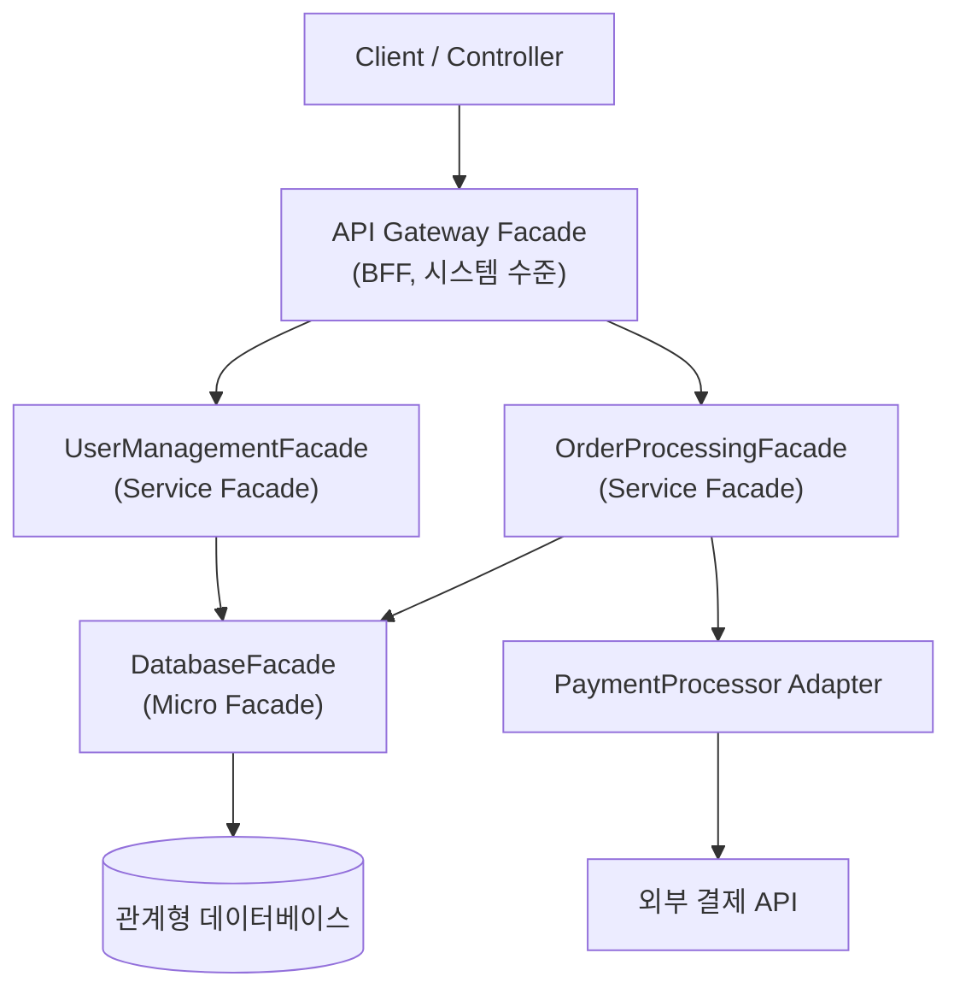

Adapter와 Facade 패턴을 통해 인터페이스 설계의 철학을 탐구합니다. 시스템 간 호환성 문제를 해결하고, 복잡한 서브시스템을 단순화하는 방법을 학습합니다.

## 서론: 시스템 통합의 영원한 딜레마

> *"소프트웨어 시스템은 홀로 존재하지 않는다. 모든 시스템은 다른 시스템과 소통해야 하고, 그 소통의 핵심은 인터페이스다."*

현대 소프트웨어 개발에서 **완전히 독립적인 시스템**은 존재하지 않습니다. 우리는 항상 다른 시스템과 통합해야 하는 상황에 직면합니다:

- 새로운 결제 시스템을 기존 이커머스 플랫폼에 통합
- 레거시 메인프레임 시스템과 최신 웹 애플리케이션 연동
- 다양한 써드파티 API를 하나의 일관된 인터페이스로 통합
- 마이크로서비스 간의 복잡한 통신 관리

이런 상황에서 **Adapter와 Facade 패턴**은 서로 다른 철학으로 해결책을 제시합니다:

### Adapter의 철학: "다름을 연결하는 다리"
- **호환성**: 서로 다른 인터페이스를 연결
- **변환**: 한 형태에서 다른 형태로 변환
- **보존**: 기존 시스템의 변경 없이 통합
- **적응**: 환경 변화에 유연하게 대응

### Facade의 철학: "복잡함을 단순함으로"
- **단순화**: 복잡한 서브시스템을 간단한 인터페이스로 제공
- **추상화**: 구현 세부사항을 숨김
- **조화**: 여러 컴포넌트를 하나의 일관된 서비스로 통합
- **보호**: 클라이언트를 복잡성으로부터 보호

두 패턴의 정의는 원전인 GoF(Gamma, Helm, Johnson, Vlissides)의 저서로 거슬러 올라갑니다.

> *"Convert the interface of a class into another interface clients expect."* — Adapter 패턴, *Design Patterns: Elements of Reusable Object-Oriented Software* (1994)

### 참고문헌

- Gamma, E., Helm, R., Johnson, R., Vlissides, J. (1994). *Design Patterns: Elements of Reusable Object-Oriented Software*. Addison-Wesley.

```java
// 현실적인 문제 상황
public class PaymentService {
    // 문제: 여러 결제 시스템과 통합해야 함
    public void processPayment(PaymentRequest request) {
        if (request.getMethod().equals("CREDIT_CARD")) {
            // 기존 신용카드 시스템 - 복잡한 API
            CreditCardProcessor processor = new CreditCardProcessor();
            processor.initialize();
            processor.setMerchantId("12345");
            processor.setSecurityKey("secret");
            processor.validateCard(request.getCardNumber());
            processor.processTransaction(request.getAmount());
            processor.finalize();
            
        } else if (request.getMethod().equals("PAYPAL")) {
            // PayPal API - 전혀 다른 인터페이스
            PayPalAPI paypal = new PayPalAPI();
            paypal.authenticate("user", "password");
            PayPalRequest ppRequest = new PayPalRequest();
            ppRequest.setAmount(request.getAmount());
            ppRequest.setCurrency("USD");
            paypal.makePayment(ppRequest);
            
        } else if (request.getMethod().equals("BANK_TRANSFER")) {
            // 은행 전산망 - 또 다른 복잡한 프로토콜
            BankTransferSystem bank = new BankTransferSystem();
            bank.connectToBank();
            bank.verifyAccount(request.getAccountNumber());
            bank.transferFunds(request.getAmount(), request.getTargetAccount());
            bank.disconnect();
        }
        
        // 이런 식으로 계속 늘어나면... 😱
    }
}
```

이런 문제를 Adapter와 Facade 패턴으로 어떻게 해결할 수 있는지 살펴보겠습니다.

## Adapter 패턴: 호환성의 마법사

### 문제의 본질: 인터페이스 불일치

Adapter 패턴의 핵심은 <strong>"이미 존재하는 클래스의 인터페이스를 다른 인터페이스로 변환"</strong>하는 것입니다. 실제 프로젝트에서 이런 상황은 매우 흔합니다.

```java
// 실제 상황: 기존 로깅 시스템
public class LegacyLogger {
    public void writeLog(int level, String message, String timestamp) {
        System.out.println("[" + timestamp + "] Level-" + level + ": " + message);
    }
    
    public void writeErrorLog(String error, String stackTrace) {
        System.err.println("ERROR: " + error + "\n" + stackTrace);
    }
}

// 새로운 표준 인터페이스 도입
public interface ModernLogger {
    void info(String message);
    void warn(String message);
    void error(String message);
    void debug(String message);
}

// 문제: 기존 코드 수백 곳에서 LegacyLogger 사용 중
// 모든 코드를 바꾸기에는 위험 부담이 너무 큼
```

#### Object Adapter - 구성을 통한 해결

```java
public class LoggerAdapter implements ModernLogger {
    private final LegacyLogger legacyLogger;
    private final DateTimeFormatter formatter;
    
    public LoggerAdapter(LegacyLogger legacyLogger) {
        this.legacyLogger = legacyLogger;
        this.formatter = DateTimeFormatter.ofPattern("yyyy-MM-dd HH:mm:ss");
    }
    
    @Override
    public void info(String message) {
        String timestamp = LocalDateTime.now().format(formatter);
        legacyLogger.writeLog(1, message, timestamp);
    }
    
    @Override
    public void warn(String message) {
        String timestamp = LocalDateTime.now().format(formatter);
        legacyLogger.writeLog(2, message, timestamp);
    }
    
    @Override
    public void error(String message) {
        // 주의: getStackTrace()는 StackTraceElement[]를 반환하므로 배열에 toString()을 호출하면
        // "[Ljava.lang.StackTraceElement;@1b6d3586" 같은 참조값 문자열만 남고 실제 호출 스택은 사라진다.
        // 각 원소를 문자열로 변환해 이어 붙여야 legacyLogger가 기대하는 스택트레이스 문자열이 된다.
        String stackTrace = Arrays.stream(Thread.currentThread().getStackTrace())
            .map(StackTraceElement::toString)
            .collect(Collectors.joining("\n"));
        legacyLogger.writeErrorLog(message, stackTrace);
    }
    
    @Override
    public void debug(String message) {
        String timestamp = LocalDateTime.now().format(formatter);
        legacyLogger.writeLog(0, message, timestamp);
    }
}

// 사용법: 점진적 마이그레이션 가능
public class OrderService {
    private final ModernLogger logger;
    
    public OrderService() {
        // 기존 시스템과 호환성 유지하면서 새 인터페이스 사용
        this.logger = new LoggerAdapter(new LegacyLogger());
    }
    
    public void processOrder(Order order) {
        logger.info("Processing order: " + order.getId());
        try {
            // 주문 처리 로직
            logger.info("Order processed successfully");
        } catch (Exception e) {
            logger.error("Order processing failed: " + e.getMessage());
        }
    }
}
```

#### Class Adapter - 상속을 통한 해결

Java는 단일 상속만 지원하므로 제한적이지만, 때로는 유용합니다:

```java
// 상속을 통한 Adapter (Java에서는 제한적)
public class LoggerClassAdapter extends LegacyLogger implements ModernLogger {
    private final DateTimeFormatter formatter = DateTimeFormatter.ofPattern("yyyy-MM-dd HH:mm:ss");
    
    @Override
    public void info(String message) {
        writeLog(1, message, LocalDateTime.now().format(formatter));
    }
    
    @Override
    public void warn(String message) {
        writeLog(2, message, LocalDateTime.now().format(formatter));
    }
    
    @Override
    public void error(String message) {
        writeErrorLog(message, "");
    }
    
    @Override
    public void debug(String message) {
        writeLog(0, message, LocalDateTime.now().format(formatter));
    }
    
    // 기존 메서드도 그대로 사용 가능
    // writeLog(), writeErrorLog() 등
}
```

#### 실무적인 Adapter 활용 사례

앞의 로깅 예제는 하나의 레거시 클래스를 하나의 새 인터페이스에 맞추는 가장 단순한 형태였다. 실무에서는 여러 개의 서로 다른 외부 구현체(케이스 1의 Stripe·PayPal)나 데이터 저장 방식(케이스 2의 레거시 DAO)을 동시에 같은 인터페이스로 묶어야 하는 경우가 더 많고, 이때 Adapter는 개별 구현마다 하나씩 존재하면서 호출하는 쪽(`PaymentService`, `UserService`)은 구체 클래스를 전혀 몰라도 되게 만든다.

**케이스 1: 외부 API 통합**

```java
// 외부 결제 API들 - 모두 다른 인터페이스
public class StripePaymentAPI {
    public StripeResult processPayment(String token, int amountInCents, String currency) {
        // Stripe API 호출
        return new StripeResult();
    }
}

public class PayPalAPI {
    public PayPalResponse executePayment(PayPalRequest request) {
        // PayPal API 호출
        return new PayPalResponse();
    }
}

// 통일된 결제 인터페이스
public interface PaymentProcessor {
    PaymentResult processPayment(PaymentRequest request);
    boolean supports(String paymentMethod);
}

// Stripe Adapter
public class StripeAdapter implements PaymentProcessor {
    private final StripePaymentAPI stripeAPI;
    
    public StripeAdapter(StripePaymentAPI stripeAPI) {
        this.stripeAPI = stripeAPI;
    }
    
    @Override
    public PaymentResult processPayment(PaymentRequest request) {
        try {
            // 데이터 변환
            String token = request.getToken();
            int amountInCents = (int) (request.getAmount() * 100);
            String currency = request.getCurrency();
            
            // API 호출
            StripeResult result = stripeAPI.processPayment(token, amountInCents, currency);
            
            // 결과 변환
            return new PaymentResult(
                result.isSuccessful(),
                result.getTransactionId(),
                result.getErrorMessage()
            );
            
        } catch (Exception e) {
            return new PaymentResult(false, null, "Stripe payment failed: " + e.getMessage());
        }
    }
    
    @Override
    public boolean supports(String paymentMethod) {
        return "CREDIT_CARD".equals(paymentMethod);
    }
}

// PayPal Adapter
public class PayPalAdapter implements PaymentProcessor {
    private final PayPalAPI paypalAPI;
    
    public PayPalAdapter(PayPalAPI paypalAPI) {
        this.paypalAPI = paypalAPI;
    }
    
    @Override
    public PaymentResult processPayment(PaymentRequest request) {
        try {
            // PayPal 전용 객체 생성
            PayPalRequest paypalRequest = new PayPalRequest();
            paypalRequest.setAmount(request.getAmount());
            paypalRequest.setCurrency(request.getCurrency());
            paypalRequest.setPayerEmail(request.getPayerEmail());
            
            // API 호출
            PayPalResponse response = paypalAPI.executePayment(paypalRequest);
            
            // 결과 변환
            return new PaymentResult(
                "SUCCESS".equals(response.getStatus()),
                response.getTransactionId(),
                response.getErrorCode()
            );
            
        } catch (Exception e) {
            return new PaymentResult(false, null, "PayPal payment failed: " + e.getMessage());
        }
    }
    
    @Override
    public boolean supports(String paymentMethod) {
        return "PAYPAL".equals(paymentMethod);
    }
}

// 사용하는 곳에서는 구현체를 몰라도 됨
public class PaymentService {
    private final List<PaymentProcessor> processors;
    
    public PaymentService() {
        this.processors = Arrays.asList(
            new StripeAdapter(new StripePaymentAPI()),
            new PayPalAdapter(new PayPalAPI())
            // 새로운 결제 수단 추가 시 Adapter만 만들면 됨
        );
    }
    
    public PaymentResult processPayment(PaymentRequest request) {
        for (PaymentProcessor processor : processors) {
            if (processor.supports(request.getPaymentMethod())) {
                return processor.processPayment(request);
            }
        }
        throw new UnsupportedOperationException("Payment method not supported");
    }
}
```

**케이스 2: 데이터베이스 마이그레이션**

```java
// 레거시 데이터베이스 DAO
public class LegacyUserDAO {
    public String getUserById(int id) {
        // 레거시 DB 쿼리
        return "user_data_string";
    }
    
    public void saveUser(String userData) {
        // 레거시 방식으로 저장
    }
}

// 새로운 표준 인터페이스
public interface UserRepository {
    Optional<User> findById(Long id);
    User save(User user);
    List<User> findAll();
}

// 마이그레이션을 위한 Adapter
public class LegacyUserRepositoryAdapter implements UserRepository {
    private static final Logger logger = LoggerFactory.getLogger(LegacyUserRepositoryAdapter.class);
    private final LegacyUserDAO legacyDAO;
    private final UserDataConverter converter;
    
    public LegacyUserRepositoryAdapter(LegacyUserDAO legacyDAO) {
        this.legacyDAO = legacyDAO;
        this.converter = new UserDataConverter();
    }
    
    @Override
    public Optional<User> findById(Long id) {
        try {
            String userData = legacyDAO.getUserById(id.intValue());
            if (userData != null && !userData.isEmpty()) {
                User user = converter.fromLegacyString(userData);
                return Optional.of(user);
            }
            return Optional.empty();
        } catch (Exception e) {
            logger.error("Failed to fetch user from legacy system", e);
            return Optional.empty();
        }
    }
    
    @Override
    public User save(User user) {
        String legacyData = converter.toLegacyString(user);
        legacyDAO.saveUser(legacyData);
        return user;
    }
    
    @Override
    public List<User> findAll() {
        // 레거시 시스템에서는 전체 조회가 비효율적이므로 제한
        throw new UnsupportedOperationException("Legacy system doesn't support findAll operation");
    }
}

// 점진적 마이그레이션 전략
public class UserService {
    private final UserRepository userRepository;
    
    public UserService(boolean useLegacySystem) {
        if (useLegacySystem) {
            this.userRepository = new LegacyUserRepositoryAdapter(new LegacyUserDAO());
        } else {
            this.userRepository = new ModernUserRepository();
        }
    }
    
    // 비즈니스 로직은 동일하게 유지
    public User getUser(Long id) {
        return userRepository.findById(id)
                .orElseThrow(() -> new UserNotFoundException("User not found: " + id));
    }
}
```

## Facade 패턴: 복잡성을 가리는 단순한 얼굴

### 문제의 본질: 복잡한 서브시스템

Facade 패턴은 Adapter와는 다른 문제를 해결합니다. **복잡한 서브시스템을 단순한 인터페이스로 감싸는** 것이 목적입니다.

```java
// 현실적인 문제 상황: 이커머스 주문 처리
public class OrderController {
    
    public ResponseEntity<String> createOrder(OrderRequest request) {
        // 현재 코드: 컨트롤러에 너무 많은 책임
        
        // 1. 재고 확인
        InventoryService inventoryService = new InventoryService();
        DatabaseConnection inventoryDB = new DatabaseConnection("inventory_db");
        inventoryDB.connect();
        for (OrderItem item : request.getItems()) {
            if (!inventoryService.checkStock(inventoryDB, item.getProductId(), item.getQuantity())) {
                inventoryDB.close();
                return ResponseEntity.badRequest().body("Insufficient stock for " + item.getProductId());
            }
        }
        
        // 2. 가격 계산
        PricingEngine pricingEngine = new PricingEngine();
        DiscountService discountService = new DiscountService();
        TaxCalculator taxCalculator = new TaxCalculator();
        
        double subtotal = 0;
        for (OrderItem item : request.getItems()) {
            double price = pricingEngine.getPrice(item.getProductId());
            double discount = discountService.calculateDiscount(request.getCustomerId(), item);
            subtotal += (price - discount) * item.getQuantity();
        }
        double tax = taxCalculator.calculateTax(subtotal, request.getShippingAddress());
        double total = subtotal + tax;
        
        // 3. 결제 처리
        PaymentGateway paymentGateway = new PaymentGateway();
        PaymentRequest paymentRequest = new PaymentRequest();
        paymentRequest.setAmount(total);
        paymentRequest.setCustomerId(request.getCustomerId());
        paymentRequest.setPaymentMethod(request.getPaymentMethod());
        
        PaymentResult paymentResult = paymentGateway.processPayment(paymentRequest);
        if (!paymentResult.isSuccessful()) {
            inventoryDB.close();
            return ResponseEntity.badRequest().body("Payment failed");
        }
        
        // 4. 주문 저장
        OrderRepository orderRepository = new OrderRepository();
        DatabaseConnection orderDB = new DatabaseConnection("order_db");
        orderDB.connect();
        Order order = new Order();
        order.setCustomerId(request.getCustomerId());
        order.setItems(request.getItems());
        order.setTotal(total);
        order.setPaymentId(paymentResult.getPaymentId());
        orderRepository.save(orderDB, order);
        
        // 5. 재고 차감
        for (OrderItem item : request.getItems()) {
            inventoryService.decreaseStock(inventoryDB, item.getProductId(), item.getQuantity());
        }
        
        // 6. 알림 발송
        NotificationService notificationService = new NotificationService();
        EmailService emailService = new EmailService();
        SMSService smsService = new SMSService();
        CustomerService customerService = new CustomerService();
        
        Customer customer = customerService.getCustomer(request.getCustomerId());
        emailService.sendOrderConfirmation(customer.getEmail(), order);
        if (customer.isSmsEnabled()) {
            smsService.sendOrderSMS(customer.getPhone(), order);
        }
        
        // 7. 로깅 및 감사
        AuditService auditService = new AuditService();
        auditService.logOrderCreation(order, customer);
        
        // 연결 정리
        inventoryDB.close();
        orderDB.close();
        
        return ResponseEntity.ok("Order created successfully: " + order.getId());
    }
}

// 문제점:
// 1. 컨트롤러가 너무 복잡함 (100줄 넘는 메서드)
// 2. 여러 서브시스템의 복잡한 상호작용
// 3. 에러 처리가 어려움
// 4. 테스트하기 어려움
// 5. 재사용이 불가능함
```

#### Facade로 복잡성 단순화

```java
// 주문 처리를 위한 Facade
public class OrderProcessingFacade {
    private static final Logger logger = LoggerFactory.getLogger(OrderProcessingFacade.class);
    private final InventoryService inventoryService;
    private final PricingService pricingService;
    private final PaymentService paymentService;
    private final OrderService orderService;
    private final NotificationService notificationService;
    private final AuditService auditService;
    private final RecommendationService recommendationService;
    
    public OrderProcessingFacade() {
        // 의존성 주입으로 각 서비스 초기화
        this.inventoryService = new InventoryService();
        this.pricingService = new PricingService();
        this.paymentService = new PaymentService();
        this.orderService = new OrderService();
        this.notificationService = new NotificationService();
        this.auditService = new AuditService();
        this.recommendationService = new RecommendationService();
    }
    
    // 복잡한 주문 처리를 하나의 간단한 메서드로 제공
    public OrderResult processOrder(OrderRequest request) {
        try {
            // 1단계: 재고 검증
            validateInventory(request);
            
            // 2단계: 가격 계산
            PricingResult pricing = pricingService.calculatePricing(request);
            
            // 3단계: 결제 처리
            PaymentResult payment = paymentService.processPayment(
                request.getCustomerId(), 
                pricing.getTotal(), 
                request.getPaymentMethod()
            );
            
            // 4단계: 주문 생성 (트랜잭션 처리)
            Order order = orderService.createOrder(request, pricing, payment);
            
            // 5단계: 재고 차감
            inventoryService.reserveItems(request.getItems());
            
            // 6단계: 후처리 (비동기)
            processPostOrderActions(order, request.getCustomerId());
            
            return OrderResult.success(order);
            
        } catch (InsufficientStockException e) {
            return OrderResult.failure("재고 부족: " + e.getMessage());
        } catch (PaymentException e) {
            return OrderResult.failure("결제 실패: " + e.getMessage());
        } catch (Exception e) {
            // 실패 시 보상 트랜잭션
            rollbackOrder(request);
            return OrderResult.failure("주문 처리 실패: " + e.getMessage());
        }
    }
    
    // 복잡한 비즈니스 로직을 내부 메서드로 숨김
    private void validateInventory(OrderRequest request) throws InsufficientStockException {
        for (OrderItem item : request.getItems()) {
            if (!inventoryService.hasStock(item.getProductId(), item.getQuantity())) {
                throw new InsufficientStockException(
                    "상품 " + item.getProductId() + "의 재고가 부족합니다");
            }
        }
    }
    
    private void processPostOrderActions(Order order, String customerId) {
        // 비동기 처리로 성능 최적화
        CompletableFuture.runAsync(() -> {
            try {
                // 알림 발송
                notificationService.sendOrderConfirmation(order, customerId);
                
                // 감사 로그 기록
                auditService.logOrderCreation(order);
                
                // 추천 시스템 업데이트
                recommendationService.updatePurchaseHistory(customerId, order);
                
            } catch (Exception e) {
                logger.error("주문 후처리 실패", e);
                // 후처리 실패는 주문 성공에 영향 주지 않음
            }
        });
    }
    
    private void rollbackOrder(OrderRequest request) {
        // 보상 트랜잭션 로직
        try {
            inventoryService.releaseReservation(request.getItems());
            paymentService.refundIfProcessed(request.getCustomerId());
        } catch (Exception e) {
            logger.error("주문 롤백 실패", e);
        }
    }
}

// 컨트롤러는 이제 매우 단순해짐
@RestController
public class OrderController {
    private final OrderProcessingFacade orderFacade;
    
    public OrderController(OrderProcessingFacade orderFacade) {
        this.orderFacade = orderFacade;
    }
    
    @PostMapping("/orders")
    public ResponseEntity<OrderResponse> createOrder(@RequestBody OrderRequest request) {
        // 복잡한 로직은 Facade에 위임
        OrderResult result = orderFacade.processOrder(request);
        
        if (result.isSuccess()) {
            return ResponseEntity.ok(
                new OrderResponse(result.getOrder().getId(), "주문이 성공적으로 생성되었습니다")
            );
        } else {
            return ResponseEntity.badRequest().body(
                new OrderResponse(null, result.getErrorMessage())
            );
        }
    }
}
```

#### 계층별 Facade 전략

Facade는 한 층에서만 쓰이는 패턴이 아니라, 시스템을 얼마나 넓은 범위로 감싸는지에 따라 여러 층으로 겹쳐 쌓을 수 있다. 아래 계층구조는 이 절에서 다루는 두 층 — 가장 좁은 범위의 Micro Facade, 여러 서비스를 조합하는 Service Facade — 이 뒤에서 다룰 API Gateway/BFF 수준의 시스템 Facade와 함께, 클라이언트로부터 실제 자원(데이터베이스·외부 API)까지 어떻게 겹겹이 단순화를 쌓아가는지 보여준다. 상위 계층의 Facade는 하위 계층의 Facade를 그대로 호출할 뿐, 하위 계층의 구현을 재구현하지 않는다는 점이 핵심이다.



이 계층 구조에서 주의할 점은 각 층의 책임 범위가 겹치지 않아야 한다는 것이다. Service Facade가 Micro Facade의 SQL 세부사항까지 알게 되면 계층 경계가 무너지고, API Gateway Facade가 여러 Service Facade의 트랜잭션을 직접 조율하기 시작하면 뒤에서 다룰 "Fat Facade" 안티패턴으로 이어진다.

**Micro Facade - 작은 단위의 복잡성 감소**

Micro Facade는 앞의 계층도에서 가장 아래쪽, 즉 하나의 기술적 관심사(여기서는 JDBC 커넥션·쿼리 빌더·결과 매핑)만 감싸는 층이다. 책임 범위가 좁을수록 재사용 대상도 넓어진다는 것이 이 층의 존재 이유다 — `DatabaseFacade`는 `UserManagementFacade`든 `OrderProcessingFacade`든 어떤 상위 Service Facade에서 호출해도 무방하며, 상위 Facade는 SQL 문자열이나 `ResultSet` 커서 같은 세부사항을 몰라도 된다. 아래 `DatabaseFacade`가 `PreparedStatement`와 `ResultSet`을 직접 다루면서도 호출자에게는 `findAll`, `findById`, `save` 세 메서드만 노출하는 것이 이 원칙을 코드로 보여준다.

```java
// 데이터베이스 작업을 위한 Micro Facade
public class DatabaseFacade {
    private final DataSource dataSource;
    private final QueryBuilder queryBuilder;
    private final ResultMapper resultMapper;
    private final ConnectionManager connectionManager;
    
    public <T> List<T> findAll(Class<T> entityClass) {
        return connectionManager.executeWithConnection(connection -> {
            String query = queryBuilder.buildSelectAll(entityClass);
            PreparedStatement stmt = connection.prepareStatement(query);
            ResultSet rs = stmt.executeQuery();
            return resultMapper.mapToList(rs, entityClass);
        });
    }
    
    public <T> Optional<T> findById(Class<T> entityClass, Object id) {
        return connectionManager.executeWithConnection(connection -> {
            String query = queryBuilder.buildSelectById(entityClass);
            PreparedStatement stmt = connection.prepareStatement(query);
            stmt.setObject(1, id);
            ResultSet rs = stmt.executeQuery();
            return resultMapper.mapToOptional(rs, entityClass);
        });
    }
    
    public <T> T save(T entity) {
        return connectionManager.executeWithTransaction(connection -> {
            if (entityHasId(entity)) {
                return updateEntity(connection, entity);
            } else {
                return insertEntity(connection, entity);
            }
        });
    }
    
    // 내부 구현은 숨겨지지만 실제로는 QueryBuilder/ResultMapper가 리플렉션으로
    // 엔티티 필드를 읽어 SQL과 바인딩 파라미터를 만든다(가상의 헬퍼 계약이며,
    // buildSelectAll·mapToList와 동일한 방식으로 동작한다고 가정한다).
    private <T> T updateEntity(Connection connection, T entity) throws SQLException {
        String query = queryBuilder.buildUpdate(entity.getClass());
        try (PreparedStatement stmt = connection.prepareStatement(query)) {
            Object[] params = resultMapper.toUpdateParameters(entity);
            for (int i = 0; i < params.length; i++) {
                stmt.setObject(i + 1, params[i]);
            }
            stmt.executeUpdate();
        }
        return entity;
    }
    
    private <T> T insertEntity(Connection connection, T entity) throws SQLException {
        String query = queryBuilder.buildInsert(entity.getClass());
        try (PreparedStatement stmt = connection.prepareStatement(query, Statement.RETURN_GENERATED_KEYS)) {
            Object[] params = resultMapper.toInsertParameters(entity);
            for (int i = 0; i < params.length; i++) {
                stmt.setObject(i + 1, params[i]);
            }
            stmt.executeUpdate();
            try (ResultSet keys = stmt.getGeneratedKeys()) {
                if (keys.next()) {
                    resultMapper.assignGeneratedId(entity, keys.getObject(1));
                }
            }
        }
        return entity;
    }
}
```

`updateEntity`와 `insertEntity`를 빈 스텁으로 남기면 이 Micro Facade가 실제로 어떤 SQL을 만드는지, 파라미터 바인딩 순서가 컬럼 순서와 일치하는지 검증할 방법이 없다. 위처럼 `PreparedStatement`를 직접 여닫는 형태로 채워두면 두 가지 실무 함정이 드러난다. 첫째, `try-with-resources`를 빼먹으면 트랜잭션이 긴 배치 작업에서 `PreparedStatement`가 커넥션 풀 소진 시점까지 살아남아 리소스 누수로 이어진다. 둘째, `toUpdateParameters`/`toInsertParameters`가 반환하는 배열 순서가 `buildUpdate`/`buildInsert`가 생성한 SQL의 `?` 순서와 어긋나면 컴파일은 되지만 엉뚱한 컬럼에 값이 들어가는 조용한 데이터 손상이 발생하므로, 이 두 메서드는 반드시 같은 필드 목록(예: 엔티티의 리플렉션 필드 순서)을 공유해야 한다.

**Service Facade - 비즈니스 로직 조합**

Service Facade는 Micro Facade보다 한 층 위에서, 여러 리포지토리와 도메인 서비스를 하나의 유스케이스로 묶는다. `DatabaseFacade`가 "어떻게 저장하는가"라는 기술적 질문에 답했다면, `UserManagementFacade`는 "회원가입이란 무엇인가"라는 비즈니스 질문에 답한다 — 중복 이메일 검사, 프로필 생성, 기본 권한 부여, 환영 메일 발송, 감사 로그까지 하나의 트랜잭션 경계 안에서 순서대로 조율하는 것이 이 층의 책임이다. 이 조율 자체가 Facade의 부가가치이며, 아래 `registerUser`처럼 단계가 여럿일수록 Service Facade 없이는 컨트롤러나 도메인 객체가 그 순서를 떠안게 된다.

```java
// 사용자 관리를 위한 Service Facade
public class UserManagementFacade {
    private final UserRepository userRepository;
    private final ProfileRepository profileRepository;
    private final AuthenticationService authService;
    private final AuthorizationService authzService;
    private final NotificationService notificationService;
    private final AuditService auditService;
    private final ActivityService activityService;
    private final RecommendationService recommendationService;
    
    // 복잡한 사용자 등록 프로세스를 단순화
    public UserRegistrationResult registerUser(UserRegistrationRequest request) {
        return executeWithTransaction(() -> {
            // 1. 입력 검증
            validateRegistrationRequest(request);
            
            // 2. 중복 사용자 확인
            if (userRepository.existsByEmail(request.getEmail())) {
                throw new UserAlreadyExistsException("이미 등록된 이메일입니다");
            }
            
            // 3. 사용자 생성
            User user = createUser(request);
            User savedUser = userRepository.save(user);
            
            // 4. 프로필 생성
            UserProfile profile = createUserProfile(savedUser, request);
            profileRepository.save(profile);
            
            // 5. 초기 권한 설정
            authzService.assignDefaultRoles(savedUser);
            
            // 6. 환영 이메일 발송 (비동기)
            notificationService.sendWelcomeEmailAsync(savedUser);
            
            // 7. 감사 로그
            auditService.logUserRegistration(savedUser);
            
            return UserRegistrationResult.success(savedUser);
        });
    }
    
    // 복잡한 인증 프로세스 단순화
    public AuthenticationResult authenticateUser(String email, String password) {
        try {
            // 1. 사용자 존재 확인
            User user = userRepository.findByEmail(email)
                .orElseThrow(() -> new UserNotFoundException("사용자를 찾을 수 없습니다"));
            
            // 2. 계정 상태 확인
            validateAccountStatus(user);
            
            // 3. 비밀번호 검증
            if (!authService.verifyPassword(password, user.getPasswordHash())) {
                recordFailedAttempt(user);
                throw new InvalidCredentialsException("잘못된 비밀번호입니다");
            }
            
            // 4. 로그인 성공 처리
            recordSuccessfulLogin(user);
            String token = authService.generateToken(user);
            
            // 5. 세션 생성
            authService.createSession(user, token);
            
            return AuthenticationResult.success(user, token);
            
        } catch (Exception e) {
            auditService.logAuthenticationFailure(email, e.getMessage());
            throw e;
        }
    }
    
    // 내부 복잡성은 private 메서드로 숨김
    private void validateRegistrationRequest(UserRegistrationRequest request) {
        // 복잡한 검증 로직
    }
    
    private User createUser(UserRegistrationRequest request) {
        // 복잡한 사용자 생성 로직
        return new User();
    }
    
    private void validateAccountStatus(User user) {
        // 계정 상태 검증 로직
    }
}
```

#### Facade vs Service Layer 차이점

Service Facade를 다루다 보면 "이건 그냥 Service 클래스 아닌가?"라는 질문이 자연스럽게 따라온다. 판단 기준은 클래스 이름이 아니라 메서드 본문이 하는 일이다 — Repository 호출 하나를 그대로 반환만 하면 Facade가 제공해야 할 조합·조율이 없는 것이고, 여러 저장소·서비스를 모아 새로운 결과를 구성하면 그때 비로소 Facade다. 아래 두 클래스를 나란히 비교하면 이 기준이 코드 수준에서 어떻게 드러나는지 보인다.

```java
// 잘못된 Service (실제로는 Facade가 아님)
public class BadUserService {
    // 문제: 단순히 Repository 메서드를 위임하기만 함
    public User findById(Long id) {
        return userRepository.findById(id);  // 단순 위임
    }
    
    public User save(User user) {
        return userRepository.save(user);    // 단순 위임
    }
}

// 올바른 Facade (복잡한 비즈니스 로직 조합)
public class UserManagementFacade {
    // 여러 서비스를 조합한 복잡한 비즈니스 로직
    public UserProfileResult getUserProfile(Long userId) {
        // 1. 사용자 기본 정보
        User user = userRepository.findById(userId)
            .orElseThrow(() -> new UserNotFoundException("사용자 없음"));
        
        // 2. 사용자 프로필
        UserProfile profile = profileRepository.findByUserId(userId);
        
        // 3. 권한 정보
        List<Role> roles = authzService.getUserRoles(userId);
        
        // 4. 활동 통계
        UserActivityStats stats = activityService.getUserStats(userId);
        
        // 5. 추천 정보
        List<Recommendation> recommendations = recommendationService.getRecommendations(userId);
        
        // 6. 결합된 결과 반환
        return UserProfileResult.builder()
            .user(user)
            .profile(profile)
            .roles(roles)
            .activityStats(stats)
            .recommendations(recommendations)
            .build();
    }
}
```

## Adapter vs Facade: 철학과 적용 시나리오

### 패턴의 핵심 차이점

| 구분 | Adapter 패턴 | Facade 패턴 |
|------|-------------|-------------|
| **목적** | 인터페이스 호환성 해결 | 복잡성 단순화 |
| **문제** | "서로 다른 인터페이스" | "복잡한 서브시스템" |
| **해결** | 변환(Translation) | 추상화(Abstraction) |
| **관계** | 1:1 매핑 (기존→새로운) | 1:N 조합 (여러→하나) |
| **결합도** | 기존 시스템과 강결합 | 서브시스템과 약결합 |
| **재사용성** | 특정 변환에 한정 | 높은 재사용성 |

### 선택 기준과 시나리오

```java
// Adapter를 선택해야 하는 경우
class PaymentAdapterExample {
    /*
    시나리오:
    - 기존 결제 시스템 (Legacy) 존재
    - 새로운 표준 인터페이스 도입
    - 기존 시스템 변경 불가
    - 점진적 마이그레이션 필요
    */
    
    // 기존 시스템 (변경 불가)
    class LegacyPaymentSystem {
        public void processPayment(String cardNumber, double amount, String merchantId) {
            // 레거시 로직
        }
    }
    
    // 새로운 표준
    interface PaymentProcessor {
        PaymentResult process(PaymentRequest request);
    }
    
    // Adapter로 호환성 해결
    class LegacyPaymentAdapter implements PaymentProcessor {
        private final LegacyPaymentSystem legacy;
        
        @Override
        public PaymentResult process(PaymentRequest request) {
            // 인터페이스 변환
            legacy.processPayment(
                request.getCardNumber(), 
                request.getAmount(), 
                request.getMerchantId()
            );
            return new PaymentResult(true);
        }
    }
}

// Facade를 선택해야 하는 경우
class OrderFacadeExample {
    /*
    시나리오:
    - 여러 독립적인 서비스들 존재
    - 복잡한 비즈니스 플로우
    - 클라이언트에게 단순한 인터페이스 제공 필요
    - 서비스들 간의 조정 필요
    */
    
    // 복잡한 서브시스템들 (각각 독립적)
    class InventoryService { /* ... */ }
    class PaymentService { /* ... */ }
    class ShippingService { /* ... */ }
    class NotificationService { /* ... */ }
    
    // Facade로 복잡성 숨김
    class OrderProcessingFacade {
        // 여러 서비스를 조합하여 단순한 인터페이스 제공
        public OrderResult createOrder(OrderRequest request) {
            // 복잡한 조정 로직
            inventoryService.reserve(request.getItems());
            PaymentResult payment = paymentService.charge(request);
            shippingService.schedule(request.getAddress());
            notificationService.confirm(request.getCustomer());
            
            return OrderResult.success();
        }
    }
}
```

### 실무적 판단 가이드라인

앞의 "선택 기준과 시나리오"가 Adapter와 Facade를 각각 단독으로 놓고 설명했다면, 실제 프로젝트에서는 두 패턴이 동시에, 그것도 서로 다른 계층에서 함께 쓰이는 경우가 더 흔하다. 아래 세 사례는 그 조합의 전형을 보여준다 — 써드파티 라이브러리 교체는 순수한 1:1 변환이라 Adapter만으로 충분하고, 마이크로서비스 오케스트레이션은 순수한 N:1 조합이라 Facade만으로 충분하지만, 레거시 시스템 현대화는 "기존 시스템을 새 인터페이스로 변환"(Adapter)한 뒤 "그 변환된 인터페이스와 새 시스템을 하나의 진입점으로 묶는"(Facade) 2단계 구조가 필요하다.

```java
// 실무에서의 패턴 선택 예시
public class PatternSelectionGuide {
    
    // Case 1: 써드파티 라이브러리 통합 → Adapter
    public class ThirdPartyLibraryIntegration {
        // 기존: Apache HttpClient
        // 새로운: OkHttp
        // 해결: Adapter로 인터페이스 통일
        
        interface HttpClient {
            Response execute(Request request);
        }
        
        class OkHttpAdapter implements HttpClient {
            private final okhttp3.OkHttpClient okHttpClient;
            
            @Override
            public Response execute(Request request) {
                // OkHttp 특화 로직을 표준 인터페이스로 변환
                okhttp3.Request okRequest = convertRequest(request);
                okhttp3.Response okResponse = okHttpClient.newCall(okRequest).execute();
                return convertResponse(okResponse);
            }
        }
    }
    
    // Case 2: 마이크로서비스 오케스트레이션 → Facade
    public class MicroserviceOrchestration {
        // 여러 마이크로서비스를 조합하여 비즈니스 기능 제공
        
        @RestController
        class UserProfileFacade {
            private final UserService userService;
            private final PreferenceService preferenceService;
            private final ActivityService activityService;
            private final RecommendationService recommendationService;
            
            @GetMapping("/profile/{userId}")
            public UserProfileResponse getProfile(@PathVariable String userId) {
                // 여러 서비스 호출을 조합하여 완전한 프로필 제공
                CompletableFuture<User> userFuture = 
                    CompletableFuture.supplyAsync(() -> userService.getUser(userId));
                CompletableFuture<Preferences> prefFuture = 
                    CompletableFuture.supplyAsync(() -> preferenceService.getPreferences(userId));
                CompletableFuture<ActivityStats> statsFuture = 
                    CompletableFuture.supplyAsync(() -> activityService.getStats(userId));
                
                // 비동기로 모든 데이터 수집
                return CompletableFuture.allOf(userFuture, prefFuture, statsFuture)
                    .thenApply(v -> UserProfileResponse.builder()
                        .user(userFuture.join())
                        .preferences(prefFuture.join())
                        .activityStats(statsFuture.join())
                        .recommendations(recommendationService.getRecommendations(userId))
                        .build())
                    .join();
            }
        }
    }
    
    // Case 3: 레거시 시스템 현대화 → Adapter + Facade 조합
    public class LegacyModernization {
        // 레거시 시스템을 현대적 아키텍처로 점진적 전환
        
        // 1단계: Adapter로 레거시 시스템 래핑
        class LegacySystemAdapter implements ModernInterface {
            private final LegacySystem legacySystem;
            
            @Override
            public Result processData(Data data) {
                // 데이터 변환
                LegacyData legacyData = convertToLegacy(data);
                LegacyResult legacyResult = legacySystem.process(legacyData);
                return convertToModern(legacyResult);
            }
        }
        
        // 2단계: Facade로 전체 시스템 단순화
        class BusinessProcessFacade {
            private final ModernInterface modernSystem;
            private final LegacySystemAdapter legacyAdapter;
            
            public ProcessResult executeBusinessProcess(ProcessRequest request) {
                if (canUseModernSystem(request)) {
                    return modernSystem.processData(request.getData());
                } else {
                    // 레거시 시스템으로 fallback
                    return legacyAdapter.processData(request.getData());
                }
            }
        }
    }
}
```

세 사례를 실무에 적용할 때 놓치기 쉬운 함정은 각각 다르다. Case 1의 `OkHttpAdapter`처럼 순수 라이브러리 교체는 Adapter 하나로 끝나 보이지만, `convertRequest`/`convertResponse`가 헤더 대소문자·타임아웃 단위·리다이렉트 처리 방식까지 완전히 흡수하지 못하면 특정 엣지 케이스에서만 두 라이브러리의 동작이 미묘하게 갈리는 버그가 남는다. Case 2의 `CompletableFuture.allOf` 조합은 세 호출 중 하나라도 예외를 던지면 `join()` 시점에 `CompletionException`으로 래핑돼 어떤 서비스가 실패했는지 스택 트레이스만으로는 즉시 드러나지 않으므로, 실무에서는 각 `CompletableFuture`에 `exceptionally`를 개별로 걸어 실패 서비스를 특정해야 한다. Case 3의 `canUseModernSystem` 분기는 신중하게 설계하지 않으면 같은 요청이 어느 날은 신규 시스템으로, 어느 날은 레거시로 라우팅되어 두 시스템의 데이터 정합성이 어긋나는 "이중 트랙" 문제를 낳으므로, 전환 기준은 요청 단위가 아니라 고객·테넌트 단위로 고정하는 편이 안전하다.

## 흔한 오개념

패턴을 처음 접하는 개발자가 자주 빠지는 착각을 짚어 원 개념과 대비시킨다.

### 오개념 1: "Adapter와 Facade는 결국 같은 패턴이다"

두 패턴 모두 다른 클래스를 감싸는 래퍼(wrapper) 형태를 취하기 때문에 구조만 보면 구별이 어렵다는 착각이 흔하다. 그러나 두 패턴은 "무엇이 새 인터페이스의 형태를 결정하는가"라는 질문에서 갈린다. Adapter는 **클라이언트가 이미 기대하고 있는 인터페이스**(앞선 예의 `ModernLogger`, `PaymentProcessor`)에 맞춰 기존 클래스의 동작을 변환하는 것이 목적이므로, 새 인터페이스의 형태는 Adapter 작성자가 아니라 클라이언트 쪽 계약이 미리 결정해 둔다. 반면 Facade는 클라이언트가 맞춰야 할 기존 인터페이스가 존재하지 않는 상태에서, 여러 서브시스템을 편하게 쓰기 위한 새로운 인터페이스를 설계자가 자유롭게 만든다. 구분 질문은 다음과 같다: "이 클래스가 맞춰야 할 인터페이스가 이미 정해져 있는가?" — 그렇다면 Adapter, 새로 설계할 수 있다면 Facade다.

### 오개념 2: "Facade를 쓰면 서브시스템 클래스에 직접 접근할 수 없다"

Facade가 서브시스템을 "숨긴다"는 설명 때문에, 서브시스템 클래스에 대한 접근을 원천 차단하는 캡슐화 장치로 오해하기 쉽다. 실제로는 그렇지 않다. Facade는 대부분의 클라이언트가 필요로 하는 흔한 시나리오를 단순화한 **선택적 진입점**일 뿐, 서브시스템 클래스의 `public` 접근 제어자를 바꾸지 않는다. 앞의 `OrderProcessingFacade`를 쓰더라도, 세밀한 제어가 필요한 클라이언트는 `InventoryService`나 `PaymentGateway`를 Facade를 거치지 않고 직접 호출할 수 있다. Facade가 강제하는 것은 "권장 경로"이지 "유일한 경로"가 아니며, 이 자유도를 실제로 없애려면 서브시스템 클래스의 접근 제어자를 패키지 전용(default) 수준으로 별도로 좁혀야 한다.

### 오개념 3: "Facade는 Service Layer(애플리케이션 서비스)와 동일하다"

계층형 아키텍처에서 Service 클래스가 여러 Repository·외부 API를 호출하는 모습이 Facade와 비슷해 보이면서, 이름만 다를 뿐 같은 것이라는 오해가 생긴다. 앞의 "Facade vs Service Layer 차이점"(`BadUserService`와 `UserManagementFacade` 비교)에서 보듯, 판단 기준은 클래스 이름이 아니라 **단순 위임이냐 조합이냐**다. Repository 메서드를 그대로 감싸기만 하는 Service는 Facade의 의도(복잡성 조정)를 달성하지 못하는 Anemic Facade이고, 여러 서비스를 조합해 새로운 비즈니스 가치를 만드는 Service만이 실질적으로 Facade 역할을 한다.

## 현대적 활용과 진화

Adapter와 Facade는 클래스 수준의 설계 기법으로 소개했지만, 마이크로서비스 아키텍처로 넘어가면 같은 원리가 시스템 경계에서도 그대로 나타난다. API Gateway·BFF(Backend for Frontend)는 여러 서비스를 하나의 진입점으로 묶는다는 점에서 Facade의 확장이고, 메시지 브로커별 어댑터는 서로 다른 프로토콜(Kafka·RabbitMQ·SQS)을 하나의 발행 인터페이스로 통일한다는 점에서 Adapter의 확장이다. 아래 두 예제로 이 확장을 확인한다.

### API Gateway와 Facade 패턴

```java
// Netflix Zuul, Spring Cloud Gateway 스타일
// 주의: @GetMapping 등 요청 매핑 애노테이션은 클래스가 @Controller/@RestController로
// 스테레오타입 지정돼 있어야 DispatcherServlet이 핸들러로 등록한다. @Component만으로는
// 빈으로 등록되더라도 HTTP 요청과 매핑되지 않는다.
@RestController
public class APIGatewayFacade {
    private final UserService userService;
    private final OrderService orderService;
    private final ProductService productService;
    private final NotificationService notificationService;
    private final AnalyticsService analyticsService;
    
    // 여러 마이크로서비스를 조합한 BFF (Backend for Frontend)
    @GetMapping("/mobile/dashboard/{userId}")
    public MobileDashboardResponse getMobileDashboard(@PathVariable String userId) {
        // 모바일에 최적화된 데이터 조합
        return MobileDashboardResponse.builder()
            .userInfo(userService.getBasicInfo(userId))
            .recentOrders(orderService.getRecentOrders(userId, 5))
            .recommendedProducts(productService.getRecommendations(userId, 10))
            .unreadNotifications(notificationService.getUnreadCount(userId))
            .build();
    }
    
    @GetMapping("/web/dashboard/{userId}")
    public WebDashboardResponse getWebDashboard(@PathVariable String userId) {
        // 웹에 최적화된 더 상세한 데이터
        return WebDashboardResponse.builder()
            .userProfile(userService.getFullProfile(userId))
            .orderHistory(orderService.getOrderHistory(userId, 20))
            .productCatalog(productService.getCatalogForUser(userId))
            .analytics(analyticsService.getUserAnalytics(userId))
            .notifications(notificationService.getAllNotifications(userId))
            .build();
    }
    
    // 에러 처리와 회복력
    // @PathVariable은 요청 매핑 애노테이션이 선언한 경로 템플릿의 변수와 짝을 이뤄야 하므로,
    // @CircuitBreaker 등 회복력 애노테이션만으로는 부족하고 @GetMapping 경로가 함께 필요하다.
    @GetMapping("/async/dashboard/{userId}")
    @CircuitBreaker(name = "userService", fallbackMethod = "fallbackDashboard")
    @TimeLimiter(name = "userService")
    @Retry(name = "userService")
    public Mono<DashboardResponse> getDashboardAsync(@PathVariable String userId) {
        return Mono.fromCallable(() -> getMobileDashboard(userId));
    }
    
    public MobileDashboardResponse fallbackDashboard(String userId, Exception ex) {
        // 장애 시 기본 대시보드 제공
        return MobileDashboardResponse.builder()
            .userInfo(UserInfo.defaultUser(userId))
            .message("일부 서비스에 일시적 문제가 있습니다")
            .build();
    }
}
```

`APIGatewayFacade`처럼 모바일용·웹용 엔드포인트를 나란히 두는 BFF는 클라이언트별 응답 모양을 자유롭게 최적화할 수 있다는 장점이 있지만, `getMobileDashboard`와 `getWebDashboard`가 호출하는 서비스 목록이 겹칠수록 두 메서드에 중복 로직이 쌓이는 함정이 있다. `getDashboardAsync`가 내부적으로 `getMobileDashboard`를 그대로 호출하는 것도 실제로는 문제가 된다 — `@CircuitBreaker`·`@TimeLimiter`가 감싸는 것은 `Mono.fromCallable` 블록이지만 그 안에서 실행되는 `getMobileDashboard`는 동기 메서드이므로, 타임아웃이 발생해도 이미 시작된 서비스 호출 스레드는 계속 실행되어 회복력 애노테이션이 기대하는 "빠른 실패"를 실제로 보장하지 못한다. 여러 클라이언트 화면을 위한 BFF가 늘어날수록 이런 조합 로직이 N개로 늘어나는 것을 막으려면, 공통 조회 로직은 별도의 내부 Facade로 한 번 더 추출해 각 BFF 엔드포인트가 그것을 재사용하게 하는 편이 유지보수에 유리하다.

GraphQL Resolver도 같은 역할을 한다. 클라이언트가 요청한 필드만 골라 조합해 반환하는 Resolver는 사실상 쿼리 단위의 Facade이며, `DataLoader`를 이용한 배치 로딩으로 N+1 문제를 해결하는 것도 Facade가 흔히 떠맡는 성능 최적화 책임이다. API Gateway가 REST 엔드포인트를 조합하듯, GraphQL Resolver는 스키마 필드를 조합한다는 차이만 있을 뿐 "여러 서비스 호출을 하나의 응답으로 묶는다"는 본질은 동일하다.

### Event-Driven Architecture와 Adapter

```java
// 다양한 메시지 시스템을 통일된 인터페이스로 제공
public interface MessagePublisher {
    void publish(String topic, Object message);
    void publishAsync(String topic, Object message);
}

// Kafka Adapter
@Component
public class KafkaMessageAdapter implements MessagePublisher {
    private static final Logger logger = LoggerFactory.getLogger(KafkaMessageAdapter.class);
    private final KafkaTemplate<String, Object> kafkaTemplate;
    
    @Override
    public void publish(String topic, Object message) {
        kafkaTemplate.send(topic, message);
    }
    
    @Override
    public void publishAsync(String topic, Object message) {
        kafkaTemplate.send(topic, message)
            .addCallback(
                result -> logger.info("Message sent successfully"),
                failure -> logger.error("Failed to send message", failure)
            );
    }
}

// RabbitMQ Adapter
@Component
public class RabbitMQMessageAdapter implements MessagePublisher {
    private final RabbitTemplate rabbitTemplate;
    
    @Override
    public void publish(String topic, Object message) {
        rabbitTemplate.convertAndSend(topic, message);
    }
    
    @Override
    public void publishAsync(String topic, Object message) {
        CompletableFuture.runAsync(() -> 
            rabbitTemplate.convertAndSend(topic, message)
        );
    }
}

// AWS SQS Adapter
@Component
public class SQSMessageAdapter implements MessagePublisher {
    private final AmazonSQS sqsClient;
    
    @Override
    public void publish(String queueUrl, Object message) {
        sqsClient.sendMessage(queueUrl, JsonUtils.toJson(message));
    }
    
    @Override
    public void publishAsync(String queueUrl, Object message) {
        sqsClient.sendMessageAsync(queueUrl, JsonUtils.toJson(message));
    }
}

// 메시지 발행 Facade
@Service
public class EventPublishingFacade {
    private static final Logger logger = LoggerFactory.getLogger(EventPublishingFacade.class);
    private final MessagePublisher messagePublisher;
    private final EventTransformer eventTransformer;
    private final AuditService auditService;
    
    public void publishUserRegisteredEvent(User user) {
        try {
            // 1. 이벤트 변환
            UserRegisteredEvent event = eventTransformer.toEvent(user);
            
            // 2. 메시지 발행
            messagePublisher.publishAsync("user.registered", event);
            
            // 3. 감사 로그
            auditService.logEventPublished("user.registered", user.getId());
            
        } catch (Exception e) {
            logger.error("Failed to publish user registered event", e);
            // 이벤트 발행 실패 시 재시도 메커니즘
            retryEventPublishing("user.registered", user);
        }
    }
    
    public void publishOrderCompletedEvent(Order order) {
        // 복잡한 이벤트 발행 로직을 단순한 메서드로 제공
        List<String> topics = determineTopicsForOrder(order);
        
        for (String topic : topics) {
            OrderCompletedEvent event = eventTransformer.toEvent(order, topic);
            messagePublisher.publishAsync(topic, event);
        }
    }
}
```

`MessagePublisher` 인터페이스가 숨기는 가장 큰 트레이드오프는 브로커별 전달 보장(delivery guarantee) 차이다. Kafka는 파티션 내 순서를 보장하지만 RabbitMQ의 기본 큐는 순서를 보장하지 않고, SQS 표준 큐는 중복 전달까지 허용하므로 `publish`라는 동일한 시그니처 뒤에서 실제로는 서로 다른 신뢰성 계약이 감춰진다. 이를 인지하지 못하고 Adapter를 교체하면(예: RabbitMQ에서 Kafka로 마이그레이션) 소비자 쪽에서 멱등성 처리 없이 짜여진 로직이 중복 이벤트에 오작동할 수 있다. 또한 `EventPublishingFacade.publishUserRegisteredEvent`의 `catch` 블록이 실패를 로깅 후 `retryEventPublishing`으로 넘기는 것은 편리하지만, 그 재시도가 몇 번까지 이뤄지고 최종 실패 시 어디로 알림이 가는지가 이 코드만으로는 드러나지 않으므로, 실무에서는 재시도 정책(횟수·백오프·DLQ 전송)을 Facade 계약의 일부로 명시해야 한다.

## 안티패턴과 주의사항

두 패턴 모두 "여러 대상을 하나의 클래스가 감싼다"는 형태를 공유하기 때문에, 그 감싸는 범위를 절제하지 못하면 결국 SRP(단일 책임 원칙)를 위반하는 God Object로 수렴한다는 공통된 위험을 안고 있다. Adapter의 안티패턴은 "하나의 Adapter가 너무 많은 Adaptee를 떠안는" 방향으로, Facade의 안티패턴은 "하나의 Facade가 너무 많은 유스케이스를 떠안는" 방향으로 나타나며, 두 경우 모두 해법은 동일하게 책임 범위를 좁혀 여러 클래스로 쪼개는 것이다.

### Adapter 관련 안티패턴

```java
// 안티패턴 1: God Adapter - 너무 많은 책임
public class GodAdapter implements ModernInterface {
    private final LegacySystemA legacyA;
    private final LegacySystemB legacyB;
    private final LegacySystemC legacyC;
    private final LegacySystemD legacyD;
    
    @Override
    public Result processData(Data data) {
        // 문제: 하나의 Adapter가 너무 많은 시스템을 처리
        if (data.getType().equals("A")) {
            return adaptFromA(legacyA.process(data));
        } else if (data.getType().equals("B")) {
            return adaptFromB(legacyB.process(data));
        } else if (data.getType().equals("C")) {
            return adaptFromC(legacyC.process(data));
        } else if (data.getType().equals("D")) {
            return adaptFromD(legacyD.process(data));
        }
        // 수십 개의 else if...
    }
}

// 해결책: 각각 전용 Adapter 생성
public class LegacySystemAAdapter implements ModernInterface {
    private final LegacySystemA legacyA;
    
    @Override
    public Result processData(Data data) {
        return adaptFromA(legacyA.process(data));
    }
}

// 안티패턴 2: Leaky Adapter - 내부 구현 노출
public class LeakyAdapter implements PaymentProcessor {
    private final LegacyPaymentSystem legacy;
    
    public LeakyAdapter(LegacyPaymentSystem legacy) {
        this.legacy = legacy;
    }
    
    @Override
    public PaymentResult processPayment(PaymentRequest request) {
        // 문제: 레거시 시스템의 예외를 그대로 노출
        try {
            LegacyPaymentResult result = legacy.processPayment(
                request.getCardNumber(), 
                request.getAmount()
            );
            return new PaymentResult(result.isSuccess());
        } catch (LegacyPaymentException e) {
            // 레거시 예외를 그대로 전파 - 클라이언트가 레거시 시스템을 알게 됨
            throw e;
        }
    }
    
    @Override
    public boolean supports(String paymentMethod) {
        return "LEGACY_CARD".equals(paymentMethod);
    }
}

// 해결책: 예외도 적절히 변환
public class ProperAdapter implements PaymentProcessor {
    private final LegacyPaymentSystem legacy;
    
    public ProperAdapter(LegacyPaymentSystem legacy) {
        this.legacy = legacy;
    }
    
    @Override
    public PaymentResult processPayment(PaymentRequest request) {
        try {
            LegacyPaymentResult result = legacy.processPayment(
                request.getCardNumber(), 
                request.getAmount()
            );
            return new PaymentResult(result.isSuccess());
        } catch (LegacyPaymentException e) {
            // 표준 예외로 변환
            throw new PaymentProcessingException("Payment failed: " + e.getMessage(), e);
        }
    }
    
    @Override
    public boolean supports(String paymentMethod) {
        return "LEGACY_CARD".equals(paymentMethod);
    }
}
```

`ProperAdapter`가 `LegacyPaymentException`을 `PaymentProcessingException`으로 감싸 다시 던지는 것은 옳은 방향이지만, 이때 원본 예외를 생성자의 `cause` 인자로 함께 넘기는 것이 중요하다 — 그렇게 하지 않으면 예외 변환이 오히려 근본 원인을 지워버려 운영 중 장애 원인 추적이 어려워진다. `GodAdapter`를 `LegacySystemAAdapter` 등으로 쪼갤 때도 실무에서 흔히 놓치는 점이 있는데, 쪼갠 Adapter들을 호출하는 쪽(`PatternSelectionGuide`의 `processors` 리스트 같은 구조)이 여전히 `if-else`로 타입을 분기한다면 Adapter는 늘었지만 분기 로직의 복잡도는 호출자 쪽으로 옮겨졌을 뿐 사라진 것이 아니다. 진짜 해결은 앞서 "케이스 1: 외부 API 통합"에서 보인 `supports()` 메서드처럼 각 Adapter가 스스로 처리 가능 여부를 판단하게 하여, 호출자가 타입 분기 없이 순회만 하도록 만드는 것이다.

### Facade 관련 안티패턴

앞서 "계층별 Facade 전략"에서 예고한 Fat Facade가 바로 이 절의 첫 번째 사례다. API Gateway Facade가 여러 Service Facade의 트랜잭션까지 직접 조율하려 들면 결국 도메인 경계를 넘나드는 거대한 클래스가 되는데, 이는 계층 구조에서 상위 층이 하위 층의 책임까지 흡수해버린 결과다. 두 번째 사례인 Anemic Facade는 반대 극단으로, 조율 로직이 전혀 없이 Repository 메서드만 그대로 넘겨주는 경우이며 오개념 3에서 다룬 "단순 위임 vs 조합" 구분과 정확히 같은 문제다.

```java
// 안티패턴 1: Fat Facade - 너무 많은 책임
public class FatFacade {
    // 문제: 하나의 Facade가 너무 많은 기능을 제공
    public UserResult createUser(UserRequest request) { /* ... */ }
    public OrderResult createOrder(OrderRequest request) { /* ... */ }
    public ProductResult createProduct(ProductRequest request) { /* ... */ }
    public PaymentResult processPayment(PaymentRequest request) { /* ... */ }
    public ShippingResult arrangeShipping(ShippingRequest request) { /* ... */ }
    public ReportResult generateReport(ReportRequest request) { /* ... */ }
    public AnalyticsResult getAnalytics(AnalyticsRequest request) { /* ... */ }
    // 100개 이상의 메서드...
}

// 해결책: 도메인별로 Facade 분리
public class UserManagementFacade {
    public UserResult createUser(UserRequest request) { /* ... */ }
    public UserResult updateUser(UserUpdateRequest request) { /* ... */ }
    public UserResult deleteUser(String userId) { /* ... */ }
}

public class OrderProcessingFacade {
    public OrderResult createOrder(OrderRequest request) { /* ... */ }
    public OrderResult updateOrder(OrderUpdateRequest request) { /* ... */ }
    public OrderResult cancelOrder(String orderId) { /* ... */ }
}

// 안티패턴 2: Anemic Facade - 단순한 위임만
public class AnemicFacade {
    private final UserService userService;
    private final OrderService orderService;
    
    // 문제: 단순히 서비스 호출만 위임
    public User getUser(Long id) {
        return userService.findById(id);  // 단순 위임
    }
    
    public Order getOrder(Long id) {
        return orderService.findById(id);  // 단순 위임
    }
}

// 해결책: 실제 비즈니스 가치를 제공하는 Facade
public class BusinessValueFacade {
    private final UserService userService;
    private final OrderService orderService;
    private final PreferenceService preferenceService;
    
    // 여러 서비스를 조합하여 복잡한 비즈니스 로직 수행
    public UserDashboard getUserDashboard(Long userId) {
        User user = userService.findById(userId);
        List<Order> recentOrders = orderService.getRecentOrders(userId, 10);
        UserPreferences preferences = preferenceService.getPreferences(userId);
        
        // 비즈니스 로직: 사용자별 맞춤 대시보드 구성
        return UserDashboard.builder()
            .user(user)
            .recentOrders(recentOrders)
            .recommendations(generateRecommendations(user, recentOrders, preferences))
            .personalizedOffers(generateOffers(user, preferences))
            .build();
    }
}
```

`FatFacade`를 도메인별로 쪼개는 해결책은 응집도를 높이지만, 도메인 경계를 어디서 그을지가 항상 명확하지는 않다. 예를 들어 주문 취소가 재고 복원과 환불을 동시에 요구한다면 그 로직이 `OrderProcessingFacade`에 속해야 하는지 별도의 `RefundFacade`에 속해야 하는지는 팀의 트랜잭션 경계 설계에 달려 있으며, 잘못 나누면 두 Facade가 서로를 호출하는 순환 의존이 생길 수 있다. `AnemicFacade`를 `BusinessValueFacade`로 개선할 때도 주의할 점이 있는데, `generateRecommendations`와 `generateOffers`처럼 새로 추가된 조합 로직이 매 요청마다 동기적으로 실행되면 Facade 자체가 응답 지연의 병목이 될 수 있으므로, 실무에서는 이런 부가 조합을 캐싱하거나 비동기로 미리 계산해 두는 전략을 함께 검토해야 한다.

## 성능 분석과 최적화

Adapter와 Facade는 둘 다 호출 경로에 최소 한 단계의 간접 호출을 추가하므로 오버헤드가 0은 아니지만, 그 오버헤드의 성격은 다르다. Adapter는 대개 필드 접근과 타입 변환만 추가하는 얇은 래퍼라 오버헤드가 JIT의 인라이닝 대상이 되기 쉬운 반면, Facade는 여러 서브시스템 호출을 오케스트레이션하면서 트랜잭션 경계·캐시 조회·비동기 조합 같은 실질적인 작업을 수행하므로 오버헤드가 래퍼 자체보다는 조합되는 작업의 총합에서 나온다. 아래 수치는 이 차이를 보여주는 예시이며, 실제 값은 프로파일러로 직접 측정해야 한다.

```java
// 성능 측정 결과 (마이크로초/operation)
/*
패턴별 성능 특성:

구현 방식                | 평균 시간 | 메모리 사용 | 개발 복잡도 | 유지보수성
Direct Call             |    10    |    100%    |    낮음     |    낮음
Simple Adapter          |    12    |    105%    |    중간     |    높음
Caching Adapter         |     8    |    120%    |    높음     |    높음
Simple Facade           |    15    |    110%    |    중간     |    높음
Optimized Facade        |    13    |    115%    |    높음     |    매우높음

결론:
- Adapter: 5-20% 성능 오버헤드, 하지만 호환성 확보
- Facade: 10-50% 오버헤드, 하지만 복잡성 관리와 재사용성 확보
- 캐싱과 최적화로 오버헤드 감소 가능
*/

※ 위 수치는 예시이며 실제 오버헤드는 JIT 워밍업 상태, 호출 빈도, JVM·하드웨어 환경에 따라 달라진다. 프로젝트에 적용하기 전 프로파일러나 JMH로 직접 측정할 것.

// 최적화된 Facade 예시
@Service
public class OptimizedOrderFacade {
    private final Cache<String, UserProfile> userProfileCache;
    private final Cache<String, List<Product>> productCache;
    
    // 1. 캐싱을 통한 성능 최적화
    @Cacheable(value = "userProfiles", key = "#userId")
    public UserProfile getUserProfile(String userId) {
        return userService.getProfile(userId);
    }
    
    // 2. 배치 처리를 통한 최적화
    public List<OrderSummary> getOrderSummaries(List<String> orderIds) {
        // N+1 문제 방지를 위한 배치 로딩
        Map<String, Order> orders = orderService.findByIds(orderIds);
        Map<String, User> users = userService.findByIds(
            orders.values().stream()
                .map(Order::getUserId)
                .collect(Collectors.toSet())
        );
        
        return orderIds.stream()
            .map(orderId -> {
                Order order = orders.get(orderId);
                User user = users.get(order.getUserId());
                return new OrderSummary(order, user);
            })
            .collect(Collectors.toList());
    }
    
    // 3. 비동기 처리를 통한 응답시간 최적화
    @Async
    public CompletableFuture<OrderResult> processOrderAsync(OrderRequest request) {
        return CompletableFuture.supplyAsync(() -> {
            // 1. 병렬로 검증 수행
            CompletableFuture<Void> inventoryCheck = 
                CompletableFuture.runAsync(() -> inventoryService.validateStock(request));
            CompletableFuture<Void> paymentValidation = 
                CompletableFuture.runAsync(() -> paymentService.validatePayment(request));
            
            // 2. 모든 검증 완료 대기
            CompletableFuture.allOf(inventoryCheck, paymentValidation).join();
            
            // 3. 실제 주문 처리
            return orderService.createOrder(request);
        });
    }
}
```

## 한눈에 보는 Adapter & Facade 패턴

### Adapter vs Facade: 실무 관점 추가 비교

패턴의 목적·문제·해결 방식·관계·결합도·재사용성 같은 핵심 차이는 앞서 "Adapter vs Facade: 철학과 적용 시나리오" 절의 표에서 이미 정리했다. 여기서는 그 표에 없던, 실제로 코드를 작성할 때 체감되는 세 가지 관점만 추가로 짚는다.

| 비교 항목 | Adapter 패턴 | Facade 패턴 |
|----------|-------------|-------------|
| **클라이언트 관점** | 다른 인터페이스로 접근 | 단순한 인터페이스로 접근 |
| **기존 시스템 변경** | 불필요 (Adapter가 변환) | 불필요 (Facade가 감춤) |
| **대표 사용 시점** | 레거시 통합, 서드파티 래핑 | 복잡한 API 단순화 |

### Adapter 구현 방식 비교

| 구현 방식 | Object Adapter | Class Adapter |
|----------|---------------|---------------|
| 결합 방식 | 컴포지션 (has-a) | 상속 (is-a) |
| 유연성 | 높음 (런타임 교체 가능) | 낮음 (컴파일타임 고정) |
| 다중 적응 | 가능 (여러 Adaptee 지원) | 단일 클래스만 |
| 메서드 오버라이드 | 불가 | 가능 |
| 권장 여부 | 대부분 권장 | 특수한 경우만 |

### 패턴 선택 가이드

| 상황 | 권장 패턴 | 이유 |
|------|----------|------|
| 레거시 시스템 통합 | Adapter | 기존 코드 변경 없이 새 인터페이스 제공 |
| 서드파티 API 래핑 | Adapter | 벤더 종속성 제거 |
| 복잡한 서브시스템 노출 | Facade | 진입점 단순화 |
| 마이크로서비스 통합 | Adapter + Facade | 통합 + 단순화 |
| 테스트 용이성 필요 | Adapter | Mock 객체 주입 용이 |

### 장단점 비교

| 패턴 | 장점 | 단점 |
|------|------|------|
| Adapter | 기존 코드 재사용, 유연한 통합, SRP 준수 | 추가 클래스, 간접 호출 오버헤드 |
| Facade | 서브시스템 디커플링, 사용 편의성, 계층화 | God Object 위험, 과도한 의존 유발 가능 |

### Adapter vs Bridge vs Decorator 비교 (다음 장에서 다룰 개념 포함)

Bridge는 10편, Decorator는 08편에서 자세히 다룬다. 여기서는 Adapter와의 표면적 차이만 미리 짚어두고, 각 패턴의 깊은 내용은 해당 장에서 확인한다.

| 비교 항목 | Adapter | Bridge (10편) | Decorator (08편) |
|----------|---------|--------|-----------|
| 목적 | 인터페이스 호환 | 추상화/구현 분리 | 기능 동적 추가 |
| 적용 시점 | 기존 클래스 통합 시 | 설계 초기 | 런타임 확장 시 |
| 구조 변화 | 인터페이스 변환 | 계층 분리 | 래퍼 체인 |
| 재귀 구조 | X | X | O (체이닝) |

### 적용 체크리스트

| Adapter 체크 항목 | Facade 체크 항목 |
|------------------|-----------------|
| 기존 인터페이스와 새 인터페이스가 다른가? | 서브시스템이 3개 이상인가? |
| 기존 클래스를 수정할 수 없는가? | 클라이언트가 세부 API를 알 필요 없는가? |
| 여러 클라이언트가 같은 변환을 필요로 하는가? | 서브시스템 간 의존성이 복잡한가? |
| 테스트를 위한 교체가 필요한가? | 진입점을 제한하고 싶은가? |

---

### 평가 기준

**독자가 이 글을 읽은 후 달성해야 할 목표:**
- [ ] Adapter와 Facade가 각각 해결하는 문제와 차이를 설명할 수 있다
- [ ] Object Adapter와 Class Adapter의 결합 방식 차이를 구별할 수 있다
- [ ] "패턴 선택 가이드" 표를 근거로 레거시 통합·서브시스템 단순화 상황에서 적절한 패턴을 고를 수 있다
- [ ] 성능 오버헤드 수치는 예시값이며 직접 측정이 필요하다는 것을 이해한다

## 결론: 변환과 추상화, 두 가지 통합 전략

Adapter와 Facade는 모두 복잡성을 관리하는 패턴이지만 접근 방식이 다르다. Adapter는 기존 시스템을 변경하지 않고 인터페이스만 변환해 호환성을 확보하므로 레거시 통합과 점진적 마이그레이션에 강하고, Facade는 여러 서브시스템을 하나의 진입점으로 묶어 클라이언트가 세부 구현을 몰라도 되게 한다. 이 원리는 클래스 수준에 머물지 않는다. API Gateway·BFF는 여러 마이크로서비스를 감싸는 Facade의 시스템 수준 확장이고, 프로토콜별 메시지 어댑터는 Kafka·RabbitMQ·SQS처럼 서로 다른 브로커를 하나의 발행 인터페이스로 통일하는 Adapter의 확장이다. 실제 코드에서 어떤 패턴을 적용할지는 이 글의 "패턴 선택 가이드" 표와 "적용 체크리스트" 표를 기준으로 판단하면 된다.

다음 글에서는 **Decorator와 Composite 패턴**을 살펴보겠습니다. 객체에 동적으로 기능을 추가하고, 복잡한 구조를 단순하게 다루는 이 패턴들의 재귀적 아름다움을 탐구해보겠습니다. 