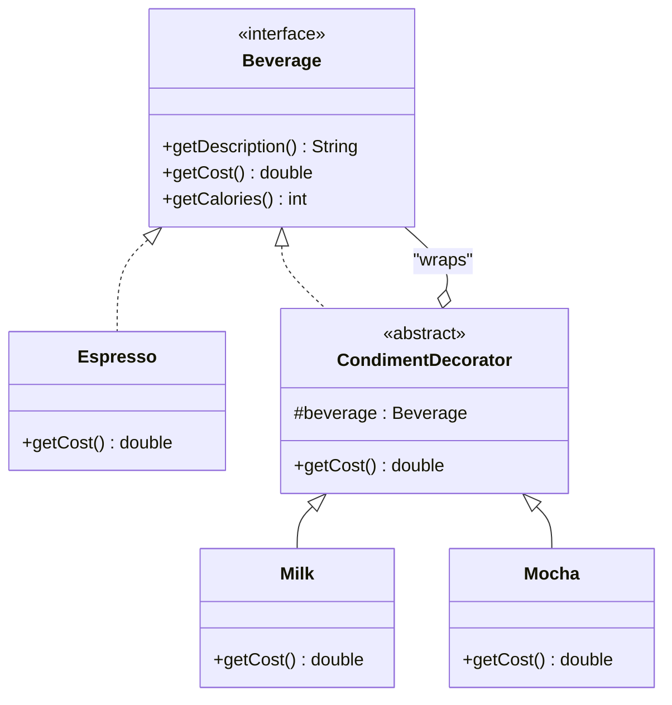
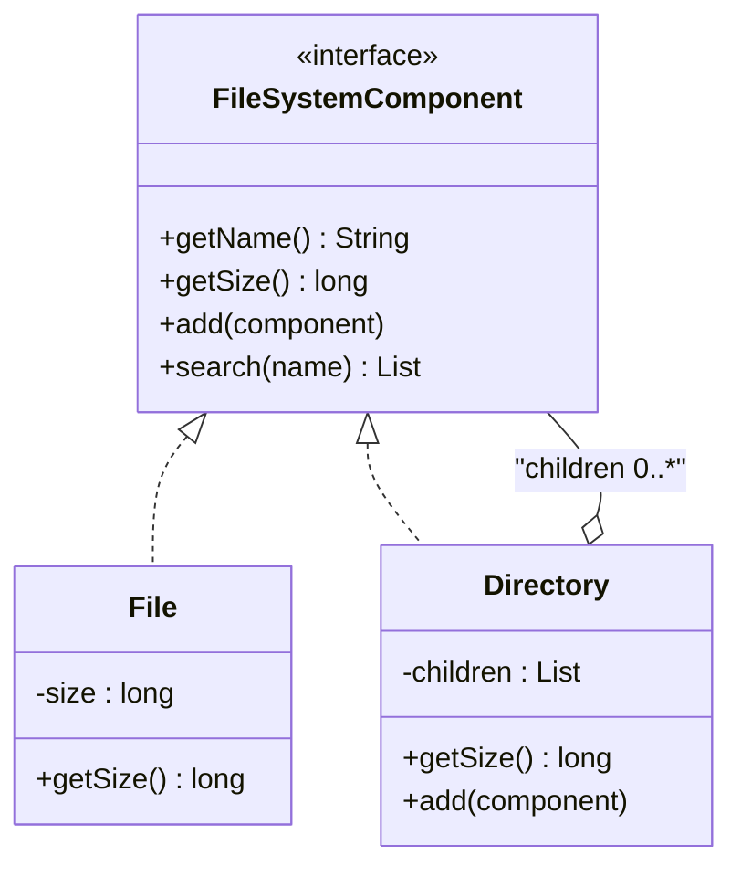

이 실습에서는 Decorator와 Composite 패턴을 활용하여 동적 기능 확장과 트리 구조 객체 처리를 구현합니다.

두 패턴은 모두 "재귀적 구조"를 사용하지만 재귀가 향하는 방향이 다릅니다. Decorator는 하나의 객체를 감싸고 또 감싸는 방식으로 안쪽을 향해 재귀하며 기능을 층층이 쌓고(수직적 확장), Composite는 하나의 노드가 여러 자식을 갖고 각 자식이 다시 트리가 될 수 있는 방식으로 바깥을 향해 재귀하며 구조를 표현합니다(수평·계층적 확장). 아래 실습들은 이 두 재귀 방향을 각각 별도로 다룬 뒤, 마지막 로깅 시스템에서 두 패턴을 함께 조합해봅니다.

다음 표는 두 패턴의 GoF 분류·재귀 방향·구조·전형적 실패 지점을 나란히 정리한 것으로, 실습에 들어가기 전에 두 패턴이 어디서 갈리는지 한눈에 확인하는 용도입니다.

| 구분 | Decorator | Composite |
|------|-----------|-----------|
| GoF 분류 | 구조 패턴(Structural), 객체 스코프 | 구조 패턴(Structural), 객체 스코프 |
| 재귀 방향 | 안쪽(하나의 객체를 반복해서 감쌈) | 바깥쪽(하나의 노드가 여러 자식으로 뻗어나감) |
| 핵심 관계 | 구현(`implements`) + 합성(같은 타입 필드 1개) | 구현(`implements`) + 합성(같은 타입 목록 0..*) |
| 목적 | 기존 클래스를 바꾸지 않고 책임을 동적으로 추가 | 부분-전체 계층을 클라이언트가 동일하게 다루게 함 |
| 전형적 실패 지점 | 감싸는 순서를 바꾸면 결과가 달라짐(`getCost()` 순서 의존) | Leaf에서 `add()`/`remove()` 호출 시 런타임 예외만으로 방어됨 |

## 실습 목표
- 실습 1에서 `Milk`, `Mocha` 등 서로 다른 순서로 감싼 두 `Beverage` 조합의 `getCost()` 결과가 실제로 다르게 나오는 경우를 하나 이상 코드로 재현할 수 있다.
- 실습 2에서 3단계 이상 중첩된 `Directory` 트리에 대해 `getSize()`가 하위 트리 전체를 재귀적으로 합산함을 테스트로 검증할 수 있다.
- 실습 3, 4에서 Composite로 구성한 트리의 특정 노드에만 Decorator를 씌워, 트리 전체가 아닌 해당 노드만 동작이 바뀌는 것을 보일 수 있다.
- `File.add()`처럼 Leaf에 대한 부적절한 호출이 컴파일 타임이 아닌 런타임 예외로만 걸러지는 지점을 최소 1곳 지적할 수 있다.

## 실습 1: 음료 주문 시스템 (Decorator)

### 왜 Decorator인가

> "Attach additional responsibilities to an object dynamically. Decorators provide a flexible alternative to subclassing for extending functionality." — Erich Gamma, Richard Helm, Ralph Johnson, John Vlissides, 『Design Patterns: Elements of Reusable Object-Oriented Software』(1994), Decorator 패턴 Intent

GoF가 정의한 이 Intent는 두 가지를 동시에 말합니다. "동적으로(dynamically)"는 컴파일 타임이 아니라 런타임에 책임을 붙일 수 있어야 한다는 것이고, "subclassing의 유연한 대안"은 상속이 이미 있다는 것을 전제로 그 한계를 지적하는 것입니다. 토핑 조합은 "우유만", "우유+모카", "두유+휘핑+모카"처럼 경우의 수가 조합적으로 늘어납니다. 토핑마다 서브클래스를 만드는 상속 방식은 조합의 수만큼 클래스가 폭발적으로 늘어나 유지보수가 불가능해집니다. Decorator는 토핑 하나를 클래스 하나로 만들고 런타임에 필요한 만큼 겹쳐 씌우는 방식으로, 새 토핑을 추가해도 기존 클래스를 전혀 건드리지 않고 조합의 자유도를 그대로 유지합니다.

아래 다이어그램은 `CondimentDecorator`가 `Beverage`를 구현하면서 동시에 `Beverage`를 필드로 감싸는 이중 관계(구현 + 합성)를 보여줍니다. 이 이중 관계가 있어야만 `Milk`로 감싼 결과를 다시 `Mocha`로 감싸는 체인이 성립합니다.



`CondimentDecorator`가 `Beverage` 인터페이스를 구현(`<|..`)하면서 동시에 `Beverage` 타입 필드를 합성(`o--`)으로 갖는 부분이 이 다이어그램의 핵심입니다. 구현 없이 합성만 있었다면 `Milk`로 감싼 객체를 다시 `Mocha`로 감쌀 수 없어 체인이 한 단계에서 끊깁니다.

### 요구사항
다양한 토핑을 추가할 수 있는 음료 주문 시스템

### 코드 템플릿

Decorator 체인의 출발점은 감쌀 대상 자체를 정의하는 `Beverage` 인터페이스다. 이 인터페이스가 노출하는 네 메서드는 이후 등장하는 기본 음료·장식자 클래스 전부가 동일하게 구현해야 하는 계약이며, 이 계약이 있어야만 서로 다른 구현체를 같은 타입으로 다루는 다형성이 성립한다.

```java
// TODO 1: Component 인터페이스 정의
public interface Beverage {
    String getDescription();
    double getCost();
    int getCalories();
    List<String> getIngredients();
}
```

이 인터페이스를 구현하는 첫 계층은 토핑이 전혀 얹히지 않은 기본 음료, 즉 ConcreteComponent다. `Espresso`, `DarkRoast`, `HouseBlend`는 서로 다른 원가와 칼로리를 갖되 감쌀 대상이 없으므로 `CondimentDecorator`를 거치지 않고 `Beverage`를 직접 구현한다. 이 셋이 Decorator 체인의 항상 가장 안쪽에 위치하는 기저 노드다.

```java
// TODO 2: 기본 음료 구현 (ConcreteComponent)
public class Espresso implements Beverage {
    @Override
    public String getDescription() {
        return "에스프레소";
    }

    @Override
    public double getCost() {
        return 1.99;
    }

    @Override
    public int getCalories() {
        return 5;
    }

    @Override
    public List<String> getIngredients() {
        return new ArrayList<>(List.of("에스프레소 원두"));
    }
}

public class DarkRoast implements Beverage {
    @Override
    public String getDescription() {
        return "다크 로스트";
    }

    @Override
    public double getCost() {
        return 1.49;
    }

    @Override
    public int getCalories() {
        return 5;
    }

    @Override
    public List<String> getIngredients() {
        return new ArrayList<>(List.of("다크 로스트 원두"));
    }
}

public class HouseBlend implements Beverage {
    @Override
    public String getDescription() {
        return "하우스 블렌드";
    }

    @Override
    public double getCost() {
        return 0.99;
    }

    @Override
    public int getCalories() {
        return 5;
    }

    @Override
    public List<String> getIngredients() {
        return new ArrayList<>(List.of("하우스 블렌드 원두"));
    }
}
```

토핑을 표현할 `CondimentDecorator`는 앞선 클래스 다이어그램의 이중 관계(구현 + 합성)를 코드로 그대로 옮긴 것이다. 하위 클래스가 특정 메서드를 재정의하지 않으면 감싼 대상에 그대로 위임하는 기본 구현을 제공하므로, 각 구체 Decorator는 자신이 실제로 바꾸는 메서드만 재정의하면 된다.

```java
// TODO 3: Decorator 추상 클래스
public abstract class CondimentDecorator implements Beverage {
    protected Beverage beverage;
    
    public CondimentDecorator(Beverage beverage) {
        this.beverage = beverage;
    }
    
    // 기본 위임 구현: 하위 클래스가 재정의하지 않으면 감싼 대상에 그대로 전달한다.
    @Override
    public String getDescription() {
        return beverage.getDescription();
    }

    @Override
    public double getCost() {
        return beverage.getCost();
    }

    @Override
    public int getCalories() {
        return beverage.getCalories();
    }

    @Override
    public List<String> getIngredients() {
        return beverage.getIngredients();
    }
}
```

이제 실제 토핑들이다. `Milk`, `Mocha`, `Whip`, `SoyMilk`는 모두 `CondimentDecorator`를 상속하면서 자신의 몫(가격, 칼로리, 재료 이름)만 더해 위임 체인에 끼어든다. 넷 중 어느 것을 먼저 감싸든 다음 토핑을 또 감쌀 수 있는 것은 `CondimentDecorator`가 `Beverage`를 구현하기 때문이며, 이 네 클래스의 `getCost()`가 뒤에서 다룰 순서 의존성의 실제 원인이다.

```java
// TODO 4: 구체적인 Decorator들
public class Milk extends CondimentDecorator {
    public Milk(Beverage beverage) {
        super(beverage);
    }

    @Override
    public String getDescription() {
        return beverage.getDescription() + " + 우유";
    }

    @Override
    public double getCost() {
        return beverage.getCost() + 0.60;
    }

    @Override
    public int getCalories() {
        return beverage.getCalories() + 50;
    }

    @Override
    public List<String> getIngredients() {
        List<String> ingredients = beverage.getIngredients();
        ingredients.add("우유");
        return ingredients;
    }
}

public class Mocha extends CondimentDecorator {
    public Mocha(Beverage beverage) {
        super(beverage);
    }

    @Override
    public String getDescription() {
        return beverage.getDescription() + " + 모카";
    }

    @Override
    public double getCost() {
        return beverage.getCost() + 0.80;
    }

    @Override
    public int getCalories() {
        return beverage.getCalories() + 80;
    }

    @Override
    public List<String> getIngredients() {
        List<String> ingredients = beverage.getIngredients();
        ingredients.add("모카 시럽");
        return ingredients;
    }
}

public class Whip extends CondimentDecorator {
    public Whip(Beverage beverage) {
        super(beverage);
    }

    @Override
    public String getDescription() {
        return beverage.getDescription() + " + 휘핑크림";
    }

    @Override
    public double getCost() {
        return beverage.getCost() + 0.70;
    }

    @Override
    public int getCalories() {
        return beverage.getCalories() + 60;
    }

    @Override
    public List<String> getIngredients() {
        List<String> ingredients = beverage.getIngredients();
        ingredients.add("휘핑크림");
        return ingredients;
    }
}

public class SoyMilk extends CondimentDecorator {
    public SoyMilk(Beverage beverage) {
        super(beverage);
    }

    @Override
    public String getDescription() {
        return beverage.getDescription() + " + 두유";
    }

    @Override
    public double getCost() {
        return beverage.getCost() + 0.50;
    }

    @Override
    public int getCalories() {
        return beverage.getCalories() + 30;
    }

    @Override
    public List<String> getIngredients() {
        List<String> ingredients = beverage.getIngredients();
        ingredients.add("두유");
        return ingredients;
    }
}
```

`new Milk(new Mocha(new Espresso()))`처럼 생성자를 직접 중첩해서 쓰면 감싸는 순서가 코드 안쪽에서 바깥쪽으로 거꾸로 읽혀 가독성이 떨어진다. `BeverageBuilder`는 Decorator 패턴 자체를 바꾸지 않고 메서드 체이닝으로 호출부만 자연스럽게 다듬는 보조 장치다.

```java
// TODO 5: 음료 빌더 (Decorator 패턴 + Builder 패턴)
public class BeverageBuilder {
    private Beverage beverage;

    private BeverageBuilder(Beverage beverage) {
        this.beverage = beverage;
    }

    public static BeverageBuilder base(Beverage baseBeverage) {
        return new BeverageBuilder(baseBeverage);
    }

    public BeverageBuilder addMilk() {
        this.beverage = new Milk(beverage);
        return this;
    }

    public BeverageBuilder addMocha() {
        this.beverage = new Mocha(beverage);
        return this;
    }

    public Beverage build() {
        return beverage;
    }
}
```

위 `Milk`·`Mocha`의 `getCost()`는 언뜻 단순 덧셈이라 순서가 결과에 영향을 주지 않을 것 같지만, 실제로 `Milk(Mocha(new Espresso()))`와 `Mocha(Milk(new Espresso()))`의 `getCost()`를 각각 계산해 보면 `((1.99 + 0.80) + 0.60) = 3.39`와 `((1.99 + 0.60) + 0.80) = 3.3899999999999997`로 마지막 자리가 달라진다(JDK `double` 기준 실측값). 수학적 덧셈은 교환·결합 법칙이 성립하지만 부동소수점 덧셈은 결합 법칙이 성립하지 않으므로, Decorator 체인이 안쪽부터 순서대로 평가되는 구조 자체가 이 오차를 그대로 드러낸다. 아래 코드는 이 두 조합을 실제로 실행해 나란히 출력한 것으로, 실습 목표 1번이 요구하는 "순서에 따라 `getCost()` 결과가 달라지는 사례"를 코드 수준에서 재현한다.

```java
public static void main(String[] args) {
    Beverage orderA = new Milk(new Mocha(new Espresso()));   // 모카를 먼저, 우유를 나중에 씌움
    Beverage orderB = new Mocha(new Milk(new Espresso()));   // 우유를 먼저, 모카를 나중에 씌움

    System.out.println(orderA.getCost()); // 3.39
    System.out.println(orderB.getCost()); // 3.3899999999999997 (orderA와 마지막 자리가 다르다)
}
```

두 변수는 같은 토핑 두 개(우유, 모카)를 같은 개수만큼 사용했지만 감싼 순서만 다르다. 결과가 완전히 같지 않다는 사실은 "Decorator는 무엇을 감쌌는지만 같으면 결과도 같다"는 직관이 `double` 연산 앞에서는 성립하지 않음을 보여준다.

## 실습 2: 파일 시스템 (Composite)

### 왜 Composite인가

> "Compose objects into tree structures to represent part-whole hierarchies. Composite lets clients treat individual objects and compositions of objects uniformly." — Erich Gamma, Richard Helm, Ralph Johnson, John Vlissides, 『Design Patterns: Elements of Reusable Object-Oriented Software』(1994), Composite 패턴 Intent

GoF의 Intent에서 "part-whole hierarchies(부분-전체 계층)"와 "uniformly(동일하게)"가 핵심입니다. 파일 탐색기는 "파일 하나를 더블클릭"하는 것과 "폴더를 더블클릭해 들어가는" 것을 사용자가 같은 방식으로 다룰 수 있어야 합니다. `File`과 `Directory`를 서로 다른 타입으로 다루면 트리를 순회하는 코드마다 `instanceof` 분기가 필요해집니다. Composite는 `FileSystemComponent`라는 공통 인터페이스로 Leaf(File)와 Composite(Directory)를 통일해, 클라이언트 코드가 대상이 파일인지 폴더인지 신경 쓰지 않고 재귀적으로 트리를 다룰 수 있게 합니다.

아래 다이어그램은 `Directory`가 `FileSystemComponent`를 구현하면서 동시에 여러 개의 `FileSystemComponent`를 자식으로 담는 재귀적 합성 관계(1대다 자기 참조)를 보여줍니다. `File`은 자식을 가질 수 없는 Leaf로, 재귀의 기저 조건 역할을 합니다.



`Directory`가 자기 자신과 같은 타입(`FileSystemComponent`)의 목록을 필드로 갖는 `o--` 관계가 재귀 구조의 근거입니다. `Directory.getSize()`가 이 `children` 목록을 순회하며 각 원소의 `getSize()`를 호출할 때, 원소가 다시 `Directory`이면 같은 호출이 한 단계 더 들어가고 `File`이면 즉시 값을 반환하며 재귀가 종료됩니다.

### 요구사항
파일과 폴더를 동일하게 처리하는 파일 시스템

### 코드 템플릿

`FileSystemComponent`는 File(Leaf)과 Directory(Composite)가 공유하는 단일 계약이다. `search()`와 `findByExtension()`을 인터페이스 수준에 두었다는 점이 중요한데, 이렇게 해야 클라이언트가 대상이 파일인지 폴더인지 확인하지 않고도 같은 메서드로 트리 전체를 검색할 수 있다.

```java
// TODO 1: Component 인터페이스
public interface FileSystemComponent {
    String getName();
    long getSize();
    void display(int depth);
    void add(FileSystemComponent component);
    void remove(FileSystemComponent component);
    List<FileSystemComponent> getChildren();
    
    // TODO: 검색 기능
    List<FileSystemComponent> search(String name);
    List<FileSystemComponent> findByExtension(String extension);
}
```

`File`은 자식을 가질 수 없는 Leaf로, 재귀의 기저 조건(base case) 역할을 한다. 아래 구현은 `display()`·`search()`·`findByExtension()`을 모두 완성한 버전으로, 세 메서드 모두 "더 내려갈 자식이 없으므로 자기 자신만 확인하고 즉시 반환한다"는 동일한 패턴을 따른다.

```java
// TODO 2: Leaf 구현 (File)
public class File implements FileSystemComponent {
    private final String name;
    private final long size;
    private final String extension;
    private final LocalDateTime lastModified;

    public File(String name, long size, String extension, LocalDateTime lastModified) {
        this.name = name;
        this.size = size;
        this.extension = extension;
        this.lastModified = lastModified;
    }

    @Override
    public String getName() {
        return name;
    }

    @Override
    public long getSize() {
        return size;
    }

    @Override
    public void display(int depth) {
        // depth만큼 들여쓰기 후 "- " + name 출력. 자식이 없으므로 더 내려가지 않는다.
        System.out.println("  ".repeat(depth) + "- " + name);
    }

    @Override
    public void add(FileSystemComponent component) {
        throw new UnsupportedOperationException("파일에는 자식을 추가할 수 없습니다: " + name);
    }

    @Override
    public void remove(FileSystemComponent component) {
        throw new UnsupportedOperationException("파일에는 자식을 제거할 수 없습니다: " + name);
    }

    @Override
    public List<FileSystemComponent> getChildren() {
        return Collections.emptyList();
    }

    @Override
    public List<FileSystemComponent> search(String name) {
        // 재귀의 기저 조건: 자식이 없으므로 자기 이름만 확인하고 즉시 반환한다.
        if (this.name.equals(name)) {
            return new ArrayList<>(List.of(this));
        }
        return Collections.emptyList();
    }

    @Override
    public List<FileSystemComponent> findByExtension(String extension) {
        // search()와 동일한 기저 조건 패턴: 확장자가 일치하면 자기 자신만 담아 반환한다.
        if (this.extension.equalsIgnoreCase(extension)) {
            return new ArrayList<>(List.of(this));
        }
        return Collections.emptyList();
    }
}
```

`Directory`는 자기 자신과 같은 타입의 자식 목록(`children`)을 갖는 Composite로, 재귀의 재귀 단계(recursive case)를 담당한다. `getSize()`는 이미 이 재귀를 보여주었으므로, 아래에서는 같은 패턴을 `display()`·`search()`·`findByExtension()`에 반복 적용해 완성한다 — 자신을 처리한 뒤 각 자식에게 같은 메서드를 위임하고 결과를 모은다는 점이 세 메서드에서 동일하다.

```java
// TODO 3: Composite 구현 (Directory)
public class Directory implements FileSystemComponent {
    private final String name;
    private final List<FileSystemComponent> children;
    private final LocalDateTime created;

    public Directory(String name) {
        this.name = name;
        this.children = new ArrayList<>();
        this.created = LocalDateTime.now();
    }

    @Override
    public String getName() {
        return name;
    }

    @Override
    public void add(FileSystemComponent component) {
        children.add(component);
    }

    @Override
    public void remove(FileSystemComponent component) {
        children.remove(component);
    }

    @Override
    public List<FileSystemComponent> getChildren() {
        return children;
    }

    @Override
    public long getSize() {
        // 재귀적 처리: 각 자식이 File이면 자신의 크기를, Directory면 다시 getSize()를 호출해
        // 하위 트리 전체를 합산한다. 재귀의 기저 조건은 File.getSize()가 담당한다.
        long total = 0;
        for (FileSystemComponent child : children) {
            total += child.getSize();
        }
        return total;
    }
    
    @Override
    public void display(int depth) {
        // 자신을 출력한 뒤 각 자식에게 depth + 1로 같은 메서드를 위임한다.
        System.out.println("  ".repeat(depth) + "+ " + name);
        for (FileSystemComponent child : children) {
            child.display(depth + 1);
        }
    }
    
    @Override
    public List<FileSystemComponent> search(String name) {
        // 재귀적 검색: 자신의 이름도 확인하고, 각 자식의 search() 결과를 모두 합친다.
        // 자식이 File이면 File.search()의 기저 조건에서 즉시 반환되고,
        // 자식이 다시 Directory이면 이 메서드가 한 단계 더 재귀 호출된다.
        List<FileSystemComponent> result = new ArrayList<>();
        if (this.name.equals(name)) {
            result.add(this);
        }
        for (FileSystemComponent child : children) {
            result.addAll(child.search(name));
        }
        return result;
    }

    @Override
    public List<FileSystemComponent> findByExtension(String extension) {
        // search()와 동일한 재귀 구조: Directory 자신은 확장자가 없으므로 결과에 더하지 않고
        // 자식들의 findByExtension() 결과만 모아 위로 전달한다.
        List<FileSystemComponent> result = new ArrayList<>();
        for (FileSystemComponent child : children) {
            result.addAll(child.findByExtension(extension));
        }
        return result;
    }
}
```

트리 구조가 실제로 만들어졌을 때 이 재귀가 어떻게 동작하는지는 코드만으로는 상상하기 쉽지 않다. 아래는 3단계로 중첩된 디렉터리(`root` → `docs` → `report.pdf`)를 구성하고 `getSize()`와 `search()`를 함께 호출한 예로, 실습 목표 2번이 요구하는 "3단계 이상 중첩된 트리에 대한 재귀 합산"을 코드로 검증한다.

```java
public static void main(String[] args) {
    Directory root = new Directory("root");
    Directory docs = new Directory("docs");
    File report = new File("report.pdf", 2048L, "pdf", LocalDateTime.now());

    docs.add(report);          // docs 아래 report.pdf (2단계)
    root.add(docs);             // root 아래 docs (1단계) -> report.pdf까지 3단계

    System.out.println(root.getSize());           // 2048 (하위 트리 전체 합산)
    System.out.println(root.search("report.pdf")); // [report.pdf가 담긴 리스트]
}
```

`root.getSize()`는 `docs.getSize()`를 호출하고, `docs.getSize()`는 다시 `report.getSize()`를 호출하는 2단계 재귀를 거쳐 `2048`을 반환한다. `root.search("report.pdf")`도 같은 경로를 타고 내려가 `File.search()`의 기저 조건에서 대상을 찾아 리스트에 담아 올려보낸다.

`FileSystemUtils`는 `FileSystemComponent` 인터페이스만으로 트리 전체를 다루는 클라이언트 코드의 예다. 전체 크기 계산은 루트의 `getSize()`를 그대로 위임하면 되고, 깊이 우선 탐색은 방문자(`Consumer`)를 자신과 모든 자식에게 재귀적으로 적용하면 된다.

```java
// TODO 4: 파일 시스템 유틸리티
public class FileSystemUtils {
    // 전체 크기 계산: Directory.getSize()가 이미 재귀 합산을 수행하므로 그대로 위임한다.
    public static long getTotalSize(FileSystemComponent component) {
        return component.getSize();
    }
    
    // 깊이 우선 탐색: 자신을 먼저 방문한 뒤 각 자식에게 같은 순회를 재귀 호출한다.
    public static void walkFileSystem(FileSystemComponent root, 
                                    Consumer<FileSystemComponent> visitor) {
        visitor.accept(root);
        for (FileSystemComponent child : root.getChildren()) {
            walkFileSystem(child, visitor);
        }
    }
    
    // 경로 찾기: target을 찾을 때까지 자식을 재귀적으로 탐색하고, 찾으면 상위 호출로 돌아가며
    // "부모/자식" 형태로 경로 문자열을 조립한다. 트리에 target이 없으면 null을 반환한다.
    public static String getPath(FileSystemComponent target, 
                               FileSystemComponent root) {
        if (root == target) {
            return root.getName();
        }
        for (FileSystemComponent child : root.getChildren()) {
            String subPath = getPath(target, child);
            if (subPath != null) {
                return root.getName() + "/" + subPath;
            }
        }
        return null;
    }
}
```

## 실습 3: GUI 컴포넌트 시스템

### 왜 Composite와 Decorator를 함께 쓰는가

GUI는 두 가지 문제를 동시에 갖습니다. 첫째, `Panel`이 `Button`과 다른 `Panel`을 자식으로 담는 계층 구조라는 점(Composite의 영역)이고, 둘째, 이미 만들어진 컴포넌트에 테두리나 스크롤 같은 부가 기능을 씌우고 싶다는 점(Decorator의 영역)입니다. 이 실습에서는 `UIComponent`라는 하나의 추상화 위에 Composite로 트리를 구성하고, 그 위에 다시 Decorator로 개별 컴포넌트를 감싸는 이중 구조를 다룹니다.

### 코드 템플릿

`UIComponent`는 Leaf(`Button`, `Label`)와 Composite(`Panel`)가 공유하는 추상 클래스로, `render()`·`add()`·`remove()`를 추상 메서드로 선언해 하위 클래스가 자신의 역할(단말인지 컨테이너인지)에 맞게 구현하도록 강제한다. `handleClick()`은 좌표가 자신의 영역 안에 있을 때만 `onClick()`을 호출하는 공통 로직이라 이 클래스에 한 번만 구현되어 있다.

```java
// TODO 1: GUI Component (Composite)
public abstract class UIComponent {
    protected String name;
    protected int x, y, width, height;
    protected boolean visible = true;
    
    public abstract void render(Graphics graphics);
    public abstract void add(UIComponent component);
    public abstract void remove(UIComponent component);
    
    // TODO: 이벤트 처리
    public void handleClick(int x, int y) {
        if (contains(x, y)) {
            onClick();
        }
    }
    
    protected abstract void onClick();
    protected boolean contains(int x, int y) {
        return x >= this.x && x <= this.x + width && 
               y >= this.y && y <= this.y + height;
    }
}
```

`Button`과 `Label`은 자식을 가질 수 없는 Leaf다. 둘 다 `add()`/`remove()`를 호출하면 예외를 던져, 파일 시스템의 `File.add()`와 같은 방식으로 "구조상 자식을 가질 수 없는 노드"임을 표현한다.

```java
// TODO 2: 기본 컴포넌트들 (Leaf)
public class Button extends UIComponent {
    private final String text;
    private final Color backgroundColor;

    public Button(String name, String text, Color backgroundColor) {
        this.name = name;
        this.text = text;
        this.backgroundColor = backgroundColor;
    }

    @Override
    public void render(Graphics graphics) {
        if (!visible) return;
        graphics.setColor(backgroundColor);
        graphics.fillRect(x, y, width, height);
        graphics.setColor(Color.BLACK);
        graphics.drawString(text, x + 5, y + height / 2);
    }

    @Override
    public void add(UIComponent component) {
        throw new UnsupportedOperationException("버튼에는 자식을 추가할 수 없습니다: " + name);
    }

    @Override
    public void remove(UIComponent component) {
        throw new UnsupportedOperationException("버튼에는 자식을 제거할 수 없습니다: " + name);
    }

    @Override
    protected void onClick() {
        System.out.println("버튼 클릭: " + text);
    }
}

public class Label extends UIComponent {
    private final String text;
    private final Font font;

    public Label(String name, String text, Font font) {
        this.name = name;
        this.text = text;
        this.font = font;
    }

    @Override
    public void render(Graphics graphics) {
        if (!visible) return;
        graphics.setFont(font);
        graphics.drawString(text, x, y);
    }

    @Override
    public void add(UIComponent component) {
        throw new UnsupportedOperationException("라벨에는 자식을 추가할 수 없습니다: " + name);
    }

    @Override
    public void remove(UIComponent component) {
        throw new UnsupportedOperationException("라벨에는 자식을 제거할 수 없습니다: " + name);
    }

    @Override
    protected void onClick() {
        // 라벨은 클릭에 반응하지 않는 정적 컴포넌트다.
    }
}
```

`Panel`은 여러 `UIComponent`를 자식으로 담는 Composite다. `render()`가 자신을 그린 뒤 각 자식의 `render()`를 호출하는 부분과, `handleClick()`이 자신의 판정 대신 자식들에게 이벤트를 그대로 전파하는 부분이 이 클래스의 핵심이다 — 자식이 `Button`이면 그 자리에서 클릭 처리가 끝나고, 자식이 다시 `Panel`이면 전파가 한 단계 더 내려간다.

```java
// TODO 3: 컨테이너 컴포넌트들 (Composite)
public class Panel extends UIComponent {
    private final List<UIComponent> children = new ArrayList<>();
    private final Color backgroundColor;

    public Panel(String name, Color backgroundColor) {
        this.name = name;
        this.backgroundColor = backgroundColor;
    }

    @Override
    public void render(Graphics graphics) {
        if (!visible) return;
        graphics.setColor(backgroundColor);
        graphics.fillRect(x, y, width, height);
        // Composite 재귀: 자식이 Button/Label이면 그 자리에서 렌더링을 끝내고,
        // 자식이 다시 Panel이면 render()가 한 단계 더 내려가 하위 트리를 그린다.
        for (UIComponent child : children) {
            child.render(graphics);
        }
    }

    @Override
    public void add(UIComponent component) {
        children.add(component);
    }

    @Override
    public void remove(UIComponent component) {
        children.remove(component);
    }

    @Override
    public void handleClick(int x, int y) {
        // 자식 컴포넌트들에게 이벤트를 전파한다: 각 자식이 스스로 contains() 판정 후 onClick()을 호출한다.
        for (UIComponent child : children) {
            child.handleClick(x, y);
        }
    }

    @Override
    protected void onClick() {
        // Panel 자체의 클릭 처리는 handleClick()에서 자식에게 위임하므로 별도 동작이 없다.
    }
}
```

`UIComponentDecorator`는 실습 1의 `CondimentDecorator`와 같은 역할을 GUI 트리 위에서 수행한다. `add()`/`remove()`/`onClick()`은 감싼 컴포넌트에 그대로 위임하는 기본 구현으로 두고, `render()`는 각 구체 Decorator가 재정의해 테두리나 스크롤 같은 시각 효과만 추가한다. `BorderDecorator`로 `Panel` 안의 특정 `Button` 하나만 감싸면, 같은 `Panel`의 다른 자식들은 전혀 건드리지 않고 그 버튼에만 테두리가 생긴다 — 이는 뒤이은 실습 4에서 로그 트리를 대상으로 다시 확인한다.

```java
// TODO 4: Decorator로 기능 확장
public abstract class UIComponentDecorator extends UIComponent {
    protected UIComponent component;

    public UIComponentDecorator(UIComponent component) {
        this.component = component;
    }

    // 기본 위임 구현: render()를 제외한 나머지는 감싼 컴포넌트에 그대로 전달한다.
    @Override
    public void add(UIComponent child) {
        component.add(child);
    }

    @Override
    public void remove(UIComponent child) {
        component.remove(child);
    }

    @Override
    protected void onClick() {
        component.handleClick(x, y);
    }
}

public class BorderDecorator extends UIComponentDecorator {
    private final Color borderColor;
    private final int borderWidth;

    public BorderDecorator(UIComponent component, Color borderColor, int borderWidth) {
        super(component);
        this.borderColor = borderColor;
        this.borderWidth = borderWidth;
    }

    @Override
    public void render(Graphics graphics) {
        component.render(graphics);
        graphics.setColor(borderColor);
        for (int i = 0; i < borderWidth; i++) {
            graphics.drawRect(x - i, y - i, width + 2 * i, height + 2 * i);
        }
    }
}

public class ScrollDecorator extends UIComponentDecorator {
    private int scrollX, scrollY;

    public ScrollDecorator(UIComponent component) {
        super(component);
    }

    @Override
    public void render(Graphics graphics) {
        graphics.translate(-scrollX, -scrollY);
        component.render(graphics);
        graphics.translate(scrollX, scrollY);
    }

    public void scrollBy(int dx, int dy) {
        this.scrollX += dx;
        this.scrollY += dy;
    }
}
```

## 실습 4: 로깅 시스템 (Decorator + Composite)

### 왜 Decorator와 Composite를 함께 쓰는가

로그에 타임스탬프를 붙이거나 특정 레벨 이하를 걸러내는 기능은 `Logger` 하나를 감싸는 Decorator로 자연스럽게 표현되고, 콘솔과 파일에 동시에 로그를 남기고 싶다는 요구는 여러 `Logger`를 하나처럼 다루는 Composite(`CompositeLogger`)로 표현됩니다. 두 요구를 한 인터페이스(`Logger`) 위에서 자유롭게 조합할 수 있다는 것이 이 실습의 핵심입니다. 예를 들어 `CompositeLogger`로 콘솔+파일 로거를 묶은 뒤, 그 결과를 다시 `TimestampDecorator`로 감싸면 "타임스탬프가 붙은 로그를 콘솔과 파일에 동시에" 남기는 동작을 코드 수정 없이 조립만으로 얻을 수 있습니다.

### 코드 템플릿

```java
// TODO 0: 로그 레벨 정의 (아래 Logger 구현들이 참조하는 타입)
public enum LogLevel {
    DEBUG, INFO, WARN, ERROR
}

// TODO 1: Logger 인터페이스
public interface Logger {
    void log(LogLevel level, String message);
    void log(LogLevel level, String message, Throwable throwable);
}

// TODO 2: 기본 Logger들 (ConcreteComponent)
public class ConsoleLogger implements Logger {
    @Override
    public void log(LogLevel level, String message) {
        System.out.println("[" + level + "] " + message);
    }

    @Override
    public void log(LogLevel level, String message, Throwable throwable) {
        System.out.println("[" + level + "] " + message);
        throwable.printStackTrace(System.out);
    }
}

public class FileLogger implements Logger {
    private final String filename;

    public FileLogger(String filename) {
        this.filename = filename;
    }

    @Override
    public void log(LogLevel level, String message) {
        try (FileWriter writer = new FileWriter(filename, true)) {
            writer.write("[" + level + "] " + message + System.lineSeparator());
        } catch (IOException e) {
            throw new UncheckedIOException("로그 파일 기록 실패: " + filename, e);
        }
    }

    @Override
    public void log(LogLevel level, String message, Throwable throwable) {
        log(level, message + " - " + throwable.getMessage());
    }
}
```

`ConsoleLogger`와 `FileLogger`는 감쌀 대상이 없는 ConcreteComponent다. 이제 이 둘을 감싸는 Decorator 차례로, `TimestampDecorator`는 메시지 앞에 시각을 붙이고 `FilterDecorator`는 `LogLevel` enum의 선언 순서를 이용해 지정한 레벨 미만의 로그를 걸러낸다. 둘 다 `Logger`를 구현하면서 `Logger` 필드를 감싸는 동일한 구조를 따른다.

```java
// TODO 3: Logger Decorator들
public class TimestampDecorator implements Logger {
    private final Logger logger;

    public TimestampDecorator(Logger logger) {
        this.logger = logger;
    }

    @Override
    public void log(LogLevel level, String message) {
        logger.log(level, "[" + LocalDateTime.now() + "] " + message);
    }

    @Override
    public void log(LogLevel level, String message, Throwable throwable) {
        logger.log(level, "[" + LocalDateTime.now() + "] " + message, throwable);
    }
}

public class FilterDecorator implements Logger {
    private final Logger logger;
    private final LogLevel minLevel;

    public FilterDecorator(Logger logger, LogLevel minLevel) {
        this.logger = logger;
        this.minLevel = minLevel;
    }

    @Override
    public void log(LogLevel level, String message) {
        // enum 선언 순서(DEBUG < INFO < WARN < ERROR)를 ordinal()로 비교해 minLevel 미만은 걸러낸다.
        if (level.ordinal() >= minLevel.ordinal()) {
            logger.log(level, message);
        }
    }

    @Override
    public void log(LogLevel level, String message, Throwable throwable) {
        if (level.ordinal() >= minLevel.ordinal()) {
            logger.log(level, message, throwable);
        }
    }
}
```

마지막으로 `CompositeLogger`는 `Logger` 목록을 하나의 `Logger`처럼 다루는 Composite다. `log()`가 각 자식 로거의 `log()`를 순서대로 호출할 뿐이라는 점에서, 이 클래스 자체는 파일 시스템의 `Directory`보다 훨씬 단순한 1단계 위임에 가깝다 — 그럼에도 "여러 대상을 하나처럼 다룬다"는 Composite의 핵심은 동일하게 성립한다.

```java
// TODO 4: Composite Logger
public class CompositeLogger implements Logger {
    private final List<Logger> loggers;

    public CompositeLogger(List<Logger> loggers) {
        this.loggers = loggers;
    }

    @Override
    public void log(LogLevel level, String message) {
        for (Logger logger : loggers) {
            logger.log(level, message);
        }
    }

    @Override
    public void log(LogLevel level, String message, Throwable throwable) {
        for (Logger logger : loggers) {
            logger.log(level, message, throwable);
        }
    }
}
```

### 트리의 특정 노드만 바뀌는지 확인하기

실습 목표 3번은 "Composite로 구성한 트리의 특정 노드에만 Decorator를 씌워, 트리 전체가 아닌 해당 노드만 동작이 바뀌는 것을 보일 수 있다"를 요구한다. `CompositeLogger`가 감싼 `loggers` 목록의 각 원소는 트리의 자식 노드에 해당하므로, 그중 하나만 `TimestampDecorator`로 감싸고 나머지는 그대로 둔 뒤 같은 트리에 `log()`를 호출하면 이 요구를 직접 확인할 수 있다.

```java
// Before: 두 자식(consoleA, consoleB) 모두 장식되지 않은 상태
Logger consoleA = new ConsoleLogger();
Logger consoleB = new ConsoleLogger();
Logger treeBefore = new CompositeLogger(List.of(consoleA, consoleB));

treeBefore.log(LogLevel.INFO, "주문 처리 완료");
// [INFO] 주문 처리 완료   <- consoleA
// [INFO] 주문 처리 완료   <- consoleB (consoleA와 완전히 동일한 출력)
```

두 자식이 아직 아무것도 감싸지 않은 `ConsoleLogger` 그대로이므로 출력도 서로 완전히 같다. 이제 트리 구조는 그대로 둔 채, `consoleB`라는 한 노드만 `TimestampDecorator`로 감싸 새 트리를 구성한다.

```java
// After: consoleB 노드만 TimestampDecorator로 감싼다. consoleA는 그대로다.
Logger decoratedB = new TimestampDecorator(consoleB);
Logger treeAfter = new CompositeLogger(List.of(consoleA, decoratedB));

treeAfter.log(LogLevel.INFO, "주문 처리 완료");
// [INFO] 주문 처리 완료                        <- consoleA (변경 전과 동일)
// [INFO] [2026-07-18T10:00] 주문 처리 완료      <- decoratedB만 타임스탬프가 붙는다
```

`consoleA`는 `treeBefore`에서든 `treeAfter`에서든 출력이 동일하다. 바뀐 것은 오직 `consoleB` 자리에 있던 노드 하나뿐이며, `CompositeLogger`라는 트리 구조 자체나 `consoleA`라는 형제 노드는 전혀 영향을 받지 않았다. 이것이 "Decorator는 트리 전체가 아니라 씌워진 노드 하나만 동작을 바꾼다"는 실습 목표 3의 실제 근거다.

## 체크리스트

### Decorator 패턴
- [ ] 기본 구성요소와 장식자 구현 — `Espresso` 같은 ConcreteComponent 없이는 감쌀 대상 자체가 없어 체인을 시작할 수 없다.
- [ ] 동적 기능 추가/제거 — 상속으로는 컴파일 타임에 조합이 고정되므로, 런타임에 토핑을 바꾸는 요구는 Decorator로만 자연스럽게 풀린다.
- [ ] 투명성 확보 (인터페이스 일관성) — `CondimentDecorator`가 `Beverage`를 구현하지 않으면 감싼 결과를 다시 감쌀 수 없어 체인이 끊긴다.
- [ ] 여러 장식자 조합 테스트 — 감싸는 순서에 따라 `getCost()` 결과가 달라질 수 있으므로 순서 의존성을 실제로 확인해야 한다.

### Composite 패턴
- [ ] Leaf와 Composite 구현 — `File`(Leaf)과 `Directory`(Composite)가 없으면 트리의 끝단과 중간 노드를 구분해 다룰 대상이 없다.
- [ ] 재귀적 구조 처리 — `Directory.getSize()`가 자식의 `getSize()`를 재귀 호출하지 않으면 하위 트리 크기를 합산할 수 없다.
- [ ] 트리 순회 알고리즘 — `display()`, `search()` 같은 깊이 우선 순회 없이는 트리 전체를 탐색할 수 없다.
- [ ] 투명성 vs 안전성 고려 — `File.add()`를 인터페이스에 남겨두면(투명성) 호출 자체는 막지 못하고 런타임 예외로만(안전성 부족) 방어할 수 있다는 트레이드오프를 확인해야 한다.

### 패턴 조합
- [ ] Decorator + Composite 결합 — 실습 3, 4처럼 트리 구조(Composite) 안의 개별 노드에 부가 기능(Decorator)을 씌우는 요구가 동시에 있을 때만 결합의 가치가 생긴다.
- [ ] Builder 패턴과 함께 사용 — `BeverageBuilder`처럼 여러 Decorator를 순서대로 씌우는 코드를 메서드 체이닝으로 감추면 호출부의 가독성이 올라간다.
- [ ] Visitor 패턴으로 확장 — 트리 구조를 바꾸지 않고 새 연산(예: 파일 통계 집계)을 추가하려면 각 노드에 `accept()`를 더하는 Visitor가 필요하다.
- [ ] 성능 최적화 (캐싱, 지연 로딩) — `getSize()`처럼 매 호출마다 전체 트리를 재귀 순회하는 연산은 트리가 크면 반복 비용이 커지므로 캐싱 여부를 검토해야 한다.

## 흔한 오해

**"단순 덧셈만 하는 Decorator라면 감싸는 순서는 결과에 영향을 주지 않는다"는 오해**가 많습니다. 실제로는 `실습 1`의 `Milk`·`Mocha`처럼 각 Decorator가 고정된 상수를 더하기만 해도, `double` 연산은 결합 법칙이 성립하지 않으므로 `Milk(Mocha(espresso)).getCost()`와 `Mocha(Milk(espresso)).getCost()`가 마지막 자리에서 다르게 나올 수 있습니다(앞서 실습 1에서 `3.39`와 `3.3899999999999997`로 직접 확인했습니다). 여기에 더해 할인율 적용, 최솟값/최댓값 클램핑, 문자열 연결(`getDescription()`)처럼 애초에 교환 법칙이 성립하지 않는 연산이 하나라도 체인에 섞이면 순서 의존성은 부동소수점 오차 수준을 넘어 명백한 값 차이로 드러납니다. 따라서 "Decorator는 어떤 순서로 씌워도 결과가 같다"는 가정은 검증 없이 코드에 반영해서는 안 되며, 여러 Decorator를 조합할 때는 실습 목표에서 다룬 것처럼 순서를 바꾼 두 결과를 실제로 비교하는 테스트를 남겨두는 편이 안전합니다.

**"Composite로 Leaf와 Composite를 같은 인터페이스로 묶으면 타입 안전성도 함께 얻는다"는 오해**도 흔합니다. GoF가 말하는 투명성(uniformity)은 클라이언트가 `instanceof` 분기 없이 같은 메서드를 호출할 수 있다는 뜻이지, 그 호출이 항상 안전하다는 뜻이 아닙니다. 체크리스트에서 다룬 대로 `File.add()`는 인터페이스에 남아 있는 한 컴파일러가 호출 자체를 막지 못하고, 오직 `UnsupportedOperationException`이라는 런타임 예외로만 걸러집니다. 즉 Composite는 "인터페이스 통일"과 "타입 안전성"이라는 두 가지를 동시에 주는 패턴이 아니라, 전자를 얻는 대가로 후자를 일부 포기하는 트레이드오프이며, 이 트레이드오프를 감수할 수 없다면 Leaf 전용 인터페이스를 분리하는 대안(Safety 우선 설계)을 검토해야 합니다.

## 추가 도전

1. **Stream Decorator**: Java Stream API 스타일 체이닝
2. **Cached Composite**: 계산 결과 캐싱
3. **Async Decorator**: 비동기 처리 장식자
4. **Reactive Composite**: 변경 사항 자동 전파

## 실무 적용

### Decorator 활용 사례
- HTTP 클라이언트 미들웨어 — 인증 헤더 삽입, 재시도, 요청 로깅을 각각 별도의 미들웨어로 만들고 실제 요청 객체를 감싸는 순서대로 실행 체인을 구성한다.
- 데이터베이스 커넥션 래핑 — 커넥션 풀링, 쿼리 로깅, 트랜잭션 관리를 원본 `Connection` 구현을 건드리지 않고 겹겹이 씌워 추가한다.
- 스트림 처리 파이프라인 — `BufferedInputStream`이 `InputStream`을 감싸듯, 버퍼링·압축·암호화 같은 부가 기능을 스트림 계층 위에 순차적으로 덧씌운다.
- AOP (Aspect-Oriented Programming) — 트랜잭션·로깅·보안 검사 같은 횡단 관심사를 프록시로 원본 메서드 호출 앞뒤에 끼워 넣으며, 스프링 AOP의 프록시 기반 구현이 대표적이다.

### Composite 활용 사례
- GUI 컴포넌트 계층 — 실습 3처럼 `Panel`이 `Button`과 다른 `Panel`을 자식으로 담아 화면 전체를 하나의 트리로 렌더링하고 클릭 이벤트를 전파한다.
- 조직도/메뉴 구조 — 부서 아래 하위 부서와 구성원을 같은 방식으로 다뤄, 인원수나 예산 합계를 트리 전체에 대해 재귀적으로 집계할 수 있다.
- 수식 파서 (AST) — 사칙연산 노드가 피연산자로 다시 수식 노드를 가질 수 있는 구조여서, 트리를 재귀적으로 평가(evaluate)하면 괄호로 묶인 복잡한 수식도 하나의 알고리즘으로 계산된다.
- 파일 시스템 모델링 — 실습 2의 `Directory`/`File`처럼 폴더와 파일을 동일한 인터페이스로 다뤄, 전체 크기 계산이나 이름 검색을 트리 순회 한 번으로 처리한다.

## 선택 기준과 한계

"기능을 조합해서 늘려야 하는가, 구조를 계층으로 표현해야 하는가"가 두 패턴을 가르는 기본 질문입니다. 같은 종류의 객체 하나에 여러 부가 기능을 씌우고 싶다면 Decorator를, 서로 다른 개체들이 부분-전체 관계를 이루고 그 관계를 재귀적으로 순회해야 한다면 Composite를 선택합니다. 실습 3, 4처럼 "계층 구조 안의 개별 노드에 부가 기능을 씌우고 싶다"는 요구가 동시에 있을 때만 두 패턴을 함께 쓰며, 둘 중 하나만으로 요구를 만족한다면 나머지 패턴을 억지로 끼워 넣을 필요는 없습니다.

두 패턴 모두 한계가 뚜렷합니다. Decorator 체인이 길어지면 디버거로 스택을 추적하기 어려워지고, 어떤 순서로 감쌌는지에 따라 결과가 달라지므로(`Milk` 이후 `Mocha`를 씌우는 것과 그 반대는 가격 계산 순서가 다를 수 있음) 체인 구성 자체가 암묵적 지식이 됩니다. Composite는 깊은 트리에서 재귀 호출이 스택 프레임을 소비하므로, `getSize()`처럼 매 호출마다 자식을 순회하는 연산은 트리가 매우 깊거나 노드 수가 많을 때 반복적(iterative) 순회로 바꾸는 것을 고려해야 합니다. 두 패턴 다 "인터페이스를 통일해 다형성으로 처리한다"는 이점의 대가로 타입 안전성을 일부 포기한다는 점도 감안해야 합니다. 예를 들어 `Directory.add()`는 컴파일 타임에는 막을 수 없고 `File.add()` 호출 시 런타임 예외로만 막을 수 있습니다.

---

**핵심 포인트**: Decorator는 수직적 기능 확장을, Composite는 수평적 구조 관리를 담당합니다. 두 패턴 모두 재귀적 구조를 통해 강력한 확장성과 유연성을 제공합니다. 