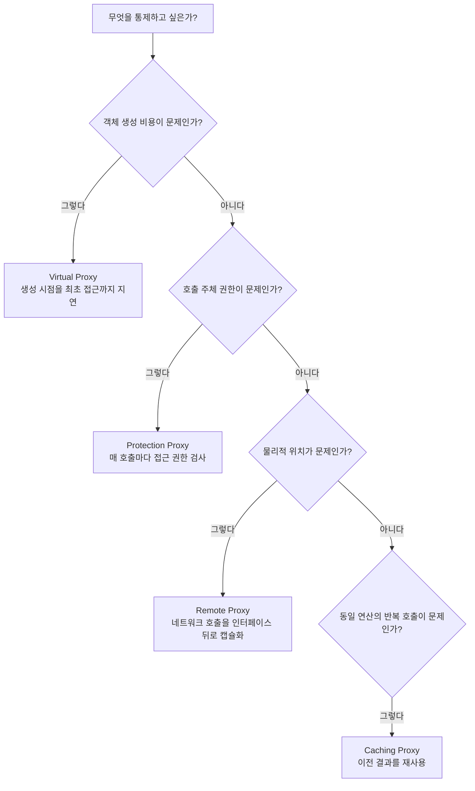

이 실습에서는 Virtual, Protection, Remote, Caching 등 다양한 Proxy 유형을 직접 구현하며 성능 최적화 기법을 익힙니다.

네 가지 Proxy 유형은 겉보기엔 모두 "대상 객체를 감싸는 클래스"라는 같은 모양이지만, 각각 해결하는 문제가 다릅니다. Virtual Proxy는 "생성 비용이 큰 객체를 언제 만들 것인가", Protection Proxy는 "누가 접근할 수 있는가", Remote Proxy는 "물리적으로 떨어진 객체를 어떻게 로컬처럼 다룰 것인가"라는 서로 다른 질문에 답합니다. 이 차이 때문에 실무에서 "Proxy를 쓸까"보다 "어떤 문제 때문에 Proxy 유형을 쓸까"를 먼저 판단하는 것이 중요하며, 아래 실습들은 이 네 가지 문제 상황을 각각 별도로 다룹니다.

GoF는 Proxy를 **"다른 객체에 대한 접근을 제어하기 위해 그 객체를 대리하는 자리표시자를 제공하는"** 패턴으로 정의한다(Gamma, Helm, Johnson, Vlissides, *Design Patterns*, 1994). 아래 네 실습은 이 정의에서 "접근을 제어"하는 방식(생성 시점 제어, 권한 제어, 위치 제어, 반복 호출 제어)이 유형마다 어떻게 달라지는지를 코드로 확인합니다.

## 흔한 오개념

<strong>"Proxy와 Decorator는 구조가 같으니 같은 패턴이다"</strong>는 가장 흔한 오해입니다. 두 패턴 모두 "Subject 인터페이스를 구현한 래퍼가 다른 구현체를 감싼다"는 클래스 구조만 보면 실제로 구분이 안 됩니다. 그러나 GoF는 이 둘을 의도(intent)로 구분합니다. Decorator는 원 객체의 호출을 항상 그대로 수행하면서 그 앞뒤에 책임을 얹는 것이 목적이고, Proxy는 위임 자체를 조건부로 만드는 것이 목적입니다. 실습 1의 `ImageProxy`는 `getWidth()` 호출은 `RealImage`에 위임하지 않고 메타데이터로 즉시 답하며, 실습 2의 `SecurityFileProxy`는 권한이 없으면 위임 자체를 거부합니다. 이렇게 "위임할지, 언제 위임할지, 무엇으로 대신 답할지"를 프록시가 스스로 결정한다는 점이 Decorator와의 실질적 차이입니다.

<strong>"동적 프록시는 아무 클래스나 프록시로 만들 수 있다"</strong>도 실습 4에서 자주 나오는 오해입니다. 실습 4의 `Proxy.newProxyInstance()`가 사용하는 `java.lang.reflect.Proxy`는 인터페이스만 프록시할 수 있고, 인터페이스가 없는 구체 클래스는 이 방식으로 프록시할 수 없습니다. Spring AOP가 인터페이스를 구현하지 않은 빈에 대해 CGLIB 기반 프록시로 자동 전환하는 이유가 바로 이 제약 때문입니다. `ProxyFactory.createLoggingProxy()`에 인터페이스가 아닌 클래스를 전달하면 컴파일은 되어도 런타임에 `IllegalArgumentException`이 발생합니다.

<strong>"프록시는 항상 성능을 떨어뜨린다"</strong>는 오해는 유형을 뭉뚱그려 생각할 때 생깁니다. 실습 1의 Virtual Proxy와 체크리스트의 Caching Proxy는 오히려 불필요한 작업을 없애 성능을 개선하려고 존재합니다. 성능 저하는 실습 2의 매 호출 권한 검사, 실습 4의 리플렉션 기반 호출처럼 "매번 고정 비용이 붙는" 특정 유형에서만 나타나는 특성이며, 이는 아래 "선택 기준과 오버헤드 트레이드오프"에서 유형별로 구분해 다룹니다.

<strong>"Protection Proxy를 앞에 두면 인증(authentication)과 인가(authorization)를 모두 대체한다"</strong>는 오해도 실습 2의 `SecurityFileProxy`를 처음 접할 때 자주 생깁니다. `SecurityFileProxy`가 실제로 검사하는 것은 `AccessController.canRead/canWrite/canDelete`뿐이며, 이 검사는 모두 "이미 신원이 확인된 `User`가 어떤 작업을 할 권한이 있는가"라는 인가 질문입니다. "이 `User`가 실제로 본인이 맞는가"라는 인증 질문은 `getCurrentUser()`가 대신 답해주지 않습니다 — 이 실습의 `CurrentUserHolder`는 로그인 절차 없이 `ThreadLocal.withInitial(() -> new User("guest"))`로 항상 기본값을 채워 넣을 뿐이고, 실제 서비스에서는 이 자리를 스프링 시큐리티의 `SecurityContextHolder`나 JWT 검증 필터처럼 별도의 인증 계층이 채워야 합니다. Protection Proxy 하나로 인증과 인가를 모두 해결하려 하면, 인증되지 않은 요청조차 기본 `User("guest")`로 통과시켜 놓고 인가 검사만 통과하면 접근을 허용하는 구멍이 생길 수 있습니다. 이 구분은 테스트 설계에도 그대로 이어져, "신원이 위조되거나 세션이 탈취된 요청을 어떻게 막는가"라는 인증 테스트와 "정상적으로 로그인한 사용자가 자신의 권한을 넘어선 작업을 시도할 때 이를 막는가"라는 인가 테스트를 서로 다른 시나리오로 분리해서 작성해야, `SecurityFileProxy`가 실제로 책임지는 범위와 그렇지 않은 범위가 코드에서도 명확해집니다.

## 실습 목표
- 실습 1에서 `ImageProxy`가 `getWidth()` 같은 메타데이터 조회 시점과 `display()` 같은 실제 데이터 조회 시점을 구분해, 후자에서만 `RealImage`가 생성됨을 로그로 확인할 수 있다.
- 실습 2에서 권한이 없는 `User`로 `SecurityFileProxy.writeFile()`을 호출했을 때 `SecurityException`이 발생하고 `RealFileService`의 상태가 변경되지 않음을 테스트로 검증할 수 있다.
- 실습 3에서 `RemoteUserServiceProxy`와 `LocalUserService`를 동일한 `UserService` 타입으로 다루면서, 호출부 코드를 전혀 수정하지 않고 두 구현을 교체할 수 있음을 보일 수 있다.
- 실습 4에서 `LoggingInvocationHandler` 하나로 서로 다른 두 인터페이스에 대한 프록시를 생성해, 정적 Proxy 클래스를 인터페이스 수만큼 만들지 않아도 됨을 확인할 수 있다.

## 실습 1: 이미지 로딩 Virtual Proxy

### 왜 Virtual Proxy인가

수백 장의 대용량 이미지를 목록에 나열할 때, 화면에 보이지도 않는 이미지까지 전부 디스크에서 읽어 메모리에 올리면 초기 로딩이 매우 느려집니다. `ImageProxy`는 파일명과 메타데이터만 먼저 들고 있다가, `display()`처럼 실제 픽셀 데이터가 필요한 시점에만 `RealImage`를 생성합니다. 클라이언트는 `Image` 인터페이스만 보고 있으므로 지금 다루는 것이 프록시인지 실제 이미지인지 신경 쓸 필요가 없습니다.

### 요구사항
대용량 이미지의 지연 로딩 시스템

### 코드 템플릿

Virtual Proxy를 구현하려면 먼저 클라이언트가 실제 이미지인지 프록시인지 구분하지 않고 동일하게 다룰 수 있는 공통 인터페이스가 필요하다. 아래 `Image` 인터페이스는 픽셀 데이터에 접근하는 `display()`와, 메타데이터만 필요한 `getWidth()`/`getHeight()`/`getFileSize()`/`getFilename()`을 함께 선언해, 뒤에 나올 프록시가 후자만으로 즉시 응답할 여지를 남겨 둔다.

```java
// TODO 1: Subject 인터페이스 정의
public interface Image {
    void display();
    int getWidth();
    int getHeight();
    long getFileSize();
    String getFilename();
}
```

`RealImage`는 이 인터페이스를 그대로 구현하되, 생성자에서는 파일명만 기억해 두고 실제 픽셀 로딩은 뒤로 미룬다. `loadImageIfNeeded()`가 `loaded` 플래그로 최초 1회만 무거운 작업을 수행하도록 막아, `display()`가 여러 번 호출되어도 로딩이 중복되지 않게 한다.

```java
// TODO 2: RealSubject 구현
public class RealImage implements Image {
    private final String filename;
    private byte[] imageData;
    private int width, height;
    private boolean loaded = false;
    
    public RealImage(String filename) {
        this.filename = filename;
        // TODO: 실제 로딩은 하지 않음
    }
    
    private void loadImageIfNeeded() {
        if (!loaded) {
            // TODO: 실제 이미지 로딩 (시간이 오래 걸리는 작업 시뮬레이션)
            System.out.println("Loading image: " + filename);
            try {
                Thread.sleep(2000); // 로딩 시간 시뮬레이션
            } catch (InterruptedException e) {
                Thread.currentThread().interrupt();
            }
            loaded = true;
        }
    }
    
    // TODO: 이미지 관련 메서드들 구현
}
```

`ImageProxy`가 즉시 반환해야 하는 메타데이터(너비, 높이, 파일 크기)를 담을 값 객체가 별도로 필요하다. `RealImage`가 픽셀 전체를 읽어야 채울 수 있는 필드들과 달리, `ImageMetadata`는 파일 헤더만 읽어도 채울 수 있는 가벼운 정보만 갖는다.

```java
// TODO 2.5: 메타데이터 값 객체 (파일 헤더만으로 채울 수 있는 가벼운 정보)
public class ImageMetadata {
    private final String filename;
    private final int width;
    private final int height;
    private final long fileSize;

    public ImageMetadata(String filename, int width, int height, long fileSize) {
        this.filename = filename;
        this.width = width;
        this.height = height;
        this.fileSize = fileSize;
    }

    public String getFilename() { return filename; }
    public int getWidth() { return width; }
    public int getHeight() { return height; }
    public long getFileSize() { return fileSize; }
}
```

이제 `ImageProxy`가 앞의 두 타입을 조합한다. 생성자에서 `loadMetadata()`로 가벼운 정보만 미리 채워 두면, `getWidth()` 같은 메서드는 이 메타데이터만 보고 즉시 답할 수 있다. 반면 `display()`처럼 실제 픽셀 데이터가 필요한 메서드만 `getRealImage()`를 거쳐 `RealImage`를 생성한다.

```java
// TODO 3: Virtual Proxy 구현
public class ImageProxy implements Image {
    private final String filename;
    private volatile RealImage realImage;
    private final ImageMetadata metadata; // 빠르게 접근 가능한 메타데이터
    
    public ImageProxy(String filename) {
        this.filename = filename;
        this.metadata = loadMetadata(filename); // 빠른 메타데이터 로딩
    }
    
    private ImageMetadata loadMetadata(String filename) {
        // TODO: 빠른 메타데이터 로딩 (파일 헤더만 읽기, RealImage처럼 전체 픽셀은 읽지 않음)
        return new ImageMetadata(filename, 0, 0, 0L);
    }
    
    private RealImage getRealImage() {
        // 주의: 아래는 단일 스레드 실습을 전제로 한 최소 구현이다. 여러 스레드가 같은
        // ImageProxy 인스턴스에 동시에 display()를 호출하면 realImage == null 검사와
        // 대입 사이에 경쟁 조건이 생겨 RealImage가 두 번 생성될 수 있다(생성 비용
        // 두 배 지불 + 중복 로그). 안전하게 하려면 synchronized 블록으로 감싸거나
        // Double-Checked Locking(필드를 volatile로 선언한 상태에서 null 검사를
        // 락 안팎에서 두 번 수행)을 적용해야 한다.
        if (realImage == null) {
            realImage = new RealImage(filename);
        }
        return realImage;
    }
    
    // TODO: 메타데이터는 즉시 반환, 실제 데이터가 필요할 때만 로딩
}
```

`ImageProxy.getRealImage()`의 널 검사 방식은 언뜻 사소해 보이지만, 실무에서 실제로 겪는 버그 유형입니다. 단일 스레드로 실행되는 CLI 도구나 배치 작업에서는 문제가 드러나지 않다가, 같은 `ImageProxy` 인스턴스를 여러 요청 스레드가 공유하는 웹 서버 환경으로 옮기는 순간 `RealImage`가 중복 생성되는 사례로 재현됩니다. Hibernate 같은 ORM의 지연 로딩 프록시가 세션(영속성 컨텍스트)마다 별도 인스턴스를 만들어 이 문제를 원천적으로 피해가는 것과 달리, 이 실습의 `ImageProxy`는 인스턴스를 여러 스레드가 공유할 수 있다고 가정하면 동기화가 필요합니다. 이 트레이드오프(동기화 비용 vs 중복 생성 위험)를 먼저 판단한 뒤에만 실습 목표의 "로그로 확인" 검증이 신뢰할 수 있는 결과를 냅니다.

`Virtual Proxy`가 지연시킨 로딩 비용은 같은 이미지를 반복 요청할 때마다 다시 소모됩니다. `CachingImageProxy`는 이미 만든 `RealImage`를 `Map`에 담아 재사용해 이 반복 비용을 없앱니다. 손수 캐시 정책을 구현하기 전에, JDK 표준 `LinkedHashMap`의 `accessOrder` 모드로 동일한 LRU 축출을 구현할 수 있다는 점부터 검토해야 합니다(아래 주석 참고).

```java
import java.util.Map;

// TODO 4: 캐싱 기능 추가
public class CachingImageProxy implements Image {
    // 가상 타입: LRUCache는 JDK 표준 클래스가 아니라 아래 체크리스트의 "LRU 캐시 구현"
    // 실습에서 직접 만드는 타입이다. 손수 자료구조를 만들기 전에 표준 라이브러리부터
    // 검토하면, LinkedHashMap(initialCapacity, loadFactor, accessOrder=true)을 상속해
    // removeEldestEntry(Map.Entry)를 오버라이드하는 것만으로 동일한 LRU 축출을 얻을 수
    // 있다(JDK LinkedHashMap의 공식 지원 기능).
    private static final Map<String, RealImage> cache = new LRUCache<>(100);
    private final String filename;
    
    // TODO: LRU 캐시를 활용한 이미지 캐싱
}
```

이 `cache` 필드는 정적(static)이라 클래스 전체가 하나의 캐시를 공유하므로, 여러 `CachingImageProxy` 인스턴스가 동시에 `cache`에 쓰기 작업을 수행하면 `LRUCache` 구현이 스레드 안전하지 않은 한 경쟁 조건이 발생할 수 있습니다. 앞서 `ImageProxy`에서 다룬 동기화 문제와 같은 종류이므로, `LRUCache`를 직접 구현할 때도 `synchronized` 또는 `ConcurrentHashMap` 기반 접근으로 동시성을 보장해야 합니다.

## 실습 2: 보안 Protection Proxy

### 왜 Protection Proxy인가

파일 읽기/쓰기/삭제마다 권한 검사 코드를 `RealFileService` 내부에 심으면, 서비스 로직과 보안 로직이 뒤섞여 둘 다 테스트하기 어려워집니다. `SecurityFileProxy`는 실제 파일 접근 로직은 `RealFileService`에 그대로 두고, 그 앞단에서 `AccessController`로 권한을 검증한 뒤에만 위임합니다. 권한 정책이 바뀌어도 `RealFileService`는 전혀 건드릴 필요가 없습니다.

### 요구사항
사용자 권한에 따른 파일 접근 제어

### 코드 템플릿

`FileService`는 `SecurityFileProxy`와 `RealFileService`가 함께 구현할 공통 계약이다. 목록 조회가 `List<String>`을 반환하므로, 이 인터페이스를 담는 코드 블록에는 `java.util.List` import가 필요하다.

```java
import java.util.List;

// TODO 1: 파일 서비스 인터페이스
public interface FileService {
    String readFile(String filename);
    void writeFile(String filename, String content);
    void deleteFile(String filename);
    List<String> listFiles(String directory);
}
```

`RealFileService`는 실제 저장소 역할만 맡고 권한 검사는 전혀 하지 않는다. 여러 스레드가 동시에 파일을 읽고 쓸 수 있다고 가정해 내부 저장소로 `ConcurrentHashMap`을 쓰고, 존재하지 않는 파일을 읽으면 `NoSuchElementException`을 던진다.

```java
import java.util.ArrayList;
import java.util.List;
import java.util.Map;
import java.util.NoSuchElementException;
import java.util.concurrent.ConcurrentHashMap;

// TODO 2: 실제 파일 서비스
public class RealFileService implements FileService {
    private final Map<String, String> storage = new ConcurrentHashMap<>();

    @Override
    public String readFile(String filename) {
        String content = storage.get(filename);
        if (content == null) {
            throw new NoSuchElementException("File not found: " + filename);
        }
        return content;
    }

    @Override
    public void writeFile(String filename, String content) {
        storage.put(filename, content);
    }

    @Override
    public void deleteFile(String filename) {
        storage.remove(filename);
    }

    @Override
    public List<String> listFiles(String directory) {
        List<String> result = new ArrayList<>();
        for (String name : storage.keySet()) {
            if (name.startsWith(directory)) {
                result.add(name);
            }
        }
        return result;
    }
}
```

`SecurityFileProxy`가 이 실습의 핵심이다. `FileService`의 네 메서드 모두에서 실제 위임(`fileService.xxx(...)`) 앞에 `AccessController` 검사를 두어, 권한이 없으면 위임 자체가 일어나지 않고 `SecurityException`으로 즉시 실패하게 만든다.

```java
import java.util.List;

// TODO 3: 보안 프록시
public class SecurityFileProxy implements FileService {
    private final FileService fileService;
    private final AccessController accessController;
    
    public SecurityFileProxy(FileService fileService, AccessController accessController) {
        this.fileService = fileService;
        this.accessController = accessController;
    }
    
    @Override
    public String readFile(String filename) {
        User currentUser = getCurrentUser();
        if (!accessController.canRead(currentUser, filename)) {
            throw new SecurityException("Access denied: " + filename);
        }
        
        logAccess(currentUser, "READ", filename);
        return fileService.readFile(filename);
    }

    @Override
    public void writeFile(String filename, String content) {
        User currentUser = getCurrentUser();
        if (!accessController.canWrite(currentUser, filename)) {
            throw new SecurityException("Access denied: " + filename);
        }
        logAccess(currentUser, "WRITE", filename);
        fileService.writeFile(filename, content);
    }

    @Override
    public void deleteFile(String filename) {
        User currentUser = getCurrentUser();
        if (!accessController.canDelete(currentUser, filename)) {
            throw new SecurityException("Access denied: " + filename);
        }
        logAccess(currentUser, "DELETE", filename);
        fileService.deleteFile(filename);
    }

    @Override
    public List<String> listFiles(String directory) {
        // 목록 조회는 읽기 권한과 동일한 기준으로 검사한다
        User currentUser = getCurrentUser();
        if (!accessController.canRead(currentUser, directory)) {
            throw new SecurityException("Access denied: " + directory);
        }
        return fileService.listFiles(directory);
    }

    private User getCurrentUser() {
        // TODO: 실제로는 인증 컨텍스트(SecurityContext 등)에서 조회
        return CurrentUserHolder.get();
    }

    private void logAccess(User user, String action, String filename) {
        System.out.println("[AUDIT] " + user.getName() + " " + action + " " + filename);
    }
}
```

`SecurityFileProxy`가 위임하는 실제 판단은 `AccessController`에 있다. 사용자별 권한 집합(`userPermissions`)과 파일별 허용 권한(`filePermissions`)을 각각 `Map`으로 받아, `hasPermission()`이 이 중 사용자 권한만으로 1차 판단을 내린다(파일별 세부 권한 반영은 TODO로 남겨 확장 여지를 열어 둔다).

```java
import java.util.Map;
import java.util.Set;

// TODO 4: 접근 제어자
public class AccessController {
    private final Map<String, Set<Permission>> userPermissions;
    private final Map<String, FilePermission> filePermissions;

    public AccessController(Map<String, Set<Permission>> userPermissions,
                             Map<String, FilePermission> filePermissions) {
        this.userPermissions = userPermissions;
        this.filePermissions = filePermissions;
    }
    
    public boolean canRead(User user, String filename) {
        return hasPermission(user, Permission.READ);
    }
    
    public boolean canWrite(User user, String filename) {
        return hasPermission(user, Permission.WRITE);
    }
    
    public boolean canDelete(User user, String filename) {
        return hasPermission(user, Permission.DELETE);
    }

    private boolean hasPermission(User user, Permission permission) {
        // TODO: filePermissions까지 함께 반영하는 세밀한 검사로 확장 가능
        Set<Permission> permissions = userPermissions.get(user.getName());
        return permissions != null && permissions.contains(permission);
    }
}
```

나머지는 앞의 두 클래스가 참조하는 최소 지원 타입이다. `Permission`은 세 가지 권한을 나타내는 열거형이고, `FilePermission`은 파일별 허용 권한을 담는 값 객체이며, `User`와 `CurrentUserHolder`는 각각 사용자 식별자와 "현재 요청의 사용자가 누구인가"를 답하는 자리다.

```java
import java.util.Set;

// TODO 5: 최소 지원 타입 (실습 편의를 위한 뼈대)
public enum Permission {
    READ, WRITE, DELETE
}

public class FilePermission {
    private final String filename;
    private final Set<Permission> allowed;

    public FilePermission(String filename, Set<Permission> allowed) {
        this.filename = filename;
        this.allowed = allowed;
    }

    public boolean allows(Permission permission) {
        return allowed.contains(permission);
    }
}

public class User {
    private final String name;

    public User(String name) {
        this.name = name;
    }

    public String getName() {
        return name;
    }
}

// 실습 편의용 최소 홀더 (실제 서비스에서는 인증 프레임워크의 SecurityContext 등으로 대체)
public class CurrentUserHolder {
    private static final ThreadLocal<User> CURRENT = ThreadLocal.withInitial(() -> new User("guest"));

    public static void set(User user) {
        CURRENT.set(user);
    }

    public static User get() {
        return CURRENT.get();
    }

    // 스레드 풀 환경에서는 요청 처리 종료 시 반드시 호출해야 한다(아래 설명 참고).
    public static void clear() {
        CURRENT.remove();
    }
}
```

`CurrentUserHolder`가 `ThreadLocal`로 사용자 정보를 보관하는 방식은 Tomcat·Netty 같은 스레드 풀 기반 서버에서 추가 주의가 필요합니다. 스레드 풀은 요청이 끝나도 스레드를 종료하지 않고 다음 요청에 재사용하므로, `set()`만 호출하고 요청 종료 시점에 `clear()`(`ThreadLocal.remove()`)를 호출하지 않으면 이전 요청의 `User`가 스레드에 남아 다음 요청이 우연히 그 값을 이어받는 사고가 생길 수 있습니다. `SecurityFileProxy`처럼 인가 여부를 좌우하는 값을 `ThreadLocal`로 다룰 때는 이 누수가 단순 버그가 아니라 "다른 사용자의 권한으로 파일에 접근하는" 보안 사고로 이어질 수 있다는 점에서, 필터·인터셉터의 `finally` 블록에서 `clear()`를 호출하는 정리 코드가 `getCurrentUser()` 자체보다 오히려 더 중요합니다.

## 실습 3: 원격 서비스 Remote Proxy

### 왜 Remote Proxy인가

클라이언트 코드가 "이 호출이 네트워크를 타는지"를 매번 의식해야 한다면, HTTP 요청 구성·직렬화·예외 처리 코드가 비즈니스 로직 곳곳에 흩어집니다. `RemoteUserServiceProxy`는 `UserService` 인터페이스 뒤에서 HTTP 통신을 캡슐화하여, 클라이언트가 `LocalUserService`를 쓰든 원격 프록시를 쓰든 동일한 코드로 호출할 수 있게 합니다.

### 요구사항
원격 서버의 서비스를 로컬에서 사용하는 것처럼 처리

### 코드 템플릿

`UserService`의 쓰기 메서드가 참조하는 요청 값 객체부터 정의한다. `CreateUserRequest`와 `UpdateUserRequest`는 이 실습이 다루는 범위(이름·이메일)만 최소로 담는 불변 값 객체다.

```java
// TODO 0: 요청 값 객체 (UserService가 참조하는 최소 필드만 정의)
public class CreateUserRequest {
    private final String name;
    private final String email;

    public CreateUserRequest(String name, String email) {
        this.name = name;
        this.email = email;
    }

    public String getName() { return name; }
    public String getEmail() { return email; }
}

public class UpdateUserRequest {
    private final String name;
    private final String email;

    public UpdateUserRequest(String name, String email) {
        this.name = name;
        this.email = email;
    }

    public String getName() { return name; }
    public String getEmail() { return email; }
}
```

`UserService` 인터페이스가 실습 목표 3이 말하는 "동일한 타입"이다. `LocalUserService`와 `RemoteUserServiceProxy`가 이 인터페이스 하나만 구현하면, 호출부는 어떤 구현을 쓰는지 알 필요 없이 동일한 코드로 호출할 수 있다. `searchUsers()`의 반환 타입이 `List<User>`이므로 이 블록에는 `java.util.List` import가 필요하다.

```java
import java.util.List;

// TODO 1: 서비스 인터페이스
public interface UserService {
    User getUserById(Long id);
    List<User> searchUsers(String keyword);
    User createUser(CreateUserRequest request);
    void updateUser(Long id, UpdateUserRequest request);
}

// TODO 2: 로컬 구현 (테스트용)
public class LocalUserService implements UserService {
    // TODO: 로컬 메모리 기반 구현
}
```

`RemoteUserServiceProxy`가 이 실습의 핵심이다. `httpClient`와 `objectMapper` 필드로 HTTP 통신과 JSON 역직렬화를 캡슐화해, 클라이언트는 이 프록시가 내부적으로 네트워크를 타는지 신경 쓸 필요가 없다. 아래 예제는 자바 표준 `java.net.http.HttpClient`(Java 11+)와 Jackson의 `ObjectMapper`(외부 라이브러리, `com.fasterxml.jackson.core:jackson-databind` 의존성 필요)를 그대로 사용한다고 가정한다.

```java
import java.net.URI;
import java.net.http.HttpClient;
import java.net.http.HttpRequest;
import java.net.http.HttpResponse;
import com.fasterxml.jackson.databind.ObjectMapper;

// TODO 3: 원격 프록시
public class RemoteUserServiceProxy implements UserService {
    private final String serverUrl;
    private final HttpClient httpClient;
    private final ObjectMapper objectMapper;
    
    public RemoteUserServiceProxy(String serverUrl) {
        this.serverUrl = serverUrl;
        this.httpClient = HttpClient.newHttpClient();
        this.objectMapper = new ObjectMapper();
    }
    
    @Override
    public User getUserById(Long id) {
        try {
            // TODO: HTTP GET 요청으로 원격 서버 호출
            HttpRequest request = HttpRequest.newBuilder()
                .uri(URI.create(serverUrl + "/users/" + id))
                .GET()
                .build();
            
            HttpResponse<String> response = httpClient.send(request, 
                HttpResponse.BodyHandlers.ofString());
            
            // TODO: 응답을 User 객체로 변환
            return objectMapper.readValue(response.body(), User.class);
        } catch (Exception e) {
            throw new RuntimeException("Remote call failed", e);
        }
    }
    
    // TODO: 나머지 메서드들도 원격 호출로 구현
}
```

`RemoteUserServiceProxy.getUserById()`가 모든 예외를 `catch (Exception e)`로 붙잡아 `RuntimeException("Remote call failed", e)`로 감싸는 방식은 실습 목표가 요구하는 "호출부 코드를 전혀 수정하지 않고 두 구현을 교체"를 예외 상황에서는 지키지 못합니다. `LocalUserService`가 예를 들어 `NoSuchElementException`을 던지도록 구현했다면, 호출부는 `UserService` 인터페이스만 보고 `NoSuchElementException`을 잡아 "사용자 없음" 화면을 보여주는 코드를 작성했을 텐데, 같은 상황에서 `RemoteUserServiceProxy`는 항상 `RuntimeException`만 던지므로 그 catch 블록이 더 이상 동작하지 않습니다. 정상 흐름에서는 두 구현이 `UserService`라는 동일한 계약을 지키지만, 예외 흐름에서는 계약이 깨지는 이 간극이 리스코프 치환 원칙(LSP)이 요구하는 "부모 타입을 대체해도 프로그램의 정확성이 유지되어야 한다"는 조건을 예외 타입 수준에서 위반하는 사례이며, 원격 프록시를 설계할 때는 예외 매핑 정책(어떤 원격 오류를 어떤 도메인 예외로 변환할지)을 먼저 정해야 이 간극을 없앨 수 있습니다.

네트워크 장애가 실제로 발생했을 때, `RemoteUserServiceProxy`를 매번 호출하며 재시도만 반복하면 장애가 클라이언트 전체로 전파될 수 있다. `CircuitBreakerProxy`는 이 위험을 실패율 기준으로 호출 자체를 일시 차단해 줄인다. 아래 예제는 JDK 표준 타입이 아니라 Resilience4j(`io.github.resilience4j.circuitbreaker.CircuitBreaker`) 같은 외부 회복탄력성 라이브러리의 타입을 그대로 사용한다고 가정한다.

```java
import io.github.resilience4j.circuitbreaker.CircuitBreaker;

// TODO 4: 회로 차단기 기능 추가
// 가정: CircuitBreaker는 JDK 표준 타입이 아니라 Resilience4j 라이브러리의 타입을 그대로 사용한다고 가정한다.
public class CircuitBreakerProxy implements UserService {
    private final UserService delegate;
    private final CircuitBreaker circuitBreaker;
    
    // TODO: 원격 서비스 장애 시 회로 차단기 동작
}
```

## 실습 4: 동적 프록시 구현

### 왜 동적 프록시인가

로깅, 캐싱, 재시도 같은 부가 기능을 인터페이스마다 별도의 정적 Proxy 클래스로 만들면 대상 인터페이스 수만큼 클래스가 늘어납니다. `LoggingInvocationHandler`처럼 `InvocationHandler`를 구현하면, `Proxy.newProxyInstance()`가 런타임에 임의의 인터페이스에 대한 프록시 인스턴스를 만들어주므로 하나의 핸들러로 여러 인터페이스에 동일한 횡단 관심사를 적용할 수 있습니다.

### 코드 템플릿

`LoggingInvocationHandler`가 이 실습의 핵심이다. `InvocationHandler.invoke()` 하나가 대상 객체의 모든 메서드 호출을 가로채므로, 이 한 클래스로 인터페이스 수와 무관하게 동일한 로깅 로직을 적용할 수 있다. 아래 예제는 JDK 표준 타입이 아니라 SLF4J(`org.slf4j.Logger`, `org.slf4j.LoggerFactory`)의 타입을 그대로 사용한다고 가정한다.

```java
import java.lang.reflect.InvocationHandler;
import java.lang.reflect.InvocationTargetException;
import java.lang.reflect.Method;
import org.slf4j.Logger;
import org.slf4j.LoggerFactory;

// TODO 1: 범용 프록시 핸들러
public class LoggingInvocationHandler implements InvocationHandler {
    private final Object target;
    private final Logger logger;
    
    public LoggingInvocationHandler(Object target) {
        this.target = target;
        this.logger = LoggerFactory.getLogger(target.getClass());
    }
    
    @Override
    public Object invoke(Object proxy, Method method, Object[] args) throws Throwable {
        // TODO: 메서드 호출 전후 로깅
        long startTime = System.currentTimeMillis();
        
        try {
            Object result = method.invoke(target, args);
            // TODO: 성공 로그
            return result;
        } catch (InvocationTargetException e) {
            // 주의: method.invoke()가 대상 메서드 내부에서 던져진 예외를 InvocationTargetException으로
            // 감싸므로, 원래 예외 타입을 호출부에 그대로 돌려주려면 여기서 e가 아니라
            // e.getCause()를 던져야 한다(아래 설명 참고).
            // TODO: 에러 로그
            throw e.getCause();
        } finally {
            long endTime = System.currentTimeMillis();
            // TODO: 실행 시간 로그
        }
    }
}
```

`ProxyFactory`는 `Proxy.newProxyInstance()`를 감싸, 클라이언트가 리플렉션 API를 직접 다루지 않고도 로깅·캐싱·재시도 프록시를 인터페이스 타입만으로 만들 수 있게 한다. `createLoggingProxy()`에 인터페이스가 아닌 구체 클래스를 넘기면, 위 오개념 절에서 다룬 대로 컴파일은 되어도 런타임에 `IllegalArgumentException`이 발생한다.

```java
import java.lang.reflect.Proxy;

// TODO 2: 프록시 팩토리
public class ProxyFactory {
    @SuppressWarnings("unchecked")
    public static <T> T createLoggingProxy(T target, Class<T> interfaceClass) {
        return (T) Proxy.newProxyInstance(
            interfaceClass.getClassLoader(),
            new Class[]{interfaceClass},
            new LoggingInvocationHandler(target)
        );
    }
    
    public static <T> T createCachingProxy(T target, Class<T> interfaceClass) {
        // TODO: 캐싱 프록시 생성
        return null;
    }
    
    public static <T> T createRetryProxy(T target, Class<T> interfaceClass, 
                                       int maxRetries) {
        // TODO: 재시도 프록시 생성
        return null;
    }
}
```

`ProxyFactory`가 프로그래밍 방식으로 프록시를 만든다면, 어노테이션은 "이 메서드에 어떤 횡단 관심사를 적용할지"를 메서드 선언 자리에서 선언적으로 표시하는 방식이다. `@Cacheable`과 `@Retry`는 각각 캐싱 TTL과 재시도 횟수를 메서드 단위로 지정할 수 있게 한다.

```java
import java.lang.annotation.ElementType;
import java.lang.annotation.Retention;
import java.lang.annotation.RetentionPolicy;
import java.lang.annotation.Target;

// TODO 3: 어노테이션 기반 프록시
@Retention(RetentionPolicy.RUNTIME)
@Target(ElementType.METHOD)
public @interface Cacheable {
    int ttlSeconds() default 300;
    String keyPrefix() default "";
}

@Retention(RetentionPolicy.RUNTIME)
@Target(ElementType.METHOD)
public @interface Retry {
    int maxAttempts() default 3;
    long delayMs() default 1000;
}
```

`AnnotationProxyHandler`는 `LoggingInvocationHandler`와 같은 `InvocationHandler` 구조를 재사용하되, `invoke()` 내부에서 `method.getAnnotation(Cacheable.class)` 같은 리플렉션 조회로 어노테이션 유무에 따라 동작을 분기해야 한다(구체 구현은 TODO로 남겨 둔다).

```java
import java.lang.reflect.InvocationHandler;
import java.util.Map;
import java.util.concurrent.ConcurrentHashMap;

// TODO 4: AOP 스타일 프록시 처리기
public class AnnotationProxyHandler implements InvocationHandler {
    private final Object target;
    private final Map<String, Object> cache = new ConcurrentHashMap<>();
    
    // TODO: 어노테이션 기반 횡단 관심사 처리
}
```

`method.invoke(target, args)`는 대상 메서드가 던진 예외를 그대로 전달하지 않고 `InvocationTargetException`으로 한 번 감싸서 던집니다(JDK `Method.invoke` 명세에 정의된 동작). 따라서 `catch (Exception e) { throw e; }`처럼 감싸는 대로 다시 던지면, 클라이언트는 원래 호출하려던 인터페이스가 선언한 예외가 아니라 항상 `InvocationTargetException`을 받게 되어 "정적 Proxy 클래스와 동일하게 동작한다"는 동적 프록시의 투명성 목표가 예외 흐름에서 깨집니다. 이 저장소의 [09. 프록시 패턴의 다면성](/post/design-patterns/proxy-pattern-multifaceted/) "Dynamic Proxy 구현" 절의 예제도 같은 이유로 `catch (InvocationTargetException e) { throw e.getCause(); }` 형태를 쓰고 있으며, 위 `LoggingInvocationHandler`도 이를 따라 원인 예외(`getCause()`)를 다시 던지도록 맞췄습니다. 실습 2의 `SecurityException`처럼 클라이언트가 특정 예외 타입으로 분기하는 코드를 이미 작성했다면, 이 원인 예외 언랩 없이는 그 분기가 동적 프록시를 통과하는 순간 전부 무력화됩니다.

## 체크리스트

### 기본 Proxy 유형
- [ ] Virtual Proxy (지연 로딩) — `RealImage` 생성 시점을 `display()` 호출까지 미뤄야 대용량 이미지 목록의 초기 로딩 비용을 없앨 수 있다.
- [ ] Protection Proxy (접근 제어) — 권한 검사를 `SecurityFileProxy`에 모아두지 않으면 `RealFileService` 내부 곳곳에 보안 로직이 흩어져 테스트하기 어려워진다.
- [ ] Remote Proxy (원격 접근) — HTTP 통신 세부사항을 `RemoteUserServiceProxy` 뒤에 숨겨야 클라이언트 코드가 로컬/원격 구현을 동일하게 다룰 수 있다.
- [ ] Caching Proxy (결과 캐싱) — 동일 이미지를 반복 요청할 때마다 디스크를 다시 읽으면 `Virtual Proxy`의 지연 로딩 이득이 캐싱 없이는 매번 소모된다.

### 고급 기능
- [ ] 동적 프록시 구현 — `LoggingInvocationHandler` 하나로 여러 인터페이스를 처리해야 인터페이스 수만큼 정적 Proxy 클래스를 만드는 비용을 피할 수 있다.
- [ ] 어노테이션 기반 AOP — `@Cacheable`, `@Retry` 같은 선언적 표시가 없으면 캐싱·재시도 로직을 메서드마다 수동으로 반복 작성해야 한다.
- [ ] 회로 차단기 패턴 — 원격 서비스가 장애 상태일 때도 계속 호출을 시도하면 장애가 클라이언트 전체로 전파되므로 `CircuitBreakerProxy`로 차단해야 한다.
- [ ] 성능 모니터링 — 프록시 계층에서 실행 시간을 기록해야 어떤 호출이 오버헤드의 주된 원인인지 코드 수정 없이 파악할 수 있다.

### 최적화 및 확장
- [ ] LRU 캐시 구현 — 캐시 크기를 제한하지 않으면 `CachingImageProxy`가 메모리를 무한정 소비할 수 있어 오래된 항목을 밀어낼 정책이 필요하다.
- [ ] 비동기 프록시 — 호출 스레드를 블로킹하면 원격 호출 지연이 그대로 클라이언트 응답 시간에 더해지므로 비동기 처리로 분리할 필요가 있다.
- [ ] 프록시 체이닝 — 캐싱과 보안 검사를 동시에 적용하려면 여러 Proxy를 겹쳐 감싸야 하며, 이때 감싸는 순서가 동작 순서를 결정한다.
- [ ] 메트릭 수집 — 프록시 계층에서 호출 횟수와 실패율을 집계해야 어떤 유형의 오버헤드가 실제로 문제인지 데이터로 판단할 수 있다.

## 추가 도전

1. **Smart Proxy**: 참조 카운팅과 자동 정리
2. **Copy-on-Write Proxy**: 쓰기 시점 복사
3. **Adaptive Proxy**: 상황에 따른 전략 변경
4. **Distributed Proxy**: 분산 환경 투명 접근

## 선택 기준과 오버헤드 트레이드오프

네 가지 Proxy 유형 중 무엇을 선택할지는 "무엇을 지연시키거나 통제하고 싶은가"로 결정됩니다. 객체 생성 비용 자체가 문제라면 Virtual Proxy, 호출 주체의 권한이 문제라면 Protection Proxy, 물리적 위치가 문제라면 Remote Proxy, 동일 연산의 반복 호출이 문제라면 Caching Proxy가 대상입니다. 여러 문제가 겹치면(예: 원격 호출 결과를 캐싱하고 싶다) 프록시를 체이닝해서 조합할 수 있지만, 체이닝이 길어질수록 각 계층이 어디서 예외를 던지는지 추적하기 어려워지므로 실무에서는 꼭 필요한 조합만 남기는 것이 안전합니다.

아래 표는 이 선택 기준과 오버헤드 성격을 한눈에 정리한 것이고, 뒤이은 다이어그램은 같은 판단 과정을 순서도로 보여줍니다.

| 유형 | 제어 대상 | 제어 시점 | 오버헤드 성격 |
|------|-----------|-----------|----------------|
| Virtual Proxy (실습 1) | 객체 생성 비용 | 최초 실제 접근 시점 | 최초 1회 지연, 이후 없음 |
| Protection Proxy (실습 2) | 호출 주체 권한 | 매 호출 | 모든 호출에 고정 검사 비용 |
| Remote Proxy (실습 3) | 물리적 위치 | 네트워크 호출 시 | 네트워크 지연·직렬화 비용 |
| Caching Proxy (체크리스트) | 반복 호출 결과 | 캐시 조회 시 | 캐시 적중 시 거의 없음, 미스 시 원본 비용 |



오버헤드 트레이드오프도 유형마다 다릅니다. `ImageProxy`의 지연 로딩은 최초 접근 시점의 지연을 감수하는 대신 불필요한 로딩을 통째로 없애므로 대체로 이득이 명확합니다. 반면 `SecurityFileProxy`의 권한 검사나 `LoggingInvocationHandler`의 리플렉션 기반 호출은 모든 호출마다 고정 비용이 붙습니다. I/O가 지배적인 작업(파일, 네트워크, DB)에서는 이 고정 비용이 상대적으로 무시할 수준이지만, 초당 수백만 번 호출되는 순수 연산 경로에 동적 프록시를 무분별하게 씌우면 그 오버헤드가 누적되어 눈에 띄는 성능 저하로 이어질 수 있으므로, 적용 전에 대상 경로의 호출 빈도를 먼저 확인해야 합니다.

---

**핵심 포인트**: Proxy 패턴은 다양한 형태로 진화하여 현대 소프트웨어의 핵심 인프라가 되었습니다. 지연 로딩, 보안, 캐싱, 모니터링 등 횡단 관심사를 우아하게 처리하는 강력한 도구입니다. 