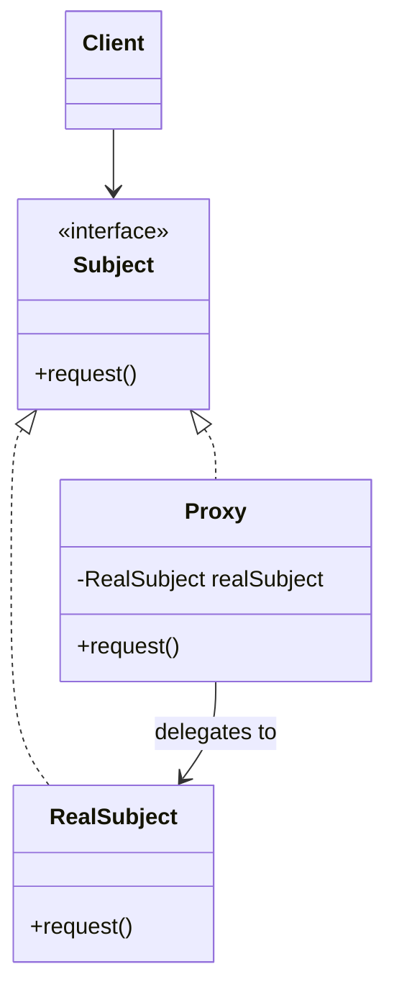

Proxy 패턴의 다양한 형태와 활용법을 탐구합니다. 지연 로딩, 접근 제어, 원격 투명성 등 대리자의 강력한 능력을 학습합니다.

## 서론: 투명한 대리자의 예술

> *"진정한 대리자는 자신의 존재를 드러내지 않는다. 클라이언트는 실제 객체와 대화하고 있다고 믿지만, 그 뒤에서는 보이지 않는 손이 모든 것을 조율하고 있다."*

**Proxy 패턴**은 **"다른 객체에 대한 대리자 또는 자리표시자"**를 제공하는 패턴입니다. 마치 비서가 CEO를 대신해 업무를 처리하듯, Proxy는 실제 객체 대신 클라이언트의 요청을 받아 처리합니다.

하지만 단순한 대리자가 아닙니다. Proxy는 다음과 같은 **강력한 능력**들을 가지고 있습니다:

### 지연 로딩 (Lazy Loading)
- 비용이 큰 객체를 실제 필요한 시점까지 생성 지연
- 메모리 효율성과 초기 로딩 시간 단축

### 원격 투명성 (Remote Transparency)
- 네트워크 너머의 객체를 마치 로컬 객체처럼 사용
- 분산 시스템의 복잡성을 클라이언트로부터 숨김

### 접근 제어 (Access Control)
- 보안과 권한 검증을 투명하게 처리
- 감사 로깅과 모니터링 기능 제공

### 성능 최적화 (Performance Enhancement)
- 캐싱, 풀링, 배치 처리 등을 통한 성능 향상
- 리소스 사용 최적화

```java
// 현실적인 문제 상황
public class DocumentViewer {
    public void openDocument(String filename) {
        // 문제점들:
        // 1. 큰 파일은 로딩이 오래 걸림 (지연 로딩 필요)
        // 2. 원격 서버의 파일도 있음 (네트워크 투명성 필요)
        // 3. 민감한 문서는 권한 확인 필요 (보안 제어 필요)
        // 4. 자주 쓰는 문서는 캐싱하고 싶음 (성능 최적화 필요)
        
        Document doc = new RealDocument(filename);
        if (doc.isLarge()) {
            // 로딩이 오래 걸림... 😞
        }
        if (doc.isRemote()) {
            // 네트워크 에러 처리... 😰
        }
        if (doc.isConfidential()) {
            // 권한 확인... 🔐
        }
        doc.display();
    }
}
```

이런 복잡한 요구사항들을 어떻게 우아하게 해결할 수 있을까요?

### Proxy 패턴의 공통 구조

앞으로 살펴볼 Virtual, Remote, Protection, Cache Proxy는 겉으로는 서로 다른 문제(생성 비용, 네트워크, 보안, 재사용)를 풀지만, 구조적으로는 하나의 뼈대를 공유합니다. Client는 오직 Subject라는 인터페이스만 알고, RealSubject와 Proxy는 그 인터페이스를 함께 구현합니다. Client 입장에서 자신이 부르는 대상이 RealSubject인지 Proxy인지는 컴파일 타임에도, 대부분의 경우 런타임에도 구분되지 않습니다 — 이 무지(無知)가 바로 "투명성"의 실체이며, 뒤에 나올 네 가지 Proxy 유형은 이 공통 구조 위에서 `request()` 호출 전후에 무엇을 끼워 넣는지만 다를 뿐입니다.



## Virtual Proxy

### 패턴의 동기와 철학

Virtual Proxy는 **"비용이 큰 객체의 생성을 실제 필요한 시점까지 지연"**시키는 패턴입니다. 큰 이미지 파일, 무거운 데이터베이스 연결, 복잡한 계산 결과 등을 다룰 때 특히 유용합니다.

GoF는 원저에서 Proxy를 **"다른 객체에 대한 접근을 제어하기 위해 그 객체를 대리하는 자리표시자를 제공하는"** 패턴으로 정의하며, Virtual Proxy를 "필요할 때에만 생성해야 하는, 생성 비용이 큰 객체를 표현하는" 대리자로 소개한다(Gamma, Helm, Johnson, Vlissides, *Design Patterns*, 1994).

- 비용이 큰 객체의 지연 생성
- 이미지 로딩, 데이터베이스 연결 등
- 메모리 최적화와 성능 향상

```java
   // Subject 인터페이스
   interface Image {
       void display();
       String getInfo();
   }
   
   // RealSubject - 실제 이미지
   class RealImage implements Image {
       private String filename;
       private byte[] imageData;
       
       public RealImage(String filename) {
           this.filename = filename;
           loadFromDisk(); // 비용이 큰 작업
       }
       
       private void loadFromDisk() {
           System.out.println("Loading image: " + filename);
           // 실제로는 디스크에서 이미지 로딩
           try {
               Thread.sleep(1000); // 로딩 시뮬레이션
               imageData = new byte[1024 * 1024]; // 1MB 이미지
           } catch (InterruptedException e) {
               Thread.currentThread().interrupt();
           }
       }
       
       @Override
       public void display() {
           System.out.println("Displaying image: " + filename);
       }
       
       @Override
       public String getInfo() {
           return "Real image: " + filename + " (Size: " + imageData.length + " bytes)";
       }
   }
   
   // Virtual Proxy
   class ImageProxy implements Image {
       private String filename;
       private RealImage realImage;
       
       public ImageProxy(String filename) {
           this.filename = filename;
       }
       
       @Override
       public void display() {
           if (realImage == null) {
               realImage = new RealImage(filename); // 지연 로딩
           }
           realImage.display();
       }
       
       @Override
       public String getInfo() {
           if (realImage == null) {
               return "Proxy image: " + filename + " (Not loaded yet)";
           }
           return realImage.getInfo();
       }
   }
   ```
   
## Remote Proxy

Remote Proxy는 **"네트워크 너머에 있는 객체를 마치 로컬 객체처럼 다루게 해주는"** 형태입니다. 클라이언트 쪽에는 실제 요청 인터페이스와 동일한 모양의 스텁(stub)이 놓이고, 스텁은 메서드 호출을 직렬화(marshalling)해 네트워크로 전송한 뒤 서버 쪽 스켈레톤(skeleton)이 이를 역직렬화해 실제 객체의 메서드를 호출합니다. Virtual Proxy가 "생성 시점"을 지연시키는 것과 달리, Remote Proxy가 다루는 실제 객체는 이미 어딘가에 존재하며 문제는 오직 "그 객체가 로컬이 아니라는 사실을 클라이언트로부터 숨기는 것"입니다. 이 구분 덕분에 클라이언트 코드는 원격 호출 여부와 무관하게 동일한 인터페이스만 알면 되고, 네트워크 지연·타임아웃·직렬화 오류 같은 부수적 관심사는 Proxy 계층에 격리됩니다.

- 네트워크를 통한 원격 객체 접근 (RPC, REST API, gRPC 등)
- 직렬화/역직렬화와 네트워크 오류 처리를 Proxy 뒤로 숨김
- 네트워크 투명성 제공

```java
   import java.math.BigDecimal;
   import java.net.URI;
   import java.net.http.HttpClient;
   import java.net.http.HttpRequest;
   import java.net.http.HttpResponse;

   // 원격 서비스 인터페이스
   interface BankService {
       BigDecimal getBalance(String accountId);
       boolean transfer(String fromAccount, String toAccount, BigDecimal amount);
   }
   
   // 실제 원격 서비스 (서버에 위치)
   class RealBankService implements BankService {
       @Override
       public BigDecimal getBalance(String accountId) {
           // 실제 데이터베이스 조회
           return new BigDecimal("1000.00");
       }
       
       @Override
       public boolean transfer(String fromAccount, String toAccount, BigDecimal amount) {
           // 실제 송금 처리
           return true;
       }
   }
   
   // Remote Proxy (클라이언트에 위치)
   class BankServiceProxy implements BankService {
       private String serverUrl;
       private HttpClient httpClient;
       
       public BankServiceProxy(String serverUrl) {
           this.serverUrl = serverUrl;
           this.httpClient = HttpClient.newHttpClient();
       }
       
       @Override
       public BigDecimal getBalance(String accountId) {
           try {
               HttpRequest request = HttpRequest.newBuilder()
                   .uri(URI.create(serverUrl + "/balance/" + accountId))
                   .GET()
                   .build();
               
               HttpResponse<String> response = httpClient.send(request, 
                   HttpResponse.BodyHandlers.ofString());
               
               return new BigDecimal(response.body());
           } catch (Exception e) {
               throw new RuntimeException("Remote call failed", e);
           }
       }
       
       @Override
       public boolean transfer(String fromAccount, String toAccount, BigDecimal amount) {
           // HTTP POST 요청으로 송금 요청
           try {
               String jsonBody = String.format(
                   "{\"from\":\"%s\",\"to\":\"%s\",\"amount\":%s}",
                   fromAccount, toAccount, amount
               );
               
               HttpRequest request = HttpRequest.newBuilder()
                   .uri(URI.create(serverUrl + "/transfer"))
                   .header("Content-Type", "application/json")
                   .POST(HttpRequest.BodyPublishers.ofString(jsonBody))
                   .build();
               
               HttpResponse<String> response = httpClient.send(request,
                   HttpResponse.BodyHandlers.ofString());
               
               return response.statusCode() == 200;
           } catch (Exception e) {
               throw new RuntimeException("Remote transfer failed", e);
           }
       }
   }
   ```
   
## Protection Proxy

Protection Proxy는 **"클라이언트가 실제 객체에 접근할 권한이 있는지 검증한 뒤에만 요청을 전달"**하는 형태입니다. 실제 객체는 이미 로컬에 존재하고 네트워크도 관련이 없다는 점에서 앞의 Virtual Proxy·Remote Proxy와 뚜렷이 구분되며, Proxy가 추가로 들고 있는 것은 오직 "누가 요청했는가"라는 인가 컨텍스트(사용자, 역할, 권한)뿐입니다. 요청이 들어오면 Proxy는 먼저 권한을 검사하고, 통과하면 실제 객체로 위임하며, 실패하면 실제 객체를 호출하지 않은 채 예외를 던집니다 — 이 순서 덕분에 권한 검증 로직과 비즈니스 로직이 물리적으로 분리되어 실제 객체는 보안을 전혀 알 필요가 없습니다.

- 접근 권한 제어와 보안
- 인증, 인가, 감사 로깅
- 민감한 리소스 보호

```java
   // 민감한 정보를 다루는 서비스
   interface SecureDocument {
       String getContent();
       void updateContent(String content);
       void delete();
   }
   
   class ConfidentialDocument implements SecureDocument {
       private String content;
       private String filename;
       
       public ConfidentialDocument(String filename, String content) {
           this.filename = filename;
           this.content = content;
       }
       
       @Override
       public String getContent() {
           return content;
       }
       
       @Override
       public void updateContent(String content) {
           this.content = content;
           System.out.println("Document updated: " + filename);
       }
       
       @Override
       public void delete() {
           System.out.println("Document deleted: " + filename);
       }
   }
   
   // Protection Proxy
   class SecureDocumentProxy implements SecureDocument {
       private ConfidentialDocument realDocument;
       private User currentUser;
       private AuditLogger auditLogger;
       
       public SecureDocumentProxy(ConfidentialDocument document, User user) {
           this.realDocument = document;
           this.currentUser = user;
           this.auditLogger = new AuditLogger();
       }
       
       @Override
       public String getContent() {
           if (!hasReadPermission()) {
               throw new SecurityException("Read access denied");
           }
           auditLogger.log("Document accessed by: " + currentUser.getName());
           return realDocument.getContent();
       }
       
       @Override
       public void updateContent(String content) {
           if (!hasWritePermission()) {
               throw new SecurityException("Write access denied");
           }
           auditLogger.log("Document modified by: " + currentUser.getName());
           realDocument.updateContent(content);
       }
       
       @Override
       public void delete() {
           if (!hasDeletePermission()) {
               throw new SecurityException("Delete access denied");
           }
           auditLogger.log("Document deleted by: " + currentUser.getName());
           realDocument.delete();
       }
       
       private boolean hasReadPermission() {
           return currentUser.hasRole("READER") || 
                  currentUser.hasRole("WRITER") || 
                  currentUser.hasRole("ADMIN");
       }
       
       private boolean hasWritePermission() {
           return currentUser.hasRole("WRITER") || 
                  currentUser.hasRole("ADMIN");
       }
       
       private boolean hasDeletePermission() {
           return currentUser.hasRole("ADMIN");
       }
   }
   ```

## Cache Proxy

### 패턴의 동기와 철학

Cache Proxy는 **"이전에 계산하거나 조회한 결과를 저장해 두었다가, 동일한 요청이 다시 들어오면 실제 객체를 호출하지 않고 저장된 값을 반환"**하는 형태입니다. Virtual Proxy와 자주 혼동되지만 둘의 초점은 다릅니다. Virtual Proxy는 "생성을 딱 한 번, 필요한 시점까지" 늦추는 것이 목적이라 일단 생성되고 나면 프록시의 역할이 사실상 끝나는 반면, Cache Proxy는 요청이 들어올 때마다 반복적으로 개입해 "이미 계산된 결과를 재사용할지, 실제 객체를 다시 호출할지"를 매번 판단합니다. 이 차이 때문에 Cache Proxy는 캐시 무효화 전략(TTL, 명시적 갱신, LRU 축출)이라는 Virtual Proxy에는 없는 고유한 설계 문제를 안게 됩니다 — 캐시된 값이 실제 값과 얼마나 어긋나도(staleness) 허용할지가 Cache Proxy 설계의 핵심 트레이드오프입니다.

- 반복 호출되는 비용이 큰 연산의 결과 재사용
- 캐시 적중(hit) 시 실제 객체 호출 생략, 미스(miss) 시 실제 호출 후 결과 저장
- TTL·용량 제한 등 캐시 무효화 전략이 핵심 설계 요소

```java
import java.util.Map;
import java.util.concurrent.ConcurrentHashMap;
import java.util.concurrent.TimeUnit;

// Subject 인터페이스
interface DataService {
    String fetchData(String key);
}

// RealSubject - 비용이 큰 조회를 수행하는 실제 서비스
class RealDataService implements DataService {
    @Override
    public String fetchData(String key) {
        simulateSlowIO(); // 실제로는 DB/외부 API 호출
        return "data-for-" + key;
    }

    private void simulateSlowIO() {
        try {
            Thread.sleep(200); // 200ms I/O 지연 시뮬레이션
        } catch (InterruptedException e) {
            Thread.currentThread().interrupt();
        }
    }
}

// Cache Proxy - 동일 키 재요청 시 캐시된 값을 반환
class CachingDataServiceProxy implements DataService {
    private static final long TTL_MILLIS = TimeUnit.SECONDS.toMillis(30);

    private final DataService realService;
    private final Map<String, CacheEntry> cache = new ConcurrentHashMap<>();

    public CachingDataServiceProxy(DataService realService) {
        this.realService = realService;
    }

    @Override
    public String fetchData(String key) {
        CacheEntry entry = cache.get(key);
        long now = System.currentTimeMillis();
        if (entry != null && (now - entry.timestamp) < TTL_MILLIS) {
            return entry.value; // 캐시 적중: 실제 객체 호출 생략
        }
        String value = realService.fetchData(key); // 캐시 미스: 실제 객체 호출
        cache.put(key, new CacheEntry(value, now));
        return value;
    }

    private static class CacheEntry {
        final String value;
        final long timestamp;

        CacheEntry(String value, long timestamp) {
            this.value = value;
            this.timestamp = timestamp;
        }
    }
}
```

이 구현의 TTL 검사(`(now - entry.timestamp) < TTL_MILLIS`)는 시간 기반 무효화의 가장 단순한 형태이며, 실무에서는 이 조건 대신 크기 기반 축출(LRU/LFU)이나 명시적 무효화 이벤트를 조합하는 경우가 많습니다. `ConcurrentHashMap`을 택한 이유는 별도의 동기화 없이도 다중 스레드에서 안전하게 `get`/`put`을 수행할 수 있기 때문이며, 실제 프로덕션에서는 이 예제처럼 손수 구현하기보다 Caffeine·Guava Cache처럼 축출 정책과 통계를 함께 제공하는 라이브러리를 먼저 검토하는 편이 좋습니다(뒤의 "현대적 Proxy 활용: Reactive Programming" 절에서 사용하는 Caffeine이 그 예입니다).

## 현대 프레임워크에서의 Proxy 활용

지금까지 살펴본 Virtual·Remote·Protection·Cache Proxy는 개발자가 직접 클래스를 작성해 구현하는 정적(static) 형태였습니다. 그러나 실무에서 가장 널리 쓰이는 Proxy는 프레임워크가 런타임에 자동으로 만들어 주는 **동적 프록시**입니다. Spring AOP는 `@Transactional`·`@Cacheable` 같은 애노테이션이 붙은 빈(bean)마다 프록시를 생성해 트랜잭션 관리와 캐싱을 가로채고, JPA/Hibernate는 연관 엔티티 필드에 Virtual Proxy를 자동 삽입해 지연 로딩을 구현하며, CDN은 이 모든 것을 애플리케이션 밖에서 Reverse Proxy로 구현합니다. 공통점은 "개발자가 프록시 클래스를 직접 작성하지 않아도 된다"는 것이며, 그 대신 프레임워크가 만든 프록시가 어떤 순서로 관심사를 처리하는지 이해해야 디버깅과 성능 튜닝이 가능해집니다.

- Spring AOP와 Dynamic Proxy
- JPA의 Lazy Loading
- ORM의 Entity Proxy
- CDN과 Reverse Proxy

### Spring AOP Dynamic Proxy 예시

```java
   import org.springframework.beans.factory.annotation.Autowired;
   import org.springframework.cache.Cache;
   import org.springframework.cache.CacheManager;
   import org.springframework.cache.annotation.Cacheable;
   import org.springframework.stereotype.Service;
   import org.springframework.transaction.PlatformTransactionManager;
   import org.springframework.transaction.TransactionDefinition;
   import org.springframework.transaction.TransactionStatus;
   import org.springframework.transaction.annotation.Transactional;
   import org.springframework.transaction.support.DefaultTransactionDefinition;
   import org.slf4j.Logger;
   import org.slf4j.LoggerFactory;

   @Service
   @Transactional
   public class UserService {
       @Autowired
       private UserRepository userRepository;
       
       @Cacheable("users")
       @LogExecutionTime
       public User findById(Long id) {
           return userRepository.findById(id);
       }
   }
   
   // Spring이 생성하는 동적 프록시 (의사코드 — 실제로는 CGLIB가 바이트코드로 생성하며,
   // 아래는 그 프록시가 수행하는 위빙(weaving) 순서를 사람이 읽을 수 있게 풀어 쓴 것)
   class UserService$Proxy extends UserService {
       private UserService target;
       private PlatformTransactionManager txManager;
       private CacheManager cacheManager;
       private Logger logger = LoggerFactory.getLogger(UserService.class);
       
       @Override
       public User findById(Long id) {
           // 1. 캐시 확인
           Cache cache = cacheManager.getCache("users");
           Cache.ValueWrapper wrapper = cache.get(id);
           User cached = wrapper != null ? (User) wrapper.get() : null;
           if (cached != null) return cached;
           
           // 2. 트랜잭션 시작
           TransactionDefinition txDef = new DefaultTransactionDefinition();
           TransactionStatus tx = txManager.getTransaction(txDef);
           
           // 3. 실행 시간 측정 시작
           long startTime = System.currentTimeMillis();
           
           try {
               // 4. 실제 메서드 호출
               User result = target.findById(id);
               
               // 5. 결과 캐싱
               cache.put(id, result);
               
               // 6. 트랜잭션 커밋
               txManager.commit(tx);
               
               return result;
           } catch (Exception e) {
               // 7. 트랜잭션 롤백
               txManager.rollback(tx);
               throw e;
           } finally {
               // 8. 실행 시간 로깅
               long executionTime = System.currentTimeMillis() - startTime;
               logger.info("Method execution time: {}ms", executionTime);
           }
       }
   }
   ```

## 구현 기법과 최적화

앞서 본 Virtual/Remote/Protection/Cache Proxy는 인터페이스마다 Proxy 클래스를 손으로 작성하는 **정적 Proxy**였습니다. 인터페이스가 수십 개로 늘어나면 이 방식은 클래스 수가 그대로 비례해 늘어난다는 확장성 한계에 부딪히는데, JDK의 `java.lang.reflect.Proxy`는 이 문제를 인터페이스 정보만으로 프록시 클래스를 **런타임에 생성**해 해결합니다. 모든 메서드 호출은 `InvocationHandler.invoke()`라는 단일 지점으로 모이므로, 로깅·트랜잭션·캐싱 같은 공통 관심사를 인터페이스 개수와 무관하게 한 곳에서 구현할 수 있다는 것이 정적 Proxy 대비 가장 큰 이점입니다. 다만 이 방식은 대상이 인터페이스를 구현하고 있어야 하며, 클래스 자체를 프록시하려면(Spring이 인터페이스 없는 빈에 CGLIB를 쓰는 이유) 별도의 바이트코드 생성 라이브러리가 필요합니다.

- Dynamic Proxy vs Static Proxy
- Reflection 기반 구현
- Bytecode 조작 (CGLIB, ASM)
- 성능 최적화 전략

### Dynamic Proxy 구현

```java
   import java.lang.reflect.InvocationHandler;
   import java.lang.reflect.InvocationTargetException;
   import java.lang.reflect.Method;
   import java.lang.reflect.Proxy;

   // JDK Dynamic Proxy 사용
   public class ProxyFactory {
       public static <T> T createProxy(T target, Class<T> interfaceType) {
           return (T) Proxy.newProxyInstance(
               interfaceType.getClassLoader(),
               new Class[]{interfaceType},
               new InvocationHandler() {
                   @Override
                   public Object invoke(Object proxy, Method method, Object[] args) 
                           throws Throwable {
                       // Before advice
                       System.out.println("Before: " + method.getName());
                       long startTime = System.nanoTime();
                       
                       try {
                           // 실제 메서드 호출
                           Object result = method.invoke(target, args);
                           
                           // After advice
                           long endTime = System.nanoTime();
                           System.out.println("After: " + method.getName() + 
                               " (" + (endTime - startTime) + "ns)");
                           
                           return result;
                       } catch (InvocationTargetException e) {
                           // Exception advice
                           System.out.println("Exception in: " + method.getName());
                           throw e.getCause();
                       }
                   }
               }
           );
       }
   }
   ```

### Proxy와 다른 패턴의 관계

Proxy는 구조적으로 Decorator, Adapter와 자주 혼동되지만 목적이 다릅니다. Decorator는 대상과 동일한 인터페이스를 유지하면서 새로운 책임을 동적으로 "추가"하는 것이 목적이라 여러 겹으로 체이닝되는 경우가 흔한 반면, Proxy는 대상에 대한 "접근 자체를 제어"하는 것이 목적이라 보통 대상 하나당 하나의 계층으로 존재합니다(뒤의 "Proxy vs Decorator vs Adapter 비교" 표 참고). Adapter는 서로 다른 인터페이스를 호환되게 "변환"하는 것이 목적이므로 원본과 다른 인터페이스를 노출할 수 있지만, Proxy와 Decorator는 원본과 동일한 인터페이스를 유지한다는 점에서 Adapter와 구분됩니다. Facade는 여러 서브시스템을 하나의 단순한 인터페이스로 묶는다는 점에서 목적 자체는 Proxy와 다르지만, 단일 진입점 뒤로 복잡성을 감춘다는 점에서는 넓은 의미의 대리자 역할을 공유합니다. 실무에서는 이 패턴들이 조합되어 쓰이는 경우도 흔합니다. 예를 들어 Spring AOP의 프록시는 트랜잭션·보안 제어라는 Proxy 본연의 역할을 수행하면서도, 인터셉터 체인을 통해 로깅 같은 부가 기능을 덧붙이는 Decorator적 동작을 함께 보여줍니다.

### 흔한 오개념

Proxy 패턴을 처음 접할 때 자주 빠지는 오해 세 가지를 짚어봅니다.

**오해 1: "Proxy는 항상 성능을 떨어뜨리므로 프로덕션에서는 피해야 한다."** 뒤의 "성능 오버헤드 가이드" 표에서 보듯, 오버헤드의 크기는 작업의 성격에 달려 있습니다. 단순 getter 호출처럼 원래도 몇 나노초 걸리는 작업에 Proxy를 씌우면 상대적 오버헤드가 커 보이지만, 데이터베이스 조회나 네트워크 I/O처럼 원래 밀리초 단위가 걸리는 작업에서는 Proxy가 추가하는 시간이 전체 대비 0.5% 안팎에 불과합니다. "느려진다"가 아니라 "얼마나 가벼운 작업에 씌우는가"가 핵심 질문입니다.

**오해 2: "Virtual Proxy와 지연 초기화(lazy initialization)는 같은 것이다."** 지연 초기화는 필드 값을 실제 접근 시점까지 늦게 채우는 범용 구현 기법으로, 클래스 내부에 `if (field == null) field = compute();` 한 줄만 있어도 성립합니다. Virtual Proxy는 이 지연을 **별도의 클래스(Proxy)로 캡슐화해 Subject 인터페이스 뒤에 완전히 숨긴다**는 점에서 더 엄격한 구조적 제약을 가진 GoF 패턴입니다 — 클라이언트는 지연 초기화가 필드 안에서 일어나는지, 별도의 Proxy 객체를 통해 일어나는지조차 알 수 없어야 합니다.

**오해 3: "Proxy와 Decorator는 사실상 같은 코드 구조이므로 구분할 실익이 없다."** 두 패턴의 UML 구조는 실제로 거의 동일합니다(둘 다 대상과 같은 인터페이스를 구현하고 내부에 대상 참조를 보관). 그러나 앞서 본 것처럼 목적이 다릅니다 — Decorator는 대상 하나에 여러 겹을 씌우며 책임을 "추가"하는 것이 정상적인 사용 패턴이고, Proxy는 대상 하나당 계층 하나로 접근을 "제어"하는 것이 목적입니다. 코드만 보고 두 패턴을 구분하려 하면 실패하고, "왜 이 클래스를 끼워 넣었는가"라는 설계 의도를 봐야 구분할 수 있습니다.

### 깊이 있는 분석 포인트

1. **네트워크와 분산 시스템 관점:**
   - 네트워크 지연과 장애 처리
   - 로드 밸런싱과 장애 복구
   - 캐싱과 CDN 전략

2. **성능 최적화 관점:**
   - Reflection 오버헤드 최소화
   - Bytecode 생성과 클래스 로딩
   - 메모리 사용량과 가비지 컬렉션

3. **보안과 감사 관점:**
   - 인증과 인가 메커니즘
   - 감사 로깅과 모니터링
   - 취약점과 보안 고려사항

### 실제 사례 분석

1. **Hibernate Lazy Loading**
   ```java
   import java.util.List;
   import jakarta.persistence.Entity;
   import jakarta.persistence.FetchType;
   import jakarta.persistence.Id;
   import jakarta.persistence.OneToMany;
   import org.hibernate.engine.spi.SessionImplementor;

   @Entity
   public class User {
       @Id
       private Long id;
       
       @OneToMany(fetch = FetchType.LAZY, mappedBy = "user")
       private List<Order> orders; // Proxy 객체로 지연 로딩
   }
   
   // Hibernate가 생성하는 프록시 (의사코드 — 실제 Hibernate는 바이트코드 향상으로 생성하며,
   // 아래는 지연 로딩의 동작 순서를 사람이 읽을 수 있게 풀어 쓴 것)
   class User$HibernateProxy extends User {
       private boolean initialized = false;
       private SessionImplementor session;
       
       @Override
       public List<Order> getOrders() {
           if (!initialized) {
               // 실제 데이터베이스 조회
               List<Order> realOrders = session.createQuery(
                   "SELECT o FROM Order o WHERE o.user.id = :userId")
                   .setParameter("userId", getId())
                   .getResultList();
               super.setOrders(realOrders);
               initialized = true;
           }
           return super.getOrders();
       }
   }
   ```

2. **CDN과 Reverse Proxy**
   ```nginx
   # Nginx 설정 예시
   server {
       listen 80;
       server_name example.com;
       
       # 정적 자원은 CDN으로 프록시
       location ~* \.(jpg|jpeg|png|gif|css|js)$ {
           proxy_pass http://cdn.example.com;
           proxy_cache_valid 1d;
       }
       
       # API 요청은 백엔드 서버로 프록시
       location /api/ {
           proxy_pass http://backend-servers;
           proxy_set_header Host $host;
           proxy_set_header X-Real-IP $remote_addr;
       }
   }
   ```

3. **Java RMI와 Remote Proxy**
   ```java
   import java.rmi.Remote;
   import java.rmi.RemoteException;
   import java.rmi.server.UnicastRemoteObject;

   // RMI 인터페이스
   public interface Calculator extends Remote {
       int add(int a, int b) throws RemoteException;
       int multiply(int a, int b) throws RemoteException;
   }
   
   // RMI 구현체 (서버)
   public class CalculatorImpl extends UnicastRemoteObject 
                                implements Calculator {
       public CalculatorImpl() throws RemoteException {}
       
       @Override
       public int add(int a, int b) throws RemoteException {
           return a + b;
       }
       
       @Override
       public int multiply(int a, int b) throws RemoteException {
           return a * b;
       }
   }
   
   // 클라이언트에서 자동 생성되는 프록시 (Stub)
   // 네트워크 호출을 투명하게 처리
   ```

## 성능 분석과 최적화 전략

### Proxy 오버헤드 분석

```java
// 성능 측정 결과 (나노초/operation)
/*
작업 유형           | 직접 호출 | JDK Proxy | CGLIB  | 오버헤드
단순 메서드         |   1ns    |   15ns   |  12ns  | 1200-1500%
복잡한 메서드       |  100ns   |  115ns   | 112ns  |    12-15%
네트워크 호출       |  50ms    |  50.1ms  | 50.1ms |     0.2%
데이터베이스 조회   |  10ms    |  10.05ms |10.05ms |     0.5%

결론:
- 단순한 메서드: Proxy 오버헤드가 상당함
- 복잡한 작업: 오버헤드가 상대적으로 미미함
- I/O 작업: 오버헤드가 거의 무시할 수준
- 실무에서는 대부분 복잡한 작업이므로 큰 문제 없음

※ 위 수치는 특정 환경에서 관찰될 수 있는 예시 값이며, JVM 워밍업·JIT 최적화·하드웨어에 따라 실제 측정치는 달라질 수 있습니다. 절대값보다 "작업이 가벼울수록 상대적 오버헤드가 커진다"는 경향성에 주목하세요.
*/

import java.lang.reflect.InvocationHandler;
import java.lang.reflect.Method;
import java.lang.reflect.Proxy;
import java.util.Map;
import java.util.concurrent.ConcurrentHashMap;

// 최적화된 Proxy 구현
public class OptimizedProxyFactory {
    
    // 캐시를 통한 성능 최적화
    private static final Map<Class<?>, Method[]> METHOD_CACHE = new ConcurrentHashMap<>();
    private static final Map<String, Class<?>> PROXY_CLASS_CACHE = new ConcurrentHashMap<>();
    
    public static <T> T createOptimizedProxy(T target, Class<T> interfaceType, 
                                           ProxyInterceptor interceptor) {
        // 1. 프록시 클래스 캐싱
        String cacheKey = interfaceType.getName() + "_" + interceptor.getClass().getName();
        Class<?> proxyClass = PROXY_CLASS_CACHE.computeIfAbsent(cacheKey, k -> 
            Proxy.getProxyClass(interfaceType.getClassLoader(), interfaceType)
        );
        
        // 2. 메서드 정보 캐싱
        Method[] methods = METHOD_CACHE.computeIfAbsent(interfaceType, Class::getDeclaredMethods);
        
        // 3. 최적화된 InvocationHandler
        InvocationHandler handler = new OptimizedInvocationHandler(target, interceptor, methods);
        
        try {
            return (T) proxyClass.getConstructor(InvocationHandler.class).newInstance(handler);
        } catch (Exception e) {
            throw new RuntimeException("Failed to create optimized proxy", e);
        }
    }
    
    private static class OptimizedInvocationHandler implements InvocationHandler {
        private final Object target;
        private final ProxyInterceptor interceptor;
        private final Method[] cachedMethods;
        
        public OptimizedInvocationHandler(Object target, ProxyInterceptor interceptor, Method[] methods) {
            this.target = target;
            this.interceptor = interceptor;
            this.cachedMethods = methods;
        }
        
        @Override
        public Object invoke(Object proxy, Method method, Object[] args) throws Throwable {
            // Object 메서드는 별도 처리
            if (method.getDeclaringClass() == Object.class) {
                return method.invoke(target, args);
            }
            
            // 인터셉터 적용
            return interceptor.intercept(target, method, args);
        }
    }
}

// 프록시 인터셉터 인터페이스
@FunctionalInterface
public interface ProxyInterceptor {
    Object intercept(Object target, Method method, Object[] args) throws Throwable;
}
```

### 현대적 Proxy 활용: Reactive Programming

```java
import java.time.Duration;
import com.github.benmanes.caffeine.cache.Cache;
import com.github.benmanes.caffeine.cache.Caffeine;
import io.github.resilience4j.circuitbreaker.CircuitBreaker;
import org.springframework.stereotype.Component;
import reactor.core.publisher.Flux;
import reactor.core.publisher.Mono;
import reactor.core.scheduler.Schedulers;

// Reactive Streams와 Proxy 패턴의 조합
// 주의: 이 UserService는 앞선 "Spring AOP" 절의 동기(blocking) UserService와는
// 별개의 반응형(reactive) 인터페이스로, findById/findAll이 Mono/Flux를 반환한다고 가정한다.
public class ReactiveServiceProxy implements UserService {
    private final UserService target;
    private final CircuitBreaker circuitBreaker;
    private final Cache<String, User> cache;
    
    public ReactiveServiceProxy(UserService target) {
        this.target = target;
        this.circuitBreaker = CircuitBreaker.ofDefaults("userService");
        this.cache = Caffeine.newBuilder()
            .maximumSize(1000)
            .expireAfterWrite(Duration.ofMinutes(10))
            .build();
    }
    
    @Override
    public Mono<User> findById(String userId) {
        return Mono.fromSupplier(() -> cache.getIfPresent(userId))
            .switchIfEmpty(
                // 캐시 미스 시 실제 서비스 호출
                Mono.fromSupplier(() -> circuitBreaker.executeSupplier(() -> {
                    User user = target.findById(userId).block();
                    cache.put(userId, user);
                    return user;
                }))
                .subscribeOn(Schedulers.boundedElastic())
                .timeout(Duration.ofSeconds(5))
                .retry(2)
                .onErrorResume(throwable -> {
                    // 폴백 처리
                    return Mono.just(User.defaultUser(userId));
                })
            );
    }
    
    @Override
    public Flux<User> findAll() {
        return Flux.defer(() -> 
            Flux.fromIterable(target.findAll().collectList().block())
        )
        .subscribeOn(Schedulers.boundedElastic())
        .timeout(Duration.ofSeconds(10))
        .onErrorResume(throwable -> 
            Flux.just(User.defaultUser("error"))
        );
    }
}
```

Service Mesh 환경에서는 로드 밸런싱·메트릭 수집·분산 추적처럼 서로 다른 인프라 관심사가 하나의 Proxy 뒤에 결합된다. 아래 예시는 그 결합 순서를 보여주는 **개념 코드**다. `LoadBalancer`, `MetricsCollector`, `DistributedTracing`, `ServiceInstance`는 특정 라이브러리의 실제 타입이 아니라, Spring Cloud LoadBalancer·Micrometer `Timer`·Brave/Sleuth `Span`/`Tracer` 같은 실제 라이브러리들이 제공하는 기능을 하나로 묶어 부르는 자리표시자 이름이다. 실제 프로젝트에서는 각 인프라 팀이 채택한 라이브러리의 실제 클래스로 대체된다.

```text
// Service Mesh와 Proxy 패턴 (개념 코드 — 실제 타입은 프로젝트마다 다름)
@Component
public class ServiceMeshProxy implements OrderService {
    private final LoadBalancer loadBalancer;
    private final MetricsCollector metricsCollector;
    private final DistributedTracing tracing;
    
    @Override
    public Order createOrder(OrderRequest request) {
        // 1. 분산 추적 시작
        Span span = tracing.nextSpan().name("create-order");
        
        try (Tracer.SpanInScope ws = tracing.tracer().withSpanInScope(span)) {
            // 2. 로드 밸런싱
            ServiceInstance instance = loadBalancer.choose("order-service");
            
            // 3. 메트릭 수집 시작
            Timer.Sample sample = Timer.start(metricsCollector.registry());
            
            // 4. 실제 서비스 호출
            Order result = invokeService(instance, request);
            
            // 5. 메트릭 기록
            sample.stop(metricsCollector.timer("order.create"));
            
            // 6. 추적 정보 추가
            span.tag("order.id", result.getId());
            span.tag("success", "true");
            
            return result;
            
        } catch (Exception e) {
            span.tag("error", e.getMessage());
            throw e;
        } finally {
            span.end();
        }
    }
}
```

## 한눈에 보는 Proxy 패턴

### Proxy 유형별 비교표

| Proxy 유형 | 핵심 목적 | 사용 시나리오 | 성능 영향 |
|-----------|----------|-------------|----------|
| Virtual Proxy | 지연 로딩 | 큰 이미지, 무거운 객체 | 초기 로딩 개선 |
| Protection Proxy | 접근 제어 | 권한 검증, 보안 | 약간의 오버헤드 |
| Remote Proxy | 원격 투명성 | 분산 시스템, RMI | 네트워크 지연 |
| Cache Proxy | 성능 최적화 | 자주 접근하는 데이터 | 캐시 히트 시 향상 |
| Smart Proxy | 추가 기능 | 로깅, 카운팅, 잠금 | 기능에 따라 다름 |
| Logging Proxy | 감사 추적 | 호출 기록, 디버깅 | I/O 오버헤드 |

### Proxy vs Decorator vs Adapter 비교

| 비교 항목 | Proxy | Decorator | Adapter |
|----------|-------|-----------|---------|
| 핵심 목적 | 접근 제어 | 기능 추가 | 인터페이스 변환 |
| 인터페이스 | 동일 유지 | 동일 유지 | 변환 |
| 대상 생성 | Proxy가 제어 | 외부에서 전달 | 외부에서 전달 |
| 재귀 구조 | 보통 X | O (체이닝) | X |
| 투명성 | 높음 | 높음 | 중간 |

### 구현 방식별 특성

| 구현 방식 | 장점 | 단점 | 적용 시점 |
|----------|------|------|----------|
| 정적 Proxy | 컴파일타임 안전, 디버깅 용이 | 인터페이스당 클래스 필요 | 대상 명확, 개수 적음 |
| 동적 Proxy (JDK) | 런타임 생성, 유연함 | 인터페이스만 지원 | 인터페이스 기반 설계 |
| CGLIB Proxy | 클래스도 프록시 가능 | final 클래스 불가 | Spring AOP 기본 |
| 바이트코드 조작 | 최고 유연성 | 복잡성, 디버깅 어려움 | 고급 AOP 요구 |

### 성능 오버헤드 가이드

| 작업 유형 | 직접 호출 | Proxy 호출 | 오버헤드 비율 |
|----------|---------|-----------|-------------|
| 단순 getter | 1ns | ~15ns | ~1,200-1,500% |
| 비즈니스 로직 | 1ms | 1.01ms | ~1% |
| 데이터베이스 조회 | 10ms | 10.05ms | ~0.5% |
| 네트워크 I/O | 50ms | 50.1ms | ~0.2% |

※ 위 "Proxy 오버헤드 분석"의 측정 결과와 동일한 시나리오를 기준으로 통일한 예시 수치이며, 실제 값은 환경에 따라 달라질 수 있습니다.

### Proxy 선택 결정 가이드

| 상황 | 권장 Proxy 유형 | 이유 |
|------|---------------|------|
| 대용량 이미지 갤러리 | Virtual Proxy | 필요 시점 로딩 |
| 민감한 데이터 접근 | Protection Proxy | 권한 사전 검증 |
| 마이크로서비스 호출 | Remote Proxy | 네트워크 투명성 |
| 자주 조회하는 설정 | Cache Proxy | 반복 호출 최적화 |
| 호출 추적/디버깅 | Logging Proxy | 감사 로그 생성 |

### Spring AOP Proxy 비교

| 특성 | JDK Dynamic Proxy | CGLIB Proxy |
|------|------------------|-------------|
| 대상 | 인터페이스 기반 | 클래스 기반 |
| 생성 속도 | 빠름 | 느림 (바이트코드 생성) |
| 실행 속도 | 약간 느림 | 빠름 |
| final 메서드 | 지원 | 불가 |
| Spring 기본 | 인터페이스 있을 때 | 인터페이스 없을 때 |

### 적용 체크리스트

| 체크 항목 | 설명 |
|----------|------|
| 실제 객체 접근 제어 필요? | Protection/Virtual Proxy |
| 원격 객체 로컬처럼 사용? | Remote Proxy |
| 비싼 연산 결과 재사용? | Cache Proxy |
| 호출 전후 추가 작업? | Smart/Logging Proxy |
| AOP 적용 고려? | 동적 Proxy + 어노테이션 |

---

## 결론: 투명성과 다면성의 조화

Proxy 패턴을 깊이 탐구한 결과, 이 패턴은 **단순한 대리자 역할을 넘어서 현대 소프트웨어 아키텍처의 핵심 메커니즘**임을 확인했습니다. 그 가치는 네 가지로 요약됩니다. 클라이언트가 복잡성을 의식하지 않고 자연스럽게 사용할 수 있게 하는 **투명성(Transparency)**, 접근·생성·성능을 세밀하게 제어할 수 있는 **제어성(Control)**, 기존 코드를 변경하지 않고도 새로운 기능을 끼워 넣을 수 있는 **확장성(Extensibility)**, 그리고 네트워크와 분산 환경의 복잡성을 추상화하는 **분산 지원(Distribution)**이 그것입니다.

### 세 가지 핵심 형태의 현대적 의미

전통적으로 정의된 Virtual·Remote·Protection Proxy는 이름을 바꾼 채 현대 아키텍처 전반에 스며들어 있습니다. 아래 표는 각 유형이 어떤 현대 기술로 이어지는지, 그리고 그 기술이 마이크로서비스 통신·클라우드 네이티브 확장성·제로 트러스트 보안 중 어떤 아키텍처 관심사를 해결하는지를 정리한 것입니다.

| 전통적 유형 | 현대적 구현 | 해결하는 아키텍처 관심사 |
|------------|------------|------------------------|
| Virtual Proxy | JPA Lazy Loading, React Suspense, CDN Cache | 클라우드 네이티브 환경의 초기 로딩·리소스 비용 절감 |
| Remote Proxy | RESTful API Client, gRPC Stub, Service Mesh | 마이크로서비스 간 통신의 투명성과 장애 복구 |
| Protection Proxy | OAuth2 & JWT, API Gateway, Zero Trust Security | 제로 트러스트 아키텍처의 세밀한 접근 제어 |

주의사항: 단순한 작업에서는 오버헤드를 고려해야 하고, 프록시 체인이 깊어지면 디버깅이 어려워지며, 메모리 누수와 순환 참조 방지, 예외 처리와 에러 전파를 신중히 설계해야 합니다. 각 Proxy 유형을 언제 선택할지는 앞의 "Proxy 선택 결정 가이드" 표를 기준으로 판단하세요.

## 평가 기준

**독자가 이 글을 읽은 후 달성해야 할 목표:**
- [ ] Virtual, Remote, Protection, Cache Proxy 네 가지가 각각 어떤 문제(생성 비용, 네트워크 투명성, 권한 검증, 결과 재사용)를 해결하는지 구분해서 설명할 수 있다
- [ ] JDK Dynamic Proxy와 CGLIB Proxy의 구현 방식 차이(인터페이스 기반 vs 클래스 기반)를 설명하고, 상황에 맞는 방식을 선택할 수 있다
- [ ] Proxy와 Decorator, Adapter의 목적 차이("Proxy vs Decorator vs Adapter 비교" 표 기준)를 설명하고, "흔한 오개념"에서 다룬 대로 UML 구조만으로 Proxy와 Decorator를 구분할 수 없는 이유를 말할 수 있다
- [ ] "성능 오버헤드 가이드" 표를 근거로, 주어진 작업(단순 getter vs I/O 호출)에 Proxy를 적용했을 때의 상대적 오버헤드를 판단할 수 있다
- [ ] Spring AOP 프록시가 트랜잭션·캐싱·로깅을 어떤 순서로 결합하는지 설명할 수 있다

이 글에서 다룬 Proxy 패턴의 적용 여부는 다음 기준으로 판단할 수 있습니다.

- **접근 제어가 핵심 목적인가**: 단순히 기능을 덧붙이고 싶다면 Decorator를, 인터페이스 자체를 바꾸고 싶다면 Adapter를 검토합니다. Proxy는 "동일한 인터페이스를 유지하면서 접근을 제어"할 때만 선택합니다.
- **지연·원격·보안·재사용 중 어떤 문제를 푸는가**: Virtual Proxy는 생성 비용, Remote Proxy는 네트워크 투명성, Protection Proxy는 권한 검증, Cache Proxy는 반복 호출 결과의 재사용이라는 서로 다른 문제를 풉니다. 네 문제 중 어느 것도 해당하지 않으면 Proxy가 과한 설계일 수 있습니다.
- **오버헤드가 감당 가능한가**: "성능 오버헤드 가이드" 표에서 보듯 I/O 중심 작업은 오버헤드가 무시할 수준이지만, 단순 getter처럼 가벼운 호출에 Proxy를 씌우면 상대적 오버헤드가 커집니다.
- **프록시 체인의 디버깅 비용을 감수할 수 있는가**: 프록시가 여러 겹 중첩되면 스택 추적이 어려워지므로, 팀의 디버깅 관례와 도구 지원을 함께 고려해야 합니다.

Proxy 패턴의 성공적인 적용은 결국 **성능 오버헤드와 제공되는 가치 사이의 균형**으로 귀결됩니다 — 앞의 "성능 오버헤드 가이드" 표와 "오해 1"에서 다뤘듯, I/O 중심 작업과 분산 환경에서는 오버헤드가 무시할 수준이므로 적극적으로 활용하되, CPU 중심의 가벼운 연산에 씌울 때는 그 대가를 신중히 따져야 합니다.

Proxy 패턴은 **투명성이라는 강력한 원칙** 하에 복잡한 현실 문제를 우아하게 해결하는 도구입니다. 특히 현대의 분산 시스템, 클라우드 환경, 마이크로서비스 아키텍처에서는 없어서는 안 될 핵심 패턴으로 자리잡고 있습니다.

다음 글에서는 **Bridge와 Flyweight 패턴**을 탐구하겠습니다. 구현과 추상화의 분리, 그리고 메모리 효율성의 극대화를 통해 대규모 시스템을 우아하게 설계하는 방법을 살펴보겠습니다.

---

**핵심 메시지:**
"Proxy 패턴은 단순한 대리자 역할을 넘어서, 현대 분산 시스템과 프레임워크의 핵심 메커니즘이다. 투명성을 유지하면서도 성능, 보안, 확장성을 제공하는 강력한 도구로, 특히 AOP와 ORM, 분산 시스템에서 없어서는 안 될 패턴이다." 