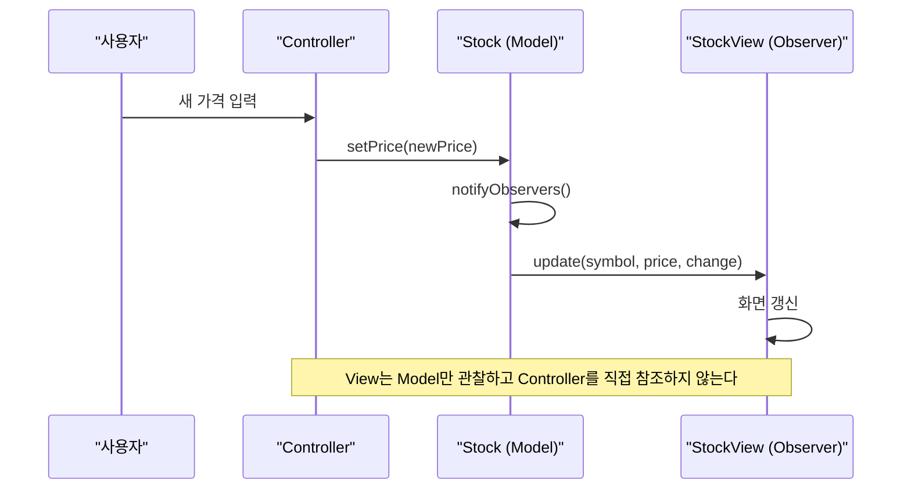

이 실습에서는 Observer 패턴을 활용하여 주식 시세 모니터링, 센서 알림 시스템 등 이벤트 주도 아키텍처를 구현합니다.

## 실습 목표

1. 주식 시세 모니터링 시스템 구현
2. 온도 센서 알림 시스템 구현
3. 성능 최적화 실습

## 과제 1: 주식 시세 모니터링

> *"한 객체의 상태가 변했을 때, 그 객체에 의존하는 다른 객체들에게 자동으로 알려주고 업데이트되도록 하는 일대다 의존성을 정의한다."* — GoF, 《Design Patterns》(1994), Observer 패턴 Intent

이 과제는 Observer 패턴의 가장 단순한 형태(Subject/Observer 인터페이스 분리)를 주식 시세라는 익숙한 도메인에 적용해보는 것이 목적이다. 화면 표시, 임계값 알림, 로그 기록처럼 성격이 다른 구독자들이 동일한 가격 변경 이벤트에 반응해야 할 때, `Stock`이 구독자의 구체 타입을 몰라도 통지할 수 있어야 한다는 점이 핵심이다.

### 기본 구조

아래는 `Stock`의 attach/detach/notifyObservers와 `StockLogger` 옵저버까지 포함한 완성 참조 구현이다. `StockDisplay`, `StockAlert`는 이 구조를 참고해 직접 구현한다.

```java
import java.util.ArrayList;
import java.util.List;

// Subject 인터페이스
public interface StockSubject {
    void attach(StockObserver observer);
    void detach(StockObserver observer);
    void notifyObservers();
}

// Observer 인터페이스
public interface StockObserver {
    void update(String symbol, double price, double change);
}

// 참조 구현: Subject 역할을 하는 구체 주식 클래스
public class Stock implements StockSubject {
    private final String symbol;
    private double price;
    private double change;
    private final List<StockObserver> observers = new ArrayList<>();

    public Stock(String symbol, double initialPrice) {
        this.symbol = symbol;
        this.price = initialPrice;
    }

    @Override
    public void attach(StockObserver observer) {
        observers.add(observer);
    }

    @Override
    public void detach(StockObserver observer) {
        observers.remove(observer);
    }

    @Override
    public void notifyObservers() {
        // 통지 도중 attach/detach가 호출될 수 있으므로 방어적으로 복사한다
        for (StockObserver observer : new ArrayList<>(observers)) {
            observer.update(symbol, price, change);
        }
    }

    public void setPrice(double newPrice) {
        this.change = newPrice - this.price;
        this.price = newPrice;
        notifyObservers();
    }
}

// 참조 구현: 로그만 남기는 가장 단순한 Observer
public class StockLogger implements StockObserver {
    @Override
    public void update(String symbol, double price, double change) {
        System.out.printf("[LOG] %s: $%.2f (%+.2f)%n", symbol, price, change);
    }
}
```

### 구현 과제
- StockDisplay, StockAlert 옵저버 구현 (위 StockLogger를 참고)
- 여러 주식 동시 모니터링 기능

## 과제 2: 온도 센서 알림

이 과제는 단순 통지가 아니라 조건부 통지(임계값을 넘었을 때만 반응)를 Observer 구조 위에 얹는 감각을 익히는 것이 목적이다. `TemperatureSensor`는 값이 바뀌었다는 사실만 알리고, 임계값 판단과 알림 채널 선택은 각 Observer가 책임진다는 역할 분리에 주목한다. attach/detach/notifyObservers는 과제 1의 `Stock`과 동일한 방식으로 이미 완성해 두었으니, 이번 과제에서는 그 위에 얹을 조건부 로직(임계값, 채널, 빈도 제한)에 집중한다.

### 기본 구조
```java
import java.util.ArrayList;
import java.util.List;

public class TemperatureSensor {
    private double temperature;
    private final List<TemperatureObserver> observers = new ArrayList<>();

    public void attach(TemperatureObserver observer) {
        observers.add(observer);
    }

    public void detach(TemperatureObserver observer) {
        observers.remove(observer);
    }

    public void setTemperature(double temperature) {
        this.temperature = temperature;
        notifyObservers();
    }

    private void notifyObservers() {
        // 통지 도중 attach/detach가 호출될 수 있으므로 방어적으로 복사한다
        for (TemperatureObserver observer : new ArrayList<>(observers)) {
            observer.onTemperatureChanged(temperature);
        }
    }
}

public interface TemperatureObserver {
    void onTemperatureChanged(double temperature);
}
```

### 구현 과제
- 임계값 기반 알림 시스템 — `onTemperatureChanged` 내부에서 임계값을 넘었을 때만 실제 알림을 발생시키는 Observer 구현
- 다양한 알림 채널 (이메일, SMS, 로그)
- 알림 빈도 제한 기능

## 과제 3: 성능 최적화

이 과제는 Observer 패턴을 실서비스에 적용할 때 마주치는 두 가지 문제 — 등록 해제를 잊어 발생하는 메모리 누수, 동기 통지로 인한 호출 스레드 블로킹 — 을 완화하는 기법을 다룬다.

**WeakReference를 언제 쓸 것인가**: WeakReference는 detach() 호출을 잊어도 GC가 알아서 정리해준다는 장점이 있지만, 정리 시점이 GC 타이밍에 좌우되어 예측 불가능하고 notifyObservers()마다 죽은 참조를 순회하며 걸러내는 오버헤드가 붙는다. Subject를 attach한 코드가 자신의 생명주기를 명확히 통제할 수 있다면(예: 화면이 닫힐 때 확실히 detach를 호출할 수 있는 UI 컴포넌트) 명시적 해제가 더 예측 가능하고 저렴하다. 반대로 Subject가 전역 싱글턴이나 장수명 캐시처럼 Observer보다 훨씬 오래 살아남고 호출자가 detach를 안정적으로 보장하기 어려운 구조라면, WeakReference로 누수를 방지하는 편이 안전하다.

| 선택 기준 | WeakReference | 명시적 해제(detach) |
|----------|---------------|---------------------|
| Observer 생명주기 통제 | 호출자가 통제하기 어려움 | 호출자가 명확히 통제 가능 |
| Subject 수명 | Observer보다 훨씬 김(싱글턴, 캐시) | Observer와 비슷하거나 짧음 |
| 정리 시점 | GC 타이밍에 의존, 예측 불가 | detach 호출 즉시, 예측 가능 |
| 런타임 오버헤드 | notifyObservers마다 죽은 참조 스캔 | 없음 |
| 실수 시 위험 | 없음(자동 회수) | detach 누락 시 누수 |
| 적합한 상황 | 전역 캐시, 이벤트 버스 | UI 컴포넌트, 명확한 스코프 객체 |

### WeakReference Observer

이 예시는 별도의 `Observer` 타입을 새로 만들지 않고, 과제 1에서 정의한 `StockSubject`/`StockObserver`를 그대로 구현한다. `update`의 시그니처가 `update(String symbol, double price, double change)`이므로, `Stock`처럼 symbol/price/change 필드를 두고 통지 시 이 값을 넘긴다.

```java
import java.lang.ref.WeakReference;
import java.util.ArrayList;
import java.util.Iterator;
import java.util.List;

// StockSubject/StockObserver(위 과제 1 정의)를 구현하는 WeakReference 기반 Subject
public class WeakReferenceStock implements StockSubject {
    private final String symbol;
    private double price;
    private double change;
    private final List<WeakReference<StockObserver>> observers = new ArrayList<>();

    public WeakReferenceStock(String symbol, double initialPrice) {
        this.symbol = symbol;
        this.price = initialPrice;
    }

    @Override
    public void attach(StockObserver observer) {
        observers.add(new WeakReference<>(observer));
    }

    @Override
    public void detach(StockObserver observer) {
        observers.removeIf(ref -> ref.get() == observer);
    }

    @Override
    public void notifyObservers() {
        Iterator<WeakReference<StockObserver>> iterator = observers.iterator();
        while (iterator.hasNext()) {
            WeakReference<StockObserver> ref = iterator.next();
            StockObserver observer = ref.get();

            if (observer == null) {
                iterator.remove(); // GC된 Observer 제거
            } else {
                observer.update(symbol, price, change);
            }
        }
    }

    public void setPrice(double newPrice) {
        this.change = newPrice - this.price;
        this.price = newPrice;
        notifyObservers();
    }
}
```

### 비동기 Observer

통지 자체는 즉시 반환하고, 실제 처리는 별도 스레드로 넘겨 호출 스레드(대개 Subject가 setPrice 등을 호출한 스레드)를 블로킹하지 않는다. `processUpdate`는 여기서 실제로 무거운 작업(가격 이력 집계, 알림 발송 등)을 수행하는 자리이며, 비동기 실행 중 발생한 예외가 조용히 삼켜지지 않도록 명시적으로 잡아 로깅해야 한다.

```java
import java.util.concurrent.ExecutorService;
import java.util.concurrent.Executors;

// 위 StockObserver 인터페이스(update(symbol, price, change))를 그대로 구현한다
public class AsyncObserver implements StockObserver {
    private final ExecutorService executor = Executors.newSingleThreadExecutor();

    @Override
    public void update(String symbol, double price, double change) {
        executor.submit(() -> {
            try {
                processUpdate(symbol, price, change);
            } catch (Exception e) {
                // 비동기 작업의 예외는 호출 스레드로 전파되지 않으므로 반드시 여기서 처리한다
                System.err.println("AsyncObserver failed to process update: " + e.getMessage());
            }
        });
    }

    private void processUpdate(String symbol, double price, double change) {
        // 이 자리에서 실제로는 가격 이력 집계, 알림 발송 등 무거운 작업을 수행한다.
        // 여기서는 단순화를 위해 콘솔 출력으로 대체한다.
        System.out.printf("[Async] %s price change recorded: $%.2f (%+.2f)%n",
            symbol, price, change);
    }
}
```

## 완성도 체크리스트

아래 체크리스트는 과제 1~3에서 다룬 결함을 실제로 재현해 검증했는지 확인하는 용도다. 예를 들어 "메모리 누수 시나리오 테스트" 항목은 `WeakReferenceStock` 없이 순수 `Stock`에 10,000개의 Observer를 attach만 하고 detach하지 않은 채 힙 덤프를 떠 보면, 과제 3에서 설명한 강한 참조로 인한 누수가 실제로 관찰되는지 확인하라는 뜻이다. 체크박스에 표시하기 전에 해당 시나리오를 코드로 직접 재현해 보는 것을 권장한다.

### 기본 구현
- [ ] Subject/Observer 인터페이스 구현 — `Stock`이 구체 Observer 타입을 몰라도 `StockObserver` 인터페이스만으로 통지할 수 있는지 확인
- [ ] 다양한 Observer 구현체 작성 — Display/Alert/Logger처럼 반응 방식이 다른 Observer가 동일한 인터페이스로 등록되는지 확인
- [ ] 동적 Observer 추가/제거 기능 — 실행 중에 attach/detach를 호출해도 다른 Observer의 통지가 깨지지 않는지 확인
- [ ] 예외 처리 (Observer 실패 시) — 하나의 Observer에서 예외가 발생해도 나머지 Observer가 정상 통지받는지 확인

### 고급 기능
- [ ] WeakReference 기반 메모리 누수 방지 — detach를 호출하지 않은 Observer가 GC 이후 목록에서 자동으로 사라지는지 확인
- [ ] 비동기 알림 처리 — 통지가 호출 스레드를 블로킹하지 않고 별도 스레드에서 처리되는지 확인
- [ ] 알림 필터링 및 우선순위 — 조건에 맞지 않는 이벤트는 걸러지고, 우선순위가 높은 Observer가 먼저 통지받는지 확인
- [ ] 성능 모니터링 및 최적화 — Observer 수 증가에 따른 통지 시간을 실측했는지 확인

### 테스트
- [ ] 다수 Observer 성능 테스트 — 수천 개 Observer 등록 시에도 통지 시간이 선형적으로 증가하는지 확인
- [ ] 메모리 누수 시나리오 테스트 — detach 없이 Observer를 반복 생성해도 힙 사용량이 계속 늘지 않는지 확인
- [ ] 동시성 테스트 — 여러 스레드가 동시에 attach/detach/notify를 호출해도 예외나 데이터 손상이 없는지 확인

## 추가 도전 과제

1. EventBus 패턴으로 확장
2. Reactive Streams 연계
3. 분산 Observer 시스템
4. 패턴 조합 (Observer + Strategy + Command)

## 실무 적용 예시

### MVC 아키텍처와 Observer

Model이 Subject, View가 Observer를 맡는 이유와 Swing/Spring/Android 각 프레임워크가 이를 어떻게 구현하는지는 [이론편의 "실무 프레임워크에서의 Observer 패턴"](/post/design-patterns/observer-event-driven-architecture/)에서 이미 다뤘으므로 여기서 다시 설명하지 않는다. 이 실습에서는 그 이론을 과제 1의 `StockSubject`/`StockObserver`에 직접 적용해본다. `java.util.Observable`/`Observer`는 Java 9부터 `@Deprecated`이므로 새 코드에서는 사용하지 않는다.

#### 구현 과제
- `Stock`을 Model로 두고, 화면 출력만 담당하는 `StockView`를 `StockObserver`로 구현한다(과제 1의 `StockLogger`와 동일한 인터페이스를 그대로 따른다).
- Controller 역할의 클래스가 사용자 입력(예: 콘솔에서 받은 새 가격)을 받아 `Stock.setPrice()`를 호출하도록 구성하고, `StockView`는 `Stock`만 관찰할 뿐 Controller를 직접 참조하지 않도록 한다.
- 완성 후 Controller → Model → View로 이어지는 호출 흐름이 단방향인지, View를 교체해도 Model과 Controller 코드가 바뀌지 않는지 확인한다.



### Spring Events

이론편에서 `ApplicationEventPublisher`/`@EventListener`를 이용한 발행-구독 메커니즘 자체는 이미 다뤘으므로 여기서 반복하지 않는다. 대신 실무에서 자주 발생하는 오개념 하나를 짚는다 — `@EventListener`는 리스너로 등록할 **메서드**에 붙여야 한다. `@EventListener`의 선언(`@Target({ElementType.METHOD, ElementType.ANNOTATION_TYPE})`)은 클래스 선언에는 애초에 붙을 수 없도록 제한되어 있으므로, 클래스에 붙이면 "annotation type not applicable to this kind of declaration"라는 컴파일 오류로 즉시 드러난다 — 조용히 넘어가는 실수가 아니다.

실무에서 실제로 자주 발생하는, 훨씬 더 성가신 경우는 따로 있다. 메서드에 `@EventListener`를 정확히 붙였는데도 리스너가 등록되지 않는 경우인데, 원인은 그 클래스 자체가 Spring 빈으로 관리되지 않을 때다. 아래 `EmailService`는 문법적으로도 아무 문제가 없고 어노테이션 위치도 올바르지만, `@Component`(또는 다른 스테레오타입 어노테이션)가 없어 컴포넌트 스캔 대상이 아니므로 `EventListenerMethodProcessor`가 이 클래스를 아예 훑지 않는다. 그 결과 `handleOrderCreated`는 컴파일도 되고 어노테이션 위치도 맞지만 이벤트 리스너로 등록되지 않는다.

```java
// 흔한 실수: 메서드 위치는 맞지만 클래스가 Spring 빈으로 등록되지 않음
// -> 컴파일은 되지만 컴포넌트 스캔 대상이 아니므로 handleOrderCreated가
//    이벤트 리스너로 등록되지 않는다
// (OrderCreatedEvent, sendConfirmationEmail 정의는 아래 수정본 참고)
public class EmailService {
    @EventListener
    public void handleOrderCreated(OrderCreatedEvent event) {
        sendConfirmationEmail(event.getOrder());
    }
}
```

```java
import org.springframework.beans.factory.annotation.Autowired;
import org.springframework.context.ApplicationEventPublisher;
import org.springframework.context.event.EventListener;
import org.springframework.stereotype.Component;

// 이 예시를 위한 최소 도메인 타입 (Spring이 제공하는 타입이 아니라 이 글에서 정의)
class Order {
    private final String id;

    public Order(String id) {
        this.id = id;
    }

    public String getId() {
        return id;
    }
}

class OrderCreatedEvent {
    private final Order order;

    public OrderCreatedEvent(Order order) {
        this.order = order;
    }

    public Order getOrder() {
        return order;
    }
}

@Component
public class OrderService {
    @Autowired
    private ApplicationEventPublisher eventPublisher;

    public void processOrder(Order order) {
        // 주문 처리 로직
        eventPublisher.publishEvent(new OrderCreatedEvent(order));
    }
}

// 수정: @Component를 추가해 Spring 빈으로 등록되어야 컴포넌트 스캔에
// 걸리고, 그래야 메서드에 붙은 @EventListener도 실제로 등록된다
@Component
public class EmailService {
    @EventListener
    public void handleOrderCreated(OrderCreatedEvent event) {
        sendConfirmationEmail(event.getOrder());
    }

    private void sendConfirmationEmail(Order order) {
        System.out.println("Confirmation email sent for order " + order.getId());
    }
}
``` 