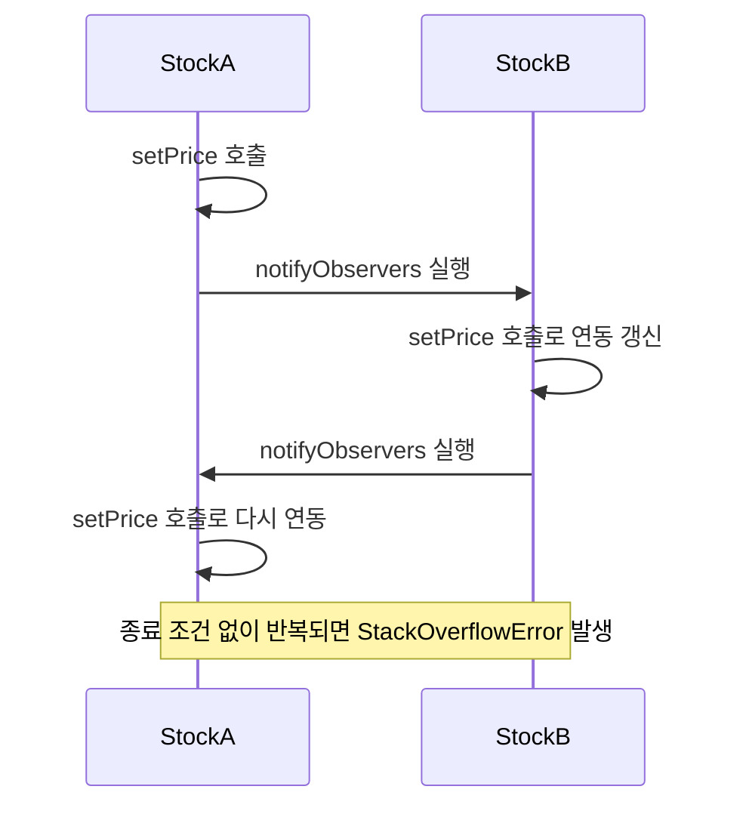

Observer 패턴을 통해 이벤트 기반 아키텍처의 기초를 탐구합니다. 느슨한 결합과 일대다 의존성 관리로 반응형 시스템을 구축하는 방법을 학습합니다.

## 서론: 변화에 반응하는 시스템의 미학

> *"좋은 소프트웨어는 변화에 민감하게 반응한다. Observer 패턴은 이런 반응성을 우아하게 구현하는 가장 근본적인 방법이다."*

현대 소프트웨어는 **끊임없이 변화하는 환경**에서 동작합니다. 사용자의 클릭, 주식 가격의 변동, 센서 데이터의 변화, 시스템 상태의 업데이트... 이 모든 **이벤트들에 즉시 반응**하는 것이 현대 애플리케이션의 핵심입니다.

**Observer 패턴**은 이런 **이벤트 기반 아키텍처**의 출발점입니다. 1994년 GoF가 정의한 이 패턴은 단순하지만 강력합니다:

> *"한 객체의 상태가 변했을 때, 그 객체에 의존하는 다른 객체들에게 자동으로 알려주고 업데이트되도록 하는 일대다 의존성을 정의한다."*

### Observer 패턴이 해결하는 근본적 문제:

```java
// Observer 패턴 없이 구현한다면?
public class BadStockSystem {
    private double stockPrice = 100.0;
    
    // 문제: 새로운 Observer 추가 시마다 코드 수정 필요
    private StockDisplay display1;
    private StockDisplay display2; 
    private StockAlert alert;
    private TradingBot bot;
    private AnalyticsEngine analytics;
    
    public void updatePrice(double newPrice) {
        this.stockPrice = newPrice;
        
        // 😱 모든 의존 객체를 하나씩 호출해야 함
        if (display1 != null) display1.update(stockPrice);
        if (display2 != null) display2.update(stockPrice);
        if (alert != null) alert.update(stockPrice);
        if (bot != null) bot.update(stockPrice);
        if (analytics != null) analytics.update(stockPrice);
        
        // 새로운 Observer 추가 시마다 이 코드를 수정해야 함!
        // 강한 결합, 개방-폐쇄 원칙 위배, 확장성 제로
    }
}
```

이런 문제를 어떻게 우아하게 해결할 수 있을까요?

## Observer 패턴의 핵심 구조와 철학

### 패턴의 핵심 아이디어

Observer 패턴의 핵심은 <strong>"느슨한 결합(Loose Coupling)"</strong>을 통한 <strong>"일대다 의존성 관리"</strong>입니다.

```java
import java.util.List;
import java.util.ArrayList;
import java.util.Map;
import java.util.HashMap;
import java.time.LocalDateTime;
import java.time.format.DateTimeFormatter;
import java.text.DecimalFormat;

// Observer 패턴으로 우아하게 해결
// 1. Subject 인터페이스 - 관찰 대상
interface Subject {
    void attach(Observer observer);    // 관찰자 등록
    void detach(Observer observer);    // 관찰자 해제  
    void notifyObservers();           // 모든 관찰자에게 통지
}

// 2. Observer 인터페이스 - 관찰자
interface Observer {
    void update(Subject subject);      // 상태 변화 시 호출됨
}

// 3. ConcreteSubject - 구체적인 관찰 대상
class Stock implements Subject {
    private List<Observer> observers = new ArrayList<>();
    private String symbol;
    private double price;
    private double previousPrice;
    private LocalDateTime lastUpdate;
    
    public Stock(String symbol, double initialPrice) {
        this.symbol = symbol;
        this.price = initialPrice;
        this.previousPrice = initialPrice;
        this.lastUpdate = LocalDateTime.now();
    }
    
    @Override
    public void attach(Observer observer) {
        if (!observers.contains(observer)) {
            observers.add(observer);
            System.out.println("Observer attached to " + symbol);
        }
    }
    
    @Override
    public void detach(Observer observer) {
        if (observers.remove(observer)) {
            System.out.println("Observer detached from " + symbol);
        }
    }
    
    @Override
    public void notifyObservers() {
        System.out.println("Notifying " + observers.size() + " observers of " + symbol);
        
        // 방어적 복사를 통한 동시 수정 문제 방지
        List<Observer> observersCopy = new ArrayList<>(observers);
        
        for (Observer observer : observersCopy) {
            try {
                observer.update(this);
            } catch (Exception e) {
                System.err.println("Error notifying observer: " + e.getMessage());
                // 에러 발생한 Observer는 자동으로 제거할 수도 있음
            }
        }
    }
    
    // 비즈니스 로직 - 가격 변경
    public void setPrice(double newPrice) {
        if (Double.compare(this.price, newPrice) != 0) {
            this.previousPrice = this.price;
            this.price = newPrice;
            this.lastUpdate = LocalDateTime.now();
            
            // 상태 변경 시 자동으로 모든 Observer에게 통지
            notifyObservers();
        }
    }
    
    // Getter 메서드들
    public double getPrice() { return price; }
    public double getPreviousPrice() { return previousPrice; }
    public double getChange() { return price - previousPrice; }
    public double getChangePercent() { 
        return previousPrice != 0 ? (getChange() / previousPrice) * 100 : 0; 
    }
    public String getSymbol() { return symbol; }
    public LocalDateTime getLastUpdate() { return lastUpdate; }
    public int getObserverCount() { return observers.size(); }
}

// 4. ConcreteObserver들 - 다양한 관찰자 구현
class StockDisplay implements Observer {
    private String displayName;
    private DecimalFormat priceFormat = new DecimalFormat("$#,##0.00");
    private DecimalFormat percentFormat = new DecimalFormat("#0.00%");
    
    public StockDisplay(String displayName) {
        this.displayName = displayName;
    }
    
    @Override
    public void update(Subject subject) {
        if (subject instanceof Stock) {
            Stock stock = (Stock) subject;
            double change = stock.getChange();
            String trend = change > 0 ? "📈" : change < 0 ? "📉" : "➡️";
            
            System.out.printf("[%s] %s %s %s (%.2f%%) at %s\n",
                displayName,
                trend,
                stock.getSymbol(),
                priceFormat.format(stock.getPrice()),
                stock.getChangePercent(),
                stock.getLastUpdate().format(DateTimeFormatter.ofPattern("HH:mm:ss"))
            );
        }
    }
}

class StockAlert implements Observer {
    private double upperThreshold;
    private double lowerThreshold;
    private String alertChannel;
    
    public StockAlert(double lowerThreshold, double upperThreshold, String alertChannel) {
        this.lowerThreshold = lowerThreshold;
        this.upperThreshold = upperThreshold;
        this.alertChannel = alertChannel;
    }
    
    @Override
    public void update(Subject subject) {
        if (subject instanceof Stock) {
            Stock stock = (Stock) subject;
            double price = stock.getPrice();
            
            if (price > upperThreshold) {
                sendAlert(stock, "HIGH", "Price exceeded upper threshold!");
            } else if (price < lowerThreshold) {
                sendAlert(stock, "LOW", "Price fell below lower threshold!");
            }
        }
    }
    
    private void sendAlert(Stock stock, String level, String message) {
        System.out.printf("🚨 [%s ALERT via %s] %s: %s (Current: $%.2f)\n",
            level, alertChannel, stock.getSymbol(), message, stock.getPrice());
    }
}

class TradingBot implements Observer {
    private String strategyName;
    private double buyThreshold;
    private double sellThreshold;
    private Map<String, Integer> portfolio = new HashMap<>();
    
    public TradingBot(String strategyName, double buyThreshold, double sellThreshold) {
        this.strategyName = strategyName;
        this.buyThreshold = buyThreshold;
        this.sellThreshold = sellThreshold;
    }
    
    @Override
    public void update(Subject subject) {
        if (subject instanceof Stock) {
            Stock stock = (Stock) subject;
            String symbol = stock.getSymbol();
            double changePercent = stock.getChangePercent();
            
            if (changePercent < -buyThreshold) {
                // 가격이 크게 떨어지면 매수
                buyStock(symbol, stock.getPrice());
            } else if (changePercent > sellThreshold) {
                // 가격이 크게 오르면 매도
                sellStock(symbol, stock.getPrice());
            }
        }
    }
    
    private void buyStock(String symbol, double price) {
        int shares = 100; // 간단히 100주씩
        portfolio.put(symbol, portfolio.getOrDefault(symbol, 0) + shares);
        System.out.printf("🤖 [%s] BUY: %d shares of %s at $%.2f\n",
            strategyName, shares, symbol, price);
    }
    
    private void sellStock(String symbol, double price) {
        int currentShares = portfolio.getOrDefault(symbol, 0);
        if (currentShares > 0) {
            int sharesToSell = Math.min(100, currentShares);
            portfolio.put(symbol, currentShares - sharesToSell);
            System.out.printf("🤖 [%s] SELL: %d shares of %s at $%.2f\n",
                strategyName, sharesToSell, symbol, price);
        }
    }
}

class AnalyticsEngine implements Observer {
    private List<Double> priceHistory = new ArrayList<>();
    private String analysisType;
    
    public AnalyticsEngine(String analysisType) {
        this.analysisType = analysisType;
    }
    
    @Override
    public void update(Subject subject) {
        if (subject instanceof Stock) {
            Stock stock = (Stock) subject;
            priceHistory.add(stock.getPrice());
            
            // 최근 10개 데이터만 유지
            if (priceHistory.size() > 10) {
                priceHistory.remove(0);
            }
            
            if (priceHistory.size() >= 5) {
                performAnalysis(stock);
            }
        }
    }
    
    private void performAnalysis(Stock stock) {
        double average = priceHistory.stream().mapToDouble(Double::doubleValue).average().orElse(0);
        double volatility = calculateVolatility();
        
        System.out.printf("📊 [%s] %s Analysis: Avg=%.2f, Volatility=%.2f%%\n",
            analysisType, stock.getSymbol(), average, volatility);
    }
    
    private double calculateVolatility() {
        if (priceHistory.size() < 2) return 0;
        
        double avg = priceHistory.stream().mapToDouble(Double::doubleValue).average().orElse(0);
        double variance = priceHistory.stream()
            .mapToDouble(price -> Math.pow(price - avg, 2))
            .average().orElse(0);
        
        return Math.sqrt(variance) / avg * 100; // 변동성을 백분율로
    }
}

// 사용 예시: 실제 주식 거래 시뮬레이션
public class ObserverPatternDemo {
    public static void main(String[] args) throws InterruptedException {
        // 1. Subject 생성 (관찰 대상)
        Stock appleStock = new Stock("AAPL", 150.00);
        
        // 2. 다양한 Observer들 생성 및 등록
        StockDisplay mainDisplay = new StockDisplay("Main Dashboard");
        StockDisplay mobileApp = new StockDisplay("Mobile App");
        StockAlert priceAlert = new StockAlert(140.0, 160.0, "SMS");
        TradingBot dayTrader = new TradingBot("DayTrader", 2.0, 3.0); // 2% 하락시 매수, 3% 상승시 매도
        AnalyticsEngine technicalAnalysis = new AnalyticsEngine("Technical");
        
        // Observer 등록
        appleStock.attach(mainDisplay);
        appleStock.attach(mobileApp);
        appleStock.attach(priceAlert);
        appleStock.attach(dayTrader);
        appleStock.attach(technicalAnalysis);
        
        System.out.println("=== Stock Trading Simulation Started ===\n");
        
        // 3. 주식 가격 변화 시뮬레이션
        double[] priceChanges = {152.50, 148.00, 155.00, 162.00, 158.50, 145.00, 167.00};
        
        for (double newPrice : priceChanges) {
            System.out.println(">>> Price Update Event <<<");
            appleStock.setPrice(newPrice);
            System.out.println();
            Thread.sleep(1000); // 1초 간격
        }
        
        // 4. Observer 동적 제거 테스트
        System.out.println("=== Removing Mobile App Observer ===");
        appleStock.detach(mobileApp);
        
        appleStock.setPrice(170.00);
        
        System.out.println("\n=== Final Statistics ===");
        System.out.println("Total observers: " + appleStock.getObserverCount());
        System.out.println("Final price: $" + appleStock.getPrice());
        System.out.println("Total change: $" + appleStock.getChange());
    }
}

/*
출력 예시:
=== Stock Trading Simulation Started ===

>>> Price Update Event <<<
Notifying 5 observers of AAPL
[Main Dashboard] 📈 AAPL $152.50 (1.67%) at 14:23:15
[Mobile App] 📈 AAPL $152.50 (1.67%) at 14:23:15
📊 [Technical] AAPL Analysis: Avg=151.25, Volatility=1.12%

>>> Price Update Event <<<
Notifying 5 observers of AAPL
[Main Dashboard] 📉 AAPL $148.00 (-2.95%) at 14:23:16
[Mobile App] 📉 AAPL $148.00 (-2.95%) at 14:23:16
🤖 [DayTrader] BUY: 100 shares of AAPL at $148.00
📊 [Technical] AAPL Analysis: Avg=150.17, Volatility=2.34%
...
*/
```

### Observer 패턴의 핵심 장점

```java
// Observer 패턴이 제공하는 핵심 가치들

public class ObserverPatternBenefits {
    
    /*
    1. 느슨한 결합 (Loose Coupling)
    - Subject는 Observer의 구체적인 타입을 몰라도 됨
    - Observer는 Subject의 내부 구현을 몰라도 됨
    - 서로의 존재만 인터페이스를 통해 알고 있음
    */
    
    /*
    2. 개방-폐쇄 원칙 (Open-Closed Principle) 
    - 새로운 Observer 추가: Subject 코드 변경 없음
    - 새로운 Subject 추가: 기존 Observer 코드 변경 없음
    - 확장에는 열려있고, 수정에는 닫혀있음
    */
    
    /*
    3. 런타임 관계 설정
    - 프로그램 실행 중에 Observer 등록/해제 가능
    - 동적인 의존성 관리
    - 사용자 설정에 따른 유연한 기능 활성화
    */
    
    /*
    4. 브로드캐스트 통신
    - 하나의 이벤트로 여러 객체에게 동시 통지
    - 효율적인 일대다 통신
    - 이벤트 기반 아키텍처의 기초
    */
    
    // 실제 활용 예시
    public void demonstrateBenefits() {
        Stock stock = new Stock("TSLA", 200.0);
        
        // 런타임에 동적으로 Observer 추가
        if (UserPreferences.isNotificationEnabled()) {
            stock.attach(new StockDisplay("User Dashboard"));
        }
        
        if (UserPreferences.isAlertEnabled()) {
            stock.attach(new StockAlert(180.0, 220.0, "Email"));
        }
        
        if (UserPreferences.isAutoTradingEnabled()) {
            stock.attach(new TradingBot("AutoTrader", 5.0, 5.0));
        }
        
        // 하나의 이벤트로 모든 활성화된 Observer에게 통지
        stock.setPrice(195.0);
    }
}
```

## Push vs Pull 모델: 두 가지 철학적 접근

### Push Model: "내가 너에게 줄게"

Push 모델에서는 Subject가 Observer에게 필요한 모든 데이터를 **적극적으로 전달**합니다.

```java
import java.util.List;
import java.util.ArrayList;
import java.time.LocalDateTime;

// Push Model: Subject가 데이터를 밀어넣음
interface PushObserver {
    void update(String symbol, double price, double previousPrice, 
                double change, double volume, LocalDateTime timestamp);
}

class PushStock {
    private List<PushObserver> observers = new ArrayList<>();
    private String symbol;
    private double price, previousPrice;
    private double volume;
    private LocalDateTime lastUpdate;
    
    public void updateMarketData(double newPrice, double newVolume) {
        previousPrice = price;
        price = newPrice;
        volume = newVolume;
        lastUpdate = LocalDateTime.now();
        double change = price - previousPrice;
        
        // Push: 모든 관련 정보를 한 번에 전달
        for (PushObserver observer : observers) {
            observer.update(symbol, price, previousPrice, change, volume, lastUpdate);
        }
    }
}

class QuickTrader implements PushObserver {
    @Override
    public void update(String symbol, double price, double previousPrice, 
                      double change, double volume, LocalDateTime timestamp) {
        // 모든 데이터가 이미 전달되어 즉시 처리 가능
        if (Math.abs(change) > 1.0 && volume > 100000) {
            executeTrade(symbol, price, change > 0 ? "SELL" : "BUY");
        }
    }
    
    private void executeTrade(String symbol, double price, String action) {
        System.out.printf("[Quick] %s: %s at $%.2f\n", action, symbol, price);
    }
}

/*
Push Model 장점:
- 빠른 응답: Observer가 즉시 모든 정보를 받음
- 단순한 Observer: 복잡한 데이터 조회 로직 불필요
- 네트워크 효율성: 한 번의 호출로 모든 정보 전달

Push Model 단점:
- 불필요한 데이터 전송: Observer가 사용하지 않는 데이터도 전달
- 높은 결합도: Subject가 Observer의 요구사항을 알아야 함
- 인터페이스 변경 어려움: 새 데이터 추가 시 모든 Observer 수정
*/
```

`QuickTrader`는 `change`와 `volume`만 쓰지만 Subject는 `symbol`, `previousPrice`, `timestamp`까지 다섯 개 인자를 항상 함께 밀어넣는다. Observer마다 실제로 필요한 데이터가 다르다면 이 방식은 곧 한계에 부딪힌다. Pull 모델은 이 낭비를 반대 방향에서 해결한다.

### Pull Model: "내가 필요할 때 가져갈게"

Pull 모델에서는 Observer가 Subject로부터 필요한 데이터를 **선택적으로 가져옵니다**.

```java
import java.util.List;
import java.util.ArrayList;
import java.util.Map;
import java.util.HashMap;
import java.time.LocalDateTime;

// Pull Model: Observer가 필요한 데이터를 끌어옴
interface PullObserver {
    void update(Subject subject); // Subject 참조만 전달
}

class PullStock implements Subject {
    private List<PullObserver> observers = new ArrayList<>();
    private String symbol;
    private double price, previousPrice;
    private double volume, marketCap;
    private LocalDateTime lastUpdate;
    private Map<String, Object> additionalData = new HashMap<>();
    
    public void updateMarketData(double newPrice, double newVolume) {
        previousPrice = price;
        price = newPrice;
        volume = newVolume;
        lastUpdate = LocalDateTime.now();
        
        // Pull: 변경 사실만 통지
        notifyObservers();
    }
    
    @Override
    public void notifyObservers() {
        for (PullObserver observer : observers) {
            observer.update(this); // this만 전달
        }
    }
    
    // Pull을 위한 다양한 getter 메서드들
    public double getPrice() { return price; }
    public double getPreviousPrice() { return previousPrice; }
    public double getChange() { return price - previousPrice; }
    public double getVolume() { return volume; }
    public String getSymbol() { return symbol; }
    public LocalDateTime getLastUpdate() { return lastUpdate; }
    public double getMarketCap() { return marketCap; }
    public Object getAdditionalData(String key) { return additionalData.get(key); }
}

class SmartAnalyzer implements PullObserver {
    private String analysisType;
    
    public SmartAnalyzer(String analysisType) {
        this.analysisType = analysisType;
    }
    
    @Override
    public void update(Subject subject) {
        if (subject instanceof PullStock) {
            PullStock stock = (PullStock) subject;
            
            // 분석 타입에 따라 필요한 데이터만 선택적으로 pull
            switch (analysisType) {
                case "PRICE_ONLY":
                    double price = stock.getPrice(); // 가격만 필요
                    analyzePriceTrend(price);
                    break;
                    
                case "VOLUME_ANALYSIS":
                    double volume = stock.getVolume(); // 거래량만 필요
                    double change = stock.getChange();
                    analyzeVolumePattern(volume, change);
                    break;
                    
                case "COMPREHENSIVE":
                    // 포괄적 분석은 여러 데이터 필요
                    performComprehensiveAnalysis(stock);
                    break;
            }
        }
    }
    
    private void analyzePriceTrend(double price) {
        System.out.printf("📈 Price Analysis: Current price $%.2f\n", price);
    }
    
    private void analyzeVolumePattern(double volume, double change) {
        System.out.printf("📊 Volume Analysis: %.0f shares, change $%.2f\n", volume, change);
    }
    
    private void performComprehensiveAnalysis(PullStock stock) {
        System.out.printf("🔍 Comprehensive: %s - Price: $%.2f, Volume: %.0f, Cap: $%.2fB\n",
            stock.getSymbol(), stock.getPrice(), stock.getVolume(), stock.getMarketCap() / 1_000_000_000);
    }
}

/*
Pull Model 장점:
- 낮은 결합도: Subject는 Observer의 요구사항을 몰라도 됨
- 유연성: Observer가 필요한 데이터만 선택적으로 가져감
- 확장성: 새로운 데이터 추가 시 기존 Observer 영향 없음
- 지연 계산: 필요할 때만 expensive operation 수행

Pull Model 단점:
- 잠재적 성능 오버헤드: 여러 번의 메서드 호출 필요
- 복잡한 Observer: 데이터 조회 로직을 Observer가 구현해야 함
- 일관성 문제: 여러 번 호출 사이에 데이터가 변경될 수 있음
*/
```

### 하이브리드 접근: 최선의 선택

실제 시스템에서는 두 모델의 장점을 결합한 하이브리드 접근을 자주 사용합니다.

```java
// 하이브리드 모델: 중요한 데이터는 Push, 상세 데이터는 Pull
interface HybridObserver {
    void update(String symbol, double price, double change, Subject subject);
}

class HybridStock implements Subject {
    private List<HybridObserver> observers = new ArrayList<>();
    // ... 필드들
    
    public void updatePrice(double newPrice) {
        double previousPrice = this.price;
        this.price = newPrice;
        double change = newPrice - previousPrice;
        
        // 핵심 데이터는 Push로 즉시 전달 + 상세 조회를 위한 Subject 참조도 함께
        for (HybridObserver observer : observers) {
            observer.update(symbol, price, change, this);
        }
    }
}

class AdaptiveTrader implements HybridObserver {
    @Override
    public void update(String symbol, double price, double change, Subject subject) {
        // 1. Push로 받은 핵심 데이터로 빠른 판단
        if (Math.abs(change) > 2.0) {
            // 긴급 상황: Push 데이터만으로 즉시 대응
            emergencyTrade(symbol, price, change);
        } else {
            // 2. 일반 상황: Pull로 추가 데이터 조회 후 신중한 판단
            HybridStock stock = (HybridStock) subject;
            double volume = stock.getVolume();
            double marketCap = stock.getMarketCap();
            
            normalTrade(symbol, price, change, volume, marketCap);
        }
    }
    
    private void emergencyTrade(String symbol, double price, double change) {
        System.out.printf("⚡ Emergency Trade: %s at $%.2f (%.2f change)\n", 
                          symbol, price, change);
    }
    
    private void normalTrade(String symbol, double price, double change, 
                           double volume, double marketCap) {
        System.out.printf("🤔 Analyzed Trade: %s - considering all factors\n", symbol);
    }
}
```

### 흔한 오해: Observer를 쓰면 결합도가 항상 낮아진다는 착각

Observer 패턴을 도입하면 결합도가 자동으로 낮아진다고 오해하기 쉽지만 실제로는 조건부다. Subject와 Observer가 인터페이스로만 연결된다는 사실은 타입 의존성을 없앨 뿐, Subject가 어떤 순서로 어떤 데이터를 통지하는지에 대한 암묵적 계약(통지 순서, 타이밍, `notifyObservers()` 내부에서 예외가 전파되는지 여부 등)까지 없애주지는 않는다. 앞서 본 `PushObserver.update(symbol, price, previousPrice, change, volume, timestamp)`처럼 파라미터를 나열하는 Push 모델에서는 Subject의 내부 데이터 구조가 바뀌면 모든 Observer의 시그니처를 함께 고쳐야 하므로 오히려 결합도가 올라간다. Pull 모델도 예외는 아니다. 여러 Observer가 `getPrice()`를 서로 다른 시점에 호출하면 그 사이 값이 바뀔 수 있어, 통지 순서에 암묵적으로 의존하는 숨은 결합이 생긴다. 따라서 "Observer 패턴 = 낮은 결합도"라는 등식이 아니라, 인터페이스를 얼마나 안정적으로 설계하고 통지 계약을 얼마나 명확히 하느냐가 실제 결합도를 결정한다고 보는 것이 정확하다.

## Observer 안티패턴: Polling과 순환 통지

Observer 패턴을 안다고 해서 실무에서 항상 정석대로 적용되는 것은 아니다. Observer가 해결하려는 문제(상태 변화를 즉시, 느슨한 결합으로 전파하는 것)를 우회하거나 잘못 구현해 되레 결합도와 복잡도를 키우는 두 가지 대표적 안티패턴을 코드로 비교한다. 하나는 Observer 자체를 쓰지 않고 대신 상태를 반복 확인하는 "Polling", 다른 하나는 Observer를 쓰긴 했지만 통지 흐름을 잘못 설계해 스스로를 무한히 호출하는 "순환 통지"다.

### Polling 안티패턴: "내가 계속 물어볼게"

Observer 패턴이 정착하기 전에는 관심 있는 객체가 주기적으로 깨어나 대상의 상태를 직접 조회하고, 이전에 기억해 둔 값과 비교해 변화를 스스로 판별하는 방식이 흔했다. 이 방식은 Subject 쪽에 통지 로직을 두지 않아도 되어 겉보기엔 간단하지만, 변화가 없는 주기에도 CPU를 소비하고, 변화 시점과 감지 시점 사이에 폴링 주기만큼의 지연이 생기며, "값이 바뀌었는가"를 판단하는 로직을 Observer 수만큼 중복 구현해야 한다.

```java
import java.util.concurrent.atomic.AtomicBoolean;

// 안티패턴: Polling으로 가격 변화를 감지
class PollingTrader {
    private final Stock stock;
    private double lastKnownPrice;
    private final AtomicBoolean running = new AtomicBoolean(true);

    public PollingTrader(Stock stock) {
        this.stock = stock;
        this.lastKnownPrice = stock.getPrice();
    }

    public void startPolling() throws InterruptedException {
        while (running.get()) {
            double currentPrice = stock.getPrice();
            if (Double.compare(currentPrice, lastKnownPrice) != 0) {
                System.out.printf("Price changed: %.2f -> %.2f%n", lastKnownPrice, currentPrice);
                lastKnownPrice = currentPrice;
            }
            Thread.sleep(100); // 100ms마다 폴링
        }
    }

    public void stop() {
        running.set(false);
    }
}
```

폴링 주기를 100ms로 두면 가격이 바뀐 순간부터 최대 100ms까지 통지가 지연되고, `PollingTrader`가 10개 붙으면 10개의 스레드가 각자 100ms마다 `getPrice()`를 호출하는 유휴 트래픽이 발생한다. 반면 Observer 패턴은 `setPrice()`가 실제로 값을 바꾼 순간에만 `notifyObservers()`가 실행되므로 지연이 없고, 변화가 없는 구간에는 아무 연산도 일어나지 않는다.

| 항목 | Polling 안티패턴 | Observer 패턴 |
|------|------------------|----------------|
| 통지 시점 | 폴링 주기만큼 지연 (예: 최대 100ms) | 상태 변경 즉시 |
| 유휴 자원 소비 | 변화 없어도 주기마다 조회 | 변화 시에만 동작 |
| Observer 증가 시 부하 | Observer 수만큼 폴링 스레드/루프 증가 | `notifyObservers()` 한 번으로 전체 통지 |
| 결합 방식 | Trader가 Stock의 getter를 직접 호출 | Subject/Observer 인터페이스로 분리 |

### 순환 통지(Reentrant Notification) 안티패턴: "통지가 통지를 부른다"

두 번째 안티패턴은 Observer 패턴을 도입했지만 통지 경로를 잘못 설계해 발생한다. Observer의 `update()` 내부에서 다른 Subject의 상태를 동기적으로 변경하고, 그 변경이 다시 원래 Subject를 갱신하는 통지로 이어지면, 종료 조건 없는 호출 체인이 만들어져 스택이 무한히 쌓인다. 아래 코드는 두 종목이 서로를 관찰하며 가격을 연동시키다가 이 문제에 빠지는 예시다.

```java
// 안티패턴: Observer 내부에서 동기적으로 다른 Subject를 갱신해 순환 통지가 발생
class CorrelatedStock extends Stock {
    private CorrelatedStock pairedStock;

    public CorrelatedStock(String symbol, double initialPrice) {
        super(symbol, initialPrice);
    }

    public void pairWith(CorrelatedStock other) {
        this.pairedStock = other;
        this.attach(new Observer() {
            @Override
            public void update(Subject subject) {
                // 페어링된 종목 가격을 연동 갱신 -> 다시 notifyObservers() 호출을 유발
                double correlatedPrice = ((Stock) subject).getPrice() * 0.98;
                pairedStock.setPrice(correlatedPrice);
            }
        });
    }
}

// stockA.pairWith(stockB); stockB.pairWith(stockA); 로 상호 등록한 뒤
// stockA.setPrice(...)를 한 번만 호출해도 A -> B -> A -> B ... 로 재귀 호출이 이어져
// 결국 StackOverflowError로 종료된다.
```



가장 단순한 방어책은 통지가 진행 중인 동안 재진입을 막는 가드 플래그다.

```java
// 해결책 1: 통지 중 재진입을 막는 가드 플래그
class GuardedStock extends Stock {
    private boolean notifying = false;

    public GuardedStock(String symbol, double initialPrice) {
        super(symbol, initialPrice);
    }

    @Override
    public void notifyObservers() {
        if (notifying) {
            return; // 이미 통지가 진행 중이면 재진입 통지를 무시
        }
        notifying = true;
        try {
            super.notifyObservers();
        } finally {
            notifying = false;
        }
    }
}
```

가드 플래그는 스택 오버플로를 막아 주지만 재진입한 통지 자체를 조용히 버리므로, 그 통지가 전달하려던 갱신이 유실될 수 있다. 앞서 EventBus 절에서 본 것처럼 통지를 동기 호출이 아니라 큐에 적재한 뒤 현재 통지가 끝난 후 순차 처리하도록 비동기 디스패치로 바꾸면, 원인과 결과의 호출 스택이 분리되어 재귀 자체가 성립하지 않는다 — 재진입을 "막는" 것이 아니라 애초에 "동시에 스택에 쌓이지 않도록" 시간 축에서 분리하는 접근이다.

| 안티패턴 | 증상 | Observer 정석 대안 |
|----------|------|---------------------|
| Polling | 통지 지연, 변화 없을 때도 자원 소비 | `notifyObservers()`로 상태 변경 시점에 즉시 push |
| 순환 통지 (Reentrant Notification) | 무한 재귀, StackOverflowError | 가드 플래그로 재진입 차단, 또는 EventBus형 비동기 큐잉으로 시간 축 분리 |

## 메모리 관리와 생명주기: Observer의 숨겨진 함정

Observer 패턴의 가장 큰 함정 중 하나는 **메모리 누수**입니다. Subject가 Observer에 대한 강한 참조를 유지하면서 발생하는 문제입니다.

Subject가 Observer 리스트를 강한 참조(strong reference)로 들고 있으면, 그 Observer를 더 이상 아무도 쓰지 않아도 GC가 회수하지 못한다. 아래 예시에서 `display`는 반복문의 로컬 변수로서 스코프를 벗어나지만, `stock.attach(display)`로 등록된 참조가 살아있는 한 10,000개의 `StockDisplay` 인스턴스가 그대로 메모리에 남는다.

```java
import java.util.List;
import java.util.ArrayList;

// 문제가 있는 코드: 강한 참조로 인한 메모리 누수
public class MemoryLeakExample {
    public void demonstrate() {
        Stock stock = new Stock("AAPL", 150.0);

        for (int i = 0; i < 10000; i++) {
            StockDisplay display = new StockDisplay("Display" + i);
            stock.attach(display);

            // display는 로컬 스코프를 벗어나지만
            // stock이 강한 참조를 유지하므로 GC되지 않음!
        }

        // 10,000개의 StockDisplay 객체가 메모리에 남아있음
        System.out.println("Observers: " + stock.getObserverCount()); // 10000
    }
}
```

첫 번째 해법은 `WeakReference`로 참조 강도를 낮추는 것이다. Subject가 Observer를 `WeakReference`로만 감싸 보관하면, 다른 곳에서 더 이상 참조하지 않는 Observer는 GC 대상이 되고, 통지 시점에 `ref.get()`이 `null`을 반환하는 것으로 회수 여부를 판별해 리스트에서 제거할 수 있다.

```java
import java.util.List;
import java.util.ArrayList;
import java.util.Iterator;
import java.lang.ref.WeakReference;

// WeakReference로 해결: 참조되지 않는 Observer는 자동 회수
class WeakReferenceStock implements Subject {
    private List<WeakReference<Observer>> observers = new ArrayList<>();

    @Override
    public void attach(Observer observer) {
        observers.add(new WeakReference<>(observer));
    }

    @Override
    public void detach(Observer observer) {
        observers.removeIf(ref -> ref.get() == observer);
    }

    @Override
    public void notifyObservers() {
        Iterator<WeakReference<Observer>> iterator = observers.iterator();
        while (iterator.hasNext()) {
            WeakReference<Observer> ref = iterator.next();
            Observer observer = ref.get();

            if (observer == null) {
                iterator.remove(); // GC된 Observer 자동 제거
            } else {
                observer.update(this);
            }
        }
    }
}
```

`WeakReference`는 GC 타이밍에 의존하므로 회수 시점을 예측할 수 없다는 단점이 있다. 즉시 정리가 필요하다면 `detach()`를 명시적으로 호출하는 편이 낫고, 그마저 누락될 위험이 있다면 주기적으로 스캔해 정리하는 별도 메커니즘을 둘 수 있다.

```java
import java.util.List;
import java.util.concurrent.CopyOnWriteArrayList;
import java.util.concurrent.ScheduledExecutorService;
import java.util.concurrent.Executors;
import java.util.concurrent.TimeUnit;

// 자동 정리 메커니즘: 주기적으로 무효 Observer를 제거
class AutoCleanupStock implements Subject {
    private List<Observer> observers = new CopyOnWriteArrayList<>();
    private ScheduledExecutorService cleanupService;

    public AutoCleanupStock() {
        cleanupService = Executors.newScheduledThreadPool(1);
        cleanupService.scheduleAtFixedRate(this::cleanup, 5, 5, TimeUnit.SECONDS);
    }

    private void cleanup() {
        observers.removeIf(observer -> {
            try {
                // 더미 호출로 Observer 생존 여부 확인
                observer.getClass(); // 단순히 클래스 정보 조회
                return false; // 정상적이면 유지
            } catch (Exception e) {
                return true; // 문제가 있으면 제거
            }
        });

        System.out.println("Cleanup completed. Active observers: " + observers.size());
    }
}
```

세 가지 접근은 트레이드오프가 뚜렷하다. `WeakReference`는 해제를 잊어도 안전하지만 GC 타이밍에 의존하고, 명시적 `detach()`는 즉시 정리되지만 호출을 빠뜨리면 그대로 누수로 이어지며, 주기적 정리 스레드는 둘 사이를 절충하지만 별도의 스케줄러 자원을 소비한다. 메모리 누수 방지 전략 표(하단)에서 각 방법의 구현 수단을 다시 정리한다.

## 현대적 진화: EventBus와 Reactive Streams

Observer 패턴은 언어와 프레임워크 차원에서 여러 형태로 재구현되었다. 두 가지 대표적인 진화 방향을 코드로 살펴본다.

### EventBus 패턴

Subject·Observer 인터페이스를 직접 구현하는 대신, 이벤트 타입별로 핸들러를 등록하고 비동기로 통지하는 중앙 집중형 버스를 두는 방식이다. Subject와 Observer가 서로의 존재조차 몰라도 되므로 결합도가 한 단계 더 낮아진다.

```java
import java.util.List;
import java.util.ArrayList;
import java.util.Map;
import java.util.concurrent.ConcurrentHashMap;
import java.util.concurrent.ExecutorService;
import java.util.concurrent.Executors;

class EventBus {
    private final Map<Class<?>, List<EventHandler<?>>> handlers = new ConcurrentHashMap<>();
    private final ExecutorService executor = Executors.newCachedThreadPool();
    
    public <T> void subscribe(Class<T> eventType, EventHandler<T> handler) {
        handlers.computeIfAbsent(eventType, k -> new ArrayList<>()).add(handler);
    }
    
    public <T> void publish(T event) {
        Class<?> eventType = event.getClass();
        List<EventHandler<?>> eventHandlers = handlers.get(eventType);
        
        if (eventHandlers != null) {
            for (EventHandler<?> handler : eventHandlers) {
                executor.submit(() -> {
                    try {
                        ((EventHandler<T>) handler).handle(event);
                    } catch (Exception e) {
                        System.err.println("Error handling event: " + e.getMessage());
                    }
                });
            }
        }
    }
}

interface EventHandler<T> {
    void handle(T event);
}

// 사용 예시
class OrderEvent {
    private final String orderId;
    private final double amount;
    
    public OrderEvent(String orderId, double amount) {
        this.orderId = orderId;
        this.amount = amount;
    }
    
    // getters...
}

class EmailNotificationService implements EventHandler<OrderEvent> {
    @Override
    public void handle(OrderEvent event) {
        System.out.println("Sending email for order: " + event.getOrderId());
    }
}
```

### Reactive Streams 연계

RxJava나 Project Reactor 같은 라이브러리는 Subject를 `Observable`, Observer를 `Subscriber`로 일반화하고 `filter`, `buffer` 같은 연산자 체이닝을 제공한다. 아래는 RxJava API를 사용한 예시 코드다. `PublishSubject`와 `Observable`은 RxJava(`io.reactivex.subjects.PublishSubject`, `io.reactivex.Observable`)가 제공하는 실제 클래스이고, `StockPrice`는 이 예시를 위해 정의한 단순 값 객체다.

```java
import io.reactivex.Observable;
import io.reactivex.subjects.PublishSubject;

// 이 예시를 위한 값 객체 스텁 (RxJava 클래스가 아니라 이 글에서 정의)
class StockPrice {
    private final String symbol;
    private final double value;
    
    public StockPrice(String symbol, double value) {
        this.symbol = symbol;
        this.value = value;
    }
    
    public String getSymbol() { return symbol; }
    public double getValue() { return value; }
}

// RxJava 스타일의 Observable
class ReactiveStock {
    private final PublishSubject<StockPrice> priceStream = PublishSubject.create();
    
    public Observable<StockPrice> getPriceStream() {
        return priceStream; // PublishSubject는 Observable을 상속하므로 그대로 반환 가능
    }
    
    public void updatePrice(String symbol, double price) {
        priceStream.onNext(new StockPrice(symbol, price));
    }
}

// 사용 예시
ReactiveStock stock = new ReactiveStock();

// 다양한 Observer들
stock.getPriceStream()
     .filter(price -> price.getValue() > 100)
     .subscribe(price -> System.out.println("High value stock: " + price));

stock.getPriceStream()
     .buffer(5) // 5개씩 묶어서 처리
     .subscribe(prices -> calculateAverage(prices));
```

전통적 Observer와 비교하면, Reactive Streams는 통지 자체를 스트림으로 취급해 필터링·배치·에러 처리를 연산자로 조립할 수 있다는 점이 다르다.

## 실무 프레임워크에서의 Observer 패턴

GUI 툴킷, 웹 프레임워크, 모바일 플랫폼은 대부분 Observer 패턴을 표준 API로 내장하고 있다. 세 가지 대표 사례를 살펴본다.

### Swing EventListener

```java
JButton button = new JButton("Click me");

// Observer 패턴의 전형적인 활용
button.addActionListener(new ActionListener() {
    @Override
    public void actionPerformed(ActionEvent e) {
        System.out.println("Button clicked!");
    }
});

// 람다 표현식으로 간소화
button.addActionListener(e -> System.out.println("Button pressed!"));
```

### Spring Application Events

```java
@Component
public class OrderService {
    @Autowired
    private ApplicationEventPublisher eventPublisher;
    
    public void processOrder(Order order) {
        // 주문 처리 로직
        processOrderInternal(order);
        
        // 이벤트 발행
        eventPublisher.publishEvent(new OrderProcessedEvent(order));
    }
}

@EventListener
@Component
public class EmailNotificationService {
    @EventListener
    public void handleOrderProcessed(OrderProcessedEvent event) {
        sendConfirmationEmail(event.getOrder());
    }
}
```

### Android Observer 패턴

```java
// LiveData - Android의 Observer 패턴 구현
public class UserRepository {
    private MutableLiveData<User> userLiveData = new MutableLiveData<>();
    
    public LiveData<User> getUser() {
        return userLiveData;
    }
    
    public void updateUser(User user) {
        userLiveData.setValue(user);
    }
}

// Activity에서 관찰
userRepository.getUser().observe(this, user -> {
    if (user != null) {
        updateUI(user);
    }
});
```

Swing은 콜백 인터페이스로, Spring은 이벤트 발행/구독 애노테이션으로, Android LiveData는 생명주기를 인식하는 Observable로 — 같은 Observer 패턴이 플랫폼 관례에 맞게 다른 얼굴을 하고 있다.

## 성능 특성

Observer 수와 데이터 크기가 늘어날수록 통지 비용이 어떻게 변하는지 대략적인 감을 잡기 위한 참고 수치다.

**Observer 수에 따른 성능**
```
Observer 수    | 통지 시간    | 메모리 사용량
10개          | 0.1ms       | 10KB
100개         | 0.8ms       | 50KB
1,000개       | 7ms         | 200KB
10,000개      | 65ms        | 1.5MB
```

**Push vs Pull 모델 비교**
```
데이터 크기    | Push 모델   | Pull 모델   | 차이
Small (1KB)   | 0.5ms      | 0.3ms      | Pull 유리
Medium (10KB) | 2ms        | 1.8ms      | Pull 유리
Large (100KB) | 15ms       | 8ms        | Pull 대폭 유리
```

※ 위 수치는 경향을 보여주기 위한 예시이며 실측치가 아니다. 실제 값은 JVM, Observer 구현, 네트워크 환경에 따라 달라진다.

## 한눈에 보는 Observer 패턴

### Observer 패턴 요약 카드

| 항목 | 내용 |
|------|------|
| **패턴명** | Observer Pattern |
| **분류** | 행동 패턴 (Behavioral) |
| **의도** | 객체 간 일대다 의존 관계를 정의하여 상태 변화 시 자동 통지 |
| **별칭** | Publish-Subscribe, Event-Listener, Dependents |
| **적용 시점** | 상태 변화에 따른 자동 알림이 필요할 때 |
| **핵심 참여자** | Subject, Observer, ConcreteSubject, ConcreteObserver |
| **관련 패턴** | Mediator, Singleton, Event Aggregator |

### Push vs Pull 모델 비교

| 비교 항목 | Push 모델 | Pull 모델 |
|----------|----------|----------|
| 데이터 전달 방식 | Subject가 데이터를 보냄 | Observer가 데이터를 가져감 |
| 결합도 | Subject가 Observer 데이터 요구 알아야 함 | 느슨함 (Subject 인터페이스만 알면 됨) |
| 효율성 | 불필요한 데이터도 전송 가능 | 필요한 데이터만 요청 |
| 구현 복잡도 | 단순 | 약간 복잡 |
| 권장 상황 | 모든 Observer가 동일 데이터 필요 | Observer별 다른 데이터 필요 |

### Observer vs Mediator vs Event Bus 비교

| 비교 항목 | Observer | Mediator | Event Bus |
|----------|----------|----------|-----------|
| 통신 방향 | 단방향 (Subject→Observer) | 양방향 | 단방향/양방향 |
| 결합도 | Subject-Observer 연결 | 중재자에 집중 | 완전 느슨 |
| 확장성 | Observer 추가 용이 | 중재자 복잡도 증가 | 가장 확장적 |
| 디버깅 | 중간 | 중재자에서 추적 | 어려움 |
| 적용 규모 | 소-중규모 | 중규모 | 대규모 분산 |

### 메모리 누수 방지 전략

| 전략 | 설명 | 구현 방법 |
|------|------|----------|
| WeakReference | 자동 해제 가능한 약한 참조 | WeakHashMap, WeakReference |
| 명시적 해제 | 구독 해제 메서드 호출 | detach(), unsubscribe() |
| 생명주기 연동 | 객체 소멸 시 자동 해제 | @PreDestroy, onDestroy() |
| Disposable 패턴 | 자원 해제 추상화 | Disposable.dispose() |

### 현대적 Observer 구현 비교

| 구현 방식 | 특징 | 사용 프레임워크 |
|----------|------|----------------|
| 전통적 Observer | 직접 구현, 동기 처리 | 순수 Java |
| EventListener | 인터페이스 기반 | Swing, AWT |
| PropertyChangeListener | 속성 변경 특화 | JavaBeans |
| RxJava Observable | 반응형 스트림 | RxJava |
| Flow API | JDK 표준 반응형 | Java 9+ |
| Spring Events | 애플리케이션 이벤트 | Spring Framework |

### 적용 체크리스트

| 체크 항목 | 설명 |
|----------|------|
| 일대다 의존 관계인가? | 하나의 상태 변경이 여러 객체에 영향 |
| 느슨한 결합이 필요한가? | Subject와 Observer가 독립적으로 변해야 함 |
| 동적 구독/해제가 필요한가? | 런타임에 Observer 추가/제거 |
| 메모리 누수 대책 수립? | WeakReference 또는 명시적 해제 |
| 동기/비동기 결정? | 스레드 안전성과 성능 고려 |

---

## 결론: 이벤트 기반 아키텍처의 출발점

Observer 패턴을 깊이 탐구한 결과, 이 패턴은 **현대 이벤트 기반 아키텍처의 DNA**임을 확인했습니다.

### Observer 패턴의 핵심 가치:

1. **느슨한 결합**: Subject와 Observer의 독립적 변화
2. **확장성**: 새로운 Observer 추가의 용이성  
3. **반응성**: 상태 변화에 대한 즉시 대응
4. **재사용성**: 다양한 도메인에서의 활용 가능

### 현대적 진화:

```
Observer Pattern → Modern Evolution

1990s: GoF Observer Pattern
2000s: Java Swing Events, .NET Events  
2010s: Spring Events, Google EventBus
2020s: Reactive Streams (RxJava, Project Reactor)
Future: AI-driven Event Processing
```

### 실무자를 위한 핵심 가이드라인:

```
Observer 패턴 적용 시점:
- 객체 간 일대다 의존 관계가 필요할 때
- 상태 변화에 대한 즉시 반응이 중요할 때
- 런타임에 관계 설정이 변경되어야 할 때
- 이벤트 기반 아키텍처 구축 시

주의사항:
- 메모리 누수 방지 (WeakReference 활용)
- 순환 종속성 방지 (A→B→A 상황)
- 예외 처리 (한 Observer 실패가 전체 영향 없도록)
- 성능 고려 (대량 Observer 등록 시)
```

Observer 패턴은 <strong>"변화에 반응하는 시스템"</strong>을 만드는 가장 기본적이면서도 강력한 도구입니다. 현대의 React, Vue.js의 반응성, Spring의 이벤트 시스템, 분산 시스템의 메시지 큐까지 모든 곳에서 이 패턴의 DNA를 발견할 수 있습니다.

다음 글에서는 **Strategy와 State 패턴**을 탐구하겠습니다. 알고리즘의 캡슐화와 상태 기반 행동 변화를 통해 복잡한 비즈니스 로직을 우아하게 관리하는 방법을 살펴보겠습니다.

---

**핵심 메시지:**
"Observer 패턴은 단순한 알림 메커니즘이 아니라, 현대 이벤트 기반 아키텍처의 철학적 기초다. 느슨한 결합을 통해 반응적이고 확장 가능한 시스템을 만드는 출발점이다."

### 평가 기준

**독자가 이 글을 읽은 후 달성해야 할 목표:**
- [ ] Observer 패턴의 본질과 다양한 구현 방식을 이해할 수 있다
- [ ] Push vs Pull 모델의 차이점과 선택 기준을 파악할 수 있다
- [ ] 메모리 누수 문제를 인지하고 해결 방법을 적용할 수 있다
- [ ] 현대 EventBus와 Reactive Programming의 연관성을 설명할 수 있다
- [ ] 실제 프로젝트에서 Observer 패턴을 적절히 활용할 수 있다 