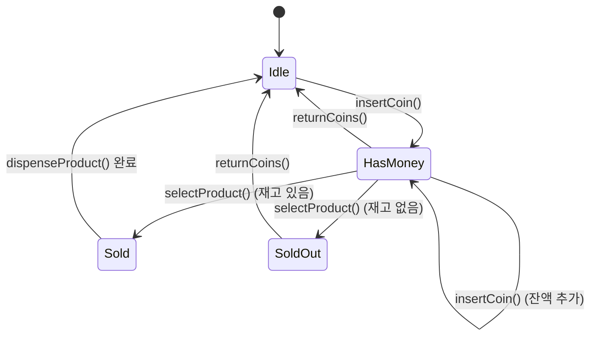

이 실습에서는 Strategy 패턴으로 알고리즘을, State 패턴으로 상태 기반 행동을 캡슐화하는 방법을 직접 구현합니다.

## 실습 목표
- Strategy 패턴으로 알고리즘 캡슐화 구현
- State 패턴으로 상태 기반 행동 변화 구현
- 두 패턴의 차이점과 적용 시나리오 이해
- 함수형 프로그래밍 스타일 Strategy 패턴 구현

## 실습 1: 할인 전략 시스템 (Strategy)

### 요구사항
다양한 할인 정책을 적용하는 쇼핑몰 시스템

### 왜 Strategy인가

할인 정책은 고객 유형·주문 금액·시즌 등 조건에 따라 계산 로직 자체가 다르고, 새 정책이 수시로 추가·변경됩니다. 이를 하나의 클래스에서 `if-else`로 처리하면 정책이 늘어날 때마다 기존 코드를 수정해야 해 개방-폐쇄 원칙(OCP)을 위반합니다. Strategy 패턴은 "할인 계산"이라는 동일한 인터페이스 뒤에 정책별 알고리즘을 캡슐화해, `PriceCalculator`는 어떤 정책이 적용되는지 몰라도 되고 새 정책은 클래스 추가만으로 확장됩니다. 반대로 "주문이 처리되는 단계(결제 전/후, 배송 전/후)에 따라 허용되는 행동 자체가 바뀌는" 문제라면 State 패턴이 더 적합합니다. Strategy는 "같은 문제를 푸는 여러 알고리즘 중 하나를 선택"하는 것이고, State는 "시간·이벤트에 따라 객체의 행동 규칙 자체가 바뀌는 것"이라는 차이가 두 패턴을 구분하는 핵심 기준입니다.

GoF는 Strategy의 의도를 다음과 같이 정의합니다. 여기서 "알고리즘을 클라이언트와 독립적으로 변경할 수 있게 한다"는 대목이 바로 `PriceCalculator`가 어떤 `DiscountStrategy` 구현체가 꽂혀 있는지 몰라도 되는 이유입니다.

> "Define a family of algorithms, encapsulate each one, and make them interchangeable. Strategy lets the algorithm vary independently from clients that use it." — Erich Gamma, Richard Helm, Ralph Johnson, John Vlissides, 『Design Patterns: Elements of Reusable Object-Oriented Software』(1994)

### 코드 템플릿

```java
import java.util.function.Function;
import java.util.function.Predicate;

// TODO 1: Strategy 인터페이스 정의
public interface DiscountStrategy {
    double calculateDiscount(Order order);
    String getDiscountDescription();
    boolean isApplicable(Customer customer);
}

// 지원 클래스 (컴파일을 위한 최소 정의)
class Customer {
    private final CustomerType type;

    public Customer(CustomerType type) {
        this.type = type;
    }

    public CustomerType getType() {
        return type;
    }
}

enum CustomerType {
    REGULAR, VIP
}

class Order {
    private final double total;
    private final int itemCount;

    public Order(double total, int itemCount) {
        this.total = total;
        this.itemCount = itemCount;
    }

    public double getTotal() {
        return total;
    }

    public int getItemCount() {
        return itemCount;
    }
}

// TODO 2: 구체적인 할인 전략들 구현
// 완성 예시: 일반 고객 할인 정책 (정액 5%)
public class RegularCustomerDiscount implements DiscountStrategy {
    private static final double DISCOUNT_RATE = 0.05;

    @Override
    public double calculateDiscount(Order order) {
        return order.getTotal() * DISCOUNT_RATE;
    }

    @Override
    public String getDiscountDescription() {
        return "일반 고객 할인 5%";
    }

    @Override
    public boolean isApplicable(Customer customer) {
        return customer.getType() == CustomerType.REGULAR;
    }
}

public class VIPCustomerDiscount implements DiscountStrategy {
    // TODO: VIP 고객 할인 (15%) 구현
}

public class BulkOrderDiscount implements DiscountStrategy {
    // TODO: 대량 주문 할인 (수량별 차등) 구현
}

public class SeasonalDiscount implements DiscountStrategy {
    // TODO: 계절별 할인 (기간 제한) 구현
}

// TODO 3: Context 클래스 구현
public class PriceCalculator {
    private DiscountStrategy discountStrategy;
    
    // TODO: 전략 설정 및 가격 계산 로직
    public double calculateFinalPrice(Order order, Customer customer) {
        // TODO: 적용 가능한 할인 전략을 찾아 최적 할인 적용
        return 0.0;
    }
}

// TODO 4: 함수형 스타일 Strategy 구현
public class FunctionalDiscountCalculator {
    // TODO: Function 인터페이스를 활용한 할인 전략
    private static final Function<Order, Double> NO_DISCOUNT = order -> 0.0;
    private static final Function<Order, Double> MEMBER_DISCOUNT = order -> order.getTotal() * 0.1;
    
    // TODO: 조건부 할인 전략
    public static Function<Order, Double> conditionalDiscount(
        Predicate<Order> condition, 
        Function<Order, Double> discount) {
        // TODO: 조건을 만족할 때만 할인 적용
        return null;
    }
}
```

## 실습 2: 자판기 상태 관리 (State)

### 요구사항
동전 투입, 상품 선택, 배출 과정의 상태 관리

### 왜 State인가

자판기는 동전 투입 → 상품 선택 → 배출로 이어지는 흐름에서, 똑같은 `insertCoin()` 호출이라도 "대기" 상태에서는 잔액을 늘리고 "판매 완료" 상태에서는 무시되어야 하는 것처럼 상태에 따라 같은 메서드의 동작이 완전히 달라집니다. 이를 `if (state == IDLE) ... else if (state == HAS_MONEY) ...` 식으로 처리하면 상태가 늘어날 때마다 모든 메서드에 분기를 추가해야 하고, 어떤 상태에서 어떤 전이가 가능한지 코드 전체에 흩어집니다. State 패턴은 상태마다 별도 클래스를 만들어 "이 상태에서 이 행동이 무엇을 의미하는지"를 그 클래스 안에 캡슐화하고, 상태 전이도 각 State가 다음 State 객체로 교체하는 방식으로 명시적으로 관리합니다. 할인 정책처럼 "여러 알고리즘 중 하나를 골라 쓰는" 문제라면 Strategy가 맞지만, 여기서는 "동일 요청에 대한 반응이 이전 이벤트에 따라 달라지는" 문제이므로 State가 적합합니다.

GoF는 State의 의도를 다음과 같이 정의합니다. "객체가 다른 클래스로 바뀐 것처럼 보인다"는 표현은, `VendingMachine`이 `currentState`를 `IdleState`에서 `HasMoneyState`로 교체하는 순간 동일한 `insertCoin()` 호출의 동작이 통째로 바뀌는 이유를 정확히 짚습니다.

> "Allow an object to alter its behavior when its internal state changes. The object will appear to change its class." — Erich Gamma, Richard Helm, Ralph Johnson, John Vlissides, 『Design Patterns: Elements of Reusable Object-Oriented Software』(1994)

### 코드 템플릿

```java
import java.util.Map;

// TODO 1: State 인터페이스 정의
public interface VendingMachineState {
    void insertCoin(VendingMachine machine, int amount);
    void selectProduct(VendingMachine machine, String productCode);
    void dispenseProduct(VendingMachine machine);
    void returnCoins(VendingMachine machine);
    String getStateName();
}

// 지원 클래스 (컴파일을 위한 최소 정의)
class Product {
    private final String code;
    private final int price;
    private int stock;

    public Product(String code, int price, int stock) {
        this.code = code;
        this.price = price;
        this.stock = stock;
    }

    public String getCode() { return code; }
    public int getPrice() { return price; }
    public int getStock() { return stock; }
    public void decreaseStock() { stock--; }
}

// TODO 2: 구체적인 상태들 구현
// 완성 예시: 대기 상태 (Idle) - 자판기의 시작 상태
public class IdleState implements VendingMachineState {
    private static final IdleState INSTANCE = new IdleState();

    private IdleState() {}

    public static IdleState getInstance() {
        return INSTANCE;
    }

    @Override
    public void insertCoin(VendingMachine machine, int amount) {
        machine.addCoinBalance(amount);
        machine.setState(HasMoneyState.getInstance());
    }

    @Override
    public void selectProduct(VendingMachine machine, String productCode) {
        System.out.println("먼저 동전을 투입하세요.");
    }

    @Override
    public void dispenseProduct(VendingMachine machine) {
        System.out.println("선택된 상품이 없습니다.");
    }

    @Override
    public void returnCoins(VendingMachine machine) {
        System.out.println("반환할 금액이 없습니다.");
    }

    @Override
    public String getStateName() {
        return "IDLE";
    }
}

public class HasMoneyState implements VendingMachineState {
    // TODO: 동전 투입 상태에서의 행동
}

public class SoldState implements VendingMachineState {
    // TODO: 상품 판매 상태에서의 행동
}

public class SoldOutState implements VendingMachineState {
    // TODO: 품절 상태에서의 행동
}

// TODO 3: Context 클래스 (자판기)
public class VendingMachine {
    private VendingMachineState currentState;
    private int coinBalance;
    private Map<String, Product> products;

    public VendingMachine(Map<String, Product> products) {
        this.products = products;
        this.currentState = IdleState.getInstance();
        this.coinBalance = 0;
    }

    public void setState(VendingMachineState state) {
        System.out.printf("상태 전이: %s -> %s%n", currentState.getStateName(), state.getStateName());
        this.currentState = state;
    }

    public void addCoinBalance(int amount) {
        this.coinBalance += amount;
    }

    public int getCoinBalance() {
        return coinBalance;
    }

    // TODO: 나머지 상태에 위임하는 메서드들 (selectProduct, dispenseProduct, returnCoins)
    public void insertCoin(int amount) {
        currentState.insertCoin(this, amount);
    }
}
```

### 자판기 상태 전이

아래 다이어그램은 `IdleState`에서 시작해 동전 투입 → 상품 선택 → 배출로 이어지는 정상 흐름과, 품절 상품을 선택했을 때 `SoldOutState`로 빠지는 예외 흐름을 함께 보여줍니다.



## 실습 3: 게임 캐릭터 상태 시스템

### 왜 State인가 (심화: 상태 조합)

게임 캐릭터의 독/빙결/버프도 자판기와 같은 이유로 State가 적합하지만, 한 캐릭터가 여러 상태를 동시에 가질 수 있다는 점에서 한 단계 더 복잡합니다. "데미지 계산"이라는 동일한 연산이라도 어떤 상태가 걸려 있는지에 따라 배율이 달라지고, 상태가 끝나면 원래 행동으로 복귀해야 합니다. 이 로직을 캐릭터 클래스 안에 조건문으로 쌓지 않고 `CharacterState` 하위 클래스로 분리해 두면, 새 상태(예: 침묵, 스턴)를 추가할 때 기존 상태 클래스를 건드리지 않고 새 클래스만 추가하면 됩니다.

### 코드 템플릿

```java
import java.util.List;

// 지원 클래스 (컴파일을 위한 최소 정의)
class GameCharacter {
    private final String name;
    private int hp;
    private final int baseDamage;
    private final int baseSpeed;

    public GameCharacter(String name, int hp, int baseDamage, int baseSpeed) {
        this.name = name;
        this.hp = hp;
        this.baseDamage = baseDamage;
        this.baseSpeed = baseSpeed;
    }

    public String getName() { return name; }
    public int getHp() { return hp; }
    public void setHp(int hp) { this.hp = hp; }
    public int getBaseDamage() { return baseDamage; }
    public int getBaseSpeed() { return baseSpeed; }
}

// TODO 1: 캐릭터 상태 구현 (정상, 독, 빙결, 버프 등)
public abstract class CharacterState {
    protected final String stateName;
    protected final int duration;
    protected final GameCharacter character;

    protected CharacterState(String stateName, int duration, GameCharacter character) {
        this.stateName = stateName;
        this.duration = duration;
        this.character = character;
    }

    // TODO: 상태별 행동 수정 메서드들
    public abstract int modifyDamage(int baseDamage);
    public abstract int modifySpeed(int baseSpeed);
    public abstract void onEnterState();
    public abstract void onExitState();
    public abstract void onUpdate();
}

// TODO 2: 상태 조합 시스템 (여러 상태 동시 적용)
public class StateManager {
    private final List<CharacterState> activeStates;
    
    // TODO: 여러 상태가 동시에 적용될 때의 효과 계산
}
```

### 흔한 오개념: 이름이 아니라 전이 주체로 구분하라

Strategy와 State는 구조가 거의 같아서(인터페이스 하나에 구현체 여럿, Context 하나) "선택지가 여러 개면 Strategy, 상태가 여러 개면 State"라는 식으로 이름만 보고 구분하려는 오개념이 흔합니다. 하지만 실제 판별 기준은 이름이 아니라 "누가, 언제 다음 구현체로 바꾸는가"입니다. 예를 들어 게임 캐릭터가 근접/원거리 공격 모드를 플레이어 입력으로 명시적으로 선택해 전투 내내 유지한다면 이는 Strategy이고, 반대로 독 상태처럼 일정 시간이 지나면 저절로 해제되고 다른 상태(빙결)와 상호작용한다면 State입니다. 또 다른 오개념은 "State 패턴은 한 번에 하나의 상태만 가진다"는 가정인데, 실습 3의 `StateManager`처럼 여러 `CharacterState`를 동시에 활성화해 조합하는 것도 State 패턴의 정상적인 변형입니다. 정리하면, 전이 없이 외부에서 알고리즘을 주입받으면 Strategy, 객체 스스로 내부 이벤트에 따라 전이하며 행동 집합 자체가 바뀌면 State로 봐야 합니다.

## Strategy·State의 한계와 트레이드오프

두 패턴 모두 조건문을 없애는 대가로 클래스 수를 늘린다는 근본적인 트레이드오프를 갖습니다. 실습 1의 `DiscountStrategy`처럼 할인 정책이 4–5개면 문제없지만, 정책이 실무에서처럼 수십 개로 늘어나면(회원 등급별, 프로모션별, 지역별 조합까지 고려하면) 전략 클래스 자체가 관리 대상이 되어 "if-else 지옥"이 "클래스 파일 지옥"으로 옮겨갈 뿐인 상황이 됩니다. 이때는 실습 1의 함수형 스타일(`Function<Order, Double>`)처럼 상태 없는 전략을 람다로 대체하거나, 정책을 설정 파일·DB 테이블로 외부화하는 것이 더 나은 선택일 수 있습니다. State 패턴은 이 문제가 더 두드러집니다. 실습 3의 캐릭터 상태처럼 독·빙결·버프가 조합 가능한 경우, 상태 하나당 클래스 하나를 만드는 전통적 방식으로는 조합의 수만큼 클래스가 폭증하지 않지만(각 상태가 독립 객체로 동시에 적용되므로) 상태 간 상호작용(예: 빙결 중에는 독 데미지가 감소)을 처리하려면 상태 클래스들이 서로를 알아야 해 결합도가 다시 올라갑니다. 또한 자판기 예시처럼 상태가 4개뿐이라면 단순하지만, 상태 전이 규칙이 늘어날수록 `setState()` 호출이 여러 클래스에 흩어져 있어 전체 상태 기계를 한눈에 파악하기 어려워진다는 단점도 있습니다. 이런 경우 명시적인 상태 전이 테이블(`Map<State, Map<Event, State>>`)이나 Spring State Machine 같은 프레임워크로 전이 규칙을 한곳에 모으는 편이 유지보수에 유리합니다.

### Strategy vs State 차이 비교

| 비교 항목 | Strategy | State |
|----------|---------|-------|
| 캡슐화 대상 | 알고리즘("어떻게") | 상태별 행동("언제") |
| 교체 주체 | 클라이언트가 명시적으로 선택 | 상태 객체 스스로 다음 상태로 전이 가능 |
| 객체 간 인지 | 전략끼리 서로 몰라도 됨 | 상태끼리 다음 상태를 알아야 할 수 있음 |
| 클래스 증가 원인 | 알고리즘 변형이 늘어날 때 | 상태 또는 상태 조합이 늘어날 때 |
| 실습 예시 | 할인 정책(RegularCustomerDiscount 등) | 자판기 상태(IdleState 등), 캐릭터 상태 |
| 완화 전략 | 람다·설정 외부화로 클래스 축소 | 상태 전이 테이블·State Machine 프레임워크로 규칙 중앙화 |

## 체크리스트

### Strategy 패턴
- [ ] 알고리즘 가족 캡슐화 — `DiscountStrategy` 인터페이스 뒤에 정책별 계산 로직을 분리했는지 확인한다.
- [ ] 런타임 전략 변경 구현 — `PriceCalculator`가 전략을 필드로 보유하고 생성자·setter로 교체 가능한지 확인한다.
- [ ] 함수형 스타일 전략 구현 — `Function<Order, Double>`로 상태 없는 전략을 표현했는지 확인한다.
- [ ] 조건부 전략 적용 — `conditionalDiscount`가 `Predicate` 결과에 따라 할인 적용 여부를 분기하는지 확인한다.

### State 패턴
- [ ] 상태별 행동 변화 구현 — 동일한 `insertCoin()` 호출이 `IdleState`·`HasMoneyState`마다 다르게 동작하는지 확인한다.
- [ ] 상태 전이 로직 구현 — `setState()` 호출로 다음 상태 객체가 명시적으로 교체되는지 확인한다.
- [ ] Singleton 상태 객체 적용 — `IdleState`처럼 `getInstance()`로 상태 인스턴스를 공유해 불필요한 객체 생성을 막았는지 확인한다.
- [ ] 상태 히스토리 관리 — 이전 상태를 스택 등에 기록해 되돌리기(undo)나 전이 로깅에 활용할 수 있는지 확인한다.

### 패턴 비교 분석
- [ ] Strategy vs State 차이점 정리 — 위 비교표의 캡슐화 대상·교체 주체 기준으로 두 패턴을 구분해 설명할 수 있는지 확인한다.
- [ ] 각 패턴의 적용 시나리오 분석 — "실무 적용" 절의 예시처럼 실제 도메인에 어떤 패턴이 맞는지 스스로 판단할 수 있는지 확인한다.
- [ ] 성능 및 메모리 사용량 비교 — 상태 객체를 Singleton으로 공유할 때와 요청마다 새로 생성할 때의 메모리·GC 부담 차이를 비교해봤는지 확인한다.

## 추가 도전

1. **State Machine Builder**: 상태 기계 생성기 구현
2. **Strategy Composition**: 여러 전략 조합 시스템
3. **Dynamic Strategy Loading**: 런타임 전략 로딩
4. **State Persistence**: 상태 저장/복원 시스템

## 실무 적용

### Strategy 패턴 활용
- 결제 처리 전략 — 카드/계좌이체/포인트 등 결제 수단이 런타임에 선택되고 신규 수단이 계속 추가되므로 알고리즘 교체가 잦다.
- 데이터 검증 전략 — 입력 필드나 API 버전에 따라 검증 규칙 조합이 달라져 규칙 자체를 객체로 다뤄야 한다.
- 로깅 전략 — 콘솔/파일/원격 수집기 등 출력 대상에 따라 포맷팅·전송 로직만 다르고 호출부는 동일하다.
- 캐싱 전략 — LRU/LFU/TTL 등 교체 알고리즘을 상황에 맞게 바꿔 끼워야 해 인터페이스 뒤로 감춰야 한다.

### State 패턴 활용
- 워크플로우 관리 — 승인 대기/반려/완료처럼 단계별로 허용되는 동작 자체가 달라지는 문제라 상태별 캡슐화가 필요하다.
- 게임 캐릭터 상태 — 같은 입력(공격, 이동)에 대한 반응이 캐릭터의 현재 상태에 따라 달라진다.
- 주문 처리 상태 — 결제 전/후, 배송 전/후 등 상태 전이 규칙이 명확해 상태 기계로 모델링하기 좋다.
- 커넥션 상태 관리 — 연결/재연결/끊김 상태에서 동일한 send() 호출의 유효성과 동작이 달라진다.

---

**핵심 포인트**: Strategy는 '어떻게 할 것인가'의 다양성을, State는 '언제 무엇을 할 것인가'의 변화를 캡슐화합니다. 구조는 비슷하지만 목적과 사용법이 다른 두 패턴을 명확히 구분하는 것이 중요합니다. 