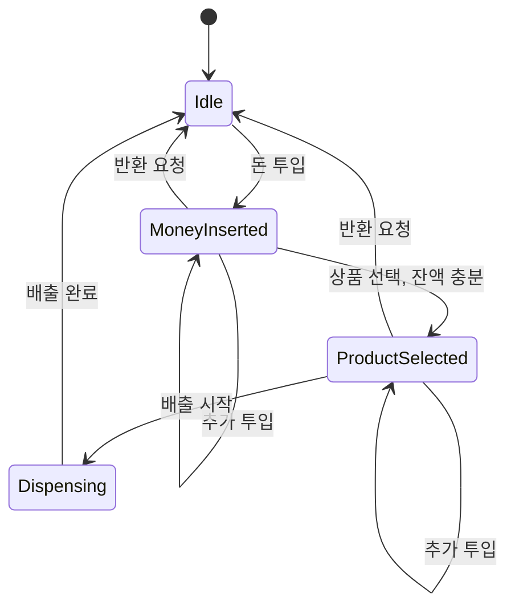

Strategy와 State 패턴의 철학적 차이를 탐구합니다. 알고리즘 교체와 상태 기반 행동 변화를 통해 유연한 시스템을 설계하는 방법을 학습합니다.

## 서론: 행동의 캡슐화 vs 상태의 진화

> *"Strategy 패턴은 '어떻게 할 것인가'를 캡슐화하고, State 패턴은 '언제 무엇을 할 것인가'를 캡슐화한다."*

현대 소프트웨어 개발에서 **Strategy**와 **State** 패턴은 매우 자주 혼동되는 패턴들입니다. 두 패턴 모두 **컴포지션을 통한 다형성**을 활용하고, **UML 다이어그램조차 거의 동일**합니다. 하지만 이들의 **철학적 차이**는 명확합니다.

**Strategy 패턴**은 **"알고리즘의 캡슐화"**에 초점을 맞춥니다. 런타임에 알고리즘을 교체할 수 있는 유연성을 제공하며, "어떻게 할 것인가(How)"의 문제를 해결합니다.

**State 패턴**은 **"상태 기반 행동 변화"**에 초점을 맞춥니다. 객체의 내부 상태에 따라 행동이 자동으로 변하며, "언제 무엇을 할 것인가(When & What)"의 문제를 해결합니다.

## Strategy 패턴 - 알고리즘의 캡슐화

> *"알고리즘 패밀리를 정의하고, 각각을 캡슐화하여 상호 교체 가능하게 만든다. Strategy는 알고리즘을 사용하는 클라이언트와 독립적으로 알고리즘을 변경할 수 있게 한다."* — GoF, 《Design Patterns》(1994), Strategy 패턴 Intent

### Strategy 패턴의 핵심 철학

위 Intent가 말하는 "캡슐화"와 "교체 가능"은 곧 **개방-폐쇄 원칙**의 완벽한 구현체라는 뜻입니다. 새 알고리즘을 추가할 때 기존 코드를 수정하지 않고 새 클래스만 추가하면 되기 때문입니다.

```java
// Strategy 패턴 없이 구현한다면?
class BadPriceCalculator {
    public double calculatePrice(double basePrice, String customerType) {
        switch (customerType) {
            case "REGULAR":
                return basePrice;
            case "MEMBER":
                return basePrice * 0.9;
            case "VIP":
                return basePrice * 0.8;
            case "EMPLOYEE":
                return basePrice * 0.7;
            default:
                throw new IllegalArgumentException("Unknown customer type");
        }
    }
}
```

### Strategy 패턴으로 우아하게 해결

이 구조의 핵심은 `PaymentProcessor`(Context)가 어떤 결제 수단인지 몰라도 된다는 점이다. `PaymentStrategy` 인터페이스만 알면 되므로, 새로운 결제 수단(예: 계좌이체)을 추가할 때 `PaymentProcessor` 코드를 전혀 건드리지 않고 새 클래스만 추가하면 된다. `isAvailable()`로 각 전략이 현재 컨텍스트에서 사용 가능한지 스스로 판단하게 한 점도 눈여겨볼 부분이다. 가용성 판단 로직을 Context가 아니라 전략 자신에게 위임함으로써, 조건문이 다시 Context로 기어들어오는 것을 막는다.

```java
import java.util.List;
import java.util.ArrayList;
import java.util.Map;
import java.util.HashMap;
import java.time.LocalDateTime;
import java.util.stream.Collectors;

// Strategy 패턴으로 우아하게 해결
//
// 아래 CardProcessor/PayPalClient/PayPalTransaction/BlockchainClient와
// PaymentException/PayPalException/BlockchainException, 그리고 뒤에 나오는
// PaymentLogger는 실제 결제사 SDK를 가정한 가상 타입이다(이 글에는 구현체가 없다).
// Strategy 패턴의 위임 구조를 보여주는 것이 목적이므로 외부 연동 세부 구현은 생략했다.
interface PaymentStrategy {
    PaymentResult processPayment(double amount, PaymentContext context);
    String getPaymentType();
    boolean isAvailable(PaymentContext context);
}

class CreditCardStrategy implements PaymentStrategy {
    private final String cardNumber;
    private final String cvv;
    private final String expiryDate;
    private final CardProcessor cardProcessor; // 가상 타입: 카드사 SDK 클라이언트라고 가정
    
    public CreditCardStrategy(String cardNumber, String cvv, String expiryDate) {
        this.cardNumber = maskCardNumber(cardNumber);
        this.cvv = cvv;
        this.expiryDate = expiryDate;
        this.cardProcessor = new CardProcessor();
    }
    
    @Override
    public PaymentResult processPayment(double amount, PaymentContext context) {
        try {
            // 카드 유효성 검증
            if (!validateCard()) {
                return PaymentResult.failed("Invalid card information");
            }
            
            // 한도 확인
            if (!checkCreditLimit(amount)) {
                return PaymentResult.failed("Credit limit exceeded");
            }
            
            // 실제 결제 처리
            String transactionId = cardProcessor.processTransaction(cardNumber, amount);
            
            return PaymentResult.success(transactionId, amount, "Credit Card Payment Completed");
            
        } catch (PaymentException e) { // 가상 타입: CardProcessor가 던진다고 가정한 예외
            return PaymentResult.failed("Payment processing failed: " + e.getMessage());
        }
    }
    
    @Override
    public String getPaymentType() {
        return "Credit Card";
    }
    
    @Override
    public boolean isAvailable(PaymentContext context) {
        return validateCard() && context.getAmount() <= 10000.0; // 1만달러 한도
    }
    
    private boolean validateCard() {
        return cardNumber != null && cvv != null && !isExpired();
    }
    
    private boolean isExpired() {
        // 만료일 확인 로직
        return false;
    }
    
    private boolean checkCreditLimit(double amount) {
        // 신용한도 확인 로직
        return true;
    }
    
    private String maskCardNumber(String cardNumber) {
        return cardNumber.replaceAll("\\d(?=\\d{4})", "*");
    }
}

class PayPalStrategy implements PaymentStrategy {
    private final String email;
    private final String apiKey;
    private final PayPalClient paypalClient; // 가상 타입: PayPal SDK 클라이언트라고 가정
    
    public PayPalStrategy(String email, String apiKey) {
        this.email = email;
        this.apiKey = apiKey;
        this.paypalClient = new PayPalClient(apiKey);
    }
    
    @Override
    public PaymentResult processPayment(double amount, PaymentContext context) {
        try {
            // PayPal 계정 잔액 확인
            if (!checkAccountBalance(amount)) {
                return PaymentResult.failed("Insufficient PayPal balance");
            }
            
            // PayPal API 호출
            PayPalTransaction transaction = paypalClient.createPayment(email, amount); // 가상 타입: SDK가 반환하는 거래 객체라고 가정
            
            return PaymentResult.success(
                transaction.getId(), 
                amount, 
                "PayPal Payment Completed"
            );
            
        } catch (PayPalException e) { // 가상 타입: PayPalClient가 던진다고 가정한 예외
            return PaymentResult.failed("PayPal processing failed: " + e.getMessage());
        }
    }
    
    @Override
    public String getPaymentType() {
        return "PayPal";
    }
    
    @Override
    public boolean isAvailable(PaymentContext context) {
        return paypalClient.isAccountValid(email);
    }
    
    private boolean checkAccountBalance(double amount) {
        return paypalClient.getBalance(email) >= amount;
    }
}

```

`CreditCardStrategy`와 `PayPalStrategy`는 필드·검증 로직·외부 클라이언트가 전혀 다르지만 뼈대는 같다: 생성자에서 클라이언트를 준비하고, `processPayment()`에서 사전 검증 → 외부 호출 → `PaymentResult` 변환 순으로 진행하며, 외부 클라이언트가 던지는 예외를 잡아 실패 결과로 흡수한다. 세 번째 전략인 `CryptocurrencyStrategy`도 같은 뼈대를 따르지만, 그 안에서 달라지는 지점 세 곳이 오히려 Strategy 패턴의 가치를 더 분명히 보여준다. 첫째, 신용카드의 "한도 확인"이나 PayPal의 "계정 잔액 확인" 대신 "USD를 코인으로 환산"하는 단계가 선행된다 — 환율이라는, 카드·PayPal에는 없는 전혀 새로운 종류의 사전 조건이다. 둘째, `isAvailable()`이 카드 만료일이나 계정 유효성이 아니라 "블록체인 네트워크가 살아있는가"를 검사한다 — 가용성의 정의 자체가 결제 수단마다 다르다는 뜻이다. 셋째, 결제 대상 주소를 자신의 필드가 아니라 `context.getRecipientAddress()`로 매번 Context에서 받아온다 — 카드사·PayPal은 가맹점이 고정되어 있지만 블록체인 송금은 매 거래마다 수신 지갑이 달라지기 때문이다. 아래는 이 세 차이가 드러나는 부분만 발췌한 것이며, `walletAddress`/`privateKey` 필드와 `getPaymentType()` 등 나머지는 앞의 두 전략과 동일한 패턴을 그대로 따른다고 보면 된다.

```java
class CryptocurrencyStrategy implements PaymentStrategy {
    // walletAddress, privateKey 필드와 getPaymentType() 등은
    // CreditCardStrategy/PayPalStrategy와 동일한 패턴이므로 생략(발췌 코드)
    private final BlockchainClient blockchainClient; // 가상 타입: 블록체인 노드 SDK 클라이언트라고 가정

    @Override
    public PaymentResult processPayment(double amount, PaymentContext context) {
        try {
            double cryptoAmount = blockchainClient.convertUSDToCrypto(amount); // 카드/PayPal에 없는 환산 단계
            String txHash = blockchainClient.sendTransaction(
                walletAddress, context.getRecipientAddress(), cryptoAmount // 수신 주소를 Context에서 매번 조회
            );
            return PaymentResult.success(txHash, amount, "Cryptocurrency Payment Completed");
        } catch (BlockchainException e) { // 가상 타입: BlockchainClient가 던진다고 가정한 예외
            return PaymentResult.failed("Blockchain transaction failed: " + e.getMessage());
        }
    }

    @Override
    public boolean isAvailable(PaymentContext context) {
        return blockchainClient.isNetworkAvailable() && // 만료일·계정 유효성이 아니라 네트워크 상태로 판단
               context.getRecipientAddress() != null;
    }
}
```

세 전략이 `PaymentException`, `PayPalException`, `BlockchainException`이라는 서로 무관한 예외 타입을 던지는데도 `PaymentProcessor`는 이 중 무엇도 알 필요가 없다는 점이 Strategy 패턴의 실질적 이득이다. 각 전략이 `catch` 블록에서 자신의 예외를 잡아 공통 타입인 `PaymentResult.failed(...)`로 변환해 반환하므로, 예외 계층의 차이는 전략 내부에 완전히 갇힌다. 만약 이 변환이 없었다면 `PaymentProcessor.processPayment()`는 `catch (PaymentException | PayPalException | BlockchainException e)`처럼 세 예외를 모두 알아야 했을 것이고, 결제 수단이 하나 늘 때마다 그 시그니처도 함께 늘어났을 것이다. 이제 이 전략들을 실제로 선택하고 실행하는 Context 차례다. `PaymentProcessor`는 특정 전략이 미리 지정되지 않았을 때 `selectOptimalStrategy()`로 등록된 전략을 순서대로 검사해 `isAvailable()`이 참인 첫 전략을 자동 선택한다. 이 자동 선택 로직조차 Context 안에 있을 뿐 각 전략의 가용성 판단 자체는 여전히 전략 자신의 책임이라는 점에서, if-else 사슬로 회귀하지 않는다.

```java
// Context 클래스
class PaymentProcessor {
    private PaymentStrategy paymentStrategy;
    private final List<PaymentStrategy> availableStrategies;
    private final PaymentLogger logger; // 가상 타입: 결제 로그 적재용 사내 로거라고 가정
    
    public PaymentProcessor() {
        this.availableStrategies = new ArrayList<>();
        this.logger = new PaymentLogger();
    }
    
    public void addPaymentStrategy(PaymentStrategy strategy) {
        availableStrategies.add(strategy);
    }
    
    public void setPaymentStrategy(PaymentStrategy strategy) {
        this.paymentStrategy = strategy;
    }
    
    public PaymentResult processPayment(double amount, PaymentContext context) {
        if (paymentStrategy == null) {
            return selectOptimalStrategy(amount, context);
        }
        
        if (!paymentStrategy.isAvailable(context)) {
            return PaymentResult.failed("Selected payment method is not available");
        }
        
        logger.logPaymentAttempt(paymentStrategy.getPaymentType(), amount);
        PaymentResult result = paymentStrategy.processPayment(amount, context);
        logger.logPaymentResult(result);
        
        return result;
    }
    
    private PaymentResult selectOptimalStrategy(double amount, PaymentContext context) {
        for (PaymentStrategy strategy : availableStrategies) {
            if (strategy.isAvailable(context)) {
                setPaymentStrategy(strategy);
                return processPayment(amount, context);
            }
        }
        return PaymentResult.failed("No available payment methods");
    }
    
    public List<String> getAvailablePaymentMethods(PaymentContext context) {
        return availableStrategies.stream()
            .filter(strategy -> strategy.isAvailable(context))
            .map(PaymentStrategy::getPaymentType)
            .collect(Collectors.toList());
    }
}

// 결과 클래스들
class PaymentResult {
    private final boolean success;
    private final String transactionId;
    private final double amount;
    private final String message;
    private final LocalDateTime timestamp;
    
    private PaymentResult(boolean success, String transactionId, double amount, String message) {
        this.success = success;
        this.transactionId = transactionId;
        this.amount = amount;
        this.message = message;
        this.timestamp = LocalDateTime.now();
    }
    
    public static PaymentResult success(String transactionId, double amount, String message) {
        return new PaymentResult(true, transactionId, amount, message);
    }
    
    public static PaymentResult failed(String message) {
        return new PaymentResult(false, null, 0.0, message);
    }
    
    // getters...
}

class PaymentContext {
    private final double amount;
    private final String currency;
    private final String recipientAddress;
    private final Map<String, Object> additionalData;
    
    public PaymentContext(double amount, String currency, String recipientAddress) {
        this.amount = amount;
        this.currency = currency;
        this.recipientAddress = recipientAddress;
        this.additionalData = new HashMap<>();
    }
    
    // getters and setters...
}
```

`PaymentResult`와 `PaymentContext`는 전략들 사이를 오가는 데이터를 담는 순수한 값 객체일 뿐, Strategy 패턴의 구조와는 직접 관련이 없다. 지금까지 본 구현은 전략마다 클래스를 새로 선언하는 전통적 OOP 방식인데, 전략이 상태 없는 순수 계산(가격에 할인율을 곱하는 것 같은)이라면 클래스 전체를 선언하는 비용이 과하다. 다음은 같은 아이디어를 Java 8 함수형 인터페이스로 압축한 버전이다.

### 함수형 프로그래밍에서의 Strategy 패턴

Java 8 이후, Strategy 패턴은 함수형 인터페이스와 람다 표현식으로 더욱 간결하게 구현할 수 있습니다:

```java
import java.util.Arrays;
import java.util.function.Predicate;

// 함수형 Strategy 패턴
@FunctionalInterface
interface DiscountStrategy {
    double applyDiscount(double price);
}

class FunctionalPriceCalculator {
    // 전략들을 정적 메서드로 정의
    public static final DiscountStrategy NO_DISCOUNT = price -> price;
    public static final DiscountStrategy MEMBER_DISCOUNT = price -> price * 0.9;
    public static final DiscountStrategy VIP_DISCOUNT = price -> price * 0.8;
    public static final DiscountStrategy SEASONAL_DISCOUNT = price -> price * 0.85;
    
    // 복합 할인 전략
    public static DiscountStrategy combined(DiscountStrategy... strategies) {
        return price -> Arrays.stream(strategies)
            .reduce(price, (p, strategy) -> strategy.applyDiscount(p), (p1, p2) -> p2);
    }
    
    // 조건부 할인 전략
    public static DiscountStrategy conditional(Predicate<Double> condition, 
                                             DiscountStrategy strategy) {
        return price -> condition.test(price) ? strategy.applyDiscount(price) : price;
    }
    
    public double calculatePrice(double basePrice, DiscountStrategy strategy) {
        return strategy.applyDiscount(basePrice);
    }
}

// 사용 예시 (위 DiscountStrategy·FunctionalPriceCalculator와 같은 파일에 있다고 가정)
public class FunctionalStrategyDemo {
    public static void main(String[] args) {
        FunctionalPriceCalculator calculator = new FunctionalPriceCalculator();

        // 기본 사용
        double memberPrice = calculator.calculatePrice(100.0, FunctionalPriceCalculator.MEMBER_DISCOUNT);
        System.out.printf("회원가: %.2f%n", memberPrice); // 90.00

        // 람다로 인라인 전략
        double customPrice = calculator.calculatePrice(100.0, price -> price * 0.75);
        System.out.printf("커스텀가: %.2f%n", customPrice); // 75.00

        // 복합 전략: 회원 할인(0.9배) 적용 후 시즌 할인(0.85배)을 이어서 적용
        DiscountStrategy blackFriday = FunctionalPriceCalculator.combined(
            FunctionalPriceCalculator.MEMBER_DISCOUNT, FunctionalPriceCalculator.SEASONAL_DISCOUNT);
        double specialPrice = calculator.calculatePrice(200.0, blackFriday);
        System.out.printf("블랙프라이데이가: %.2f%n", specialPrice); // 200 * 0.9 * 0.85 = 153.00

        // 조건부 전략: 500 초과일 때만 5% 추가 할인
        DiscountStrategy bulkDiscount = FunctionalPriceCalculator.conditional(
            price -> price > 500,
            price -> price * 0.95
        );
        double bulkPrice = calculator.calculatePrice(600.0, bulkDiscount);
        System.out.printf("대량구매가: %.2f%n", bulkPrice); // 600 * 0.95 = 570.00
    }
}
```

`combined()`와 `conditional()`은 전략을 값으로 다루기 때문에 가능한 조합이다. 클래스 기반 Strategy에서는 "회원 할인과 시즌 할인을 동시에 적용"하려면 새로운 `CombinedDiscountStrategy` 클래스를 따로 만들어야 하지만, 함수형 버전에서는 전략 자체를 조합하는 고차 함수 하나로 해결된다. 다만 이 압축은 전략에 상태나 외부 의존성(카드 처리기, PayPal 클라이언트처럼)이 없을 때만 유효하다. 앞서 본 `CreditCardStrategy`처럼 필드와 생성자가 필요한 전략은 람다로 표현할 수 없으므로 여전히 클래스 기반 구현이 적합하다. 이제 시선을 알고리즘 선택에서 상태 기반 행동 변화로 옮겨본다.

## State 패턴 - 상태 기반 행동 변화

> *"객체의 내부 상태가 바뀔 때 그 객체가 행동을 바꿀 수 있게 한다. 마치 객체가 자신의 클래스를 바꾸는 것처럼 보인다."* — GoF, 《Design Patterns》(1994), State 패턴 Intent

### State 패턴의 핵심 철학

위 Intent의 "클래스를 바꾸는 것처럼 보인다"는 표현이 핵심입니다. 실제로는 하나의 Context 객체가 그대로 유지되지만, 내부에 위임하는 상태 객체가 바뀌면서 마치 다른 클래스의 인스턴스인 것처럼 행동이 완전히 달라집니다.

```java
// State 패턴 없이 구현한다면?
class BadVendingMachine {
    private enum State { IDLE, MONEY_INSERTED, PRODUCT_SELECTED, DISPENSING }
    private State currentState = State.IDLE;
    private double balance = 0.0;
    
    public void insertMoney(double amount) {
        // 😱 상태마다 다른 조건문 필요
        if (currentState == State.IDLE) {
            balance += amount;
            currentState = State.MONEY_INSERTED;
        } else if (currentState == State.MONEY_INSERTED) {
            balance += amount;
        } else {
            System.out.println("Cannot insert money in current state");
        }
    }
    
    public void selectProduct(String code) {
        if (currentState == State.MONEY_INSERTED) {
            // 복잡한 조건 로직
            currentState = State.PRODUCT_SELECTED;
        } else {
            System.out.println("Invalid state for product selection");
        }
    }
    
    // 더 많은 메서드들... 각각 복잡한 조건문 포함
}
```

### State 패턴으로 우아하게 해결

이 구조의 핵심은 `VendingMachine`(Context)이 현재 상태가 무엇인지 조건문으로 검사하지 않고, 모든 요청을 `currentState`에 위임한다는 점이다. 상태마다 가능한 행동과 불가능한 행동(예: `IdleState`에서 `selectProduct`는 에러)이 각 State 클래스 안에 자기완결적으로 표현되므로, 새 상태를 추가해도 기존 상태 클래스들을 수정할 필요가 없다. 각 State가 `setState()`를 호출해 다음 상태로의 전이를 스스로 결정한다는 점도 Strategy와 다른 지점이다. Strategy에서는 Context가 전략을 선택하지만, State에서는 전이 규칙 자체가 상태 객체 안에 흩어져 있다.

```java
import java.util.List;
import java.util.ArrayList;
import java.util.Map;
import java.util.HashMap;

// State 패턴으로 우아하게 해결
interface VendingMachineState {
    void insertMoney(VendingMachine machine, double amount);
    void selectProduct(VendingMachine machine, String productCode);
    void dispenseProduct(VendingMachine machine);
    void returnMoney(VendingMachine machine);
    String getStateName();
}

class IdleState implements VendingMachineState {
    private static final IdleState INSTANCE = new IdleState();
    
    public static IdleState getInstance() {
        return INSTANCE;
    }
    
    @Override
    public void insertMoney(VendingMachine machine, double amount) {
        machine.addMoney(amount);
        System.out.printf("💰 Money inserted: $%.2f\n", amount);
        machine.setState(MoneyInsertedState.getInstance());
    }
    
    @Override
    public void selectProduct(VendingMachine machine, String productCode) {
        System.out.println("[Error] Please insert money first!");
    }
    
    @Override
    public void dispenseProduct(VendingMachine machine) {
        System.out.println("[Error] Please insert money and select product first!");
    }
    
    @Override
    public void returnMoney(VendingMachine machine) {
        System.out.println("[Error] No money to return!");
    }
    
    @Override
    public String getStateName() {
        return "Idle";
    }
}

class MoneyInsertedState implements VendingMachineState {
    private static final MoneyInsertedState INSTANCE = new MoneyInsertedState();
    
    public static MoneyInsertedState getInstance() {
        return INSTANCE;
    }
    
    @Override
    public void insertMoney(VendingMachine machine, double amount) {
        machine.addMoney(amount);
        System.out.printf("💰 Additional money inserted: $%.2f (Total: $%.2f)\n", 
                         amount, machine.getCurrentBalance());
    }
    
    @Override
    public void selectProduct(VendingMachine machine, String productCode) {
        Product product = machine.getProduct(productCode);
        if (product == null) {
            System.out.println("[Error] Invalid product code!");
            return;
        }
        
        if (machine.getCurrentBalance() >= product.getPrice()) {
            machine.setSelectedProduct(product);
            System.out.printf("[OK] Product selected: %s ($%.2f)\n", 
                             product.getName(), product.getPrice());
            machine.setState(ProductSelectedState.getInstance());
        } else {
            System.out.printf("[Error] Insufficient funds! Need $%.2f more\n", 
                             product.getPrice() - machine.getCurrentBalance());
        }
    }
    
    @Override
    public void dispenseProduct(VendingMachine machine) {
        System.out.println("[Error] Please select a product first!");
    }
    
    @Override
    public void returnMoney(VendingMachine machine) {
        double balance = machine.getCurrentBalance();
        machine.resetBalance();
        System.out.printf("💵 Returned $%.2f\n", balance);
        machine.setState(IdleState.getInstance());
    }
    
    @Override
    public String getStateName() {
        return "Money Inserted";
    }
}

class ProductSelectedState implements VendingMachineState {
    private static final ProductSelectedState INSTANCE = new ProductSelectedState();
    
    public static ProductSelectedState getInstance() {
        return INSTANCE;
    }
    
    @Override
    public void insertMoney(VendingMachine machine, double amount) {
        machine.addMoney(amount);
        System.out.printf("💰 Additional money inserted: $%.2f\n", amount);
    }
    
    @Override
    public void selectProduct(VendingMachine machine, String productCode) {
        System.out.println("[Warning] Product already selected. Press dispense or return money.");
    }
    
    @Override
    public void dispenseProduct(VendingMachine machine) {
        Product product = machine.getSelectedProduct();
        double change = machine.getCurrentBalance() - product.getPrice();
        
        machine.setState(DispensingState.getInstance());
        
        System.out.printf("🥤 Dispensing: %s\n", product.getName());
        
        if (change > 0) {
            System.out.printf("💵 Change returned: $%.2f\n", change);
        }
        
        machine.resetBalance();
        machine.setSelectedProduct(null);
        machine.setState(IdleState.getInstance());
    }
    
    @Override
    public void returnMoney(VendingMachine machine) {
        double balance = machine.getCurrentBalance();
        machine.resetBalance();
        machine.setSelectedProduct(null);
        System.out.printf("💵 Transaction cancelled. Returned $%.2f\n", balance);
        machine.setState(IdleState.getInstance());
    }
    
    @Override
    public String getStateName() {
        return "Product Selected";
    }
}

class DispensingState implements VendingMachineState {
    private static final DispensingState INSTANCE = new DispensingState();
    
    public static DispensingState getInstance() {
        return INSTANCE;
    }
    
    @Override
    public void insertMoney(VendingMachine machine, double amount) {
        System.out.println("⏳ Please wait, dispensing in progress...");
    }
    
    @Override
    public void selectProduct(VendingMachine machine, String productCode) {
        System.out.println("⏳ Please wait, dispensing in progress...");
    }
    
    @Override
    public void dispenseProduct(VendingMachine machine) {
        System.out.println("⏳ Already dispensing...");
    }
    
    @Override
    public void returnMoney(VendingMachine machine) {
        System.out.println("⏳ Cannot return money while dispensing...");
    }
    
    @Override
    public String getStateName() {
        return "Dispensing";
    }
}

// Context 클래스
class VendingMachine {
    private VendingMachineState currentState;
    private double currentBalance;
    private Product selectedProduct;
    private final Map<String, Product> products;
    private final List<StateTransitionListener> listeners;
    
    public VendingMachine() {
        this.currentState = IdleState.getInstance();
        this.currentBalance = 0.0;
        this.products = new HashMap<>();
        this.listeners = new ArrayList<>();
        initializeProducts();
    }
    
    private void initializeProducts() {
        products.put("A1", new Product("A1", "Coca Cola", 1.50));
        products.put("B1", new Product("B1", "Pepsi", 1.50));
        products.put("C1", new Product("C1", "Water", 1.00));
        products.put("D1", new Product("D1", "Juice", 2.00));
    }
    
    // 상태 전이와 함께 이벤트 발생
    public void setState(VendingMachineState newState) {
        VendingMachineState oldState = this.currentState;
        this.currentState = newState;
        
        System.out.printf("🔄 State: %s → %s\n", 
                         oldState.getStateName(), newState.getStateName());
        
        // 상태 전이 이벤트 통지
        notifyStateTransition(oldState, newState);
    }
    
    private void notifyStateTransition(VendingMachineState from, VendingMachineState to) {
        for (StateTransitionListener listener : listeners) {
            listener.onStateTransition(from.getStateName(), to.getStateName());
        }
    }
    
    public void addStateTransitionListener(StateTransitionListener listener) {
        listeners.add(listener);
    }
    
    // 상태에 위임하는 메서드들
    public void insertMoney(double amount) {
        currentState.insertMoney(this, amount);
    }
    
    public void selectProduct(String productCode) {
        currentState.selectProduct(this, productCode);
    }
    
    public void dispenseProduct() {
        currentState.dispenseProduct(this);
    }
    
    public void returnMoney() {
        currentState.returnMoney(this);
    }
    
    // 내부 상태 관리 메서드들
    public void addMoney(double amount) {
        this.currentBalance += amount;
    }
    
    public double getCurrentBalance() {
        return currentBalance;
    }
    
    public void resetBalance() {
        this.currentBalance = 0.0;
    }
    
    public Product getProduct(String code) {
        return products.get(code);
    }
    
    public void setSelectedProduct(Product product) {
        this.selectedProduct = product;
    }
    
    public Product getSelectedProduct() {
        return selectedProduct;
    }
    
    public String getCurrentStateName() {
        return currentState.getStateName();
    }
}

// 상태 전이 이벤트 리스너
interface StateTransitionListener {
    void onStateTransition(String fromState, String toState);
}

class Product {
    private final String code;
    private final String name;
    private final double price;
    
    public Product(String code, String name, double price) {
        this.code = code;
        this.name = name;
        this.price = price;
    }
    
    // getters...
    public String getCode() { return code; }
    public String getName() { return name; }
    public double getPrice() { return price; }
}
```

위 코드의 상태 전이를 다이어그램으로 정리하면 다음과 같다. 각 화살표가 `VendingMachine`이 아니라 State 클래스 내부에서 `setState()`로 결정된다는 점을 다시 확인할 수 있다.



## Strategy vs State - 구조적 유사성과 본질적 차이

### 패턴 비교 매트릭스

| **특성** | **Strategy Pattern** | **State Pattern** |
|----------|---------------------|-------------------|
| **핵심 목적** | 알고리즘 캡슐화 및 교체("어떻게") | 상태별 행동 캡슐화("언제") |
| **Context 역할** | 전략 선택과 위임(클라이언트가 선택) | 상태 전이와 행동 위임(내부에서 전이) |
| **객체 생명주기** | 필요에 따라 생성/교체 | 상태 전이에 따라 변경 |
| **상호 작용** | Context → Strategy(단방향) | State ↔ Context(양방향) |
| **전이 책임** | Context가 결정(외부) | State가 주도할 수 있음(내부) |
| **복잡성** | 상대적으로 단순 | 상태 전이 로직으로 복잡 |
| **사용 시점** | 런타임 알고리즘 선택 | 객체 상태 변화 시 |
| **Context의 인식 범위** | 전략의 구체 타입 몰라도 됨 | 상태의 구체 타입 몰라도 됨 |
| **UML 구조** | 거의 동일 | 거의 동일 |
| **장점** | 알고리즘 독립적 변경, OCP 준수, 테스트 용이 | 상태 로직 분리, 전이 로직 명확, OCP 준수 |
| **단점** | 클래스 수 증가, 클라이언트가 전략 알아야 함 | 상태 수에 비례한 클래스, 상태 공유 어려움 |

### 실제 비교 예시

앞의 매트릭스가 말하는 "전이 책임"의 차이를 코드 한 줄로 보면 명확해진다. `SortingContext.setStrategy()`는 외부(클라이언트)가 호출해야만 전략이 바뀌지만, `TCPConnection.setState()`는 `currentState.open(this)`처럼 상태 객체 내부에서 스스로 호출될 수 있다. 즉 Strategy는 "누가 선택을 트리거하는가"가 Context 바깥에 있고, State는 그 트리거가 Context 안쪽(상태 객체 자신)에 있을 수 있다는 차이다.

```java
// Strategy 패턴 예시: 알고리즘 선택 (SortingStrategy는 이 예시를 위한 가상 인터페이스)
class SortingContext {
    private SortingStrategy strategy;
    
    public void setStrategy(SortingStrategy strategy) {
        this.strategy = strategy; // Context가 전략을 선택
    }
    
    public void sort(int[] array) {
        strategy.sort(array); // 전략에 위임
    }
}

// State 패턴 예시: TCP 연결 상태 (TCPState는 이 예시를 위한 가상 인터페이스)
class TCPConnection {
    private TCPState currentState;
    
    public void open() {
        currentState.open(this); // 상태가 전이를 결정할 수 있음
    }
    
    public void setState(TCPState state) {
        this.currentState = state; // 상태가 Context를 변경
    }
}
```

정리하면, `SortingContext`는 정렬 방식을 매번 명시적으로 지정받아야 하는 반면 `TCPConnection`은 `open()` 한 번만 호출해도 내부적으로 CLOSED → SYN_SENT → ESTABLISHED로 상태가 이어서 전이될 수 있다. 이 차이가 바로 두 패턴을 실무에서 구분해 선택하는 기준이 된다.

### 안티패턴이 실제로 왜 다르게 나쁜가

앞서 본 두 안티패턴(`BadPriceCalculator`, `BadVendingMachine`)은 표면적으로 똑같아 보인다. 둘 다 조건문으로 분기하고, 둘 다 새 항목이 추가될 때마다 그 조건문을 다시 열어 수정해야 한다는 점에서 개방-폐쇄 원칙을 위반한다. 하지만 두 조건문이 나빠지는 축은 서로 다르다. `BadPriceCalculator`의 `switch(customerType)`는 "고객 유형"이라는 단일 축 위에서만 분기한다. 메서드는 `calculatePrice()` 하나뿐이고, 그 안에 `REGULAR`/`MEMBER`/`VIP`/`EMPLOYEE` 4개 case가 나열되어 있을 뿐이다. 반면 `BadVendingMachine`을 뒤에서 완성되는 State 패턴 구현(`IdleState`/`MoneyInsertedState`/`ProductSelectedState`/`DispensingState` 4개 상태 × `insertMoney`/`selectProduct`/`dispenseProduct`/`returnMoney` 4개 메서드)과 같은 범위까지 안티패턴 방식 그대로 확장한다면, "상태"와 "메서드"라는 두 개의 축이 곱해진 16개 조합 각각을 조건문으로 표현해야 한다.

이 축의 개수 차이는 새 항목을 추가할 때 곧바로 비용 차이로 드러난다. Strategy 안티패턴에 결제 수단 하나(예: 계좌이체)를 추가하면 switch에 case 하나만 늘어나 4개에서 5개가 된다 — 증가량은 항상 1이다. State 안티패턴에 새 상태(예: "결제 취소 대기") 하나를 추가하면 기존 4개 메서드 각각에 그 상태를 처리하는 분기를 추가해야 하므로 증가량이 4다. 거꾸로 새 메서드(예: `cancelTransaction`)를 추가하면 기존 4개 상태 각각에 대한 분기가 다시 필요해 이번에도 증가량이 4다. 요컨대 Strategy 안티패턴은 축이 하나뿐이라 선형(O(N))으로 나빠지지만, State 안티패턴은 축이 둘이라 어느 방향으로 확장해도 상대편 축의 크기만큼 나빠진다(O(상태 수 × 메서드 수)).

표로 정리하면 다음과 같다.

| 구분 | `BadPriceCalculator` (Strategy 안티패턴) | `BadVendingMachine` (State 안티패턴, 완성 시) |
|------|------------------------------------|-------------------------------------------|
| 분기 축 | 고객 유형 1개 | 상태 × 메서드 2개 |
| 메서드 수 | 1개 (`calculatePrice`) | 4개 (`insertMoney`/`selectProduct`/`dispenseProduct`/`returnMoney`) |
| 현재 분기 수 | 4 | 16 (상태 4 × 메서드 4) |
| 항목 1개 추가 시 증가량 | +1 (case 1개) | +4 (기존 메서드 4개 각각에 분기 추가) |
| 연산 1개 추가 시 증가량 | 해당 없음 (메서드가 1개뿐) | +4 (기존 상태 4개 각각에 분기 추가) |

이 차이는 패턴을 적용한 결과물의 모양이 왜 다른지도 설명한다. Strategy 패턴은 알고리즘 하나당 클래스 하나(메서드 1개만 구현)로 충분하지만, State 패턴은 상태 하나당 클래스 하나에 인터페이스의 메서드 4개를 모두 구현해야 한다 — 위 `IdleState`가 `insertMoney`뿐 아니라 `selectProduct`, `dispenseProduct`, `returnMoney`까지 구현하는 이유다. 분기의 총량(16개 조합)은 안티패턴과 패턴 적용 후가 같지만, 안티패턴은 이를 4개 메서드 안에 몰아넣어 상태가 하나 늘 때마다 4곳을 동시에 고쳐야 하는 반면, 패턴을 적용하면 조합이 상태별 클래스로 묶여 있어 새 상태 추가가 기존 클래스 수정 없이 새 클래스 하나 추가로 끝난다.

### 언제 어떤 패턴을 선택할 것인가?

**Strategy 패턴을 선택하세요:**
- 런타임에 알고리즘을 변경해야 할 때
- 조건문이 많은 알고리즘 선택 로직이 있을 때
- 알고리즘 패밀리를 캡슐화하고 싶을 때
- 클라이언트가 사용할 알고리즘을 선택해야 할 때

**State 패턴을 선택하세요:**
- 객체의 행동이 상태에 따라 달라질 때
- 상태 전이 로직이 복잡할 때
- 상태 전이 규칙이 명확할 때
- 상태 머신을 구현해야 할 때

## 한눈에 보는 Strategy & State 패턴

핵심 목적·전이 책임·장단점 등 두 패턴의 특성별 차이는 앞서 [패턴 비교 매트릭스](#패턴-비교-매트릭스)에서 이미 정리했다. 여기서는 그 특성들을 실무 판단에 바로 쓸 수 있도록 "어떤 상황에 어떤 패턴인가"와 "어떤 구현 방식이 있는가"라는 두 가지 실용적 관점으로 다시 배열한다.

### 선택 가이드

| 상황 / 판단 기준 | 권장 패턴 | 이유 |
|------|----------|------|
| 정렬 알고리즘 교체 | Strategy | 클라이언트가 알고리즘 선택 |
| 할인 정책 적용 | Strategy | 조건에 따른 계산 방식 변경 |
| 결제 처리 방식 | Strategy | 결제 수단별 처리 로직 |
| `if(type == A) doA()`, `switch(algorithm)` 형태의 분기가 있다 | Strategy | 조건 추가 시 새 Strategy 클래스만 추가하면 됨 |
| 주문 상태 관리 | State | 상태 전이에 따른 행동 변화 |
| 게임 캐릭터 상태 | State | 상태별 다른 행동 패턴 |
| TCP 연결 상태 | State | 연결 상태에 따른 행동 |
| `switch(state)`로 상태별 분기가 있다 | State | 조건 추가 시 새 State 클래스만 추가하면 됨 |

### 현대적 구현 방식

| 구현 방식 | Strategy 예시 | State 예시 |
|----------|--------------|-----------|
| 전통적 OOP | interface + 구현 클래스들 | interface + 상태 클래스들 |
| 함수형 (Java 8+) | `Function<T, R>` | 가능하나 복잡 |
| Enum 활용 | `enum Strategy` | `enum State` |
| 람다 + Map | `Map<String, Strategy>` | 제한적 |

---

## 결론: 캡슐화의 두 얼굴

Strategy와 State 패턴은 **"캡슐화"**라는 공통 목표를 가지지만, 서로 다른 관점에서 접근합니다:

- **Strategy**: "어떻게(How)" - 알고리즘의 캡슐화
- **State**: "언제(When)" - 상태별 행동의 캡슐화

두 패턴을 실무에 적용할 때 흔히 저지르는 실수는 서로 반대 방향이다. Strategy는 알고리즘이 사실상 하나뿐이거나 거의 바뀌지 않는데도 인터페이스와 구현 클래스를 미리 만들어 두는 과잉 설계로 이어지기 쉽다 — `BadPriceCalculator`의 4-way `switch`가 실제로 5년 동안 한 번도 case가 늘지 않았다면, `PaymentStrategy` 계층 전체가 불필요한 간접 참조만 추가한 셈이다. State는 반대로 상태가 늘어날수록 클래스 수가 함께 늘어나 메모리 사용량이 커질 수 있는데, 앞서 `IdleState`·`MoneyInsertedState`가 굳이 `getInstance()`로 정적 싱글턴을 반환하도록 만든 이유가 여기에 있다. 이 상태 클래스들은 자체 필드를 갖지 않고 매개변수로 전달받은 `VendingMachine`에만 위임하는 무상태(stateless) 설계이므로, 전이가 일어날 때마다 새 인스턴스를 만들 필요 없이 애플리케이션 전체에서 인스턴스 하나를 공유해도 안전하다. 반대로 상태 객체가 재시도 횟수처럼 자기 필드를 가져야 한다면 싱글턴 공유가 불가능해지고, 상태 수 × 동시 요청 수에 비례해 객체 생성 비용이 늘어난다는 트레이드오프를 감수해야 한다.

두 패턴 모두 **개방-폐쇄 원칙**을 실현하고 **코드의 유연성**을 높이는 강력한 도구입니다. 핵심은 **"무엇을 캡슐화하려는가?"**를 명확히 하는 것입니다.

다음 글에서는 **Command와 Chain of Responsibility 패턴**을 탐구하겠습니다. 요청의 캡슐화와 처리 체인을 통해 더욱 유연한 시스템 설계 방법을 살펴보겠습니다.

## 평가 기준

**독자가 이 글을 읽은 후 달성해야 할 목표:**

- [ ] Strategy 패턴이 캡슐화하는 대상("어떻게")과 State 패턴이 캡슐화하는 대상("언제")의 차이를 설명할 수 있다
- [ ] 두 패턴의 UML 구조가 거의 동일함에도 의도가 다르다는 점을 코드로 구분할 수 있다
- [ ] 전이 책임의 소재(Strategy는 Context가 선택, State는 상태 객체가 스스로 전이)를 구분할 수 있다
- [ ] VendingMachine 상태 전이 다이어그램을 통해 State 패턴의 동작을 설명할 수 있다
- [ ] 실무에서 두 패턴 중 무엇을 선택할지 판단 기준을 제시할 수 있다 