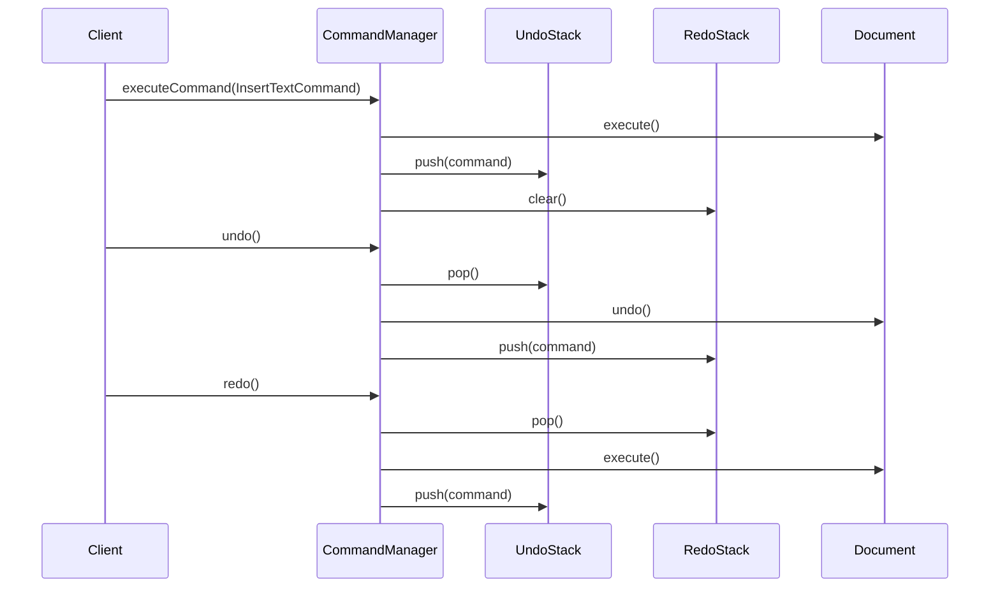
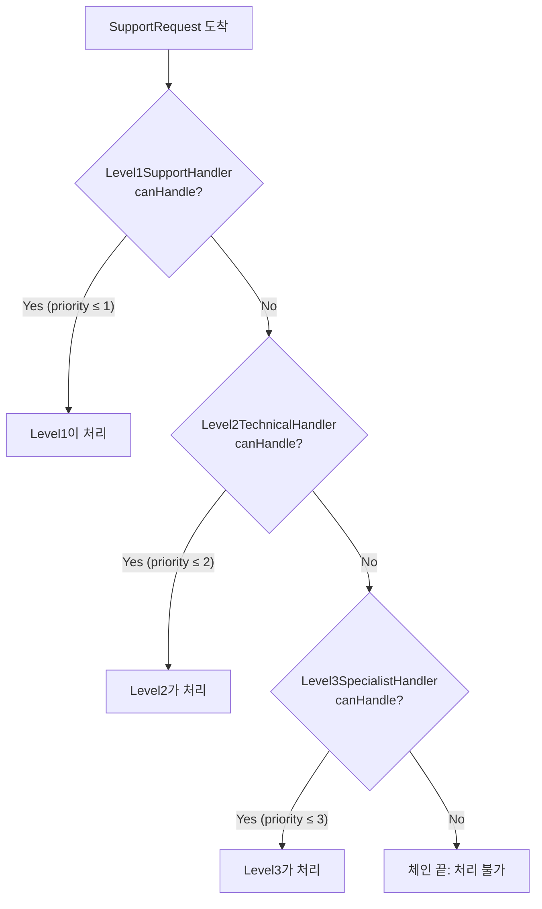

이 실습에서는 Command 패턴으로 Undo/Redo 시스템을, Chain of Responsibility로 요청 처리 체인을 구현합니다.

## 실습 목표
- Command 패턴으로 Undo/Redo 시스템 구현
- Chain of Responsibility로 요청 처리 체인 구현
- 매크로 명령과 복합 명령 처리
- 웹 미들웨어 스타일 체인 구현

## 실습 1: 텍스트 에디터 Command 시스템

### 요구사항
실행 취소/재실행이 가능한 텍스트 에디터

### 왜 Command인가

텍스트 편집기에서 "삽입"이라는 동작을 메서드 호출로만 처리하면, 그 호출이 끝나는 순간 무엇을 했는지에 대한 정보가 사라져 되돌릴 방법이 없습니다. Command 패턴은 "무엇을 할 것인가"(삽입할 텍스트, 위치)를 객체로 캡슐화해서, 실행이 끝난 뒤에도 그 요청 자체를 스택에 보관하고 재사용할 수 있게 합니다. 즉 메서드 호출을 값(객체)으로 다룰 수 있어야 Undo/Redo, 매크로, 실행 지연 같은 기능이 가능해집니다. 단순히 실행만 하고 끝나는 동작이라면 Command로 감쌀 이유가 없지만, "되돌리기"나 "나중에 실행"이 요구사항에 있다면 Command가 정답입니다.

### 코드 템플릿

```java
// TODO 1: Command 인터페이스 정의
public interface Command {
    void execute();
    void undo();
    boolean canExecute();
    String getDescription();
}

// TODO 2: Document 클래스 (Receiver)
public class Document {
    private StringBuilder content;
    private int cursorPosition;
    
    // TODO: 텍스트 조작 메서드들 구현
    public void insertText(String text, int position) {
        // TODO: 텍스트 삽입
    }
    
    public String deleteText(int start, int length) {
        // TODO: 텍스트 삭제 후 삭제된 텍스트 반환
        return "";
    }
}

// TODO 3: 구체적인 Command 구현
// 완성 예시: 텍스트 삽입 Command
public class InsertTextCommand implements Command {
    private final Document document;
    private final String text;
    private final int position;

    public InsertTextCommand(Document document, String text, int position) {
        this.document = document;
        this.text = text;
        this.position = position;
    }

    @Override
    public void execute() {
        document.insertText(text, position);
    }

    @Override
    public void undo() {
        // 삽입의 역연산은 같은 위치, 같은 길이만큼 삭제하는 것
        document.deleteText(position, text.length());
    }

    @Override
    public boolean canExecute() {
        return text != null && !text.isEmpty() && position >= 0;
    }

    @Override
    public String getDescription() {
        return String.format("Insert '%s' at %d", text, position);
    }
}

public class DeleteTextCommand implements Command {
    private final Document document;
    private final int start;
    private final int length;
    private String deletedText; // undo를 위해 저장
    
    // TODO: 삭제와 복원 로직 구현
}

// TODO 4: 매크로 명령 구현
public class MacroCommand implements Command {
    private final List<Command> commands;
    private final String description;
    
    // TODO: 여러 명령을 하나로 묶어서 실행/취소
}

// TODO 5: Command Manager (Invoker)
public class CommandManager {
    private final Stack<Command> undoStack;
    private final Stack<Command> redoStack;
    private final int maxHistorySize;
    
    public void executeCommand(Command command) {
        // TODO: 명령 실행 후 undo 스택에 추가
    }
    
    public void undo() {
        // TODO: 마지막 명령 취소
    }
    
    public void redo() {
        // TODO: 마지막으로 취소한 명령 재실행
    }
}
```

### Command 히스토리 흐름

`InsertTextCommand`가 `CommandManager`를 거쳐 실행·취소·재실행되는 과정에서 `undoStack`과 `redoStack`이 어떻게 갱신되는지를 보여줍니다. `execute()`는 항상 `redoStack`을 비운다는 점에 주의합니다 — 새 명령을 실행하면 이전에 취소했던 명령으로는 다시 돌아갈 수 없습니다.



## 실습 2: 지원 요청 처리 체인

### 요구사항
다단계 고객 지원 시스템 (Level 1 → Level 2 → Level 3)

### 왜 Chain of Responsibility인가

고객 지원 요청은 난이도에 따라 처리할 수 있는 담당자가 다르고, 어느 담당자가 처리할 수 있는지는 요청을 열어보기 전까지 알 수 없습니다. 이를 하나의 메서드에서 `if (level <= 1) ... else if (level <= 2) ...`로 처리하면 새 레벨이 추가될 때마다 이 메서드를 계속 수정해야 합니다. Chain of Responsibility는 각 레벨을 독립된 핸들러로 만들고, "내가 처리할 수 없으면 다음 핸들러에게 넘긴다"는 규칙만 공통으로 지키게 해서, 새 레벨 추가가 기존 핸들러 수정 없이 체인에 노드 하나를 끼워 넣는 일로 끝나게 만듭니다. Command와 달리 여기서는 "누가 처리할 것인가"를 런타임에 결정하는 것이 핵심이므로, 실행 취소가 필요 없는 이런 라우팅 문제에 적합합니다.

### 코드 템플릿

```java
// TODO 1: Handler 추상 클래스 정의
public abstract class SupportHandler {
    protected SupportHandler nextHandler;
    protected final String handlerName;
    protected final int maxHandleLevel;

    protected SupportHandler(String handlerName, int maxHandleLevel) {
        this.handlerName = handlerName;
        this.maxHandleLevel = maxHandleLevel;
    }

    public SupportHandler setNext(SupportHandler handler) {
        this.nextHandler = handler;
        return handler;
    }
    
    public final void handleRequest(SupportRequest request) {
        // TODO: 처리 가능 여부 확인 후 처리 또는 다음 핸들러로 전달
    }
    
    protected abstract boolean canHandle(SupportRequest request);
    protected abstract void doHandle(SupportRequest request);
}

// TODO 2: 구체적인 Handler 구현
// 완성 예시: 1차 지원 (비밀번호 재설정, 계정 문의)
public class Level1SupportHandler extends SupportHandler {
    public Level1SupportHandler() {
        super("Level 1 Support", 1);
    }

    @Override
    protected boolean canHandle(SupportRequest request) {
        return request.getPriority().getLevel() <= maxHandleLevel;
    }

    @Override
    protected void doHandle(SupportRequest request) {
        System.out.println("[Level 1] 기본 문의 처리: " + request.getCategory());
    }
}

public class Level2TechnicalHandler extends SupportHandler {
    // TODO: 기술적 문제 처리 (API 오류, 연동 문제 등)
}

public class Level3SpecialistHandler extends SupportHandler {
    // TODO: 전문가 수준 문제 처리 (시스템 장애, 보안 문제 등)
}

// TODO 3: 요청 우선순위 기반 라우팅
public class PriorityBasedChain {
    private final Map<Priority, SupportHandler> handlers;
    
    // TODO: 우선순위에 따른 핸들러 직접 라우팅
}

// 지원 클래스 (컴파일을 위한 최소 정의) - Level1SupportHandler가 사용
enum Priority {
    LOW(1), MEDIUM(2), HIGH(3), CRITICAL(4);

    private final int level;
    Priority(int level) { this.level = level; }
    public int getLevel() { return level; }
}

// TODO 4: 요청 정보 클래스
public class SupportRequest {
    private final String id;
    private final String category;
    private final Priority priority;
    private final String description;
    private final LocalDateTime timestamp;

    public SupportRequest(String id, String category, Priority priority, String description) {
        this.id = id;
        this.category = category;
        this.priority = priority;
        this.description = description;
        this.timestamp = LocalDateTime.now();
    }

    public String getId() { return id; }
    public String getCategory() { return category; }
    public Priority getPriority() { return priority; }
    public String getDescription() { return description; }
    public LocalDateTime getTimestamp() { return timestamp; }
}
```

### 지원 요청 라우팅 흐름

`SupportRequest`가 `Level1SupportHandler`부터 순서대로 `canHandle()`을 거치며 자신을 처리할 수 있는 첫 핸들러를 만날 때까지 체인을 따라 내려가는 과정을 보여줍니다. 어느 핸들러도 처리하지 못하면(우선순위가 정의된 범위를 벗어나면) 체인 끝에서 처리 불가로 종료됩니다.



## 실습 3: HTTP 미들웨어 체인

### 왜 Chain of Responsibility(변형)인가

HTTP 요청은 인증 → 속도 제한 → 로깅 → 압축처럼 여러 단계를 순서대로 통과해야 하는 경우가 많습니다. 앞의 지원 요청 체인과 달리 여기서는 "한 핸들러만 처리하고 끝"이 아니라 "모든 미들웨어가 순서대로 관여"할 수 있어야 하므로, 각 미들웨어가 다음 미들웨어를 직접 호출(`chain.proceed()`)하는 형태로 변형됩니다. 이 변형은 Express.js·Spring 같은 프레임워크의 미들웨어 구조와 동일하며, 여전히 Chain of Responsibility의 핵심인 "처리자를 체인으로 느슨하게 연결한다"는 아이디어를 따릅니다.

### 코드 템플릿

```java
// TODO 1: 미들웨어 인터페이스
public interface Middleware {
    void handle(HttpRequest request, HttpResponse response, MiddlewareChain chain);
}

// TODO 2: 미들웨어 체인
public class MiddlewareChain {
    private final List<Middleware> middlewares;
    private int currentIndex = 0;
    
    public void proceed(HttpRequest request, HttpResponse response) {
        // TODO: 다음 미들웨어 실행
    }
}

// TODO 3: 구체적인 미들웨어들
public class AuthenticationMiddleware implements Middleware {
    // TODO: 인증 확인
}

public class RateLimitMiddleware implements Middleware {
    // TODO: 요청 제한 확인
}

public class LoggingMiddleware implements Middleware {
    // TODO: 요청/응답 로깅
}

public class CompressionMiddleware implements Middleware {
    // TODO: 응답 압축
}

// TODO 4: Express.js 스타일 미들웨어 빌더
public class MiddlewareBuilder {
    private final List<Middleware> middlewares = new ArrayList<>();
    
    public MiddlewareBuilder use(Middleware middleware) {
        middlewares.add(middleware);
        return this;
    }
    
    public MiddlewareChain build() {
        return new MiddlewareChain(middlewares);
    }
}
```

### 이 변형의 한계와 트레이드오프

미들웨어 체인은 실습 2의 고전적 Chain of Responsibility와 실행 모델이 근본적으로 다릅니다. 실습 2에서는 `canHandle()`이 `false`를 반환하면 자동으로 다음 핸들러로 넘어가지만, 미들웨어 체인에서는 각 미들웨어가 `chain.proceed()`를 명시적으로 호출해야만 다음 단계로 진행됩니다. `AuthenticationMiddleware`가 인증 실패 시 `proceed()`를 호출하지 않고 바로 응답을 반환하는 것은 의도된 종료지만, 개발자가 실수로 `proceed()` 호출을 빠뜨리면 이후의 `LoggingMiddleware`나 `CompressionMiddleware`는 조용히 실행되지 않고 요청이 그대로 멈춰버립니다 — 컴파일러도 테스트도 이 누락을 잡아주지 않는다는 점이 실무에서 가장 흔한 버그 원인입니다. 또한 미들웨어의 실행 순서는 `MiddlewareBuilder.use()`를 호출한 순서에만 의존하며 타입 시스템으로 강제되지 않습니다. `CompressionMiddleware`를 `LoggingMiddleware`보다 먼저 등록하면 로그에 압축된 바이너리가 찍히는 식의 순서 결함이 발생할 수 있는데, 이를 막는 장치는 코드 리뷰와 컨벤션뿐입니다. 마지막으로 모든 미들웨어가 같은 `HttpRequest`/`HttpResponse` 인스턴스를 공유하며 자유롭게 변형할 수 있어, Command처럼 요청이 생성 시점에 캡슐화되어 불변에 가깝게 유지되는 구조와 달리 어떤 미들웨어가 무엇을 언제 바꿨는지 추적하기 어려워질 수 있습니다.

## 실습 4: 이벤트 처리 Command 시스템

### 왜 Command(심화: 스케줄링)인가

지금까지는 Command를 "즉시 실행하고 스택에 쌓는" 용도로만 썼지만, 이벤트 기반 시스템에서는 "언제 실행할지"도 Command가 스스로 결정해야 하는 경우가 많습니다(지연 실행, 반복 실행, 우선순위 실행). Command가 요청을 객체로 캡슐화해 두었기 때문에 `PriorityQueue`나 `ExecutorService` 같은 범용 스케줄링 도구에 그대로 담아 실행 시점을 미룰 수 있습니다 — 이는 요청과 실행을 분리하는 Command 패턴의 본래 목적이 시간 축으로 확장된 형태입니다.

### 코드 템플릿

```java
// TODO 1: 이벤트 기반 Command
public interface EventCommand {
    void execute(Event event);
    boolean canHandle(Event event);
    int getPriority();
}

// TODO 2: Command 스케줄러
public class CommandScheduler {
    private final PriorityQueue<ScheduledCommand> scheduledCommands;
    private final ExecutorService executor;
    
    // TODO: 지연 실행, 반복 실행, 조건부 실행 Command 지원
}

// TODO 3: 분산 Command 실행
public class DistributedCommandProcessor {
    // TODO: 여러 노드에 Command 분산 실행
}
```

## 체크리스트

### Command 패턴
- [ ] 실행 취소/재실행 구현
- [ ] 매크로 명령 구현
- [ ] Command 큐잉 시스템
- [ ] 분산 명령 처리

### Chain of Responsibility
- [ ] 요청 처리 체인 구현
- [ ] 동적 체인 구성
- [ ] 우선순위 기반 라우팅
- [ ] 미들웨어 패턴 구현

### 패턴 조합
- [ ] Command + Chain 결합 사용
- [ ] 에러 처리 메커니즘
- [ ] 성능 모니터링
- [ ] 로깅 및 디버깅 지원

## 추가 도전

1. **Command Sourcing**: 이벤트 소싱 패턴 구현
2. **Async Command**: 비동기 명령 처리
3. **Command Batching**: 명령 배치 처리
4. **Distributed Chain**: 분산 책임 체인

## 실무 적용

### Command 패턴 활용
- GUI 이벤트 처리 — 버튼 클릭 하나하나를 객체로 캡슐화해 두면 단축키 바인딩이나 매크로 기록처럼 같은 동작을 다른 트리거로 재사용하기 쉽다.
- 트랜잭션 관리 — 실행한 작업을 되돌릴 수 있어야 하는 트랜잭션 롤백은 Command의 undo() 구조와 본질적으로 같은 문제다.
- 작업 큐 시스템 — 요청을 객체로 캡슐화해 두면 즉시 실행하지 않고 큐에 저장했다가 워커가 나중에 꺼내 실행할 수 있다.
- 이벤트 소싱 — 상태 변화를 Command 객체 시퀀스로 기록해 두면 임의 시점의 상태를 재생(replay)으로 복원할 수 있다.

### Chain of Responsibility 활용
- 웹 프레임워크 미들웨어 — 인증·로깅·압축처럼 독립적인 관심사를 각 미들웨어로 분리하면서도 하나의 요청·응답 흐름을 순서대로 통과시켜야 하기 때문이다.
- 예외 처리 체인 — 예외 타입에 따라 처리 가능한 핸들러가 다르고, 상위 핸들러로 전파되는 구조가 체인과 자연스럽게 대응된다.
- 승인 워크플로우 — 결재 단계마다 처리 권한을 가진 담당자가 다르고, 이전 단계를 통과해야 다음 단계로 넘어가는 순차적 구조다.
- 로그 처리 파이프라인 — 필터링·포맷팅·전송처럼 로그가 거치는 단계를 독립된 핸들러로 나누면 파이프라인 순서만 조정해 동작을 바꿀 수 있다.

---

**핵심 포인트**: Command는 '무엇을 할 것인가'를 객체로 캡슐화하고, Chain of Responsibility는 '누가 할 것인가'를 유연하게 결정합니다. 두 패턴의 조합은 복잡한 요청 처리 시스템의 핵심입니다. 