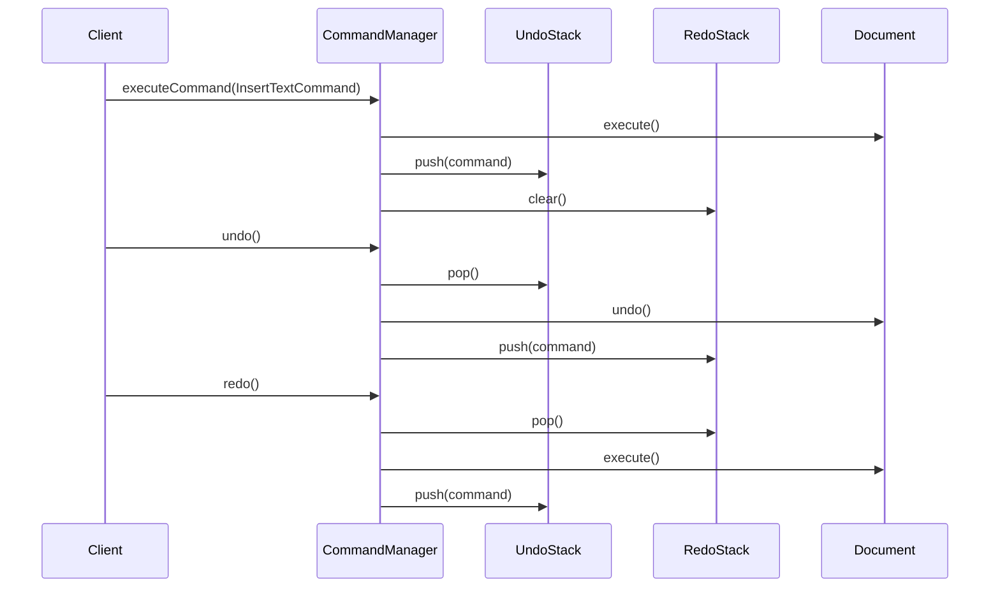
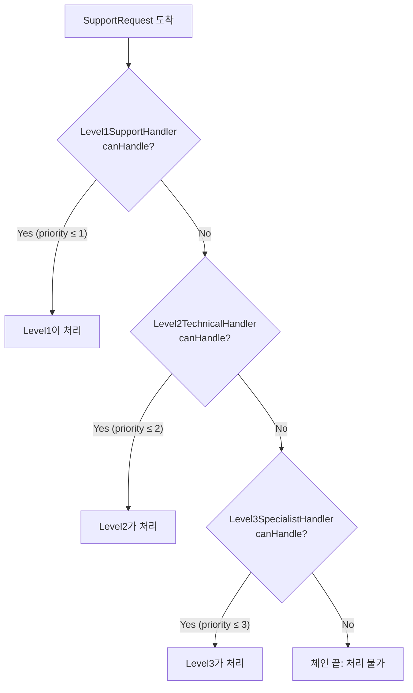
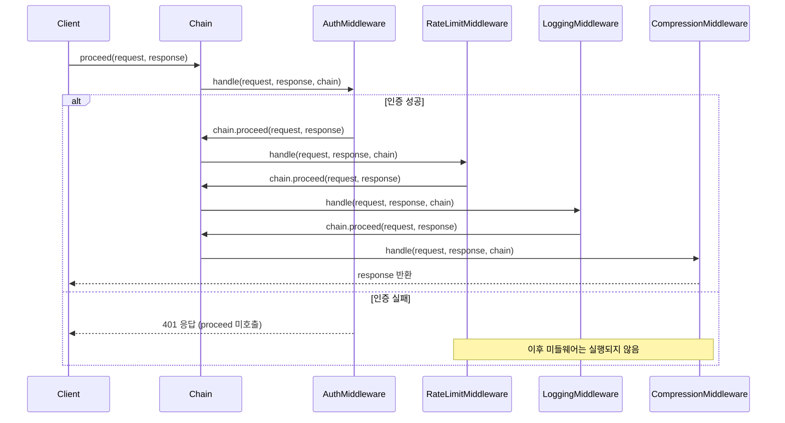
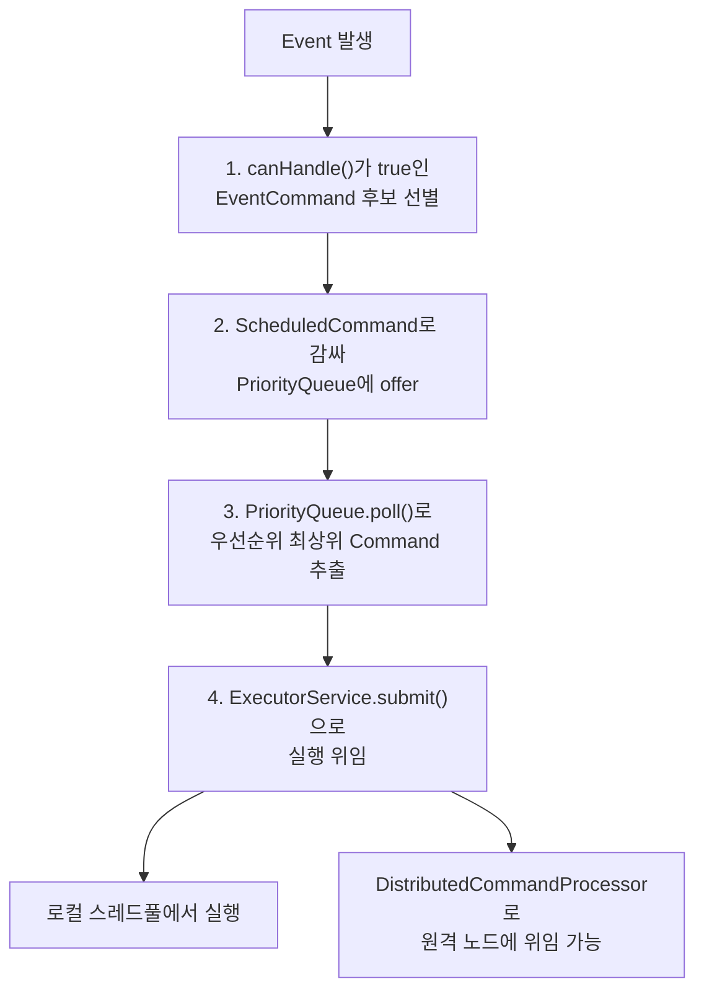

이 실습에서는 Command 패턴으로 Undo/Redo 시스템을, Chain of Responsibility로 요청 처리 체인을 구현합니다.

## 실습 목표
- Command 패턴으로 Undo/Redo 시스템 구현
- Chain of Responsibility로 요청 처리 체인 구현
- 매크로 명령과 복합 명령 처리
- 웹 미들웨어 스타일 체인 구현

## 실습 1: 텍스트 에디터 Command 시스템

### 요구사항
실행 취소/재실행이 가능한 텍스트 에디터

### 왜 Command인가

텍스트 편집기에서 "삽입"이라는 동작을 메서드 호출로만 처리하면, 그 호출이 끝나는 순간 무엇을 했는지에 대한 정보가 사라져 되돌릴 방법이 없습니다. Command 패턴은 "무엇을 할 것인가"(삽입할 텍스트, 위치)를 객체로 캡슐화해서, 실행이 끝난 뒤에도 그 요청 자체를 스택에 보관하고 재사용할 수 있게 합니다. 즉 메서드 호출을 값(객체)으로 다룰 수 있어야 Undo/Redo, 매크로, 실행 지연 같은 기능이 가능해집니다. 단순히 실행만 하고 끝나는 동작이라면 Command로 감쌀 이유가 없지만, "되돌리기"나 "나중에 실행"이 요구사항에 있다면 Command가 정답입니다.

### 코드 템플릿

```java
import java.util.ArrayDeque;
import java.util.ArrayList;
import java.util.Deque;
import java.util.List;

// TODO 1: Command 인터페이스 정의
public interface Command {
    void execute();
    void undo();
    boolean canExecute();
    String getDescription();
}

// TODO 2: Document 클래스 (Receiver)
public class Document {
    private StringBuilder content;
    private int cursorPosition;
    
    // TODO: 텍스트 조작 메서드들 구현
    public void insertText(String text, int position) {
        // TODO: 텍스트 삽입
    }
    
    public String deleteText(int start, int length) {
        // TODO: 텍스트 삭제 후 삭제된 텍스트 반환
        return "";
    }
}

// TODO 3: 구체적인 Command 구현
// 완성 예시: 텍스트 삽입 Command
public class InsertTextCommand implements Command {
    private final Document document;
    private final String text;
    private final int position;

    public InsertTextCommand(Document document, String text, int position) {
        this.document = document;
        this.text = text;
        this.position = position;
    }

    @Override
    public void execute() {
        document.insertText(text, position);
    }

    @Override
    public void undo() {
        // 삽입의 역연산은 같은 위치, 같은 길이만큼 삭제하는 것
        document.deleteText(position, text.length());
    }

    @Override
    public boolean canExecute() {
        return text != null && !text.isEmpty() && position >= 0;
    }

    @Override
    public String getDescription() {
        return String.format("Insert '%s' at %d", text, position);
    }
}

public class DeleteTextCommand implements Command {
    private final Document document;
    private final int start;
    private final int length;
    private String deletedText; // undo를 위해 저장

    public DeleteTextCommand(Document document, int start, int length) {
        this.document = document;
        this.start = start;
        this.length = length;
    }

    @Override
    public void execute() {
        // TODO: document.deleteText(start, length) 호출 결과를 deletedText에 저장
    }

    @Override
    public void undo() {
        // TODO: 삭제와 복원 로직 구현 (deletedText를 start 위치에 다시 삽입)
    }

    @Override
    public boolean canExecute() {
        // TODO: start·length 유효성 검증
        return false;
    }

    @Override
    public String getDescription() {
        // TODO: "Delete N chars at start" 형태로 설명 반환
        return "";
    }
}

// TODO 4: 매크로 명령 구현
public class MacroCommand implements Command {
    private final List<Command> commands = new ArrayList<>();
    private final String description;

    public MacroCommand(String description) {
        this.description = description;
    }

    @Override
    public void execute() {
        // TODO: 여러 명령을 순서대로 실행
    }

    @Override
    public void undo() {
        // TODO: 실행 역순으로 undo (아래 "흔한 오개념" 절 참고)
    }

    @Override
    public boolean canExecute() {
        // TODO: commands의 모든 Command가 canExecute()를 만족하는지 확인
        return false;
    }

    @Override
    public String getDescription() {
        return description;
    }
}

// TODO 5: Command Manager (Invoker)
// Deque를 사용하는 이유: java.util.Stack의 공식 문서는 "Deque 인터페이스가 이 클래스보다
// 완전하고 일관된 LIFO 연산을 제공하므로 우선 사용해야 한다"고 명시한다(Stack은 Vector를
// 상속해 불필요한 동기화 오버헤드와 인덱스 접근을 함께 물려받는다). 그래서 undo/redo 스택은
// Stack이 아니라 ArrayDeque로 구현하며, addLast()/removeLast()로 LIFO를 흉내낸다.
public class CommandManager {
    private final Deque<Command> undoStack = new ArrayDeque<>();
    private final Deque<Command> redoStack = new ArrayDeque<>();
    private final int maxHistorySize;

    public CommandManager(int maxHistorySize) {
        this.maxHistorySize = maxHistorySize;
    }
    
    public void executeCommand(Command command) {
        // TODO: 명령 실행 후 undo 스택에 추가
    }
    
    public void undo() {
        // TODO: 마지막 명령 취소
    }
    
    public void redo() {
        // TODO: 마지막으로 취소한 명령 재실행
    }
}
```

### Command 히스토리 흐름

`InsertTextCommand`가 `CommandManager`를 거쳐 실행·취소·재실행되는 과정에서 `undoStack`과 `redoStack`이 어떻게 갱신되는지를 보여줍니다. `execute()`는 항상 `redoStack`을 비운다는 점에 주의합니다 — 새 명령을 실행하면 이전에 취소했던 명령으로는 다시 돌아갈 수 없습니다.



## 실습 2: 지원 요청 처리 체인

### 요구사항
다단계 고객 지원 시스템 (Level 1 → Level 2 → Level 3)

### 왜 Chain of Responsibility인가

고객 지원 요청은 난이도에 따라 처리할 수 있는 담당자가 다르고, 어느 담당자가 처리할 수 있는지는 요청을 열어보기 전까지 알 수 없습니다. 이를 하나의 메서드에서 `if (level <= 1) ... else if (level <= 2) ...`로 처리하면 새 레벨이 추가될 때마다 이 메서드를 계속 수정해야 합니다. Chain of Responsibility는 각 레벨을 독립된 핸들러로 만들고, "내가 처리할 수 없으면 다음 핸들러에게 넘긴다"는 규칙만 공통으로 지키게 해서, 새 레벨 추가가 기존 핸들러 수정 없이 체인에 노드 하나를 끼워 넣는 일로 끝나게 만듭니다. Command와 달리 여기서는 "누가 처리할 것인가"를 런타임에 결정하는 것이 핵심이므로, 실행 취소가 필요 없는 이런 라우팅 문제에 적합합니다.

### 코드 템플릿

```java
import java.time.LocalDateTime;
import java.util.HashMap;
import java.util.Map;

// TODO 1: Handler 추상 클래스 정의
public abstract class SupportHandler {
    protected SupportHandler nextHandler;
    protected final String handlerName;
    protected final int maxHandleLevel;

    protected SupportHandler(String handlerName, int maxHandleLevel) {
        this.handlerName = handlerName;
        this.maxHandleLevel = maxHandleLevel;
    }

    public SupportHandler setNext(SupportHandler handler) {
        this.nextHandler = handler;
        return handler;
    }
    
    public final void handleRequest(SupportRequest request) {
        // TODO: 처리 가능 여부 확인 후 처리 또는 다음 핸들러로 전달
    }
    
    protected abstract boolean canHandle(SupportRequest request);
    protected abstract void doHandle(SupportRequest request);
}

// TODO 2: 구체적인 Handler 구현
// 완성 예시: 1차 지원 (비밀번호 재설정, 계정 문의)
public class Level1SupportHandler extends SupportHandler {
    public Level1SupportHandler() {
        super("Level 1 Support", 1);
    }

    @Override
    protected boolean canHandle(SupportRequest request) {
        return request.getPriority().getLevel() <= maxHandleLevel;
    }

    @Override
    protected void doHandle(SupportRequest request) {
        System.out.println("[Level 1] 기본 문의 처리: " + request.getCategory());
    }
}

public class Level2TechnicalHandler extends SupportHandler {
    public Level2TechnicalHandler() {
        super("Level 2 Technical", 2);
    }

    @Override
    protected boolean canHandle(SupportRequest request) {
        // TODO: 기술적 문제 처리 (API 오류, 연동 문제 등) 판단 로직
        return request.getPriority().getLevel() <= maxHandleLevel;
    }

    @Override
    protected void doHandle(SupportRequest request) {
        // TODO: 기술적 문제 처리 로직
    }
}

public class Level3SpecialistHandler extends SupportHandler {
    public Level3SpecialistHandler() {
        super("Level 3 Specialist", 3);
    }

    @Override
    protected boolean canHandle(SupportRequest request) {
        // TODO: 전문가 수준 문제(시스템 장애, 보안 문제 등) 판단 로직
        return request.getPriority().getLevel() <= maxHandleLevel;
    }

    @Override
    protected void doHandle(SupportRequest request) {
        // TODO: 전문가 수준 문제 처리 로직
    }
}

// TODO 3: 요청 우선순위 기반 라우팅
public class PriorityBasedChain {
    private final Map<Priority, SupportHandler> handlers = new HashMap<>();
    
    // TODO: 우선순위에 따른 핸들러 직접 라우팅
}

// 지원 클래스 (컴파일을 위한 최소 정의) - Level1SupportHandler가 사용
enum Priority {
    LOW(1), MEDIUM(2), HIGH(3), CRITICAL(4);

    private final int level;
    Priority(int level) { this.level = level; }
    public int getLevel() { return level; }
}

// TODO 4: 요청 정보 클래스
public class SupportRequest {
    private final String id;
    private final String category;
    private final Priority priority;
    private final String description;
    private final LocalDateTime timestamp;

    public SupportRequest(String id, String category, Priority priority, String description) {
        this.id = id;
        this.category = category;
        this.priority = priority;
        this.description = description;
        this.timestamp = LocalDateTime.now();
    }

    public String getId() { return id; }
    public String getCategory() { return category; }
    public Priority getPriority() { return priority; }
    public String getDescription() { return description; }
    public LocalDateTime getTimestamp() { return timestamp; }
}
```

### 지원 요청 라우팅 흐름

`SupportRequest`가 `Level1SupportHandler`부터 순서대로 `canHandle()`을 거치며 자신을 처리할 수 있는 첫 핸들러를 만날 때까지 체인을 따라 내려가는 과정을 보여줍니다. 어느 핸들러도 처리하지 못하면(우선순위가 정의된 범위를 벗어나면) 체인 끝에서 처리 불가로 종료됩니다.



이 템플릿의 `maxHandleLevel`은 정수 하나로만 처리 가능 범위를 표현하므로, `Level1~3SupportHandler`를 각각 1·2·3으로 구성하면 `Priority.CRITICAL`(레벨 4)은 어느 핸들러의 `canHandle()`도 통과하지 못하고 항상 "처리 불가"로 끝난다. 이는 버그가 아니라 이 연습이 의도적으로 남겨 둔 설계 공백이다 — 실제 서비스라면 `Level3SpecialistHandler`가 `CRITICAL`도 함께 처리하도록 `canHandle()`을 확장하거나(이론편의 `Level3SpecialistHandler`가 타입 조건과 `Priority.CRITICAL` 조건을 OR로 묶은 방식이 한 예), 별도의 긴급 대응 핸들러를 체인 끝에 추가해야 한다. 체인을 직접 구성하기 전에 "이 레벨 조합에서 새지 않는 요청이 있는가"를 확인하는 것이 이 실습의 숨은 목표 중 하나다.

## 실습 3: HTTP 미들웨어 체인

### 왜 Chain of Responsibility(변형)인가

HTTP 요청은 인증 → 속도 제한 → 로깅 → 압축처럼 여러 단계를 순서대로 통과해야 하는 경우가 많습니다. 앞의 지원 요청 체인과 달리 여기서는 "한 핸들러만 처리하고 끝"이 아니라 "모든 미들웨어가 순서대로 관여"할 수 있어야 하므로, 각 미들웨어가 다음 미들웨어를 직접 호출(`chain.proceed()`)하는 형태로 변형됩니다. 이 변형은 Express.js·Spring 같은 프레임워크의 미들웨어 구조와 동일하며, 여전히 Chain of Responsibility의 핵심인 "처리자를 체인으로 느슨하게 연결한다"는 아이디어를 따릅니다.

### 코드 템플릿

```java
import java.util.ArrayList;
import java.util.HashMap;
import java.util.List;
import java.util.Map;

// TODO 1: 미들웨어 인터페이스
public interface Middleware {
    void handle(HttpRequest request, HttpResponse response, MiddlewareChain chain);
}

// 지원 클래스 (컴파일을 위한 최소 정의) - 아래 미들웨어들이 사용
public class HttpRequest {
    private final String method;
    private final String path;
    private final Map<String, String> headers = new HashMap<>();

    public HttpRequest(String method, String path) {
        this.method = method;
        this.path = path;
    }

    public String getMethod() { return method; }
    public String getPath() { return path; }
    public String getHeader(String name) { return headers.get(name); }
    public void setHeader(String name, String value) { headers.put(name, value); }
}

public class HttpResponse {
    private int status = 200;
    private String body = "";

    public int getStatus() { return status; }
    public void setStatus(int status) { this.status = status; }
    public String getBody() { return body; }
    public void setBody(String body) { this.body = body; }
}

// TODO 2: 미들웨어 체인
public class MiddlewareChain {
    private final List<Middleware> middlewares;
    private int currentIndex = 0;

    public MiddlewareChain(List<Middleware> middlewares) {
        this.middlewares = new ArrayList<>(middlewares);
    }

    public void proceed(HttpRequest request, HttpResponse response) {
        // TODO: 다음 미들웨어 실행
    }
}

// TODO 3: 구체적인 미들웨어들
public class AuthenticationMiddleware implements Middleware {
    @Override
    public void handle(HttpRequest request, HttpResponse response, MiddlewareChain chain) {
        // TODO: 인증 확인. 실패 시 response에 401을 설정하고 chain.proceed()를 호출하지 않는다.
    }
}

public class RateLimitMiddleware implements Middleware {
    @Override
    public void handle(HttpRequest request, HttpResponse response, MiddlewareChain chain) {
        // TODO: 요청 제한 확인 후 chain.proceed(request, response) 호출
    }
}

// 완성 예시: 요청/응답 로깅 (chain.proceed() 전후로 시간 측정)
public class LoggingMiddleware implements Middleware {
    @Override
    public void handle(HttpRequest request, HttpResponse response, MiddlewareChain chain) {
        long startTime = System.currentTimeMillis();
        System.out.printf("[Request] %s %s%n", request.getMethod(), request.getPath());

        chain.proceed(request, response); // 다음 미들웨어가 끝날 때까지 여기서 대기한다

        long elapsedMs = System.currentTimeMillis() - startTime;
        System.out.printf("[Response] %s %s -> %d (%dms)%n",
                request.getMethod(), request.getPath(), response.getStatus(), elapsedMs);
    }
}

public class CompressionMiddleware implements Middleware {
    @Override
    public void handle(HttpRequest request, HttpResponse response, MiddlewareChain chain) {
        // TODO: 응답 압축
    }
}

// TODO 4: Express.js 스타일 미들웨어 빌더
public class MiddlewareBuilder {
    private final List<Middleware> middlewares = new ArrayList<>();
    
    public MiddlewareBuilder use(Middleware middleware) {
        middlewares.add(middleware);
        return this;
    }
    
    public MiddlewareChain build() {
        return new MiddlewareChain(middlewares);
    }
}
```

### 미들웨어 체인 실행 흐름

`MiddlewareChain.proceed()`가 등록 순서대로 각 미들웨어를 호출하고, 각 미들웨어가 `chain.proceed()`를 다시 호출해야만 다음 단계로 넘어가는 구조를 보여줍니다. 인증에 성공하면 `AuthMiddleware → RateLimitMiddleware → LoggingMiddleware → CompressionMiddleware` 순서로 모두 통과하지만, 인증에 실패하면 `AuthMiddleware`가 `proceed()`를 호출하지 않고 즉시 응답해 이후 미들웨어는 전혀 실행되지 않습니다.



### 이 변형의 한계와 트레이드오프

미들웨어 체인은 실습 2의 고전적 Chain of Responsibility와 실행 모델이 근본적으로 다릅니다. 실습 2에서는 `canHandle()`이 `false`를 반환하면 자동으로 다음 핸들러로 넘어가지만, 미들웨어 체인에서는 각 미들웨어가 `chain.proceed()`를 명시적으로 호출해야만 다음 단계로 진행됩니다. `AuthenticationMiddleware`가 인증 실패 시 `proceed()`를 호출하지 않고 바로 응답을 반환하는 것은 의도된 종료지만, 개발자가 실수로 `proceed()` 호출을 빠뜨리면 이후의 `LoggingMiddleware`나 `CompressionMiddleware`는 조용히 실행되지 않고 요청이 그대로 멈춰버립니다 — 컴파일러도 테스트도 이 누락을 잡아주지 않는다는 점이 실무에서 가장 흔한 버그 원인입니다. 또한 미들웨어의 실행 순서는 `MiddlewareBuilder.use()`를 호출한 순서에만 의존하며 타입 시스템으로 강제되지 않습니다. `CompressionMiddleware`를 `LoggingMiddleware`보다 먼저 등록하면 로그에 압축된 바이너리가 찍히는 식의 순서 결함이 발생할 수 있는데, 이를 막는 장치는 코드 리뷰와 컨벤션뿐입니다. 마지막으로 모든 미들웨어가 같은 `HttpRequest`/`HttpResponse` 인스턴스를 공유하며 자유롭게 변형할 수 있어, Command처럼 요청이 생성 시점에 캡슐화되어 불변에 가깝게 유지되는 구조와 달리 어떤 미들웨어가 무엇을 언제 바꿨는지 추적하기 어려워질 수 있습니다.

## 실습 4: 이벤트 처리 Command 시스템

### 왜 Command(심화: 스케줄링)인가

지금까지는 Command를 "즉시 실행하고 스택에 쌓는" 용도로만 썼지만, 이벤트 기반 시스템에서는 "언제 실행할지"도 Command가 스스로 결정해야 하는 경우가 많습니다(지연 실행, 반복 실행, 우선순위 실행). Command가 요청을 객체로 캡슐화해 두었기 때문에 `PriorityQueue`나 `ExecutorService` 같은 범용 스케줄링 도구에 그대로 담아 실행 시점을 미룰 수 있습니다 — 이는 요청과 실행을 분리하는 Command 패턴의 본래 목적이 시간 축으로 확장된 형태입니다.

### 코드 템플릿

```java
import java.util.PriorityQueue;
import java.util.concurrent.ExecutorService;
import java.util.concurrent.Executors;

// TODO 1: 이벤트 기반 Command
public interface EventCommand {
    void execute(Event event);
    boolean canHandle(Event event);
    int getPriority();
}

// 지원 클래스 (컴파일을 위한 최소 정의) - EventCommand/CommandScheduler가 사용
public class Event {
    private final String type;
    private final Object payload;

    public Event(String type, Object payload) {
        this.type = type;
        this.payload = payload;
    }

    public String getType() { return type; }
    public Object getPayload() { return payload; }
}

// PriorityQueue에 담기 위해 Comparable을 구현한다. compareTo는 getPriority()가 큰 Command가
// 먼저 나오도록 내림차순으로 비교한다(PriorityQueue는 기본적으로 오름차순 최소 힙이므로 부호를 뒤집는다).
public class ScheduledCommand implements Comparable<ScheduledCommand> {
    private final EventCommand command;
    private final Event event;

    public ScheduledCommand(EventCommand command, Event event) {
        this.command = command;
        this.event = event;
    }

    public EventCommand getCommand() { return command; }
    public Event getEvent() { return event; }

    @Override
    public int compareTo(ScheduledCommand other) {
        return Integer.compare(other.command.getPriority(), this.command.getPriority());
    }
}

// TODO 2: Command 스케줄러
public class CommandScheduler {
    private final PriorityQueue<ScheduledCommand> scheduledCommands = new PriorityQueue<>();
    private final ExecutorService executor = Executors.newFixedThreadPool(4);
    
    // TODO: 지연 실행, 반복 실행, 조건부 실행 Command 지원
}

// TODO 3: 분산 Command 실행
public class DistributedCommandProcessor {
    // TODO: 여러 노드에 Command 분산 실행
}
```

### 이벤트 기반 스케줄링 흐름

`Event`가 도착하면 `CommandScheduler`는 등록된 `EventCommand` 중 `canHandle()`이 참인 후보만 골라 `getPriority()` 기준으로 `PriorityQueue`에 넣고, 큐에서 꺼낸 순서대로 `ExecutorService`에 실행을 위임합니다. 이 흐름에서 "언제 실행할지"는 `Command` 객체 자신의 우선순위·조건에 달려 있을 뿐 호출자가 직접 결정하지 않는다는 점이, 즉시 실행 후 스택에 쌓기만 하던 실습 1의 Command 사용과 구분되는 지점입니다.



## 체크리스트

아래 각 항목은 이 실습의 어떤 클래스·메서드를 완성하면 충족되는지를 함께 표시합니다. 구현을 마친 뒤 체크박스를 채워 자가 점검에 사용하세요.

### Command 패턴
- [ ] 실행 취소/재실행 구현 — `CommandManager.executeCommand()`/`undo()`/`redo()`(TODO 5)가 `undoStack`/`redoStack`을 관리하고, `InsertTextCommand`(완성 예시)와 `DeleteTextCommand.execute()`/`undo()`(TODO 3)가 실제 되돌리기 로직을 제공한다
- [ ] 매크로 명령 구현 — `MacroCommand.execute()`/`undo()`(TODO 4)를 채우면 되며, undo 순서는 "흔한 오개념" 절의 역순 규칙을 따라야 한다
- [ ] Command 큐잉 시스템 — `CommandScheduler`(TODO 2)가 `ScheduledCommand`를 `PriorityQueue`에 담아 큐잉하고 `ExecutorService`로 실행을 위임한다
- [ ] 분산 명령 처리 — `DistributedCommandProcessor`(TODO 3)는 이 실습에서 확장 지점으로만 제시되며, "추가 도전 4"(Distributed Chain)와 함께 노드 간 RPC·장애 허용 설계까지 직접 구상해야 한다

### Chain of Responsibility
- [ ] 요청 처리 체인 구현 — `SupportHandler.handleRequest()`(TODO 1)와 `Level1~3SupportHandler.canHandle()`/`doHandle()`(TODO 2)를 채우면 완성된다
- [ ] 동적 체인 구성 — `SupportHandler.setNext()`는 이미 완성되어 있으며, 이 메서드로 런타임에 체인 순서를 자유롭게 재배열할 수 있다는 점을 확인한다
- [ ] 우선순위 기반 라우팅 — `PriorityBasedChain`(TODO 3)에서 `Priority`별로 담당 핸들러를 직접 매핑한다
- [ ] 미들웨어 패턴 구현 — `Middleware`/`MiddlewareChain.proceed()`(TODO 2)와 `AuthenticationMiddleware`/`RateLimitMiddleware`/`CompressionMiddleware`(TODO 3, `LoggingMiddleware`는 완성 예시)로 실습 3 전체를 완성한다

### 패턴 조합
- [ ] Command + Chain 결합 사용 — 이 템플릿에는 결합 예시가 없다. 예컨대 `Level1~3SupportHandler.doHandle()` 내부에서 처리 내역을 `Command`로 감싸 `CommandManager`에 등록하면, "이 지원 티켓 처리를 취소하고 이전 담당자에게 되돌린다" 같은 Undo 가능한 처리 이력을 만들 수 있다 — 두 패턴을 직접 엮어보는 것이 이 항목의 목표다
- [ ] 에러 처리 메커니즘 — `AuthenticationMiddleware`가 인증 실패 시 `response`에 401을 설정하고 `chain.proceed()`를 호출하지 않는 것(TODO 3)이 최소 형태의 예다
- [ ] 성능 모니터링 — 완성된 `LoggingMiddleware`가 `chain.proceed()` 전후로 `System.currentTimeMillis()`를 측정해 처리 시간(ms)을 출력하는 부분을 참고해 다른 미들웨어에도 같은 방식을 적용해본다
- [ ] 로깅 및 디버깅 지원 — `LoggingMiddleware`의 요청/응답 로그와 `Command.getDescription()`을 조합하면 "무엇이 언제 얼마나 걸려 실행됐는지"를 함께 추적할 수 있다

## 추가 도전

1. **Command Sourcing**: 이벤트 소싱 패턴 구현 — 매 `Command`를 실행 즉시 파일이나 DB 같은 영구 저장소에 순서대로 기록해 두면, 프로세스가 재시작돼도 그 기록을 처음부터 재실행(replay)해 현재 상태를 복원할 수 있습니다. `CommandManager`의 `undoStack`이 메모리에만 존재하는 것과 달리, 이 기록은 직렬화 가능한 형태로 남아야 합니다.
2. **Async Command**: 비동기 명령 처리 — `Command.execute()`를 별도 스레드나 `CompletableFuture`로 실행해 호출자가 결과를 기다리지 않고 다음 작업을 계속하도록 만듭니다. 실습 4의 `CommandScheduler`가 `ExecutorService`로 실행을 위임하는 것과 원리는 같지만, 완료 시점을 호출자가 조회하거나 콜백으로 통지받을 방법까지 설계해야 합니다.
3. **Command Batching**: 명령 배치 처리 — 여러 `Command`를 하나씩 즉시 실행하지 않고 일정 개수나 시간 간격으로 모았다가 한 번에 실행해 처리 오버헤드(예: DB 커밋 횟수)를 줄이는 기법입니다. `MacroCommand`가 명령을 즉시 순서대로 실행하기만 하는 것과 달리, 배치 처리는 실행 시점 자체를 지연시켰다가 조건 충족 시 한꺼번에 flush합니다.
4. **Distributed Chain**: 분산 책임 체인 — 체인의 각 핸들러가 같은 프로세스가 아니라 네트워크로 분리된 별도 서비스일 때, `canHandle()` 판단과 다음 핸들러로의 위임이 원격 호출(RPC)로 이뤄지는 구조입니다. 실습 4의 `DistributedCommandProcessor`가 이 문제의 축소판이며, 중간 노드 장애 시 체인이 끊기지 않도록 하는 장애 허용 설계가 추가로 필요합니다.

## 실무 적용

### Command 패턴 활용
- GUI 이벤트 처리 — 버튼 클릭 하나하나를 객체로 캡슐화해 두면 단축키 바인딩이나 매크로 기록처럼 같은 동작을 다른 트리거로 재사용하기 쉽다.
- 트랜잭션 관리 — 실행한 작업을 되돌릴 수 있어야 하는 트랜잭션 롤백은 Command의 undo() 구조와 본질적으로 같은 문제다.
- 작업 큐 시스템 — 요청을 객체로 캡슐화해 두면 즉시 실행하지 않고 큐에 저장했다가 워커가 나중에 꺼내 실행할 수 있다.
- 이벤트 소싱 — 상태 변화를 Command 객체 시퀀스로 기록해 두면 임의 시점의 상태를 재생(replay)으로 복원할 수 있다.

### Chain of Responsibility 활용
- 웹 프레임워크 미들웨어 — 인증·로깅·압축처럼 독립적인 관심사를 각 미들웨어로 분리하면서도 하나의 요청·응답 흐름을 순서대로 통과시켜야 하기 때문이다.
- 예외 처리 체인 — 예외 타입에 따라 처리 가능한 핸들러가 다르고, 상위 핸들러로 전파되는 구조가 체인과 자연스럽게 대응된다.
- 승인 워크플로우 — 결재 단계마다 처리 권한을 가진 담당자가 다르고, 이전 단계를 통과해야 다음 단계로 넘어가는 순차적 구조다.
- 로그 처리 파이프라인 — 필터링·포맷팅·전송처럼 로그가 거치는 단계를 독립된 핸들러로 나누면 파이프라인 순서만 조정해 동작을 바꿀 수 있다.

## 흔한 오개념

실습을 진행하다 보면 아래 세 가지를 자주 오해합니다. 실제 구현 시 아래 차이를 놓치면 겉보기에는 동작하는 코드가 특정 입력에서만 조용히 틀린 결과를 냅니다.

**"Undo는 execute()의 반대 연산을 호출하면 된다"는 오해**는 삽입처럼 되돌릴 정보가 입력값에 그대로 남아 있는 연산에서만 성립합니다. `DeleteTextCommand`의 undo는 "삭제의 반대인 삽입"을 호출하는 것이 아니라, `execute()` 시점에 지워질 텍스트(`deletedText`)를 미리 저장해 두었다가 그 값을 그대로 복원해야 합니다 — 삭제 연산 자체는 무엇이 지워졌는지에 대한 정보를 실행 후에는 갖고 있지 않은 비가역 연산이기 때문입니다.

**"MacroCommand의 undo는 실행 순서 그대로 반복하면 된다"는 오해**도 흔합니다. `[A 삽입, B 삽입]` 순서로 실행한 매크로를 되돌릴 때 `A.undo()`를 먼저 하면 `B`가 삽입된 위치 정보(`position`)가 어긋납니다. 뒤에 실행한 명령이 앞선 명령이 만든 상태 위에 쌓였으므로, undo는 반드시 **실행의 역순**(`B.undo()` 다음 `A.undo()`)으로 이뤄져야 스택처럼 안전하게 되돌아갑니다.

**"미들웨어 체인은 여러 핸들러가 관여하니 Chain of Responsibility가 아니다"는 오해**는 패턴의 핵심을 "정확히 하나의 핸들러만 처리한다"는 조건으로 잘못 좁힌 결과입니다. GoF 원전은 "처리자가 될 수 있는 객체를 체인으로 연결"한다고만 정의했을 뿐 처리자 수를 하나로 제한하지 않습니다. 실습 3의 미들웨어 변형은 여러 미들웨어가 순서대로 관여하되 각자 `chain.proceed()` 호출 여부로 전파를 제어한다는 점에서, 실습 2의 "첫 처리자에서 멈추는" 변형과 함께 Chain of Responsibility의 서로 다른 두 구현 스타일일 뿐입니다.

## 1차 출처와 더 읽을거리

> "Encapsulate a request as an object, thereby letting you parameterize clients with different requests, queue or log requests, and support undoable operations." — Gamma, Helm, Johnson, Vlissides, 『Design Patterns: Elements of Reusable Object-Oriented Software』(Addison-Wesley, 1994)

Command의 정의는 원저인 GoF의 책([Internet Archive 열람본](https://archive.org/details/designpatternsel00gamm))에서 직접 확인할 수 있습니다. 실습 4에서 사용한 `ExecutorService`와 `PriorityQueue`는 각각 [Oracle 공식 `ExecutorService` 문서](https://docs.oracle.com/en/java/javase/17/docs/api/java.base/java/util/concurrent/ExecutorService.html)와 [Oracle 공식 `PriorityQueue` 문서](https://docs.oracle.com/en/java/javase/17/docs/api/java.base/java/util/PriorityQueue.html)에서 스레드 풀 종료 정책과 우선순위 비교 규칙을 확인한 뒤 사용하는 것을 권장합니다. 두 패턴의 이론적 배경(탄생 배경, 장단점 표, 안티패턴 비교)은 [이론편: 커맨드와 체인 오브 리스폰시빌리티](/post/design-patterns/command-chain-responsibility/)에서 다뤘습니다.

## 평가 기준

**이 실습을 마친 후 달성해야 할 목표:**
- [ ] `InsertTextCommand`/`DeleteTextCommand`로 Undo/Redo 스택을 직접 구현하고, `execute()` 호출 후 `redoStack`을 비워야 하는 이유를 설명할 수 있다
- [ ] `MacroCommand`의 undo가 실행 역순으로 이뤄져야 하는 이유를 예시와 함께 설명할 수 있다
- [ ] `Level1~3SupportHandler` 체인과 HTTP 미들웨어 체인의 실행 모델 차이(자동 전파 vs `chain.proceed()` 명시적 호출)를 구분할 수 있다
- [ ] `proceed()` 호출 누락이 왜 컴파일러·테스트로 잡히지 않는 실무 버그로 이어지는지 설명하고, 이를 완화할 방법(코드 리뷰 체크리스트, 컨벤션, 반환 타입 강제 등)을 하나 이상 제시할 수 있다
- [ ] `PriorityQueue` 기반 `CommandScheduler`가 지연·반복·우선순위 실행을 지원하려면 어떤 최소 인터페이스가 필요한지 설계할 수 있다

---

**핵심 포인트**: Command는 '무엇을 할 것인가'를 객체로 캡슐화하고, Chain of Responsibility는 '누가 할 것인가'를 유연하게 결정합니다. 두 패턴의 조합은 복잡한 요청 처리 시스템의 핵심입니다. 