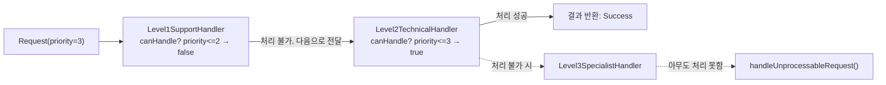

Command와 Chain of Responsibility 패턴을 통해 요청 처리의 우아한 설계를 탐구합니다. 요청 객체화와 책임의 연쇄로 유연한 시스템을 구축합니다.

## 서론: 요청을 객체로, 책임을 체인으로

> *"좋은 설계는 '무엇을 할 것인가'와 '누가 할 것인가'를 분리한다. Command 패턴은 전자를, Chain of Responsibility는 후자를 해결한다."*

현대 소프트웨어에서 **"요청(Request)"**은 단순한 메서드 호출을 넘어 복잡한 워크플로우의 시작점입니다. 사용자의 클릭, API 호출, 시스템 이벤트... 이 모든 요청들을 어떻게 **우아하게 처리**할 수 있을까요?

**Command 패턴**은 **"요청을 객체로 캡슐화"**하여 실행 지연, 큐잉, 로깅, Undo/Redo를 가능하게 합니다. **Chain of Responsibility 패턴**은 **"처리 책임을 체인으로 연결"**하여 요청을 적절한 처리자에게 전달합니다.

GoF는 두 패턴을 각각 다음과 같이 정의합니다.

> "Encapsulate a request as an object, thereby letting you parameterize clients with different requests, queue or log requests, and support undoable operations." — Gamma et al., 1994

이 두 패턴은 **"요청 처리의 완전한 아키텍처"**를 제공합니다:
- Command: 요청의 **캡슐화**와 **재사용성**
- Chain of Responsibility: 처리자의 **분리**와 **확장성**

## Command 패턴 - 요청의 객체화

### Command 패턴의 핵심 철학

Command 패턴의 핵심은 **"Do, Undo, Redo"**입니다. 요청을 객체로 만들면 다음이 가능해집니다:

```java
// 전통적인 방식의 한계
class BadTextEditor {
    private StringBuilder content = new StringBuilder("Hello World");
    
    public void insertText(String text, int position) {
        content.insert(position, text);
        // 😱 실행 후 되돌릴 방법이 없음
        // 😱 실행 전에 검증할 방법이 없음
        // 😱 나중에 실행할 방법이 없음
        // 😱 여러 번 실행할 방법이 없음
    }
}
```

### Command 패턴으로 혁신적 해결

```java
// Command 패턴의 강력함
interface Command {
    void execute();
    void undo();
    boolean canExecute();
    String getDescription();
    LocalDateTime getTimestamp();
}

// Document 클래스 (Receiver)
class Document {
    private StringBuilder content;
    private final List<DocumentListener> listeners;
    
    public Document(String initialContent) {
        this.content = new StringBuilder(initialContent);
        this.listeners = new ArrayList<>();
    }
    
    public void insertText(String text, int position) {
        validatePosition(position);
        content.insert(position, text);
        notifyListeners("INSERT", text, position);
    }
    
    public String deleteText(int start, int length) {
        validateRange(start, length);
        String deleted = content.substring(start, start + length);
        content.delete(start, start + length);
        notifyListeners("DELETE", deleted, start);
        return deleted;
    }
    
    public String getContent() {
        return content.toString();
    }
    
    public int getLength() {
        return content.length();
    }
    
    private void validatePosition(int position) {
        if (position < 0 || position > content.length()) {
            throw new IllegalArgumentException("Invalid position: " + position);
        }
    }
    
    private void validateRange(int start, int length) {
        if (start < 0 || length < 0 || start + length > content.length()) {
            throw new IllegalArgumentException("Invalid range: " + start + ", " + length);
        }
    }
    
    private void notifyListeners(String operation, String text, int position) {
        for (DocumentListener listener : listeners) {
            listener.onDocumentChanged(operation, text, position);
        }
    }
    
    public void addListener(DocumentListener listener) {
        listeners.add(listener);
    }
}

interface DocumentListener {
    void onDocumentChanged(String operation, String text, int position);
}

// ConcreteCommand 구현체들
class InsertCommand implements Command {
    private final Document document;
    private final String text;
    private final int position;
    private final LocalDateTime timestamp;
    
    public InsertCommand(Document document, String text, int position) {
        this.document = document;
        this.text = text;
        this.position = position;
        this.timestamp = LocalDateTime.now();
    }
    
    @Override
    public void execute() {
        if (!canExecute()) {
            throw new IllegalStateException("Command cannot be executed");
        }
        document.insertText(text, position);
    }
    
    @Override
    public void undo() {
        document.deleteText(position, text.length());
    }
    
    @Override
    public boolean canExecute() {
        return position >= 0 && position <= document.getLength() && text != null;
    }
    
    @Override
    public String getDescription() {
        return String.format("Insert '%s' at position %d", text, position);
    }
    
    @Override
    public LocalDateTime getTimestamp() {
        return timestamp;
    }
}

// 매크로 명령
class MacroCommand implements Command {
    private final List<Command> commands;
    private final String description;
    private final LocalDateTime timestamp;
    
    public MacroCommand(String description) {
        this.commands = new ArrayList<>();
        this.description = description;
        this.timestamp = LocalDateTime.now();
    }
    
    public void addCommand(Command command) {
        commands.add(command);
    }
    
    @Override
    public void execute() {
        for (Command command : commands) {
            if (command.canExecute()) {
                command.execute();
            } else {
                throw new IllegalStateException("Macro contains invalid command");
            }
        }
    }
    
    @Override
    public void undo() {
        // 역순으로 undo 실행
        for (int i = commands.size() - 1; i >= 0; i--) {
            commands.get(i).undo();
        }
    }
    
    @Override
    public boolean canExecute() {
        return commands.stream().allMatch(Command::canExecute);
    }
    
    @Override
    public String getDescription() {
        return String.format("%s (%d commands)", description, commands.size());
    }
    
    @Override
    public LocalDateTime getTimestamp() {
        return timestamp;
    }
}

// CommandManager (Invoker)
class CommandManager {
    private final Deque<Command> undoStack;
    private final Deque<Command> redoStack;
    private final int maxHistorySize;
    
    public CommandManager(int maxHistorySize) {
        this.undoStack = new ArrayDeque<>();
        this.redoStack = new ArrayDeque<>();
        this.maxHistorySize = maxHistorySize;
    }
    
    public void executeCommand(Command command) {
        if (!command.canExecute()) {
            throw new IllegalArgumentException("Command cannot be executed");
        }
        
        command.execute();
        undoStack.addLast(command);
        redoStack.clear();
        
        while (undoStack.size() > maxHistorySize) {
            undoStack.removeFirst();
        }
    }
    
    public boolean canUndo() {
        return !undoStack.isEmpty();
    }
    
    public boolean canRedo() {
        return !redoStack.isEmpty();
    }
    
    public void undo() {
        if (canUndo()) {
            Command command = undoStack.removeLast();
            command.undo();
            redoStack.addLast(command);
        }
    }
    
    public void redo() {
        if (canRedo()) {
            Command command = redoStack.removeLast();
            command.execute();
            undoStack.addLast(command);
        }
    }
}
```

### 이 코드의 트레이드오프

`CommandManager`는 실행된 Command를 스택에 쌓아 Undo/Redo를 지원하지만, 그 대가로 각 Command가 자신을 되돌리는 데 필요한 상태(삽입한 텍스트, 삭제 위치 등)를 스스로 들고 있어야 합니다. 이는 Command 클래스 수를 늘리고 Receiver의 내부 동작에 대한 지식을 Command 쪽으로 노출시킵니다. `maxHistorySize`로 오래된 기록을 버리는 방식은 메모리 사용량을 제한하지만, 그만큼 과거로 되돌릴 수 있는 한계도 함께 생깁니다. `MacroCommand`의 `undo()`가 개별 Command를 역순으로 되돌리는 구조는 원자적 트랜잭션처럼 보이지만, 중간에 예외가 발생하면 부분적으로만 되돌려진 상태가 남을 수 있어 실제 프로덕션에서는 별도의 롤백 안전장치가 필요합니다.

## Chain of Responsibility - 책임의 연쇄

### Chain of Responsibility의 핵심 철학

Chain of Responsibility 패턴은 **"요청을 처리할 수 있는 객체들의 체인을 구성"**하여 요청을 적절한 처리자에게 전달합니다.

```java
// 전통적인 방식의 한계
class BadSupportSystem {
    public void handleRequest(String requestType, String description) {
        // 😱 모든 처리 로직이 한 곳에 집중
        if (requestType.equals("PASSWORD_RESET")) {
            if (description.contains("forgot")) {
                // Level 1 처리
            } else if (description.contains("locked")) {
                // Level 2 처리
            } else {
                // Level 3 처리
            }
        } else if (requestType.equals("BILLING")) {
            // 또 다른 복잡한 조건문들...
        }
        // 😱 새로운 요청 타입 추가 시 이 메서드 수정 필요
    }
}
```

### Chain of Responsibility로 우아하게 해결

```java
// Chain of Responsibility 패턴의 우아함
abstract class RequestHandler {
    protected RequestHandler nextHandler;
    protected final String handlerName;
    protected final Set<String> supportedTypes;
    
    public RequestHandler(String handlerName, String... supportedTypes) {
        this.handlerName = handlerName;
        this.supportedTypes = Set.of(supportedTypes);
    }
    
    public RequestHandler setNext(RequestHandler handler) {
        this.nextHandler = handler;
        return handler;
    }
    
    public final void handleRequest(Request request) {
        if (canHandle(request)) {
            long startTime = System.nanoTime();
            RequestResult result = doHandle(request);
            long endTime = System.nanoTime();
            
            result.setProcessingTime(endTime - startTime);
            result.setHandlerName(handlerName);
            request.setResult(result);
            
            if (result.isSuccess()) {
                System.out.printf("[OK] %s handled: %s\n", handlerName, request.getId());
                return;
            }
        }
        
        if (nextHandler != null) {
            nextHandler.handleRequest(request);
        } else {
            handleUnprocessableRequest(request);
        }
    }
    
    protected abstract boolean canHandle(Request request);
    protected abstract RequestResult doHandle(Request request);
    
    protected void handleUnprocessableRequest(Request request) {
        System.out.printf("[Error] No handler found for: %s\n", request.getId());
        request.setResult(RequestResult.failed("No suitable handler found"));
    }
}

// Request와 Result 클래스들
class Request {
    private final String id;
    private final String type;
    private final String description;
    private final Priority priority;
    private final LocalDateTime timestamp;
    private RequestResult result;
    
    public Request(String type, String description, Priority priority) {
        this.id = UUID.randomUUID().toString();
        this.type = type;
        this.description = description;
        this.priority = priority;
        this.timestamp = LocalDateTime.now();
    }
    
    // getters and setters
    public String getId() { return id; }
    public String getType() { return type; }
    public String getDescription() { return description; }
    public Priority getPriority() { return priority; }
    public LocalDateTime getTimestamp() { return timestamp; }
    public RequestResult getResult() { return result; }
    public void setResult(RequestResult result) { this.result = result; }
}

class RequestResult {
    private final boolean success;
    private final String message;
    private String handlerName;
    private long processingTime;
    
    private RequestResult(boolean success, String message) {
        this.success = success;
        this.message = message;
    }
    
    public static RequestResult success(String message) {
        return new RequestResult(true, message);
    }
    
    public static RequestResult failed(String message) {
        return new RequestResult(false, message);
    }
    
    // getters and setters
    public boolean isSuccess() { return success; }
    public String getMessage() { return message; }
    public String getHandlerName() { return handlerName; }
    public void setHandlerName(String handlerName) { this.handlerName = handlerName; }
    public long getProcessingTime() { return processingTime; }
    public void setProcessingTime(long processingTime) { this.processingTime = processingTime; }
}

enum Priority {
    LOW(1), MEDIUM(2), HIGH(3), CRITICAL(4);
    
    private final int level;
    Priority(int level) { this.level = level; }
    public int getLevel() { return level; }
}

// ConcreteHandler 구현체들
class Level1SupportHandler extends RequestHandler {
    public Level1SupportHandler() {
        super("Level 1 Support", "PASSWORD_RESET", "ACCOUNT_QUESTION");
    }
    
    @Override
    protected boolean canHandle(Request request) {
        return supportedTypes.contains(request.getType()) && 
               request.getPriority().getLevel() <= 2;
    }
    
    @Override
    protected RequestResult doHandle(Request request) {
        System.out.println("🔐 Processing basic support request...");
        return RequestResult.success("Basic support provided");
    }
}

class Level2TechnicalHandler extends RequestHandler {
    public Level2TechnicalHandler() {
        super("Level 2 Technical", "TECHNICAL_ISSUE", "BILLING_PROBLEM");
    }
    
    @Override
    protected boolean canHandle(Request request) {
        return supportedTypes.contains(request.getType()) && 
               request.getPriority().getLevel() <= 3;
    }
    
    @Override
    protected RequestResult doHandle(Request request) {
        System.out.println("🔧 Processing technical issue...");
        return RequestResult.success("Technical issue resolved");
    }
}

class Level3SpecialistHandler extends RequestHandler {
    public Level3SpecialistHandler() {
        super("Level 3 Specialist", "CRITICAL_ISSUE", "SECURITY_BREACH");
    }
    
    @Override
    protected boolean canHandle(Request request) {
        return supportedTypes.contains(request.getType()) || 
               request.getPriority() == Priority.CRITICAL;
    }
    
    @Override
    protected RequestResult doHandle(Request request) {
        System.out.println("🚨 Specialist handling critical request...");
        return RequestResult.success("Critical issue resolved by specialist");
    }
}

// Chain Builder
class SupportChainBuilder {
    public static RequestHandler buildSupportChain() {
        RequestHandler level1 = new Level1SupportHandler();
        RequestHandler level2 = new Level2TechnicalHandler();
        RequestHandler level3 = new Level3SpecialistHandler();
        
        level1.setNext(level2).setNext(level3);
        return level1;
    }
}
```

### 이 코드의 트레이드오프

`RequestHandler` 체인은 각 핸들러가 `canHandle()`로 처리 가능 여부만 판단하면 되므로 새 핸들러를 추가·제거해도 다른 핸들러를 수정할 필요가 없습니다. 하지만 이 느슨한 결합은 "이 요청이 결국 어디서 처리되는지"를 코드만 보고 파악하기 어렵게 만듭니다 — 디버깅 시 체인 전체를 따라가야 하고, `SupportChainBuilder`처럼 순서를 명시적으로 조립하는 코드가 없으면 실행 순서를 예측할 수 없습니다. 또한 처리 보장이 없다는 점도 트레이드오프입니다. 마지막 핸들러까지 아무도 처리하지 못하면 `handleUnprocessableRequest()`로 흘러가는데, 체인이 길어질수록 이 경로에 도달하는 비용(모든 핸들러의 `canHandle()` 호출)도 함께 커집니다.

아래는 `SupportChainBuilder`가 조립한 체인에서 우선순위(Priority) 3짜리 요청이 처리되는 흐름입니다. Level 1은 처리 가능 레벨(2)을 넘어서므로 통과시키고, Level 2가 실제로 처리합니다.



### 미들웨어 패턴으로의 진화

```java
// 웹 미들웨어 스타일 구현
interface Middleware {
    void handle(HttpRequest request, HttpResponse response, MiddlewareChain chain);
}

class MiddlewareChain {
    private final List<Middleware> middlewares;
    private int currentIndex = 0;
    
    public MiddlewareChain(List<Middleware> middlewares) {
        this.middlewares = new ArrayList<>(middlewares);
    }
    
    public void proceed(HttpRequest request, HttpResponse response) {
        if (currentIndex < middlewares.size()) {
            Middleware currentMiddleware = middlewares.get(currentIndex++);
            currentMiddleware.handle(request, response, this);
        }
    }
}

// 인증 미들웨어
class AuthenticationMiddleware implements Middleware {
    @Override
    public void handle(HttpRequest request, HttpResponse response, MiddlewareChain chain) {
        String token = request.getHeader("Authorization");
        
        if (token == null || !validateToken(token)) {
            response.setStatus(401);
            response.setBody("Unauthorized");
            return;
        }
        
        chain.proceed(request, response);
    }
    
    private boolean validateToken(String token) {
        return token.startsWith("Bearer ") && token.length() > 10;
    }
}

// 로깅 미들웨어
class LoggingMiddleware implements Middleware {
    @Override
    public void handle(HttpRequest request, HttpResponse response, MiddlewareChain chain) {
        long startTime = System.currentTimeMillis();
        
        System.out.printf("→ %s %s\n", request.getMethod(), request.getPath());
        
        chain.proceed(request, response);
        
        long endTime = System.currentTimeMillis();
        System.out.printf("← %d (%dms)\n", response.getStatus(), endTime - startTime);
    }
}

// HTTP 관련 클래스들
class HttpRequest {
    private final String method;
    private final String path;
    private final Map<String, String> headers;
    
    public HttpRequest(String method, String path) {
        this.method = method;
        this.path = path;
        this.headers = new HashMap<>();
    }
    
    public String getMethod() { return method; }
    public String getPath() { return path; }
    public String getHeader(String name) { return headers.get(name); }
    public void setHeader(String name, String value) { headers.put(name, value); }
}

class HttpResponse {
    private int status = 200;
    private String body = "";
    
    public int getStatus() { return status; }
    public void setStatus(int status) { this.status = status; }
    public String getBody() { return body; }
    public void setBody(String body) { this.body = body; }
}
```

### 이 코드의 트레이드오프

`MiddlewareChain`은 각 미들웨어가 `chain.proceed()`를 호출해야만 다음 단계로 넘어가는 구조라서, 특정 미들웨어가 이 호출을 빠뜨리면 이후 체인 전체가 조용히 실행되지 않습니다 — Chain of Responsibility의 자동 전달과 달리 전달 책임이 각 미들웨어 구현자에게 넘어가는 셈입니다. 인증 미들웨어처럼 `proceed()`를 호출하지 않고 즉시 응답을 반환하는 패턴은 유용하지만, 로깅 미들웨어처럼 `proceed()` 전후로 로직을 감싸는 코드가 섞이면 순서 의존성이 생겨 미들웨어 등록 순서를 바꾸는 것만으로 동작이 달라질 수 있습니다. 결국 미들웨어 체인은 유연성을 얻는 대신 "실행 순서"라는 암묵적 계약을 코드 리뷰와 테스트로 지켜야 하는 부담을 팀에 떠넘깁니다.

## 한눈에 보는 Command & Chain of Responsibility 패턴

### Command vs Chain of Responsibility 핵심 비교

| 비교 항목 | Command 패턴 | Chain of Responsibility 패턴 |
|----------|-------------|---------------------------|
| **핵심 목적** | 요청을 객체로 캡슐화 | 요청 처리 기회를 여러 객체에 부여 |
| **구조** | 단일 핸들러 지정 | 핸들러 체인 |
| **처리자 결정** | 호출 시점에 명확 | 런타임에 동적 결정 |
| **Undo/Redo** | 지원 용이 | 지원 어려움 |
| **결합도** | Invoker-Receiver 분리 | 핸들러 간 느슨한 연결 |
| **확장성** | 새 Command 추가 | 체인에 핸들러 추가/제거 |

### Command 패턴 핵심 참여자

| 참여자 | 역할 | 책임 |
|--------|------|------|
| Command | 인터페이스 | execute(), undo() 정의 |
| ConcreteCommand | 구체 명령 | Receiver 호출, 상태 저장 |
| Invoker | 요청자 | Command 실행 트리거 |
| Receiver | 수신자 | 실제 작업 수행 |
| Client | 조립자 | Command-Receiver 연결 |

### Chain of Responsibility 처리 방식

| 처리 방식 | 설명 | 예시 |
|----------|------|------|
| 단일 처리 | 하나의 핸들러만 처리 | 권한 검증 체인 |
| 다중 처리 | 여러 핸들러가 순차 처리 | 미들웨어 체인 |
| 선택적 처리 | 조건에 따라 처리/스킵 | 로깅 필터 |
| 변환 처리 | 요청을 변환하며 전달 | 파이프라인 |

### 적용 시나리오 비교

| 시나리오 | Command | Chain of Responsibility |
|----------|---------|------------------------|
| Undo/Redo 기능 | O | X |
| 매크로 기록 | O | X |
| 트랜잭션 | O | X |
| 요청 큐잉 | O | X |
| 권한 검증 체인 | X | O |
| HTTP 미들웨어 | X | O |
| 로깅 필터 | X | O |
| 이벤트 버블링 | X | O |

### 현대적 활용 비교

| 프레임워크/도구 | Command 활용 | CoR 활용 |
|---------------|-------------|---------|
| Spring | @Transactional | Filter, Interceptor |
| Java Servlet | - | Filter Chain |
| Express.js | - | Middleware |
| Redux | Action (Command류) | Middleware |
| GUI Framework | 버튼 클릭 핸들링 | 이벤트 버블링 |

### 장단점 비교

| 패턴 | 장점 | 단점 |
|------|------|------|
| Command | Undo/Redo 지원, 요청 큐잉, 매크로, SRP 준수 | 클래스 수 증가, 구조 복잡 |
| CoR | 느슨한 결합, 동적 체인 구성, 유연한 처리 | 처리 보장 없음, 디버깅 어려움 |

### 조합 패턴

| 조합 | 효과 | 사용 예 |
|------|------|--------|
| Command + Memento | Undo 상태 저장 | 텍스트 에디터 |
| Command + Composite | 매크로 명령 | 일괄 작업 |
| CoR + Template Method | 처리 골격 정의 | 검증 파이프라인 |
| CoR + Strategy | 핸들러별 전략 | 동적 필터링 |

### 적용 체크리스트

| Command 체크 항목 | CoR 체크 항목 |
|------------------|--------------|
| 요청을 객체로 저장해야 하는가? | 여러 객체가 처리 기회를 가져야 하는가? |
| Undo/Redo가 필요한가? | 처리자를 동적으로 결정해야 하는가? |
| 요청을 큐에 저장/지연 실행? | 체인 순서가 중요한가? |
| 매크로 기록이 필요한가? | 요청이 전파되어야 하는가? |

---

## 결론: 요청 처리 아키텍처의 완성

Command와 Chain of Responsibility 패턴은 **"요청 처리 아키텍처"**의 핵심 구성 요소입니다. 서론에서 밝혔듯 Command는 요청의 **캡슐화**와 **재사용성**을, Chain of Responsibility는 처리자의 **분리**와 **확장성**을 각각 담당합니다.

### Command·CoR을 혼동하는 흔한 오개념

두 패턴 모두 "요청을 객체처럼 다룬다"는 인상 때문에 같은 계열로 묶어 혼동하기 쉽지만, 캡슐화하는 대상 자체가 다릅니다. Command가 캡슐화하는 것은 요청 **자체**(무엇을 실행하고 어떻게 되돌릴지)이며, 이 캡슐화된 요청은 정확히 하나의 Receiver를 향해 한 번 실행됩니다. 반면 Chain of Responsibility가 캡슐화하는 것은 요청을 처리자에게 전달하는 **절차**이고, 요청 자체는 앞서 본 `Request`처럼 평범한 데이터일 뿐이며 실제로 어떤 Handler가 처리할지는 런타임에 결정됩니다. 또한 "Command는 큐에 쌓아 나중에 실행하고, CoR도 체인을 따라 순회하니 결국 비슷한 지연 처리 아니냐"는 오해도 흔합니다. `CommandManager`의 undo/redo 스택이 보여주듯 Command는 실행 시점 자체를 지연·반복·취소할 수 있지만, `RequestHandler` 체인은 요청이 들어온 즉시 다음 핸들러로 전파될 뿐 되돌리기나 재실행 개념이 없습니다. 두 패턴을 조합한 구조(각 CoR 핸들러가 직접 처리하는 대신 Command를 큐에 적재하는 방식)에서도 "누가 처리할지 결정하는 절차"와 "무엇을 어떻게 실행할지"는 끝까지 분리된 책임으로 남습니다.

두 패턴 모두 **"관심사의 분리"**를 통해 코드의 유지보수성과 확장성을 크게 향상시킵니다. 현대 소프트웨어의 복잡한 요청 처리 시나리오에서 필수적인 패턴들입니다.

다음 글에서는 **Template Method와 Iterator 패턴**을 탐구하겠습니다. 알고리즘의 골격 정의와 순차적 접근을 통한 코드 재사용과 캡슐화 방법을 살펴보겠습니다.

---

**핵심 메시지:**
"Command는 '무엇을 할 것인가'를 객체로 캡슐화하고, Chain of Responsibility는 '누가 할 것인가'를 유연하게 결정한다. 두 패턴의 조합은 현대 소프트웨어의 복잡한 요청 처리 아키텍처의 핵심이다."

### 평가 기준

**독자가 이 글을 읽은 후 달성해야 할 목표:**
- [ ] Command 패턴으로 Undo/Redo가 가능한 실행 취소 시스템을 설계할 수 있다
- [ ] Chain of Responsibility 패턴으로 요청 처리 체인을 구성할 수 있다
- [ ] Command와 Chain of Responsibility의 적용 시나리오 차이를 구분할 수 있다
- [ ] 미들웨어 체인에서 `proceed()` 호출 누락이 왜 위험한지 설명할 수 있다
- [ ] 각 패턴의 트레이드오프(클래스 수 증가, 처리 보장 부재 등)를 근거로 도입 여부를 판단할 수 있다 