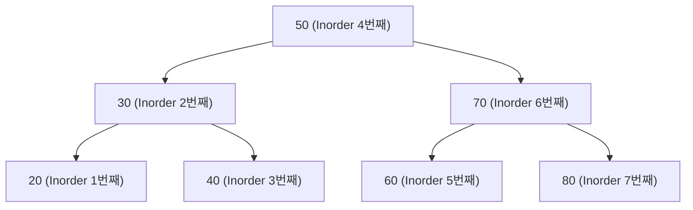

Template Method와 Iterator 패턴을 통해 알고리즘 골격 정의와 순회 추상화를 탐구합니다. 재사용 가능한 구조와 유연한 접근 방법을 설계합니다.

## 서론: 구조의 정의와 접근의 추상화

> *"Template Method는 '어떻게 할 것인가'의 구조를 정의하고, Iterator는 '어떻게 접근할 것인가'를 추상화한다."*

소프트웨어 개발에서 <strong>"재사용 가능한 구조"</strong>와 <strong>"유연한 접근 방법"</strong>은 핵심적인 설계 고려사항입니다. 비슷한 알고리즘이지만 세부 구현이 다른 경우, 동일한 컬렉션이지만 다양한 순회 방식이 필요한 경우... 이런 상황을 어떻게 우아하게 해결할 수 있을까요?

**Template Method 패턴**은 <strong>"알고리즘의 골격을 정의"</strong>하고 세부 구현을 하위 클래스에 위임하는 <strong>할리우드 원칙(Hollywood Principle)</strong>을 구현합니다. **Iterator 패턴**은 <strong>"순회 방법을 추상화"</strong>하여 컬렉션의 내부 구조를 숨기고 다양한 접근 방식을 제공합니다.

GoF는 두 패턴을 각각 다음과 같이 정의합니다.

> "Define the skeleton of an algorithm in an operation, deferring some steps to subclasses. Template Method lets subclasses redefine certain steps of an algorithm without changing the algorithm's structure." — Gamma et al., 1994

> "Provide a way to access the elements of an aggregate object sequentially without exposing its underlying representation." — Gamma et al., 1994

이 두 패턴은 <strong>"제어 역전(Inversion of Control)"</strong>과 <strong>"캡슐화"</strong>의 완벽한 예시이며, 각각 다음과 같은 핵심 가치를 제공합니다:
- **Template Method**: 알고리즘 **구조**의 제어 역전 — 할리우드 원칙 구현, 확장 포인트 명확화, 공통 로직 중앙집중화
- **Iterator**: 컬렉션 **순회**의 캡슐화 — 내부 구조 은닉, 다양한 순회 방식 지원, 지연 평가와 메모리 효율성

## Template Method 패턴 - 알고리즘 골격의 정의

### Template Method의 핵심 철학

Template Method 패턴의 핵심은 **"Don't call us, we'll call you"** (할리우드 원칙)입니다. 상위 클래스가 알고리즘의 제어 흐름을 관리하고, 하위 클래스는 특정 단계만 구현합니다.

```java
// Template Method 없이 구현한다면?
class BadDataProcessor {
    public void processCsvData(String file) {
        // CSV 특화 읽기
        String data = readCsvFile(file);
        // CSV 특화 변환
        List<Record> records = parseCsv(data);
        // CSV 특화 저장
        saveCsvData(records);
    }
    
    public void processJsonData(String file) {
        // JSON 특화 읽기
        String data = readJsonFile(file);
        // JSON 특화 변환
        List<Record> records = parseJson(data);
        // JSON 특화 저장
        saveJsonData(records);
    }
    
    // 😱 공통 알고리즘 구조의 중복
    // 😱 새로운 포맷 추가 시 전체 메서드 복사
    // 😱 에러 처리, 로깅 등 횡단 관심사 중복
}
```

### Template Method로 우아하게 해결

앞의 실패 사례에서 CSV와 JSON 처리는 "읽기 → 변환 → 저장"이라는 동일한 뼈대를 공유하면서도 각 단계의 세부 구현만 달랐습니다. 이 뼈대를 `processData()`라는 하나의 `final` 메서드로 고정하고, 포맷마다 달라지는 지점만 추상 메서드나 Hook 메서드로 빼내면 알고리즘 구조의 중복은 사라지고 하위 클래스는 자신이 책임질 단계만 구현하면 됩니다. 아래 `DataProcessor`는 이 구조를 `final` 템플릿 메서드, 공통 구현을 담은 Concrete Method, 기본 동작이 있어 선택적으로 오버라이드하는 Hook Method, 반드시 구현해야 하는 Abstract Method 네 종류로 구분해 보여줍니다.

```java
import java.time.LocalDateTime;
import java.util.ArrayList;
import java.util.HashMap;
import java.util.List;
import java.util.Map;

// Template Method 패턴의 우아함
abstract class DataProcessor {
    // Template Method - 알고리즘 골격 정의 (final로 오버라이드 방지)
    public final ProcessingResult processData(String inputFile) {
        ProcessingResult result = new ProcessingResult();
        
        try {
            // 1. 전처리 (Hook Method)
            onProcessingStarted(inputFile);
            
            // 2. 데이터 읽기 (Concrete Method)
            RawData rawData = readData(inputFile);
            result.addStep("Read", "Success");
            
            // 3. 데이터 검증 (Hook Method)
            if (!validateData(rawData)) {
                result.addStep("Validation", "Failed");
                return result.markAsFailed("Data validation failed");
            }
            result.addStep("Validation", "Success");
            
            // 4. 데이터 변환 (Abstract Method - 필수 구현)
            ProcessedData processedData = transformData(rawData);
            result.addStep("Transform", "Success");
            result.setProcessedData(processedData);
            
            // 5. 추가 처리 (Hook Method)
            enhanceData(processedData);
            result.addStep("Enhancement", "Success");
            
            // 6. 데이터 저장 (Concrete Method)
            saveData(processedData);
            result.addStep("Save", "Success");
            
            // 7. 후처리 (Hook Method)
            onProcessingCompleted(result);
            
            return result.markAsSuccess();
            
        } catch (Exception e) {
            result.addStep("Error", e.getMessage());
            onProcessingFailed(e, result);
            return result.markAsFailed(e.getMessage());
        }
    }
    
    // Concrete Methods - 공통 구현
    protected RawData readData(String inputFile) {
        System.out.println("📖 Reading data from: " + inputFile);
        // 파일 시스템 접근, 에러 처리 등 공통 로직
        return new RawData(inputFile, readFileContent(inputFile));
    }
    
    protected void saveData(ProcessedData data) {
        System.out.println("💾 Saving processed data: " + data.getRecordCount() + " records");
        // 데이터베이스 저장, 파일 출력 등 공통 로직
        persistData(data);
    }
    
    // Hook Methods - 선택적 확장 포인트 (기본 구현 제공)
    protected void onProcessingStarted(String inputFile) {
        System.out.println("[Start] Processing started for: " + inputFile);
    }
    
    protected boolean validateData(RawData data) {
        // 기본 검증 로직
        return data != null && !data.isEmpty();
    }
    
    protected void enhanceData(ProcessedData data) {
        // 기본적으로는 아무것도 하지 않음
        System.out.println("[Info] Basic data enhancement applied");
    }
    
    protected void onProcessingCompleted(ProcessingResult result) {
        System.out.println("[OK] Processing completed successfully");
    }
    
    protected void onProcessingFailed(Exception e, ProcessingResult result) {
        System.err.println("[Error] Processing failed: " + e.getMessage());
    }
    
    // Abstract Methods - 하위 클래스에서 반드시 구현
    protected abstract ProcessedData transformData(RawData rawData);
    protected abstract String getProcessorType();
    
    // Helper methods
    private String readFileContent(String inputFile) {
        // 실제 파일 읽기 로직
        return "file content from " + inputFile;
    }
    
    private void persistData(ProcessedData data) {
        // 실제 데이터 저장 로직
        System.out.println("Data persisted: " + data.getRecordCount() + " records");
    }
}
```

`DataProcessor`가 골격을 제공했으니, 이제 그 골격을 채우는 하위 클래스 차례입니다. `CsvDataProcessor`와 `JsonDataProcessor`는 `transformData()`(Abstract Method)를 반드시 구현하고, `validateData()`와 `enhanceData()`(Hook Method)는 필요한 만큼만 오버라이드합니다. 같은 상위 클래스의 서로 다른 하위 단계만 재정의하면서도 완전히 다른 포맷을 처리하는 모습에서, Hook Method와 Abstract Method의 역할 차이가 실제 코드로 어떻게 드러나는지 확인할 수 있습니다.

```java
// ConcreteClass - CSV 처리기
class CsvDataProcessor extends DataProcessor {
    @Override
    protected ProcessedData transformData(RawData rawData) {
        System.out.println("🔄 Transforming CSV data...");
        
        String content = rawData.getContent();
        List<DataRecord> records = new ArrayList<>();
        
        // CSV 파싱 로직
        String[] lines = content.split("\n");
        if (lines.length > 0) {
            String[] headers = lines[0].split(",");
            
            for (int i = 1; i < lines.length; i++) {
                String[] values = lines[i].split(",");
                Map<String, String> recordData = new HashMap<>();
                
                for (int j = 0; j < Math.min(headers.length, values.length); j++) {
                    recordData.put(headers[j].trim(), values[j].trim());
                }
                
                records.add(new DataRecord(recordData));
            }
        }
        
        return new ProcessedData(records, "CSV");
    }
    
    @Override
    protected boolean validateData(RawData data) {
        // CSV 특화 검증
        if (!super.validateData(data)) {
            return false;
        }
        
        String content = data.getContent();
        return content.contains(",") && content.contains("\n");
    }
    
    @Override
    protected void enhanceData(ProcessedData data) {
        super.enhanceData(data);
        System.out.println("📊 CSV-specific enhancement: calculating column statistics");
        
        // CSV 특화 개선 로직
        for (DataRecord record : data.getRecords()) {
            record.addMetadata("format", "csv");
            record.addMetadata("processed_at", LocalDateTime.now().toString());
        }
    }
    
    @Override
    protected String getProcessorType() {
        return "CSV_PROCESSOR";
    }
}

// ConcreteClass - JSON 처리기
class JsonDataProcessor extends DataProcessor {
    @Override
    protected ProcessedData transformData(RawData rawData) {
        System.out.println("🔄 Transforming JSON data...");
        
        String content = rawData.getContent();
        List<DataRecord> records = new ArrayList<>();
        
        // 간단한 JSON 파싱 시뮬레이션
        if (content.trim().startsWith("{") && content.trim().endsWith("}")) {
            Map<String, String> recordData = new HashMap<>();
            recordData.put("type", "json_object");
            recordData.put("content", content);
            records.add(new DataRecord(recordData));
        }
        
        return new ProcessedData(records, "JSON");
    }
    
    @Override
    protected boolean validateData(RawData data) {
        if (!super.validateData(data)) {
            return false;
        }
        
        String content = data.getContent().trim();
        return (content.startsWith("{") && content.endsWith("}")) ||
               (content.startsWith("[") && content.endsWith("]"));
    }
    
    @Override
    protected void enhanceData(ProcessedData data) {
        super.enhanceData(data);
        System.out.println("🔧 JSON-specific enhancement: schema validation");
        
        // JSON 특화 개선 로직
        for (DataRecord record : data.getRecords()) {
            record.addMetadata("format", "json");
            record.addMetadata("schema_version", "1.0");
        }
    }
    
    @Override
    protected String getProcessorType() {
        return "JSON_PROCESSOR";
    }
}

// 고급 Template Method - 조건부 실행
abstract class ConditionalDataProcessor extends DataProcessor {
    @Override
    public final ProcessingResult processData(String inputFile) {
        // 전처리 조건 확인
        if (!shouldProcess(inputFile)) {
            return ProcessingResult.skipped("Processing skipped based on conditions");
        }
        
        // 원본 템플릿 메서드 실행
        ProcessingResult result = super.processData(inputFile);
        
        // 후처리 조건 확인
        if (result.isSuccess() && shouldPostProcess(result)) {
            performPostProcessing(result);
        }
        
        return result;
    }
    
    // 추가 Hook Methods
    protected boolean shouldProcess(String inputFile) {
        return true; // 기본적으로 모든 파일 처리
    }
    
    protected boolean shouldPostProcess(ProcessingResult result) {
        return result.getProcessedData().getRecordCount() > 0;
    }
    
    protected void performPostProcessing(ProcessingResult result) {
        System.out.println("🔄 Performing post-processing...");
    }
}
```

지금까지 등장한 `RawData`, `ProcessedData`, `DataRecord`, `ProcessingResult`는 알고리즘 로직을 담지 않는 순수 데이터 보관 객체(DTO)입니다. 필드를 캡슐화하고 JavaBean 관례에 따른 접근자만 제공하므로 Template Method의 설계 의도와는 무관하며, 읽을 때도 각 필드가 무엇을 담는지와 `ProcessingResult`가 상태 전이(`markAsSuccess`/`markAsFailed`/`skipped`)를 어떻게 표현하는지만 확인하면 충분합니다. 아래 코드는 트레이드오프 논의와 무관한 단순 접근자를 한 줄로 묶어 표기했습니다 — 실제 프로젝트라면 Lombok의 `@Getter`나 Java record로 더 줄일 수 있는 부분입니다.

```java
// 지원 클래스들 (DTO) - 트레이드오프와 무관한 단순 접근자는 한 줄로 축약 표기
class RawData {
    private final String source;
    private final String content;

    public RawData(String source, String content) { this.source = source; this.content = content; }

    public String getSource() { return source; } public String getContent() { return content; } public boolean isEmpty() { return content == null || content.trim().isEmpty(); }
}

class ProcessedData {
    private final List<DataRecord> records;
    private final String format;

    public ProcessedData(List<DataRecord> records, String format) { this.records = records; this.format = format; }

    public List<DataRecord> getRecords() { return records; } public String getFormat() { return format; } public int getRecordCount() { return records.size(); }
}

class DataRecord {
    private final Map<String, String> data;
    private final Map<String, String> metadata;

    public DataRecord(Map<String, String> data) { this.data = new HashMap<>(data); this.metadata = new HashMap<>(); }

    public Map<String, String> getData() { return data; } public Map<String, String> getMetadata() { return metadata; } public void addMetadata(String key, String value) { metadata.put(key, value); }
}

class ProcessingResult {
    private final List<ProcessingStep> steps;
    private boolean success;
    private String message;
    private ProcessedData processedData;

    public ProcessingResult() { this.steps = new ArrayList<>(); this.success = false; }

    public void addStep(String stepName, String status) {
        steps.add(new ProcessingStep(stepName, status, LocalDateTime.now()));
    }

    public ProcessingResult markAsSuccess() { this.success = true; this.message = "Processing completed successfully"; return this; }
    public ProcessingResult markAsFailed(String message) { this.success = false; this.message = message; return this; }
    public static ProcessingResult skipped(String reason) {
        ProcessingResult result = new ProcessingResult();
        result.message = reason;
        return result;
    }

    // 이하 단순 접근자
    public boolean isSuccess() { return success; } public String getMessage() { return message; } public ProcessedData getProcessedData() { return processedData; } public void setProcessedData(ProcessedData processedData) { this.processedData = processedData; } public List<ProcessingStep> getSteps() { return steps; }

    static class ProcessingStep {
        private final String stepName;
        private final String status;
        private final LocalDateTime timestamp;

        public ProcessingStep(String stepName, String status, LocalDateTime timestamp) { this.stepName = stepName; this.status = status; this.timestamp = timestamp; }

        public String getStepName() { return stepName; } public String getStatus() { return status; } public LocalDateTime getTimestamp() { return timestamp; }
    }
}
```

### 이 코드의 트레이드오프

`DataProcessor.processData()`를 `final`로 선언해 알고리즘 구조를 고정한 대가로, `CsvDataProcessor`나 `JsonDataProcessor`는 골격 자체를 바꿀 수 없고 정해진 Hook만 오버라이드할 수 있습니다. 새 포맷을 추가하는 일은 쉬워지지만, 만약 어떤 포맷이 "검증 없이 바로 저장" 같은 완전히 다른 순서를 필요로 한다면 이 구조로는 표현할 수 없어 별도의 Template Method 계층을 새로 만들어야 합니다. 또한 상속을 통해 알고리즘을 재사용하므로 `CsvDataProcessor`는 컴파일 시점에 `DataProcessor`에 강하게 결합되고, 런타임에 다른 처리 전략으로 교체할 수 없습니다(이 지점이 Strategy 패턴과의 근본적인 차이입니다). Hook 메서드가 늘어날수록 하위 클래스가 오버라이드해야 할 지점이 흩어져, 어떤 Hook이 실제로 호출되는지 상위 클래스의 `processData()` 본문을 읽지 않고는 파악하기 어려워지는 것도 비용입니다.

## Iterator 패턴 - 순회의 추상화

### Iterator 패턴의 핵심 철학

Iterator 패턴은 <strong>"컬렉션의 내부 구조를 숨기고 순회 방법을 추상화"</strong>합니다. 클라이언트는 컬렉션이 배열인지 연결리스트인지 트리인지 알 필요 없이 동일한 방식으로 순회할 수 있습니다.

```java
// Iterator 없이 구현한다면?
class BadTreeTraversal {
    public void processTree(TreeNode root) {
        // 😱 클라이언트가 트리 순회 로직을 알아야 함
        Stack<TreeNode> stack = new Stack<>();
        stack.push(root);
        
        while (!stack.isEmpty()) {
            TreeNode node = stack.pop();
            process(node);
            
            if (node.right != null) stack.push(node.right);
            if (node.left != null) stack.push(node.left);
        }
    }
    
    public void processList(ListNode head) {
        // 😱 다른 자료구조마다 다른 순회 로직
        ListNode current = head;
        while (current != null) {
            process(current);
            current = current.next;
        }
    }
    
    // 😱 자료구조 변경 시 모든 클라이언트 코드 수정 필요
}
```

### Iterator 패턴으로 우아하게 해결

이 구현은 표준 `java.util.Iterator`를 그대로 쓰는 대신 이름이 같은 커스텀 `Iterator`/`Iterable` 인터페이스를 직접 선언합니다(표준 인터페이스와의 이름 충돌은 import를 생략해 피합니다). GoF가 정의한 `hasNext()`/`next()` 구조를 라이브러리 뒤에 숨기지 않고 그대로 드러내기 위함이며, 이 위에서 `BinaryTree`가 Inorder·Preorder·Level Order 세 가지 순회를 서로 다른 내부 클래스로 캡슐화하는 과정을 통해 "동일 인터페이스, 다른 순회 알고리즘"이라는 Iterator 패턴의 핵심을 코드로 확인할 수 있습니다.

```java
import java.util.ArrayList;
import java.util.LinkedList;
import java.util.List;
import java.util.NoSuchElementException;
import java.util.Queue;
import java.util.Stack;
import java.util.function.Function;
import java.util.function.Predicate;
// java.util.Iterator / java.util.Iterable는 아래에서 커스텀 인터페이스로 재정의하므로 import하지 않는다 (이름 충돌 방지)

// Iterator 패턴의 우아함
interface Iterator<T> {
    boolean hasNext();
    T next();
    default void remove() {
        throw new UnsupportedOperationException("Remove operation not supported");
    }
}

interface Iterable<T> {
    Iterator<T> iterator();
}

// Binary Tree with multiple traversal methods
class BinaryTree<T extends Comparable<T>> implements Iterable<T> {
    private Node<T> root;
    
    static class Node<T> {
        T data;
        Node<T> left, right;
        
        Node(T data) {
            this.data = data;
        }
    }
    
    public void insert(T data) {
        root = insertRec(root, data);
    }
    
    private Node<T> insertRec(Node<T> root, T data) {
        if (root == null) {
            return new Node<>(data);
        }
        
        if (data.compareTo(root.data) < 0) {
            root.left = insertRec(root.left, data);
        } else if (data.compareTo(root.data) > 0) {
            root.right = insertRec(root.right, data);
        }
        
        return root;
    }
    
    // 기본 반복자 - Inorder 순회
    @Override
    public Iterator<T> iterator() {
        return new InorderIterator();
    }
    
    // 다양한 순회 방식 제공
    public Iterator<T> preorderIterator() {
        return new PreorderIterator();
    }
    
    public Iterator<T> levelOrderIterator() {
        return new LevelOrderIterator();
    }
    
    // Inorder Iterator 구현
    private class InorderIterator implements Iterator<T> {
        private final Stack<Node<T>> stack = new Stack<>();
        private Node<T> current;
        
        public InorderIterator() {
            current = root;
        }
        
        @Override
        public boolean hasNext() {
            return current != null || !stack.isEmpty();
        }
        
        @Override
        public T next() {
            if (!hasNext()) {
                throw new NoSuchElementException("No more elements");
            }
            
            // 왼쪽 끝까지 이동
            while (current != null) {
                stack.push(current);
                current = current.left;
            }
            
            // 스택에서 노드 꺼내기
            current = stack.pop();
            T data = current.data;
            
            // 오른쪽 서브트리로 이동
            current = current.right;
            
            return data;
        }
    }
    
    // Preorder Iterator 구현
    private class PreorderIterator implements Iterator<T> {
        private final Stack<Node<T>> stack = new Stack<>();
        
        public PreorderIterator() {
            if (root != null) {
                stack.push(root);
            }
        }
        
        @Override
        public boolean hasNext() {
            return !stack.isEmpty();
        }
        
        @Override
        public T next() {
            if (!hasNext()) {
                throw new NoSuchElementException("No more elements");
            }
            
            Node<T> current = stack.pop();
            
            // 오른쪽 먼저 푸시 (스택이므로 왼쪽이 먼저 처리됨)
            if (current.right != null) {
                stack.push(current.right);
            }
            if (current.left != null) {
                stack.push(current.left);
            }
            
            return current.data;
        }
    }
    
    // Level Order Iterator 구현
    private class LevelOrderIterator implements Iterator<T> {
        private final Queue<Node<T>> queue = new LinkedList<>();
        
        public LevelOrderIterator() {
            if (root != null) {
                queue.add(root);
            }
        }
        
        @Override
        public boolean hasNext() {
            return !queue.isEmpty();
        }
        
        @Override
        public T next() {
            if (!hasNext()) {
                throw new NoSuchElementException("No more elements");
            }
            
            Node<T> current = queue.poll();
            
            if (current.left != null) {
                queue.add(current.left);
            }
            if (current.right != null) {
                queue.add(current.right);
            }
            
            return current.data;
        }
    }
}
```

`InorderIterator`, `PreorderIterator`, `LevelOrderIterator`는 모두 위 `BinaryTree` 안에 `private class`로 선언되어 있습니다. 자바의 이너 클래스는 바깥 클래스의 `private` 필드(`root`)와 각 노드의 `left`/`right`에 자유롭게 접근할 수 있으므로, `Node`의 구조를 외부에 공개하지 않고도 순회 로직 세 가지를 캡슐화할 수 있습니다. 세 클래스 모두 재귀 대신 `Stack`이나 `Queue`를 직접 다루는 반복문으로 짜여 있는데, 이는 트리 깊이가 커져도 콜 스택이 아닌 힙에 순회 상태를 쌓아 `StackOverflowError` 위험 없이 순회하기 위한 선택입니다.

`BinaryTree`가 제공하는 세 Iterator는 트리 구조 자체에 종속적입니다. 반면 아래 `FilteringIterator`와 `MappingIterator`는 어떤 `Iterator<T>`든 감싸서 새로운 `Iterator`로 재포장하는 데코레이터형 구현이므로, 트리든 리스트든 원본 자료구조와 무관하게 필터링·변환을 조합할 수 있습니다. Iterator 자체를 합성 가능한 객체로 다루면 `IteratorUtils.filter(...)`와 `IteratorUtils.map(...)`을 이어 붙인 파이프라인을 구성할 수 있어, 뒤이어 볼 Stream API가 표준화한 방식을 미리 보여주는 역할을 합니다.

```java
// 고급 Iterator - 필터링과 변환
class FilteringIterator<T> implements Iterator<T> {
    private final Iterator<T> baseIterator;
    private final Predicate<T> filter;
    private T nextElement;
    private boolean hasNextElement;
    
    public FilteringIterator(Iterator<T> baseIterator, Predicate<T> filter) {
        this.baseIterator = baseIterator;
        this.filter = filter;
        advance();
    }
    
    private void advance() {
        hasNextElement = false;
        while (baseIterator.hasNext()) {
            T element = baseIterator.next();
            if (filter.test(element)) {
                nextElement = element;
                hasNextElement = true;
                break;
            }
        }
    }
    
    @Override
    public boolean hasNext() {
        return hasNextElement;
    }
    
    @Override
    public T next() {
        if (!hasNext()) {
            throw new NoSuchElementException("No more elements");
        }
        
        T result = nextElement;
        advance();
        return result;
    }
}

// 변환 Iterator
class MappingIterator<T, R> implements Iterator<R> {
    private final Iterator<T> baseIterator;
    private final Function<T, R> mapper;
    
    public MappingIterator(Iterator<T> baseIterator, Function<T, R> mapper) {
        this.baseIterator = baseIterator;
        this.mapper = mapper;
    }
    
    @Override
    public boolean hasNext() {
        return baseIterator.hasNext();
    }
    
    @Override
    public R next() {
        return mapper.apply(baseIterator.next());
    }
}

// 복합 Iterator 작업을 위한 유틸리티 클래스
class IteratorUtils {
    public static <T> Iterator<T> filter(Iterator<T> iterator, Predicate<T> predicate) {
        return new FilteringIterator<>(iterator, predicate);
    }
    
    public static <T, R> Iterator<R> map(Iterator<T> iterator, Function<T, R> mapper) {
        return new MappingIterator<>(iterator, mapper);
    }
    
    public static <T> Iterator<T> limit(Iterator<T> iterator, int maxSize) {
        return new Iterator<T>() {
            private int count = 0;
            
            @Override
            public boolean hasNext() {
                return count < maxSize && iterator.hasNext();
            }
            
            @Override
            public T next() {
                if (!hasNext()) {
                    throw new NoSuchElementException();
                }
                count++;
                return iterator.next();
            }
        };
    }
    
    public static <T> List<T> toList(Iterator<T> iterator) {
        List<T> result = new ArrayList<>();
        while (iterator.hasNext()) {
            result.add(iterator.next());
        }
        return result;
    }
}
```

### 이 코드의 트레이드오프

`BinaryTree`가 `InorderIterator`, `PreorderIterator`, `LevelOrderIterator`를 각각 별도 클래스로 구현한 덕분에 순회 방식을 추가할 때 기존 클래스를 건드릴 필요가 없지만, 그만큼 트리 하나에 순회 방식 수만큼의 내부 클래스가 딸려 다니게 됩니다. `InorderIterator`가 `Stack`에 노드를 직접 쌓아 재귀 호출 없이 순회를 흉내 내는 방식은 스택 오버플로우를 피할 수 있어 실무적으로 유리하지만, 재귀로 짠 순회보다 코드를 읽고 이해하기는 더 어렵습니다. `FilteringIterator`와 `MappingIterator`는 겉보기엔 비슷해 보이지만 내부 제어 흐름은 서로 다릅니다. `FilteringIterator`는 생성자와 `next()` 호출 직후마다 `advance()`를 실행해 조건을 만족하는 다음 원소를 미리 찾아 `nextElement`에 캐싱해 두는 **lookahead** 방식입니다(L649-688) — `hasNext()`가 단순 필드 조회로 끝나는 대신, 원본 `baseIterator`를 실제 반환할 원소보다 앞서 소비합니다. 반면 `MappingIterator`는 캐시할 값 자체가 없는 **즉시변환(pass-through)** 방식입니다(L691-709) — `hasNext()`는 `baseIterator.hasNext()`를 그대로 위임하고, `next()`는 `baseIterator.next()`의 결과에 `mapper.apply()`만 적용해 즉시 반환하므로 원본 Iterator를 미리 소비하지 않습니다. 이 차이 때문에 실질적인 영향을 받는 쪽은 `FilteringIterator`뿐입니다 — lookahead가 원본을 한 원소 앞서 읽어 두므로, 원본 컬렉션이 순회 중 변경되면(예: `ConcurrentModificationException`을 던지지 않는 컬렉션이라면) 필터링 결과가 호출 시점의 실제 상태와 어긋날 수 있습니다. `MappingIterator`는 매 호출을 그대로 위임하기만 하므로 이런 시점 불일치가 발생하지 않습니다.

### 이진 트리 순회 방식 비교

아래 트리는 데모 코드(`{50, 30, 70, 20, 40, 60, 80}`)가 만드는 구조이며, 노드 위의 번호는 `InorderIterator`(기본 `iterator()`)가 방문하는 순서입니다. Preorder는 루트→왼쪽→오른쪽, Level Order는 위에서 아래로 한 줄씩 방문한다는 점에서 같은 트리를 서로 다른 순서로 읽습니다.



- **Inorder** (`InorderIterator`, Stack 기반): 20 → 30 → 40 → 50 → 60 → 70 → 80 (정렬된 순서로 나옴)
- **Preorder** (`PreorderIterator`, Stack 기반): 50 → 30 → 20 → 40 → 70 → 60 → 80
- **Level Order** (`LevelOrderIterator`, Queue 기반): 50 → 30 → 70 → 20 → 40 → 60 → 80

### 현대적 Iterator - Stream과의 연계

커스텀 `Iterator<T>`를 만들어 두면 순회 로직 자체는 재사용할 수 있지만, `filter`/`map`/병렬 처리 같은 Stream API의 풍부한 연산은 그대로 쓸 수 없습니다. `StreamSupport.stream()`은 표준 `java.util.Iterator`를 `Spliterator`로 감싸 이 간극을 메우지만, 이 글의 `Iterator<T>`는 GoF 원형을 그대로 드러내기 위해 직접 선언한 커스텀 인터페이스(L477-483)이지 `java.util.Iterator`가 아닙니다. 따라서 `Spliterators.spliteratorUnknownSize()`에 넘기기 전에 커스텀 `Iterator<T>`를 표준 `java.util.Iterator<T>`로 감싸는 어댑터가 반드시 필요하며, 이 어댑터 없이 커스텀 이터레이터를 그대로 넘기면 타입이 맞지 않아 컴파일되지 않습니다. `spliteratorUnknownSize(..., Spliterator.ORDERED)`처럼 크기를 미리 알 수 없는 순회에도 적용할 수 있으며, 이때 `ORDERED` 특성 플래그를 넘겨주는 이유는 `InorderIterator`가 만들어내는 정렬된 순서를 Stream 파이프라인이 그대로 보존하도록 보장하기 위함이고, 이 값을 빼면 특히 병렬 스트림에서 결과 순서가 흐트러질 수 있습니다.

```java
import java.util.Spliterator;
import java.util.Spliterators;
import java.util.stream.Collectors;
import java.util.stream.Stream;
import java.util.stream.StreamSupport;

// Stream 지원 Iterator
class StreamableBinaryTree<T extends Comparable<T>> extends BinaryTree<T> {

    // 커스텀 Iterator<T>를 표준 java.util.Iterator<T>로 감싸는 어댑터
    // (Spliterators.spliteratorUnknownSize()는 java.util.Iterator만 받으므로 필수)
    private static <E> java.util.Iterator<E> toJavaIterator(Iterator<E> source) {
        return new java.util.Iterator<E>() {
            @Override
            public boolean hasNext() {
                return source.hasNext();
            }

            @Override
            public E next() {
                return source.next();
            }
        };
    }

    // Stream 지원
    public Stream<T> stream() {
        return StreamSupport.stream(
            Spliterators.spliteratorUnknownSize(toJavaIterator(iterator()), Spliterator.ORDERED),
            false
        );
    }
    
    public Stream<T> parallelStream() {
        return StreamSupport.stream(
            Spliterators.spliteratorUnknownSize(toJavaIterator(iterator()), Spliterator.ORDERED),
            true
        );
    }
    
    // 특정 순회 방식의 Stream
    public Stream<T> preorderStream() {
        return StreamSupport.stream(
            Spliterators.spliteratorUnknownSize(toJavaIterator(preorderIterator()), Spliterator.ORDERED),
            false
        );
    }
    
    public Stream<T> levelOrderStream() {
        return StreamSupport.stream(
            Spliterators.spliteratorUnknownSize(toJavaIterator(levelOrderIterator()), Spliterator.ORDERED),
            false
        );
    }
    
    // 지연 평가 Iterator
    public Iterator<T> lazyFilteredIterator(Predicate<T> predicate) {
        return new Iterator<T>() {
            private final Iterator<T> baseIterator = iterator();
            private T nextItem = null;
            private boolean hasNextItem = false;
            
            @Override
            public boolean hasNext() {
                if (!hasNextItem) {
                    findNext();
                }
                return hasNextItem;
            }
            
            @Override
            public T next() {
                if (!hasNext()) {
                    throw new NoSuchElementException();
                }
                hasNextItem = false;
                return nextItem;
            }
            
            private void findNext() {
                while (baseIterator.hasNext()) {
                    T item = baseIterator.next();
                    if (predicate.test(item)) {
                        nextItem = item;
                        hasNextItem = true;
                        return;
                    }
                }
                hasNextItem = false;
            }
        };
    }
}

// 사용 예시 (4가지 순회·연산을 최소 코드로 시연)
class IteratorPatternDemo {
    public static void main(String[] args) {
        StreamableBinaryTree<Integer> tree = new StreamableBinaryTree<>();
        for (int value : new int[]{50, 30, 70, 20, 40, 60, 80}) {
            tree.insert(value);
        }

        // 1~2. 기본 Iterator(Inorder)와 Preorder는 IteratorUtils.toList()로 바로 수집
        System.out.println("Inorder:  " + IteratorUtils.toList(tree.iterator()));
        System.out.println("Preorder: " + IteratorUtils.toList(tree.preorderIterator()));

        // 3. Stream 연산 - 짝수만 필터링
        String evens = tree.stream()
            .filter(n -> n % 2 == 0)
            .map(String::valueOf)
            .collect(Collectors.joining(", "));
        System.out.println("Even numbers (Stream): " + evens);

        // 4. 복합 Iterator 연산 - 필터 + 매핑 체이닝
        Iterator<String> filteredMapped = IteratorUtils.map(
            IteratorUtils.filter(tree.iterator(), n -> n > 40),
            n -> "Value:" + n
        );
        System.out.println("Filtered+Mapped: " + IteratorUtils.toList(filteredMapped));
    }
}
```

## Template Method와 Iterator의 시너지

두 패턴을 결합하면 매우 강력한 처리 파이프라인을 만들 수 있습니다:

```java
// Template Method + Iterator 결합
abstract class IterativeProcessor<T> {
    // Template Method
    public final ProcessingResult processCollection(Iterable<T> collection) {
        ProcessingResult result = new ProcessingResult();
        
        try {
            onProcessingStarted(collection);
            
            Iterator<T> iterator = collection.iterator();
            int processedCount = 0;
            
            while (iterator.hasNext()) {
                T item = iterator.next();
                
                if (shouldProcessItem(item)) {
                    processItem(item);
                    processedCount++;
                }
                
                if (shouldBreakEarly(processedCount)) {
                    break;
                }
            }
            
            onProcessingCompleted(processedCount);
            return result.markAsSuccess();
            
        } catch (Exception e) {
            onProcessingFailed(e);
            return result.markAsFailed(e.getMessage());
        }
    }
    
    // Hook Methods
    protected void onProcessingStarted(Iterable<T> collection) {}
    protected boolean shouldProcessItem(T item) { return true; }
    protected boolean shouldBreakEarly(int processedCount) { return false; }
    protected void onProcessingCompleted(int processedCount) {}
    protected void onProcessingFailed(Exception e) {}
    
    // Abstract Method
    protected abstract void processItem(T item);
}

// 구체적인 구현
class NumberProcessor extends IterativeProcessor<Integer> {
    private int sum = 0;
    
    @Override
    protected void processItem(Integer item) {
        sum += item;
        System.out.println("Processing: " + item + ", Running sum: " + sum);
    }
    
    @Override
    protected boolean shouldProcessItem(Integer item) {
        return item > 0; // 양수만 처리
    }
    
    @Override
    protected void onProcessingCompleted(int processedCount) {
        System.out.println("Final sum: " + sum + " (processed " + processedCount + " items)");
    }
    
    public int getSum() { return sum; }
}
```

## 한눈에 보는 Template Method & Iterator 패턴

### Template Method vs Iterator 핵심 비교

| 비교 항목 | Template Method | Iterator |
|----------|----------------|----------|
| **핵심 목적** | 알고리즘 골격 정의, 일부 단계 위임 | 컬렉션 순회 추상화 |
| **관계 유형** | 상속 (is-a) | 컴포지션 (has-a) |
| **확장 방식** | 서브클래스에서 메서드 오버라이드 | Iterator 구현체 생성 |
| **제어 흐름** | 부모가 제어 (Hollywood Principle) | Iterator가 제어 |
| **재사용 단위** | 알고리즘 골격 | 순회 로직 |
| **GoF 분류** | 행동 패턴 (클래스) | 행동 패턴 (객체) |

### Template Method 훅(Hook) 유형

GoF는 템플릿 메서드가 호출하는, 하위 클래스가 채워야 하는 연산을 **Primitive Operation**이라 부릅니다(Gamma et al., 1994). 그중 기본 구현(흔히 빈 몸체)이 있어 오버라이드가 선택적인 것을 실무에서는 흔히 **Hook**이라 부르는데, 오버라이드가 필수인 나머지를 편의상 Abstract Method라 구분해 부르는 경우가 많습니다. 아래 표는 이 실무적 구분을 정리한 것으로, Abstract Method와 Hook Method 모두 넓은 의미의 Primitive Operation에 속한다고 이해하면 됩니다 — 원저의 정확한 용어 경계는 판본에 따라 다르게 서술될 수 있으니 절대적 분류로 받아들이기보다 오버라이드 필수 여부를 가르는 실용적 기준으로 참고하시기 바랍니다.

| 상위 개념 | 하위 유형 | 설명 | 구현 |
|----------|---------|------|------|
| Primitive Operation (하위 클래스가 구현하는 모든 연산) | Abstract Method | 기본 구현 없음 — 반드시 오버라이드 | `protected abstract void step();` |
| Primitive Operation (하위 클래스가 구현하는 모든 연산) | Hook Method | 기본 구현 있음(흔히 빈 몸체) — 오버라이드는 선택 | `protected void hook() {}` |

### Iterator 유형 비교

Template Method의 Hook 구분이 "무엇을 오버라이드해야 하는가"를 가른다면, Iterator 쪽에서는 "누가 순회를 제어하는가"와 "동시 변경에 얼마나 안전한가"가 실무에서 구현체를 고르는 기준이 됩니다. 아래 네 유형은 이 글에서 다룬 `BinaryTree`·`FilteringIterator` 같은 구현체들이 실제로 어느 범주에 속하는지 되짚어보는 데 쓸 수 있습니다.

| Iterator 유형 | 특징 | 예시 |
|--------------|------|------|
| External Iterator | 클라이언트가 순회 제어 | `for (Iterator it = ...)` |
| Internal Iterator | 컬렉션이 순회 제어 | `forEach()`, `stream()` |
| Robust Iterator | 순회 중 변경 안전 | `CopyOnWriteArrayList` |
| Null Iterator | 빈 컬렉션 처리 | 항상 hasNext()=false |

### 현대 Java에서의 구현

두 패턴 모두 원래는 클래스 상속이나 명시적 인터페이스 구현으로만 표현되었지만, 람다와 `Stream` API가 도입되면서 같은 의도를 더 적은 보일러플레이트로 표현할 수 있게 되었습니다. 다만 이 글 앞부분에서 다룬 `StreamableBinaryTree`처럼 전통적 구현을 현대적 API에 연결하려면 타입 어댑터가 필요한 경우가 많다는 점은 유의해야 합니다.

| 패턴 | 전통적 구현 | 현대적 구현 |
|------|-----------|-----------|
| Template Method | 추상 클래스 상속 | 람다 + 함수 인터페이스 |
| Iterator | `Iterator<E>` 구현 | `Stream<E>`, `Spliterator` |

### 패턴 선택 판단 기준

"핵심 비교"가 두 패턴의 구조적 차이(상속 vs 컴포지션)를 다뤘다면, 아래는 실제 설계 상황에서 어느 패턴을 적용할지 판단하는 기준입니다. Yes/No로 끝나는 판단 질문 옆에 실무에서 그렇게 판단하는 근거를 함께 적어, 단순 O/X 표로는 드러나지 않는 "왜 그 패턴인가"를 확인할 수 있게 했습니다.

| 판단 질문 | 적합한 패턴 | 근거 |
|-----------|-----------|------|
| 알고리즘의 단계 순서가 고정되어 있고 일부 단계만 바뀌는가? | Template Method | 골격을 `final`로 고정하고 Hook만 오버라이드하면 됨 |
| 컬렉션의 내부 구조(배열/트리/링크드리스트)를 감추고 순회해야 하는가? | Iterator | Iterator 구현체가 순회 상태를 캡슐화 |
| 프레임워크가 사용자 코드의 확장점을 제공해야 하는가(JUnit `setUp`/`tearDown` 등)? | Template Method | 프레임워크가 흐름을 제어하고, 사용자는 Hook만 채움 |
| 트리/그래프처럼 순회 방식이 여러 개 필요한가(Inorder/Preorder/Level Order 등)? | Iterator | 순회 알고리즘마다 별도 Iterator 구현체로 분리 가능 |
| 같은 컬렉션을 여러 지점에서 동시에, 서로 간섭 없이 순회해야 하는가? | Iterator | 각 Iterator 인스턴스가 독립된 순회 상태(커서)를 보유 |
| 데이터 처리 파이프라인에서 단계 골격과 원소별 순회가 모두 필요한가? | 둘 다 (조합) | Template Method가 파이프라인 골격을, Iterator/Stream이 원소 순회를 담당 |

### Java Collections에서의 활용

이 글에서 만든 예제 클래스들을 벗어나, JDK 표준 라이브러리 자체가 두 패턴을 어떻게 채택하고 있는지 정리하면 다음과 같습니다. `AbstractList`/`AbstractMap`은 Template Method로 골격을 고정하고, `Stream`은 `Spliterator` 기반 Iterator 계열로 순회를 추상화합니다.

| 클래스/인터페이스 | Template Method | Iterator |
|-----------------|----------------|----------|
| AbstractList | get(), size() 추상화 | listIterator() |
| AbstractMap | entrySet() 추상화 | keySet().iterator() |
| AbstractCollection | - | iterator() 필수 구현 |
| Stream | - | Spliterator 기반 |

---

## 결론: 구조와 접근의 완벽한 조화

Template Method와 Iterator 패턴은 <strong>"구조의 정의"</strong>와 <strong>"접근의 추상화"</strong>를 통해 코드의 재사용성과 유연성을 극대화합니다:

### Template Method vs Strategy를 혼동하는 오개념

"알고리즘의 일부를 갈아 끼울 수 있다"는 설명만 들으면 Template Method와 Strategy를 같은 것으로 오해하기 쉽습니다. 하지만 두 패턴은 **가변 지점을 바꾸는 메커니즘 자체가 다릅니다**. Template Method는 상속으로 동작합니다 — 이 글의 `DataProcessor.processData()`처럼 골격 메서드를 `final`로 고정하고, 하위 클래스(`CsvDataProcessor`, `JsonDataProcessor`)가 `transformData()` 같은 훅을 컴파일 타임에 오버라이드합니다. 일단 `CsvDataProcessor` 인스턴스를 만들면 그 알고리즘 골격과 하위 단계 구현은 객체의 생애 동안 고정되며, 런타임에 다른 변환 로직으로 바꿔치기할 수 없습니다. 반면 Strategy는 컴포지션으로 동작합니다 — 알고리즘 전체를 별도 객체(`PaymentStrategy` 같은)로 캡슐화해 필드로 주입하므로, `setStrategy()` 한 번으로 실행 중에도 알고리즘을 통째로 교체할 수 있습니다. 실무적으로는 "이 변형 지점이 몇 개의 훅으로 이루어진 부분적 커스터마이징인가, 아니면 교체 가능해야 하는 하나의 완결된 알고리즘인가"를 먼저 물어야 합니다. 전자라면 Template Method가, 런타임 교체나 알고리즘 단위 테스트 격리가 필요하다면 Strategy가 더 적합합니다.

두 패턴 모두 <strong>"추상화"</strong>를 통해 복잡성을 관리하고 코드의 품질을 향상시키는 강력한 도구입니다. 현대 프로그래밍의 핵심 개념인 <strong>"분리"</strong>와 <strong>"재사용"</strong>을 완벽하게 구현합니다.

다음 글에서는 **인터프리터와 미디에이터**를 다룹니다. 파싱과 조정이라는, Template Method·Iterator와는 또 다른 방식으로 구조를 추상화하는 패턴들을 살펴보겠습니다.

다음 글: [15. 인터프리터와 미디에이터: 파싱과 조정의 패턴](/post/design-patterns/interpreter-mediator-parsing-coordination/)

---

**핵심 메시지:**
"Template Method는 '무엇을 해야 하는가'의 구조를 정의하고, Iterator는 '어떻게 접근해야 하는가'를 추상화한다. 두 패턴 모두 제어 역전을 통해 유연성과 재사용성을 극대화하는 핵심 메커니즘이다."

### 평가 기준

**독자가 이 글을 읽은 후 달성해야 할 목표:**
- [ ] Template Method 패턴으로 알고리즘 골격을 정의하고 하위 클래스에 세부 단계를 위임할 수 있다
- [ ] Abstract Method, Hook Method, Concrete Method의 차이를 구분해 설계할 수 있다
- [ ] Iterator 패턴으로 컬렉션의 내부 구조를 숨기고 여러 순회 방식(Inorder/Preorder/Level Order)을 제공할 수 있다
- [ ] Template Method가 상속으로, Iterator가 컴포지션으로 문제를 해결한다는 구조적 차이를 설명할 수 있다
- [ ] 각 패턴의 트레이드오프(상속 강제, 클래스 수 증가 등)를 근거로 도입 여부를 판단할 수 있다 