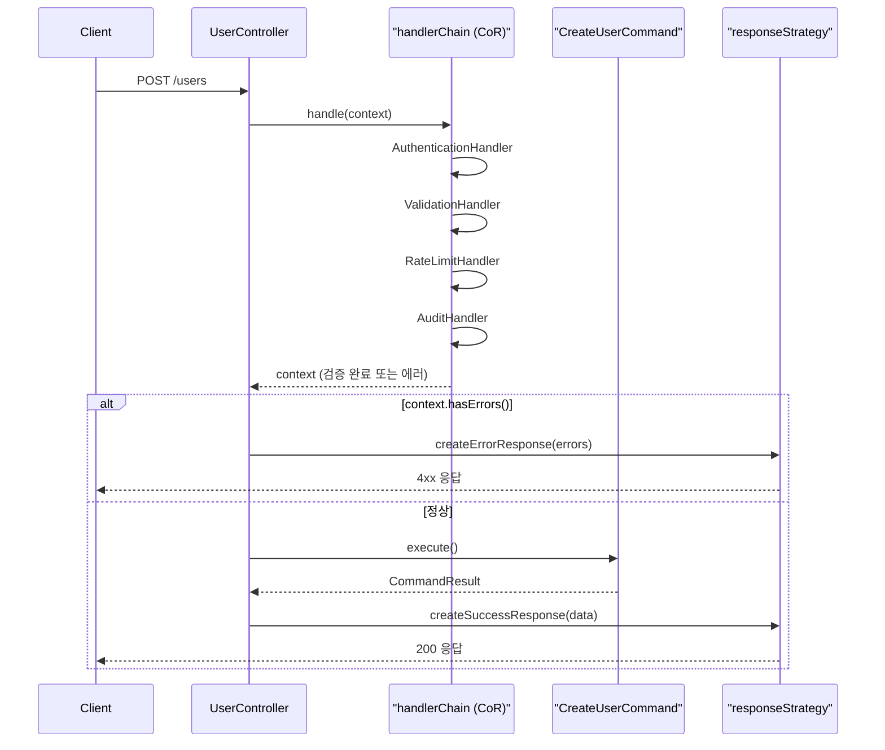
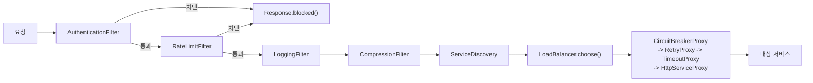

여러 패턴의 조합과 상호작용을 통해 시너지 효과를 내는 방법을 탐구합니다. 실제 시스템에서 패턴들이 어떻게 협력하는지 학습합니다.

> **읽기 전에**: 이 글은 패턴 "조합" 구조 자체에 집중하기 위해, 각 절에서 실제로 정의하는 클래스(`DatabaseConnectionFactory`, `Command`/`DeductInventoryCommand`, `PaymentServiceDecorator`, `ECommerceFacade` 등)를 제외한 주변 협력 객체(지원 타입)의 구현은 생략하고 이 시리즈 앞선 글에서 다룬 것으로 가정합니다. 생략되는 지원 타입은 다섯 부류로 나뉩니다. **(1) 서비스·리포지토리 계층** — `UserService`, `OrderService`, `PaymentService`, `InventoryService`, `NotificationService`, `UserRepository`, `OrderRepository` 등 Factory·Builder 글에서 다룬 클래스. **(2) 이벤트·전략 타입** — `OrderEvent`, `OrderEventType`, `CommandQueue`, `PaymentRequest`, `PaymentResult`, `PaymentStrategy`, `CreditCardStrategy` 등 Observer·Command·Strategy 절이 전제하는 데이터·전략 객체. **(3) 검증·상태·워크플로 타입** — `ValidationComponent`, `CompositeValidator`, `OrderFormatValidator` 등 각종 `*Validator`, `OrderState`, `OrderStateVisitor`, `WorkflowResult` 등 ECommerceSystem 절의 Composite·State·Visitor 관련 타입. **(4) 인프라·프록시 계층** — `ServiceDiscovery`, `LoadBalancer`, `ServiceProxy`, `CircuitBreakerProxy`, `RequestHandlerChain` 등 MVC·마이크로서비스 절에서 등장하는 프레임워크 성격의 협력 객체. **(5) 데이터베이스 연동 계층** — `DatabaseType`(DB 종류를 구분하는 열거형), `ConnectionPoolManager`(커넥션 풀 상태를 추적하는 협력 객체), `MonitoredConnection`(`java.sql.Connection`을 감싸 풀 반환 시점을 계측하는 래퍼), `DatabaseOperations`(및 이를 구현하는 `MySQLOperations`/`PostgreSQLOperations`/`OracleOperations`)처럼 Factory+Singleton 절의 `DatabaseConnectionFactory`가 전제하는 DB 접근 타입. 따라서 아래 코드는 그대로 컴파일되는 완전한 예제가 아니라, 여러 패턴이 어떻게 맞물리는지 보여주는 설계 스케치로 읽어야 합니다.

## 서론: 패턴들의 아름다운 협주곡

> *"단일 패턴은 솔로 연주와 같다. 진정한 아름다움은 여러 패턴이 조화롭게 어우러질 때 드러난다."*

현실의 소프트웨어 시스템에서 **단일 패턴만으로 모든 문제를 해결하는 경우는 거의 없습니다**. 복잡한 비즈니스 요구사항과 기술적 제약사항을 만족시키기 위해서는 **여러 패턴의 조합**이 필요합니다.

하지만 패턴 조합은 **양날의 검**입니다. 올바르게 조합하면 각 패턴의 장점이 시너지를 내어 **1+1=3**의 효과를 얻을 수 있습니다. 반대로 잘못 조합하면 복잡성만 증가하고 **안티패턴**이 될 수 있습니다.

이 글에서는 **패턴 조합의 예술**을 탐구합니다:
- **자연스러운 패턴 조합** - 서로 보완하는 패턴들
- **복합 패턴 시나리오** - 실제 시스템에서의 활용
- **아키텍처 패턴과의 연계** - 더 큰 그림에서의 역할
- **패턴 충돌과 해결책** - 조합 시 주의사항

### 흔한 오해: 패턴 조합=항상 좋다

패턴을 많이 알수록, 그리고 한 시스템에 패턴을 많이 적용할수록 아키텍처가 더 견고해진다는 생각은 흔한 오해입니다. 실제로는 정반대인 경우가 많습니다 — 패턴 하나마다 새로운 인터페이스, 새로운 계층, 새로운 간접 참조가 생기고, 이는 코드를 읽고 디버깅하는 데 드는 인지 비용을 그대로 늘립니다. 뒤에서 다룰 `ECommerceSystem` 예제처럼 Factory+Singleton+Builder, Observer+Command+Strategy, State+Template Method+Visitor, Decorator+Composite+Facade가 한 시스템 안에 동시에 존재하는 것은 "패턴을 최대한 많이 쓰기 위해서"가 아니라, 서로 다른 네 가지 문제(생성 일관성, 이벤트 조율, 상태 기반 흐름 제어, 구조 확장)가 실제로 존재했기 때문입니다. 문제가 하나뿐인데 패턴을 세 개 겹쳐 쌓으면 그것은 시너지가 아니라 과잉 설계이며, "패턴이 많을수록 아키텍처가 견고해진다"는 명제도 같은 이유로 성립하지 않습니다 — 견고함은 패턴 개수가 아니라 각 패턴이 실제 문제와 정확히 대응하는지에서 나옵니다. 뒤에 나올 "조합 적용 체크리스트"의 첫 항목이 "각 패턴이 독립적으로 필요한가?"로 시작하는 이유가 여기에 있습니다.

## 자연스러운 패턴 조합들

### Factory + Singleton - 객체 생성의 완벽한 조합

**Factory 패턴**과 **Singleton 패턴**은 객체 생성 영역에서 완벽한 조합을 이룹니다:

```java
// Factory + Singleton 조합의 우아함
public class DatabaseConnectionFactory {
    private static volatile DatabaseConnectionFactory instance;
    private final Map<String, DataSource> dataSources;
    private final ConnectionPoolManager poolManager;
    
    private DatabaseConnectionFactory() {
        this.dataSources = new ConcurrentHashMap<>();
        this.poolManager = new ConnectionPoolManager();
        initializeDataSources();
    }
    
    // Singleton 보장
    public static DatabaseConnectionFactory getInstance() {
        if (instance == null) {
            synchronized (DatabaseConnectionFactory.class) {
                if (instance == null) {
                    instance = new DatabaseConnectionFactory();
                }
            }
        }
        return instance;
    }
    
    // Factory Method 패턴
    public Connection createConnection(DatabaseType type) {
        DataSource dataSource = dataSources.get(type.getName());
        if (dataSource == null) {
            throw new IllegalArgumentException("Unsupported database type: " + type);
        }
        
        try {
            Connection connection = dataSource.getConnection();
            return new MonitoredConnection(connection, poolManager);
        } catch (SQLException e) {
            throw new RuntimeException("Failed to create connection", e);
        }
    }
    
    // Abstract Factory 패턴 (타입별 특화 팩토리)
    public DatabaseOperations createOperations(DatabaseType type) {
        switch (type) {
            case MYSQL:
                return new MySQLOperations(createConnection(type));
            case POSTGRESQL:
                return new PostgreSQLOperations(createConnection(type));
            case ORACLE:
                return new OracleOperations(createConnection(type));
            default:
                throw new IllegalArgumentException("Unsupported database type: " + type);
        }
    }
    
    private void initializeDataSources() {
        // 데이터소스 초기화 로직
        dataSources.put("mysql", createMySQLDataSource());
        dataSources.put("postgresql", createPostgreSQLDataSource());
        dataSources.put("oracle", createOracleDataSource());
    }
}

// 사용 예시
public class DatabaseService {
    private final DatabaseConnectionFactory factory;
    
    public DatabaseService() {
        // Singleton 팩토리 사용
        this.factory = DatabaseConnectionFactory.getInstance();
    }
    
    public void performDatabaseOperation(DatabaseType type) {
        // Factory로 적절한 연결과 연산 객체 생성
        DatabaseOperations ops = factory.createOperations(type);
        ops.executeQuery("SELECT * FROM users");
    }
}
```

### Observer + Command - 이벤트와 액션의 완벽한 분리

**Observer 패턴**으로 이벤트를 감지하고 **Command 패턴**으로 액션을 실행하는 조합:

```java
// Observer + Command 조합
public class EventDrivenOrderSystem {
    private final List<OrderEventObserver> observers;
    private final CommandQueue commandQueue;
    private final CommandProcessor processor;
    
    public EventDrivenOrderSystem() {
        this.observers = new CopyOnWriteArrayList<>();
        this.commandQueue = new LinkedBlockingQueue<>();
        this.processor = new CommandProcessor(commandQueue);
        setupObservers();
    }
    
    private void setupObservers() {
        // 각 Observer가 특정 Command를 생성하도록 설계
        addObserver(new InventoryObserver());
        addObserver(new PaymentObserver());
        addObserver(new NotificationObserver());
        addObserver(new AuditObserver());
    }
    
    public void addObserver(OrderEventObserver observer) {
        observers.add(observer);
    }
    
    public void processOrder(Order order) {
        // 주문 처리 이벤트 발생
        OrderEvent event = new OrderEvent(OrderEventType.ORDER_PLACED, order);
        notifyObservers(event);
    }
    
    private void notifyObservers(OrderEvent event) {
        for (OrderEventObserver observer : observers) {
            try {
                // Observer가 Command 생성
                List<Command> commands = observer.handleEvent(event);
                
                // 생성된 Command들을 큐에 추가
                for (Command command : commands) {
                    commandQueue.offer(command);
                }
            } catch (Exception e) {
                System.err.println("Observer failed: " + e.getMessage());
            }
        }
    }
}

// Observer 구현체
class InventoryObserver implements OrderEventObserver {
    private final InventoryService inventoryService;
    
    public InventoryObserver() {
        this.inventoryService = new InventoryService();
    }
    
    @Override
    public List<Command> handleEvent(OrderEvent event) {
        List<Command> commands = new ArrayList<>();
        
        if (event.getType() == OrderEventType.ORDER_PLACED) {
            Order order = event.getOrder();
            
            // 재고 차감 Command 생성
            for (OrderItem item : order.getItems()) {
                commands.add(new DeductInventoryCommand(
                    inventoryService, 
                    item.getProductId(), 
                    item.getQuantity()
                ));
            }
            
            // 재고 부족 시 알림 Command 생성
            commands.add(new CheckLowStockCommand(inventoryService, order));
        }
        
        return commands;
    }
}

// Command 구현체
class DeductInventoryCommand implements Command {
    private final InventoryService inventoryService;
    private final String productId;
    private final int quantity;
    private int deductedQuantity = 0;
    
    public DeductInventoryCommand(InventoryService service, String productId, int quantity) {
        this.inventoryService = service;
        this.productId = productId;
        this.quantity = quantity;
    }
    
    @Override
    public void execute() {
        deductedQuantity = inventoryService.deductStock(productId, quantity);
        System.out.println("Deducted " + deductedQuantity + " units of " + productId);
    }
    
    @Override
    public void undo() {
        if (deductedQuantity > 0) {
            inventoryService.addStock(productId, deductedQuantity);
            System.out.println("Restored " + deductedQuantity + " units of " + productId);
        }
    }
}
```

### Decorator + Strategy - 기능 확장과 알고리즘 선택의 조합

**Decorator 패턴**으로 기능을 확장하고 **Strategy 패턴**으로 알고리즘을 선택:

```java
// Decorator + Strategy 조합
// 기본 서비스 인터페이스
interface PaymentService {
    PaymentResult processPayment(PaymentRequest request);
}

// 기본 구현
class BasicPaymentService implements PaymentService {
    private PaymentStrategy strategy;
    
    public BasicPaymentService(PaymentStrategy strategy) {
        this.strategy = strategy;
    }
    
    @Override
    public PaymentResult processPayment(PaymentRequest request) {
        return strategy.process(request);
    }
    
    public void setStrategy(PaymentStrategy strategy) {
        this.strategy = strategy;
    }
}

// Decorator 기본 클래스
abstract class PaymentServiceDecorator implements PaymentService {
    protected final PaymentService decoratedService;
    
    public PaymentServiceDecorator(PaymentService service) {
        this.decoratedService = service;
    }
    
    @Override
    public PaymentResult processPayment(PaymentRequest request) {
        return decoratedService.processPayment(request);
    }
}

// 로깅 Decorator
class LoggingPaymentDecorator extends PaymentServiceDecorator {
    private final Logger logger;
    
    public LoggingPaymentDecorator(PaymentService service) {
        super(service);
        this.logger = LoggerFactory.getLogger(LoggingPaymentDecorator.class);
    }
    
    @Override
    public PaymentResult processPayment(PaymentRequest request) {
        logger.info("Processing payment: {} for amount: {}", 
                   request.getPaymentMethod(), request.getAmount());
        
        long startTime = System.currentTimeMillis();
        PaymentResult result = super.processPayment(request);
        long endTime = System.currentTimeMillis();
        
        logger.info("Payment processed in {}ms. Result: {}", 
                   endTime - startTime, result.isSuccess() ? "SUCCESS" : "FAILED");
        
        return result;
    }
}

// 캐싱 Decorator
class CachingPaymentDecorator extends PaymentServiceDecorator {
    private final Map<String, PaymentResult> cache;
    private final Duration cacheTimeout;
    
    public CachingPaymentDecorator(PaymentService service, Duration cacheTimeout) {
        super(service);
        this.cache = new ConcurrentHashMap<>();
        this.cacheTimeout = cacheTimeout;
    }
    
    @Override
    public PaymentResult processPayment(PaymentRequest request) {
        String cacheKey = generateCacheKey(request);
        
        // 캐시 확인 (중복 결제 방지)
        PaymentResult cachedResult = cache.get(cacheKey);
        if (cachedResult != null && !isCacheExpired(cachedResult)) {
            return PaymentResult.duplicate(cachedResult);
        }
        
        PaymentResult result = super.processPayment(request);
        
        // 성공한 결제만 캐시
        if (result.isSuccess()) {
            cache.put(cacheKey, result);
        }
        
        return result;
    }
    
    private String generateCacheKey(PaymentRequest request) {
        return request.getCustomerId() + "_" + 
               request.getAmount() + "_" + 
               request.getCurrency() + "_" + 
               request.getTimestamp().truncatedTo(ChronoUnit.MINUTES);
    }
}

// 재시도 Decorator
class RetryPaymentDecorator extends PaymentServiceDecorator {
    private final int maxRetries;
    private final Duration retryDelay;
    
    public RetryPaymentDecorator(PaymentService service, int maxRetries, Duration retryDelay) {
        super(service);
        this.maxRetries = maxRetries;
        this.retryDelay = retryDelay;
    }
    
    @Override
    public PaymentResult processPayment(PaymentRequest request) {
        for (int attempt = 1; attempt <= maxRetries; attempt++) {
            try {
                PaymentResult result = super.processPayment(request);
                
                if (result.isSuccess() || !result.isRetryable()) {
                    return result;
                }
                
                if (attempt < maxRetries) {
                    System.out.println("Payment attempt " + attempt + " failed. Retrying in " + 
                                     retryDelay.toMillis() + "ms");
                    Thread.sleep(retryDelay.toMillis());
                }
                
            } catch (InterruptedException e) {
                Thread.currentThread().interrupt();
                return PaymentResult.failed("Payment interrupted");
            } catch (Exception e) {
                if (attempt == maxRetries) {
                    return PaymentResult.failed("Payment failed after " + maxRetries + " attempts");
                }
            }
        }
        
        return PaymentResult.failed("Payment failed after " + maxRetries + " attempts");
    }
}

// 사용 예시 - 패턴들의 아름다운 조합
public class PaymentSystemDemo {
    public static void main(String[] args) {
        // Strategy 패턴으로 결제 방식 선택
        PaymentStrategy creditCardStrategy = new CreditCardStrategy();
        PaymentService basicService = new BasicPaymentService(creditCardStrategy);
        
        // Decorator 패턴으로 기능 확장 (체인 형태로)
        PaymentService enhancedService = new LoggingPaymentDecorator(
            new CachingPaymentDecorator(
                new RetryPaymentDecorator(basicService, 3, Duration.ofSeconds(1)),
                Duration.ofMinutes(5)
            )
        );
        
        // 사용
        PaymentRequest request = new PaymentRequest("customer123", 100.0, "USD");
        PaymentResult result = enhancedService.processPayment(request);
        
        System.out.println("Payment result: " + result);
    }
}
```

## 복합 패턴 시나리오 - E-Commerce 시스템

실제 E-Commerce 시스템에서 여러 패턴이 어떻게 조합되는지 살펴보겠습니다.

### 이 조합이 해결하는 문제

아래 예제는 하나의 시스템 안에서 서로 다른 성격의 문제 네 가지를 각각 다른 패턴 조합으로 해결한다. `ServiceFactory`는 "여러 서비스 객체를 어떻게 일관되게 생성하고 어디서든 같은 인스턴스에 접근하게 할 것인가"라는 생성 문제를, `OrderProcessingSystem`은 "주문 검증부터 재고·결제·알림까지 서로 독립적인 관심사를 어떻게 느슨하게 결합할 것인가"라는 이벤트 조율 문제를 해결한다. `OrderWorkflow`는 "여러 단계를 거치는 워크플로우의 골격은 고정하되 각 단계의 세부 동작은 상태에 따라 달라지게 할 것인가"라는 상태 기반 흐름 제어 문제를, `OrderValidationService`는 "다단계 검증 규칙을 트리로 구성하면서도 로깅·캐싱 같은 부가 기능을 검증 로직과 분리할 것인가"라는 구조 확장 문제를 다룬다. 네 문제 모두 "생성 후 무엇을 하는가"라는 관점에서 서로 이어져 있으며, 이것이 왜 하나의 시스템 안에 함께 등장하는지를 보여준다. 아래 네 클래스는 실제로는 하나의 `ECommerceSystem` 안에 중첩된 정적 멤버 클래스이지만, 각 조합이 해결하는 문제를 개별적으로 짚기 위해 절을 나누어 제시한다.

#### 1. Factory + Singleton + Builder — 생성 통제와 조립 복잡도의 분리

`ServiceFactory`가 마주한 문제는 두 층위로 나뉜다. 첫째는 애플리케이션 전체에서 서비스 레지스트리가 단 하나만 존재해야 한다는 요구이고, 둘째는 `UserService`·`OrderService` 각각이 리포지토리·검증기·알림 서비스 등 여러 협력 객체를 조합해야 하는 생성 복잡도다. Singleton만 적용하고 생성자를 그대로 노출하면 `new UserService(repo, validator, notifier, auditor)`처럼 인자 순서에 의존하는 telescoping 생성자가 되어, 인자 하나만 추가돼도 호출부 전체가 깨진다. 반대로 Builder만 쓰고 Singleton을 적용하지 않으면 애플리케이션 곳곳에서 서로 다른 `UserService` 인스턴스가 만들어져, 캐시나 연결 풀처럼 인스턴스 간 공유돼야 할 상태가 제각각 따로 놀게 된다. `ServiceFactory`는 인스턴스 접근을 Singleton으로 통제하면서 내부 생성은 Builder에 위임해, 두 문제를 각 패턴이 정확히 겨냥하도록 분리한다.

```java
// 1. Factory + Singleton + Builder 조합 (ECommerceSystem의 중첩 클래스)
public static class ServiceFactory {
    private static volatile ServiceFactory instance;
    private final Map<Class<?>, Object> services;

    private ServiceFactory() {
        this.services = new ConcurrentHashMap<>();
        initializeServices();
    }

    // DatabaseConnectionFactory(앞 절)와 동일한 이중 검사 락(double-checked locking) 패턴
    public static ServiceFactory getInstance() {
        if (instance == null) {
            synchronized (ServiceFactory.class) {
                if (instance == null) {
                    instance = new ServiceFactory();
                }
            }
        }
        return instance;
    }

    @SuppressWarnings("unchecked")
    public <T> T getService(Class<T> serviceClass) {
        return (T) services.get(serviceClass);
    }

    private void initializeServices() {
        // Builder 패턴: 서비스마다 필요한 협력 객체 조합이 다르므로 생성자 대신 Builder로 조립한다
        UserService userService = new UserServiceBuilder()
            .withRepository(createUserRepository())
            .withValidator(createUserValidator())
            .withNotificationService(createNotificationService())
            .withAuditService(createAuditService())
            .build();

        OrderService orderService = new OrderServiceBuilder()
            .withRepository(createOrderRepository())
            .withInventoryService(createInventoryService())
            .withPaymentService(createPaymentService())
            .withShippingService(createShippingService())
            .build();

        services.put(UserService.class, userService);
        services.put(OrderService.class, orderService);
    }
}
```

이 조합에서 실제 트레이드오프가 드러나는 지점은 `getService()`다. 반환 타입을 `Class<T>` 기반으로 캐스팅하면서 컴파일 타임 타입 안전성을 일부 포기하는 대신(`@SuppressWarnings("unchecked")`가 그 대가를 표시한다), 서비스 종류가 늘어나도 `ServiceFactory`에 새 getter를 추가하지 않아도 되는 확장성을 얻는다. 서비스가 2~3개뿐이라면 `getUserService()`, `getOrderService()`처럼 타입 안전한 개별 getter가 오히려 더 간단할 수 있다 — Map 기반 레지스트리는 서비스 종류가 두 자릿수를 넘어갈 때부터 이점이 뚜렷해진다.

위 `ServiceFactory`는 글 서두에서 밝힌 대로 `UserServiceBuilder`·`UserService` 등 주변 타입의 구현을 생략한 설계 스케치다. Factory+Singleton+Builder 조합이 실제로 어떻게 맞물려 컴파일되는지 확인할 수 있도록, 아래는 그 협력 타입들을 최소 형태로 채운 독립 실행 가능한 스텁이다. `UserRepository`·`UserValidator`·`NotificationService`·`AuditService`는 실제로는 각각 DB 접근, 검증 규칙, 알림 발송, 감사 로그라는 고유한 책임을 지지만, 여기서는 "Builder가 여러 협력 객체를 조립하고 그 결과를 Map 레지스트리에 담아 Singleton으로 접근한다"는 조합의 골격만 보이기 위해 필드 없는 빈 클래스로 둔다.

```java
// 최소 컴파일 스텁: ServiceFactory(위 코드)가 참조하는 협력 타입을 완전히 정의한 버전.
// java -source 17 이상에서 별도 의존성 없이 그대로 컴파일·실행된다.
import java.util.Map;
import java.util.concurrent.ConcurrentHashMap;

class UserRepository { }
class UserValidator { }
class NotificationService { }
class AuditService { }

class UserService {
    private final UserRepository repository;
    private final UserValidator validator;
    private final NotificationService notificationService;
    private final AuditService auditService;

    private UserService(UserRepository repository, UserValidator validator,
                         NotificationService notificationService, AuditService auditService) {
        this.repository = repository;
        this.validator = validator;
        this.notificationService = notificationService;
        this.auditService = auditService;
    }

    static UserService of(UserRepository repository, UserValidator validator,
                          NotificationService notificationService, AuditService auditService) {
        return new UserService(repository, validator, notificationService, auditService);
    }
}

// ServiceFactory.initializeServices()가 사용하는 Builder: 메서드 체이닝으로 협력 객체를 하나씩 채운다
class UserServiceBuilder {
    private UserRepository repository;
    private UserValidator validator;
    private NotificationService notificationService;
    private AuditService auditService;

    UserServiceBuilder withRepository(UserRepository repository) {
        this.repository = repository;
        return this;
    }

    UserServiceBuilder withValidator(UserValidator validator) {
        this.validator = validator;
        return this;
    }

    UserServiceBuilder withNotificationService(NotificationService notificationService) {
        this.notificationService = notificationService;
        return this;
    }

    UserServiceBuilder withAuditService(AuditService auditService) {
        this.auditService = auditService;
        return this;
    }

    UserService build() {
        return UserService.of(repository, validator, notificationService, auditService);
    }
}

// ServiceFactory.getInstance().getService(UserService.class) 호출부가 실제로 성립함을 보이는 최소 데모
public class ServiceFactoryStubDemo {
    public static void main(String[] args) {
        Map<Class<?>, Object> services = new ConcurrentHashMap<>();

        UserService userService = new UserServiceBuilder()
            .withRepository(new UserRepository())
            .withValidator(new UserValidator())
            .withNotificationService(new NotificationService())
            .withAuditService(new AuditService())
            .build();

        services.put(UserService.class, userService);
        System.out.println("Registered: " + services.containsKey(UserService.class));
    }
}
```

이 스텁이 보여주는 것은 딱 하나, "Builder가 만든 객체를 Map에 넣고 Class 토큰으로 꺼낸다"는 조합의 배관(plumbing)이 실제로 컴파일된다는 사실이다. `OrderService`·`InventoryService` 등 나머지 협력 타입도 같은 방식(빈 클래스 + Builder)으로 채우면 `ServiceFactory` 전체가 독립적으로 컴파일되지만, 그 경우 각 클래스가 실제로 수행할 책임(재고 검사, 결제 연동 등)은 여전히 앞선 Factory·Builder·Repository 글에서 다룬 구현에 의존한다.

#### 2. Observer + Command + Strategy — 이벤트 조율과 검증 로직의 분리

`OrderProcessingSystem`이 풀어야 하는 문제는 주문 하나를 처리하는 동안 재고 차감, 결제, 이메일 발송, 감사 로그, 분석 이벤트 기록이라는 다섯 관심사가 서로의 존재를 몰라야 한다는 요구다. `processOrder()` 하나가 이 다섯 가지를 순서대로 직접 호출한다면, 새 관심사(예: 포인트 적립)를 추가할 때마다 `processOrder()` 자체를 수정해야 하므로 개방-폐쇄 원칙을 위반한다. Observer로 관심사를 분리하면 각 `OrderObserver`는 자신에게 필요한 `Command`만 만들어 큐에 넣고, `OrderProcessingSystem`은 그 Command들을 실행할 뿐 각 Observer의 내부 로직을 알 필요가 없다. 여기에 Strategy로 검증 로직을 따로 분리한 이유는 별개다 — 검증 규칙은 이벤트를 기다리지 않고 주문 자체의 상태를 즉시 판단해야 하므로, Observer의 비동기적·통지 기반 흐름보다 호출 시점에 동기적으로 교체 가능한 알고리즘(Strategy)이 더 적합하다.

```java
// 2. Observer + Command + Strategy 조합 (ECommerceSystem의 중첩 클래스)
public static class OrderProcessingSystem {
    private final List<OrderObserver> observers;
    private final CommandProcessor commandProcessor;
    private final OrderValidationStrategy validationStrategy;

    public OrderProcessingSystem() {
        this.observers = new ArrayList<>();
        this.commandProcessor = new CommandProcessor();
        this.validationStrategy = new CompositeValidationStrategy();
        setupObservers();
    }

    private void setupObservers() {
        observers.add(new InventoryUpdateObserver());
        observers.add(new PaymentProcessingObserver());
        observers.add(new EmailNotificationObserver());
        observers.add(new AuditLogObserver());
        observers.add(new AnalyticsObserver());
    }

    public OrderResult processOrder(Order order) {
        try {
            // Strategy 패턴으로 주문 검증
            ValidationResult validation = validationStrategy.validate(order);
            if (!validation.isValid()) {
                return OrderResult.validationFailed(validation.getErrors());
            }

            // Observer 패턴으로 이벤트 발생 → 각 Observer가 Command 생성
            OrderEvent event = new OrderEvent(OrderEventType.ORDER_SUBMITTED, order);
            List<Command> commands = notifyObserversAndCollectCommands(event);

            // Command 패턴으로 비즈니스 로직 실행
            ExecutionResult executionResult = commandProcessor.executeAll(commands);

            if (executionResult.isSuccess()) {
                notifyObservers(new OrderEvent(OrderEventType.ORDER_COMPLETED, order));
                return OrderResult.success(order);
            } else {
                // 실패 시 보상 트랜잭션: 이미 실행된 Command들의 undo()를 역순으로 호출
                commandProcessor.undoAll(executionResult.getExecutedCommands());
                notifyObservers(new OrderEvent(OrderEventType.ORDER_FAILED, order));
                return OrderResult.failed(executionResult.getError());
            }

        } catch (Exception e) {
            return OrderResult.error("Order processing failed: " + e.getMessage());
        }
    }

    private List<Command> notifyObserversAndCollectCommands(OrderEvent event) {
        List<Command> allCommands = new ArrayList<>();
        for (OrderObserver observer : observers) {
            try {
                allCommands.addAll(observer.handleEvent(event));
            } catch (Exception e) {
                System.err.println("Observer failed: " + e.getMessage());
            }
        }
        return allCommands;
    }
}
```

이 구조에서 실패 처리는 단순 예외 전파가 아니라 명시적인 보상 트랜잭션이다. `executionResult.isSuccess()`가 거짓이면 이미 실행된 Command들의 `undo()`를 호출하는데, 이것이 가능한 이유는 앞선 절(Observer+Command)의 `DeductInventoryCommand`처럼 각 Command가 자신이 변경한 상태(`deductedQuantity`)를 기억해 되돌릴 수 있게 설계됐기 때문이다. Command 패턴을 단순히 "실행 캡슐화"로만 이해하면 이 undo 능력을 놓치기 쉽다 — 실행과 되돌리기를 한 쌍으로 설계해야 이런 보상 트랜잭션이 성립한다.

#### 3. State + Template Method + Visitor — 워크플로우 골격 고정과 상태별 동작 분리

`OrderWorkflow`가 다루는 문제는 앞의 두 조합과 성격이 다르다. 주문은 대기(Pending) → 확인(Confirmed) → 처리 중(Processing) → 배송(Shipped) → 완료(Delivered)처럼 정해진 단계를 거치는데, 이 흐름의 골격(시작 → 반복 → 종료 판단 → 마무리)은 주문 유형(일반 주문, 예약 주문, 구독 주문)에 관계없이 동일하지만, 각 단계에서 "다음 상태로 언제 어떻게 전이할 것인가"는 유형마다 다르다. Template Method는 `executeWorkflow()`를 `final`로 고정해 이 골격이 하위 클래스에서 임의로 바뀌지 않도록 보장하고, 실제 상태 전이 로직은 `processCurrentState()` 같은 추상 메서드로 위임한다. 이 추상 메서드 내부에서 실제로 상태가 바뀌는 방식을 결정하는 것이 State 패턴이다 — `OrderState` 구현체 각각이 자신의 다음 상태를 알고 있어, `OrderWorkflow`는 "지금 상태가 무엇인지"만 물으면 된다. 여기에 Visitor를 더한 이유는 상태별로 수행할 부가 연산(상태별 리포트 생성, 상태별 SLA 검사 등)이 계속 늘어나는데, 그때마다 `OrderState`의 각 구현체에 새 메서드를 추가하고 싶지 않기 때문이다 — Visitor는 "연산의 추가"를 "상태 클래스 수정"에서 분리한다.

```java
// 3. State + Template Method + Visitor 조합 (ECommerceSystem의 중첩 클래스)
public static abstract class OrderWorkflow {
    protected Order order;
    protected OrderState currentState;

    public OrderWorkflow(Order order) {
        this.order = order;
        this.currentState = new PendingState();
    }

    // Template Method: 워크플로우 실행 골격 (하위 클래스가 재정의할 수 없도록 final)
    public final WorkflowResult executeWorkflow() {
        try {
            onWorkflowStarted();

            while (!currentState.isTerminal()) {
                OrderState previousState = currentState;
                currentState = processCurrentState(); // State: 다음 상태 결정을 위임

                if (currentState != previousState) {
                    onStateTransition(previousState, currentState);
                }
            }

            WorkflowResult result = createFinalResult();
            onWorkflowCompleted(result);
            return result;

        } catch (Exception e) {
            return handleWorkflowError(e);
        }
    }

    // Visitor 패턴: 상태별 부가 연산(리포트, SLA 검사 등)을 OrderState 수정 없이 추가
    public void acceptVisitor(OrderStateVisitor visitor) {
        currentState.accept(visitor);
    }

    // Hook 메서드: 하위 클래스가 필요할 때만 재정의하는 확장 지점 (기본은 빈 구현)
    protected void onWorkflowStarted() { }
    protected void onStateTransition(OrderState from, OrderState to) { }
    protected void onWorkflowCompleted(WorkflowResult result) { }

    // Abstract 메서드: 상태 전이와 결과 생성은 워크플로우 종류(일반/예약/구독)마다 다르다
    protected abstract OrderState processCurrentState();
    protected abstract WorkflowResult createFinalResult();
    protected abstract WorkflowResult handleWorkflowError(Exception e);
}
```

`onWorkflowStarted()`·`onStateTransition()`·`onWorkflowCompleted()`를 빈 본문으로 둔 것은 게으름이 아니라 의도적 설계다. Template Method의 Hook 메서드는 "하위 클래스가 원할 때만 재정의하는 지점"이므로, 기본 구현이 뭔가를 강제로 수행하면(예: 항상 콘솔에 로그를 남기면) 그 부수 효과를 원치 않는 하위 클래스도 억지로 떠안게 된다. 상태 전이마다 알림이 필요한 주문 유형은 `onStateTransition()`을 재정의해 Observer에게 이벤트를 통지하면 되고, 필요 없는 유형은 그대로 두면 된다 — 이것이 Template Method가 "골격은 고정하되 세부는 선택적으로 개방한다"는 원칙을 지키는 방식이다. 원래 이 클래스는 `OrderStateListener` 목록을 별도로 두어 상태 전이마다 리스너에게 통지하는 메서드도 가졌으나, 이는 Observer 패턴을 상태 전이 지점에 한 번 더 얹은 것에 불과해 State+Template Method+Visitor 조합의 핵심을 흐리므로 위 예제에서는 제외했다 — 상태 전이 알림이 필요하면 `onStateTransition()` Hook 안에서 기존 Observer 인프라(2절)를 재사용하는 편이 낫다.

#### 4. Decorator + Composite + Facade — 검증 트리 구성과 부가 기능의 분리

`OrderValidationService`가 마주한 문제는 검증 규칙 자체의 복잡도와, 검증과 무관한 부가 기능(로깅·성능 측정·캐싱)이 뒤섞이는 문제로 나뉜다. 검증 규칙은 "형식 검증 → 비즈니스 검증 → 보안 검증"처럼 그룹으로 묶이고 각 그룹 안에 다시 여러 개별 검증기가 있는 트리 구조를 이루는데, 이를 Composite로 표현하면 `CompositeValidator`든 개별 `Validator`든 동일한 `ValidationComponent` 인터페이스로 다뤄져 트리 깊이가 바뀌어도 호출부 코드는 그대로 유지된다. 문제는 여기에 로깅·성능 측정·캐싱을 추가하고 싶을 때다 — 이 부가 기능들을 각 `Validator` 구현체 안에 직접 넣으면 검증 로직과 인프라 관심사가 뒤섞인다. Decorator는 이 부가 기능을 트리 바깥에서 한 겹씩 감싸는 방식으로 분리하고, 마지막으로 Facade는 이 전체 구조(검증 트리 + 데코레이터 체인)를 `validateOrder(order)` 한 번의 호출로 감춰 호출자가 내부 구성을 알 필요가 없게 한다.

```java
// 4. Decorator + Composite + Facade 조합 (ECommerceSystem의 중첩 클래스)
public static class OrderValidationService {
    private final ValidationComponent rootValidator;

    public OrderValidationService() {
        this.rootValidator = buildValidationTree();
    }

    private ValidationComponent buildValidationTree() {
        // Composite 패턴으로 검증 트리 구성 (그룹별 CompositeValidator)
        CompositeValidator root = new CompositeValidator("Root Validator");

        CompositeValidator basic = new CompositeValidator("Basic Validation");
        basic.add(new OrderFormatValidator());
        basic.add(new CustomerValidator());
        basic.add(new ProductValidator());

        CompositeValidator business = new CompositeValidator("Business Validation");
        business.add(new InventoryValidator());
        business.add(new PricingValidator());
        business.add(new PromotionValidator());

        CompositeValidator security = new CompositeValidator("Security Validation");
        security.add(new FraudDetectionValidator());
        security.add(new RateLimitValidator());

        root.add(basic);
        root.add(business);
        root.add(security);

        // Decorator 패턴으로 로깅 → 성능 측정 → 캐싱을 트리 바깥에서 순서대로 적용
        return new LoggingValidationDecorator(
            new PerformanceValidationDecorator(
                new CachingValidationDecorator(root)
            )
        );
    }

    // Facade 패턴: 트리 구성과 데코레이터 체인을 감추고 단일 진입점만 노출
    public ValidationResult validateOrder(Order order) {
        return rootValidator.validate(order);
    }

    public ValidationReport getDetailedValidationReport(Order order) {
        DetailedValidationVisitor visitor = new DetailedValidationVisitor();
        rootValidator.accept(visitor);
        return visitor.getReport();
    }
}
```

`getDetailedValidationReport()`가 별도로 존재하는 이유를 눈여겨볼 필요가 있다. `validateOrder()`는 Facade가 감춘 단순 경로(성공/실패만 필요한 호출자)를 위한 것이고, `getDetailedValidationReport()`는 Visitor로 트리 전체를 순회하며 각 검증기의 결과를 상세히 수집하는 별도 경로다. Facade가 "항상 가장 단순한 인터페이스 하나만 제공해야 한다"는 뜻은 아니다 — 이 사례처럼 호출자의 필요(빠른 성공/실패 판정 vs. 상세 리포트)가 명확히 다르면, Facade 안에 목적이 다른 진입점을 여러 개 두는 편이 오히려 더 정직한 설계다.

## 아키텍처 패턴과의 연계

### MVC 아키텍처에서의 패턴 조합

MVC 자체는 "모델·뷰·컨트롤러를 분리하라"는 상위 수준의 구조적 지침일 뿐, 각 계층 내부의 복잡도까지 해결해 주지는 않는다. 아래 세 절은 MVC의 각 계층이 내부적으로 어떤 문제를 안고 있고, 그 문제를 왜 GoF 패턴 조합으로 풀었는지를 계층별로 짚는다. 계층 하나마다 서로 다른 패턴 조합이 등장하는 것은 계층마다 책임의 성격이 다르기 때문이다 — Model은 "생성·저장·통지", View는 "구조·렌더링 골격·부가 효과", Controller는 "전처리 파이프라인·실행·응답 형식"이라는 서로 다른 축의 문제를 갖는다.

#### Model 계층 — Repository + Factory + Observer

`UserModel`은 세 가지 축의 책임을 동시에 진다. 사용자 생성 규칙(가입 유형별 기본값, 필수 필드 검증 등)을 캡슐화하는 것(Factory), 생성된 사용자를 영속화하는 것(Repository), 그리고 사용자 생성이라는 사건을 다른 구성요소(캐시 무효화, 알림 발송, 통계 집계 등)에 알리는 것(Observer)이다. 이 세 책임을 `createUser()` 한 메서드 안에서 순서대로 호출하되 서로 다른 협력 객체에 위임하는 이유는, 세 축이 각각 독립적으로 변경되기 때문이다 — 생성 규칙이 바뀌어도 저장 방식은 그대로고, 저장소를 MySQL에서 다른 저장소로 바꿔도 통지 대상 목록은 그대로다. 만약 세 로직을 `UserModel` 안에 직접 풀어 썼다면, 세 축 중 하나만 바뀌어도 나머지 로직까지 재검토해야 하는 회귀 위험이 생긴다.

```java
// Model Layer - Repository + Factory + Observer
@Component
public class UserModel {
    private final UserRepository repository;
    private final UserFactory factory;
    private final List<ModelObserver> observers;

    public UserModel(UserRepository repository, UserFactory factory) {
        this.repository = repository;
        this.factory = factory;
        this.observers = new CopyOnWriteArrayList<>();
    }

    public User createUser(UserCreateRequest request) {
        User user = factory.createUser(request);       // Factory: 생성 규칙 캡슐화
        User savedUser = repository.save(user);         // Repository: 영속화
        notifyObservers(new ModelEvent(ModelEventType.USER_CREATED, savedUser)); // Observer: 통지
        return savedUser;
    }

    public void addObserver(ModelObserver observer) {
        observers.add(observer);
    }

    private void notifyObservers(ModelEvent event) {
        observers.forEach(observer -> observer.onModelChanged(event));
    }
}
```

`CopyOnWriteArrayList`를 선택한 것도 우연이 아니다. Observer 등록(`addObserver`)은 애플리케이션 초기화 시점에 드물게 일어나는 반면, 통지(`notifyObservers`)는 사용자 생성마다 반복되고 여러 스레드에서 동시에 발생할 수 있다. 쓰기가 드물고 읽기(순회)가 잦은 이런 접근 패턴에서 `CopyOnWriteArrayList`는 순회 시 락 없이 스냅샷을 읽을 수 있어 `synchronized List`보다 유리하다 — 다만 Observer 등록이 요청마다 빈번한 상황이라면 쓰기 비용(배열 전체 복사)이 오히려 손해이므로 이 선택은 "쓰기 희소·읽기 빈번"이라는 전제에서만 유효하다.

#### View 계층 — Composite + Decorator + Template Method

`BaseView`가 다루는 문제는 Model과 전혀 다른 축이다. 렌더링 순서(헤더 → 본문 → 푸터)는 모든 화면에서 고정돼야 하므로 Template Method로 `render()`를 `final` 처리해 하위 클래스가 순서 자체를 바꾸지 못하게 한다. 반면 화면을 구성하는 요소(본문 안의 위젯들)는 개수와 중첩 정도가 화면마다 달라 트리 구조(Composite)로 다뤄야 하고, 렌더링이 끝난 결과물에 캐싱 헤더 추가나 압축 같은 부가 효과를 씌우는 일은 렌더링 로직 자체와 무관하므로 Decorator로 분리한다. 세 패턴이 겨냥하는 축이 "골격(Template Method)", "내용 구조(Composite)", "결과물 후처리(Decorator)"로 명확히 갈리기 때문에, 어느 하나를 다른 하나로 대체할 수 없다 — 예컨대 후처리를 Template Method의 Hook으로 넣으면 압축·캐싱 로직이 추가될 때마다 `BaseView`를 상속하는 모든 화면 클래스를 다시 컴파일해야 하는 경직성이 생긴다.

```java
// View Layer - Composite + Decorator + Template Method
public abstract class BaseView {
    protected final List<ViewComponent> components;
    private final List<ViewDecorator> decorators;

    public BaseView() {
        this.components = new ArrayList<>();
        this.decorators = new ArrayList<>();
    }

    // Template Method: 렌더링 골격은 고정, 각 파트의 내용만 하위 클래스가 채운다
    public final String render() {
        StringBuilder html = new StringBuilder();
        html.append(renderHeader());
        html.append(renderContent());
        html.append(renderFooter());

        String result = html.toString();
        for (ViewDecorator decorator : decorators) {
            result = decorator.decorate(result); // Decorator: 렌더링 결과물에 후처리 적용
        }
        return result;
    }

    protected abstract String renderHeader();
    protected abstract String renderContent();
    protected abstract String renderFooter();

    public void addComponent(ViewComponent component) {  // Composite: 화면 구성 요소 트리
        components.add(component);
    }

    public void addDecorator(ViewDecorator decorator) {   // Decorator 체인 등록
        decorators.add(decorator);
    }
}
```

이 조합에서 실무상 주의할 점은 `components`와 `decorators`가 `render()` 안에서 직접 연결되지 않는다는 사실이다. `components`는 `renderContent()` 구현체 내부에서 트리를 순회하며 각 위젯을 문자열로 합성하는 데 쓰이고, `decorators`는 그렇게 만들어진 최종 HTML 문자열 전체에 적용된다 — 즉 Composite는 "내용을 어떻게 조립할 것인가"를, Decorator는 "조립된 결과를 어떻게 가공할 것인가"를 다루며 서로 다른 레벨에서 작동한다. 이 경계를 혼동해 개별 컴포넌트마다 Decorator를 적용하려 하면 Composite 트리의 재귀 구조와 Decorator 체인이 뒤섞여 디버깅이 급격히 어려워진다.

#### Controller 계층 — Command + Chain of Responsibility + Strategy

`UserController`가 마주한 문제는 요청 하나를 처리하기까지 거쳐야 하는 전처리 단계(인증·검증·레이트리밋·감사)의 수가 가변적이고, 그 순서와 구성이 엔드포인트마다 달라질 수 있다는 점이다. 이 전처리를 `createUser()` 메서드 안에 `if` 블록으로 나열하면 엔드포인트가 늘어날수록 같은 검사 로직이 메서드마다 반복된다. Chain of Responsibility는 각 검사를 독립된 핸들러로 만들어 체인 순서만 조립하면 되게 하고, 전처리를 통과한 뒤의 실제 비즈니스 로직 실행은 Command로 캡슐화해 커맨드 큐잉·로깅·재시도 같은 공통 처리를 `CommandProcessor` 한 곳에 모은다. 마지막으로 같은 결과를 JSON으로 응답할지 XML로 응답할지는 클라이언트에 따라 달라질 수 있는 선택이므로 Strategy로 분리한다.

```java
// Controller Layer - Command + Chain of Responsibility + Strategy
@RestController
public class UserController {
    private final RequestHandlerChain handlerChain;
    private final CommandProcessor commandProcessor;
    private final ResponseStrategy responseStrategy;
    private final UserService userService;

    public UserController(UserService userService) {
        this.userService = userService;
        this.handlerChain = buildHandlerChain();
        this.commandProcessor = new CommandProcessor();
        this.responseStrategy = new JSONResponseStrategy();
    }

    @PostMapping("/users")
    public ResponseEntity<?> createUser(@RequestBody UserCreateRequest request) {
        try {
            // Chain of Responsibility로 요청 전처리
            ProcessingContext context = new ProcessingContext(request);
            handlerChain.handle(context);

            if (context.hasErrors()) {
                return responseStrategy.createErrorResponse(context.getErrors());
            }

            // Command 패턴으로 비즈니스 로직 실행
            CreateUserCommand command = new CreateUserCommand(
                context.getValidatedRequest(),
                userService
            );
            CommandResult result = commandProcessor.execute(command);

            // Strategy 패턴으로 응답 생성
            return responseStrategy.createSuccessResponse(result.getData());

        } catch (Exception e) {
            return responseStrategy.createErrorResponse("Internal server error");
        }
    }

    private RequestHandlerChain buildHandlerChain() {
        AuthenticationHandler authHandler = new AuthenticationHandler();
        ValidationHandler validationHandler = new ValidationHandler();
        RateLimitHandler rateLimitHandler = new RateLimitHandler();
        AuditHandler auditHandler = new AuditHandler();

        authHandler.setNext(validationHandler);
        validationHandler.setNext(rateLimitHandler);
        rateLimitHandler.setNext(auditHandler);

        return new RequestHandlerChain(authHandler);
    }
}
```

`userService`를 필드로 선언하고 생성자로 주입받는 부분을 눈여겨볼 필요가 있다 — `@RestController`가 관리하는 빈이라도 Spring이 자동으로 필드를 만들어 주지는 않으므로, 생성자에서 명시적으로 주입받아 필드에 저장해야 `createUser()` 안에서 `userService`를 참조하는 코드가 컴파일된다.

`UserController`로 들어온 요청은 Chain of Responsibility(인증 → 검증 → 레이트리밋 → 감사)를 순서대로 통과한 뒤에야 Command로 캡슐화되어 실행되고, 그 결과가 Strategy로 선택된 형식(JSON)으로 응답된다. 아래 시퀀스 다이어그램은 이 흐름에서 각 패턴이 담당하는 구간을 보여준다.



### 마이크로서비스 아키텍처에서의 패턴 활용

```java
// 마이크로서비스 + 패턴 조합
// API Gateway - Proxy + Decorator + Chain of Responsibility
public class ApiGateway {
    private final ServiceDiscovery serviceDiscovery;
    private final LoadBalancer loadBalancer;
    private final RequestFilterChain filterChain;
    
    public ApiGateway() {
        this.serviceDiscovery = new ConsulServiceDiscovery();
        this.loadBalancer = new RoundRobinLoadBalancer();
        this.filterChain = buildFilterChain();
    }
    
    public CompletableFuture<Response> routeRequest(Request request) {
        // Chain of Responsibility로 필터 적용
        FilterContext context = new FilterContext(request);
        filterChain.filter(context);
        
        if (context.isBlocked()) {
            return CompletableFuture.completedFuture(
                Response.blocked(context.getBlockReason())
            );
        }
        
        // Service Discovery로 서비스 인스턴스 찾기
        String serviceName = extractServiceName(request.getPath());
        List<ServiceInstance> instances = serviceDiscovery.getInstances(serviceName);
        
        if (instances.isEmpty()) {
            return CompletableFuture.completedFuture(
                Response.serviceUnavailable("Service not available: " + serviceName)
            );
        }
        
        // Load Balancer로 인스턴스 선택
        ServiceInstance instance = loadBalancer.choose(instances);
        
        // Proxy 패턴으로 실제 서비스 호출
        ServiceProxy proxy = createServiceProxy(instance);
        return proxy.forwardRequest(context.getProcessedRequest());
    }
    
    private RequestFilterChain buildFilterChain() {
        AuthenticationFilter authFilter = new AuthenticationFilter();
        RateLimitFilter rateLimitFilter = new RateLimitFilter();
        LoggingFilter loggingFilter = new LoggingFilter();
        CompressionFilter compressionFilter = new CompressionFilter();
        
        return RequestFilterChain.builder()
            .addFilter(authFilter)
            .addFilter(rateLimitFilter)
            .addFilter(loggingFilter)
            .addFilter(compressionFilter)
            .build();
    }
    
    private ServiceProxy createServiceProxy(ServiceInstance instance) {
        // Decorator 패턴으로 프록시 기능 확장
        ServiceProxy baseProxy = new HttpServiceProxy(instance);
        
        return new CircuitBreakerProxy(
            new RetryProxy(
                new TimeoutProxy(baseProxy, Duration.ofSeconds(30)),
                3, Duration.ofMillis(500)
            ),
            new CircuitBreakerConfig()
        );
    }
}
```

`ApiGateway`는 요청 하나를 처리하기 위해 세 가지 패턴을 순서대로 거친다. Chain of Responsibility로 구성된 필터 체인이 인증·레이트리밋·로깅·압축을 차례로 적용하고, 어느 필터에서든 요청이 차단되면 그 즉시 응답이 반환된다. 필터를 통과하면 Load Balancer가 인스턴스를 고르고, Decorator로 겹겹이 감싼 Proxy가 실제 호출과 재시도·서킷 브레이커·타임아웃을 함께 처리한다.



## 패턴 충돌과 해결 방법

### 책임 중복 문제

여러 패턴을 조합할 때 **책임이 중복**되는 경우가 있습니다:

```java
// 문제: Singleton + Factory에서 책임 중복
public class BadUserServiceFactory {
    private static BadUserServiceFactory instance;
    private UserService userService; // Singleton 책임
    
    private BadUserServiceFactory() {
        this.userService = createUserService(); // Factory 책임
    }
    
    public static BadUserServiceFactory getInstance() {
        // Singleton 관리 책임
        if (instance == null) {
            synchronized (BadUserServiceFactory.class) {
                if (instance == null) {
                    instance = new BadUserServiceFactory();
                }
            }
        }
        return instance;
    }
    
    public UserService getUserService() {
        return userService; // 단순 반환? Factory 역할 모호
    }
    
    // 😱 문제점:
    // 1. Singleton 관리와 Factory 역할이 혼재
    // 2. 생성 로직과 인스턴스 관리가 분리되지 않음
    // 3. 테스트하기 어려움
}

// 해결: 책임 분리
public class ServiceRegistry {
    // Singleton 책임만 담당
    private static volatile ServiceRegistry instance;
    private final Map<Class<?>, Object> services;
    private final ServiceFactory serviceFactory; // Factory에게 생성 위임
    
    private ServiceRegistry() {
        this.services = new ConcurrentHashMap<>();
        this.serviceFactory = new ServiceFactory(); // Factory 책임 분리
    }
    
    public static ServiceRegistry getInstance() {
        if (instance == null) {
            synchronized (ServiceRegistry.class) {
                if (instance == null) {
                    instance = new ServiceRegistry();
                }
            }
        }
        return instance;
    }
    
    @SuppressWarnings("unchecked")
    public <T> T getService(Class<T> serviceClass) {
        return (T) services.computeIfAbsent(serviceClass, clazz -> {
            return serviceFactory.createService(clazz); // Factory에게 생성 위임
        });
    }
}

// 별도의 Factory 클래스
public class ServiceFactory {
    // Factory 책임만 담당
    public <T> T createService(Class<T> serviceClass) {
        if (serviceClass == UserService.class) {
            return serviceClass.cast(createUserService());
        } else if (serviceClass == OrderService.class) {
            return serviceClass.cast(createOrderService());
        }
        throw new IllegalArgumentException("Unknown service: " + serviceClass);
    }
    
    private UserService createUserService() {
        return new UserServiceBuilder()
            .withRepository(createUserRepository())
            .withValidator(createUserValidator())
            .build();
    }
    
    private OrderService createOrderService() {
        return new OrderServiceBuilder()
            .withRepository(createOrderRepository())
            .withPaymentService(createPaymentService())
            .build();
    }
}
```

### 복잡성 증가와 해결책

패턴 조합이 쌓일수록 각 패턴이 내부적으로는 더 견고해지지만, 그 조합을 사용하는 **클라이언트 쪽 복잡성**은 오히려 늘어나는 역설이 생긴다. `placeOrder()` 하나를 처리하려면 `UserService`로 사용자를 확인하고, `InventoryService`로 재고를 검사하고, `OrderService`로 주문을 생성하고, `PaymentService`로 결제하고, 실패 시 주문을 취소하고, 성공 시 재고를 차감하고, 마지막으로 `NotificationService`로 알림을 보내야 한다 — 이 다섯 서비스 각각은 앞서 본 것처럼 내부적으로 Singleton+Factory+Builder(`ServiceRegistry`)나 Decorator 체인(결제) 같은 조합을 이미 품고 있다. 만약 이 다섯 단계와 그 실행 순서·실패 시 보상 로직을 호출하는 쪽(예: REST 컨트롤러나 배치 작업)이 직접 알아야 한다면, 서비스가 하나 추가되거나 순서가 바뀔 때마다 그 지식을 아는 모든 호출부를 찾아 고쳐야 한다. `ECommerceFacade`는 이 다섯 단계의 순서·조합·에러 처리 로직을 한 곳에 모아 `placeOrder(request)` 한 번의 호출로 감춤으로써, 호출자가 알아야 할 지식을 "주문 요청을 만들고 결과를 받는다"는 두 가지로 줄인다. 이때 Facade는 서브시스템 자체를 대체하지 않는다는 점이 중요하다 — `ECommerceFacade`는 여전히 `ServiceRegistry.getInstance()`로 앞서 정의한 Singleton 레지스트리를 통해 서비스를 얻고, 결제 서비스는 `createEnhancedPaymentService()`에서 보듯 Decorator 체인을 그대로 재구성한다. Facade가 숨기는 것은 서브시스템의 존재가 아니라 그것들을 "어떤 순서로, 어떻게 조합해 호출하는가"라는 절차적 지식이다.

```java
// Facade 패턴으로 복잡성 숨기기
public class ECommerceFacade {
    // 복잡한 서브시스템들을 내부에 숨김
    private final UserService userService;
    private final OrderService orderService;
    private final PaymentService paymentService;
    private final InventoryService inventoryService;
    private final NotificationService notificationService;
    
    public ECommerceFacade() {
        // 복잡한 초기화 로직을 숨김
        ServiceRegistry registry = ServiceRegistry.getInstance();
        this.userService = registry.getService(UserService.class);
        this.orderService = registry.getService(OrderService.class);
        this.paymentService = createEnhancedPaymentService();
        this.inventoryService = registry.getService(InventoryService.class);
        this.notificationService = registry.getService(NotificationService.class);
    }
    
    // 복잡한 비즈니스 프로세스를 단순한 인터페이스로 제공
    public OrderResult placeOrder(PlaceOrderRequest request) {
        try {
            // 1. 사용자 검증
            User user = userService.getUser(request.getUserId());
            if (user == null) {
                return OrderResult.userNotFound();
            }
            
            // 2. 재고 확인
            boolean inventoryAvailable = inventoryService.checkAvailability(request.getItems());
            if (!inventoryAvailable) {
                return OrderResult.inventoryUnavailable();
            }
            
            // 3. 주문 생성
            Order order = orderService.createOrder(request);
            
            // 4. 결제 처리
            PaymentResult paymentResult = paymentService.processPayment(
                order.getPaymentInfo()
            );
            if (!paymentResult.isSuccess()) {
                orderService.cancelOrder(order.getId());
                return OrderResult.paymentFailed(paymentResult.getError());
            }
            
            // 5. 재고 차감
            inventoryService.deductInventory(request.getItems());
            
            // 6. 알림 발송
            notificationService.sendOrderConfirmation(user, order);
            
            return OrderResult.success(order);
            
        } catch (Exception e) {
            // 복잡한 에러 처리 로직도 숨김
            return handleOrderError(e, request);
        }
    }
    
    // 클라이언트는 복잡한 서브시스템을 알 필요 없음
    public UserProfile getUserProfile(String userId) {
        User user = userService.getUser(userId);
        List<Order> recentOrders = orderService.getRecentOrders(userId, 5);
        
        return UserProfile.builder()
            .user(user)
            .recentOrders(recentOrders)
            .build();
    }
    
    private PaymentService createEnhancedPaymentService() {
        // 내부적으로는 복잡한 패턴 조합 사용
        PaymentService basicService = new BasicPaymentService(new CreditCardStrategy());
        
        return new LoggingPaymentDecorator(
            new RetryPaymentDecorator(
                new SecurityPaymentDecorator(basicService),
                3, Duration.ofSeconds(1)
            )
        );
    }
    
    private OrderResult handleOrderError(Exception e, PlaceOrderRequest request) {
        // 복잡한 에러 처리 및 보상 트랜잭션 로직
        return OrderResult.error("Order processing failed: " + e.getMessage());
    }
}
```

## 한눈에 보는 패턴 조합

이 절의 표들은 앞서 코드로 살펴본 조합들을 다른 각도에서 압축한 참고 자료다. 표 하나만으로는 "왜 그 조합을 써야 하는가"를 설명할 수 없으므로, 표와 표 사이에 그 표가 앞 표와 어떤 다른 질문에 답하는지를 짚어 둔다.

### 자주 사용되는 패턴 조합과 시너지

다음 표는 두 가지 서로 다른 평가축을 한 행에 담는다. "사용 예"는 그 조합이 실제로 어떤 문제 영역에서 관찰되는지(경험적·서술적 근거)를 보여주고, "시너지 강도"는 두 패턴이 서로의 약점을 얼마나 정확히 보완하는지에 대한 정성적 평가(★로 표기하되 정량 지표가 아니라 저자의 주관적 판단)를 보여준다. 두 축을 하나의 표로 합친 이유는, 사용 예만 나열하면 "그래서 이 조합이 좋은 조합인가"라는 질문에 답하지 못하고 반대로 강도 평가만 나열하면 "실제로 어디에 쓰이는가"라는 맥락을 잃기 때문이다 — 이전 판에서는 이 둘을 별개의 표(매트릭스·점수표)로 나누면서 Factory+Strategy, Observer+Mediator, Command+Memento 세 조합이 형식만 바꿔 두 번 등장했는데, 아래에서는 그 중복을 없애고 한 조합당 한 행으로 정리했다.

| 기본 패턴 | 조합 패턴 | 시너지 효과 | 시너지 강도 | 사용 예 |
|----------|----------|-----------|:---:|--------|
| Factory Method | Strategy | 전략 객체 생성 캡슐화 | ★★★★★ | 결제 처리 시스템 |
| Factory Method | Singleton | 유일 인스턴스 + 생성 추상화 | ★★★★☆ | 로거, 커넥션 풀 |
| Abstract Factory | Singleton | 팩토리 자체를 싱글톤으로 | ★★★★☆ | GUI 테마 팩토리 |
| Strategy | Template Method | 알고리즘 골격 + 세부 전략 | ★★★★☆ | 데이터 처리 파이프라인 |
| Observer | Mediator | 중재자가 이벤트 조정 | ★★★★☆ | GUI 컴포넌트 연동 |
| Composite | Iterator | 트리 구조 순회 | ★★★☆☆ | 파일 시스템 탐색 |
| Composite | Visitor | 구조 순회 + 연산 분리 | ★★★★☆ | 상태별 리포트 생성(3절 `OrderWorkflow`의 `OrderStateVisitor` 참고) |
| Decorator | Strategy | 장식 방식 전략화 | ★★★★☆ | 동적 기능 조합 |
| Decorator | Factory | 동적 기능 + 생성 추상화 | ★★★★☆ | 플러그인 기반 파이프라인 |
| Command | Memento | 명령 Undo/Redo | ★★★★★ | 텍스트 에디터 |
| Proxy | Decorator | 접근 제어 + 기능 추가 | ★★★★☆ | 캐싱 + 로깅 |
| State | Strategy | 구조가 유사해 보이지만 의도가 다름 | ★★★☆☆ | 주의 필요 (유사성 혼동, 아래 "패턴 충돌/회피 조합" 참고) |

별점(시너지 강도)이 코드 복잡도나 결합도 지표로 검증된 수치가 아니라는 한계는 뒤의 "토론 주제"에서 다시 짚는다. 여기서는 어디까지나 "이 조합을 처음 접했을 때 어느 정도의 주의와 학습 비용을 예상해야 하는가"에 대한 경험적 안내로 읽어야 한다.

앞 표가 "어떤 조합이 있고 그것이 얼마나 유용한가"를 보여준다면, 다음 표는 그 조합을 실제 프로젝트에 들여올 때 복잡도가 어느 수준까지 허용되는지를 보여준다.

### 패턴 조합 레벨별 가이드

| 레벨 | 조합 방식 | 복잡도 | 권장 상황 |
|------|----------|--------|----------|
| 1단계 | 단일 패턴 | 낮음 | 명확한 단일 문제 |
| 2단계 | 2개 조합 | 중간 | 연관된 두 문제 |
| 3단계 | 3개 조합 | 높음 | 복합 요구사항 |
| 4단계+ | 아키텍처 수준 | 매우 높음 | 프레임워크 설계 |

레벨이 올라갈수록 얻는 이득만큼 실패 확률도 함께 올라간다. 다음 표는 그 실패가 구체적으로 어떤 조합에서, 왜 발생하는지를 정리한 것이다 — 앞의 시너지 표가 "잘 맞는 조합"을 보여줬다면, 이번 표는 "겉보기엔 그럴듯하지만 실제로는 충돌하는 조합"을 보여준다.

### 패턴 충돌/회피 조합

| 조합 | 문제점 | 대안 |
|------|-------|------|
| Singleton + Prototype | 복제 시 단일성 위반 | Factory Method |
| Strategy + State 혼용 | 의도 혼란 | 명확한 구분 사용 |
| Observer 중첩 | 순환 통지 위험 | Mediator로 조정 |
| Decorator 과다 | 체인 복잡성 | Composite 고려 |

지금까지의 표가 패턴 조합 자체의 이론적 특성을 다뤘다면, 다음 표는 그 조합들이 실제 프레임워크 안에서 이미 어떻게 굳어져 있는지를 보여준다 — 즉 "이론적으로 가능한 조합"에서 "실무에서 검증된 조합"으로 관점을 옮긴다.

### 프레임워크별 패턴 조합 활용

| 프레임워크 | 핵심 패턴 조합 | 효과 |
|-----------|--------------|------|
| Spring MVC | Front Controller + Strategy + Factory | 요청 처리 유연성 |
| Hibernate | Proxy + Unit of Work + Identity Map | 영속성 투명성 |
| React | Composite + Observer + State | UI 컴포넌트 모델 |
| Redux | Command + Observer + Singleton | 상태 관리 |

마지막으로 이 모든 표를 실제 코드 리뷰에서 어떻게 활용할지가 남는다. 앞의 표들이 "무엇이 있고 어디에 쓰이는가"를 정리했다면, 다음 체크리스트는 "지금 이 조합을 도입해도 되는가"를 판단하는 실행 도구다.

### 조합 적용 체크리스트

| 체크 항목 | 설명 |
|----------|------|
| 각 패턴이 독립적으로 필요한가? | 불필요한 복잡성(과도한 엔지니어링) 방지 |
| 조합 시 시너지가 있는가? | 1+1 > 2 효과 확인 |
| 성능 영향을 검토했는가? | 데코레이터·프록시 체인이 길어질수록 호출 오버헤드 증가 |
| 팀이 이해할 수 있는 수준인가? | 유지보수성 고려 |
| 테스트가 용이한가? | 조합으로 인한 복잡성 확인 |
| 점진적 도입 가능한가? | 단계적 적용 계획 |

---

## 평가 기준

**독자가 이 글을 읽은 후 달성해야 할 목표:**
- [ ] Factory+Singleton, Observer+Command, Decorator+Strategy 같은 자연스러운 패턴 조합에서 각 패턴이 맡는 책임을 구분해 설명할 수 있다
- [ ] `BadUserServiceFactory` 사례처럼 패턴 조합이 책임 중복으로 이어지는 코드를 식별하고, 책임을 분리해 리팩터링할 수 있다
- [ ] "조합 적용 체크리스트"의 기준(독립적 필요성, 시너지, 성능 영향, 팀 이해도 등)으로 패턴 조합 도입 여부를 판단할 수 있다
- [ ] "패턴 조합=항상 좋다"·"패턴이 많을수록 견고하다"는 통념이 왜 틀렸는지, 조합이 오히려 복잡성만 늘리는 상황을 예로 들어 설명할 수 있다
- [ ] Facade로 복잡성을 숨길 때 얻는 이점과 함께, 디버깅 시 새로 생기는 비용을 설명할 수 있다

## 결론: 패턴 조합의 예술

패턴 조합은 **소프트웨어 설계의 예술**입니다. 이 글에서 다룬 Factory+Singleton, Observer+Command, Decorator+Strategy 같은 자연스러운 조합과 `ECommerceSystem`·MVC·마이크로서비스 사례가 공통으로 보여주는 결론은 단순합니다 — 좋은 조합은 패턴의 가짓수가 아니라, 각 패턴이 서로 다른 문제에 정확히 대응하는지에서 나옵니다. "책임 중복 문제"에서 본 `BadUserServiceFactory`처럼 조합이 실패하는 지점은 대개 한 패턴이 감당해야 할 책임을 다른 패턴이 침범할 때이며, `ServiceRegistry`/`ServiceFactory`처럼 책임을 분리하면 그 조합은 다시 견고해집니다.

앞서 "한눈에 보는 패턴 조합"의 조합 적용 체크리스트는 이 판단을 코드 리뷰 단계에서 반복 가능하게 만드는 도구입니다. 체크리스트를 통과하지 못하는 조합, 즉 각 패턴이 독립적으로 필요하지 않거나 팀이 이해하기 어려운 조합이라면, 패턴을 더 쌓는 대신 `ECommerceFacade` 사례처럼 Facade로 복잡성을 감추거나 아예 패턴 수를 줄이는 편이 낫습니다. 여기에 더해 패턴 조합은 도입한 뒤에도 팀 전체가 그 의도를 알 수 있도록 문서화해야 유지보수 단계에서 같은 시행착오를 반복하지 않습니다.

> *"패턴은 문제를 해결하는 도구입니다. 패턴 자체가 목적이 되어서는 안 됩니다. 조합의 복잡성이 얻는 이익보다 클 때는 과감히 단순화해야 합니다."*

패턴 조합의 진정한 가치는 **복잡한 문제를 우아하게 해결**하는 데 있습니다. 각 패턴의 장점을 살리면서도 전체적인 조화를 이루는 것이 바로 **설계의 예술**입니다.

## 토론 주제

1. **책임 중복의 조기 발견**: "책임 중복 문제"에서 본 `BadUserServiceFactory`처럼 두 패턴의 책임이 뒤섞이는 징후를 코드 리뷰 단계에서 어떻게 조기에 알아챌 수 있는가?
2. **조합의 최소 단위**: MVC의 Model 계층에 쓰인 Repository + Factory + Observer 조합에서, 만약 Observer를 제거하면 어떤 유연성을 잃게 되는가? 그 손실이 항상 감수할 가치가 있는가?
3. **필터 체인의 순서 문제**: API Gateway 예제에서 AuthenticationFilter가 RateLimitFilter보다 먼저 실행된다. 이 순서를 반대로 하면 어떤 보안·성능상의 차이가 생기는가?
4. **시너지 강도 평가의 한계**: "자주 사용되는 패턴 조합과 시너지" 표의 별점(시너지 강도)은 정성적 평가다. 이런 평가를 실제 프로젝트에서 정량적 근거(코드 복잡도, 결합도 지표 등)로 뒷받침하려면 무엇을 측정해야 하는가?
5. **Facade로 숨긴 복잡성의 대가**: `ECommerceFacade`처럼 복잡성을 Facade 뒤로 숨기면 클라이언트 코드는 단순해지지만, 디버깅 시 어떤 어려움이 새로 생기는가?

## 참고 자료

- Erich Gamma, Richard Helm, Ralph Johnson, John Vlissides, *Design Patterns: Elements of Reusable Object-Oriented Software* (Addison-Wesley, 1994) — 이 글에서 조합하는 개별 패턴(Factory, Observer, Command, Decorator, Strategy 등)의 정의 원전.
- Martin Fowler, *Patterns of Enterprise Application Architecture* (Addison-Wesley, 2002) — Front Controller, Service Layer 등 MVC·API Gateway 계층에서 여러 GoF 패턴이 조합되는 엔터프라이즈 아키텍처 패턴을 다룬다.
