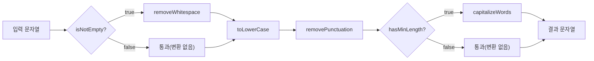

함수형 프로그래밍이 전통적인 디자인 패턴에 가져온 변화를 탐구합니다. 고차 함수, 불변성, 함수 합성을 통한 패턴의 진화를 학습합니다.

## 서론: 패러다임의 혁명

> *"함수형 프로그래밍은 디자인 패턴에 혁명을 가져왔다. 복잡했던 것들이 단순해지고, 불가능했던 것들이 가능해졌다."*

**함수형 프로그래밍**의 등장은 전통적인 디자인 패턴에 **패러다임의 대전환**을 가져왔습니다. 객체지향에서 필요했던 복잡한 패턴들이 **고차 함수**, **불변성**, **함수 합성**을 통해 놀랍도록 단순해졌습니다.

Java 8의 람다 표현식, Scala의 함수형 기능, JavaScript의 함수형 라이브러리들이 보급되면서, 전통적인 GoF 패턴들이 어떻게 진화하고 있는지 살펴보겠습니다.

이 글에서는 **함수형 패러다임이 가져온 혁신**을 탐구합니다:
- **전통적 패턴의 함수형 변환** - 더 간결하고 우아한 해결책
- **함수형 고유 패턴들** - 모나드, 커링, 함수 합성
- **실무 적용 사례** - Java, Scala, JavaScript 실제 코드
- **성능과 가독성의 균형** - 함수형 패턴의 트레이드오프

이 글의 모든 예제는 아래 임포트를 전제로 합니다.

```java
import java.util.*;
import java.util.function.*;
import java.util.stream.*;
import java.util.concurrent.*;
import java.util.concurrent.atomic.*;
import java.time.Duration;
```

## 전통적 패턴의 함수형 혁명

### Strategy 패턴 - 함수가 곧 전략

전통적인 Strategy 패턴이 함수형에서 어떻게 단순해지는지 살펴보겠습니다:

```java
// 전통적인 객체지향 Strategy 패턴
interface PaymentStrategy {
    PaymentResult process(double amount);
}

class CreditCardStrategy implements PaymentStrategy {
    @Override
    public PaymentResult process(double amount) {
        return new PaymentResult("Credit Card", amount, true);
    }
}

class PayPalStrategy implements PaymentStrategy {
    @Override
    public PaymentResult process(double amount) {
        return new PaymentResult("PayPal", amount, true);
    }
}

class PaymentProcessor {
    private PaymentStrategy strategy;
    
    public void setStrategy(PaymentStrategy strategy) {
        this.strategy = strategy;
    }
    
    public PaymentResult processPayment(double amount) {
        return strategy.process(amount);
    }
}

// 함수형 접근법 - 함수가 곧 전략
@FunctionalInterface
interface PaymentFunction {
    PaymentResult apply(double amount);
}

class FunctionalPaymentProcessor {
    // 전략들을 함수로 정의
    public static final PaymentFunction CREDIT_CARD = 
        amount -> new PaymentResult("Credit Card", amount, true);
    
    public static final PaymentFunction PAYPAL = 
        amount -> new PaymentResult("PayPal", amount, true);
    
    public static final PaymentFunction CRYPTOCURRENCY = 
        amount -> new PaymentResult("Crypto", amount, amount <= 10000);
    
    // 함수 합성으로 복합 전략 생성
    public static PaymentFunction withLogging(PaymentFunction payment) {
        return amount -> {
            System.out.println("Processing payment: $" + amount);
            PaymentResult result = payment.apply(amount);
            System.out.println("Result: " + result);
            return result;
        };
    }
    
    public static PaymentFunction withRetry(PaymentFunction payment, int maxRetries) {
        return amount -> {
            for (int i = 0; i < maxRetries; i++) {
                try {
                    PaymentResult result = payment.apply(amount);
                    if (result.isSuccess()) {
                        return result;
                    }
                } catch (Exception e) {
                    if (i == maxRetries - 1) {
                        throw e;
                    }
                    System.out.println("Retry attempt: " + (i + 1));
                }
            }
            return new PaymentResult("Failed", amount, false);
        };
    }
    
    public static PaymentFunction conditional(
            Predicate<Double> condition, 
            PaymentFunction primary, 
            PaymentFunction fallback) {
        return amount -> condition.test(amount) ? 
            primary.apply(amount) : fallback.apply(amount);
    }
    
    // 실제 처리
    public PaymentResult processPayment(double amount, PaymentFunction strategy) {
        return strategy.apply(amount);
    }
}

// 사용 예시
public class FunctionalStrategyDemo {
    public static void main(String[] args) {
        FunctionalPaymentProcessor processor = new FunctionalPaymentProcessor();
        
        // 기본 전략 사용
        PaymentResult result1 = processor.processPayment(100.0, 
            FunctionalPaymentProcessor.CREDIT_CARD);
        
        // 함수 합성으로 향상된 전략
        PaymentFunction enhancedStrategy = FunctionalPaymentProcessor.withLogging(
            FunctionalPaymentProcessor.withRetry(
                FunctionalPaymentProcessor.PAYPAL, 3
            )
        );
        
        PaymentResult result2 = processor.processPayment(100.0, enhancedStrategy);
        
        // 조건부 전략 (고액은 암호화폐, 소액은 신용카드)
        PaymentFunction smartStrategy = FunctionalPaymentProcessor.conditional(
            amount -> amount > 1000,
            FunctionalPaymentProcessor.CRYPTOCURRENCY,
            FunctionalPaymentProcessor.CREDIT_CARD
        );
        
        PaymentResult result3 = processor.processPayment(1500.0, smartStrategy);
        
        // 람다로 즉석 전략
        PaymentResult result4 = processor.processPayment(50.0, amount -> {
            if (amount < 100) {
                return new PaymentResult("Quick Pay", amount, true);
            } else {
                return FunctionalPaymentProcessor.CREDIT_CARD.apply(amount);
            }
        });
    }
}
```

### Observer 패턴 - Reactive Programming으로의 진화

Observer 패턴이 Reactive Programming으로 어떻게 진화했는지 살펴보겠습니다:

```java
// 함수형 Reactive Observer
public class ReactiveEventStream<T> {
    private final List<Consumer<T>> observers = new CopyOnWriteArrayList<>();
    private final List<Predicate<T>> filters = new ArrayList<>();
    private final ScheduledExecutorService scheduler = Executors.newScheduledThreadPool(2);
    
    // 기본 구독
    public Subscription subscribe(Consumer<T> observer) {
        observers.add(observer);
        return () -> observers.remove(observer);
    }
    
    // 필터링과 함께 구독
    public ReactiveEventStream<T> filter(Predicate<T> predicate) {
        ReactiveEventStream<T> filtered = new ReactiveEventStream<>();
        this.subscribe(event -> {
            if (predicate.test(event)) {
                filtered.emit(event);
            }
        });
        return filtered;
    }
    
    // 변환과 함께 구독
    public <R> ReactiveEventStream<R> map(Function<T, R> mapper) {
        ReactiveEventStream<R> mapped = new ReactiveEventStream<>();
        this.subscribe(event -> {
            try {
                R transformed = mapper.apply(event);
                mapped.emit(transformed);
            } catch (Exception e) {
                System.err.println("Mapping error: " + e.getMessage());
            }
        });
        return mapped;
    }
    
    // 디바운싱 (연속된 이벤트 중 마지막만 처리)
    public ReactiveEventStream<T> debounce(Duration delay) {
        ReactiveEventStream<T> debounced = new ReactiveEventStream<>();
        AtomicReference<ScheduledFuture<?>> lastTask = new AtomicReference<>();
        
        this.subscribe(event -> {
            ScheduledFuture<?> currentTask = lastTask.get();
            if (currentTask != null) {
                currentTask.cancel(false);
            }
            
            ScheduledFuture<?> newTask = scheduler.schedule(
                () -> debounced.emit(event),
                delay.toMillis(),
                TimeUnit.MILLISECONDS
            );
            lastTask.set(newTask);
        });
        
        return debounced;
    }
    
    // 스로틀링 (지정된 시간 간격으로만 이벤트 처리)
    public ReactiveEventStream<T> throttle(Duration interval) {
        ReactiveEventStream<T> throttled = new ReactiveEventStream<>();
        AtomicLong lastEmit = new AtomicLong(0);
        
        this.subscribe(event -> {
            long now = System.currentTimeMillis();
            long last = lastEmit.get();
            
            if (now - last >= interval.toMillis()) {
                if (lastEmit.compareAndSet(last, now)) {
                    throttled.emit(event);
                }
            }
        });
        
        return throttled;
    }
    
    // 여러 스트림 결합
    public static <T> ReactiveEventStream<T> merge(ReactiveEventStream<T>... streams) {
        ReactiveEventStream<T> merged = new ReactiveEventStream<>();
        
        for (ReactiveEventStream<T> stream : streams) {
            stream.subscribe(merged::emit);
        }
        
        return merged;
    }
    
    // 에러 처리
    public ReactiveEventStream<T> onErrorContinue(Consumer<Exception> errorHandler) {
        ReactiveEventStream<T> errorHandled = new ReactiveEventStream<>();
        
        this.subscribe(event -> {
            try {
                errorHandled.emit(event);
            } catch (Exception e) {
                errorHandler.accept(e);
            }
        });
        
        return errorHandled;
    }
    
    public void emit(T event) {
        observers.forEach(observer -> {
            try {
                observer.accept(event);
            } catch (Exception e) {
                System.err.println("Observer error: " + e.getMessage());
            }
        });
    }
    
    public void shutdown() {
        scheduler.shutdown();
    }
    
    @FunctionalInterface
    interface Subscription {
        void unsubscribe();
    }
}
```

`debounce`와 `throttle`은 둘 다 "이벤트를 걸러낸다"는 점에서 비슷해 보이지만, 실무에서 선택 기준은 완전히 다르다. `debounce`는 연속된 이벤트가 멈춘 뒤 지정한 시간이 지나야 마지막 이벤트를 흘려보내므로, 이벤트가 계속 발생하는 동안에는 아무것도 방출하지 않는다 — 검색창 자동완성처럼 "사용자가 타이핑을 멈췄을 때만" 반응해야 하는 경우에 적합하다. 반면 `throttle`은 이벤트가 아무리 몰려도 지정한 간격마다 최소 한 번은 반드시 방출하므로, 스크롤 위치 갱신이나 버튼 연타 방지처럼 "일정 주기로는 반드시 반응해야 하는" 경우에 적합하다. `debounce`를 스크롤 이벤트에 쓰면 스크롤이 멈추지 않는 한 화면이 전혀 갱신되지 않는 실수가 생기고, 반대로 `throttle`을 자동완성에 쓰면 사용자가 아직 입력 중인데도 요청이 여러 번 나가는 낭비가 생긴다.

```java
// 실제 사용 예시
public class ReactivePatternDemo {
    public static void main(String[] args) throws InterruptedException {
        ReactiveEventStream<String> userActions = new ReactiveEventStream<>();
        
        // 복잡한 이벤트 처리 파이프라인
        ReactiveEventStream<String> processedActions = userActions
            .filter(action -> action.startsWith("CLICK"))  // 클릭 이벤트만
            .debounce(Duration.ofMillis(300))              // 300ms 디바운싱
            .map(action -> "Processed: " + action.toUpperCase()) // 변환
            .throttle(Duration.ofSeconds(1));              // 1초 스로틀링
        
        // 구독자 등록
        Subscription sub1 = processedActions.subscribe(action -> 
            System.out.println("Subscriber 1: " + action));
        
        Subscription sub2 = processedActions.subscribe(action -> 
            System.out.println("Subscriber 2: " + action));
        
        // 이벤트 발생
        userActions.emit("CLICK_BUTTON_1");
        userActions.emit("CLICK_BUTTON_2");  // 디바운싱으로 무시됨
        userActions.emit("CLICK_BUTTON_3");  // 디바운싱으로 무시됨
        Thread.sleep(400);
        userActions.emit("CLICK_BUTTON_4");  // 처리됨
        Thread.sleep(1200);
        userActions.emit("CLICK_BUTTON_5");  // 처리됨
        
        Thread.sleep(2000);
        
        // 구독 해제
        sub1.unsubscribe();
        sub2.unsubscribe();
        userActions.shutdown();
    }
}
```

### Factory 패턴 - 고차 함수로의 변화

Factory 패턴이 고차 함수를 통해 어떻게 간결해지는지 보겠습니다:

```java
// 함수형 Factory 패턴
public class FunctionalFactory {
    
    // 기본 생성 함수들
    public static final Function<String, User> createUser = 
        name -> new User(name, "user@example.com", UserRole.USER);
    
    public static final Function<String, Admin> createAdmin = 
        name -> new Admin(name, "admin@example.com", UserRole.ADMIN);
    
    // 고차 함수로 팩토리 커스터마이징
    public static Function<String, User> withEmail(String emailDomain) {
        return name -> new User(name, name.toLowerCase() + "@" + emailDomain, UserRole.USER);
    }
    
    public static Function<String, User> withRole(UserRole role) {
        return name -> new User(name, "default@example.com", role);
    }
    
    // 함수 합성으로 복잡한 팩토리 생성
    public static Function<UserRequest, User> compositeUserFactory(
            Function<UserRequest, String> nameExtractor,
            Function<UserRequest, String> emailExtractor,
            Function<UserRequest, UserRole> roleExtractor) {
        
        return request -> new User(
            nameExtractor.apply(request),
            emailExtractor.apply(request),
            roleExtractor.apply(request)
        );
    }
    
    // 조건부 팩토리 (함수형 Abstract Factory)
    public static Function<UserRequest, User> conditionalFactory() {
        return request -> {
            if (request.isAdmin()) {
                return createAdmin.apply(request.getName());
            } else if (request.isPremium()) {
                return withRole(UserRole.PREMIUM).apply(request.getName());
            } else {
                return createUser.apply(request.getName());
            }
        };
    }
    
    // 빌더 패턴의 함수형 변형
    public static class UserBuilderFunction {
        
        public static Function<String, Function<String, Function<UserRole, User>>> 
                curry() {
            return name -> email -> role -> new User(name, email, role);
        }
        
        // 부분 적용(Partial Application)
        public static Function<String, Function<UserRole, User>> 
                withFixedEmail(String email) {
            return name -> role -> new User(name, email, role);
        }
        
        // 체이닝 가능한 빌더
        public static UserBuilder builder() {
            return new UserBuilder();
        }
        
        public static class UserBuilder {
            private Function<String, User> builder = name -> new User(name, "default@example.com", UserRole.USER);
            
            public UserBuilder withEmail(String email) {
                Function<String, User> currentBuilder = builder;
                builder = name -> {
                    User user = currentBuilder.apply(name);
                    return new User(name, email, user.getRole());
                };
                return this;
            }
            
            public UserBuilder withRole(UserRole role) {
                Function<String, User> currentBuilder = builder;
                builder = name -> {
                    User user = currentBuilder.apply(name);
                    return new User(name, user.getEmail(), role);
                };
                return this;
            }
            
            public User build(String name) {
                return builder.apply(name);
            }
        }
    }
}

// 사용 예시
public class FunctionalFactoryDemo {
    public static void main(String[] args) {
        // 기본 팩토리 사용
        User user1 = FunctionalFactory.createUser.apply("John");
        
        // 커스터마이징된 팩토리
        Function<String, User> corporateUserFactory = 
            FunctionalFactory.withEmail("company.com");
        User employee = corporateUserFactory.apply("Alice");
        
        // 함수 합성으로 복잡한 팩토리
        Function<UserRequest, User> complexFactory = 
            FunctionalFactory.compositeUserFactory(
                UserRequest::getName,
                req -> req.getName().toLowerCase() + "@" + req.getDomain(),
                req -> req.isManager() ? UserRole.MANAGER : UserRole.USER
            );
        
        UserRequest request = new UserRequest("Bob", "company.com", true);
        User manager = complexFactory.apply(request);
        
        // 커링 사용
        Function<String, Function<String, Function<UserRole, User>>> curry = 
            FunctionalFactory.UserBuilderFunction.curry();
        
        User user2 = curry
            .apply("Charlie")
            .apply("charlie@company.com")
            .apply(UserRole.ADMIN);
        
        // 빌더 패턴의 함수형 버전
        User user3 = FunctionalFactory.UserBuilderFunction.builder()
            .withEmail("david@company.com")
            .withRole(UserRole.MANAGER)
            .build("David");
    }
}
```

## 함수형 고유 패턴들

### Monad 패턴 - 안전한 체이닝

함수형 프로그래밍의 핵심 패턴인 Monad를 Java에서 구현해보겠습니다:

```java
// Maybe Monad (Optional의 확장)
public abstract class Maybe<T> {
    
    public abstract boolean isPresent();
    public abstract T get();
    
    public static <T> Maybe<T> of(T value) {
        return value != null ? new Some<>(value) : new None<>();
    }
    
    public static <T> Maybe<T> empty() {
        return new None<>();
    }
    
    // Functor 구현
    public abstract <U> Maybe<U> map(Function<T, U> mapper);
    
    // Monad 구현
    public abstract <U> Maybe<U> flatMap(Function<T, Maybe<U>> mapper);
    
    // Applicative 구현
    public static <T, U, R> Maybe<R> lift2(
            Function<T, Function<U, R>> f, 
            Maybe<T> maybeT, 
            Maybe<U> maybeU) {
        return maybeT.flatMap(t -> maybeU.map(u -> f.apply(t).apply(u)));
    }
    
    // 유틸리티 메서드들
    public abstract Maybe<T> filter(Predicate<T> predicate);
    public abstract T orElse(T defaultValue);
    public abstract T orElseGet(Supplier<T> supplier);
    public abstract Maybe<T> or(Supplier<Maybe<T>> alternative);
    
    // Some 구현
    private static class Some<T> extends Maybe<T> {
        private final T value;
        
        Some(T value) {
            this.value = value;
        }
        
        @Override
        public boolean isPresent() {
            return true;
        }
        
        @Override
        public T get() {
            return value;
        }
        
        @Override
        public <U> Maybe<U> map(Function<T, U> mapper) {
            try {
                return Maybe.of(mapper.apply(value));
            } catch (Exception e) {
                return Maybe.empty();
            }
        }
        
        @Override
        public <U> Maybe<U> flatMap(Function<T, Maybe<U>> mapper) {
            try {
                return mapper.apply(value);
            } catch (Exception e) {
                return Maybe.empty();
            }
        }
        
        @Override
        public Maybe<T> filter(Predicate<T> predicate) {
            return predicate.test(value) ? this : Maybe.empty();
        }
        
        @Override
        public T orElse(T defaultValue) {
            return value;
        }
        
        @Override
        public T orElseGet(Supplier<T> supplier) {
            return value;
        }
        
        @Override
        public Maybe<T> or(Supplier<Maybe<T>> alternative) {
            return this;
        }
    }
    
    // None 구현
    private static class None<T> extends Maybe<T> {
        
        @Override
        public boolean isPresent() {
            return false;
        }
        
        @Override
        public T get() {
            throw new NoSuchElementException("No value present");
        }
        
        @Override
        public <U> Maybe<U> map(Function<T, U> mapper) {
            return Maybe.empty();
        }
        
        @Override
        public <U> Maybe<U> flatMap(Function<T, Maybe<U>> mapper) {
            return Maybe.empty();
        }
        
        @Override
        public Maybe<T> filter(Predicate<T> predicate) {
            return this;
        }
        
        @Override
        public T orElse(T defaultValue) {
            return defaultValue;
        }
        
        @Override
        public T orElseGet(Supplier<T> supplier) {
            return supplier.get();
        }
        
        @Override
        public Maybe<T> or(Supplier<Maybe<T>> alternative) {
            return alternative.get();
        }
    }
}

// Either Monad (성공/실패 처리)
public abstract class Either<L, R> {
    
    public abstract boolean isLeft();
    public abstract boolean isRight();
    public abstract L getLeft();
    public abstract R getRight();
    
    public static <L, R> Either<L, R> left(L value) {
        return new Left<>(value);
    }
    
    public static <L, R> Either<L, R> right(R value) {
        return new Right<>(value);
    }
    
    // Functor
    public abstract <T> Either<L, T> map(Function<R, T> mapper);
    
    // Monad
    public abstract <T> Either<L, T> flatMap(Function<R, Either<L, T>> mapper);
    
    // Error handling
    public abstract Either<L, R> mapLeft(Function<L, L> mapper);
    public abstract <T> Either<T, R> mapError(Function<L, T> mapper);
    
    // Left 구현
    private static class Left<L, R> extends Either<L, R> {
        private final L value;
        
        Left(L value) {
            this.value = value;
        }
        
        @Override
        public boolean isLeft() { return true; }
        
        @Override
        public boolean isRight() { return false; }
        
        @Override
        public L getLeft() { return value; }
        
        @Override
        public R getRight() {
            throw new NoSuchElementException("Right value on Left");
        }
        
        @Override
        public <T> Either<L, T> map(Function<R, T> mapper) {
            return Either.left(value);
        }
        
        @Override
        public <T> Either<L, T> flatMap(Function<R, Either<L, T>> mapper) {
            return Either.left(value);
        }
        
        @Override
        public Either<L, R> mapLeft(Function<L, L> mapper) {
            return Either.left(mapper.apply(value));
        }
        
        @Override
        public <T> Either<T, R> mapError(Function<L, T> mapper) {
            return Either.left(mapper.apply(value));
        }
    }
    
    // Right 구현
    private static class Right<L, R> extends Either<L, R> {
        private final R value;
        
        Right(R value) {
            this.value = value;
        }
        
        @Override
        public boolean isLeft() { return false; }
        
        @Override
        public boolean isRight() { return true; }
        
        @Override
        public L getLeft() {
            throw new NoSuchElementException("Left value on Right");
        }
        
        @Override
        public R getRight() { return value; }
        
        @Override
        public <T> Either<L, T> map(Function<R, T> mapper) {
            return Either.right(mapper.apply(value));
        }
        
        @Override
        public <T> Either<L, T> flatMap(Function<R, Either<L, T>> mapper) {
            return mapper.apply(value);
        }
        
        @Override
        public Either<L, R> mapLeft(Function<L, L> mapper) {
            return this;
        }
        
        @Override
        public <T> Either<T, R> mapError(Function<L, T> mapper) {
            return Either.right(value);
        }
    }
}

// 함수형 서비스 구현 예시
public class FunctionalUserService {
    
    public Either<String, User> createUser(UserRequest request) {
        return validateRequest(request)
            .flatMap(this::checkUserNotExists)
            .flatMap(this::createUserEntity)
            .flatMap(this::saveUser)
            .flatMap(this::sendWelcomeEmail);
    }
    
    private Either<String, UserRequest> validateRequest(UserRequest request) {
        if (request.getName() == null || request.getName().trim().isEmpty()) {
            return Either.left("Name is required");
        }
        if (request.getEmail() == null || !request.getEmail().contains("@")) {
            return Either.left("Valid email is required");
        }
        return Either.right(request);
    }
    
    private Either<String, UserRequest> checkUserNotExists(UserRequest request) {
        // 실제로는 데이터베이스 체크
        if (userExists(request.getEmail())) {
            return Either.left("User already exists: " + request.getEmail());
        }
        return Either.right(request);
    }
    
    private Either<String, User> createUserEntity(UserRequest request) {
        try {
            User user = new User(request.getName(), request.getEmail(), UserRole.USER);
            return Either.right(user);
        } catch (Exception e) {
            return Either.left("Failed to create user: " + e.getMessage());
        }
    }
    
    private Either<String, User> saveUser(User user) {
        try {
            // 실제로는 데이터베이스 저장
            return Either.right(user);
        } catch (Exception e) {
            return Either.left("Failed to save user: " + e.getMessage());
        }
    }
    
    private Either<String, User> sendWelcomeEmail(User user) {
        try {
            // 실제로는 이메일 발송
            return Either.right(user);
        } catch (Exception e) {
            return Either.left("Failed to send welcome email: " + e.getMessage());
        }
    }
    
    private boolean userExists(String email) {
        // 실제 구현
        return false;
    }
}
```

`Maybe`와 `Either`는 둘 다 예외를 던지지 않고 실패를 표현하는 모나드지만, 담을 수 있는 정보의 양이 다르다. `Maybe`는 "값이 있다/없다"만 표현하므로, 값이 없는 이유(왜 실패했는지)를 호출자에게 전달할 방법이 없다 — `orElse`나 `orElseGet`으로 기본값을 채우는 정도가 할 수 있는 전부다. 반면 `Either<L, R>`은 실패(`Left`)에 구체적인 이유(에러 메시지, 예외 객체, 검증 실패 코드 등)를 담을 수 있어, `FunctionalUserService.createUser`처럼 "왜 실패했는지"를 사용자에게 보여줘야 하는 검증·비즈니스 로직 체인에 적합하다. 반대로 존재 여부만 중요하고 실패 사유가 의미 없는 조회(예: Map에서 키로 값 찾기)에는 `Either`의 왼쪽 타입을 채울 이유가 없으므로 `Maybe`(또는 `Optional`)가 더 단순하다. 즉 선택 기준은 "호출자가 실패 이유를 알아야 하는가"이지, 둘 중 하나가 항상 우월해서가 아니다.

### 함수 합성과 파이프라인 패턴

함수 합성을 통한 강력한 데이터 처리 파이프라인을 구현해보겠습니다:

```java
// 함수 합성 유틸리티
public class FunctionComposition {
    
    // 기본 함수 합성
    public static <A, B, C> Function<A, C> compose(
            Function<B, C> f, 
            Function<A, B> g) {
        return a -> f.apply(g.apply(a));
    }
    
    // 여러 함수 체이닝
    @SafeVarargs
    public static <T> Function<T, T> chain(Function<T, T>... functions) {
        return Arrays.stream(functions)
            .reduce(Function.identity(), Function::andThen);
    }
    
    // 조건부 함수 적용
    public static <T> Function<T, T> when(
            Predicate<T> condition, 
            Function<T, T> transformation) {
        return input -> condition.test(input) ? transformation.apply(input) : input;
    }
    
    // 다중 조건 처리
    public static <T> Function<T, T> match(
            Predicate<T> condition1, Function<T, T> transformation1,
            Predicate<T> condition2, Function<T, T> transformation2,
            Function<T, T> defaultTransformation) {
        return input -> {
            if (condition1.test(input)) {
                return transformation1.apply(input);
            } else if (condition2.test(input)) {
                return transformation2.apply(input);
            } else {
                return defaultTransformation.apply(input);
            }
        };
    }
    
    // 파이프라인 빌더
    public static class Pipeline<T> {
        private Function<T, T> pipeline;
        
        private Pipeline(Function<T, T> pipeline) {
            this.pipeline = pipeline;
        }
        
        public static <T> Pipeline<T> start() {
            return new Pipeline<>(Function.identity());
        }
        
        public Pipeline<T> then(Function<T, T> function) {
            this.pipeline = pipeline.andThen(function);
            return this;
        }
        
        public Pipeline<T> when(Predicate<T> condition, Function<T, T> function) {
            return then(FunctionComposition.when(condition, function));
        }
        
        public <U> Pipeline<U> map(Function<T, U> mapper) {
            return new Pipeline<>(pipeline.andThen(mapper));
        }
        
        public T execute(T input) {
            return pipeline.apply(input);
        }
        
        public Function<T, T> build() {
            return pipeline;
        }
    }
}

// 데이터 처리 파이프라인 예시
public class DataProcessingPipeline {
    
    // 텍스트 처리 함수들
    public static final Function<String, String> removeWhitespace = 
        text -> text.replaceAll("\\s+", " ").trim();
    
    public static final Function<String, String> toLowerCase = 
        String::toLowerCase;
    
    public static final Function<String, String> removePunctuation = 
        text -> text.replaceAll("[^a-zA-Z0-9\\s]", "");
    
    public static final Function<String, String> capitalizeWords = text -> 
        Arrays.stream(text.split(" "))
            .map(word -> word.isEmpty() ? word : 
                Character.toUpperCase(word.charAt(0)) + word.substring(1))
            .collect(Collectors.joining(" "));
    
    // 숫자 처리 함수들
    public static final Function<Integer, Integer> multiplyByTwo = x -> x * 2;
    public static final Function<Integer, Integer> addTen = x -> x + 10;
    public static final Function<Integer, Integer> absolute = Math::abs;
    
    // 검증 함수들
    public static final Predicate<String> isNotEmpty = text -> !text.trim().isEmpty();
    public static final Predicate<String> hasMinLength = text -> text.length() >= 3;
    public static final Predicate<Integer> isPositive = x -> x > 0;
    public static final Predicate<Integer> isEven = x -> x % 2 == 0;
    
    public static void main(String[] args) {
        // 텍스트 처리 파이프라인
        Function<String, String> textProcessor = Pipeline.<String>start()
            .when(isNotEmpty, removeWhitespace)
            .then(toLowerCase)
            .then(removePunctuation)
            .when(hasMinLength, capitalizeWords)
            .build();
        
        String result1 = textProcessor.apply("  Hello,   World!!!  ");
        System.out.println("Text processing result: " + result1);
        
        // 숫자 처리 파이프라인
        Function<Integer, Integer> numberProcessor = Pipeline.<Integer>start()
            .then(absolute)
            .when(isEven, multiplyByTwo)
            .when(isPositive, addTen)
            .build();
        
        Integer result2 = numberProcessor.apply(-8);
        System.out.println("Number processing result: " + result2);
        
        // 복잡한 조건부 처리
        Function<String, String> complexProcessor = FunctionComposition.match(
            text -> text.startsWith("ERROR"),
            text -> "🚨 " + text.toUpperCase(),
            text -> text.startsWith("WARNING"),
            text -> "[Warning] " + text,
            text -> "ℹ️ " + text
        );
        
        System.out.println(complexProcessor.apply("ERROR: System failure"));
        System.out.println(complexProcessor.apply("WARNING: Low memory"));
        System.out.println(complexProcessor.apply("INFO: Process completed"));
        
        // 함수 체이닝으로 복잡한 변환
        Function<String, String> chainedProcessor = FunctionComposition.chain(
            removeWhitespace,
            toLowerCase,
            removePunctuation,
            capitalizeWords
        );
        
        String result3 = chainedProcessor.apply("  HELLO,   beautiful   WORLD!!!  ");
        System.out.println("Chained processing result: " + result3);
    }
}
```

`textProcessor` 파이프라인은 `Pipeline.start()`가 반환하는 항등 함수(identity function)에 `when()`과 `then()`을 호출할 때마다 `Function.andThen()`으로 새 함수를 이어 붙이는 방식으로 조립된다. 각 단계는 이전 단계의 출력을 그대로 입력받으며, `when()`으로 감싼 단계는 조건이 거짓이면 원본 입력을 그대로 통과시킨다. 아래 다이어그램은 `" Hello, World!!! "` 입력이 이 파이프라인을 통과하며 어떤 순서로 변환되는지를 보여준다.



## 성능과 실용성 분석

### 함수형 패턴의 성능 특성

```java
// 성능 벤치마크 비교
public class FunctionalPatternBenchmark {
    
    private static final int ITERATIONS = 1_000_000;
    
    // 전통적 vs 함수형 Strategy 패턴 성능 비교
    public static void benchmarkStrategyPattern() {
        // 전통적 방식
        PaymentProcessor traditionalProcessor = new PaymentProcessor();
        traditionalProcessor.setStrategy(new CreditCardStrategy());
        
        long start = System.nanoTime();
        for (int i = 0; i < ITERATIONS; i++) {
            traditionalProcessor.processPayment(100.0);
        }
        long traditionalTime = System.nanoTime() - start;
        
        // 함수형 방식
        FunctionalPaymentProcessor functionalProcessor = new FunctionalPaymentProcessor();
        
        start = System.nanoTime();
        for (int i = 0; i < ITERATIONS; i++) {
            functionalProcessor.processPayment(100.0, FunctionalPaymentProcessor.CREDIT_CARD);
        }
        long functionalTime = System.nanoTime() - start;
        
        System.out.printf("Strategy Pattern Performance:\n");
        System.out.printf("Traditional: %.2f ms\n", traditionalTime / 1_000_000.0);
        System.out.printf("Functional:  %.2f ms\n", functionalTime / 1_000_000.0);
        System.out.printf("Functional is %.2fx faster\n", 
                         (double) traditionalTime / functionalTime);
    }
    
    // 메모리 사용량 비교
    public static void benchmarkMemoryUsage() {
        Runtime runtime = Runtime.getRuntime();
        
        // 전통적 Observer 패턴
        runtime.gc();
        long beforeTraditional = runtime.totalMemory() - runtime.freeMemory();
        
        List<Observer> observers = new ArrayList<>();
        Subject subject = new Subject();
        for (int i = 0; i < 10000; i++) {
            Observer observer = new Observer() {
                @Override
                public void update(String message) {
                    // 처리 로직
                }
            };
            observers.add(observer);
            subject.addObserver(observer);
        }
        
        long afterTraditional = runtime.totalMemory() - runtime.freeMemory();
        long traditionalMemory = afterTraditional - beforeTraditional;
        
        // 함수형 Observer 패턴
        runtime.gc();
        long beforeFunctional = runtime.totalMemory() - runtime.freeMemory();
        
        ReactiveEventStream<String> stream = new ReactiveEventStream<>();
        List<ReactiveEventStream.Subscription> subscriptions = new ArrayList<>();
        for (int i = 0; i < 10000; i++) {
            subscriptions.add(stream.subscribe(message -> {
                // 처리 로직
            }));
        }
        
        long afterFunctional = runtime.totalMemory() - runtime.freeMemory();
        long functionalMemory = afterFunctional - beforeFunctional;
        
        System.out.printf("Memory Usage Comparison:\n");
        System.out.printf("Traditional Observer: %d KB\n", traditionalMemory / 1024);
        System.out.printf("Functional Observer:  %d KB\n", functionalMemory / 1024);
        System.out.printf("Memory reduction: %.2f%%\n", 
                         (1.0 - (double) functionalMemory / traditionalMemory) * 100);
    }
}
```

### 함수형 전환 적합성과 성능 특성

패턴별로 구체적인 처리량(%) 수치를 제시하려면 동일 JVM·동일 워크로드 기준의 벤치마크가 필요하지만, 이 시리즈는 그런 벤치마크를 수행하지 않았다. 아래 표는 수치 대신 성능에 영향을 주는 요인을 정성적으로 설명한다. 실제 프로젝트에서는 JMH 같은 도구로 직접 측정한 뒤 판단해야 한다.

| 패턴 | FP 전환 적합도 | 성능에 영향을 주는 요인 | 가독성 | 추천 상황 |
|------|--------------|----------------------|--------|-----------|
| Strategy | ★★★★★ | 람다는 익명 클래스보다 생성 비용이 낮지만, 캡처 변수가 많으면 힙 할당이 발생할 수 있다 | 매우 높음 | 알고리즘 교체가 빈번한 경우 |
| Iterator (Stream) | ★★★★★ | 순차 처리는 for문과 유사하거나 약간 느리고, 병렬 처리는 데이터 크기가 클 때 우세하다 | 높음 | 컬렉션 순회·변환 |
| Command | ★★★★★ | Runnable/Supplier로의 위임은 인터페이스 호출과 동일한 비용이다 | 중간 | 함수 합성이 필요한 경우 |
| Factory | ★★★★☆ | Supplier 호출은 기존 생성자 호출과 비용이 사실상 같다 | 높음 | 설정 기반 객체 생성 |
| Decorator | ★★★★☆ | 함수 합성 체인이 길어질수록 호출 스택이 깊어져 오버헤드가 누적된다 | 높음 | 동적 기능 조합 |
| Observer | ★★★★☆ | 스트림 파이프라인은 각 단계마다 중간 객체를 생성하므로 원시 콜백보다 메모리 사용이 늘어날 수 있다 | 높음 | 이벤트 스트림 처리 |
| Template Method | ★★★☆☆ | 고차 함수로의 훅 대체는 가상 호출 대신 함수 객체 호출을 쓰므로 차이는 미미하다 | 낮음 | 단순한 알고리즘 골격 |
| Visitor | ★★★☆☆ | 패턴 매칭 대안의 성능은 언어·컴파일러 구현에 따라 달라 일반화하기 어렵다 | 중간 | 봉인된 타입 계층 |
| State | ★★☆☆☆ | 불변 객체 기반 전이는 상태 전이마다 새 인스턴스를 생성해 GC 압력이 늘어난다 | 낮음 | 상태 전이가 드문 경우 |

## 한눈에 보는 OOP vs 함수형 패턴

### GoF 패턴의 함수형 변환 비교

| GoF 패턴 | OOP 구현 | FP 구현 | 변환 효과 |
|---------|---------|--------|----------|
| Strategy | 인터페이스 + 구현 클래스 | 고차 함수 (Function<T,R>) | 클래스 제거, 람다로 단순화 |
| Command | Command 인터페이스 + 구현 | Runnable, Supplier | 보일러플레이트 감소 |
| Observer | Observer 인터페이스 | Consumer, 반응형 스트림 | 선언적 처리 |
| Decorator | 래퍼 클래스 체인 | 함수 합성 (compose) | 체인이 함수 조합으로 |
| Factory | Factory 클래스 | Supplier<T> | 간결한 생성 로직 |
| Template Method | 추상 클래스 상속 | 고차 함수 + 훅 | 상속 → 조합 |
| Iterator | Iterator 인터페이스 | Stream API | 내부 반복 |
| Singleton | static 필드 | 불필요 (순수 함수) | 전역 상태 제거 |

### OOP vs FP 접근법 비교

| 측면 | OOP 패턴 | FP 패턴 |
|------|---------|--------|
| 상태 관리 | 가변 객체 | 불변 데이터 |
| 확장 방식 | 상속/구현 | 함수 조합 |
| 코드량 | 많음 (클래스 정의) | 적음 (람다) |
| 타입 안전성 | 인터페이스 기반 | 제네릭 함수 |
| 테스트 | Mock 필요 | 순수 함수 테스트 |
| 부수 효과 | 허용 | 격리/제어 |

### 하이브리드 접근법 가이드

| 상황 | 권장 접근 | 이유 |
|------|----------|------|
| 간단한 전략 | FP (람다) | 코드 간결성 |
| 복잡한 상태 전이 | OOP (State) | 명시적 상태 관리 |
| 데이터 변환 | FP (Stream) | 선언적 처리 |
| 도메인 모델 | OOP + 불변성 | 캡슐화 + 안전성 |
| 콜백 처리 | FP (Consumer) | 간결한 핸들링 |

### 적용 체크리스트

| 체크 항목 | 설명 |
|----------|------|
| 단일 메서드 인터페이스인가? | 함수형 인터페이스로 전환 가능 |
| 상태가 없거나 불변인가? | 순수 함수로 전환 용이 |
| 조합/체이닝이 필요한가? | 함수 합성 적합 |
| 병렬 처리가 필요한가? | Stream 병렬화 고려 |
| 팀의 FP 숙련도는? | 점진적 도입 계획 |

## 흔한 오개념 바로잡기

함수형 패턴을 처음 접할 때 자주 빠지는 오해 세 가지를 짚어본다.

첫째, "함수형 스타일은 항상 OOP보다 빠르다"는 사실이 아니다. "함수형 전환 적합성과 성능 특성" 표에서 보듯 람다도 캡처 변수가 있으면 힙 할당이 발생하고, 스트림 파이프라인은 단계마다 중간 객체를 만들어 원시 반복문보다 느릴 수 있다. 성능은 전환 자체가 아니라 캡처 패턴과 파이프라인 구조에 달려 있다.

둘째, "`Maybe`/`Either` 같은 모나드를 쓰면 예외 처리가 필요 없다"는 오해다. 모나드는 "예상 가능한 실패"(값 없음, 검증 실패)를 명시적으로 표현하는 도구일 뿐, `NullPointerException`이나 `OutOfMemoryError`처럼 프로그래밍 오류나 시스템 장애로 발생하는 예외까지 대체하지 않는다. 이런 예외까지 억지로 `Either.left`로 감싸면 오히려 실패를 조용히 삼켜 디버깅을 어렵게 만든다.

셋째, "함수형으로 전환하면 테스트가 항상 쉬워진다"는 절반만 맞다. 부수 효과가 없는 순수 함수는 입출력만 검증하면 되지만, `FunctionalPaymentProcessor.withLogging`처럼 로깅·재시도 등 부수 효과를 감싼 고차 함수는 여전히 목(mock)이나 캡처를 이용한 검증이 필요하다. 함수형이 테스트를 쉽게 만드는 것은 "순수성"이지 "함수라는 형태" 자체가 아니다.

## 평가 기준

이 글을 읽고 다음을 스스로 설명할 수 있다면 핵심을 이해한 것이다.

- Strategy, Observer, Factory 패턴을 함수형으로 전환했을 때 어떤 보일러플레이트가 사라지고, 그 대가로 어떤 성능·가독성 트레이드오프가 생기는지 설명할 수 있다.
- `Maybe`와 `Either`를 언제 각각 선택해야 하는지, 그 기준(실패 이유를 호출자가 알아야 하는가)을 설명할 수 있다.
- `debounce`와 `throttle`이 서로 다른 상황(입력 종료 대기 vs 주기적 반응 보장)에 쓰인다는 것을 예시와 함께 설명할 수 있다.
- "함수형이 항상 더 빠르다/테스트가 쉽다"는 주장이 왜 절반만 맞는 이야기인지, 위 표와 코드 근거를 들어 반박할 수 있다.

---

## 결론: 함수형 패러다임의 가치

함수형 프로그래밍은 디자인 패턴에 **혁명적 변화**를 가져왔습니다:

### 함수형 패턴의 장점

1. **간결성**: 보일러플레이트 코드 대폭 감소
2. **조합성**: 함수 합성을 통한 무한한 확장 가능성
3. **안전성**: 불변성과 순수 함수를 통한 사이드 이펙트 제거
4. **테스트 용이성**: 순수 함수의 예측 가능한 동작
5. **병렬 처리**: 불변 데이터 구조를 통한 안전한 동시성

### 고려사항

1. **학습 곡선**: 함수형 개념의 이해 필요
2. **성능 오버헤드**: 일부 상황에서의 메모리 사용량 증가
3. **디버깅 복잡성**: 함수 체이닝의 디버깅 어려움
4. **기존 코드와의 호환성**: 점진적 마이그레이션 필요

> *"함수형 프로그래밍은 디자인 패턴을 없애는 것이 아니라 더 나은 형태로 진화시킨다. 중요한 것은 패러다임의 장점을 이해하고 적절한 상황에서 활용하는 것이다."*

함수형 패턴은 **현대 소프트웨어 개발의 필수 도구**가 되었습니다. 전통적인 패턴과 함수형 패턴을 적절히 조합하여 더 나은 소프트웨어를 만들어보세요!

## 토론 주제

1. **성능 주장의 근거**: "함수형 전환 적합성과 성능 특성" 표는 구체적인 수치 대신 정성적 요인만 제시한다. 만약 팀에서 Strategy 패턴의 함수형 전환이 실제로 더 빠른지 검증해야 한다면, 어떤 벤치마크 설계(워크로드, JVM 워밍업, 캡처 변수 유무)가 신뢰할 만한 결과를 줄 수 있는가?
2. **캡처 클로저와 메모리**: `withLogging`, `withRetry`처럼 함수를 반환하는 고차 함수는 매번 새 클로저 인스턴스를 생성한다. 이 인스턴스들이 요청마다 재생성된다면 GC에 어떤 부담을 주며, 이를 완화할 방법은 무엇인가?
3. **Either/Maybe 모나드의 팀 도입 비용**: `FunctionalUserService.createUser`처럼 `flatMap` 체인으로 에러 처리를 표현하면 예외 기반 코드보다 안전하지만, Java 팀이 이 스타일에 익숙하지 않다면 어떤 학습·리뷰 비용이 발생하는가?
4. **State 패턴이 불변성과 충돌하는 이유**: 표에서 State의 FP 전환 적합도가 가장 낮게 평가됐다. 상태 전이가 빈번한 도메인(예: 주문 상태 머신)에서 불변 객체 기반 전이를 강제하면 어떤 설계상 트레이드오프가 발생하는가?
5. **Visitor와 패턴 매칭의 경계**: Java의 `sealed` 인터페이스와 패턴 매칭(Java 21 기준)이 성숙해지면 Visitor 패턴은 여전히 필요한가? 어떤 상황에서 Visitor가 패턴 매칭보다 여전히 유리한가?

## 참고 자료

- Erich Gamma, Richard Helm, Ralph Johnson, John Vlissides, *Design Patterns: Elements of Reusable Object-Oriented Software* (Addison-Wesley, 1994) — 이 글이 함수형으로 재해석하는 Strategy, Observer, Command, Factory, Decorator, Template Method 등 GoF 패턴의 원전 정의.
- Brian Goetz et al., *State of the Lambda* (OpenJDK Project Lambda, 2013) 및 Java Language Specification의 람다 표현식·함수형 인터페이스 명세 — Java 8 람다·`java.util.function` 패키지의 설계 근거.
