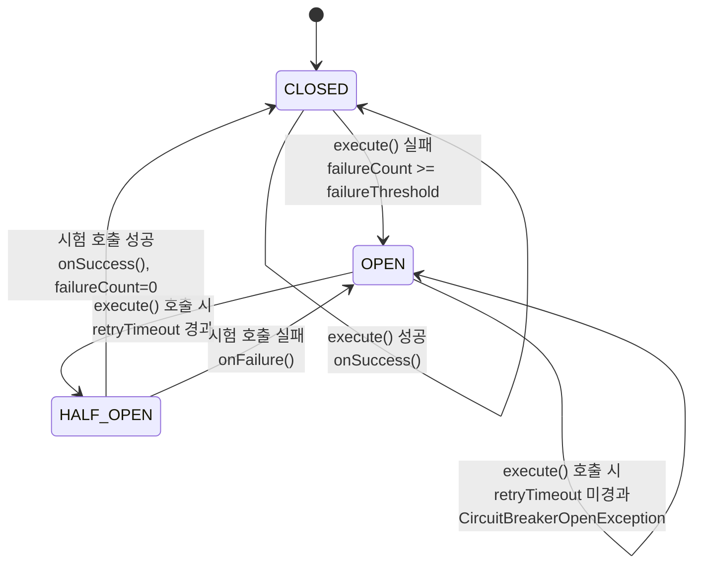
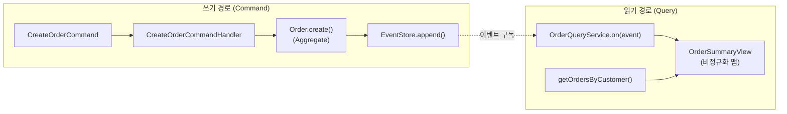

동시성과 분산 시스템 환경에서 전통적 패턴의 진화와 새로운 패턴을 탐구합니다. 확장 가능한 시스템 설계를 위한 동시성 제어와 분산 패턴을 학습합니다.

## 서론: 분산 세계의 패턴 진화

> *"단일 시스템에서 동작하던 패턴들이 분산 환경에서 어떻게 진화하고 있는가? 동시성과 분산성은 기존 패턴에 새로운 도전과 기회를 가져다준다."*

현대 소프트웨어는 **분산 시스템**과 **고동시성** 환경에서 동작해야 합니다. 전통적 디자인 패턴들이 이러한 환경에서 어떻게 적응하고 진화했는지, 그리고 분산 시스템만의 새로운 패턴들을 탐구해보겠습니다.

이 글의 모든 예제는 아래 임포트를 전제로 합니다.

```java
import java.util.*;
import java.util.concurrent.*;
import java.util.concurrent.atomic.*;
import java.util.function.*;
import java.util.stream.*;
import java.time.Duration;
import java.time.LocalDateTime;
import java.math.BigDecimal;
import java.net.URI;
import java.net.http.HttpClient;
import java.net.http.HttpRequest;
import java.net.http.HttpResponse;
```

## 동시성 패턴들

### Thread-Safe Singleton - 동시성의 첫 번째 시험

단일 스레드 환경에서 Singleton은 `instance == null` 검사와 생성을 순서대로 실행하기만 하면 충분했다. 그러나 다중 스레드가 동시에 `getInstance()`에 진입하면 두 스레드가 모두 `instance == null`을 참으로 확인한 직후 각자 `new`를 실행해 인스턴스가 두 번 만들어지거나, JIT/CPU가 명령어를 재배치해 필드가 다 채워지기 전의 반쯤 초기화된 객체를 다른 스레드가 읽어버릴 수도 있다. 아래 세 구현은 이 문제를 서로 다른 지점에서 차단한다. enum은 JVM 명세가 클래스 로딩 자체를 스레드 안전하게 보장한다는 데 기대고, DCL(Double-Checked Locking)은 `volatile`로 재배치를 막으면서 `synchronized` 블록을 최초 생성 시점에만 국한시켜 이후 호출의 동기화 비용을 없애며, holder 패턴은 클래스 초기화가 지연되면서도 스레드 안전하다는 JVM 명세를 이용해 락 코드 없이 지연 초기화를 구현한다.

```java
// 현대적 Thread-Safe Singleton 구현들
public class ModernSingleton {
    
    // 1. Enum 기반 (가장 안전)
    public enum EnumSingleton {
        INSTANCE;
        
        private final ConfigService configService;
        
        EnumSingleton() {
            this.configService = new ConfigService();
        }
        
        public ConfigService getConfigService() {
            return configService;
        }
    }
    
    // 2. Double-Checked Locking (최적화된)
    public static class DCLSingleton {
        private static volatile DCLSingleton instance;
        private final Map<String, String> config;
        
        private DCLSingleton() {
            // 초기화 비용이 큰 작업
            this.config = loadConfiguration();
        }
        
        public static DCLSingleton getInstance() {
            if (instance == null) {
                synchronized (DCLSingleton.class) {
                    if (instance == null) {
                        instance = new DCLSingleton();
                    }
                }
            }
            return instance;
        }
        
        private Map<String, String> loadConfiguration() {
            // 실제로는 외부 설정 로드
            return Map.of("env", "production", "db.url", "jdbc:mysql://localhost");
        }
    }
    
    // 3. Initialization-on-demand holder (지연 로딩 + Thread-Safe)
    public static class LazyHolder {
        private static final class Holder {
            private static final LazyHolder INSTANCE = new LazyHolder();
        }
        
        public static LazyHolder getInstance() {
            return Holder.INSTANCE;
        }
    }
}
```

### Producer-Consumer 패턴 - 동시성의 핵심

Producer-Consumer 패턴의 목적은 생산자와 소비자의 처리 속도 차이를 완충하는 데 있다. 생산자가 소비자보다 빠르면 생산자는 소비자를 기다리지 않고 큐에 쌓아두면 되고, 반대로 소비자가 더 빠르면 큐가 비었을 때만 대기하면 된다. 아래 구현이 별도의 동기화 코드 없이 `BlockingQueue`만으로 이를 처리하는 이유가 여기에 있다 — `put()`과 `poll()`이 내부적으로 락과 대기/통지 메커니즘을 캡슐화하고 있으므로, 생산자 풀과 소비자 풀을 각각 여러 스레드로 띄워도 개발자가 직접 임계 구역을 관리할 필요가 없다.

```java
// 현대적 Producer-Consumer 구현
public class ModernProducerConsumer<T> {
    private final BlockingQueue<T> queue;
    private final AtomicBoolean running = new AtomicBoolean(true);
    private final ExecutorService producerPool;
    private final ExecutorService consumerPool;
    
    public ModernProducerConsumer(int capacity, int producerCount, int consumerCount) {
        this.queue = new ArrayBlockingQueue<>(capacity);
        this.producerPool = Executors.newFixedThreadPool(producerCount);
        this.consumerPool = Executors.newFixedThreadPool(consumerCount);
    }
    
    public void startProducers(Supplier<T> producer) {
        for (int i = 0; i < ((ThreadPoolExecutor) producerPool).getCorePoolSize(); i++) {
            producerPool.submit(() -> {
                while (running.get()) {
                    try {
                        T item = producer.get();
                        queue.put(item);
                    } catch (InterruptedException e) {
                        Thread.currentThread().interrupt();
                        break;
                    }
                }
            });
        }
    }
    
    public void startConsumers(Consumer<T> consumer) {
        for (int i = 0; i < ((ThreadPoolExecutor) consumerPool).getCorePoolSize(); i++) {
            consumerPool.submit(() -> {
                while (running.get() || !queue.isEmpty()) {
                    try {
                        T item = queue.poll(1, TimeUnit.SECONDS);
                        if (item != null) {
                            consumer.accept(item);
                        }
                    } catch (InterruptedException e) {
                        Thread.currentThread().interrupt();
                        break;
                    }
                }
            });
        }
    }
    
    public void shutdown() {
        running.set(false);
        producerPool.shutdown();
        consumerPool.shutdown();
    }
}
```

`ModernProducerConsumer`의 핵심은 `BlockingQueue`가 생산자와 소비자 사이의 속도 차이를 흡수하는 버퍼 역할을 한다는 데 있다. 생산자 여러 개와 소비자 여러 개가 동시에 같은 큐에 접근하므로, 상태(큐 내부 데이터)를 지키는 주체는 특정 스레드가 아니라 큐 구현체 자체의 락/CAS 메커니즘이다. 그래서 Producer-Consumer는 "여러 생산자·여러 소비자가 공유 버퍼를 통해 결합도를 낮추는" 패턴이지, 다음에 볼 Actor 패턴처럼 "하나의 주체가 자신의 상태를 독점 관리하는" 패턴과는 설계 의도가 다르다.

### Actor 패턴 - 동시성의 새로운 접근

Actor 패턴이 풀려는 문제는 Producer-Consumer와 언뜻 비슷해 보이지만 출발점이 다르다. Producer-Consumer는 "여러 생산자와 여러 소비자가 하나의 큐를 어떻게 공유할 것인가"를 다루는 반면, Actor는 "가변 상태를 단 하나의 실행 흐름만 건드리게 만들어 락 자체를 없앨 수 없는가"를 다룬다. 아래 `Actor<T>`가 인스턴스마다 자신만의 `mailbox`(큐)를 갖고 그 mailbox를 처리하는 스레드를 `messageLoop()` 하나로 고정한 이유가 여기에 있다 — 외부 스레드는 `send()`로 메시지를 큐에 넣을 뿐 액터의 내부 상태에 직접 접근하지 못하므로, `handle()` 내부 로직은 마치 단일 스레드 프로그램처럼 락 없이 작성할 수 있다.

```java
// Java에서의 Actor 패턴 구현
public abstract class Actor<T> {
    private final BlockingQueue<T> mailbox = new LinkedBlockingQueue<>();
    private final AtomicBoolean running = new AtomicBoolean(false);
    private final ExecutorService executor;
    private Future<?> actorTask;
    
    public Actor(ExecutorService executor) {
        this.executor = executor;
    }
    
    public void start() {
        if (running.compareAndSet(false, true)) {
            actorTask = executor.submit(this::messageLoop);
        }
    }
    
    public void send(T message) {
        if (running.get()) {
            mailbox.offer(message);
        }
    }
    
    public void stop() {
        running.set(false);
        if (actorTask != null) {
            actorTask.cancel(true);
        }
    }
    
    protected abstract void handle(T message);
    
    private void messageLoop() {
        while (running.get()) {
            try {
                T message = mailbox.poll(1, TimeUnit.SECONDS);
                if (message != null) {
                    handle(message);
                }
            } catch (InterruptedException e) {
                Thread.currentThread().interrupt();
                break;
            }
        }
    }
}

// 구체적인 Actor 구현
//
// 액터가 주고받는 주문 페이로드는 `OrderRequest`라는 별도 타입으로 정의한다. 뒤의 "Event Sourcing" 절에서
// 다룰 Aggregate `Order`(id·customerId·items·status를 갖는 상태 전체)와 이름을 공유하면, 액터 메시지의
// 페이로드(상품 ID와 수량만 담은 값 객체)와 애그리게잇(주문의 전체 생명주기를 관리하는 도메인 객체)이 같은
// 개념인 것처럼 오독될 수 있기 때문이다. 두 타입은 필드도 책임도 다르므로 이름부터 구분한다.
public enum OrderMessageType { PROCESS_ORDER, GET_STATS }

public class OrderRequest {
    private final String productId;
    private final int quantity;

    public OrderRequest(String productId, int quantity) {
        this.productId = productId;
        this.quantity = quantity;
    }

    public String getProductId() { return productId; }
    public int getQuantity() { return quantity; }
}

public class StatsMessage {
    private final Map<String, Integer> counts;

    public StatsMessage(Map<String, Integer> counts) {
        this.counts = counts;
    }

    public Map<String, Integer> getCounts() { return counts; }
}

public class OrderMessage {
    private final OrderMessageType type;
    private final OrderRequest order;
    private final Actor<StatsMessage> sender;

    public OrderMessage(OrderMessageType type, OrderRequest order, Actor<StatsMessage> sender) {
        this.type = type;
        this.order = order;
        this.sender = sender;
    }

    public OrderMessageType getType() { return type; }
    public OrderRequest getOrder() { return order; }
    public Actor<StatsMessage> getSender() { return sender; }
}

public class OrderProcessorActor extends Actor<OrderMessage> {
    private final Map<String, Integer> orderCounts = new ConcurrentHashMap<>();
    
    public OrderProcessorActor(ExecutorService executor) {
        super(executor);
    }
    
    @Override
    protected void handle(OrderMessage message) {
        switch (message.getType()) {
            case PROCESS_ORDER:
                processOrder(message.getOrder());
                break;
            case GET_STATS:
                sendStats(message.getSender());
                break;
        }
    }
    
    private void processOrder(OrderRequest order) {
        // 주문 처리 로직
        orderCounts.merge(order.getProductId(), 1, Integer::sum);
        System.out.println("Processed order for: " + order.getProductId());
    }
    
    private void sendStats(Actor<StatsMessage> sender) {
        StatsMessage stats = new StatsMessage(new HashMap<>(orderCounts));
        sender.send(stats);
    }
}
```

`OrderProcessorActor`가 `orderCounts`를 `ConcurrentHashMap`으로 선언했음에도 불구하고, 실제로는 동시성 문제를 피하기 위한 최소한의 방어일 뿐 Actor 패턴의 핵심은 아니다. Actor 패턴의 핵심은 각 액터가 `mailbox`라는 자신만의 큐를 갖고 `messageLoop()` 스레드 하나만 그 상태(`orderCounts`)를 변경한다는 데 있다 — 외부 스레드는 `send()`로 메시지를 큐에 넣을 뿐 상태에 직접 접근하지 않는다. 이 덕분에 액터 내부 로직은 락 없이 순차적으로 작성할 수 있고, 동시성 제어는 "메시지를 어떻게 큐잉하느냐"라는 단일 지점으로 좁혀진다. 반면 다음에 볼 Producer-Consumer는 여러 소비자가 하나의 공유 큐(`BlockingQueue`)를 동시에 놓고 경쟁하므로, 상태를 갖는 주체가 액터처럼 하나로 고정되지 않는다.

## 분산 시스템 패턴들

### Circuit Breaker - 장애 전파 방지

분산 시스템에서 한 서비스의 장애는 그 서비스를 호출하는 클라이언트의 스레드·커넥션을 붙잡아 두는 방식으로 전파되기 쉽다. 응답이 오지 않는 외부 서비스를 계속 호출하면 호출자 쪽 스레드 풀이 타임아웃을 기다리는 요청들로 가득 차, 결국 호출자 자신도 응답 불가 상태에 빠진다 — 흔히 말하는 연쇄 장애(cascading failure)다. Circuit Breaker는 실패가 임계값을 넘으면 아예 호출을 시도하지 않고 즉시 예외를 던져 이 전파 경로를 끊는다. 아래 구현이 `CLOSED`/`OPEN`/`HALF_OPEN` 세 상태를 두는 이유는, "정상 호출"과 "호출 전면 차단" 사이에 "소량만 시험적으로 흘려보내 복구 여부를 확인"하는 중간 단계가 없으면 장애가 끝난 뒤에도 차단 상태에서 영영 벗어나지 못하기 때문이다.

```java
// Circuit Breaker 패턴 구현
public class CircuitBreaker {
    public enum State { CLOSED, OPEN, HALF_OPEN }
    
    private final String name;
    private final int failureThreshold;
    private final Duration timeout;
    private final Duration retryTimeout;
    
    private State state = State.CLOSED;
    private int failureCount = 0;
    private long lastFailureTime = 0;
    private long lastRetryTime = 0;
    
    public CircuitBreaker(String name, int failureThreshold, Duration timeout, Duration retryTimeout) {
        this.name = name;
        this.failureThreshold = failureThreshold;
        this.timeout = timeout;
        this.retryTimeout = retryTimeout;
    }
    
    public <T> T execute(Callable<T> operation) throws Exception {
        if (state == State.OPEN) {
            if (System.currentTimeMillis() - lastFailureTime >= retryTimeout.toMillis()) {
                state = State.HALF_OPEN;
                lastRetryTime = System.currentTimeMillis();
            } else {
                throw new CircuitBreakerOpenException("Circuit breaker is OPEN for " + name);
            }
        }
        
        try {
            T result = operation.call();
            onSuccess();
            return result;
        } catch (Exception e) {
            onFailure();
            throw e;
        }
    }
    
    private void onSuccess() {
        failureCount = 0;
        state = State.CLOSED;
    }
    
    private void onFailure() {
        failureCount++;
        lastFailureTime = System.currentTimeMillis();
        
        if (failureCount >= failureThreshold) {
            state = State.OPEN;
        }
    }
}

// 사용 예시
public class ExternalServiceClient {
    private final CircuitBreaker circuitBreaker;
    private final HttpClient httpClient;
    
    public ExternalServiceClient() {
        this.circuitBreaker = new CircuitBreaker("external-service", 5, 
            Duration.ofSeconds(30), Duration.ofMinutes(1));
        this.httpClient = HttpClient.newHttpClient();
    }
    
    public String callExternalService(String data) {
        try {
            return circuitBreaker.execute(() -> {
                HttpRequest request = HttpRequest.newBuilder()
                    .uri(URI.create("https://api.external-service.com/process"))
                    .POST(HttpRequest.BodyPublishers.ofString(data))
                    .build();
                
                HttpResponse<String> response = httpClient.send(request, 
                    HttpResponse.BodyHandlers.ofString());
                
                if (response.statusCode() != 200) {
                    throw new RuntimeException("Service returned: " + response.statusCode());
                }
                
                return response.body();
            });
        } catch (Exception e) {
            return handleFailure(e);
        }
    }
    
    private String handleFailure(Exception e) {
        // 대체 로직 또는 캐시된 데이터 반환
        return "Service temporarily unavailable";
    }
}
```

`CircuitBreaker.execute()`는 호출할 때마다 현재 `state`를 확인하고 그 결과에 따라 `onSuccess()` 또는 `onFailure()`를 실행해 상태를 전이시킨다. `OPEN` 상태에서 `retryTimeout`이 지나면 `HALF_OPEN`으로 바뀌어 시험 호출을 한 번 허용하는데, 이 시험 호출이 성공하면 `failureCount`가 0으로 초기화되며 `CLOSED`로 돌아가고, 실패하면 `failureCount`가 이미 임계값을 넘은 상태이므로 즉시 다시 `OPEN`으로 돌아간다.



### Event Sourcing - 분산 상태 관리

지금까지의 `Order` 같은 도메인 객체를 다루는 일반적인 방식은 "현재 상태"만 테이블에 저장하고 덮어쓰는 것이다. 이 방식은 구현이 단순하지만, 상태가 어떤 경로를 거쳐 지금 모습이 되었는지에 대한 정보를 잃어버린다 — 주문이 왜 취소되었는지, 배송지가 언제 바뀌었는지는 현재 값만으로는 복원할 수 없다. Event Sourcing은 이 손실을 되돌리기 위해 "현재 상태"가 아니라 "상태를 변화시킨 사건들"을 원본 데이터로 저장한다. 즉 `OrderCreatedEvent`, `OrderShippedEvent`처럼 실제로 일어난 사실을 하나씩 이벤트로 남기고, `Order`(Aggregate)의 현재 상태는 그 이벤트들을 처음부터 순서대로 재생(replay)한 결과로만 얻어진다. 아래 `Order.fromHistory()`가 이벤트 목록을 순회하며 `apply()`를 반복 호출하는 것이 바로 이 재생 과정이며, `EventStore`가 상태가 아니라 `List<Event>`를 스트림별로 쌓아두는 것도 같은 이유에서다. 이 구조의 대가는 명확하다 — 조회할 때마다(스냅샷 최적화 없이는) 이벤트 전체를 처음부터 재생해야 하므로 조회 지연이 늘고, 이벤트를 영구 보관해야 하므로 저장 공간도 계속 늘어난다. 뒤의 "패턴별 성능 특성" 표에서 Event Sourcing의 지연시간을 "높음"으로 평가한 근거가 바로 이 재생 비용이다.

```java
// Event Sourcing 패턴
public abstract class Event {
    private final UUID id = UUID.randomUUID();
    private final LocalDateTime timestamp = LocalDateTime.now();
    private final String eventType = this.getClass().getSimpleName();
    
    public UUID getId() { return id; }
    public LocalDateTime getTimestamp() { return timestamp; }
    public String getEventType() { return eventType; }
}

// 이 글 전체에서 재사용하는 값 객체/열거형. 실제 서비스라면 별도 파일로 분리하고
// 검증 로직(수량 > 0 등)이 붙지만, 여기서는 이후 코드가 컴파일되도록 필드와
// 표준 getter만 정의한다.
public class OrderItem {
    private final String productId;
    private final int quantity;
    private final BigDecimal price;

    public OrderItem(String productId, int quantity, BigDecimal price) {
        this.productId = productId;
        this.quantity = quantity;
        this.price = price;
    }

    public String getProductId() { return productId; }
    public int getQuantity() { return quantity; }
    public BigDecimal getPrice() { return price; }
}

public enum OrderStatus { CREATED, CONFIRMED, SHIPPED }

// 도메인 이벤트들
public class OrderCreatedEvent extends Event {
    private final String orderId;
    private final String customerId;
    private final List<OrderItem> items;
    
    public OrderCreatedEvent(String orderId, String customerId, List<OrderItem> items) {
        this.orderId = orderId;
        this.customerId = customerId;
        this.items = items;
    }
    
    public String getOrderId() { return orderId; }
    public String getCustomerId() { return customerId; }
    public List<OrderItem> getItems() { return items; }
}

public class OrderShippedEvent extends Event {
    private final String orderId;
    private final String trackingNumber;
    
    public OrderShippedEvent(String orderId, String trackingNumber) {
        this.orderId = orderId;
        this.trackingNumber = trackingNumber;
    }
    
    public String getOrderId() { return orderId; }
    public String getTrackingNumber() { return trackingNumber; }
}

// CONFIRMED로의 전이(결제 승인 등)를 일으키는 이벤트. Order.ship()이 요구하는
// 선행 상태를 실제로 만들어주는 경로가 없으면 ship()은 항상 예외를 던지게 되므로,
// 아래 Order 클래스의 confirm()과 함께 최소 구현을 남긴다.
public class OrderConfirmedEvent extends Event {
    private final String orderId;

    public OrderConfirmedEvent(String orderId) {
        this.orderId = orderId;
    }

    public String getOrderId() { return orderId; }
}

// Event Store
public class EventStore {
    private final Map<String, List<Event>> eventStreams = new ConcurrentHashMap<>();
    
    public void append(String streamId, Event event) {
        eventStreams.computeIfAbsent(streamId, k -> new CopyOnWriteArrayList<>()).add(event);
    }
    
    public List<Event> getEvents(String streamId) {
        return eventStreams.getOrDefault(streamId, Collections.emptyList());
    }
    
    public List<Event> getEvents(String streamId, int fromVersion) {
        List<Event> events = getEvents(streamId);
        return events.size() > fromVersion ? 
            events.subList(fromVersion, events.size()) : Collections.emptyList();
    }
}

// Aggregate Root (Event Sourcing)
public class Order {
    private String id;
    private String customerId;
    private List<OrderItem> items = new ArrayList<>();
    private OrderStatus status = OrderStatus.CREATED;
    private List<Event> uncommittedEvents = new ArrayList<>();
    private int version = 0;
    
    public static Order create(String orderId, String customerId, List<OrderItem> items) {
        Order order = new Order();
        order.apply(new OrderCreatedEvent(orderId, customerId, items));
        return order;
    }
    
    public void confirm() {
        if (status != OrderStatus.CREATED) {
            throw new IllegalStateException("Order must be created before confirmation");
        }
        apply(new OrderConfirmedEvent(id));
    }
    
    public void ship(String trackingNumber) {
        if (status != OrderStatus.CONFIRMED) {
            throw new IllegalStateException("Order must be confirmed before shipping");
        }
        apply(new OrderShippedEvent(id, trackingNumber));
    }
    
    public static Order fromHistory(List<Event> events) {
        Order order = new Order();
        for (Event event : events) {
            order.apply(event);
            order.version++;
        }
        order.uncommittedEvents.clear();
        return order;
    }
    
    private void apply(Event event) {
        if (event instanceof OrderCreatedEvent) {
            handle((OrderCreatedEvent) event);
        } else if (event instanceof OrderConfirmedEvent) {
            handle((OrderConfirmedEvent) event);
        } else if (event instanceof OrderShippedEvent) {
            handle((OrderShippedEvent) event);
        }
        
        uncommittedEvents.add(event);
    }
    
    private void handle(OrderCreatedEvent event) {
        this.id = event.getOrderId();
        this.customerId = event.getCustomerId();
        this.items = new ArrayList<>(event.getItems());
        this.status = OrderStatus.CREATED;
    }
    
    private void handle(OrderConfirmedEvent event) {
        this.status = OrderStatus.CONFIRMED;
    }
    
    private void handle(OrderShippedEvent event) {
        this.status = OrderStatus.SHIPPED;
    }
    
    public List<Event> getUncommittedEvents() {
        return new ArrayList<>(uncommittedEvents);
    }
    
    public void markEventsAsCommitted() {
        uncommittedEvents.clear();
    }
}
```

### CQRS - 읽기/쓰기 분리

Event Sourcing만으로는 "주문 목록을 고객별로 조회"와 같은 질의가 여전히 느리다 — 매 조회마다 이벤트를 재생해야 하기 때문이다. CQRS(Command Query Responsibility Segregation)는 이 문제를 쓰기 모델과 읽기 모델을 아예 분리하는 방식으로 해결한다. 쓰기 경로는 앞서 본 `Order` Aggregate와 `EventStore`를 그대로 사용해 이벤트를 기록하는 데만 집중하고, 읽기 경로는 그 이벤트를 구독해 조회에 최적화된 별도의 비정규화 뷰(`OrderSummaryView`)를 미리 계산해 둔다. 아래 `OrderQueryService`가 `EventStore`를 전혀 참조하지 않고 자신만의 `Map<String, OrderSummaryView>`를 유지하는 이유가 여기에 있다 — 조회 요청은 이벤트를 재생하지 않고 이미 계산된 맵을 읽기만 하면 되므로 응답이 빠르다. 그 대가로 쓰기가 반영된 시점과 읽기 모델이 갱신되는 시점 사이에 지연(최종 일관성)이 생긴다.

```java
// CQRS 패턴 구현
// Command 측면
public abstract class Command {
    private final UUID id = UUID.randomUUID();
    private final LocalDateTime timestamp = LocalDateTime.now();
    
    public UUID getId() { return id; }
    public LocalDateTime getTimestamp() { return timestamp; }
}

public class CreateOrderCommand extends Command {
    private final String customerId;
    private final List<OrderItem> items;
    
    public CreateOrderCommand(String customerId, List<OrderItem> items) {
        this.customerId = customerId;
        this.items = items;
    }
    
    public String getCustomerId() { return customerId; }
    public List<OrderItem> getItems() { return items; }
}

public interface CommandHandler<T extends Command> {
    void handle(T command);
}

public class CreateOrderCommandHandler implements CommandHandler<CreateOrderCommand> {
    private final EventStore eventStore;
    
    public CreateOrderCommandHandler(EventStore eventStore) {
        this.eventStore = eventStore;
    }
    
    @Override
    public void handle(CreateOrderCommand command) {
        String orderId = UUID.randomUUID().toString();
        Order order = Order.create(orderId, command.getCustomerId(), command.getItems());
        
        // 이벤트 저장
        for (Event event : order.getUncommittedEvents()) {
            eventStore.append(orderId, event);
        }
        
        order.markEventsAsCommitted();
    }
}

// Query 측면
public class OrderSummaryView {
    private final String orderId;
    private final String customerId;
    private final BigDecimal totalAmount;
    private final OrderStatus status;
    private final LocalDateTime createdAt;
    
    public OrderSummaryView(String orderId, String customerId, BigDecimal totalAmount, 
                           OrderStatus status, LocalDateTime createdAt) {
        this.orderId = orderId;
        this.customerId = customerId;
        this.totalAmount = totalAmount;
        this.status = status;
        this.createdAt = createdAt;
    }
    
    public String getOrderId() { return orderId; }
    public String getCustomerId() { return customerId; }
    public BigDecimal getTotalAmount() { return totalAmount; }
    public OrderStatus getStatus() { return status; }
    public LocalDateTime getCreatedAt() { return createdAt; }
}

public class OrderQueryService {
    private final Map<String, OrderSummaryView> orderSummaries = new ConcurrentHashMap<>();
    
    // 이벤트 핸들러 (프로젝션 업데이트)
    public void on(OrderCreatedEvent event) {
        BigDecimal total = event.getItems().stream()
            .map(item -> item.getPrice().multiply(BigDecimal.valueOf(item.getQuantity())))
            .reduce(BigDecimal.ZERO, BigDecimal::add);
        
        OrderSummaryView summary = new OrderSummaryView(
            event.getOrderId(),
            event.getCustomerId(),
            total,
            OrderStatus.CREATED,
            LocalDateTime.now()
        );
        
        orderSummaries.put(event.getOrderId(), summary);
    }
    
    public void on(OrderShippedEvent event) {
        OrderSummaryView existing = orderSummaries.get(event.getOrderId());
        if (existing != null) {
            OrderSummaryView updated = new OrderSummaryView(
                existing.getOrderId(),
                existing.getCustomerId(),
                existing.getTotalAmount(),
                OrderStatus.SHIPPED,
                existing.getCreatedAt()
            );
            orderSummaries.put(event.getOrderId(), updated);
        }
    }
    
    public List<OrderSummaryView> getOrdersByCustomer(String customerId) {
        return orderSummaries.values().stream()
            .filter(order -> order.getCustomerId().equals(customerId))
            .collect(Collectors.toList());
    }
}
```

CQRS는 쓰기 경로와 읽기 경로가 서로 다른 모델을 갖는다는 점이 핵심이다. `CreateOrderCommandHandler`는 `Order` Aggregate를 통해 이벤트를 생성하고 `EventStore`에 추가만 할 뿐, 조회에 필요한 형태로 데이터를 가공하지 않는다. 반대로 `OrderQueryService`는 `EventStore`가 아니라 이벤트를 구독해 자신만의 비정규화된 `OrderSummaryView` 맵을 갱신하며, 조회 요청은 이 맵만 읽는다. 두 경로가 공유하는 것은 오직 이벤트뿐이다.



## 성능과 확장성 분석

### 패턴별 성능 특성

아래 표의 등급(높음/중간/낮음)은 벤치마크 수치가 아니라 각 패턴의 구조적 특징에서 비롯되는 정성적 평가다. 실제 수치는 워크로드와 하드웨어에 따라 달라지므로, 프로덕션 적용 전에는 반드시 JMH 등으로 직접 측정해야 한다.

| 패턴 | 처리량 | 지연시간 | 메모리 사용 | 확장성 | 복잡성 | 근거 |
|------|--------|----------|-------------|--------|---------|------|
| Thread-Safe Singleton | 높음 | 낮음 | 낮음 | 제한적 | 낮음 | 접근 자체는 필드 참조 수준이지만 인스턴스가 하나뿐이라 수평 확장의 병목이 되기 쉽다 |
| Producer-Consumer | 매우 높음 | 중간 | 중간 | 높음 | 중간 | 큐가 생산자·소비자 속도 차이를 흡수하지만, 큐 자체의 락/CAS 경합이 지연시간에 반영된다 |
| Actor Model | 높음 | 낮음 | 높음 | 매우 높음 | 높음 | 액터마다 독립된 메일박스를 유지하므로 액터 수에 비례해 메모리가 증가하지만 락 경합이 없어 지연시간은 낮다 |
| Circuit Breaker | 중간 | 낮음 | 낮음 | 높음 | 중간 | OPEN 상태에서는 즉시 예외를 던져 지연시간을 낮추지만, 그만큼 처리량은 일시적으로 제한된다 |
| Event Sourcing | 중간 | 높음 | 높음 | 높음 | 높음 | 조회 시 이벤트를 재생(replay)해야 하므로 지연시간이 늘고, 이벤트 전체를 보관하므로 메모리·스토리지 사용이 크다 |
| CQRS | 높음 | 중간 | 중간 | 매우 높음 | 높음 | 읽기 모델을 쓰기 모델과 분리해 각각 독립적으로 확장할 수 있지만, 두 모델을 동기화하는 프로젝션 로직이 복잡성을 더한다 |

## 한눈에 보는 동시성/분산 패턴

### 동시성/분산 패턴 비교표

동시성 패턴(단일 프로세스 내 스레드 조정)과 분산 패턴(서비스 간 조정)은 다루는 대상이 다르지만, "핵심 목적"과 "복잡도"라는 동일한 기준으로 비교할 수 있어 하나의 표로 정리한다.

| 유형 | 패턴 | 핵심 목적 | 적용 상황 / 해결 문제 | 복잡도 |
|------|------|----------|----------------------|--------|
| 동시성 | Thread Pool | 스레드 재사용, 자원 관리 | 다수 작업 병렬 처리 | 낮음 |
| 동시성 | Producer-Consumer | 생산/소비 분리, 버퍼링 | 비동기 작업 큐 | 중간 |
| 동시성 | Read-Write Lock | 읽기 동시성, 쓰기 독점 | 읽기 빈번, 쓰기 드묾 | 중간 |
| 동시성 | Double-Checked Locking | 지연 초기화 + 스레드 안전 | 싱글톤, 캐시 | 중간 |
| 동시성 | Future/Promise | 비동기 결과 표현 | 비동기 작업 결과 처리 | 낮음 |
| 동시성 | Actor Model | 메시지 기반 동시성 | 분산 시스템, 고동시성 | 높음 |
| 분산 | Saga | 분산 트랜잭션 | 서비스 간 일관성 (보상 로직 필요) | 높음 |
| 분산 | Circuit Breaker | 장애 격리 | 연쇄 장애 방지 (일시적 서비스 불가 감수) | 중간 |
| 분산 | Retry + Backoff | 일시적 장애 극복 | 네트워크 불안정 (지연 증가 감수) | 낮음 |
| 분산 | Bulkhead | 자원 격리 | 장애 전파 방지 (자원 효율성 감소 감수) | 중간 |
| 분산 | CQRS | 읽기/쓰기 분리 | 성능 최적화 (일관성 복잡성 감수) | 높음 |
| 분산 | Event Sourcing | 이벤트 기반 상태 | 감사, 이력 추적 (구현 복잡성 감수) | 높음 |

### CAP 정리와 패턴 선택

앞의 비교표에서 SAGA는 "일관성 복잡성 감수", Event Sourcing·CQRS는 "구현 복잡성 감수"라고 적었는데, 이 감수의 정체는 결국 CAP 정리가 강제하는 트레이드오프다. 분할(네트워크 파티션)이 실제로 일어났을 때 일관성(Consistency)과 가용성(Availability) 중 하나를 포기해야 하므로, 어떤 패턴을 쓰느냐는 사실상 이 둘 중 무엇을 포기할지를 미리 선택하는 것과 같다.

| 선택 | 패턴 적합성 | 사용 예 |
|------|-----------|--------|
| CP (일관성+분할내성) | SAGA, 2PC | 금융 시스템 |
| AP (가용성+분할내성) | Event Sourcing, CQRS | SNS, 쇼핑몰 |
| CA (일관성+가용성) | 전통적 ACID | 단일 DB 시스템 |

### 마이크로서비스 패턴 매트릭스

CAP 선택이 "데이터 일관성을 어떻게 다룰지"를 결정한다면, 그와는 별개로 "서비스들을 어떤 통신 구조로 묶을지"도 설계자가 정해야 한다. API Gateway로 진입점을 단일화할지, Service Mesh로 서비스 간 통신을 인프라 계층에서 처리할지, 혹은 이벤트로 서비스를 완전히 분리할지에 따라 디커플링 정도와 성능이 상충 관계를 이룬다.

| 패턴 | 서비스 디커플링 | 장애 내성 | 성능 | 복잡도 |
|------|---------------|---------|------|--------|
| API Gateway | 높음 | 중간 | 중간 | 중간 |
| Service Mesh | 매우 높음 | 높음 | 약간 저하 | 높음 |
| Event-Driven | 매우 높음 | 높음 | 높음 | 높음 |
| Choreography | 높음 | 높음 | 높음 | 중간 |
| Orchestration | 중간 | 중간 | 중간 | 중간 |

### 비동기 통신 패턴

위 매트릭스에서 Event-Driven과 Choreography가 높은 디커플링·성능을 보이는 이유는 서비스 간 호출이 동기식 응답 대기를 거치지 않기 때문이다. 이 절에서는 그 "비동기"라는 특성을 더 세분화해, 서비스가 실제로 메시지를 주고받는 방식 네 가지를 비교한다. 요청-응답을 완전히 없앨지, 응답을 포기하고 던지기만 할지, 다수에게 방송할지, 큐로 버퍼링할지는 각기 다른 장단점을 갖는다.

| 패턴 | 특징 | 장점 | 단점 |
|------|------|------|------|
| Request-Reply | 동기식 대기 | 단순함 | 블로킹 |
| Fire-and-Forget | 응답 없음 | 빠름 | 결과 확인 불가 |
| Publish-Subscribe | 다대다 브로드캐스트 | 느슨한 결합 | 순서 보장 어려움 |
| Message Queue | 버퍼링 + 전달 보장 | 신뢰성 | 복잡성 증가 |

### 적용 체크리스트

앞의 세 표가 패턴별 특성을 비교했다면, 실제 설계 시점에는 "지금 내 문제가 어떤 특성을 요구하는가"를 먼저 물어야 한다. 아래 체크리스트는 동시성 패턴과 분산 패턴 각각에서 그 질문을 되짚어보는 목록이며, 답이 "예"로 나오는 항목이 많을수록 위 표에서 해당 특성이 강한 패턴(예: 장애 격리가 중요하면 Circuit Breaker, 확장성이 중요하면 CQRS)으로 좁혀 들어갈 수 있다.

| 동시성 패턴 체크 | 분산 패턴 체크 |
|----------------|---------------|
| 공유 자원 경합이 있는가? | 서비스 간 트랜잭션 필요? |
| 스레드 안전성이 필요한가? | 장애 격리가 중요한가? |
| 비동기 처리가 필요한가? | 확장성이 중요한가? |
| 성능 병목이 동시성 때문인가? | 일관성 vs 가용성 선택? |

## 흔한 오해 바로잡기

동시성·분산 패턴을 다룰 때 자주 나오는 오해 세 가지를 짚어본다.

첫째, "Circuit Breaker는 장애를 막는다"는 오해다. `CircuitBreaker.execute()`를 다시 보면, OPEN 상태에서 하는 일은 실제 호출을 시도조차 하지 않고 즉시 `CircuitBreakerOpenException`을 던지는 것뿐이다. 즉 Circuit Breaker는 외부 서비스의 장애 자체를 막지 못한다 — 그 장애가 호출자 쪽 스레드 고갈이나 연쇄적인 타임아웃 누적으로 "전파"되는 것을 막을 뿐이다. 장애를 실제로 해결하는 것은 여전히 재시도, 대체 로직(`handleFailure`), 혹은 장애 서비스 자체의 복구다.

둘째, "Actor 패턴과 Producer-Consumer 패턴은 사실상 같다"는 오해다. 둘 다 큐에 아이템을 넣고 별도 스레드가 꺼내 처리한다는 점은 같지만, Producer-Consumer는 여러 생산자·소비자가 하나의 공유 큐를 동시에 두고 경쟁하는 구조이고, Actor는 각 액터가 자신만의 mailbox와 상태를 독점해 락 없이 순차 처리하는 구조다. Producer-Consumer에서 "소비자"는 상태를 소유하지 않지만, Actor에서 액터 자신은 상태(`orderCounts` 등)를 소유한다는 점이 근본적인 차이다.

셋째, "동시성 패턴을 쓰면 스레드 안전성이 자동으로 보장된다"는 오해다. `ModernSingleton`의 `DCLSingleton`처럼 패턴을 올바르게 구현해도, 그 인스턴스가 노출하는 가변 상태(`Map<String, String> config`를 외부에서 변경 가능하게 반환하는 등)를 잘못 다루면 여전히 경쟁 조건이 생긴다. 패턴은 "생성 시점"의 스레드 안전성을 보장할 뿐, 그 이후의 상태 접근까지 자동으로 지켜주지 않는다.

## 평가 기준

이 글을 읽고 다음을 스스로 설명할 수 있다면 핵심을 이해한 것이다.

- Circuit Breaker가 "장애를 방지"하는 것이 아니라 "장애 전파를 격리"하는 것이라는 차이를 `CircuitBreakerOpenException`이 던져지는 시점을 근거로 설명할 수 있다.
- Actor 패턴과 Producer-Consumer 패턴이 상태를 소유하는 주체(액터 자신 vs 공유 큐)에서 어떻게 다른지 설명할 수 있다.
- CQRS·Event Sourcing이 "최종 일관성"을 전제로 한다는 것과, 이 지연이 사용자 경험에 문제가 되는 상황을 예로 들 수 있다.
- 동시성 패턴을 적용해도 노출된 가변 상태를 잘못 다루면 여전히 경쟁 조건이 생길 수 있다는 것을 예시로 설명할 수 있다.

---

## 결론: 분산 시대의 패턴 진화

분산 시스템과 동시성 환경은 디자인 패턴에 **새로운 차원**을 열어주었습니다:

### 도입 전에 따져야 할 비용

이 글에서 다룬 패턴들은 대부분 "되돌리기 어려운" 선택이라는 공통점이 있다. Event Sourcing으로 이벤트를 원본 데이터로 삼기 시작하면 상태 기반 CRUD로 되돌아가기 위해 전체 이벤트 스트림을 다시 마이그레이션해야 하고, CQRS로 읽기·쓰기 모델을 분리하면 두 모델 간 정합성을 검증하는 테스트 인프라(프로젝션 재구축, 최종 일관성 시나리오 테스트)를 별도로 갖춰야 한다. Circuit Breaker나 Actor 같은 동시성·장애 격리 패턴도 마찬가지다 — 도입 자체보다 운영 단계에서 상태 전이를 관찰할 모니터링(지금 OPEN·HALF_OPEN 상태인 서비스가 무엇인지, 액터 mailbox가 얼마나 쌓여 있는지)을 갖추지 않으면 패턴이 오히려 장애 진단을 더 어렵게 만든다. 따라서 패턴 선택의 기준은 "이 문제를 해결할 수 있는가"뿐 아니라 "이 복잡성을 팀이 지속적으로 운영할 여력이 있는가"까지 포함해야 한다.

> *"분산 시스템에서는 완벽한 해결책은 없다. 있는 것은 적절한 트레이드오프뿐이다."*

현대 개발자는 **단일 시스템의 패턴**과 **분산 시스템의 패턴**을 모두 이해해야 합니다. 각각의 장단점을 파악하고 상황에 맞는 최적의 선택을 하는 것이 핵심입니다!

## 토론 주제

1. **Circuit Breaker의 HALF_OPEN 단일 시험**: 이 글의 `CircuitBreaker` 구현은 `HALF_OPEN` 상태에서 시험 호출 하나의 성공/실패로 바로 `CLOSED`/`OPEN`을 결정한다. 트래픽이 많은 서비스에서 이 방식은 어떤 문제를 일으킬 수 있으며, Netflix Hystrix나 resilience4j 같은 라이브러리는 이를 어떻게 다르게 설계했는가?
2. **Event Sourcing의 재생 비용**: "패턴별 성능 특성"에서 Event Sourcing의 지연시간을 "높음"으로 평가한 근거는 조회 시 이벤트 재생이다. 이 비용을 줄이기 위해 흔히 쓰는 스냅샷(snapshot) 기법은 어떤 트레이드오프를 추가로 만드는가?
3. **CQRS 프로젝션의 최종 일관성**: `OrderQueryService`의 `orderSummaries` 맵은 이벤트를 구독해 갱신되므로 쓰기 직후 조회하면 최신 상태가 반영되지 않을 수 있다(최종 일관성). 이 지연이 사용자 경험에 문제가 되는 화면이 있다면, 어떤 보완 전략을 적용할 수 있는가?
4. **Actor Model과 Producer-Consumer의 경계**: 두 패턴 모두 메시지/아이템을 큐에 넣고 별도 스레드가 소비한다는 점에서 유사하다. 어떤 기준으로 둘 중 하나를 선택해야 하는가?
5. **CAP 정리를 적용한 패턴 선택의 함정**: "CAP 정리와 패턴 선택" 표는 CP/AP/CA를 패턴과 일대일로 매칭한다. 실제 시스템이 부분적으로만 CP거나 AP인 경우(예: 특정 API는 강한 일관성, 나머지는 최종 일관성)에도 이 단순 매칭이 유효한가?

## 참고 자료

- Michael T. Nygard, *Release It!: Design and Deploy Production-Ready Software* (2nd Edition, Pragmatic Bookshelf, 2018) — Circuit Breaker, Bulkhead 등 장애 격리 패턴의 원전.
- Chris Richardson, *Microservices Patterns* (Manning, 2018) — Saga, CQRS, Event Sourcing 등 분산 시스템 패턴의 체계적 정리.