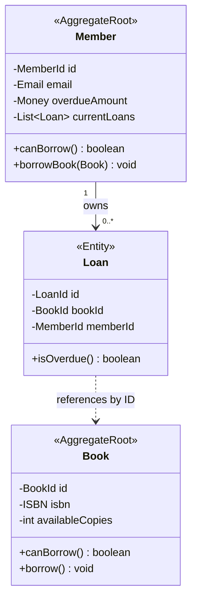
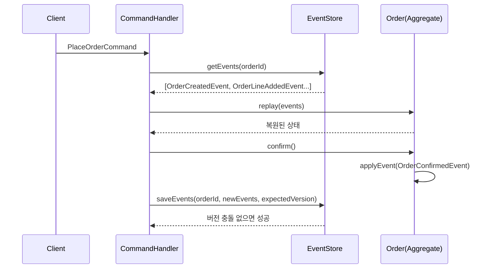

이 실습에서는 도서관 도메인 모델링과 전자상거래 주문 처리를 통해 DDD 패턴을 직접 구현합니다.

## 실습 목표

1. 도서관 도메인 모델링으로 DDD 기본 개념 학습
2. 전자상거래 주문 처리를 통한 Event Sourcing 구현
3. Repository, Aggregate, Domain Service 패턴 실습

## 과제 1: 도서관 도메인 모델링

도서관 대출 시스템은 "회원이 동시에 몇 권까지 빌릴 수 있는가", "연체료가 있으면 대출을 막아야 하는가" 같은 규칙이 여러 화면(대출, 반납, 연체 조회)에서 반복 참조됩니다. 이 규칙을 Service나 Controller에 흩어두면 규칙이 바뀔 때마다 여러 곳을 고쳐야 하고, 일부 경로에서는 검증이 누락되기 쉽습니다. Aggregate Root는 이런 불변식(invariant)을 하나의 경계 안에 가두어, 외부에서는 Aggregate Root를 통해서만 상태를 변경하도록 강제하는 설계 도구입니다. `Member`가 Aggregate Root가 되는 이유는 "연체료가 있으면 대출 불가"라는 규칙이 Member의 상태(연체료, 현재 대출 목록)에 의존하기 때문이며, `Book`은 복본 수 증감이라는 자기 완결적 규칙만 가지므로 별도의 작은 Aggregate로 둘 수 있습니다.

### 요구사항
- 회원은 도서를 대출하고 반납할 수 있다
- 도서마다 대출 가능한 복본 수가 있다
- 회원은 연체료가 있으면 새로운 대출을 할 수 없다
- 인기 도서는 예약이 가능하다

### Aggregate 경계

아래 다이어그램은 `Member`와 `Book`이 각각 별도의 Aggregate Root이고, `Loan`이 두 Aggregate를 ID로만 참조하는 관계를 보여줍니다. Aggregate 간에는 객체 참조가 아니라 ID 참조를 사용해 트랜잭션 경계를 명확히 분리합니다.



### 기본 구조
```java
// Entity Base Class
public abstract class Entity<ID> {
    protected ID id;
    
    protected Entity(ID id) {
        this.id = Objects.requireNonNull(id);
    }
    
    @Override
    public boolean equals(Object obj) {
        if (this == obj) return true;
        if (obj == null || getClass() != obj.getClass()) return false;
        Entity<?> entity = (Entity<?>) obj;
        return Objects.equals(id, entity.id);
    }
}

// Aggregate Root Base Class
// Entity와 달리 Repository가 직접 저장/조회할 수 있는 트랜잭션 경계의 진입점입니다.
public abstract class AggregateRoot<ID> extends Entity<ID> {
    private final List<DomainEvent> domainEvents = new ArrayList<>();

    protected AggregateRoot(ID id) {
        super(id);
    }

    protected void registerEvent(DomainEvent event) {
        domainEvents.add(event);
    }

    public List<DomainEvent> pullDomainEvents() {
        List<DomainEvent> events = new ArrayList<>(domainEvents);
        domainEvents.clear();
        return events;
    }
}

// Value Object 예시
public class ISBN {
    private final String value;
    
    public ISBN(String value) {
        if (!isValidISBN(value)) {
            throw new IllegalArgumentException("Invalid ISBN: " + value);
        }
        this.value = value;
    }
    
    private boolean isValidISBN(String isbn) {
        // TODO: ISBN 유효성 검사 구현
        return isbn != null && isbn.length() >= 10;
    }
}

// Money Value Object 최소 스텁
// 통화 오류를 컴파일 타임에 막고, 금액 연산(가산/비교)을 캡슐화합니다.
public final class Money {
    private final BigDecimal amount;

    public Money(BigDecimal amount) {
        this.amount = Objects.requireNonNull(amount);
    }

    public static Money zero() {
        return new Money(BigDecimal.ZERO);
    }

    public Money add(Money other) {
        return new Money(this.amount.add(other.amount));
    }

    public boolean isGreaterThan(Money other) {
        return this.amount.compareTo(other.amount) > 0;
    }

    public boolean isZero() {
        return amount.compareTo(BigDecimal.ZERO) == 0;
    }
}

// Email Value Object 최소 스텁
public final class Email {
    private final String value;

    public Email(String value) {
        if (value == null || !value.matches("^[^@\\s]+@[^@\\s]+\\.[^@\\s]+$")) {
            throw new IllegalArgumentException("Invalid email: " + value);
        }
        this.value = value;
    }

    @Override
    public String toString() {
        return value;
    }
}
```

### 구현 과제

`Book`과 `Loan`의 핵심 메서드는 완성된 상태로 제공합니다. 나머지 TODO(`Member.borrowBook`, `calculateOverdueFee` 등)는 아래 구현을 참고해 동일한 패턴으로 직접 채워보세요.

```java
public static final int MAX_LOANS_PER_MEMBER = 5;
private static final int LOAN_PERIOD_DAYS = 14;

// 1. Book Entity
public class Book extends Entity<BookId> {
    private ISBN isbn;
    private String title;
    private String author;
    private int availableCopies;
    private int totalCopies;

    // 비즈니스 메서드: 대출 가능한 복본이 1권 이상 남아 있는지 확인
    public boolean canBorrow() {
        return availableCopies > 0;
    }

    // 대출 처리: 가능 여부를 재검증한 뒤 복본 수를 차감 (실패 시 예외로 불변식 보호)
    public void borrow() {
        if (!canBorrow()) {
            throw new IllegalStateException("No available copies for book: " + isbn);
        }
        this.availableCopies--;
    }

    // 반납 처리: 총 보유 권수를 넘지 않도록 검증 후 복본 수를 복원
    public void returnBook() {
        if (this.availableCopies >= this.totalCopies) {
            throw new IllegalStateException("All copies already returned for book: " + isbn);
        }
        this.availableCopies++;
    }
}

// 2. Member Aggregate Root
public class Member extends AggregateRoot<MemberId> {
    private String name;
    private Email email;
    private Money overdueAmount;
    private List<Loan> currentLoans;

    // 비즈니스 규칙: 연체료가 없고, 동시 대출 한도(MAX_LOANS_PER_MEMBER) 이내인 경우에만 대출 가능
    public boolean canBorrow() {
        return overdueAmount.isZero() && currentLoans.size() < MAX_LOANS_PER_MEMBER;
    }

    public void borrowBook(Book book) {
        // TODO: 아래 3단계를 canBorrow()/Book.borrow()를 조합해 구현하세요
        // 1. canBorrow()로 대출 가능 여부 확인 (실패 시 IllegalStateException)
        // 2. book.borrow() 호출 후 Loan 엔티티 생성해 currentLoans에 추가
        // 3. registerEvent(new BookBorrowedEvent(this.id, book.getId()))로 도메인 이벤트 발행
    }
}

// 3. Loan Entity
public class Loan extends Entity<LoanId> {
    private BookId bookId;
    private MemberId memberId;
    private LocalDate borrowDate;
    private LocalDate dueDate;
    private LocalDate returnDate;
    private LoanStatus status;

    // 연체 여부: 아직 반납하지 않았고 오늘이 반납 기한을 지났으면 연체
    public boolean isOverdue() {
        return returnDate == null && LocalDate.now().isAfter(dueDate);
    }

    public Money calculateOverdueFee() {
        // TODO: isOverdue()가 true일 때 (연체 일수 * 일일 연체료)를 Money로 반환하세요
        return Money.zero();
    }
}
```

### Repository 인터페이스
```java
public interface BookRepository extends Repository<Book, BookId> {
    List<Book> findByTitle(String title);
    List<Book> findByAuthor(String author);
    List<Book> findAvailableBooks();
}

public interface MemberRepository extends Repository<Member, MemberId> {
    Optional<Member> findByEmail(Email email);
    List<Member> findMembersWithOverdueLoans();
}
```

## 과제 2: 전자상거래 주문 처리

주문은 "생성 → 상품 추가 → 확정 → 취소/배송"처럼 상태가 여러 단계를 거치며, 각 단계에서 "왜 그 상태가 되었는가"를 감사(audit)하거나 재현해야 할 때가 많습니다. 현재 상태(스냅샷)만 저장하면 "언제 얼마에 확정되었는지", "취소 사유가 무엇인지" 같은 이력이 사라집니다. Event Sourcing은 상태 자체가 아니라 상태를 변화시킨 이벤트(`OrderCreatedEvent`, `OrderConfirmedEvent` 등)를 순서대로 저장하고, 현재 상태는 이벤트를 처음부터 재생(replay)해 계산하는 방식으로 이 문제를 해결합니다. 그 대가로 이벤트 스토어 설계와 버전 충돌 제어라는 새로운 복잡도가 추가됩니다.

### Event Sourcing 구현
```java
// Domain Event Base
public abstract class DomainEvent {
    private final String eventId;
    private final Instant occurredOn;
    
    protected DomainEvent() {
        this.eventId = UUID.randomUUID().toString();
        this.occurredOn = Instant.now();
    }
}

// Order Events
public class OrderCreatedEvent extends DomainEvent {
    private final OrderId orderId;
    private final CustomerId customerId;
    private final Money totalAmount;

    // final 필드 3개는 생성자에서 반드시 초기화해야 컴파일된다.
    // getter는 이 최소 생성자를 참고해 필요한 만큼 추가로 구현하세요.
    public OrderCreatedEvent(OrderId orderId, CustomerId customerId, Money totalAmount) {
        this.orderId = orderId;
        this.customerId = customerId;
        this.totalAmount = totalAmount;
    }

    // TODO: getter 구현
}

public class OrderConfirmedEvent extends DomainEvent {
    // TODO: 구현
}

public class OrderCancelledEvent extends DomainEvent {
    // TODO: 구현
}
```

### Event Sourced Aggregate
```java
public class Order extends EventSourcedAggregateRoot<OrderId> {
    private CustomerId customerId;
    private List<OrderLine> orderLines;
    private OrderStatus status;
    private Money totalAmount;
    
    // Factory Method
    public static Order create(CustomerId customerId, ShippingAddress address) {
        Order order = new Order();
        // 생성 시점에는 주문 항목이 없으므로 totalAmount는 0으로 시작하고,
        // addOrderLine()이 호출될 때마다 누적되도록 설계한다(누적 로직은 TODO).
        order.applyEvent(new OrderCreatedEvent(OrderId.generate(), customerId, Money.zero()));
        return order;
    }
    
    public void addOrderLine(ProductId productId, int quantity, Money unitPrice) {
        // TODO: 비즈니스 규칙 검증
        if (status != OrderStatus.DRAFT) {
            throw new IllegalStateException("Cannot modify confirmed order");
        }
        
        applyEvent(new OrderLineAddedEvent(this.id, productId, quantity, unitPrice));
    }
    
    public void confirm() {
        // TODO: 주문 확정 로직
        applyEvent(new OrderConfirmedEvent(this.id, this.totalAmount));
    }
    
    // Event Handler
    @Override
    protected void handleEvent(DomainEvent event) {
        if (event instanceof OrderCreatedEvent) {
            handle((OrderCreatedEvent) event);
        } else if (event instanceof OrderLineAddedEvent) {
            handle((OrderLineAddedEvent) event);
        } else if (event instanceof OrderConfirmedEvent) {
            handle((OrderConfirmedEvent) event);
        }
    }
    
    private void handle(OrderCreatedEvent event) {
        this.id = event.getOrderId();
        this.customerId = event.getCustomerId();
        this.status = OrderStatus.DRAFT;
        this.orderLines = new ArrayList<>();
    }
    
    // TODO: 다른 이벤트 핸들러들 구현
}
```

### Event Store

이벤트를 재생해 Aggregate를 복원하는 흐름은 다음과 같습니다. Command가 들어오면 저장된 이벤트를 모두 읽어 Aggregate 상태를 재구성한 뒤, 새 이벤트를 검증·저장합니다.



```java
public interface EventStore {
    void saveEvents(String aggregateId, List<DomainEvent> events, int expectedVersion);
    List<DomainEvent> getEvents(String aggregateId);
    List<DomainEvent> getEvents(String aggregateId, int fromVersion);
}

// 동시성 제어를 위한 버전 충돌 예외
public class ConcurrencyConflictException extends RuntimeException {
    public ConcurrencyConflictException(String aggregateId, int expected, int actual) {
        super(String.format("Version conflict for %s: expected=%d, actual=%d",
            aggregateId, expected, actual));
    }
}

public class InMemoryEventStore implements EventStore {
    private final Map<String, List<DomainEvent>> eventStreams = new ConcurrentHashMap<>();

    // 1. 버전 충돌 검사: expectedVersion이 현재 저장된 이벤트 수와 다르면
    //    다른 트랜잭션이 먼저 저장했다는 뜻이므로 예외를 던진다 (Optimistic Concurrency Control).
    // 2~3. synchronized 블록으로 스트림 단위 동시성을 제어하고, 이벤트를 순서대로 append한다.
    @Override
    public void saveEvents(String aggregateId, List<DomainEvent> events, int expectedVersion) {
        synchronized (this) {
            List<DomainEvent> stream = eventStreams.computeIfAbsent(aggregateId, k -> new ArrayList<>());
            if (stream.size() != expectedVersion) {
                throw new ConcurrencyConflictException(aggregateId, expectedVersion, stream.size());
            }
            stream.addAll(events);
        }
    }

    @Override
    public List<DomainEvent> getEvents(String aggregateId) {
        return new ArrayList<>(eventStreams.getOrDefault(aggregateId, new ArrayList<>()));
    }

    @Override
    public List<DomainEvent> getEvents(String aggregateId, int fromVersion) {
        List<DomainEvent> all = getEvents(aggregateId);
        return fromVersion >= all.size() ? new ArrayList<>() : all.subList(fromVersion, all.size());
    }
}
```

## 과제 3: CQRS 패턴 구현

주문 상세 화면은 고객명·상품명처럼 여러 Aggregate에 걸친 데이터를 한 번에 보여줘야 하지만, `Order` Aggregate 하나만 조회해서는 이 화면을 채울 수 없습니다. 반대로 Aggregate는 쓰기 시점의 불변식 검증에 최적화되어 있어 조회 성능이나 편의성과는 목적이 다릅니다. CQRS(Command Query Responsibility Segregation)는 쓰기 모델(Command, Aggregate 중심)과 읽기 모델(Query, 화면에 맞춘 비정규화된 Read Model)을 분리해, 각각을 그 목적에 맞게 독립적으로 최적화하는 패턴입니다.

### Command Side
```java
// Commands
public class PlaceOrderCommand {
    private final CustomerId customerId;
    private final ShippingAddress shippingAddress;
    private final List<OrderItemRequest> items;
    
    // TODO: 생성자, getter 구현
}

// Command Handler
@Service
public class OrderCommandHandler {
    private final OrderRepository orderRepository;
    private final CustomerRepository customerRepository;
    
    @Transactional
    public OrderId handle(PlaceOrderCommand command) {
        // TODO: 주문 생성 로직 구현
        // 1. 고객 조회 및 검증
        // 2. 주문 생성
        // 3. 주문 항목 추가
        // 4. 주문 저장
        return null;
    }
}
```

### Query Side
```java
// Read Models
public class OrderSummary {
    private final String orderId;
    private final String customerName;
    private final BigDecimal totalAmount;
    private final String status;
    private final LocalDateTime orderDate;
    
    // TODO: 생성자, getter 구현
}

// Query Service
public interface OrderQueryService {
    OrderSummary getOrderSummary(OrderId orderId);
    List<OrderListItem> getOrdersByCustomer(CustomerId customerId);
    List<OrderListItem> getOrdersByDateRange(LocalDate from, LocalDate to);
}
```

## 완성도 체크리스트

- [ ] **Entity와 Value Object를 구분했는가** — ID로 동일성을 판단해야 하면 Entity(`Book`, `Loan`), 값 자체가 같으면 동일해야 하면 Value Object(`Money`, `Email`, `ISBN`)로 설계했는지 확인합니다.
- [ ] **Aggregate Root가 불변식을 스스로 지키는가** — `Member.canBorrow()`처럼 외부 코드가 아니라 Aggregate 내부 메서드가 규칙을 검증하는지 확인합니다. 외부에서 필드를 직접 바꿀 수 있다면 경계가 깨진 것입니다.
- [ ] **Repository가 Aggregate 단위로만 존재하는가** — `BookRepository`, `MemberRepository`처럼 Aggregate Root마다 하나씩 있어야 하며, `Loan`처럼 Aggregate 내부 Entity를 위한 별도 Repository는 없어야 합니다.
- [ ] **Event Store가 버전 충돌을 검사하는가** — `saveEvents`의 `expectedVersion` 검사가 실제로 동작하는지, 동시 저장 시 `ConcurrencyConflictException`이 발생하는지 테스트로 확인합니다.
- [ ] **Aggregate 상태가 이벤트만으로 복원되는가** — `handleEvent`가 모든 이벤트 타입을 처리하며, DB 스냅샷 없이 이벤트 재생만으로 동일한 상태에 도달하는지 확인합니다.
- [ ] **Command와 Query가 서로 다른 모델을 쓰는가** — `OrderCommandHandler`는 `Order` Aggregate를, `OrderQueryService`는 `OrderSummary` Read Model을 사용해 목적에 맞게 분리되어 있는지 확인합니다.

## 평가 기준

이 실습을 완료했다면 다음을 스스로 설명할 수 있어야 합니다.

- Aggregate와 Entity의 경계를 설명할 수 있다 — 왜 `Loan`은 `Member`에 속한 Entity이고, `Book`은 별도의 Aggregate Root인지 근거를 들어 말할 수 있다.
- Event Sourcing이 상태 스냅샷 저장 방식과 비교해 어떤 문제(감사 이력, 재현 가능성)를 해결하는지 설명할 수 있다.
- CQRS에서 쓰기 모델과 읽기 모델을 분리하는 기준(정규화 vs 비정규화, 트랜잭션 일관성 vs 조회 성능)을 설명할 수 있다.
- Event Store의 `expectedVersion` 검사가 왜 필요한지, 이것이 없을 때 어떤 동시성 버그가 발생하는지 설명할 수 있다.

## 판단 기준: DDD·Event Sourcing·CQRS를 언제 피해야 하는가

이 실습에서 다룬 패턴들은 복잡한 도메인의 문제를 해결하지만, 공짜가 아니다. 다음 상황에서는 오히려 피하는 것이 낫다.

- **도메인 규칙이 단순한 CRUD 수준일 때**: `Book`의 복본 수 증감처럼 규칙이 한두 줄로 끝난다면, `Entity`·`AggregateRoot`·`Repository` 계층을 모두 갖추는 비용이 그 복잡도를 초과한다. 이런 경우 서비스 계층에서 직접 DB 접근 코드를 짜는 편이 더 빠르고 이해하기 쉽다.
- **이력·감사 요구사항이 없을 때**: Event Sourcing의 유일한 근본적 이점은 "모든 변경 이력을 완전하게 보존한다"는 것이다. "지금 이 순간의 상태"만 중요하고 과거를 재현할 필요가 없다면, 이벤트 재생 비용과 버전 충돌 처리(`ConcurrencyConflictException`)라는 복잡도만 떠안는 셈이다.
- **읽기·쓰기 비율이 균형적이고 조회가 단순할 때**: CQRS는 "읽기 모델과 쓰기 모델을 독립적으로 최적화"하는 대가로 두 모델을 동기화하는 프로젝션 로직을 추가로 유지해야 한다. `OrderSummary` 같은 별도 Read Model이 필요 없을 만큼 조회가 단순하다면, Aggregate를 직접 조회하는 것으로 충분하다.
- **팀이 이 패턴들에 익숙하지 않고 일정이 촉박할 때**: Aggregate 경계 설정, 이벤트 스키마 설계, 최종 일관성에 대한 이해는 학습 곡선이 가파르다. 익숙하지 않은 팀이 촉박한 일정에서 도입하면, 패턴이 주는 이점보다 잘못된 Aggregate 경계나 누락된 버전 검사로 인한 버그 비용이 더 커지기 쉽다.

## 추가 도전 과제

1. **Domain Event Publisher 구현**
   - 이벤트 발행/구독 메커니즘
   - 트랜잭션 경계 내 이벤트 처리

2. **Saga Pattern 구현**
   - 분산 트랜잭션 관리
   - 보상 트랜잭션 구현

3. **Specification Pattern**
   - 복잡한 비즈니스 규칙 조합
   - 동적 쿼리 생성

4. **Anti-Corruption Layer**
   - 레거시 시스템과의 통합
   - 도메인 모델 보호

## 실무 적용 팁

### Bounded Context 설계

지금까지 다룬 `Order`, `Book`, `Member` Aggregate는 모두 하나의 모델 안에 있다고 가정했지만, 실제 조직에서는 "주문"과 "재고"처럼 서로 다른 팀이 서로 다른 의미로 같은 단어(예: "상품")를 사용하는 경우가 흔하다. Bounded Context는 이런 의미 충돌을 막기 위해 하나의 Ubiquitous Language가 유효한 범위를 명시적으로 구분하는 경계다. 아래 예시처럼 `@BoundedContext` 애너테이션(실제로는 패키지 구조나 별도 모듈로 구현하는 경우가 많다)으로 "이 클래스는 어느 컨텍스트에 속하는가"를 명시하면, 컨텍스트를 넘나드는 무분별한 참조를 코드 리뷰 단계에서부터 걸러낼 수 있다.

```java
// 주문 컨텍스트
@BoundedContext("Order")
public class OrderContext {
    // 주문 관련 도메인 모델들
}

// 재고 컨텍스트
@BoundedContext("Inventory") 
public class InventoryContext {
    // 재고 관련 도메인 모델들
}
```

### Context Mapping

Bounded Context를 나누고 나면, 그 경계를 넘어 협력해야 하는 지점(주문이 확정되면 재고를 차감해야 하는 등)이 반드시 생긴다. 이때 한 컨텍스트의 도메인 모델(`OrderCreatedEvent`)을 다른 컨텍스트가 직접 참조하게 하면 두 컨텍스트가 강하게 결합되어, 한쪽 모델이 바뀔 때마다 다른 쪽도 함께 깨진다. Anti-Corruption Layer는 이 결합을 끊는 번역 계층으로, 한 컨텍스트의 이벤트·모델을 받아 다른 컨텍스트가 이해하는 형태(`InventoryReservationRequest`)로 변환한 뒤에만 전달한다.

```java
// 컨텍스트 간 통합
public class OrderInventoryIntegration {
    // Anti-Corruption Layer
    public void reserveInventory(OrderCreatedEvent event) {
        // 주문 도메인 모델을 재고 도메인 모델로 변환
        InventoryReservationRequest request = mapToInventoryRequest(event);
        inventoryService.reserveItems(request);
    }
}
```

---

**실무 팁**: 도메인 전문가와 대화하며 Ubiquitous Language를 구축하고, 작은 Bounded Context부터 시작해 점진적으로 확장합니다. Event Storming 기법으로 도메인 이벤트를 먼저 발견한 뒤 코드를 작성하면 Aggregate 경계를 잘못 긋는 실수를 줄일 수 있습니다. 