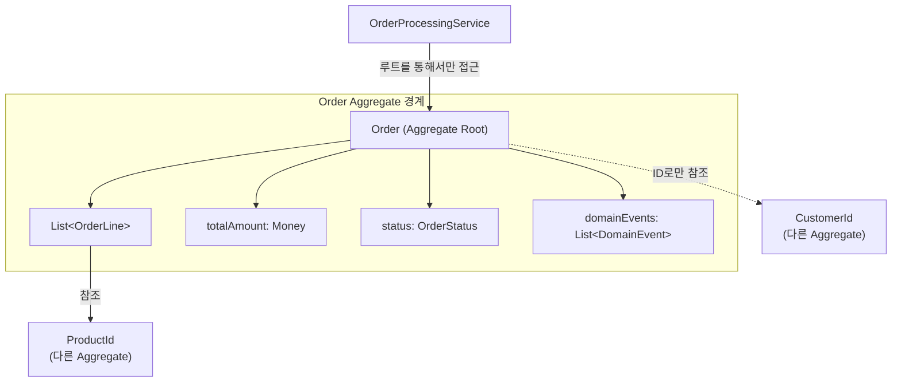
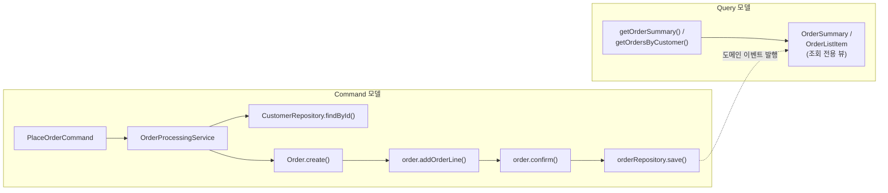

Domain-Driven Design과 디자인 패턴의 융합을 탐구합니다. Aggregate, Repository, Domain Event 등 DDD 전술 패턴을 통한 비즈니스 도메인 모델링을 학습합니다.

## 서론: 도메인이 주도하는 설계

> *"좋은 소프트웨어의 핵심은 도메인을 잘 이해하고 표현하는 것이다. DDD는 이를 위한 철학이고, 디자인 패턴은 이를 구현하는 도구다."*

**Domain-Driven Design(DDD)**는 복잡한 비즈니스 도메인을 소프트웨어로 효과적으로 모델링하기 위한 접근법입니다. 전통적인 GoF 패턴들이 DDD 환경에서 어떻게 진화하고 활용되는지 살펴보겠습니다.

### DDD의 핵심 철학과 패턴의 융합
- **Ubiquitous Language**: 도메인 전문가와 개발자 간의 공통 언어
- **Bounded Context**: 모델의 경계와 Context Map
- **Domain Model**: 비즈니스 규칙과 로직의 중심화
- **Anti-Corruption Layer**: 레거시 시스템과의 통합

## DDD Building Blocks와 디자인 패턴

이 글의 모든 예제는 아래 임포트를 전제로 합니다.

```java
import java.util.*;
import java.math.BigDecimal;
import java.util.Currency;
import org.springframework.stereotype.Repository;
import org.springframework.stereotype.Service;
import org.springframework.transaction.annotation.Transactional;
```

또한 예제는 DDD 개념을 보여주는 데 집중하기 위해 `OrderId`, `CustomerId`, `ProductId`, `Money`, `ShippingAddress`, `OrderLine`, `OrderStatus`, `BusinessRule`과 그 구현체(`OrderCanBeModifiedRule` 등), `DomainEvent`와 그 하위 이벤트, `DomainEventPublisher`, `OrderMapper`, `OrderEntity`, `Customer`, `CustomerRepository` 같은 도메인 타입의 전체 구현은 생략했다. 실제 프로젝트에서는 이 타입들을 각각 명시적으로 정의해야 하며, 여기서는 Entity·Value Object·Aggregate·Repository가 서로 어떻게 협력하는지의 구조에 집중한다.

### Entity 패턴과 Identity 관리

```java
// Entity의 핵심 - Identity와 생명주기 관리
public abstract class Entity<ID> {
    protected ID id;
    
    protected Entity(ID id) {
        this.id = Objects.requireNonNull(id, "Entity ID cannot be null");
    }
    
    public ID getId() {
        return id;
    }
    
    // Identity-based equality
    @Override
    public boolean equals(Object obj) {
        if (this == obj) return true;
        if (obj == null || getClass() != obj.getClass()) return false;
        
        Entity<?> entity = (Entity<?>) obj;
        return Objects.equals(id, entity.id);
    }
    
    @Override
    public int hashCode() {
        return Objects.hash(id);
    }
    
    // Template Method 패턴으로 비즈니스 규칙 검사
    protected final void checkBusinessRules(BusinessRule... rules) {
        for (BusinessRule rule : rules) {
            if (!rule.isSatisfied()) {
                throw new BusinessRuleViolationException(rule.getMessage());
            }
        }
    }
}

// Value Object 패턴 구현
public class Money {
    private final BigDecimal amount;
    private final Currency currency;
    
    public Money(BigDecimal amount, Currency currency) {
        this.amount = Objects.requireNonNull(amount);
        this.currency = Objects.requireNonNull(currency);
    }
    
    public Money add(Money other) {
        ensureSameCurrency(other);
        return new Money(this.amount.add(other.amount), this.currency);
    }
    
    private void ensureSameCurrency(Money other) {
        if (!this.currency.equals(other.currency)) {
            throw new IllegalArgumentException("Cannot operate on different currencies");
        }
    }
    
    @Override
    public boolean equals(Object obj) {
        if (this == obj) return true;
        if (obj == null || getClass() != obj.getClass()) return false;
        
        Money money = (Money) obj;
        return Objects.equals(amount, money.amount) && 
               Objects.equals(currency, money.currency);
    }
    
    @Override
    public int hashCode() {
        return Objects.hash(amount, currency);
    }
}
```

### Aggregate Root 패턴

앞서 본 `Entity`와 `Money`(Value Object)는 그 자체로는 일관성 경계를 갖지 않는다. `Order`가 `OrderLine`들을 담고 있을 때 "주문 총액이 각 라인의 합과 일치해야 한다"처럼 여러 객체에 걸친 불변식을 누가 지킬 것인가라는 문제가 남는다. Aggregate Root는 이 문제에 대한 답이다 — 하나의 Aggregate 안에서는 오직 루트(`Order`)만 외부에 공개되고, 내부 구성 요소(`OrderLine`)는 루트를 거치지 않고서는 변경할 수 없도록 강제한다. `AggregateRoot`가 `Entity`를 상속하는 것도 이 때문이다: Aggregate Root 자신도 식별자를 가진 Entity이며, 여기에 "내부 상태 변경 시 도메인 이벤트를 기록한다"는 책임이 추가된 것뿐이다.

```java
// Aggregate Root - 복합체 패턴과 도메인 이벤트 결합
public abstract class AggregateRoot<ID> extends Entity<ID> {
    private final List<DomainEvent> domainEvents = new ArrayList<>();
    
    protected AggregateRoot(ID id) {
        super(id);
    }
    
    protected void addDomainEvent(DomainEvent event) {
        domainEvents.add(event);
    }
    
    public List<DomainEvent> getDomainEvents() {
        return Collections.unmodifiableList(domainEvents);
    }
    
    public void clearDomainEvents() {
        domainEvents.clear();
    }
}

// Order Aggregate 예시
public class Order extends AggregateRoot<OrderId> {
    private CustomerId customerId;
    private List<OrderLine> orderLines;
    private OrderStatus status;
    private Money totalAmount;
    
    // Factory Method 패턴
    public static Order create(CustomerId customerId, ShippingAddress address) {
        OrderId orderId = OrderId.generate();
        Order order = new Order(orderId, customerId);
        
        order.addDomainEvent(new OrderCreatedEvent(orderId, customerId));
        return order;
    }
    
    private Order(OrderId id, CustomerId customerId) {
        super(id);
        this.customerId = Objects.requireNonNull(customerId);
        this.orderLines = new ArrayList<>();
        this.status = OrderStatus.DRAFT;
    }
    
    public void addOrderLine(ProductId productId, int quantity, Money unitPrice) {
        checkBusinessRules(
            new OrderCanBeModifiedRule(this.status),
            new QuantityMustBePositiveRule(quantity)
        );
        
        OrderLine orderLine = new OrderLine(productId, quantity, unitPrice);
        orderLines.add(orderLine);
        
        addDomainEvent(new OrderLineAddedEvent(this.getId(), productId, quantity));
    }
    
    public void confirm() {
        checkBusinessRules(
            new OrderMustHaveItemsRule(this.orderLines),
            new OrderCanBeConfirmedRule(this.status)
        );
        
        this.status = OrderStatus.CONFIRMED;
        addDomainEvent(new OrderConfirmedEvent(this.getId(), this.totalAmount));
    }
}
```

`Order` Aggregate의 경계를 그림으로 보면 "무엇이 안에 있고 무엇이 밖에 있는지"가 분명해진다. `OrderLine`과 `Money`는 `Order` 내부에 완전히 소속되어 `Order`를 거치지 않고는 접근할 수 없지만, `CustomerId`는 다른 Aggregate(`Customer`)를 가리키는 참조일 뿐 `Order`가 `Customer` 전체를 포함하지는 않는다. 외부(`OrderProcessingService` 등)는 오직 `Order`(루트)를 통해서만 이 경계 안으로 들어올 수 있다.



Aggregate가 이렇게 자신의 경계를 스스로 지키더라도, 그 상태를 어딘가에 저장하고 다시 불러오는 책임은 Aggregate 자신의 몫이 아니다. 이 저장·조회 책임을 분리하는 것이 다음에 볼 Repository 패턴이다.

## Repository 패턴과 데이터 접근

```java
// Repository의 도메인 중심 설계
public interface Repository<T extends AggregateRoot<ID>, ID> {
    void save(T aggregate);
    void delete(T aggregate);
    Optional<T> findById(ID id);
    boolean exists(ID id);
}

// 구체적인 Repository 인터페이스
public interface OrderRepository extends Repository<Order, OrderId> {
    List<Order> findByCustomerId(CustomerId customerId);
    List<Order> findByStatus(OrderStatus status);
    List<Order> findBySpecification(OrderSpecification specification);
}

// Repository 구현체 - Adapter 패턴
@Repository
public class JpaOrderRepository implements OrderRepository {
    private final JpaOrderDataRepository jpaRepository;
    private final OrderMapper orderMapper;
    
    @Override
    public void save(Order order) {
        OrderEntity entity = orderMapper.toEntity(order);
        jpaRepository.save(entity);
        
        // 도메인 이벤트 발행
        publishDomainEvents(order);
    }
    
    @Override
    public Optional<Order> findById(OrderId id) {
        return jpaRepository.findById(id.getValue())
                           .map(orderMapper::toDomain);
    }
    
    private void publishDomainEvents(Order order) {
        order.getDomainEvents().forEach(event -> {
            DomainEventPublisher.instance().publish(event);
        });
        order.clearDomainEvents();
    }
}
```

`JpaOrderRepository`는 `Order` Aggregate를 저장할 뿐 아니라, 저장이 끝난 뒤 그 Aggregate가 쌓아둔 도메인 이벤트(`getDomainEvents()`)를 발행하고 비운다. 이 지점이 지금까지 다룬 Entity·Aggregate·Repository 세 빌딩 블록이 CQRS·Event Sourcing으로 이어지는 연결고리다 — Repository가 저장 시점에 발행하는 이벤트를, 다음 절의 Query 모델이 구독해 자신만의 조회 전용 뷰를 만들거나, Event Store가 아예 상태 대신 이벤트 자체를 영속화 대상으로 삼을 수 있다.

## CQRS와 Event Sourcing 패턴

### Command Query Responsibility Segregation

```java
// Command 측면
public interface OrderCommandService {
    OrderId placeOrder(PlaceOrderCommand command);
    void cancelOrder(CancelOrderCommand command);
}

// Query 측면  
public interface OrderQueryService {
    OrderSummary getOrderSummary(OrderId orderId);
    List<OrderListItem> getOrdersByCustomer(CustomerId customerId);
}

// Domain Service - 여러 Aggregate를 조정
@Service
public class OrderProcessingService {
    private final OrderRepository orderRepository;
    private final CustomerRepository customerRepository;
    
    @Transactional
    public OrderId processOrder(PlaceOrderCommand command) {
        // 1. 고객 조회 및 검증
        Customer customer = customerRepository.findById(command.getCustomerId())
            .orElseThrow(() -> new CustomerNotFoundException(command.getCustomerId()));
        
        // 2. 주문 생성
        Order order = Order.create(command.getCustomerId(), command.getShippingAddress());
        
        // 3. 주문 항목 추가
        for (OrderItemRequest item : command.getItems()) {
            order.addOrderLine(item.getProductId(), item.getQuantity(), item.getUnitPrice());
        }
        
        // 4. 주문 확정
        order.confirm();
        
        // 5. 저장
        orderRepository.save(order);
        
        return order.getId();
    }
}
```

`OrderCommandService`와 `OrderQueryService`는 같은 `Order` 데이터를 다루지만 서로 다른 모델로 접근한다. Command 측은 `Order` Aggregate 전체를 로드해 비즈니스 규칙을 검증하며 쓰기를 수행하고, Query 측은 Aggregate를 거치지 않고 조회에 최적화된 별도 모델(`OrderSummary`, `OrderListItem`)을 직접 읽는다. 두 모델의 구조적 분리가 CQRS의 핵심이다.



### Event Sourcing 패턴

```java
// Event Store 패턴
public interface EventStore {
    void saveEvents(String aggregateId, List<DomainEvent> events, int expectedVersion);
    List<DomainEvent> getEvents(String aggregateId);
}

// Event Sourcing을 지원하는 Aggregate Root
public abstract class EventSourcedAggregateRoot<ID> {
    private ID id;
    private int version = 0;
    private final List<DomainEvent> uncommittedEvents = new ArrayList<>();
    
    // Event를 적용하여 상태 복원
    public void loadFromHistory(List<DomainEvent> events) {
        for (DomainEvent event : events) {
            applyEvent(event, false);
            version++;
        }
    }
    
    // 새로운 Event 적용
    protected void applyEvent(DomainEvent event) {
        applyEvent(event, true);
    }
    
    private void applyEvent(DomainEvent event, boolean isNew) {
        // Event Handler 메서드 호출 로직
        handleEvent(event);
        
        if (isNew) {
            uncommittedEvents.add(event);
        }
    }
    
    protected abstract void handleEvent(DomainEvent event);
    
    public List<DomainEvent> getUncommittedEvents() {
        return Collections.unmodifiableList(uncommittedEvents);
    }
    
    public void markEventsAsCommitted() {
        uncommittedEvents.clear();
    }
}
```

Event Sourcing에서는 Aggregate의 "현재 상태"를 직접 저장하지 않고, 상태에 이르게 한 이벤트들만 저장한다. 새 명령이 들어오면 이벤트를 만들어 저장하고(쓰기), Aggregate를 다시 사용해야 할 때는 저장된 이벤트를 처음부터 순서대로 재생해 상태를 복원한다(읽기 위한 재구성). 아래 시퀀스 다이어그램은 `loadFromHistory()`가 이벤트 목록으로부터 Aggregate 상태를 재구성하는 과정과, 새 명령이 새 이벤트를 만들어 `EventStore`에 반영되는 과정을 함께 보여준다.

```mermaid
sequenceDiagram
    participant Client
    participant Store as EventStore
    participant Agg as "order: EventSourcedAggregateRoot"

    Note over Client,Agg: 1. 기존 Aggregate 재구성 (읽기)
    Client->>Store: getEvents(aggregateId)
    Store-->>Client: List&lt;DomainEvent&gt;
    Client->>Agg: loadFromHistory(events)
    loop 각 이벤트마다
        Agg->>Agg: applyEvent(event, isNew=false)
        Agg->>Agg: handleEvent(event)</br>version++
    end

    Note over Client,Agg: 2. 새 명령 처리 (쓰기)
    Client->>Agg: 비즈니스 메서드 호출
    Agg->>Agg: applyEvent(newEvent, isNew=true)
    Agg->>Agg: handleEvent(newEvent)</br>uncommittedEvents.add(newEvent)
    Client->>Agg: getUncommittedEvents()
    Agg-->>Client: List&lt;DomainEvent&gt;
    Client->>Store: saveEvents(aggregateId, events, expectedVersion)
    Client->>Agg: markEventsAsCommitted()
```

## 실습 과제

### 과제 1: 도서관 도메인 모델링
다음 요구사항을 만족하는 도서관 시스템을 DDD로 설계하세요:

1. 회원은 도서를 대출하고 반납할 수 있다
2. 도서마다 대출 가능한 복본 수가 있다
3. 회원은 연체료가 있으면 새로운 대출을 할 수 없다
4. 인기 도서는 예약이 가능하다

### 과제 2: 전자상거래 주문 처리
Event Sourcing을 적용한 주문 처리 시스템을 구현하세요:

1. 주문 생성, 결제, 배송, 완료의 생명주기
2. 주문 취소 및 환불 처리
3. 재고 관리와의 연계
4. 주문 이력 추적 및 감사

## 토론 주제

1. **DDD vs Traditional Layered Architecture**: 언제 DDD를 선택해야 하는가?

2. **Aggregate 크기의 딜레마**: 큰 Aggregate vs 작은 Aggregate의 트레이드오프는?

3. **Event Sourcing의 복잡성**: Event Sourcing이 정말 필요한 상황은 언제인가?

4. **도메인 서비스 vs 애플리케이션 서비스**: 비즈니스 로직을 어디에 배치해야 하는가?

## 한눈에 보는 DDD 전술 패턴

### DDD 전술 패턴 요약표

| 패턴 | 핵심 역할 | 특징 | 적용 기준 |
|------|----------|------|----------|
| Entity | 식별자로 구분되는 객체 | 가변 상태, 생명주기 | ID로 동등성 판단 |
| Value Object | 값으로 구분되는 객체 | 불변, 교체 가능 | 속성으로 동등성 판단 |
| Aggregate | 일관성 경계 | 루트를 통한 접근, 트랜잭션 단위 | 불변식 보장 범위 |
| Repository | 영속성 추상화 | 컬렉션처럼 동작 | Aggregate당 하나 |
| Domain Service | 도메인 로직 수행 | 상태 없음, 도메인 동작 | Entity에 속하지 않는 로직 |
| Domain Event | 도메인 내 발생 사건 | 불변, 과거형 명명 | 상태 변경 알림 |
| Factory | 복잡한 객체 생성 | 생성 로직 캡슐화 | 복잡한 Aggregate 생성 |

### Entity vs Value Object 비교

| 비교 항목 | Entity | Value Object |
|----------|--------|-------------|
| 동등성 기준 | 식별자(ID) | 속성 값 |
| 가변성 | 가변 (상태 변경) | 불변 (새 객체 생성) |
| 생명주기 | 있음 (생성-소멸) | 없음 (교체) |
| 저장 방식 | 독립 테이블 | 임베디드/별도 테이블 |
| 예시 | User, Order, Product | Money, Address, DateRange |

### Aggregate 설계 원칙

| 원칙 | 설명 | 효과 |
|------|------|------|
| 작게 유지 | 필요한 것만 포함 | 동시성, 성능 향상 |
| 루트 통한 접근 | 외부는 루트만 참조 | 일관성 보장 |
| 참조는 ID로 | 다른 Aggregate는 ID 참조 | 결합도 감소 |
| 트랜잭션 경계 | 하나의 트랜잭션에서 하나만 | 확장성 확보 |
| 최종 일관성 | Aggregate 간은 이벤트로 | 분산 환경 적합 |

### Event Sourcing vs 전통적 저장

| 비교 항목 | Event Sourcing | 전통적 저장 |
|----------|---------------|-----------|
| 저장 대상 | 이벤트 (변경 이력) | 현재 상태 |
| 이력 추적 | 완전 (모든 변경) | 별도 구현 필요 |
| 복잡도 | 높음 | 낮음 |
| 성능 | 쓰기 빠름, 읽기 재구성 | 읽기 빠름 |
| 적합 상황 | 감사, 시간 여행 필요 | 일반적인 CRUD |

### CQRS 적용 가이드

| 상황 | CQRS 적합도 | 이유 |
|------|-----------|------|
| 읽기/쓰기 비율 불균형 | ★★★★★ | 독립적 최적화 가능 |
| 복잡한 조회 요구 | ★★★★☆ | 읽기 모델 최적화 |
| 단순 CRUD | ★☆☆☆☆ | 과도한 복잡성 |
| 이벤트 소싱과 함께 | ★★★★★ | 자연스러운 조합 |

### DDD 패턴과 GoF 패턴 연결

| DDD 패턴 | 관련 GoF 패턴 | 연결 방식 |
|---------|-------------|----------|
| Factory | Factory Method, Abstract Factory | 생성 캡슐화 |
| Repository | - (DDD 고유) | 컬렉션 추상화 |
| Domain Service | Strategy | 알고리즘 캡슐화 |
| Domain Event | Observer | 이벤트 발행/구독 |
| Aggregate | Composite | 객체 그룹화 |
| Specification | Strategy | 비즈니스 규칙 캡슐화 |

### 적용 체크리스트

| 체크 항목 | 설명 |
|----------|------|
| 복잡한 비즈니스 도메인인가? | DDD 적합성 판단 |
| 유비쿼터스 언어 정의했는가? | 도메인 전문가와 소통 |
| Bounded Context 식별했는가? | 도메인 경계 설정 |
| Aggregate 경계 적절한가? | 일관성 범위 검토 |
| Event Sourcing 필요한가? | 이력/감사 요구사항 확인 |

## 흔한 오해 바로잡기

DDD 전술 패턴을 처음 적용할 때 자주 빠지는 오해 두 가지를 짚어본다.

첫째, "Aggregate는 클수록 안전하다"는 오해다. Aggregate를 크게 만들면 한 번에 더 많은 불변식을 보장할 수 있어 안전해 보이지만, 실제로는 정반대의 효과가 난다. "Aggregate 설계 원칙" 표에서 보듯 Aggregate는 하나의 트랜잭션 경계이므로, 커질수록 동시에 수정하려는 요청끼리 충돌(낙관적 잠금 실패)이 잦아지고 로드해야 할 데이터도 늘어나 성능이 떨어진다. `Order` Aggregate가 `OrderLine`만 포함하고 `Customer` 전체를 포함하지 않는 이유가 바로 이것이다 — 정말로 함께 원자적으로 변경되어야 하는 최소 단위만 하나의 Aggregate로 묶어야 한다.

둘째, "Repository는 단순 DAO(Data Access Object)다"는 오해다. DAO는 테이블이나 쿼리 중심으로 설계되어 `findByColumnX`, `updateColumnY` 같은 메서드를 노출하는 경우가 많지만, Repository는 도메인 모델(Aggregate) 중심으로 설계되어 "컬렉션처럼 동작"해야 한다. `OrderRepository`가 `save(Order)`와 `findById(OrderId)`만 노출하고 내부 `OrderLine`을 위한 별도 조회 메서드를 두지 않는 것은, DAO처럼 데이터 접근 편의성을 우선하는 것이 아니라 Aggregate 경계(루트를 통해서만 접근)를 Repository 계층에서도 그대로 지키기 위해서다. Repository는 영속성 기술을 도메인 언어로 감싸는 추상화이지, 테이블에 대응하는 CRUD 창구가 아니다.

## 평가 기준

이 글을 읽고 다음을 스스로 설명할 수 있다면 핵심을 이해한 것이다.

- Aggregate를 작게 유지해야 하는 이유를 트랜잭션 경계·동시성 충돌 관점에서 설명할 수 있다.
- Repository가 DAO와 다른 이유를, "컬렉션처럼 동작한다"는 관점과 Aggregate 경계 보호라는 관점에서 설명할 수 있다.
- Entity와 Value Object를 구분하는 기준(식별자 vs 속성 값)을 `Order`(Entity)와 `Money`(Value Object) 예시로 설명할 수 있다.
- CQRS·Event Sourcing을 도입하기 전에 확인해야 할 조건(읽기/쓰기 비율, 감사 요구사항, 팀의 학습 비용)을 말할 수 있다.

---

## 참고 자료

### 핵심 도서
- Eric Evans, "Domain-Driven Design" (2003)
- Vaughn Vernon, "Implementing Domain-Driven Design" (2013)
- Scott Millett, "Patterns, Principles, and Practices of Domain-Driven Design" (2015)

### 현대적 접근법
- Greg Young, "CQRS and Event Sourcing"(강연, Code on the Beach, 2010)
- Udi Dahan, "Advanced Distributed Systems Design"(온라인 강좌·강연 시리즈, 2010년대)
- Martin Fowler, martinfowler.com "CQRS"(2011), "Event Sourcing"(2005)

---

**"도메인의 복잡성을 코드로 표현하는 것이 DDD의 본질이다. 패턴은 그 표현을 위한 언어다."** 