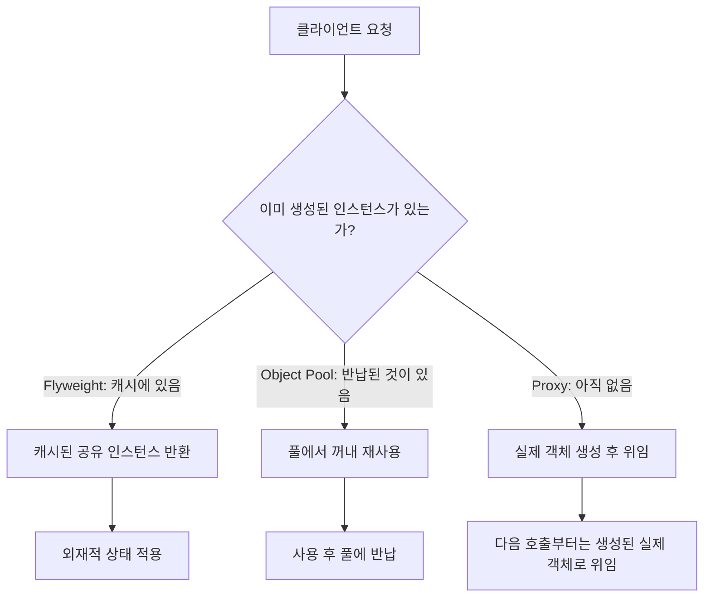

이 실습에서는 성능 벤치마크 작성, 메모리 효율적인 패턴 구현, JIT 최적화 분석을 직접 수행합니다.

## 실습 목표

1. 성능 벤치마크 작성 및 측정
2. 메모리 효율적인 패턴 구현
3. JIT 최적화와 패턴의 상관관계 분석

## 과제 1: 성능 벤치마크 작성

`System.nanoTime()`으로 전후 시간을 재는 방식은 JIT 워밍업 전 상태를 측정하거나, 결과를 사용하지 않는 계산이 컴파일러에 의해 통째로 제거(Dead Code Elimination)되어 실제보다 훨씬 빠른 값이 나오는 함정이 있습니다. JMH(Java Microbenchmark Harness)는 워밍업 반복, 여러 포크(fork) 실행, 결과 강제 사용(blackhole) 등을 자동으로 처리해 이런 함정을 피합니다. 아래 세 벤치마크는 생성 패턴이 직접 생성 대비 어느 정도의 상대적 오버헤드를 갖는지 측정하는 예시입니다.

### Factory Method vs Direct Instantiation
```java
import org.openjdk.jmh.annotations.*;
import java.util.concurrent.TimeUnit;

@BenchmarkMode(Mode.AverageTime)
@OutputTimeUnit(TimeUnit.NANOSECONDS)
@State(Scope.Benchmark)
public class CreationPatternBenchmark {
    
    @Benchmark
    public Object directInstantiation() {
        return new ConcreteProduct();
    }
    
    @Benchmark
    public Object factoryMethod() {
        return ProductFactory.createProduct("concrete");
    }
    
    @Benchmark
    public Object abstractFactory() {
        AbstractFactory factory = new ConcreteFactory();
        return factory.createProduct();
    }
}

// Product 최소 스텁 (벤치마크가 컴파일되려면 반환 타입이 필요합니다)
interface Product {
    String getName();
}

class ConcreteProduct implements Product {
    @Override
    public String getName() {
        return "concrete";
    }
}

// TODO: 다음 팩토리들을 구현하세요
class ProductFactory {
    public static Product createProduct(String type) {
        // TODO: 구현
        return null;
    }
}

abstract class AbstractFactory {
    abstract Product createProduct();
}

class ConcreteFactory extends AbstractFactory {
    @Override
    Product createProduct() {
        // TODO: 구현
        return null;
    }
}
```

### Decorator Chain vs Conditional Logic
```java
import org.openjdk.jmh.annotations.*;
import java.util.concurrent.TimeUnit;

@BenchmarkMode(Mode.AverageTime)
@OutputTimeUnit(TimeUnit.NANOSECONDS) 
public class DecoratorBenchmark {
    
    private String data = "test data";
    
    @Benchmark
    public String conditionalApproach() {
        String result = data;
        if (needsCompression()) {
            result = compress(result);
        }
        if (needsEncryption()) {
            result = encrypt(result);
        }
        if (needsLogging()) {
            log(result);
        }
        return result;
    }
    
    @Benchmark
    public String decoratorPattern() {
        DataProcessor processor = new LoggingDecorator(
            new EncryptionDecorator(
                new CompressionDecorator(
                    new BaseDataProcessor()
                )
            )
        );
        return processor.process(data);
    }
}

// TODO: Decorator 패턴 구현
interface DataProcessor {
    String process(String data);
}

class BaseDataProcessor implements DataProcessor {
    @Override
    public String process(String data) {
        return data;
    }
}

abstract class DataProcessorDecorator implements DataProcessor {
    protected DataProcessor processor;
    
    public DataProcessorDecorator(DataProcessor processor) {
        this.processor = processor;
    }
}

// 최소 구현: 세 Decorator 모두 process()를 오버라이드해야 컴파일됩니다.
class CompressionDecorator extends DataProcessorDecorator {
    public CompressionDecorator(DataProcessor processor) {
        super(processor);
    }

    @Override
    public String process(String data) {
        String upstream = processor.process(data);
        return "[compressed]" + upstream; // TODO: 실제 압축 로직으로 교체
    }
}

class EncryptionDecorator extends DataProcessorDecorator {
    public EncryptionDecorator(DataProcessor processor) {
        super(processor);
    }

    @Override
    public String process(String data) {
        String upstream = processor.process(data);
        return "[encrypted]" + upstream; // TODO: 실제 암호화 로직으로 교체
    }
}

class LoggingDecorator extends DataProcessorDecorator {
    public LoggingDecorator(DataProcessor processor) {
        super(processor);
    }

    @Override
    public String process(String data) {
        String result = processor.process(data);
        System.out.println("[log] processed length=" + result.length());
        return result;
    }
}
```

### Observer vs Direct Call
```java
import org.openjdk.jmh.annotations.*;
import java.util.concurrent.TimeUnit;
import java.util.List;
import java.util.ArrayList;

@BenchmarkMode(Mode.AverageTime)
@OutputTimeUnit(TimeUnit.NANOSECONDS)
public class ObserverBenchmark {
    
    private Subject subject;
    private List<Observer> observers;
    
    @Setup
    public void setup() {
        subject = new ConcreteSubject();
        observers = new ArrayList<>();
        
        for (int i = 0; i < 1000; i++) {
            Observer observer = new ConcreteObserver();
            observers.add(observer);
            subject.attach(observer);
        }
    }
    
    @Benchmark
    public void observerPattern() {
        subject.notifyObservers();
    }
    
    @Benchmark
    public void directCall() {
        for (Observer observer : observers) {
            observer.update(subject);
        }
    }
}

// Observer/Subject 최소 스텁 (벤치마크가 참조하는 타입을 컴파일 가능하게 정의)
interface Observer {
    void update(Subject subject);
}

interface Subject {
    void attach(Observer observer);
    void notifyObservers();
}

class ConcreteObserver implements Observer {
    @Override
    public void update(Subject subject) {
        // TODO: 실제 상태 반영 로직
    }
}

class ConcreteSubject implements Subject {
    private final List<Observer> registered = new ArrayList<>();

    @Override
    public void attach(Observer observer) {
        registered.add(observer);
    }

    @Override
    public void notifyObservers() {
        for (Observer observer : registered) {
            observer.update(this);
        }
    }
}
```

## 과제 2: 메모리 효율적인 패턴 구현

메모리 효율화의 핵심은 "많이 만들지 않기"(Flyweight로 공유 상태 재사용), "다시 만들지 않기"(Object Pool로 재사용), "필요할 때만 만들기"(Proxy로 지연 로딩) 세 가지 전략으로 요약됩니다. 세 전략 모두 객체 생성 자체를 줄이거나 늦춰서 할당·GC 비용을 낮춘다는 공통점이 있지만, 적용 대상(공유 가능한 불변 데이터 vs 재사용 가능한 자원 vs 로딩 비용이 큰 자원)이 다릅니다.

| 전략 | 무엇을 줄이는가 | 적용 대상 | 재사용 단위 | 대가 |
|---|---|---|---|---|
| Flyweight | 중복 객체 생성 | 공유 가능한 불변(intrinsic) 데이터 | 타입/속성 단위 공유 | 외재적 상태를 매번 인자로 전달해야 함 |
| Object Pool | 생성·해제 비용 | 생성 비용이 큰 재사용 가능 자원(커넥션, 스레드) | 인스턴스 단위 재사용 | 풀 관리(동기화·상태 추적) 오버헤드 |
| Proxy(지연 로딩) | 불필요한 초기화 | 로딩 비용이 크지만 당장 쓰이지 않을 수 있는 자원 | 요청 시점까지 생성 지연 | 최초 접근 시 지연 발생, 프록시 계층 추가 |



### Flyweight 패턴으로 게임 캐릭터 시스템

아래 예제는 위 표의 "타입/속성 단위 공유" 전략을 게임 캐릭터에 적용합니다. 핵심 구분은 상태를 **내재적(intrinsic)** 상태와 **외재적(extrinsic)** 상태로 나누는 것입니다. 스프라이트 이미지, 기본 체력, 기본 데미지처럼 같은 타입의 캐릭터라면 값이 절대 바뀌지 않는 속성은 `CharacterType`(Flyweight 객체) 안에 두고 캐릭터 타입 이름을 키로 캐싱해 재사용합니다. 반면 화면 좌표(x, y), 현재 레벨, 남은 체력처럼 캐릭터 인스턴스마다 다른 값은 `GameCharacter`(Context 객체)가 직접 들고 있다가 `render()` 같은 메서드를 호출할 때 매개변수로 Flyweight에 전달합니다. 이 구분이 무너지면(예: 좌표를 `CharacterType`에 저장) 캐릭터 타입 하나가 여러 인스턴스에서 공유되는 순간 좌표가 서로 덮어써지는 버그가 생기므로, "여러 인스턴스가 동시에 같은 값을 가져도 되는가"가 내재적/외재적 상태를 가르는 실질적 기준입니다. 예를 들어 "오크 전사" 100,000마리를 생성하는 RPG 필드가 있다면, `CharacterType`을 공유하지 않을 경우 스프라이트 참조·체력·데미지 필드를 인스턴스마다 중복 보관해야 하지만, `CharacterTypeFactory`가 타입 이름별로 하나씩만 캐싱하면 서로 다른 캐릭터 타입 수(보통 수십 종 이내)만큼만 `CharacterType` 객체가 존재하고 나머지 99,900여 개의 `GameCharacter`는 좌표·레벨 같은 가벼운 외재적 상태만 추가로 들고 그 `CharacterType`을 참조로 공유합니다.

```java
import java.awt.Graphics; // 렌더링 대상. 여기서는 매개변수 타입으로만 쓰여 인스턴스화하지 않으므로 추상 클래스여도 컴파일에 문제없음
import java.util.Map;
import java.util.HashMap;

// Sprite 최소 스텁 (실제로는 이미지·애니메이션 프레임을 감싸는 리소스 타입이라고 가정)
class Sprite {
    private final String imagePath;

    Sprite(String imagePath) {
        this.imagePath = imagePath;
    }
}

// 게임 캐릭터 Flyweight
public class CharacterType {
    private final String name;
    private final Sprite sprite;
    private final int health;
    private final int damage;
    
    public CharacterType(String name, Sprite sprite, int health, int damage) {
        this.name = name;
        this.sprite = sprite;
        this.health = health;
        this.damage = damage;
    }
    
    public void render(Graphics g, int x, int y, int level) {
        // TODO: 렌더링 로직 구현
        // 외재적 상태(x, y, level)를 사용하여 렌더링
    }
    
    public int getEffectiveDamage(int level) {
        // TODO: 레벨에 따른 데미지 계산
        return damage + (level * 2);
    }
}

// Factory
public class CharacterTypeFactory {
    private static final Map<String, CharacterType> characterTypes = new HashMap<>();
    
    public static CharacterType getCharacterType(String typeName) {
        // TODO: 캐시된 CharacterType 반환 또는 새로 생성
        return characterTypes.computeIfAbsent(typeName, name -> {
            // TODO: 캐릭터 타입별 기본 속성 설정
            return createCharacterType(name);
        });
    }
    
    private static CharacterType createCharacterType(String name) {
        // TODO: 구현
        return null;
    }
}

// 게임 캐릭터 (Context)
public class GameCharacter {
    private final CharacterType type;
    private int x, y;           // 외재적 상태
    private int level;          // 외재적 상태
    private int currentHealth;  // 외재적 상태
    
    public GameCharacter(String typeName, int x, int y) {
        this.type = CharacterTypeFactory.getCharacterType(typeName);
        this.x = x;
        this.y = y;
        this.level = 1;
        // TODO: 초기 체력 설정
    }
    
    public void render(Graphics g) {
        type.render(g, x, y, level);
    }
}
```

`CharacterTypeFactory.getCharacterType()`이 `computeIfAbsent()`로 캐시를 조회하는 부분은 이미 완성되어 있지만, 실제로 새 `CharacterType`을 만드는 `createCharacterType()`은 TODO 상태이므로 이 코드는 아직 캐릭터 타입별 기본 스탯(체력, 데미지, 스프라이트 경로)을 채워 넣지 않으면 항상 `null`을 반환해 컴파일은 되어도 실행 시 `NullPointerException`을 던집니다. 이 스텁을 완성할 때는 "오크 전사"·"고블린 궁수"처럼 미리 정의된 유한한 타입 이름 목록에 대해서만 매핑 테이블(또는 `switch`)로 스탯을 채워야 하며, 임의의 문자열을 캐릭터 타입으로 허용하면 캐시 항목이 무한정 늘어나 Flyweight의 전제(공유 가능한 유한한 타입 집합)가 깨진다는 점에 유의해야 합니다. 또한 `GameCharacter` 생성자의 "TODO: 초기 체력 설정" 부분은 `type.getEffectiveDamage()`처럼 공유된 `CharacterType`에서 기본값을 읽어와 `currentHealth`라는 인스턴스별 필드에 복사해야 하며, `CharacterType`의 필드 자체를 직접 변경해서는 안 됩니다(모든 같은 타입 캐릭터의 체력이 함께 바뀌어 버리기 때문입니다).

`CharacterType.render()`가 `Sprite`가 아니라 `Graphics`를 매개변수로 받는 것도 같은 맥락입니다. `Sprite` 인스턴스(이미지 데이터)는 `CharacterType` 안에 내재적 상태로 이미 보관되어 있으므로 다시 인자로 넘길 필요가 없고, `Graphics`는 "어느 화면 버퍼에 그릴 것인가"라는 렌더링 시점의 외부 문맥이라 매번 호출자가 넘겨줘야 합니다. 이렇게 렌더링 대상(캔버스)과 렌더링할 데이터(스프라이트)의 수명 주기가 다르다는 점을 인자 목록에 명시적으로 드러내는 것이 Flyweight 패턴에서 내재적/외재적 상태를 코드로 강제하는 관용적인 방법입니다.

메모리 절감 폭을 대략적으로 가늠해 보면, 64비트 HotSpot JVM에서 압축 참조(compressed oops)가 켜진 일반적인 설정 기준으로 객체 헤더가 약 12바이트, 참조 필드가 4바이트이므로 `CharacterType`(문자열 참조 1개 + `Sprite` 참조 1개 + int 2개, 대략 32~40바이트)을 캐릭터 100,000마리마다 각각 복제한다면 총 3.2~4.0MB가 이 필드들만으로 소모됩니다. `CharacterTypeFactory`로 타입 수(예: 20종)만큼만 공유하면 이 비용은 20 × 40바이트 수준(약 800바이트)으로 줄고, 나머지는 `GameCharacter`가 들고 있는 `CharacterType` 참조 하나(4바이트)와 좌표·레벨 등 외재적 상태만 남습니다. 다만 이 수치는 필드 배치와 JVM 옵션(압축 참조 여부, 정렬 패딩)에 따라 달라지는 구현 정의 영역이므로, 실제 절감량은 항상 `-XX:+PrintCompressedOopsMode`나 프로파일러의 힙 덤프로 직접 확인해야 합니다.

### Object Pool 패턴으로 네트워크 연결 관리

풀 크기(`maxSize`)는 감으로 정하지 않고 큐잉이론의 Little's Law(L = λW)로 근사할 수 있습니다. 동시에 필요한 연결 수(L)는 초당 요청 처리율(λ)과 요청 하나가 연결을 점유하는 평균 시간(W)의 곱입니다. 예를 들어 초당 200개의 요청을 처리하고 요청당 평균 25ms 동안 연결을 점유한다면, 필요한 동시 연결 수는 200 × 0.025 = 5개입니다. 여기에 트래픽 급증이나 GC 정지 같은 순간적 지연에 대비한 여유분을 20~50% 더해 최종 풀 크기를 정하는 것이 일반적입니다. 풀을 이 값보다 작게 잡으면 요청 스레드가 반납을 기다리며 블로킹되어 처리량이 오히려 떨어지고, 크게 잡으면 연결마다 서버 측에서 점유하는 메모리(PostgreSQL은 연결당 기본 수 MB)와 컨텍스트 전환 비용이 낭비됩니다. 또한 애플리케이션 인스턴스가 여러 대라면, 인스턴스별 풀 크기의 합이 데이터베이스가 허용하는 최대 연결 수(`max_connections`)를 넘지 않도록 나눠야 합니다. 이 계산에서 흔히 간과되는 위험은 "연결 누수(connection leak)"입니다. 아래 `ConnectionPool.getConnection()`으로 연결을 꺼낸 뒤 예외가 발생해 `returnConnection()`이 호출되지 못하고 스킵되면, 그 연결은 `usedConnections`에 남아 논리적으로는 사용 중이지만 실제로는 아무도 쓰지 않는 상태로 방치됩니다. 이런 누수가 누적되면 `currentSize`가 계속 늘어나 결국 `maxSize`에 도달하고, Little's Law로 정확히 계산한 풀 크기라도 `getConnection()`이 `IllegalStateException`을 던지기 시작합니다. 그래서 실무에서는 `getConnection()`/`returnConnection()`을 항상 `try`/`finally`로 짝지어 호출하거나, 일정 시간 이상 반납되지 않은 연결을 강제로 회수하는 타임아웃 감시 스레드를 함께 두는 경우가 많습니다. HikariCP 같은 실전 커넥션 풀 라이브러리가 `leakDetectionThreshold` 설정을 제공하는 이유도 바로 이 문제, 즉 코드 리뷰만으로는 잡아내기 어려운 누수를 런타임에 자동으로 탐지하기 위해서입니다.

```java
import java.util.UUID;
import java.util.Queue;
import java.util.Set;
import java.util.concurrent.ConcurrentLinkedQueue;
import java.util.concurrent.ConcurrentHashMap;
import java.util.concurrent.atomic.AtomicInteger;
import org.junit.Test;

// Connection 최소 스텁
class Connection {
    private final String id = UUID.randomUUID().toString();
    private volatile boolean closed = false;

    boolean isValid() {
        return !closed;
    }

    void close() {
        this.closed = true;
    }
}

public class ConnectionPool {
    private final Queue<Connection> availableConnections;
    private final Set<Connection> usedConnections;
    private final int maxSize;
    private final AtomicInteger currentSize;
    
    public ConnectionPool(int maxSize) {
        this.maxSize = maxSize;
        this.availableConnections = new ConcurrentLinkedQueue<>();
        this.usedConnections = ConcurrentHashMap.newKeySet();
        this.currentSize = new AtomicInteger(0);
    }
    
    // 연결 획득: 1) 재사용 가능한 연결이 있으면 큐에서 꺼내 반환
    //          2) 없고 아직 maxSize 미만이면 새로 생성
    //          3) maxSize에 도달했으면 예외로 알림 (실무에서는 대기/타임아웃으로 대체 가능)
    public Connection getConnection() {
        Connection connection = availableConnections.poll();
        if (connection == null) {
            if (currentSize.get() >= maxSize) {
                throw new IllegalStateException("Connection pool exhausted (max=" + maxSize + ")");
            }
            connection = new Connection();
            currentSize.incrementAndGet();
        }
        usedConnections.add(connection);
        return connection;
    }
    
    public void returnConnection(Connection connection) {
        // TODO: getConnection()과 대칭이 되도록 아래 3단계로 구현하세요
        // 1. usedConnections에서 제거
        // 2. connection.isValid()로 상태 검증
        // 3. 유효하면 availableConnections에 반환, 무효하면 currentSize를 감소시키고 폐기
    }
    
    // 성능 모니터링
    public ConnectionPoolStats getStats() {
        return new ConnectionPoolStats(
            availableConnections.size(),
            usedConnections.size(),
            maxSize
        );
    }
}

// ConnectionPoolStats 최소 스텁 (모니터링 지표를 담는 값 객체)
class ConnectionPoolStats {
    private final int availableCount;
    private final int usedCount;
    private final int maxSize;

    ConnectionPoolStats(int availableCount, int usedCount, int maxSize) {
        this.availableCount = availableCount;
        this.usedCount = usedCount;
        this.maxSize = maxSize;
    }
}
```

`getStats()`가 반환하는 `availableCount`/`usedCount`는 앞서 Little's Law로 추정한 풀 크기가 실제 트래픽에 맞는지 사후 검증하는 데 씁니다. 예를 들어 운영 중 `usedCount`가 `maxSize`에 자주 근접하거나 `getConnection()`의 예외 발생 빈도가 올라간다면, 이는 추정치 λ(초당 요청 처리율)나 W(연결 점유 시간)가 실측치보다 낮게 잡혔다는 신호이므로 풀 크기를 늘리거나 쿼리 자체의 실행 시간(W)을 줄이는 튜닝이 필요합니다. 반대로 `availableCount`가 항상 `maxSize`에 가깝게 유지된다면(즉 `usedCount`가 낮게 유지된다면) 풀이 과다하게 크게 잡혀 있다는 뜻이며, 이 지표를 주기적으로 수집해 대시보드화하는 것이 "감으로 정한 값"을 "측정으로 검증된 값"으로 바꾸는 유일한 방법입니다. `ConnectionPool` 자체의 구현에서 눈여겨볼 부분은 `getConnection()`이 락(lock) 없이 `ConcurrentLinkedQueue.poll()`과 `AtomicInteger.incrementAndGet()`만으로 동작한다는 점입니다. 이는 `synchronized` 블록 대신 락-프리(lock-free) 자료구조를 조합해 여러 스레드가 동시에 연결을 요청해도 하나의 스레드가 락을 쥔 채 다른 스레드를 블로킹하지 않도록 하기 위함이며, 커넥션 풀처럼 짧은 임계 구역이 매우 빈번하게 실행되는 경로에서 락 경합(contention)을 줄이는 전형적인 기법입니다. 다만 `currentSize.get() >= maxSize` 검사와 그 이후의 `new Connection()` 생성 사이에는 미세한 시간차가 있어, 여러 스레드가 동시에 이 검사를 통과하면 `maxSize`를 순간적으로 초과하는 연결이 생성될 수 있는 경쟁 조건(race condition)이 이론적으로 남아 있습니다. 실무에서는 `currentSize.compareAndSet()`으로 검사와 증가를 원자적으로 묶거나, `Semaphore`로 동시 생성 허용치를 관리해 이 창(window)을 없애야 합니다. 이제 이 풀을 실제로 사용하는 벤치마크를 살펴보겠습니다.

```java
// 성능 측정: ConnectionPool 재사용 시와 매번 새로 생성할 때를 같은 반복 횟수로 비교합니다.
public class ConnectionPoolBenchmarkTest {

    // doWork 최소 스텁 (실제로는 커넥션을 사용한 쿼리 실행 등을 가정)
    private void doWork(Connection connection) {
        // TODO: 실제 커넥션 사용 로직으로 대체
    }

    @Test
    public void benchmarkConnectionPool() {
        ConnectionPool pool = new ConnectionPool(10);

        // 풀 사용 시
        long startTime = System.nanoTime();
        for (int i = 0; i < 10000; i++) {
            Connection conn = pool.getConnection();
            // 작업 수행
            doWork(conn);
            pool.returnConnection(conn);
        }
        long poolTime = System.nanoTime() - startTime;

        // 매번 새로 생성 시
        startTime = System.nanoTime();
        for (int i = 0; i < 10000; i++) {
            Connection conn = new Connection();
            doWork(conn);
            conn.close();
        }
        long directTime = System.nanoTime() - startTime;

        System.out.printf("Pool: %d ns, Direct: %d ns, Improvement: %.2f%%\n",
                          poolTime, directTime,
                          ((double)(directTime - poolTime) / directTime) * 100);
    }
}
```

이 벤치마크는 `@Test` 애노테이션을 쓴 JUnit 테스트 형태이지 JMH 벤치마크가 아니므로, 이 글의 다른 예제들과 달리 워밍업·포크가 없어 JIT 컴파일 이전 상태를 측정할 위험이 있습니다. 실제로 수치를 신뢰하려면 앞선 `CreationPatternBenchmark`처럼 JMH `@Benchmark`로 옮기거나, 최소한 측정 전 수천 회의 워밍업 반복을 추가해야 합니다. 그럼에도 이 형태를 남겨둔 이유는 `getConnection()`/`returnConnection()`이 예외 없이 10,000회 순환하는지를 빠르게 눈으로 확인하는 스모크 테스트로서는 충분하기 때문입니다. `returnConnection()`을 TODO대로 구현했다면 `usedConnections`에서 제거하고 `availableConnections`로 돌려보내므로, 풀 크기 10을 유지한 채 10,000번을 순환해도 `ConnectionPool exhausted` 예외가 발생하지 않아야 합니다. 반대로 직접 생성 루프는 매번 `Connection` 인스턴스를 새로 만들고 `close()`로 폐기하므로, 재사용에 따른 절감분은 없고 순수 생성·GC 비용만 누적됩니다.

### Proxy 패턴으로 이미지 지연 로딩

Proxy를 통한 지연 로딩이 유리해지는 조건은 두 가지가 동시에 성립할 때입니다. 첫째 객체 생성 비용(I/O, 네트워크 호출, 대용량 디코딩 등)이 응답 시간에서 무시할 수 없는 비중을 차지해야 하고, 둘째 그 객체가 실제로 쓰일지가 불확실해야 합니다. 예를 들어 목록 화면에 이미지 수백 개가 나열되어 있지만 사용자가 스크롤해서 실제로 보는 것은 일부뿐이라면, 화면 밖의 이미지까지 즉시 디코딩하는 것은 낭비이므로 Proxy가 유리합니다. 반대로 객체가 생성되자마자 항상 사용된다면 사용 확률은 1이 되어 지연 로딩은 얻는 것 없이 프록시 계층의 간접 호출 비용과 최초 접근 시점의 지연(latency spike)만 추가합니다. 즉 "사용 확률 < 1"이 아니라면 즉시 생성이 더 단순하고 예측 가능한 선택입니다.

```java
import java.awt.image.BufferedImage;
import java.util.List;
import java.util.ArrayList;
import org.junit.Test;

public interface Image {
    void display();
    int getWidth();
    int getHeight();
}

public class RealImage implements Image {
    private final String filename;
    private BufferedImage image;
    
    public RealImage(String filename) {
        this.filename = filename;
        loadImage(); // 즉시 로딩
    }
    
    private void loadImage() {
        // TODO: 실제 이미지 파일 로딩 (시간 소요)
        try {
            Thread.sleep(100); // 로딩 시간 시뮬레이션
            // image = ImageIO.read(new File(filename));
        } catch (InterruptedException e) {
            Thread.currentThread().interrupt();
        }
    }
    
    @Override
    public void display() {
        System.out.println("Displaying " + filename);
    }

    @Override
    public int getWidth() {
        // TODO: 실제로는 로딩된 image에서 크기를 읽음 (여기서는 image가 null일 수 있어 0으로 대체)
        return image != null ? image.getWidth() : 0;
    }

    @Override
    public int getHeight() {
        return image != null ? image.getHeight() : 0;
    }
}
```

`RealImage`는 생성자에서 곧바로 `loadImage()`를 호출하므로, `new RealImage(filename)`이라는 표현식 자체가 이미 무거운 I/O를 유발합니다. 즉 "생성"과 "로딩 완료"가 분리되지 않은 즉시 로딩(eager loading) 방식이며, 이 클래스를 감싸는 `ImageProxy`가 `Image` 인터페이스를 그대로 구현해 `RealImage`와 동일한 타입으로 취급되기 때문에 클라이언트 코드는 둘 중 무엇을 참조하는지 몰라도 됩니다. 이 대체 가능성(substitutability)이 Proxy 패턴이 성립하는 전제 조건이며, 아래 `ImageProxy`가 실제로 지연을 구현하는 방식을 살펴보겠습니다. 여기서 한 가지 짚어야 할 점은 `ImageProxy`가 생성자에서 `loadWidth`/`loadHeight`로 폭·높이 "메타데이터만" 미리 읽어 온다는 것입니다. 이는 지연 로딩이 전부-아니면-전무(all-or-nothing)가 아니라, 이미지 헤더처럼 픽셀 데이터 없이도 얻을 수 있는 값과 픽셀 디코딩이 반드시 필요한 값을 나눠 전자만 즉시 확보한다는 뜻입니다. 실제 이미지 포맷(JPEG, PNG 등)은 파일 앞부분에 가로·세로 크기를 담은 헤더가 있어 전체 픽셀을 디코딩하지 않고도 크기만 읽을 수 있으므로, 목록 화면처럼 레이아웃 계산에 크기 정보만 필요한 경우 `ImageProxy`는 무거운 디코딩 없이도 정확한 크기를 즉시 제공할 수 있습니다.

다만 `display()`의 `if (realImage == null) { realImage = new RealImage(filename); }` 지연 초기화는 스레드 안전하지 않다는 점도 함께 짚어야 합니다. 두 스레드가 동시에 `realImage`가 아직 `null`인 시점에 이 검사를 통과하면 `RealImage` 생성자(100ms 로딩 포함)가 중복 실행되고, 그중 하나의 결과만 `realImage` 필드에 남아 나머지 하나는 낭비된 로딩이 됩니다. 단일 스레드에서만 `display()`를 호출하는 UI 이벤트 루프라면 문제가 되지 않지만, 여러 스레드가 같은 `ImageProxy` 인스턴스를 공유해 동시에 `display()`를 호출할 가능성이 있다면 `synchronized` 블록이나 이중 검사 락(double-checked locking, `volatile` 필드 필요), 혹은 `AtomicReference`로 초기화를 감싸야 합니다.

```java
public class ImageProxy implements Image {
    private final String filename;
    private RealImage realImage;
    private final int width, height; // 메타데이터만 미리 로딩
    
    public ImageProxy(String filename) {
        this.filename = filename;
        // TODO: 메타데이터만 로딩 (빠름)
        this.width = loadWidth(filename);
        this.height = loadHeight(filename);
    }

    // 메타데이터 전용 로딩 최소 스텁: 실제로는 이미지 헤더만 읽어 픽셀 전체 디코딩 없이 크기를 얻습니다.
    private static int loadWidth(String filename) {
        // TODO: 이미지 헤더 파싱으로 대체
        return 0;
    }

    private static int loadHeight(String filename) {
        // TODO: 이미지 헤더 파싱으로 대체
        return 0;
    }
    
    @Override
    public void display() {
        if (realImage == null) {
            realImage = new RealImage(filename); // 지연 로딩
        }
        realImage.display();
    }
    
    @Override
    public int getWidth() {
        return width; // 즉시 반환 (실제 이미지 로딩 불필요)
    }
    
    @Override
    public int getHeight() {
        return height; // 즉시 반환
    }
}

// 성능 테스트: 이미지 3개의 "크기만 조회"하는 시나리오에서 Proxy와 즉시 로딩을 비교합니다.
public class ImageProxyBenchmarkTest {

    @Test
    public void benchmarkImageProxy() {
        String[] filenames = {"img1.jpg", "img2.jpg", "img3.jpg"};

        // Proxy 사용 시
        long startTime = System.nanoTime();
        List<Image> proxyImages = new ArrayList<>();
        for (String filename : filenames) {
            proxyImages.add(new ImageProxy(filename));
        }
        // 크기 정보 조회 (실제 이미지 로딩 없음)
        for (Image image : proxyImages) {
            int size = image.getWidth() * image.getHeight();
        }
        long proxyTime = System.nanoTime() - startTime;

        // 직접 로딩 시
        startTime = System.nanoTime();
        List<Image> realImages = new ArrayList<>();
        for (String filename : filenames) {
            realImages.add(new RealImage(filename));
        }
        for (Image image : realImages) {
            int size = image.getWidth() * image.getHeight();
        }
        long realTime = System.nanoTime() - startTime;

        System.out.printf("Proxy: %d ns, Real: %d ns\n", proxyTime, realTime);
    }
}
```

이 벤치마크가 의도적으로 재현하는 상황은 "이미지를 화면에 표시하지 않고 크기 정보만 필요로 하는" 경우입니다. `RealImage`의 생성자는 `loadImage()`에서 100ms짜리 `Thread.sleep`으로 로딩 지연을 흉내 내므로, 직접 로딩 루프는 파일 3개에 대해 최소 300ms를 소모합니다. 반면 `ImageProxy`의 생성자는 `loadWidth`/`loadHeight`라는 가벼운 메타데이터 조회만 수행하고 `display()`가 호출되기 전까지는 `RealImage`를 만들지 않으므로, `getWidth()`/`getHeight()`만 호출하는 이 루프에서는 `realImage`가 끝까지 `null`로 남아 무거운 로딩이 한 번도 일어나지 않습니다. 따라서 `proxyTime`은 `realTime`보다 수백 배 이상 작게 나오는 것이 정상이며, 이 차이는 "사용될지 불확실한 자원의 생성을 실제 사용 시점까지 미룬다"는 지연 로딩의 이득을 그대로 수치화한 것입니다. 다만 이 격차는 `display()`를 한 번도 호출하지 않는 이 벤치마크의 인위적 조건에서 나온 것이므로, 실제 애플리케이션에서 프록시가 감싼 이미지 대부분이 결국 화면에 표시된다면 이 300ms는 사라지지 않고 최초 `display()` 호출 시점으로 이연될 뿐이라는 점에 유의해야 합니다.

## 과제 3: JIT 최적화 분석

HotSpot JIT은 호출 지점(call site)에서 실제로 나타나는 구체 타입의 수를 기준으로 인라이닝 여부를 결정합니다. 타입이 하나뿐인 단형성(monomorphic) 호출은 적극적으로 인라이닝되고, 타입이 정확히 둘인 이형성(bimorphic) 호출은 인라인 캐시가 두 타입에 대한 가드를 넣어 제한적으로만 인라이닝하며, 타입이 셋 이상인 megamorphic 호출은 인라이닝을 포기하고 가상 메서드 테이블을 조회합니다. Strategy 배열처럼 여러 구현체를 순환 호출하는 코드는 megamorphic 상황을 만들기 쉬우므로, 아래 벤치마크는 이 세 단계를 각각 1종(QuickSortStrategy 단독), 2종(QuickSortStrategy·MergeSortStrategy), 5종(다섯 정렬 전략)으로 구성해 직접 비교합니다.

### 단형성 vs 이형성 vs Megamorphic 호출 성능
```java
import org.openjdk.jmh.annotations.*;
import java.util.concurrent.TimeUnit;
import java.util.Random;
import java.util.Arrays;

@BenchmarkMode(Mode.AverageTime)
@OutputTimeUnit(TimeUnit.NANOSECONDS)
public class JITOptimizationBenchmark {
    
    private SortStrategy quickSort = new QuickSortStrategy();
    private SortStrategy[] strategies = {
        new QuickSortStrategy(),
        new MergeSortStrategy()
    };
    private int[] data = generateRandomArray(1000);
    
    // 고정 시드를 사용해 실행마다 동일한 입력으로 재현 가능하게 만듭니다.
    private static int[] generateRandomArray(int size) {
        int[] array = new int[size];
        Random random = new Random(42);
        for (int i = 0; i < size; i++) {
            array[i] = random.nextInt(size * 10);
        }
        return array;
    }
    
    @Benchmark
    public void monomorphicCall() {
        // 단형성 호출 - 호출 지점에 나타나는 구체 타입이 QuickSortStrategy 하나뿐이라
        // JIT이 가상 호출을 직접 호출로 치환(인라이닝)하기 쉽습니다.
        for (int i = 0; i < 1000; i++) {
            quickSort.sort(data.clone());
        }
    }
    
    @Benchmark
    public void bimorphicCall() {
        // 이형성(bimorphic) 호출 - 호출 지점에 나타나는 구체 타입이 QuickSortStrategy와
        // MergeSortStrategy 2종류라, 인라인 캐시가 두 타입에 대한 가드 분기를 추가해
        // 제한적으로만 인라이닝합니다(단형성보다 느리고 megamorphic보다는 빠릅니다).
        for (int i = 0; i < 1000; i++) {
            strategies[i % 2].sort(data.clone());
        }
    }
    
    @Benchmark
    public void megamorphicCall() {
        // Megamorphic 호출 - 구체 타입이 5종류로, 인라인 캐시가 유지할 수 있는
        // 최대 2종류(bimorphic)를 넘어서므로 JIT이 인라이닝을 포기하고
        // 가상 메서드 테이블(vtable) 조회로 대체합니다.
        SortStrategy[] manyStrategies = {
            new QuickSortStrategy(),
            new MergeSortStrategy(), 
            new HeapSortStrategy(),
            new BubbleSortStrategy(),
            new InsertionSortStrategy()
        };
        
        for (int i = 0; i < 1000; i++) {
            manyStrategies[i % 5].sort(data.clone());
        }
    }
}

interface SortStrategy {
    void sort(int[] array);
}

class QuickSortStrategy implements SortStrategy {
    @Override
    public void sort(int[] array) {
        quickSort(array, 0, array.length - 1);
    }
    
    private void quickSort(int[] array, int low, int high) {
        if (low < high) {
            int pivotIndex = partition(array, low, high);
            quickSort(array, low, pivotIndex - 1);
            quickSort(array, pivotIndex + 1, high);
        }
    }
    
    private int partition(int[] array, int low, int high) {
        int pivot = array[high];
        int i = low - 1;
        for (int j = low; j < high; j++) {
            if (array[j] < pivot) {
                i++;
                swap(array, i, j);
            }
        }
        swap(array, i + 1, high);
        return i + 1;
    }
    
    private void swap(int[] array, int i, int j) {
        int temp = array[i];
        array[i] = array[j];
        array[j] = temp;
    }
}

class MergeSortStrategy implements SortStrategy {
    @Override
    public void sort(int[] array) {
        if (array.length < 2) {
            return;
        }
        mergeSort(array, 0, array.length - 1);
    }
    
    private void mergeSort(int[] array, int left, int right) {
        if (left < right) {
            int mid = left + (right - left) / 2;
            mergeSort(array, left, mid);
            mergeSort(array, mid + 1, right);
            merge(array, left, mid, right);
        }
    }
    
    private void merge(int[] array, int left, int mid, int right) {
        int[] leftArr = Arrays.copyOfRange(array, left, mid + 1);
        int[] rightArr = Arrays.copyOfRange(array, mid + 1, right + 1);
        
        int i = 0, j = 0, k = left;
        while (i < leftArr.length && j < rightArr.length) {
            array[k++] = (leftArr[i] <= rightArr[j]) ? leftArr[i++] : rightArr[j++];
        }
        while (i < leftArr.length) {
            array[k++] = leftArr[i++];
        }
        while (j < rightArr.length) {
            array[k++] = rightArr[j++];
        }
    }
}

class HeapSortStrategy implements SortStrategy {
    @Override
    public void sort(int[] array) {
        int n = array.length;
        for (int i = n / 2 - 1; i >= 0; i--) {
            heapify(array, n, i);
        }
        for (int i = n - 1; i > 0; i--) {
            swap(array, 0, i);
            heapify(array, i, 0);
        }
    }
    
    private void heapify(int[] array, int n, int i) {
        int largest = i;
        int left = 2 * i + 1;
        int right = 2 * i + 2;
        
        if (left < n && array[left] > array[largest]) {
            largest = left;
        }
        if (right < n && array[right] > array[largest]) {
            largest = right;
        }
        
        if (largest != i) {
            swap(array, i, largest);
            heapify(array, n, largest);
        }
    }
    
    private void swap(int[] array, int i, int j) {
        int temp = array[i];
        array[i] = array[j];
        array[j] = temp;
    }
}

class BubbleSortStrategy implements SortStrategy {
    @Override
    public void sort(int[] array) {
        int n = array.length;
        for (int i = 0; i < n - 1; i++) {
            boolean swapped = false;
            for (int j = 0; j < n - i - 1; j++) {
                if (array[j] > array[j + 1]) {
                    int temp = array[j];
                    array[j] = array[j + 1];
                    array[j + 1] = temp;
                    swapped = true;
                }
            }
            if (!swapped) {
                break; // 이미 정렬된 구간이면 조기 종료
            }
        }
    }
}

class InsertionSortStrategy implements SortStrategy {
    @Override
    public void sort(int[] array) {
        for (int i = 1; i < array.length; i++) {
            int key = array[i];
            int j = i - 1;
            while (j >= 0 && array[j] > key) {
                array[j + 1] = array[j];
                j--;
            }
            array[j + 1] = key;
        }
    }
}
```

각 전략의 `sort()`가 자기 완결적으로 구현되어 있어 `bimorphicCall()`은 실제로 QuickSortStrategy·MergeSortStrategy 2개의 서로 다른 구체 타입만 번갈아 호출하고, `megamorphicCall()`은 5개의 서로 다른 구체 타입을 순환 호출합니다. HotSpot의 인라인 캐시는 호출 지점당 최대 2개 타입까지만 바이모픽(bimorphic) 인라인 캐시로 처리하고, 그 이상(3개 이상)은 megamorphic으로 분류해 매 호출마다 vtable을 조회합니다. 따라서 `monomorphicCall`(1종) → `bimorphicCall`(2종) → `megamorphicCall`(5종) 순으로 평균 실행 시간이 증가하는 것이 정상이며, 만약 세 벤치마크의 결과가 비슷하게 나온다면 워밍업 반복이 부족해 JIT이 아직 컴파일을 완료하지 못했을 가능성을 의심해야 합니다.

### 메서드 크기와 인라이닝
```java
import org.openjdk.jmh.annotations.Benchmark;

public class InliningAnalysis {
    
    // 작은 메서드 - 인라이닝 가능
    public final int smallMethod(int a, int b) {
        return a + b;
    }
    
    // 큰 메서드 - 인라이닝 불가능
    public final int largeMethod(int a, int b) {
        int result = a + b;
        for (int i = 0; i < 100; i++) {
            result += i * a;
            result -= i * b;
            if (result > 1000) {
                result = result % 1000;
            }
        }
        return result;
    }
    
    @Benchmark
    public void benchmarkSmallMethod() {
        int sum = 0;
        for (int i = 0; i < 100000; i++) {
            sum += smallMethod(i, i + 1);
        }
    }
    
    @Benchmark
    public void benchmarkLargeMethod() {
        int sum = 0;
        for (int i = 0; i < 100000; i++) {
            sum += largeMethod(i, i + 1);
        }
    }
}
```

## 완성도 체크리스트

- [ ] **JMH 벤치마크가 워밍업을 포함하는가** — `@Warmup`, `@Measurement` 애노테이션 없이 `System.nanoTime()`으로만 측정하면 JIT 컴파일 전 상태를 재는 것이라 결과가 왜곡됩니다.
- [ ] **벤치마크 결과가 Dead Code Elimination에서 안전한가** — `@Benchmark` 메서드가 값을 반환하거나 `Blackhole`에 값을 소비시켜, 컴파일러가 "사용되지 않는 계산"으로 판단해 통째로 제거하지 않는지 확인합니다.
- [ ] **`ConnectionPool.getConnection()`이 maxSize를 실제로 지키는가** — 풀이 가득 찼을 때 예외를 던지거나 대기하는지, 무한정 새 연결을 생성하지 않는지 테스트로 확인합니다.
- [ ] **Flyweight의 메모리 절약이 실측치로 뒷받침되는가** — `Runtime.totalMemory() - freeMemory()`나 프로파일러로 Flyweight 적용 전후 힙 사용량을 직접 비교했는지 확인합니다.
- [ ] **단형성/이형성(bimorphic)/megamorphic 벤치마크가 서로 다른 결과를 보이는가** — 세 벤치마크 실행 결과에서 megamorphic 케이스가 실제로 더 느리게 나오는지 확인하고, 나오지 않는다면 JIT 워밍업 부족을 의심합니다.
- [ ] **최적화 전후를 같은 조건에서 비교했는가** — JVM 플래그, 데이터 크기, 워밍업 횟수를 동일하게 맞춘 상태에서 Before/After를 측정했는지 확인합니다.

## 이 최적화가 오히려 손해인 경우

성능 최적화는 공짜가 아닙니다. 아래 기준에 해당하면 최적화를 적용하기 전에 다시 생각해야 합니다.

- **객체 생성 비용이 이미 낮다면 Object Pool은 손해입니다.** 단순 POJO처럼 생성 비용이 수 ns~수십 ns 수준인 객체는, 풀의 동기화·상태 추적 오버헤드가 순수 생성 비용보다 커질 수 있습니다. "생성 비용 ≫ 풀 관리 비용"일 때만 적용하세요.
- **호출 빈도가 낮은 콜드 패스에서는 Flyweight·Strategy 최적화가 가독성만 해칩니다.** I/O나 네트워크 호출이 섞인 경로에서는 패턴 오버헤드가 전체 지연의 1% 미만이라, 최적화로 얻는 이득보다 코드 복잡도 증가가 더 클 수 있습니다.
- **측정 없이 적용한 최적화는 검증할 수 없습니다.** JMH로 Before/After를 측정하지 않고 "이론적으로 빠를 것"이라는 추정만으로 코드를 복잡하게 만들면, 실제 이득이 없거나 오히려 느려져도 알아챌 방법이 없습니다.
- **동시성 오버헤드가 순차 처리보다 클 수 있습니다.** Lock-free 자료구조나 스레드 풀 기반 비동기 처리는 경합이 거의 없는 저빈도 작업에서는 컨텍스트 스위칭·메모리 배리어 비용이 순차 처리보다 오히려 비쌀 수 있습니다.

## JVM 플래그로 측정 노이즈 줄이기

같은 코드라도 JVM 플래그에 따라 벤치마크 수치가 크게 흔들릴 수 있습니다. 아래 플래그들은 "무엇을 왜 고정하는가"를 이해하고 목적에 맞게 선택해야 합니다.

| 플래그 | 목적 | 비고 |
|---|---|---|
| `-Xms2g -Xmx2g` | 힙 초기/최대 크기를 동일하게 고정 | 힙 확장 중 발생하는 GC 일시정지를 측정 구간에서 배제 |
| `-XX:+UseParallelGC` (또는 `-XX:+UseG1GC`) | GC 종류를 명시적으로 고정 | GC 알고리즘이 다르면 지연 시간 분포가 달라 결과를 비교할 수 없음 |
| `-XX:-TieredCompilation` | 계층형 컴파일을 끄고 C2(서버 컴파일러)로 바로 컴파일 | 워밍업 단계에서 C1→C2 전환 시점의 요동을 줄여 안정적인 정상 상태 값을 얻고 싶을 때. 반대로 `-XX:TieredStopAtLevel=1`은 C1에서 멈춰 C1 전용 성능을 볼 때 사용 |
| `-XX:+PrintCompilation` | 메서드별 JIT 컴파일 시점 로그 출력 | "워밍업이 충분했는가"(측정 구간 진입 전 컴파일이 끝났는가)를 직접 눈으로 확인 |
| JMH `-f 3 -wi 10 -i 10` | 3회 포크 × 워밍업 10회 × 측정 10회 | 포크를 나누면 서로 다른 JVM 인스턴스에서 반복 측정해 특정 실행의 우연한 편차를 평균으로 상쇄 |

이 플래그들은 결과를 "더 빠르게" 만들기 위한 것이 아니라 "재현 가능하게" 만들기 위한 것이므로, Before/After 비교 시 두 실행에 반드시 동일한 플래그 조합을 적용해야 합니다.

## 평가 기준

이 실습을 완료했다면 다음을 스스로 설명할 수 있어야 합니다.

- JMH가 `System.nanoTime()` 수동 측정 대비 왜 더 신뢰할 수 있는지, 워밍업과 Dead Code Elimination 회피가 각각 어떤 문제를 막는지 설명할 수 있다.
- Flyweight, Object Pool, Proxy(지연 로딩)가 각각 어떤 종류의 메모리 낭비를 줄이는지, 세 패턴을 서로 바꿔 적용하면 안 되는 이유를 근거를 들어 말할 수 있다.
- 단형성/이형성(bimorphic)/megamorphic 호출에서 JIT 인라이닝 결정이 어떻게 달라지는지, 실제 벤치마크 수치로 그 차이를 뒷받침할 수 있다.
- 이번 실습에서 만든 최적화 중 "측정 없이는 적용하지 말아야 할" 것이 무엇인지 하나 이상 지목할 수 있다.

## 추가 도전 과제

1. **프로파일링 도구 활용**
   - JProfiler, VisualVM으로 성능 병목점 식별 — 두 도구의 CPU 프로파일러(Sampling 모드)로 `ConnectionPool` 벤치마크를 실행해, 어느 메서드가 CPU 시간을 가장 많이 차지하는지 Hot Method 목록으로 확인해보세요.
   - 메모리 덤프 분석 — VisualVM의 Heap Dump 버튼이나 `jmap -dump:live,format=b,file=heap.hprof <pid>`로 덤프를 뜬 뒤 Eclipse MAT(Memory Analyzer)의 Dominator Tree로 열어 Flyweight 캐시가 실제로 중복 객체를 줄였는지 확인해보세요.

2. **GC 튜닝과 패턴**
   - 세대별 GC와 객체 생명주기 분석 — `-Xlog:gc*`(JDK 9+) 로그를 켜고 Object Pool 벤치마크와 매번 새로 생성하는 벤치마크를 각각 실행해, Young GC 빈도와 Old 영역으로의 승격(promotion) 비율이 어떻게 달라지는지 비교해보세요.
   - 패턴이 GC에 미치는 영향 — Flyweight로 공유되는 장수(long-lived) 객체가 늘어나면 Old 영역 점유율이 올라가 Full GC 주기가 어떻게 바뀌는지 `-XX:+PrintGCDetails` 또는 GCViewer로 관찰해보세요.

3. **CPU 캐시 최적화**
   - 메모리 지역성 고려한 패턴 설계 — Flyweight의 `CharacterType` 배열을 배열-of-객체 대신 필드별 배열(SoA, Structure of Arrays)로 재구성했을 때 순회 벤치마크 성능이 어떻게 달라지는지 JMH로 측정해보세요.
   - False Sharing 회피 — `ConnectionPool`의 `currentSize`처럼 여러 스레드가 동시에 갱신하는 필드에 `@jdk.internal.vm.annotation.Contended`(또는 수동 패딩 필드)를 적용해 캐시 라인 경합이 줄어드는지 확인해보세요.

4. **병렬 처리 최적화**
   - Thread-safe 패턴 구현 — `ConnectionPool`을 `synchronized` 블록 기반 구현과 현재의 `ConcurrentLinkedQueue` 기반 구현으로 각각 만들어 JMH `@Threads` 애노테이션으로 동시 접근자 수를 늘려가며 처리량을 비교해보세요.
   - Lock-free 자료구조 활용 — `java.util.concurrent.atomic` 패키지의 CAS(Compare-And-Swap) 연산만으로 간단한 Object Pool을 구현해보고, 락 기반 구현 대비 스레드 경합이 심할 때와 적을 때 성능이 어떻게 갈리는지 측정해보세요.

## 참고자료

- [OpenJDK JMH (Java Microbenchmark Harness) 저장소](https://github.com/openjdk/jmh) — JMH 공식 소스와 문서. `@Warmup`, `@Measurement`, `@State` 등 이 실습에서 쓴 애노테이션의 근거입니다.
- [JMH Samples: JMHSample_08_DeadCode](https://github.com/openjdk/jmh/blob/master/jmh-samples/src/main/java/org/openjdk/jmh/samples/JMHSample_08_DeadCode.java) — 벤치마크 결과를 반환하거나 `Blackhole`에 넘겨 Dead Code Elimination을 피하는 공식 예제입니다.
- Aleksey Shipilëv, ["Black Magic: Method Dispatch"](https://shipilev.net/blog/2015/black-magic-method-dispatch/) — 단형성(monomorphic)·이형성(bimorphic)·megamorphic 호출 지점에서 HotSpot 인라인 캐시와 JIT 인라이닝이 어떻게 달라지는지 어셈블리 수준까지 분석한 글로, `JITOptimizationBenchmark`의 이론적 근거입니다. 