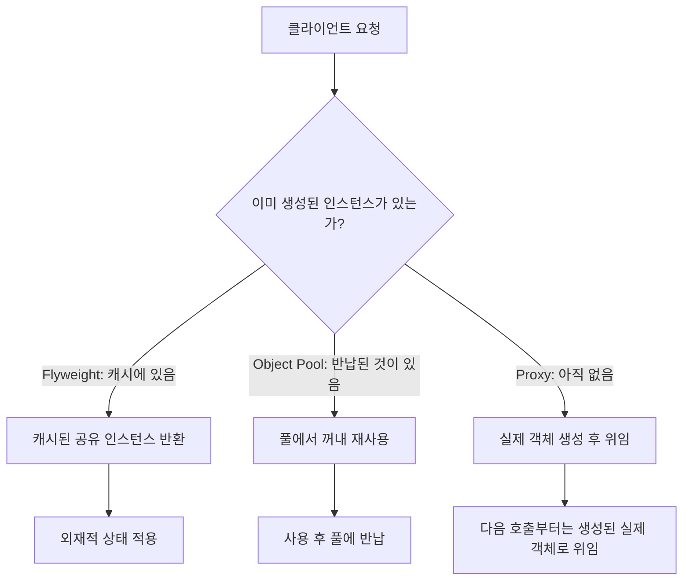

이 실습에서는 성능 벤치마크 작성, 메모리 효율적인 패턴 구현, JIT 최적화 분석을 직접 수행합니다.

## 실습 목표

1. 성능 벤치마크 작성 및 측정
2. 메모리 효율적인 패턴 구현
3. JIT 최적화와 패턴의 상관관계 분석

## 과제 1: 성능 벤치마크 작성

`System.nanoTime()`으로 전후 시간을 재는 방식은 JIT 워밍업 전 상태를 측정하거나, 결과를 사용하지 않는 계산이 컴파일러에 의해 통째로 제거(Dead Code Elimination)되어 실제보다 훨씬 빠른 값이 나오는 함정이 있습니다. JMH(Java Microbenchmark Harness)는 워밍업 반복, 여러 포크(fork) 실행, 결과 강제 사용(blackhole) 등을 자동으로 처리해 이런 함정을 피합니다. 아래 세 벤치마크는 생성 패턴이 직접 생성 대비 어느 정도의 상대적 오버헤드를 갖는지 측정하는 예시입니다.

### Factory Method vs Direct Instantiation
```java
@BenchmarkMode(Mode.AverageTime)
@OutputTimeUnit(TimeUnit.NANOSECONDS)
@State(Scope.Benchmark)
public class CreationPatternBenchmark {
    
    @Benchmark
    public Object directInstantiation() {
        return new ConcreteProduct();
    }
    
    @Benchmark
    public Object factoryMethod() {
        return ProductFactory.createProduct("concrete");
    }
    
    @Benchmark
    public Object abstractFactory() {
        AbstractFactory factory = new ConcreteFactory();
        return factory.createProduct();
    }
}

// Product 최소 스텁 (벤치마크가 컴파일되려면 반환 타입이 필요합니다)
interface Product {
    String getName();
}

class ConcreteProduct implements Product {
    @Override
    public String getName() {
        return "concrete";
    }
}

// TODO: 다음 팩토리들을 구현하세요
class ProductFactory {
    public static Product createProduct(String type) {
        // TODO: 구현
        return null;
    }
}

abstract class AbstractFactory {
    abstract Product createProduct();
}

class ConcreteFactory extends AbstractFactory {
    @Override
    Product createProduct() {
        // TODO: 구현
        return null;
    }
}
```

### Decorator Chain vs Conditional Logic
```java
@BenchmarkMode(Mode.AverageTime)
@OutputTimeUnit(TimeUnit.NANOSECONDS) 
public class DecoratorBenchmark {
    
    private String data = "test data";
    
    @Benchmark
    public String conditionalApproach() {
        String result = data;
        if (needsCompression()) {
            result = compress(result);
        }
        if (needsEncryption()) {
            result = encrypt(result);
        }
        if (needsLogging()) {
            log(result);
        }
        return result;
    }
    
    @Benchmark
    public String decoratorPattern() {
        DataProcessor processor = new LoggingDecorator(
            new EncryptionDecorator(
                new CompressionDecorator(
                    new BaseDataProcessor()
                )
            )
        );
        return processor.process(data);
    }
}

// TODO: Decorator 패턴 구현
interface DataProcessor {
    String process(String data);
}

class BaseDataProcessor implements DataProcessor {
    @Override
    public String process(String data) {
        return data;
    }
}

abstract class DataProcessorDecorator implements DataProcessor {
    protected DataProcessor processor;
    
    public DataProcessorDecorator(DataProcessor processor) {
        this.processor = processor;
    }
}

// 최소 구현: 세 Decorator 모두 process()를 오버라이드해야 컴파일됩니다.
class CompressionDecorator extends DataProcessorDecorator {
    public CompressionDecorator(DataProcessor processor) {
        super(processor);
    }

    @Override
    public String process(String data) {
        String upstream = processor.process(data);
        return "[compressed]" + upstream; // TODO: 실제 압축 로직으로 교체
    }
}

class EncryptionDecorator extends DataProcessorDecorator {
    public EncryptionDecorator(DataProcessor processor) {
        super(processor);
    }

    @Override
    public String process(String data) {
        String upstream = processor.process(data);
        return "[encrypted]" + upstream; // TODO: 실제 암호화 로직으로 교체
    }
}

class LoggingDecorator extends DataProcessorDecorator {
    public LoggingDecorator(DataProcessor processor) {
        super(processor);
    }

    @Override
    public String process(String data) {
        String result = processor.process(data);
        System.out.println("[log] processed length=" + result.length());
        return result;
    }
}
```

### Observer vs Direct Call
```java
@BenchmarkMode(Mode.AverageTime)
@OutputTimeUnit(TimeUnit.NANOSECONDS)
public class ObserverBenchmark {
    
    private Subject subject;
    private List<Observer> observers;
    
    @Setup
    public void setup() {
        subject = new ConcreteSubject();
        observers = new ArrayList<>();
        
        for (int i = 0; i < 1000; i++) {
            Observer observer = new ConcreteObserver();
            observers.add(observer);
            subject.attach(observer);
        }
    }
    
    @Benchmark
    public void observerPattern() {
        subject.notifyObservers();
    }
    
    @Benchmark
    public void directCall() {
        for (Observer observer : observers) {
            observer.update(subject);
        }
    }
}
```

## 과제 2: 메모리 효율적인 패턴 구현

메모리 효율화의 핵심은 "많이 만들지 않기"(Flyweight로 공유 상태 재사용), "다시 만들지 않기"(Object Pool로 재사용), "필요할 때만 만들기"(Proxy로 지연 로딩) 세 가지 전략으로 요약됩니다. 세 전략 모두 객체 생성 자체를 줄이거나 늦춰서 할당·GC 비용을 낮춘다는 공통점이 있지만, 적용 대상(공유 가능한 불변 데이터 vs 재사용 가능한 자원 vs 로딩 비용이 큰 자원)이 다릅니다.

| 전략 | 무엇을 줄이는가 | 적용 대상 | 재사용 단위 | 대가 |
|---|---|---|---|---|
| Flyweight | 중복 객체 생성 | 공유 가능한 불변(intrinsic) 데이터 | 타입/속성 단위 공유 | 외재적 상태를 매번 인자로 전달해야 함 |
| Object Pool | 생성·해제 비용 | 생성 비용이 큰 재사용 가능 자원(커넥션, 스레드) | 인스턴스 단위 재사용 | 풀 관리(동기화·상태 추적) 오버헤드 |
| Proxy(지연 로딩) | 불필요한 초기화 | 로딩 비용이 크지만 당장 쓰이지 않을 수 있는 자원 | 요청 시점까지 생성 지연 | 최초 접근 시 지연 발생, 프록시 계층 추가 |



### Flyweight 패턴으로 게임 캐릭터 시스템
```java
// 게임 캐릭터 Flyweight
public class CharacterType {
    private final String name;
    private final Sprite sprite;
    private final int health;
    private final int damage;
    
    public CharacterType(String name, Sprite sprite, int health, int damage) {
        this.name = name;
        this.sprite = sprite;
        this.health = health;
        this.damage = damage;
    }
    
    public void render(Graphics g, int x, int y, int level) {
        // TODO: 렌더링 로직 구현
        // 외재적 상태(x, y, level)를 사용하여 렌더링
    }
    
    public int getEffectiveDamage(int level) {
        // TODO: 레벨에 따른 데미지 계산
        return damage + (level * 2);
    }
}

// Factory
public class CharacterTypeFactory {
    private static final Map<String, CharacterType> characterTypes = new HashMap<>();
    
    public static CharacterType getCharacterType(String typeName) {
        // TODO: 캐시된 CharacterType 반환 또는 새로 생성
        return characterTypes.computeIfAbsent(typeName, name -> {
            // TODO: 캐릭터 타입별 기본 속성 설정
            return createCharacterType(name);
        });
    }
    
    private static CharacterType createCharacterType(String name) {
        // TODO: 구현
        return null;
    }
}

// 게임 캐릭터 (Context)
public class GameCharacter {
    private final CharacterType type;
    private int x, y;           // 외재적 상태
    private int level;          // 외재적 상태
    private int currentHealth;  // 외재적 상태
    
    public GameCharacter(String typeName, int x, int y) {
        this.type = CharacterTypeFactory.getCharacterType(typeName);
        this.x = x;
        this.y = y;
        this.level = 1;
        // TODO: 초기 체력 설정
    }
    
    public void render(Graphics g) {
        type.render(g, x, y, level);
    }
}
```

### Object Pool 패턴으로 네트워크 연결 관리

```java
// Connection 최소 스텁
class Connection {
    private final String id = UUID.randomUUID().toString();
    private volatile boolean closed = false;

    boolean isValid() {
        return !closed;
    }

    void close() {
        this.closed = true;
    }
}

public class ConnectionPool {
    private final Queue<Connection> availableConnections;
    private final Set<Connection> usedConnections;
    private final int maxSize;
    private final AtomicInteger currentSize;
    
    public ConnectionPool(int maxSize) {
        this.maxSize = maxSize;
        this.availableConnections = new ConcurrentLinkedQueue<>();
        this.usedConnections = ConcurrentHashMap.newKeySet();
        this.currentSize = new AtomicInteger(0);
    }
    
    // 연결 획득: 1) 재사용 가능한 연결이 있으면 큐에서 꺼내 반환
    //          2) 없고 아직 maxSize 미만이면 새로 생성
    //          3) maxSize에 도달했으면 예외로 알림 (실무에서는 대기/타임아웃으로 대체 가능)
    public Connection getConnection() {
        Connection connection = availableConnections.poll();
        if (connection == null) {
            if (currentSize.get() >= maxSize) {
                throw new IllegalStateException("Connection pool exhausted (max=" + maxSize + ")");
            }
            connection = new Connection();
            currentSize.incrementAndGet();
        }
        usedConnections.add(connection);
        return connection;
    }
    
    public void returnConnection(Connection connection) {
        // TODO: getConnection()과 대칭이 되도록 아래 3단계로 구현하세요
        // 1. usedConnections에서 제거
        // 2. connection.isValid()로 상태 검증
        // 3. 유효하면 availableConnections에 반환, 무효하면 currentSize를 감소시키고 폐기
    }
    
    // 성능 모니터링
    public ConnectionPoolStats getStats() {
        return new ConnectionPoolStats(
            availableConnections.size(),
            usedConnections.size(),
            maxSize
        );
    }
}

// 성능 측정
@Test
public void benchmarkConnectionPool() {
    ConnectionPool pool = new ConnectionPool(10);
    
    // 풀 사용 시
    long startTime = System.nanoTime();
    for (int i = 0; i < 10000; i++) {
        Connection conn = pool.getConnection();
        // 작업 수행
        doWork(conn);
        pool.returnConnection(conn);
    }
    long poolTime = System.nanoTime() - startTime;
    
    // 매번 새로 생성 시
    startTime = System.nanoTime();
    for (int i = 0; i < 10000; i++) {
        Connection conn = new Connection();
        doWork(conn);
        conn.close();
    }
    long directTime = System.nanoTime() - startTime;
    
    System.out.printf("Pool: %d ns, Direct: %d ns, Improvement: %.2f%%\n",
                      poolTime, directTime, 
                      ((double)(directTime - poolTime) / directTime) * 100);
}
```

### Proxy 패턴으로 이미지 지연 로딩
```java
public interface Image {
    void display();
    int getWidth();
    int getHeight();
}

public class RealImage implements Image {
    private final String filename;
    private BufferedImage image;
    
    public RealImage(String filename) {
        this.filename = filename;
        loadImage(); // 즉시 로딩
    }
    
    private void loadImage() {
        // TODO: 실제 이미지 파일 로딩 (시간 소요)
        try {
            Thread.sleep(100); // 로딩 시간 시뮬레이션
            // image = ImageIO.read(new File(filename));
        } catch (InterruptedException e) {
            Thread.currentThread().interrupt();
        }
    }
    
    @Override
    public void display() {
        System.out.println("Displaying " + filename);
    }
}

public class ImageProxy implements Image {
    private final String filename;
    private RealImage realImage;
    private final int width, height; // 메타데이터만 미리 로딩
    
    public ImageProxy(String filename) {
        this.filename = filename;
        // TODO: 메타데이터만 로딩 (빠름)
        this.width = loadWidth(filename);
        this.height = loadHeight(filename);
    }
    
    @Override
    public void display() {
        if (realImage == null) {
            realImage = new RealImage(filename); // 지연 로딩
        }
        realImage.display();
    }
    
    @Override
    public int getWidth() {
        return width; // 즉시 반환 (실제 이미지 로딩 불필요)
    }
    
    @Override
    public int getHeight() {
        return height; // 즉시 반환
    }
}

// 성능 테스트
@Test
public void benchmarkImageProxy() {
    String[] filenames = {"img1.jpg", "img2.jpg", "img3.jpg"};
    
    // Proxy 사용 시
    long startTime = System.nanoTime();
    List<Image> proxyImages = new ArrayList<>();
    for (String filename : filenames) {
        proxyImages.add(new ImageProxy(filename));
    }
    // 크기 정보 조회 (실제 이미지 로딩 없음)
    for (Image image : proxyImages) {
        int size = image.getWidth() * image.getHeight();
    }
    long proxyTime = System.nanoTime() - startTime;
    
    // 직접 로딩 시
    startTime = System.nanoTime();
    List<Image> realImages = new ArrayList<>();
    for (String filename : filenames) {
        realImages.add(new RealImage(filename));
    }
    for (Image image : realImages) {
        int size = image.getWidth() * image.getHeight();
    }
    long realTime = System.nanoTime() - startTime;
    
    System.out.printf("Proxy: %d ns, Real: %d ns\n", proxyTime, realTime);
}
```

## 과제 3: JIT 최적화 분석

HotSpot JIT은 호출 지점(call site)에서 실제로 나타나는 구체 타입의 수를 기준으로 인라이닝 여부를 결정합니다. 타입이 하나뿐인 단형성(monomorphic) 호출은 적극적으로 인라이닝되지만, 타입이 3개 이상인 megamorphic 호출은 인라이닝을 포기하고 가상 메서드 테이블을 조회합니다. Strategy 배열처럼 여러 구현체를 순환 호출하는 코드는 megamorphic 상황을 만들기 쉬우므로, 아래 벤치마크로 그 차이를 직접 확인합니다.

### 단형성 vs 다형성 호출 성능
```java
@BenchmarkMode(Mode.AverageTime)
@OutputTimeUnit(TimeUnit.NANOSECONDS)
public class JITOptimizationBenchmark {
    
    private SortStrategy quickSort = new QuickSortStrategy();
    private SortStrategy[] strategies = {
        new QuickSortStrategy(),
        new MergeSortStrategy(),
        new HeapSortStrategy()
    };
    private int[] data = generateRandomArray(1000);
    
    @Benchmark
    public void monomorphicCall() {
        // 단형성 호출 - JIT이 인라이닝 가능
        for (int i = 0; i < 1000; i++) {
            quickSort.sort(data.clone());
        }
    }
    
    @Benchmark
    public void polymorphicCall() {
        // 다형성 호출 - JIT 최적화 제한적
        for (int i = 0; i < 1000; i++) {
            strategies[i % 3].sort(data.clone());
        }
    }
    
    @Benchmark
    public void megamorphicCall() {
        // Megamorphic 호출 - 가상 메서드 테이블 조회
        SortStrategy[] manyStrategies = {
            new QuickSortStrategy(),
            new MergeSortStrategy(), 
            new HeapSortStrategy(),
            new BubbleSortStrategy(),
            new InsertionSortStrategy()
        };
        
        for (int i = 0; i < 1000; i++) {
            manyStrategies[i % 5].sort(data.clone());
        }
    }
}

// TODO: Strategy 구현체들
interface SortStrategy {
    void sort(int[] array);
}

class QuickSortStrategy implements SortStrategy {
    @Override
    public void sort(int[] array) {
        // TODO: 퀵소트 구현
        Arrays.sort(array); // 임시 구현
    }
}
```

### 메서드 크기와 인라이닝
```java
public class InliningAnalysis {
    
    // 작은 메서드 - 인라이닝 가능
    public final int smallMethod(int a, int b) {
        return a + b;
    }
    
    // 큰 메서드 - 인라이닝 불가능
    public final int largeMethod(int a, int b) {
        int result = a + b;
        for (int i = 0; i < 100; i++) {
            result += i * a;
            result -= i * b;
            if (result > 1000) {
                result = result % 1000;
            }
        }
        return result;
    }
    
    @Benchmark
    public void benchmarkSmallMethod() {
        int sum = 0;
        for (int i = 0; i < 100000; i++) {
            sum += smallMethod(i, i + 1);
        }
    }
    
    @Benchmark
    public void benchmarkLargeMethod() {
        int sum = 0;
        for (int i = 0; i < 100000; i++) {
            sum += largeMethod(i, i + 1);
        }
    }
}
```

## 완성도 체크리스트

- [ ] **JMH 벤치마크가 워밍업을 포함하는가** — `@Warmup`, `@Measurement` 애노테이션 없이 `System.nanoTime()`으로만 측정하면 JIT 컴파일 전 상태를 재는 것이라 결과가 왜곡됩니다.
- [ ] **벤치마크 결과가 Dead Code Elimination에서 안전한가** — `@Benchmark` 메서드가 값을 반환하거나 `Blackhole`에 값을 소비시켜, 컴파일러가 "사용되지 않는 계산"으로 판단해 통째로 제거하지 않는지 확인합니다.
- [ ] **`ConnectionPool.getConnection()`이 maxSize를 실제로 지키는가** — 풀이 가득 찼을 때 예외를 던지거나 대기하는지, 무한정 새 연결을 생성하지 않는지 테스트로 확인합니다.
- [ ] **Flyweight의 메모리 절약이 실측치로 뒷받침되는가** — `Runtime.totalMemory() - freeMemory()`나 프로파일러로 Flyweight 적용 전후 힙 사용량을 직접 비교했는지 확인합니다.
- [ ] **단형성/다형성/megamorphic 벤치마크가 서로 다른 결과를 보이는가** — 세 벤치마크 실행 결과에서 megamorphic 케이스가 실제로 더 느리게 나오는지 확인하고, 나오지 않는다면 JIT 워밍업 부족을 의심합니다.
- [ ] **최적화 전후를 같은 조건에서 비교했는가** — JVM 플래그, 데이터 크기, 워밍업 횟수를 동일하게 맞춘 상태에서 Before/After를 측정했는지 확인합니다.

## 이 최적화가 오히려 손해인 경우

성능 최적화는 공짜가 아닙니다. 아래 기준에 해당하면 최적화를 적용하기 전에 다시 생각해야 합니다.

- **객체 생성 비용이 이미 낮다면 Object Pool은 손해입니다.** 단순 POJO처럼 생성 비용이 수 ns~수십 ns 수준인 객체는, 풀의 동기화·상태 추적 오버헤드가 순수 생성 비용보다 커질 수 있습니다. "생성 비용 ≫ 풀 관리 비용"일 때만 적용하세요.
- **호출 빈도가 낮은 콜드 패스에서는 Flyweight·Strategy 최적화가 가독성만 해칩니다.** I/O나 네트워크 호출이 섞인 경로에서는 패턴 오버헤드가 전체 지연의 1% 미만이라, 최적화로 얻는 이득보다 코드 복잡도 증가가 더 클 수 있습니다.
- **측정 없이 적용한 최적화는 검증할 수 없습니다.** JMH로 Before/After를 측정하지 않고 "이론적으로 빠를 것"이라는 추정만으로 코드를 복잡하게 만들면, 실제 이득이 없거나 오히려 느려져도 알아챌 방법이 없습니다.
- **동시성 오버헤드가 순차 처리보다 클 수 있습니다.** Lock-free 자료구조나 스레드 풀 기반 비동기 처리는 경합이 거의 없는 저빈도 작업에서는 컨텍스트 스위칭·메모리 배리어 비용이 순차 처리보다 오히려 비쌀 수 있습니다.

## 평가 기준

이 실습을 완료했다면 다음을 스스로 설명할 수 있어야 합니다.

- JMH가 `System.nanoTime()` 수동 측정 대비 왜 더 신뢰할 수 있는지, 워밍업과 Dead Code Elimination 회피가 각각 어떤 문제를 막는지 설명할 수 있다.
- Flyweight, Object Pool, Proxy(지연 로딩)가 각각 어떤 종류의 메모리 낭비를 줄이는지, 세 패턴을 서로 바꿔 적용하면 안 되는 이유를 근거를 들어 말할 수 있다.
- 단형성/다형성/megamorphic 호출에서 JIT 인라이닝 결정이 어떻게 달라지는지, 실제 벤치마크 수치로 그 차이를 뒷받침할 수 있다.
- 이번 실습에서 만든 최적화 중 "측정 없이는 적용하지 말아야 할" 것이 무엇인지 하나 이상 지목할 수 있다.

## 추가 도전 과제

1. **프로파일링 도구 활용**
   - JProfiler, VisualVM으로 성능 병목점 식별
   - 메모리 덤프 분석

2. **GC 튜닝과 패턴**
   - 세대별 GC와 객체 생명주기 분석
   - 패턴이 GC에 미치는 영향

3. **CPU 캐시 최적화**
   - 메모리 지역성 고려한 패턴 설계
   - False Sharing 회피

4. **병렬 처리 최적화**
   - Thread-safe 패턴 구현
   - Lock-free 자료구조 활용

---

**실습 팁**
- 측정 전 충분한 워밍업 수행
- 여러 번 측정하여 평균값 사용
- 실제 운영 환경에 가까운 조건에서 테스트
- 마이크로 벤치마크의 한계 인식하고 매크로 벤치마크 병행 