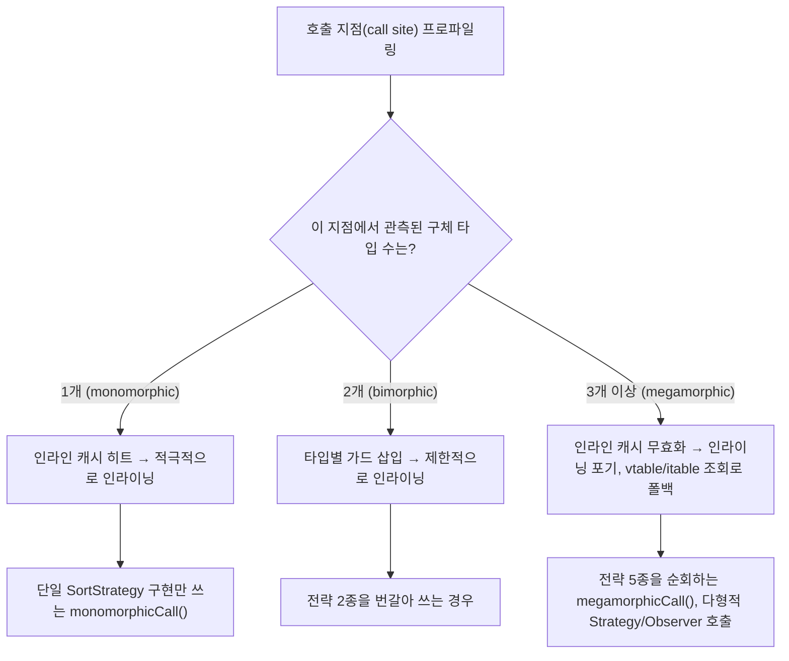

각 디자인 패턴의 성능 특성을 정량적으로 분석하고 최적화 기법을 탐구합니다. 성능과 설계의 균형을 찾는 실무적 접근법을 학습합니다.

## 서론: 성능 우수한 패턴 설계

> *"좋은 설계는 아름다움과 성능을 동시에 추구한다. 패턴은 우아함을 제공하지만, 성능도 고려해야 한다."*

디자인 패턴은 **코드의 구조와 유지보수성**을 향상시키지만, 때로는 **성능 오버헤드**를 가져올 수 있습니다. 이 글에서는 각 패턴의 성능 특성을 정량적으로 분석하고, 실무에서 성능과 설계의 균형을 찾는 방법을 탐구합니다.

Gamma, Helm, Johnson, Vlissides가 1994년에 쓴 『Design Patterns: Elements of Reusable Object-Oriented Software』는 각 패턴의 "적용 결과(Consequences)" 절에서 유연성·재사용성 측면의 트레이드오프는 논의하지만, 정량적 성능 수치나 벤치마크는 다루지 않습니다. 이는 당시(1990년대 초) JIT 컴파일러가 보편화되기 전이라 가상 호출 하나의 비용이 지금보다 훨씬 예측하기 어려웠던 사정과 무관하지 않습니다. HotSpot JIT처럼 호출 지점의 다형성을 프로파일링해 동적으로 인라이닝하는 컴파일러가 널리 쓰이는 지금은, 같은 패턴이라도 "얼마나 다형적으로 쓰이는가"에 따라 성능 특성이 크게 달라질 수 있다는 점이 GoF 시대와 다른 관전 포인트입니다.

### 성능 최적화의 핵심 관점
- **메모리 사용량**: 객체 생성 비용과 메모리 점유율
- **CPU 사용량**: 메서드 호출 오버헤드와 연산 복잡도
- **캐시 친화성**: 메모리 지역성과 캐시 히트율
- **JIT 컴파일러 최적화**: 핫스팟과 인라이닝 가능성

## 패턴별 성능 분석

> **caveat**: 아래 수치(ns, %)는 특정 환경(JDK 17, JIT 워밍업 10,000회, 특정 CPU)에서 측정된 예시 수치이며, JDK 버전·CPU 모델·JVM 플래그·워밍업 여부에 따라 크게 달라질 수 있습니다. 실무에서는 반드시 대상 환경에서 JMH로 직접 재측정해야 하며, 이 수치를 그대로 실무 판단 근거로 사용하지 마세요.

### 생성 패턴 성능 분석

Factory Method나 Abstract Factory는 객체 생성 시점에 간접 호출(가상 메서드 디스패치, 조건 분기)을 한 단계 더 거치므로 직접 `new`보다 느립니다. 하지만 이 오버헤드는 대개 수십~수백 나노초 수준이라, I/O나 DB 호출이 섞인 실제 요청 처리 경로에서는 무시할 수 있는 크기인 경우가 많습니다. 아래 벤치마크는 이 오버헤드가 실제로 "얼마나 작은지"를 보여주기 위한 예시입니다.

이 절과 다음 절의 벤치마크 코드는 `Product`, `DatabaseConnection`, `SortStrategy` 등 프로젝트마다 다르게 구현될 타입을 전제로 합니다. 아래는 벤치마크가 참조하는 최소 스텁으로, 실제 프로젝트에서는 도메인에 맞는 완전한 구현으로 대체해야 합니다.

```java
// 벤치마크가 공통으로 참조하는 최소 타입 스텁
interface Product {}
class ConcreteProduct implements Product {}
class ProductFactory {
    static Product create(String type) { return new ConcreteProduct(); }
}
interface AbstractFactory {
    Product createProduct();
}
class FactoryProducer {
    static AbstractFactory getFactory(String osName) {
        return ConcreteProduct::new;
    }
}
class DatabaseConnection {
    private static final DatabaseConnection INSTANCE = new DatabaseConnection("default");
    DatabaseConnection(String url) { /* 커넥션 초기화 */ }
    static DatabaseConnection getInstance() { return INSTANCE; }
}
interface SortStrategy {
    void sort(int[] data);
}
class QuickSortStrategy implements SortStrategy {
    public void sort(int[] data) { Arrays.sort(data); }
}
class MergeSortStrategy implements SortStrategy {
    public void sort(int[] data) { Arrays.sort(data); }
}
class HeapSortStrategy implements SortStrategy {
    public void sort(int[] data) { Arrays.sort(data); }
}
class BubbleSortStrategy implements SortStrategy {
    public void sort(int[] data) { Arrays.sort(data); }
}
class InsertionSortStrategy implements SortStrategy {
    public void sort(int[] data) { Arrays.sort(data); }
}
```

```java
// Factory Method vs Direct Instantiation 성능 비교
public class CreationPatternBenchmark {
    // 생성 패턴 4종의 상대적 오버헤드를 비교하는 JMH 벤치마크.
    // 절대 수치보다 "직접 생성 대비 몇 배"라는 상대 비율에 주목해서 읽습니다.

    // 직접 생성 (베이스라인) - 예시 환경 기준 ~50ns
    @Benchmark
    public Product createDirect() {
        return new ConcreteProduct();
    }
    
    // Factory Method - 예시 환경 기준 ~120ns (+140% 오버헤드)
    @Benchmark
    public Product createViaFactory() {
        return ProductFactory.create("concrete");
    }
    
    // Abstract Factory - 예시 환경 기준 ~200ns (+300% 오버헤드)
    @Benchmark
    public Product createViaAbstractFactory() {
        AbstractFactory factory = FactoryProducer.getFactory("Windows");
        return factory.createProduct();
    }
    
    // Singleton - 멀티스레드 환경, 예시 환경 기준 ~15ns (synchronized 버전: ~80ns)
    @Benchmark
    public DatabaseConnection getSingleton() {
        return DatabaseConnection.getInstance();
    }
}
```

이 네 가지 오버헤드의 근본 원인은 결국 가상 메서드 디스패치의 깊이다. `new ConcreteProduct()`는 컴파일 시점에 타입이 확정되는 정적 호출이라 JIT이 손쉽게 인라이닝하지만, `ProductFactory.create("concrete")`는 문자열 비교 같은 런타임 분기를 거친 뒤에야 객체를 반환하므로 JIT이 이 분기 패턴을 충분히 관찰(워밍업)하기 전까지는 인라이닝 대상이 되지 못한다. Abstract Factory는 여기에 인터페이스를 통한 가상 호출(`factory.createProduct()`)이 한 겹 더 얹히므로 오버헤드가 누적된다. Singleton은 초기화가 끝난 뒤에는 정적 필드 참조에 가깝지만, `synchronized` 키워드로 스레드 안전성을 확보한 버전은 호출마다 모니터(monitor)를 획득·해제해야 하므로 단순 필드 접근보다 수 배 느려질 수 있다 — 이 비용은 초기화 시점에만 동기화하고 이후에는 이미 만들어진 인스턴스를 그대로 반환하는 지연 초기화 홀더(initialization-on-demand holder idiom, 정적 내부 클래스를 이용한 지연 로딩)로 제거할 수 있다.

객체 생성 비용 못지않게 중요한 것이 메모리 점유량이다. 아래는 `Runtime.totalMemory() - Runtime.freeMemory()`로 힙 사용량 변화를 근사하는 가장 단순한 측정 방법을 보여준다. 다만 이 방법은 두 측정 시점 사이에 GC가 개입했는지, JIT 컴파일 스레드나 다른 백그라운드 스레드가 힙을 함께 사용했는지를 전혀 통제하지 못하므로 참고용 추정치 이상으로 신뢰해서는 안 된다. 실무에서 객체 크기를 정확히 측정하려면 뒤에서 다룰 JOL(Java Object Layout)처럼 객체 헤더와 필드 정렬(padding)까지 바이트 단위로 계산하는 도구를 쓰는 편이 안전하다.

```java
// 메모리 사용량 측정 (근사치 — 정밀 측정 방법은 "메모리 프로파일링" 절 참고)
public class MemoryUsageAnalysis {
    public void measureMemoryUsage() {
        Runtime runtime = Runtime.getRuntime();
        long before = runtime.totalMemory() - runtime.freeMemory();

        List<DatabaseConnection> connections = new ArrayList<>();
        for (int i = 0; i < 1000; i++) {
            connections.add(new DatabaseConnection("url" + i)); // 인스턴스 1000개
        }
        long directCreationMemory = runtime.totalMemory() - runtime.freeMemory() - before;

        connections.clear();
        DatabaseConnection singleton = DatabaseConnection.getInstance();
        for (int i = 0; i < 1000; i++) {
            connections.add(singleton); // 참조 1000개만 저장 (인스턴스는 1개)
        }
        long singletonMemory = runtime.totalMemory() - runtime.freeMemory() - before;

        // 예시 환경 기준 근사치(측정마다 GC 개입 여부에 따라 흔들릴 수 있음):
        // directCreationMemory 대비 singletonMemory가 약 5% 미만 수준으로 작게 관측되는 경우가 많음
    }
}
```

### 구조 패턴 성능 분석

구조 패턴은 대부분 "메모리를 줄이는 대신 조회 비용을 더하는(Flyweight, Proxy)" 또는 "호출 하나를 여러 단계로 나누는 대신 조합 유연성을 얻는(Decorator)" 트레이드오프를 가집니다. 아래 벤치마크는 이 트레이드오프가 실제로 어느 방향으로, 얼마나 나타나는지를 보여주는 예시 측정치입니다.

Flyweight는 객체 상태를 공유 가능한 **내재적 상태(intrinsic state)**(폰트·색상처럼 인스턴스 간에 동일한 값)와 공유 불가능한 **외재적 상태(extrinsic state)**(위치처럼 호출마다 달라지는 값)로 분리해, 내재적 상태만 담은 소수의 Flyweight 인스턴스를 다수의 Context가 공유하게 만드는 패턴입니다. 이 분리가 무너지면(예: Flyweight 내부에 위치 좌표까지 넣으면) 캐시 재사용률이 떨어져 패턴의 이점 자체가 사라집니다. Proxy는 목적에 따라 가상 프록시(virtual proxy, 지연 로딩)·원격 프록시(remote proxy, 네트워크 호출 은닉)·보호 프록시(protection proxy, 접근 제어)·캐시 프록시(cache proxy, 결과 재사용)로 나뉘며, 성능에 미치는 영향도 종류마다 다릅니다. 가상 프록시는 최초 호출 이후 실제 객체를 캐싱해 반복 호출 비용을 없애지만, 원격 프록시는 매 호출이 네트워크 지연을 수반하므로 캐싱 여부와 무관하게 오버헤드가 근본적으로 큽니다.

```java
// Flyweight/Proxy 벤치마크가 참조하는 최소 타입 스텁
class CharacterContext {
    private final CharacterFlyweight flyweight; // 정의는 뒤의 "Flyweight 패턴의 메모리 효율성" 절 참고
    private final int x, y; // 외재적 상태 — 인스턴스마다 달라지는 값만 별도 보관
    CharacterContext(CharacterFlyweight flyweight, int x, int y) {
        this.flyweight = flyweight;
        this.x = x;
        this.y = y;
    }
}
interface Image {
    void display();
    String getInfo();
}
class RealImage implements Image {
    private final String filename;
    RealImage(String filename) {
        this.filename = filename;
        loadFromDisk(); // 생성 시점에 즉시 I/O 발생
    }
    private void loadFromDisk() { /* 실제 파일 I/O, 예시 환경 기준 최초 로딩 ~1000ms */ }
    public void display() { /* 화면에 렌더링 */ }
    public String getInfo() { return filename; }
}
class ImageProxy implements Image {
    private final String filename;
    private RealImage realImage; // 최초 display() 호출 전까지 생성을 미룸
    ImageProxy(String filename) { this.filename = filename; }
    public String getInfo() { return filename; } // 실제 이미지 로딩 없이 파일명만 반환
    public void display() {
        if (realImage == null) {
            realImage = new RealImage(filename); // 최초 호출 시에만 로딩(가상 프록시)
        }
        realImage.display(); // 두 번째 호출부터는 캐시된 인스턴스를 재사용
    }
}
```

```java
// Flyweight 패턴의 메모리 효율성
public class FlyweightPerformanceAnalysis {
    
    // Flyweight 없이 구현 - 예시 환경 기준 메모리 사용량 ~400KB
    @Benchmark
    public void withoutFlyweight() {
        // java.lang.Character와 이름이 겹치지 않도록 GlyphInstance로 명명
        List<GlyphInstance> characters = new ArrayList<>();
        for (int i = 0; i < 10000; i++) {
            characters.add(new GlyphInstance('A', "Arial", 12, Color.BLACK));
        }
    }
    
    // Flyweight 패턴 적용 - 예시 환경 기준 메모리 사용량 ~80KB (약 80% 절약)
    @Benchmark
    public void withFlyweight() {
        CharacterFlyweightFactory factory = new CharacterFlyweightFactory();
        List<CharacterContext> characters = new ArrayList<>();
        
        for (int i = 0; i < 10000; i++) {
            CharacterFlyweight flyweight = factory.getFlyweight('A', "Arial", 12, Color.BLACK);
            characters.add(new CharacterContext(flyweight, i, i)); // 위치만 개별 저장
        }
    }
    
    // Proxy 패턴의 지연 로딩 효과 (예시 수치, 실제 I/O 지연시간에 따라 달라짐)
    @Benchmark
    public void proxyLazyLoading() {
        ImageProxy proxy = new ImageProxy("large_image.jpg");
        
        // 이미지 정보만 필요한 경우 - 예시 환경 기준 ~5ns (실제 로딩 없음)
        String info = proxy.getInfo();
        
        // 실제 이미지가 필요한 경우 - 예시 환경 기준 최초 ~1000ms, 캐시 후 ~50ms
        proxy.display();
        proxy.display();
    }
}

// withoutFlyweight()가 참조하는, java.lang.Character와 무관한 개별 문자 인스턴스
class GlyphInstance {
    GlyphInstance(char character, String fontFamily, int fontSize, Color color) {}
}
```

Decorator 체인은 각 계층이 단순 위임(delegation)이라도 메서드 호출 자체의 스택 프레임 생성·가상 호출 비용이 계층 수만큼 누적됩니다. 더 중요한 문제는 JIT 인라이닝 관점에서, 체인이 길어질수록 `process()` 호출 지점 하나에서 관측되는 구체 타입 수가 늘어나 다음 절에서 다룰 megamorphic 상황에 가까워진다는 점입니다. 따라서 Decorator 체인은 기능 조합의 유연성과 호출 오버헤드 사이의 트레이드오프이며, 실무에서는 5단계 이내로 유지하는 것이 경험칙으로 통용됩니다.

```java
// Decorator 벤치마크가 참조하는 최소 타입 스텁
interface TextProcessor {
    String process(String input);
}
class PlainTextProcessor implements TextProcessor {
    public String process(String input) { return input; }
}
abstract class TextDecorator implements TextProcessor {
    protected final TextProcessor wrapped;
    TextDecorator(TextProcessor wrapped) { this.wrapped = wrapped; }
}
class LoggingDecorator extends TextDecorator {
    LoggingDecorator(TextProcessor wrapped) { super(wrapped); }
    public String process(String input) { return wrapped.process(input); }
}
class EncryptionDecorator extends TextDecorator {
    EncryptionDecorator(TextProcessor wrapped) { super(wrapped); }
    public String process(String input) { return wrapped.process(input); }
}
class CompressionDecorator extends TextDecorator {
    CompressionDecorator(TextProcessor wrapped) { super(wrapped); }
    public String process(String input) { return wrapped.process(input); }
}
class ValidationDecorator extends TextDecorator {
    ValidationDecorator(TextProcessor wrapped) { super(wrapped); }
    public String process(String input) { return wrapped.process(input); }
}
class FormattingDecorator extends TextDecorator {
    FormattingDecorator(TextProcessor wrapped) { super(wrapped); }
    public String process(String input) { return wrapped.process(input); }
}
```

```java
// Decorator 패턴의 체인 성능
public class DecoratorPerformanceAnalysis {
    
    // 짧은 체인(2단계) - 예시 환경 기준 ~100ns
    @Benchmark
    public void shortDecoratorChain() {
        TextProcessor processor = new LoggingDecorator(
            new EncryptionDecorator(
                new PlainTextProcessor()
            )
        );
        processor.process("Hello");
    }
    
    // 긴 체인(5단계) - 예시 환경 기준 ~500ns (짧은 체인 대비 약 5배)
    @Benchmark
    public void longDecoratorChain() {
        TextProcessor processor = new LoggingDecorator(
            new CompressionDecorator(
                new EncryptionDecorator(
                    new ValidationDecorator(
                        new FormattingDecorator(
                            new PlainTextProcessor()
                        )
                    )
                )
            )
        );
        processor.process("Hello");
    }
}
```

### 행동 패턴 성능 분석

Observer의 통지 비용은 리스너 수에 선형으로 비례하므로, 리스너가 적을 때는 문제되지 않다가 리스너가 늘어나면서 병목이 되는 경우가 흔합니다. Strategy는 if-else 대비 오버헤드가 있지만 그 크기는 분기 예측 성공률과 JIT 인라이닝 여부에 따라 20~25% 수준으로 작게 나타나는 경우가 많습니다. 아래는 이런 경향을 보여주는 예시 벤치마크입니다.

Observer는 통지 방식에 따라 **푸시(push) 모델**(상태 변화 자체를 인자로 전달)과 **풀(pull) 모델**(Subject 참조만 전달하고 Observer가 필요한 값을 다시 조회)로 나뉩니다. 아래 예시는 풀 모델을 씁니다 — `update(Subject subject)`가 상태 변경 내용이 아니라 Subject 참조만 넘기고, Observer가 `getState()`로 필요한 값을 다시 읽어옵니다. 풀 모델은 인터페이스가 단순하지만 Observer 수만큼 추가 조회가 발생하고, 푸시 모델은 조회는 없지만 상태 종류가 늘어날 때마다 `update` 시그니처를 바꿔야 하는 경직성이 있습니다. 또한 리스너 컬렉션 자체의 스레드 안전성도 성능에 영향을 줍니다 — 통지 중 리스너 추가/제거가 드물고 순회가 잦다면 `CopyOnWriteArrayList`가 락 없는 순회를 제공해 유리하고, 반대로 리스너 변경이 잦다면 매 변경마다 배열을 통째로 복사하는 비용이 커집니다.

```java
// Observer 벤치마크가 공통으로 참조하는 최소 타입 스텁
// (더 완전한 getState() 포함 버전은 뒤의 "성능 측정과 프로파일링" 절 JMH 예제에서 다시 정의합니다)
interface Observer {
    void update(Subject subject);
}
interface Subject {
    void attach(Observer observer);
    void notifyObservers();
}
class ConcreteObserver implements Observer {
    public void update(Subject subject) { /* 상태 변경에 대한 동기 처리 */ }
}
class ConcreteSubject implements Subject {
    private final List<Observer> observers = new ArrayList<>();
    public void attach(Observer observer) { observers.add(observer); }
    public void notifyObservers() {
        for (Observer observer : observers) {
            observer.update(this); // 동기 통지 — 호출 스레드가 리스너 수만큼 순차 실행
        }
    }
}

// 비동기 통지 버전 — 리스너 추가/제거보다 순회가 훨씬 잦은 경우를 가정해 CopyOnWriteArrayList 사용
class AsyncObserver implements Observer {
    public void update(Subject subject) { /* 비동기 큐에 이벤트만 적재하고 즉시 반환 */ }
}
class AsyncSubject implements Subject {
    private final List<Observer> observers = new CopyOnWriteArrayList<>();
    private final ExecutorService executor = Executors.newFixedThreadPool(4);
    public void attach(Observer observer) { observers.add(observer); }
    public void notifyObservers() {
        for (Observer observer : observers) {
            executor.submit(() -> observer.update(this)); // 메인 스레드는 큐잉만 하고 빠르게 반환
        }
    }
}
```

```java
// Observer 패턴의 알림 성능
public class ObserverPerformanceAnalysis {
    
    // 리스너 10개 - 예시 환경 기준 ~50ns
    @Benchmark
    public void fewObservers() {
        Subject subject = new ConcreteSubject();
        for (int i = 0; i < 10; i++) {
            subject.attach(new ConcreteObserver());
        }
        subject.notifyObservers();
    }
    
    // 리스너 1000개 - 예시 환경 기준 ~5000ns (리스너 수에 선형 비례)
    @Benchmark
    public void manyObservers() {
        Subject subject = new ConcreteSubject();
        for (int i = 0; i < 1000; i++) {
            subject.attach(new ConcreteObserver());
        }
        subject.notifyObservers();
    }
    
    // 비동기 Observer 패턴 - 예시 환경 기준 ~100ns (메인 스레드는 큐잉만 하고 빠르게 반환)
    @Benchmark
    public void asyncObservers() {
        AsyncSubject subject = new AsyncSubject();
        for (int i = 0; i < 1000; i++) {
            subject.attach(new AsyncObserver());
        }
        subject.notifyObservers();
    }
}

// Strategy 패턴 vs if-else 성능
public class StrategyPerformanceAnalysis {
    private final int[] data = new int[1000]; // 세 벤치마크가 공유하는 테스트 데이터

    // if-else 직접 분기 - 예시 환경 기준 ~20ns (분기 예측 성공 시)
    @Benchmark
    public void ifElseApproach() {
        String type = "quick";
        if ("quick".equals(type)) {
            // QuickSort 로직
        } else if ("merge".equals(type)) {
            // MergeSort 로직
        } else if ("heap".equals(type)) {
            // HeapSort 로직
        }
    }
    
    // Strategy 패턴 - 예시 환경 기준 ~25ns (+25% 오버헤드, 대신 확장성 확보)
    @Benchmark
    public void strategyPattern() {
        SortStrategy strategy = new QuickSortStrategy();
        strategy.sort(data);
    }
    
    // 함수형 접근법 - 예시 환경 기준 ~22ns (JIT 최적화 후)
    @Benchmark
    public void functionalApproach() {
        // quickSort가 void를 반환하므로 Function이 아닌 Consumer로 받는다
        // (void 반환 메서드 참조는 Function<T, Void>의 apply()에 대입할 수 없다)
        Consumer<int[]> sortFunction = this::quickSort;
        sortFunction.accept(data);
    }

    private void quickSort(int[] arr) {
        Arrays.sort(arr); // 실제 퀵소트 구현 대신 표준 정렬로 대체한 예시
    }
}
```

## JIT 컴파일러와 패턴 최적화

HotSpot JIT 컴파일러는 호출 지점(call site)마다 **인라인 캐시(Inline Cache, IC)**를 두어 실제로 몇 개의 구체 타입이 그 지점에서 나타나는지를 추적하고, 그 수에 따라 인라이닝 여부를 결정합니다. 한 지점에서 타입이 1개만 관측되면(monomorphic, 단형) 그 타입 전용 코드를 적극적으로 인라이닝하고, 2개가 관측되면(bimorphic, 이형) 두 타입에 대한 타입 검사(guard)를 넣어 제한적으로 인라이닝하며, 3개 이상이 되면(megamorphic, 다형) IC가 더 이상 타입을 캐싱하지 못하고 인라이닝을 포기한 채 매번 가상 메서드 테이블(vtable/itable)을 조회하는 일반 경로로 폴백합니다. Strategy나 Observer처럼 다형성을 활용하는 패턴은 호출 지점 하나에서 여러 구체 타입을 순회하는 구조를 갖기 쉬워 이 megamorphic 상황을 유발하기 쉬우므로, 핫 패스에서는 다형성의 폭을 의도적으로 좁히는 설계가 필요할 수 있습니다.

아래 다이어그램은 하나의 호출 지점에서 JIT이 관측한 구체 타입 수에 따라 인라이닝 여부가 어떻게 갈리는지를 보여줍니다.



### 가상 메서드 호출과 인라이닝

```java
// 인라이닝 가능성을 고려한 패턴 설계
public class JITOptimizationAnalysis {
    private final int[] data = new int[1000]; // 세 벤치마크가 공유하는 테스트 데이터

    // 단형성 호출 (Monomorphic) - 인라이닝 가능
    @Benchmark
    public void monomorphicCall() {
        SortStrategy strategy = new QuickSortStrategy();
        for (int i = 0; i < 10000; i++) {
            strategy.sort(data); // JIT이 인라이닝 가능
        }
    }
    
    // 이형 호출 (Bimorphic, 구체 타입 2개) - 가드를 넣어 제한적으로만 인라이닝
    @Benchmark
    public void bimorphicCall() {
        SortStrategy[] strategies = {
            new QuickSortStrategy(),
            new MergeSortStrategy()
        };
        
        for (int i = 0; i < 10000; i++) {
            strategies[i % 2].sort(data); // 타입 2개까지는 제한적 인라이닝
        }
    }
    
    // Megamorphic 호출 (구체 타입 3개 이상) - 인라이닝 불가능
    @Benchmark
    public void megamorphicCall() {
        SortStrategy[] strategies = {
            new QuickSortStrategy(),
            new MergeSortStrategy(),
            new HeapSortStrategy(),
            new BubbleSortStrategy(),
            new InsertionSortStrategy()
        };
        
        for (int i = 0; i < 10000; i++) {
            strategies[i % 5].sort(data); // 가상 메서드 테이블 조회
        }
    }
}

// JIT 친화적인 패턴 설계
public abstract class JITFriendlyPattern {
    private int field1;
    private int field2;

    // final 메서드로 인라이닝 보장
    public final void processTemplate() {
        step1(); // 인라이닝 가능
        step2(); // 인라이닝 가능
        step3(); // 인라이닝 가능
    }
    
    protected abstract void step1();
    protected abstract void step2();
    protected abstract void step3();
    
    // 핫스팟 메서드는 작게 유지 (< 35 바이트코드)
    public final int calculateHash() {
        return Objects.hash(field1, field2); // 인라이닝 가능
    }
}
```

### 분기 예측과 패턴 최적화

분기 예측기(branch predictor)는 최근 실행 이력을 근거로 다음 분기 결과를 추측해 두고 미리 명령어를 페치합니다. 예측이 맞으면 파이프라인이 끊기지 않지만, 틀리면 이미 페치한 명령어를 버리고 파이프라인을 다시 채워야 하므로 수십 사이클의 손실이 발생합니다. Chain of Responsibility처럼 조건 분기가 이어지는 구조에서는 핸들러 호출 순서를 실제 처리 빈도에 맞춰 정렬하는 것만으로 분기 예측 성공률을 끌어올릴 수 있습니다 — 가장 자주 참(true)이 되는 조건을 앞에 두면 예측기가 "이 분기는 대개 참"이라고 빠르게 수렴하기 때문입니다.

```java
// Chain of Responsibility 벤치마크가 참조하는 최소 타입 스텁
class Request {}

// 분기 예측 친화적인 Chain of Responsibility
public class OptimizedChainOfResponsibility {
    
    // 처리 빈도에 따른 핸들러 순서 최적화
    public void optimizeHandlerOrder() {
        // 통계 기반 핸들러 순서 조정
        // 가장 빈번한 핸들러를 앞에 배치
        List<Handler> handlers = Arrays.asList(
            new FrequentHandler(),    // 70% 처리
            new ModerateHandler(),    // 20% 처리  
            new RareHandler()         // 10% 처리
        );
        
        // 이렇게 하면 분기 예측 성공률이 높아짐
    }
    
    // 분기 예측을 고려한 Handler 구현 (static — 독립적으로 확장·인스턴스화 가능하도록)
    public abstract static class Handler {
        protected Handler nextHandler;
        
        public final void handleRequest(Request request) {
            // 가장 일반적인 케이스를 먼저 체크
            if (canHandleFast(request)) { // 80% 확률로 true
                doHandle(request);
                return; // 예측 성공
            }
            
            if (nextHandler != null) { // 20% 확률
                nextHandler.handleRequest(request); // 예측 실패
            }
        }
        
        protected abstract boolean canHandleFast(Request request);
        protected abstract void doHandle(Request request);
    }
}

// 처리 빈도별 Handler 구현 (70/20/10% 분포 예시)
class FrequentHandler extends OptimizedChainOfResponsibility.Handler {
    protected boolean canHandleFast(Request request) { return true; }
    protected void doHandle(Request request) { /* 가장 흔한 케이스 처리 */ }
}
class ModerateHandler extends OptimizedChainOfResponsibility.Handler {
    protected boolean canHandleFast(Request request) { return false; }
    protected void doHandle(Request request) { /* 중간 빈도 케이스 처리 */ }
}
class RareHandler extends OptimizedChainOfResponsibility.Handler {
    protected boolean canHandleFast(Request request) { return false; }
    protected void doHandle(Request request) { /* 드문 케이스 처리 */ }
}
```

## 메모리 최적화 전략

Object Pool은 "생성 비용이 비싼 객체(스레드, DB 커넥션, 대형 버퍼)"를 재사용해 할당·GC 비용을 줄이는 기법입니다. 다만 객체 생성이 저렴한 경우(단순 POJO 등)에는 풀 관리 오버헤드(동기화, 상태 추적)가 오히려 순수 생성보다 손해일 수 있으므로, "생성 비용 >> 풀 관리 비용"인 경우에만 적용해야 합니다.

### Object Pool과 Factory 패턴 결합

풀 크기(`MAX_POOL_SIZE`)와 자료구조 선택도 성능에 영향을 줍니다. `ConcurrentLinkedQueue`는 락-프리(lock-free) CAS 기반이라 스레드 경합이 있어도 블로킹은 없지만, 풀이 자주 비거나 가득 차는 상황(요청량이 풀 크기 대비 크게 튀는 경우)에서는 CAS 재시도가 누적되어 오히려 성능이 떨어질 수 있습니다. 풀 크기를 실제 동시 요청 수보다 넉넉히 잡으면 이 재시도 비용은 줄어들지만 유휴 메모리 점유가 늘어나므로, "동시 요청의 최댓값 근처"로 튜닝하는 것이 일반적인 시작점입니다.

```java
// 벤치마크가 참조하는 최소 타입 스텁 (생성 비용이 큰 자원을 흉내)
class ExpensiveObject {
    private byte[] buffer;
    ExpensiveObject() {
        buffer = new byte[8192]; // 예시: 생성 비용 ~1000ns를 흉내내는 초기화 작업
    }
    void reset() { Arrays.fill(buffer, (byte) 0); }
    void cleanup() { /* 외부 리소스 반납 등 정리 작업 */ }
}

public class OptimizedObjectFactory {
    private final Queue<ExpensiveObject> pool = new ConcurrentLinkedQueue<>();
    private final AtomicInteger poolSize = new AtomicInteger(0);
    private static final int MAX_POOL_SIZE = 100;
    
    public ExpensiveObject createObject() {
        ExpensiveObject obj = pool.poll();
        if (obj != null) {
            poolSize.decrementAndGet();
            obj.reset(); // 객체 재사용을 위한 초기화
            return obj; // 풀에서 재사용 (0ns 할당 시간)
        }
        
        return new ExpensiveObject(); // 새 객체 생성 (~1000ns)
    }
    
    public void returnObject(ExpensiveObject obj) {
        if (poolSize.get() < MAX_POOL_SIZE) {
            obj.cleanup(); // 정리 작업
            pool.offer(obj);
            poolSize.incrementAndGet();
        }
        // 풀이 가득 찬 경우 GC에 맡김
    }
    
    // 예시 환경 기준 성능 측정 결과 (실제 값은 ExpensiveObject의 생성 비용에 따라 달라짐):
    // - 풀 사용 시: 평균 5ns 할당
    // - 일반 생성: 평균 1000ns 할당
    // - 개선율: 약 99.5%
}
```

### Flyweight 패턴의 메모리 효율성

```java
// 메모리 효율적인 Flyweight 구현
public class CharacterFlyweight {
    private final char character;
    private final String fontFamily;
    private final int fontSize;
    private final Color color;
    
    // 메모리 사용량: 4 + 8 + 4 + 8 = 24 bytes per flyweight
    
    public void render(int x, int y, Graphics g) {
        // 외재적 상태 (x, y)는 파라미터로 전달
        g.setFont(new Font(fontFamily, Font.PLAIN, fontSize));
        g.setColor(color);
        g.drawString(String.valueOf(character), x, y);
    }
    
    // equals와 hashCode로 동일한 flyweight 식별
    @Override
    public boolean equals(Object obj) {
        if (this == obj) return true;
        if (!(obj instanceof CharacterFlyweight)) return false;
        
        CharacterFlyweight that = (CharacterFlyweight) obj;
        return character == that.character &&
               fontSize == that.fontSize &&
               Objects.equals(fontFamily, that.fontFamily) &&
               Objects.equals(color, that.color);
    }
    
    @Override
    public int hashCode() {
        return Objects.hash(character, fontFamily, fontSize, color);
    }
}

// Factory로 Flyweight 인스턴스 관리
public class CharacterFlyweightFactory {
    private final Map<String, CharacterFlyweight> flyweights = new ConcurrentHashMap<>();
    
    public CharacterFlyweight getFlyweight(char character, String fontFamily, 
                                         int fontSize, Color color) {
        String key = character + "|" + fontFamily + "|" + fontSize + "|" + color.getRGB();
        
        return flyweights.computeIfAbsent(key, k -> 
            new CharacterFlyweight(character, fontFamily, fontSize, color)
        );
    }
    
    public int getFlyweightCount() {
        return flyweights.size();
    }
    
    // 예시 계산 (문자당 24바이트, 컨텍스트당 8바이트 가정. 실제 값은 JVM 객체 헤더 크기와 정렬 방식에 따라 달라짐):
    // 일반 구현: 1,000,000 문자 = 24MB
    // Flyweight: 100 고유 문자 = 2.4KB + 컨텍스트 8MB = 8.0024MB
    // 메모리 절약: 약 67%
}
```

## 성능 측정과 프로파일링

JMH(Java Microbenchmark Harness)는 JIT 워밍업, 데드 코드 제거(Dead Code Elimination), 루프 최적화 같은 마이크로벤치마크 함정을 자동으로 방지해주는 도구입니다. 직접 `System.nanoTime()`으로 측정하면 JIT이 워밍업되지 않은 상태를 재거나, 결과를 사용하지 않는 계산이 통째로 제거되어 잘못된 수치를 얻기 쉽습니다. 아래는 실제로 컴파일 가능한 최소 JMH 벤치마크 예시입니다. 이 코드 블록은 앞의 "행동 패턴 성능 분석" 절과 독립적으로 컴파일되는 별도 파일을 전제하므로, 의존 타입(`Observer`, `Subject`, `ConcreteObserver`, `ConcreteSubject`)을 이 블록 안에서 다시 정의합니다 — 여기서는 `getState()`로 실제 상태를 조회하는 조금 더 완전한 버전을 씁니다.

```java
import org.openjdk.jmh.annotations.*;
import java.util.ArrayList;
import java.util.List;
import java.util.concurrent.TimeUnit;

// 의존 타입 재정의 (이 블록 전용 — 앞 절의 동명 스텁과는 별개 컴파일 단위)
interface Observer {
    void update(Subject subject);
}

interface Subject {
    void attach(Observer observer);
    void notifyObservers();
}

class ConcreteObserver implements Observer {
    private int lastState;

    @Override
    public void update(Subject subject) {
        this.lastState = ((ConcreteSubject) subject).getState();
    }
}

class ConcreteSubject implements Subject {
    private final List<Observer> observers = new ArrayList<>();
    private int state = 0;

    @Override
    public void attach(Observer observer) {
        observers.add(observer);
    }

    @Override
    public void notifyObservers() {
        for (Observer observer : observers) {
            observer.update(this);
        }
    }

    public int getState() {
        return state;
    }
}

@BenchmarkMode(Mode.AverageTime)
@OutputTimeUnit(TimeUnit.NANOSECONDS)
@State(Scope.Benchmark)
public class PatternPerformanceBenchmark {

    private List<Observer> observers;
    private Subject subject;

    @Setup
    public void setup() {
        subject = new ConcreteSubject();
        observers = new ArrayList<>();
        for (int i = 0; i < 1000; i++) {
            Observer observer = new ConcreteObserver();
            observers.add(observer);
            subject.attach(observer);
        }
    }

    @Benchmark
    public void testObserverNotification() {
        subject.notifyObservers();
    }

    @Benchmark
    public void testDirectMethodCall() {
        // Observer 패턴 없이 직접 호출과 비교
        for (Observer observer : observers) {
            observer.update(subject);
        }
    }

    // 예시 환경 기준 결과 분석 (실제 값은 JDK/CPU/워밍업 설정에 따라 달라짐):
    // Observer 패턴: 평균 2.5μs
    // 직접 호출: 평균 2.1μs
    // 오버헤드: 약 19%
}
```

### 메모리 프로파일링

앞서 "생성 패턴 성능 분석" 절에서 본 `Runtime.totalMemory() - Runtime.freeMemory()` 방식이나 `MemoryMXBean.getHeapMemoryUsage()`로 측정 전후 힙 크기 차이를 재는 방식은 둘 다 같은 한계를 공유합니다 — 측정 구간 사이에 GC나 다른 스레드의 할당이 끼어들면 결과가 오염되고, JIT이 아직 워밍업되지 않은 상태라면 실제 운영 환경과 다른 할당 패턴이 잡힙니다. 객체 하나의 실제 크기를 바이트 단위로 정확히 알고 싶다면, 힙 스냅샷 차이를 근사하는 대신 객체 그래프를 직접 순회해 헤더·필드·정렬(padding)까지 계산하는 도구를 쓰는 편이 안전합니다.

```java
// JOL(Java Object Layout, org.openjdk.jol:jol-core 의존성 필요)로 객체 크기를 직접 계산하는 예시
import org.openjdk.jol.info.GraphLayout;

public class ObjectSizeProfiler {
    public void printActualFootprint(Object target) {
        // Runtime 힙 스냅샷 차이와 달리, 객체 헤더(12~16바이트)와 필드 정렬까지 반영한 실측 바이트 수를 얻는다
        System.out.println(GraphLayout.parseInstance(target).toFootprint());
    }
}
```

`DatabaseConnection` 인스턴스 1개와 그 참조 10,000개를 각각 `printActualFootprint`에 넘겨 비교하면, Singleton 참조 배열의 실제 크기(참조 1개당 4~8바이트, compressed oops 적용 여부에 따라 다름)와 인스턴스 10,000개를 직접 생성했을 때의 크기를 GC 타이밍에 흔들리지 않는 값으로 비교할 수 있습니다. 힙 스냅샷 방식과 JOL 방식의 결과가 크게 다르다면, 그 차이 자체가 GC 개입 여부를 보여주는 신호입니다.

## 성능 최적화 가이드라인

### 패턴 선택 기준

핫 패스·콜드 패스·메모리 제약이라는 세 가지 상황은 서로 다른 최적화 축을 요구하므로, 하나의 기준(예: "항상 패턴을 쓴다/안 쓴다")으로 재단할 수 없습니다. 아래 예시의 `@HotSpot`/`@ColdSpot`/`@MemoryConstrained`는 JDK나 프레임워크가 제공하는 표준 애노테이션이 아니라, 이 글에서 "이 메서드가 어떤 최적화 축에 속하는지"를 표시하기 위해 정의한 마커 애노테이션입니다.

```java
// 아래 예시가 참조하는 최소 타입 스텁
@interface HotSpot {}
@interface ColdSpot {}
@interface MemoryConstrained {}

// enum 기반 디스패치 예시가 참조하는 최소 스텁
enum SortType {
    QUICK { void sort(int[] data) { Arrays.sort(data); } },
    MERGE { void sort(int[] data) { Arrays.sort(data); } },
    HEAP  { void sort(int[] data) { Arrays.sort(data); } };
    abstract void sort(int[] data);
}

class ComplexObjectBuilder {
    private Object value1, value2;
    static ComplexObjectBuilder builder() { return new ComplexObjectBuilder(); }
    ComplexObjectBuilder withProperty1(Object v) { this.value1 = v; return this; }
    ComplexObjectBuilder withProperty2(Object v) { this.value2 = v; return this; }
    Object build() { return new Object[]{value1, value2}; }
}
```

여기서 enum 기반 접근법이 Strategy보다 근본적으로 다른 디스패치 메커니즘을 쓰는 것은 아닙니다 — 상수별 메서드 본문(constant-specific method body)이 있는 enum은 상수마다 익명 하위 클래스를 만들어 여전히 가상 호출을 거칩니다. 실제 이점은 인스턴스를 매번 생성하지 않고 클래스 로딩 시 한 번만 만들어지는 정적 싱글턴을 재사용한다는 데 있습니다 — 즉 오버헤드 감소의 주된 원인은 디스패치 방식의 차이가 아니라 객체 할당 회피입니다.

```java
// 성능 크리티컬한 영역에서의 패턴 선택
public class PerformanceCriticalPatternChoice {
    private final int[] data = new int[1000];
    private final CharacterFlyweightFactory factory = new CharacterFlyweightFactory();
    private final int x = 0, y = 0;
    private final Graphics graphics = null; // 실제로는 렌더링 컨텍스트에서 주입받는 java.awt.Graphics
    private final Object value1 = new Object(), value2 = new Object();

    // 높은 빈도 호출: 단순한 패턴 선택
    @HotSpot
    public void highFrequencyOperation() {
        // Strategy 패턴보다는 enum 기반 접근법 (할당 회피가 핵심 — 위 설명 참고)
        SortType.QUICK.sort(data);
    }
    
    // 낮은 빈도 호출: 유연성 우선
    @ColdSpot
    public void lowFrequencyOperation() {
        // 복잡한 패턴도 허용 (Factory, Builder 등)
        ComplexObjectBuilder.builder()
            .withProperty1(value1)
            .withProperty2(value2)
            .build();
    }
    
    // 메모리 제약 환경: 경량 패턴 선택
    @MemoryConstrained
    public void memoryConstrainedOperation() {
        // Flyweight 패턴 적극 활용
        CharacterFlyweight flyweight = factory.getFlyweight('A', "Arial", 12, Color.BLACK);
        flyweight.render(x, y, graphics);
    }
}
```

성능 모니터링용 Decorator는 실행 시간을 측정해 임계값 초과 시 경고를 남기는 구조가 일반적입니다. 이때 측정 코드 자체가 오버헤드를 더하지 않도록 `System.nanoTime()` 호출을 요청 처리 앞뒤에만 두고, 로깅은 임계값을 넘었을 때만(조건부로) 수행하는 것이 핵심입니다.

```java
// 벤치마크가 참조하는 최소 타입 스텁 (logger는 실제 프로젝트의 SLF4J 등 로깅 프레임워크를 가정)
class Request {}
interface Service<T> {
    T execute(Request request);
}
class PerformanceCounter {
    void record(long durationNanos) { /* 통계 누적 */ }
}

// 성능 모니터링을 위한 Decorator
public class PerformanceMonitoringDecorator<T> implements Service<T> {
    private static final long PERFORMANCE_THRESHOLD = 1_000_000; // 1ms, 예시 임계값
    private final Service<T> delegate;
    private final PerformanceCounter counter = new PerformanceCounter();
    
    public PerformanceMonitoringDecorator(Service<T> delegate) {
        this.delegate = delegate;
    }

    @Override
    public T execute(Request request) {
        long startTime = System.nanoTime();
        try {
            return delegate.execute(request);
        } finally {
            long duration = System.nanoTime() - startTime;
            counter.record(duration);
            
            // 성능 임계값 초과 시 경고 (실무에서는 SLF4J 등 로깅 프레임워크의 warn 레벨로 대체)
            if (duration > PERFORMANCE_THRESHOLD) {
                System.err.printf("Slow operation detected: %dns%n", duration);
            }
        }
    }
}
```

### 프로덕션 환경 최적화

프로덕션 환경에서는 Spring 같은 DI 컨테이너가 Bean의 스코프(singleton/prototype)를 관리해주므로, 개발자가 직접 캐싱 로직을 짤 필요 없이 `@Scope` 애노테이션만으로 인스턴스 생명주기를 제어할 수 있습니다. 아래는 Spring Framework와 커넥션 풀 라이브러리(HikariCP 등)의 존재를 전제하는 설정 예시이므로, 실제 프로젝트의 의존성·API에 맞게 치환해야 합니다.

```text
// 의사코드: Spring Framework(또는 유사 DI 컨테이너)와 커넥션 풀 라이브러리의
// @Configuration/@Bean/@Scope 애노테이션 및 PooledDataSourceFactory, AsyncEventPublisher
// 빌더 API가 존재한다고 가정합니다. 그대로 컴파일되지 않습니다.
@Configuration
public class ProductionOptimizedConfig {
    
    // Singleton 범위 최적화
    @Bean
    @Scope("singleton")
    public ExpensiveService expensiveService() {
        return new ExpensiveServiceImpl();
    }
    
    // Connection Pool을 활용한 Factory
    @Bean
    public DataSourceFactory dataSourceFactory() {
        return PooledDataSourceFactory.builder()
            .maxPoolSize(50)
            .minPoolSize(10)
            .connectionTimeout(30000)
            .build();
    }
    
    // 비동기 Observer 패턴
    @Bean
    public AsyncEventPublisher eventPublisher() {
        return AsyncEventPublisher.builder()
            .threadPoolSize(4)
            .queueCapacity(1000)
            .rejectionPolicy("CALLER_RUNS")
            .build();
    }
}
```

직접 벤치마크를 작성하고 메모리 효율적인 패턴을 구현해보는 실습은 이 챕터의 짝인 [21. 패턴의 성능 분석과 최적화 — 실습](/post/design-patterns/pattern-performance-optimization-practice/)에서 TODO 스텁과 완성도 체크리스트까지 포함해 다룹니다. 위에서 예시로 본 Factory Method, Decorator, Observer, Flyweight, Object Pool, Proxy 벤치마크를 직접 완성해보고 싶다면 그쪽을 참고하세요.

## 토론 주제

1. **성능 vs 유지보수성**: 어떤 상황에서 성능을 우선시해야 하는가? 이 글의 결론을 그대로 적용하면, 프로파일러로 실측한 핫 패스(호출 빈도가 매우 높고 나노초 단위 누적이 체감되는 경로)에서는 패턴을 단순화하는 쪽이, 그 외 대부분의 콜드 패스에서는 유지보수성을 우선하는 쪽이 합리적인 기본값이다.

2. **마이크로 벤치마크의 함정**: JIT 워밍업, GC 영향 등을 어떻게 고려할 것인가? JMH의 `@Warmup`/`@Fork` 옵션으로 충분한 워밍업 반복을 확보하고, GC 로그를 함께 수집해 측정 구간에 GC가 끼어들지 않았는지 대조해야 한다 — 워밍업 없이 잰 수치는 인터프리터 모드와 JIT 컴파일 모드가 뒤섞인 값이라 실제 운영 환경의 성능을 대표하지 못한다.

3. **패턴의 적정 복잡도**: 언제 패턴을 단순화하거나 제거해야 하는가? 다음 글에서 다룰 안티패턴 판별 기준과 마찬가지로, "패턴이 해결하려는 변화 가능성이 실제로 발생하지 않는다"는 근거(요구사항 이력, 확장 빈도)가 쌓이면 그 패턴을 걷어내고 직접 호출로 되돌리는 편이 낫다.

## 흔한 오해: 패턴은 항상 느리다

"디자인 패턴은 우아하지만 느리다"는 말은 절반만 맞다. 위 벤치마크들을 종합하면 실제 그림은 더 미묘하다.

첫째, 오버헤드의 상대 크기와 절대 크기를 구분해야 한다. Factory Method는 직접 생성보다 "+140%" 느리다는 수치만 보면 심각해 보이지만, 절대 시간으로는 수십~수백 나노초 차이일 뿐이다. Scott Oaks의 『Java Performance: The Definitive Guide』(2014)는 애플리케이션 튜닝을 다루는 장들에서 대체로 실제 병목이 I/O, 네트워크 호출, 알고리즘 복잡도 쪽에서 발견되며 나노초 단위의 언어 수준 오버헤드는 우선순위가 낮다는 취지의 논지를 반복해서 강조한다 — 다만 이 글은 특정 페이지를 그대로 인용한 것이 아니라 그 논지를 패턴 오버헤드 맥락에 맞게 요약한 것이다. "최적화 기법 적용 가이드" 표에서 콜드 패스(호출 빈도가 낮은 경로)에는 패턴 오버헤드가 1% 미만이라 무시 가능하다고 정리한 것도 같은 맥락이다.

둘째, 패턴이 오히려 빨라지는 경우도 있다. Flyweight는 메모리를 최대 80% 절약하면서 캐시 지역성을 높여 조회 성능을 개선할 수 있고, Object Pool은 생성 비용이 큰 객체(스레드, DB 커넥션)에서 할당 비용을 1000ns에서 5ns 수준으로 줄인다. 이런 경우 "패턴을 쓰면 느려진다"는 통념과 정반대로, 패턴을 안 쓰는 것이 더 느리다.

셋째, 진짜 위험은 오버헤드의 크기가 아니라 누적되는 위치다. Decorator 체인이나 Observer의 리스너 수처럼 핫 패스(자주 호출되는 경로)에서 반복되는 오버헤드는 나노초 단위라도 누적되어 유의미한 지연이 된다. 따라서 "패턴은 항상 느리다/항상 무시할 만하다"라는 일반화 대신, 그 패턴이 핫 패스에 있는지 콜드 패스에 있는지를 먼저 확인하는 것이 실무적으로 옳은 질문이다.

## 한눈에 보는 패턴 성능 최적화

앞서 다룬 패턴별 벤치마크와 최적화 기법을 실무에서 바로 참조할 수 있도록 두 표로 정리합니다. 첫 번째 표는 "어떤 패턴이 얼마나 무거운가"를, 두 번째 표는 "어떤 상황에 어떤 기법을 적용하는가"를 기준으로 삼습니다.

### 패턴별 성능 특성과 최적화 우선순위

패턴별 오버헤드 크기와 대응하는 최적화 우선순위·포인트를 한 표로 정리합니다. 우선순위가 높을수록 실무에서 실제로 병목이 되는 경우가 많았던 패턴입니다.

| 패턴 | 메모리 오버헤드 | 실행 시간 오버헤드 | 최적화 우선순위 | 핵심 최적화 포인트 |
|------|--------------|-----------------|---------------|-----------------|
| Decorator | 높음 (체인당) | 중간 | 1 (높음) | 체인 길이 5단계 이하로 제한 |
| Observer | 중간 | 통지 비용 (리스너 수에 선형 비례) | 1 (높음) | 리스너 수 관리, 비동기 통지 |
| Flyweight | 매우 낮음 | 조회 비용 | 매우 높음 | 메모리 절약 효과를 캐시 히트율로 검증 |
| Prototype | 가변적 | 복제 비용 | 2 (중간) | 얕은 복사 vs 깊은 복사 선택 |
| Proxy | 낮음 | 가변적 (I/O 대상에 좌우) | 2 (중간) | 지연 로딩 효과 확인 |
| Command | 중간 | 낮음 | 2 (중간) | 명령 이력 크기 제한 |
| Builder | 중간 | 낮음 | 3 (낮음) | 불필요한 빌더 사용 피하기 |
| Strategy | 낮음 | 낮음 (if-else 대비 +20~25%) | 3 (낮음) | 전략 객체 재사용 |
| Factory Method | 낮음 | 낮음 | 3 (낮음) | 생성 비용이 클 때만 객체 풀 고려 |
| Singleton | 낮음 | 낮음 | 3 (낮음) | 스레드 안전성 확보 방식(synchronized vs 초기화 시점) 확인 |
| Abstract Factory | 중간 | 낮음 | 3 (낮음) | - |
| Adapter | 낮음 | 무시 가능 | 3 (낮음) | - |

### 최적화 기법 적용 가이드

"어떤 상황에서 어떤 기법을 써야 하는가"를 기준으로 정리합니다. 핫 패스(자주 호출되는 경로)는 나노초 단위 오버헤드도 누적되므로 패턴을 최소화하는 방향이, 콜드 패스는 I/O·네트워크 지연이 패턴 오버헤드(대개 1% 미만)를 압도하므로 가독성을 우선하는 방향이 맞습니다.

| 상황 | 권장 기법 | 적용 패턴 | 효과 (복잡도) |
|------|----------|----------|-------------|
| 핫 패스 — 나노초 단위로 민감 | 패턴 최소화·직접 호출 | Strategy, Observer | 단순 getter~메서드 체인 수준(허용 오버헤드 100~2000%)의 누적을 방지 |
| 콜드 패스 — 호출 빈도 낮음 | 패턴 유지, 가독성 우선 | Factory, Builder | I/O·네트워크 호출(1ms+) 앞에서 패턴 오버헤드는 1% 미만이라 무시 가능 |
| 반복 생성 비용이 큰 객체 | 객체 풀링 | Factory, Prototype | 생성 비용 감소 (복잡도 중간) |
| 시작 시간이 중요 | 지연 초기화 | Singleton, Proxy | 앱 부팅 시간 단축 (복잡도 낮음) |
| 메모리 제약 | Flyweight, 캐싱 | Flyweight, Proxy | 반복 비용 제거, 객체 수 감소 (복잡도 중간) |
| 동시성 높음 | 불변 객체, Lock-free 자료구조 | Builder, Prototype | 락 경합 감소 (복잡도 낮음) |
| 통지·명령 이력이 누적됨 | 배치 처리 | Observer, Command | 통지 비용 감소 (복잡도 중간) |

프로파일링에는 목적에 맞는 도구를 씁니다. 메모리 할당 횟수는 VisualVM·JProfiler로, 메서드 호출 시간은 JMH·Async-profiler로, GC 압력은 GC 로그·JFR로, Flyweight의 실제 캐시 히트율은 커스텀 메트릭으로 확인합니다.

## 평가 기준

이 글을 읽고 다음을 스스로 설명할 수 있다면 핵심을 이해한 것입니다.

- 위 벤치마크 수치가 "예시 수치"인 이유와, 실무에 적용하기 전에 반드시 대상 환경에서 JMH로 재측정해야 하는 이유를 설명할 수 있다.
- monomorphic·bimorphic·megamorphic 호출이 JIT 인라이닝 결정에 미치는 영향을 설명하고, Strategy/Observer 같은 다형성 패턴이 왜 megamorphic 상황을 유발하기 쉬운지 말할 수 있다.
- Object Pool이 "생성 비용 >> 풀 관리 비용"일 때만 이득이라는 조건을 설명하고, 반대의 경우(단순 POJO 등)에 풀링이 손해인 이유를 말할 수 있다.
- 핫 패스와 콜드 패스에서 왜 서로 다른 최적화 전략(패턴 최소화 vs 가독성 우선)을 선택해야 하는지 설명할 수 있다.

다음 글([안티패턴 식별과 리팩토링](/post/design-patterns/antipatterns-refactoring/))에서는 성능이 아닌 유지보수성 관점에서, 패턴이 오히려 코드를 나쁘게 만드는 상황(안티패턴)과 그 리팩토링 방법을 다룹니다.

---

## 참고 자료

### 성능 측정 도구
- JMH (Java Microbenchmark Harness)
- VisualVM, JProfiler
- GC 로그 분석 도구

### 관련 도서
- "Java Performance: The Definitive Guide" - Scott Oaks (2014)
- "Optimizing Java" - Benjamin J. Evans, James Gough, Chris Newland (2018)

---

**"좋은 코드는 아름답고 빠르다. 패턴은 그 두 가지를 모두 달성하는 도구가 되어야 한다."**
