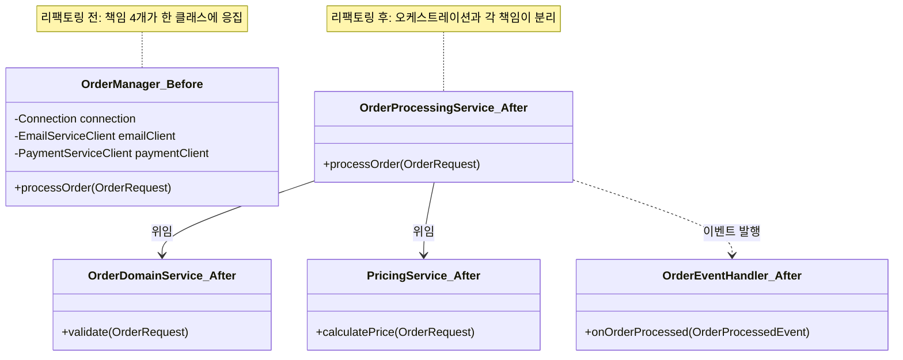

이 실습에서는 God Object 리팩토링, Spaghetti Code 정리, 안티패턴 탐지기 구현을 통해 나쁜 설계를 개선합니다.

## 실습 목표

1. God Object 리팩토링으로 단일 책임 원칙 적용
2. Spaghetti Code를 Command Pattern으로 정리
3. 안티패턴 탐지기 구현

## 과제 1: God Object 리팩토링

God Object는 "책임을 어디에 둘지 고민하지 않고 일단 기존 클래스에 추가"하는 판단이 쌓이면서 생깁니다. 리팩토링의 핵심은 코드를 예쁘게 자르는 것이 아니라, "이 로직은 누구의 책임인가"라는 질문에 따라 클래스를 나누는 것입니다. 아래 `OrderManager`는 도메인 로직·가격 계산·오케스트레이션·후속 처리(이메일, 배송)가 한 클래스에 섞여 있는 예시이며, 각 책임을 별도 서비스로 분리하는 것이 과제입니다.

### 문제 코드
```java
// 안티패턴: 모든 책임을 가진 거대한 OrderManager
public class OrderManager {
    // 데이터베이스, 외부 서비스, 비즈니스 로직이 모두 혼재
    private Connection connection;
    private EmailServiceClient emailClient;
    private PaymentServiceClient paymentClient;
    
    public void processOrder(OrderRequest request) throws Exception {
        // 500+ 줄의 복잡한 로직
        // 고객 검증, 재고 확인, 가격 계산, 결제, 저장, 이메일, 배송...
    }
}
```

### 리팩토링 과제
```java
// TODO: 책임별로 서비스 분리
@Service
public class OrderDomainService {
    // 순수 비즈니스 로직만
}

@Service 
public class PricingService {
    // 가격 계산 전담
}

@Service
public class OrderProcessingService {
    // 워크플로우 오케스트레이션
}

@EventListener
public class OrderEventHandler {
    // 이메일, 배송 등 후속 처리
}
```

### 리팩토링 전/후 구조 비교

리팩토링 전에는 `OrderManager` 하나가 DB 접근·이메일·결제·도메인 로직을 모두 직접 의존했지만, 리팩토링 후에는 오케스트레이션(`OrderProcessingService`)만 다른 서비스들을 알고 각 서비스는 자신의 책임에만 집중합니다.



## 과제 2: Command Pattern으로 Spaghetti Code 정리

`PaymentProcessor.processPayment()`의 문제는 각 결제 수단(신용카드, 직불카드)의 로직이 하나의 메서드 안에서 if-else로 분기하며 중첩된다는 점입니다. 새 결제 수단을 추가할 때마다 이 메서드를 열어 중첩을 한 단계 더 깊게 만들어야 합니다. Command Pattern은 결제 수단별 로직을 각각의 `PaymentCommand` 구현체로 독립시켜, 새 결제 수단 추가가 "새 클래스 하나 작성"으로 끝나도록 만듭니다.

### 문제 코드
```java
public class PaymentProcessor {
    public PaymentResult processPayment(PaymentRequest request) {
        // 깊은 중첩 조건문과 복잡한 분기 로직
        if (request != null) {
            if (request.getAmount() != null) {
                if ("CREDIT_CARD".equals(request.getPaymentMethod())) {
                    // 중첩된 조건들...
                } else if ("DEBIT_CARD".equals(request.getPaymentMethod())) {
                    // 또 다른 중첩...
                }
            }
        }
    }
}
```

### Command Pattern 적용
```java
// TODO: Command 인터페이스 정의
public interface PaymentCommand {
    PaymentResult execute(PaymentContext context);
    boolean canHandle(PaymentRequest request);
}

// TODO: 구체적인 Command들 구현
public class CreditCardPaymentCommand implements PaymentCommand {
    // 신용카드 결제 로직
}

public class DebitCardPaymentCommand implements PaymentCommand {
    // 직불카드 결제 로직  
}

// TODO: Command 실행 엔진
@Service
public class PaymentProcessor {
    private final List<PaymentCommand> commands;
    
    public PaymentResult processPayment(PaymentRequest request) {
        PaymentCommand command = findCommand(request);
        return command.execute(createContext(request));
    }
}
```

## 과제 3: 안티패턴 탐지기 구현

정적 분석 도구(SonarQube, PMD 등)가 코드 스멜을 찾는 방식의 핵심은 리플렉션이나 AST(추상 구문 트리) 순회로 클래스 구조를 읽고, 미리 정한 임계값(파라미터 5개 이상, getter/setter만 있는 클래스 등)을 넘는 경우를 보고하는 것입니다. `LongParameterListDetector`와 `DataClassDetector`는 리플렉션만으로 구현 가능한 탐지기이므로 아래에 완성된 구현을 제공합니다. `FeatureEnvyDetector`는 같은 패턴(리플렉션으로 구조를 읽고 임계값과 비교)을 참고해 직접 채워보세요.

### 기본 구조
```java
public class CodeSmell {
    private final String type;
    private final String location;
    private final String detail;

    public CodeSmell(String type, String location, String detail) {
        this.type = type;
        this.location = location;
        this.detail = detail;
    }

    @Override
    public String toString() {
        return String.format("[%s] %s - %s", type, location, detail);
    }
}

public interface AntiPatternDetector {
    List<CodeSmell> detect(Class<?> clazz);
}

// Long Parameter List 탐지: 파라미터 수가 MAX_PARAMETERS를 초과하는 메서드를 리플렉션으로 스캔
public class LongParameterListDetector implements AntiPatternDetector {
    private static final int MAX_PARAMETERS = 5;

    @Override
    public List<CodeSmell> detect(Class<?> clazz) {
        List<CodeSmell> smells = new ArrayList<>();
        for (Method method : clazz.getDeclaredMethods()) {
            int paramCount = method.getParameterCount();
            if (paramCount > MAX_PARAMETERS) {
                smells.add(new CodeSmell(
                    "LongParameterList",
                    clazz.getSimpleName() + "#" + method.getName(),
                    "파라미터 " + paramCount + "개 (임계값 " + MAX_PARAMETERS + "개 초과)"
                ));
            }
        }
        return smells;
    }
}

// Data Class 탐지: 모든 메서드가 getter/setter(또는 Object 메서드)뿐이고 비즈니스 로직이 없는 클래스를 찾는다
public class DataClassDetector implements AntiPatternDetector {
    private static final Set<String> OBJECT_METHOD_NAMES = Set.of("equals", "hashCode", "toString");

    @Override
    public List<CodeSmell> detect(Class<?> clazz) {
        List<CodeSmell> smells = new ArrayList<>();
        Method[] methods = clazz.getDeclaredMethods();
        if (methods.length == 0 || clazz.getDeclaredFields().length == 0) {
            return smells; // 필드나 메서드가 없으면 판단 대상이 아님
        }

        boolean hasBusinessLogic = false;
        for (Method method : methods) {
            if (method.isSynthetic() || OBJECT_METHOD_NAMES.contains(method.getName())) {
                continue;
            }
            if (isGetter(method) || isSetter(method)) {
                continue;
            }
            hasBusinessLogic = true;
            break;
        }

        if (!hasBusinessLogic) {
            smells.add(new CodeSmell(
                "DataClass",
                clazz.getSimpleName(),
                "getter/setter 외 비즈니스 로직이 없음 (필드 " + clazz.getDeclaredFields().length + "개)"
            ));
        }
        return smells;
    }

    private boolean isGetter(Method method) {
        String name = method.getName();
        boolean namedLikeGetter = name.startsWith("get") || name.startsWith("is");
        return namedLikeGetter && method.getParameterCount() == 0 && method.getReturnType() != void.class;
    }

    private boolean isSetter(Method method) {
        return method.getName().startsWith("set")
            && method.getParameterCount() == 1
            && method.getReturnType() == void.class;
    }
}

// TODO: Feature Envy 탐지  
public class FeatureEnvyDetector implements AntiPatternDetector {
    public List<CodeSmell> detect(Class<?> clazz) {
        // 다른 클래스 데이터를 과도하게 사용하는 메서드 찾기
        return null;
    }
}
```

### 분석 엔진
```java
public class AntiPatternAnalyzer {
    private final List<AntiPatternDetector> detectors;
    
    public AnalysisReport analyzeCodebase(String packageName) {
        // TODO: 패키지 스캔하여 모든 안티패턴 탐지
        // 1. 클래스 목록 수집
        // 2. 각 탐지기 실행
        // 3. 결과 취합 및 리포트 생성
        return null;
    }
}
```

## 완성도 체크리스트

- [ ] **책임별로 클래스가 분리되었는가** — `OrderDomainService`(도메인 로직), `PricingService`(가격 계산), `OrderProcessingService`(오케스트레이션)가 서로의 코드를 몰라도 각자 테스트할 수 있는지 확인합니다.
- [ ] **의존성이 생성자 주입으로 연결되는가** — `new`로 직접 생성하지 않고 인터페이스를 주입받아, 테스트에서 목(mock)으로 교체 가능한지 확인합니다.
- [ ] **후속 처리가 이벤트로 분리되었는가** — 이메일·배송 처리가 이벤트 핸들러에서 비동기로 실행되어, 주문 확정 자체가 후속 처리 실패에 영향받지 않는지 확인합니다.
- [ ] **Command Pattern이 조건문을 실제로 없앴는가** — `PaymentProcessor.processPayment()`에 `if (X.equals(paymentMethod))` 형태의 분기가 남아 있지 않은지, `findCommand()`가 그 역할을 대신하는지 확인합니다.
- [ ] **탐지기가 오탐(false positive) 없이 임계값을 적용하는가** — `LongParameterListDetector`처럼 `MAX_PARAMETERS` 같은 명확한 기준으로 판단하며, 주관적 판단 없이 재현 가능한 결과를 내는지 확인합니다.
- [ ] **분석 결과가 우선순위와 함께 리포트되는가** — 탐지된 안티패턴이 단순 목록이 아니라 심각도·발생 위치와 함께 정리되어, 어디부터 고칠지 판단할 수 있는지 확인합니다.

## 판단 기준: 언제 리팩토링하지 않아야 하는가

리팩토링은 항상 이득이 아닙니다. 아래 경우에는 이번 실습의 리팩토링을 그대로 적용하기 전에 다시 판단해야 합니다.

- **곧 폐기될 코드라면 God Object를 그대로 둘 수 있습니다.** `OrderManager`가 몇 주 안에 신규 서비스로 완전히 대체될 예정이라면, 분리 작업에 드는 시간이 남은 수명 대비 낭비일 수 있습니다.
- **호출 지점이 1~2곳뿐인 조건 분기는 Command Pattern이 과할 수 있습니다.** 결제 수단이 신용카드 하나뿐이라면 `PaymentCommand` 인터페이스·구현체·탐색 로직을 도입하는 비용이 단순 if문 하나보다 큽니다.
- **탐지기의 임계값(`MAX_PARAMETERS = 5`)은 팀·도메인마다 달라야 합니다.** Builder로 파라미터를 객체 하나로 감싼 메서드는 파라미터가 5개를 넘어도 문제가 아닐 수 있으므로, 탐지 결과를 기계적으로 따르지 말고 맥락을 함께 봐야 합니다.
- **테스트가 없는 상태에서의 대규모 리팩토링은 위험합니다.** God Object를 여러 서비스로 쪼개기 전에 최소한의 회귀 테스트를 먼저 작성해, 리팩토링이 동작을 바꾸지 않았음을 검증할 수 있어야 합니다.

## 추가 도전 과제

1. **정적 분석 도구 통합** - SonarQube, PMD 연계
2. **IDE 플러그인 개발** - 실시간 코드 분석
3. **CI/CD 통합** - 품질 게이트 적용
4. **머신러닝 탐지** - 패턴 학습 기반 분석

## 실무 적용

### Strangler Fig Pattern
```java
@Service
public class ServiceFacade {
    // 점진적 레거시 교체
    private final LegacyService legacyService;
    private final NewService newService;
    
    public Result process(Request request) {
        if (shouldUseNewService(request)) {
            return newService.process(request);
        }
        return legacyService.process(request);
    }
}
```

## 평가 기준

이 실습을 완료했다면 다음을 스스로 설명할 수 있어야 합니다.

- `OrderManager`를 `OrderDomainService`/`PricingService`/`OrderProcessingService`/`OrderEventHandler`로 나눈 기준이 "코드 줄 수를 균등하게 자르기"가 아니라 "누구의 책임인가"였음을 리팩토링 전/후 구조 비교로 설명할 수 있다.
- `PaymentCommand`로 분리한 뒤 새 결제 수단을 추가할 때 기존 `PaymentProcessor` 코드를 왜 수정할 필요가 없는지(개방-폐쇄 원칙) 설명할 수 있다.
- `LongParameterListDetector`와 `DataClassDetector`가 공유하는 탐지 패턴(리플렉션으로 구조를 읽고 고정 임계값과 비교)을 `FeatureEnvyDetector` 구현에 그대로 적용할 수 있다.
- "판단 기준" 절에서 제시한 4가지 경우 중 최소 하나를 근거로, 이번 실습의 리팩토링을 적용하지 말아야 할 상황을 스스로 만들어 설명할 수 있다.

## 참고 자료

- **도서**: "Refactoring to Patterns" by Joshua Kerievsky (2004) — 코드 스멜을 구체적인 GoF 패턴으로 치환하는 리팩토링 카탈로그.
- **도서**: "Refactoring: Improving the Design of Existing Code" by Martin Fowler (2nd ed., 2018)
- **온라인**: [Refactoring Guru - Code Smells](https://refactoring.guru/refactoring/smells)
- **도구**: SonarQube, PMD, SpotBugs

---

**실습 팁**
- 작은 단위로 점진적 리팩토링
- 테스트 코드 먼저 작성
- 정적 분석 도구 적극 활용
- 팀 코딩 표준 준수 