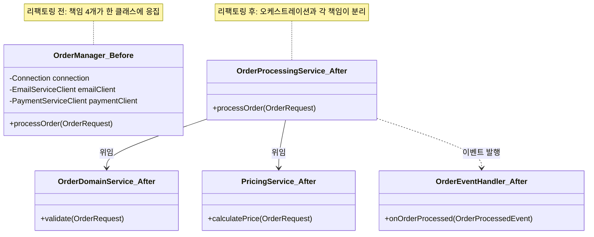
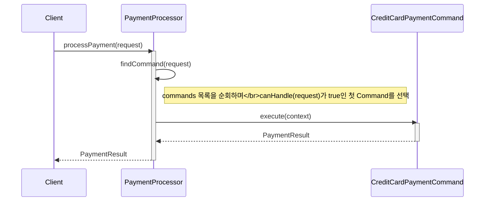
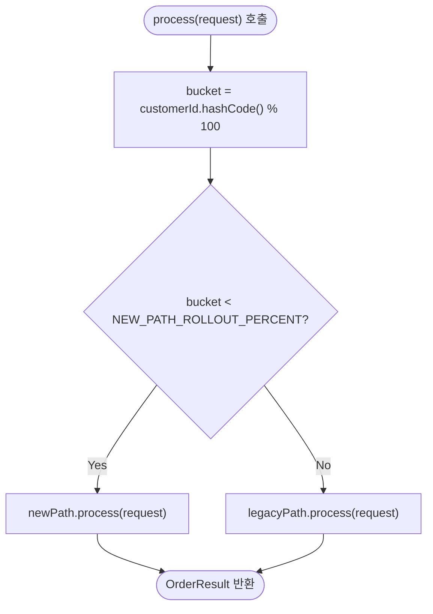

이 실습에서는 God Object 리팩토링, Spaghetti Code 정리, 안티패턴 탐지기 구현을 통해 나쁜 설계를 개선합니다.

## 실습 목표

1. God Object 리팩토링으로 단일 책임 원칙 적용
2. Spaghetti Code를 Command Pattern으로 정리
3. 안티패턴 탐지기 구현

## 과제 1: God Object 리팩토링

God Object는 "책임을 어디에 둘지 고민하지 않고 일단 기존 클래스에 추가"하는 판단이 쌓이면서 생깁니다. 리팩토링의 핵심은 코드를 예쁘게 자르는 것이 아니라, "이 로직은 누구의 책임인가"라는 질문에 따라 클래스를 나누는 것입니다. 아래 `OrderManager`는 도메인 로직·가격 계산·오케스트레이션·후속 처리(이메일, 배송)가 한 클래스에 섞여 있는 예시이며, 각 책임을 별도 서비스로 분리하는 것이 과제입니다.

### 문제 코드
```java
// 안티패턴: 모든 책임을 가진 거대한 OrderManager
public class OrderManager {
    // 데이터베이스, 외부 서비스, 비즈니스 로직이 모두 혼재
    private Connection connection;
    private EmailServiceClient emailClient;
    private PaymentServiceClient paymentClient;
    
    public void processOrder(OrderRequest request) throws Exception {
        // 500+ 줄의 복잡한 로직
        // 고객 검증, 재고 확인, 가격 계산, 결제, 저장, 이메일, 배송...
    }
}
```

### 사용된 타입 정의

`OrderManager`가 의존하는 타입 중 `OrderRequest`는 이 실습 전체(과제 1의 God Object, 뒤의 Strangler Fig 절)에서 재사용하는 최소 필드 스텁입니다. `Connection`은 `java.sql.Connection`(JDK 표준)을 그대로 사용하고, `EmailServiceClient`·`PaymentServiceClient`는 실제 프로젝트에서 사내 SDK나 외부 게이트웨이 라이브러리가 제공한다고 가정하는 가상 타입입니다.

```java
import java.sql.Connection;

// 이 실습 전체에서 재사용하는 최소 스텁 (뒤의 Strangler Fig 절에서도 동일 타입을 사용)
public record OrderRequest(String orderId, String customerId, long amountInCents) {}

// 가상 타입: 사내 이메일 발송 SDK가 제공한다고 가정
public interface EmailServiceClient {
    void sendOrderConfirmation(String customerId, String orderId);
}

// 가상 타입: 외부 결제 게이트웨이 SDK가 제공한다고 가정
public interface PaymentServiceClient {
    boolean charge(String customerId, long amountInCents);
}
```

### 리팩토링 과제
```java
// TODO: 책임별로 서비스 분리
@Service
public class OrderDomainService {
    // 순수 비즈니스 로직만
}

@Service 
public class PricingService {
    // 가격 계산 전담
}

@Service
public class OrderProcessingService {
    // 워크플로우 오케스트레이션
}

@EventListener
public class OrderEventHandler {
    // 이메일, 배송 등 후속 처리
}
```

### 리팩토링 전/후 구조 비교

리팩토링 전에는 `OrderManager` 하나가 DB 접근·이메일·결제·도메인 로직을 모두 직접 의존했지만, 리팩토링 후에는 오케스트레이션(`OrderProcessingService`)만 다른 서비스들을 알고 각 서비스는 자신의 책임에만 집중합니다.



## 과제 2: Command Pattern으로 Spaghetti Code 정리

`PaymentProcessor.processPayment()`의 문제는 각 결제 수단(신용카드, 직불카드)의 로직이 하나의 메서드 안에서 if-else로 분기하며 중첩된다는 점입니다. 새 결제 수단을 추가할 때마다 이 메서드를 열어 중첩을 한 단계 더 깊게 만들어야 합니다. Command Pattern은 결제 수단별 로직을 각각의 `PaymentCommand` 구현체로 독립시켜, 새 결제 수단 추가가 "새 클래스 하나 작성"으로 끝나도록 만듭니다.

### 문제 코드
```java
public class PaymentProcessor {
    public PaymentResult processPayment(PaymentRequest request) {
        // 깊은 중첩 조건문과 복잡한 분기 로직
        if (request != null) {
            if (request.getAmount() != null) {
                if ("CREDIT_CARD".equals(request.getPaymentMethod())) {
                    // 중첩된 조건들...
                } else if ("DEBIT_CARD".equals(request.getPaymentMethod())) {
                    // 또 다른 중첩...
                }
            }
        }
    }
}
```

### 사용된 타입 정의

문제 코드가 `request.getAmount()`, `request.getPaymentMethod()`를 호출하므로 `PaymentRequest`는 record가 아니라 해당 getter를 가진 클래스로 정의해야 문제 코드와 리팩토링 코드가 모두 컴파일됩니다. `PaymentResult`는 성공/실패를 표현하는 최소 스텁이며, `PaymentContext`는 Command가 실행에 필요한 부가 정보(멱등성 키 등)를 담는 가상 타입으로 가정합니다.

```java
public class PaymentRequest {
    private final String paymentMethod;
    private final java.math.BigDecimal amount;
    private final String customerId;

    public PaymentRequest(String paymentMethod, java.math.BigDecimal amount, String customerId) {
        this.paymentMethod = paymentMethod;
        this.amount = amount;
        this.customerId = customerId;
    }

    public String getPaymentMethod() { return paymentMethod; }
    public java.math.BigDecimal getAmount() { return amount; }
    public String getCustomerId() { return customerId; }
}

public record PaymentResult(boolean approved, String transactionId, String message) {
    public static PaymentResult approved(String transactionId) {
        return new PaymentResult(true, transactionId, "");
    }
    public static PaymentResult declined(String message) {
        return new PaymentResult(false, null, message);
    }
}

// 가상 타입: 결제 게이트웨이 클라이언트, 멱등성 키 등 실행 부가 정보를 담는다고 가정
public record PaymentContext(PaymentRequest request, String idempotencyKey) {}
```

### Command Pattern 적용
```java
// TODO: Command 인터페이스 정의
public interface PaymentCommand {
    PaymentResult execute(PaymentContext context);
    boolean canHandle(PaymentRequest request);
}

// TODO: 구체적인 Command들 구현
public class CreditCardPaymentCommand implements PaymentCommand {
    // 신용카드 결제 로직
}

public class DebitCardPaymentCommand implements PaymentCommand {
    // 직불카드 결제 로직  
}

// TODO: Command 실행 엔진
@Service
public class PaymentProcessor {
    private final List<PaymentCommand> commands;
    
    public PaymentResult processPayment(PaymentRequest request) {
        PaymentCommand command = findCommand(request);
        return command.execute(createContext(request));
    }
}
```

### 실행 흐름

리팩토링 전에는 `processPayment()` 내부의 if-else가 결제 수단 판단과 결제 실행을 한 메서드 안에 뒤섞어 처리했지만, 리팩토링 후에는 `findCommand()`가 판단만 전담하고 실제 결제 로직은 선택된 `PaymentCommand` 구현체의 `execute()`로 위임됩니다. 아래 시퀀스 다이어그램은 `request.getPaymentMethod()`가 `"CREDIT_CARD"`일 때 `findCommand()`가 `CreditCardPaymentCommand`를 골라 실행을 위임하는 흐름을 보여줍니다.



새 결제 수단(예: 계좌이체)을 추가할 때는 `TransferPaymentCommand`를 새로 작성해 `commands` 목록에 등록하기만 하면 되고, `findCommand()`나 `processPayment()`는 전혀 수정하지 않습니다. 이것이 개방-폐쇄 원칙(OCP)이 이 다이어그램에서 실제로 성립하는 지점입니다.

## 과제 3: 안티패턴 탐지기 구현

정적 분석 도구(SonarQube, PMD 등)가 코드 스멜을 찾는 방식의 핵심은 리플렉션이나 AST(추상 구문 트리) 순회로 클래스 구조를 읽고, 미리 정한 임계값(파라미터 5개 이상, getter/setter만 있는 클래스 등)을 넘는 경우를 보고하는 것입니다. `LongParameterListDetector`와 `DataClassDetector`는 리플렉션만으로 구현 가능한 탐지기이므로 아래에 완성된 구현을 제공합니다. `FeatureEnvyDetector`는 같은 패턴(리플렉션으로 구조를 읽고 임계값과 비교)을 참고해 직접 채워보세요.

**흔한 오개념: "탐지기가 잡으면 무조건 버그다."** `LongParameterListDetector`가 `CodeSmell`을 반환했다고 해서 그 메서드가 반드시 즉시 고쳐야 할 결함이라는 뜻은 아닙니다. 탐지기는 `MAX_PARAMETERS = 5`라는 고정 임계값을 기계적으로 적용할 뿐이며, 임계값을 넘었다는 사실 자체는 "검토가 필요하다"는 신호이지 "결함이 확정됐다"는 판정이 아닙니다. 뒤의 "판단 기준" 절에서 다루듯, 파라미터를 Builder 객체 하나로 감싼 메서드는 실제 파라미터 개수가 5개를 넘어도 문제로 보기 어려운 경우가 많습니다. 탐지 결과를 리포트에 그대로 노출하기 전에 이런 맥락을 반영하지 않으면, 팀은 오탐을 반복적으로 무시하게 되고 결국 탐지기 자체를 신뢰하지 않게 됩니다.

### 기본 구조
```java
import java.lang.reflect.Method;
import java.util.ArrayList;
import java.util.List;
import java.util.Set;

public class CodeSmell {
    private final String type;
    private final String location;
    private final String detail;

    public CodeSmell(String type, String location, String detail) {
        this.type = type;
        this.location = location;
        this.detail = detail;
    }

    @Override
    public String toString() {
        return String.format("[%s] %s - %s", type, location, detail);
    }
}

public interface AntiPatternDetector {
    List<CodeSmell> detect(Class<?> clazz);
}

// Long Parameter List 탐지: 파라미터 수가 MAX_PARAMETERS를 초과하는 메서드를 리플렉션으로 스캔
public class LongParameterListDetector implements AntiPatternDetector {
    private static final int MAX_PARAMETERS = 5;

    @Override
    public List<CodeSmell> detect(Class<?> clazz) {
        List<CodeSmell> smells = new ArrayList<>();
        for (Method method : clazz.getDeclaredMethods()) {
            int paramCount = method.getParameterCount();
            if (paramCount > MAX_PARAMETERS) {
                smells.add(new CodeSmell(
                    "LongParameterList",
                    clazz.getSimpleName() + "#" + method.getName(),
                    "파라미터 " + paramCount + "개 (임계값 " + MAX_PARAMETERS + "개 초과)"
                ));
            }
        }
        return smells;
    }
}

// Data Class 탐지: 모든 메서드가 getter/setter(또는 Object 메서드)뿐이고 비즈니스 로직이 없는 클래스를 찾는다
public class DataClassDetector implements AntiPatternDetector {
    private static final Set<String> OBJECT_METHOD_NAMES = Set.of("equals", "hashCode", "toString");

    @Override
    public List<CodeSmell> detect(Class<?> clazz) {
        List<CodeSmell> smells = new ArrayList<>();
        Method[] methods = clazz.getDeclaredMethods();
        if (methods.length == 0 || clazz.getDeclaredFields().length == 0) {
            return smells; // 필드나 메서드가 없으면 판단 대상이 아님
        }

        boolean hasBusinessLogic = false;
        for (Method method : methods) {
            if (method.isSynthetic() || OBJECT_METHOD_NAMES.contains(method.getName())) {
                continue;
            }
            if (isGetter(method) || isSetter(method)) {
                continue;
            }
            hasBusinessLogic = true;
            break;
        }

        if (!hasBusinessLogic) {
            smells.add(new CodeSmell(
                "DataClass",
                clazz.getSimpleName(),
                "getter/setter 외 비즈니스 로직이 없음 (필드 " + clazz.getDeclaredFields().length + "개)"
            ));
        }
        return smells;
    }

    private boolean isGetter(Method method) {
        String name = method.getName();
        boolean namedLikeGetter = name.startsWith("get") || name.startsWith("is");
        return namedLikeGetter && method.getParameterCount() == 0 && method.getReturnType() != void.class;
    }

    private boolean isSetter(Method method) {
        return method.getName().startsWith("set")
            && method.getParameterCount() == 1
            && method.getReturnType() == void.class;
    }
}

// TODO: Feature Envy 탐지  
public class FeatureEnvyDetector implements AntiPatternDetector {
    public List<CodeSmell> detect(Class<?> clazz) {
        // 다른 클래스 데이터를 과도하게 사용하는 메서드 찾기
        return null;
    }
}
```

### 분석 엔진
```java
public class AntiPatternAnalyzer {
    private final List<AntiPatternDetector> detectors;
    
    public AnalysisReport analyzeCodebase(String packageName) {
        // TODO: 패키지 스캔하여 모든 안티패턴 탐지
        // 1. 클래스 목록 수집
        // 2. 각 탐지기 실행
        // 3. 결과 취합 및 리포트 생성
        return null;
    }
}
```

## 완성도 체크리스트

- [ ] **책임별로 클래스가 분리되었는가** — `OrderDomainService`(도메인 로직), `PricingService`(가격 계산), `OrderProcessingService`(오케스트레이션)가 서로의 코드를 몰라도 각자 테스트할 수 있는지 확인합니다.
- [ ] **의존성이 생성자 주입으로 연결되는가** — `new`로 직접 생성하지 않고 인터페이스를 주입받아, 테스트에서 목(mock)으로 교체 가능한지 확인합니다.
- [ ] **후속 처리가 이벤트로 분리되었는가** — 이메일·배송 처리가 이벤트 핸들러에서 비동기로 실행되어, 주문 확정 자체가 후속 처리 실패에 영향받지 않는지 확인합니다.
- [ ] **Command Pattern이 조건문을 실제로 없앴는가** — `PaymentProcessor.processPayment()`에 `if (X.equals(paymentMethod))` 형태의 분기가 남아 있지 않은지, `findCommand()`가 그 역할을 대신하는지 확인합니다.
- [ ] **탐지기가 오탐(false positive) 없이 임계값을 적용하는가** — `LongParameterListDetector`처럼 `MAX_PARAMETERS` 같은 명확한 기준으로 판단하며, 주관적 판단 없이 재현 가능한 결과를 내는지 확인합니다.
- [ ] **분석 결과가 우선순위와 함께 리포트되는가** — 탐지된 안티패턴이 단순 목록이 아니라 심각도·발생 위치와 함께 정리되어, 어디부터 고칠지 판단할 수 있는지 확인합니다.

## 판단 기준: 언제 리팩토링하지 않아야 하는가

리팩토링은 항상 이득이 아닙니다. 아래 경우에는 이번 실습의 리팩토링을 그대로 적용하기 전에 다시 판단해야 합니다.

- **곧 폐기될 코드라면 God Object를 그대로 둘 수 있습니다.** `OrderManager`가 몇 주 안에 신규 서비스로 완전히 대체될 예정이라면, 분리 작업에 드는 시간이 남은 수명 대비 낭비일 수 있습니다.
- **호출 지점이 1–2곳뿐인 조건 분기는 Command Pattern이 과할 수 있습니다.** 결제 수단이 신용카드 하나뿐이라면 `PaymentCommand` 인터페이스·구현체·탐색 로직을 도입하는 비용이 단순 if문 하나보다 큽니다.
- **탐지기의 임계값(`MAX_PARAMETERS = 5`)은 팀·도메인마다 달라야 합니다.** Builder로 파라미터를 객체 하나로 감싼 메서드는 파라미터가 5개를 넘어도 문제가 아닐 수 있으므로, 탐지 결과를 기계적으로 따르지 말고 맥락을 함께 봐야 합니다.
- **테스트가 없는 상태에서의 대규모 리팩토링은 위험합니다.** God Object를 여러 서비스로 쪼개기 전에 최소한의 회귀 테스트를 먼저 작성해, 리팩토링이 동작을 바꾸지 않았음을 검증할 수 있어야 합니다.

## 추가 도전 과제

과제 3의 탐지기를 실무 도구로 확장하려면 네 방향을 검토할 수 있습니다. 먼저 정적 분석 도구 통합 방향에서는, `LongParameterListDetector`가 런타임 리플렉션(`Class.getDeclaredMethods()`)으로 컴파일된 클래스를 검사하는 것과 달리 SonarQube Custom Rule은 `org.sonar.plugins.java.api` 패키지의 AST 방문자(`JavaCheck`/`BaseTreeVisitor`)로 컴파일 이전의 소스 구문 트리를 순회하므로, 리플렉션 기반 탐지 로직은 그대로 재사용할 수 없고 `visitMethod(MethodTree)`에서 파라미터 목록을 세는 방식으로 다시 작성해야 포팅이 가능합니다. IDE 플러그인 개발 방향에서는 `AntiPatternAnalyzer.analyzeCodebase()`의 스캔 범위를 파일 저장 시점에 변경된 클래스 하나로 좁히면, 커밋 이후가 아니라 타이핑 도중에 `DataClassDetector` 경고를 인라인으로 띄우는 실시간 검사기로 바꿀 수 있습니다. CI/CD 통합 방향에서는 `AnalysisReport`에 감점 임계값(예: `LongParameterList` 경고가 3건을 넘으면 빌드 실패)을 부여해 품질 게이트로 연결하면, `PaymentProcessor`가 다시 중첩 조건문으로 회귀하는 변경을 리뷰 이전 단계에서 막을 수 있습니다. 마지막으로 머신러닝 탐지 방향은 `FeatureEnvyDetector`처럼 임계값을 사람이 정하기 어려운 항목에 적합한데, 리팩토링 전/후로 라벨링된 코드 쌍을 학습 데이터로 삼아 패턴을 학습시키되 오탐률을 별도로 검증하지 않고 그대로 게이트에 연동해서는 안 됩니다.

## 실무 적용: God Object 마이그레이션을 Strangler Fig로 점진 전환

과제 1의 `OrderManager` 분리는 코드만 나누면 끝나는 작업이 아닙니다. 실무에서는 리팩토링한 `OrderProcessingService`를 운영 트래픽에 한 번에 투입하지 않습니다. 새 구현에 숨은 버그가 있다면 전체 주문이 동시에 실패하기 때문입니다. Strangler Fig Pattern은 레거시 `OrderManager`와 신규 서비스를 같은 인터페이스 뒤에 두고, 트래픽 일부만 신규 경로로 흘려보내며 점검한 뒤 비율을 서서히 늘려 완전히 교체하는 전략입니다. 아래 예시는 고객 ID를 기준으로 라우팅을 고정해, 같은 고객이 매 요청마다 다른 경로를 타지 않도록(장애 원인 추적이 어려워지는 것을 방지) 구현한 것입니다.

```java
package com.example.orders.migration;

import org.springframework.stereotype.Service;

// 과제 1의 OrderRequest를 그대로 사용: 주문 처리에 필요한 최소 정보
public record OrderRequest(String orderId, String customerId, long amountInCents) {}

// 처리 결과. status는 "COMPLETED" 또는 "FAILED"만 허용
public record OrderResult(String orderId, String status, String message) {
    public static OrderResult success(String orderId) {
        return new OrderResult(orderId, "COMPLETED", "");
    }
}

// 리팩토링 전 경로: 과제 1의 God Object OrderManager를 그대로 감싼 어댑터
public interface LegacyOrderPath {
    OrderResult process(OrderRequest request);
}

// 리팩토링 후 경로: 과제 1에서 분리한 OrderProcessingService를 감싼 어댑터
public interface NewOrderPath {
    OrderResult process(OrderRequest request);
}

@Service
public class OrderServiceFacade {
    // 신규 경로로 보낼 트래픽 비율(%). 장애 없이 안정화되면 서서히 100까지 올린다
    private static final int NEW_PATH_ROLLOUT_PERCENT = 20;

    private final LegacyOrderPath legacyPath;
    private final NewOrderPath newPath;

    public OrderServiceFacade(LegacyOrderPath legacyPath, NewOrderPath newPath) {
        this.legacyPath = legacyPath;
        this.newPath = newPath;
    }

    public OrderResult process(OrderRequest request) {
        if (shouldRouteToNewPath(request)) {
            return newPath.process(request);
        }
        return legacyPath.process(request);
    }

    // 고객 ID 해시로 버킷을 고정해, 동일 고객은 항상 같은 경로로만 라우팅되게 한다
    private boolean shouldRouteToNewPath(OrderRequest request) {
        int bucket = Math.floorMod(request.customerId().hashCode(), 100);
        return bucket < NEW_PATH_ROLLOUT_PERCENT;
    }
}
```

`NEW_PATH_ROLLOUT_PERCENT`는 배포 설정이 아니라 상수로 두었는데, 이는 롤아웃 비율 변경도 코드 리뷰를 거쳐야 하는 결정이라는 점을 강조하기 위함입니다. 운영 환경에서는 이 값을 외부 설정(Feature Flag 서비스)으로 빼되, 변경 이력이 남도록 관리해야 합니다.

### 라우팅 결정 흐름

`OrderServiceFacade.process()`가 요청마다 신규 경로와 레거시 경로 중 하나를 고르는 기준은 `shouldRouteToNewPath()`가 계산하는 해시 버킷 하나뿐입니다. 아래 흐름도는 `customerId`의 해시값을 100으로 나눈 나머지(`bucket`)가 `NEW_PATH_ROLLOUT_PERCENT`보다 작은지에 따라 두 경로로 갈리는 과정을 보여줍니다.



`customerId`가 같은 요청은 항상 같은 `bucket` 값을 얻으므로 매번 같은 분기를 타며, `NEW_PATH_ROLLOUT_PERCENT`를 20에서 50으로 올리면 이 흐름도의 조건 판단 기준값만 바뀌고 두 경로(`newPath`, `legacyPath`)의 구현이나 `OrderServiceFacade`의 나머지 코드는 그대로 유지됩니다.

## 평가 기준

이 실습을 완료했다면 다음을 스스로 설명할 수 있어야 합니다.

- `OrderManager`를 `OrderDomainService`/`PricingService`/`OrderProcessingService`/`OrderEventHandler`로 나눈 기준이 "코드 줄 수를 균등하게 자르기"가 아니라 "누구의 책임인가"였음을 리팩토링 전/후 구조 비교로 설명할 수 있다.
- `PaymentCommand`로 분리한 뒤 새 결제 수단을 추가할 때 기존 `PaymentProcessor` 코드를 왜 수정할 필요가 없는지(개방-폐쇄 원칙) 설명할 수 있다.
- `LongParameterListDetector`와 `DataClassDetector`가 공유하는 탐지 패턴(리플렉션으로 구조를 읽고 고정 임계값과 비교)을 `FeatureEnvyDetector` 구현에 그대로 적용할 수 있다.
- "판단 기준" 절에서 제시한 4가지 경우 중 최소 하나를 근거로, 이번 실습의 리팩토링을 적용하지 말아야 할 상황을 스스로 만들어 설명할 수 있다.

## 참고 자료

- **도서**: "Refactoring to Patterns" by Joshua Kerievsky (2004) — 코드 스멜을 구체적인 GoF 패턴으로 치환하는 리팩토링 카탈로그.
- **도서**: "Refactoring: Improving the Design of Existing Code" by Martin Fowler (2nd ed., 2018)
- **온라인**: [Refactoring Guru - Code Smells](https://refactoring.guru/refactoring/smells)
- **도구**: SonarQube, PMD, SpotBugs

---

**실습 팁**

이 세 과제를 실제로 손에 익히려면 순서가 중요합니다. `OrderManager`를 한 번에 4개 서비스로 쪼개기보다 도메인 로직(`OrderDomainService`)부터 분리해 테스트를 통과시킨 뒤 `PricingService`를 떼어내는 식으로, 매 단계마다 컴파일과 테스트가 통과하는 상태를 유지하며 진행해야 중간에 되돌리기 쉽습니다. `PaymentProcessor`를 Command Pattern으로 바꾸기 전에는 기존 if-else 분기의 신용카드/직불카드 케이스를 검증하는 회귀 테스트를 먼저 작성해두어야, `CreditCardPaymentCommand`로 로직을 옮긴 뒤에도 동작이 그대로인지 즉시 확인할 수 있습니다. `LongParameterListDetector`와 `DataClassDetector`는 실제 프로젝트 코드에 먼저 돌려 오탐이 나는 클래스가 있는지 확인한 뒤에 `FeatureEnvyDetector` 구현 방향을 정하면 탐지 기준을 프로젝트 관례에 맞출 수 있습니다. 마지막으로 `MAX_PARAMETERS = 5`나 `NEW_PATH_ROLLOUT_PERCENT = 20` 같은 임계값은 개인 판단이 아니라 팀이 합의한 코딩 표준 문서에 근거를 남겨두어야, 나중에 왜 5인지·왜 20인지에 대한 논쟁이 재발하지 않습니다. 