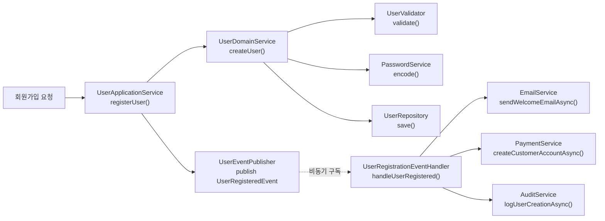
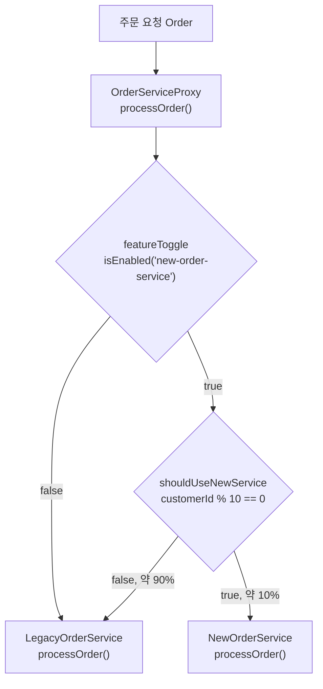

실무에서 자주 발생하는 안티패턴을 식별하고 체계적인 리팩토링 방법을 탐구합니다. 코드 스멜, 설계 부채, 패턴 남용의 문제를 해결하는 방법을 학습합니다.

## 서론: 나쁜 설계 패턴의 역설

> *"모든 좋은 패턴에는 그림자가 있다. 잘못 사용된 패턴은 코드를 더 복잡하게 만들고, 오히려 유지보수를 어렵게 한다."*

안티패턴(Anti-pattern)은 **겉보기에는 문제를 해결하는 것처럼 보이지만, 실제로는 더 큰 문제를 만드는 설계 방식**입니다. 이 글에서는 실무에서 자주 발생하는 안티패턴들을 식별하고, 체계적인 리팩토링 방법을 제시합니다.

### 안티패턴 식별의 핵심 관점
- **코드 스멜(Code Smell)**: 즉각적인 문제 징후
- **설계 부채(Design Debt)**: 장기적 유지보수 비용
- **패턴 오남용**: 적절한 맥락이 아닌 곳에서의 패턴 사용
- **과도한 추상화**: 불필요한 복잡성 증가

### 흔한 오해: 안티패턴은 처음부터 나쁜 코드다

안티패턴을 "처음부터 잘못 설계된 코드"로 오해하기 쉽지만, 실제로는 그 반대인 경우가 더 많습니다. 아래 God Object 예시의 `UserManager`도 처음에는 사용자 생성 메서드 하나짜리 작고 멀쩡한 클래스였을 가능성이 높습니다. 매 스프린트마다 "일단 여기 추가하자"는 합리적으로 보이는 선택이 누적되면서, 각 시점의 결정은 국소적으로 타당했지만 전체 결과는 God Object가 되는 것입니다. 이는 God Object가 한 번의 실수가 아니라 여러 번의 작은 타협이 쌓인 결과임을 뜻하며, 따라서 리팩토링도 "처음부터 다시 설계"가 아니라 그 타협들을 하나씩 되짚어 되돌리는 점진적 작업이어야 합니다.

## 주요 안티패턴 분석

### God Object (신 객체)

God Object는 "일단 여기에 추가하면 편하니까"라는 판단이 반복되면서 만들어집니다. 새 기능이 필요할 때마다 기존 클래스에 필드와 메서드를 얹는 쪽이, 새 클래스를 만들고 의존성을 연결하는 것보다 눈앞에서는 더 빨라 보이기 때문입니다. 그 결과 한 클래스가 데이터베이스 접근, 비즈니스 규칙, 외부 서비스 연동까지 모두 떠안게 되며, 이는 단일 책임 원칙(SRP) 위반의 가장 전형적인 형태입니다. Martin Fowler는 이런 축적형 코드 스멜을 *Refactoring: Improving the Design of Existing Code*(2nd ed., 2018)에서 "Large Class"로 분류하고, 책임이 늘어날 때마다 즉시 Extract Class로 분리할 것을 권고합니다. 아래 `UserManager`는 사용자 생성·인증·프로필·권한 관리를 800줄 넘는 하나의 클래스에 모아둔 예시입니다.

```java
// 안티패턴: 모든 책임을 가진 거대한 클래스
public class UserManager {
    // 데이터베이스 접근
    private Connection connection;
    private PreparedStatement userInsertStmt;
    private PreparedStatement userSelectStmt;
    
    // 비즈니스 로직
    private EmailValidator emailValidator;
    private PasswordEncoder passwordEncoder;
    private UserPolicyEngine policyEngine;
    
    // 외부 서비스 연동
    private EmailServiceClient emailClient;
    private PaymentServiceClient paymentClient;
    private AuditServiceClient auditClient;
    
    // 1. 사용자 관리
    public void createUser(String email, String password) throws Exception {
        // 입력 검증 (50줄)
        if (email == null || email.trim().isEmpty()) {
            throw new ValidationException("Email is required");
        }
        if (!emailValidator.isValid(email)) {
            throw new ValidationException("Invalid email format");
        }
        // ... 더 많은 검증 로직
        
        // 비즈니스 규칙 적용 (100줄)
        UserPolicy policy = policyEngine.getPolicy(email);
        if (!policy.allowsRegistration()) {
            throw new BusinessException("Registration not allowed");
        }
        // ... 복잡한 정책 로직
        
        // 패스워드 처리 (30줄)
        String hashedPassword = passwordEncoder.encode(password);
        
        // 데이터베이스 저장 (40줄)
        try {
            userInsertStmt.setString(1, email);
            userInsertStmt.setString(2, hashedPassword);
            userInsertStmt.executeUpdate();
        } catch (SQLException e) {
            throw new DataAccessException("Failed to save user", e);
        }
        
        // 환영 이메일 발송 (20줄)
        emailClient.sendWelcomeEmail(email);
        
        // 결제 시스템 연동 (30줄)
        paymentClient.createCustomerAccount(email);
        
        // 감사 로그 (15줄)
        auditClient.logUserCreation(email);
    }
    
    // 2. 인증 관련 (200줄)
    public boolean authenticateUser(String email, String password) { /* ... */ }
    public void resetPassword(String email) { /* ... */ }
    public void changePassword(String email, String oldPassword, String newPassword) { /* ... */ }
    
    // 3. 프로필 관리 (150줄)
    public void updateProfile(String email, UserProfile profile) { /* ... */ }
    public UserProfile getProfile(String email) { /* ... */ }
    
    // 4. 권한 관리 (100줄)
    public void grantRole(String email, String role) { /* ... */ }
    public void revokeRole(String email, String role) { /* ... */ }
    
    // ... 총 800줄이 넘는 거대한 클래스
}

// 문제점:
// 1. 단일 책임 원칙 위반 - 너무 많은 책임
// 2. 높은 결합도 - 여러 외부 시스템에 직접 의존
// 3. 테스트 어려움 - 모든 의존성을 모킹해야 함
// 4. 변경 영향도 큼 - 한 부분 변경이 전체에 영향
```

`UserManager` 하나를 쪼갤 때 관건은 "몇 개의 클래스로 나누는가"가 아니라 "어떤 기준으로 나누는가"입니다. 아래 리팩토링은 책임을 세 층위로 나눕니다. `UserDomainService`는 순수한 도메인 규칙(검증, 비밀번호 인코딩)만 다루고 외부 시스템을 전혀 모릅니다. `UserApplicationService`는 도메인 로직을 호출한 뒤 이벤트를 발행할 뿐, 이메일·결제·감사 로그가 어떻게 처리되는지는 알지 못합니다. `UserRegistrationEventHandler`는 그 이벤트를 구독해 후속 작업을 처리합니다. 이렇게 계층을 나누면 각 층이 서로 다른 이유로만 변경됩니다 — 비밀번호 정책이 바뀌면 도메인 서비스만, 결제 공급자가 바뀌면 이벤트 핸들러만 수정하면 되므로, 변경 원인과 변경 대상 클래스가 1:1로 대응합니다.

아래 다이어그램은 회원가입 요청 한 건이 세 계층을 어떤 순서로 통과하는지 보여줍니다. 실선 화살표는 동기 호출(요청자가 결과를 기다림)을, 점선 화살표는 이벤트 발행 이후의 비동기 구독(요청자가 기다리지 않음)을 나타냅니다. `UserApplicationService`의 트랜잭션은 이벤트를 발행하는 순간 끝나며, 그 뒤에 실행되는 이메일·결제·감사 로그 세 작업은 서로를 기다리지 않고 병렬로 처리됩니다.



**리팩토링: 책임 분산과 의존성 주입**

```java
// 1. 사용자 도메인 서비스
@Service
public class UserDomainService {
    private final UserRepository userRepository;
    private final UserValidator userValidator;
    private final PasswordService passwordService;
    
    public UserDomainService(UserRepository userRepository,
                           UserValidator userValidator,
                           PasswordService passwordService) {
        this.userRepository = userRepository;
        this.userValidator = userValidator;
        this.passwordService = passwordService;
    }
    
    public User createUser(CreateUserCommand command) {
        // 검증
        ValidationResult validation = userValidator.validate(command);
        if (!validation.isValid()) {
            throw new ValidationException(validation.getErrors());
        }
        
        // 도메인 객체 생성
        User user = User.builder()
            .email(command.getEmail())
            .password(passwordService.encode(command.getPassword()))
            .createdAt(Instant.now())
            .build();
            
        return userRepository.save(user);
    }
}

// 2. 사용자 애플리케이션 서비스 (오케스트레이션)
@Service
@Transactional
@RequiredArgsConstructor // Lombok: final 필드를 받는 생성자를 컴파일 시 자동 생성
public class UserApplicationService {
    private final UserDomainService userDomainService;
    private final UserEventPublisher eventPublisher;
    
    public void registerUser(RegisterUserCommand command) {
        // 도메인 로직 실행
        User user = userDomainService.createUser(
            new CreateUserCommand(command.getEmail(), command.getPassword())
        );
        
        // 이벤트 발행 (다른 서비스들이 구독)
        eventPublisher.publish(new UserRegisteredEvent(user.getId(), user.getEmail()));
    }
}

// 3. 이벤트 핸들러들 (각자의 책임)
// 주의: @EventListener는 메서드 레벨 애너테이션이므로 클래스에는 붙지 않는다.
// (원 코드에서 클래스 위에 있던 @EventListener는 실제 컴파일이 되지 않는 오류였다.)
@Component
@RequiredArgsConstructor // Lombok: final 필드를 받는 생성자를 컴파일 시 자동 생성
public class UserRegistrationEventHandler {
    private final EmailService emailService;
    private final PaymentService paymentService;
    private final AuditService auditService;
    
    @EventListener
    @Async
    public void handleUserRegistered(UserRegisteredEvent event) {
        // 병렬로 처리 가능한 후속 작업들
        CompletableFuture.allOf(
            emailService.sendWelcomeEmailAsync(event.getEmail()),
            paymentService.createCustomerAccountAsync(event.getEmail()),
            auditService.logUserCreationAsync(event.getUserId())
        ).join();
    }
}

// 개선 효과:
// 1. 단일 책임: 각 클래스가 하나의 명확한 책임
// 2. 느슨한 결합: 인터페이스를 통한 의존성 주입
// 3. 테스트 용이성: 각 컴포넌트를 독립적으로 테스트
// 4. 확장성: 새로운 기능 추가 시 기존 코드 변경 최소화
```

이 리팩토링에는 트레이드오프가 있습니다. 원래 `UserManager.createUser()`는 이메일 발송·결제 계정 생성·감사 로그 기록이 한 트랜잭션 흐름 안에서 순서대로 실행되므로, 어느 하나가 실패하면 호출자가 즉시 예외를 받아 전체 실패를 알 수 있었습니다. 반면 `UserRegistrationEventHandler.handleUserRegistered()`는 `@Async`로 분리되어 회원가입 트랜잭션 자체는 빠르게 끝나지만, 이후 후속 작업(이메일·결제·감사) 중 하나가 실패해도 이미 커밋된 회원가입을 되돌리지 않습니다. 즉 강한 일관성(strong consistency)을 결과적 일관성(eventual consistency)과 맞바꾼 것이며, 이 대가를 받아들이려면 실패한 후속 작업을 재시도하거나 알림을 보내는 별도의 보상 메커니즘이 필요합니다. 단일 책임 원칙을 지키는 리팩토링이 항상 "공짜 개선"은 아니라는 점을 보여주는 사례입니다.

### Spaghetti Code (스파게티 코드)

Spaghetti Code는 조건문 하나하나는 정당한 검증 로직인데도, 그 검증들을 순서대로 중첩시키다 보니 전체 흐름을 한눈에 파악할 수 없게 된 상태를 가리킵니다. "null 체크 → 빈 값 체크 → 각 항목 검증 → 고객 상태 확인 → 한도 확인"처럼 서로 다른 층위의 검증이 들여쓰기 depth로만 구분되면, 예외 조건 하나를 추가하거나 순서를 바꿀 때마다 전체 중첩 구조를 다시 읽어야 합니다. Fowler(2018)는 이런 깊은 중첩을 "Nested Conditional" 계열의 코드 스멜로 다루며, Guard Clause 도입과 [Decompose Conditional](https://refactoring.guru/refactoring/smells) 리팩토링으로 조건들을 같은 층위로 평탄화할 것을 제안합니다. 아래 `OrderProcessor.processOrder()`는 5단계 검증이 중첩 if-else로 얽혀 있는 예시입니다.

```java
// 안티패턴: 복잡하게 얽힌 제어 흐름
public class OrderProcessor {
    
    public void processOrder(Order order) {
        if (order != null) {
            if (order.getItems() != null && !order.getItems().isEmpty()) {
                boolean hasValidItems = true;
                for (OrderItem item : order.getItems()) {
                    if (item.getQuantity() <= 0) {
                        hasValidItems = false;
                        break;
                    }
                    if (item.getPrice() == null || item.getPrice().compareTo(BigDecimal.ZERO) <= 0) {
                        hasValidItems = false;
                        break;
                    }
                }
                
                if (hasValidItems) {
                    Customer customer = getCustomer(order.getCustomerId());
                    if (customer != null) {
                        if (customer.getStatus().equals("ACTIVE")) {
                            BigDecimal total = BigDecimal.ZERO;
                            for (OrderItem item : order.getItems()) {
                                total = total.add(item.getPrice().multiply(
                                    BigDecimal.valueOf(item.getQuantity())));
                            }
                            
                            if (customer.getCreditLimit().compareTo(total) >= 0) {
                                // ... 복잡한 중첩 로직 계속
                            } else {
                                throw new BusinessException("Credit limit exceeded");
                            }
                        } else {
                            throw new BusinessException("Customer is not active");
                        }
                    } else {
                        throw new BusinessException("Customer not found");
                    }
                } else {
                    throw new ValidationException("Invalid order items");
                }
            } else {
                throw new ValidationException("Order has no items");
            }
        } else {
            throw new IllegalArgumentException("Order cannot be null");
        }
    }
}

// 문제점:
// 1. 깊은 중첩 - 가독성 극도로 떨어짐
// 2. 복잡한 제어 흐름 - 디버깅 어려움
// 3. 단일 메서드에 모든 로직 - SRP 위반
// 4. 예외 상황 처리가 흩어져 있음
```

앞서 언급한 Guard Clause는 조건 하나를 다루는 국소적 처방이지만, 검증 단계 자체가 5개 이상으로 늘어나면 그 처방만으로는 부족합니다. 각 단계를 별도의 클래스(Command)로 승격시키면, 개별 단계는 `canHandle`로 적용 여부를, `execute`로 실행 결과를 각각 독립적으로 정의하게 되어 "이 단계가 왜 실행됐는지"와 "이 단계가 무엇을 검사하는지"가 분리됩니다. 이는 Guard Clause를 메서드 하나가 아니라 시스템 전체의 설계 원칙으로 확장한 것과 같습니다. 아래 예제에서 `OrderProcessingOrchestrator`는 개별 단계의 순서(`getOrder()`)만 알 뿐 각 단계의 내부 검증 로직은 전혀 알지 못하며, 이 무지(無知)가 바로 새 검증 단계를 추가할 때 기존 코드를 한 줄도 건드리지 않아도 되는 이유입니다.

**리팩토링: Command Pattern + Validation Chain**

```java
// 0. 지원 타입 최소 스텁 (컴파일 가능하도록 핵심 필드만 포함)
public enum ProcessingStatus { IN_PROGRESS, COMPLETED, FAILED, ERROR }

public class ProcessingResult {
    private final boolean failed;
    private final boolean warning;
    private final String message;

    private ProcessingResult(boolean failed, boolean warning, String message) {
        this.failed = failed;
        this.warning = warning;
        this.message = message;
    }

    public static ProcessingResult success(String message) {
        return new ProcessingResult(false, false, message);
    }

    public static ProcessingResult failed(List<String> errors) {
        return new ProcessingResult(true, false, String.join(", ", errors));
    }

    public boolean isFailed() { return failed; }
    public boolean isWarning() { return warning; }
    public String getMessage() { return message; }
}

// 0-1. 이 예제에서만 쓰는 최소 도메인 스텁 (실제 필드는 프로젝트 도메인에 맞게 확장)
class OrderItem {
    private final int quantity;
    private final BigDecimal price;

    OrderItem(int quantity, BigDecimal price) {
        this.quantity = quantity;
        this.price = price;
    }

    public int getQuantity() { return quantity; }
    public BigDecimal getPrice() { return price; }
}

class Order {
    private final Long customerId;
    private final List<OrderItem> items;

    Order(Long customerId, List<OrderItem> items) {
        this.customerId = customerId;
        this.items = items;
    }

    public Long getCustomerId() { return customerId; }
    public List<OrderItem> getItems() { return items; }
}

class Customer {
    private final String status;
    private final BigDecimal creditLimit;

    Customer(String status, BigDecimal creditLimit) {
        this.status = status;
        this.creditLimit = creditLimit;
    }

    public String getStatus() { return status; }
    public BigDecimal getCreditLimit() { return creditLimit; }
}

interface OrderValidator {
    ValidationResult validate(Order order);
}

class ValidationResult {
    private final boolean valid;
    private final List<String> errors;

    ValidationResult(boolean valid, List<String> errors) {
        this.valid = valid;
        this.errors = errors;
    }

    public boolean isValid() { return valid; }
    public List<String> getErrors() { return errors; }
}

// 1. 주문 처리 단계를 명확한 커맨드로 분리
public interface OrderProcessingStep {
    ProcessingResult execute(OrderProcessingContext context);
    boolean canHandle(OrderProcessingContext context);
    int getOrder(); // 실행 순서
}

// 2. 처리 컨텍스트 - 각 단계(Step)가 공유하는 가변 상태를 한 곳에 모은다
public class OrderProcessingContext {
    private final Order order;
    private Customer customer;
    private BigDecimal totalAmount;
    private final List<String> messages = new ArrayList<>();
    private ProcessingStatus status = ProcessingStatus.IN_PROGRESS;

    public OrderProcessingContext(Order order) {
        this.order = order;
    }

    public Order getOrder() { return order; }
    public Customer getCustomer() { return customer; }
    public void setCustomer(Customer customer) { this.customer = customer; }
    public BigDecimal getTotalAmount() { return totalAmount; }
    public void setTotalAmount(BigDecimal totalAmount) { this.totalAmount = totalAmount; }
    public List<String> getMessages() { return messages; }
    public void addMessage(String message) { this.messages.add(message); }
    public ProcessingStatus getStatus() { return status; }
    public void setStatus(ProcessingStatus status) { this.status = status; }
}

// 3. 각 단계별 구체적인 구현
// 주의: 이 예제 블록에는 도메인 타입 Order가 별도로 정의되어 있으므로,
// Spring의 실행 순서 지정 애너테이션은 단순 이름 충돌을 피하기 위해 완전 한정 이름으로 표기한다.
@Component
@org.springframework.core.annotation.Order(1)
@RequiredArgsConstructor // Lombok: final 필드를 받는 생성자를 컴파일 시 자동 생성
public class OrderValidationStep implements OrderProcessingStep {
    private final OrderValidator orderValidator;
    
    @Override
    public ProcessingResult execute(OrderProcessingContext context) {
        ValidationResult result = orderValidator.validate(context.getOrder());
        
        if (!result.isValid()) {
            return ProcessingResult.failed(result.getErrors());
        }
        
        return ProcessingResult.success("Order validation completed");
    }
    
    @Override
    public boolean canHandle(OrderProcessingContext context) {
        return context.getOrder() != null;
    }
}

// 4. 주문 처리 오케스트레이터
@Service
@Slf4j // Lombok: 컴파일 시 private static final Logger log = ... 필드를 자동 생성
public class OrderProcessingOrchestrator {
    private final List<OrderProcessingStep> steps;
    
    public OrderProcessingOrchestrator(List<OrderProcessingStep> steps) {
        this.steps = steps.stream()
            .sorted(Comparator.comparing(OrderProcessingStep::getOrder))
            .collect(Collectors.toList());
    }
    
    public OrderProcessingResult processOrder(Order order) {
        OrderProcessingContext context = new OrderProcessingContext(order);
        
        for (OrderProcessingStep step : steps) {
            if (!step.canHandle(context)) {
                continue;
            }
            
            try {
                ProcessingResult result = step.execute(context);
                
                if (result.isFailed()) {
                    context.setStatus(ProcessingStatus.FAILED);
                    return OrderProcessingResult.failed(context, result.getMessage());
                }
                
                if (result.isWarning()) {
                    context.addMessage(result.getMessage());
                }
                
            } catch (Exception e) {
                log.error("Error in step: " + step.getClass().getSimpleName(), e);
                context.setStatus(ProcessingStatus.ERROR);
                return OrderProcessingResult.error(context, e.getMessage());
            }
        }
        
        context.setStatus(ProcessingStatus.COMPLETED);
        return OrderProcessingResult.success(context);
    }
}

// 5. 처리 결과 - 성공/실패/에러 세 가지 종료 상태를 컨텍스트와 함께 캡슐화
public class OrderProcessingResult {
    private final boolean success;
    private final ProcessingStatus status;
    private final List<String> messages;
    private final String errorMessage;

    private OrderProcessingResult(boolean success, ProcessingStatus status,
                                   List<String> messages, String errorMessage) {
        this.success = success;
        this.status = status;
        this.messages = messages;
        this.errorMessage = errorMessage;
    }

    public static OrderProcessingResult success(OrderProcessingContext context) {
        return new OrderProcessingResult(true, context.getStatus(), context.getMessages(), null);
    }

    public static OrderProcessingResult failed(OrderProcessingContext context, String reason) {
        return new OrderProcessingResult(false, context.getStatus(), context.getMessages(), reason);
    }

    public static OrderProcessingResult error(OrderProcessingContext context, String errorMessage) {
        return new OrderProcessingResult(false, context.getStatus(), context.getMessages(), errorMessage);
    }

    public boolean isSuccess() { return success; }
    public ProcessingStatus getStatus() { return status; }
    public List<String> getMessages() { return messages; }
    public String getErrorMessage() { return errorMessage; }
}

// 개선 효과:
// 1. 명확한 단계별 처리 - 각 단계의 책임이 명확
// 2. 테스트 용이성 - 각 단계를 독립적으로 테스트
// 3. 확장성 - 새로운 단계 추가가 쉬움
// 4. 오류 처리 집중화 - 일관된 예외 처리
```

이 리팩토링에서 `OrderProcessingContext`와 `OrderProcessingResult`는 서로 다른 시점의 상태를 담당하는 별개의 타입이라는 점이 중요합니다. `OrderProcessingContext`는 파이프라인이 **실행되는 동안** 각 단계(`OrderProcessingStep`)가 공유하는 가변 상태——원본 주문, 조회된 고객, 누적 메시지, 현재 상태——를 들고 다니는 그릇입니다. 단계가 늘어나도 메서드 시그니처(`execute(OrderProcessingContext context)`)가 바뀌지 않는 이유가 여기에 있습니다. 반면 `OrderProcessingResult`는 파이프라인이 **끝난 뒤** 호출자에게 돌려주는 불변 값으로, `success`/`failed`/`error` 세 가지 종료 상태를 정적 팩토리 메서드로 구분해 호출부가 `if-else`로 분기하는 대신 이미 확정된 결과 객체를 그대로 소비하게 만듭니다. 두 타입을 분리하지 않고 하나로 합쳤다면, 파이프라인 도중에만 유효한 필드(예: 처리 중인 단계 인덱스)와 종료 후에만 의미 있는 필드(예: 최종 성공 여부)가 한 클래스에 뒤섞여 어떤 필드를 언제 읽어도 되는지 알기 어려워졌을 것입니다.

## 리팩토링 전략

### Strangler Fig Pattern (점진적 교체)

Strangler Fig Pattern은 Martin Fowler가 2004년경 자신의 bliki에 "Strangler Application"이라는 이름으로 처음 소개했고, 이후 "Strangler"라는 단어의 폭력적 어감 문제로 제목을 "Strangler Fig Application"으로 개명한 개념입니다. Fowler 본인은 이 개명 배경을 "The original post was just entitled 'Strangler Application'... As the term gained popularity I became concerned about this due to its connotations of violence"(원문 게시물의 제목은 그냥 'Strangler Application'이었다... 용어가 널리 퍼지면서 나는 그 폭력적 어감이 우려되기 시작했다)라고 설명합니다.[^strangler-fig] 열대 무화과나무가 숙주 나무를 감싸며 서서히 자라 결국 그 자리를 대체하는 모습에서 이름을 따왔습니다. 레거시 시스템을 한 번에 새 시스템으로 갈아엎는 "빅뱅 재작성"은 전환 시점에 문제가 생기면 되돌리기 어렵고, 재작성 기간 내내 신규 기능 개발이 멈추는 대가를 치릅니다. Strangler Fig는 대신 기존 시스템 앞에 프록시(또는 라우팅 계층)를 두고, 트래픽의 일부만 새 구현으로 흘려보내면서 점차 그 비율을 늘려가는 방식을 취합니다. 이 접근의 핵심은 레거시 코드를 건드리지 않고도 전환이 가능하다는 점이며, 문제가 발견되면 트래픽 비율을 즉시 되돌려 위험을 국소화할 수 있습니다.

```java
// 기존 레거시 시스템
// 아래 processOrder()는 실존하는 레거시 코드를 그대로 옮긴 것이 아니라,
// "이미 있고 당장 손댈 수 없는 500줄짜리 코드"라는 상황을 나타내는 자리표시자입니다.
// Strangler Fig 전략의 핵심은 이 내부를 뜯어고치지 않고도 트래픽을 점진적으로 새 서비스로 옮기는 데 있으므로,
// 본문 구현은 의도적으로 생략합니다.
@Component
public class LegacyOrderService {
    
    public void processOrder(OrderData orderData) {
        // 복잡한 레거시 로직 (500줄)
        // 여러 데이터베이스 직접 접근
        // 하드코딩된 비즈니스 규칙
        // 예외 처리 부족
    }
}

// 아래는 OrderServiceProxy / NewOrderService가 최소한이나마 컴파일되도록 하는 지원 타입 스텁입니다.
// 실제 필드·검증 로직은 프로젝트 도메인에 맞게 채워야 합니다.
class OrderData { /* 레거시 포맷 DTO */ }

interface FeatureToggle {
    boolean isEnabled(String key);
}

class OrderItem {}
class PaymentInfo {}

class Order {
    private long customerId;
    private List<OrderItem> items;
    private PaymentInfo paymentInfo;

    public long getCustomerId() { return customerId; }
    public List<OrderItem> getItems() { return items; }
    public PaymentInfo getPaymentInfo() { return paymentInfo; }
    public Order confirm(String transactionId) { return this; }
}

interface OrderValidator {
    ValidationResult validate(Order order);
}

class ValidationResult {
    private final boolean valid;
    private final List<String> errors;
    ValidationResult(boolean valid, List<String> errors) { this.valid = valid; this.errors = errors; }
    boolean isValid() { return valid; }
    List<String> getErrors() { return errors; }
}

interface InventoryService {
    ReservationResult reserveItems(List<OrderItem> items);
    void cancelReservation(String reservationId);
}

class ReservationResult {
    private final boolean successful;
    private final String reservationId;
    private final List<OrderItem> unavailableItems;
    ReservationResult(boolean successful, String reservationId, List<OrderItem> unavailableItems) {
        this.successful = successful;
        this.reservationId = reservationId;
        this.unavailableItems = unavailableItems;
    }
    boolean isSuccessful() { return successful; }
    String getReservationId() { return reservationId; }
    List<OrderItem> getUnavailableItems() { return unavailableItems; }
}

class PaymentException extends Exception {}

interface PaymentProcessor {
    PaymentResult processPayment(PaymentInfo paymentInfo) throws PaymentException;
}

class PaymentResult {
    private final String transactionId;
    PaymentResult(String transactionId) { this.transactionId = transactionId; }
    String getTransactionId() { return transactionId; }
}

interface NotificationService {
    void sendOrderConfirmation(Order order);
}

interface OrderRepository {
    Order save(Order order);
}

class OrderResult {
    static OrderResult success(Order order) { return new OrderResult(); }
}

class OrderValidationException extends RuntimeException {
    OrderValidationException(List<String> errors) { super(String.join(", ", errors)); }
}

class InsufficientStockException extends RuntimeException {
    InsufficientStockException(List<OrderItem> items) { super("insufficient stock"); }
}

// 1단계: 프록시 도입
@Service
@RequiredArgsConstructor // Lombok: final 필드를 받는 생성자를 컴파일 시 자동 생성
public class OrderServiceProxy {
    private final LegacyOrderService legacyService;
    private final NewOrderService newService;
    private final FeatureToggle featureToggle;
    
    public void processOrder(Order order) {
        if (featureToggle.isEnabled("new-order-service")) {
            // 점진적으로 새 서비스로 이전
            if (shouldUseNewService(order)) {
                newService.processOrder(order);
            } else {
                legacyService.processOrder(convertToLegacyFormat(order));
            }
        } else {
            legacyService.processOrder(convertToLegacyFormat(order));
        }
    }
    
    private boolean shouldUseNewService(Order order) {
        // 카나리 배포: 특정 조건의 주문만 새 서비스 사용
        return order.getCustomerId() % 10 == 0; // 10% 트래픽
    }

    private OrderData convertToLegacyFormat(Order order) {
        // TODO: 신규 도메인 모델(Order) -> 레거시 스키마(OrderData) 변환
        return new OrderData();
    }
}

// 2단계: 새 서비스 구현
@Service
@RequiredArgsConstructor // Lombok: final 필드를 받는 생성자를 컴파일 시 자동 생성
public class NewOrderService {
    private final OrderValidator validator;
    private final PaymentProcessor paymentProcessor;
    private final InventoryService inventoryService;
    private final NotificationService notificationService;
    private final OrderRepository orderRepository;
    
    @Transactional
    public OrderResult processOrder(Order order) {
        // 1. 유효성 검사
        ValidationResult validation = validator.validate(order);
        if (!validation.isValid()) {
            throw new OrderValidationException(validation.getErrors());
        }
        
        // 2. 재고 확인 및 예약
        ReservationResult reservation = inventoryService.reserveItems(order.getItems());
        if (!reservation.isSuccessful()) {
            throw new InsufficientStockException(reservation.getUnavailableItems());
        }
        
        try {
            // 3. 결제 처리
            PaymentResult payment = paymentProcessor.processPayment(order.getPaymentInfo());
            
            // 4. 주문 확정
            Order confirmedOrder = orderRepository.save(order.confirm(payment.getTransactionId()));
            
            // 5. 후속 처리 (비동기)
            notificationService.sendOrderConfirmation(confirmedOrder);
            
            return OrderResult.success(confirmedOrder);
            
        } catch (PaymentException e) {
            // 결제 실패 시 예약 취소
            inventoryService.cancelReservation(reservation.getReservationId());
            throw e;
        }
    }
}
```

`OrderServiceProxy.shouldUseNewService()`가 `order.getCustomerId() % 10 == 0` 조건 하나로 10%를 가른다는 점은 실무에서 놓치기 쉬운 함정을 보여줍니다. 고객 ID가 가입 순서대로 순차 발급된다면, 나머지가 0인 고객군은 대체로 특정 시기에 가입한 사람들로 고정되어 시간이 지나도 계속 같은 사람들만 새 서비스를 타게 됩니다. 즉 "트래픽의 10%"라는 말과 달리 실제로는 "특정 코호트 전체"를 새 서비스로 보내는 셈이어서, 다른 시기·다른 특성의 고객군에서만 발생하는 회귀를 canary 단계에서 영영 발견하지 못할 수 있습니다. 진짜 무작위 카나리를 원한다면 `hash(customerId, releaseVersion) % 100 < percentage`처럼 릴리스마다 값이 바뀌는 해시 기반 분배가 필요합니다. 아울러 `convertToLegacyFormat()`의 TODO가 가리키듯, 전환 기간에는 신규 도메인 모델과 레거시 스키마 사이의 양방향 변환 계층이 함께 유지되어야 하며, 이 변환 계층 자체가 새로운 버그의 원천이 될 수 있다는 점도 Strangler Fig 적용 시 흔히 과소평가되는 비용입니다.

아래 다이어그램은 `OrderServiceProxy`가 주문 한 건을 legacy와 new 서비스 중 어디로 보낼지 결정하는 두 단계 분기를 보여줍니다. 첫 번째 분기는 기능 자체의 on/off를 결정하는 `featureToggle`이고, 두 번째 분기는 그 기능이 켜져 있을 때만 평가되는 카나리 조건(`shouldUseNewService`)입니다. 두 분기 모두 "아니오"인 경로는 legacy로 합류하므로, 실제로 new 서비스에 도달하는 주문은 두 조건을 모두 통과한 일부뿐입니다.



## 성과 측정

리팩토링이 "느낌상 더 나아졌다"에 머물지 않으려면, 개선 전후를 비교할 수 있는 정량 지표가 필요합니다. 순환 복잡도(Cyclomatic Complexity)는 Thomas McCabe가 1976년 논문 "A Complexity Measure"에서 제안한 지표로, 코드 내 독립적인 실행 경로의 수를 세어 테스트에 필요한 최소 케이스 수를 근사합니다. 위 God Object와 Spaghetti Code 예제처럼 중첩 조건문이 깊어질수록 이 값이 커지며, 값이 커질수록 같은 동작을 검증하는 데 필요한 테스트 케이스도 함께 늘어납니다. 기술 부채(Technical Debt)는 Ward Cunningham이 1992년 처음 제시한 은유로, "지금 빠르게 가되 나중에 이자를 물듯 정리 비용을 치른다"는 관점에서 코드 품질 저하를 금융 부채에 비유합니다. SonarQube 같은 정적 분석 도구는 이 은유를 실제 지표(기술 부채 비율, 특정 코드 스멜 개수)로 환산해 리팩토링 우선순위를 정하는 데 활용합니다.

### 리팩토링 효과 측정

```java
@Component
public class RefactoringMetrics {
    
    // 코드 품질 지표
    public CodeQualityMetrics measureCodeQuality(String packageName) {
        return CodeQualityMetrics.builder()
            .cyclomaticComplexity(calculateAverageComplexity(packageName))
            .linesOfCode(countLinesOfCode(packageName))
            .testCoverage(getTestCoverage(packageName))
            .codeSmells(countCodeSmells(packageName))
            .technicalDebt(calculateTechnicalDebt(packageName))
            .maintainabilityIndex(calculateMaintainabilityIndex(packageName))
            .build();
    }
    
    // 개발 생산성 지표
    public ProductivityMetrics measureProductivity(String teamName, Period period) {
        return ProductivityMetrics.builder()
            .averageFeatureDeliveryTime(getAverageDeliveryTime(teamName, period))
            .bugRate(getBugRate(teamName, period))
            .codeReviewTime(getAverageReviewTime(teamName, period))
            .deploymentFrequency(getDeploymentFrequency(teamName, period))
            .meanTimeToRecovery(getMTTR(teamName, period))
            .build();
    }
}
```

`measureCodeQuality()`와 `measureProductivity()`를 나란히 둔 이유는 코드 품질 지표만으로는 리팩토링의 가치를 온전히 설명할 수 없기 때문입니다. 순환 복잡도나 기술 부채 같은 코드 품질 지표는 "코드가 얼마나 이해하기 쉬워졌는가"를 보여주지만, 그 개선이 실제로 팀의 일하는 방식을 바꿨는지는 배포 빈도(Deployment Frequency)나 평균 복구 시간(MTTR) 같은 생산성 지표를 봐야 드러납니다. 예컨대 God Object를 이벤트 기반 구조로 분리한 뒤 순환 복잡도가 낮아졌더라도, 배포 빈도가 그대로거나 코드 리뷰 시간이 오히려 늘었다면 리팩토링이 조직 차원의 병목을 해소하지 못했다는 신호입니다. 두 지표군을 함께 추적해야 "설계가 좋아졌다"는 주관적 인상과 "팀이 더 빠르고 안전하게 배포한다"는 객관적 결과를 분리해서 검증할 수 있습니다.

## 실습 과제

### 과제 1: God Object 리팩토링
주어진 `OrderManager` 클래스를 분석하고, 단일 책임 원칙에 따라 여러 서비스로 분리하세요.

### 과제 2: Spaghetti Code 정리
복잡한 중첩 조건문으로 이루어진 `PaymentProcessor.processPayment()` 메서드를 Command Pattern을 사용해 리팩토링하세요.

### 과제 3: 안티패턴 탐지기 구현
정적 분석을 통해 다음 안티패턴을 탐지하는 도구를 구현하세요:
- Long Parameter List
- Data Class
- Feature Envy

## 토론 주제

1. **기술 부채와 비즈니스 가치**: 언제 리팩토링에 투자해야 하는가? — 새 기능 추가 속도가 눈에 띄게 느려지거나(위 "순환 복잡도" 상승), 같은 종류의 버그가 반복 발생하는 시점이 신호다. 기능 개발을 멈추고 리팩토링만 하기보다, 기능을 추가하면서 그 경로에 있는 코드를 조금씩 개선하는 편이 비즈니스 이해관계자를 설득하기 쉽다.
2. **레거시 시스템 현대화**: 대규모 레거시 시스템을 안전하게 리팩토링하는 전략은 무엇인가? — 위 Strangler Fig Pattern처럼 트래픽을 점진적으로 옮기는 방식이 기본이며, 전환 중 신구 시스템의 데이터 정합성을 어떻게 보장할지가 대개 가장 어려운 부분이다.
3. **팀 차원의 코드 품질**: 코드 리뷰와 페어 프로그래밍은 어떤 역할을 하는가? — 개인은 자신이 누적시킨 타협(위 "흔한 오해" 절 참고)을 스스로 알아차리기 어렵지만, 리뷰어나 페어는 그 코드를 처음 보는 시점에 God Object 초기 징후를 더 쉽게 포착할 수 있다.

## 한눈에 보는 안티패턴과 리팩토링

원래 이 절에는 6개의 표가 있었지만 상당수가 같은 안티패턴을 다른 각도로 반복하고 있었습니다(예: God Class와 Blob은 사실상 같은 문제입니다). 아래 3개 표로 통합합니다.

### 안티패턴 심각도와 해결 방향

| 안티패턴 | 문제점 | 심각도 | 수정 우선순위 | 해결 패턴 → 리팩토링 방향 |
|---------|-------|-------|-------------|------------------------|
| God Class / Blob | 과도한 책임, 낮은 응집도 (하나의 클래스에 모든 것) | 높음 | 높음 (시스템 전체 영향) | SRP 적용 → Extract Class |
| Spaghetti Code | 얽힌 의존성, 중첩된 흐름으로 이해 불가 | 높음 | 높음 (해당 모듈 영향) | 계층화 → Extract Method, Move |
| Copy-Paste | 코드 중복 | 중간 | 높음 (변경 시 버그 위험) | Template Method, Strategy → Extract Method/Class |
| Golden Hammer | 하나의 해법만 고집 | 중간 | 중간 (설계 품질 저하) | 상황별 적절한 패턴 → 요구사항 재분석 |
| Lava Flow | 죽은 코드 방치 | 낮음 | 낮음 (유지보수성 저하) | 정기적 정리 → Remove Dead Code |
| Poltergeist | 불필요한 중간 클래스 | 낮음 | 낮음 (가독성 저하) | 직접 호출 → Inline Class |
| Boat Anchor | 미사용 코드 보존 | 낮음 | 낮음 (가독성 저하) | 제거 → Remove |

### 코드 스멜·패턴 오용과 권장 대응

코드 스멜(구현 층위의 징후)과 패턴 오용(설계 층위의 징후)은 발견 지점은 다르지만 "리팩토링으로 대응한다"는 결론은 같으므로 하나의 표로 봅니다.

| 구분 | 항목 | 징후 / 오용 상황 | 권장 대응 |
|------|------|-----------------|----------|
| 코드 스멜 | Long Method | 50+ 줄 | Extract Method (Template Method) |
| 코드 스멜 | Large Class | 500+ 줄 | Extract Class (Facade) |
| 코드 스멜 | Long Parameter List | 5+ 파라미터 | Introduce Parameter Object (Builder) |
| 코드 스멜 | Duplicate Code | 동일 코드 반복 | Extract Method (Strategy, Template) |
| 코드 스멜 | Feature Envy | 다른 클래스 데이터 과다 사용 | Move Method |
| 코드 스멜 | Data Clumps | 함께 다니는 데이터 | Extract Class (Value Object) |
| 코드 스멜 | Primitive Obsession | 원시 타입 남용 | Replace Primitive with Object (Value Object) |
| 코드 스멜 | Switch Statements | switch/if 연쇄 | Replace with Polymorphism (Strategy, State) |
| 코드 스멜 | Parallel Inheritance | 계층 구조 동기화 필요 | Move/Merge (Bridge) |
| 코드 스멜 | Speculative Generality | 미래 대비 과설계 | Collapse Hierarchy (YAGNI) |
| 패턴 오용 | Singleton | 전역 상태 남용 | 진짜 유일해야 하는 자원에만 사용 |
| 패턴 오용 | Factory | 단순 생성에 과사용 | 생성 로직이 복잡할 때만 사용 |
| 패턴 오용 | Observer | 이벤트 지옥 (과도한 통지 체인) | 명확한 1:N 관계에만 사용 |
| 패턴 오용 | Strategy | 단일 알고리즘에 적용 | 교체 가능한 알고리즘이 여럿일 때 사용 |
| 패턴 오용 | Decorator | 과도한 래핑 | 동적 기능 조합이 실제로 필요할 때 사용 |

### 리팩토링 안전성 가이드

아래 표의 위험도 구분은 임의로 매긴 것이 아니라, 각 리팩토링이 **프로그램의 관찰 가능한 동작(observable behavior)을 얼마나 건드리는가**를 기준으로 합니다. Rename이나 Extract Method는 호출 시그니처와 실행 결과를 그대로 보존한 채 이름과 위치만 바꾸므로 IDE가 기계적으로 검증할 수 있어 위험도가 낮습니다. 반면 Replace Inheritance나 Introduce Pattern은 타입 계층 자체를 바꾸기 때문에, 겉보기엔 같은 동작이라도 다형성 호출 경로나 예외 전파 방식이 달라질 수 있어 기계적 검증만으로는 안전을 보장할 수 없고 사람의 설계 검토가 필요합니다. 즉 "자동화 가능" 열은 도구의 정교함이 아니라, 그 리팩토링이 근본적으로 검증 가능한 성질의 변경인지를 나타냅니다.

| 리팩토링 | 위험도 | 필요 조건 | 자동화 가능 |
|---------|-------|----------|-----------|
| Rename | 낮음 | IDE 지원 | O |
| Extract Method | 낮음 | 테스트 | O |
| Move Method/Class | 중간 | 의존성 분석 | 부분 |
| Change Signature | 중간 | 호출부 확인 | O |
| Replace Inheritance | 높음 | 설계 검토 | X |
| Introduce Pattern | 높음 | 팀 합의 | X |

### 안전한 리팩토링을 위한 체크리스트

체크박스에 "완료" 여부만 표시하는 대신, 각 항목이 왜 필요한지 근거를 함께 적었습니다.

- **기존 테스트가 통과하는가** — 리팩토링 시작 전 테스트가 초록불이어야, 이후 실패가 리팩토링 때문인지 기존 버그인지 구분할 수 있습니다.
- **변경 범위를 식별했는가** — 영향받는 클래스·모듈을 미리 나열해야 리팩토링 도중 범위가 예상보다 커지는 것을 막을 수 있습니다.
- **작은 단위로 분할했는가** — 위 "리팩토링 안전성 가이드"에서 위험도가 높은 항목(Replace Inheritance, Introduce Pattern)일수록 단계를 잘게 쪼개야 각 단계를 쉽게 되돌릴 수 있습니다.
- **각 단계 후 테스트를 실행했는가** — 자동화 가능(O)한 리팩토링이라도 매 단계 실행해야 누적된 실수를 조기에 발견합니다.
- **커밋을 단계별로 분리했는가** — 하나의 커밋에 여러 변경을 섞으면 문제 발생 시 원인을 좁히기 어렵습니다.
- **코드 리뷰를 요청했는가** — 위험도가 "높음"인 리팩토링은 설계 변경을 수반하므로, 팀 합의 없이 병합하면 되돌리기 비용이 큽니다.

## 평가 기준

이 글을 읽고 다음을 스스로 설명할 수 있다면 핵심을 이해한 것입니다.

- God Object 예제에서 왜 단일 책임 원칙 위반이 "테스트 어려움"과 "변경 영향도"라는 두 가지 실무 문제로 이어지는지 설명할 수 있다.
- Spaghetti Code를 Command Pattern으로 리팩토링했을 때, `OrderProcessingStep`의 `canHandle`/`execute` 분리가 왜 새 검증 단계 추가를 쉽게 만드는지 설명할 수 있다.
- Strangler Fig Pattern에서 `FeatureToggle`과 카나리 배포 비율(`% 10 == 0`)이 왜 "한 번에 전환"보다 안전한지 설명할 수 있다.
- 위 표에서 God Class와 Blob을 하나로 묶은 이유처럼, 서로 다른 이름의 안티패턴이 실제로는 같은 근본 원인(과도한 책임)을 공유하는 경우를 스스로 식별할 수 있다.

---

## 참고 자료

- **도서**: "Refactoring: Improving the Design of Existing Code" by Martin Fowler (1999, 2nd ed. 2018)
- **도서**: "Working Effectively with Legacy Code" by Michael Feathers (2004)
- **도서**: "Clean Code" by Robert C. Martin (2008)
- **온라인**: [Refactoring Guru - Code Smells](https://refactoring.guru/refactoring/smells)
- **온라인**: [Martin Fowler - StranglerFigApplication](https://martinfowler.com/bliki/StranglerFigApplication.html)
- **도구**: SonarQube, PMD, SpotBugs, Checkstyle

[^strangler-fig]: Martin Fowler, "StranglerFigApplication", martinfowler.com bliki. <https://martinfowler.com/bliki/StranglerFigApplication.html>

---

## 다음 단계

안티패턴을 식별하고 체계적으로 리팩토링할 수 있게 되었다면, 다음 글([패턴을 활용한 코드 리뷰와 설계 리뷰](/post/design-patterns/pattern-code-review-design-review/))에서는 팀 차원에서 좋은 설계를 유지하고 발전시키는 방법을 탐구해보겠습니다.

> *"좋은 코드는 한 번에 만들어지지 않는다. 지속적인 개선을 통해 진화한다."*
