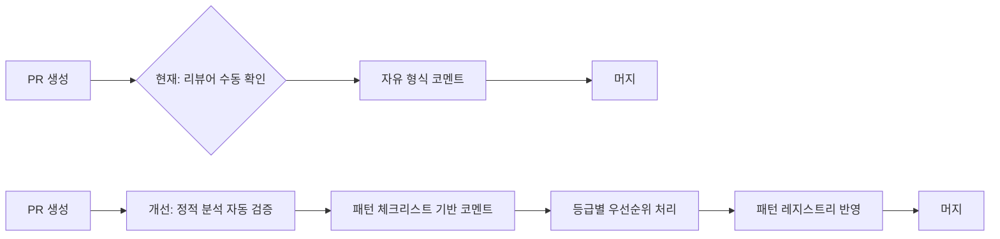

이 실습에서는 패턴별 리뷰 체크리스트 작성, 자동 검증 도구 구현, 팀 리뷰 프로세스 개선을 직접 수행합니다.

## 실습 목표

1. Observer 패턴 리뷰 체크리스트 작성
2. Strategy 패턴 자동 검증 도구 구현
3. 팀 리뷰 프로세스 개선 계획 수립

세 과제는 독립적이지 않고 순서대로 쌓입니다. 과제 1의 체크리스트가 "리뷰어가 무엇을 봐야 하는가"를 사람의 언어로 정의하면, 과제 2는 그중 기계적으로 판단 가능한 항목(Strategy 인터페이스 존재 여부, 구현체 개수 등)을 자동 검증 로직으로 옮기고, 과제 3은 그렇게 자동화된 결과가 실제로 팀의 리뷰 관행을 얼마나 개선하고 있는지 지표로 측정합니다. 즉 "체크리스트 → 자동화 → 측정"이라는 하나의 파이프라인을 세 과제로 나눠 실습하는 구조이며, 뒤쪽 과제일수록 앞쪽 과제가 정의한 개념(체크리스트 항목, 검증 규칙)을 입력으로 사용합니다.

## 과제 1: Observer 패턴 리뷰 체크리스트

이 과제는 Observer 패턴이 적용된 코드를 리뷰할 때 놓치기 쉬운 동시성, 메모리 누수, 예외 안전성 문제를 체크리스트로 미리 정리해두는 연습입니다. 완성된 체크리스트를 실제 `StockPrice` 예시 코드에 적용해보면서, 이론적 체크 항목이 실제 코드의 어떤 결함과 대응되는지 확인합니다.

**흔한 오해: 체크리스트 = 완전한 검증.** 체크박스를 모두 채웠다고 해서 그 코드에 결함이 없다는 뜻은 아닙니다. 체크리스트는 "리뷰어가 매번 떠올리기 어려운 항목을 놓치지 않게" 돕는 기억 보조 도구일 뿐, 목록에 없는 문제(예: 이 도메인에서 Observer 순서가 비즈니스 규칙상 중요한가)까지 걸러주지는 못합니다. 아래 `StockPrice` 예시에 체크리스트를 적용할 때도, 항목을 기계적으로 체크하는 것과 각 항목이 왜 이 코드에 적용되는지 근거를 드는 것은 다른 작업임을 염두에 두세요.

### 기본 체크리스트 템플릿
```markdown
# Observer 패턴 코드 리뷰 체크리스트

## 패턴 적용 적절성
- [ ] 일대다 의존 관계가 실제로 필요한가?
- [ ] 상태 변화 알림이 핵심 요구사항인가?
- [ ] Observer 수가 동적으로 변할 가능성이 있는가?
- [ ] 더 간단한 콜백이나 리스너로 해결 가능하지 않은가?

## 구현 완전성
- [ ] Subject 인터페이스가 명확히 정의되었나?
- [ ] Observer 등록/해제 메서드가 구현되었나?
- [ ] notifyObservers() 메서드가 적절히 호출되는가?
- [ ] Observer 인터페이스가 일관된 시그니처를 가지는가?

## 주요 위험 요소
- [ ] 메모리 누수 방지책이 있는가? (WeakReference 고려)
- [ ] Observer 실행 중 예외가 전체에 영향을 주지 않는가?
- [ ] 순환 참조 위험은 없는가?
- [ ] 동시성 이슈에 대한 고려가 있는가?

## 성능 고려사항
- [ ] Observer 수가 많을 때 성능 영향을 고려했는가?
- [ ] 비동기 알림이 필요한 경우를 판단했는가?
- [ ] 알림 필터링이나 우선순위가 필요한가?
```

### 실제 코드 리뷰 예시

아래 `StockPrice`는 [11장: Observer와 이벤트 기반 아키텍처](/post/design-patterns/observer-event-driven-architecture/)에서 정의한 `Subject`/`Observer` 인터페이스를 그대로 사용합니다. 이 실습만 따로 컴파일해볼 수 있도록 두 인터페이스를 아래에 다시 명시했습니다.

```java
import java.util.ArrayList;
import java.util.List;

// 11장에서 정의한 최소 인터페이스 (동일 시그니처)
interface Subject {
    void attach(Observer observer);
    void detach(Observer observer);
    void notifyObservers();
}

interface Observer {
    void update(Subject subject);
}

// TODO: 다음 Observer 구현을 체크리스트로 검토하세요
public class StockPrice implements Subject {
    private String symbol;
    private double price;
    private List<Observer> observers = new ArrayList<>();
    
    public void attach(Observer observer) {
        observers.add(observer);
    }
    
    public void detach(Observer observer) {
        observers.remove(observer);
    }
    
    public void notifyObservers() {
        for (Observer observer : observers) {
            observer.update(this);
        }
    }
    
    public void setPrice(double price) {
        this.price = price;
        notifyObservers();
    }
}

// 리뷰 포인트들:
// 1. 동시성 안전성 - ArrayList는 thread-safe하지 않음
// 2. 예외 안전성 - Observer 예외가 전파될 수 있음
// 3. 메모리 누수 - Strong reference로 인한 위험
// 4. 성능 - 동기식 알림으로 인한 블로킹 위험
```

리뷰 코멘트에 "동시성 이슈 있음"이라고만 남기면 작성자는 무엇을 어떻게 고쳐야 할지 알 수 없습니다. 1번 지적을 실제 리뷰에서 근거 있는 제안으로 이어가 보겠습니다. `ArrayList`는 내부 배열에 대한 인덱스 접근을 동기화하지 않으므로, 한 스레드가 `notifyObservers()`로 리스트를 순회하는 도중 다른 스레드가 `attach()`/`detach()`로 같은 리스트를 수정하면 `ConcurrentModificationException`이 발생하거나(fail-fast 순회자가 이를 감지하는 경우) 최악의 경우 배열 내부 상태가 깨질 수 있습니다. 대안은 두 가지이며 트레이드오프가 다릅니다. `CopyOnWriteArrayList`로 교체하면 순회 시점의 스냅샷을 읽으므로 `ConcurrentModificationException`이 원천적으로 사라지지만, `attach`/`detach`를 호출할 때마다 배열 전체를 복사하기 때문에 Observer 등록·해제가 빈번한 워크로드에서는 오히려 성능이 나빠집니다. 반대로 `attach`/`detach`/`notifyObservers`를 `synchronized` 블록으로 감싸면 복사 비용은 없지만, `notifyObservers` 중 잠금을 오래 쥐고 있으면(Observer의 `update()`가 느린 I/O를 포함하는 경우) 다른 스레드의 `attach`/`detach` 호출이 그동안 블로킹됩니다. 즉 리뷰어는 "Observer 등록·해제 빈도"와 "notify 중 Observer가 수행하는 작업이 I/O를 포함하는가"라는 두 신호를 근거로 둘 중 하나를 골라야지, 무조건 `CopyOnWriteArrayList`를 제안하는 것은 답이 아닙니다. 이 판단은 2번 지적(예외 안전성)과도 맞물립니다 — `synchronized` 블록 안에서 한 Observer가 예외를 던지면 잠금이 해제되기 전까지 나머지 Observer 호출도 함께 막히므로, 스레드 안전성을 개선하려면 개별 Observer 호출을 `try-catch`로 감싸 예외를 격리하는 조치를 반드시 함께 해야 합니다.

## 과제 2: Strategy 패턴 자동 검증 도구

이 과제는 사람이 매번 눈으로 확인하던 "Strategy 인터페이스가 있는가", "구현체가 2개 이상인가" 같은 판단을 리플렉션 기반 검증 로직으로 자동화하는 연습입니다. 검증 규칙을 먼저 설계하고, 이를 정적 분석 도구(PMD 스타일 규칙)와 CI 파이프라인에 통합하는 순서로 접근합니다.

### 검증 규칙 정의

검증기가 반환하는 `ValidationResult`는 오류(반드시 고쳐야 할 위반)와 경고(설계 재검토가 필요한 신호)를 구분해 담는 값 객체입니다. 아래 코드는 이 타입을 포함해 이 실습 파일만으로 독립적으로 컴파일되도록 완전히 정의했습니다.

```java
import java.util.ArrayList;
import java.util.List;

// TODO: Strategy 패턴 검증 규칙 구현
public class StrategyPatternValidator {
    
    public ValidationResult validate(Class<?> contextClass) {
        ValidationResult result = new ValidationResult();
        
        // 1. Strategy 인터페이스 존재 확인
        if (!hasStrategyInterface(contextClass)) {
            result.addError("No strategy interface found");
        }
        
        // 2. Context가 Strategy를 의존하는지 확인
        if (!hasStrategyDependency(contextClass)) {
            result.addError("Context doesn't depend on strategy interface");
        }
        
        // 3. 최소 2개 이상의 구현체 확인
        List<Class<?>> implementations = findStrategyImplementations(contextClass);
        if (implementations.size() < 2) {
            result.addWarning("Less than 2 strategy implementations found");
        }
        
        // 4. Strategy 교체 메커니즘 확인
        if (!hasStrategySetterOrConstructor(contextClass)) {
            result.addError("No strategy injection mechanism found");
        }
        
        return result;
    }
    
    // 이 메서드가 필요한 이유: Strategy 패턴이라고 부르려면 최소한 "교체 가능한 알고리즘"을 표현하는
    // 인터페이스가 있어야 합니다. 이 확인이 없으면 아래 hasStrategyDependency() 이하의 검증들이
    // 애초에 무엇을 기준으로 "Strategy"인지 판단할 근거를 잃습니다.
    private boolean hasStrategyInterface(Class<?> contextClass) {
        // TODO: 리플렉션으로 Strategy 인터페이스 탐지
        return false;
    }
    
    // 이 메서드가 필요한 이유: 인터페이스가 존재해도 Context가 그것을 실제로 의존(필드/생성자 파라미터)하지
    // 않는다면 패턴이 아니라 단순히 같은 패키지에 있는 무관한 타입일 수 있습니다.
    private boolean hasStrategyDependency(Class<?> contextClass) {
        // TODO: 필드나 생성자에서 Strategy 의존성 확인
        return false;
    }
    
    // 이 메서드가 필요한 이유: 구현체가 1개뿐이면 "교체 가능성"이라는 Strategy의 핵심 의도가 실현되지
    // 않은 것이므로, 굳이 인터페이스로 추상화할 필요가 없었다는 신호(과설계 의심)로 활용됩니다.
    private List<Class<?>> findStrategyImplementations(Class<?> contextClass) {
        // TODO: 클래스패스에서 Strategy 구현체들 찾기
        return new ArrayList<>();
    }
    
    // 이 메서드가 필요한 이유: 인터페이스와 구현체가 있어도 런타임에 전략을 바꿔 끼울 통로(setter,
    // 생성자 주입 등)가 없으면 사실상 하드코딩된 것과 같아 Strategy 패턴의 목적을 달성하지 못합니다.
    private boolean hasStrategySetterOrConstructor(Class<?> contextClass) {
        // TODO: Strategy 설정 메커니즘 확인
        return false;
    }
}

// 검증 결과를 담는 값 객체. 오류(error)는 패턴 위반, 경고(warning)는 설계 재검토 신호로 구분한다.
class ValidationResult {
    private final List<String> errors = new ArrayList<>();
    private final List<String> warnings = new ArrayList<>();

    public void addError(String message) {
        errors.add(message);
    }

    public void addWarning(String message) {
        warnings.add(message);
    }

    public List<String> getErrors() { return errors; }
    public List<String> getWarnings() { return warnings; }
    public boolean isValid() { return errors.isEmpty(); }
}
```

`ValidationResult`가 오류와 경고를 같은 리스트가 아니라 서로 다른 필드로 나눠 담는 이유는 CI에서의 처리 방식이 다르기 때문입니다. 오류(`addError`)는 "Strategy 패턴이라고 부를 최소 조건 자체가 깨졌다"는 뜻이므로 빌드를 실패시켜도 되는 후보이고, 경고(`addWarning`)는 "패턴은 성립하지만 재검토할 여지가 있다"는 뜻이라 리뷰어에게 알리는 선에서 그쳐야 합니다. 이 둘을 하나의 리스트에 심각도 문자열로 섞어 담으면 나중에 "이 결과로 빌드를 막을지"를 판단하는 코드가 문자열 파싱에 의존하게 되어 깨지기 쉽습니다. 이 오류/경고 구분은 뒤의 "판단 기준" 절에서 정적 분석 규칙을 경고로만 노출할지 머지 차단 게이트로 승격할지 정하는 근거(오탐률 임계값)와 같은 맥락에 있습니다 — 처음부터 오류로 강제하는 규칙이 없고, 경고 단계를 거쳐 데이터를 충분히 쌓은 뒤에만 오류로 승격하는 점진적 전환이 이 타입의 존재 이유입니다.

### 정적 분석 통합

정적 분석 통합은 위 `StrategyPatternValidator`를 리뷰어가 수동으로 호출하는 대신, PMD 같은 정적 분석기가 매 커밋마다 자동으로 실행하도록 규칙 클래스로 감싸는 작업입니다. `AbstractJavaRule`과 `ASTClassOrInterfaceDeclaration`은 PMD 6.x의 Java AST API(패키지 `net.sourceforge.pmd.lang.java.rule`, `net.sourceforge.pmd.lang.java.ast`)이며, PMD 버전에 따라 패키지 경로가 달라질 수 있으므로(예: PMD 7의 모듈 재구성) 실제 프로젝트에 통합할 때는 사용 중인 PMD 버전의 API 문서로 재확인해야 합니다.

```java
import net.sourceforge.pmd.lang.java.ast.ASTClassOrInterfaceDeclaration;
import net.sourceforge.pmd.lang.java.rule.AbstractJavaRule;

// TODO: PMD/SpotBugs 스타일의 규칙 작성
public class StrategyPatternRule extends AbstractJavaRule {
    
    @Override
    public Object visit(ASTClassOrInterfaceDeclaration node, Object data) {
        if (isPotentialStrategyContext(node)) {
            validateStrategyPattern(node, data);
        }
        return super.visit(node, data);
    }
    
    private boolean isPotentialStrategyContext(ASTClassOrInterfaceDeclaration node) {
        // TODO: Strategy Context 후보 클래스 식별
        // 1. 특정 네이밍 패턴 (xxxContext, xxxManager)
        // 2. 인터페이스 타입 필드 존재
        // 3. 조건부 로직 존재
        return false;
    }
    
    private void validateStrategyPattern(ASTClassOrInterfaceDeclaration node, Object data) {
        // TODO: AST 기반 패턴 검증
        // 1. if-else/switch 문이 Strategy로 대체 가능한지 확인
        // 2. Strategy 인터페이스 설계 품질 검증
        // 3. 누락된 Strategy 구현체 제안
    }
}
```

### 자동화된 리뷰 시스템

앞의 두 도구(리플렉션 검증기, PMD 규칙)를 하나의 서비스로 묶으면, PR이 열릴 때마다 "패턴 탐지 → 패턴별 검증 → 개선 제안 → 점수화" 파이프라인이 자동으로 돌아갑니다. 이 서비스는 Strategy 검증기 하나가 아니라 여러 패턴(Strategy/Observer/Factory)의 검증기를 조합하므로, 검증기들을 하나의 `PatternValidator` 인터페이스로 추상화해 주입받습니다. 아래는 이 서비스와 그것이 의존하는 보조 타입 전체를 정의한 코드입니다(Spring `@Service`를 사용하므로 `spring-context` 의존성이 필요합니다).

```java
import org.springframework.stereotype.Service;

import java.util.ArrayList;
import java.util.List;

@Service
public class AutomatedPatternReviewService {

    private final PatternDetector patternDetector;
    private final PatternValidator strategyValidator;
    private final PatternValidator observerValidator;
    private final PatternValidator factoryValidator;

    public AutomatedPatternReviewService(PatternDetector patternDetector,
                                          PatternValidator strategyValidator,
                                          PatternValidator observerValidator,
                                          PatternValidator factoryValidator) {
        this.patternDetector = patternDetector;
        this.strategyValidator = strategyValidator;
        this.observerValidator = observerValidator;
        this.factoryValidator = factoryValidator;
    }

    public ReviewReport conductPatternReview(CodeSubmission submission) {
        ReviewReport report = new ReviewReport();
        
        // 1. 패턴 탐지
        List<DetectedPattern> patterns = patternDetector.analyze(submission.files());
        
        // 2. 각 패턴별 검증
        for (DetectedPattern pattern : patterns) {
            PatternValidationResult result = validatePattern(pattern);
            report.addValidationResult(result);
        }
        
        // 3. 개선 제안 생성
        List<ImprovementSuggestion> suggestions = generateSuggestions(patterns);
        report.setSuggestions(suggestions);
        
        // 4. 점수 계산
        double score = calculatePatternScore(report);
        report.setScore(score);
        
        return report;
    }
    
    private PatternValidationResult validatePattern(DetectedPattern pattern) {
        switch (pattern.type()) {
            case STRATEGY:
                return strategyValidator.validate(pattern);
            case OBSERVER:
                return observerValidator.validate(pattern);
            case FACTORY:
                return factoryValidator.validate(pattern);
            default:
                return PatternValidationResult.skip();
        }
    }

    // TODO: 검증 결과를 근거로 구체적 개선 제안(리팩토링 방향 등) 생성
    private List<ImprovementSuggestion> generateSuggestions(List<DetectedPattern> patterns) {
        return new ArrayList<>();
    }

    // TODO: 오류/경고 개수와 심각도를 반영해 0.0~100.0 점수로 환산
    private double calculatePatternScore(ReviewReport report) {
        return 0.0;
    }
}

// --- 이 서비스가 참조하는 보조 타입 ---

enum PatternType { STRATEGY, OBSERVER, FACTORY }

interface PatternDetector {
    List<DetectedPattern> analyze(List<String> sourceFiles);
}

interface PatternValidator {
    PatternValidationResult validate(DetectedPattern pattern);
}

record CodeSubmission(List<String> files) {}
record DetectedPattern(PatternType type) {}
record ImprovementSuggestion(String description) {}

record PatternValidationResult(boolean skipped, List<String> issues) {
    static PatternValidationResult skip() {
        return new PatternValidationResult(true, List.of());
    }

    static PatternValidationResult of(List<String> issues) {
        return new PatternValidationResult(false, issues);
    }
}

class ReviewReport {
    private final List<PatternValidationResult> validationResults = new ArrayList<>();
    private List<ImprovementSuggestion> suggestions = new ArrayList<>();
    private double score;

    void addValidationResult(PatternValidationResult result) { validationResults.add(result); }
    void setSuggestions(List<ImprovementSuggestion> suggestions) { this.suggestions = suggestions; }
    void setScore(double score) { this.score = score; }
    double getScore() { return score; }
}
```

이 서비스의 핵심은 "탐지"와 "검증"을 분리한 것입니다. `PatternDetector`는 코드에서 패턴 후보를 찾는 역할만 하고, 실제 규칙 위반 여부 판단은 패턴 타입별 `PatternValidator` 구현체(위 §검증 규칙 정의의 `StrategyPatternValidator`를 `PatternValidator`로 어댑팅한 것)에 위임합니다. 이렇게 책임을 나눠두면 새 패턴(Singleton, Factory 등)을 추가할 때 탐지 로직을 건드리지 않고 검증기 하나만 추가하면 됩니다.

위 보조 타입 중 `CodeSubmission`·`DetectedPattern`·`ImprovementSuggestion`·`PatternValidationResult`는 Java 16부터 정식으로 도입된 [record](https://docs.oracle.com/en/java/javase/17/language/records.html)로 선언했습니다. record는 필드·생성자·`equals`/`hashCode`/`toString`·접근자(`files()`, `type()`처럼 필드명 그대로)를 컴파일러가 자동 생성해 주므로, 순수하게 값만 담고 생성 이후 바뀌지 않는 타입에서는 이전처럼 게터만 반복하는 클래스를 쓸 이유가 없습니다. `PatternValidationResult`는 필드가 2개뿐인데도 record로 바꿨지만, 원래 클래스와 완전히 같은 보장을 유지하지는 못합니다. 원래는 생성자가 `private`이라 `skip()`/`of()` 정적 팩토리만이 인스턴스를 만들 수 있었습니다. 그런데 record의 정규(canonical) 생성자는 [JLS 8.10.4.2](https://docs.oracle.com/javase/specs/jls/se17/html/jls-8.html#jls-8.10.4.2-110) 규칙상 레코드 자신의 접근 수준보다 더 제한적일 수 없고, 이 레코드는 `public`이 아니라 패키지 프라이빗이므로 정규 생성자도 `private`으로 선언할 수 없습니다(패키지 프라이빗보다 좁힐 수 없음). 즉 record로 바꾸면서 "같은 패키지 안에서도 반드시 정적 팩토리를 거쳐야 한다"는 제약은 "이 패키지 밖에서는 `skip()`/`of()` 외에 생성 경로가 없다"는 한 단계 느슨한 보장으로 바뀝니다. 이 실습처럼 한 패키지 안에서만 쓰이는 내부 DTO라면 실질적인 차이는 거의 없지만, 여러 개발자가 같은 패키지에서 이 타입을 직접 생성할 수 있는 라이브러리 코드였다면 record 전환 전에 이 완화를 감수할 만한지 먼저 판단해야 합니다. 반대로 `ReviewReport`는 record로 바꾸지 않았습니다. `conductPatternReview()`가 패턴을 하나씩 검증하며 `addValidationResult()`를 반복 호출해 리스트를 누적하고, 제안과 점수는 그 뒤 별도 단계에서 채워 넣습니다. 즉 이 타입의 값은 생성자 호출 한 번으로 확정되는 것이 아니라 여러 단계에 걸쳐 점진적으로 채워지는 상태이며, 이런 누적 상태는 불변 값 타입인 record보다 세터가 있는 클래스로 표현하는 쪽이 실제 사용 패턴과 더 정직하게 맞아떨어집니다. "이 타입의 모든 필드가 한 시점에 동시에 확정되는가"가 record와 일반 클래스를 가르는 실질적인 기준인 셈입니다.

## 과제 3: 팀 리뷰 프로세스 개선

이 과제는 팀의 현재 리뷰 프로세스를 참여도·패턴 적용 비율·효과성 지표로 진단하고, 진단 결과에 따라 교육/도구/프로세스 개선 액션을 선택하는 연습입니다. 정량 지표를 먼저 수집한 뒤 개선 계획을 세우는 순서를 따라야 임의의 처방이 아닌 데이터 기반 개선이 가능합니다.

### 현재 프로세스 vs 개선 프로세스

패턴 기반 리뷰를 도입하기 전과 후의 프로세스 차이는 다음과 같습니다.

| 구분 | 현재 프로세스 | 개선 프로세스 |
|------|-------------|-------------|
| 리뷰 기준 | 리뷰어 개인 경험에 의존 | 패턴 체크리스트로 표준화 |
| 패턴 검증 | 리뷰어가 수동으로 확인 | 정적 분석 도구가 1차 자동 검증 |
| 피드백 형식 | 자유 형식 코멘트 | Critical/Major/Minor/Nit 등급 코멘트 |
| 지식 공유 | 리뷰 코멘트에만 남고 휘발 | 패턴 레지스트리에 축적 |
| 효과 측정 | 측정하지 않음 | 결함 발견율·참여도 지표 추적 |



### 현재 상태 분석

`ReviewProcessAnalyzer`는 팀·기간을 입력받아 참여도·패턴 검토 비율·효과성·개선 영역 네 가지 지표를 하나의 `ReviewProcessReport`로 종합합니다. 원래 스니펫에는 `measureEffectiveness`·`identifyImprovementAreas` 호출부만 있고 정작 그 두 메서드와 `Team`·`Period`·`ReviewProcessReport` 등 관련 타입이 정의되어 있지 않아 컴파일이 되지 않았습니다. 아래에 이 실습 전체(과제 3의 나머지 두 코드에서도 재사용)에서 쓰는 보조 타입을 모두 정의했습니다.

```java
import java.time.LocalDate;
import java.util.ArrayList;
import java.util.List;

// TODO: 팀 리뷰 현황 분석 도구
public class ReviewProcessAnalyzer {
    
    public ReviewProcessReport analyzeTeamReviewProcess(Team team, Period period) {
        ReviewProcessReport report = new ReviewProcessReport();
        
        // 1. 리뷰 참여도 분석
        ReviewParticipationMetrics participation = calculateParticipation(team, period);
        report.setParticipation(participation);
        
        // 2. 패턴 관련 리뷰 비율
        double patternReviewRatio = calculatePatternReviewRatio(team, period);
        report.setPatternReviewRatio(patternReviewRatio);
        
        // 3. 리뷰 효과성 측정
        ReviewEffectiveness effectiveness = measureEffectiveness(team, period);
        report.setEffectiveness(effectiveness);
        
        // 4. 개선 영역 식별
        List<ImprovementArea> areas = identifyImprovementAreas(report);
        report.setImprovementAreas(areas);
        
        return report;
    }
    
    private ReviewParticipationMetrics calculateParticipation(Team team, Period period) {
        // TODO: 리뷰 참여 통계 계산 (평균 리뷰어 수, 리뷰 완료율, 응답 시간)
        return new ReviewParticipationMetrics(0.0, 0.0, 0.0);
    }
    
    private double calculatePatternReviewRatio(Team team, Period period) {
        // TODO: 패턴 관련 코멘트 비율 계산
        return 0.0;
    }

    // TODO: 결함 발견율·오탐률 등으로 리뷰 효과성 측정
    private ReviewEffectiveness measureEffectiveness(Team team, Period period) {
        return new ReviewEffectiveness(0.0, 0.0);
    }

    // TODO: 낮은 지표(참여도/효과성)를 근거로 개선 영역 식별
    private List<ImprovementArea> identifyImprovementAreas(ReviewProcessReport report) {
        return new ArrayList<>();
    }
}

// --- 과제 3 전체(현재 상태 분석 · 개선 계획 · 대시보드)가 공유하는 보조 타입 ---

record Team(String id, List<String> memberIds) {}
record Period(LocalDate start, LocalDate end) {}
record ReviewParticipationMetrics(double averageReviewersPerPr, double completionRate, double averageResponseHours) {}
record ReviewEffectiveness(double defectDetectionRate, double falsePositiveRate) {}
record ImprovementArea(String name, String reason) {}

class ReviewProcessReport {
    private ReviewParticipationMetrics participation;
    private double patternReviewRatio;
    private ReviewEffectiveness effectiveness;
    private List<ImprovementArea> improvementAreas = new ArrayList<>();

    // 아래 세 진단 점수는 "개선 계획 수립" 절에서 사용한다. 실제 구현에서는
    // participation·effectiveness 값을 가중합해 계산한 뒤 채워 넣는다.
    private double patternKnowledgeScore;
    private double automationLevel;
    private double reviewEfficiency;

    void setParticipation(ReviewParticipationMetrics v) { this.participation = v; }
    void setPatternReviewRatio(double v) { this.patternReviewRatio = v; }
    void setEffectiveness(ReviewEffectiveness v) { this.effectiveness = v; }
    void setImprovementAreas(List<ImprovementArea> v) { this.improvementAreas = v; }

    double getPatternKnowledgeScore() { return patternKnowledgeScore; }
    void setPatternKnowledgeScore(double v) { this.patternKnowledgeScore = v; }
    double getAutomationLevel() { return automationLevel; }
    void setAutomationLevel(double v) { this.automationLevel = v; }
    double getReviewEfficiency() { return reviewEfficiency; }
    void setReviewEfficiency(double v) { this.reviewEfficiency = v; }
}
```

`Team`·`Period`·`ReviewParticipationMetrics`·`ReviewEffectiveness`·`ImprovementArea`는 위 "자동화된 리뷰 시스템"에서 `CodeSubmission`·`DetectedPattern` 등을 record로 만든 것과 같은 이유로 record로 선언했습니다 — 생성 이후 값이 바뀌지 않는 순수 측정값·입력값이기 때문입니다. 반면 `ReviewProcessReport`는 여전히 세터가 있는 클래스로 남겼는데, 이유가 블록 A의 `ReviewReport`보다 한 단계 더 구체적입니다. `analyzeTeamReviewProcess()`가 참여도 → 패턴 비율 → 효과성 → 개선 영역 순으로 네 번에 걸쳐 필드를 채우는 것에 더해, 이 리포트는 다음 절의 `ReviewProcessImprovementPlan`이라는 *다른 클래스*가 `patternKnowledgeScore`·`automationLevel`·`reviewEfficiency` 세 진단 점수를 나중에 다시 세터로 채워 넣는 대상이기도 합니다. 즉 한 인스턴스의 생애주기가 클래스 경계를 넘어 두 단계로 나뉘어 있습니다. 이런 타입을 record로 만들면 두 번째 단계에서 채워질 세 필드를 첫 생성 시점에 `0.0` 같은 의미 없는 기본값으로 미리 채워야 하는데, 이는 "아직 계산되지 않음"과 "실제로 0.0으로 측정됨"을 구분하지 못하게 만들어 버그를 숨기기 쉽습니다. 세터가 있는 클래스는 이 구분을 코드로 강제하지는 못하지만 적어도 "이 필드는 나중에 채워진다"는 의도를 자연스럽게 드러냅니다.

### 개선 계획 수립

진단 점수(패턴 지식·자동화 수준·리뷰 효율)를 임계값과 비교해 어떤 개선 액션을 큐에 넣을지 결정하는 것이 이 클래스의 역할입니다. `Team`과 `ReviewProcessReport`(점수 getter 포함)는 위 "현재 상태 분석"에서 정의한 타입을 그대로 재사용합니다. 세 가지 액션(교육/도구/프로세스)은 이름·기간·우선순위라는 같은 구조를 가지므로 `ImprovementAction` 추상 클래스로 공통화하고, `ImprovementPlan`은 그 추상 타입 목록만 관리하도록 정의했습니다.

```java
import java.time.Duration;
import java.util.ArrayList;
import java.util.List;

// TODO: 팀별 맞춤 개선 계획
public class ReviewProcessImprovementPlan {
    
    public ImprovementPlan createImprovementPlan(Team team, ReviewProcessReport currentState) {
        ImprovementPlan plan = new ImprovementPlan();
        
        // 1. 교육 계획
        if (currentState.getPatternKnowledgeScore() < 70) {
            plan.addAction(new PatternEducationAction(
                "Design Pattern Workshop",
                Duration.ofDays(30),
                Priority.HIGH
            ));
        }
        
        // 2. 도구 도입
        if (currentState.getAutomationLevel() < 50) {
            plan.addAction(new ToolIntegrationAction(
                "Automated Pattern Checker Integration",
                Duration.ofDays(14),
                Priority.MEDIUM
            ));
        }
        
        // 3. 프로세스 개선
        if (currentState.getReviewEfficiency() < 80) {
            plan.addAction(new ProcessOptimizationAction(
                "Review Checklist Standardization",
                Duration.ofDays(7),
                Priority.HIGH
            ));
        }
        
        return plan;
    }
}

// --- 개선 액션 타입 계층 ---

enum Priority { HIGH, MEDIUM, LOW }

abstract class ImprovementAction {
    private final String title;
    private final Duration estimatedDuration;
    private final Priority priority;

    protected ImprovementAction(String title, Duration estimatedDuration, Priority priority) {
        this.title = title;
        this.estimatedDuration = estimatedDuration;
        this.priority = priority;
    }

    public String getTitle() { return title; }
    public Duration getEstimatedDuration() { return estimatedDuration; }
    public Priority getPriority() { return priority; }
}

class PatternEducationAction extends ImprovementAction {
    public PatternEducationAction(String title, Duration estimatedDuration, Priority priority) {
        super(title, estimatedDuration, priority);
    }
}

class ToolIntegrationAction extends ImprovementAction {
    public ToolIntegrationAction(String title, Duration estimatedDuration, Priority priority) {
        super(title, estimatedDuration, priority);
    }
}

class ProcessOptimizationAction extends ImprovementAction {
    public ProcessOptimizationAction(String title, Duration estimatedDuration, Priority priority) {
        super(title, estimatedDuration, priority);
    }
}

class ImprovementPlan {
    private final List<ImprovementAction> actions = new ArrayList<>();

    public void addAction(ImprovementAction action) { actions.add(action); }
    public List<ImprovementAction> getActions() { return actions; }
}
```

`PatternEducationAction`·`ToolIntegrationAction`·`ProcessOptimizationAction` 세 서브클래스는 필드도 동작도 부모 `ImprovementAction`과 완전히 같고, 생성자를 그대로 위임하는 것 외에는 아무것도 추가하지 않습니다. 그런데도 하나의 `ImprovementAction` 클래스에 `ActionKind` 같은 열거형 필드 하나만 두지 않고 굳이 상속 계층으로 나눈 이유는, 이후 각 액션 종류가 "이 액션을 실행하는 방법"(교육 워크숍을 캘린더에 등록하는 방법과 도구 설치 스크립트를 실행하는 방법은 완전히 다릅니다)이라는 서로 다른 행동을 갖게 될 자연스러운 확장 지점이기 때문입니다. 지금 당장은 타입 태그 역할만 하지만, 나중에 `execute()` 같은 추상 메서드가 추가되면 이 계층 구조가 그대로 다형성 디스패치로 이어집니다. 반대로 액션 종류가 앞으로도 데이터 태그 이상의 역할을 하지 않을 것이 확실하다면, `enum ActionKind`를 필드로 두는 편이 서브클래스 3개를 유지하는 것보다 단순합니다. Java 17의 `sealed` 인터페이스와 패턴 매칭을 쓸 수 있는 환경이라면 `sealed interface ImprovementAction permits PatternEducationAction, ToolIntegrationAction, ProcessOptimizationAction`으로 선언해 "이 셋 외의 서브타입은 없다"는 것을 컴파일러가 보장하게 만들 수도 있습니다 — 지금처럼 `abstract class`로 열어두면 다른 개발자가 네 번째 서브클래스를 추가해도 막을 방법이 없습니다.

교육(70점 미만)·도구(50점 미만)·프로세스(80점 미만) 세 임계값이 서로 다른 이유는, 각 영역이 개선에 필요한 선행 조건이 다르기 때문입니다. 패턴 지식이 부족한 상태에서 도구부터 도입하면 팀이 도구가 잡아내는 위반의 의미를 이해하지 못해 경고를 무시하게 되고, 반대로 지식은 충분한데 자동화 수준만 낮다면 교육보다 도구 통합이 더 빠른 효과를 냅니다. 이 임계값들은 뒤의 "판단 기준" 절에서 다시 근거로 사용합니다.

### 성과 측정 대시보드

대시보드는 앞의 두 절에서 진단하고 실행한 개선 활동의 효과를 팀이 스스로 확인할 수 있게 시각화하는 계층입니다. `Team`은 위 "현재 상태 분석"에서 정의한 타입을 재사용하고, 패턴별 통계를 담는 `Map<PatternType, ReviewStats>`의 `PatternType`은 위 "과제 2: 자동화된 리뷰 시스템"에서 정의한 것과 동일한 열거형입니다.

이 절을 단순한 "시각화"가 아니라 리뷰 프로세스의 **모니터링(Monitoring)** 계층으로 다루는 이유는, 수치를 보여주는 것 자체가 목적이 아니기 때문입니다. 진짜 목적은 앞의 "판단 기준" 절에서 정한 임계값(패턴 지식 70점, 자동화 수준 50점, 리뷰 효율 80점)을 위반하는 추세가 나타났을 때 사람이 개입하게 만드는 것입니다. 예를 들어 `ParticipationTrend`로 표현되는 주간 참여율이 3주 연속 하락한다면, 그 자체를 자동으로 조치하는 대신 다음 스탠드업 안건으로 올려 원인(리뷰 피로, 팀원 이탈, 업무량 과부하 등)을 사람이 판단하도록 신호를 보내야 합니다. 언제·누구에게·어떤 조건에서 알릴지를 정하지 않은 대시보드는 계산은 정확해도 아무도 정기적으로 들여다보지 않는 죽은 지표 페이지로 전락하기 쉽습니다 — 대시보드 구현보다 "이 숫자가 어떤 임계값을 넘으면 누가 무엇을 하는가"를 먼저 정의해야 하는 이유입니다.

```java
import java.util.ArrayList;
import java.util.HashMap;
import java.util.List;
import java.util.Map;

// TODO: 리뷰 품질 대시보드
public class ReviewQualityDashboard {
    
    public DashboardData generateDashboard(Team team) {
        // 네 지표를 먼저 로컬 변수로 모두 계산한 뒤, 마지막에 한 번의 생성자 호출로 조립한다.
        double patternQualityScore = calculatePatternQualityScore(team);
        List<ParticipationTrend> trends = calculateParticipationTrends(team);
        Map<PatternType, ReviewStats> patternStats = calculatePatternStats(team);
        ImprovementMetrics improvements = measureImprovements(team);

        return new DashboardData(patternQualityScore, trends, patternStats, improvements);
    }

    // TODO: 패턴 적용 품질을 0~100 점수로 환산
    private double calculatePatternQualityScore(Team team) {
        return 0.0;
    }

    // TODO: 기간별 참여도 추이 계산
    private List<ParticipationTrend> calculateParticipationTrends(Team team) {
        return new ArrayList<>();
    }

    // TODO: 패턴 타입별 리뷰 코멘트/위반 통계 집계
    private Map<PatternType, ReviewStats> calculatePatternStats(Team team) {
        return new HashMap<>();
    }

    // TODO: 개선 계획 실행 전후 지표 비교
    private ImprovementMetrics measureImprovements(Team team) {
        return new ImprovementMetrics(0.0, 0.0);
    }
}

// --- 대시보드가 참조하는 보조 타입 ---

record ParticipationTrend(String weekLabel, double participationRate) {}
record ReviewStats(int totalReviews, int violationsFound) {}
record ImprovementMetrics(double beforeScore, double afterScore) {}

record DashboardData(double patternQualityScore,
                      List<ParticipationTrend> participationTrends,
                      Map<PatternType, ReviewStats> patternStats,
                      ImprovementMetrics improvements) {}
```

`DashboardData`는 앞서 세터가 있는 클래스로 남겨 둔 `ReviewReport`·`ReviewProcessReport`와 달리 record로 만들었습니다. 차이는 "값이 확정되는 시점"에 있습니다. `generateDashboard()`는 네 지표를 순서대로 계산하지만, 이 계산은 전부 같은 메서드 안에서 끝나고 계산이 끝난 직후 생성자 호출 한 번으로 `DashboardData`를 조립합니다 — 값을 계산하는 단계(map)와 타입을 조립하는 단계(construct)가 시간적으로 분리되어 있지 않습니다. 반면 `ReviewReport`는 패턴을 검증할 때마다 결과가 하나씩 누적되고, `ReviewProcessReport`는 서로 다른 클래스(`ReviewProcessAnalyzer`와 `ReviewProcessImprovementPlan`)가 시차를 두고 필드를 채워 넣습니다. 이 두 경우 record로 만들면 아직 채워지지 않은 필드에 `0.0`이나 빈 리스트 같은 임시값을 미리 넣어야 하고, 그 값이 "아직 계산 전"인지 "실제로 그렇게 측정됨"인지 타입만 보고는 구분할 수 없게 됩니다. 정리하면, 한 메서드의 스코프 안에서 계산과 조립이 함께 끝나는 값은 record로, 여러 단계·여러 클래스에 걸쳐 채워지는 상태는 세터가 있는 클래스로 표현하는 것이 이 실습 전체에서 일관되게 적용한 기준입니다.

## 판단 기준: 언제 강제하고 언제 보류할 것인가

이 실습에서 만든 체크리스트·자동 검증 도구·개선 계획은 모든 팀에 동일하게 적용해도 되는 만능 해법이 아닙니다. 체크리스트를 PR 필수 항목으로 승격할지, 정적 분석 결과를 머지 차단 게이트로 걸지, 개선 계획의 어느 액션부터 실행할지는 팀의 규모·성숙도·현재 지표라는 구체적 신호에 따라 달라집니다. 판단 없이 도구부터 강제하면, 오탐이 잦은 게이트를 팀이 무시하는 습관이 생기거나 이미 잘 작동하는 프로세스에 불필요한 표준화를 얹어 리뷰 속도만 떨어뜨리는 결과로 이어집니다.

체크리스트(과제 1)는 Observer 패턴이 코드베이스에 반복적으로 등장하고 리뷰어마다 지적하는 항목이 들쭉날쭉하다는 불만이 나올 때 PR 템플릿의 필수 항목으로 승격할 근거가 생깁니다. 반대로 팀 규모가 5인 미만이고 패턴 적용 빈도 자체가 낮다면, 체크리스트는 강제하지 않고 참고 문서로만 두는 편이 유지 비용 대비 이득이 큽니다. 자동 검증 도구(과제 2)는 오탐률이라는 단일 지표로 승격 여부를 판단할 수 있습니다. `isPotentialStrategyContext`처럼 아직 휴리스틱 단계인 규칙은 최소 1–2 스프린트 동안 경고로만 노출해 오탐/누락 데이터를 쌓고, 그 기간의 오탐률이 5% 미만으로 안정되면 머지 차단(hard fail)으로 승격합니다. 오탐률이 20%를 넘는 규칙을 성급히 게이트로 걸면 팀이 실패를 무시하는 습관이 들어 도구 전체의 신뢰가 깎입니다.

개선 계획(과제 3)의 세 임계값은 우연히 정한 숫자가 아니라 각 영역의 선행 조건을 반영합니다. `patternKnowledgeScore`가 70 미만이면 도구·프로세스보다 교육을 먼저 실행해야 합니다 — 패턴을 모르는 팀에게 자동 검증 결과를 보여줘도 왜 위반인지 이해하지 못해 경고를 무시하기 때문입니다. `automationLevel`이 50 미만이면서 팀 규모가 10인 이상이면 도구 통합의 ROI가 커 우선순위를 올리지만, 소규모 팀에서는 도구 유지 비용이 이득보다 클 수 있어 후순위로 둡니다. `reviewEfficiency`가 이미 80 이상이라면 추가 프로세스 변경은 보류합니다 — 이미 작동하는 프로세스에 표준화를 얹으면 오히려 속도가 떨어지는 과잉 프로세스화(overprocess)로 이어지는 사례가 흔합니다.

| 진단 신호 | 권장 조치 | 피해야 할 조치 |
|---|---|---|
| 정적 분석 오탐률 > 20% | 경고로만 노출, 데이터 축적 | 즉시 CI 강제 게이트로 승격 |
| 정적 분석 오탐률 < 5% (1–2 스프린트 검증 후) | 머지 차단 게이트로 승격 | 계속 경고로만 방치 |
| `patternKnowledgeScore` < 70 | 교육(워크숍)을 도구보다 우선 | 지식 없는 팀에 도구부터 강제 |
| `automationLevel` < 50, 팀 규모 ≥ 10인 | 도구 통합 우선순위 상향 | 소규모 팀에 동일 기준 적용 |
| `reviewEfficiency` ≥ 80 | 현행 프로세스 유지 | 불필요한 표준화 강행 |
| 팀 규모 < 5인, 패턴 반복 적음 | 체크리스트 참고용 유지 | 모든 PR에 체크리스트 강제 |

## 완성도 체크리스트

아래 체크리스트는 이 실습을 끝까지 수행했는지 스스로 점검하는 용도입니다. 과제 1에서 다룬 함정 — 체크박스를 다 채웠다고 결함이 없다는 뜻은 아니라는 것 — 이 여기에도 그대로 적용됩니다. 특히 "자동 검증 도구" 항목은 TODO로 남겨둔 리플렉션·AST 로직을 실제 코드로 구현했는지가 아니라, `hasStrategyInterface`나 `isPotentialStrategyContext` 같은 각 TODO가 왜 필요한지를 다른 사람에게 설명할 수 있는지를 기준으로 체크하는 편이 이 실습의 의도에 더 맞습니다.

### Observer 패턴 리뷰
- [ ] 포괄적인 체크리스트 작성
- [ ] 실제 코드 리뷰 시나리오 적용
- [ ] 일반적인 실수 패턴 정리
- [ ] 개선 가이드라인 제시

### 자동 검증 도구
- [ ] Strategy 패턴 탐지 로직
- [ ] 구현 품질 검증 규칙
- [ ] 정적 분석 도구 통합
- [ ] 리뷰 자동화 워크플로우

### 프로세스 개선
- [ ] 현재 상태 분석 방법론
- [ ] 팀별 맞춤 개선 계획
- [ ] 성과 측정 지표 정의
- [ ] 지속적 개선 메커니즘

## 추가 도전 과제

1. **AI 기반 리뷰 어시스턴트**
   - 패턴 오용 자동 탐지
   - 개선 제안 자동 생성

2. **리뷰 품질 예측 모델**
   - 리뷰 효과성 예측
   - 최적 리뷰어 추천

3. **크로스 팀 패턴 표준화**
   - 조직 차원 패턴 가이드라인
   - 패턴 적용 사례 공유

위 세 도전 과제는 이 실습에서 다룬 결정적(deterministic) 규칙 기반 검증과 성격이 다릅니다. 리플렉션 검증기와 PMD/SonarQube 규칙은 "이 조건을 만족하는가"를 참/거짓으로 판단하는 반면, AI 기반 리뷰 어시스턴트나 리뷰 품질 예측 모델은 과거 PR 이력(수백–수천 건 단위의 리뷰 코멘트·머지 결과 데이터)을 학습 데이터로 충분히 축적한 뒤에야 의미 있는 예측을 낼 수 있어, 이 실습 하나만으로 바로 구현하기는 어렵습니다. 반대로 바로 아래의 CI 통합 예시는 이미 앞에서 정의한 검증기·규칙을 파이프라인에 등록하기만 하면 되므로 오늘 당장 적용 가능한 수준입니다. 이런 난이도·전제조건의 차이를 인지하고 "결정적 규칙 → 통계적 지표 → 학습 기반 예측" 순서로 접근하는 것이, 도전 과제를 막연한 목표가 아니라 실제 로드맵으로 이어가는 현실적인 경로입니다.

## 실무 적용 예시

앞서 다룬 두 도구는 지금까지는 각각 독립된 코드 조각이었습니다. `StrategyPatternValidator`(과제 2)는 리플렉션 기반 검증기였고, `StrategyPatternRule`은 PMD의 AST 방문자였습니다. 실무에서 이 둘이 "매 PR마다 자동으로 실행되는" 도구가 되려면 CI 파이프라인 또는 조직의 정적 분석 플랫폼에 실제로 등록하는 절차가 한 번 더 필요합니다. 아래 두 스니펫은 그 등록 지점을 보여줍니다. 하나는 빌드된 검증기 jar를 GitHub Actions 워크플로 한 단계로 실행하는 것이고, 다른 하나는 같은 발상을 PMD 대신 SonarQube의 커스텀 규칙 API로 옮겨 등록하는 것입니다. 두 도구를 모두 도입할 필요는 없으며, 팀이 이미 쓰고 있는 정적 분석 플랫폼(PMD든 SonarQube든)에 맞춰 하나만 선택해도 충분합니다.

### GitHub Actions 통합
```yaml
# .github/workflows/pattern-review.yml
name: Pattern Quality Check
on: [pull_request]
jobs:
  pattern-review:
    runs-on: ubuntu-latest
    steps:
      - uses: actions/checkout@v4
      - name: Run Pattern Validator
        run: |
          java -jar pattern-validator.jar --src src/main/java
      - name: Post Review Comments
        uses: ./.github/actions/post-pattern-review
```

`./.github/actions/post-pattern-review`는 GitHub 공식 액션이 아니라 이 저장소 안에 직접 만들어 둔 로컬 [복합 액션(composite action)](https://docs.github.com/en/actions/creating-actions/creating-a-composite-action)이라는 가정입니다. 앞 단계에서 `pattern-validator.jar`가 표준출력이나 JSON 파일로 남긴 검증 결과(오류/경고 목록)를 읽어 GitHub REST API로 PR에 라인별 리뷰 코멘트를 다는 역할을 합니다. 이 단계를 별도 액션으로 분리해 둔 이유는 "검증"(jar 실행)과 "결과를 어떻게 보여줄 것인가"(PR 코멘트 형식, Critical/Major/Minor 등급 표기)를 분리하면, 나중에 코멘트 형식만 바꾸고 싶을 때 검증기 로직을 건드리지 않아도 되기 때문입니다.

### SonarQube 커스텀 규칙

SonarQube의 Java 분석기(`sonar-java`)로 커스텀 규칙을 작성할 때는 PMD의 `AbstractJavaRule`과 달리 `org.sonar.plugins.java.api.IssuableSubscriptionVisitor`를 상속하고, 어떤 AST 노드 종류를 방문할지를 `nodesToVisit()`로 선언하는 구독(subscription) 방식을 씁니다. 아래는 과제 2의 `isPotentialStrategyContext` 판단 로직(구현체가 1개뿐인 인터페이스 필드 탐지)을 SonarQube 규칙 형태로 옮긴 것입니다. 실제 위반 판정 로직은 프로젝트의 심볼 조회 API에 의존하므로 이 자리에서는 무엇을 검사해야 하는지를 구체적인 TODO로 남겨 두었습니다. 위 PMD 예시와 마찬가지로 `sonar-java` 플러그인 API도 메이저 버전이 올라가며 패키지가 재구성되는 경우가 있으므로, 실제 프로젝트에 적용할 때는 사용 중인 `sonar-java` 버전의 공식 API 문서로 클래스명·시그니처를 재확인해야 합니다.

```java
import org.sonar.check.Rule;
import org.sonar.plugins.java.api.IssuableSubscriptionVisitor;
import org.sonar.plugins.java.api.tree.ClassTree;
import org.sonar.plugins.java.api.tree.Tree;

import java.util.Collections;
import java.util.List;

@Rule(key = "strategy-pattern-violation")
public class StrategyPatternViolationRule extends IssuableSubscriptionVisitor {

    @Override
    public List<Tree.Kind> nodesToVisit() {
        return Collections.singletonList(Tree.Kind.CLASS);
    }

    @Override
    public void visitNode(Tree tree) {
        ClassTree classTree = (ClassTree) tree;
        // TODO: 1. 클래스 이름이 xxxContext/xxxStrategy 패턴이거나 인터페이스 타입 필드를 가지는지 확인
        //       2. 심볼 테이블에서 그 인터페이스의 구현체 수를 조회해 1개뿐이면 과설계 의심으로 판정
        //          (과제 2 findStrategyImplementations()와 동일한 판단 기준)
        //       3. 위반이면 reportIssue(classTree, "Strategy 구현체가 1개뿐입니다: 인터페이스 추상화가
        //          필요한지 재검토하세요")로 이슈를 등록
    }
}
```

---

## 참고 자료

- **가이드**: SmartBear, "Best Practices for Peer Code Review" (SmartBear 코드 리뷰 가이드)
- **도서**: Erich Gamma 외, *Design Patterns: Elements of Reusable Object-Oriented Software* (GoF, 1994) — Strategy/Observer 패턴 원문 정의
- **도구 문서**: PMD, SpotBugs, SonarQube 공식 문서 (커스텀 규칙 작성 레퍼런스)
- **플랫폼**: GitHub Actions 공식 문서 (PR 워크플로우 자동화)

---

이 실습에서 만든 체크리스트·검증 도구·개선 계획은 한 번 작성하고 끝나는 산출물이 아닙니다. "완성도 체크리스트"에서 확인한 항목들을 실제 팀 코드베이스에 적용해보고, 그 결과로 얻은 피드백을 다시 체크리스트와 검증 규칙에 반영하는 순환이 과제 3에서 다룬 "정량 지표 기반 개선"의 본질입니다. 이 순환은 코드 수준(동시성 버그를 잡는 체크리스트 항목)과 조직 수준(대시보드가 알려주는 참여도 추세)에서 동시에 돌아가야 의미가 있습니다 — 개별 PR의 결함만 줄고 팀 전체의 리뷰 관행은 그대로라면, 다음에 또 같은 유형의 동시성 버그가 다른 사람의 코드에서 반복될 뿐입니다.