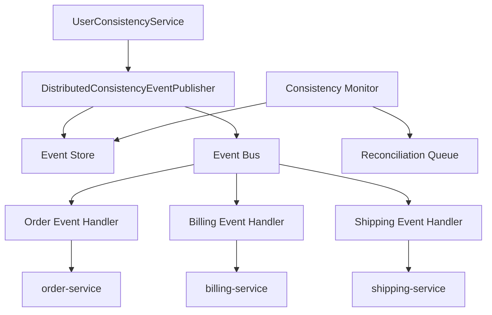

이 실습에서는 반복되는 설계 문제에서 새로운 패턴을 발견하고, 문서화하고, 검증하는 전 과정을 경험합니다.

## 실습 목표

1. 반복되는 설계 문제에서 새로운 패턴 발견
2. 패턴 문서 작성 및 검증
3. 패턴 구현 및 효과성 검증

## 과제 1: 패턴 발견 실습

여러 마이크로서비스에 걸쳐 반복적으로 나타나는 "데이터 변경을 다른 서비스에 동기 호출로 전파하다 부분 실패한다"는 문제를 세 개의 서로 다른 서비스(사용자, 상품, 주문)에서 관찰하고, 공통 구조를 뽑아내는 실습입니다. 아래 코드는 표면적으로는 다른 도메인을 다루지만 동일한 실패 패턴을 공유하는 세 서비스를 보여줍니다.

### 시작 전에: 우연한 유사성과 진짜 구조 혼동하지 않기

이 실습을 시작하기 전에 흔히 빠지는 함정을 먼저 짚어야 합니다. 아래 UserService, ProductService, OrderService 코드는 "다른 서비스 여러 개를 순서대로 호출한다"는 표면적 형태만 보면 비슷해 보이지만, 그 유사성이 우연한 코드 스타일의 일치인지 진짜 재사용 가능한 구조인지는 구분해서 봐야 합니다. 판단 기준은 코드 모양이 아니라 세 서비스가 공유하는 실패 모드입니다: 동기 호출 중 일부가 실패하면 트랜잭션 경계를 넘어선 데이터 불일치가 발생하고, 이를 해결하려면 재시도·멱등성·최종적 일관성이라는 동일한 개념 장치가 필요하다는 점입니다. 단순히 "메서드 여러 개를 순서대로 호출한다"는 구조적 유사성만 있고 이 실패 모드를 공유하지 않는다면, 그것은 패턴 후보가 아니라 우연히 비슷하게 생긴 코드일 뿐입니다.

이 문제는 이미 이름이 붙은 패턴들과도 맞닿아 있습니다. **Event Sourcing**은 상태 변경을 이벤트로 저장한다는 점에서 이번 실습의 이벤트 발행 아이디어와 겹치지만, 목적이 다릅니다. Event Sourcing은 "상태를 어떻게 재구성할 것인가"에 집중하는 반면, 이번에 다루는 문제는 "여러 서비스에 어떻게 변경을 전파할 것인가"에 집중합니다. **CQRS**는 읽기/쓰기 모델을 분리하는 패턴으로, 이번 실습과는 관심사가 다르지만 종종 이벤트 기반 전파와 함께 조합되어 쓰입니다. **Saga**는 분산 트랜잭션을 여러 로컬 트랜잭션과 보상 트랜잭션으로 쪼개는 패턴으로, 이번 실습에서 다루는 "부분 실패 시 어떻게 복구할 것인가"와 가장 밀접하게 관련됩니다. 따라서 실습을 마친 뒤 과제 2의 Related Patterns 섹션을 채울 때는, 새로 발견한 패턴이 이 세 패턴과 정확히 어떻게 다른지(혹은 이들을 조합한 것인지) 한 문장으로 설명할 수 있어야 진짜 발견인지 우연한 유사성인지 검증할 수 있습니다.

### 문제 상황 분석
```java
// 마이크로서비스에서 반복되는 문제: 분산 데이터 일관성
// 서비스 A: 사용자 서비스
@Service
public class UserService {
    public void updateUser(User user) {
        userRepository.save(user);
        
        // 다른 서비스들에 알림 - 문제 발생 지점
        try {
            orderService.updateCustomerInfo(user);     // 실패 가능
            billingService.updateCustomerInfo(user);   // 실패 가능
            shippingService.updateCustomerInfo(user);  // 실패 가능
        } catch (Exception e) {
            // 부분 실패 시 어떻게 처리할까?
            // 롤백? 재시도? 보상 트랜잭션?
        }
    }
}

// 서비스 B: 상품 서비스
@Service  
public class ProductService {
    public void updateProduct(Product product) {
        productRepository.save(product);
        
        // 동일한 패턴의 문제 반복
        catalogService.updateProductInfo(product);
        pricingService.updateProductInfo(product);
        recommendationService.updateProductInfo(product);
    }
}

// 서비스 C: 주문 서비스
@Service
public class OrderService {
    public void processOrder(Order order) {
        orderRepository.save(order);
        
        // 또 다른 동일한 패턴
        inventoryService.reserveItems(order.getItems());
        paymentService.processPayment(order.getPayment());
        shippingService.scheduleDelivery(order);
    }
}
```

### 패턴 후보 식별
```java
// TODO: 다음 단계를 통해 패턴을 식별하세요

// 1단계: 공통점 발견
/*
공통 문제:
- 한 서비스의 데이터 변경이 여러 서비스에 전파되어야 함
- 동기 호출로 인한 결합도와 장애 전파
- 부분 실패 시 데이터 불일치 위험
- 트랜잭션 관리의 복잡성
*/

// 2단계: 해결 방향 탐색  
/*
해결 아이디어:
- 비동기 메시징으로 결합도 감소
- 이벤트 소싱으로 변경 이력 추적
- 보상 트랜잭션으로 일관성 복구
- 최종적 일관성 모델 적용
*/

// 3단계: 패턴 후보 도출
/*
새로운 패턴: "Distributed Event-Driven Consistency Pattern"
Intent: 마이크로서비스 환경에서 분산된 데이터의 최종적 일관성을 
        이벤트 기반 아키텍처를 통해 보장한다
*/
```

위 3단계는 임의의 순서가 아니라, 서로 다른 사례들에서 공통 구조를 추출한 뒤에만 해결 방향을 탐색해야 특정 사례에 과적합된 결론을 피할 수 있다는 순서 제약을 가진다.

| 단계 | 입력 | 활동 | 산출물 | 실패 시 신호 |
|------|------|------|--------|-------------|
| 1. 공통점 발견 | 3개 이상의 독립 사례(UserService, ProductService, OrderService) | 반복되는 문제 구조 비교 | 공통 문제 목록 | 사례가 2개 이하이거나 우연의 일치로 보임 |
| 2. 해결 방향 탐색 | 공통 문제 목록 | 기존 해결책(동기 호출, 2PC, Saga)의 한계 분석 | 후보 해결 아이디어 | 기존 패턴 재발명에 그침 |
| 3. 패턴 후보 도출 | 후보 해결 아이디어 | 이름 부여 및 Intent 정의 | 패턴 후보명 + 한 문장 Intent | Intent가 특정 코드에만 종속됨 |

## 과제 2: 패턴 문서 작성

과제 1에서 식별한 "Distributed Event-Driven Consistency Pattern" 후보를 실제 패턴 명세서 형식으로 옮겨 적는 실습입니다. GoF 스타일의 표준 템플릿에 맞춰 Intent, Motivation, Structure 등 각 섹션을 채우면서, 막연했던 아이디어가 다른 개발자도 이해하고 검증할 수 있는 문서로 구체화되는 과정을 경험합니다.

### 패턴 명세서 템플릿
```markdown
# [패턴 이름]

## Intent (의도)
- 패턴이 해결하려는 문제와 목적을 명확히 기술

## Also Known As (다른 이름)
- 동일한 개념을 나타내는 다른 용어들

## Motivation (동기)
### 문제 상황
- 구체적인 예시와 함께 문제 설명

### 기존 해결책의 한계
- 왜 기존 방법으로는 해결되지 않는가

## Applicability (적용 가능성)
- 언제 이 패턴을 사용해야 하는가
- 적용 조건과 제약사항

## Structure (구조)
- UML 다이어그램
- 주요 구성 요소들의 관계

## Participants (참여자)
- 각 구성 요소의 역할과 책임

## Collaborations (협력)
- 구성 요소들 간의 상호작용 과정

## Consequences (결과)
### 장점
- 패턴 적용으로 얻는 이익

### 단점
- 패턴 적용의 비용과 제약

## Implementation (구현)
### 구현 가이드라인
- 핵심 구현 포인트

### 구현 변형
- 다양한 구현 방식

## Sample Code (예시 코드)
- 실제 동작하는 코드 예시

## Known Uses (알려진 사용 사례)
- 실제 시스템에서의 적용 사례

## Related Patterns (관련 패턴)
- 유사한 패턴들과의 관계
```

### 실제 패턴 문서 작성
```java
// TODO: "Distributed Event-Driven Consistency Pattern" 문서 작성

/*
패턴 구성 요소 설계:

1. Event Publisher (이벤트 발행자)
   - 데이터 변경 시 일관성 이벤트 발행
   - 이벤트 저장 및 상태 관리

2. Event Store (이벤트 저장소)
   - 이벤트 영속화 및 상태 추적
   - 실패 이벤트 재처리 지원

3. Event Bus (이벤트 버스)
   - 이벤트 라우팅 및 전달
   - 구독자 관리

4. Event Handler (이벤트 핸들러)
   - 각 서비스별 이벤트 처리 로직
   - 멱등성 보장

5. Consistency Monitor (일관성 모니터)
   - 일관성 상태 감시
   - 불일치 발견 시 자동 복구
*/

// 핵심 인터페이스 설계
public interface ConsistencyEventPublisher {
    <T> void publishEvent(String aggregateId, String eventType, T eventData, List<String> targetServices);
}

public interface ConsistencyEventHandler<T> {
    void handleEvent(ConsistencyEvent<T> event);
    boolean canHandle(ConsistencyEvent<?> event);
    String getServiceName();
}

public interface ConsistencyMonitor {
    void checkConsistency(String aggregateId);
    void repairInconsistency(InconsistencyDetected inconsistency);
}
```

## 과제 3: 패턴 구현 및 검증

문서만으로는 패턴의 타당성을 확신할 수 없으므로, 실제로 동작하는 프로토타입을 구현하고 정량적으로 효과를 측정하는 실습입니다. Event Publisher, Event Handler를 직접 구현한 뒤 기존 동기 방식과 성능·복잡성을 비교해 패턴 도입이 실제로 개선을 가져오는지 검증합니다.

### 구현할 아키텍처 개요

아래는 24-이론 편에서 정의한 Event Publisher → Handler 흐름을, 이번 실습의 UserConsistencyService 시나리오(대상 서비스: order-service, billing-service, shipping-service)에 맞게 다시 그린 구조도입니다. 이제부터 구현할 `DistributedConsistencyEventPublisher`와 각 서비스별 `AbstractConsistencyEventHandler` 구현체가 이 흐름의 어느 위치에 해당하는지 확인하면서 코드를 채워보세요.



### 프로토타입 구현
```java
import java.time.Duration;
import java.time.Instant;
import java.util.Arrays;
import java.util.List;
import java.util.UUID;
import org.springframework.stereotype.Component;
// ConsistencyEvent<T>는 24-이론 편에서 정의한 빌더 구조를 그대로 따른다
// (eventId/aggregateId/eventType/eventData/targetServices/timestamp/status, builder() 정적 팩토리 제공)

// 1. Event Publisher 구현
@Component
public class DistributedConsistencyEventPublisher implements ConsistencyEventPublisher {
    private final EventStore eventStore;
    private final EventBus eventBus;
    
    @Override
    public <T> void publishEvent(String aggregateId, String eventType, T eventData, List<String> targetServices) {
        // 1. 이벤트 생성 및 저장
        ConsistencyEvent<T> event = createEvent(aggregateId, eventType, eventData, targetServices);
        eventStore.save(event);
        
        // 2. 이벤트 발행
        try {
            eventBus.publish(event);
            eventStore.markAsPublished(event.getEventId());
        } catch (Exception e) {
            eventStore.markAsFailed(event.getEventId());
            scheduleRetry(event);
        }
    }
    
    private <T> ConsistencyEvent<T> createEvent(String aggregateId, String eventType, T eventData, List<String> targetServices) {
        return ConsistencyEvent.<T>builder()
            .eventId(UUID.randomUUID().toString())
            .aggregateId(aggregateId)
            .eventType(eventType)
            .eventData(eventData)
            .targetServices(targetServices)
            .timestamp(Instant.now())
            .status(EventStatus.CREATED)
            .build();
    }
    
    private void scheduleRetry(ConsistencyEvent<?> event) {
        // TODO: 재시도 스케줄링 - 실제 구현에서는 지수 백오프를 적용한 재시도 큐에 이벤트를 적재한다
    }
}

// 2. Event Handler 기본 구현
public abstract class AbstractConsistencyEventHandler<T> implements ConsistencyEventHandler<T> {
    
    @Override
    public void handleEvent(ConsistencyEvent<T> event) {
        String serviceName = getServiceName();
        if (!event.getTargetServices().contains(serviceName)) {
            return; // 이 서비스 대상이 아님
        }
        
        try {
            // 멱등성 확인
            if (isAlreadyProcessed(event.getEventId())) {
                markAsProcessed(event, ProcessingStatus.DUPLICATE);
                return;
            }
            
            // 비즈니스 로직 실행
            ProcessingResult result = processEvent(event.getEventData());
            
            if (result.isSuccessful()) {
                markAsProcessed(event, ProcessingStatus.SUCCESS);
            } else {
                markAsProcessed(event, ProcessingStatus.FAILED);
                scheduleRetry(event, result.getRetryDelay());
            }
            
        } catch (Exception e) {
            markAsProcessed(event, ProcessingStatus.ERROR);
            handleProcessingError(event, e);
        }
    }
    
    protected abstract ProcessingResult processEvent(T eventData);
    protected abstract boolean isAlreadyProcessed(String eventId);
    protected abstract void markAsProcessed(ConsistencyEvent<T> event, ProcessingStatus status);
    
    private void scheduleRetry(ConsistencyEvent<T> event, Duration delay) {
        // TODO: 재시도 스케줄링
    }
    
    private void handleProcessingError(ConsistencyEvent<T> event, Exception e) {
        // TODO: 에러 처리 및 알림
    }
}

// 3. 구체적인 사용 예시
@Service
public class UserConsistencyService {
    private final ConsistencyEventPublisher eventPublisher;
    
    @Transactional
    public void updateUser(User user) {
        // 1. 로컬 데이터 업데이트
        User savedUser = userRepository.save(user);
        
        // 2. 일관성 이벤트 발행
        List<String> targetServices = Arrays.asList(
            "order-service", 
            "billing-service", 
            "shipping-service"
        );
        
        eventPublisher.publishEvent(
            savedUser.getId().toString(),
            "UserUpdated",
            savedUser,
            targetServices
        );
    }
}

// 각 서비스별 이벤트 핸들러
@Component
public class OrderServiceUserEventHandler extends AbstractConsistencyEventHandler<User> {
    
    @Override
    protected ProcessingResult processEvent(User userData) {
        // TODO: 주문 서비스에서 사용자 정보 업데이트
        try {
            orderCustomerService.updateCustomerInfo(userData);
            return ProcessingResult.success();
        } catch (Exception e) {
            return ProcessingResult.retry(Duration.ofMinutes(5));
        }
    }
    
    @Override
    public String getServiceName() {
        return "order-service";
    }
    
    @Override
    public boolean canHandle(ConsistencyEvent<?> event) {
        return "UserUpdated".equals(event.getEventType());
    }
    
    // ... 다른 메서드들 구현
}
```

### 패턴 효과성 검증
```java
// TODO: 패턴 효과성 측정 및 검증

@Component
public class PatternEffectivenessValidator {
    
    // 1. 성능 측정
    public PerformanceMetrics measurePerformance(String patternName, Duration testPeriod) {
        return PerformanceMetrics.builder()
            .throughput(measureThroughput(patternName, testPeriod))
            .latency(measureLatency(patternName, testPeriod))
            .errorRate(measureErrorRate(patternName, testPeriod))
            .resourceUsage(measureResourceUsage(patternName, testPeriod))
            .build();
    }
    
    // 2. 복잡성 분석
    public ComplexityAnalysis analyzeComplexity(String patternName) {
        return ComplexityAnalysis.builder()
            .cyclomaticComplexity(calculateCyclomaticComplexity(patternName))
            .linesOfCode(countLinesOfCode(patternName))
            .numberOfClasses(countClasses(patternName))
            .couplingLevel(measureCoupling(patternName))
            .cohesionLevel(measureCohesion(patternName))
            .build();
    }
    
    // 3. 유지보수성 평가
    public MaintainabilityScore evaluateMaintainability(String patternName) {
        return MaintainabilityScore.builder()
            .readability(assessReadability(patternName))
            .testability(assessTestability(patternName))
            .modifiability(assessModifiability(patternName))
            .reusability(assessReusability(patternName))
            .build();
    }
    
    // 4. 실제 적용 시뮬레이션
    @Test
    public void simulateRealWorldUsage() {
        // TODO: 실제 환경 시뮬레이션
        // 1. 다양한 부하 조건 테스트
        // 2. 장애 상황 시뮬레이션
        // 3. 확장성 테스트
        // 4. 기존 솔루션과 비교
        
        PatternSimulator simulator = new PatternSimulator();
        
        // 기존 동기 방식
        SimulationResult syncResult = simulator.runSimulation(
            new SynchronousConsistencyApproach(),
            SimulationConfig.heavyLoad()
        );
        
        // 새로운 패턴
        SimulationResult newPatternResult = simulator.runSimulation(
            new DistributedEventDrivenConsistencyPattern(),
            SimulationConfig.heavyLoad()
        );
        
        // 결과 비교
        ComparisonReport report = compareResults(syncResult, newPatternResult);
        assertThat(report.getImprovementRatio()).isGreaterThan(0.3); // 30% 이상 개선
    }
}

// 커뮤니티 피드백 수집
@Component
public class CommunityFeedbackCollector {
    
    public CommunityFeedback collectFeedback(String patternName) {
        CommunityFeedback feedback = new CommunityFeedback(patternName);
        
        // 1. 개발자 설문 조사
        List<DeveloperSurveyResponse> surveyResponses = conductSurvey(patternName);
        feedback.setSurveyResponses(surveyResponses);
        
        // 2. 코드 리뷰에서의 패턴 언급 분석
        List<CodeReviewMention> reviewMentions = analyzeCodeReviews(patternName);
        feedback.setReviewMentions(reviewMentions);
        
        // 3. 실제 프로젝트 적용 사례 수집
        List<ProjectUsageCase> usageCases = collectUsageCases(patternName);
        feedback.setUsageCases(usageCases);
        
        return feedback;
    }
}
```

## 완성도 체크리스트

### 패턴 발견
- [ ] 반복되는 문제 패턴 식별
- [ ] 기존 해결책의 한계 분석
- [ ] 새로운 해결 방향 탐색
- [ ] 패턴 후보 명확히 정의

### 패턴 문서화
- [ ] 완전한 패턴 명세서 작성
- [ ] 구조 다이어그램 작성
- [ ] 구현 가이드라인 제시
- [ ] 사용 사례 및 제약사항 명시

### 패턴 검증
- [ ] 프로토타입 구현 완료
- [ ] 성능 및 복잡성 측정
- [ ] 실제 환경 시뮬레이션
- [ ] 커뮤니티 피드백 수집

## 추가 도전 과제

1. **AI 기반 패턴 발견**
   - 코드베이스 자동 분석
   - 패턴 후보 자동 제안
   - 의도 추론 시스템

2. **패턴 진화 예측**
   - 기술 트렌드 분석
   - 패턴 생명주기 모델링
   - 미래 패턴 예측

3. **크라우드소싱 패턴 검증**
   - 개발자 커뮤니티 연계
   - 집단 지성 활용
   - 품질 평가 시스템

---

## 참고 자료

- **도서**: Erich Gamma 외, *Design Patterns: Elements of Reusable Object-Oriented Software* (GoF, 1994) — 패턴 명세서 템플릿(Intent, Motivation, Structure 등)의 원형
- **도서**: "Pattern-Oriented Software Architecture" by Frank Buschmann
- **도서**: "A Pattern Language" by Christopher Alexander
- **컨퍼런스**: EuroPLoP, PLoP (Pattern Languages of Programs) — 패턴 검증 및 발표 절차 참고

---

**실습 팁**
- 실제 프로젝트에서 반복되는 문제 패턴 관찰
- 소규모 프로토타입으로 검증 후 확장
- 동료 개발자들과 적극적인 토론
- 기존 패턴들과의 차별점 명확히 정의
- 정량적 지표로 효과성 측정 