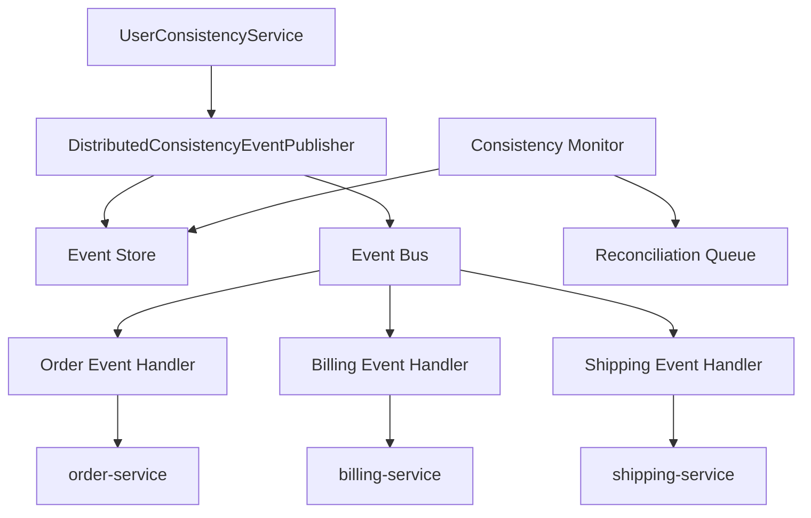

이 실습에서는 반복되는 설계 문제에서 새로운 패턴을 발견하고, 문서화하고, 검증하는 전 과정을 경험합니다.

## 실습 목표

1. 반복되는 설계 문제에서 새로운 패턴 발견
2. 패턴 문서 작성 및 검증
3. 패턴 구현 및 효과성 검증

## 과제 1: 패턴 발견 실습

여러 마이크로서비스에 걸쳐 반복적으로 나타나는 "데이터 변경을 다른 서비스에 동기 호출로 전파하다 부분 실패한다"는 문제를 세 개의 서로 다른 서비스(사용자, 상품, 주문)에서 관찰하고, 공통 구조를 뽑아내는 실습입니다. 아래 코드는 표면적으로는 다른 도메인을 다루지만 동일한 실패 패턴을 공유하는 세 서비스를 보여줍니다.

### 시작 전에: 우연한 유사성과 진짜 구조 혼동하지 않기

이 실습을 시작하기 전에 흔히 빠지는 함정을 먼저 짚어야 합니다. 아래 UserService, ProductService, OrderService 코드는 "다른 서비스 여러 개를 순서대로 호출한다"는 표면적 형태만 보면 비슷해 보이지만, 그 유사성이 우연한 코드 스타일의 일치인지 진짜 재사용 가능한 구조인지는 구분해서 봐야 합니다. 판단 기준은 코드 모양이 아니라 세 서비스가 공유하는 실패 모드입니다: 동기 호출 중 일부가 실패하면 트랜잭션 경계를 넘어선 데이터 불일치가 발생하고, 이를 해결하려면 재시도·멱등성·최종적 일관성이라는 동일한 개념 장치가 필요하다는 점입니다. 단순히 "메서드 여러 개를 순서대로 호출한다"는 구조적 유사성만 있고 이 실패 모드를 공유하지 않는다면, 그것은 패턴 후보가 아니라 우연히 비슷하게 생긴 코드일 뿐입니다.

이 문제는 이미 이름이 붙은 패턴들과도 맞닿아 있습니다. **Event Sourcing**은 상태 변경을 이벤트로 저장한다는 점에서 이번 실습의 이벤트 발행 아이디어와 겹치지만, 목적이 다릅니다. Event Sourcing은 "상태를 어떻게 재구성할 것인가"에 집중하는 반면, 이번에 다루는 문제는 "여러 서비스에 어떻게 변경을 전파할 것인가"에 집중합니다. **CQRS**는 읽기/쓰기 모델을 분리하는 패턴으로, 이번 실습과는 관심사가 다르지만 종종 이벤트 기반 전파와 함께 조합되어 쓰입니다. **Saga**는 분산 트랜잭션을 여러 로컬 트랜잭션과 보상 트랜잭션으로 쪼개는 패턴으로, 이번 실습에서 다루는 "부분 실패 시 어떻게 복구할 것인가"와 가장 밀접하게 관련됩니다. 따라서 실습을 마친 뒤 과제 2의 Related Patterns 섹션을 채울 때는, 새로 발견한 패턴이 이 세 패턴과 정확히 어떻게 다른지(혹은 이들을 조합한 것인지) 한 문장으로 설명할 수 있어야 진짜 발견인지 우연한 유사성인지 검증할 수 있습니다.

### 문제 상황 분석
```java
// 마이크로서비스에서 반복되는 문제: 분산 데이터 일관성
// 서비스 A: 사용자 서비스
@Service
public class UserService {
    public void updateUser(User user) {
        userRepository.save(user);
        
        // 다른 서비스들에 알림 - 문제 발생 지점
        try {
            orderService.updateCustomerInfo(user);     // 실패 가능
            billingService.updateCustomerInfo(user);   // 실패 가능
            shippingService.updateCustomerInfo(user);  // 실패 가능
        } catch (Exception e) {
            // 부분 실패 시 어떻게 처리할까?
            // 롤백? 재시도? 보상 트랜잭션?
        }
    }
}

// 서비스 B: 상품 서비스
@Service  
public class ProductService {
    public void updateProduct(Product product) {
        productRepository.save(product);
        
        // 동일한 패턴의 문제 반복
        catalogService.updateProductInfo(product);
        pricingService.updateProductInfo(product);
        recommendationService.updateProductInfo(product);
    }
}

// 서비스 C: 주문 서비스
@Service
public class OrderService {
    public void processOrder(Order order) {
        orderRepository.save(order);
        
        // 또 다른 동일한 패턴
        inventoryService.reserveItems(order.getItems());
        paymentService.processPayment(order.getPayment());
        shippingService.scheduleDelivery(order);
    }
}
```

세 서비스의 코드를 나란히 놓고 보면 겉으로는 "메서드 여러 개를 순서대로 호출한다"는 형태만 같아 보이지만, 실제로 문제가 되는 지점은 각 호출 사이의 트랜잭션 경계다. UserService.updateUser에서 userRepository.save(user)는 이미 커밋된 상태인데, 그 직후 orderService.updateCustomerInfo(user)가 성공하고 billingService.updateCustomerInfo(user)가 네트워크 타임아웃으로 실패하면, 사용자 데이터는 order 서비스에는 반영되고 billing 서비스에는 반영되지 않은 채로 영구히 남는다. catch 블록의 주석("롤백? 재시도? 보상 트랜잭션?")이 이미 커밋된 userRepository.save를 되돌릴 방법이 없다는 근본 딜레마를 드러낸다 — 로컬 트랜잭션은 끝났고, 원격 호출 실패는 그 이후에 발생했기 때문이다. ProductService와 OrderService도 각각 3개의 외부 서비스를 호출한 뒤 동일한 딜레마에 부딪히므로, 이 세 서비스는 "우연히 비슷한 코드 스타일"이 아니라 "로컬 커밋 이후 분산 전파가 실패할 수 있다"는 동일한 구조적 결함을 공유한다.

### 패턴 후보 식별
```java
// TODO: 다음 단계를 통해 패턴을 식별하세요

// 1단계: 공통점 발견
/*
공통 문제:
- 한 서비스의 데이터 변경이 여러 서비스에 전파되어야 함
- 동기 호출로 인한 결합도와 장애 전파
- 부분 실패 시 데이터 불일치 위험
- 트랜잭션 관리의 복잡성
*/

// 2단계: 해결 방향 탐색  
/*
해결 아이디어:
- 비동기 메시징으로 결합도 감소
- 이벤트 소싱으로 변경 이력 추적
- 보상 트랜잭션으로 일관성 복구
- 최종적 일관성 모델 적용
*/

// 3단계: 패턴 후보 도출
/*
새로운 패턴: "Distributed Event-Driven Consistency Pattern"
Intent: 마이크로서비스 환경에서 분산된 데이터의 최종적 일관성을 
        이벤트 기반 아키텍처를 통해 보장한다
*/
```

위 3단계는 임의의 순서가 아니라, 서로 다른 사례들에서 공통 구조를 추출한 뒤에만 해결 방향을 탐색해야 특정 사례에 과적합된 결론을 피할 수 있다는 순서 제약을 가진다.

| 단계 | 입력 | 활동 | 산출물 | 실패 시 신호 |
|------|------|------|--------|-------------|
| 1. 공통점 발견 | 3개 이상의 독립 사례(UserService, ProductService, OrderService) | 반복되는 문제 구조 비교 | 공통 문제 목록 | 사례가 2개 이하이거나 우연의 일치로 보임 |
| 2. 해결 방향 탐색 | 공통 문제 목록 | 기존 해결책(동기 호출, 2PC, Saga)의 한계 분석 | 후보 해결 아이디어 | 기존 패턴 재발명에 그침 |
| 3. 패턴 후보 도출 | 후보 해결 아이디어 | 이름 부여 및 Intent 정의 | 패턴 후보명 + 한 문장 Intent | Intent가 특정 코드에만 종속됨 |

## 과제 2: 패턴 문서 작성

과제 1에서 식별한 "Distributed Event-Driven Consistency Pattern" 후보를 실제 패턴 명세서 형식으로 옮겨 적는 실습입니다. GoF 스타일의 표준 템플릿에 맞춰 Intent, Motivation, Structure 등 각 섹션을 채우면서, 막연했던 아이디어가 다른 개발자도 이해하고 검증할 수 있는 문서로 구체화되는 과정을 경험합니다.

### 패턴 명세서 템플릿
```markdown
# [패턴 이름]

## Intent (의도)
- 패턴이 해결하려는 문제와 목적을 명확히 기술

## Also Known As (다른 이름)
- 동일한 개념을 나타내는 다른 용어들

## Motivation (동기)
### 문제 상황
- 구체적인 예시와 함께 문제 설명

### 기존 해결책의 한계
- 왜 기존 방법으로는 해결되지 않는가

## Applicability (적용 가능성)
- 언제 이 패턴을 사용해야 하는가
- 적용 조건과 제약사항

## Structure (구조)
- UML 다이어그램
- 주요 구성 요소들의 관계

## Participants (참여자)
- 각 구성 요소의 역할과 책임

## Collaborations (협력)
- 구성 요소들 간의 상호작용 과정

## Consequences (결과)
### 장점
- 패턴 적용으로 얻는 이익

### 단점
- 패턴 적용의 비용과 제약

## Implementation (구현)
### 구현 가이드라인
- 핵심 구현 포인트

### 구현 변형
- 다양한 구현 방식

## Sample Code (예시 코드)
- 실제 동작하는 코드 예시

## Known Uses (알려진 사용 사례)
- 실제 시스템에서의 적용 사례

## Related Patterns (관련 패턴)
- 유사한 패턴들과의 관계
```

## 패턴 문서의 완결성: Applicability·Consequences·안티패턴 비교

패턴 명세서 템플릿(위 코드)은 뼈대일 뿐이며, 실제로 검증 가능한 문서가 되려면 Applicability(적용 가능성)와 Consequences(결과)를 이 패턴 고유의 구체적인 조건과 수치로 채워야 한다. 템플릿의 빈칸을 "언제 사용해야 하는가"라는 일반론으로 남겨두면, 다른 개발자가 이 패턴이 자신의 상황에 맞는지 판단할 수 없다. Distributed Event-Driven Consistency 패턴의 경우 Applicability는 세 가지 조건으로 구체화된다. 첫째, 서비스 경계를 넘나드는 갱신이 3개 이상의 독립 서비스에 반복적으로 발생해야 한다(2개 이하라면 단순 API 호출 재시도로 충분하다). 둘째, 강한 일관성(strong consistency)이 아니라 최종적 일관성(eventual consistency)을 비즈니스 요구사항이 허용해야 한다 — 결제 승인처럼 즉시 일관성이 필요한 흐름에는 이 패턴이 부적합하다. 셋째, 이벤트 저장소와 재처리 인프라를 운영할 여력이 있어야 한다 — 트래픽이 적은 소규모 서비스에서는 인프라 비용이 이득보다 크다.

Consequences 역시 장점만 나열하면 반쪽짜리 문서가 된다. 아래 표는 이 패턴을 도입했을 때 실제로 얻는 것과 치르는 비용을 대비한 것이다.

| 구분 | 내용 |
|------|------|
| 장점 | 서비스 간 동기 호출 결합도 제거, 한 서비스 장애가 다른 서비스로 즉시 전파되지 않음, 재시도·멱등성 처리를 표준화해 각 서비스가 개별 구현하지 않아도 됨 |
| 단점 | 최종적 일관성으로 인한 데이터 지연(수백 ms~수 초) 발생, 이벤트 저장소·이벤트 버스라는 새 인프라 구성요소 추가, 디버깅 시 인과관계 추적이 동기 호출보다 어려움(분산 추적 도구 필요) |

### 안티패턴과의 비교로 패턴의 타당성 검증하기

새로 발견한 패턴이 실제로 가치 있는지 검증하는 가장 확실한 방법은, 그것이 대체하려는 기존 접근법과 정확히 어떻게 다른지 실패 모드 단위로 비교하는 것이다. 이 실습에서 대비할 안티패턴은 두 가지다. 하나는 과제 1의 출발점이었던 <strong>동기 호출 체이닝(Synchronous Call Chaining)</strong>으로, 한 서비스가 여러 서비스를 순서대로 동기 호출하고 실패 시 처리를 각 호출부에 떠넘기는 방식이다. 다른 하나는 분산 트랜잭션 문제의 전통적 해법인 <strong>2단계 커밋(Two-Phase Commit, 2PC)</strong>으로, 모든 참여 서비스가 커밋 준비를 마칠 때까지 잠금을 유지하는 방식이다. 두 방식 모두 특정 조건에서는 합리적 선택이지만, 마이크로서비스처럼 서비스가 독립적으로 배포·확장되는 환경에서는 아래 표의 실패 모드 때문에 안티패턴으로 분류된다.

| 접근법 | 실패 시 동작 | 결합도 | 확장성 | 언제는 오히려 적합한가 |
|--------|-------------|--------|--------|----------------------|
| 동기 호출 체이닝 | 한 서비스 실패가 전체 호출 체인을 중단시키고, 부분 완료 상태가 그대로 남아 수동 복구가 필요하다 | 호출 순서·가용성이 강하게 결합됨 | 참여 서비스 수에 비례해 전체 지연시간과 장애 확률이 증가 | 참여 서비스가 2개 이하이고 즉시 일관성이 필수인 경우 |
| 2단계 커밋(2PC) | 코디네이터 장애 시 모든 참여자가 잠금 상태로 블로킹된다 | 트랜잭션 매니저에 모든 서비스가 강하게 결합됨 | 참여자가 늘수록 잠금 유지 시간과 데드락 위험이 커져 수평 확장에 불리 | 단일 데이터베이스 클러스터 내부처럼 참여자가 적고 네트워크 분할이 드문 환경 |
| Distributed Event-Driven Consistency(제안 패턴) | 실패한 이벤트만 재시도 큐에 남고, 나머지 서비스는 정상 진행한다 | 이벤트 스키마로만 결합되고 호출 순서·가용성은 독립적 | 서비스·이벤트 볼륨 증가에 이벤트 버스 파티셔닝으로 대응 가능 | 참여 서비스가 3개 이상이고 최종적 일관성을 허용하는 경우 |

표에서 드러나듯, 동기 호출 체이닝과 2PC가 안티패턴인 이유는 코드가 나쁘게 짜여서가 아니라 마이크로서비스 환경의 전제(서비스별 독립 배포·부분 장애 상존)와 충돌하기 때문이다. 반대로 두 접근법이 여전히 유효한 조건(참여자가 적고 즉시 일관성이 필수인 경우)도 표에 명시했다 — 안티패턴이라는 딱지는 상황 의존적이지, 절대적 열등함을 뜻하지 않는다는 점을 과제 2를 마무리하며 문서에 반드시 남겨야 한다.

패턴을 다섯 개 구성 요소로 쪼갠 이유도 안티패턴 비교의 연장선에서 설명할 수 있다. Event Publisher와 Event Store를 분리한 것은, 이벤트 저장(영속화)과 이벤트 발행(전달 시도)이 서로 다른 실패 모드를 가지기 때문이다 — 저장은 로컬 트랜잭션으로 거의 항상 성공하지만 발행은 네트워크 상태에 좌우되므로, 두 책임을 한 클래스에 두면 발행 실패가 저장 로직의 재사용을 어렵게 만든다. Event Bus를 별도로 둔 이유는 Publisher가 "누가 구독하는지"를 몰라도 되게 하기 위함이며, 이것이 동기 호출 체이닝에서 UserService가 3개 서비스의 존재를 모두 알아야 했던 것과의 핵심적 차이다. Consistency Monitor를 Event Handler와 분리한 이유는 앞서 인터페이스 설계에서 설명한 대로 정상 경로와 장애 복구 경로의 책임을 나누기 위해서이며, 이렇게 다섯 요소로 나누면 각 요소를 독립적으로 테스트·교체할 수 있어 유지보수성 평가(evaluateMaintainability)에서 측정할 modifiability·reusability 지표가 실제로 개선된다.

### 실제 패턴 문서 작성
```java
// TODO: "Distributed Event-Driven Consistency Pattern" 문서 작성

/*
패턴 구성 요소 설계:

1. Event Publisher (이벤트 발행자)
   - 데이터 변경 시 일관성 이벤트 발행
   - 이벤트 저장 및 상태 관리

2. Event Store (이벤트 저장소)
   - 이벤트 영속화 및 상태 추적
   - 실패 이벤트 재처리 지원

3. Event Bus (이벤트 버스)
   - 이벤트 라우팅 및 전달
   - 구독자 관리

4. Event Handler (이벤트 핸들러)
   - 각 서비스별 이벤트 처리 로직
   - 멱등성 보장

5. Consistency Monitor (일관성 모니터)
   - 일관성 상태 감시
   - 불일치 발견 시 자동 복구
*/

// 핵심 인터페이스 설계
public interface ConsistencyEventPublisher {
    <T> void publishEvent(String aggregateId, String eventType, T eventData, List<String> targetServices);
}

public interface ConsistencyEventHandler<T> {
    void handleEvent(ConsistencyEvent<T> event);
    boolean canHandle(ConsistencyEvent<?> event);
    String getServiceName();
}

public interface ConsistencyMonitor {
    void checkConsistency(String aggregateId);
    void repairInconsistency(InconsistencyDetected inconsistency);
}
```

세 인터페이스의 책임 분리는 안티패턴 비교 표에서 지적한 "결합도" 축을 직접 겨냥한 설계다. ConsistencyEventPublisher는 대상 서비스 목록(targetServices)만 알 뿐 각 서비스의 구체적인 호출 방법은 모르므로, 동기 호출 체이닝처럼 UserService가 orderService·billingService·shippingService의 클래스를 직접 참조할 필요가 없다. ConsistencyEventHandler는 반대로 이벤트 스키마(ConsistencyEvent)만 알 뿐 발행자를 모르므로, 새 서비스가 이벤트 소비자로 추가되어도 Publisher 쪽 코드는 변경되지 않는다 — 이는 2PC에서 코디네이터가 모든 참여자의 참여 여부를 알아야 하는 것과 대조적이다. ConsistencyMonitor는 두 인터페이스와 별도로 존재하는데, 이는 정상 흐름(Publisher-Handler)과 장애 복구 흐름(Monitor-Reconciliation)의 책임을 분리해, 장애 복구 로직이 정상 경로의 성능에 영향을 주지 않게 하려는 의도다.

## 과제 3: 패턴 구현 및 검증

문서만으로는 패턴의 타당성을 확신할 수 없으므로, 실제로 동작하는 프로토타입을 구현하고 정량적으로 효과를 측정하는 실습입니다. Event Publisher, Event Handler를 직접 구현한 뒤 기존 동기 방식과 성능·복잡성을 비교해 패턴 도입이 실제로 개선을 가져오는지 검증합니다.

### 구현할 아키텍처 개요

아래는 24-이론 편에서 정의한 Event Publisher → Handler 흐름을, 이번 실습의 UserConsistencyService 시나리오(대상 서비스: order-service, billing-service, shipping-service)에 맞게 다시 그린 구조도입니다. 이제부터 구현할 `DistributedConsistencyEventPublisher`와 각 서비스별 `AbstractConsistencyEventHandler` 구현체가 이 흐름의 어느 위치에 해당하는지 확인하면서 코드를 채워보세요.



이 구조도에서 동기 호출 체이닝과의 차이가 명확히 드러난다. UserConsistencyService는 각 서비스를 직접 호출하지 않고 Event Bus에만 의존하므로, order-service가 다운되어도 billing-service와 shipping-service의 이벤트 처리는 영향받지 않는다. 반면 과제 1의 UserService.updateUser는 세 서비스를 순서대로 동기 호출했기 때문에 첫 번째 실패가 곧바로 예외를 던지고 나머지 호출을 막았다. Consistency Monitor와 Reconciliation Queue는 2PC의 잠금 메커니즘 없이도 불일치를 사후에 탐지·복구하는 역할을 하며, 이는 위 안티패턴 비교 표의 "실패 시 동작" 열에서 설명한 최종적 일관성 확보 방식을 코드 구조로 구현한 것이다.

### 프로토타입 구현
```java
import java.time.Duration;
import java.time.Instant;
import java.util.Arrays;
import java.util.List;
import java.util.UUID;
import org.springframework.stereotype.Component;
// ConsistencyEvent<T>는 24-이론 편에서 정의한 빌더 구조를 그대로 따른다
// (eventId/aggregateId/eventType/eventData/targetServices/timestamp/status, builder() 정적 팩토리 제공)

// 24-이론 편의 EventStore는 save/updateStatus 두 메서드만 정의하지만, 이번 실습에서는
// "저장 실패"와 "발행 실패"가 서로 다른 원인(로컬 트랜잭션 오류 vs 네트워크 오류)을 갖는다는 점을
// 메서드 이름에서부터 드러내기 위해 markAsPublished/markAsFailed로 세분화한 로컬 인터페이스를 둔다.
interface EventStore {
    void save(ConsistencyEvent<?> event);
    void markAsPublished(String eventId);
    void markAsFailed(String eventId);
}

// 이론 편의 ApplicationEventPublisher(Spring 내장) 대신, 실습에서는 Mermaid 구조도의
// "Event Bus" 컴포넌트를 명시적인 타입으로 선언해 라우팅 책임을 드러낸다.
interface EventBus {
    <T> void publish(ConsistencyEvent<T> event);
}

// 1. Event Publisher 구현
@Component
public class DistributedConsistencyEventPublisher implements ConsistencyEventPublisher {
    private final EventStore eventStore;
    private final EventBus eventBus;
    
    @Override
    public <T> void publishEvent(String aggregateId, String eventType, T eventData, List<String> targetServices) {
        // 1. 이벤트 생성 및 저장
        ConsistencyEvent<T> event = createEvent(aggregateId, eventType, eventData, targetServices);
        eventStore.save(event);
        
        // 2. 이벤트 발행
        try {
            eventBus.publish(event);
            eventStore.markAsPublished(event.getEventId());
        } catch (Exception e) {
            eventStore.markAsFailed(event.getEventId());
            scheduleRetry(event);
        }
    }
    
    private <T> ConsistencyEvent<T> createEvent(String aggregateId, String eventType, T eventData, List<String> targetServices) {
        return ConsistencyEvent.<T>builder()
            .eventId(UUID.randomUUID().toString())
            .aggregateId(aggregateId)
            .eventType(eventType)
            .eventData(eventData)
            .targetServices(targetServices)
            .timestamp(Instant.now())
            .status(EventStatus.CREATED)
            .build();
    }
    
    private void scheduleRetry(ConsistencyEvent<?> event) {
        // TODO: 재시도 스케줄링 - 실제 구현에서는 지수 백오프를 적용한 재시도 큐에 이벤트를 적재한다
    }
}
```

DistributedConsistencyEventPublisher의 publishEvent가 저장(eventStore.save)과 발행(eventBus.publish)을 별도 단계로 나눈 것이 이 구현의 핵심이다. 발행이 실패해도 이벤트는 이미 저장소에 CREATED 상태로 남아 있으므로, scheduleRetry가 나중에 같은 이벤트를 재발행할 수 있다 — 동기 호출 체이닝이었다면 이 실패 지점에서 예외가 호출자까지 전파되어 트랜잭션 전체가 흔들렸을 부분이다. 다음으로 살펴볼 AbstractConsistencyEventHandler는 발행자 쪽의 이 재시도 전제를 소비자 쪽에서 어떻게 보완하는지 보여준다 — 같은 이벤트가 재전송되더라도 중복 처리되지 않도록 멱등성을 먼저 확인한다.

```java
// 2. Event Handler 기본 구현
public abstract class AbstractConsistencyEventHandler<T> implements ConsistencyEventHandler<T> {
    
    @Override
    public void handleEvent(ConsistencyEvent<T> event) {
        String serviceName = getServiceName();
        if (!event.getTargetServices().contains(serviceName)) {
            return; // 이 서비스 대상이 아님
        }
        
        try {
            // 멱등성 확인
            if (isAlreadyProcessed(event.getEventId())) {
                markAsProcessed(event, ProcessingStatus.DUPLICATE);
                return;
            }
            
            // 비즈니스 로직 실행
            ProcessingResult result = processEvent(event.getEventData());
            
            if (result.isSuccessful()) {
                markAsProcessed(event, ProcessingStatus.SUCCESS);
            } else {
                markAsProcessed(event, ProcessingStatus.FAILED);
                scheduleRetry(event, result.getRetryDelay());
            }
            
        } catch (Exception e) {
            markAsProcessed(event, ProcessingStatus.ERROR);
            handleProcessingError(event, e);
        }
    }
    
    protected abstract ProcessingResult processEvent(T eventData);
    protected abstract boolean isAlreadyProcessed(String eventId);
    protected abstract void markAsProcessed(ConsistencyEvent<T> event, ProcessingStatus status);
    
    private void scheduleRetry(ConsistencyEvent<T> event, Duration delay) {
        // TODO: 재시도 스케줄링
    }
    
    private void handleProcessingError(ConsistencyEvent<T> event, Exception e) {
        // TODO: 에러 처리 및 알림
    }
}
```

handleEvent의 처리 순서(대상 서비스 확인 → 멱등성 확인 → 비즈니스 로직 실행 → 결과에 따른 재시도)는 임의로 정해진 것이 아니라, 멱등성 확인이 비즈니스 로직보다 먼저 와야만 중복 이벤트가 부작용을 일으키기 전에 걸러진다는 순서 제약을 따른다. isAlreadyProcessed·markAsProcessed를 추상 메서드로 남긴 이유는 서비스마다 이벤트 처리 이력을 저장하는 방식(관계형 DB의 유니크 제약, Redis SET 등)이 다르기 때문이며, handleEvent 자체의 흐름 제어 로직은 모든 서비스가 공유해도 되기 때문이다. 아래 UserConsistencyService는 이 두 클래스(Publisher·Handler)를 실제 업무 흐름에 어떻게 연결하는지 보여주는 호출 지점이다.

```java
// 3. 구체적인 사용 예시
@Service
public class UserConsistencyService {
    private final ConsistencyEventPublisher eventPublisher;
    
    @Transactional
    public void updateUser(User user) {
        // 1. 로컬 데이터 업데이트
        User savedUser = userRepository.save(user);
        
        // 2. 일관성 이벤트 발행
        List<String> targetServices = Arrays.asList(
            "order-service", 
            "billing-service", 
            "shipping-service"
        );
        
        eventPublisher.publishEvent(
            savedUser.getId().toString(),
            "UserUpdated",
            savedUser,
            targetServices
        );
    }
}
```

updateUser에서 로컬 저장(userRepository.save)과 이벤트 발행(eventPublisher.publishEvent)이 같은 @Transactional 메서드 안에 있다는 점이 과제 1의 UserService.updateUser와 결정적으로 다르다. 과제 1에서는 세 서비스를 직접 동기 호출했지만, 여기서는 로컬 트랜잭션이 끝난 뒤 이벤트 하나만 발행하고 나머지는 각 서비스의 Handler에게 위임한다 — 대상 서비스 목록이 늘어나도 updateUser 메서드 자체는 수정할 필요가 없다는 점에서, 이는 안티패턴 비교 표의 "확장성" 축이 코드 수준에서 개선된 구체적 증거다. 아래 OrderServiceUserEventHandler는 order-service가 AbstractConsistencyEventHandler를 상속해 자신의 처리 로직만 채운 최소 구현 예시다.

```java
// 각 서비스별 이벤트 핸들러
@Component
public class OrderServiceUserEventHandler extends AbstractConsistencyEventHandler<User> {
    
    @Override
    protected ProcessingResult processEvent(User userData) {
        // TODO: 주문 서비스에서 사용자 정보 업데이트
        try {
            orderCustomerService.updateCustomerInfo(userData);
            return ProcessingResult.success();
        } catch (Exception e) {
            return ProcessingResult.retry(Duration.ofMinutes(5));
        }
    }
    
    @Override
    public String getServiceName() {
        return "order-service";
    }
    
    @Override
    public boolean canHandle(ConsistencyEvent<?> event) {
        return "UserUpdated".equals(event.getEventType());
    }
    
    // ... 다른 메서드들 구현
}
```

### 패턴 효과성 검증

문서화만으로는 이 패턴이 동기 호출 체이닝보다 실제로 더 나은지 증명할 수 없으므로, 앞서 만든 안티패턴 비교 표의 세 축(실패 시 동작·결합도·확장성)을 각각 정량 지표로 치환해 재현해야 한다. measurePerformance의 throughput·latency는 확장성 축을, analyzeComplexity의 couplingLevel은 결합도 축을, simulateRealWorldUsage에서 비교하는 SimulationResult는 실패 시 동작 축을 각각 측정한다. 아래 코드가 SynchronousConsistencyApproach(동기 호출 체이닝을 재현한 시뮬레이션)와 DistributedEventDrivenConsistencyPattern(제안 패턴)을 동일한 부하 조건(SimulationConfig.heavyLoad())에서 비교하는 이유가 여기에 있다 — 같은 조건에서 실패율과 복구 시간이 실제로 개선되는지 확인해야 비교 표의 주장이 검증된다.

```java
// TODO: 패턴 효과성 측정 및 검증

@Component
public class PatternEffectivenessValidator {
    
    // 1. 성능 측정
    public PerformanceMetrics measurePerformance(String patternName, Duration testPeriod) {
        return PerformanceMetrics.builder()
            .throughput(measureThroughput(patternName, testPeriod))
            .latency(measureLatency(patternName, testPeriod))
            .errorRate(measureErrorRate(patternName, testPeriod))
            .resourceUsage(measureResourceUsage(patternName, testPeriod))
            .build();
    }
    
    // 2. 복잡성 분석
    public ComplexityAnalysis analyzeComplexity(String patternName) {
        return ComplexityAnalysis.builder()
            .cyclomaticComplexity(calculateCyclomaticComplexity(patternName))
            .linesOfCode(countLinesOfCode(patternName))
            .numberOfClasses(countClasses(patternName))
            .couplingLevel(measureCoupling(patternName))
            .cohesionLevel(measureCohesion(patternName))
            .build();
    }
    
    // 3. 유지보수성 평가
    public MaintainabilityScore evaluateMaintainability(String patternName) {
        return MaintainabilityScore.builder()
            .readability(assessReadability(patternName))
            .testability(assessTestability(patternName))
            .modifiability(assessModifiability(patternName))
            .reusability(assessReusability(patternName))
            .build();
    }
    
    // 4. 실제 적용 시뮬레이션
    @Test
    public void simulateRealWorldUsage() {
        // TODO: 실제 환경 시뮬레이션
        // 1. 다양한 부하 조건 테스트
        // 2. 장애 상황 시뮬레이션
        // 3. 확장성 테스트
        // 4. 기존 솔루션과 비교
        
        PatternSimulator simulator = new PatternSimulator();
        
        // 기존 동기 방식
        SimulationResult syncResult = simulator.runSimulation(
            new SynchronousConsistencyApproach(),
            SimulationConfig.heavyLoad()
        );
        
        // 새로운 패턴
        SimulationResult newPatternResult = simulator.runSimulation(
            new DistributedEventDrivenConsistencyPattern(),
            SimulationConfig.heavyLoad()
        );
        
        // 결과 비교
        ComparisonReport report = compareResults(syncResult, newPatternResult);
        assertThat(report.getImprovementRatio()).isGreaterThan(0.3); // 30% 이상 개선
    }
}
```

30%라는 임계값 자체는 프로젝트마다 다를 수 있지만, 핵심은 수치의 절대값이 아니라 "개선 비율이 0보다 유의미하게 커야 패턴 도입을 정당화할 수 있다"는 검증 원칙이다. 정량 지표만으로는 놓치는 부분도 있다 — 결합도·처리량은 코드와 부하 테스트로 측정 가능하지만, "다른 개발자가 이 패턴의 의도를 오해하지 않고 올바르게 적용할 수 있는가"는 시뮬레이션으로 드러나지 않는다. 그래서 다음 CommunityFeedbackCollector는 정량 검증을 보완하는 정성적 검증 단계로, 실제 사용자(동료 개발자)의 설문·코드 리뷰 언급·프로젝트 적용 사례를 수집해 패턴 문서의 Applicability 서술이 실제 상황과 어긋나지 않는지 교차 확인한다.

```java
// 커뮤니티 피드백 수집
@Component
public class CommunityFeedbackCollector {
    
    public CommunityFeedback collectFeedback(String patternName) {
        CommunityFeedback feedback = new CommunityFeedback(patternName);
        
        // 1. 개발자 설문 조사
        List<DeveloperSurveyResponse> surveyResponses = conductSurvey(patternName);
        feedback.setSurveyResponses(surveyResponses);
        
        // 2. 코드 리뷰에서의 패턴 언급 분석
        List<CodeReviewMention> reviewMentions = analyzeCodeReviews(patternName);
        feedback.setReviewMentions(reviewMentions);
        
        // 3. 실제 프로젝트 적용 사례 수집
        List<ProjectUsageCase> usageCases = collectUsageCases(patternName);
        feedback.setUsageCases(usageCases);
        
        return feedback;
    }
}
```

## 완성도 체크리스트

### 패턴 발견
- [ ] 반복되는 문제 패턴 식별
- [ ] 기존 해결책의 한계 분석
- [ ] 새로운 해결 방향 탐색
- [ ] 패턴 후보 명확히 정의

### 패턴 문서화
- [ ] 완전한 패턴 명세서 작성
- [ ] 구조 다이어그램 작성
- [ ] 구현 가이드라인 제시
- [ ] 사용 사례 및 제약사항 명시

### 패턴 검증
- [ ] 프로토타입 구현 완료
- [ ] 성능 및 복잡성 측정
- [ ] 실제 환경 시뮬레이션
- [ ] 커뮤니티 피드백 수집

### 실습을 진행하며 놓치기 쉬운 것들
위 세 단계를 거치는 동안 실제로 자주 빠뜨리는 지점은 다음과 같다. 첫째, 자신의 프로젝트에 적용할 때는 과제 1에서 다룬 예시(분산 데이터 일관성)를 그대로 베끼지 말고, 실제로 3개 이상의 독립된 코드 지점에서 동일한 실패 모드가 반복되는지부터 확인해야 한다 — 그렇지 않으면 "시작 전에" 절에서 경고한 우연한 유사성 함정에 빠진다. 둘째, 문서와 구현을 동시에 진행하지 말고 소규모 프로토타입(예: 서비스 2개 규모)으로 먼저 검증한 뒤 범위를 넓혀야, 잘못된 설계를 초기에 발견할 수 있다. 셋째, 동료 개발자에게 패턴 명세서만 보여주고 의견을 구하는 대신, 과제 3의 정량 지표(개선 비율)와 함께 제시해야 "타당해 보인다"는 인상 평가가 아니라 근거 있는 검토를 받을 수 있다. 넷째, 기존 패턴(Saga, CQRS, Event Sourcing)과의 차이를 "Related Patterns" 섹션에 한 문장으로 명시하지 않은 채 문서를 마무리하면, 다른 개발자가 이미 있는 패턴을 재발명한 것인지 판단할 수 없다.

## 추가 도전 과제

1. **AI 기반 패턴 발견**: 24-이론 편의 "패턴 진화와 개선" 절이 제시하는 `AIPatternDiscovery`는 `CodeAnalysisService`로 코드 구조를 수집하고 `MachineLearningService.findRepetitivePatterns`로 반복 구조를 탐지한 뒤, 빈도(`MIN_PATTERN_FREQUENCY = 3`)와 복잡도(`MIN_PATTERN_COMPLEXITY = 0.6`) 임계값을 넘는 경우에만 `PatternCandidate`로 승격시키는 최소 골격을 보여준다. 이 실습을 확장하려면 여러분의 실제 저장소에 대해 `CodeAnalysisService`를 정적 분석 도구(JavaParser, PMD 등)로 구현하고, `MIN_PATTERN_FREQUENCY`를 3에서 시작해 실제 오탐률(false positive rate)을 측정하며 조정해보는 것이 출발점이다. 다만 이론 편이 지적하듯 AI가 제안한 후보도 여전히 사람이 Applicability와 Consequences를 채워 넣어야 하므로, 도전 과제의 목표는 "발견 자동화"이지 "검증 자동화"가 아니라는 점을 유의해야 한다.
2. **패턴 진화 예측**: 이론 편의 "미래 지향적 패턴 개발" 절이 제시하는 `EvolvingPatternEcosystem.predictPatternEvolution()`은 "Cloud Native", "AI/ML Integration" 같은 기술 도메인별로 `emergingPatterns`·`drivingForces`·`adoptionProbability`를 나열하는 예측 골격을 제공하지만, 이론 편 스스로 명시하듯 `adoptionProbability` 수치는 검증된 통계가 아니라 저자가 임의로 부여한 가설값이다. 이 도전 과제를 실제로 의미 있게 만들려면, GitHub 공개 저장소의 커밋 이력이나 Stack Overflow 태그 빈도 같은 관측 가능한 지표를 `drivingForces`에 대응시켜, 최소한 "이 예측이 참인지 1년 뒤 무엇을 관찰하면 검증되는가"를 각 항목마다 하나씩 정의해보는 것이 현실적인 접근이다.
3. **크라우드소싱 패턴 검증**: 과제 3의 `CommunityFeedbackCollector`가 이미 개발자 설문·코드 리뷰 언급·프로젝트 적용 사례를 수집하는 구조를 제공하므로, 이 도전 과제는 그 수집 결과를 다수의 평가자가 참여하는 집단 검증 절차로 확장하는 것이다. 구체적으로는 (1) 패턴 명세서를 최소 5명 이상의 독립된 개발자에게 배포하고 Applicability 서술이 자신의 상황과 일치하는지 5점 척도로 평가받는 방식, (2) PLoP 컨퍼런스의 실제 관행처럼 "shepherding"(경험 많은 리뷰어 1인이 여러 차례 피드백을 주고받으며 문서를 다듬는 절차)을 거치는 방식, (3) 평가자 간 일치도(inter-rater agreement)를 코헨의 카파(Cohen's kappa) 등으로 계산해 "품질 평가"가 특정 개인의 주관이 아님을 보이는 방식을 실제로 설계해보는 것이 이 과제의 핵심이다.

---

## 참고 자료

- **도서**: Erich Gamma 외, *Design Patterns: Elements of Reusable Object-Oriented Software* (GoF, 1994) — 패턴 명세서 템플릿(Intent, Motivation, Structure 등)의 원형
- **도서**: "Pattern-Oriented Software Architecture" by Frank Buschmann
- **도서**: "A Pattern Language" by Christopher Alexander
- **컨퍼런스**: EuroPLoP, PLoP (Pattern Languages of Programs) — 패턴 검증 및 발표 절차 참고 