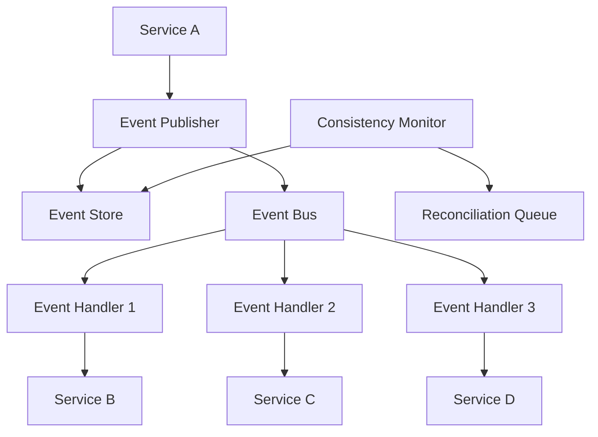

# 새로운 패턴 발견과 정의

## **서론: 패턴을 넘어선 창조의 영역**

> *"진정한 마스터는 기존 패턴을 완벽히 구사할 뿐만 아니라, 새로운 문제에 대한 혁신적인 해결책을 창조한다. 패턴의 마지막 단계는 새로운 패턴을 발견하고 정의하는 것이다."*

**새로운 패턴의 발견과 정의**는 소프트웨어 아키텍처의 최고 수준입니다. 이 글에서는 반복적인 설계 문제를 식별하고, 이를 체계적인 패턴으로 추상화하는 방법을 탐구합니다.

### **패턴 창조의 핵심 원리**
- **문제 패턴 인식**: 반복되는 설계 문제의 본질 파악
- **해결책 추상화**: 구체적 솔루션에서 일반화 가능한 구조 도출
- **컨텍스트 분석**: 패턴이 적용되는 상황과 제약 조건 명확화
- **커뮤니티 검증**: 동료들과의 협업을 통한 패턴의 유효성 검증

## **1. 패턴 발견 프로세스**

### **1.1 반복되는 문제 식별**

```java
/**
 * 패턴 발견 예시: 마이크로서비스 간 데이터 일관성 문제
 * 
 * 문제 상황:
 * - 여러 마이크로서비스에서 동일한 엔티티를 사용
 * - 각 서비스마다 자체 데이터베이스 보유
 * - 데이터 변경 시 모든 관련 서비스에 일관성 있게 전파 필요
 * - 네트워크 장애나 서비스 다운타임 시에도 최종적 일관성 보장
 */

// 문제 상황 1: 사용자 서비스에서 사용자 정보 업데이트
@Service
public class UserService {
    public void updateUser(User user) {
        userRepository.save(user);
        
        // 다른 서비스들에 알림 - 이 부분에서 문제 발생
        // 1. 동기 호출 시 타임아웃 위험
        // 2. 일부 서비스 실패 시 불일치 발생
        // 3. 트랜잭션 경계 문제
        orderService.updateCustomerInfo(user);     // 실패 가능
        billingService.updateCustomerInfo(user);   // 실패 가능
        shippingService.updateCustomerInfo(user);  // 실패 가능
    }
}

// 문제 상황 2: 재고 서비스에서 상품 정보 변경
@Service
public class InventoryService {
    public void updateProduct(Product product) {
        productRepository.save(product);
        
        // 동일한 패턴의 문제
        catalogService.updateProductInfo(product);
        pricingService.updateProductInfo(product);
        recommendationService.updateProductInfo(product);
    }
}

/**
 * 패턴 식별:
 * 
 * 1단계: 공통점 발견
 * - 모든 서비스가 데이터 변경 후 다른 서비스들에 알림
 * - 동기 호출로 인한 결합도와 장애 전파 문제
 * - 부분 실패 시 데이터 불일치 위험
 * - 트랜잭션 관리의 복잡성
 * 
 * 2단계: 해결 방향 탐색
 * - 비동기 메시징으로 결합도 감소
 * - 이벤트 소싱으로 변경 이력 추적
 * - 보상 트랜잭션으로 일관성 복구
 * 
 * 3단계: 새로운 패턴 후보 도출
 * - "Distributed Event-Driven Consistency Pattern"
 */
```

### **1.2 패턴 추상화 과정**

```java
/**
 * 새로운 패턴 정의: Distributed Event-Driven Consistency Pattern
 * 
 * Intent: 마이크로서비스 환경에서 분산된 데이터의 최종적 일관성을 
 *         이벤트 기반 아키텍처를 통해 보장한다
 * 
 * Problem: 
 * - 여러 서비스가 동일한 비즈니스 엔티티의 복사본을 관리
 * - 한 서비스에서의 데이터 변경이 모든 관련 서비스에 반영되어야 함
 * - 분산 환경의 네트워크 지연, 장애, 부분 실패 상황 대응 필요
 * - 강한 일관성 대신 최종적 일관성으로 성능과 가용성 확보
 * 
 * Solution: 이벤트 발행/구독 메커니즘과 보상 로직을 결합한 
 *          분산 데이터 일관성 관리 패턴
 */

// 패턴 구성 요소 1: Event Publisher (이벤트 발행자)
@Component
public class ConsistencyEventPublisher {
    private final ApplicationEventPublisher eventPublisher;
    private final EventStore eventStore;
    private final RetryableEventQueue retryQueue;
    
    public <T> void publishConsistencyEvent(String aggregateId, 
                                          String eventType, 
                                          T eventData, 
                                          List<String> targetServices) {
        // 1. 이벤트 생성 및 저장
        ConsistencyEvent<T> event = ConsistencyEvent.<T>builder()
            .eventId(UUID.randomUUID().toString())
            .aggregateId(aggregateId)
            .eventType(eventType)
            .eventData(eventData)
            .targetServices(targetServices)
            .timestamp(Instant.now())
            .status(EventStatus.CREATED)
            .build();
            
        eventStore.save(event);
        
        // 2. 이벤트 발행
        try {
            eventPublisher.publishEvent(event);
            eventStore.updateStatus(event.getEventId(), EventStatus.PUBLISHED);
        } catch (Exception e) {
            eventStore.updateStatus(event.getEventId(), EventStatus.FAILED);
            retryQueue.enqueue(event);
        }
    }
}

// 패턴 구성 요소 2: Consistency Event Handler
public abstract class ConsistencyEventHandler<T> {
    
    @EventListener
    public void handleConsistencyEvent(ConsistencyEvent<T> event) {
        if (!canHandle(event)) {
            return;
        }
        
        String serviceName = getServiceName();
        if (!event.getTargetServices().contains(serviceName)) {
            return;
        }
        
        try {
            // 1. 멱등성 확인
            if (isAlreadyProcessed(event.getEventId())) {
                markAsProcessed(event, ProcessingStatus.DUPLICATE);
                return;
            }
            
            // 2. 비즈니스 로직 실행
            ProcessingResult result = processEvent(event.getEventData());
            
            // 3. 처리 결과 기록
            if (result.isSuccessful()) {
                markAsProcessed(event, ProcessingStatus.SUCCESS);
            } else {
                markAsProcessed(event, ProcessingStatus.FAILED);
                scheduleRetry(event, result.getRetryDelay());
            }
            
        } catch (Exception e) {
            markAsProcessed(event, ProcessingStatus.ERROR);
            handleProcessingError(event, e);
        }
    }
    
    // 하위 클래스에서 구현할 추상 메서드
    protected abstract boolean canHandle(ConsistencyEvent<T> event);
    protected abstract ProcessingResult processEvent(T eventData);
    protected abstract String getServiceName();
}

// 구체적인 사용 예시
@Service
public class UserConsistencyService {
    
    // 사용자 정보 변경 시 일관성 이벤트 발행
    @Transactional
    public void updateUser(User user) {
        // 1. 로컬 데이터 업데이트
        User savedUser = userRepository.save(user);
        
        // 2. 일관성 이벤트 발행
        List<String> targetServices = Arrays.asList(
            "order-service", 
            "billing-service", 
            "shipping-service"
        );
        
        consistencyEventPublisher.publishConsistencyEvent(
            savedUser.getId().toString(),
            "UserUpdated",
            savedUser,
            targetServices
        );
    }
}
```

##️ **2. 패턴 문서화 템플릿**

### **2.1 패턴 명세서 작성**

```markdown
# Distributed Event-Driven Consistency Pattern

## Pattern Classification
- **Category**: Architectural Pattern
- **Type**: Integration Pattern
- **Domain**: Microservices, Distributed Systems
- **Complexity**: High
- **Maturity**: Emerging

## Intent
분산 마이크로서비스 환경에서 여러 서비스 간의 데이터 일관성을 이벤트 기반 아키텍처를 통해 최종적으로 보장한다.

## Also Known As
- Event-Driven Data Synchronization Pattern
- Microservice Consistency Pattern
- Distributed State Synchronization Pattern

## Motivation
### 문제 상황
전자상거래 플랫폼에서 사용자 정보는 다음 서비스들에서 복제되어 사용된다:
- 사용자 서비스 (마스터 데이터)
- 주문 서비스 (고객 정보)
- 결제 서비스 (청구 정보)
- 배송 서비스 (배송지 정보)

사용자가 주소를 변경하면 모든 서비스의 정보가 일관되게 업데이트되어야 한다.

### 기존 해결책의 한계
1. **동기식 API 호출**: 높은 결합도, 장애 전파, 성능 저하
2. **2PC (Two-Phase Commit)**: 가용성 저하, 확장성 문제
3. **Saga Pattern**: 복잡한 보상 로직, 구현 어려움

## Applicability
다음 상황에서 이 패턴을 사용한다:
- 마이크로서비스 간 데이터 동기화가 필요한 경우
- 강한 일관성보다 최종적 일관성이 허용되는 경우
- 서비스 간 결합도를 낮추고 싶은 경우
- 분산 환경에서 장애 격리가 중요한 경우

## Structure


## Participants
- **Event Publisher**: 데이터 변경 시 일관성 이벤트 발행
- **Event Store**: 이벤트 영속화 및 상태 관리
- **Event Bus**: 이벤트 라우팅 및 전달
- **Event Handler**: 각 서비스별 이벤트 처리 로직
- **Consistency Monitor**: 일관성 상태 모니터링 및 복구

## Collaborations
1. Service A에서 데이터 변경 발생
2. Event Publisher가 일관성 이벤트 생성 및 발행
3. Event Store에 이벤트 영속화
4. Event Bus를 통해 관련 서비스들에 이벤트 전달
5. 각 서비스의 Event Handler가 이벤트 처리
6. Consistency Monitor가 일관성 상태 감시
7. 불일치 발견 시 자동 복구 프로세스 실행

## Consequences
### 장점
- **낮은 결합도**: 서비스 간 직접적인 의존성 제거
- **높은 가용성**: 일부 서비스 장애가 전체에 영향 없음
- **확장성**: 새로운 서비스 추가 용이
- **복원력**: 자동 재시도 및 복구 메커니즘

### 단점
- **복잡성**: 이벤트 스토어, 모니터링 시스템 필요
- **최종적 일관성**: 즉시 일관성 보장 불가
- **디버깅 어려움**: 분산된 이벤트 플로우 추적 복잡
- **운영 오버헤드**: 추가적인 인프라 및 모니터링 필요

## Implementation
### 구현 고려사항
1. **이벤트 스키마 진화**: 버전 관리 및 하위 호환성
2. **멱등성**: 동일 이벤트 중복 처리 방지
3. **순서 보장**: 필요 시 이벤트 순서 처리
4. **에러 처리**: 재시도 정책 및 DLQ 구성
5. **모니터링**: 일관성 메트릭 및 알람

### 구현 변형
- **At-least-once delivery**: 중복 허용, 멱등성으로 해결
- **At-most-once delivery**: 중복 방지, 손실 가능성 존재
- **Exactly-once delivery**: 복잡하지만 정확한 전달 보장

## Sample Code
[위의 Java 구현 예시 참조]

## Known Uses
- **Netflix**: 마이크로서비스 간 데이터 동기화
- **Uber**: 여행 정보 및 결제 데이터 일관성
- **Amazon**: 주문 및 재고 시스템 동기화
- **Spotify**: 사용자 플레이리스트 및 추천 시스템

## Related Patterns
- **Event Sourcing**: 모든 변경을 이벤트로 저장
- **CQRS**: 읽기/쓰기 모델 분리
- **Saga Pattern**: 분산 트랜잭션 관리
- **Outbox Pattern**: 트랜잭션과 이벤트 발행의 원자성 보장

## References
- Martin Fowler, "Event-Driven Architecture"
- Chris Richardson, "Microservices Patterns"
- Vaughn Vernon, "Implementing Domain-Driven Design"
```

### **2.2 패턴 검증 과정**

```java
// 패턴 검증을 위한 실험적 구현
@Component
public class PatternValidationFramework {
    
    // 1. 패턴 효과성 측정
    public PatternEffectivenessReport validatePattern(String patternName, Duration testPeriod) {
        PatternEffectivenessReport report = new PatternEffectivenessReport(patternName);
        
        // 성능 메트릭 수집
        PerformanceMetrics performance = measurePerformance(patternName, testPeriod);
        report.setPerformanceMetrics(performance);
        
        // 복잡성 분석
        ComplexityAnalysis complexity = analyzeComplexity(patternName);
        report.setComplexityAnalysis(complexity);
        
        // 유지보수성 평가
        MaintainabilityScore maintainability = evaluateMaintainability(patternName);
        report.setMaintainabilityScore(maintainability);
        
        // 적용 가능성 검증
        ApplicabilityAssessment applicability = assessApplicability(patternName);
        report.setApplicabilityAssessment(applicability);
        
        return report;
    }
    
    // 2. 커뮤니티 피드백 수집
    public CommunityFeedback collectCommunityFeedback(String patternName) {
        CommunityFeedback feedback = new CommunityFeedback(patternName);
        
        // 개발자 설문 조사
        List<DeveloperSurveyResponse> surveyResponses = 
            surveyService.conductPatternSurvey(patternName);
        feedback.setSurveyResponses(surveyResponses);
        
        // 코드 리뷰에서의 패턴 언급 분석
        List<CodeReviewMention> reviewMentions = 
            codeReviewAnalyzer.findPatternMentions(patternName);
        feedback.setReviewMentions(reviewMentions);
        
        return feedback;
    }
}
```

## **3. 패턴 진화와 개선**

### **3.1 AI 기반 패턴 발견**

```java
// AI 기반 패턴 발견 시스템
@Component
public class AIPatternDiscovery {
    
    private final MachineLearningService mlService;
    private final CodeAnalysisService codeAnalysisService;
    
    // 코드베이스에서 패턴 후보 발견
    public List<PatternCandidate> discoverPatternCandidates(Repository repository) {
        // 1. 코드 구조 분석
        List<CodeStructure> structures = codeAnalysisService.analyzeStructures(repository);
        
        // 2. 반복 패턴 탐지
        List<RepetitivePattern> repetitivePatterns = 
            mlService.findRepetitivePatterns(structures);
        
        // 3. 패턴 후보 생성
        List<PatternCandidate> candidates = new ArrayList<>();
        for (RepetitivePattern pattern : repetitivePatterns) {
            if (pattern.getFrequency() >= MIN_PATTERN_FREQUENCY &&
                pattern.getComplexity() >= MIN_PATTERN_COMPLEXITY) {
                
                PatternCandidate candidate = PatternCandidate.builder()
                    .name(generatePatternName(pattern))
                    .structure(pattern.getStructure())
                    .occurrences(pattern.getOccurrences())
                    .confidence(pattern.getConfidence())
                    .suggestedIntent(inferIntent(pattern))
                    .potentialBenefits(analyzeBenefits(pattern))
                    .build();
                    
                candidates.add(candidate);
            }
        }
        
        return candidates;
    }
    
    // 패턴 의도 추론
    private String inferIntent(RepetitivePattern pattern) {
        // NLP 모델을 사용한 의도 추론
        List<String> contextClues = extractContextClues(pattern);
        String inferredIntent = nlpService.inferIntent(contextClues);
        
        return inferredIntent;
    }
}
```

### **3.2 미래 지향적 패턴 개발**

```java
// 진화하는 패턴 생태계
@Component
public class EvolvingPatternEcosystem {
    
    // 기술 트렌드 기반 패턴 진화 예측
    public List<PatternEvolutionPrediction> predictPatternEvolution() {
        List<PatternEvolutionPrediction> predictions = new ArrayList<>();
        
        // 1. 클라우드 네이티브 패턴
        predictions.add(PatternEvolutionPrediction.builder()
            .domain("Cloud Native")
            .emergingPatterns(Arrays.asList(
                "Serverless Function Orchestration Pattern",
                "Container-to-Container Communication Pattern",
                "Multi-Cloud Data Consistency Pattern"
            ))
            .drivingForces(Arrays.asList(
                "Container adoption growth",
                "Serverless computing maturation",
                "Multi-cloud strategies"
            ))
            .timeframe("2-3 years")
            .adoptionProbability(0.85)
            .build());
        
        // 2. AI/ML 통합 패턴
        predictions.add(PatternEvolutionPrediction.builder()
            .domain("AI/ML Integration")
            .emergingPatterns(Arrays.asList(
                "Model-as-a-Service Integration Pattern",
                "Real-time ML Inference Pattern",
                "AI-Driven Auto-scaling Pattern"
            ))
            .drivingForces(Arrays.asList(
                "AI democratization",
                "Edge AI deployment",
                "MLOps maturation"
            ))
            .timeframe("1-2 years")
            .adoptionProbability(0.75)
            .build());
        
        return predictions;
    }
}
```

## **실습 과제**

### **과제 1: 패턴 발견 실습**
현재 작업 중인 프로젝트에서 반복되는 설계 문제를 찾고, 새로운 패턴으로 추상화해보세요.

### **과제 2: 패턴 문서 작성**
발견한 패턴에 대해 완전한 패턴 명세서를 작성하고, 동료들과 검토해보세요.

### **과제 3: 패턴 구현 및 검증**
새로운 패턴을 실제로 구현하고, 효과성을 측정하는 실험을 설계해보세요.

## **토론 주제**

1. **패턴의 생명주기**: 패턴은 언제 탄생하고 언제 사라지는가?
2. **기술 진화와 패턴**: 새로운 기술이 기존 패턴에 미치는 영향
3. **패턴의 표준화**: 커뮤니티 주도 vs 기업 주도의 패턴 발전

## **참고 자료**

- **도서**: "Pattern-Oriented Software Architecture" by Frank Buschmann
- **도서**: "A Pattern Language" by Christopher Alexander
- **논문**: "Discovering Patterns in Software Through Visual Analytics"
- **컨퍼런스**: EuroPLoP, PLoP (Pattern Languages of Programs)
- **커뮤니티**: The Hillside Group, Pattern Languages of Programming

---

## **시리즈 완결**

**축하합니다!** 24편에 걸친 디자인 패턴 마스터 시리즈를 완주하셨습니다. 여러분은 이제:

✅ **기초부터 고급까지** - GoF 23개 패턴의 완전한 이해  
✅ **실무 활용 능력** - 실제 프로젝트에 패턴을 적용하는 능력  
✅ **아키텍처 설계 역량** - 복잡한 시스템을 우아하게 설계하는 능력  
✅ **패턴 창조 능력** - 새로운 문제에 대한 혁신적 솔루션 개발 능력

### **다음 단계 제안**
1. **실제 프로젝트 적용**: 학습한 패턴들을 실무에 활용
2. **팀 지식 공유**: 동료들과 패턴 지식 공유 및 토론
3. **오픈소스 기여**: 패턴을 활용한 오픈소스 프로젝트 참여
4. **새로운 패턴 탐구**: 여러분만의 독창적인 패턴 발견과 정의

> *"패턴 마스터의 여정은 끝이 아닌 새로운 시작입니다. 여러분이 창조할 혁신적인 솔루션을 기대합니다!"*
