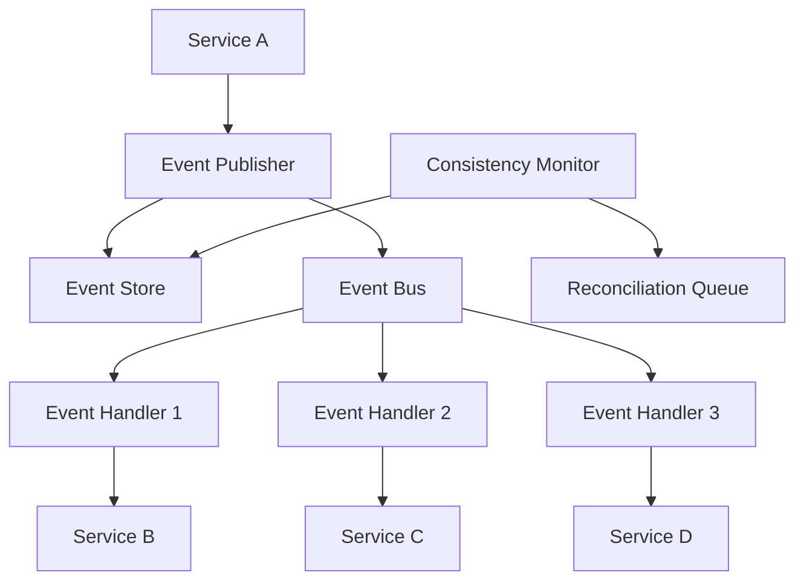

반복적인 설계 문제를 식별하고 체계적인 패턴으로 추상화하는 방법을 탐구합니다. 패턴 창조자로서 새로운 솔루션을 발견하고 문서화하는 기법을 학습합니다.

## 서론: 패턴을 넘어선 창조의 영역

> *"진정한 마스터는 기존 패턴을 완벽히 구사할 뿐만 아니라, 새로운 문제에 대한 혁신적인 해결책을 창조한다. 패턴의 마지막 단계는 새로운 패턴을 발견하고 정의하는 것이다."*

**새로운 패턴의 발견과 정의**는 소프트웨어 아키텍처의 최고 수준입니다. 이 글에서는 반복적인 설계 문제를 식별하고, 이를 체계적인 패턴으로 추상화하는 방법을 탐구합니다.

### 패턴 창조의 핵심 원리

패턴을 창조하는 작업은 네 단계가 순차적이라기보다 서로를 되먹임하는 순환 구조를 이룬다. 먼저 **문제 패턴 인식** 단계에서는 표면적으로 다른 코드처럼 보이는 여러 사례에서 반복되는 설계 문제의 본질을 가려낸다. 예를 들어 "여러 서비스에 알림을 보낸다"는 표면 현상이 아니라 "동기 호출에 의존한 결합도와 부분 실패 시 불일치"라는 구조적 본질을 짚어야 진짜 문제 패턴이다. 이어지는 **해결책 추상화**는 특정 언어·프레임워크에 종속된 구체적 코드에서, 다른 컨텍스트에도 옮겨 적용할 수 있는 일반화된 구조(참여자와 그 협력 관계)를 도출하는 작업이다. 이 추상화가 지나치게 이르면 앞서 살펴본 성급한 일반화의 함정에 빠지고, 지나치게 늦으면 패턴이 영영 문서화되지 못한 채 조직의 암묵지로만 남는다.

세 번째 단계인 **컨텍스트 분석**은 "이 패턴이 통하는 상황"과 "통하지 않는 상황"의 경계를 명시적으로 긋는 작업이며, GoF의 Applicability 절이 정확히 이 역할을 한다. 컨텍스트를 생략한 패턴 문서는 독자가 아무 상황에나 적용하다가 실패하고, 결국 "이 패턴은 쓸모없다"는 잘못된 결론으로 이어지기 쉽다. 마지막 **커뮤니티 검증**은 저자 한 사람의 주장을 패턴으로 승격시키는 유일한 통로다. Christopher Alexander의 패턴 언어 전통과 이를 소프트웨어에 도입한 PLoP(Pattern Languages of Programs) 컨퍼런스는 모두 저자가 초안을 발표하고 동료들이 실제 사례로 반박·보완하는 "shepherding" 절차를 표준 관행으로 삼는다. 이 네 단계를 관통하는 원칙은 하나다 — 패턴은 개인의 발명품이 아니라 여러 독립적 관찰자가 같은 구조를 서로 다른 곳에서 재확인했을 때만 패턴이라는 이름을 얻을 자격을 갖춘다.

## 패턴 발견 프로세스

### 흔한 오개념: 성급한 일반화의 함정

패턴을 발견하는 과정에서 가장 흔히 저지르는 실수는 하나 또는 두 개의 유사한 코드를 보고 곧바로 "패턴을 발견했다"고 선언하는 것이다. 이는 표본이 부족한 상태에서 결론을 내리는 성급한 일반화(hasty generalization)의 전형적인 사례다. 두 코드가 비슷해 보이는 이유는 실제로 같은 문제 구조를 공유하기 때문일 수도 있지만, 단순히 같은 시기에 같은 팀이 비슷한 스타일로 작성했기 때문일 수도 있다. 후자의 경우 이름을 붙이고 문서화까지 진행해도, 세 번째·네 번째 사례에 적용하려는 순간 억지로 끼워 맞춘 추상화라는 사실이 드러난다.

GoF가 패턴을 정리하기 전 여러 실제 시스템에서 반복 사례를 먼저 수집한 것도 이 때문이다. 패턴은 "발명"되는 것이 아니라 "발견"되는 것이며, 발견을 주장하려면 서로 무관한 최소 3개 이상의 독립적 컨텍스트(다른 팀, 다른 도메인, 혹은 다른 시점)에서 동일한 문제-해결 구조가 반복되는지 확인해야 한다. 이 글 후반부의 "패턴 품질 평가 기준" 표에서 재사용성 항목의 검증 방법으로 "3+ 독립 사례"를 명시한 이유도 여기에 있다. 사례가 2개 이하라면 그것은 아직 패턴이 아니라 패턴 후보(candidate)일 뿐이며, 더 많은 컨텍스트에서 검증될 때까지 이름 확정과 전파를 보류하는 것이 안전하다.

### 반복되는 문제 식별

```java
import org.springframework.stereotype.Service;
// User, Product는 각 서비스가 관리하는 도메인 엔티티(별도 정의 생략)

/**
 * 패턴 발견 예시: 마이크로서비스 간 데이터 일관성 문제
 * 
 * 문제 상황:
 * - 여러 마이크로서비스에서 동일한 엔티티를 사용
 * - 각 서비스마다 자체 데이터베이스 보유
 * - 데이터 변경 시 모든 관련 서비스에 일관성 있게 전파 필요
 * - 네트워크 장애나 서비스 다운타임 시에도 최종적 일관성 보장
 */

// 각 서비스가 의존하는 최소 계약(저장소·원격 호출)을 인터페이스로 선언한다
interface UserRepository { void save(User user); }
interface OrderServiceClient { void updateCustomerInfo(User user); }
interface BillingServiceClient { void updateCustomerInfo(User user); }
interface ShippingServiceClient { void updateCustomerInfo(User user); }

// 문제 상황 1: 사용자 서비스에서 사용자 정보 업데이트
@Service
public class UserService {
    private final UserRepository userRepository;
    private final OrderServiceClient orderService;
    private final BillingServiceClient billingService;
    private final ShippingServiceClient shippingService;

    public UserService(UserRepository userRepository, OrderServiceClient orderService,
                        BillingServiceClient billingService, ShippingServiceClient shippingService) {
        this.userRepository = userRepository;
        this.orderService = orderService;
        this.billingService = billingService;
        this.shippingService = shippingService;
    }

    public void updateUser(User user) {
        userRepository.save(user);
        
        // 다른 서비스들에 알림 - 이 부분에서 문제 발생
        // 1. 동기 호출 시 타임아웃 위험
        // 2. 일부 서비스 실패 시 불일치 발생
        // 3. 트랜잭션 경계 문제
        orderService.updateCustomerInfo(user);     // 실패 가능
        billingService.updateCustomerInfo(user);   // 실패 가능
        shippingService.updateCustomerInfo(user);  // 실패 가능
    }
}

interface ProductRepository { void save(Product product); }
interface CatalogServiceClient { void updateProductInfo(Product product); }
interface PricingServiceClient { void updateProductInfo(Product product); }
interface RecommendationServiceClient { void updateProductInfo(Product product); }

// 문제 상황 2: 재고 서비스에서 상품 정보 변경
@Service
public class InventoryService {
    private final ProductRepository productRepository;
    private final CatalogServiceClient catalogService;
    private final PricingServiceClient pricingService;
    private final RecommendationServiceClient recommendationService;

    public InventoryService(ProductRepository productRepository, CatalogServiceClient catalogService,
                             PricingServiceClient pricingService, RecommendationServiceClient recommendationService) {
        this.productRepository = productRepository;
        this.catalogService = catalogService;
        this.pricingService = pricingService;
        this.recommendationService = recommendationService;
    }

    public void updateProduct(Product product) {
        productRepository.save(product);
        
        // 동일한 패턴의 문제
        catalogService.updateProductInfo(product);
        pricingService.updateProductInfo(product);
        recommendationService.updateProductInfo(product);
    }
}

/**
 * 패턴 식별:
 * 
 * 1단계: 공통점 발견
 * - 모든 서비스가 데이터 변경 후 다른 서비스들에 알림
 * - 동기 호출로 인한 결합도와 장애 전파 문제
 * - 부분 실패 시 데이터 불일치 위험
 * - 트랜잭션 관리의 복잡성
 * 
 * 2단계: 해결 방향 탐색
 * - 비동기 메시징으로 결합도 감소
 * - 이벤트 소싱으로 변경 이력 추적
 * - 보상 트랜잭션으로 일관성 복구
 * 
 * 3단계: 새로운 패턴 후보 도출
 * - "Distributed Event-Driven Consistency Pattern"
 */
```

### 안티패턴과의 경계: 왜 이것이 "패턴"이지 "안티패턴"이 아닌가

새 패턴을 제안하기 전에 반드시 짚어야 할 질문이 있다. 방금 본 `UserService`의 동기 호출 방식도 누군가에게는 "여러 서비스에 알림을 보내는 재사용 가능한 구조"로 보일 수 있는데, 왜 이것은 패턴이 아니라 안티패턴의 사례인가? 이 구분을 명확히 하지 못하면 패턴 창조자는 결함 있는 구조에 그럴듯한 이름만 붙이는 결과를 낳는다. <strong>안티패턴(Anti-pattern)</strong>이라는 용어는 Andrew Koenig가 1995년 *Journal of Object-Oriented Programming* 8권 1호(46~48쪽)에 실은 글에서 처음 제안했다. 그는 안티패턴을 "패턴과 마찬가지의 형태를 갖추고 있지만, 해결책 대신 표면적으로는 해결책처럼 보여도 실제로는 해결책이 아닌 것을 제시하는 것"이라고 정의했다.

> "An antipattern is just like a pattern, except that instead of a solution it gives something that looks superficially like a solution, but isn't one." — Andrew Koenig, *Journal of Object-Oriented Programming* 8(1), 46-48 (1995)

이후 William J. Brown, Raphael C. Malveau, Hays W. "Skip" McCormick III, Thomas J. Mowbray가 1998년 출간한 『AntiPatterns: Refactoring Software, Architectures, and Projects in Crisis』(Wiley)는 이 개념을 소프트웨어 설계뿐 아니라 아키텍처와 프로젝트 관리 영역까지 확장하며 40여 개의 구체적 안티패턴을 정리했다. 두 정의가 공통으로 강조하는 핵심은 "처음에는 합리적으로 보인다"는 점이다. 패턴과 안티패턴을 코드 한 줄만 보고 구분할 수 없는 이유가 여기 있다 — 둘 다 실제로 동작하고, 둘 다 당장의 요구사항을 충족한다. 차이는 시스템이 성장할 때 드러난다. 동기 호출 방식은 서비스가 2~3개일 때는 문제없이 동작하지만, 서비스가 늘어나고 트래픽이 증가할수록 결합도·장애 전파·트랜잭션 경계 문제가 누적되어 결국 "고쳐야 할 구조"로 판명된다. 이런 성격 때문에 이 상황은 흔히 **Chatty Service(수다스러운 서비스 호출)** 또는 **Distributed Monolith(분산 모놀리스)** 안티패턴으로 불린다 — 물리적으로는 나뉘었지만 논리적으로는 여전히 강하게 결합된 모놀리스라는 뜻이다.

패턴과 안티패턴을 가르는 기준은 다음 표로 정리된다. 앞서 본 문제 코드(Chatty Service)와 이 절 뒤에서 정의할 Distributed Event-Driven Consistency Pattern을 같은 축으로 비교했다.

| 평가 축 | Chatty Service 안티패턴 (동기 호출) | Distributed Event-Driven Consistency Pattern |
|---------|-----------------------------------|----------------------------------------------|
| 결합도 | 호출자가 모든 수신자의 존재와 가용성을 알아야 함 | 발행자는 이벤트만 알고, 수신자 목록에 무지(Publisher-Subscriber) |
| 장애 전파 | 한 수신 서비스 장애가 호출자 트랜잭션 전체를 실패시킴 | 개별 핸들러 실패가 재시도 큐로 격리되어 다른 흐름에 전파되지 않음 |
| 일관성 모델 | "즉시 일관성"을 시도하지만 실패 시 부분 실패로 인해 오히려 불일치 | 최종적 일관성(Eventual Consistency)을 설계 전제로 명시 |
| 확장 시 특징 | 서비스가 늘수록 호출자의 의존 그래프가 선형으로 커짐 | 새 구독자 추가가 발행자 코드 변경 없이 가능 |
| 대표 재발견 위치 | 모놀리스를 급하게 마이크로서비스로 쪼갠 초기 코드에서 반복 관찰됨 | 이벤트 소싱·메시지 큐 기반 시스템에서 반복 관찰됨(3+ 독립 사례로 검증) |

이 비교가 보여주듯, 패턴 창조는 "안티패턴을 무엇으로 대체할 것인가"라는 질문에 대한 답이기도 하다. 안티패턴 자체를 문서화하는 것도 가치가 있다 — Brown 외(1998)의 책이 성공한 이유는 "이렇게 하지 마라"는 경고와 "대신 이렇게 리팩토링하라"는 처방을 함께 제시했기 때문이다. 새로운 패턴을 정의할 때도 마찬가지로, 그 패턴이 대체하는 안티패턴의 이름과 실패 조건을 함께 밝히면 독자가 "언제 이 패턴이 필요한가"를 훨씬 빠르게 판단할 수 있다.

### 패턴 추상화 과정

이론적으로 추상화된 패턴은 GoF의 Intent-Problem-Solution 3단 구조를 따를 때 가장 잘 전달된다. **Intent**는 패턴이 해결하는 문제를 한 문장으로 압축한 것이고, **Problem**은 그 문제가 발생하는 구체적 조건(분산 환경, 부분 실패, 네트워크 지연 등)을 나열한 것이며, **Solution**은 참여자들의 역할과 협력 관계로 표현된 구조적 해법이다. 이 세 요소를 코드보다 먼저 정리하는 이유는, 코드는 특정 언어의 문법에 묶이지만 Intent-Problem-Solution은 언어를 넘어 다른 스택에서도 같은 구조를 재현할 수 있게 해주기 때문이다. 아래 코드는 앞서 표로 비교한 패턴의 Solution 부분을 Java로 구체화한 것이다.

```java
import java.time.Duration;
import java.time.Instant;
import java.util.Arrays;
import java.util.List;
import java.util.UUID;
import org.springframework.context.ApplicationEventPublisher;
import org.springframework.context.event.EventListener;
import org.springframework.stereotype.Component;
import org.springframework.stereotype.Service;
import org.springframework.transaction.annotation.Transactional;
// User: id 필드를 가진 도메인 엔티티(1번 예시와 동일하게 정의 생략, getId()는 UUID 등 toString 가능한 식별자 반환을 가정)

/**
 * 새로운 패턴 정의: Distributed Event-Driven Consistency Pattern
 * 
 * Intent: 마이크로서비스 환경에서 분산된 데이터의 최종적 일관성을 
 *         이벤트 기반 아키텍처를 통해 보장한다
 * 
 * Problem: 
 * - 여러 서비스가 동일한 비즈니스 엔티티의 복사본을 관리
 * - 한 서비스에서의 데이터 변경이 모든 관련 서비스에 반영되어야 함
 * - 분산 환경의 네트워크 지연, 장애, 부분 실패 상황 대응 필요
 * - 강한 일관성 대신 최종적 일관성으로 성능과 가용성 확보
 * 
 * Solution: 이벤트 발행/구독 메커니즘과 보상 로직을 결합한 
 *          분산 데이터 일관성 관리 패턴
 */

// 이벤트 처리 상태
enum EventStatus {
    CREATED, PUBLISHED, FAILED
}

// 패턴이 다루는 이벤트 페이로드: 원본 데이터 변경 사실과 전파 대상을 함께 담는다.
// 이벤트는 생성된 후 절대 값이 바뀌지 않는 불변 객체이므로, 부분 필드만 채워 재사용하는
// Builder의 이점이 필요 없다. record(Java 16+)를 쓰면 생성자·getter·equals/hashCode를
// 한 줄의 컴포넌트 선언으로 얻으면서 불변성까지 컴파일러가 보장한다.
record ConsistencyEvent<T>(
    String eventId, String aggregateId, String eventType, T eventData,
    List<String> targetServices, Instant timestamp, EventStatus status
) {
    static <T> ConsistencyEvent<T> create(String aggregateId, String eventType, T eventData, List<String> targetServices) {
        return new ConsistencyEvent<>(UUID.randomUUID().toString(), aggregateId, eventType, eventData,
            targetServices, Instant.now(), EventStatus.CREATED);
    }
}

// 이벤트 영속화와 상태 갱신을 담당하는 저장소
interface EventStore {
    void save(ConsistencyEvent<?> event);
    void updateStatus(String eventId, EventStatus status);
}

// 발행 실패 이벤트를 재시도 대기열에 적재하는 컴포넌트
interface RetryableEventQueue {
    void enqueue(ConsistencyEvent<?> event);
}

// 패턴 구성 요소 1: Event Publisher (이벤트 발행자)
@Component
public class ConsistencyEventPublisher {
    private final ApplicationEventPublisher eventPublisher;
    private final EventStore eventStore;
    private final RetryableEventQueue retryQueue;

    public ConsistencyEventPublisher(ApplicationEventPublisher eventPublisher,
                                      EventStore eventStore,
                                      RetryableEventQueue retryQueue) {
        this.eventPublisher = eventPublisher;
        this.eventStore = eventStore;
        this.retryQueue = retryQueue;
    }

    public <T> void publishConsistencyEvent(String aggregateId,
                                          String eventType,
                                          T eventData,
                                          List<String> targetServices) {
        // 1. 이벤트 생성 및 저장
        ConsistencyEvent<T> event = ConsistencyEvent.create(aggregateId, eventType, eventData, targetServices);
        eventStore.save(event);

        // 2. 이벤트 발행
        try {
            eventPublisher.publishEvent(event);
            eventStore.updateStatus(event.eventId(), EventStatus.PUBLISHED);
        } catch (Exception e) {
            eventStore.updateStatus(event.eventId(), EventStatus.FAILED);
            retryQueue.enqueue(event);
        }
    }
}

// 이벤트 처리 결과 상태(멱등성 체크·에러 처리 분기에 사용)
enum ProcessingStatus {
    DUPLICATE, SUCCESS, FAILED, ERROR
}

// 이벤트 처리 결과: 성공 여부와 실패 시 재시도 간격을 함께 전달한다(정적 팩토리로 두 상태만 허용)
record ProcessingResult(boolean successful, Duration retryDelay) {
    static ProcessingResult success() { return new ProcessingResult(true, Duration.ZERO); }
    static ProcessingResult failure(Duration retryDelay) { return new ProcessingResult(false, retryDelay); }
}

// 패턴 구성 요소 2: Consistency Event Handler
public abstract class ConsistencyEventHandler<T> {
    
    @EventListener
    public void handleConsistencyEvent(ConsistencyEvent<T> event) {
        if (!canHandle(event)) {
            return;
        }
        
        String serviceName = getServiceName();
        if (!event.targetServices().contains(serviceName)) {
            return;
        }
        
        try {
            // 1. 멱등성 확인
            if (isAlreadyProcessed(event.eventId())) {
                markAsProcessed(event, ProcessingStatus.DUPLICATE);
                return;
            }
            
            // 2. 비즈니스 로직 실행
            ProcessingResult result = processEvent(event.eventData());
            
            // 3. 처리 결과 기록
            if (result.successful()) {
                markAsProcessed(event, ProcessingStatus.SUCCESS);
            } else {
                markAsProcessed(event, ProcessingStatus.FAILED);
                scheduleRetry(event, result.retryDelay());
            }
            
        } catch (Exception e) {
            markAsProcessed(event, ProcessingStatus.ERROR);
            handleProcessingError(event, e);
        }
    }
    
    // 하위 클래스에서 구현할 추상 메서드
    protected abstract boolean canHandle(ConsistencyEvent<T> event);
    protected abstract ProcessingResult processEvent(T eventData);
    protected abstract String getServiceName();
    protected abstract boolean isAlreadyProcessed(String eventId);
    protected abstract void markAsProcessed(ConsistencyEvent<T> event, ProcessingStatus status);
    protected abstract void scheduleRetry(ConsistencyEvent<T> event, Duration retryDelay);
    protected abstract void handleProcessingError(ConsistencyEvent<T> event, Exception exception);
}

// 이 코드 블록 자체에서 참조하는 저장소 계약(1번 예시의 UserRepository와 같은 역할, 블록 간 재사용 없이 재선언)
interface UserRepository { User save(User user); }

// 구체적인 사용 예시
@Service
public class UserConsistencyService {

    private final UserRepository userRepository;
    private final ConsistencyEventPublisher consistencyEventPublisher;

    public UserConsistencyService(UserRepository userRepository,
                                   ConsistencyEventPublisher consistencyEventPublisher) {
        this.userRepository = userRepository;
        this.consistencyEventPublisher = consistencyEventPublisher;
    }

    // 사용자 정보 변경 시 일관성 이벤트 발행
    @Transactional
    public void updateUser(User user) {
        // 1. 로컬 데이터 업데이트
        User savedUser = userRepository.save(user);
        
        // 2. 일관성 이벤트 발행
        List<String> targetServices = Arrays.asList(
            "order-service", 
            "billing-service", 
            "shipping-service"
        );
        
        consistencyEventPublisher.publishConsistencyEvent(
            savedUser.getId().toString(),
            "UserUpdated",
            savedUser,
            targetServices
        );
    }
}
```

이 구현에서 `ConsistencyEvent`와 `ProcessingResult`를 클래스+Builder 대신 record로 선언한 이유는 두 값 객체 모두 생성된 이후 필드가 절대 바뀌지 않는 불변 데이터이기 때문이다. Builder 패턴은 선택적 필드가 많거나 생성 단계가 여러 단계로 나뉘어야 할 때 진가를 발휘하지만, 여기서는 7개(또는 2개) 필드가 한 번에 모두 채워지므로 Builder의 유연성이 필요 없고 오히려 getter·Builder 코드가 핵심 로직을 가리는 잡음이 된다. "필드가 몇 단계에 걸쳐 채워지는가"와 "생성 후 변경이 필요한가"라는 두 질문은 패턴 명세서의 Implementation 절에 반드시 남겨야 할 구현 선택 근거의 한 예이며, 이 판단을 생략하면 다음 구현자는 왜 Builder 대신 record를 썼는지 알지 못한 채 관성적으로 더 무거운 구조를 되풀이하게 된다.

## 패턴 문서화 템플릿

### 패턴 명세서 작성

패턴 명세서가 Intent·Problem·Solution 세 요소만으로 끝나지 않고 Also Known As, Applicability, Structure, Participants, Collaborations, Consequences, Implementation, Known Uses, Related Patterns까지 확장된 이유는 GoF가 1994년 『Design Patterns: Elements of Reusable Object-Oriented Software』에서 정착시킨 템플릿의 각 절이 서로 다른 독자 질문에 답하기 때문이다. Applicability는 "언제 쓰는가"를, Consequences는 "썼을 때 무엇을 얻고 무엇을 잃는가"를, Known Uses는 "정말 실전에서 쓰이는가"를 답한다. 이 절들을 생략하면 독자는 패턴의 이름과 코드는 알아도 도입 여부를 스스로 판단하지 못한다. 아래 명세서는 이 표준 템플릿을 그대로 따라 앞서 정의한 패턴을 문서화한 것이며, Structure 절의 Mermaid 다이어그램은 Participants 절의 클래스들이 실제로 어떻게 연결되는지 시각적으로 보여준다.

````markdown
# Distributed Event-Driven Consistency Pattern

## Pattern Classification
- **Category**: Architectural Pattern
- **Type**: Integration Pattern
- **Domain**: Microservices, Distributed Systems
- **Complexity**: High
- **Maturity**: Emerging

## Intent
분산 마이크로서비스 환경에서 여러 서비스 간의 데이터 일관성을 이벤트 기반 아키텍처를 통해 최종적으로 보장한다.

## Also Known As
- Event-Driven Data Synchronization Pattern
- Microservice Consistency Pattern
- Distributed State Synchronization Pattern

## Motivation
### 문제 상황
전자상거래 플랫폼에서 사용자 정보는 다음 서비스들에서 복제되어 사용된다:
- 사용자 서비스 (마스터 데이터)
- 주문 서비스 (고객 정보)
- 결제 서비스 (청구 정보)
- 배송 서비스 (배송지 정보)

사용자가 주소를 변경하면 모든 서비스의 정보가 일관되게 업데이트되어야 한다.

### 기존 해결책의 한계
1. **동기식 API 호출**: 높은 결합도, 장애 전파, 성능 저하
2. **2PC (Two-Phase Commit)**: 가용성 저하, 확장성 문제
3. **Saga Pattern**: 복잡한 보상 로직, 구현 어려움

## Applicability
다음 상황에서 이 패턴을 사용한다:
- 마이크로서비스 간 데이터 동기화가 필요한 경우
- 강한 일관성보다 최종적 일관성이 허용되는 경우
- 서비스 간 결합도를 낮추고 싶은 경우
- 분산 환경에서 장애 격리가 중요한 경우

## Structure

```mermaid
graph TB
    A[Service A] --> EP[Event Publisher]
    EP --> ES[Event Store]
    EP --> EB[Event Bus]
    EB --> EH1[Event Handler 1]
    EB --> EH2[Event Handler 2]
    EB --> EH3[Event Handler 3]
    EH1 --> SB[Service B]
    EH2 --> SC[Service C]
    EH3 --> SD[Service D]
    CM[Consistency Monitor] --> ES
    CM --> RQ[Reconciliation Queue]
```

## Participants
- **Event Publisher**: 데이터 변경 시 일관성 이벤트 발행
- **Event Store**: 이벤트 영속화 및 상태 관리
- **Event Bus**: 이벤트 라우팅 및 전달
- **Event Handler**: 각 서비스별 이벤트 처리 로직
- **Consistency Monitor**: 일관성 상태 모니터링 및 복구

## Collaborations
1. Service A에서 데이터 변경 발생
2. Event Publisher가 일관성 이벤트 생성 및 발행
3. Event Store에 이벤트 영속화
4. Event Bus를 통해 관련 서비스들에 이벤트 전달
5. 각 서비스의 Event Handler가 이벤트 처리
6. Consistency Monitor가 일관성 상태 감시
7. 불일치 발견 시 자동 복구 프로세스 실행

## Consequences
### 장점
- **낮은 결합도**: 서비스 간 직접적인 의존성 제거
- **높은 가용성**: 일부 서비스 장애가 전체에 영향 없음
- **확장성**: 새로운 서비스 추가 용이
- **복원력**: 자동 재시도 및 복구 메커니즘

### 단점
- **복잡성**: 이벤트 스토어, 모니터링 시스템 필요
- **최종적 일관성**: 즉시 일관성 보장 불가
- **디버깅 어려움**: 분산된 이벤트 플로우 추적 복잡
- **운영 오버헤드**: 추가적인 인프라 및 모니터링 필요

## Implementation
### 구현 고려사항
1. **이벤트 스키마 진화**: 버전 관리 및 하위 호환성
2. **멱등성**: 동일 이벤트 중복 처리 방지
3. **순서 보장**: 필요 시 이벤트 순서 처리
4. **에러 처리**: 재시도 정책 및 DLQ 구성
5. **모니터링**: 일관성 메트릭 및 알람

### 구현 변형
- **At-least-once delivery**: 중복 허용, 멱등성으로 해결
- **At-most-once delivery**: 중복 방지, 손실 가능성 존재
- **Exactly-once delivery**: 복잡하지만 정확한 전달 보장

## Sample Code
[위의 Java 구현 예시 참조]

## Known Uses
> 아래는 이 패턴이 실제로 어떻게 쓰일 수 있는지 보여주기 위해 저자가 구성한 가상의 예시입니다. 특정 기업이 이 패턴명을 공식적으로 채택했다는 근거는 아니며, 유사한 이벤트 기반 일관성 문제를 다루는 참고 사례로 이해해야 합니다.

- **대규모 마이크로서비스 플랫폼**: 서비스 간 데이터 동기화에 이벤트 기반 아키텍처를 적용하는 유사 사례를 참고할 수 있다
- **결제/여정 데이터 일관성이 중요한 서비스**: 여러 서비스에 걸친 데이터 일관성 보장에 이벤트 소싱을 활용하는 유사 사례를 참고할 수 있다
- **주문·재고 동기화가 필요한 커머스 플랫폼**: 최종적 일관성 모델을 적용하는 유사 사례를 참고할 수 있다
- **추천/개인화 데이터를 다루는 서비스**: 사용자 데이터 변경을 이벤트로 전파하는 유사 사례를 참고할 수 있다

## Related Patterns
- **Event Sourcing**: 모든 변경을 이벤트로 저장
- **CQRS**: 읽기/쓰기 모델 분리
- **Saga Pattern**: 분산 트랜잭션 관리
- **Outbox Pattern**: 트랜잭션과 이벤트 발행의 원자성 보장

## References
- Martin Fowler, "Event-Driven Architecture"
- Chris Richardson, "Microservices Patterns"
- Vaughn Vernon, "Implementing Domain-Driven Design"
````

### 패턴 검증 과정

패턴 명세서를 문서화하는 것과 그 패턴이 실제로 효과적인지 검증하는 것은 별개의 활동이다. 문서만 그럴듯하고 실증 데이터가 없는 패턴은 앞서 정의한 안티패턴과 종이 한 장 차이다. 검증은 크게 두 갈래로 나뉜다. 하나는 **정량적 측정**(성능, 복잡도, 유지보수성, 적용 가능성)이고, 다른 하나는 **정성적 피드백**(설문 조사, 코드 리뷰에서의 언급 빈도)이다. 아래 코드는 이 두 갈래를 각각 `validatePattern`과 `collectCommunityFeedback`으로 분리해, 수치 근거와 사람의 판단을 모두 패턴 품질 평가에 반영하는 구조를 보여준다. 측정 로직 자체(APM 연동, 정적 분석기 호출)는 프로젝트마다 도구가 다르므로 이 예제에서는 통합 지점만 정의하고, 실제 계산은 각 조직의 관측 스택에 맞게 구현한다.

정량적 측정 하나만으로 검증을 끝내면 위험한 이유는 Goodhart's Law("측정치가 목표가 되는 순간 좋은 측정치이기를 멈춘다")로 요약된다. 예를 들어 "패턴을 적용한 코드의 순환 복잡도가 낮아졌다"는 수치만 보고 유용성을 판단하면, 실제로는 복잡도를 낮추기 위해 로직을 다른 클래스로 흩어놓아 응집도가 떨어진 결과일 수도 있다 — 측정 대상이 된 지표는 개선됐지만 원래 목표(유지보수성)는 오히려 악화된 경우다. `collectCommunityFeedback`이 별도로 존재하는 이유가 여기 있다. 개발자 설문과 코드 리뷰 언급 빈도라는 정성적 채널은 수치가 놓치는 "실제로 쓰기 편한가"라는 질문에 답하며, 두 채널이 서로 어긋날 때(정량 지표는 좋은데 개발자 평판은 나쁠 때) 오히려 패턴 정의 자체를 재검토해야 한다는 신호로 읽어야 한다.

```java
import java.time.Duration;
import java.util.List;
import org.springframework.stereotype.Component;

// 검증 결과를 구성하는 값 객체 그룹: 세부 필드는 실제 측정 항목에 맞게 확장한다
class PerformanceMetrics {}
class ComplexityAnalysis {}
class MaintainabilityScore {}
class ApplicabilityAssessment {}
class DeveloperSurveyResponse {}
class CodeReviewMention {}

// 패턴 효과성 측정 결과와 커뮤니티 피드백 결과: 둘 다 "측정을 마친 뒤 한 번에 완성되는" 값이므로
// setter로 단계적으로 채우는 대신 record 정규 생성자에 네 값을 한 번에 전달해 완성한다
record PatternEffectivenessReport(
    String patternName, PerformanceMetrics performanceMetrics, ComplexityAnalysis complexityAnalysis,
    MaintainabilityScore maintainabilityScore, ApplicabilityAssessment applicabilityAssessment
) {}

record CommunityFeedback(
    String patternName, List<DeveloperSurveyResponse> surveyResponses, List<CodeReviewMention> reviewMentions
) {}

// 검증에 필요한 외부 협력자 계약
interface SurveyService {
    List<DeveloperSurveyResponse> conductPatternSurvey(String patternName);
}
interface CodeReviewAnalyzer {
    List<CodeReviewMention> findPatternMentions(String patternName);
}

// 패턴 검증을 위한 실험적 구현
@Component
public class PatternValidationFramework {

    private final SurveyService surveyService;
    private final CodeReviewAnalyzer codeReviewAnalyzer;

    public PatternValidationFramework(SurveyService surveyService, CodeReviewAnalyzer codeReviewAnalyzer) {
        this.surveyService = surveyService;
        this.codeReviewAnalyzer = codeReviewAnalyzer;
    }

    // 1. 패턴 효과성 측정 — 네 가지 측정을 모두 수행한 뒤 결과를 한 번에 record로 조립한다
    public PatternEffectivenessReport validatePattern(String patternName, Duration testPeriod) {
        return new PatternEffectivenessReport(
            patternName,
            measurePerformance(patternName, testPeriod),
            analyzeComplexity(patternName),
            evaluateMaintainability(patternName),
            assessApplicability(patternName)
        );
    }
    
    // 2. 커뮤니티 피드백 수집
    public CommunityFeedback collectCommunityFeedback(String patternName) {
        return new CommunityFeedback(
            patternName,
            surveyService.conductPatternSurvey(patternName),
            codeReviewAnalyzer.findPatternMentions(patternName)
        );
    }

    // 아래 네 메서드는 실제 프로젝트의 APM·정적 분석 도구 연동 지점이며, 측정 로직은 도구별로 구현한다
    private PerformanceMetrics measurePerformance(String patternName, Duration testPeriod) {
        return new PerformanceMetrics();
    }
    private ComplexityAnalysis analyzeComplexity(String patternName) {
        return new ComplexityAnalysis();
    }
    private MaintainabilityScore evaluateMaintainability(String patternName) {
        return new MaintainabilityScore();
    }
    private ApplicabilityAssessment assessApplicability(String patternName) {
        return new ApplicabilityAssessment();
    }
}
```

앞서 이벤트 페이로드에 record를 쓴 것과 달리, 여기서는 `PatternEffectivenessReport`와 `CommunityFeedback`을 이전 버전의 setter 누적 방식에서 "측정을 모두 끝낸 뒤 한 번에 조립"하는 방식으로 바꿨다. 두 방식의 차이는 실패 처리 방식에서 드러난다 — setter로 필드를 하나씩 채우는 구조에서는 세 번째 측정(`evaluateMaintainability`)이 예외를 던지면 앞서 채운 두 필드만 남은 반쯤 완성된 리포트 객체가 호출자에게 노출될 위험이 있다. 반면 record 생성자에 네 인자를 한 번에 전달하는 구조에서는 인자 평가 중 하나라도 실패하면 리포트 객체 자체가 아예 생성되지 않으므로, "부분적으로만 채워진 결과"라는 애매한 상태가 원천적으로 존재할 수 없다. 이는 사소한 스타일 차이가 아니라 검증 프레임워크가 반드시 지켜야 할 불변식(invariant) — "리포트는 완전하거나, 아예 존재하지 않는다" — 을 타입 수준에서 강제하는 설계 판단이다.

## 패턴 진화와 개선

### AI 기반 패턴 발견

패턴 검증이 "이미 후보로 지목된 패턴"의 효과를 측정하는 활동이라면, AI 기반 패턴 발견은 후보 자체를 코드베이스에서 자동으로 찾아내는 앞 단계를 다룬다. 이 접근은 사람이 놓치기 쉬운 대규모 반복(수백 개 저장소에 걸친 구조적 유사성)을 통계적으로 탐지할 수 있다는 장점이 있지만, 앞서 "흔한 오개념: 성급한 일반화의 함정"에서 다룬 "3개 이상의 독립 사례" 기준을 자동화된 빈도·복잡도 임계값으로 대체할 뿐이라는 한계도 함께 지닌다. 즉 AI가 제안한 후보도 여전히 사람이 Applicability와 Consequences를 채워 넣는 검토를 거쳐야 하며, 통계적으로 자주 등장한다고 해서 곧바로 유효한 패턴이 되는 것은 아니다. 아래 코드는 이 자동 탐지 파이프라인의 최소 골격이다.

```java
import java.util.ArrayList;
import java.util.List;
import org.springframework.stereotype.Component;

// 분석 대상 코드 저장소에 대한 최소 접근 계약
interface CodeRepository {
    List<String> listSourceFiles();
}

// CodeStructure: 코드 분석 단위(파일·클래스 등)를 나타내는 값 객체(세부 필드 생략)
class CodeStructure {}

// RepetitivePattern: 탐지된 반복 구조와 그 통계치를 담는 값 객체. ML 서비스가 한 번에 다섯 값을
// 모두 채워 반환하므로 단계적 채움이 필요 없어 record로 선언한다
record RepetitivePattern(int frequency, double complexity, String structure, List<String> occurrences, double confidence) {}

// PatternCandidate: AI가 제안한 패턴 후보(최종 채택 여부는 사람이 검토). 앞의 Builder 버전과 달리
// 여섯 값을 discoverPatternCandidates 안에서 동시에 계산해 한 번의 생성자 호출로 조립한다
record PatternCandidate(
    String name, String structure, List<String> occurrences, double confidence,
    String suggestedIntent, List<String> potentialBenefits
) {}

// 분석·탐지·의도 추론을 담당하는 외부 협력자 계약
interface CodeAnalysisService {
    List<CodeStructure> analyzeStructures(CodeRepository repository);
}
interface MachineLearningService {
    List<RepetitivePattern> findRepetitivePatterns(List<CodeStructure> structures);
}
interface NlpService {
    String inferIntent(List<String> contextClues);
}

// AI 기반 패턴 발견 시스템
@Component
public class AIPatternDiscovery {

    // 후보로 인정할 최소 반복 빈도·구조적 복잡도 임계값(3+ 독립 사례 기준을 통계적으로 근사)
    private static final int MIN_PATTERN_FREQUENCY = 3;
    private static final double MIN_PATTERN_COMPLEXITY = 0.6;

    private final MachineLearningService mlService;
    private final CodeAnalysisService codeAnalysisService;
    private final NlpService nlpService;

    public AIPatternDiscovery(MachineLearningService mlService,
                               CodeAnalysisService codeAnalysisService,
                               NlpService nlpService) {
        this.mlService = mlService;
        this.codeAnalysisService = codeAnalysisService;
        this.nlpService = nlpService;
    }
    
    // 코드베이스에서 패턴 후보 발견
    public List<PatternCandidate> discoverPatternCandidates(CodeRepository repository) {
        // 1. 코드 구조 분석
        List<CodeStructure> structures = codeAnalysisService.analyzeStructures(repository);
        
        // 2. 반복 패턴 탐지
        List<RepetitivePattern> repetitivePatterns = 
            mlService.findRepetitivePatterns(structures);
        
        // 3. 패턴 후보 생성
        List<PatternCandidate> candidates = new ArrayList<>();
        for (RepetitivePattern pattern : repetitivePatterns) {
            if (pattern.frequency() >= MIN_PATTERN_FREQUENCY &&
                pattern.complexity() >= MIN_PATTERN_COMPLEXITY) {

                candidates.add(new PatternCandidate(
                    generatePatternName(pattern),
                    pattern.structure(),
                    pattern.occurrences(),
                    pattern.confidence(),
                    inferIntent(pattern),
                    analyzeBenefits(pattern)
                ));
            }
        }
        
        return candidates;
    }
    
    // 패턴 의도 추론
    private String inferIntent(RepetitivePattern pattern) {
        // NLP 모델을 사용한 의도 추론
        List<String> contextClues = extractContextClues(pattern);
        return nlpService.inferIntent(contextClues);
    }

    // 아래 세 메서드는 실제 프로젝트에서 코드 분석 결과에 맞게 채워야 하는 지점이다(여기서는 최소 골격만 제시)
    private String generatePatternName(RepetitivePattern pattern) {
        return "Candidate-" + pattern.structure().hashCode();
    }

    private List<String> analyzeBenefits(RepetitivePattern pattern) {
        return List.of("결합도 감소 가능성 존재(세부 분석 필요)");
    }

    private List<String> extractContextClues(RepetitivePattern pattern) {
        return pattern.occurrences();
    }
}
```

`RepetitivePattern`과 `PatternCandidate`를 record로 바꾼 것은 앞의 두 사례와 같은 이유("생성 이후 불변", "필드가 한 번에 채워짐")지만, 여기서는 한 가지 이점이 더 있다. `discoverPatternCandidates`의 반복문 안에서 여섯 개 인자(`generatePatternName`, `pattern.structure()`, `pattern.occurrences()`, `pattern.confidence()`, `inferIntent`, `analyzeBenefits`)를 계산해 생성자에 그대로 전달하는 방식은, Builder 체이닝처럼 중간에 어떤 필드를 빠뜨렸는지 런타임에야 드러나는 실수(예: `.confidence()` 호출을 빼먹고 `build()`를 호출해도 컴파일은 통과하는 문제)를 원천 차단한다. record의 정규 생성자는 선언된 필드 수와 정확히 일치하는 인자를 컴파일 타임에 요구하므로, "이 값 객체가 몇 개의 정보로 구성되는가"라는 질문에 코드 자체가 답을 강제한다.

### 미래 지향적 패턴 개발

패턴 생태계는 기술 트렌드가 바뀔 때마다 새로 채워진다. 컨테이너·서버리스·멀티클라우드가 보편화되면서 이전에는 없던 조율 문제(예: 컨테이너 사이드카 통신, 다중 클라우드 간 데이터 일관성)가 나타났고, 이런 문제는 아직 GoF나 EIP(Enterprise Integration Patterns) 목록에 없다는 이유만으로 무시할 수 없다. 다만 이 절의 예측은 검증된 사실이 아니라 **가설**이라는 점을 분명히 해야 한다. 아래 코드가 제시하는 "채택 확률(adoptionProbability)" 수치는 예시를 위해 저자가 임의로 부여한 값이며, 실제 조사 기관의 설문이나 통계에서 나온 근거가 아니다. 새로운 패턴의 미래를 예측하는 작업은 앞서 다룬 "3+ 독립 사례" 원칙을 아직 만족하지 못한 상태이므로, 이 절의 산출물은 패턴이 아니라 관찰해야 할 **후보 영역의 지도**로 취급하는 것이 정확하다.

```java
import java.util.ArrayList;
import java.util.Arrays;
import java.util.List;
import org.springframework.stereotype.Component;
// PatternEvolutionPrediction: domain/emergingPatterns/drivingForces/timeframe/adoptionProbability 필드를 갖는 값 객체(빌더 정의 생략)

// 진화하는 패턴 생태계
@Component
public class EvolvingPatternEcosystem {
    
    // 기술 트렌드 기반 패턴 진화 예측
    public List<PatternEvolutionPrediction> predictPatternEvolution() {
        List<PatternEvolutionPrediction> predictions = new ArrayList<>();
        
        // 1. 클라우드 네이티브 패턴
        predictions.add(PatternEvolutionPrediction.builder()
            .domain("Cloud Native")
            .emergingPatterns(Arrays.asList(
                "Serverless Function Orchestration Pattern",
                "Container-to-Container Communication Pattern",
                "Multi-Cloud Data Consistency Pattern"
            ))
            .drivingForces(Arrays.asList(
                "Container adoption growth",
                "Serverless computing maturation",
                "Multi-cloud strategies"
            ))
            .timeframe("2-3 years")
            .adoptionProbability(0.85)
            .build());
        
        // 2. AI/ML 통합 패턴
        predictions.add(PatternEvolutionPrediction.builder()
            .domain("AI/ML Integration")
            .emergingPatterns(Arrays.asList(
                "Model-as-a-Service Integration Pattern",
                "Real-time ML Inference Pattern",
                "AI-Driven Auto-scaling Pattern"
            ))
            .drivingForces(Arrays.asList(
                "AI democratization",
                "Edge AI deployment",
                "MLOps maturation"
            ))
            .timeframe("1-2 years")
            .adoptionProbability(0.75)
            .build());
        
        return predictions;
    }
}
```

`adoptionProbability` 같은 단일 확률값으로 미래를 요약하고 싶은 유혹은 이해할 만하지만, 이 수치가 위험한 이유는 "3+ 독립 사례" 원칙과 정면으로 충돌하기 때문이다. 앞서 정의한 검증 원칙은 최소 세 곳의 서로 무관한 컨텍스트에서 같은 구조가 재확인되어야 패턴으로 인정한다고 못 박았는데, 아직 존재하지도 않는 미래의 사례 수를 확률로 환산하는 것은 이 원칙을 거꾸로 적용하는 셈이다 — 근거가 없는 예측에 근거가 있는 것처럼 보이는 숫자를 씌우는 행위이며, 이는 §"안티패턴과의 경계"에서 짚은 "표면적으로는 해결책처럼 보이지만 실제로는 아닌 것"과 같은 함정을 예측의 영역에서 반복하는 것이다. 그래서 이런 표를 작성하고 공유할 때는 확률 수치 자체보다 "어떤 근거로 이 영역을 후보로 골랐는가"라는 정성적 서술을 항상 함께 남겨야 하며, 뒤에 나올 "새로운 패턴 발굴 영역" 절의 표는 확률 대신 정성적 특징만 기록하는 방식으로 이 위험을 피하고 있다.

## 실습 과제

### 과제 1: 패턴 발견 실습
현재 작업 중인 프로젝트에서 반복되는 설계 문제를 찾고, 새로운 패턴으로 추상화해보세요.

### 과제 2: 패턴 문서 작성
발견한 패턴에 대해 완전한 패턴 명세서를 작성하고, 동료들과 검토해보세요.

### 과제 3: 패턴 구현 및 검증
새로운 패턴을 실제로 구현하고, 효과성을 측정하는 실험을 설계해보세요.

세 과제를 직접 손으로 풀어볼 실습 문제와 해설은 짝 글인 [새로운 패턴 발견과 정의 — 실습](/post/design-patterns/discovering-defining-new-patterns-practice/)에 정리되어 있으며, 패턴 창조 이전에 기존 GoF 패턴을 코드·설계 리뷰에 녹여내는 방법은 직전 편인 [패턴을 활용한 코드 리뷰와 설계 리뷰](/post/design-patterns/pattern-code-review-design-review/)에서 다뤘다.

## 토론 주제

1. **패턴의 생명주기**: 패턴은 언제 탄생하고 언제 사라지는가?
2. **기술 진화와 패턴**: 새로운 기술이 기존 패턴에 미치는 영향
3. **패턴의 표준화**: 커뮤니티 주도 vs 기업 주도의 패턴 발전

## 한눈에 보는 패턴 발견과 문서화

### 패턴 발견 단계와 문서화 템플릿

패턴 발견은 관찰에서 리뷰까지 6단계로 진행되며, 이 중 5단계(문서화)에서 실제로 채우는 문서가 바로 앞서 본 "Distributed Event-Driven Consistency Pattern" 명세서다. 아래 첫 번째 표는 전체 발견 프로세스의 흐름을, 두 번째 표는 5단계에서 채워야 할 문서 섹션을 요약한 색인이다.

| 단계 | 활동 | 산출물 |
|------|------|--------|
| 1. 관찰 | 반복되는 해결책 식별 | 후보 목록 |
| 2. 추상화 | 공통 구조 추출 | 초기 구조 |
| 3. 검증 | 3+ 독립적 사례 확인 | 사례 문서 |
| 4. 명명 | 의미 있는 이름 부여 | 패턴명 |
| 5. 문서화 | 표준 템플릿 작성 (아래 색인 참조) | 패턴 문서 |
| 6. 리뷰 | 커뮤니티 피드백 | 개선된 문서 |

5단계에서 채우는 패턴 명세서의 각 섹션은 다음과 같다. 앞서 본 패턴 명세 예시에서 실제로 채운 값을 함께 정리했다.

| 섹션 | 내용 | 예시 |
|------|------|------|
| **패턴명** | 직관적이고 기억하기 쉬운 이름 | Cache-Aside, Bulkhead |
| **의도(Intent)** | 패턴이 해결하는 문제 한 문장 | "캐시 미스 시 원본에서 로드" |
| **동기(Motivation)** | 문제 상황 시나리오 | 구체적인 사용 사례 |
| **적용 가능성** | 언제 사용해야 하는지 | 조건 목록 |
| **구조(Structure)** | 클래스/객체 다이어그램 | UML 또는 Mermaid |
| **참여자** | 역할별 클래스 설명 | 이름 + 책임 |
| **협력 방법** | 객체 간 상호작용 | 시퀀스 다이어그램 |
| **결과(Consequences)** | 장단점 및 트레이드오프 | 명확한 목록 |
| **구현(Implementation)** | 구현 시 고려사항 | 코드 가이드 |
| **샘플 코드** | 언어별 예제 | 실행 가능한 코드 |
| **알려진 사용** | 실제 적용 사례 | 프레임워크/라이브러리 |
| **관련 패턴** | 유사하거나 함께 쓰는 패턴 | 비교 설명 |

### 패턴 vs 관용구 vs 아키텍처 비교

"패턴"이라는 단어는 세 가지 다른 추상화 층위를 뭉뚱그려 가리킬 때가 많아 혼동을 일으킨다. <strong>관용구(Idiom)</strong>는 특정 언어의 문법적 관례에 묶인 가장 좁은 층위로, 다른 언어로 옮기면 그대로 재현되지 않는다(예: C++의 RAII는 소멸자 보장이 있는 언어에서만 성립한다). **디자인 패턴**은 클래스·객체 수준에서 언어를 넘나들며 재현되는 중간 층위이고, **아키텍처 패턴**은 프로세스·서비스 경계를 넘는 시스템 구조 수준의 가장 넓은 층위다. 이 층위를 구분해야 하는 이유는, 새로 발견한 구조를 어느 층위에 놓을지에 따라 "3+ 독립 사례"를 어디서 찾아야 하는지가 달라지기 때문이다 — 관용구는 같은 언어의 다른 코드베이스에서, 아키텍처 패턴은 다른 회사·다른 도메인의 시스템에서 사례를 찾아야 한다.

| 수준 | 범위 | 예시 | 추상화 정도 |
|------|------|------|-----------|
| 관용구 (Idiom) | 언어 특화 | RAII (C++), try-with-resources | 낮음 |
| 디자인 패턴 | 클래스/객체 | GoF 23 패턴 | 중간 |
| 아키텍처 패턴 | 시스템 구조 | MVC, Microservices | 높음 |

### 패턴 품질 평가 기준

새로 정의한 패턴을 게시하기 전, 다섯 가지 기준으로 스스로 점검할 수 있다. 재사용성은 앞서 강조한 독립 사례 수로, 명확성은 동료 리뷰어가 코드 없이 설명만 듣고도 구조를 그릴 수 있는지로 측정한다. 완전성은 앞서 본 명세서 템플릿의 12개 섹션이 모두 채워졌는지를, 정확성은 Sample Code가 실제로 컴파일·동작하는지를 확인하는 방식으로 검증한다. 유용성은 궁극적으로 "이 패턴을 적용한 팀이 실제로 문제를 해결했는가"라는 질문으로 귀결되며, 다른 네 기준을 모두 충족해도 유용성이 없으면 그 패턴은 학술적 흥미 이상의 가치를 갖기 어렵다.

| 기준 | 설명 | 평가 방법 |
|------|------|----------|
| 재사용성 | 다양한 컨텍스트 적용 | 3+ 독립 사례 |
| 명확성 | 이해하기 쉬움 | 리뷰어 피드백 |
| 완전성 | 모든 섹션 충실 | 체크리스트 |
| 정확성 | 기술적 오류 없음 | 구현 검증 |
| 유용성 | 실제 문제 해결 | 적용 사례 |

### 새로운 패턴 발굴 영역

패턴이 아직 충분히 정리되지 않은 영역은 대체로 그 기술이 아직 성숙 단계(Gartner의 hype cycle로 치면 "Plateau of Productivity" 이전)에 있다는 신호다. 클라우드 네이티브와 마이크로서비스 영역은 이미 Sidecar나 Circuit Breaker처럼 이름이 굳어진 패턴이 있지만, 반응형 시스템의 Backpressure나 머신러닝 파이프라인의 Feature Store처럼 여전히 구현마다 세부 구조가 갈리는 영역도 있다. 이런 영역에서 패턴을 발견하려는 독자는 아래 표를 출발점 삼아, 자신이 속한 조직에서 반복되는 특징을 먼저 관찰 목록으로 만드는 것이 좋다.

| 영역 | 잠재 패턴 | 특징 |
|------|----------|------|
| 클라우드 네이티브 | Sidecar, Ambassador | 컨테이너 환경 |
| 머신러닝 | Pipeline, Feature Store | ML 워크플로 |
| 이벤트 드리븐 | Event Sourcing, CQRS | 비동기 처리 |
| 마이크로서비스 | Circuit Breaker, Saga | 분산 시스템 |
| 반응형 | Backpressure, Retry | 탄력적 시스템 |

### 패턴 명명 가이드

이름은 패턴의 첫인상이자 팀 안에서 그 구조를 부르는 공용어가 된다. GoF의 23개 패턴이 지금까지도 잘 기억되는 이유는 이름 짓기 방식이 몇 가지로 수렴하기 때문이다. Bridge나 Facade처럼 익숙한 사물의 은유를 빌리면 구조를 직관적으로 연상시킬 수 있고, Observer나 Iterator처럼 핵심 동작을 동사적으로 표현하면 그 패턴이 "무엇을 하는지"가 이름만으로 드러난다. Mediator나 Proxy처럼 책임을 역할로 표현하는 방식도 있으며, 어떤 방식을 택하든 Singleton이나 Factory처럼 간결해야 팀 대화에서 자연스럽게 쓰인다. 새 패턴에 이름을 붙일 때는 이 네 원칙 중 하나를 의식적으로 선택하고, 이미 널리 쓰이는 이름(예: 기존 GoF 패턴명)과 충돌하지 않는지 확인해야 한다.

| 원칙 | 설명 | 예시 |
|------|------|------|
| 은유 활용 | 익숙한 개념 차용 | Bridge, Facade, Decorator |
| 동작 표현 | 행위 설명 | Observer, Iterator, Visitor |
| 역할 표현 | 책임 설명 | Mediator, Proxy, Adapter |
| 간결성 | 짧고 기억하기 쉽게 | Singleton, Factory |

---

## 참고 자료

- **도서**: "Pattern-Oriented Software Architecture" by Frank Buschmann
- **도서**: "A Pattern Language" by Christopher Alexander
- **컨퍼런스**: EuroPLoP, PLoP (Pattern Languages of Programs)
- **커뮤니티**: The Hillside Group, Pattern Languages of Programming

---

## 이 글을 읽은 후 스스로 확인할 것

- 반복되는 설계 문제에서 "우연히 비슷한 코드"와 "진짜 재사용 가능한 구조"를 구분할 수 있는가?
- 새로 정의한 패턴이 최소 3개 이상의 독립적인 사례에서 검증되었는지 스스로 점검했는가?
- 패턴 명세서의 Known Uses에 적은 사례가 실제로 확인된 사실인지, 아니면 가상의 예시인지 구분해서 표기했는가?
- 인용한 참고 자료(도서, 논문, 컨퍼런스)가 실제로 존재하고 접근 가능한 출처인지 확인했는가?
- 새 패턴이 기존 GoF 패턴이나 잘 알려진 아키텍처 패턴과 어떻게 다른지 명확히 설명할 수 있는가?

---

## 시리즈 완결

**축하합니다!** 24편에 걸친 디자인 패턴 마스터 시리즈를 완주하셨습니다. 여러분은 이제:

- **기초부터 고급까지** - GoF 23개 패턴의 완전한 이해  
- **실무 활용 능력** - 실제 프로젝트에 패턴을 적용하는 능력  
- **아키텍처 설계 역량** - 복잡한 시스템을 우아하게 설계하는 능력  
- **패턴 창조 능력** - 새로운 문제에 대한 혁신적 솔루션 개발 능력

### 다음 단계 제안
1. **실제 프로젝트 적용**: 학습한 패턴들을 실무에 활용
2. **팀 지식 공유**: 동료들과 패턴 지식 공유 및 토론
3. **오픈소스 기여**: 패턴을 활용한 오픈소스 프로젝트 참여
4. **새로운 패턴 탐구**: 여러분만의 독창적인 패턴 발견과 정의

> *"패턴 마스터의 여정은 끝이 아닌 새로운 시작입니다. 여러분이 창조할 혁신적인 솔루션을 기대합니다!"*
