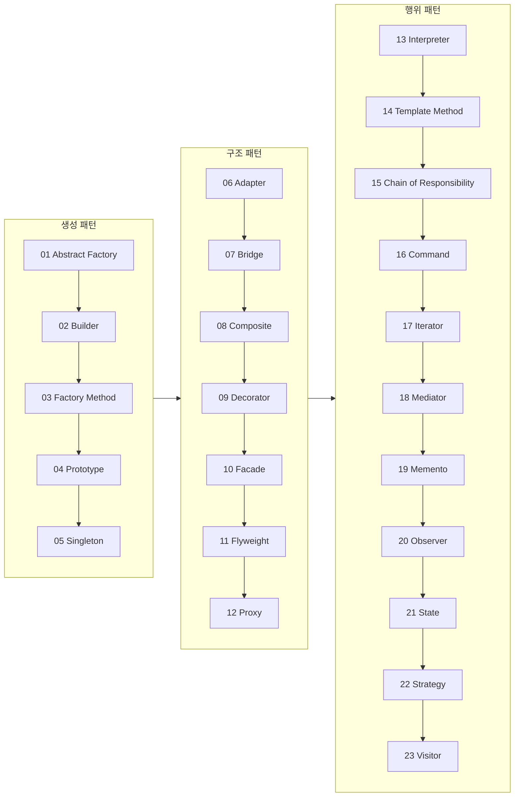

소프트웨어 개발은 반복적이고 복잡한 문제를 해결해야 하는 과정이다. 이러한 문제를 해결하는데 있어, 이미 검증된 해결책을 사용하면 시간과 노력을 절약할 수 있다. 이처럼 특정 맥락에서 자주 발생하는 문제에 대해, 경험적으로 검증된 해결책을 **디자인 패턴(Design Pattern)**이라 한다. 디자인 패턴은 소프트웨어 설계의 모범 사례를 축적한 결과물로, 문제 해결의 효율성을 높이고, 코드의 재사용성을 극대화하며, 팀원 간의 의사소통을 원활하게 해주는 중요한 도구이다.

디자인 패턴의 주요 특징 중 하나는 특정 언어나 기술에 종속되지 않는다는 점이다. 이는 패턴이 특정 구현 방식에 국한되지 않고, 다양한 상황에서 적용될 수 있는 일종의 설계 템플릿을 제공한다는 의미이다. 다시 말해, 디자인 패턴은 구체적인 코드를 제공하는 것이 아니라, 문제를 해결하는 방법론을 체계화하여, 상황에 맞는 최적의 솔루션을 찾아내도록 돕는다.

## 디자인 패턴이란

소프트웨어를 설계할 때 특정 맥락에서 자주 발생하는 고질적인 문제들이 또 발생했을 때 재사용할 할 수 있는 훌륭한 해결책이다. ```바퀴를 다시 발명하지 마라(Don’t reinvent the wheel)```라는 말이 있듯이 이미 만들어져서 잘 되는 것을 처음부터 다시 만들 필요가 없다는 의미이다.

또한 디자인 패턴은 상황에 따라서 더 효율적인 방법이 있을 수도 있다. 하지만 지금의 일이 바쁘다고 해서 다른 대안을 살펴보지 않는 것은 위 그림처럼 네모난 바퀴를 사용하여 일을 처리하는 모습이 될 것이다. 따라서 시간을 갖고 더 효율적인 방법을 찾을 수 있도록 노력하는 시간을 가져 보자.

## 디자인 패턴의 필요성

디자인 패턴은 다음과 같은 이유로 소프트웨어 개발에서 중요한 역할을 한다:

- **재사용성**: 이미 검증된 설계 방법론을 사용함으로써, 비슷한 문제를 다시 설계하는 데 소요되는 시간을 줄일 수 있다.
- **유지보수성**: 패턴을 사용하면 코드 구조가 체계적이고 명확해져, 이후 유지보수와 확장이 용이해진다.
- **의사소통**: 디자인 패턴은 공통의 용어를 제공함으로써, 개발자 간의 의사소통을 원활하게 한다. 이는 팀 내에서뿐만 아니라, 다양한 프로젝트 간에도 일관된 이해를 가능하게 한다.
- **유연성**: 디자인 패턴은 변경 사항에 유연하게 대응할 수 있도록 도와준다. 예를 들어, 새로운 요구사항이 추가되더라도 기존 코드에 큰 변경 없이 대응할 수 있는 방법을 제공한다.


## 디자인 패턴의 구성 요소

디자인 패턴은 다음과 같은 세 가지 요소로 구성된다:

1. **콘텍스트(Context)**: 패턴이 적용될 수 있는 상황이나 배경을 기술한다. 예를 들어, 특정 문제를 해결해야 하는 상황이나, 문제 발생의 원인을 설명하는 부분이다. 또한, 패턴이 유용하지 못한 상황에 대해서도 설명할 수 있다.

2. **문제(Problem)**: 해결해야 할 문제를 정의한다. 이 문제는 다양한 제약 사항이나 고려해야 할 요소들을 포함할 수 있으며, 디자인 이슈와 관련된 다양한 문제들을 다룬다.

3. **해결(Solution)**: 문제를 해결하기 위한 설계 방법을 제안한다. 해결책은 문제를 해결하는 데 필요한 요소와 이들 간의 관계, 책임, 협력 관계 등을 포함한다. 이는 구체적인 코드 구현이 아니라, 상황에 따라 다양한 방식으로 적용할 수 있는 설계 템플릿이다.

## 디자인 패턴의 분류

GoF 디자인 패턴이 가장 대중적인 패턴이다. GoF(Gang of Four)는 네 명의 사람이 모여서 만든 단어로 에리히 감마(Erich Gamma), 리차드 헬름(Richard Helm), 랄프 존슨(Ralph Johnson), 존 블리시디스(John Vlissides)가 포함되어 있다. 이 네 사람은 1994년 저서 『Design Patterns: Elements of Reusable Object-Oriented Software』를 통해, 소프트웨어 개발 영역에서 반복적으로 나타나는 23개의 설계 문제와 해법을 구체화하고 체계화하였다.
            
디자인 패턴은 목적에 따라 크게 세 가지로 분류된다: **생성(Creational)**, **구조(Structural)**, **행위(Behavioral)** 패턴이다. 이 세 가지 분류는 각각 객체 생성, 객체 구조, 객체 간의 상호작용을 다룬다. 여기서는 각 분류에 속하는 주요 패턴들을 자세히 살펴보겠다.

이 시리즈는 생성 → 구조 → 행위 순서로 패턴을 다룬다. 객체를 "어떻게 만들지"를 먼저 정해야 그 객체를 조합해 구조를 설계할 수 있고, 구조가 잡혀야 객체들이 "어떻게 협력할지"를 결정하는 행위 패턴으로 넘어갈 수 있기 때문이다. 또한 생성 패턴 중에서도 가장 활용 범위가 넓은 추상 팩토리(Abstract Factory)를 01장으로 배치해, 인터페이스에 의존하는 설계 사고방식을 먼저 익힌 뒤 나머지 패턴을 학습하도록 구성했다.



|구분|생성 패턴|구조 패턴|행위 패턴|
|:--:|:--:|:--:|:--:|
|Class|팩토리 메서드 패턴(Factory Method)|적응자 패턴(Adapter)|인터프리터 패턴(Interpreter)<br>템플릿 메소드 패턴(Template Method)
|Object|추상팩토리 패턴(Abstract Factory)<br>빌더 패턴(Builder)<br>원형 패턴(Prototype)<br>싱글톤 패턴(Singleton)|적응자 패턴(Adapter)<br>브리지 패턴(Bridge)<br>컴포지트 (Composite)<br>데코레이터 패턴(Decorator)<br>퍼사드 패턴(Facade)<br>플라이 웨이트 패턴(Flyweight)<br>프록시 패턴(Proxy)|역할 사슬 패턴(Chain of Responsibility)<br>커맨드 패턴(Command)<br>옵저버 패턴(Observer)<br>상태 패턴(State)<br>스트레이트지 패턴(Strategy)<br>비지터 패턴(Visitor)<br>이터레이터 패턴(Iterator)<br>미디에이터 패턴(Mediator)<br>Memonto|

> Adapter는 Class와 Object 둘다 존재한다.

### 생성 패턴(Creational Patterns)

**생성 패턴**은 객체의 생성 과정을 다루는 패턴이다. 객체의 생성과 조합을 캡슐화하여, 특정 객체가 생성되거나 변경되더라도 프로그램 구조에 영향을 최소화하도록 유연성을 제공한다. 다섯 패턴이 공통으로 추구하는 설계 의도는 "`new` 키워드로 구체 클래스를 직접 호출하는 코드를 줄이는 것"이다. 호출부가 구체 클래스 이름을 알아야 한다면, 그 클래스가 바뀔 때마다 호출부도 함께 수정해야 하기 때문이다. 생성 패턴의 주요 예시로는 다음과 같은 것들이 있다:

| 패턴 | 대표 장점 | 대표 단점·주의점 |
|------|-----------|------------------|
| 싱글톤(Singleton) | 인스턴스가 하나임을 보장, 전역 접근점 제공 | 전역 상태를 만들어 테스트 격리·병렬 실행을 어렵게 함 |
| 추상 팩토리(Abstract Factory) | 제품군 일관성 보장, 구체 클래스 의존 제거 | 새 제품군 추가 시 모든 팩토리 구현체를 함께 수정해야 함 |
| 빌더(Builder) | 복잡한 생성 절차를 단계별로 분리, 가독성 향상 | 단순한 객체에 적용하면 클래스 수만 늘어남 |
| 팩토리 메서드(Factory Method) | 생성 로직을 서브클래스로 위임, OCP 준수 | 패턴 적용을 위해 상속 계층이 늘어남 |
| 원형(Prototype) | 복제 비용이 생성 비용보다 쌀 때 자원 절약 | 객체 내부에 순환 참조가 있으면 깊은 복제 구현이 까다로움 |

1. **싱글톤 패턴(Singleton)**: 이 패턴은 클래스의 인스턴스를 하나로 제한하고, 이 인스턴스에 대한 전역적인 접근점을 제공한다. 시스템 내에서 특정 클래스의 인스턴스가 단 하나만 존재해야 하는 경우에 사용된다. 대표적으로 로깅 시스템, 데이터베이스 연결 등에 적용된다.

2. **추상 팩토리 패턴(Abstract Factory)**: 관련된 객체들을 생성하기 위한 인터페이스를 제공하되, 구체적인 클래스는 명시하지 않는다. 예를 들어, 여러 종류의 버튼이나 창을 생성해야 하는 GUI 시스템에서 이 패턴을 사용할 수 있다.

3. **빌더 패턴(Builder)**: 복잡한 객체의 생성 과정을 단계별로 분리하여, 동일한 생성 절차에서 다양한 표현을 생성할 수 있도록 한다. 예를 들어, 다양한 설정을 가진 자동차를 생성할 때 사용된다.

4. **팩토리 메서드 패턴(Factory Method)**: 객체를 생성하는 인터페이스를 정의하지만, 실제로 어떤 클래스의 인스턴스를 생성할지는 서브클래스가 결정한다. 이 패턴은 객체 생성을 클래스의 외부로부터 숨기고, 생성 로직을 캡슐화하는 데 사용된다.

5. **원형 패턴(Prototype)**: 생성할 객체의 원형이 되는 객체를 복제하여 새로운 객체를 생성한다. 이 패턴은 복잡한 객체를 생성하는 데 필요한 자원을 절약할 수 있다. 예를 들어, 게임에서 여러 유사한 캐릭터를 생성할 때 사용될 수 있다.

### 구조 패턴(Structural Patterns)

**구조 패턴**은 클래스나 객체를 조합하여 더 큰 구조를 형성하는 데 중점을 둔다. 서로 다른 인터페이스를 가진 객체들을 조합하거나, 더 복잡한 기능을 제공하는 데 사용되는 패턴이다. 일곱 패턴이 공통으로 추구하는 설계 의도는 "기존 클래스를 수정하지 않고, 그 위에 한 겹을 더 씌워 새로운 인터페이스나 책임을 부여하는 것"이다. 상속 대신 합성으로 구조를 확장하는 패턴이 대부분이다.

| 패턴 | 대표 장점 | 대표 단점·주의점 |
|------|-----------|------------------|
| 적응자(Adapter) | 레거시 코드를 수정 없이 재사용 | 변환 계층이 늘어나 호출 경로가 길어짐 |
| 브리지(Bridge) | 추상과 구현을 독립적으로 확장 가능 | 설계 초반부터 계층을 둘로 나눠야 해 진입 비용이 큼 |
| 컴포지트(Composite) | 단일·복합 객체를 동일한 인터페이스로 처리 | 트리 깊이가 깊어지면 순회 비용이 커짐 |
| 데코레이터(Decorator) | 상속 없이 런타임에 책임 추가·제거 | 데코레이터를 여러 겹 감싸면 디버깅 시 호출 스택 추적이 어려움 |
| 퍼사드(Facade) | 복잡한 서브시스템을 단순한 진입점으로 감춤 | 퍼사드 자체가 비대해지면 또 다른 God Object가 됨 |
| 플라이웨이트(Flyweight) | 공유 가능한 상태를 재사용해 메모리 절약 | 공유 상태와 고유 상태를 분리해야 해 설계 복잡도 증가 |
| 프록시(Proxy) | 접근 제어·지연 로딩·캐싱을 원본 객체 변경 없이 추가 | 프록시 계층이 늘어날수록 호출 지연 추적이 어려워짐 |

1. **적응자 패턴(Adapter)**: 이 패턴은 기존 인터페이스를 사용자가 기대하는 다른 인터페이스로 변환한다. 예를 들어, 새로운 시스템에서 기존의 레거시 코드를 재사용해야 할 때 유용하다.

2. **브리지 패턴(Bridge)**: 구현부와 추상층을 분리하여, 각 부분을 독립적으로 변형할 수 있게 한다. 이는 예를 들어, 그래픽 라이브러리에서 플랫폼 독립적인 UI 구성 요소를 만들 때 사용할 수 있다.

3. **컴포지트 패턴(Composite)**: 객체를 트리 구조로 구성하여, 부분-전체 계층을 표현한다. 이 패턴은 단일 객체와 복합 객체를 동일하게 다룰 수 있게 해준다. 예를 들어, 그래픽 요소를 계층적으로 관리할 때 사용된다.

4. **데코레이터 패턴(Decorator)**: 주어진 객체에 새로운 책임을 동적으로 부여한다. 이는 기능 확장이 필요한 경우 서브클래스 대신 사용될 수 있다. 예를 들어, UI 구성 요소에 새로운 기능을 추가할 때 유용하다.

5. **퍼사드 패턴(Facade)**: 서브시스템의 복잡한 인터페이스를 단순화하여, 사용자가 쉽게 접근할 수 있도록 한다. 이는 대규모 시스템에서 복잡한 하위 시스템을 간단히 사용할 수 있게 하는 데 사용된다.

6. **프록시 패턴(Proxy)**: 다른 객체에 대한 접근을 제어하는 대리 객체를 제공한다. 이는 예를 들어, 원격 객체에 대한 접근을 제어하거나, 객체의 생성을 지연시킬 때 사용된다.

7. **플라이웨이트 패턴(Flyweight)**: 공유 가능한 객체를 사용하여, 다수의 유사한 객체를 효율적으로 관리한다. 예를 들어, 텍스트 편집기에서 반복되는 문자를 저장하는 데 사용된다.

### 행위 패턴(Behavioral Patterns)

**행위 패턴**은 객체나 클래스 간의 상호작용, 알고리즘의 책임 분배를 다룬다. 객체들이 서로 협력하여 작업을 수행하는 방법을 정의하며, 객체 간의 결합도를 낮추는 데 중점을 둔다. 열한 패턴이 공통으로 추구하는 설계 의도는 "객체가 서로를 직접 알지 못해도 협력할 수 있도록, 상호작용 로직을 별도의 객체나 인터페이스로 떼어내는 것"이다.

| 패턴 | 대표 장점 | 대표 단점·주의점 |
|------|-----------|------------------|
| 옵저버(Observer) | 상태 변경을 다수 객체에 느슨하게 전파 | 알림 순서를 보장하기 어렵고, 해제를 누락하면 메모리 누수 발생 |
| 상태(State) | 조건문 분기 없이 상태별 행동을 객체로 분리 | 상태 개수만큼 클래스가 늘어남 |
| 전략(Strategy) | 알고리즘을 런타임에 교체 가능 | 클래스가 단순하면 함수 전달만으로도 충분해 과한 설계가 될 수 있음 |
| 템플릿 메소드(Template Method) | 알고리즘 골격 재사용, 일부만 재정의 | 상속 기반이라 골격 자체를 바꾸려면 상위 클래스를 건드려야 함 |
| 비지터(Visitor) | 객체 구조 변경 없이 새 연산 추가 | 새 원소 타입이 추가되면 모든 Visitor 구현체를 수정해야 함 |
| 역할 사슬(Chain of Responsibility) | 처리자를 동적으로 추가·제거 가능 | 체인 중간에서 처리가 누락돼도 알아채기 어려움 |
| 커맨드(Command) | 요청을 객체로 캡슐화해 실행 취소·로그 지원 | 커맨드 클래스 수가 요청 종류만큼 늘어남 |
| 인터프리터(Interpreter) | 간단한 문법을 객체 구조로 직접 표현 | 문법이 복잡해지면 클래스 수가 기하급수적으로 증가 |
| 이터레이터(Iterator) | 내부 구조 노출 없이 순회 방법 통일 | 대부분의 언어가 표준 라이브러리로 이미 제공해 직접 구현할 일이 적음 |
| 미디에이터(Mediator) | 객체 간 다대다 의존을 중재자로 단순화 | 중재자 자체가 비대해지면 또 다른 God Object가 됨 |
| 메멘토(Memento) | 캡슐화를 유지한 채 상태 저장·복원 | 상태를 자주 저장하면 메모리 사용량이 커짐 |

1. **옵저버 패턴(Observer)**: 객체 사이에 1:N의 의존 관계를 정의하여, 한 객체의 상태가 변경될 때 모든 의존 객체들이 자동으로 갱신되도록 한다. 예를 들어, 이벤트 시스템에서 자주 사용된다.

2. **상태 패턴(State)**: 객체의 내부 상태에 따라 행동이 달라지도록 한다. 이는 상태에 따라 객체의 행동이 변해야 하는 상황에 유용하다. 예를 들어, 게임 캐릭터가 상태에 따라 다른 동작을 해야 할 때 사용된다.

3. **스트레티지 패턴(Strategy)**: 여러 알고리즘을 정의하고, 각각을 캡슐화하여, 상호 교환 가능하게 만든다. 알고리즘의 사용자를 독립적으로 알고리즘을 변경할 수 있게 한다. 예를 들어, 정렬 알고리즘을 유연하게 변경할 수 있는 라이브러리에서 사용될 수 있다.

4. **템플릿 메소드 패턴(Template Method)**: 알고리즘의 구조를 정의하고, 일부 단계는 서브클래스에서 재정의하도록 한다. 이는 알고리즘의 골격을 유지하면서 세부 구현을 변경해야 할 때 유용하다.

5. **비지터 패턴(Visitor)**: 객체 구조를 이루는 원소에 대해 수행할 연산을 분리하여, 새로운 연산을 쉽게 추가할 수 있도록 한다. 예를 들어, 컴파일러에서 구문 트리를 처리할 때 사용된다.

6. **역할 사슬 패턴(Chain of Responsibility)**: 요청을 처리할 수 있는 기회를 여러 객체에 부여하고, 처리할 객체가 결정될 때까지 요청을 전달한다. 예를 들어, 이벤트 핸들링 시스템에서 사용된다.

7. **커맨드 패턴(Command)**: 요청을 객체로 캡슐화하여, 서로 다른 사용자의 매개변수화, 요청 저장, 실행 취소 등을 지원한다. 예를 들어, 작업을 취소할 수 있는 기능을 제공하는 애플리케이션에서 사용된다.

8. **인터프리터 패턴(Interpreter)**: 언어의 문법을 표현하는 방법을 정의하고, 해당 언어로 작성된 문장을 해석한다. 예를 들어, 스크립트 언어의 해석기에 사용된다.

9. **이터레이터 패턴(Iterator)**: 컬렉션의 내부 구조를 노출하지 않고, 그 원소들을 순차적으로 접근할 수 있는 방법을 제공한다. 예를 들어, 컬렉션 객체의 순회를 위해 사용된다.

10. **미디에이터 패턴(Mediator)**: 객체들이 직접 상호작용하지 않고, 중재자를 통해 상호작용하도록 하여 객체 간의 결합도를 줄인다. 예를 들어, GUI 시스템에서 다양한 요소들 간의 상호작용을 관리할 때 사용된다.

11. **메멘토 패턴(Memento)**: 객체의 상태를 저장하여, 나중에 복원할 수 있게 하는 패턴이다. 예를 들어, 되돌리기 기능을 구현할 때 사용된다.

## 패턴을 적용해야 할 때와 피해야 할 때

디자인 패턴은 만능 해결책이 아니다. 패턴 자체가 목적이 되면 오히려 코드를 복잡하게 만든다. 다음 기준으로 적용 여부를 판단한다.

- **적용해야 할 때**: 같은 종류의 문제가 코드베이스 여러 곳에서 반복되고, 요구사항 변경이나 신규 케이스 추가가 예상되는 경우. 예를 들어 객체 생성 로직이 여러 곳에 중복되어 있고 향후 제품군이 늘어날 가능성이 있다면 추상 팩토리를 도입할 근거가 된다.
- **피해야 할 때**: 요구사항이 한 번뿐이거나 변경 가능성이 낮은 단순한 문제. 이런 경우 패턴을 미리 적용하면 추상화 계층만 늘어나는 **과잉 설계(Over-engineering)**가 된다. 클래스 1~2개로 끝낼 수 있는 로직에 옵저버나 전략 패턴을 끼워 넣으면, 코드를 읽는 사람이 실제 흐름을 따라가기 위해 여러 파일을 오가야 한다.
- **대안과 비교**: GoF 패턴 중 다수(특히 생성 패턴)는 상속 기반 설계를 전제로 한다. 조슈아 블로크는 『Effective Java』에서 "상속보다 합성을 사용하라(Composition over Inheritance)"는 원칙을 제시했는데, 이는 GoF 패턴을 무조건 따르기보다 더 단순한 합성·고차 함수로 같은 문제를 풀 수 있는지 먼저 검토해야 한다는 비판적 시각을 보여준다. 예를 들어 전략 패턴(Strategy)은 클래스 계층 대신 함수(또는 람다)를 매개변수로 전달하는 것만으로 같은 효과를 낼 수 있는 경우가 많고, 데코레이터 패턴(Decorator)이 풀려는 "책임을 동적으로 추가"하는 문제도 상속 계층을 만들지 않고 객체를 합성한 래퍼 함수 하나로 해결되는 경우가 흔하다. 패턴은 검증된 해법이지 강제 규칙이 아니다.

## 이 시리즈를 읽고 나면 할 수 있는 것

이 시리즈를 01장부터 24장까지 따라가면 다음을 할 수 있게 된다.

1. 생성·구조·행위 세 분류 중 지금 마주한 문제가 어디에 속하는지 1분 내로 식별한다.
2. 후보 패턴 2~3개를 두고, 결합도·확장성·코드 가독성 측면에서 어느 쪽이 더 적합한지 트레이드오프를 근거로 설명한다.
3. 패턴을 적용하기보다 단순한 합성이나 함수로 해결하는 편이 나은 상황을 구분한다.

## 결론

디자인 패턴은 소프트웨어 개발 과정에서 효율성과 유연성을 높이는 중요한 도구이다. 패턴을 잘 이해하고 적절히 활용하면, 복잡한 문제를 효과적으로 해결할 수 있을 뿐만 아니라, 코드의 재사용성과 유지보수성을 크게 향상시킬 수 있다. 그러나 패턴을 기계적으로 적용하는 것보다, 각 패턴의 특징과 적용 상황을 명확히 이해하고, 필요할 때 적절하게 사용하는 것이 중요하다. 디자인 패턴을 통해 소프트웨어 개발의 생산성과 품질을 동시에 높일 수 있을 것이다.

다음 장에서는 생성 패턴의 첫 번째인 추상 팩토리 패턴을 다룬다: [01. Abstract Factory - 추상 팩토리 패턴](/post/designpattern/01_abstract_factory/)