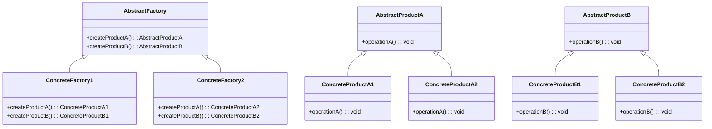
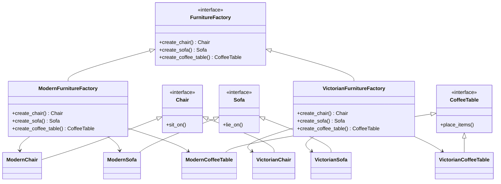

가구 쇼핑몰 시뮬레이터를 만든다고 하자. 의자, 소파, 커피 테이블을 현대식과 빅토리안 두 스타일로 판매하는데, 한 고객의 장바구니에 현대식 의자와 빅토리안 소파가 함께 담기면 안 된다는 제약이 있다. 이 제약을 클라이언트 코드 곳곳에서 if문으로 검사하는 대신, "한 스타일에 속한 제품 묶음"을 통째로 만들어주는 객체에 위임할 수는 없을까? 이 질문에 대한 답이 추상 팩토리 패턴이다. 이 장에서는 이 패턴이 정확히 무엇이고 언제 쓰고 언제 피해야 하는지를, 가구 쇼핑몰 예제 하나로 끝까지 따라가며 설명한다.

## 탄생 배경

추상 팩토리 패턴은 GoF(Gang of Four: 에리히 감마, 리처드 헬름, 랄프 존슨, 존 블리시디스)가 1994년 저서 『Design Patterns: Elements of Reusable Object-Oriented Software』에서 정리한 23개 패턴 중 하나이며, 생성 패턴으로 분류된다. 책에서 이 패턴을 설명하기 위해 든 대표 예시는 Motif와 Presentation Manager처럼 서로 다른 룩앤필(look-and-feel) 표준을 지원해야 하는 UI 툴킷이다. 버튼, 스크롤바 같은 위젯을 만들 때 특정 플랫폼의 구체 클래스에 코드를 묶어두면 새로운 플랫폼을 지원할 때마다 클라이언트 코드를 손대야 한다. 이 문제를 풀기 위해 "관련된 위젯 한 묶음을 생성하는 인터페이스"를 별도로 두자는 아이디어가 추상 팩토리 패턴으로 정리되었다.

## 학습 목표

이 장을 읽고 나면 다음을 할 수 있다.

1. 추상 팩토리 패턴이 해결하는 문제(제품군 간 일관성 보장)를 설명할 수 있다.
2. AbstractFactory, ConcreteFactory, AbstractProduct, ConcreteProduct 네 가지 역할을 구분하고 직접 구현할 수 있다.
3. 팩토리 메서드 패턴과의 차이를 설명하고, 추상 팩토리 패턴이 과한 설계가 되는 시점을 판단할 수 있다.

## 개요

**추상 팩토리 패턴의 정의**  
추상 팩토리 패턴은 객체 생성에 관련된 디자인 패턴 중 하나로, 구체적인 클래스에 의존하지 않고 관련된 객체들의 집합을 생성하는 인터페이스를 제공하는 패턴이다. 이 패턴은 클라이언트가 어떤 구체적인 클래스의 인스턴스를 생성할지 결정하지 않고, 팩토리 인터페이스를 통해 객체를 생성할 수 있도록 한다. 이를 통해 코드의 유연성과 확장성을 높일 수 있다.

**패턴의 필요성 및 사용 사례**  
추상 팩토리 패턴은 다양한 제품군을 생성해야 할 때 유용하다. 예를 들어, UI 라이브러리에서 운영 체제에 따라 다른 버튼이나 텍스트 박스를 생성해야 할 경우, 추상 팩토리 패턴을 사용하여 각 운영 체제에 맞는 UI 요소를 생성할 수 있다. 또한, 가구 쇼핑몰과 같은 시뮬레이터에서 다양한 스타일의 가구를 생성할 때도 이 패턴이 적합하다.

**장단점**

| 구분 | 내용 |
|------|------|
| 장점 | 제품군 일관성 보장 — 관련된 객체들을 한 팩토리에서 함께 생성하므로, 서로 호환되지 않는 조합(예: 현대식 의자 + 빅토리안 소파)이 만들어질 위험이 없다. |
| 장점 | 구체 클래스 의존성 제거 — 클라이언트는 인터페이스에만 의존하므로, 새 제품군(스타일)이 추가돼도 클라이언트 코드를 수정할 필요가 없다. |
| 단점 | 제품 "종류" 추가가 어려움 — 새로운 제품 종류(예: 책상)를 추가하려면 AbstractFactory 인터페이스와 모든 ConcreteFactory를 함께 수정해야 한다. |
| 단점 | 클래스 수 증가 — 제품군 수 × 제품 종류 수만큼 클래스가 늘어나, 제품군이 하나뿐인 작은 프로젝트에는 과한 설계가 될 수 있다. |

코드로 어떻게 구현되는지는 아래 "구성 요소"와 "예제" 절에서 가구 쇼핑몰 시뮬레이터 하나로 일관되게 보여준다.

## 추상 팩토리 패턴의 구성 요소

앞서 "개요"에서 정의한 인터페이스 기반 생성 구조는 코드에서 다음 네 가지 역할로 나뉘어 구현된다.

**AbstractFactory: 인터페이스 정의**  
AbstractFactory는 제품 객체를 생성하기 위한 인터페이스를 정의한다. 이 인터페이스는 다양한 제품을 생성하는 메서드를 포함하고 있으며, 클라이언트는 이 인터페이스를 통해 제품을 생성할 수 있다. 이를 통해 클라이언트는 구체적인 클래스에 의존하지 않고, 다양한 제품군을 사용할 수 있는 유연성을 제공받는다.

**ConcreteFactory: 구체적인 팩토리 클래스**  
ConcreteFactory는 AbstractFactory 인터페이스를 구현하는 클래스이다. 이 클래스는 특정 제품군에 대한 구체적인 객체를 생성하는 메서드를 제공한다. 예를 들어, 현대식 가구를 생성하는 ConcreteFactory는 현대식 의자, 소파, 커피 테이블을 생성하는 메서드를 포함할 수 있다.

**AbstractProduct: 제품 인터페이스**  
AbstractProduct는 생성될 제품의 인터페이스를 정의한다. 이 인터페이스는 제품이 가져야 할 공통적인 메서드를 포함하고 있으며, 이를 통해 클라이언트는 제품의 구체적인 구현에 의존하지 않고도 제품을 사용할 수 있다.

**ConcreteProduct: 구체적인 제품 클래스**  
ConcreteProduct는 AbstractProduct 인터페이스를 구현하는 클래스이다. 이 클래스는 실제로 생성될 제품의 구체적인 구현을 제공한다. 예를 들어, 현대식 의자, 빅토리안 소파, 아르데코 커피 테이블 등이 ConcreteProduct로 구현될 수 있다.

다음은 추상 팩토리 패턴의 구성 요소를 나타내는 UML 다이어그램이다.



위의 다이어그램은 추상 팩토리 패턴의 구성 요소 간의 관계를 보여준다. AbstractFactory는 ConcreteFactory에 의해 구현되며, 각 ConcreteFactory는 AbstractProduct의 구체적인 구현체인 ConcreteProduct를 생성한다. 이러한 구조는 클라이언트가 구체적인 클래스에 의존하지 않고도 다양한 제품을 생성할 수 있도록 한다.

**객체 생성 과정**  
이 네 가지 역할이 실제로 동작하는 순서는 다음과 같다.

1. 클라이언트는 추상 팩토리 인터페이스를 통해 제품을 요청한다.
2. 구체적인 팩토리 클래스가 선택되어 인스턴스화된다.
3. 선택된 팩토리 클래스는 요청된 제품의 인스턴스를 생성하여 반환한다.

이 과정에서 클라이언트는 구체적인 제품 클래스에 대한 정보를 알 필요가 없으며, 오직 추상 팩토리 인터페이스만을 통해 상호작용한다. 2단계의 "팩토리 선택"은 코드에 고정값으로 박아둘 수도 있지만, 아래처럼 환경 설정값에 따라 런타임에 결정하는 방식도 흔하다. (위 다이어그램의 `AbstractFactory`/`ConcreteFactory1`/`ConcreteFactory2` 이름을 그대로 사용한 의사코드다.)

```text
def get_factory(style: str) -> AbstractFactory:
    if style == "modern":
        return ConcreteFactory1()
    elif style == "victorian":
        return ConcreteFactory2()
    else:
        raise ValueError("Unsupported style")
```

## 예제

**가구 쇼핑몰 시뮬레이터**  
추상 팩토리 패턴을 활용한 가구 쇼핑몰 시뮬레이터는 다양한 가구 제품군을 생성하는 데 유용하다. 이 예제에서는 의자, 소파, 커피 테이블이라는 세 가지 제품 종류를 다루며, 각 제품 종류는 현대식과 빅토리안이라는 두 가지 제품군(스타일)을 가진다.

```python
from abc import ABC, abstractmethod

# Abstract Product
class Chair(ABC):
    @abstractmethod
    def sit_on(self):
        pass

class Sofa(ABC):
    @abstractmethod
    def lie_on(self):
        pass

class CoffeeTable(ABC):
    @abstractmethod
    def place_items(self):
        pass

# Concrete Products
class ModernChair(Chair):
    def sit_on(self):
        return "Sitting on a modern chair."

class VictorianChair(Chair):
    def sit_on(self):
        return "Sitting on a Victorian chair."

class ModernSofa(Sofa):
    def lie_on(self):
        return "Lying on a modern sofa."

class VictorianSofa(Sofa):
    def lie_on(self):
        return "Lying on a Victorian sofa."

class ModernCoffeeTable(CoffeeTable):
    def place_items(self):
        return "Placing items on a modern coffee table."

class VictorianCoffeeTable(CoffeeTable):
    def place_items(self):
        return "Placing items on a Victorian coffee table."

# Abstract Factory
class FurnitureFactory(ABC):
    @abstractmethod
    def create_chair(self) -> Chair:
        pass

    @abstractmethod
    def create_sofa(self) -> Sofa:
        pass

    @abstractmethod
    def create_coffee_table(self) -> CoffeeTable:
        pass

# Concrete Factory
class ModernFurnitureFactory(FurnitureFactory):
    def create_chair(self) -> Chair:
        return ModernChair()

    def create_sofa(self) -> Sofa:
        return ModernSofa()

    def create_coffee_table(self) -> CoffeeTable:
        return ModernCoffeeTable()

class VictorianFurnitureFactory(FurnitureFactory):
    def create_chair(self) -> Chair:
        return VictorianChair()

    def create_sofa(self) -> Sofa:
        return VictorianSofa()

    def create_coffee_table(self) -> CoffeeTable:
        return VictorianCoffeeTable()

# Client Code
def client_code(factory: FurnitureFactory):
    chair = factory.create_chair()
    sofa = factory.create_sofa()
    coffee_table = factory.create_coffee_table()

    print(chair.sit_on())
    print(sofa.lie_on())
    print(coffee_table.place_items())

# Usage
print("Modern Furniture:")
client_code(ModernFurnitureFactory())

print("\nVictorian Furniture:")
client_code(VictorianFurnitureFactory())
```



위 코드는 두 가지 스타일(현대식·빅토리안)의 가구 세 종류(의자·소파·커피 테이블)를 생성한다. `ModernFurnitureFactory`와 `VictorianFurnitureFactory`는 각각 자신의 스타일에 맞는 제품만 생성하므로, 클라이언트가 실수로 현대식 의자와 빅토리안 소파를 섞어서 만드는 일이 구조적으로 차단된다.

**실무에서 만나는 추상 팩토리 패턴**  
이 패턴은 장난감 예제에만 머물지 않는다. 자바 표준 라이브러리의 `javax.xml.parsers.DocumentBuilderFactory`와 `javax.xml.transform.TransformerFactory`는 XML 파서·트랜스포머 구현체를 추상화한 팩토리이며, `java.awt.Toolkit`은 운영체제별 UI 컴포넌트 구현(peer)을 생성하는 팩토리 역할을 한다. Qt의 `QStyleFactory` 역시 플랫폼별 위젯 스타일 묶음을 생성한다는 점에서 추상 팩토리 패턴의 실제 적용 사례다.

## 팩토리 메서드 패턴과의 차이

추상 팩토리 패턴은 팩토리 메서드 패턴과 자주 혼동된다. 둘 다 객체 생성을 캡슐화하지만, 해결하는 문제의 범위가 다르다.

| 구분 | 팩토리 메서드 | 추상 팩토리 |
|------|---------------|--------------|
| 목적 | 단일 제품 하나를 생성하는 책임을 서브클래스에 위임한다 | 서로 관련된 제품 "군(群)" 전체를 일관되게 생성한다 |
| 구현 방식 | 상속 — 서브클래스가 메서드를 오버라이드한다 | 합성 — 클라이언트가 팩토리 객체를 주입받아 사용한다 |
| 제품 수 | 제품 1종 | 제품 N종(제품군) |
| 확장 시 변경 범위 | 서브클래스 1개 추가 | 새 ConcreteFactory 1개 + 해당 제품군의 모든 ConcreteProduct 추가 |

요약하면, 만들 제품이 하나뿐이라면 팩토리 메서드로 충분하고, 서로 호환되어야 하는 제품 묶음을 다뤄야 한다면 추상 팩토리가 필요하다.

## 자주 묻는 질문

**Q1: 추상 팩토리 패턴을 사용할 때의 주의사항은 무엇인가요?**  
추상 팩토리 패턴을 사용할 때는 몇 가지 주의사항이 있다. 첫째, 제품군이 명확하게 정의되어야 하며, 각 제품 간의 관계를 이해해야 한다. 둘째, 새로운 제품 변형을 추가할 때 기존 코드에 영향을 최소화하도록 설계해야 한다. 셋째, 클라이언트 코드가 구체적인 제품 클래스에 의존하지 않도록 인터페이스를 통해 제품을 사용해야 한다. 마지막으로, 패턴의 복잡성으로 인해 코드가 지나치게 복잡해질 수 있으므로, 필요에 따라 패턴을 적용하는 것이 중요하다.

**Q2: 새로운 제품 변형을 추가할 때 어떤 절차를 따라야 하나요?**  
새로운 제품 변형을 추가할 때는 다음과 같은 절차를 따르면 좋다. 첫째, 새로운 제품 변형에 대한 요구사항을 명확히 정의한다. 둘째, 기존의 `AbstractProduct` 인터페이스를 구현하는 새로운 `ConcreteProduct` 클래스를 생성한다. 셋째, 새로운 제품 변형을 생성할 수 있는 `ConcreteFactory` 클래스를 추가한다. 넷째, 클라이언트 코드에서 새로운 제품 변형을 사용할 수 있도록 수정한다. 마지막으로, 모든 변경 사항이 잘 작동하는지 테스트하여 기존 기능에 영향을 미치지 않도록 확인해야 한다.

**Q3: 추상 팩토리 패턴의 성능은 어떤가요?**  
추상 팩토리 패턴의 성능은 일반적으로 객체 생성에 필요한 오버헤드가 발생할 수 있지만, 이는 설계의 유연성과 유지보수성을 고려할 때 충분히 감수할 만한 부분이다. 객체 생성 과정에서 인터페이스를 통해 제품을 생성하므로, 런타임에 어떤 제품이 생성될지 결정할 수 있는 장점이 있다. 그러나, 너무 많은 제품 변형이 존재할 경우, 팩토리 클래스의 수가 증가하여 코드가 복잡해질 수 있으므로, 성능과 유지보수성 간의 균형을 잘 맞추는 것이 중요하다.

## 관련 패턴

추상 팩토리 패턴은 단독으로 쓰이기보다 다른 패턴과 함께 등장하는 경우가 많다.

- **[02. Builder - 빌더 패턴](/post/designpattern/02_builder/)**: 둘 다 생성 패턴이지만, 빌더는 복잡한 객체 하나를 단계별로 조립하는 데 집중하고, 추상 팩토리는 관련된 객체 여러 개를 한 번에 만든다.
- **[05. Singleton - 싱글턴 패턴](/post/designpattern/05_singleton/)**: ConcreteFactory는 애플리케이션 내에 하나만 존재하면 충분한 경우가 많아, 싱글턴으로 구현되는 경우가 흔하다.
- **[14. Template Method - 템플릿 메서드 패턴](/post/designpattern/14_templete_method/)**: ConcreteFactory 내부의 제품 생성 절차 자체를 템플릿 메서드로 구성해 공통 단계와 가변 단계를 분리할 수 있다.

## 결론

추상 팩토리 패턴은 만능 해법이 아니라 트레이드오프가 분명한 도구다. 제품군이 하나뿐이거나 향후 변형이 추가될 가능성이 낮다면, 추상 팩토리가 늘리는 클래스 수는 득보다 실이 크다. 반대로 UI 프레임워크의 룩앤필처럼 여러 변형이 동시에 공존하고, 한 변형 안의 구성 요소들이 항상 함께 묶여 다뤄져야 하는 상황 — 즉 가구 쇼핑몰에서 현대식 의자와 빅토리안 소파가 섞이면 안 되는 것과 같은 제약이 있는 상황이라면, 이 패턴의 가치가 분명해진다.

다음 장에서는 생성 패턴의 두 번째인 빌더 패턴을 다룬다: [02. Builder - 빌더 패턴](/post/designpattern/02_builder/)

## 참고 문헌

**관련 서적**

1. **"Design Patterns: Elements of Reusable Object-Oriented Software"** - Erich Gamma, Richard Helm, Ralph Johnson, John Vlissides
   - 추상 팩토리 패턴을 처음 정리한 원전으로, 패턴의 동기와 구조, 트레이드오프를 자세히 다룬다.
2. **"Head First Design Patterns"** - Eric Freeman, Bert Bates, Kathy Sierra, Elisabeth Robson
   - 다양한 비유와 그림을 사용해 추상 팩토리 패턴을 쉽게 설명한다.
3. **"Design Patterns in Modern C++"** - Dmitri Nesteruk
   - 현대 C++로 추상 팩토리 패턴을 구현하는 방법과 실제 예제를 다룬다.

**온라인 리소스**

* [Refactoring Guru - Abstract Factory](https://refactoring.guru/design-patterns/abstract-factory)
* [Wikipedia - Abstract factory pattern](https://en.wikipedia.org/wiki/Abstract_factory_pattern)
* [GeeksforGeeks - Abstract Factory Design Pattern](https://www.geeksforgeeks.org/abstract-factory-design-pattern-introduction/)
* [gmlwjd9405 - Abstract Factory Pattern](https://gmlwjd9405.github.io/2018/08/08/abstract-factory-pattern.html)
* [huisam.tistory - AbstractFactory](https://huisam.tistory.com/entry/AbstractFactory)
* [johngrib wiki - abstract-factory](https://johngrib.github.io/wiki/pattern/abstract-factory/)
