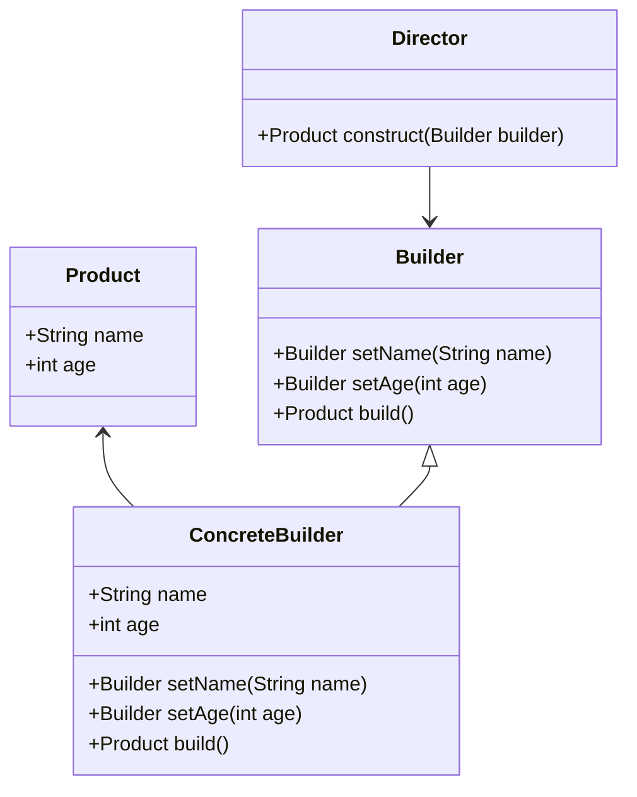
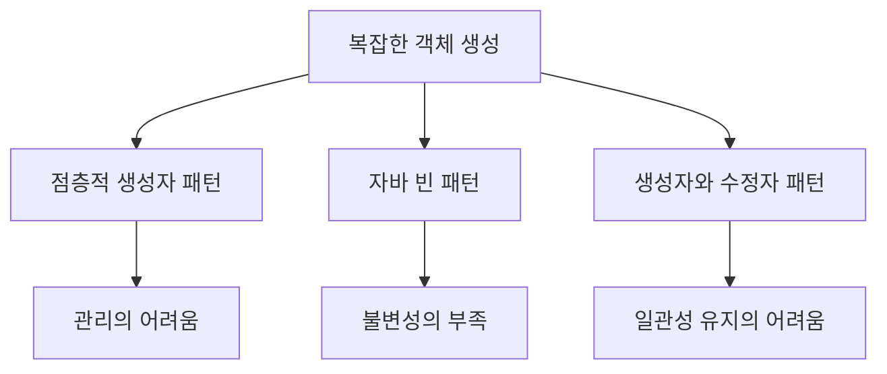
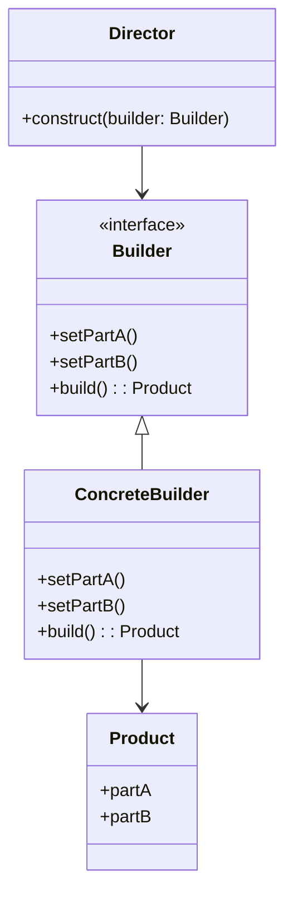
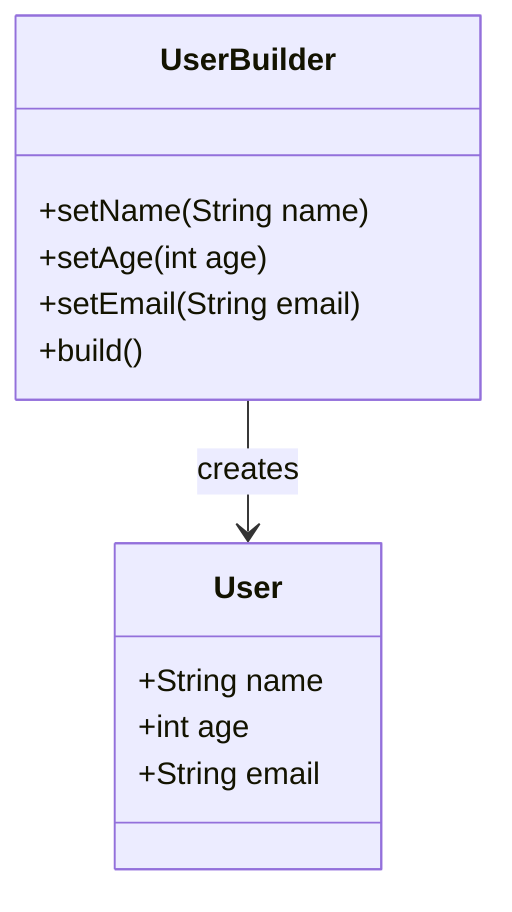
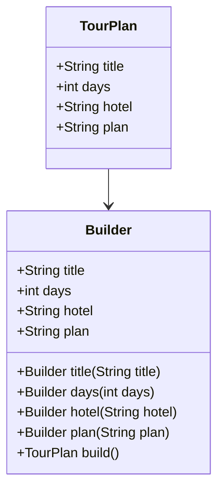

빌더 패턴은 복잡한 객체를 단계별로 생성할 수 있도록 해주는 생성 디자인 패턴이다. 이 패턴은 동일한 생성 코드를 사용하여 다양한 유형과 표현의 객체를 생성할 수 있게 해준다. 예를 들어, 집을 짓는 과정을 생각해보자. 집을 짓기 위해서는 여러 단계가 필요하다. 벽을 세우고, 문을 설치하고, 창문을 달고, 지붕을 올리는 등의 과정이 있다. 이러한 복잡한 과정을 단순한 생성자 호출로 처리하기에는 한계가 있다. 빌더 패턴을 사용하면 각 단계별로 필요한 메소드를 호출하여 객체를 생성할 수 있으며, 필요한 단계만 선택적으로 호출할 수 있다. 이로 인해 코드의 가독성이 높아지고, 유지보수성이 향상된다. 또한, 빌더 패턴은 객체의 불변성을 보장할 수 있어, 멀티스레드 환경에서도 안전하게 사용할 수 있다. 이러한 이유로 빌더 패턴은 소프트웨어 개발에서 매우 유용하게 사용된다.


||
|:---:|
||


<!--
##### Outline #####
-->

<!--
# 빌더 패턴 (Builder Pattern) 블로그 목차

## 개요
- 빌더 패턴의 정의
- 빌더 패턴의 필요성
- 빌더 패턴의 장점

## 문제
- 복잡한 객체 생성의 어려움
- 점층적 생성자 패턴의 문제점
- 자바 빈 패턴의 한계
- 생성자와 수정자 패턴의 단점

## 해결책
- 빌더 패턴의 기본 개념
- 빌더 패턴의 구조
  - 빌더 인터페이스
  - 구체적인 빌더 클래스
  - 제품 클래스
  - 디렉터 클래스
- 빌더 패턴의 적용 예시

## 예제
- 기본적인 빌더 패턴 구현
  - TourPlan 예제
  - User 클래스 예제
- Lombok을 활용한 빌더 패턴
- 다양한 빌더 패턴 활용 사례
  - StringBuilder
  - Stream.Builder
  - UriComponentsBuilder

## FAQ
- 빌더 패턴은 언제 사용해야 하나요?
- 빌더 패턴의 단점은 무엇인가요?
- 빌더 패턴과 다른 생성 패턴의 차이점은 무엇인가요?
- 빌더 패턴을 사용하면 성능에 영향을 미치나요?

## 관련 기술
- Lombok
- JavaBeans
- Factory Method 패턴
- Singleton 패턴
- Composite 패턴

## 결론
- 빌더 패턴의 중요성
- 실무에서의 빌더 패턴 활용
- 빌더 패턴을 통한 코드 가독성 및 유지보수성 향상

## 추가 자료
- 참고 문헌 및 링크
- 관련 동영상 강의
- 빌더 패턴에 대한 심화 학습 자료

이 목차는 빌더 패턴에 대한 포괄적인 이해를 돕고, 관련된 다양한 주제를 포함하여 독자가 더 깊이 있는 지식을 얻을 수 있도록 구성되었습니다.
-->

<!--
## 개요
- 빌더 패턴의 정의
- 빌더 패턴의 필요성
- 빌더 패턴의 장점
-->

## 개요

**빌더 패턴의 정의**  
빌더 패턴은 복잡한 객체를 생성하는 과정을 단순화하기 위해 사용되는 생성 패턴 중 하나이다. 이 패턴은 객체의 생성 과정을 단계별로 나누어, 각 단계에서 필요한 속성만 설정할 수 있도록 하여, 최종적으로 완전한 객체를 생성하는 방식이다. 빌더 패턴은 특히 많은 매개변수를 가진 생성자나 복잡한 객체를 생성할 때 유용하다.

**빌더 패턴의 필요성**  
복잡한 객체를 생성할 때, 생성자의 매개변수가 많아지면 코드의 가독성이 떨어지고, 객체 생성 시 실수할 가능성이 높아진다. 또한, 점층적 생성자 패턴을 사용할 경우, 매개변수의 조합이 많아져서 코드가 복잡해질 수 있다. 이러한 문제를 해결하기 위해 빌더 패턴이 필요하다. 빌더 패턴은 객체의 생성 과정을 명확하게 하고, 각 속성을 설정하는 메서드를 제공하여, 코드의 가독성을 높이고 유지보수성을 향상시킨다.

**빌더 패턴의 장점**  
1. **가독성 향상**: 빌더 패턴을 사용하면 객체 생성 시 각 속성을 명확하게 설정할 수 있어, 코드의 가독성이 높아진다.
2. **불변 객체 생성**: 빌더 패턴을 통해 생성된 객체는 불변 객체로 만들 수 있어, 스레드 안전성을 보장할 수 있다.
3. **유연한 객체 생성**: 다양한 조합의 속성을 설정할 수 있어, 객체 생성 시 유연성을 제공한다.
4. **체이닝 지원**: 메서드 체이닝을 통해 코드가 간결해지고, 객체 생성 과정이 직관적으로 표현된다.

다음은 빌더 패턴의 기본 구조를 나타내는 다이어그램이다.



위의 다이어그램은 빌더 패턴의 기본 구조를 보여준다. `Product` 클래스는 최종적으로 생성될 객체를 나타내며, `Builder` 인터페이스는 객체 생성에 필요한 메서드를 정의한다. `ConcreteBuilder` 클래스는 `Builder` 인터페이스를 구현하여 실제 객체를 생성하는 역할을 한다. `Director` 클래스는 빌더를 사용하여 객체를 구성하는 책임을 가진다. 

이와 같이 빌더 패턴은 복잡한 객체 생성 과정을 단순화하고, 코드의 가독성과 유지보수성을 높이는 데 기여한다.

<!--
## 문제
- 복잡한 객체 생성의 어려움
- 점층적 생성자 패턴의 문제점
- 자바 빈 패턴의 한계
- 생성자와 수정자 패턴의 단점
-->

## 문제

**복잡한 객체 생성의 어려움**  
복잡한 객체를 생성하는 과정은 종종 많은 매개변수를 요구하게 된다. 이러한 매개변수들은 서로 의존성을 가질 수 있으며, 이로 인해 객체 생성 시 실수가 발생할 가능성이 높아진다. 예를 들어, 자동차 객체를 생성할 때 엔진, 바퀴, 색상 등의 다양한 속성을 설정해야 하는데, 이 모든 속성을 생성자에 전달하는 것은 매우 번거롭고 가독성을 떨어뜨린다. 

```java
public class Car {
    private String engine;
    private int wheels;
    private String color;

    public Car(String engine, int wheels, String color) {
        this.engine = engine;
        this.wheels = wheels;
        this.color = color;
    }
}
```

위와 같은 생성자는 매개변수가 많아질수록 가독성이 떨어지고, 잘못된 순서로 인자를 전달할 경우 오류가 발생할 수 있다.

**점층적 생성자 패턴의 문제점**  
점층적 생성자 패턴은 여러 개의 생성자를 정의하여 다양한 조합의 객체를 생성할 수 있도록 하는 방법이다. 그러나 이 방식은 생성자의 수가 많아질수록 관리가 어려워지고, 각 생성자가 어떤 매개변수를 필요로 하는지 파악하기 힘들어진다. 또한, 모든 매개변수를 포함한 생성자를 사용해야 할 경우, 불필요한 매개변수를 전달해야 하는 상황이 발생할 수 있다.

```java
public class House {
    private int rooms;
    private int bathrooms;
    private boolean garage;

    public House(int rooms) {
        this.rooms = rooms;
    }

    public House(int rooms, int bathrooms) {
        this.rooms = rooms;
        this.bathrooms = bathrooms;
    }

    public House(int rooms, int bathrooms, boolean garage) {
        this.rooms = rooms;
        this.bathrooms = bathrooms;
        this.garage = garage;
    }
}
```

위의 예시에서 보듯이, 점층적 생성자 패턴은 생성자의 수가 증가함에 따라 코드의 복잡성이 증가하게 된다.

**자바 빈 패턴의 한계**  
자바 빈 패턴은 기본 생성자와 setter 메서드를 사용하여 객체를 생성하는 방식이다. 이 방식은 객체의 속성을 설정하는 데 유연성을 제공하지만, 객체의 불변성을 보장하기 어렵고, 객체가 완전히 초기화되기 전에 사용될 위험이 있다. 또한, setter 메서드를 통해 잘못된 값이 설정될 수 있는 가능성도 존재한다.

```java
public class User {
    private String name;
    private int age;

    public User() {}

    public void setName(String name) {
        this.name = name;
    }

    public void setAge(int age) {
        this.age = age;
    }
}
```

위의 코드에서 User 객체는 생성 후에 setter 메서드를 통해 속성을 설정해야 하므로, 객체의 상태가 불완전할 수 있다.

**생성자와 수정자 패턴의 단점**  
생성자와 수정자 패턴은 객체를 생성한 후 수정자를 통해 속성을 변경하는 방식이다. 이 방식은 객체의 상태를 변경할 수 있는 유연성을 제공하지만, 객체의 일관성을 유지하기 어렵고, 여러 번의 메서드 호출이 필요하여 코드의 가독성을 떨어뜨린다. 또한, 객체의 상태가 변경될 때마다 일관성을 체크해야 하므로, 코드의 복잡성이 증가하게 된다.

```java
public class Product {
    private String name;
    private double price;

    public Product(String name) {
        this.name = name;
    }

    public void setPrice(double price) {
        this.price = price;
    }
}
```

위의 예시에서 Product 객체는 생성 후에 가격을 설정해야 하므로, 객체의 상태가 완전하지 않을 수 있다. 이러한 문제들은 빌더 패턴을 통해 해결할 수 있다. 



위의 다이어그램은 복잡한 객체 생성의 문제점들을 시각적으로 나타낸 것이다. 이러한 문제들은 빌더 패턴을 통해 해결할 수 있으며, 다음 섹션에서 빌더 패턴의 기본 개념과 구조를 살펴보도록 하겠다.

<!--
## 해결책
- 빌더 패턴의 기본 개념
- 빌더 패턴의 구조
  - 빌더 인터페이스
  - 구체적인 빌더 클래스
  - 제품 클래스
  - 디렉터 클래스
- 빌더 패턴의 적용 예시
-->

## 해결책

**빌더 패턴의 기본 개념**  
빌더 패턴은 복잡한 객체를 생성하는 과정을 단순화하기 위해 고안된 디자인 패턴이다. 이 패턴은 객체의 생성과정을 단계별로 나누어 각 단계를 독립적으로 설정할 수 있도록 하여, 최종적으로 완전한 객체를 생성하는 방식이다. 이를 통해 코드의 가독성을 높이고, 객체 생성 시의 유연성을 제공한다.

**빌더 패턴의 구조**  
빌더 패턴은 다음과 같은 주요 구성 요소로 이루어져 있다.

- **빌더 인터페이스**  
  빌더 인터페이스는 객체를 생성하기 위한 메서드의 집합을 정의한다. 이 인터페이스는 구체적인 빌더 클래스에서 구현된다.

- **구체적인 빌더 클래스**  
  구체적인 빌더 클래스는 빌더 인터페이스를 구현하며, 객체의 각 속성을 설정하는 메서드를 제공한다. 이 클래스는 최종적으로 제품 객체를 반환하는 메서드도 포함한다.

- **제품 클래스**  
  제품 클래스는 빌더 패턴을 통해 생성될 객체의 구조를 정의한다. 이 클래스는 빌더를 통해 설정된 속성을 포함한다.

- **디렉터 클래스**  
  디렉터 클래스는 빌더를 사용하여 제품 객체를 생성하는 역할을 한다. 이 클래스는 빌더의 메서드를 호출하여 객체의 생성 과정을 관리한다.

다음은 빌더 패턴의 구조를 나타내는 다이어그램이다.



**빌더 패턴의 적용 예시**  
빌더 패턴은 다양한 상황에서 유용하게 사용될 수 있다. 예를 들어, 복잡한 객체를 생성해야 하는 경우, 빌더 패턴을 통해 각 속성을 단계적으로 설정할 수 있다. 다음은 `TourPlan` 객체를 생성하는 예시이다.

```java
public class TourPlan {
    private String title;
    private int days;
    private String hotel;
    private String startDate;

    private TourPlan(Builder builder) {
        this.title = builder.title;
        this.days = builder.days;
        this.hotel = builder.hotel;
        this.startDate = builder.startDate;
    }

    public static class Builder {
        private String title;
        private int days;
        private String hotel;
        private String startDate;

        public Builder(String title) {
            this.title = title;
        }

        public Builder days(int days) {
            this.days = days;
            return this;
        }

        public Builder hotel(String hotel) {
            this.hotel = hotel;
            return this;
        }

        public Builder startDate(String startDate) {
            this.startDate = startDate;
            return this;
        }

        public TourPlan build() {
            return new TourPlan(this);
        }
    }
}

// 사용 예
TourPlan tourPlan = new TourPlan.Builder("여행 계획")
        .days(5)
        .hotel("호텔명")
        .startDate("2023-10-01")
        .build();
```

위의 예시에서 `TourPlan` 클래스는 빌더 패턴을 통해 객체를 생성하며, 각 속성을 설정하는 메서드를 제공하여 유연한 객체 생성을 가능하게 한다. 이처럼 빌더 패턴은 복잡한 객체를 간편하게 생성할 수 있는 강력한 도구이다.

<!--
## 예제
- 기본적인 빌더 패턴 구현
  - TourPlan 예제
  - User 클래스 예제
- Lombok을 활용한 빌더 패턴
- 다양한 빌더 패턴 활용 사례
  - StringBuilder
  - Stream.Builder
  - UriComponentsBuilder
-->

## 예제

**기본적인 빌더 패턴 구현**

빌더 패턴은 복잡한 객체를 단계적으로 생성할 수 있도록 도와주는 디자인 패턴이다. 이 패턴을 사용하면 객체의 생성 과정을 명확하게 분리할 수 있으며, 가독성과 유지보수성을 높일 수 있다. 아래는 `TourPlan`과 `User` 클래스를 사용한 기본적인 빌더 패턴 구현 예제이다.

**TourPlan 예제**

```java
public class TourPlan {
    private final String title;
    private final int days;
    private final String hotel;
    private final String plan;

    private TourPlan(Builder builder) {
        this.title = builder.title;
        this.days = builder.days;
        this.hotel = builder.hotel;
        this.plan = builder.plan;
    }

    public static class Builder {
        private String title;
        private int days;
        private String hotel;
        private String plan;

        public Builder title(String title) {
            this.title = title;
            return this;
        }

        public Builder days(int days) {
            this.days = days;
            return this;
        }

        public Builder hotel(String hotel) {
            this.hotel = hotel;
            return this;
        }

        public Builder plan(String plan) {
            this.plan = plan;
            return this;
        }

        public TourPlan build() {
            return new TourPlan(this);
        }
    }
}
```

위의 `TourPlan` 클래스는 빌더 패턴을 사용하여 객체를 생성하는 방법을 보여준다. `Builder` 클래스는 각 필드를 설정하는 메서드를 제공하며, 최종적으로 `build()` 메서드를 호출하여 `TourPlan` 객체를 생성한다.

**User 클래스 예제**

```java
public class User {
    private final String username;
    private final String email;
    private final int age;

    private User(Builder builder) {
        this.username = builder.username;
        this.email = builder.email;
        this.age = builder.age;
    }

    public static class Builder {
        private String username;
        private String email;
        private int age;

        public Builder username(String username) {
            this.username = username;
            return this;
        }

        public Builder email(String email) {
            this.email = email;
            return this;
        }

        public Builder age(int age) {
            this.age = age;
            return this;
        }

        public User build() {
            return new User(this);
        }
    }
}
```

`User` 클래스 또한 빌더 패턴을 사용하여 객체를 생성하는 예제이다. 각 필드를 설정하는 메서드를 통해 유연하게 객체를 구성할 수 있다.

**Lombok을 활용한 빌더 패턴**

Lombok 라이브러리를 사용하면 빌더 패턴을 더욱 간편하게 구현할 수 있다. Lombok의 `@Builder` 어노테이션을 사용하면 자동으로 빌더 클래스를 생성할 수 있다.

```java
import lombok.Builder;
import lombok.Getter;

@Getter
@Builder
public class Product {
    private final String name;
    private final double price;
    private final String description;
}
```

위의 `Product` 클래스는 Lombok을 사용하여 빌더 패턴을 간단하게 구현한 예제이다. `@Builder` 어노테이션을 통해 빌더 클래스를 자동으로 생성할 수 있으며, 코드의 양을 줄일 수 있다.

**다양한 빌더 패턴 활용 사례**

빌더 패턴은 다양한 상황에서 활용될 수 있다. 아래는 몇 가지 대표적인 활용 사례이다.

**StringBuilder**

`StringBuilder`는 문자열을 효율적으로 조작하기 위해 사용되는 클래스이다. 내부적으로 빌더 패턴을 사용하여 문자열을 단계적으로 생성할 수 있다.

```java
StringBuilder sb = new StringBuilder();
sb.append("Hello, ");
sb.append("World!");
String result = sb.toString(); // "Hello, World!"
```

**Stream.Builder**

Java 9부터 추가된 `Stream.Builder`는 스트림을 생성하는 데 사용된다. 빌더 패턴을 통해 여러 요소를 추가한 후, 최종적으로 스트림을 생성할 수 있다.

```java
Stream<String> stream = Stream.<String>builder()
    .add("A")
    .add("B")
    .add("C")
    .build();
```

**UriComponentsBuilder**

Spring Framework에서 제공하는 `UriComponentsBuilder`는 URI를 생성하는 데 유용한 빌더 패턴의 예이다. 다양한 쿼리 파라미터를 추가하여 URI를 쉽게 구성할 수 있다.

```java
UriComponents uriComponents = UriComponentsBuilder
    .fromUriString("http://example.com")
    .path("/users")
    .queryParam("id", 1)
    .build();
```

이와 같이 빌더 패턴은 다양한 클래스와 라이브러리에서 활용되며, 객체 생성의 유연성과 가독성을 높이는 데 기여한다.

<!--
## FAQ
- 빌더 패턴은 언제 사용해야 하나요?
- 빌더 패턴의 단점은 무엇인가요?
- 빌더 패턴과 다른 생성 패턴의 차이점은 무엇인가요?
- 빌더 패턴을 사용하면 성능에 영향을 미치나요?
-->

## FAQ

**빌더 패턴은 언제 사용해야 하나요?**

빌더 패턴은 복잡한 객체를 생성할 때 유용하다. 특히, 생성자가 많은 매개변수를 필요로 하거나, 매개변수의 조합이 다양할 경우에 적합하다. 예를 들어, 설정할 속성이 많은 객체를 생성할 때, 각 속성을 설정하는 메서드를 제공하여 가독성을 높이고, 객체 생성 과정을 명확하게 할 수 있다. 또한, 불변 객체를 생성할 때도 빌더 패턴을 활용할 수 있다.

```java
public class User {
    private final String name;
    private final int age;
    private final String email;

    private User(UserBuilder builder) {
        this.name = builder.name;
        this.age = builder.age;
        this.email = builder.email;
    }

    public static class UserBuilder {
        private String name;
        private int age;
        private String email;

        public UserBuilder setName(String name) {
            this.name = name;
            return this;
        }

        public UserBuilder setAge(int age) {
            this.age = age;
            return this;
        }

        public UserBuilder setEmail(String email) {
            this.email = email;
            return this;
        }

        public User build() {
            return new User(this);
        }
    }
}

// 사용 예
User user = new User.UserBuilder()
                .setName("Alice")
                .setAge(30)
                .setEmail("alice@example.com")
                .build();
```

**빌더 패턴의 단점은 무엇인가요?**

빌더 패턴의 단점은 객체 생성 과정이 복잡해질 수 있다는 점이다. 특히, 빌더 클래스를 별도로 작성해야 하므로 코드가 길어질 수 있다. 또한, 단순한 객체를 생성할 때는 오히려 불필요한 복잡성을 초래할 수 있다. 따라서, 객체가 간단한 경우에는 일반 생성자를 사용하는 것이 더 효율적일 수 있다.

**빌더 패턴과 다른 생성 패턴의 차이점은 무엇인가요?**

빌더 패턴은 주로 복잡한 객체를 단계적으로 생성하는 데 중점을 둔다. 반면, 팩토리 메서드 패턴은 객체 생성의 책임을 서브클래스에 위임하여 객체의 생성 과정을 캡슐화한다. 싱글턴 패턴은 인스턴스를 하나만 생성하도록 보장하는 패턴이다. 빌더 패턴은 이러한 패턴들과 달리, 객체의 속성을 설정하는 메서드를 제공하여 유연한 객체 생성을 가능하게 한다.



**빌더 패턴을 사용하면 성능에 영향을 미치나요?**

빌더 패턴은 객체 생성 시 추가적인 메서드 호출이 필요하므로, 성능에 약간의 영향을 미칠 수 있다. 그러나 이 영향은 일반적으로 미미하며, 코드의 가독성과 유지보수성을 높이는 장점이 더 크다. 따라서, 성능이 중요한 경우가 아니라면 빌더 패턴을 사용하는 것이 바람직하다. 성능이 중요한 경우에는 객체의 생성 과정을 최적화하는 방법을 고려해야 한다.

<!--
## 관련 기술
- Lombok
- JavaBeans
- Factory Method 패턴
- Singleton 패턴
- Composite 패턴
-->

## 관련 기술

**Lombok**  
Lombok은 자바에서 보일러플레이트 코드를 줄여주는 라이브러리이다. 특히, 빌더 패턴을 구현할 때 유용하게 사용된다. Lombok의 `@Builder` 애너테이션을 사용하면, 복잡한 빌더 클래스를 수동으로 작성할 필요 없이 간단하게 빌더 패턴을 적용할 수 있다. 다음은 Lombok을 활용한 빌더 패턴의 예시 코드이다.

```java
import lombok.Builder;
import lombok.ToString;

@Builder
@ToString
public class User {
    private String name;
    private int age;
    private String email;
}

// 사용 예
public class Main {
    public static void main(String[] args) {
        User user = User.builder()
                        .name("홍길동")
                        .age(30)
                        .email("hong@example.com")
                        .build();
        System.out.println(user);
    }
}
```

**Java Beans**  
Java Beans는 자바에서 재사용 가능한 소프트웨어 컴포넌트를 만들기 위한 규약이다. Java Beans는 기본적으로 무인자 생성자, 프로퍼티 접근 메서드(getter/setter), 직렬화 가능성을 요구한다. 빌더 패턴은 Java Beans의 단점을 보완할 수 있는 방법으로, 복잡한 객체를 보다 쉽게 생성할 수 있도록 돕는다. Java Beans와 빌더 패턴을 함께 사용하면, 객체 생성의 유연성을 높일 수 있다.

**Factory Method 패턴**  
Factory Method 패턴은 객체 생성의 인터페이스를 정의하고, 서브클래스에서 어떤 클래스의 인스턴스를 만들지를 결정하는 패턴이다. 빌더 패턴과 함께 사용하면, 복잡한 객체를 생성하는 과정에서 Factory Method를 통해 빌더를 반환할 수 있다. 이로 인해 객체 생성의 책임을 분리하고, 코드의 가독성을 높일 수 있다.

```java
interface UserBuilder {
    User build();
}

class DefaultUserBuilder implements UserBuilder {
    private String name;
    private int age;

    public DefaultUserBuilder setName(String name) {
        this.name = name;
        return this;
    }

    public DefaultUserBuilder setAge(int age) {
        this.age = age;
        return this;
    }

    @Override
    public User build() {
        return new User(name, age);
    }
}
```

**Singleton 패턴**  
Singleton 패턴은 클래스의 인스턴스가 오직 하나만 존재하도록 보장하는 패턴이다. 빌더 패턴과 함께 사용하면, 특정 객체를 생성할 때마다 동일한 인스턴스를 반환하도록 설정할 수 있다. 이로 인해 메모리 사용을 최적화하고, 상태를 공유할 수 있는 장점이 있다.

```java
public class Configuration {
    private static Configuration instance;

    private Configuration() {
        // 초기화 코드
    }

    public static Configuration getInstance() {
        if (instance == null) {
            instance = new Configuration();
        }
        return instance;
    }
}
```

**Composite 패턴**  
Composite 패턴은 객체를 트리 구조로 구성하여 부분-전체 계층을 표현하는 패턴이다. 빌더 패턴과 함께 사용하면, 복잡한 객체를 구성하는 여러 부분을 쉽게 관리할 수 있다. 예를 들어, 여러 개의 컴포넌트를 포함하는 복합 객체를 빌더 패턴을 통해 생성할 수 있다.

```java
import java.util.ArrayList;
import java.util.List;

class Component {
    private String name;

    public Component(String name) {
        this.name = name;
    }
}

class CompositeComponent {
    private List<Component> components = new ArrayList<>();

    public void add(Component component) {
        components.add(component);
    }
}

// 사용 예
CompositeComponent composite = new CompositeComponent();
composite.add(new Component("부품1"));
composite.add(new Component("부품2"));
```

이와 같이, 빌더 패턴은 다양한 관련 기술과 함께 사용될 수 있으며, 각 기술의 특성을 살려 객체 생성의 유연성과 가독성을 높일 수 있다.

<!--
## 결론
- 빌더 패턴의 중요성
- 실무에서의 빌더 패턴 활용
- 빌더 패턴을 통한 코드 가독성 및 유지보수성 향상
-->

## 결론

**빌더 패턴의 중요성**  
빌더 패턴은 복잡한 객체를 생성하는 데 있어 매우 중요한 역할을 한다. 객체의 생성 과정이 복잡해질수록, 이를 관리하고 유지하는 것이 어려워지기 때문이다. 빌더 패턴은 이러한 문제를 해결하기 위해 설계되었으며, 객체의 생성 과정을 명확하게 분리하여 가독성을 높이고, 코드의 유지보수성을 향상시킨다. 특히, 다양한 속성을 가진 객체를 생성할 때, 빌더 패턴은 유용하게 사용된다.

**실무에서의 빌더 패턴 활용**  
실무에서는 빌더 패턴이 다양한 상황에서 활용된다. 예를 들어, 복잡한 설정을 요구하는 객체를 생성할 때, 빌더 패턴을 사용하면 코드의 가독성을 높일 수 있다. 또한, 객체의 생성 과정에서 불변성을 유지할 수 있어, 멀티스레드 환경에서도 안전하게 사용할 수 있다. 다음은 빌더 패턴을 활용한 간단한 예제 코드이다.

```java
public class TourPlan {
    private final String title;
    private final int days;
    private final String hotel;
    private final String plan;

    private TourPlan(Builder builder) {
        this.title = builder.title;
        this.days = builder.days;
        this.hotel = builder.hotel;
        this.plan = builder.plan;
    }

    public static class Builder {
        private String title;
        private int days;
        private String hotel;
        private String plan;

        public Builder title(String title) {
            this.title = title;
            return this;
        }

        public Builder days(int days) {
            this.days = days;
            return this;
        }

        public Builder hotel(String hotel) {
            this.hotel = hotel;
            return this;
        }

        public Builder plan(String plan) {
            this.plan = plan;
            return this;
        }

        public TourPlan build() {
            return new TourPlan(this);
        }
    }
}
```

**빌더 패턴을 통한 코드 가독성 및 유지보수성 향상**  
빌더 패턴을 사용하면 코드의 가독성이 크게 향상된다. 객체의 속성을 설정하는 과정이 명확하게 드러나기 때문에, 다른 개발자가 코드를 읽을 때 이해하기 쉽다. 또한, 객체의 생성 과정에서 발생할 수 있는 오류를 줄일 수 있어, 유지보수성 또한 높아진다. 다음은 빌더 패턴의 구조를 나타내는 다이어그램이다.



결론적으로, 빌더 패턴은 객체 생성의 복잡성을 줄이고, 코드의 가독성과 유지보수성을 높이는 데 중요한 역할을 한다. 실무에서의 활용 사례를 통해 그 중요성을 다시 한번 확인할 수 있다.

<!--
## 추가 자료
- 참고 문헌 및 링크
- 관련 동영상 강의
- 빌더 패턴에 대한 심화 학습 자료
-->

## 추가 자료

**참고 문헌 및 링크**  
빌더 패턴에 대한 깊이 있는 이해를 위해 다음의 참고 문헌과 링크를 추천한다. 

1. **"Design Patterns: Elements of Reusable Object-Oriented Software"** - Erich Gamma, Richard Helm, Ralph Johnson, John Vlissides  
   이 책은 디자인 패턴의 고전으로, 빌더 패턴을 포함한 다양한 패턴에 대한 설명이 잘 되어 있다.

2. **"Effective Java"** - Joshua Bloch  
   이 책에서는 자바에서의 빌더 패턴 사용에 대한 실용적인 조언을 제공한다.

3. **"Refactoring: Improving the Design of Existing Code"** - Martin Fowler  
   리팩토링 과정에서 빌더 패턴을 어떻게 활용할 수 있는지에 대한 통찰을 제공한다.

4. [Refactoring Guru - Builder Pattern](https://refactoring.guru/design-patterns/builder)  
   빌더 패턴에 대한 명확한 설명과 예제를 제공하는 웹사이트이다.

**관련 동영상 강의**  
다음의 동영상 강의는 빌더 패턴을 이해하는 데 큰 도움이 될 것이다.

1. **YouTube - "Builder Pattern in Java"**  
   이 강의에서는 자바에서 빌더 패턴을 구현하는 방법을 단계별로 설명한다.

2. **Udemy - "Design Patterns in Java"**  
   이 과정에서는 다양한 디자인 패턴을 다루며, 빌더 패턴에 대한 심도 있는 설명이 포함되어 있다.

3. **Coursera - "Object-Oriented Design"**  
   객체 지향 설계의 기초를 다루며, 빌더 패턴을 포함한 여러 디자인 패턴을 학습할 수 있다.

**빌더 패턴에 대한 심화 학습 자료**  
빌더 패턴을 더 깊이 있게 학습하고자 하는 개발자들을 위해 다음의 자료를 추천한다.

1. **"Java Design Patterns"** - Vaskaran Sarcar  
   이 책은 자바에서의 다양한 디자인 패턴을 다루며, 빌더 패턴에 대한 구체적인 예제와 설명이 포함되어 있다.

2. **"Design Patterns in Modern C++"** - Dmitri Nesteruk  
   C++에서의 빌더 패턴 구현을 다루며, 다른 언어와의 비교를 통해 이해를 돕는다.

3. **GitHub - "Design Patterns"**  
   다양한 디자인 패턴을 구현한 오픈 소스 프로젝트를 통해 실제 코드에서 빌더 패턴을 어떻게 활용하는지 살펴볼 수 있다.

이 자료들은 빌더 패턴을 이해하고 활용하는 데 큰 도움이 될 것이다. 각 자료를 통해 이 패턴의 이론과 실제 적용 사례를 폭넓게 학습할 수 있다.

<!--
##### Reference #####
-->

## Reference


* [https://refactoring.guru/design-patterns/builder](https://refactoring.guru/design-patterns/builder)
* [https://en.wikipedia.org/wiki/Builder_pattern](https://en.wikipedia.org/wiki/Builder_pattern)
* [https://readystory.tistory.com/121](https://readystory.tistory.com/121)
* [https://inpa.tistory.com/entry/GOF-%F0%9F%92%A0-%EB%B9%8C%EB%8D%94Builder-%ED%8C%A8%ED%84%B4-%EB%81%9D%ED%8C%90%EC%99%95-%EC%A0%95%EB%A6%AC](https://inpa.tistory.com/entry/GOF-%F0%9F%92%A0-%EB%B9%8C%EB%8D%94Builder-%ED%8C%A8%ED%84%B4-%EB%81%9D%ED%8C%90%EC%99%95-%EC%A0%95%EB%A6%AC)
* [https://dev-youngjun.tistory.com/197](https://dev-youngjun.tistory.com/197)
* [https://mangkyu.tistory.com/163](https://mangkyu.tistory.com/163)
* [https://velog.io/@ch200203/%EB%94%94%EC%9E%90%EC%9D%B8-%ED%8C%A8%ED%84%B4-%EC%A0%95%EB%B3%B5%ED%95%98%EA%B8%B03-%EB%B9%8C%EB%8D%94-%ED%8C%A8%ED%84%B4-Builder-Pattern](https://velog.io/@ch200203/%EB%94%94%EC%9E%90%EC%9D%B8-%ED%8C%A8%ED%84%B4-%EC%A0%95%EB%B3%B5%ED%95%98%EA%B8%B03-%EB%B9%8C%EB%8D%94-%ED%8C%A8%ED%84%B4-Builder-Pattern)

