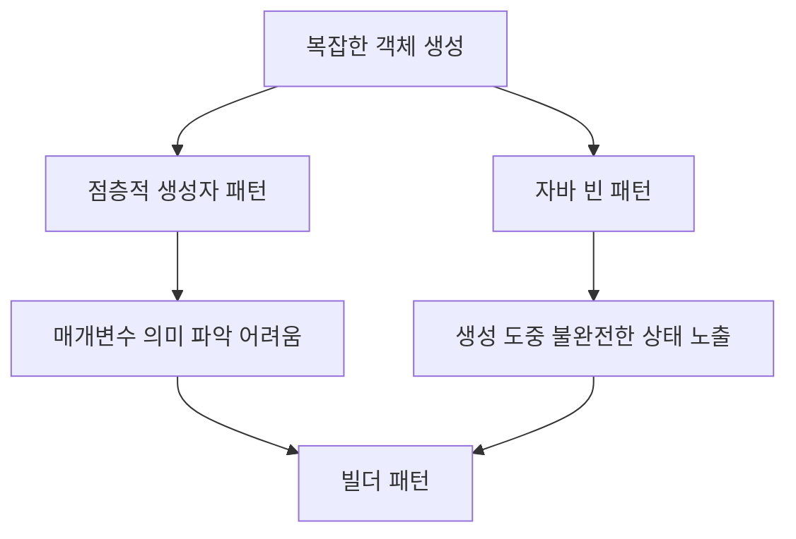
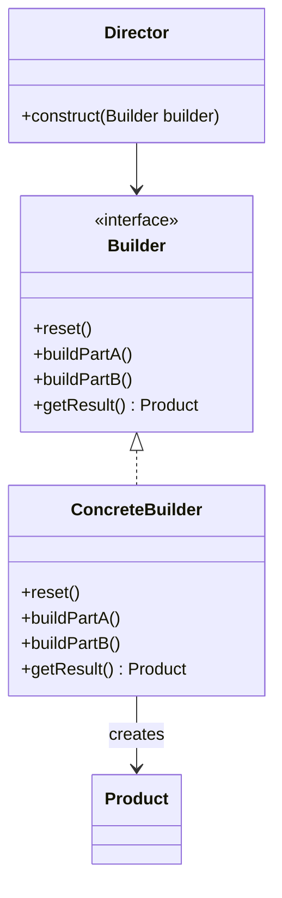

여행 패키지 예약 시스템에서 `TourPlan` 객체를 만든다고 하자. 제목은 필수지만 호텔·기간·일정은 상품마다 있을 수도 없을 수도 있다. 이 조합을 모두 커버하려면 생성자를 몇 개나 만들어야 할까? 이 질문에서 출발해, 객체 생성 과정을 단계별 메서드 호출로 분리하는 빌더 패턴을 살펴본다.

## 탄생 배경

빌더 패턴은 GoF(에리히 감마, 리처드 헬름, 랄프 존슨, 존 블리시디스)가 1994년 저서 『Design Patterns: Elements of Reusable Object-Oriented Software』에서 정리한 23개 패턴 중 하나이며, 생성 패턴으로 분류된다. 책에서는 RTF(Rich Text Format) 문서를 ASCII 텍스트, TeX, 텍스트 위젯 등 여러 형식으로 변환하는 `RTFReader` 예제로 이 패턴을 설명한다. 이후 조슈아 블로크가 『Effective Java』 Item 2에서 "점층적 생성자 패턴(telescoping constructor pattern)"의 대안으로 빌더를 재조명하면서, 선택적 매개변수가 많은 객체를 안전하게 생성하는 관용구로 널리 퍼졌다.

## 학습 목표

이 장을 읽고 나면 다음을 할 수 있다.

1. 빌더 패턴이 해결하는 문제(점층적 생성자, 일관성 없는 가변 객체)를 설명할 수 있다.
2. Builder, ConcreteBuilder, Director, Product 네 가지 역할을 구분하고 직접 구현할 수 있다.
3. 빌더 패턴을 적용할 시점과, 단순한 객체에 적용하면 오히려 과한 설계가 되는 이유를 판단할 수 있다.

## 개요

**빌더 패턴의 정의**  
빌더 패턴은 복잡한 객체의 생성 과정을 여러 단계로 분리하여, 동일한 생성 절차로도 서로 다른 표현의 객체를 만들 수 있게 하는 생성 패턴이다. 객체를 한 번의 생성자 호출로 완성하는 대신, 속성을 하나씩 설정하는 메서드를 연쇄적으로 호출한 뒤 마지막에 `build()`를 호출해 완성된 객체를 얻는다.

**패턴의 필요성**  
선택적 필드가 많은 객체일수록 생성자의 매개변수 조합이 기하급수적으로 늘어난다. 빌더 패턴은 "필요한 속성만 호출하고 나머지는 기본값에 맡기는" 방식으로 이 문제를 해결하며, 동시에 생성 중인 객체의 중간 상태가 외부에 노출되지 않도록 캡슐화한다.

**장단점**

| 구분 | 내용 |
|------|------|
| 장점 | 점층적 생성자 제거 — 선택적 매개변수 조합마다 생성자를 늘릴 필요 없이, 필요한 속성만 메서드로 설정한다. |
| 장점 | 불변 객체 생성 — `build()` 호출 전까지 내부 상태가 노출되지 않고, 완성된 객체는 `final` 필드로 불변성을 보장할 수 있다. |
| 단점 | 클래스 수 증가 — 객체마다 별도의 Builder 클래스(또는 정적 내부 클래스)가 필요해 코드량이 늘어난다. |
| 단점 | 단순 객체에는 과한 설계 — 필드가 2~3개뿐인 객체에 빌더를 적용하면 오히려 가독성이 떨어진다. |

코드로 어떻게 구현되는지는 아래 "문제"와 "구성 요소", "예제" 절에서 차례로 보여준다.

## 문제

빌더 패턴이 풀어야 할 문제는 두 갈래다 — 점층적 생성자의 가독성 문제와, 자바 빈 패턴의 상태 일관성 문제.

**점층적 생성자 패턴의 문제**

```java
public class House {
    private final int rooms;
    private final int floors;
    private final boolean hasGarage;
    private final boolean hasGarden;
    private final boolean hasPool;

    public House(int rooms, int floors) {
        this(rooms, floors, false, false, false);
    }

    public House(int rooms, int floors, boolean hasGarage) {
        this(rooms, floors, hasGarage, false, false);
    }

    public House(int rooms, int floors, boolean hasGarage, boolean hasGarden) {
        this(rooms, floors, hasGarage, hasGarden, false);
    }

    public House(int rooms, int floors, boolean hasGarage, boolean hasGarden, boolean hasPool) {
        this.rooms = rooms;
        this.floors = floors;
        this.hasGarage = hasGarage;
        this.hasGarden = hasGarden;
        this.hasPool = hasPool;
    }
}

// 호출부: boolean 값이 각각 무엇을 의미하는지 코드만 보고 알 수 없다.
House house = new House(3, 2, true, false, true);
```

선택적 매개변수 조합마다 생성자를 추가해야 하고, 매개변수가 늘어날수록 호출부의 가독성이 급격히 떨어진다.

**자바 빈 패턴의 한계**

```java
public class User {
    private String name;
    private int age;
    private String email;

    public void setName(String name) { this.name = name; }
    public void setAge(int age) { this.age = age; }
    public void setEmail(String email) { this.email = email; }
}

User user = new User();
user.setName("Alice");
// setAge(), setEmail() 호출 전에 user를 사용하면 불완전한 상태로 노출된다.
```

생성자 호출과 속성 설정이 분리되어, 객체가 일시적으로 불완전한 상태(inconsistent state)에 놓일 수 있고 `final` 필드를 쓸 수 없어 불변 객체를 만들 수 없다.


```mermaid
graph TD
    A[복잡한 객체 생성] --> B[점층적 생성자 패턴]
    A --> C[자바 빈 패턴]
    B --> D[매개변수 의미 파악 어려움]
    C --> E[생성 도중 불완전한 상태 노출]
    D --> F[빌더 패턴]
    E --> F
```

## 빌더 패턴의 구성 요소

빌더 패턴은 다음 네 가지 역할로 구성된다.

1. **Builder(빌더 인터페이스)**: 제품 객체의 각 부분을 생성하는 추상 메서드를 정의한다.
2. **ConcreteBuilder(구체적인 빌더)**: Builder 인터페이스를 구현해 실제 부품을 조립하고, 완성된 제품을 반환한다.
3. **Product(제품)**: 생성될 복잡한 객체.
4. **Director(디렉터, 선택적)**: 빌더를 사용해 특정 순서로 빌드 단계를 호출하는 역할. 생략하고 클라이언트가 직접 빌더를 호출하는 방식(플루언트 빌더)도 실무에서 널리 쓰인다.


```mermaid
classDiagram
    class Director {
        +construct(Builder builder)
    }
    class Builder {
        <<interface>>
        +reset()
        +buildPartA()
        +buildPartB()
        +getResult() Product
    }
    class ConcreteBuilder {
        +reset()
        +buildPartA()
        +buildPartB()
        +getResult() Product
    }
    class Product

    Director --> Builder
    Builder <|.. ConcreteBuilder
    ConcreteBuilder --> Product : creates
```

**동작 과정**

1. 클라이언트(또는 Director)가 ConcreteBuilder 인스턴스를 생성한다.
2. 필요한 부품을 설정하는 메서드를 차례로 호출한다(메서드 체이닝).
3. 마지막으로 `build()`(또는 `getResult()`)를 호출해 완성된 Product를 받는다.

Director는 필수가 아니다. 빌드 절차가 항상 같은 순서를 따라야 한다면 Director가 그 순서를 캡슐화하지만, 호출 순서가 자유로워도 되는 대부분의 실무 코드에서는 Director 없이 클라이언트가 직접 빌더 메서드를 체이닝하는 플루언트 빌더 형태를 더 많이 쓴다.

## 예제

**TourPlan 빌더 구현**

```java
public class TourPlan {
    private final String title;
    private final int days;
    private final String hotel;
    private final String plan;

    private TourPlan(Builder builder) {
        this.title = builder.title;
        this.days = builder.days;
        this.hotel = builder.hotel;
        this.plan = builder.plan;
    }

    public static class Builder {
        private String title;
        private int days;
        private String hotel;
        private String plan;

        public Builder title(String title) {
            this.title = title;
            return this;
        }

        public Builder days(int days) {
            this.days = days;
            return this;
        }

        public Builder hotel(String hotel) {
            this.hotel = hotel;
            return this;
        }

        public Builder plan(String plan) {
            this.plan = plan;
            return this;
        }

        public TourPlan build() {
            return new TourPlan(this);
        }
    }
}

// 사용 예
TourPlan tourPlan = new TourPlan.Builder()
        .title("제주도 여행")
        .days(3)
        .hotel("제주 호텔")
        .plan("한라산 등반, 해변 산책")
        .build();
```

`Builder`는 `TourPlan`의 정적 내부 클래스로, 각 필드를 설정하는 메서드가 `this`를 반환해 체이닝을 지원한다. `title`만 설정하고 `hotel`을 생략해도 컴파일 오류 없이 객체를 만들 수 있어, 앞서 본 점층적 생성자 문제가 사라진다. `TourPlan`의 필드가 모두 `final`이므로 `build()` 이후에는 값이 바뀌지 않는다.

## 실무에서 만나는 빌더 패턴

**StringBuilder**

```java
StringBuilder sb = new StringBuilder();
sb.append("Hello, ").append("World!");
String result = sb.toString(); // "Hello, World!"
```

**Stream.Builder**

```java
Stream<String> stream = Stream.<String>builder()
    .add("A")
    .add("B")
    .add("C")
    .build();
```

**UriComponentsBuilder (Spring)**

```java
UriComponents uri = UriComponentsBuilder
    .fromUriString("http://example.com")
    .path("/users")
    .queryParam("id", 1)
    .build();
```

**Lombok `@Builder`**

매번 Builder 클래스를 손으로 작성하는 대신, Lombok의 `@Builder` 애너테이션을 쓰면 컴파일 시점에 동일한 코드를 자동 생성한다.

```java
import lombok.Builder;

@Builder
public class Product {
    private final String name;
    private final double price;
    private final String description;
}

// 사용 예
Product product = Product.builder()
        .name("키보드")
        .price(89000)
        .description("기계식 키보드")
        .build();
```

단, Lombok이 생성한 빌더는 어떤 필드가 필수인지 표시하지 않으므로, 필수 값 검증이 필요하다면 `@Builder`만으로는 부족하고 직접 검증 로직을 추가해야 한다.

## 사용 시점과 회피 시점

| 구분 | 내용 |
|------|------|
| 사용 시점 | 선택적 매개변수가 4개 이상이고 조합이 다양한 객체를 생성할 때 |
| 사용 시점 | 생성된 객체가 불변(immutable)이어야 하고, 생성 도중 상태가 외부에 노출되면 안 될 때 |
| 회피 시점 | 필드가 2~3개뿐인 단순한 객체 — 일반 생성자나 정적 팩토리 메서드로 충분하다 |
| 회피 시점 | 객체의 모든 필드가 항상 함께 설정되어야 하는 경우 — 빌더의 유연성이 오히려 필수값 누락을 허용해 버그를 유발할 수 있다 |

## 자주 묻는 질문

**Q1: Director는 항상 필요한가요?**  
아니다. GoF 원전은 Director가 빌드 순서를 캡슐화하는 구조를 제시했지만, 실무에서는 호출 순서가 자유로워도 되는 경우가 많아 Director 없이 클라이언트가 빌더 메서드를 직접 체이닝하는 플루언트 빌더가 더 흔하다. 앞서 본 `TourPlan` 예제도 Director 없는 형태다.

**Q2: 빌더 패턴과 팩토리 메서드 패턴의 차이는 무엇인가요?**  
팩토리 메서드는 객체 하나를 생성하는 책임을 서브클래스에 위임해 "어떤 클래스의 인스턴스를 만들지"를 캡슐화한다. 반면 빌더는 이미 정해진 한 클래스의 객체를 "어떤 단계를 거쳐 조립할지"에 집중한다. 자세한 비교는 [03. Factory Method](/post/designpattern/03_factory_method/)에서 다룬다.

**Q3: Lombok `@Builder`를 쓰면 직접 구현할 필요가 없나요?**  
대부분의 경우 충분하지만, 한계도 있다. Lombok이 생성한 빌더는 필수 필드를 강제하지 않고, `build()` 시점의 커스텀 검증 로직을 끼워 넣을 수 없다. 필수값 검증이나 빌드 직전 유효성 검사가 필요하다면 직접 구현하거나 `@Builder` 위에 별도 검증 메서드를 추가해야 한다.

## 관련 패턴

- **[01. Abstract Factory - 추상 팩토리 패턴](/post/designpattern/01_abstract_factory/)**: 둘 다 생성 패턴이지만, 빌더는 객체 하나를 단계별로 조립하는 데 집중하고, 추상 팩토리는 관련된 객체 여러 개를 한 번에 생성한다.
- **[03. Factory Method - 팩토리 메서드 패턴](/post/designpattern/03_factory_method/)**: 단일 제품 생성 책임을 서브클래스에 위임하는 패턴으로, ConcreteBuilder 자체를 팩토리 메서드로 생성하는 조합도 흔하다.
- **[05. Singleton - 싱글턴 패턴](/post/designpattern/05_singleton/)**: 빌드 절차를 한 곳에서 통제해야 한다면 Director를 싱글턴으로 관리하기도 한다.

## 결론

빌더 패턴은 선택적 매개변수가 많고 생성 도중 상태가 노출되면 안 되는 객체에 가치가 있다. 반대로 필드가 몇 개뿐인 단순한 객체에 습관적으로 빌더를 씌우면, 클래스 수만 늘리고 점층적 생성자 문제보다 더 장황한 코드를 만들게 된다. `TourPlan`처럼 선택적 필드 조합이 다양하고 불변성이 중요한 경우인지 먼저 확인한 뒤 적용하는 것이 좋다.

다음 장에서는 생성 패턴의 세 번째인 팩토리 메서드 패턴을 다룬다: [03. Factory Method - 팩토리 메서드 패턴](/post/designpattern/03_factory_method/)

## 참고 문헌

**관련 서적**

1. **"Design Patterns: Elements of Reusable Object-Oriented Software"** - Erich Gamma, Richard Helm, Ralph Johnson, John Vlissides
   - 빌더 패턴을 처음 정리한 원전으로, RTFReader 예제를 통해 동기와 구조를 설명한다.
2. **"Effective Java"** - Joshua Bloch
   - Item 2에서 점층적 생성자 패턴의 대안으로 빌더 패턴을 다루며, 자바 관용구로서의 활용법을 제시한다.
3. **"Refactoring: Improving the Design of Existing Code"** - Martin Fowler
   - 복잡한 생성자를 빌더로 리팩토링하는 과정에 대한 통찰을 제공한다.

**온라인 리소스**

* [Refactoring Guru - Builder Pattern](https://refactoring.guru/design-patterns/builder)
* [Wikipedia - Builder pattern](https://en.wikipedia.org/wiki/Builder_pattern)
* [readystory.tistory.com - 빌더 패턴](https://readystory.tistory.com/121)
* [inpa.tistory.com - GoF 빌더 패턴 끝판왕 정리](https://inpa.tistory.com/entry/GOF-%F0%9F%92%A0-%EB%B9%8C%EB%8D%94Builder-%ED%8C%A8%ED%84%B4-%EB%81%9D%ED%8C%90%EC%99%95-%EC%A0%95%EB%A6%AC)
* [mangkyu.tistory.com - 빌더 패턴](https://mangkyu.tistory.com/163)
* [velog.io - 디자인 패턴 정복하기3 빌더 패턴](https://velog.io/@ch200203/%EB%94%94%EC%9E%90%EC%9D%B8-%ED%8C%A8%ED%84%B4-%EC%A0%95%EB%B3%B5%ED%95%98%EA%B8%B03-%EB%B9%8C%EB%8D%94-%ED%8C%A8%ED%84%B4-Builder-Pattern)
