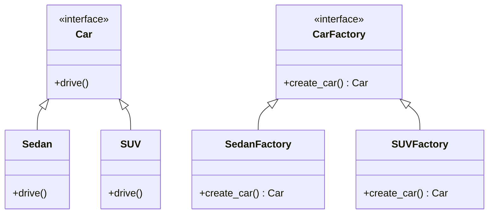
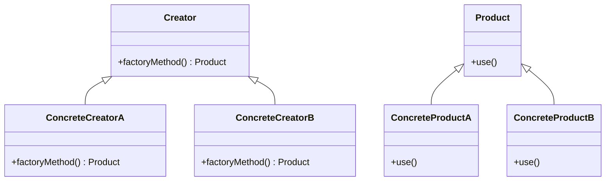
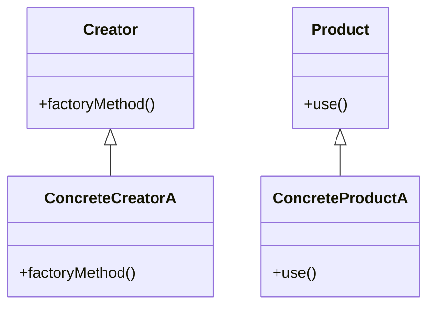
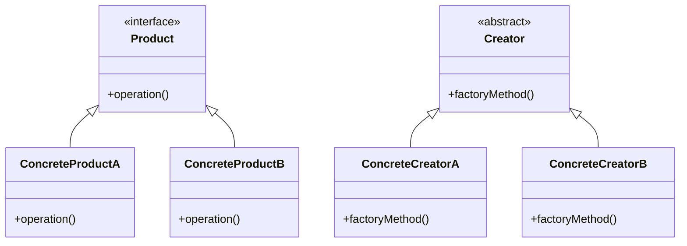
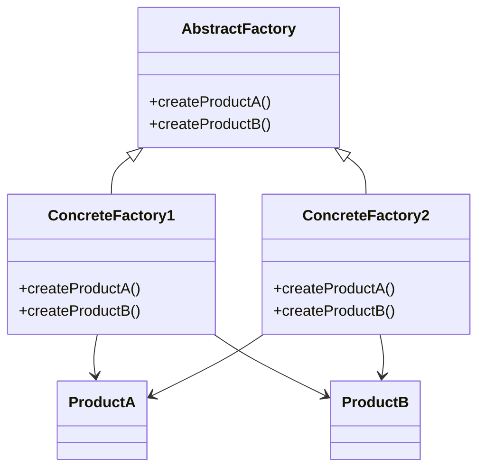
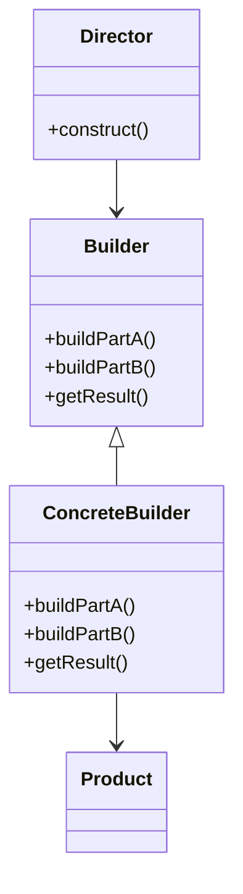
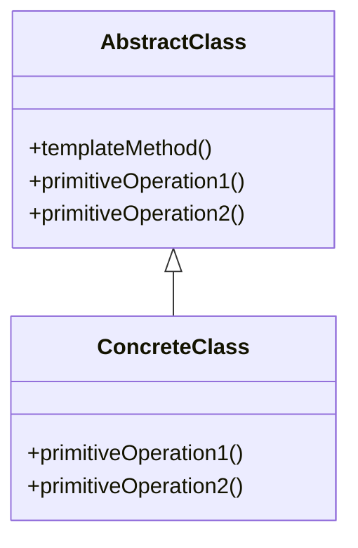
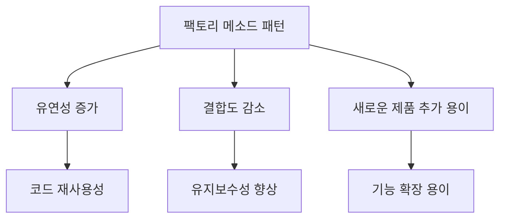

팩토리 메소드 패턴은 객체 지향 프로그래밍에서 널리 사용되는 디자인 패턴 중 하나로, 객체 생성의 책임을 서브클래스에 위임하는 방식이다. 이 패턴은 객체를 생성하는 인터페이스를 정의하되, 어떤 클래스의 인스턴스를 생성할지는 서브클래스에서 결정하도록 한다. 이를 통해 클라이언트는 구체적인 클래스에 의존하지 않고, 인터페이스를 통해 객체를 생성할 수 있게 된다. 팩토리 메소드 패턴은 코드의 유연성을 높이고, 새로운 클래스의 추가가 용이하게 만들어준다. 예를 들어, 기존의 코드에 새로운 제품 클래스를 추가할 때, 클라이언트 코드를 수정할 필요 없이 새로운 팩토리 클래스를 작성하고, 해당 클래스에서 생성할 제품을 정의하면 된다. 이처럼 팩토리 메소드 패턴은 객체 생성의 복잡성을 줄이고, 코드의 재사용성을 높이며, 유지보수를 용이하게 하는 장점을 가지고 있다. 또한, 이 패턴은 SOLID 원칙 중 하나인 개방-폐쇄 원칙을 준수하여, 기존 코드를 변경하지 않고도 새로운 기능을 추가할 수 있는 유연성을 제공한다. 따라서 소프트웨어 개발에서 팩토리 메소드 패턴은 매우 유용하게 활용될 수 있다.


<!--
##### Outline #####
-->

<!--
# 목차: 팩토리 메소드 패턴 (Factory Method Pattern)

## 개요
   - 팩토리 메소드 패턴의 정의
   - 생성 패턴의 중요성
   - 팩토리 메소드 패턴의 목적과 필요성

## 팩토리 메소드 패턴의 구조
   - 제품(Product) 인터페이스
   - 구체적인 제품(Concrete Product) 클래스
   - 생성자(Creator) 클래스
   - 구체적인 생성자(Concrete Creator) 클래스
   - UML 다이어그램 예시

## 팩토리 메소드 패턴의 동작 원리
   - 객체 생성의 위임
   - 서브클래스에 의한 객체 생성의 변경
   - 클라이언트 코드와 제품 간의 결합도 감소

## 예제
   - C++ 예제: 팩토리 메소드 패턴 구현
   - Java 예제: 컴퓨터 생성기
   - Python 예제: 미로 게임
   - PHP 예제: 자동차 공장
   - JavaScript 예제: 동적 객체 생성

## 팩토리 메소드 패턴의 장점과 단점
   - 장점
     - 코드의 유연성 증가
     - 클라이언트 코드의 간결함
     - 새로운 제품 추가 용이
   - 단점
     - 클래스 수 증가로 인한 복잡성
     - 초기 구현의 오버헤드

## FAQ
   - Q1: 팩토리 메소드 패턴과 추상 팩토리 패턴의 차이점은 무엇인가요?
   - Q2: 팩토리 메소드 패턴을 언제 사용해야 하나요?
   - Q3: 팩토리 메소드 패턴의 단점은 무엇인가요?
   - Q4: 팩토리 메소드 패턴을 사용한 유명한 라이브러리나 프레임워크는 무엇인가요?

## 관련 기술
   - 추상 팩토리 패턴 (Abstract Factory Pattern)
   - 프로토타입 패턴 (Prototype Pattern)
   - 빌더 패턴 (Builder Pattern)
   - 템플릿 메소드 패턴 (Template Method Pattern)

## 결론
   - 팩토리 메소드 패턴의 중요성 요약
   - 소프트웨어 설계에서의 활용 방안
   - 향후 연구 및 적용 가능성

## 참고 자료
   - GOF 디자인 패턴 책
   - 관련 블로그 및 온라인 자료
   - 오픈 소스 프로젝트에서의 팩토리 메소드 패턴 사례

이 목차는 팩토리 메소드 패턴에 대한 포괄적인 이해를 돕기 위해 구성되었으며, 다양한 예제와 관련 기술을 포함하여 독자가 실질적인 적용 방법을 배울 수 있도록 돕습니다.
-->

<!--
## 개요
   - 팩토리 메소드 패턴의 정의
   - 생성 패턴의 중요성
   - 팩토리 메소드 패턴의 목적과 필요성
-->

## 개요

**팩토리 메소드 패턴의 정의**  
팩토리 메소드 패턴은 객체 생성의 책임을 서브클래스에 위임하는 생성 패턴이다. 이 패턴은 객체를 생성하는 인터페이스를 정의하고, 어떤 클래스의 인스턴스를 만들지는 서브클래스에서 결정하도록 한다. 이를 통해 클라이언트 코드와 구체적인 객체 간의 결합도를 낮출 수 있다.

**생성 패턴의 중요성**  
소프트웨어 개발에서 객체 생성은 매우 중요한 부분이다. 객체 생성 방식에 따라 코드의 유연성과 유지보수성이 크게 달라질 수 있다. 생성 패턴은 객체 생성의 복잡성을 줄이고, 코드의 재사용성을 높이며, 새로운 객체를 추가할 때의 부담을 덜어준다. 따라서, 적절한 생성 패턴을 선택하는 것은 소프트웨어 설계에서 매우 중요하다.

**팩토리 메소드 패턴의 목적과 필요성**  
팩토리 메소드 패턴의 주된 목적은 객체 생성의 책임을 분리하여 코드의 유연성을 높이는 것이다. 이 패턴을 사용하면 클라이언트는 구체적인 클래스에 의존하지 않고, 인터페이스를 통해 객체를 생성할 수 있다. 또한, 새로운 제품을 추가할 때 기존 코드를 수정할 필요가 없어 유지보수성이 향상된다. 이러한 이유로 팩토리 메소드 패턴은 대규모 소프트웨어 시스템에서 자주 사용된다.

**샘플 코드 (Python 예제)**

아래는 팩토리 메소드 패턴을 사용하여 간단한 자동차 객체를 생성하는 예제이다.

```python
from abc import ABC, abstractmethod

# 제품 인터페이스
class Car(ABC):
    @abstractmethod
    def drive(self):
        pass

# 구체적인 제품 클래스
class Sedan(Car):
    def drive(self):
        return "Driving a sedan"

class SUV(Car):
    def drive(self):
        return "Driving an SUV"

# 생성자 클래스
class CarFactory(ABC):
    @abstractmethod
    def create_car(self) -> Car:
        pass

# 구체적인 생성자 클래스
class SedanFactory(CarFactory):
    def create_car(self) -> Car:
        return Sedan()

class SUVFactory(CarFactory):
    def create_car(self) -> Car:
        return SUV()

# 클라이언트 코드
def client_code(factory: CarFactory):
    car = factory.create_car()
    print(car.drive())

# 사용 예
client_code(SedanFactory())
client_code(SUVFactory())
```

**UML 다이어그램 예시**

아래는 팩토리 메소드 패턴의 구조를 나타내는 UML 다이어그램이다.



이와 같이 팩토리 메소드 패턴은 객체 생성의 유연성을 높이고, 코드의 유지보수성을 향상시키는 데 기여한다.

<!--
## 팩토리 메소드 패턴의 구조
   - 제품(Product) 인터페이스
   - 구체적인 제품(Concrete Product) 클래스
   - 생성자(Creator) 클래스
   - 구체적인 생성자(Concrete Creator) 클래스
   - UML 다이어그램 예시
-->

## 팩토리 메소드 패턴의 구조

팩토리 메소드 패턴은 객체 생성의 책임을 서브클래스에 위임하는 디자인 패턴이다. 이 패턴은 객체 생성의 구조를 명확히 하고, 코드의 유연성을 높이는 데 기여한다. 이번 섹션에서는 팩토리 메소드 패턴의 주요 구성 요소에 대해 살펴보겠다.

**제품(Product) 인터페이스**  
제품 인터페이스는 생성될 객체의 공통된 기능을 정의한다. 이 인터페이스를 통해 클라이언트는 구체적인 제품 클래스에 의존하지 않고, 제품의 기능을 사용할 수 있다. 예를 들어, 다음과 같은 제품 인터페이스를 정의할 수 있다.

```cpp
class Product {
public:
    virtual void use() = 0; // 순수 가상 함수
};
```

**구체적인 제품(Concrete Product) 클래스**  
구체적인 제품 클래스는 제품 인터페이스를 구현하여 실제 객체의 기능을 제공한다. 여러 개의 구체적인 제품 클래스가 존재할 수 있으며, 각 클래스는 제품 인터페이스의 메소드를 구체적으로 정의한다. 예를 들어, 다음과 같은 두 개의 구체적인 제품 클래스를 정의할 수 있다.

```cpp
class ConcreteProductA : public Product {
public:
    void use() override {
        // ConcreteProductA의 사용 방법
    }
};

class ConcreteProductB : public Product {
public:
    void use() override {
        // ConcreteProductB의 사용 방법
    }
};
```

**생성자(Creator) 클래스**  
생성자 클래스는 제품 객체를 생성하는 메소드를 정의한다. 이 클래스는 제품 인터페이스를 반환하는 팩토리 메소드를 포함하고 있으며, 기본적으로 이 메소드는 서브클래스에서 오버라이드되어 구체적인 제품 객체를 생성하도록 설계된다.

```cpp
class Creator {
public:
    virtual Product* factoryMethod() = 0; // 순수 가상 함수
};
```

**구체적인 생성자(Concrete Creator) 클래스**  

구체적인 생성자 클래스는 생성자 클래스를 상속받아 팩토리 메소드를 구현한다. 이 클래스는 특정 제품 객체를 생성하는 책임을 가진다. 예를 들어, 다음과 같은 두 개의 구체적인 생성자 클래스를 정의할 수 있다.

```cpp
class ConcreteCreatorA : public Creator {
public:
    Product* factoryMethod() override {
        return new ConcreteProductA();
    }
};

class ConcreteCreatorB : public Creator {
public:
    Product* factoryMethod() override {
        return new ConcreteProductB();
    }
};
```

**UML 다이어그램 예시**  

팩토리 메소드 패턴의 구조를 시각적으로 이해하기 위해 UML 다이어그램을 활용할 수 있다. 아래는 팩토리 메소드 패턴의 UML 다이어그램 예시이다.



이와 같이 팩토리 메소드 패턴은 제품 인터페이스, 구체적인 제품 클래스, 생성자 클래스, 구체적인 생성자 클래스로 구성되어 있으며, 각 구성 요소는 명확한 역할을 가지고 있다. 이러한 구조는 코드의 유연성을 높이고, 새로운 제품을 추가하는 데 용이함을 제공한다.

<!--
## 팩토리 메소드 패턴의 동작 원리
   - 객체 생성의 위임
   - 서브클래스에 의한 객체 생성의 변경
   - 클라이언트 코드와 제품 간의 결합도 감소
-->

## 팩토리 메소드 패턴의 동작 원리

팩토리 메소드 패턴은 객체 생성의 책임을 서브클래스에 위임하여 유연한 객체 생성 구조를 제공하는 디자인 패턴이다. 이 패턴의 동작 원리는 다음과 같은 세 가지 주요 요소로 구성된다.

**객체 생성의 위임**

팩토리 메소드 패턴에서는 객체 생성의 책임이 구체적인 클래스가 아닌 팩토리 메소드에 의해 위임된다. 이를 통해 클라이언트는 구체적인 클래스에 의존하지 않고, 인터페이스를 통해 객체를 생성할 수 있다. 이로 인해 코드의 유연성이 증가하고, 새로운 제품을 추가할 때 클라이언트 코드를 수정할 필요가 없어지게 된다.

```cpp
// C++ 예제
class Product {
public:
    virtual void use() = 0;
};

class ConcreteProductA : public Product {
public:
    void use() override {
        std::cout << "Using Product A" << std::endl;
    }
};

class Creator {
public:
    virtual Product* factoryMethod() = 0;
};

class ConcreteCreatorA : public Creator {
public:
    Product* factoryMethod() override {
        return new ConcreteProductA();
    }
};
```

**서브클래스에 의한 객체 생성의 변경**

팩토리 메소드 패턴을 사용하면 서브클래스에서 객체 생성 방식을 변경할 수 있다. 클라이언트는 팩토리 메소드를 호출하여 객체를 생성하지만, 실제로 어떤 객체가 생성될지는 서브클래스에 의해 결정된다. 이로 인해 클라이언트는 구체적인 클래스에 대한 지식 없이도 다양한 객체를 생성할 수 있다.

```java
// Java 예제
abstract class Creator {
    public abstract Product factoryMethod();
}

class ConcreteCreatorB extends Creator {
    @Override
    public Product factoryMethod() {
        return new ConcreteProductB();
    }
}
```

**클라이언트 코드와 제품 간의 결합도 감소**

팩토리 메소드 패턴은 클라이언트 코드와 제품 간의 결합도를 낮춘다. 클라이언트는 팩토리 메소드를 통해 제품을 생성하므로, 제품의 구체적인 구현에 대한 의존성이 줄어든다. 이는 코드의 유지보수성을 높이고, 새로운 제품을 추가할 때 클라이언트 코드를 수정할 필요가 없게 만든다.

```python
# Python 예제
class Product:
    def use(self):
        pass

class ConcreteProductC(Product):
    def use(self):
        print("Using Product C")

class Creator:
    def factory_method(self):
        pass

class ConcreteCreatorC(Creator):
    def factory_method(self):
        return ConcreteProductC()
```



팩토리 메소드 패턴은 객체 생성의 유연성을 제공하며, 클라이언트 코드와 제품 간의 결합도를 낮추는 데 큰 역할을 한다. 이러한 원리를 이해하고 활용하면 소프트웨어 설계에서 더욱 효과적인 구조를 만들 수 있다.

<!--
## 예제
   - C++ 예제: 팩토리 메소드 패턴 구현
   - Java 예제: 컴퓨터 생성기
   - Python 예제: 미로 게임
   - PHP 예제: 자동차 공장
   - JavaScript 예제: 동적 객체 생성
-->

## 예제

**C++ 예제: 팩토리 메소드 패턴 구현**  

C++에서 팩토리 메소드 패턴을 구현하는 방법을 살펴보자. 아래의 예제는 `Product` 인터페이스와 이를 구현하는 `ConcreteProduct` 클래스, 그리고 객체 생성을 담당하는 `Creator` 클래스를 포함한다.

```cpp
#include <iostream>
using namespace std;

// 제품 인터페이스
class Product {
public:
    virtual void use() = 0;
};

// 구체적인 제품 클래스
class ConcreteProductA : public Product {
public:
    void use() override {
        cout << "Using ConcreteProductA" << endl;
    }
};

class ConcreteProductB : public Product {
public:
    void use() override {
        cout << "Using ConcreteProductB" << endl;
    }
};

// 생성자 클래스
class Creator {
public:
    virtual Product* factoryMethod() = 0;

    void someOperation() {
        Product* product = factoryMethod();
        product->use();
    }
};

// 구체적인 생성자 클래스
class ConcreteCreatorA : public Creator {
public:
    Product* factoryMethod() override {
        return new ConcreteProductA();
    }
};

class ConcreteCreatorB : public Creator {
public:
    Product* factoryMethod() override {
        return new ConcreteProductB();
    }
};

int main() {
    Creator* creatorA = new ConcreteCreatorA();
    creatorA->someOperation();

    Creator* creatorB = new ConcreteCreatorB();
    creatorB->someOperation();

    delete creatorA;
    delete creatorB;

    return 0;
}
```

**Java 예제: 컴퓨터 생성기**  

Java에서는 팩토리 메소드 패턴을 사용하여 다양한 종류의 컴퓨터를 생성하는 예제를 살펴보자.

```java
abstract class Computer {
    public abstract void assemble();
}

class PC extends Computer {
    public void assemble() {
        System.out.println("Assembling a PC");
    }
}

class Laptop extends Computer {
    public void assemble() {
        System.out.println("Assembling a Laptop");
    }
}

abstract class ComputerFactory {
    public abstract Computer createComputer();
}

class PCFactory extends ComputerFactory {
    public Computer createComputer() {
        return new PC();
    }
}

class LaptopFactory extends ComputerFactory {
    public Computer createComputer() {
        return new Laptop();
    }
}

public class Main {
    public static void main(String[] args) {
        ComputerFactory factory = new PCFactory();
        Computer computer = factory.createComputer();
        computer.assemble();

        factory = new LaptopFactory();
        computer = factory.createComputer();
        computer.assemble();
    }
}
```

**Python 예제: 미로 게임**  

Python에서는 팩토리 메소드 패턴을 사용하여 미로 게임의 다양한 캐릭터를 생성하는 예제를 살펴보자.

```python
from abc import ABC, abstractmethod

class Character(ABC):
    @abstractmethod
    def attack(self):
        pass

class Warrior(Character):
    def attack(self):
        return "Warrior attacks with sword!"

class Mage(Character):
    def attack(self):
        return "Mage casts a fireball!"

class CharacterFactory(ABC):
    @abstractmethod
    def create_character(self):
        pass

class WarriorFactory(CharacterFactory):
    def create_character(self):
        return Warrior()

class MageFactory(CharacterFactory):
    def create_character(self):
        return Mage()

if __name__ == "__main__":
    factory = WarriorFactory()
    character = factory.create_character()
    print(character.attack())

    factory = MageFactory()
    character = factory.create_character()
    print(character.attack())
```

**JavaScript 예제: 동적 객체 생성**  

JavaScript에서는 팩토리 메소드 패턴을 사용하여 동적으로 객체를 생성하는 예제를 살펴보자.

```javascript
class Shape {
    draw() {
        throw new Error("This method should be overridden!");
    }
}

class Circle extends Shape {
    draw() {
        console.log("Drawing a Circle");
    }
}

class Square extends Shape {
    draw() {
        console.log("Drawing a Square");
    }
}

class ShapeFactory {
    createShape(type) {
        switch (type) {
            case "circle":
                return new Circle();
            case "square":
                return new Square();
            default:
                throw new Error("Unknown shape type");
        }
    }
}

const factory = new ShapeFactory();
const circle = factory.createShape("circle");
circle.draw();

const square = factory.createShape("square");
square.draw();
```

이와 같이 다양한 언어에서 팩토리 메소드 패턴을 활용하여 객체를 생성하는 방법을 살펴보았다. 각 예제는 패턴의 구조와 동작 방식을 이해하는 데 도움을 줄 것이다.

<!--
## 팩토리 메소드 패턴의 장점과 단점
   - 장점
     - 코드의 유연성 증가
     - 클라이언트 코드의 간결함
     - 새로운 제품 추가 용이
   - 단점
     - 클래스 수 증가로 인한 복잡성
     - 초기 구현의 오버헤드
-->

## 팩토리 메소드 패턴의 장점과 단점

팩토리 메소드 패턴은 소프트웨어 설계에서 널리 사용되는 디자인 패턴으로, 여러 가지 장점과 단점을 가지고 있다. 이 섹션에서는 이러한 장점과 단점을 구체적으로 살펴보겠다.

**장점**

- **코드의 유연성 증가**  
  팩토리 메소드 패턴은 객체 생성의 책임을 서브클래스에 위임함으로써, 클라이언트 코드가 구체적인 클래스에 의존하지 않도록 한다. 이로 인해 새로운 제품을 추가할 때 클라이언트 코드를 수정할 필요가 없어 코드의 유연성이 증가한다.

- **클라이언트 코드의 간결함**  
  클라이언트는 팩토리 메소드를 통해 제품을 생성하므로, 제품 생성에 대한 복잡한 로직을 알 필요가 없다. 이는 클라이언트 코드의 가독성을 높이고 유지보수를 용이하게 한다.

- **새로운 제품 추가 용이**  
  새로운 제품을 추가할 때, 기존의 클라이언트 코드를 변경하지 않고 새로운 구체적인 생성자와 제품 클래스를 추가하는 것으로 해결할 수 있다. 이는 시스템의 확장성을 높이는 데 기여한다.

**단점**

- **클래스 수 증가로 인한 복잡성**  
  팩토리 메소드 패턴을 사용하면 클래스의 수가 증가하게 된다. 이는 시스템의 복잡성을 높이고, 관리해야 할 클래스가 많아져 개발자에게 부담을 줄 수 있다.

- **초기 구현의 오버헤드**  
  패턴을 적용하기 위해서는 초기 설계와 구현에 더 많은 시간과 노력이 필요하다. 특히, 간단한 객체 생성 로직에 비해 패턴을 적용하는 것이 오히려 비효율적일 수 있다.

이와 같이 팩토리 메소드 패턴은 장점과 단점을 모두 가지고 있으며, 상황에 따라 적절히 활용할 수 있는 디자인 패턴이다.

<!--
## FAQ
   - Q1: 팩토리 메소드 패턴과 추상 팩토리 패턴의 차이점은 무엇인가요?
   - Q2: 팩토리 메소드 패턴을 언제 사용해야 하나요?
   - Q3: 팩토리 메소드 패턴의 단점은 무엇인가요?
   - Q4: 팩토리 메소드 패턴을 사용한 유명한 라이브러리나 프레임워크는 무엇인가요?
-->

## FAQ

**Q1: 팩토리 메소드 패턴과 추상 팩토리 패턴의 차이점은 무엇인가요?**  

팩토리 메소드 패턴과 추상 팩토리 패턴은 모두 객체 생성에 관련된 디자인 패턴이지만, 그 사용 목적과 구조에서 차이가 있다. 팩토리 메소드 패턴은 하나의 제품 계열에 대한 객체 생성을 담당하는 반면, 추상 팩토리 패턴은 여러 제품 계열에 대한 객체 생성을 담당한다. 즉, 팩토리 메소드 패턴은 특정 제품을 생성하는 메소드를 정의하고, 서브클래스에서 그 메소드를 구현하여 구체적인 객체를 생성하는 방식이다. 반면, 추상 팩토리 패턴은 여러 제품을 생성하기 위한 인터페이스를 제공하고, 이를 구현하는 구체적인 팩토리 클래스가 여러 제품을 동시에 생성할 수 있도록 한다.

**Q2: 팩토리 메소드 패턴을 언제 사용해야 하나요?**  

팩토리 메소드 패턴은 다음과 같은 상황에서 사용해야 한다. 첫째, 객체 생성의 책임을 클라이언트 코드에서 분리하고 싶을 때 사용한다. 둘째, 객체의 생성 과정이 복잡하거나 다양한 서브클래스가 존재할 때 유용하다. 셋째, 코드의 유연성을 높이고, 새로운 제품을 추가할 때 기존 코드를 수정하지 않고도 확장할 수 있는 구조가 필요할 때 적합하다.

**Q3: 팩토리 메소드 패턴의 단점은 무엇인가요?**  

팩토리 메소드 패턴의 단점으로는 클래스 수가 증가하여 코드의 복잡성이 높아질 수 있다는 점이 있다. 또한, 초기 구현 시 오버헤드가 발생할 수 있으며, 간단한 객체 생성에 비해 불필요한 복잡성을 초래할 수 있다. 따라서, 패턴을 적용하기 전에 실제로 필요한지 신중하게 고려해야 한다.

**Q4: 팩토리 메소드 패턴을 사용한 유명한 라이브러리나 프레임워크는 무엇인가요?**  

팩토리 메소드 패턴은 다양한 라이브러리와 프레임워크에서 사용된다. 예를 들어, Java의 Spring 프레임워크에서는 BeanFactory와 ApplicationContext가 팩토리 메소드 패턴을 활용하여 객체를 생성한다. 또한, Android의 View 클래스에서도 팩토리 메소드 패턴을 사용하여 다양한 UI 컴포넌트를 생성하는 방식이 적용된다.



위의 다이어그램은 팩토리 메소드 패턴의 구조를 나타낸다. `Creator` 클래스는 `factoryMethod()`를 정의하고, 이를 상속받은 `ConcreteCreatorA`와 `ConcreteCreatorB` 클래스가 각각 `ConcreteProductA`와 `ConcreteProductB` 객체를 생성하는 방식이다. 이처럼 팩토리 메소드 패턴은 객체 생성의 유연성을 제공하며, 클라이언트 코드와 제품 간의 결합도를 낮추는 데 기여한다.

<!--
## 관련 기술
   - 추상 팩토리 패턴 (Abstract Factory Pattern)
   - 프로토타입 패턴 (Prototype Pattern)
   - 빌더 패턴 (Builder Pattern)
   - 템플릿 메소드 패턴 (Template Method Pattern)
-->

## 관련 기술

팩토리 메소드 패턴은 다양한 디자인 패턴과 함께 사용될 수 있으며, 이들 패턴은 서로 다른 문제를 해결하는 데 도움을 준다. 이번 섹션에서는 팩토리 메소드 패턴과 관련된 몇 가지 주요 디자인 패턴을 살펴보겠다.

**추상 팩토리 패턴 (Abstract Factory Pattern)**  

추상 팩토리 패턴은 관련된 객체들의 집합을 생성하는 인터페이스를 제공하는 패턴이다. 이 패턴은 팩토리 메소드 패턴의 확장으로 볼 수 있으며, 여러 제품군을 생성할 수 있는 기능을 제공한다. 예를 들어, GUI 라이브러리에서 다양한 운영 체제에 맞는 버튼과 텍스트 박스를 생성할 때 유용하다.



**프로토타입 패턴 (Prototype Pattern)**  
프로토타입 패턴은 객체를 복제하여 새로운 객체를 생성하는 패턴이다. 이 패턴은 객체 생성 비용이 큰 경우에 유용하며, 기존 객체를 복제하여 새로운 객체를 생성함으로써 성능을 향상시킬 수 있다. 팩토리 메소드 패턴과 함께 사용하면, 생성할 객체의 종류를 런타임에 결정할 수 있는 유연성을 제공한다.

```python
class Prototype:
    def clone(self):
        pass

class ConcretePrototype(Prototype):
    def __init__(self, state):
        self.state = state

    def clone(self):
        return ConcretePrototype(self.state)

# 사용 예
original = ConcretePrototype("original state")
clone = original.clone()
```

**빌더 패턴 (Builder Pattern)**  
빌더 패턴은 복잡한 객체를 단계별로 생성하는 패턴이다. 이 패턴은 객체의 생성 과정을 분리하여, 동일한 생성 절차로 다양한 표현의 객체를 만들 수 있도록 한다. 팩토리 메소드 패턴과 함께 사용하면, 객체의 생성과정을 더욱 유연하게 관리할 수 있다.



**템플릿 메소드 패턴 (Template Method Pattern)**  
템플릿 메소드 패턴은 알고리즘의 구조를 정의하고, 일부 단계를 서브클래스에서 구현하도록 하는 패턴이다. 이 패턴은 코드의 중복을 줄이고, 알고리즘의 일관성을 유지하는 데 도움을 준다. 팩토리 메소드 패턴과 함께 사용하면, 객체 생성 과정에서의 일관성을 유지하면서도 유연성을 제공할 수 있다.



이와 같이, 팩토리 메소드 패턴은 다양한 관련 기술과 함께 사용될 수 있으며, 각 패턴은 특정한 문제를 해결하는 데 도움을 준다. 이러한 패턴들을 이해하고 적절히 활용하는 것은 소프트웨어 설계에서 매우 중요하다.

<!--
## 결론
   - 팩토리 메소드 패턴의 중요성 요약
   - 소프트웨어 설계에서의 활용 방안
   - 향후 연구 및 적용 가능성
-->

## 결론

**팩토리 메소드 패턴의 중요성 요약**  
팩토리 메소드 패턴은 객체 생성의 책임을 서브클래스에 위임함으로써 코드의 유연성을 높이고, 클라이언트와 제품 간의 결합도를 낮추는 데 기여한다. 이 패턴은 다양한 제품을 생성할 수 있는 구조를 제공하여, 새로운 제품을 추가할 때 기존 코드를 수정할 필요가 없도록 한다. 이러한 특성 덕분에 소프트웨어 설계에서의 유지보수성과 확장성이 크게 향상된다.

**소프트웨어 설계에서의 활용 방안**  
팩토리 메소드 패턴은 다양한 상황에서 활용될 수 있다. 예를 들어, GUI 애플리케이션에서 다양한 버튼이나 창을 생성할 때, 각 플랫폼에 맞는 구체적인 제품을 생성하는 데 유용하다. 또한, 게임 개발에서 다양한 캐릭터나 아이템을 생성할 때도 이 패턴을 적용할 수 있다. 이러한 활용 방안은 코드의 재사용성을 높이고, 새로운 기능을 추가할 때의 부담을 줄여준다.

**향후 연구 및 적용 가능성**  
팩토리 메소드 패턴은 다양한 프로그래밍 언어와 프레임워크에서 적용될 수 있으며, 특히 객체 지향 프로그래밍의 기본 원칙을 따르는 시스템에서 더욱 효과적이다. 향후 연구에서는 이 패턴을 다른 디자인 패턴과 결합하여 더욱 복잡한 시스템을 설계하는 방법에 대한 탐구가 필요하다. 예를 들어, 추상 팩토리 패턴과의 결합을 통해 더욱 유연한 객체 생성 구조를 만들 수 있을 것이다.



위의 다이어그램은 팩토리 메소드 패턴의 주요 장점들을 시각적으로 나타낸 것이다. 이 패턴을 통해 얻을 수 있는 이점들은 소프트웨어 설계에서 매우 중요한 요소로 작용한다.

<!--
## 참고 자료
   - GOF 디자인 패턴 책
   - 관련 블로그 및 온라인 자료
   - 오픈 소스 프로젝트에서의 팩토리 메소드 패턴 사례
-->

## 참고 자료

**GOF 디자인 패턴 책**  
GOF 디자인 패턴 책은 소프트웨어 디자인 패턴의 고전으로, "Design Patterns: Elements of Reusable Object-Oriented Software"라는 제목으로 출간되었다. 이 책은 23개의 디자인 패턴을 소개하며, 팩토리 메소드 패턴을 포함한 다양한 패턴의 개념과 사용 사례를 상세히 설명하고 있다. 이 책을 통해 디자인 패턴의 기초를 다지고, 실무에서의 적용 방법을 배울 수 있다.

**관련 블로그 및 온라인 자료**  
다양한 블로그와 온라인 자료에서 팩토리 메소드 패턴에 대한 설명과 예제를 찾아볼 수 있다. 예를 들어, Medium, Dev.to, 그리고 개인 개발자 블로그 등에서 실무 경험을 바탕으로 한 유용한 정보와 팁을 제공한다. 이러한 자료들은 패턴의 이해를 돕고, 실제 프로젝트에 적용하는 데 큰 도움이 된다.

**오픈 소스 프로젝트에서의 팩토리 메소드 패턴 사례**  
오픈 소스 프로젝트는 팩토리 메소드 패턴을 실제로 어떻게 활용하는지를 보여주는 좋은 예시이다. GitHub와 같은 플랫폼에서 다양한 프로젝트를 검색하여, 팩토리 메소드 패턴이 사용된 코드를 분석할 수 있다. 예를 들어, Java의 Spring 프레임워크나 Python의 Django와 같은 프레임워크에서 이 패턴을 활용하여 객체 생성을 관리하는 방식을 살펴볼 수 있다.

이 자료들은 팩토리 메소드 패턴을 이해하고 활용하는 데 큰 도움이 될 것이다. 다양한 자료를 참고하여 실무에서의 적용 가능성을 높이기 바란다.

<!--
##### Reference #####
-->

## Reference


* [https://en.wikipedia.org/wiki/Factory_method_pattern](https://en.wikipedia.org/wiki/Factory_method_pattern)
* [https://refactoring.guru/design-patterns/factory-method](https://refactoring.guru/design-patterns/factory-method)
* [https://velog.io/@chojs28/Factory-Method-%ED%8C%A9%ED%86%A0%EB%A6%AC-%EB%A9%94%EC%84%9C%EB%93%9C](https://velog.io/@chojs28/Factory-Method-%ED%8C%A9%ED%86%A0%EB%A6%AC-%EB%A9%94%EC%84%9C%EB%93%9C)
* [https://readystory.tistory.com/117](https://readystory.tistory.com/117)
* [https://gdtbgl93.tistory.com/19](https://gdtbgl93.tistory.com/19)
* [https://inpa.tistory.com/entry/GOF-%F0%9F%92%A0-%ED%8C%A9%ED%86%A0%EB%A6%AC-%EB%A9%94%EC%84%9C%EB%93%9CFactory-Method-%ED%8C%A8%ED%84%B4-%EC%A0%9C%EB%8C%80%EB%A1%9C-%EB%B0%B0%EC%9B%8C%EB%B3%B4%EC%9E%90](https://inpa.tistory.com/entry/GOF-%F0%9F%92%A0-%ED%8C%A9%ED%86%A0%EB%A6%AC-%EB%A9%94%EC%84%9C%EB%93%9CFactory-Method-%ED%8C%A8%ED%84%B4-%EC%A0%9C%EB%8C%80%EB%A1%9C-%EB%B0%B0%EC%9B%8C%EB%B3%B4%EC%9E%90)

