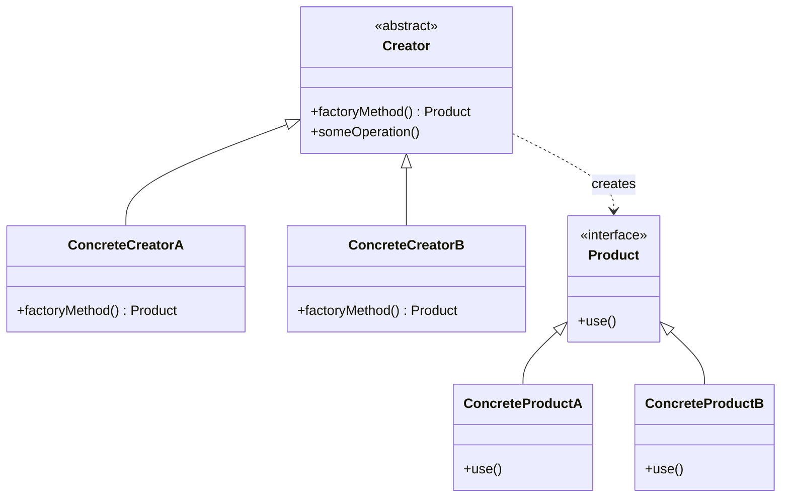

문서 편집기를 만든다고 하자. 새 문서를 열 때마다 `new Document()`를 직접 호출하면, PDF·워드·텍스트 등 문서 종류가 늘어날 때마다 그 호출부를 전부 찾아 고쳐야 한다. 객체를 생성하는 코드와 그 객체를 사용하는 코드를 분리할 수는 없을까? 이 질문에서 출발해, 객체 생성을 서브클래스에 위임하는 팩토리 메서드 패턴을 살펴본다.

## 탄생 배경

팩토리 메서드 패턴은 GoF(에리히 감마, 리처드 헬름, 랄프 존슨, 존 블리시디스)가 1994년 저서 『Design Patterns: Elements of Reusable Object-Oriented Software』에서 정리한 23개 패턴 중 하나이며, 생성 패턴으로 분류된다. 책에서는 다양한 도형(그래픽 애플리케이션의 `Shape`)이나 문서 종류를 다루는 프레임워크가, 구체적으로 어떤 클래스를 생성할지는 모른 채 "객체를 만든다"는 절차만 정의해야 하는 상황을 예로 든다. 이 문제를 풀기 위해 객체 생성을 별도의 가상 메서드(factory method)로 분리하고, 그 메서드를 서브클래스가 오버라이드하도록 한 것이 이 패턴의 핵심 아이디어다.

## 학습 목표

이 장을 읽고 나면 다음을 할 수 있다.

1. 팩토리 메서드 패턴이 해결하는 문제(객체 생성 코드와 사용 코드의 결합)를 설명할 수 있다.
2. Product, ConcreteProduct, Creator, ConcreteCreator 네 가지 역할을 구분하고 직접 구현할 수 있다.
3. 추상 팩토리 패턴과의 차이를 설명하고, 팩토리 메서드 패턴이 과한 설계가 되는 시점을 판단할 수 있다.

## 개요

**팩토리 메서드 패턴의 정의**  
팩토리 메서드 패턴은 객체 생성을 위한 인터페이스를 상위 클래스에 정의하되, 정작 어떤 클래스의 인스턴스를 만들지는 서브클래스가 결정하도록 위임하는 생성 패턴이다. 클라이언트는 상위 클래스(Creator)의 인터페이스만 알면 되고, 실제로 생성되는 구체 클래스(ConcreteProduct)를 알 필요가 없다.

**패턴의 필요성**  
객체 생성 코드가 비즈니스 로직 곳곳에 흩어져 있으면, 새로운 제품 종류를 추가할 때마다 그 호출부를 전부 찾아 고쳐야 한다. 팩토리 메서드 패턴은 "어떤 제품을 만들지 결정하는 책임"을 서브클래스 하나로 모아, 새 제품이 추가돼도 기존 코드(Creator를 사용하는 클라이언트 코드)는 손대지 않도록 만든다.

**장단점**

| 구분 | 내용 |
|------|------|
| 장점 | 결합도 감소 — 클라이언트는 Creator 인터페이스에만 의존하므로, 어떤 ConcreteProduct가 생성되는지 알 필요가 없다. |
| 장점 | 개방-폐쇄 원칙 준수 — 새 제품을 추가할 때 기존 Creator·클라이언트 코드를 수정하지 않고, ConcreteCreator만 새로 추가하면 된다. |
| 단점 | 클래스 수 증가 — 제품 하나를 추가할 때마다 ConcreteProduct와 ConcreteCreator를 한 쌍씩 만들어야 한다. |
| 단점 | 제품이 하나뿐이거나 거의 바뀌지 않는 경우 과한 설계 — 단순히 `new`로 직접 생성해도 충분한 상황에 적용하면 클래스 수만 늘어난다. |

코드로 어떻게 구현되는지는 아래 "구성 요소"와 "예제" 절에서 문서 편집기 예제로 일관되게 보여준다.

## 팩토리 메서드 패턴의 구성 요소

앞서 "개요"에서 정의한 위임 구조는 코드에서 다음 네 가지 역할로 나뉘어 구현된다.

**Product: 제품 인터페이스**  
생성될 객체가 공통으로 가져야 할 기능을 정의한다. 클라이언트는 이 인터페이스를 통해서만 제품을 사용한다.

**ConcreteProduct: 구체적인 제품 클래스**  
Product 인터페이스를 구현하는 실제 클래스다. 제품 종류마다 하나씩 존재한다.

**Creator: 생성자 클래스**  
Product를 반환하는 팩토리 메서드를 선언한다. 이 메서드는 보통 서브클래스에서 오버라이드되도록 추상 메서드(또는 기본 구현을 둔 가상 메서드)로 둔다. Creator는 팩토리 메서드 외에도, 생성된 Product를 사용하는 공통 로직(`someOperation()`)을 함께 가질 수 있다 — 이것이 단순 정적 팩토리 함수와 팩토리 메서드 패턴을 구분 짓는 지점이다.

**ConcreteCreator: 구체적인 생성자 클래스**  
Creator를 상속해 팩토리 메서드를 오버라이드하고, 특정 ConcreteProduct를 생성해 반환한다.


```mermaid
classDiagram
    class Creator {
        <<abstract>>
        +factoryMethod() Product
        +someOperation()
    }
    class ConcreteCreatorA {
        +factoryMethod() Product
    }
    class ConcreteCreatorB {
        +factoryMethod() Product
    }
    class Product {
        <<interface>>
        +use()
    }
    class ConcreteProductA {
        +use()
    }
    class ConcreteProductB {
        +use()
    }

    Creator <|-- ConcreteCreatorA
    Creator <|-- ConcreteCreatorB
    Product <|-- ConcreteProductA
    Product <|-- ConcreteProductB
    Creator ..> Product : creates
```

**동작 과정**

1. 클라이언트는 ConcreteCreator의 인스턴스를 Creator 타입으로 다룬다.
2. 클라이언트가 Creator의 메서드(`someOperation()`)를 호출하면, 그 내부에서 `factoryMethod()`가 호출된다.
3. `factoryMethod()`는 다형성에 의해 실제 객체의 타입(ConcreteCreatorA 또는 B)에 맞는 ConcreteProduct를 생성해 반환하고, Creator의 나머지 로직은 그 Product를 사용해 동작을 이어간다.

## 예제

**문서 편집기: Creator가 직접 Product를 사용하는 구조**  
아래 예제는 GoF가 의도한 팩토리 메서드 패턴의 핵심 — Creator가 단순히 객체를 반환만 하는 게 아니라, 생성된 Product를 자신의 로직(`someOperation()`) 안에서 직접 사용하는 구조 — 를 보여준다.

```cpp
#include <iostream>
using namespace std;

// Product
class Product {
public:
    virtual void use() = 0;
    virtual ~Product() = default;
};

// ConcreteProduct
class ConcreteProductA : public Product {
public:
    void use() override {
        cout << "Using ConcreteProductA" << endl;
    }
};

class ConcreteProductB : public Product {
public:
    void use() override {
        cout << "Using ConcreteProductB" << endl;
    }
};

// Creator
class Creator {
public:
    virtual Product* factoryMethod() = 0;
    virtual ~Creator() = default;

    // Creator의 공통 로직이 factoryMethod()가 만든 Product를 사용한다.
    void someOperation() {
        Product* product = factoryMethod();
        product->use();
        delete product;
    }
};

// ConcreteCreator
class ConcreteCreatorA : public Creator {
public:
    Product* factoryMethod() override {
        return new ConcreteProductA();
    }
};

class ConcreteCreatorB : public Creator {
public:
    Product* factoryMethod() override {
        return new ConcreteProductB();
    }
};

int main() {
    Creator* creatorA = new ConcreteCreatorA();
    creatorA->someOperation(); // "Using ConcreteProductA"

    Creator* creatorB = new ConcreteCreatorB();
    creatorB->someOperation(); // "Using ConcreteProductB"

    delete creatorA;
    delete creatorB;
    return 0;
}
```

`someOperation()`은 `Creator`에 한 번만 구현되어 있고, `ConcreteCreatorA`/`B`는 어떤 `Product`를 만들지만 결정한다. 새로운 제품 `ConcreteProductC`를 추가하려면 `ConcreteCreatorC`만 새로 작성하면 되고, `someOperation()`이나 이를 호출하는 클라이언트 코드는 전혀 건드리지 않는다.

**실무에서 만나는 팩토리 메서드 패턴**  
이 패턴은 표준 라이브러리에서도 흔히 보인다. 자바의 `Collection.iterator()`는 컬렉션 종류(ArrayList, HashSet 등)마다 자신에게 맞는 `Iterator` 구현체를 반환하는 팩토리 메서드이고, `Calendar.getInstance()`와 `ResourceBundle.getBundle()`도 로캘·환경에 따라 다른 구체 클래스의 인스턴스를 반환한다는 점에서 같은 구조를 따른다.

## 추상 팩토리 패턴과의 차이

팩토리 메서드 패턴은 [01. Abstract Factory - 추상 팩토리 패턴](/post/designpattern/01_abstract_factory/)과 자주 혼동된다.

| 구분 | 팩토리 메서드 | 추상 팩토리 |
|------|---------------|--------------|
| 목적 | 단일 제품 하나를 생성하는 책임을 서브클래스에 위임한다 | 서로 관련된 제품 "군(群)" 전체를 일관되게 생성한다 |
| 구현 방식 | 상속 — 서브클래스가 메서드를 오버라이드한다 | 합성 — 클라이언트가 팩토리 객체를 주입받아 사용한다 |
| 제품 수 | 제품 1종 | 제품 N종(제품군) |
| 확장 시 변경 범위 | 서브클래스 1개 추가 | 새 ConcreteFactory 1개 + 해당 제품군의 모든 ConcreteProduct 추가 |

실제로 추상 팩토리는 내부적으로 팩토리 메서드 여러 개(`createProductA()`, `createProductB()` 등)로 구현되는 경우가 많아, 두 패턴은 종종 함께 쓰인다.

## 사용 시점과 회피 시점

| 구분 | 내용 |
|------|------|
| 사용 시점 | 클래스가 어떤 객체를 생성해야 할지 미리 알 수 없고, 서브클래스가 그 결정을 내려야 할 때 |
| 사용 시점 | 라이브러리·프레임워크를 만들면서, 사용자가 기본 클래스를 상속해 생성될 객체 타입만 바꿀 수 있게 하고 싶을 때 |
| 회피 시점 | 생성할 제품 종류가 하나뿐이거나 거의 바뀌지 않는 경우 — 정적 팩토리 메서드 하나로 충분하다 |
| 회피 시점 | 관련된 여러 제품을 묶음으로 생성해야 하는 경우 — 이때는 팩토리 메서드보다 추상 팩토리가 적합하다 |

## 자주 묻는 질문

**Q1: 팩토리 메서드 패턴과 단순한 정적 팩토리 메서드(static factory method)는 다른가요?**  
다르다. 정적 팩토리 메서드는 클래스 하나에 `static`으로 선언된 생성 메서드일 뿐, 서브클래스가 동작을 바꿀 여지가 없다. 팩토리 메서드 패턴은 Creator 계층 구조와 다형성을 전제로, 서브클래스마다 다른 제품을 생성하도록 의도적으로 설계된 구조다.

**Q2: factoryMethod()를 추상 메서드로 둘지, 기본 구현을 둔 가상 메서드로 둘지 어떻게 결정하나요?**  
모든 ConcreteCreator가 반드시 구현을 제공해야 한다면 추상 메서드로 선언한다. 합리적인 기본 제품이 있고 일부 서브클래스만 다른 제품을 생성하면 된다면, 기본 구현을 둔 가상 메서드로 선언해 오버라이드를 선택적으로 만들 수 있다.

**Q3: 팩토리 메서드 패턴의 단점은 무엇인가요?**  
제품 하나를 추가할 때마다 ConcreteProduct와 ConcreteCreator를 한 쌍씩 만들어야 하므로 클래스 수가 늘어난다. 제품 종류가 거의 바뀌지 않는 단순한 시스템에 적용하면, 얻는 유연성보다 클래스 수 증가의 비용이 더 클 수 있다.

## 관련 패턴

- **[01. Abstract Factory - 추상 팩토리 패턴](/post/designpattern/01_abstract_factory/)**: 팩토리 메서드를 여러 개 묶어 관련된 제품군 전체를 생성하도록 확장한 패턴이다.
- **[02. Builder - 빌더 패턴](/post/designpattern/02_builder/)**: 팩토리 메서드는 "어떤 클래스를 만들지" 결정하는 데 집중하고, 빌더는 "어떤 단계를 거쳐 조립할지"에 집중한다.
- **[04. Prototype - 프로토타입 패턴](/post/designpattern/04_prototype/)**: 새 인스턴스를 처음부터 생성하는 대신 기존 객체를 복제한다는 점에서, 팩토리 메서드와 다른 접근으로 같은 문제(객체 생성의 유연성)를 푼다.
- **[14. Template Method - 템플릿 메서드 패턴](/post/designpattern/14_templete_method/)**: 팩토리 메서드 패턴은 템플릿 메서드 패턴의 특수한 형태로 볼 수 있다 — `someOperation()`이 템플릿이고, `factoryMethod()`가 서브클래스에 위임된 가변 단계다.

## 결론

팩토리 메서드 패턴은 만들 제품 종류가 늘어날 가능성이 있고, 그 결정을 서브클래스에 맡기는 것이 자연스러운 상황에 가치가 있다. 반대로 제품이 하나뿐이거나 거의 바뀌지 않는다면, 이 패턴이 추가하는 클래스 수는 득보다 실이 크다. 문서 편집기 예제처럼 "어떤 구체 클래스를 만들지는 서브클래스가 정하고, 클라이언트는 추상 인터페이스만 알면 되는" 구조가 필요한지 먼저 확인한 뒤 적용하는 것이 좋다.

다음 장에서는 생성 패턴의 네 번째인 프로토타입 패턴을 다룬다: [04. Prototype - 프로토타입 패턴](/post/designpattern/04_prototype/)

## 참고 문헌

**관련 서적**

1. **"Design Patterns: Elements of Reusable Object-Oriented Software"** - Erich Gamma, Richard Helm, Ralph Johnson, John Vlissides
   - 팩토리 메서드 패턴을 처음 정리한 원전으로, 패턴의 동기와 구조를 자세히 다룬다.
2. **"Head First Design Patterns"** - Eric Freeman, Bert Bates, Kathy Sierra, Elisabeth Robson
   - 피자 가게 예제를 통해 팩토리 메서드 패턴을 쉽게 설명한다.
3. **"Effective Java"** - Joshua Bloch
   - 정적 팩토리 메서드와 팩토리 메서드 패턴의 차이를 다루는 Item 1을 함께 참고할 만하다.

**온라인 리소스**

* [Wikipedia - Factory method pattern](https://en.wikipedia.org/wiki/Factory_method_pattern)
* [Refactoring Guru - Factory Method](https://refactoring.guru/design-patterns/factory-method)
* [velog.io - Factory Method 팩토리 메서드](https://velog.io/@chojs28/Factory-Method-%ED%8C%A9%ED%86%A0%EB%A6%AC-%EB%A9%94%EC%84%9C%EB%93%9C)
* [readystory.tistory.com - 팩토리 메서드 패턴](https://readystory.tistory.com/117)
* [inpa.tistory.com - GoF 팩토리 메서드 패턴 제대로 배워보자](https://inpa.tistory.com/entry/GOF-%F0%9F%92%A0-%ED%8C%A9%ED%86%A0%EB%A6%AC-%EB%A9%94%EC%84%9C%EB%93%9CFactory-Method-%ED%8C%A8%ED%84%B4-%EC%A0%9C%EB%8C%80%EB%A1%9C-%EB%B0%B0%EC%9B%8C%EB%B3%B4%EC%9E%90)
