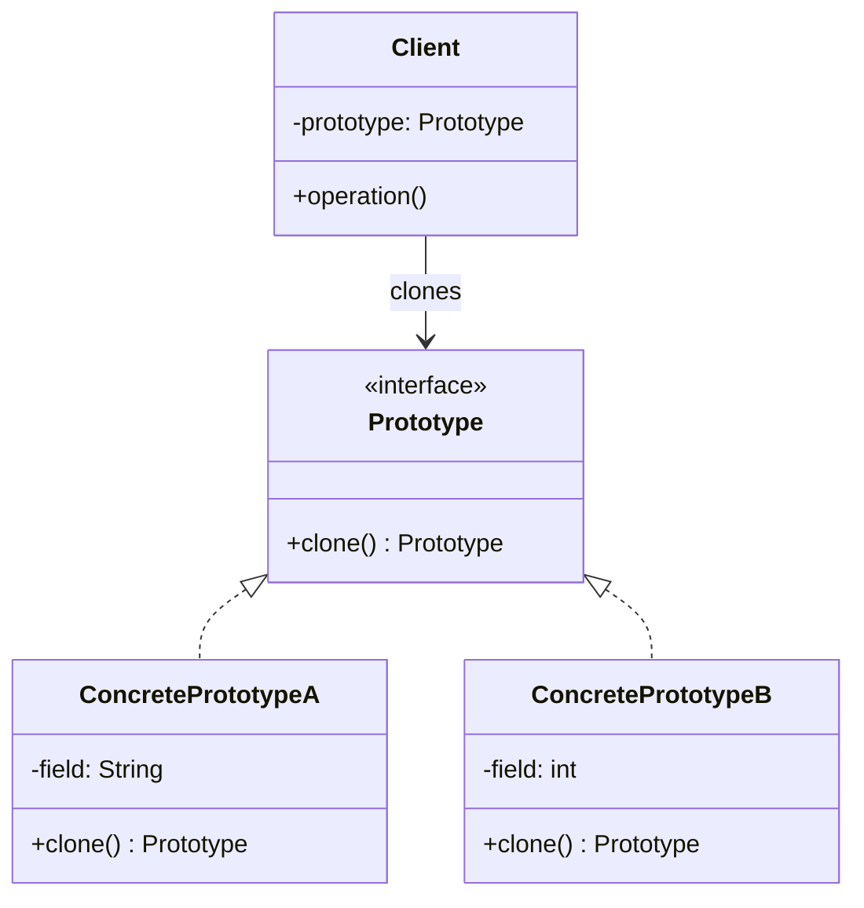

그래픽 편집기에서 도형 하나를 1만 개 복사해 배치한다고 하자. 매번 `new Shape()`로 생성자를 호출하고 색상·테두리·스타일을 일일이 다시 설정하면, 객체 생성 비용은 둘째치고 클래스 이름이 코드 곳곳에 박혀버린다. 만약 도형의 종류가 런타임에 서버 응답으로 결정된다면? `new` 뒤에 올 클래스 이름조차 컴파일 타임에는 알 수 없다. 프로토타입(Prototype) 패턴은 "새로 만들지 말고, 이미 있는 걸 복제하라"는 발상으로 이 문제를 푼다.

## 탄생 배경

프로토타입 패턴은 에리히 감마(Erich Gamma), 리처드 헬름(Richard Helm), 랄프 존슨(Ralph Johnson), 존 블리시디스(John Vlissides) — 이른바 GoF(Gang of Four)가 1994년 저서 『Design Patterns: Elements of Reusable Object-Oriented Software』에서 정리한 23개 디자인 패턴 중 하나다. GoF는 이 패턴을 "원형이 되는 인스턴스를 사용해 생성할 객체의 종류를 명시하고, 이 프로토타입을 복제해 새로운 객체를 생성하는" 생성 패턴으로 정의했다. 핵심 동기는 두 가지다. 첫째, 클래스를 인스턴스화하는 비용(DB 조회, 네트워크 호출, 복잡한 초기화)이 클 때 매번 처음부터 만드는 대신 미리 만들어 둔 견본을 복제하는 편이 싸다. 둘째, 어떤 클래스의 인스턴스를 만들지가 런타임에야 결정되는 시스템(플러그인, 직렬화된 객체 로딩)에서는 `new ClassName()`처럼 클래스 이름을 코드에 고정할 수 없다 — 복제는 객체의 타입이 아니라 객체 자체에 의존하므로 이 문제를 우회한다.

## 학습 목표

이 글을 읽고 나면 다음을 할 수 있다.

- 프로토타입 패턴이 해결하는 문제(생성 비용, 런타임 타입 결정)를 설명할 수 있다.
- `clone()`을 직접 구현할 때 얕은 복사와 깊은 복사의 차이를 코드 수준에서 구분하고 올바르게 선택할 수 있다.
- 팩토리 메서드·빌더 패턴과 프로토타입 패턴 중 무엇을 써야 할지 상황에 맞게 판단할 수 있다.

## 개요

### 정의

프로토타입 패턴은 생성할 객체의 클래스를 지정하는 대신, 미리 준비된 원형(prototype) 인스턴스를 복제하여 새 객체를 만드는 생성 패턴이다. 복제 로직은 보통 객체 자신이 구현한 `clone()` 메서드에 위임한다.

### 필요성

- **생성 비용 절감**: DB 조회나 복잡한 연산으로 초기화되는 객체를 매번 처음부터 만들지 않고, 완성된 견본을 복제해 비용을 줄인다.
- **런타임 타입 결정**: 어떤 클래스를 생성할지 컴파일 타임에 알 수 없을 때, 클래스 이름 없이 객체 참조만으로 같은 종류의 객체를 만들 수 있다.
- **상속 계층 단순화**: 객체 생성을 위한 팩토리 클래스 계층을 따로 만들지 않고, 프로토타입 객체 자체가 생성 책임을 진다.

### 장단점

| 구분 | 내용 |
|---|---|
| 장점 | 클래스 이름에 의존하지 않고 객체를 생성해 결합도가 낮아진다 |
| 장점 | 복잡한 초기화 비용을 견본 복제로 대체해 생성 비용을 줄인다 |
| 단점 | 순환 참조가 있는 객체는 깊은 복사 구현이 까다롭다 |
| 단점 | 모든 서브클래스가 `clone()`을 올바르게 오버라이드해야 하므로 누락 시 버그로 이어진다 |

## 구성 요소

- **Prototype**: 자신을 복제하는 `clone()` 메서드를 선언하는 인터페이스(또는 추상 클래스).
- **ConcretePrototype**: `Prototype`을 구현하고, 자신의 필드를 복제해 새 인스턴스를 반환하는 `clone()`을 정의한다.
- **Client**: `Prototype` 인터페이스만 알고, 구체 클래스 이름 없이 `clone()`을 호출해 새 객체를 얻는다.



## 예제: 도형 캐시(ShapeCache)

그래픽 편집기에서 미리 만들어 둔 도형 견본을 `Map`에 저장해 두고, 필요할 때마다 복제해 쓰는 예제다. 매번 도형을 새로 계산해 생성하는 대신, 캐시에 등록된 원형을 복제하기만 하면 된다.

```java
import java.util.HashMap;
import java.util.Map;

abstract class Shape implements Cloneable {
    protected String id;
    protected String type;

    abstract void draw();

    String getType() {
        return type;
    }

    @Override
    public Object clone() {
        Object clone = null;
        try {
            clone = super.clone();
        } catch (CloneNotSupportedException e) {
            throw new IllegalStateException("복제할 수 없는 도형입니다.", e);
        }
        return clone;
    }
}

class Circle extends Shape {
    Circle() {
        type = "Circle";
    }

    @Override
    void draw() {
        System.out.println("Circle.draw() 호출, id=" + id);
    }
}

class Rectangle extends Shape {
    Rectangle() {
        type = "Rectangle";
    }

    @Override
    void draw() {
        System.out.println("Rectangle.draw() 호출, id=" + id);
    }
}

class ShapeCache {
    private static final Map<String, Shape> cache = new HashMap<>();

    static Shape getShape(String shapeId) {
        Shape cachedShape = cache.get(shapeId);
        if (cachedShape == null) {
            throw new IllegalArgumentException("등록되지 않은 id: " + shapeId);
        }
        return (Shape) cachedShape.clone();
    }

    static void loadCache() {
        Circle circle = new Circle();
        circle.id = "1";
        cache.put(circle.id, circle);

        Rectangle rectangle = new Rectangle();
        rectangle.id = "2";
        cache.put(rectangle.id, rectangle);
    }
}

public class PrototypeDemo {
    public static void main(String[] args) {
        ShapeCache.loadCache();

        Shape clonedCircle = ShapeCache.getShape("1");
        clonedCircle.draw(); // Circle.draw() 호출, id=1

        Shape clonedRectangle = ShapeCache.getShape("2");
        clonedRectangle.draw(); // Rectangle.draw() 호출, id=2
    }
}
```

`getShape()`는 캐시에 없는 `id`를 조회하면 `null`을 그대로 `clone()`에 넘기지 않도록 `IllegalArgumentException`을 던진다. 캐시 조회 실패를 묵시적으로 흘려보내면 `NullPointerException`이 호출부 깊은 곳에서 터져 원인 추적이 어려워지므로, 프로토타입 레지스트리를 구현할 때는 항상 키 존재 여부를 명시적으로 검사해야 한다.

### 얕은 복사와 깊은 복사

`Object.clone()`의 기본 동작은 **얕은 복사**다. 필드가 원시 타입이거나 불변 객체면 문제가 없지만, 필드가 가변 객체(예: `List`, 다른 커스텀 클래스)를 참조하면 원본과 복제본이 같은 내부 객체를 공유하게 되어, 한쪽을 수정하면 다른 쪽도 함께 바뀌는 버그가 생긴다. 이를 막으려면 `clone()` 내부에서 가변 필드를 명시적으로 새로 복제하는 **깊은 복사**를 구현해야 한다.

```java
class Document implements Cloneable {
    private StringBuilder content;

    Document(String text) {
        this.content = new StringBuilder(text);
    }

    @Override
    public Document clone() {
        try {
            Document copy = (Document) super.clone();
            copy.content = new StringBuilder(this.content); // 가변 필드는 직접 깊은 복사
            return copy;
        } catch (CloneNotSupportedException e) {
            throw new IllegalStateException(e);
        }
    }
}
```

## 사용 시점과 회피 시점

| 구분 | 내용 |
|---|---|
| 사용 시점 | 객체 생성 비용(DB 조회, 복잡한 초기화)이 복제 비용보다 훨씬 클 때 |
| 사용 시점 | 생성할 객체의 구체 클래스를 런타임 전까지 알 수 없을 때 |
| 회피 시점 | 객체 그래프에 순환 참조가 많아 깊은 복사 구현이 과도하게 복잡해질 때 |
| 회피 시점 | 객체 생성이 단순하고 비용이 무시할 만한 수준일 때(단순 `new`로 충분) |

## FAQ

**Q1. 얕은 복사와 깊은 복사 중 무엇을 써야 하나요?**
필드가 모두 원시 타입이거나 불변 객체라면 얕은 복사(기본 `clone()`)로 충분하다. 필드 중 하나라도 가변 객체를 참조한다면, 그 필드만 선택적으로 깊은 복사해야 한다. 모든 필드를 무조건 깊은 복사할 필요는 없다 — 불변 객체는 공유해도 안전하다.

**Q2. 프로토타입 패턴과 팩토리 메서드 패턴은 언제 구분해 써야 하나요?**
팩토리 메서드는 서브클래스가 어떤 구체 클래스를 생성할지 결정하는 패턴으로, 클래스 계층을 통해 생성 로직을 분기한다. 프로토타입은 이미 존재하는 인스턴스를 복제하므로 클래스 계층이 필요 없고, 런타임에 동적으로 등록된 객체도 복제할 수 있다. 생성 비용이 크고 원형 객체를 미리 준비할 수 있다면 프로토타입을, 생성 로직 자체가 서브클래스마다 다르다면 팩토리 메서드를 선택한다.

**Q3. Java의 `Cloneable`은 왜 안티패턴이라는 말을 듣나요?**
`Cloneable`은 메서드가 없는 마커 인터페이스이고, `Object.clone()`은 `protected`라 오버라이드해야만 외부에서 호출 가능하다. 또한 생성자를 거치지 않고 객체를 복제하므로 불변식이 깨지기 쉽고, 체크 예외(`CloneNotSupportedException`) 처리가 번거롭다. 이런 이유로 Joshua Bloch는 『Effective Java』에서 복사 생성자나 정적 팩토리 메서드를 `clone()`의 대안으로 권장한다.

## 관련 패턴

생성 비용을 줄인다는 점에서 [팩토리 메서드 패턴]()과 비교되지만, 팩토리 메서드는 서브클래스가 타입을 결정하고 프로토타입은 인스턴스를 복제한다는 차이가 있다. 복잡한 객체를 단계별로 조립하는 [빌더 패턴]()과 달리, 프로토타입은 이미 완성된 객체를 통째로 복제한다. 시스템 전역에서 단 하나의 프로토타입 레지스트리만 필요하다면 [싱글턴 패턴]()과 함께 쓰인다.

## 결론

프로토타입 패턴은 "클래스가 아니라 객체로 생성을 표현한다"는 발상의 전환이다. 생성 비용이 크거나 타입이 런타임에야 결정되는 상황에서는 강력하지만, 만능 해법은 아니다 — `clone()` 구현이 잘못되면 얕은 복사로 인한 공유 버그를 만들기 쉽고, 순환 참조가 있는 그래프는 깊은 복사 자체가 까다롭다. 다음 장에서는 시스템 전체에서 인스턴스를 하나만 유지하는 [싱글턴 패턴]()을 살펴본다.

## 참고문헌

1. Erich Gamma, Richard Helm, Ralph Johnson, John Vlissides. *Design Patterns: Elements of Reusable Object-Oriented Software*. Addison-Wesley, 1994.
2. Joshua Bloch. *Effective Java, 3rd Edition*. Addison-Wesley, 2018. (Item 13: Override clone judiciously)
3. Eric Freeman, Elisabeth Robson. *Head First Design Patterns, 2nd Edition*. O'Reilly Media, 2020.
4. [Prototype - Refactoring.Guru](https://refactoring.guru/design-patterns/prototype)
5. [Prototype pattern - Wikipedia](https://en.wikipedia.org/wiki/Prototype_pattern)
6. [Object.clone() - Oracle Java Platform SE 8 Documentation](https://docs.oracle.com/javase/8/docs/api/java/lang/Object.html#clone--)
