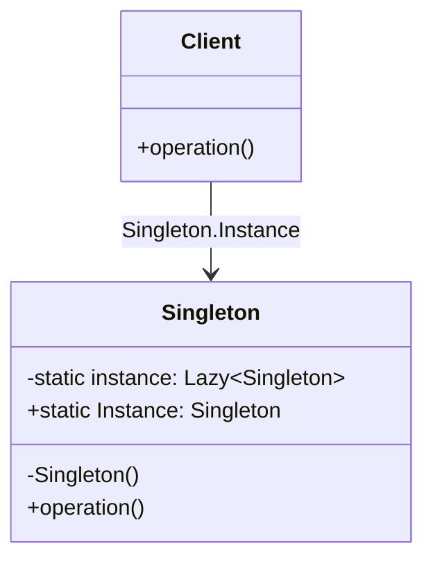

설정 관리 클래스를 `new`로 여러 번 만들면 어떻게 될까? 모듈 A가 만든 인스턴스와 모듈 B가 만든 인스턴스가 서로 다른 설정 값을 들고 있게 되어, 같은 키를 읽어도 다른 값이 나오는 버그가 생긴다. 싱글턴(Singleton) 패턴은 "이 클래스의 인스턴스는 프로그램 전체에서 단 하나뿐이어야 한다"는 제약을 클래스 스스로 강제해 이 문제를 막는다.

## 탄생 배경

싱글턴 패턴은 에리히 감마(Erich Gamma), 리처드 헬름(Richard Helm), 랄프 존슨(Ralph Johnson), 존 블리시디스(John Vlissides) — GoF(Gang of Four)가 1994년 저서 『Design Patterns: Elements of Reusable Object-Oriented Software』에서 정리한 23개 생성 패턴 중 하나다. GoF는 이 패턴의 의도를 "클래스의 인스턴스가 단 하나만 존재함을 보장하고, 그 인스턴스에 대한 전역 접근점을 제공한다"고 정의했다. 데이터베이스 연결 풀, 설정 관리자, 로그 기록기처럼 애플리케이션 전역에서 상태를 공유해야 하는 객체가 여러 개 생성되면 자원 낭비와 데이터 불일치가 발생하므로, 생성 자체를 클래스 내부에서 통제하려는 동기에서 나왔다.

## 학습 목표

이 글을 읽고 나면 다음을 할 수 있다.

- 싱글턴 패턴이 해결하는 문제와, 그 대가로 발생하는 단일 책임 원칙 위반·테스트 어려움을 설명할 수 있다.
- C#에서 스레드 안전한 싱글턴을 `Lazy<T>`와 Holder 관용구로 구현할 수 있다.
- 싱글턴 대신 의존성 주입(DI)을 선택해야 하는 상황을 판단할 수 있다.

## 개요

### 정의와 필요성

싱글턴 패턴은 클래스가 자신의 유일한 인스턴스를 직접 관리하고, 정적 메서드나 프로퍼티를 통해 그 인스턴스에 대한 전역 접근을 제공하는 생성 패턴이다. 데이터베이스 연결, 설정 파일, 캐시처럼 여러 인스턴스가 생기면 자원 낭비나 데이터 충돌로 이어지는 자원을 다룰 때 필요하다.

### 장단점

| 구분 | 내용 |
|---|---|
| 장점 | 인스턴스가 하나로 고정되어 메모리를 절약하고, 전역에서 동일한 상태를 공유한다 |
| 장점 | 인스턴스 생성 시점과 횟수를 클래스가 직접 통제할 수 있다 |
| 단점 | 클래스가 "자기 생성 관리"와 "본연의 책임"을 동시에 떠안아 단일 책임 원칙(SRP)을 위반하기 쉽다 |
| 단점 | 전역 상태가 테스트 간에 공유되어 테스트 독립성이 깨지고, 모의 객체로 교체하기 어렵다 |

## 구현 방법

싱글턴을 C#으로 구현하는 방식은 초기화 시점과 스레드 안전성 확보 방법에 따라 갈린다.

| 방식 | 초기화 시점 | 스레드 안전성 | 비고 |
|---|---|---|---|
| Eager(정적 필드) | 클래스 로드 시 즉시 | 안전(CLR이 보장) | 구현이 가장 단순하지만 사용 여부와 무관하게 항상 생성된다 |
| `Lazy<T>` | 최초 접근 시 | 안전(`Lazy<T>`가 내부 처리) | 현대 C#에서 권장되는 표준 방식 |
| Double-Checked Locking | 최초 접근 시 | 안전(락+이중 확인) | `Lazy<T>`가 없던 시절의 관용구, 직접 구현 시 실수 위험 |
| Holder(중첩 정적 클래스) | 최초 접근 시 | 안전(CLR의 클래스 로딩 보장) | 지연 초기화와 단순함을 동시에 얻는다 |

`Lazy<T>`는 내부적으로 스레드 안전성을 보장하므로, 새 코드에서는 Double-Checked Locking을 직접 구현하기보다 `Lazy<T>`를 쓰는 편이 안전하고 간결하다.



```csharp
using System;

public class ConfigManager
{
    // Lazy<T>는 최초 접근 시점에 스레드 안전하게 인스턴스를 생성한다.
    private static readonly Lazy<ConfigManager> _instance =
        new Lazy<ConfigManager>(() => new ConfigManager());

    private ConfigManager()
    {
        // 설정 파일 로딩 등 초기화 비용이 큰 작업
    }

    public static ConfigManager Instance => _instance.Value;

    public string Get(string key) => "value-of-" + key;
}

public class Program
{
    public static void Main(string[] args)
    {
        Console.WriteLine(ConfigManager.Instance.Get("timeout"));
        // 동일 인스턴스인지 확인
        Console.WriteLine(ReferenceEquals(ConfigManager.Instance, ConfigManager.Instance)); // True
    }
}
```

## 단점과 해결책: 테스트 가능한 싱글턴 만들기

싱글턴의 가장 실질적인 단점은 **테스트하기 어렵다는 점**이다. 정적 멤버에 직접 의존하는 클래스는 단위 테스트에서 모의 객체로 교체할 수 없다. 해법은 싱글턴 클래스 자체를 인터페이스로 감싸고, 사용하는 쪽은 구체 클래스가 아니라 인터페이스에 의존하도록 의존성 주입(DI)을 적용하는 것이다.

```csharp
public interface IConfigManager
{
    string Get(string key);
}

public class ConfigManager : IConfigManager
{
    private static readonly Lazy<ConfigManager> _instance =
        new Lazy<ConfigManager>(() => new ConfigManager());

    private ConfigManager() { }

    public static ConfigManager Instance => _instance.Value;

    public string Get(string key) => "value-of-" + key;
}

public class ReportService
{
    private readonly IConfigManager _config;

    // 운영 코드는 ConfigManager.Instance를 주입하고,
    // 테스트 코드는 모의 객체를 주입할 수 있다.
    public ReportService(IConfigManager config)
    {
        _config = config;
    }

    public string BuildHeader() => $"Report ({_config.Get("locale")})";
}
```

이렇게 인터페이스를 경유하면 `ReportService`는 `ConfigManager`라는 구체 클래스를 몰라도 되고, 테스트에서는 `IConfigManager`를 구현한 모의 객체를 주입해 전역 상태 없이 검증할 수 있다. 같은 원리로 단일 책임 원칙 위반 문제도 줄일 수 있다 — 설정 관리와 애플리케이션 로직을 각각 별도 클래스로 분리하고, 싱글턴은 정말로 유일해야 하는 자원(설정 저장소 자체)에만 적용한다.

## 사용 시점과 회피 시점

| 구분 | 내용 |
|---|---|
| 사용 시점 | DB 연결 풀, 설정 관리자처럼 애플리케이션 전역에서 상태를 공유해야 할 때 |
| 사용 시점 | 인스턴스 생성 비용이 커서 생성 횟수 자체를 제한해야 할 때 |
| 회피 시점 | 단위 테스트에서 모의 객체로 자유롭게 교체할 수 있어야 할 때(DI 컨테이너의 싱글턴 수명주기로 대체) |
| 회피 시점 | 여러 모듈이 같은 클래스를 서로 다른 책임으로 확장해야 할 때(SRP 위반 위험) |

## FAQ

**Q1. `Lazy<T>` 대신 Double-Checked Locking을 써야 할 때가 있나요?**
`Lazy<T>`를 쓸 수 없는 구버전 프레임워크이거나, 초기화 로직에 `Lazy<T>`가 제공하지 않는 세밀한 제어(예외 캐싱 정책 등)가 필요한 경우가 아니라면 굳이 직접 구현할 이유가 없다. 락 순서를 잘못 두면 스레드 안전성이 깨지기 쉬워, 표준 라이브러리가 제공하는 `Lazy<T>`가 더 안전하다.

**Q2. 싱글턴과 정적 클래스(`static class`)는 어떻게 다른가요?**
정적 클래스는 인스턴스 자체가 없고 상태도 클래스 수준에서만 존재해 상속이나 인터페이스 구현이 불가능하다. 싱글턴은 일반 클래스이므로 인터페이스를 구현해 DI로 주입하거나, 필요하면 나중에 다중 인스턴스 구조로 리팩터링할 여지가 남는다.

**Q3. 싱글턴 패턴이 안티패턴이라는 말을 듣는 이유는 무엇인가요?**
전역 상태를 만들기 때문이다. 전역 상태는 테스트 간 격리를 깨고, 호출 순서에 따라 동작이 달라지는 숨은 의존성을 만든다. 많은 경우 싱글턴이 풀던 문제는 DI 컨테이너가 객체 수명을 "싱글턴 스코프"로 관리하는 방식으로도 해결되며, 이 경우 테스트 시 컨테이너 설정만 바꿔 모의 객체로 교체할 수 있다는 장점이 있다.

## 관련 패턴

객체 생성 책임을 별도 클래스에 위임하는 [팩토리 메서드 패턴]()과 달리, 싱글턴은 인스턴스의 유일성 자체를 보장하는 데 집중한다. 동일한 객체를 복제해 재사용하는 [프로토타입 패턴]()과는 목적이 반대다 — 프로토타입은 여러 인스턴스를 만들기 위해, 싱글턴은 인스턴스를 하나로 제한하기 위해 쓴다.

## 결론

싱글턴 패턴은 "인스턴스가 하나여야 한다"는 제약을 코드로 강제하는 가장 직접적인 방법이지만, 그 대가로 전역 상태와 테스트 어려움이라는 비용을 치른다. 새 코드를 작성한다면 `Lazy<T>` 기반 구현에 인터페이스를 더해 테스트 가능성을 확보하거나, 아예 DI 컨테이너의 싱글턴 수명주기에 맡기는 편이 낫다. 다음 장에서는 서로 다른 인터페이스를 가진 클래스들을 연결하는 [어댑터 패턴]()을 살펴본다.

## 참고문헌

1. Erich Gamma, Richard Helm, Ralph Johnson, John Vlissides. *Design Patterns: Elements of Reusable Object-Oriented Software*. Addison-Wesley, 1994.
2. Mark Seemann. *Dependency Injection Principles, Practices, and Patterns*. Manning Publications, 2019.
3. Joshua Bloch. *Effective Java, 3rd Edition*. Addison-Wesley, 2018. (Item 3: Enforce the singleton property)
4. [Singleton - Refactoring.Guru](https://refactoring.guru/design-patterns/singleton)
5. [Singleton pattern - Wikipedia](https://en.wikipedia.org/wiki/Singleton_pattern)
6. [Lazy\<T\> Class - Microsoft Learn](https://learn.microsoft.com/en-us/dotnet/api/system.lazy-1)
