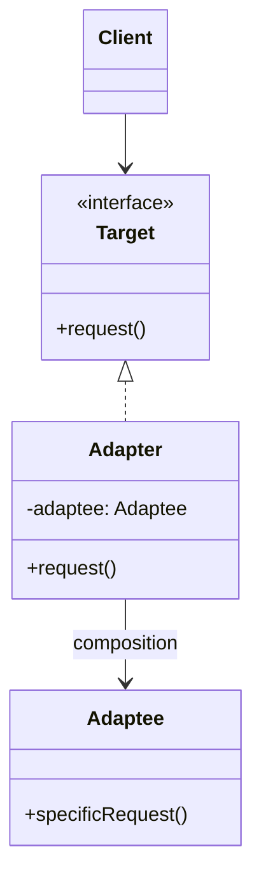

해외여행을 가면 콘센트 모양이 달라 전원 어댑터 없이는 노트북을 충전할 수 없다. 콘센트나 노트북을 바꿀 수는 없으니, 둘 사이에 변환 장치를 끼워 넣는다. 소프트웨어에서도 같은 문제가 반복된다 — 이미 만들어진 라이브러리의 인터페이스가 내 코드가 기대하는 인터페이스와 다를 때, 라이브러리도 내 코드도 건드리지 않고 둘을 연결할 방법이 필요하다. 어댑터(Adapter) 패턴은 이 변환 장치 역할을 클래스로 구현한다.

## 탄생 배경

어댑터 패턴은 에리히 감마(Erich Gamma), 리처드 헬름(Richard Helm), 랄프 존슨(Ralph Johnson), 존 블리시디스(John Vlissides) — GoF(Gang of Four)가 1994년 저서 『Design Patterns: Elements of Reusable Object-Oriented Software』에서 정리한 23개 패턴 중 하나로, 구조 패턴(Structural Pattern)으로 분류된다. GoF는 이 패턴의 의도를 "클래스의 인터페이스를 클라이언트가 기대하는 다른 인터페이스로 변환한다. 어댑터는 호환되지 않는 인터페이스 때문에 함께 동작할 수 없던 클래스들이 함께 동작하도록 만든다"고 정의했다. 레거시 시스템 교체나 서드파티 라이브러리 도입처럼 "이미 존재하는 코드는 수정할 수 없거나 수정하고 싶지 않은" 상황에서, 새 코드와의 호환성 문제를 변환 계층 하나로 해결하려는 동기에서 나왔다.

## 학습 목표

이 글을 읽고 나면 다음을 할 수 있다.

- 객체 어댑터와 클래스 어댑터의 구조적 차이와, 각각이 요구하는 언어 기능(합성 대 다중 상속)을 설명할 수 있다.
- 어댑터 패턴을 Bridge·Decorator·Proxy·Facade와 구분해 올바른 상황에 선택할 수 있다.
- JDK의 `InputStreamReader`, `Arrays.asList()` 같은 실제 사례에서 어댑터 패턴을 식별할 수 있다.

## 개요

### 정의

어댑터 패턴은 클라이언트가 기대하는 인터페이스(Target)와 실제로 제공되는 인터페이스(Adaptee) 사이의 불일치를 해결하는 패턴이다. 어댑터는 Adaptee의 인터페이스를 Target 인터페이스로 변환하여, 클라이언트가 Adaptee를 직접 알지 못해도 그 기능을 활용할 수 있게 한다.

### 필요성과 사용 사례

- **레거시 시스템 통합**: 기존 시스템의 인터페이스가 새로운 시스템과 호환되지 않을 때
- **서드파티 라이브러리 활용**: 외부 라이브러리의 인터페이스가 애플리케이션의 인터페이스와 맞지 않을 때
- **인터페이스 표준화**: 여러 클래스가 각기 다른 인터페이스를 가지고 있지만, 동일한 방식으로 사용하고 싶을 때

### 장단점

| 장점 | 단점 |
|------|------|
| 기존 코드 수정 없이 새로운 인터페이스 지원 | 추가적인 클래스로 인한 복잡성 증가 |
| 단일 책임 원칙 준수(인터페이스 변환 로직 분리) | 과도하게 사용하면 호출 경로가 길어져 가독성이 떨어짐 |
| 코드 재사용성 향상(기존 클래스를 폐기하지 않고 재사용) | 양방향 변환이 필요하면 어댑터 내부 로직이 복잡해짐 |

## 구성 요소

어댑터 패턴은 Target(클라이언트가 기대하는 인터페이스), Adaptee(이미 존재하지만 호환되지 않는 클래스), Adapter(Target을 구현하고 내부에서 Adaptee를 호출), Client(Target만 알고 사용하는 쪽) 네 참여자로 구성된다. 가장 널리 쓰이는 방식은 **합성(Composition)**으로 Adaptee를 내부에 갖는 객체 어댑터다.



다중 상속을 지원하는 언어(C++ 등)에서는 Adapter가 Target과 Adaptee를 모두 상속받는 **클래스 어댑터**도 가능하다. 다만 다중 상속 자체가 결합도를 높이고 Adaptee의 서브클래스까지는 어댑팅할 수 없다는 제약이 있어, Java·C#·Python처럼 다중 상속을 지원하지 않거나 권장하지 않는 언어에서는 객체 어댑터가 사실상 표준이다.

## 구현 예제: 오리와 칠면조

`Duck` 인터페이스(`quack()`, `fly()`)만 알고 동작하는 코드에, 인터페이스가 다른 `Turkey`(`gobble()`, `fly()`)를 오리처럼 끼워 넣는 예제다.

```java
interface Duck {
    void quack();
    void fly();
}

class MallardDuck implements Duck {
    @Override
    public void quack() {
        System.out.println("Quack!");
    }

    @Override
    public void fly() {
        System.out.println("I'm flying!");
    }
}

// Adaptee - Duck과 호환되지 않는 기존 인터페이스
interface Turkey {
    void gobble();
    void fly();
}

class WildTurkey implements Turkey {
    @Override
    public void gobble() {
        System.out.println("Gobble gobble!");
    }

    @Override
    public void fly() {
        System.out.println("I'm flying a short distance!");
    }
}

// Adapter - Turkey를 Duck처럼 사용할 수 있게 변환
class TurkeyAdapter implements Duck {
    private final Turkey turkey;

    public TurkeyAdapter(Turkey turkey) {
        this.turkey = turkey;
    }

    @Override
    public void quack() {
        turkey.gobble(); // Turkey의 메서드를 Duck의 메서드로 변환
    }

    @Override
    public void fly() {
        // Turkey는 짧게만 날므로, 5번 호출해 Duck과 비슷한 거리를 흉내낸다
        for (int i = 0; i < 5; i++) {
            turkey.fly();
        }
    }
}

public class AdapterDemo {
    public static void testDuck(Duck duck) {
        duck.quack();
        duck.fly();
    }

    public static void main(String[] args) {
        Duck mallardDuck = new MallardDuck();
        testDuck(mallardDuck);

        // 칠면조를 어댑터로 감싸면 Duck 타입으로 그대로 전달할 수 있다
        Turkey wildTurkey = new WildTurkey();
        Duck turkeyAdapter = new TurkeyAdapter(wildTurkey);
        testDuck(turkeyAdapter);
    }
}
```

`AdapterDemo.testDuck()`은 `Duck` 인터페이스만 알 뿐 `TurkeyAdapter` 내부에 `Turkey`가 있다는 사실을 모른다 — 클라이언트 코드를 한 줄도 바꾸지 않고 호환되지 않던 클래스를 끼워 넣은 것이 이 패턴의 핵심이다.

## 실제 사용 사례

자체 예제보다 이미 널리 쓰이는 라이브러리에서 어댑터 패턴을 확인하면 패턴의 필요성이 더 분명해진다.

**`InputStreamReader`**는 바이트 스트림(`InputStream`, Adaptee)을 문자 스트림(`Reader`, Target)으로 변환하는 JDK 표준 어댑터다.

```java
InputStream inputStream = new FileInputStream("file.txt");
Reader reader = new InputStreamReader(inputStream, "UTF-8");
BufferedReader bufferedReader = new BufferedReader(reader);
```

**`Arrays.asList()`**는 배열(Adaptee)을 `List` 인터페이스(Target)로 변환해, 배열에 `List`의 메서드를 그대로 쓸 수 있게 한다.

```java
String[] array = {"a", "b", "c"};
List<String> list = Arrays.asList(array);
```

레거시 시스템 통합도 흔한 사용처다. 결제 모듈을 교체할 때 새 `PaymentProcessor` 인터페이스를 호출하는 코드는 그대로 두고, 레거시 결제 시스템을 감싸는 어댑터 클래스 하나만 추가하면 레거시 코드를 단 한 줄도 수정하지 않고 새 인터페이스에 편입시킬 수 있다.

## 사용 시점과 회피 시점

| 구분 | 내용 |
|---|---|
| 사용 시점 | 이미 존재하는 클래스(서드파티 라이브러리, 레거시 코드)를 수정 없이 새 인터페이스에 맞춰야 할 때 |
| 사용 시점 | 동일한 역할을 하지만 인터페이스가 제각각인 여러 클래스를 하나의 인터페이스로 통일해 다뤄야 할 때 |
| 회피 시점 | 인터페이스를 직접 수정할 수 있는 코드라면, 어댑터를 추가하기보다 인터페이스 자체를 통일하는 편이 더 단순하다 |
| 회피 시점 | 단순히 인터페이스를 유지하면서 기능을 더하고 싶다면 어댑터가 아니라 [데코레이터 패턴]()이 맞는 선택이다 |

## FAQ

**Q1. 객체 어댑터와 클래스 어댑터 중 어떤 것을 선택해야 하나요?**
대부분의 경우 객체 어댑터를 권장한다. 합성을 사용하므로 더 유연하고 대부분의 언어에서 지원되며, 런타임에 Adaptee를 교체할 수도 있다. 클래스 어댑터는 다중 상속이 필요하고 Adaptee의 서브클래스까지는 함께 어댑팅할 수 없다는 제약이 있다.

**Q2. 어댑터 패턴과 데코레이터 패턴의 차이점은 무엇인가요?**
어댑터는 서로 다른 인터페이스를 호환되게 **변환**하는 것이 목적이고, 데코레이터는 **동일한 인터페이스를 유지**하면서 기능을 추가하는 것이 목적이다. 어댑터를 적용하면 클라이언트가 보는 인터페이스 자체가 바뀌지만, 데코레이터를 적용해도 클라이언트가 보는 인터페이스는 그대로다.

**Q3. 양방향 어댑터란 무엇인가요?**
양방향 어댑터는 Target과 Adaptee 두 인터페이스를 모두 구현해, 양쪽 클라이언트 모두에서 같은 어댑터 인스턴스를 사용할 수 있게 한 어댑터다. 구현이 복잡해지므로, 두 시스템이 서로를 호출해야 하는 경우로 한정해 신중하게 사용해야 한다.

## 관련 패턴

구조는 비슷해도 의도가 다른 패턴들과 자주 비교된다. [브리지 패턴]()은 설계 단계에서 추상화와 구현을 처음부터 분리해두는 반면, 어댑터는 이미 존재하는 호환되지 않는 클래스를 사후에 맞춘다. [데코레이터 패턴]()은 동일한 인터페이스를 유지한 채 기능을 추가하고, [프록시 패턴]()은 동일한 인터페이스를 유지한 채 접근을 제어한다는 점에서 어댑터(인터페이스 자체를 바꿈)와 구분된다. [퍼사드 패턴]()은 여러 인터페이스를 하나로 단순화하는 데 비해, 어댑터는 보통 하나의 인터페이스를 다른 하나로 변환한다.

## 결론

어댑터 패턴은 기존 코드를 건드리지 않고 호환성 문제를 해결하는 가장 직접적인 도구다. 다만 인터페이스를 직접 고칠 수 있는 상황이라면 어댑터를 추가하는 대신 인터페이스 자체를 통일하는 편이 더 단순하다 — 어댑터는 "고칠 수 없거나 고치고 싶지 않은 코드"가 있을 때 쓰는 패턴이라는 점을 기억할 필요가 있다. 다음 장에서는 추상화와 구현을 처음부터 분리해두는 [브리지 패턴]()을 살펴본다.

## 참고문헌

1. Erich Gamma, Richard Helm, Ralph Johnson, John Vlissides. *Design Patterns: Elements of Reusable Object-Oriented Software*. Addison-Wesley, 1994.
2. Eric Freeman, Elisabeth Robson. *Head First Design Patterns, 2nd Edition*. O'Reilly Media, 2020.
3. [Adapter - Refactoring.Guru](https://refactoring.guru/design-patterns/adapter)
4. [Adapter pattern - Wikipedia](https://en.wikipedia.org/wiki/Adapter_pattern)
5. [InputStreamReader - Java SE Documentation](https://docs.oracle.com/javase/8/docs/api/java/io/InputStreamReader.html)
