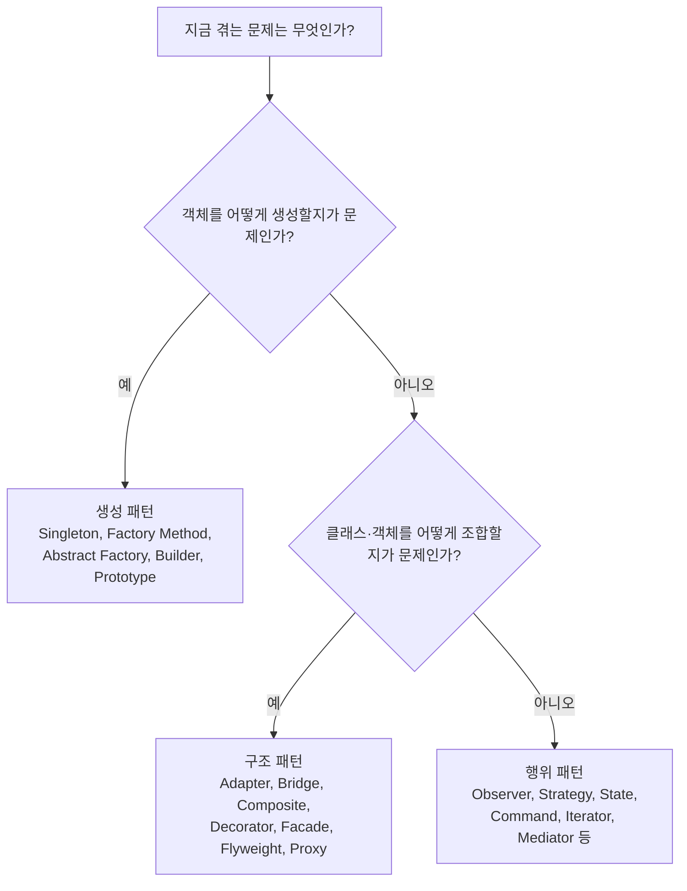

소프트웨어 개발은 반복적이고 복잡한 문제를 해결해야 하는 과정이다. 이러한 문제를 해결하는데 있어, 이미 검증된 해결책을 사용하면 시간과 노력을 절약할 수 있다. 이처럼 특정 맥락에서 자주 발생하는 문제에 대해, 경험적으로 검증된 해결책을 <strong>디자인 패턴(Design Pattern)</strong>이라 한다. 디자인 패턴은 소프트웨어 설계의 모범 사례를 축적한 결과물로, 문제 해결의 효율성을 높이고, 코드의 재사용성을 극대화하며, 팀원 간의 의사소통을 원활하게 해주는 중요한 도구이다.

디자인 패턴의 주요 특징 중 하나는 특정 언어나 기술에 종속되지 않는다는 점이다. 이는 패턴이 특정 구현 방식에 국한되지 않고, 다양한 상황에서 적용될 수 있는 일종의 설계 템플릿을 제공한다는 의미이다. 다시 말해, 디자인 패턴은 구체적인 코드를 제공하는 것이 아니라, 문제를 해결하는 방법론을 체계화하여, 상황에 맞는 최적의 솔루션을 찾아내도록 돕는다.

## 디자인 패턴이란

소프트웨어를 설계할 때 특정 맥락에서 자주 발생하는 고질적인 문제들이 또 발생했을 때 재사용할 할 수 있는 훌륭한 해결책이다. ```바퀴를 다시 발명하지 마라(Don’t reinvent the wheel)```라는 말이 있듯이 이미 만들어져서 잘 되는 것을 처음부터 다시 만들 필요가 없다는 의미이다.

또한 디자인 패턴은 상황에 따라서 더 효율적인 방법이 있을 수도 있다. 하지만 지금의 일이 바쁘다고 해서 다른 대안을 살펴보지 않는 것은 위 그림처럼 네모난 바퀴를 사용하여 일을 처리하는 모습이 될 것이다. 따라서 시간을 갖고 더 효율적인 방법을 찾을 수 있도록 노력하는 시간을 가져 보자.

## 디자인 패턴의 필요성

디자인 패턴은 다음과 같은 이유로 소프트웨어 개발에서 중요한 역할을 한다:

- **재사용성**: 여기서 재사용되는 것은 코드 자체가 아니라, 그 코드를 만들기까지의 설계 의사결정과 시행착오다. 라이브러리 함수를 호출하는 것과 달리, 패턴은 "이런 상황에서는 이렇게 구조를 잡으면 된다"는 검증된 판단 기준을 재사용하게 해준다.
- **유지보수성**: 패턴을 사용하면 코드 구조가 체계적이고 명확해져, 이후 유지보수와 확장이 용이해진다.
- **의사소통**: 디자인 패턴은 공통의 용어를 제공함으로써, 개발자 간의 의사소통을 원활하게 한다. "여기는 Observer로 처리했다"는 한마디로 코드 리뷰나 설계 문서화(Documentation) 과정에서 장황한 설명을 대체할 수 있다.
- **유연성**: 디자인 패턴은 변경 사항에 유연하게 대응할 수 있도록 도와준다. 예를 들어, 새로운 요구사항이 추가되더라도 기존 코드에 큰 변경 없이 대응할 수 있는 방법을 제공한다.

## 디자인 패턴의 구성 요소

디자인 패턴은 다음과 같은 세 가지 요소로 구성된다:

1. **콘텍스트(Context)**: 패턴이 적용될 수 있는 상황이나 배경을 기술한다. 예를 들어, 특정 문제를 해결해야 하는 상황이나, 문제 발생의 원인을 설명하는 부분이다. 또한, 패턴이 유용하지 못한 상황에 대해서도 설명할 수 있다.

2. **문제(Problem)**: 해결해야 할 문제를 정의한다. 이 문제는 다양한 제약 사항이나 고려해야 할 요소들을 포함할 수 있으며, 디자인 이슈와 관련된 다양한 문제들을 다룬다.

3. **해결(Solution)**: 문제를 해결하기 위한 설계 방법을 제안한다. 해결책은 문제를 해결하는 데 필요한 요소와 이들 간의 관계, 책임, 협력 관계 등을 포함한다. 이는 구체적인 코드 구현이 아니라, 상황에 따라 다양한 방식으로 적용할 수 있는 설계 템플릿이다.

## 디자인 패턴의 분류

GoF 디자인 패턴이 가장 대중적인 패턴이다. GoF(Gang of Four)는 네 명의 사람이 모여서 만든 단어로 에리히 감마(Erich Gamma), 리차드 헬름(Richard Helm), 랄프 존슨(Ralph Johnson), 존 블리시데스(John Vlissides)가 포함되어 있다. 이 네 사람들이 소프트웨어 개발 영역에서 디자인 패턴을 구체화하고 체계화하였다.

> Erich Gamma, Richard Helm, Ralph Johnson, John Vlissides, 『Design Patterns: Elements of Reusable Object-Oriented Software』, Addison-Wesley, 1994 (ISBN 0-201-63361-2)

디자인 패턴은 목적에 따라 크게 세 가지로 분류된다: **생성(Creational)**, **구조(Structural)**, **행위(Behavioral)** 패턴이다. 이 세 가지 분류는 각각 객체 생성, 객체 구조, 객체 간의 상호작용을 다룬다. 여기서는 각 분류에 속하는 주요 패턴들을 자세히 살펴보겠다.

|구분|생성 패턴|구조 패턴|행위 패턴|
|:--:|:--:|:--:|:--:|
|Class|[팩토리 메서드(Factory Method)](/post/designpattern/factory_method/)|[어댑터(Adapter)](/post/designpattern/adapter/)|[인터프리터(Interpreter)](/post/designpattern/interpreter/)</br>[템플릿 메서드(Template Method)](/post/designpattern/template-method-pattern/)|
|Object|[추상 팩토리(Abstract Factory)](/post/designpattern/abstract_factory/)</br>[빌더(Builder)](/post/designpattern/builder/)</br>[프로토타입(Prototype)](/post/designpattern/prototype/)</br>[싱글턴(Singleton)](/post/designpattern/singleton/)|[어댑터(Adapter)](/post/designpattern/adapter/)</br>[브릿지(Bridge)](/post/designpattern/bridge/)</br>[컴포지트(Composite)](/post/designpattern/composite/)</br>[데코레이터(Decorator)](/post/designpattern/decorator/)</br>[퍼사드(Facade)](/post/designpattern/facade/)</br>[플라이웨이트(Flyweight)](/post/designpattern/flyweight/)</br>[프록시(Proxy)](/post/designpattern/proxy/)|[책임 연쇄(Chain of Responsibility)](/post/designpattern/chain_of_responsibility/)</br>[커맨드(Command)](/post/designpattern/command/)</br>[옵저버(Observer)](/post/designpattern/observer/)</br>[상태(State)](/post/designpattern/state/)</br>[전략(Strategy)](/post/designpattern/strategy/)</br>[방문자(Visitor)](/post/designpattern/visitor-pattern/)</br>[반복자(Iterator)](/post/designpattern/iterator/)</br>[중재자(Mediator)](/post/designpattern/mediator/)</br>[메멘토(Memento)](/post/designpattern/memento/)|

> Adapter는 Class와 Object 둘다 존재한다.

분류 기준을 결정 순서로 풀어보면 다음과 같다. "지금 겪는 문제가 객체를 어떻게 만들지인가, 서로 다른 조각을 어떻게 엮을지인가, 아니면 객체들이 어떻게 협력할지인가"를 먼저 구분하면 세 범주 중 어디를 찾아봐야 할지 좁혀진다.



### 생성 패턴(Creational Patterns)

**생성 패턴**은 객체의 생성 과정을 다루는 패턴이다. 객체의 생성과 조합을 캡슐화하여, 특정 객체가 생성되거나 변경되더라도 프로그램 구조에 영향을 최소화하도록 유연성을 제공한다. 생성 패턴의 주요 예시로는 다음과 같은 것들이 있다:

1. **[싱글턴 패턴(Singleton)](/post/designpattern/singleton/)**: 이 패턴은 클래스의 인스턴스를 하나로 제한하고, 이 인스턴스에 대한 전역적인 접근점을 제공한다. 시스템 내에서 특정 클래스의 인스턴스가 단 하나만 존재해야 하는 경우에 사용된다. 대표적으로 로깅 시스템, 데이터베이스 연결 등에 적용된다.

2. **[추상 팩토리 패턴(Abstract Factory)](/post/designpattern/abstract_factory/)**: 관련된 객체들을 생성하기 위한 인터페이스를 제공하되, 구체적인 클래스는 명시하지 않는다. 예를 들어, 여러 종류의 버튼이나 창을 생성해야 하는 GUI 시스템에서 이 패턴을 사용할 수 있다.

3. **[빌더 패턴(Builder)](/post/designpattern/builder/)**: 복잡한 객체의 생성 과정을 단계별로 분리하여, 동일한 생성 절차에서 다양한 표현을 생성할 수 있도록 한다. 예를 들어, 다양한 설정을 가진 자동차를 생성할 때 사용된다.

4. **[팩토리 메서드 패턴(Factory Method)](/post/designpattern/factory_method/)**: 객체를 생성하는 인터페이스를 정의하지만, 실제로 어떤 클래스의 인스턴스를 생성할지는 서브클래스가 결정한다. 이 패턴은 객체 생성을 클래스의 외부로부터 숨기고, 생성 로직을 캡슐화하는 데 사용된다.

5. **[프로토타입 패턴(Prototype)](/post/designpattern/prototype/)**: 생성할 객체의 원형이 되는 객체를 복제하여 새로운 객체를 생성한다. 이 패턴은 복잡한 객체를 생성하는 데 필요한 자원을 절약할 수 있다. 예를 들어, 게임에서 여러 유사한 캐릭터를 생성할 때 사용될 수 있다.

### 구조 패턴(Structural Patterns)

**구조 패턴**은 클래스나 객체를 조합하여 더 큰 구조를 형성하는 데 중점을 둔다. 서로 다른 인터페이스를 가진 객체들을 조합하거나, 더 복잡한 기능을 제공하는 데 사용되는 패턴이다. 아래 7개는 관계를 맺는 방식에 따라 다시 두 갈래로 나뉜다 — Adapter(Class 버전)만 상속으로 인터페이스를 맞추고, 나머지 여섯(Adapter의 Object 버전 포함)은 모두 상속 대신 다른 객체를 필드로 들고 있다가 호출을 위임하는 합성(Composition) 방식으로 구조를 만든다. 합성 기반 쪽이 압도적으로 많은 이유는, 상속은 컴파일 타임에 구조가 고정되지만 합성은 실행 중에 내부 객체를 교체할 수 있어 더 유연하기 때문이다.

1. **[어댑터 패턴(Adapter)](/post/designpattern/adapter/)**: 이 패턴은 기존 인터페이스를 사용자가 기대하는 다른 인터페이스로 변환한다. 예를 들어, 새로운 시스템에서 기존의 레거시 코드를 재사용해야 할 때 유용하다.

2. **[브릿지 패턴(Bridge)](/post/designpattern/bridge/)**: 구현부와 추상층을 분리하여, 각 부분을 독립적으로 변형할 수 있게 한다. 이는 예를 들어, 그래픽 라이브러리에서 플랫폼 독립적인 UI 구성 요소를 만들 때 사용할 수 있다.

3. **[컴포지트 패턴(Composite)](/post/designpattern/composite/)**: 객체를 트리 구조로 구성하여, 부분-전체 계층을 표현한다. 이 패턴은 단일 객체와 복합 객체를 동일하게 다룰 수 있게 해준다. 예를 들어, 그래픽 요소를 계층적으로 관리할 때 사용된다.

4. **[데코레이터 패턴(Decorator)](/post/designpattern/decorator/)**: 주어진 객체에 새로운 책임을 동적으로 부여한다. 이는 기능 확장이 필요한 경우 서브클래스 대신 사용될 수 있다. 예를 들어, UI 구성 요소에 새로운 기능을 추가할 때 유용하다.

5. **[퍼사드 패턴(Facade)](/post/designpattern/facade/)**: 서브시스템의 복잡한 인터페이스를 단순화하여, 사용자가 쉽게 접근할 수 있도록 한다. 이는 대규모 시스템에서 복잡한 하위 시스템을 간단히 사용할 수 있게 하는 데 사용된다.

6. **[프록시 패턴(Proxy)](/post/designpattern/proxy/)**: 다른 객체에 대한 접근을 제어하는 대리 객체를 제공한다. 이는 예를 들어, 원격 객체에 대한 접근을 제어하거나, 객체의 생성을 지연시킬 때 사용된다.

7. **[플라이웨이트 패턴(Flyweight)](/post/designpattern/flyweight/)**: 공유 가능한 객체를 사용하여, 다수의 유사한 객체를 효율적으로 관리한다. 예를 들어, 텍스트 편집기에서 반복되는 문자를 저장하는 데 사용된다.

### 행위 패턴(Behavioral Patterns)

**행위 패턴**은 객체나 클래스 간의 상호작용, 알고리즘의 책임 분배를 다룬다. 객체들이 서로 협력하여 작업을 수행하는 방법을 정의하며, 객체 간의 결합도를 낮추는 데 중점을 둔다.

1. **[옵저버 패턴(Observer)](/post/designpattern/observer/)**: 객체 사이에 1:N의 의존 관계를 정의하여, 한 객체의 상태가 변경될 때 모든 의존 객체들이 자동으로 갱신되도록 한다. 예를 들어, 이벤트 시스템에서 자주 사용된다.

2. **[상태 패턴(State)](/post/designpattern/state/)**: 객체의 내부 상태에 따라 행동이 달라지도록 한다. 이는 상태에 따라 객체의 행동이 변해야 하는 상황에 유용하다. 예를 들어, 게임 캐릭터가 상태에 따라 다른 동작을 해야 할 때 사용된다.

3. **[전략 패턴(Strategy)](/post/designpattern/strategy/)**: 여러 알고리즘을 정의하고, 각각을 캡슐화하여, 상호 교환 가능하게 만든다. 알고리즘의 사용자를 독립적으로 알고리즘을 변경할 수 있게 한다. 예를 들어, 정렬 알고리즘을 유연하게 변경할 수 있는 라이브러리에서 사용될 수 있다.

4. **[템플릿 메서드 패턴(Template Method)](/post/designpattern/template-method-pattern/)**: 알고리즘의 구조를 정의하고, 일부 단계는 서브클래스에서 재정의하도록 한다. 이는 알고리즘의 골격을 유지하면서 세부 구현을 변경해야 할 때 유용하다.

5. **[방문자 패턴(Visitor)](/post/designpattern/visitor-pattern/)**: 객체 구조를 이루는 원소에 대해 수행할 연산을 분리하여, 새로운 연산을 쉽게 추가할 수 있도록 한다. 예를 들어, 컴파일러에서 구문 트리를 처리할 때 사용된다.

6. **[책임 연쇄 패턴(Chain of Responsibility)](/post/designpattern/chain_of_responsibility/)**: 요청을 처리할 수 있는 기회를 여러 객체에 부여하고, 처리할 객체가 결정될 때까지 요청을 전달한다. 예를 들어, 이벤트 핸들링 시스템에서 사용된다.

7. **[커맨드 패턴(Command)](/post/designpattern/command/)**: 요청을 객체로 캡슐화하여, 서로 다른 사용자의 매개변수화, 요청 저장, 실행 취소 등을 지원한다. 예를 들어, 작업을 취소할 수 있는 기능을 제공하는 애플리케이션에서 사용된다.

8. **[인터프리터 패턴(Interpreter)](/post/designpattern/interpreter/)**: 언어의 문법을 표현하는 방법을 정의하고, 해당 언어로 작성된 문장을 해석한다. 예를 들어, 스크립트 언어의 해석기에 사용된다.

9. **[반복자 패턴(Iterator)](/post/designpattern/iterator/)**: 컬렉션의 내부 구조를 노출하지 않고, 그 원소들을 순차적으로 접근할 수 있는 방법을 제공한다. 예를 들어, 컬렉션 객체의 순회를 위해 사용된다.

10. **[중재자 패턴(Mediator)](/post/designpattern/mediator/)**: 객체들이 직접 상호작용하지 않고, 중재자를 통해 상호작용하도록 하여 객체 간의 결합도를 줄인다. 예를 들어, GUI 시스템에서 다양한 요소들 간의 상호작용을 관리할 때 사용된다.

11. **[메멘토 패턴(Memento)](/post/designpattern/memento/)**: 객체의 상태를 저장하여, 나중에 복원할 수 있게 하는 패턴이다. 예를 들어, 되돌리기 기능을 구현할 때 사용된다.

## 디자인 패턴과 SOLID 원칙

GoF 패턴 다수는 SOLID 원칙, 그 중에서도 개방-폐쇄 원칙(OCP)과 의존관계 역전 원칙(DIP)을 구체적인 코드 구조로 구현한 결과물에 가깝다. Strategy·Observer·Decorator는 기존 클래스를 수정하지 않고 새로운 전략·구독자·장식을 추가할 수 있게 하므로 OCP를 만족시키는 대표적인 구조이며, Facade와 Decorator는 각각 "서브시스템 호출"과 "기능 확장"이라는 책임을 원본 클래스에서 분리한다는 점에서 단일 책임 원칙(SRP)과 맞닿아 있다.

Factory Method와 Abstract Factory는 고수준 모듈이 구체 클래스가 아니라 추상 인터페이스에 의존하도록 강제한다는 점에서 DIP의 구현체다. 다만 이 둘은 "어떤 구체 클래스를 만들지"를 팩토리 코드 내부에 여전히 캡슐화한다. 이 결정 자체를 코드 밖(설정 파일, DI 컨테이너, 조립 루트)으로 완전히 옮기는 기법이 의존성 주입(Dependency Injection)이며, Factory 패턴과 DI는 "구체 타입 결정을 어디까지 외부화하는가"라는 스펙트럼의 양 끝에 위치한다고 볼 수 있다.

## 언어별 구현 차이

GoF 패턴은 1994년 C++와 Smalltalk를 전제로 정리됐기 때문에, 클래스 기반 상속이 없는 언어에서는 구현 형태가 달라진다. Go는 클래스 상속을 지원하지 않고 구조체 임베딩(embedding)과 인터페이스로 다형성을 표현하므로, Template Method처럼 상속으로 골격을 고정하는 패턴은 인터페이스를 필드로 들고 있는 구조체 조합으로 재구성되며, Singleton은 보통 전역 변수 대신 `sync.Once`로 스레드 안전한 초기화를 보장하는 형태로 구현된다.

Python은 덕 타이핑(duck typing)을 지원해 별도의 인터페이스 선언 없이도 Adapter·Strategy 같은 패턴을 함수나 클래스만으로 가볍게 구현할 수 있다. 다만 한 가지 흔한 오해를 짚어둘 필요가 있다: Python의 `@decorator` 문법과 GoF의 Decorator 패턴은 이름만 같을 뿐 동작 방식이 다르다. `@decorator` 문법은 함수·클래스 정의 시점에 코드를 감싸는 컴파일 타임에 가까운 구문 설탕이고, GoF Decorator 패턴은 런타임에 객체를 겹겹이 감싸 새 인스턴스를 만드는 구조적 패턴이다. 두 개념은 "기존 대상을 감싸 기능을 덧붙인다"는 철학은 공유하지만 적용 시점과 구현 메커니즘이 근본적으로 다르므로 서로 대체할 수 있는 개념이 아니다.

## 언제 사용하고 언제 피해야 하는가

디자인 패턴은 만능 해결책이 아니다. 문제 자체가 단순한데도 패턴을 먼저 적용하려 들면, 없어도 될 간접 계층(indirection)만 늘어나 코드를 오히려 읽기 어렵게 만든다. 대표적인 오남용 사례가 Singleton이다 — 전역 접근점이 필요하다는 이유만으로 남발하면 클래스 간에 숨은 전역 상태 의존성이 생기고, 그 결과 단위 테스트(Testing)에서 각 테스트를 서로 독립시키기가 어려워진다. 이런 경우 Singleton 대신 인스턴스를 생성자나 함수 인자로 전달하는 의존성 주입으로 대체하면, 테스트 시 가짜(mock) 객체로 손쉽게 치환할 수 있다.

이처럼 Singleton을 의존성 주입으로 바꾸는 작업 자체가 하나의 리팩토링(Refactoring) 사례다 — 외부에서 관찰되는 동작은 그대로 두고 클래스 간 결합 구조만 개선하기 때문이다. 이런 교체가 뒤늦게라도 가능한 이유는, 패턴을 적용할 때부터 개별 클래스의 코드 품질(Code Quality)만이 아니라 모듈 간 의존 구조 전체를 소프트웨어 아키텍처(Software Architecture) 수준에서 설계했기 때문이다. 즉 디자인 패턴의 가치는 클래스 하나가 얼마나 짧고 깔끔한 클린 코드(Clean Code)인지보다, 그 클래스들이 맺는 의존 관계 전체가 변경에 얼마나 유연한지로 판단해야 한다.

성능(Performance) 측면의 트레이드오프도 함께 고려해야 한다. Proxy나 Decorator로 호출 체인을 여러 겹 감싸면 매 호출마다 위임(delegation) 비용이 더해지며, 이 오버헤드의 크기는 언어·런타임·JIT 최적화 여부에 따라 달라진다(구현·플랫폼에 따라 다름). Flyweight는 반대로 메모리 사용량을 줄이는 대신 공유 상태와 개별 상태를 분리해서 관리해야 하는 복잡성을 감수해야 한다.

패턴을 적용하기 전에 더 단순한 대안이 있는지도 먼저 확인할 가치가 있다. Go와 Python처럼 함수를 값으로 다루는 언어에서는, 알고리즘 하나만 바꿔 끼우면 되는 단순한 경우 클래스 여러 개로 이뤄진 Strategy 패턴 대신 함수 하나를 인자로 넘기는 합성(Composition)만으로 같은 효과를 낼 수 있다. 즉 클래스 계층을 늘리기보다 함수 합성으로 해결되는 문제라면, 패턴의 이름을 붙이는 것보다 더 단순한 코드를 우선하는 편이 낫다.

| 판단 축 | 패턴을 쓸 만한 신호 | 패턴을 피해야 할 신호 |
|---|---|---|
| 변경 빈도 | 같은 종류의 변형(전략/상태/장식)이 반복적으로 늘어난다 | 변형이 한두 개뿐이고 앞으로도 늘어날 가능성이 낮다 |
| 테스트 용이성 | 의존성을 외부에서 주입해 목(mock) 객체로 교체해야 한다 | 전역 상태 없이도 이미 테스트가 단순하다 |
| 성능 민감도 | 간접 호출 비용보다 유연성 확보가 더 중요하다 | 호출 경로가 성능에 민감해 위임 계층 추가가 부담된다 |

## 결론

디자인 패턴은 소프트웨어 개발 과정에서 효율성과 유연성을 높이는 중요한 도구이다. 패턴을 잘 이해하고 적절히 활용하면, 복잡한 문제를 효과적으로 해결할 수 있을 뿐만 아니라, 코드의 재사용성과 유지보수성을 크게 향상시킬 수 있다. 그러나 패턴을 기계적으로 적용하는 것보다, 각 패턴의 특징과 적용 상황을 명확히 이해하고, 필요할 때 적절하게 사용하는 것이 중요하다.

**평가 기준**: 이 글을 읽은 후 다음을 할 수 있어야 한다.

- GoF 23개 패턴을 생성·구조·행위 세 범주로 구분하고, 각 범주가 다루는 문제(객체 생성/구조 조합/상호작용)를 설명할 수 있다.
- 특정 패턴이 SOLID 원칙 중 어떤 원칙과 연결되는지(예: Strategy-OCP, Factory Method-DIP) 설명할 수 있다.
- Go·Python처럼 클래스 상속이 약하거나 없는 언어에서 같은 패턴이 어떻게 다르게 구현되는지 예를 들 수 있다.
- 주어진 상황에서 패턴을 적용해야 할지, 아니면 더 단순한 함수 합성으로 충분한지 판단 기준(변경 빈도·테스트 용이성·성능 민감도)에 따라 결정할 수 있다.

다음 장인 [01. Abstract Factory - 추상 팩토리 패턴](/post/designpattern/abstract_factory/)부터 생성 패턴을 하나씩 순서대로 다루며, 이 컬렉션의 마지막 장인 [24. 디자인 패턴 총정리 및 실전 적용](/post/designpattern/final/)에서 24개 패턴을 실전 시나리오에 종합 적용하는 방법으로 마무리한다.
