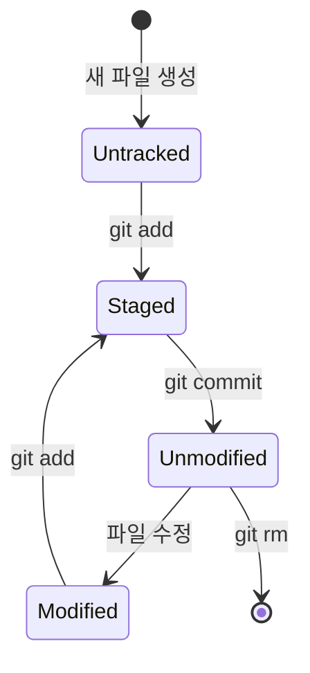

`git add`와 `git commit`이 무슨 일을 하는지 명령어 조합으로만 외운 사람은, 어느 날 `git commit -a`나 `git add -p` 같은 변형을 만나면 다시 헷갈리기 시작한다. 그 이유는 대개 "스테이징 영역"이라는 중간 단계를 건너뛰고 "add로 저장하고 commit으로 확정한다" 정도로만 이해하고 있기 때문이다. 이 장은 00장에서 짧게 언급했던 3단계 영역을 파일 상태 전이 관점에서 다시 정리한다.

## 개요

Git이 관리하는 모든 파일은 세 영역 중 하나에 놓인다.

| 영역 | 실체 | 역할 |
|---|---|---|
| 작업 트리(Working Tree) | 디스크 위의 실제 파일들 | 편집기로 직접 열어 수정하는 대상 |
| 스테이징 영역(Staging Area, Index) | `.git/index` 파일 | 다음 커밋에 포함할 변경 사항의 임시 목록 |
| 저장소(Repository, `.git/objects`) | 커밋 객체들의 그래프 | 확정되어 영구히 기록된 히스토리 |

이 세 영역이 분리되어 있다는 사실 자체가 Git의 워크플로를 결정한다. 파일을 수정한다고 곧바로 커밋되는 것이 아니라, 반드시 스테이징 영역을 거쳐야 한다 — 이 중간 단계 덕분에 작업 트리에서 10개 파일을 고쳤어도 그중 3개만 골라 하나의 커밋으로 묶고 나머지는 다음 커밋으로 미루는 일이 가능하다.

## 기본 개념

파일 하나가 이 세 영역을 오가며 가질 수 있는 상태는 Git 공식 문서가 정의하는 네 가지로 나뉜다: untracked(추적되지 않음), unmodified(추적되지만 변경 없음), modified(작업 트리에서 수정됨), staged(스테이징 영역에 등록됨). 이 상태들이 어떻게 전이되는지는 문단보다 그림으로 보는 편이 명확하다 — 상태가 4개, 전이가 순환하는 구조라 서술 순서만으로는 그림 없이 재구성하기 어렵기 때문이다.

이 다이어그램에서 주목할 점은 `git commit`이 끝나면 방금 커밋한 파일이 다시 "Unmodified" 상태로 돌아간다는 것이다. 즉 커밋은 스테이징 영역의 내용을 저장소에 영구히 기록하면서 동시에 스테이징 영역을 비우는 동작이다. 이 순환 구조를 알면 "커밋 후에 왜 스테이징 영역이 비어 있는가"라는 질문에 바로 답할 수 있다.

## 종류/세부

### 각 영역을 조회하는 명령

세 영역은 각각 대응하는 조회 명령이 있으며, 이 컬렉션의 2부에서 하나씩 자세히 다룬다.

| 영역 확인 대상 | 명령 | 다루는 장 |
|---|---|---|
| 작업 트리 vs 스테이징 영역의 차이 | `git diff` | 07장 |
| 스테이징 영역 vs 마지막 커밋의 차이 | `git diff --staged` | 07장 |
| 전체 상태 요약(어느 파일이 어느 영역에 있는지) | `git status` | 06장 |
| 저장소에 기록된 히스토리 | `git log` | 09장 |

`git diff`를 옵션 없이 실행하면 작업 트리와 스테이징 영역의 차이만 보여주고, 이미 `git add`로 스테이징한 변경은 표시되지 않는다는 점이 이 3단계 모델을 모르면 가장 자주 겪는 혼란이다. 스테이징된 내용까지 보려면 `--staged`(또는 `--cached`) 옵션이 필요하다.

### `git commit -a`가 스테이징을 건너뛴다는 오해

`git commit -a` 옵션은 이미 추적 중인(unmodified 상태였던 적이 있는) 파일의 수정 사항을 자동으로 스테이징한 뒤 커밋한다. 스테이징 단계 자체를 생략하는 것이 아니라, `git add`와 `git commit`을 한 번에 실행하는 축약형에 가깝다. 다만 이 옵션은 새로 생성된(untracked) 파일은 대상에 포함하지 않는다 — untracked 파일은 한 번도 저장소에 등록된 적이 없어 "이미 추적 중인 파일의 수정"이라는 조건에 해당하지 않기 때문이다.

## 주의사항·함정

**"저장했으니 백업된 것"이라는 오해**: 편집기에서 파일을 저장(Ctrl+S)하는 것은 작업 트리에만 반영되며, 아직 스테이징 영역에도 저장소에도 들어가지 않은 상태다. 컴퓨터가 갑자기 꺼지거나 실수로 되돌리기 명령을 실행하면 커밋되지 않은 작업 트리 변경은 손실될 수 있다. 중요한 작업 단위마다 `git add` + `git commit`으로 저장소에 기록해 두는 습관이 이 위험을 줄인다.

**스테이징 영역을 건드리는 명령의 이름이 직관적이지 않다**: 특정 파일을 스테이징에서 빼고 싶을 때(작업 트리 변경은 유지) 쓰는 명령은 최신 Git 버전(2.23 이상)에서 `git restore --staged <file>`이지만, 오래된 튜토리얼에는 `git reset HEAD <file>`로 소개되어 있다. 두 명령은 같은 동작을 하지만 이름이 달라 검색 결과마다 다른 명령이 나오는 경우가 있다. 이 컬렉션은 25장에서 `git restore`를, 23장에서 `git reset`을 각각 다룬다.

**`.gitignore`에 등록된 파일은 애초에 상태 전이에 나타나지 않는다**: untracked 파일 중 `.gitignore` 규칙에 걸리는 파일은 `git status`·`git add .` 같은 명령에서 아예 보이지 않는다. 이는 버그가 아니라 의도된 동작이며, 10장에서 `.gitignore` 작성 규칙을 다룬다.

## Reference

- [Git Basics - Recording Changes to the Repository](https://git-scm.com/book/en/v2/Git-Basics-Recording-Changes-to-the-Repository)
