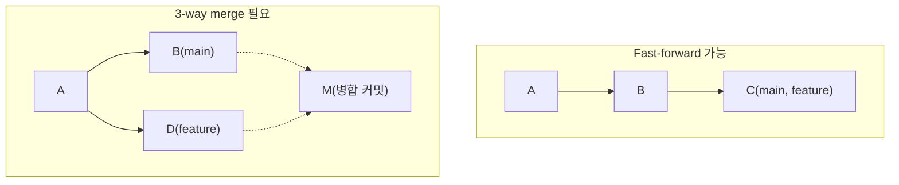

13장에서 다룬 `git merge`는 상황에 따라 완전히 다른 두 가지 방식으로 동작한다 — 어떤 병합은 병합 커밋조차 만들지 않고 조용히 끝나는가 하면, 어떤 병합은 새로운 커밋 하나를 반드시 만든다. 이 차이가 fast-forward와 3-way merge의 구분이며, 이를 모르면 "분명 merge했는데 왜 히스토리에 Merge 커밋이 안 보이지"라는 의문에 답할 수 없다.

## 개요

두 방식을 가르는 기준은 <strong>병합하려는 브랜치가 현재 브랜치의 직계 후손인가</strong>다.

| 상황 | 결과 |
|---|---|
| main 이후로 main 자체에는 새 커밋이 없고, feature만 앞서 나감 | Fast-forward: main 포인터를 feature의 최신 커밋으로 그냥 옮김 |
| main과 feature가 공통 조상에서 각자 새 커밋을 만듦 | 3-way merge: 새 병합 커밋을 만들어 두 히스토리를 합침 |

이 구분은 두 브랜치의 커밋 그래프 상 위치 관계로 정해지며, 문장만으로 재구성하기보다 그림으로 나란히 비교하는 편이 정확하다.



왼쪽처럼 main이 커밋 C 이후로 전혀 움직이지 않았다면, feature를 병합하는 것은 단순히 main이라는 이름표를 C(=feature의 최신 커밋)로 옮기는 것과 같다. 오른쪽처럼 main과 feature가 공통 조상 A에서 각자 갈라져 나갔다면, Git은 A(공통 조상)·B(main의 최신)·D(feature의 최신) 세 지점을 비교해 병합 결과를 계산하고, 그 결과를 새 커밋 M으로 기록한다. "3-way"라는 이름은 정확히 이 세 지점을 비교한다는 뜻에서 나왔다.

## 기본 개념

Fast-forward는 브랜치 포인터(11장에서 다룬 참조 파일)를 다시 쓰는 것 이상의 아무 계산도 필요 없으므로 매우 빠르고, 병합 커밋이 생기지 않아 히스토리가 마치 하나의 직선이었던 것처럼 보인다. 3-way merge는 세 스냅샷을 비교해 각 파일이 어떻게 달라졌는지 계산해야 하므로 13장에서 다룬 충돌이 발생할 여지가 있고, 결과적으로 두 부모를 가진 병합 커밋이 남는다.

## 종류/세부

### Fast-forward를 강제로 막기(`--no-ff`)

기능 브랜치를 병합할 때마다 "이 기능은 별도 브랜치에서 작업했다"는 사실 자체를 히스토리에 남기고 싶다면, fast-forward가 가능한 상황이라도 강제로 병합 커밋을 만들 수 있다.

```bash
git merge --no-ff feature/login
```

이렇게 하면 fast-forward 조건을 만족하더라도 항상 병합 커밋이 생겨, 나중에 `git log --graph`(09장)로 "이 기능이 언제 어느 브랜치에서 들어왔는가"를 명확히 구분해 볼 수 있다. GitHub의 Pull Request 병합 버튼 중 "Create a merge commit" 옵션이 내부적으로 이 방식을 쓴다.

### Fast-forward만 허용하기(`--ff-only`)

반대로 3-way merge 자체를 원치 않고, fast-forward가 불가능하면 실패시키고 싶은 경우도 있다.

```bash
git merge --ff-only feature/login
```

이 옵션은 병합 전에 브랜치를 최신 상태로 맞춰뒀는지 스스로 검증하는 용도로 CI 스크립트 등에서 종종 쓰인다 — 예상치 못한 3-way merge와 그에 따른 충돌 가능성을 원천적으로 차단한다.

## 주의사항·함정

**팀마다 `--no-ff` 기본 정책이 다르다**: 어떤 팀은 항상 병합 커밋을 남겨 "무슨 브랜치에서 왔는지" 추적하기 쉽게 하는 것을 선호하고, 어떤 팀은 fast-forward로 히스토리를 최대한 직선으로 유지하는 것을 선호한다. 팀에 합류했다면 이 정책부터 확인하는 편이 불필요한 논쟁을 줄인다 — Git 자체에는 정답이 없다.

**`git config --global merge.ff false`로 기본값을 바꾸면 다른 저장소에도 영향을 준다**: 이 설정을 전역으로 바꾸면 이후 모든 저장소에서 fast-forward가 가능한 상황에도 항상 병합 커밋이 생긴다. 프로젝트마다 정책이 다르다면 저장소별 로컬 설정(`--local`, 02장)으로 범위를 좁히는 편이 안전하다.

**Fast-forward는 브랜치 삭제와 자주 짝을 이룬다**: fast-forward 병합이 끝나면 feature 브랜치의 커밋은 이제 main에도 그대로 포함되어 있으므로, feature 브랜치 자체는 안전하게 삭제해도 커밋이 유실되지 않는다(11장의 `--merged` 옵션이 정확히 이런 브랜치를 찾아준다).

## Reference

- [Git Branching - Basic Branching and Merging](https://git-scm.com/book/en/v2/Git-Branching-Basic-Branching-and-Merging)
- [git-merge Documentation](https://git-scm.com/docs/git-merge)
