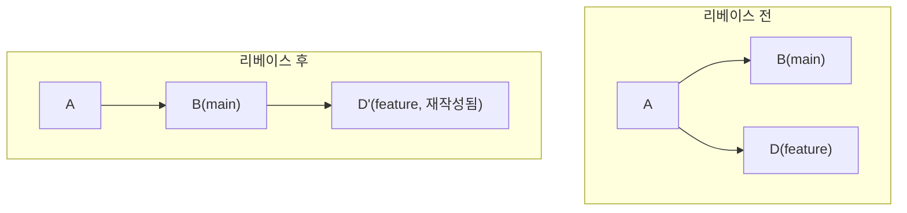

`git rebase`는 Git 명령 중 결과를 직관적으로 예측하기 가장 어려운 축에 속한다. `git merge`처럼 두 히스토리를 "합치는" 것이 아니라, 커밋을 실제로 다시 만들어 다른 기반(base) 위에 순서대로 다시 쌓는다. 이 장은 그 재적용 과정을 단계별로 뜯어보고, 16장에서 다룰 merge와의 선택 기준을 위한 토대를 놓는다.

## 개요

`main`이 `feature` 브랜치가 갈라진 이후로 앞서 나갔을 때, `feature`를 `main`의 최신 지점 위로 옮겨 쌓는 것이 리베이스다.

```bash
git switch feature
git rebase main
```

이 명령은 `feature`에만 있던 커밋들을 하나씩 꺼내, `main`의 최신 커밋 바로 뒤에 순서대로 다시 적용한다. 결과적으로 `feature`는 마치 처음부터 `main`의 최신 지점에서 갈라져 나가 작업한 것처럼 보이는 직선 히스토리를 갖게 된다.

## 기본 개념

14장의 그림을 다시 가져오면, 3-way merge는 두 갈래를 그대로 둔 채 병합 커밋 하나로 합쳤다. 리베이스는 접근이 다르다 — `feature`의 커밋들을 <strong>원본 그대로 옮기는 것이 아니라 내용은 같지만 해시가 다른 새 커밋으로 재작성</strong>해 `main`의 끝에 이어 붙인다.



`D`가 `D'`으로 바뀌었다는 점이 핵심이다 — 커밋 내용(diff)은 같아도 부모 커밋이 달라졌으므로 해시(SHA-1)도 완전히 새로 계산된다. 이 사실이 아래 "주의사항"에서 다루는 가장 중요한 규칙(공유된 커밋을 리베이스하지 않는다)의 근거가 된다.

## 종류/세부

### 리베이스 중 충돌 해결

리베이스도 병합과 마찬가지로 충돌이 날 수 있다. 다만 절차가 다르다 — 병합은 충돌 하나를 해결하면 끝나지만, 리베이스는 옮기는 커밋 하나하나마다 별도로 충돌이 날 수 있어 여러 번 반복될 수 있다.

```bash
git rebase main
# 충돌 발생 시:
#   1. 충돌 마커(13장과 동일한 형식)를 해결
git add resolved-file.js
git rebase --continue    # 다음 커밋으로 진행
# 또는
git rebase --skip        # 현재 커밋 자체를 건너뛰기(드물게 사용)
git rebase --abort        # 리베이스 시작 전 상태로 완전히 되돌리기
```

`--abort`는 13장의 `merge --abort`와 마찬가지로 안전망 역할을 한다 — 리베이스 도중 예상보다 충돌이 많거나 복잡하다고 판단되면 언제든 시작 전 상태로 돌아갈 수 있다.

### 대화형 리베이스 미리보기

리베이스에는 단순히 브랜치를 옮기는 것 외에, 옮기는 과정에서 커밋을 합치거나 순서를 바꾸거나 메시지를 고치는 대화형 모드(`-i`)가 있다. 이 강력한 기능은 27장에서 별도로 자세히 다룬다.

```bash
git rebase -i HEAD~3   # 최근 3개 커밋을 대화형으로 재정리(27장에서 이어서 다룬다)
```

### `--onto`로 임의의 기반 지정

기본 `git rebase main`은 현재 브랜치가 `main`에서 갈라진 지점을 자동으로 찾아 그 이후 커밋들만 옮긴다. 더 세밀하게 "어느 지점부터 어느 지점까지를 어디로 옮길지" 지정하고 싶다면 `--onto`를 쓴다. 세부 사용법은 이 컬렉션의 범위를 넘는 고급 시나리오(브랜치 재구성)에 해당하므로 여기서는 존재만 언급한다.

## 주의사항·함정

**이미 원격에 push해 다른 사람이 pull한 커밋은 리베이스하지 않는다**: 위에서 설명했듯 리베이스는 커밋을 새 해시로 재작성한다. 이미 공유된 커밋을 리베이스하면, 그 커밋을 pull해간 협업자의 로컬 히스토리에는 옛 커밋이 남아 있고 원격에는 새 커밋이 올라가, 다음 pull에서 중복되거나 꼬인 히스토리가 만들어진다. Git 커뮤니티에서 널리 통용되는 "황금률"은 "아직 공유하지 않은 로컬 커밋만 리베이스하라"는 것이다.

**리베이스 후 push는 강제 push가 필요하다**: 로컬에서 이미 원격에 올라간 커밋을 리베이스했다면(위 규칙을 어겼거나, 자신만 쓰는 브랜치라 의도한 경우), 커밋 해시가 달라졌으므로 일반 `git push`는 거부된다. `git push --force-with-lease`가 필요하며, 이는 20장에서 다룬다. 이 강제 push 자체가 위 규칙을 어겼을 때의 위험 신호이기도 하다.

**충돌이 커밋마다 반복되면 리베이스가 병합보다 번거로울 수 있다**: 두 브랜치가 오래 갈라져 있었고 같은 파일을 여러 번 겹쳐 수정했다면, 리베이스는 옮기는 커밋 수만큼 충돌 해결을 반복해야 할 수 있다. 이런 상황에서는 한 번의 충돌 해결로 끝나는 3-way merge가 실용적으로 더 나을 수 있으며, 이 판단 기준은 16장에서 정리한다.

## Reference

- [git-rebase Documentation](https://git-scm.com/docs/git-rebase)
